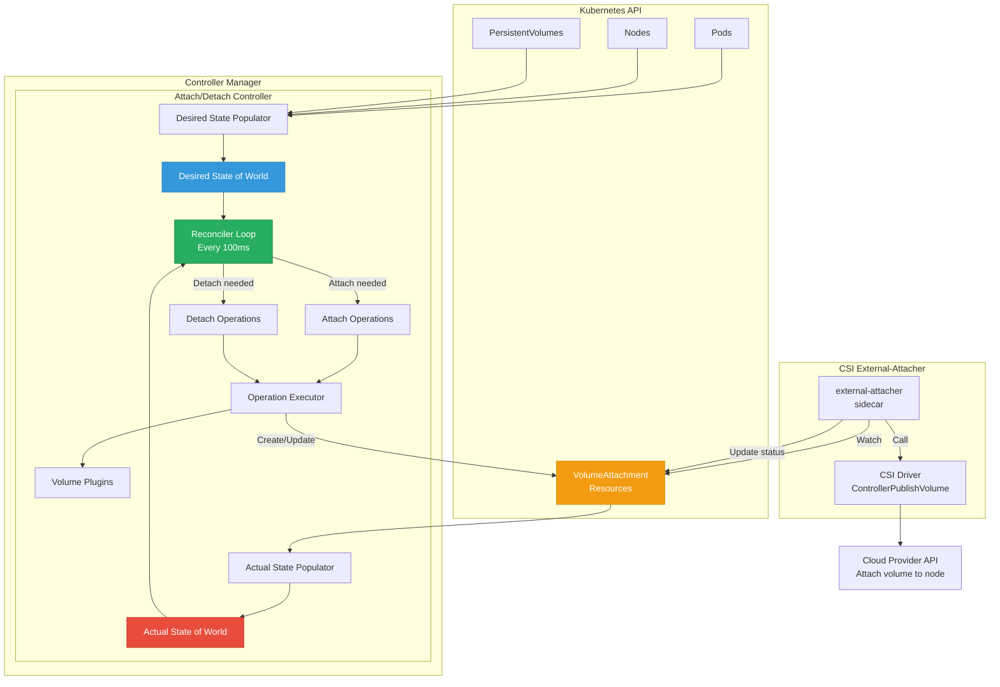
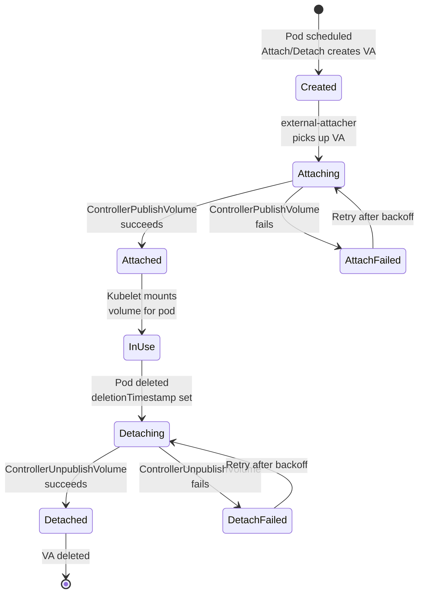
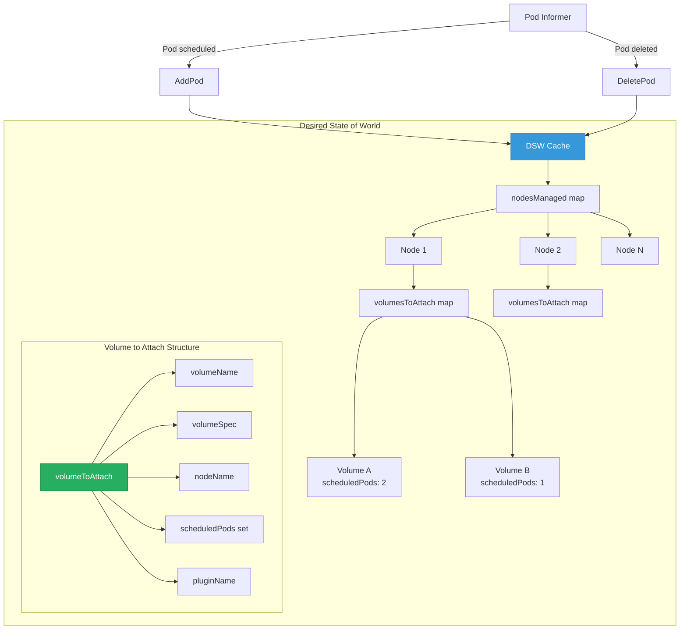
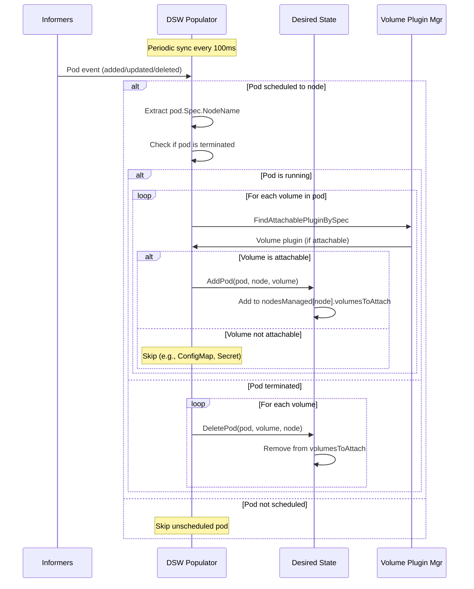
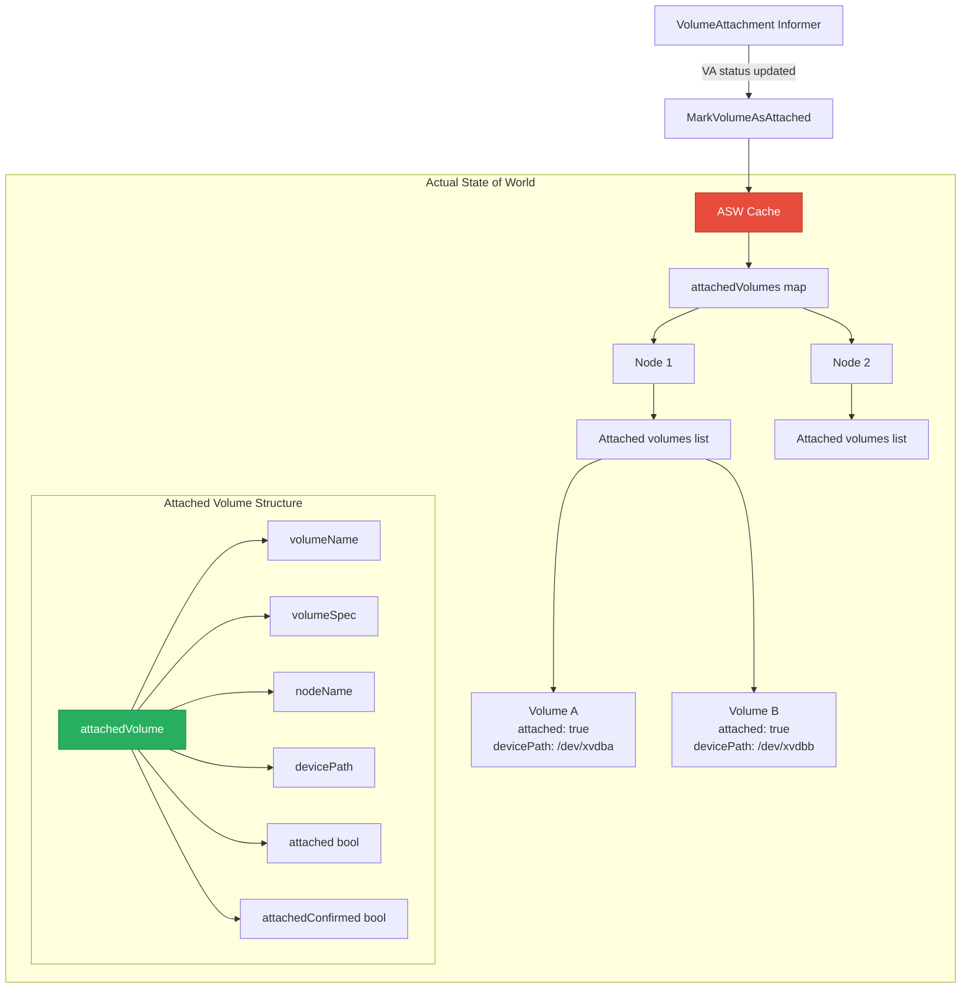
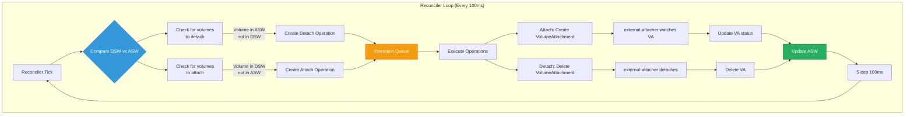
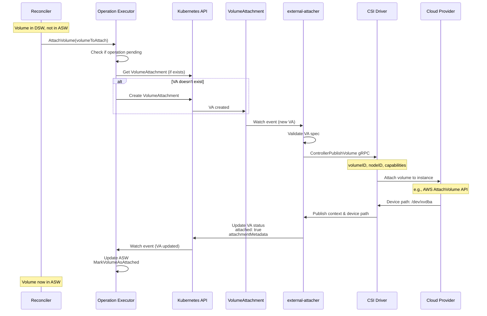
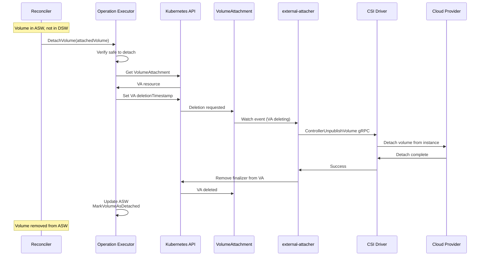
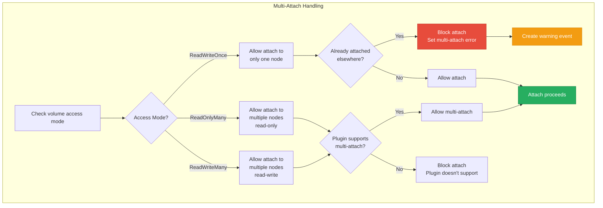

# **Attach/Detach Controller**

━━━━━━━━━━━━━━━━━━━━━━━━━━━━━━━━━━━━━━━━━━━━━━━━━━━━━━━━━━━━━━━━━━━━━━━━━━━━━

## **📋 Document Overview**

**Purpose**: Complete guide to the attach/detach controller, VolumeAttachment resource lifecycle, and cluster-level volume attachment operations.

**Scope**:
- Attach/detach controller architecture and responsibilities
- VolumeAttachment resource lifecycle
- Desired state populator and actual state reconciler
- Attach and detach operation workflows
- Multi-attach volume support
- Node status synchronization
- Error handling and retry mechanisms
- Performance characteristics and optimization

**Target Audience**: Platform engineers, storage administrators, developers working on volume plugins

━━━━━━━━━━━━━━━━━━━━━━━━━━━━━━━━━━━━━━━━━━━━━━━━━━━━━━━━━━━━━━━━━━━━━━━━━━━━━

## **🎯 Attach/Detach Controller Architecture**

### **High-Level Overview**

The attach/detach controller runs in the controller-manager and handles cluster-level volume attach/detach operations, separating these concerns from kubelet.



### **Why Separate Attach/Detach from Kubelet?**

**File**: `/pkg/controller/volume/attachdetach/attach_detach_controller.go:60-100`

```go
// AttachDetachController is responsible for attaching and detaching volumes
// to nodes. It does this by watching for new pods and new nodes and ensuring
// volumes are attached to the nodes that pods are scheduled to, and detached
// from nodes when pods no longer need the volumes.
//
// Separating attach/detach from kubelet provides several benefits:
// 1. Reduce kubelet complexity - kubelet focuses on node-local operations
// 2. Better failure isolation - attach failures don't affect kubelet
// 3. Cross-node volume migration - volumes can be preemptively detached
// 4. Centralized attach logic - easier to reason about cluster-wide state
// 5. Faster pod scheduling - attach can start before pod binds to node

type AttachDetachController struct {
    // Cloud provider interface for attach/detach operations
    cloud cloudprovider.Interface

    // pvcLister can list/get PVCs from the shared informer's store
    pvcLister corelisters.PersistentVolumeClaimLister

    // pvLister can list/get PVs from the shared informer's store
    pvLister corelisters.PersistentVolumeLister

    // podLister can list/get pods from the shared informer's store
    podLister corelisters.PodLister

    // nodeLister can list/get nodes from the shared informer's store
    nodeLister corelisters.NodeLister

    // volumeAttachmentLister can list/get VolumeAttachments
    volumeAttachmentLister storagelistersv1.VolumeAttachmentLister

    // desiredStateOfWorld is a cache containing the desired state of the world
    // according to the controller
    desiredStateOfWorld cache.DesiredStateOfWorld

    // actualStateOfWorld is a cache containing the actual state of the world
    // according to the controller
    actualStateOfWorld cache.ActualStateOfWorld

    // reconciler runs an asynchronous periodic loop to reconcile the
    // desiredStateOfWorld with the actualStateOfWorld
    reconciler reconciler.Reconciler

    // desiredStateOfWorldPopulator runs an asynchronous periodic loop to
    // populate the desiredStateOfWorld using informers
    desiredStateOfWorldPopulator populator.DesiredStateOfWorldPopulator

    // volumePluginMgr is the volume plugin manager
    volumePluginMgr *volume.VolumePluginMgr

    // recorder is used to record events in the API server
    recorder record.EventRecorder
}

// Run starts the attach detach controller
func (adc *AttachDetachController) Run(stopCh <-chan struct{}) {
    defer runtime.HandleCrash()
    defer adc.desiredStateOfWorldPopulator.Stop()

    klog.InfoS("Starting attach detach controller")
    defer klog.InfoS("Shutting down attach detach controller")

    // Start desired state of world populator
    go adc.desiredStateOfWorldPopulator.Run(stopCh)

    // Start reconciler
    go adc.reconciler.Run(stopCh)

    // Wait for shutdown signal
    <-stopCh
}
```

**Benefits of Centralized Attach**:
1. **Kubelet Simplicity**: Kubelet only handles node-local mount/unmount
2. **Better Failure Handling**: Attach failures don't block kubelet
3. **Preemptive Operations**: Volumes can be attached before pod scheduling completes
4. **Cross-Node Coordination**: Handle volumes moving between nodes
5. **Consistent State**: Single source of truth for attachment state

━━━━━━━━━━━━━━━━━━━━━━━━━━━━━━━━━━━━━━━━━━━━━━━━━━━━━━━━━━━━━━━━━━━━━━━━━━━━━

## **📦 VolumeAttachment Resource**

### **VolumeAttachment Lifecycle**



### **VolumeAttachment Resource Structure**

**File**: `/staging/src/k8s.io/api/storage/v1/types.go:450-530`

```go
// VolumeAttachment captures the intent to attach or detach the specified volume
// to/from the specified node.
//
// VolumeAttachment objects are non-namespaced.
type VolumeAttachment struct {
    metav1.TypeMeta `json:",inline"`

    // Standard object metadata
    metav1.ObjectMeta `json:"metadata,omitempty"`

    // Specification of the desired attach/detach behavior
    Spec VolumeAttachmentSpec `json:"spec"`

    // Status of the VolumeAttachment request
    Status VolumeAttachmentStatus `json:"status,omitempty"`
}

// VolumeAttachmentSpec is the specification of a VolumeAttachment request
type VolumeAttachmentSpec struct {
    // Attacher indicates the name of the volume driver that MUST handle this
    // request. This is the name returned by GetPluginName().
    Attacher string `json:"attacher"`

    // Source represents the volume that should be attached
    Source VolumeAttachmentSource `json:"source"`

    // NodeName is the name of the node that the volume should be attached to
    NodeName string `json:"nodeName"`
}

// VolumeAttachmentSource represents a volume that should be attached
type VolumeAttachmentSource struct {
    // PersistentVolumeName represents the PV that should be attached
    // +optional
    PersistentVolumeName *string `json:"persistentVolumeName,omitempty"`

    // InlineVolumeSpec is an inline definition of the volume that should be attached
    // +optional
    InlineVolumeSpec *v1.PersistentVolumeSpec `json:"inlineVolumeSpec,omitempty"`
}

// VolumeAttachmentStatus is the status of a VolumeAttachment request
type VolumeAttachmentStatus struct {
    // Attached indicates the volume is successfully attached
    Attached bool `json:"attached"`

    // AttachmentMetadata is populated with any information returned by the
    // attach operation, upon successful attach, that must be passed into
    // subsequent WaitForAttach or Mount calls.
    // This field must only be set by the entity completing the attach operation
    // +optional
    AttachmentMetadata map[string]string `json:"attachmentMetadata,omitempty"`

    // AttachError represents the last error encountered during attach operation
    // +optional
    AttachError *VolumeError `json:"attachError,omitempty"`

    // DetachError represents the last error encountered during detach operation
    // +optional
    DetachError *VolumeError `json:"detachError,omitempty"`
}

// VolumeError captures an error encountered during attach/detach
type VolumeError struct {
    // Time the error was encountered
    Time metav1.Time `json:"time,omitempty"`

    // Message is a human-readable description of the error
    Message string `json:"message,omitempty"`
}
```

### **VolumeAttachment Example**

```yaml
apiVersion: storage.k8s.io/v1
kind: VolumeAttachment
metadata:
  name: csi-aws-ebs-vol-abc123-node-xyz789
  annotations:
    csi.alpha.kubernetes.io/node-id: "i-0abc123def456"
spec:
  attacher: ebs.csi.aws.com
  nodeName: ip-10-0-1-50.us-west-2.compute.internal
  source:
    persistentVolumeName: pvc-1234-5678-abcd-efgh
status:
  attached: true
  attachmentMetadata:
    devicePath: "/dev/xvdba"
    volumeContext.csi.alpha.kubernetes.io/zone: "us-west-2a"
```

━━━━━━━━━━━━━━━━━━━━━━━━━━━━━━━━━━━━━━━━━━━━━━━━━━━━━━━━━━━━━━━━━━━━━━━━━━━━━

## **💾 Desired State of World**

### **DSW Structure**

The desired state represents which volumes should be attached to which nodes based on pod scheduling.



**File**: `/pkg/controller/volume/attachdetach/cache/desired_state_of_world.go:60-180`

```go
// DesiredStateOfWorld defines the set of volumes that should be attached to nodes
type DesiredStateOfWorld interface {
    // AddPod adds the given pod and its volumes to the desired state
    AddPod(pod *v1.Pod, nodeName types.NodeName, volumeSpec *volume.Spec, podName volumetypes.UniquePodName) (v1.UniqueVolumeName, error)

    // DeletePod removes the given pod from the desired state
    DeletePod(podName volumetypes.UniquePodName, volumeName v1.UniqueVolumeName, nodeName types.NodeName)

    // NodeExists returns true if the given node exists in the desired state
    NodeExists(nodeName types.NodeName) bool

    // VolumeExists returns true if the given volume exists for the given node
    VolumeExists(volumeName v1.UniqueVolumeName, nodeName types.NodeName) bool

    // GetVolumesToAttach returns a list of volumes that should be attached
    GetVolumesToAttach() []VolumeToAttach

    // GetVolumeTrackerList returns the list of volumes and the pods that reference them
    GetVolumeTrackerList() map[types.NodeName][]AttachedVolume

    // AddNode adds the given node to the list of managed nodes
    AddNode(nodeName types.NodeName, keepTerminatedPodVolumes bool)

    // DeleteNode removes the given node from the list of managed nodes
    DeleteNode(nodeName types.NodeName)

    // GetPodToAdd returns the UniquePodName that has not been added yet
    GetPodToAdd() map[volumetypes.UniquePodName]PodToAdd
}

// VolumeToAttach represents a volume that should be attached to a node
type VolumeToAttach struct {
    // VolumeName is the unique identifier for the volume
    VolumeName v1.UniqueVolumeName

    // VolumeSpec is the volume spec
    VolumeSpec *volume.Spec

    // NodeName is the name of the node to attach the volume to
    NodeName types.NodeName

    // ScheduledPods is a map of pod names that reference this volume
    ScheduledPods map[volumetypes.UniquePodName]types.UniquePodName

    // PluginIsAttachable indicates whether the plugin requires attach
    PluginIsAttachable bool

    // PluginName is the name of the volume plugin
    PluginName string

    // VolumeGidValue is the GID that should own the volume
    VolumeGidValue string

    // ReportedInUse indicates if this volume is reported in use
    ReportedInUse bool
}

// desiredStateOfWorld is a thread-safe implementation of DesiredStateOfWorld
type desiredStateOfWorld struct {
    // nodesManaged is a map of node names to node objects
    nodesManaged map[types.NodeName]nodeManaged

    // volumePluginMgr is the volume plugin manager
    volumePluginMgr *volume.VolumePluginMgr

    sync.RWMutex
}

// nodeManaged represents a node that is being managed
type nodeManaged struct {
    nodeName                   types.NodeName
    volumesToAttach            map[v1.UniqueVolumeName]volumeToAttach
    keepTerminatedPodVolumes   bool
}

// volumeToAttach represents a volume that should be attached to a node
type volumeToAttach struct {
    volumeName         v1.UniqueVolumeName
    spec               *volume.Spec
    nodeName           types.NodeName
    scheduledPods      map[volumetypes.UniquePodName]types.UniquePodName
    pluginIsAttachable bool
    volumeGidValue     string
    reportedInUse      bool
    pluginName         string
}

// AddPod adds a pod and its volumes to the desired state
func (dsw *desiredStateOfWorld) AddPod(
    pod *v1.Pod,
    nodeName types.NodeName,
    volumeSpec *volume.Spec,
    podName volumetypes.UniquePodName,
) (v1.UniqueVolumeName, error) {
    dsw.Lock()
    defer dsw.Unlock()

    // Ensure node exists in managed nodes
    if _, nodeExists := dsw.nodesManaged[nodeName]; !nodeExists {
        return "", fmt.Errorf("node %q not found in list of managed nodes", nodeName)
    }

    // Get volume plugin
    attachableVolumePlugin, err := dsw.volumePluginMgr.FindAttachablePluginBySpec(volumeSpec)
    if err != nil || attachableVolumePlugin == nil {
        return "", fmt.Errorf("failed to get attachable volume plugin for volume %q: %v",
            volumeSpec.Name(), err)
    }

    // Get unique volume name
    volumeName, err := volumeutil.GetUniqueVolumeNameFromSpec(
        attachableVolumePlugin,
        volumeSpec)
    if err != nil {
        return "", fmt.Errorf("failed to get unique volume name: %v", err)
    }

    // Get or create volume entry
    node := dsw.nodesManaged[nodeName]
    volumeObj, volumeExists := node.volumesToAttach[volumeName]

    if !volumeExists {
        // Create new volume entry
        volumeObj = volumeToAttach{
            volumeName:         volumeName,
            spec:               volumeSpec,
            nodeName:           nodeName,
            scheduledPods:      make(map[volumetypes.UniquePodName]types.UniquePodName),
            pluginIsAttachable: true,
            pluginName:         attachableVolumePlugin.GetPluginName(),
        }
    }

    // Add pod to scheduled pods
    volumeObj.scheduledPods[podName] = pod.UID

    // Update volume in node
    node.volumesToAttach[volumeName] = volumeObj
    dsw.nodesManaged[nodeName] = node

    klog.V(4).InfoS("Added pod to volume in desired state",
        "pod", podName,
        "volumeName", volumeName,
        "node", nodeName)

    return volumeName, nil
}

// DeletePod removes a pod from the desired state
func (dsw *desiredStateOfWorld) DeletePod(
    podName volumetypes.UniquePodName,
    volumeName v1.UniqueVolumeName,
    nodeName types.NodeName,
) {
    dsw.Lock()
    defer dsw.Unlock()

    node, nodeExists := dsw.nodesManaged[nodeName]
    if !nodeExists {
        return
    }

    volumeObj, volumeExists := node.volumesToAttach[volumeName]
    if !volumeExists {
        return
    }

    // Remove pod from scheduled pods
    delete(volumeObj.scheduledPods, podName)

    // If no more pods, remove volume
    if len(volumeObj.scheduledPods) == 0 &&
        !node.keepTerminatedPodVolumes {
        delete(node.volumesToAttach, volumeName)
        klog.V(4).InfoS("Removed volume from node in desired state",
            "volumeName", volumeName,
            "node", nodeName)
    } else {
        node.volumesToAttach[volumeName] = volumeObj
    }

    dsw.nodesManaged[nodeName] = node

    klog.V(4).InfoS("Removed pod from volume in desired state",
        "pod", podName,
        "volumeName", volumeName,
        "node", nodeName)
}
```

### **DSW Population**



**File**: `/pkg/controller/volume/attachdetach/populator/desired_state_of_world_populator.go:150-280`

```go
// Run starts the populator loop
func (dswp *desiredStateOfWorldPopulator) Run(stopCh <-chan struct{}) {
    wait.Until(dswp.populatorLoopFunc(), dswp.loopSleepDuration, stopCh)
}

// populatorLoopFunc is the main loop function
func (dswp *desiredStateOfWorldPopulator) populatorLoopFunc() func() {
    return func() {
        dswp.findAndAddActivePods()
        dswp.findAndRemoveDeletedPods()
    }
}

// findAndAddActivePods finds active pods and adds their volumes to desired state
func (dswp *desiredStateOfWorldPopulator) findAndAddActivePods() {
    pods, err := dswp.podLister.List(labels.Everything())
    if err != nil {
        klog.ErrorS(err, "Failed to list pods")
        return
    }

    for _, pod := range pods {
        if pod.Spec.NodeName == "" {
            // Pod not scheduled to a node yet
            continue
        }

        // Skip if pod is in terminal state
        if util.IsPodTerminated(pod, pod.Status) {
            continue
        }

        // Process volumes for this pod
        dswp.processPodVolumes(pod)
    }
}

// processPodVolumes processes all volumes for a pod
func (dswp *desiredStateOfWorldPopulator) processPodVolumes(pod *v1.Pod) {
    // Ensure node exists in desired state
    if !dswp.desiredStateOfWorld.NodeExists(types.NodeName(pod.Spec.NodeName)) {
        dswp.desiredStateOfWorld.AddNode(
            types.NodeName(pod.Spec.NodeName),
            false) // keepTerminatedPodVolumes
    }

    uniquePodName := util.GetUniquePodName(pod)

    // Process each volume in the pod
    for _, podVolume := range pod.Spec.Volumes {
        // Create volume spec
        volumeSpec, err := dswp.createVolumeSpec(podVolume, pod)
        if err != nil {
            klog.ErrorS(err, "Failed to create volume spec",
                "pod", klog.KObj(pod),
                "volume", podVolume.Name)
            continue
        }

        // Check if volume requires attach
        attachableVolumePlugin, err := dswp.volumePluginMgr.FindAttachablePluginBySpec(volumeSpec)
        if err != nil || attachableVolumePlugin == nil {
            // Volume doesn't require attach (e.g., ConfigMap, Secret, EmptyDir)
            klog.V(10).InfoS("Volume does not require attach",
                "pod", klog.KObj(pod),
                "volume", podVolume.Name)
            continue
        }

        // Add pod to desired state
        _, err = dswp.desiredStateOfWorld.AddPod(
            pod,
            types.NodeName(pod.Spec.NodeName),
            volumeSpec,
            uniquePodName)

        if err != nil {
            klog.ErrorS(err, "Failed to add pod to desired state",
                "pod", klog.KObj(pod),
                "volume", podVolume.Name)
            continue
        }

        klog.V(10).InfoS("Added pod to desired state",
            "pod", klog.KObj(pod),
            "volume", podVolume.Name,
            "node", pod.Spec.NodeName)
    }
}

// findAndRemoveDeletedPods removes terminated pods from desired state
func (dswp *desiredStateOfWorldPopulator) findAndRemoveDeletedPods() {
    // Get all volumes in desired state
    volumesToAttach := dswp.desiredStateOfWorld.GetVolumesToAttach()

    for _, volumeToAttach := range volumesToAttach {
        // Check each pod using this volume
        for scheduledPod := range volumeToAttach.ScheduledPods {
            pod, err := dswp.podLister.Pods(scheduledPod.Namespace).Get(scheduledPod.Name)

            shouldDelete := false
            if err != nil && errors.IsNotFound(err) {
                // Pod no longer exists
                shouldDelete = true
            } else if pod != nil && util.IsPodTerminated(pod, pod.Status) {
                // Pod is terminated
                shouldDelete = true
            }

            if shouldDelete {
                dswp.desiredStateOfWorld.DeletePod(
                    scheduledPod,
                    volumeToAttach.VolumeName,
                    volumeToAttach.NodeName)

                klog.V(4).InfoS("Removed terminated pod from desired state",
                    "pod", scheduledPod,
                    "volumeName", volumeToAttach.VolumeName,
                    "node", volumeToAttach.NodeName)
            }
        }
    }
}
```

━━━━━━━━━━━━━━━━━━━━━━━━━━━━━━━━━━━━━━━━━━━━━━━━━━━━━━━━━━━━━━━━━━━━━━━━━━━━━

## **📊 Actual State of World**

### **ASW Structure**

The actual state tracks which volumes are actually attached to nodes based on VolumeAttachment resources.



**File**: `/pkg/controller/volume/attachdetach/cache/actual_state_of_world.go:60-180`

```go
// ActualStateOfWorld defines the set of volumes that are actually attached to nodes
type ActualStateOfWorld interface {
    // MarkVolumeAsAttached marks the specified volume as attached to the specified node
    MarkVolumeAsAttached(
        logger klog.Logger,
        volumeName v1.UniqueVolumeName,
        volumeSpec *volume.Spec,
        nodeName types.NodeName,
        devicePath string) error

    // MarkVolumeAsDetached marks the specified volume as detached from the specified node
    MarkVolumeAsDetached(volumeName v1.UniqueVolumeName, nodeName types.NodeName) error

    // MarkVolumeAsUncertain marks the specified volume as uncertain
    MarkVolumeAsUncertain(
        logger klog.Logger,
        volumeName v1.UniqueVolumeName,
        volumeSpec *volume.Spec,
        nodeName types.NodeName) error

    // IsVolumeAttached returns true if the specified volume is attached to the specified node
    IsVolumeAttached(volumeName v1.UniqueVolumeName, nodeName types.NodeName) bool

    // GetAttachedVolumes returns a list of volumes attached to the specified node
    GetAttachedVolumes() []AttachedVolume

    // GetAttachedVolumesForNode returns a list of volumes attached to the specified node
    GetAttachedVolumesForNode(nodeName types.NodeName) []AttachedVolume

    // GetNodesForAttachedVolume returns a list of nodes that the specified volume is attached to
    GetNodesForAttachedVolume(volumeName v1.UniqueVolumeName) []types.NodeName

    // AddVolumeNode adds the specified volume and node to the cache
    AddVolumeNode(
        volumeName v1.UniqueVolumeName,
        volumeSpec *volume.Spec,
        nodeName types.NodeName,
        devicePath string) error

    // DeleteVolumeNode removes the specified volume and node from the cache
    DeleteVolumeNode(volumeName v1.UniqueVolumeName, nodeName types.NodeName)

    // GetDevicePath returns the device path for the specified volume on the specified node
    GetDevicePath(volumeName v1.UniqueVolumeName, nodeName types.NodeName) (string, error)

    // GetMultiAttachErrorForVolume returns multi-attach error for volume
    GetMultiAttachErrorForVolume(volumeName v1.UniqueVolumeName) error

    // MarkMultiAttachError marks a multi-attach error for volume
    MarkMultiAttachError(
        logger klog.Logger,
        volumeName v1.UniqueVolumeName,
        reason string)
}

// AttachedVolume represents a volume that is attached to a node
type AttachedVolume struct {
    // VolumeName is the unique identifier for the volume
    VolumeName v1.UniqueVolumeName

    // VolumeSpec is the volume spec
    VolumeSpec *volume.Spec

    // NodeName is the name of the node the volume is attached to
    NodeName types.NodeName

    // PluginName is the name of the volume plugin
    PluginName string

    // DevicePath is the path to the device
    DevicePath string

    // AttachRequestTime is the time attach was requested
    AttachRequestTime time.Time

    // AttachedConfirmed indicates if attach has been confirmed
    AttachedConfirmed bool
}

// actualStateOfWorld is a thread-safe implementation
type actualStateOfWorld struct {
    // attachedVolumes is a map of node name to attached volumes
    attachedVolumes map[types.NodeName]map[v1.UniqueVolumeName]attachedVolume

    // volumePluginMgr is the volume plugin manager
    volumePluginMgr *volume.VolumePluginMgr

    sync.RWMutex
}

// attachedVolume represents a volume attached to a node
type attachedVolume struct {
    volumeName          v1.UniqueVolumeName
    spec                *volume.Spec
    nodeName            types.NodeName
    devicePath          string
    pluginName          string
    attachRequestTime   time.Time
    attachedConfirmed   bool
    multiAttachError    error
}

// MarkVolumeAsAttached marks a volume as attached
func (asw *actualStateOfWorld) MarkVolumeAsAttached(
    logger klog.Logger,
    volumeName v1.UniqueVolumeName,
    volumeSpec *volume.Spec,
    nodeName types.NodeName,
    devicePath string,
) error {
    asw.Lock()
    defer asw.Unlock()

    // Get node's attached volumes
    nodeVolumes, nodeExists := asw.attachedVolumes[nodeName]
    if !nodeExists {
        nodeVolumes = make(map[v1.UniqueVolumeName]attachedVolume)
        asw.attachedVolumes[nodeName] = nodeVolumes
    }

    // Get or create volume entry
    volumeObj, volumeExists := nodeVolumes[volumeName]
    if !volumeExists {
        // Get volume plugin
        plugin, err := asw.volumePluginMgr.FindAttachablePluginBySpec(volumeSpec)
        if err != nil || plugin == nil {
            return fmt.Errorf("failed to get volume plugin: %v", err)
        }

        volumeObj = attachedVolume{
            volumeName:        volumeName,
            spec:              volumeSpec,
            nodeName:          nodeName,
            pluginName:        plugin.GetPluginName(),
            devicePath:        devicePath,
            attachRequestTime: time.Now(),
        }
    }

    // Mark as attached
    volumeObj.devicePath = devicePath
    volumeObj.attachedConfirmed = true

    // Update in map
    nodeVolumes[volumeName] = volumeObj
    asw.attachedVolumes[nodeName] = nodeVolumes

    logger.V(4).Info("Marked volume as attached",
        "volumeName", volumeName,
        "node", nodeName,
        "devicePath", devicePath)

    return nil
}

// MarkVolumeAsDetached marks a volume as detached
func (asw *actualStateOfWorld) MarkVolumeAsDetached(
    volumeName v1.UniqueVolumeName,
    nodeName types.NodeName,
) error {
    asw.Lock()
    defer asw.Unlock()

    nodeVolumes, nodeExists := asw.attachedVolumes[nodeName]
    if !nodeExists {
        return nil
    }

    // Remove volume from node
    delete(nodeVolumes, volumeName)

    // Remove node if no more volumes
    if len(nodeVolumes) == 0 {
        delete(asw.attachedVolumes, nodeName)
    } else {
        asw.attachedVolumes[nodeName] = nodeVolumes
    }

    klog.V(4).InfoS("Marked volume as detached",
        "volumeName", volumeName,
        "node", nodeName)

    return nil
}
```

━━━━━━━━━━━━━━━━━━━━━━━━━━━━━━━━━━━━━━━━━━━━━━━━━━━━━━━━━━━━━━━━━━━━━━━━━━━━━

## **🔄 Reconciler and Attach/Detach Operations**

### **Reconciliation Loop**



**File**: `/pkg/controller/volume/attachdetach/reconciler/reconciler.go:100-220`

```go
// Reconciler runs a periodic loop to reconcile the desired state with actual state
type Reconciler interface {
    // Run starts the reconcile loop
    Run(stopCh <-chan struct{})
}

type reconciler struct {
    loopPeriod              time.Duration
    maxAttachRetries        int
    desiredStateOfWorld     cache.DesiredStateOfWorld
    actualStateOfWorld      cache.ActualStateOfWorld
    operationExecutor       operationexecutor.OperationExecutor
    recorder                record.EventRecorder
}

// Run starts the reconciliation loop
func (rc *reconciler) Run(stopCh <-chan struct{}) {
    wait.Until(rc.reconciliationLoopFunc(), rc.loopPeriod, stopCh)
}

// reconciliationLoopFunc is the main reconciliation function
func (rc *reconciler) reconciliationLoopFunc() func() {
    return func() {
        rc.reconcile()
    }
}

// reconcile performs the actual reconciliation
func (rc *reconciler) reconcile() {
    // First, detach volumes that should no longer be attached
    for _, attachedVolume := range rc.actualStateOfWorld.GetAttachedVolumes() {
        if !rc.desiredStateOfWorld.VolumeExists(
            attachedVolume.VolumeName,
            attachedVolume.NodeName) {
            // Volume is attached but no longer desired
            rc.detachVolume(attachedVolume)
        }
    }

    // Then, attach volumes that should be attached
    for _, volumeToAttach := range rc.desiredStateOfWorld.GetVolumesToAttach() {
        if !rc.actualStateOfWorld.IsVolumeAttached(
            volumeToAttach.VolumeName,
            volumeToAttach.NodeName) {
            // Volume should be attached but isn't
            rc.attachVolume(volumeToAttach)
        }
    }

    // Update node status
    rc.nodeStatusUpdater.UpdateNodeStatuses()
}

// attachVolume triggers the attach operation
func (rc *reconciler) attachVolume(volumeToAttach cache.VolumeToAttach) {
    // Check if operation is already pending
    operationName := fmt.Sprintf("attach-%s-%s",
        volumeToAttach.VolumeName,
        volumeToAttach.NodeName)

    klog.V(5).InfoS("Starting attach operation",
        "volumeName", volumeToAttach.VolumeName,
        "node", volumeToAttach.NodeName)

    // Execute attach operation
    err := rc.operationExecutor.AttachVolume(
        volumeToAttach,
        rc.actualStateOfWorld)

    if err != nil {
        if !isExpectedError(err) {
            klog.ErrorS(err, "Attach operation failed",
                "volumeName", volumeToAttach.VolumeName,
                "node", volumeToAttach.NodeName)
        }
    }
}

// detachVolume triggers the detach operation
func (rc *reconciler) detachVolume(attachedVolume cache.AttachedVolume) {
    klog.V(5).InfoS("Starting detach operation",
        "volumeName", attachedVolume.VolumeName,
        "node", attachedVolume.NodeName)

    // Execute detach operation
    err := rc.operationExecutor.DetachVolume(
        attachedVolume,
        false, // verifySafeToDetach
        rc.actualStateOfWorld)

    if err != nil {
        if !isExpectedError(err) {
            klog.ErrorS(err, "Detach operation failed",
                "volumeName", attachedVolume.VolumeName,
                "node", attachedVolume.NodeName)
        }
    }
}
```

### **Attach Operation Flow**



**File**: `/pkg/controller/volume/attachdetach/operationexecutor/operation_executor.go:150-250`

```go
// AttachVolume attaches a volume to a node by creating a VolumeAttachment resource
func (oe *operationExecutor) AttachVolume(
    volumeToAttach VolumeToAttach,
    actualStateOfWorld ActualStateOfWorldAttacherUpdater,
) error {
    // Get volume plugin
    attachableVolumePlugin, err := oe.volumePluginMgr.FindAttachablePluginBySpec(
        volumeToAttach.VolumeSpec)
    if err != nil || attachableVolumePlugin == nil {
        return fmt.Errorf("failed to get volume plugin: %v", err)
    }

    // Generate VolumeAttachment name
    vaName := fmt.Sprintf("csi-%s-%s",
        getDriverNameFromSpec(volumeToAttach.VolumeSpec),
        generateVAName(volumeToAttach.VolumeName, volumeToAttach.NodeName))

    // Check if VolumeAttachment already exists
    va, err := oe.kubeClient.StorageV1().VolumeAttachments().Get(
        context.TODO(),
        vaName,
        metav1.GetOptions{})

    if err != nil && !errors.IsNotFound(err) {
        return fmt.Errorf("failed to get VolumeAttachment: %v", err)
    }

    if va != nil && va.Status.Attached {
        // Volume already attached
        return actualStateOfWorld.MarkVolumeAsAttached(
            klog.TODO(),
            volumeToAttach.VolumeName,
            volumeToAttach.VolumeSpec,
            volumeToAttach.NodeName,
            va.Status.AttachmentMetadata["devicePath"])
    }

    // Create VolumeAttachment
    if va == nil {
        klog.V(4).InfoS("Creating VolumeAttachment",
            "volumeName", volumeToAttach.VolumeName,
            "node", volumeToAttach.NodeName)

        va = &storagev1.VolumeAttachment{
            ObjectMeta: metav1.ObjectMeta{
                Name: vaName,
            },
            Spec: storagev1.VolumeAttachmentSpec{
                Attacher: attachableVolumePlugin.GetPluginName(),
                Source: storagev1.VolumeAttachmentSource{
                    PersistentVolumeName: getPVNameFromSpec(volumeToAttach.VolumeSpec),
                },
                NodeName: string(volumeToAttach.NodeName),
            },
        }

        va, err = oe.kubeClient.StorageV1().VolumeAttachments().Create(
            context.TODO(),
            va,
            metav1.CreateOptions{})

        if err != nil {
            return fmt.Errorf("failed to create VolumeAttachment: %v", err)
        }

        klog.InfoS("Created VolumeAttachment",
            "volumeAttachment", klog.KObj(va))
    }

    // Mark volume as uncertain (waiting for attach)
    err = actualStateOfWorld.MarkVolumeAsUncertain(
        klog.TODO(),
        volumeToAttach.VolumeName,
        volumeToAttach.VolumeSpec,
        volumeToAttach.NodeName)

    if err != nil {
        return err
    }

    // Wait for attach to complete (with timeout)
    err = wait.PollImmediate(
        attachPollInterval,
        attachTimeout,
        func() (bool, error) {
            // Get updated VolumeAttachment
            va, err := oe.kubeClient.StorageV1().VolumeAttachments().Get(
                context.TODO(),
                vaName,
                metav1.GetOptions{})

            if err != nil {
                return false, err
            }

            // Check if attached
            if va.Status.Attached {
                // Mark as attached in actual state
                devicePath := va.Status.AttachmentMetadata["devicePath"]
                err = actualStateOfWorld.MarkVolumeAsAttached(
                    klog.TODO(),
                    volumeToAttach.VolumeName,
                    volumeToAttach.VolumeSpec,
                    volumeToAttach.NodeName,
                    devicePath)

                if err != nil {
                    return false, err
                }

                klog.InfoS("Volume attached successfully",
                    "volumeName", volumeToAttach.VolumeName,
                    "node", volumeToAttach.NodeName,
                    "devicePath", devicePath)

                return true, nil
            }

            // Check for attach errors
            if va.Status.AttachError != nil {
                return false, fmt.Errorf("attach failed: %s", va.Status.AttachError.Message)
            }

            // Not attached yet, continue waiting
            return false, nil
        })

    if err != nil {
        return fmt.Errorf("attach operation failed or timed out: %v", err)
    }

    return nil
}
```

### **Detach Operation Flow**



**File**: `/pkg/controller/volume/attachdetach/operationexecutor/operation_executor.go:300-400`

```go
// DetachVolume detaches a volume from a node by deleting the VolumeAttachment
func (oe *operationExecutor) DetachVolume(
    attachedVolume AttachedVolume,
    verifySafeToDetach bool,
    actualStateOfWorld ActualStateOfWorldAttacherUpdater,
) error {
    // Verify safe to detach if requested
    if verifySafeToDetach {
        // Check if any pods are still using the volume on this node
        podsForVolume := oe.getPossForAttachedVolume(attachedVolume)
        if len(podsForVolume) > 0 {
            return fmt.Errorf("volume %q is still in use by pods: %v",
                attachedVolume.VolumeName,
                podsForVolume)
        }
    }

    // Get volume plugin
    attachableVolumePlugin, err := oe.volumePluginMgr.FindAttachablePluginBySpec(
        attachedVolume.VolumeSpec)
    if err != nil || attachableVolumePlugin == nil {
        return fmt.Errorf("failed to get volume plugin: %v", err)
    }

    // Generate VolumeAttachment name
    vaName := fmt.Sprintf("csi-%s-%s",
        attachableVolumePlugin.GetPluginName(),
        generateVAName(attachedVolume.VolumeName, attachedVolume.NodeName))

    // Delete VolumeAttachment
    klog.V(4).InfoS("Deleting VolumeAttachment",
        "volumeAttachment", vaName,
        "volumeName", attachedVolume.VolumeName,
        "node", attachedVolume.NodeName)

    err = oe.kubeClient.StorageV1().VolumeAttachments().Delete(
        context.TODO(),
        vaName,
        metav1.DeleteOptions{})

    if err != nil && !errors.IsNotFound(err) {
        return fmt.Errorf("failed to delete VolumeAttachment: %v", err)
    }

    // Wait for detach to complete
    err = wait.PollImmediate(
        detachPollInterval,
        detachTimeout,
        func() (bool, error) {
            // Check if VolumeAttachment is deleted
            _, err := oe.kubeClient.StorageV1().VolumeAttachments().Get(
                context.TODO(),
                vaName,
                metav1.GetOptions{})

            if errors.IsNotFound(err) {
                // VolumeAttachment deleted, detach complete
                err = actualStateOfWorld.MarkVolumeAsDetached(
                    attachedVolume.VolumeName,
                    attachedVolume.NodeName)

                if err != nil {
                    return false, err
                }

                klog.InfoS("Volume detached successfully",
                    "volumeName", attachedVolume.VolumeName,
                    "node", attachedVolume.NodeName)

                return true, nil
            }

            if err != nil {
                return false, err
            }

            // VolumeAttachment still exists, continue waiting
            return false, nil
        })

    if err != nil {
        return fmt.Errorf("detach operation failed or timed out: %v", err)
    }

    return nil
}
```

━━━━━━━━━━━━━━━━━━━━━━━━━━━━━━━━━━━━━━━━━━━━━━━━━━━━━━━━━━━━━━━━━━━━━━━━━━━━━

## **🔁 Multi-Attach Volume Support**

### **Multi-Attach Scenarios**



**File**: `/pkg/controller/volume/attachdetach/reconciler/reconciler.go:300-380`

```go
// checkForMultiAttach checks if attaching the volume would violate access mode
func (rc *reconciler) checkForMultiAttach(volumeToAttach cache.VolumeToAttach) error {
    // Get the PV
    pv := volumeToAttach.VolumeSpec.PersistentVolume
    if pv == nil {
        return nil
    }

    // Check access modes
    for _, accessMode := range pv.Spec.AccessModes {
        if accessMode == v1.ReadWriteOnce {
            // Volume can only be attached to one node at a time
            attachedNodes := rc.actualStateOfWorld.GetNodesForAttachedVolume(
                volumeToAttach.VolumeName)

            if len(attachedNodes) > 0 {
                // Volume already attached to another node
                if attachedNodes[0] != volumeToAttach.NodeName {
                    err := fmt.Errorf(
                        "volume %q is already attached to node %q, cannot attach to node %q (access mode ReadWriteOnce)",
                        volumeToAttach.VolumeName,
                        attachedNodes[0],
                        volumeToAttach.NodeName)

                    // Mark multi-attach error
                    rc.actualStateOfWorld.MarkMultiAttachError(
                        klog.TODO(),
                        volumeToAttach.VolumeName,
                        err.Error())

                    // Create warning event
                    rc.recorder.Eventf(
                        pv,
                        v1.EventTypeWarning,
                        "MultiAttachError",
                        "Multi-Attach error for volume %q %s",
                        pv.Name,
                        err.Error())

                    return err
                }
            }
        }
    }

    return nil
}

// isMultiAttachAllowed checks if multi-attach is allowed for this volume
func (rc *reconciler) isMultiAttachAllowed(
    volumeSpec *volume.Spec,
    volumeName v1.UniqueVolumeName,
    nodeName types.NodeName,
) (bool, error) {
    // Get volume plugin
    plugin, err := rc.volumePluginMgr.FindAttachablePluginBySpec(volumeSpec)
    if err != nil || plugin == nil {
        return false, fmt.Errorf("failed to get volume plugin: %v", err)
    }

    // Check if plugin supports multi-attach
    attacher, err := plugin.NewAttacher()
    if err != nil {
        return false, err
    }

    // Some plugins may support multi-attach
    if multiAttacher, ok := attacher.(volume.MultiAttacher); ok {
        return multiAttacher.SupportsMultiAttach(), nil
    }

    // Default: multi-attach not supported
    return false, nil
}
```

━━━━━━━━━━━━━━━━━━━━━━━━━━━━━━━━━━━━━━━━━━━━━━━━━━━━━━━━━━━━━━━━━━━━━━━━━━━━━

## **📊 Metrics and Monitoring**

### **Key Metrics**

**File**: `/pkg/controller/volume/attachdetach/metrics/metrics.go:40-100`

```go
var (
    // attachDetachControllerAttachDuration tracks attach operation duration
    attachDetachControllerAttachDuration = metrics.NewHistogramVec(
        &metrics.HistogramOpts{
            Name:    "attachdetach_controller_attach_duration_seconds",
            Help:    "Duration of attach operation",
            Buckets: []float64{0.1, 0.5, 1, 2.5, 5, 10, 20, 60},
        },
        []string{"plugin_name"},
    )

    // attachDetachControllerDetachDuration tracks detach operation duration
    attachDetachControllerDetachDuration = metrics.NewHistogramVec(
        &metrics.HistogramOpts{
            Name:    "attachdetach_controller_detach_duration_seconds",
            Help:    "Duration of detach operation",
            Buckets: []float{0.1, 0.5, 1, 2.5, 5, 10, 20, 60},
        },
        []string{"plugin_name"},
    )

    // attachDetachControllerOperationsTotal tracks operation counts
    attachDetachControllerOperationsTotal = metrics.NewCounterVec(
        &metrics.CounterOpts{
            Name: "attachdetach_controller_operations_total",
            Help: "Total number of attach/detach operations",
        },
        []string{"plugin_name", "operation", "status"},
    )

    // volumesInState tracks number of volumes in each state
    volumesInState = metrics.NewGaugeVec(
        &metrics.GaugeOpts{
            Name: "attachdetach_controller_volumes_in_state",
            Help: "Number of volumes in each state",
        },
        []string{"state"},
    )
)
```

**Prometheus Queries**:
```promql
# P99 attach latency by plugin
histogram_quantile(0.99,
  rate(attachdetach_controller_attach_duration_seconds_bucket[5m])
) by (plugin_name)

# Attach success rate
sum(rate(attachdetach_controller_operations_total{operation="attach",status="success"}[5m]))
/
sum(rate(attachdetach_controller_operations_total{operation="attach"}[5m]))

# Number of volumes in desired state
attachdetach_controller_volumes_in_state{state="desired"}

# Number of volumes in actual state
attachdetach_controller_volumes_in_state{state="actual"}
```

━━━━━━━━━━━━━━━━━━━━━━━━━━━━━━━━━━━━━━━━━━━━━━━━━━━━━━━━━━━━━━━━━━━━━━━━━━━━━

## **🔗 Cross-References**

### **Related CSI Documentation**
- `../high-level/01-csi-architecture.md` - CSI architecture overview
- `../high-level/02-api-resources.md` - VolumeAttachment API
- `../high-level/03-driver-deployment.md` - external-attacher sidecar
- `01-volume-lifecycle.md` - Kubelet volume manager
- `03-expansion-controller.md` - Volume expansion
- `04-pv-controller-integration.md` - PV controller
- `05-scheduler-integration.md` - Volume binding

### **Related Controller-Manager Documentation**
- **[CSI Attachment Controller](../../controller-manager/27-csi-attachment-controller.md)** - In-tree VolumeAttachment coordinator
- **[Storage Controllers Overview](../../controller-manager/11-storage-controllers.md)** - All storage controllers
- **[Attach/Detach Controller Architecture](../../controller-manager/13-volume-controllers.md#attachdetach-controller)** - Core attach/detach logic
- **[Volume Protection Controllers](../../controller-manager/41-volume-protection-controllers.md)** - PV/PVC deletion protection

### **Common Patterns**
- **[Informers and SharedInformers](../../common/03-informers-sharedinformers.md)** - Watch and cache patterns
- **[Workqueue and Leader Election](../../common/04-workqueue-leaderelection.md)** - Work distribution
- **[Controller Patterns](../../common/13-common-patterns-integration.md)** - Reconciliation loops

━━━━━━━━━━━━━━━━━━━━━━━━━━━━━━━━━━━━━━━━━━━━━━━━━━━━━━━━━━━━━━━━━━━━━━━━━━━━━

## **📝 Summary**

This document provided comprehensive coverage of the attach/detach controller:

1. **Architecture**: Centralized attach/detach in controller-manager
2. **VolumeAttachment**: Cluster-scoped resource for attach state
3. **DSW/ASW**: Desired and actual state tracking
4. **Reconciliation**: Continuous loop comparing states
5. **Operations**: Attach and detach workflows
6. **Multi-Attach**: Access mode enforcement
7. **Metrics**: Prometheus metrics for monitoring

**Key Takeaways**:
- Attach/detach separated from kubelet for better scalability
- VolumeAttachment resources communicate with external-attacher
- Reconciler ensures desired state matches actual state
- Multi-attach protection enforces access mode constraints
- Centralized controller improves failure isolation

**Next**: See `03-expansion-controller.md` for volume expansion operations.
