# **CSI Volume Expansion Controller**

━━━━━━━━━━━━━━━━━━━━━━━━━━━━━━━━━━━━━━━━━━━━━━━━━━━━━━━━━━━━━━━━━━━━━━━━━━━━━━

## **Overview**

The CSI Volume Expansion Controller is a critical component in Kubernetes that enables dynamic resizing of persistent volumes. This controller watches for PVC size increases and orchestrates the expansion workflow between the control plane (storage capacity resize) and the kubelet (filesystem resize).

**Key Responsibilities:**
- Monitor PVC spec changes for storage size increases
- Validate expansion capabilities against StorageClass
- Trigger CSI ControllerExpandVolume operations
- Coordinate with kubelet for filesystem resizing
- Manage PVC status conditions during expansion
- Handle both online (mounted) and offline (unmounted) expansion

**Code Location:** `/pkg/controller/volume/expand/`

━━━━━━━━━━━━━━━━━━━━━━━━━━━━━━━━━━━━━━━━━━━━━━━━━━━━━━━━━━━━━━━━━━━━━━━━━━━━━━

## **Architecture Overview**

### **Component Diagram**

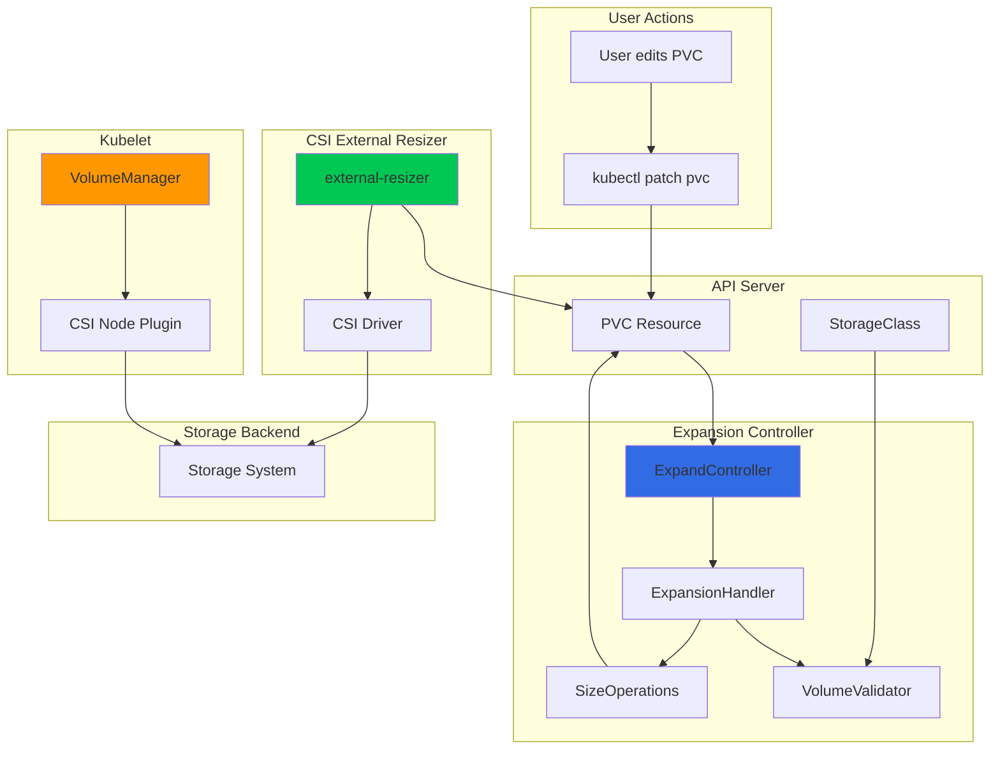
```mermaid
graph TB
    subgraph "User Actions"
        USER[User edits PVC]
        KUBECTL[kubectl patch pvc]
    end

    subgraph "API Server"
        PVCAPI[PVC Resource]
        SCAPI[StorageClass]
    end

    subgraph "Expansion Controller"
        EC[ExpandController]
        EH[ExpansionHandler]
        VV[VolumeValidator]
        SO[SizeOperations]
    end

    subgraph "CSI External Resizer"
        ER[external-resizer]
        CSI[CSI Driver]
    end

    subgraph "Kubelet"
        VM[VolumeManager]
        CSI_NODE[CSI Node Plugin]
    end

    subgraph "Storage Backend"
        STORAGE[Storage System]
    end

    USER --> KUBECTL
    KUBECTL --> PVCAPI
    PVCAPI --> EC
    SCAPI --> VV
    EC --> EH
    EH --> VV
    EH --> SO
    SO --> PVCAPI

    ER --> PVCAPI
    ER --> CSI
    CSI --> STORAGE

    VM --> CSI_NODE
    CSI_NODE --> STORAGE

    style EC fill:#326CE5
    style ER fill:#00C853
    style VM fill:#FF9800
```

### **Expansion Workflow States**

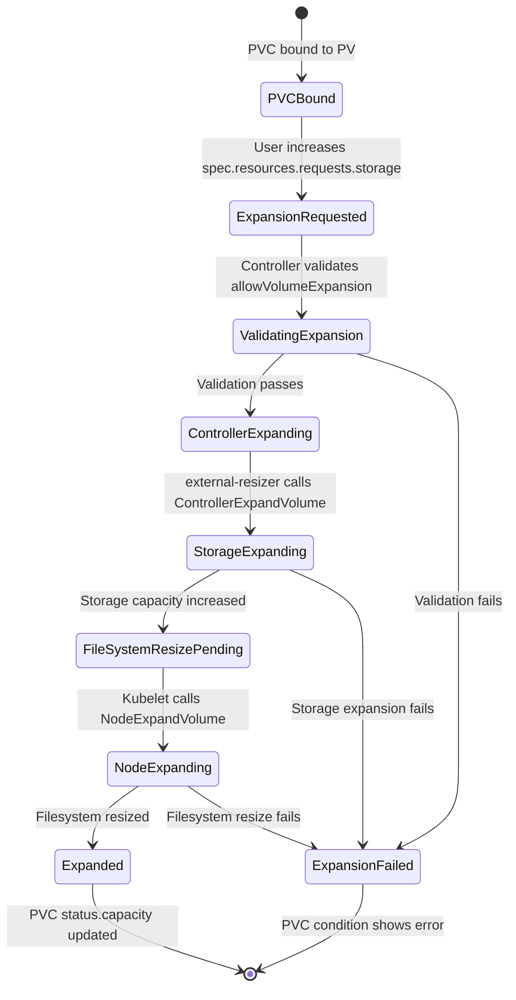
```mermaid
stateDiagram-v2
    [*] --> PVCBound: PVC bound to PV
    PVCBound --> ExpansionRequested: User increases spec.resources.requests.storage
    ExpansionRequested --> ValidatingExpansion: Controller validates allowVolumeExpansion
    ValidatingExpansion --> ControllerExpanding: Validation passes
    ValidatingExpansion --> ExpansionFailed: Validation fails

    ControllerExpanding --> StorageExpanding: external-resizer calls ControllerExpandVolume
    StorageExpanding --> FileSystemResizePending: Storage capacity increased
    StorageExpanding --> ExpansionFailed: Storage expansion fails

    FileSystemResizePending --> NodeExpanding: Kubelet calls NodeExpandVolume
    NodeExpanding --> Expanded: Filesystem resized
    NodeExpanding --> ExpansionFailed: Filesystem resize fails

    Expanded --> [*]: PVC status.capacity updated
    ExpansionFailed --> [*]: PVC condition shows error
```

━━━━━━━━━━━━━━━━━━━━━━━━━━━━━━━━━━━━━━━━━━━━━━━━━━━━━━━━━━━━━━━━━━━━━━━━━━━━━━

## **Expansion Controller Implementation**

### **Controller Structure**

**File:** `/pkg/controller/volume/expand/expand_controller.go`

```go
// ExpandController handles volume expansion operations
type expandController struct {
    // kubeClient is the kube API client used by expansion controller
    kubeClient clientset.Interface

    // pvcLister for listing PVCs from cache
    pvcLister corelisters.PersistentVolumeClaimLister
    pvcListerSynced cache.InformerSynced

    // pvLister for listing PVs from cache
    pvLister corelisters.PersistentVolumeLister
    pvListerSynced cache.InformerSynced

    // cloud provider
    cloud cloudprovider.Interface

    // volumePluginMgr is the volume plugin manager
    volumePluginMgr *volume.VolumePluginMgr

    // operationGenerator generates volume operations
    operationGenerator operationexecutor.OperationGenerator

    // queue for expansion requests
    queue workqueue.RateLimitingInterface
}
```

### **Controller Initialization**

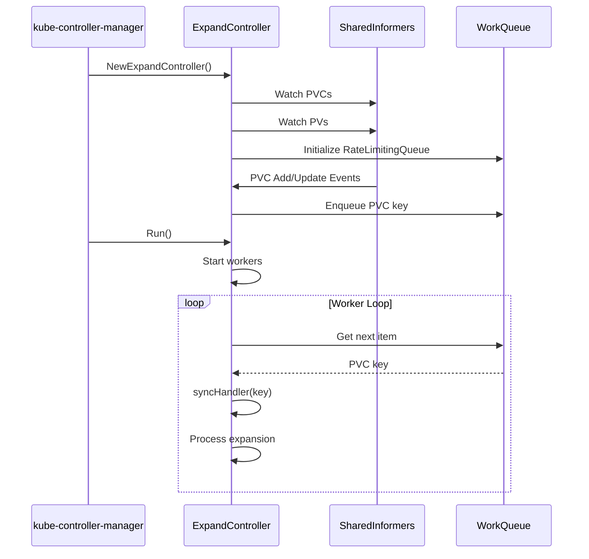
```mermaid
sequenceDiagram
    participant Main as kube-controller-manager
    participant EC as ExpandController
    participant Informers as SharedInformers
    participant Queue as WorkQueue

    Main->>EC: NewExpandController()
    EC->>Informers: Watch PVCs
    EC->>Informers: Watch PVs
    EC->>Queue: Initialize RateLimitingQueue

    Informers->>EC: PVC Add/Update Events
    EC->>Queue: Enqueue PVC key

    Main->>EC: Run()
    EC->>EC: Start workers

    loop Worker Loop
        EC->>Queue: Get next item
        Queue-->>EC: PVC key
        EC->>EC: syncHandler(key)
        EC->>EC: Process expansion
    end
```

**File:** `/pkg/controller/volume/expand/expand_controller.go:80-150`

```go
// NewExpandController creates a new ExpandController
func NewExpandController(
    kubeClient clientset.Interface,
    pvcInformer coreinformers.PersistentVolumeClaimInformer,
    pvInformer coreinformers.PersistentVolumeInformer,
    cloud cloudprovider.Interface,
    plugins []volume.VolumePlugin,
) (*expandController, error) {

    expc := &expandController{
        kubeClient:          kubeClient,
        cloud:               cloud,
        pvcLister:           pvcInformer.Lister(),
        pvcListerSynced:     pvcInformer.Informer().HasSynced,
        pvLister:            pvInformer.Lister(),
        pvListerSynced:      pvInformer.Informer().HasSynced,
        queue:               workqueue.NewNamedRateLimitingQueue(
            workqueue.DefaultControllerRateLimiter(),
            "volume_expand",
        ),
    }

    // Initialize volume plugin manager
    expc.volumePluginMgr = &volume.VolumePluginMgr{}
    if err := expc.volumePluginMgr.InitPlugins(plugins, nil, expc); err != nil {
        return nil, fmt.Errorf("could not initialize volume plugins: %v", err)
    }

    // Watch for PVC updates
    pvcInformer.Informer().AddEventHandler(cache.ResourceEventHandlerFuncs{
        AddFunc:    expc.enqueuePVC,
        UpdateFunc: func(old, new interface{}) {
            oldPVC := old.(*v1.PersistentVolumeClaim)
            newPVC := new.(*v1.PersistentVolumeClaim)

            // Only enqueue if size increased
            if isVolumeExpansionRequired(oldPVC, newPVC) {
                expc.enqueuePVC(new)
            }
        },
    })

    return expc, nil
}
```

### **Expansion Detection Logic**

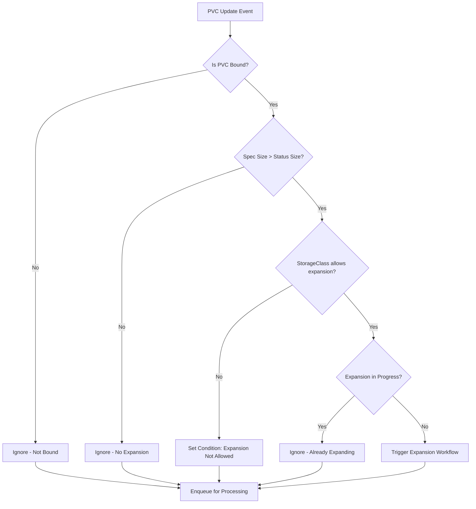
```mermaid
flowchart TD
    Start[PVC Update Event] --> CheckBound{Is PVC Bound?}
    CheckBound -->|No| Ignore[Ignore - Not Bound]
    CheckBound -->|Yes| CheckSize{Spec Size > Status Size?}

    CheckSize -->|No| Ignore2[Ignore - No Expansion]
    CheckSize -->|Yes| CheckAllowed{StorageClass allows expansion?}

    CheckAllowed -->|No| SetCondition[Set Condition: Expansion Not Allowed]
    CheckAllowed -->|Yes| CheckInProgress{Expansion in Progress?}

    CheckInProgress -->|Yes| Ignore3[Ignore - Already Expanding]
    CheckInProgress -->|No| TriggerExpansion[Trigger Expansion Workflow]

    TriggerExpansion --> End[Enqueue for Processing]
    SetCondition --> End
    Ignore --> End
    Ignore2 --> End
    Ignore3 --> End
```

**File:** `/pkg/controller/volume/expand/expand_controller.go:200-250`

```go
// isVolumeExpansionRequired checks if volume expansion is needed
func isVolumeExpansionRequired(oldPVC, newPVC *v1.PersistentVolumeClaim) bool {
    // Check if PVC is bound
    if newPVC.Status.Phase != v1.ClaimBound {
        return false
    }

    // Get requested size from spec
    requestedSize := newPVC.Spec.Resources.Requests[v1.ResourceStorage]

    // Get current size from status
    currentSize := newPVC.Status.Capacity[v1.ResourceStorage]

    // Check if requested size is greater than current size
    if requestedSize.Cmp(currentSize) > 0 {
        return true
    }

    return false
}

// syncHandler processes a single PVC expansion request
func (expc *expandController) syncHandler(key string) error {
    namespace, name, err := cache.SplitMetaNamespaceKey(key)
    if err != nil {
        return err
    }

    // Get PVC from cache
    pvc, err := expc.pvcLister.PersistentVolumeClaims(namespace).Get(name)
    if err != nil {
        if errors.IsNotFound(err) {
            return nil
        }
        return err
    }

    // Get PV
    pv, err := expc.pvLister.Get(pvc.Spec.VolumeName)
    if err != nil {
        return fmt.Errorf("error getting PV %s: %v", pvc.Spec.VolumeName, err)
    }

    // Process expansion
    return expc.expand(pvc, pv)
}
```

━━━━━━━━━━━━━━━━━━━━━━━━━━━━━━━━━━━━━━━━━━━━━━━━━━━━━━━━━━━━━━━━━━━━━━━━━━━━━━

## **Expansion Workflow**

### **Complete Expansion Flow**

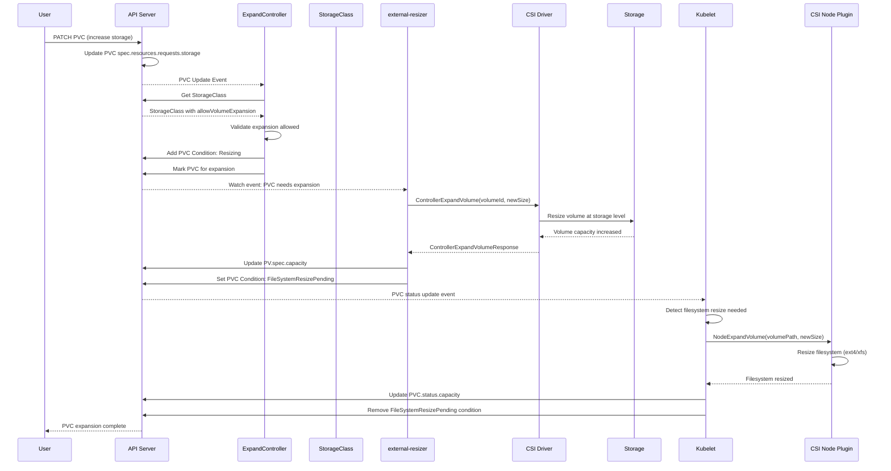
```mermaid
sequenceDiagram
    participant User
    participant API as API Server
    participant EC as ExpandController
    participant SC as StorageClass
    participant Resizer as external-resizer
    participant CSI as CSI Driver
    participant Storage
    participant Kubelet
    participant NodeCSI as CSI Node Plugin

    User->>API: PATCH PVC (increase storage)
    API->>API: Update PVC spec.resources.requests.storage
    API-->>EC: PVC Update Event

    EC->>API: Get StorageClass
    API-->>EC: StorageClass with allowVolumeExpansion

    EC->>EC: Validate expansion allowed
    EC->>API: Add PVC Condition: Resizing

    EC->>API: Mark PVC for expansion
    API-->>Resizer: Watch event: PVC needs expansion

    Resizer->>CSI: ControllerExpandVolume(volumeId, newSize)
    CSI->>Storage: Resize volume at storage level
    Storage-->>CSI: Volume capacity increased
    CSI-->>Resizer: ControllerExpandVolumeResponse

    Resizer->>API: Update PV.spec.capacity
    Resizer->>API: Set PVC Condition: FileSystemResizePending

    API-->>Kubelet: PVC status update event
    Kubelet->>Kubelet: Detect filesystem resize needed
    Kubelet->>NodeCSI: NodeExpandVolume(volumePath, newSize)

    NodeCSI->>NodeCSI: Resize filesystem (ext4/xfs)
    NodeCSI-->>Kubelet: Filesystem resized

    Kubelet->>API: Update PVC.status.capacity
    Kubelet->>API: Remove FileSystemResizePending condition
    API-->>User: PVC expansion complete
```

### **Validation Phase**

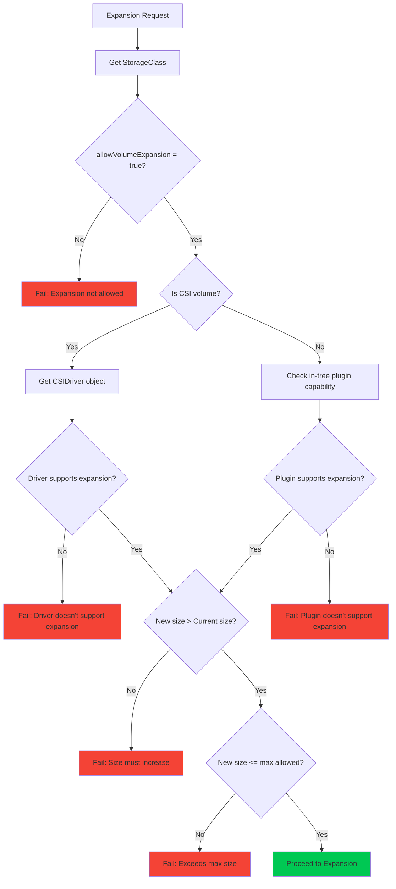
```mermaid
flowchart TD
    Start[Expansion Request] --> GetSC[Get StorageClass]
    GetSC --> CheckAllowed{allowVolumeExpansion = true?}

    CheckAllowed -->|No| Fail1[Fail: Expansion not allowed]
    CheckAllowed -->|Yes| CheckCSI{Is CSI volume?}

    CheckCSI -->|No| CheckPlugin[Check in-tree plugin capability]
    CheckCSI -->|Yes| GetDriver[Get CSIDriver object]

    GetDriver --> CheckDriverCap{Driver supports expansion?}
    CheckDriverCap -->|No| Fail2[Fail: Driver doesn't support expansion]
    CheckDriverCap -->|Yes| CheckSize{New size > Current size?}

    CheckPlugin --> CheckPluginCap{Plugin supports expansion?}
    CheckPluginCap -->|No| Fail3[Fail: Plugin doesn't support expansion]
    CheckPluginCap -->|Yes| CheckSize

    CheckSize -->|No| Fail4[Fail: Size must increase]
    CheckSize -->|Yes| CheckMaxSize{New size <= max allowed?}

    CheckMaxSize -->|No| Fail5[Fail: Exceeds max size]
    CheckMaxSize -->|Yes| Proceed[Proceed to Expansion]

    style Proceed fill:#00C853
    style Fail1 fill:#F44336
    style Fail2 fill:#F44336
    style Fail3 fill:#F44336
    style Fail4 fill:#F44336
    style Fail5 fill:#F44336
```

**File:** `/pkg/controller/volume/expand/expand_controller.go:300-380`

```go
// expand handles the expansion of a volume
func (expc *expandController) expand(
    pvc *v1.PersistentVolumeClaim,
    pv *v1.PersistentVolume,
) error {

    // Get the volume plugin
    volumePlugin, err := expc.volumePluginMgr.FindExpandablePluginBySpec(
        volume.NewSpecFromPersistentVolume(pv, false),
    )
    if err != nil {
        return fmt.Errorf("error finding expandable plugin: %v", err)
    }

    if volumePlugin == nil {
        return fmt.Errorf("no expandable volume plugin found for PV %s", pv.Name)
    }

    // Validate expansion is allowed
    if err := expc.validateExpansion(pvc, pv); err != nil {
        // Update PVC with error condition
        expc.setFailedExpansionCondition(pvc, err)
        return err
    }

    // Mark PVC as resizing
    if err := expc.markPVCResizing(pvc); err != nil {
        return err
    }

    // For CSI volumes, the external-resizer will handle the actual expansion
    // This controller just validates and marks the PVC
    if pv.Spec.CSI != nil {
        klog.V(4).Infof("CSI volume %s will be expanded by external-resizer", pv.Name)
        return nil
    }

    // For in-tree plugins, perform expansion here
    return expc.expandInTreeVolume(pvc, pv, volumePlugin)
}

// validateExpansion checks if expansion is allowed and valid
func (expc *expandController) validateExpansion(
    pvc *v1.PersistentVolumeClaim,
    pv *v1.PersistentVolume,
) error {

    // Get StorageClass
    storageClass, err := expc.getStorageClass(pv)
    if err != nil {
        return fmt.Errorf("error getting storage class: %v", err)
    }

    // Check if expansion is allowed
    if storageClass.AllowVolumeExpansion == nil || !*storageClass.AllowVolumeExpansion {
        return fmt.Errorf("volume expansion is not allowed for storage class %s",
            storageClass.Name)
    }

    // Check size increase
    requestedSize := pvc.Spec.Resources.Requests[v1.ResourceStorage]
    currentSize := pvc.Status.Capacity[v1.ResourceStorage]

    if requestedSize.Cmp(currentSize) <= 0 {
        return fmt.Errorf("requested size must be greater than current size")
    }

    // Additional validation for CSI volumes
    if pv.Spec.CSI != nil {
        return expc.validateCSIExpansion(pvc, pv)
    }

    return nil
}
```

### **CSI-Specific Validation**

**File:** `/pkg/controller/volume/expand/expand_controller.go:400-450`

```go
// validateCSIExpansion performs CSI-specific validation
func (expc *expandController) validateCSIExpansion(
    pvc *v1.PersistentVolumeClaim,
    pv *v1.PersistentVolume,
) error {

    // For CSI volumes, check if the CSIDriver object exists
    csiSource := pv.Spec.CSI
    if csiSource == nil {
        return fmt.Errorf("PV %s is not a CSI volume", pv.Name)
    }

    driverName := csiSource.Driver

    // Get CSIDriver object to check capabilities
    csiDriver, err := expc.kubeClient.StorageV1().CSIDrivers().Get(
        context.TODO(),
        driverName,
        metav1.GetOptions{},
    )
    if err != nil {
        if errors.IsNotFound(err) {
            // CSIDriver object is optional, assume expansion is supported
            klog.V(4).Infof("CSIDriver %s not found, assuming expansion supported", driverName)
            return nil
        }
        return err
    }

    // Check if driver supports volume expansion
    // This is indicated by the EXPAND_VOLUME capability in the driver
    // The external-resizer will check this at runtime

    klog.V(4).Infof("CSI driver %s will be checked for expansion capability by external-resizer",
        driverName)

    return nil
}
```

━━━━━━━━━━━━━━━━━━━━━━━━━━━━━━━━━━━━━━━━━━━━━━━━━━━━━━━━━━━━━━━━━━━━━━━━━━━━━━

## **PVC Status Management**

### **PVC Conditions During Expansion**

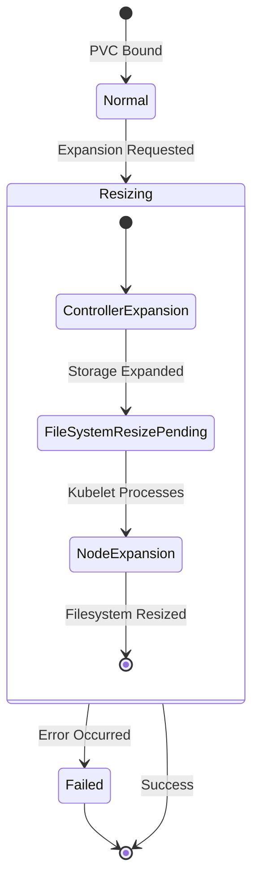
```mermaid
stateDiagram-v2
    [*] --> Normal: PVC Bound
    Normal --> Resizing: Expansion Requested

    state Resizing {
        [*] --> ControllerExpansion
        ControllerExpansion --> FileSystemResizePending: Storage Expanded
        FileSystemResizePending --> NodeExpansion: Kubelet Processes
        NodeExpansion --> [*]: Filesystem Resized
    }

    Resizing --> Failed: Error Occurred
    Resizing --> [*]: Success
    Failed --> [*]
```

### **Condition Types**

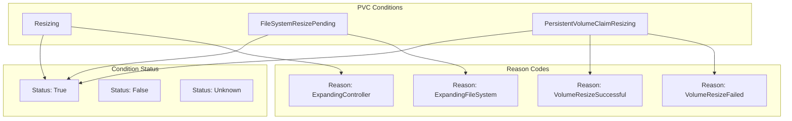
```mermaid
graph TB
    subgraph "PVC Conditions"
        C1[Resizing]
        C2[FileSystemResizePending]
        C3[PersistentVolumeClaimResizing]
    end

    subgraph "Condition Status"
        S1[Status: True]
        S2[Status: False]
        S3[Status: Unknown]
    end

    subgraph "Reason Codes"
        R1[Reason: ExpandingController]
        R2[Reason: ExpandingFileSystem]
        R3[Reason: VolumeResizeSuccessful]
        R4[Reason: VolumeResizeFailed]
    end

    C1 --> S1
    C1 --> R1
    C2 --> S1
    C2 --> R2
    C3 --> S1
    C3 --> R3
    C3 --> R4
```

**File:** `/pkg/controller/volume/expand/pvc_modifier.go:50-120`

```go
// markPVCResizing marks the PVC as resizing
func (expc *expandController) markPVCResizing(
    pvc *v1.PersistentVolumeClaim,
) error {

    // Clone PVC to avoid modifying cache
    pvcClone := pvc.DeepCopy()

    // Add Resizing condition
    resizingCondition := v1.PersistentVolumeClaimCondition{
        Type:               v1.PersistentVolumeClaimResizing,
        Status:             v1.ConditionTrue,
        LastTransitionTime: metav1.Now(),
        Message:            "Resizing volume in progress",
    }

    // Update conditions
    pvcClone.Status.Conditions = updateCondition(
        pvcClone.Status.Conditions,
        resizingCondition,
    )

    // Update PVC status
    _, err := expc.kubeClient.CoreV1().PersistentVolumeClaims(pvc.Namespace).
        UpdateStatus(context.TODO(), pvcClone, metav1.UpdateOptions{})

    if err != nil {
        return fmt.Errorf("error marking PVC %s/%s as resizing: %v",
            pvc.Namespace, pvc.Name, err)
    }

    klog.V(4).Infof("Marked PVC %s/%s as resizing", pvc.Namespace, pvc.Name)
    return nil
}

// markFileSystemResizePending marks filesystem resize as pending
func (expc *expandController) markFileSystemResizePending(
    pvc *v1.PersistentVolumeClaim,
) error {

    pvcClone := pvc.DeepCopy()

    // Add FileSystemResizePending condition
    condition := v1.PersistentVolumeClaimCondition{
        Type:               v1.PersistentVolumeClaimFileSystemResizePending,
        Status:             v1.ConditionTrue,
        LastTransitionTime: metav1.Now(),
        Message:            "Waiting for user to (re-)start a pod to finish file system resize",
    }

    pvcClone.Status.Conditions = updateCondition(
        pvcClone.Status.Conditions,
        condition,
    )

    _, err := expc.kubeClient.CoreV1().PersistentVolumeClaims(pvc.Namespace).
        UpdateStatus(context.TODO(), pvcClone, metav1.UpdateOptions{})

    return err
}

// setFailedExpansionCondition sets error condition on PVC
func (expc *expandController) setFailedExpansionCondition(
    pvc *v1.PersistentVolumeClaim,
    expansionErr error,
) error {

    pvcClone := pvc.DeepCopy()

    condition := v1.PersistentVolumeClaimCondition{
        Type:               v1.PersistentVolumeClaimResizing,
        Status:             v1.ConditionFalse,
        LastTransitionTime: metav1.Now(),
        Reason:             "VolumeResizeFailed",
        Message:            expansionErr.Error(),
    }

    pvcClone.Status.Conditions = updateCondition(
        pvcClone.Status.Conditions,
        condition,
    )

    _, err := expc.kubeClient.CoreV1().PersistentVolumeClaims(pvc.Namespace).
        UpdateStatus(context.TODO(), pvcClone, metav1.UpdateOptions{})

    return err
}
```

### **Condition Update Logic**

**File:** `/pkg/controller/volume/expand/pvc_modifier.go:150-200`

```go
// updateCondition updates or adds a condition to the condition list
func updateCondition(
    conditions []v1.PersistentVolumeClaimCondition,
    newCondition v1.PersistentVolumeClaimCondition,
) []v1.PersistentVolumeClaimCondition {

    // Check if condition already exists
    for i, condition := range conditions {
        if condition.Type == newCondition.Type {
            // Update existing condition only if status changed
            if condition.Status != newCondition.Status {
                conditions[i] = newCondition
            }
            return conditions
        }
    }

    // Condition doesn't exist, add it
    return append(conditions, newCondition)
}

// removeCondition removes a condition from the condition list
func removeCondition(
    conditions []v1.PersistentVolumeClaimCondition,
    conditionType v1.PersistentVolumeClaimConditionType,
) []v1.PersistentVolumeClaimCondition {

    newConditions := []v1.PersistentVolumeClaimCondition{}
    for _, condition := range conditions {
        if condition.Type != conditionType {
            newConditions = append(newConditions, condition)
        }
    }
    return newConditions
}
```

━━━━━━━━━━━━━━━━━━━━━━━━━━━━━━━━━━━━━━━━━━━━━━━━━━━━━━━━━━━━━━━━━━━━━━━━━━━━━━

## **Online vs Offline Expansion**

### **Expansion Mode Comparison**


```mermaid
graph TB
    subgraph "Online Expansion (Mounted)"
        O1[Volume Mounted to Pod]
        O2[ControllerExpandVolume Called]
        O3[Storage Capacity Increased]
        O4[NodeExpandVolume Called]
        O5[Filesystem Resized While Mounted]
        O6[Application Continues Running]

        O1 --> O2 --> O3 --> O4 --> O5 --> O6
    end

    subgraph "Offline Expansion (Unmounted)"
        F1[Volume Not Mounted]
        F2[ControllerExpandVolume Called]
        F3[Storage Capacity Increased]
        F4[Wait for Pod to Start]
        F5[NodePublishVolume Called]
        F6[Filesystem Resized During Mount]

        F1 --> F2 --> F3 --> F4 --> F5 --> F6
    end

    style O5 fill:#00C853
    style F6 fill:#FF9800
```

### **Online Expansion Flow**

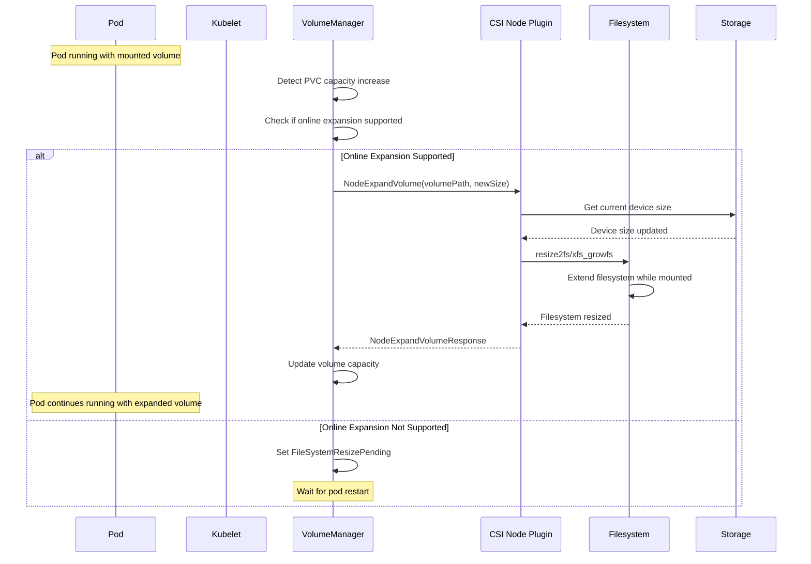
```mermaid
sequenceDiagram
    participant Pod
    participant Kubelet
    participant VM as VolumeManager
    participant CSI as CSI Node Plugin
    participant FS as Filesystem
    participant Storage

    Note over Pod: Pod running with mounted volume

    VM->>VM: Detect PVC capacity increase
    VM->>VM: Check if online expansion supported

    alt Online Expansion Supported
        VM->>CSI: NodeExpandVolume(volumePath, newSize)
        CSI->>Storage: Get current device size
        Storage-->>CSI: Device size updated
        CSI->>FS: resize2fs/xfs_growfs
        FS->>FS: Extend filesystem while mounted
        FS-->>CSI: Filesystem resized
        CSI-->>VM: NodeExpandVolumeResponse
        VM->>VM: Update volume capacity
        Note over Pod: Pod continues running with expanded volume
    else Online Expansion Not Supported
        VM->>VM: Set FileSystemResizePending
        Note over VM: Wait for pod restart
    end
```

**File:** `/pkg/volume/csi/expander.go:80-150`

```go
// NodeExpand handles node-side volume expansion
func (c *csiMountMgr) NodeExpand(resizeOptions volume.NodeResizeOptions) (bool, error) {
    klog.V(4).Infof("NodeExpand on volume %s", c.volumeID)

    csi := c.csiClientGetter.Get()

    // Get current device path
    devicePath := resizeOptions.DevicePath
    deviceMountPath := resizeOptions.DeviceMountPath

    // Check if driver supports node expansion
    nodeExpandSet, err := csi.NodeSupportsNodeExpand(context.Background())
    if err != nil {
        return false, fmt.Errorf("error checking if driver supports node expansion: %v", err)
    }

    if !nodeExpandSet {
        klog.V(4).Infof("Driver %s does not support node expansion", c.driverName)
        return false, nil
    }

    // Get new size
    newSize := resizeOptions.NewSize

    // Prepare NodeExpandVolume request
    req := &csipbv1.NodeExpandVolumeRequest{
        VolumeId:      c.volumeID,
        VolumePath:    deviceMountPath,
        CapacityRange: &csipbv1.CapacityRange{
            RequiredBytes: newSize.Value(),
        },
    }

    // Add volume capability
    if c.spec.PersistentVolume.Spec.VolumeMode != nil &&
        *c.spec.PersistentVolume.Spec.VolumeMode == v1.PersistentVolumeBlock {
        // Block volume
        req.VolumeCapability = &csipbv1.VolumeCapability{
            AccessType: &csipbv1.VolumeCapability_Block{
                Block: &csipbv1.VolumeCapability_BlockVolume{},
            },
        }
    } else {
        // Filesystem volume
        fsType := c.spec.PersistentVolume.Spec.CSI.FSType
        req.VolumeCapability = &csipbv1.VolumeCapability{
            AccessType: &csipbv1.VolumeCapability_Mount{
                Mount: &csipbv1.VolumeCapability_MountVolume{
                    FsType: fsType,
                },
            },
        }
    }

    // Call NodeExpandVolume
    ctx, cancel := context.WithTimeout(context.Background(), csiTimeout)
    defer cancel()

    _, err = csi.NodeExpandVolume(ctx, req)
    if err != nil {
        return false, fmt.Errorf("node expansion failed: %v", err)
    }

    klog.V(4).Infof("NodeExpandVolume succeeded for volume %s", c.volumeID)
    return true, nil
}
```

### **Offline Expansion Flow**

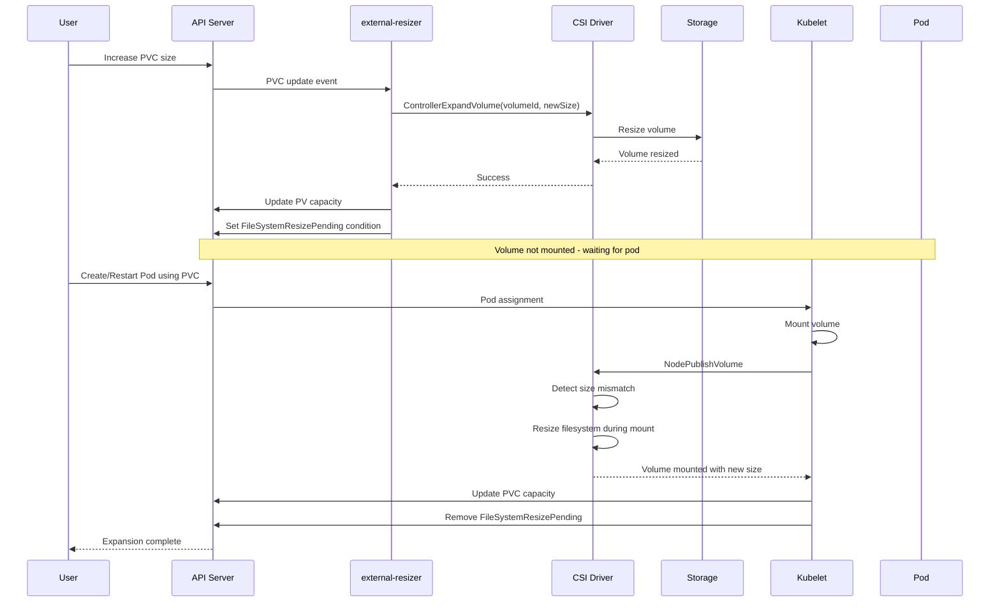
```mermaid
sequenceDiagram
    participant User
    participant API as API Server
    participant Resizer as external-resizer
    participant CSI as CSI Driver
    participant Storage
    participant Kubelet
    participant Pod

    User->>API: Increase PVC size
    API->>Resizer: PVC update event

    Resizer->>CSI: ControllerExpandVolume(volumeId, newSize)
    CSI->>Storage: Resize volume
    Storage-->>CSI: Volume resized
    CSI-->>Resizer: Success

    Resizer->>API: Update PV capacity
    Resizer->>API: Set FileSystemResizePending condition

    Note over API,Pod: Volume not mounted - waiting for pod

    User->>API: Create/Restart Pod using PVC
    API->>Kubelet: Pod assignment

    Kubelet->>Kubelet: Mount volume
    Kubelet->>CSI: NodePublishVolume
    CSI->>CSI: Detect size mismatch
    CSI->>CSI: Resize filesystem during mount
    CSI-->>Kubelet: Volume mounted with new size

    Kubelet->>API: Update PVC capacity
    Kubelet->>API: Remove FileSystemResizePending
    API-->>User: Expansion complete
```

**File:** `/pkg/kubelet/volumemanager/reconciler/reconciler.go:250-320`

```go
// reconstructVolume handles filesystem resize for unmounted volumes
func (rc *reconciler) reconstructVolume(volumeToMount operationexecutor.VolumeToMount) error {

    // Check if PVC has FileSystemResizePending condition
    if !volumeToMount.VolumeNeedsResize {
        return nil
    }

    klog.V(4).Infof("Volume %s needs filesystem resize", volumeToMount.VolumeName)

    // The filesystem resize will happen during NodePublishVolume
    // if the volume is currently unmounted

    // Generate mount operation
    operationExecutor := operationexecutor.NewOperationExecutor(...)

    err := operationExecutor.MountVolume(
        rc.waitForAttachTimeout,
        volumeToMount.VolumeToMount,
        rc.actualStateOfWorld,
        false, /* isRemount */
    )

    if err != nil {
        return fmt.Errorf("error mounting volume for resize: %v", err)
    }

    // After successful mount, the filesystem should be resized
    // Update PVC to remove FileSystemResizePending condition

    return nil
}
```

━━━━━━━━━━━━━━━━━━━━━━━━━━━━━━━━━━━━━━━━━━━━━━━━━━━━━━━━━━━━━━━━━━━━━━━━━━━━━━

## **External Resizer Integration**

### **External Resizer Architecture**

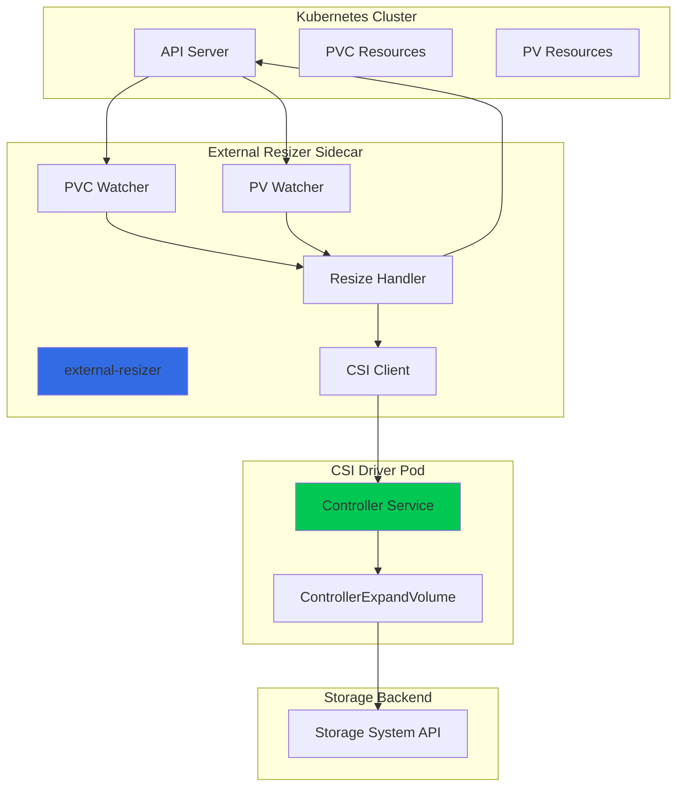
```mermaid
graph TB
    subgraph "Kubernetes Cluster"
        API[API Server]
        PVC[PVC Resources]
        PV[PV Resources]
    end

    subgraph "External Resizer Sidecar"
        ER[external-resizer]
        W1[PVC Watcher]
        W2[PV Watcher]
        RH[Resize Handler]
        CL[CSI Client]
    end

    subgraph "CSI Driver Pod"
        CS[Controller Service]
        CER[ControllerExpandVolume]
    end

    subgraph "Storage Backend"
        STORAGE[Storage System API]
    end

    API --> W1
    API --> W2
    W1 --> RH
    W2 --> RH
    RH --> CL
    CL --> CS
    CS --> CER
    CER --> STORAGE

    RH --> API

    style ER fill:#326CE5
    style CS fill:#00C853
```

### **External Resizer Workflow**

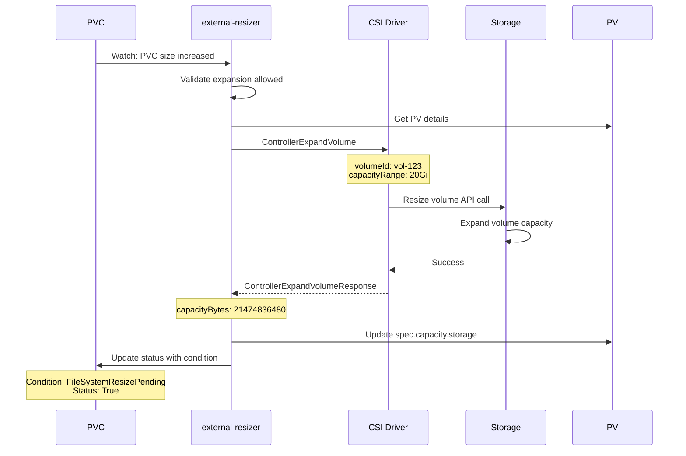
```mermaid
sequenceDiagram
    participant PVC as PVC
    participant Resizer as external-resizer
    participant CSI as CSI Driver
    participant Storage
    participant PV as PV

    PVC->>Resizer: Watch: PVC size increased
    Resizer->>Resizer: Validate expansion allowed
    Resizer->>PV: Get PV details

    Resizer->>CSI: ControllerExpandVolume
    Note over CSI: volumeId: vol-123<br/>capacityRange: 20Gi

    CSI->>Storage: Resize volume API call
    Storage->>Storage: Expand volume capacity
    Storage-->>CSI: Success

    CSI-->>Resizer: ControllerExpandVolumeResponse
    Note over Resizer: capacityBytes: 21474836480

    Resizer->>PV: Update spec.capacity.storage
    Resizer->>PVC: Update status with condition
    Note over PVC: Condition: FileSystemResizePending<br/>Status: True
```

**File:** External resizer code (external repository: `kubernetes-csi/external-resizer`)

```go
// Simplified external-resizer logic (for reference)
type csiResizer struct {
    client   kubernetes.Interface
    csiConn  *grpc.ClientConn
    timeout  time.Duration
}

func (r *csiResizer) expandVolume(pvc *v1.PersistentVolumeClaim, pv *v1.PersistentVolume) error {
    // Get requested size
    requestedSize := pvc.Spec.Resources.Requests[v1.ResourceStorage]

    // Get current size
    currentSize := pv.Spec.Capacity[v1.ResourceStorage]

    if requestedSize.Cmp(currentSize) <= 0 {
        return nil // No expansion needed
    }

    // Call CSI ControllerExpandVolume
    volumeID := pv.Spec.CSI.VolumeHandle

    req := &csi.ControllerExpandVolumeRequest{
        VolumeId: volumeID,
        CapacityRange: &csi.CapacityRange{
            RequiredBytes: requestedSize.Value(),
        },
    }

    ctx, cancel := context.WithTimeout(context.Background(), r.timeout)
    defer cancel()

    client := csi.NewControllerClient(r.csiConn)
    resp, err := client.ControllerExpandVolume(ctx, req)
    if err != nil {
        return fmt.Errorf("ControllerExpandVolume failed: %v", err)
    }

    // Update PV capacity
    newCapacity := resource.NewQuantity(resp.CapacityBytes, resource.BinarySI)
    pvClone := pv.DeepCopy()
    pvClone.Spec.Capacity[v1.ResourceStorage] = *newCapacity

    _, err = r.client.CoreV1().PersistentVolumes().Update(ctx, pvClone, metav1.UpdateOptions{})
    if err != nil {
        return err
    }

    // Check if node expansion is required
    if resp.NodeExpansionRequired {
        // Mark PVC with FileSystemResizePending condition
        return r.markFileSystemResizePending(pvc)
    }

    // Update PVC capacity directly if no node expansion needed
    return r.updatePVCCapacity(pvc, newCapacity)
}
```

### **CSI ControllerExpandVolume Implementation**

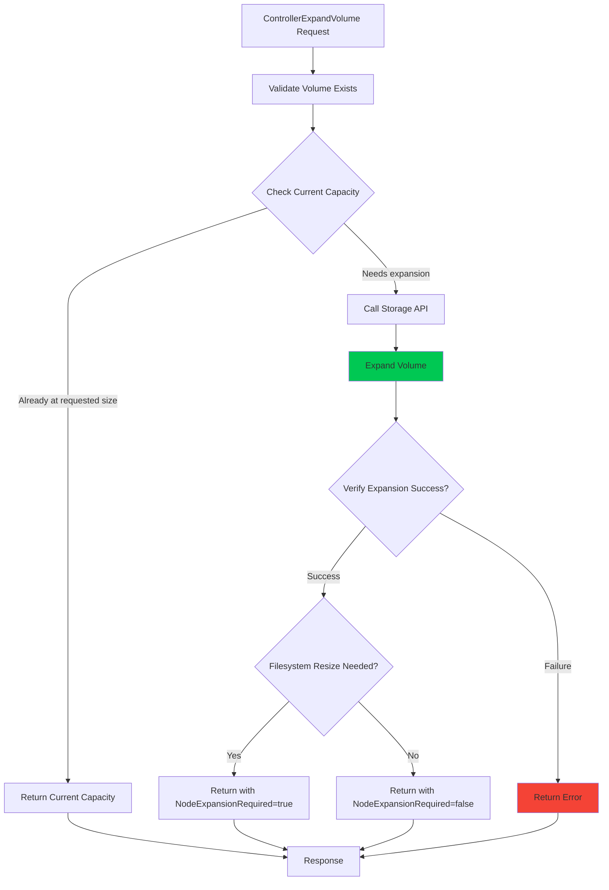
```mermaid
flowchart TD
    Start[ControllerExpandVolume Request] --> Validate[Validate Volume Exists]
    Validate --> CheckCap{Check Current Capacity}

    CheckCap -->|Already at requested size| Return1[Return Current Capacity]
    CheckCap -->|Needs expansion| CallStorage[Call Storage API]

    CallStorage --> Expand[Expand Volume]
    Expand --> Verify{Verify Expansion Success?}

    Verify -->|Success| CheckFS{Filesystem Resize Needed?}
    Verify -->|Failure| Error[Return Error]

    CheckFS -->|Yes| ReturnPending[Return with NodeExpansionRequired=true]
    CheckFS -->|No| ReturnComplete[Return with NodeExpansionRequired=false]

    ReturnPending --> End[Response]
    ReturnComplete --> End
    Return1 --> End
    Error --> End

    style Expand fill:#00C853
    style Error fill:#F44336
```

━━━━━━━━━━━━━━━━━━━━━━━━━━━━━━━━━━━━━━━━━━━━━━━━━━━━━━━━━━━━━━━━━━━━━━━━━━━━━━

## **Filesystem Resizing**

### **Kubelet Volume Manager Integration**

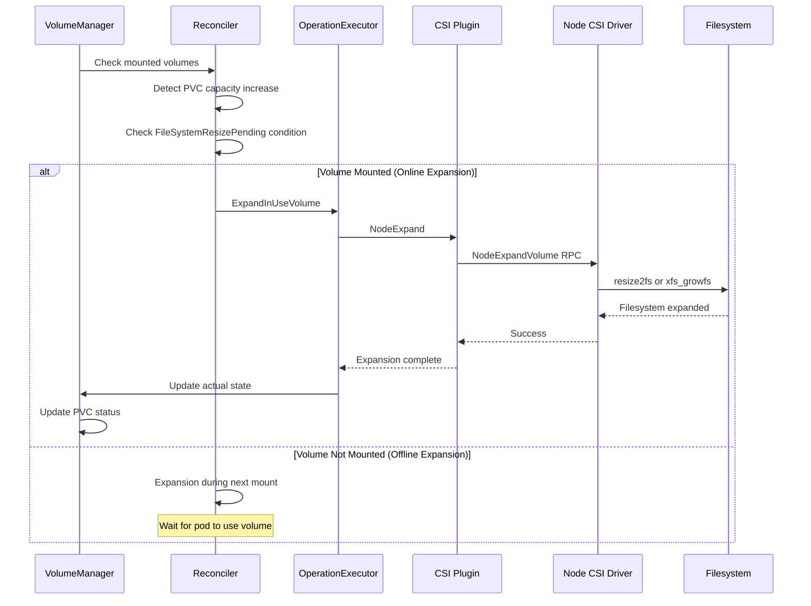
```mermaid
sequenceDiagram
    participant VM as VolumeManager
    participant RC as Reconciler
    participant OE as OperationExecutor
    participant CSI as CSI Plugin
    participant Node as Node CSI Driver
    participant FS as Filesystem

    VM->>RC: Check mounted volumes
    RC->>RC: Detect PVC capacity increase
    RC->>RC: Check FileSystemResizePending condition

    alt Volume Mounted (Online Expansion)
        RC->>OE: ExpandInUseVolume
        OE->>CSI: NodeExpand
        CSI->>Node: NodeExpandVolume RPC
        Node->>FS: resize2fs or xfs_growfs
        FS-->>Node: Filesystem expanded
        Node-->>CSI: Success
        CSI-->>OE: Expansion complete
        OE->>VM: Update actual state
        VM->>VM: Update PVC status
    else Volume Not Mounted (Offline Expansion)
        RC->>RC: Expansion during next mount
        Note over RC: Wait for pod to use volume
    end
```

**File:** `/pkg/kubelet/volumemanager/reconciler/reconciler.go:400-480`

```go
// expandVolume handles volume expansion for mounted volumes
func (rc *reconciler) expandVolume(
    volumeToMount operationexecutor.VolumeToMount,
    actualStateOfWorld ActualStateOfWorld,
) {

    volumeName := volumeToMount.VolumeName

    // Check if volume needs resize
    if !volumeToMount.VolumeNeedsResize {
        return
    }

    klog.V(4).Infof("Starting filesystem resize for volume %s", volumeName)

    // Check if volume is mounted
    mounted := actualStateOfWorld.IsVolumeMountedToNode(volumeName)
    if !mounted {
        klog.V(4).Infof("Volume %s not mounted, will resize during mount", volumeName)
        return
    }

    // Perform online expansion
    err := rc.operationExecutor.ExpandInUseVolume(
        volumeToMount.VolumeToMount,
        actualStateOfWorld,
    )

    if err != nil {
        klog.Errorf("Error expanding volume %s: %v", volumeName, err)
        rc.recordVolumeExpansionFailure(volumeToMount, err)
        return
    }

    klog.V(4).Infof("Successfully expanded volume %s", volumeName)

    // Update PVC status
    rc.updatePVCCapacity(volumeToMount)
}

// updatePVCCapacity updates the PVC status after successful expansion
func (rc *reconciler) updatePVCCapacity(volumeToMount operationexecutor.VolumeToMount) error {

    pvcName := volumeToMount.PersistentVolumeClaim.Name
    pvcNamespace := volumeToMount.PersistentVolumeClaim.Namespace

    // Get current PVC
    pvc, err := rc.kubeClient.CoreV1().PersistentVolumeClaims(pvcNamespace).Get(
        context.TODO(),
        pvcName,
        metav1.GetOptions{},
    )
    if err != nil {
        return err
    }

    // Get PV to check capacity
    pv, err := rc.kubeClient.CoreV1().PersistentVolumes().Get(
        context.TODO(),
        volumeToMount.PersistentVolume.Name,
        metav1.GetOptions{},
    )
    if err != nil {
        return err
    }

    // Update PVC capacity to match PV
    pvcClone := pvc.DeepCopy()
    pvcClone.Status.Capacity = pv.Spec.Capacity

    // Remove FileSystemResizePending condition
    pvcClone.Status.Conditions = removeCondition(
        pvcClone.Status.Conditions,
        v1.PersistentVolumeClaimFileSystemResizePending,
    )

    // Remove Resizing condition
    pvcClone.Status.Conditions = removeCondition(
        pvcClone.Status.Conditions,
        v1.PersistentVolumeClaimResizing,
    )

    _, err = rc.kubeClient.CoreV1().PersistentVolumeClaims(pvcNamespace).
        UpdateStatus(context.TODO(), pvcClone, metav1.UpdateOptions{})

    return err
}
```

### **CSI Node Plugin Filesystem Operations**

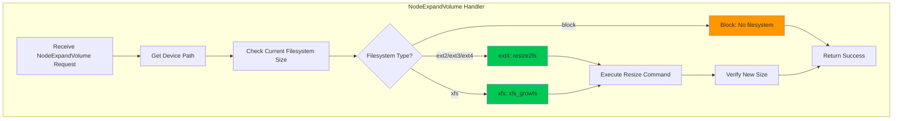
```mermaid
graph TB
    subgraph "NodeExpandVolume Handler"
        A[Receive NodeExpandVolume Request]
        B[Get Device Path]
        C[Check Current Filesystem Size]
        D{Filesystem Type?}
        E[ext4: resize2fs]
        F[xfs: xfs_growfs]
        G[Block: No filesystem]
        H[Execute Resize Command]
        I[Verify New Size]
        J[Return Success]
    end

    A --> B --> C --> D
    D -->|ext2/ext3/ext4| E --> H
    D -->|xfs| F --> H
    D -->|block| G --> J
    H --> I --> J

    style E fill:#00C853
    style F fill:#00C853
    style G fill:#FF9800
```

**File:** `/pkg/volume/csi/expander.go:200-280`

```go
// Example CSI driver implementation of filesystem resize
func (ns *nodeServer) NodeExpandVolume(
    ctx context.Context,
    req *csi.NodeExpandVolumeRequest,
) (*csi.NodeExpandVolumeResponse, error) {

    volumeID := req.GetVolumeId()
    volumePath := req.GetVolumePath()
    capacityRange := req.GetCapacityRange()

    klog.V(4).Infof("NodeExpandVolume: volumeID=%s, volumePath=%s, capacity=%d",
        volumeID, volumePath, capacityRange.GetRequiredBytes())

    // Get volume capability
    volCap := req.GetVolumeCapability()
    if volCap == nil {
        return nil, status.Error(codes.InvalidArgument, "volume capability missing")
    }

    // Check if block volume
    if _, ok := volCap.GetAccessType().(*csi.VolumeCapability_Block); ok {
        klog.V(4).Infof("Block volume %s does not require filesystem resize", volumeID)
        return &csi.NodeExpandVolumeResponse{}, nil
    }

    // Get filesystem type
    mountCap := volCap.GetMount()
    if mountCap == nil {
        return nil, status.Error(codes.InvalidArgument, "mount capability missing")
    }

    fsType := mountCap.GetFsType()
    if fsType == "" {
        fsType = "ext4" // default
    }

    // Get device path
    devicePath, err := ns.getDevicePath(volumeID)
    if err != nil {
        return nil, status.Error(codes.Internal, err.Error())
    }

    // Resize filesystem
    err = ns.resizeFilesystem(devicePath, volumePath, fsType)
    if err != nil {
        return nil, status.Error(codes.Internal, err.Error())
    }

    klog.V(4).Infof("Successfully expanded filesystem for volume %s", volumeID)

    return &csi.NodeExpandVolumeResponse{
        CapacityBytes: capacityRange.GetRequiredBytes(),
    }, nil
}

// resizeFilesystem performs the actual filesystem resize
func (ns *nodeServer) resizeFilesystem(
    devicePath, volumePath, fsType string,
) error {

    klog.V(4).Infof("Resizing %s filesystem on %s", fsType, devicePath)

    var cmd string
    var args []string

    switch fsType {
    case "ext2", "ext3", "ext4":
        cmd = "resize2fs"
        args = []string{devicePath}

    case "xfs":
        cmd = "xfs_growfs"
        args = []string{volumePath}

    default:
        return fmt.Errorf("unsupported filesystem type: %s", fsType)
    }

    // Execute resize command
    output, err := exec.Command(cmd, args...).CombinedOutput()
    if err != nil {
        return fmt.Errorf("resize failed: %v, output: %s", err, string(output))
    }

    klog.V(4).Infof("Filesystem resize output: %s", string(output))
    return nil
}
```

━━━━━━━━━━━━━━━━━━━━━━━━━━━━━━━━━━━━━━━━━━━━━━━━━━━━━━━━━━━━━━━━━━━━━━━━━━━━━━

## **Expansion Capabilities**

### **CSIDriver Expansion Configuration**

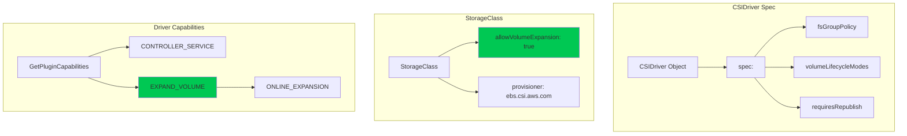
```mermaid
graph TB
    subgraph "CSIDriver Spec"
        CD[CSIDriver Object]
        SPEC[spec:]
        FSG[fsGroupPolicy]
        VLC[volumeLifecycleModes]
        REQ[requiresRepublish]
    end

    subgraph "StorageClass"
        SC[StorageClass]
        AVE[allowVolumeExpansion: true]
        PROV[provisioner: ebs.csi.aws.com]
    end

    subgraph "Driver Capabilities"
        CAP[GetPluginCapabilities]
        CTRL[CONTROLLER_SERVICE]
        EXP[EXPAND_VOLUME]
        ONLINE[ONLINE_EXPANSION]
    end

    CD --> SPEC
    SPEC --> FSG
    SPEC --> VLC
    SPEC --> REQ

    SC --> AVE
    SC --> PROV

    CAP --> CTRL
    CAP --> EXP
    EXP --> ONLINE

    style AVE fill:#00C853
    style EXP fill:#00C853
```

**Example CSIDriver Configuration:**

```yaml
apiVersion: storage.k8s.io/v1
kind: CSIDriver
metadata:
  name: ebs.csi.aws.com
spec:
  attachRequired: true
  podInfoOnMount: false
  volumeLifecycleModes:
  - Persistent
  - Ephemeral
  fsGroupPolicy: File
  requiresRepublish: false
  # No explicit expansion field - determined by driver capabilities
```

**Example StorageClass with Expansion:**

```yaml
apiVersion: storage.k8s.io/v1
kind: StorageClass
metadata:
  name: ebs-sc-expandable
provisioner: ebs.csi.aws.com
parameters:
  type: gp3
  encrypted: "true"
allowVolumeExpansion: true  # Enable expansion
volumeBindingMode: WaitForFirstConsumer
```

### **Driver Capability Advertisement**

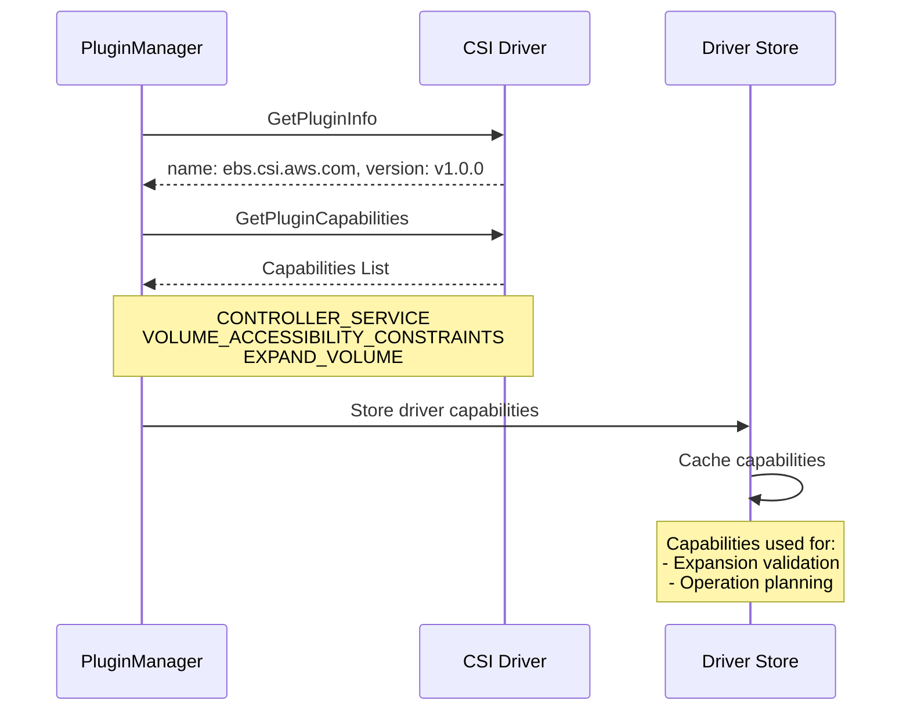
```mermaid
sequenceDiagram
    participant PM as PluginManager
    participant CSI as CSI Driver
    participant Store as Driver Store

    PM->>CSI: GetPluginInfo
    CSI-->>PM: name: ebs.csi.aws.com, version: v1.0.0

    PM->>CSI: GetPluginCapabilities
    CSI-->>PM: Capabilities List

    Note over CSI,PM: CONTROLLER_SERVICE<br/>VOLUME_ACCESSIBILITY_CONSTRAINTS<br/>EXPAND_VOLUME

    PM->>Store: Store driver capabilities
    Store->>Store: Cache capabilities

    Note over Store: Capabilities used for:<br/>- Expansion validation<br/>- Operation planning
```

**File:** CSI spec implementation (driver-side)

```go
// GetPluginCapabilities returns the capabilities of the plugin
func (d *Driver) GetPluginCapabilities(
    ctx context.Context,
    req *csi.GetPluginCapabilitiesRequest,
) (*csi.GetPluginCapabilitiesResponse, error) {

    return &csi.GetPluginCapabilitiesResponse{
        Capabilities: []*csi.PluginCapability{
            {
                Type: &csi.PluginCapability_Service_{
                    Service: &csi.PluginCapability_Service{
                        Type: csi.PluginCapability_Service_CONTROLLER_SERVICE,
                    },
                },
            },
            {
                Type: &csi.PluginCapability_Service_{
                    Service: &csi.PluginCapability_Service{
                        Type: csi.PluginCapability_Service_VOLUME_ACCESSIBILITY_CONSTRAINTS,
                    },
                },
            },
            {
                Type: &csi.PluginCapability_VolumeExpansion_{
                    VolumeExpansion: &csi.PluginCapability_VolumeExpansion{
                        Type: csi.PluginCapability_VolumeExpansion_ONLINE,
                    },
                },
            },
        },
    }, nil
}

// GetControllerCapabilities returns controller capabilities
func (d *Driver) GetControllerCapabilities(
    ctx context.Context,
    req *csi.GetControllerCapabilitiesRequest,
) (*csi.GetControllerCapabilitiesResponse, error) {

    return &csi.GetControllerCapabilitiesResponse{
        Capabilities: []*csi.ControllerServiceCapability{
            {
                Type: &csi.ControllerServiceCapability_Rpc{
                    Rpc: &csi.ControllerServiceCapability_RPC{
                        Type: csi.ControllerServiceCapability_RPC_CREATE_DELETE_VOLUME,
                    },
                },
            },
            {
                Type: &csi.ControllerServiceCapability_Rpc{
                    Rpc: &csi.ControllerServiceCapability_RPC{
                        Type: csi.ControllerServiceCapability_RPC_PUBLISH_UNPUBLISH_VOLUME,
                    },
                },
            },
            {
                Type: &csi.ControllerServiceCapability_Rpc{
                    Rpc: &csi.ControllerServiceCapability_RPC{
                        Type: csi.ControllerServiceCapability_RPC_EXPAND_VOLUME,
                    },
                },
            },
        },
    }, nil
}
```

━━━━━━━━━━━━━━━━━━━━━━━━━━━━━━━━━━━━━━━━━━━━━━━━━━━━━━━━━━━━━━━━━━━━━━━━━━━━━━

## **Error Handling and Recovery**

### **Common Expansion Errors**

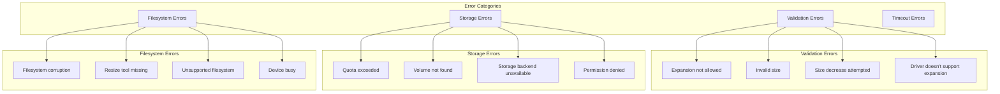
```mermaid
graph TB
    subgraph "Error Categories"
        E1[Validation Errors]
        E2[Storage Errors]
        E3[Filesystem Errors]
        E4[Timeout Errors]
    end

    subgraph "Validation Errors"
        V1[Expansion not allowed]
        V2[Invalid size]
        V3[Size decrease attempted]
        V4[Driver doesn't support expansion]
    end

    subgraph "Storage Errors"
        S1[Quota exceeded]
        S2[Volume not found]
        S3[Storage backend unavailable]
        S4[Permission denied]
    end

    subgraph "Filesystem Errors"
        F1[Filesystem corruption]
        F2[Resize tool missing]
        F3[Unsupported filesystem]
        F4[Device busy]
    end

    E1 --> V1
    E1 --> V2
    E1 --> V3
    E1 --> V4

    E2 --> S1
    E2 --> S2
    E2 --> S3
    E2 --> S4

    E3 --> F1
    E3 --> F2
    E3 --> F3
    E3 --> F4
```

### **Error Recovery Flow**

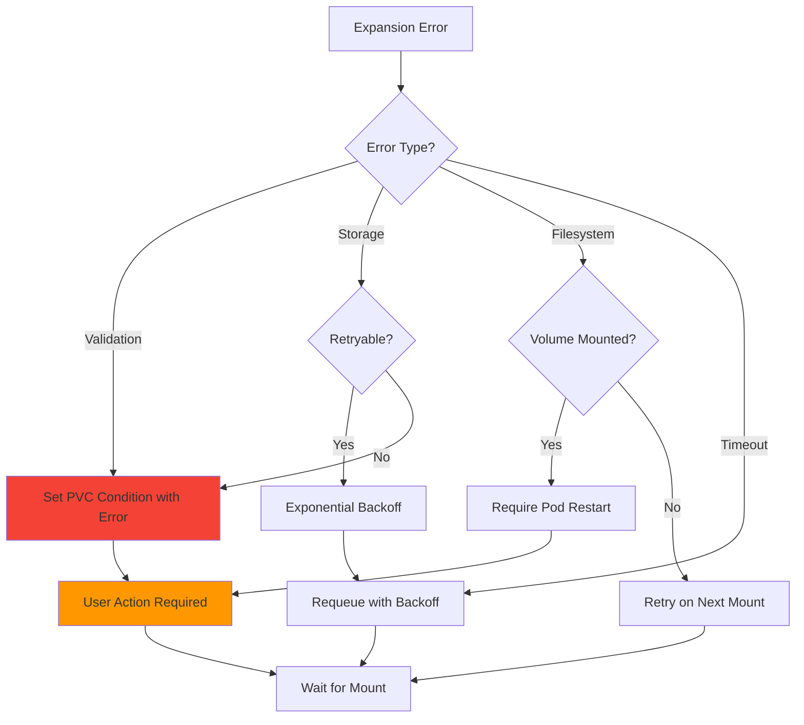
```mermaid
flowchart TD
    Start[Expansion Error] --> Type{Error Type?}

    Type -->|Validation| SetCondition[Set PVC Condition with Error]
    Type -->|Storage| Retry{Retryable?}
    Type -->|Filesystem| CheckMount{Volume Mounted?}
    Type -->|Timeout| Requeue[Requeue with Backoff]

    Retry -->|Yes| Backoff[Exponential Backoff]
    Retry -->|No| SetCondition

    CheckMount -->|Yes| RequireUnmount[Require Pod Restart]
    CheckMount -->|No| RetryFS[Retry on Next Mount]

    Backoff --> Requeue
    SetCondition --> UserAction[User Action Required]
    RequireUnmount --> UserAction
    RetryFS --> End[Wait for Mount]
    Requeue --> End
    UserAction --> End

    style UserAction fill:#FF9800
    style SetCondition fill:#F44336
```

**File:** `/pkg/controller/volume/expand/expand_controller.go:500-580`

```go
// handleExpansionFailure processes expansion failures
func (expc *expandController) handleExpansionFailure(
    pvc *v1.PersistentVolumeClaim,
    err error,
) error {

    klog.Errorf("Volume expansion failed for PVC %s/%s: %v",
        pvc.Namespace, pvc.Name, err)

    // Determine error type and set appropriate condition
    var message string
    var reason string

    if isValidationError(err) {
        reason = "ValidationFailed"
        message = fmt.Sprintf("Expansion validation failed: %v", err)
    } else if isStorageError(err) {
        reason = "StorageError"
        message = fmt.Sprintf("Storage backend error: %v", err)
    } else if isFilesystemError(err) {
        reason = "FilesystemError"
        message = fmt.Sprintf("Filesystem resize error: %v", err)
    } else {
        reason = "UnknownError"
        message = fmt.Sprintf("Expansion failed: %v", err)
    }

    // Update PVC with error condition
    pvcClone := pvc.DeepCopy()
    condition := v1.PersistentVolumeClaimCondition{
        Type:               v1.PersistentVolumeClaimResizing,
        Status:             v1.ConditionFalse,
        LastTransitionTime: metav1.Now(),
        Reason:             reason,
        Message:            message,
    }

    pvcClone.Status.Conditions = updateCondition(
        pvcClone.Status.Conditions,
        condition,
    )

    _, updateErr := expc.kubeClient.CoreV1().PersistentVolumeClaims(pvc.Namespace).
        UpdateStatus(context.TODO(), pvcClone, metav1.UpdateOptions{})

    if updateErr != nil {
        klog.Errorf("Error updating PVC condition: %v", updateErr)
        return updateErr
    }

    // Determine if error is retryable
    if isRetryableError(err) {
        // Requeue with backoff
        return err
    }

    // Non-retryable error - user action required
    return nil
}

// isRetryableError determines if an error should be retried
func isRetryableError(err error) bool {
    // Temporary network errors
    if strings.Contains(err.Error(), "connection refused") ||
       strings.Contains(err.Error(), "timeout") {
        return true
    }

    // Storage backend temporarily unavailable
    if strings.Contains(err.Error(), "unavailable") {
        return true
    }

    // Resource conflicts (optimistic locking)
    if errors.IsConflict(err) {
        return true
    }

    return false
}
```

### **Retry and Backoff Strategy**

```mermaid
graph LR
    subgraph "Retry Queue"
        Q1[Attempt 1: 0s]
        Q2[Attempt 2: 5s]
        Q3[Attempt 3: 10s]
        Q4[Attempt 4: 20s]
        Q5[Attempt 5: 40s]
        Q6[Max: 5min]
    end

    Q1 -->|Fail| Q2
    Q2 -->|Fail| Q3
    Q3 -->|Fail| Q4
    Q4 -->|Fail| Q5
    Q5 -->|Fail| Q6

    Q1 -->|Success| Done[Complete]
    Q2 -->|Success| Done
    Q3 -->|Success| Done
    Q4 -->|Success| Done
    Q5 -->|Success| Done
    Q6 -->|Give Up| Failed[Set Error Condition]

    style Done fill:#00C853
    style Failed fill:#F44336
```

**File:** `/pkg/controller/volume/expand/expand_controller.go:600-650`

```go
// workQueue configuration with exponential backoff
func NewExpandController(...) (*expandController, error) {

    // Create rate limiter with exponential backoff
    rateLimiter := workqueue.NewItemExponentialFailureRateLimiter(
        5*time.Second,   // base delay
        5*time.Minute,   // max delay
    )

    expc := &expandController{
        queue: workqueue.NewNamedRateLimitingQueue(
            rateLimiter,
            "volume_expand",
        ),
    }

    return expc, nil
}

// processNextWorkItem handles retry logic
func (expc *expandController) processNextWorkItem() bool {
    key, shutdown := expc.queue.Get()
    if shutdown {
        return false
    }
    defer expc.queue.Done(key)

    err := expc.syncHandler(key.(string))

    if err == nil {
        // Success - forget the item
        expc.queue.Forget(key)
        return true
    }

    // Error - check retry count
    if expc.queue.NumRequeues(key) < 10 {
        klog.V(4).Infof("Error expanding volume %s, requeueing: %v", key, err)
        expc.queue.AddRateLimited(key)
        return true
    }

    // Max retries exceeded
    klog.Errorf("Max retries exceeded for volume %s: %v", key, err)
    expc.queue.Forget(key)
    return true
}
```

━━━━━━━━━━━━━━━━━━━━━━━━━━━━━━━━━━━━━━━━━━━━━━━━━━━━━━━━━━━━━━━━━━━━━━━━━━━━━━

## **Metrics and Monitoring**

### **Expansion Metrics**

```mermaid
graph TB
    subgraph "Controller Metrics"
        M1[volume_expansion_total]
        M2[volume_expansion_duration_seconds]
        M3[volume_expansion_errors_total]
        M4[volume_expansion_pending]
    end

    subgraph "Labels"
        L1[driver_name]
        L2[operation: controller/node]
        L3[status: success/failure]
        L4[error_type]
    end

    subgraph "Kubelet Metrics"
        K1[volume_manager_total_volumes]
        K2[node_expansion_duration_seconds]
        K3[filesystem_resize_errors_total]
    end

    M1 --> L1
    M1 --> L3
    M2 --> L1
    M2 --> L2
    M3 --> L4

    style M1 fill:#326CE5
    style M2 fill:#326CE5
    style M3 fill:#F44336
```

**File:** `/pkg/controller/volume/expand/metrics.go`

```go
// Metrics for volume expansion
var (
    volumeExpansionTotal = prometheus.NewCounterVec(
        prometheus.CounterOpts{
            Name: "volume_expansion_total",
            Help: "Total number of volume expansion attempts",
        },
        []string{"driver_name", "status"},
    )

    volumeExpansionDuration = prometheus.NewHistogramVec(
        prometheus.HistogramOpts{
            Name:    "volume_expansion_duration_seconds",
            Help:    "Duration of volume expansion operations",
            Buckets: prometheus.ExponentialBuckets(0.1, 2, 10),
        },
        []string{"driver_name", "operation"},
    )

    volumeExpansionErrors = prometheus.NewCounterVec(
        prometheus.CounterOpts{
            Name: "volume_expansion_errors_total",
            Help: "Total number of volume expansion errors",
        },
        []string{"driver_name", "error_type"},
    )

    volumeExpansionPending = prometheus.NewGaugeVec(
        prometheus.GaugeOpts{
            Name: "volume_expansion_pending",
            Help: "Number of volumes pending expansion",
        },
        []string{"driver_name"},
    )
)

func init() {
    prometheus.MustRegister(volumeExpansionTotal)
    prometheus.MustRegister(volumeExpansionDuration)
    prometheus.MustRegister(volumeExpansionErrors)
    prometheus.MustRegister(volumeExpansionPending)
}

// recordExpansionMetrics records metrics for an expansion operation
func (expc *expandController) recordExpansionMetrics(
    driverName string,
    operation string,
    startTime time.Time,
    err error,
) {

    duration := time.Since(startTime).Seconds()
    volumeExpansionDuration.WithLabelValues(driverName, operation).Observe(duration)

    if err == nil {
        volumeExpansionTotal.WithLabelValues(driverName, "success").Inc()
    } else {
        volumeExpansionTotal.WithLabelValues(driverName, "failure").Inc()

        errorType := "unknown"
        if isValidationError(err) {
            errorType = "validation"
        } else if isStorageError(err) {
            errorType = "storage"
        } else if isFilesystemError(err) {
            errorType = "filesystem"
        }

        volumeExpansionErrors.WithLabelValues(driverName, errorType).Inc()
    }
}
```

### **Monitoring Dashboard Query Examples**

**Prometheus Queries:**

```promql
# Expansion success rate by driver
rate(volume_expansion_total{status="success"}[5m]) /
rate(volume_expansion_total[5m])

# Average expansion duration
histogram_quantile(0.95,
  rate(volume_expansion_duration_seconds_bucket[5m])
)

# Expansion errors by type
sum by (error_type) (
  rate(volume_expansion_errors_total[5m])
)

# Pending expansions
sum by (driver_name) (
  volume_expansion_pending
)
```

━━━━━━━━━━━━━━━━━━━━━━━━━━━━━━━━━━━━━━━━━━━━━━━━━━━━━━━━━━━━━━━━━━━━━━━━━━━━━━

## **Troubleshooting Guide**

### **Common Issues and Solutions**

```mermaid
graph TB
    subgraph "Issue: Expansion Stuck"
        I1[Check PVC Conditions]
        I2[Check StorageClass]
        I3[Check Driver Logs]
        I4[Check external-resizer Logs]
    end

    subgraph "Issue: Filesystem Not Resized"
        F1[Check FileSystemResizePending]
        F2[Restart Pod]
        F3[Check Kubelet Logs]
        F4[Check Node CSI Logs]
    end

    subgraph "Issue: Capacity Mismatch"
        C1[Check PV Capacity]
        C2[Check PVC Capacity]
        C3[Check Storage Backend]
        C4[Reconcile Capacities]
    end

    style I1 fill:#FF9800
    style F1 fill:#FF9800
    style C1 fill:#FF9800
```

### **Diagnostic Commands**

```bash
# Check PVC status
kubectl get pvc <pvc-name> -o yaml

# Check PVC conditions
kubectl get pvc <pvc-name> -o jsonpath='{.status.conditions}'

# Check PV capacity
kubectl get pv <pv-name> -o jsonpath='{.spec.capacity.storage}'

# Check StorageClass
kubectl get sc <storage-class> -o yaml

# Check CSI driver capabilities
kubectl get csidriver <driver-name> -o yaml

# Check expansion controller logs
kubectl logs -n kube-system -l component=kube-controller-manager \
  | grep expand

# Check external-resizer logs
kubectl logs -n kube-system -l app=csi-resizer

# Check kubelet logs for node expansion
journalctl -u kubelet | grep -i expand

# Check node CSI driver logs
kubectl logs -n kube-system <csi-node-pod> -c csi-driver
```

### **Debug Checklist**

**File:** `/docs/troubleshooting/volume-expansion.md` (example documentation)

```markdown
## Volume Expansion Troubleshooting Checklist

### 1. Verify Expansion is Allowed
- [ ] StorageClass has `allowVolumeExpansion: true`
- [ ] CSI driver supports expansion (check GetPluginCapabilities)
- [ ] PVC is in Bound state

### 2. Check PVC Status
- [ ] PVC spec.resources.requests.storage > status.capacity.storage
- [ ] Check PVC conditions for errors
- [ ] Verify no conflicting conditions

### 3. Controller Expansion Phase
- [ ] Check kube-controller-manager logs
- [ ] Verify external-resizer is running
- [ ] Check external-resizer logs for errors
- [ ] Verify PV capacity was updated

### 4. Node Expansion Phase
- [ ] Check for FileSystemResizePending condition
- [ ] Verify pod is running and volume is mounted
- [ ] Check kubelet logs for NodeExpandVolume calls
- [ ] Check CSI node plugin logs

### 5. Storage Backend
- [ ] Verify volume exists in storage backend
- [ ] Check actual volume size in storage system
- [ ] Verify no quota or permission issues
- [ ] Check storage system logs

### 6. Recovery Steps
- [ ] If controller expansion failed: fix error and increase PVC size again
- [ ] If node expansion stuck: restart pod to retry
- [ ] If persistent failure: check driver compatibility and logs
```

━━━━━━━━━━━━━━━━━━━━━━━━━━━━━━━━━━━━━━━━━━━━━━━━━━━━━━━━━━━━━━━━━━━━━━━━━━━━━━

## **Best Practices**

### **StorageClass Design**

```yaml
apiVersion: storage.k8s.io/v1
kind: StorageClass
metadata:
  name: fast-ssd-expandable
  annotations:
    storageclass.kubernetes.io/is-default-class: "false"
provisioner: pd.csi.storage.gke.io
parameters:
  type: pd-ssd
  replication-type: regional-pd
allowVolumeExpansion: true  # Enable expansion
volumeBindingMode: WaitForFirstConsumer
reclaimPolicy: Delete
```

### **PVC Size Planning**

```mermaid
flowchart TD
    Start[Plan PVC Size] --> Estimate[Estimate Storage Needs]
    Estimate --> Buffer{Add Buffer?}

    Buffer -->|Yes| Add20[Add 20-30% Buffer]
    Buffer -->|No| Direct[Use Exact Size]

    Add20 --> CheckMax{Check Max Size Limit}
    Direct --> CheckMax

    CheckMax -->|Within Limit| Create[Create PVC]
    CheckMax -->|Exceeds Limit| Adjust[Adjust Size Down]

    Adjust --> Create
    Create --> Monitor[Monitor Usage]

    Monitor --> Threshold{> 80% Full?}
    Threshold -->|Yes| Plan[Plan Expansion]
    Threshold -->|No| Continue[Continue Monitoring]

    Plan --> Expand[Expand PVC]
    Expand --> Verify[Verify Expansion]
    Verify --> Continue

    style Expand fill:#00C853
    style Monitor fill:#326CE5
```

### **Expansion Best Practices**

**1. Pre-Expansion Checks:**

```bash
#!/bin/bash
# Pre-expansion validation script

PVC_NAME=$1
NAMESPACE=$2
NEW_SIZE=$3

# Check current size
CURRENT_SIZE=$(kubectl get pvc $PVC_NAME -n $NAMESPACE \
  -o jsonpath='{.status.capacity.storage}')

echo "Current size: $CURRENT_SIZE"
echo "Requested size: $NEW_SIZE"

# Check StorageClass
SC=$(kubectl get pvc $PVC_NAME -n $NAMESPACE \
  -o jsonpath='{.spec.storageClassName}')

EXPANSION_ALLOWED=$(kubectl get sc $SC \
  -o jsonpath='{.allowVolumeExpansion}')

if [ "$EXPANSION_ALLOWED" != "true" ]; then
  echo "ERROR: StorageClass $SC does not allow expansion"
  exit 1
fi

# Check if PVC is bound
PHASE=$(kubectl get pvc $PVC_NAME -n $NAMESPACE \
  -o jsonpath='{.status.phase}')

if [ "$PHASE" != "Bound" ]; then
  echo "ERROR: PVC is not in Bound state"
  exit 1
fi

echo "Pre-expansion checks passed"
```

**2. Expansion Monitoring:**

```bash
#!/bin/bash
# Monitor expansion progress

PVC_NAME=$1
NAMESPACE=$2

echo "Monitoring expansion of PVC $PVC_NAME in namespace $NAMESPACE"

while true; do
  # Get current status
  CAPACITY=$(kubectl get pvc $PVC_NAME -n $NAMESPACE \
    -o jsonpath='{.status.capacity.storage}')

  CONDITIONS=$(kubectl get pvc $PVC_NAME -n $NAMESPACE \
    -o jsonpath='{.status.conditions[*].type}')

  echo "Current capacity: $CAPACITY"
  echo "Conditions: $CONDITIONS"

  # Check for FileSystemResizePending
  if echo "$CONDITIONS" | grep -q "FileSystemResizePending"; then
    echo "Waiting for filesystem resize (pod restart may be needed)"
  fi

  # Check for errors
  if echo "$CONDITIONS" | grep -q "ResizeFailed"; then
    echo "ERROR: Expansion failed"
    kubectl get pvc $PVC_NAME -n $NAMESPACE -o yaml
    exit 1
  fi

  # Check if expansion complete
  if ! echo "$CONDITIONS" | grep -q "Resizing"; then
    echo "Expansion complete!"
    exit 0
  fi

  sleep 10
done
```

**3. Capacity Planning Strategy:**

```mermaid
graph TB
    subgraph "Monitoring"
        M1[Set up alerts at 70% full]
        M2[Monitor growth rate]
        M3[Predict expansion timing]
    end

    subgraph "Planning"
        P1[Calculate new size]
        P2[Check quota limits]
        P3[Schedule expansion window]
    end

    subgraph "Execution"
        E1[Perform expansion]
        E2[Monitor progress]
        E3[Verify success]
    end

    subgraph "Validation"
        V1[Check application]
        V2[Verify new capacity]
        V3[Update documentation]
    end

    M1 --> M2 --> M3
    M3 --> P1
    P1 --> P2 --> P3
    P3 --> E1 --> E2 --> E3
    E3 --> V1 --> V2 --> V3
```

━━━━━━━━━━━━━━━━━━━━━━━━━━━━━━━━━━━━━━━━━━━━━━━━━━━━━━━━━━━━━━━━━━━━━━━━━━━━━━

## **Cross-References**

### **Related Documentation**

- **CSI Plugin Manager:** `/docs/architecture/claude/csi/high-level/01-plugin-manager-architecture.md`
  - Driver registration and capability detection
  - Plugin lifecycle management

- **Volume Attachment Controller:** `/docs/architecture/claude/csi/high-level/02-attachment-controller.md`
  - VolumeAttachment resource management
  - Controller publish/unpublish workflow

- **Kubelet Volume Manager:** `/docs/architecture/claude/csi/high-level/03-kubelet-volume-manager.md`
  - Volume mounting and unmounting
  - Filesystem operations

- **PV Controller Integration:** `/docs/architecture/claude/csi/middle-level/04-pv-controller-integration.md`
  - PV/PVC binding
  - Dynamic provisioning workflow

- **Volume Operations:** `/docs/architecture/claude/csi/low-level/03-volume-operations.md`
  - Mount and attach operations
  - Expansion operation details

### **External Resources**

- **CSI Spec:** https://github.com/container-storage-interface/spec
- **External Resizer:** https://github.com/kubernetes-csi/external-resizer
- **Volume Expansion KEP:** https://github.com/kubernetes/enhancements/tree/master/keps/sig-storage/284-enable-volume-expansion

━━━━━━━━━━━━━━━━━━━━━━━━━━━━━━━━━━━━━━━━━━━━━━━━━━━━━━━━━━━━━━━━━━━━━━━━━━━━━━

## **Summary**

The CSI Volume Expansion Controller provides critical functionality for dynamically resizing persistent volumes in Kubernetes. Key aspects include:

**Architecture Highlights:**
- Two-phase expansion: controller (storage) and node (filesystem)
- Integration with external-resizer sidecar for CSI volumes
- Support for both online (mounted) and offline (unmounted) expansion
- PVC condition management for tracking expansion state

**Workflow:**
1. User increases PVC spec.resources.requests.storage
2. Controller validates expansion is allowed
3. external-resizer calls CSI ControllerExpandVolume
4. Storage backend increases volume capacity
5. PVC marked with FileSystemResizePending
6. Kubelet calls CSI NodeExpandVolume
7. Filesystem resized (online or during mount)
8. PVC status.capacity updated

**Key Components:**
- Expand controller in kube-controller-manager
- external-resizer sidecar container
- CSI driver controller and node services
- Kubelet volume manager for filesystem resize

This comprehensive expansion system enables seamless storage scaling without downtime for applications.
