# **CSI PersistentVolume Controller Integration**

━━━━━━━━━━━━━━━━━━━━━━━━━━━━━━━━━━━━━━━━━━━━━━━━━━━━━━━━━━━━━━━━━━━━━━━━━━━━━━

## **Overview**

The PersistentVolume (PV) Controller is a core component of Kubernetes storage orchestration that manages the lifecycle of PersistentVolume and PersistentVolumeClaim resources. For CSI volumes, it coordinates with external provisioners to create and bind volumes dynamically, manages topology constraints, and ensures proper volume lifecycle management.

**Key Responsibilities:**
- Watch PVC resources for provisioning requests
- Coordinate with external-provisioner for dynamic volume creation
- Bind PVs to PVCs based on matching criteria
- Handle volume topology constraints and scheduling
- Manage reclaim policies (Delete, Retain)
- Support both static and dynamic provisioning workflows

**Code Location:** `/pkg/controller/volume/persistentvolume/`

━━━━━━━━━━━━━━━━━━━━━━━━━━━━━━━━━━━━━━━━━━━━━━━━━━━━━━━━━━━━━━━━━━━━━━━━━━━━━━

## **Architecture Overview**

### **PV Controller Architecture**

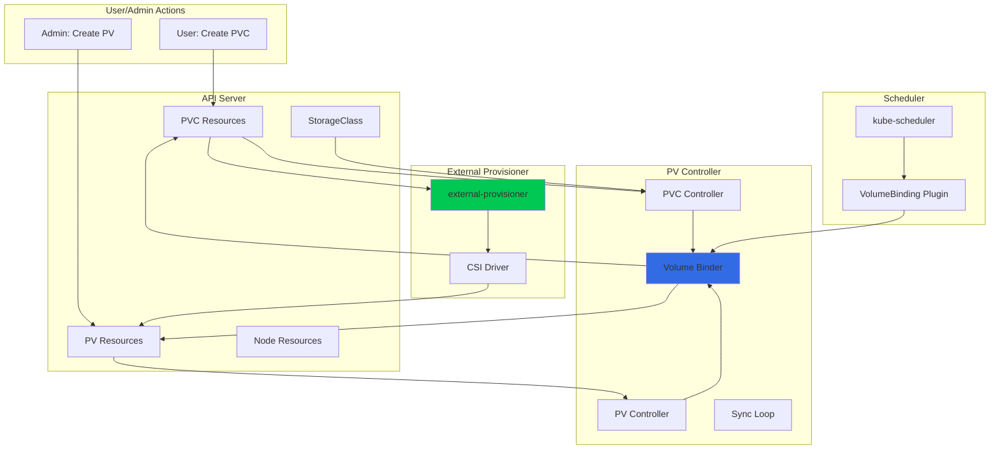

### **Controller State Machine**

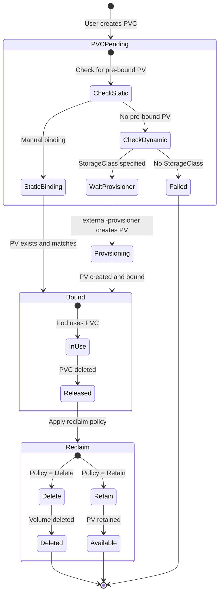

━━━━━━━━━━━━━━━━━━━━━━━━━━━━━━━━━━━━━━━━━━━━━━━━━━━━━━━━━━━━━━━━━━━━━━━━━━━━━━

## **PV Controller Implementation**

### **Controller Structure**

**File:** `/pkg/controller/volume/persistentvolume/pv_controller.go:100-180`

```go
// PersistentVolumeController is a controller that synchronizes
// PersistentVolumeClaims and PersistentVolumes
type PersistentVolumeController struct {
    // kubeClient is a kube client
    kubeClient clientset.Interface

    // eventBroadcaster sends events
    eventBroadcaster record.EventBroadcaster
    eventRecorder    record.EventRecorder

    // volumeLister can list/get PVs from the shared informer's store
    volumeLister  corelisters.PersistentVolumeLister
    volumeListerSynced cache.InformerSynced

    // claimLister can list/get PVCs from the shared informer's store
    claimLister  corelisters.PersistentVolumeClaimLister
    claimListerSynced cache.InformerSynced

    // classLister can list/get storage classes from the shared informer's store
    classLister storagelisters.StorageClassLister
    classListerSynced cache.InformerSynced

    // podLister can list/get pods from the shared informer's store
    podLister corelisters.PodLister
    podListerSynced cache.InformerSynced

    // nodeLister can list/get nodes from the shared informer's store
    nodeLister corelisters.NodeLister
    nodeListerSynced cache.InformerSynced

    // volumeQueue is a work queue for PVs
    volumeQueue workqueue.RateLimitingInterface

    // claimQueue is a work queue for PVCs
    claimQueue workqueue.RateLimitingInterface

    // createProvisionedPVBackoff manages backoff for provision errors
    createProvisionedPVBackoff *flowcontrol.Backoff

    // For testing only: hook to call before saving PV/PVC
    saveVolumeHook  func(*v1.PersistentVolume) (*v1.PersistentVolume, error)
    saveClaimHook   func(*v1.PersistentVolumeClaim) (*v1.PersistentVolumeClaim, error)
}
```

### **Controller Initialization**

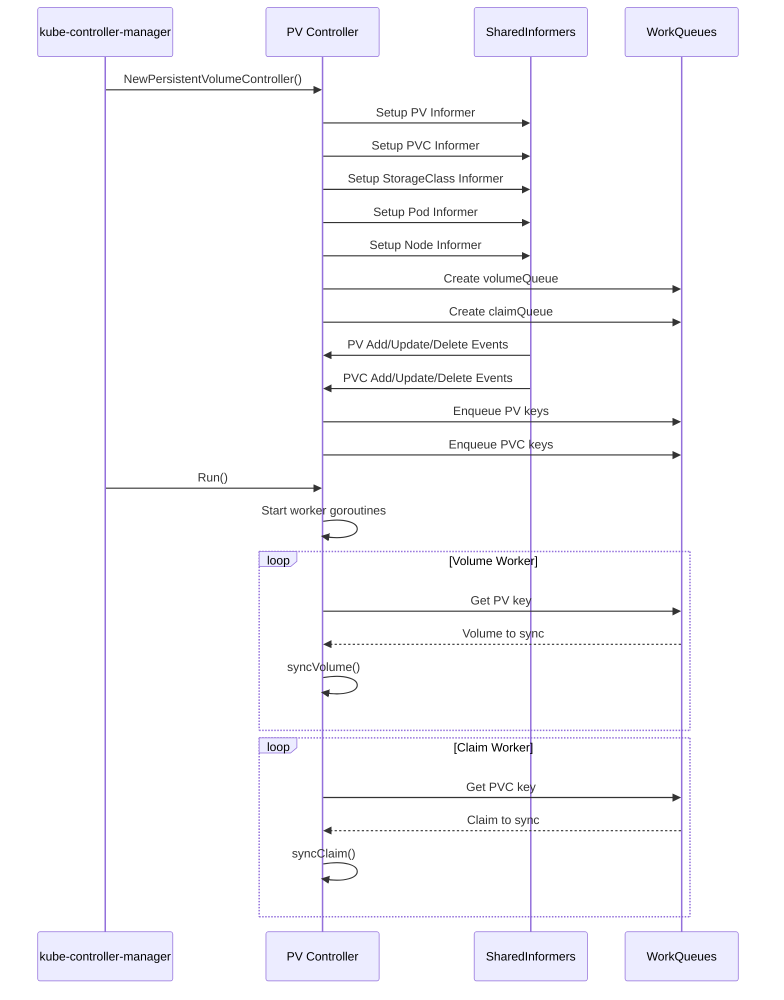

**File:** `/pkg/controller/volume/persistentvolume/pv_controller.go:200-300`

```go
// NewPersistentVolumeController creates a new PersistentVolumeController
func NewPersistentVolumeController(
    kubeClient clientset.Interface,
    resyncPeriod time.Duration,
    volumeInformer coreinformers.PersistentVolumeInformer,
    claimInformer coreinformers.PersistentVolumeClaimInformer,
    classInformer storageinformers.StorageClassInformer,
    podInformer coreinformers.PodInformer,
    nodeInformer coreinformers.NodeInformer,
    eventRecorder record.EventRecorder,
) *PersistentVolumeController {

    controller := &PersistentVolumeController{
        kubeClient:       kubeClient,
        eventBroadcaster: eventBroadcaster,
        eventRecorder:    eventRecorder,
        volumeQueue: workqueue.NewNamedRateLimitingQueue(
            workqueue.DefaultControllerRateLimiter(),
            "volumes",
        ),
        claimQueue: workqueue.NewNamedRateLimitingQueue(
            workqueue.DefaultControllerRateLimiter(),
            "claims",
        ),
        createProvisionedPVBackoff: flowcontrol.NewBackOff(
            time.Minute,
            15*time.Minute,
        ),
    }

    // Setup PV informer
    volumeInformer.Informer().AddEventHandlerWithResyncPeriod(
        cache.ResourceEventHandlerFuncs{
            AddFunc:    controller.addVolume,
            UpdateFunc: controller.updateVolume,
            DeleteFunc: controller.deleteVolume,
        },
        resyncPeriod,
    )
    controller.volumeLister = volumeInformer.Lister()
    controller.volumeListerSynced = volumeInformer.Informer().HasSynced

    // Setup PVC informer
    claimInformer.Informer().AddEventHandlerWithResyncPeriod(
        cache.ResourceEventHandlerFuncs{
            AddFunc:    controller.addClaim,
            UpdateFunc: controller.updateClaim,
            DeleteFunc: controller.deleteClaim,
        },
        resyncPeriod,
    )
    controller.claimLister = claimInformer.Lister()
    controller.claimListerSynced = claimInformer.Informer().HasSynced

    // Setup StorageClass informer
    classInformer.Informer().AddEventHandler(
        cache.ResourceEventHandlerFuncs{
            AddFunc:    controller.addClass,
            UpdateFunc: controller.updateClass,
            DeleteFunc: controller.deleteClass,
        },
    )
    controller.classLister = classInformer.Lister()
    controller.classListerSynced = classInformer.Informer().HasSynced

    // Setup Pod informer (for volume in use protection)
    controller.podLister = podInformer.Lister()
    controller.podListerSynced = podInformer.Informer().HasSynced

    // Setup Node informer (for topology)
    controller.nodeLister = nodeInformer.Lister()
    controller.nodeListerSynced = nodeInformer.Informer().HasSynced

    return controller
}
```

### **Main Sync Loop**

**File:** `/pkg/controller/volume/persistentvolume/pv_controller.go:400-500`

```go
// Run starts the controller
func (ctrl *PersistentVolumeController) Run(stopCh <-chan struct{}) {
    defer utilruntime.HandleCrash()
    defer ctrl.volumeQueue.ShutDown()
    defer ctrl.claimQueue.ShutDown()

    klog.Infof("Starting persistent volume controller")
    defer klog.Infof("Shutting down persistent volume controller")

    // Wait for caches to sync
    if !cache.WaitForNamedCacheSync(
        "persistent volume",
        stopCh,
        ctrl.volumeListerSynced,
        ctrl.claimListerSynced,
        ctrl.classListerSynced,
        ctrl.podListerSynced,
        ctrl.nodeListerSynced,
    ) {
        return
    }

    // Start worker goroutines
    for i := 0; i < 10; i++ {
        go wait.Until(ctrl.volumeWorker, time.Second, stopCh)
        go wait.Until(ctrl.claimWorker, time.Second, stopCh)
    }

    <-stopCh
}

// volumeWorker processes PV work items
func (ctrl *PersistentVolumeController) volumeWorker() {
    for ctrl.processNextVolumeWorkItem() {
    }
}

// processNextVolumeWorkItem processes a single PV work item
func (ctrl *PersistentVolumeController) processNextVolumeWorkItem() bool {
    key, shutdown := ctrl.volumeQueue.Get()
    if shutdown {
        return false
    }
    defer ctrl.volumeQueue.Done(key)

    err := ctrl.syncVolume(key.(string))
    if err == nil {
        ctrl.volumeQueue.Forget(key)
        return true
    }

    utilruntime.HandleError(fmt.Errorf("error syncing PV %q: %v", key, err))
    ctrl.volumeQueue.AddRateLimited(key)
    return true
}

// claimWorker processes PVC work items
func (ctrl *PersistentVolumeController) claimWorker() {
    for ctrl.processNextClaimWorkItem() {
    }
}

// processNextClaimWorkItem processes a single PVC work item
func (ctrl *PersistentVolumeController) processNextClaimWorkItem() bool {
    key, shutdown := ctrl.claimQueue.Get()
    if shutdown {
        return false
    }
    defer ctrl.claimQueue.Done(key)

    err := ctrl.syncClaim(key.(string))
    if err == nil {
        ctrl.claimQueue.Forget(key)
        return true
    }

    utilruntime.HandleError(fmt.Errorf("error syncing PVC %q: %v", key, err))
    ctrl.claimQueue.AddRateLimited(key)
    return true
}
```

━━━━━━━━━━━━━━━━━━━━━━━━━━━━━━━━━━━━━━━━━━━━━━━━━━━━━━━━━━━━━━━━━━━━━━━━━━━━━━

## **Dynamic Provisioning Workflow**

### **Complete Dynamic Provisioning Flow**

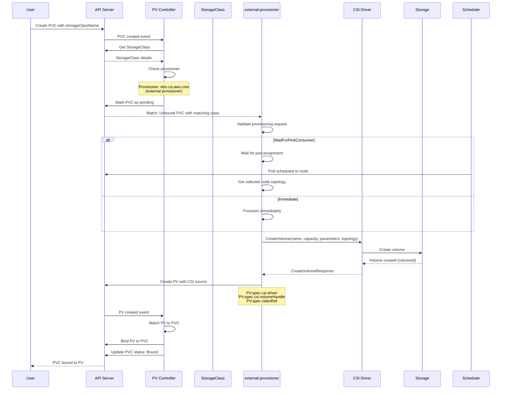

### **PVC Sync Logic**

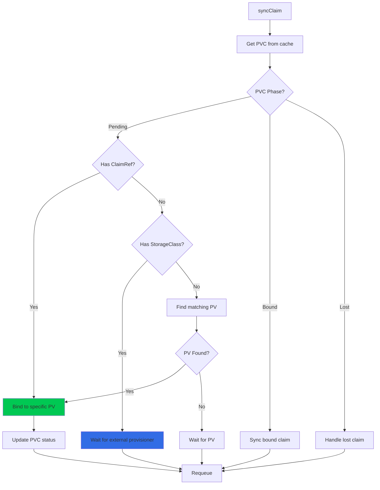

**File:** `/pkg/controller/volume/persistentvolume/pv_controller_base.go:600-750`

```go
// syncClaim is the main PVC synchronization method
func (ctrl *PersistentVolumeController) syncClaim(key string) error {
    klog.V(4).Infof("syncClaim[%s]", key)

    namespace, name, err := cache.SplitMetaNamespaceKey(key)
    if err != nil {
        return err
    }

    // Get PVC from cache
    claim, err := ctrl.claimLister.PersistentVolumeClaims(namespace).Get(name)
    if err != nil {
        if errors.IsNotFound(err) {
            klog.V(3).Infof("PVC %s not found, ignoring", key)
            return nil
        }
        return err
    }

    // Handle based on PVC phase
    switch claim.Status.Phase {
    case v1.ClaimPending:
        return ctrl.syncPendingClaim(claim)
    case v1.ClaimBound:
        return ctrl.syncBoundClaim(claim)
    case v1.ClaimLost:
        return ctrl.syncLostClaim(claim)
    default:
        klog.Warningf("Unknown PVC phase %s for %s", claim.Status.Phase, key)
        return nil
    }
}

// syncPendingClaim handles pending PVCs
func (ctrl *PersistentVolumeController) syncPendingClaim(
    claim *v1.PersistentVolumeClaim,
) error {

    klog.V(4).Infof("syncPendingClaim[%s/%s]", claim.Namespace, claim.Name)

    // Check if PVC has a specific PV pre-bound
    if claim.Spec.VolumeName != "" {
        // Static provisioning - bind to specific PV
        return ctrl.syncStaticClaim(claim)
    }

    // Check for StorageClass
    className := storagehelpers.GetPersistentVolumeClaimClass(claim)
    if className == "" {
        // No StorageClass - find matching unbound PV
        return ctrl.findMatchingVolume(claim)
    }

    // Get StorageClass
    class, err := ctrl.classLister.Get(className)
    if err != nil {
        if errors.IsNotFound(err) {
            ctrl.eventRecorder.Event(claim, v1.EventTypeWarning,
                "ProvisioningFailed",
                fmt.Sprintf("StorageClass %q not found", className))
            return nil
        }
        return err
    }

    // Check if provisioner is external (CSI or other)
    if !ctrl.isInternalProvisioner(class.Provisioner) {
        // External provisioner - wait for it to create PV
        klog.V(4).Infof("PVC %s/%s: waiting for external provisioner %s",
            claim.Namespace, claim.Name, class.Provisioner)
        return nil
    }

    // Internal provisioner (legacy, not CSI)
    return ctrl.provisionClaimOperation(claim, class)
}
```

### **External Provisioner Integration**

**File:** External provisioner reference (kubernetes-csi/external-provisioner)

```go
// Simplified external-provisioner logic
type csiProvisioner struct {
    client      kubernetes.Interface
    csiConn     *grpc.ClientConn
    timeout     time.Duration
    identity    string
    provisioner string
}

func (p *csiProvisioner) Provision(options controller.ProvisionOptions) (*v1.PersistentVolume, error) {
    // Get PVC
    pvc := options.PVC

    // Get StorageClass
    class := options.StorageClass

    // Prepare CreateVolume request
    capacity := pvc.Spec.Resources.Requests[v1.ResourceStorage]

    req := &csi.CreateVolumeRequest{
        Name:               options.PVName,
        CapacityRange: &csi.CapacityRange{
            RequiredBytes: capacity.Value(),
        },
        VolumeCapabilities: getVolumeCapabilities(pvc, class),
        Parameters:         class.Parameters,
    }

    // Add topology requirements if WaitForFirstConsumer
    if class.VolumeBindingMode != nil &&
        *class.VolumeBindingMode == storagev1.VolumeBindingWaitForFirstConsumer {

        // Get selected node from PVC annotation
        selectedNode := pvc.Annotations[volume.AnnSelectedNode]
        if selectedNode != "" {
            // Get node topology
            topology, err := p.getNodeTopology(selectedNode)
            if err != nil {
                return nil, err
            }
            req.AccessibilityRequirements = topology
        }
    }

    // Add secrets for provisioning
    if class.Parameters["csi.storage.k8s.io/provisioner-secret-name"] != "" {
        secrets, err := p.getSecrets(class.Parameters, pvc.Namespace)
        if err != nil {
            return nil, err
        }
        req.Secrets = secrets
    }

    // Call CSI CreateVolume
    ctx, cancel := context.WithTimeout(context.Background(), p.timeout)
    defer cancel()

    client := csi.NewControllerClient(p.csiConn)
    resp, err := client.CreateVolume(ctx, req)
    if err != nil {
        return nil, fmt.Errorf("CreateVolume failed: %v", err)
    }

    // Create PV object
    pv := &v1.PersistentVolume{
        ObjectMeta: metav1.ObjectMeta{
            Name: options.PVName,
        },
        Spec: v1.PersistentVolumeSpec{
            Capacity: v1.ResourceList{
                v1.ResourceStorage: capacity,
            },
            AccessModes: pvc.Spec.AccessModes,
            PersistentVolumeSource: v1.PersistentVolumeSource{
                CSI: &v1.CSIPersistentVolumeSource{
                    Driver:       p.provisioner,
                    VolumeHandle: resp.Volume.VolumeId,
                    FSType:       class.Parameters["csi.storage.k8s.io/fstype"],
                    VolumeAttributes: resp.Volume.VolumeContext,
                },
            },
            PersistentVolumeReclaimPolicy: *class.ReclaimPolicy,
            StorageClassName:              class.Name,
            MountOptions:                  class.MountOptions,
            ClaimRef: &v1.ObjectReference{
                Namespace: pvc.Namespace,
                Name:      pvc.Name,
                UID:       pvc.UID,
            },
        },
    }

    // Add node affinity for topology
    if resp.Volume.AccessibleTopology != nil {
        pv.Spec.NodeAffinity = getNodeAffinity(resp.Volume.AccessibleTopology)
    }

    return pv, nil
}
```

━━━━━━━━━━━━━━━━━━━━━━━━━━━━━━━━━━━━━━━━━━━━━━━━━━━━━━━━━━━━━━━━━━━━━━━━━━━━━━

## **Static Provisioning Workflow**

### **Static Provisioning Flow**

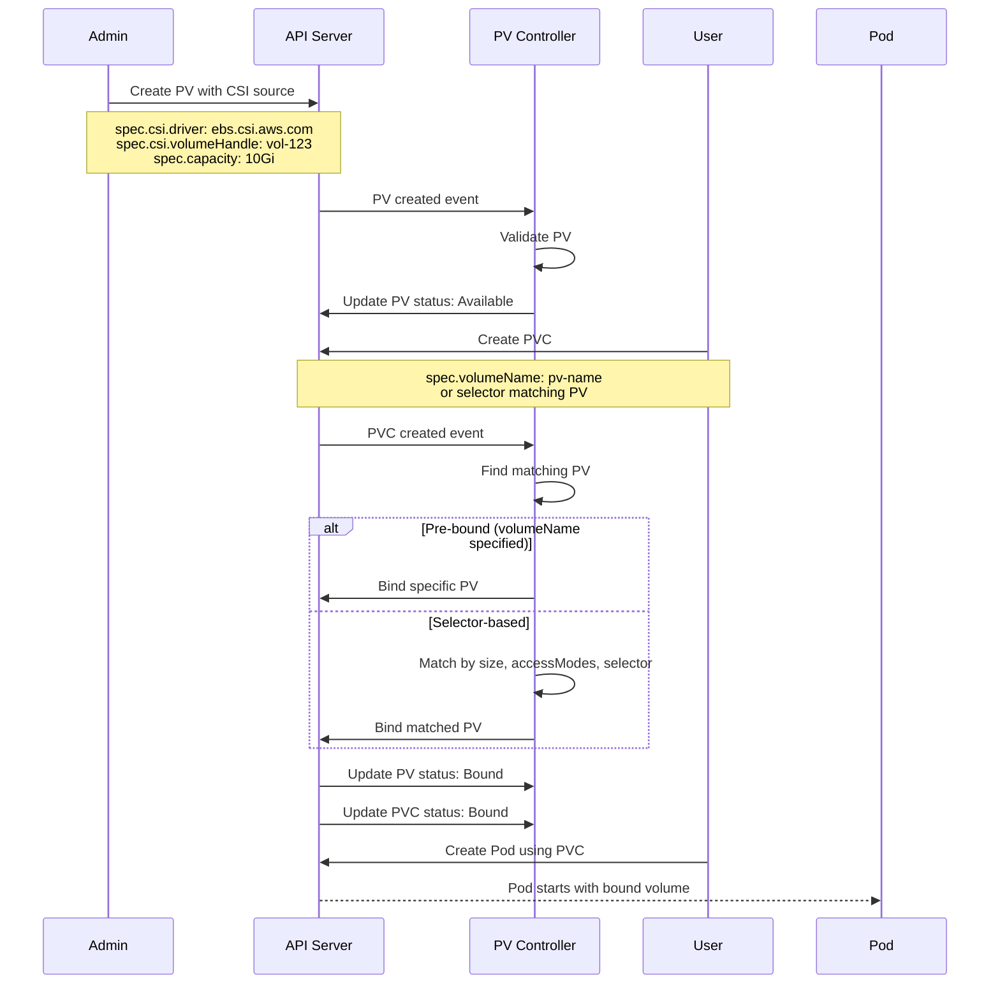

### **PV/PVC Binding Algorithm**

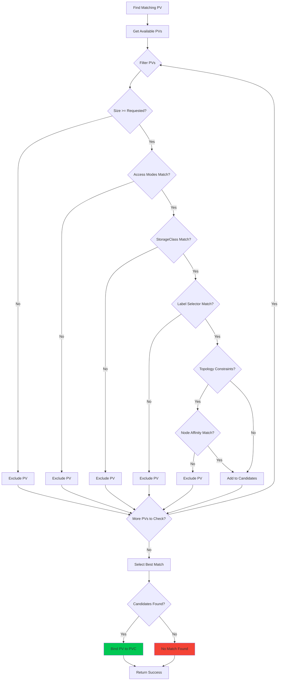

**File:** `/pkg/controller/volume/persistentvolume/pv_controller_base.go:900-1050`

```go
// findMatchingVolume finds a PV that matches the PVC requirements
func (ctrl *PersistentVolumeController) findMatchingVolume(
    claim *v1.PersistentVolumeClaim,
) (*v1.PersistentVolume, error) {

    // Get all available PVs
    volumes, err := ctrl.volumeLister.List(labels.Everything())
    if err != nil {
        return nil, err
    }

    // Filter to only available volumes
    availableVolumes := []*v1.PersistentVolume{}
    for _, volume := range volumes {
        if volume.Status.Phase == v1.VolumeAvailable {
            availableVolumes = append(availableVolumes, volume)
        }
    }

    // Find matching volumes
    var bestMatch *v1.PersistentVolume
    var smallestSize *resource.Quantity

    for _, volume := range availableVolumes {
        if ctrl.volumeMatchesClaim(volume, claim) {
            volumeSize := volume.Spec.Capacity[v1.ResourceStorage]

            // Select smallest volume that satisfies the claim
            if bestMatch == nil || volumeSize.Cmp(*smallestSize) < 0 {
                bestMatch = volume
                smallestSize = &volumeSize
            }
        }
    }

    return bestMatch, nil
}

// volumeMatchesClaim checks if a PV matches a PVC
func (ctrl *PersistentVolumeController) volumeMatchesClaim(
    volume *v1.PersistentVolume,
    claim *v1.PersistentVolumeClaim,
) bool {

    // Check if PV is already bound
    if volume.Spec.ClaimRef != nil {
        return false
    }

    // Check size
    requestedSize := claim.Spec.Resources.Requests[v1.ResourceStorage]
    volumeSize := volume.Spec.Capacity[v1.ResourceStorage]
    if volumeSize.Cmp(requestedSize) < 0 {
        klog.V(4).Infof("PV %s too small for claim %s/%s",
            volume.Name, claim.Namespace, claim.Name)
        return false
    }

    // Check access modes
    if !ctrl.checkAccessModes(volume, claim) {
        klog.V(4).Infof("PV %s access modes don't match claim %s/%s",
            volume.Name, claim.Namespace, claim.Name)
        return false
    }

    // Check StorageClass
    volumeClass := storagehelpers.GetPersistentVolumeClass(volume)
    claimClass := storagehelpers.GetPersistentVolumeClaimClass(claim)
    if volumeClass != claimClass {
        klog.V(4).Infof("PV %s class %s doesn't match claim %s/%s class %s",
            volume.Name, volumeClass, claim.Namespace, claim.Name, claimClass)
        return false
    }

    // Check label selector
    if claim.Spec.Selector != nil {
        selector, err := metav1.LabelSelectorAsSelector(claim.Spec.Selector)
        if err != nil {
            klog.Errorf("Error parsing claim selector: %v", err)
            return false
        }

        if !selector.Matches(labels.Set(volume.Labels)) {
            klog.V(4).Infof("PV %s labels don't match claim %s/%s selector",
                volume.Name, claim.Namespace, claim.Name)
            return false
        }
    }

    // Check node affinity (topology)
    if volume.Spec.NodeAffinity != nil {
        // Topology matching is complex - delegated to scheduler
        // For now, accept volumes with node affinity
        klog.V(4).Infof("PV %s has node affinity, topology will be checked by scheduler",
            volume.Name)
    }

    return true
}

// checkAccessModes verifies access modes compatibility
func (ctrl *PersistentVolumeController) checkAccessModes(
    volume *v1.PersistentVolume,
    claim *v1.PersistentVolumeClaim,
) bool {

    volumeModes := volume.Spec.AccessModes
    claimModes := claim.Spec.AccessModes

    // Claim must be subset of volume modes
    for _, claimMode := range claimModes {
        found := false
        for _, volumeMode := range volumeModes {
            if claimMode == volumeMode {
                found = true
                break
            }
        }
        if !found {
            return false
        }
    }

    return true
}
```

━━━━━━━━━━━━━━━━━━━━━━━━━━━━━━━━━━━━━━━━━━━━━━━━━━━━━━━━━━━━━━━━━━━━━━━━━━━━━━

## **Volume Topology Constraints**

### **Topology Architecture**

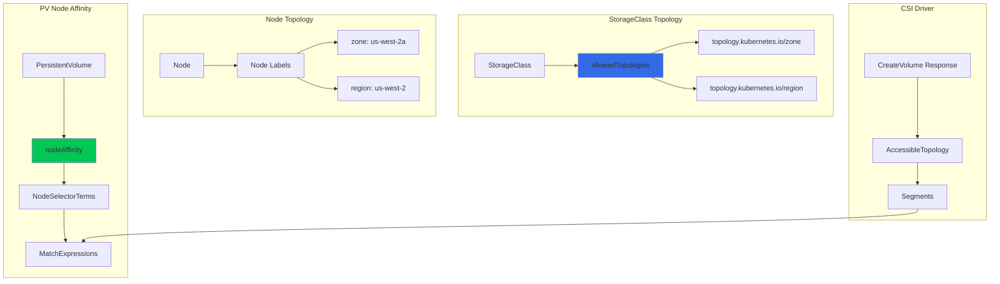

### **Topology-Aware Provisioning**

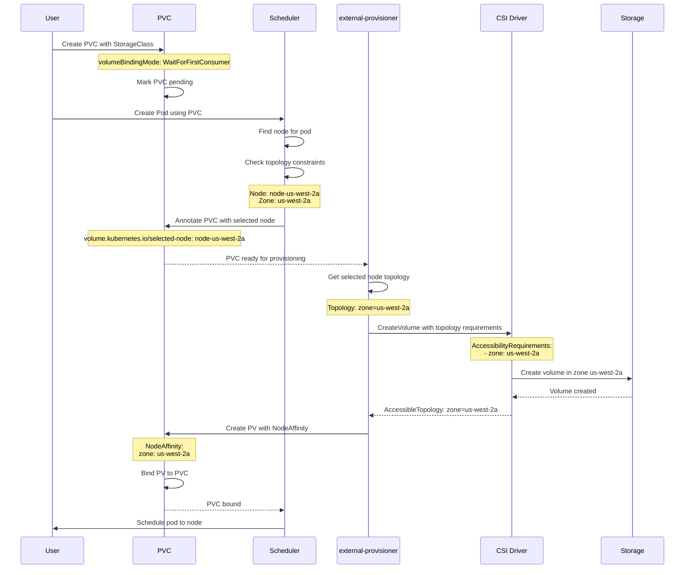

**StorageClass with Topology:**

```yaml
apiVersion: storage.k8s.io/v1
kind: StorageClass
metadata:
  name: ebs-sc-topology
provisioner: ebs.csi.aws.com
parameters:
  type: gp3
  encrypted: "true"
volumeBindingMode: WaitForFirstConsumer
allowedTopologies:
- matchLabelExpressions:
  - key: topology.kubernetes.io/zone
    values:
    - us-west-2a
    - us-west-2b
    - us-west-2c
```

**PV with Node Affinity (created by external-provisioner):**

```yaml
apiVersion: v1
kind: PersistentVolume
metadata:
  name: pv-ebs-vol-123
spec:
  capacity:
    storage: 10Gi
  accessModes:
  - ReadWriteOnce
  persistentVolumeReclaimPolicy: Delete
  storageClassName: ebs-sc-topology
  csi:
    driver: ebs.csi.aws.com
    volumeHandle: vol-0123456789abcdef0
    fsType: ext4
  nodeAffinity:
    required:
      nodeSelectorTerms:
      - matchExpressions:
        - key: topology.kubernetes.io/zone
          operator: In
          values:
          - us-west-2a
```

**File:** `/pkg/controller/volume/persistentvolume/pv_controller_base.go:1200-1280`

```go
// checkNodeAffinity validates node affinity for volume binding
func (ctrl *PersistentVolumeController) checkNodeAffinity(
    volume *v1.PersistentVolume,
    claim *v1.PersistentVolumeClaim,
) (bool, error) {

    // If no node affinity, volume can be used anywhere
    if volume.Spec.NodeAffinity == nil {
        return true, nil
    }

    // Get selected node from PVC annotation (set by scheduler)
    selectedNode := claim.Annotations[volume.AnnSelectedNode]
    if selectedNode == "" {
        // No node selected yet - can't validate affinity
        return true, nil
    }

    // Get node
    node, err := ctrl.nodeLister.Get(selectedNode)
    if err != nil {
        return false, err
    }

    // Check if volume's node affinity matches the selected node
    nodeAffinity := volume.Spec.NodeAffinity
    if nodeAffinity.Required == nil {
        return true, nil
    }

    // Evaluate node selector terms
    for _, term := range nodeAffinity.Required.NodeSelectorTerms {
        matches, err := ctrl.matchNodeSelectorTerm(node, term)
        if err != nil {
            return false, err
        }
        if matches {
            // At least one term matches
            return true, nil
        }
    }

    // No terms matched
    klog.V(4).Infof("PV %s node affinity doesn't match selected node %s",
        volume.Name, selectedNode)
    return false, nil
}

// matchNodeSelectorTerm checks if a node matches a selector term
func (ctrl *PersistentVolumeController) matchNodeSelectorTerm(
    node *v1.Node,
    term v1.NodeSelectorTerm,
) (bool, error) {

    // Check match expressions
    for _, expr := range term.MatchExpressions {
        // Get node label value
        nodeValue, hasLabel := node.Labels[expr.Key]

        switch expr.Operator {
        case v1.NodeSelectorOpIn:
            if !hasLabel {
                return false, nil
            }
            found := false
            for _, value := range expr.Values {
                if nodeValue == value {
                    found = true
                    break
                }
            }
            if !found {
                return false, nil
            }

        case v1.NodeSelectorOpNotIn:
            if hasLabel {
                for _, value := range expr.Values {
                    if nodeValue == value {
                        return false, nil
                    }
                }
            }

        case v1.NodeSelectorOpExists:
            if !hasLabel {
                return false, nil
            }

        case v1.NodeSelectorOpDoesNotExist:
            if hasLabel {
                return false, nil
            }

        case v1.NodeSelectorOpGt:
            if !hasLabel {
                return false, nil
            }
            nodeInt, err := strconv.Atoi(nodeValue)
            if err != nil {
                return false, err
            }
            exprInt, err := strconv.Atoi(expr.Values[0])
            if err != nil {
                return false, err
            }
            if nodeInt <= exprInt {
                return false, nil
            }

        case v1.NodeSelectorOpLt:
            if !hasLabel {
                return false, nil
            }
            nodeInt, err := strconv.Atoi(nodeValue)
            if err != nil {
                return false, err
            }
            exprInt, err := strconv.Atoi(expr.Values[0])
            if err != nil {
                return false, err
            }
            if nodeInt >= exprInt {
                return false, nil
            }
        }
    }

    // All expressions matched
    return true, nil
}
```

━━━━━━━━━━━━━━━━━━━━━━━━━━━━━━━━━━━━━━━━━━━━━━━━━━━━━━━━━━━━━━━━━━━━━━━━━━━━━━

## **Reclaim Policies**

### **Reclaim Policy Flow**

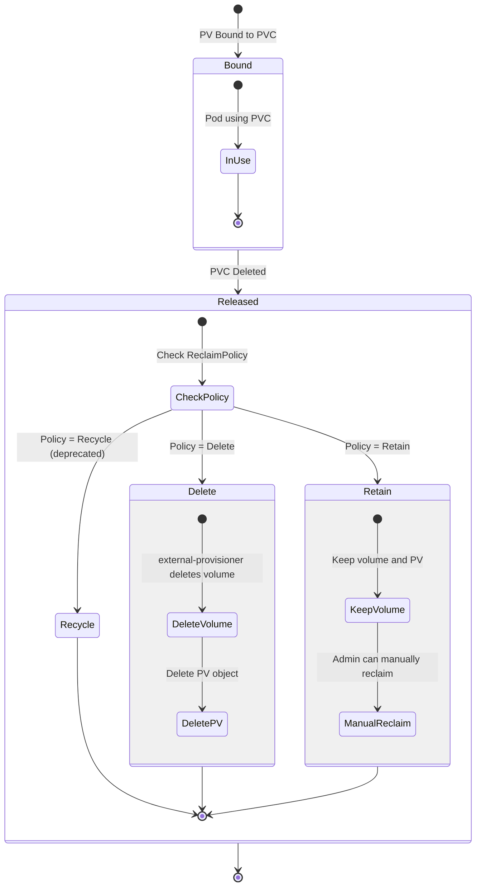

### **Delete Reclaim Policy**

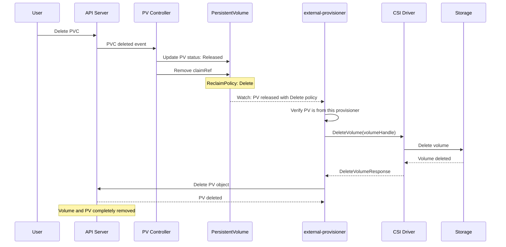

**File:** `/pkg/controller/volume/persistentvolume/pv_controller_base.go:1400-1500`

```go
// syncVolume handles PV synchronization
func (ctrl *PersistentVolumeController) syncVolume(key string) error {
    klog.V(4).Infof("syncVolume[%s]", key)

    volume, err := ctrl.volumeLister.Get(key)
    if err != nil {
        if errors.IsNotFound(err) {
            return nil
        }
        return err
    }

    // Handle based on volume phase
    switch volume.Status.Phase {
    case v1.VolumeAvailable:
        return ctrl.syncAvailableVolume(volume)
    case v1.VolumeBound:
        return ctrl.syncBoundVolume(volume)
    case v1.VolumeReleased:
        return ctrl.syncReleasedVolume(volume)
    case v1.VolumeFailed:
        return ctrl.syncFailedVolume(volume)
    default:
        klog.Warningf("Unknown volume phase %s for %s", volume.Status.Phase, key)
        return nil
    }
}

// syncReleasedVolume handles released volumes based on reclaim policy
func (ctrl *PersistentVolumeController) syncReleasedVolume(
    volume *v1.PersistentVolume,
) error {

    klog.V(4).Infof("syncReleasedVolume[%s]: reclaim policy %s",
        volume.Name, volume.Spec.PersistentVolumeReclaimPolicy)

    switch volume.Spec.PersistentVolumeReclaimPolicy {
    case v1.PersistentVolumeReclaimRetain:
        // Keep volume as-is, admin can manually reclaim
        klog.V(4).Infof("Volume %s has Retain policy, keeping as Released", volume.Name)
        return nil

    case v1.PersistentVolumeReclaimDelete:
        // For CSI volumes, external-provisioner will handle deletion
        // PV controller just needs to ensure volume is in Released state
        if volume.Spec.CSI != nil {
            klog.V(4).Infof("CSI volume %s will be deleted by external-provisioner",
                volume.Name)
            return nil
        }

        // For in-tree volumes, delete here
        return ctrl.deleteVolume(volume)

    case v1.PersistentVolumeReclaimRecycle:
        // Recycle is deprecated
        klog.Warningf("Recycle reclaim policy is deprecated for volume %s", volume.Name)
        return ctrl.recycleVolume(volume)

    default:
        klog.Errorf("Unknown reclaim policy %s for volume %s",
            volume.Spec.PersistentVolumeReclaimPolicy, volume.Name)
        return nil
    }
}
```

**External-provisioner Delete Logic:**

```go
// Simplified external-provisioner deletion logic
func (p *csiProvisioner) Delete(volume *v1.PersistentVolume) error {
    // Verify this is a CSI volume from this provisioner
    if volume.Spec.CSI == nil {
        return fmt.Errorf("not a CSI volume")
    }

    if volume.Spec.CSI.Driver != p.provisioner {
        return fmt.Errorf("not provisioned by this driver")
    }

    volumeID := volume.Spec.CSI.VolumeHandle

    // Get secrets for deletion
    secrets, err := p.getDeleteSecrets(volume)
    if err != nil {
        return err
    }

    // Call CSI DeleteVolume
    req := &csi.DeleteVolumeRequest{
        VolumeId: volumeID,
        Secrets:  secrets,
    }

    ctx, cancel := context.WithTimeout(context.Background(), p.timeout)
    defer cancel()

    client := csi.NewControllerClient(p.csiConn)
    _, err = client.DeleteVolume(ctx, req)
    if err != nil {
        // Check if volume not found (already deleted)
        if status.Code(err) == codes.NotFound {
            klog.V(4).Infof("Volume %s already deleted", volumeID)
            return nil
        }
        return fmt.Errorf("DeleteVolume failed: %v", err)
    }

    klog.V(4).Infof("Successfully deleted volume %s", volumeID)
    return nil
}
```

### **Retain Reclaim Policy**

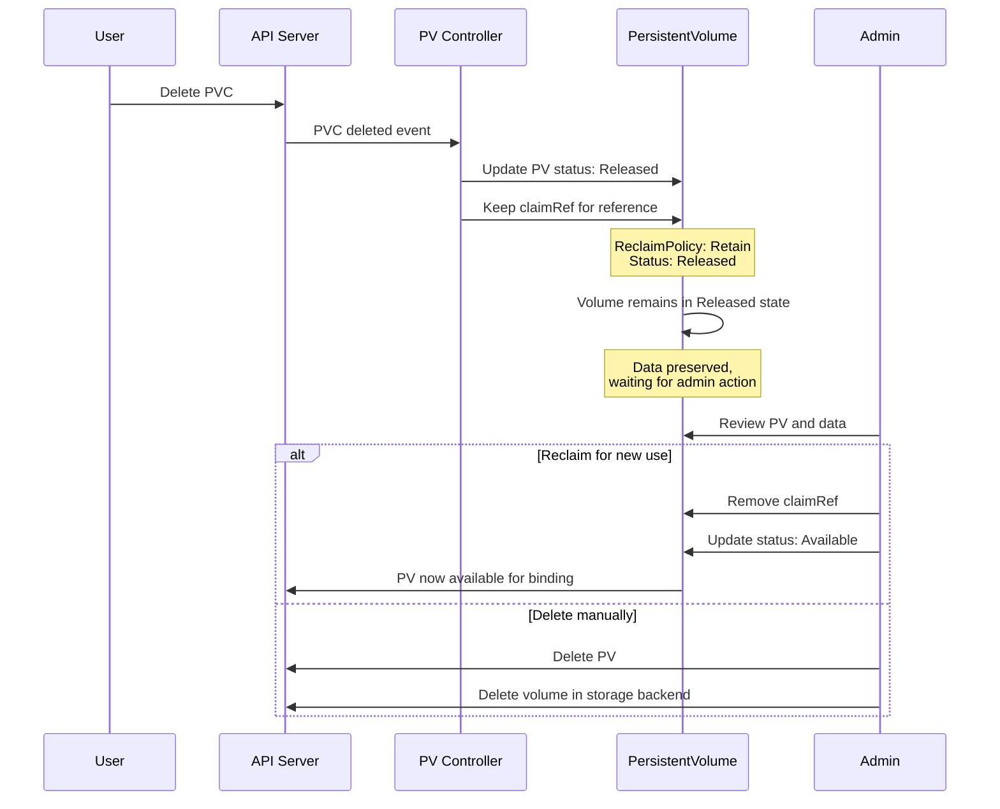

**Manual Reclaim Example:**

```bash
# Get released PVs
kubectl get pv | grep Released

# Inspect PV
kubectl get pv pv-name -o yaml

# Option 1: Make available for new binding
kubectl patch pv pv-name -p '{"spec":{"claimRef":null}}'

# PV status changes to Available and can be bound to new PVC

# Option 2: Delete PV and volume
kubectl delete pv pv-name
# Then manually delete volume in storage backend
```

━━━━━━━━━━━━━━━━━━━━━━━━━━━━━━━━━━━━━━━━━━━━━━━━━━━━━━━━━━━━━━━━━━━━━━━━━━━━━━

## **StorageClass Parameters**

### **Parameter Passing Flow**

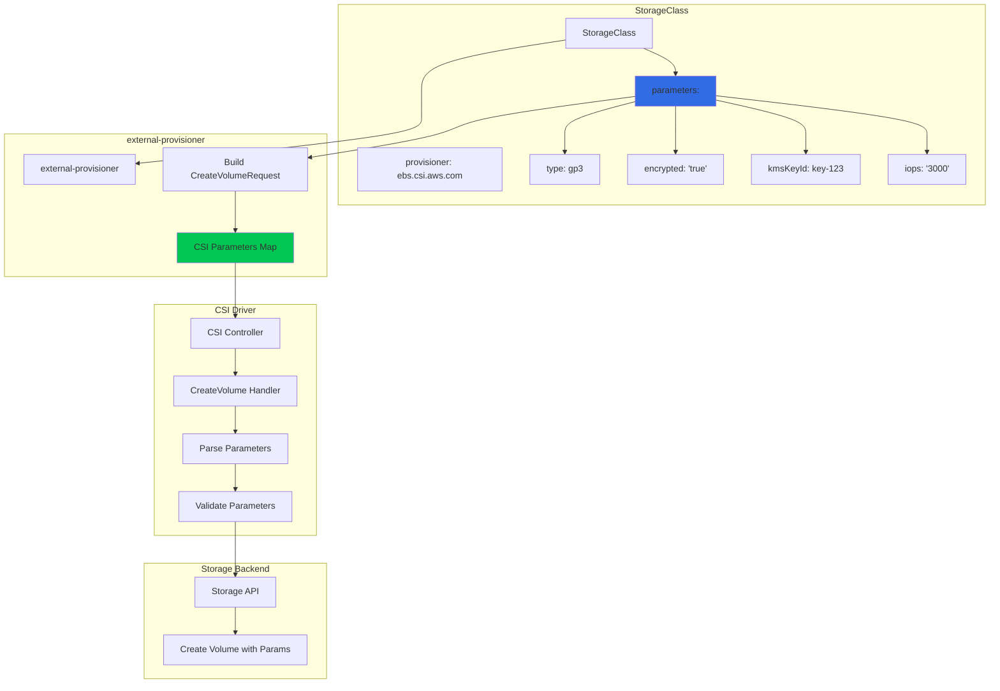

**StorageClass with Parameters:**

```yaml
apiVersion: storage.k8s.io/v1
kind: StorageClass
metadata:
  name: ebs-sc-custom
provisioner: ebs.csi.aws.com
parameters:
  # Volume type
  type: gp3

  # Encryption
  encrypted: "true"
  kmsKeyId: "arn:aws:kms:us-west-2:111122223333:key/1234abcd-12ab-34cd-56ef-1234567890ab"

  # Performance
  iops: "3000"
  throughput: "125"

  # Filesystem
  csi.storage.k8s.io/fstype: ext4

  # Secrets (for credentials)
  csi.storage.k8s.io/provisioner-secret-name: aws-secret
  csi.storage.k8s.io/provisioner-secret-namespace: kube-system

  # Additional driver-specific parameters
  tagSpecification_1: "Name=my-volume"
  tagSpecification_2: "Environment=production"

volumeBindingMode: WaitForFirstConsumer
allowVolumeExpansion: true
reclaimPolicy: Delete
```

**File:** External-provisioner parameter handling

```go
// buildCreateVolumeRequest builds a CreateVolume request from StorageClass
func (p *csiProvisioner) buildCreateVolumeRequest(
    options controller.ProvisionOptions,
) (*csi.CreateVolumeRequest, error) {

    pvc := options.PVC
    class := options.StorageClass

    // Get capacity
    capacity := pvc.Spec.Resources.Requests[v1.ResourceStorage]

    // Filter parameters - remove provisioner-specific annotations
    parameters := map[string]string{}
    for k, v := range class.Parameters {
        // Skip CSI-specific annotations
        if strings.HasPrefix(k, "csi.storage.k8s.io/") {
            continue
        }
        parameters[k] = v
    }

    req := &csi.CreateVolumeRequest{
        Name: options.PVName,
        CapacityRange: &csi.CapacityRange{
            RequiredBytes: capacity.Value(),
        },
        Parameters:         parameters,
        VolumeCapabilities: p.getVolumeCapabilities(pvc, class),
    }

    // Add secrets
    secretName := class.Parameters["csi.storage.k8s.io/provisioner-secret-name"]
    secretNamespace := class.Parameters["csi.storage.k8s.io/provisioner-secret-namespace"]

    if secretName != "" {
        secrets, err := p.getSecrets(secretName, secretNamespace)
        if err != nil {
            return nil, err
        }
        req.Secrets = secrets
    }

    // Add topology
    selectedNode := pvc.Annotations[volume.AnnSelectedNode]
    if selectedNode != "" {
        topology, err := p.getAccessibilityRequirements(selectedNode, class)
        if err != nil {
            return nil, err
        }
        req.AccessibilityRequirements = topology
    }

    return req, nil
}
```

━━━━━━━━━━━━━━━━━━━━━━━━━━━━━━━━━━━━━━━━━━━━━━━━━━━━━━━━━━━━━━━━━━━━━━━━━━━━━━

## **Monitoring and Metrics**

### **PV Controller Metrics**

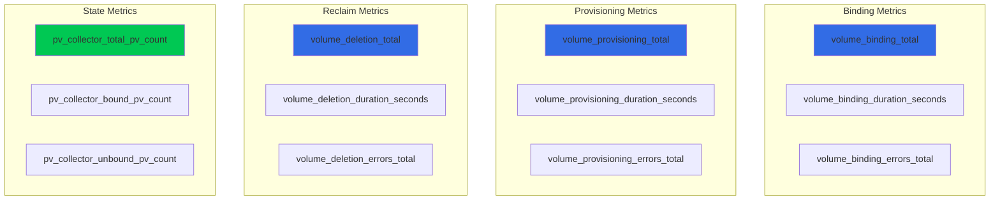

**File:** `/pkg/controller/volume/persistentvolume/metrics.go`

```go
// Metrics for PV controller
var (
    volumeBindingTotal = prometheus.NewCounterVec(
        prometheus.CounterOpts{
            Name: "volume_binding_total",
            Help: "Total number of volume binding attempts",
        },
        []string{"provisioner", "status"},
    )

    volumeBindingDuration = prometheus.NewHistogramVec(
        prometheus.HistogramOpts{
            Name:    "volume_binding_duration_seconds",
            Help:    "Duration of volume binding operations",
            Buckets: prometheus.ExponentialBuckets(0.001, 2, 15),
        },
        []string{"provisioner"},
    )

    pvCollectorTotalPVCount = prometheus.NewGauge(
        prometheus.GaugeOpts{
            Name: "pv_collector_total_pv_count",
            Help: "Total number of PVs in the cluster",
        },
    )

    pvCollectorBoundPVCount = prometheus.NewGauge(
        prometheus.GaugeOpts{
            Name: "pv_collector_bound_pv_count",
            Help: "Number of bound PVs",
        },
    )
)

// Prometheus queries for monitoring
/*
# Binding success rate
rate(volume_binding_total{status="success"}[5m]) /
rate(volume_binding_total[5m])

# Average binding duration
histogram_quantile(0.95,
  rate(volume_binding_duration_seconds_bucket[5m])
)

# Unbound PVs (potential issues)
pv_collector_total_pv_count - pv_collector_bound_pv_count
*/
```

━━━━━━━━━━━━━━━━━━━━━━━━━━━━━━━━━━━━━━━━━━━━━━━━━━━━━━━━━━━━━━━━━━━━━━━━━━━━━━

## **Troubleshooting**

### **Common Issues**

```bash
# PVC stuck in Pending state
kubectl describe pvc <pvc-name>
# Check Events for:
# - StorageClass not found
# - No PV matches
# - Provisioner not running

# Check StorageClass
kubectl get sc <storage-class-name> -o yaml

# Check for matching PVs (static provisioning)
kubectl get pv | grep Available

# Check external-provisioner logs
kubectl logs -n kube-system -l app=csi-provisioner

# PV not binding to PVC
kubectl get pv <pv-name> -o yaml
# Check:
# - spec.claimRef matches intended PVC
# - capacity is sufficient
# - accessModes match
# - storageClassName matches

# Check PV controller logs
kubectl logs -n kube-system -l component=kube-controller-manager \
  | grep persistentvolume

# Volume not deleted after PVC deletion
kubectl get pv <pv-name> -o yaml
# Check:
# - spec.persistentVolumeReclaimPolicy
# - status.phase (should be Released for Delete policy)

# Check external-provisioner logs for deletion errors
kubectl logs -n kube-system -l app=csi-provisioner \
  | grep -i delete
```

━━━━━━━━━━━━━━━━━━━━━━━━━━━━━━━━━━━━━━━━━━━━━━━━━━━━━━━━━━━━━━━━━━━━━━━━━━━━━━

## **Cross-References**

### **Related Documentation**

- **CSI Plugin Manager:** `/docs/architecture/claude/csi/high-level/01-plugin-manager-architecture.md`
  - Driver registration and discovery

- **Scheduler Integration:** `/docs/architecture/claude/csi/middle-level/05-scheduler-integration.md`
  - VolumeBinding plugin and topology scheduling

- **Expansion Controller:** `/docs/architecture/claude/csi/middle-level/03-expansion-controller.md`
  - Volume resizing after provisioning

- **Volume Attachment:** `/docs/architecture/claude/csi/high-level/02-attachment-controller.md`
  - Attach/detach after binding

━━━━━━━━━━━━━━━━━━━━━━━━━━━━━━━━━━━━━━━━━━━━━━━━━━━━━━━━━━━━━━━━━━━━━━━━━━━━━━

## **Summary**

The PersistentVolume Controller is central to Kubernetes storage orchestration, managing the complete lifecycle of persistent volumes. For CSI volumes, it coordinates with external provisioners to enable dynamic provisioning while maintaining backward compatibility with static provisioning.

**Key Features:**
- Dynamic and static provisioning workflows
- Topology-aware volume binding
- Reclaim policy enforcement
- StorageClass parameter passing
- PV/PVC matching and binding algorithm

This integration ensures seamless storage provisioning and management across diverse storage backends through the CSI interface.
