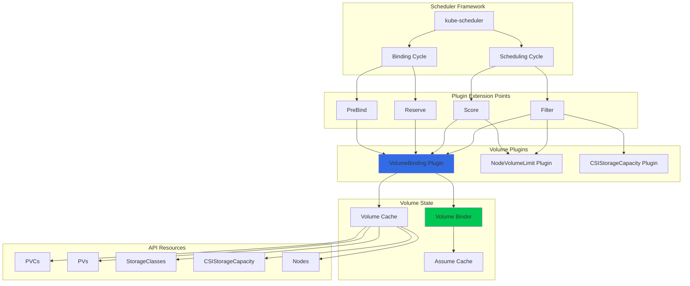
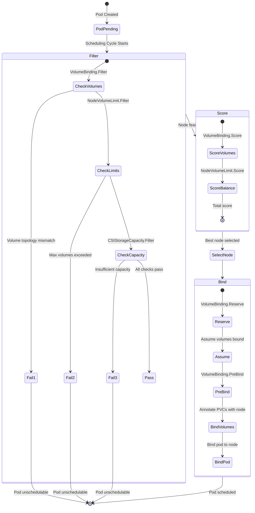
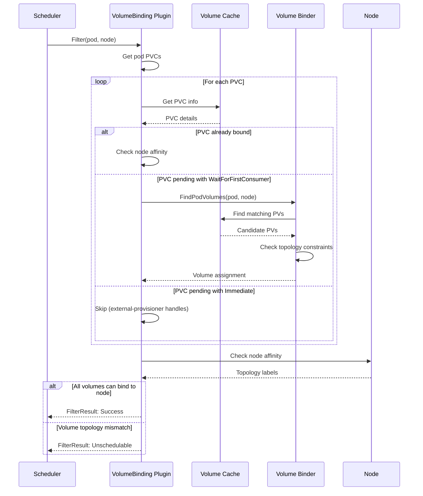
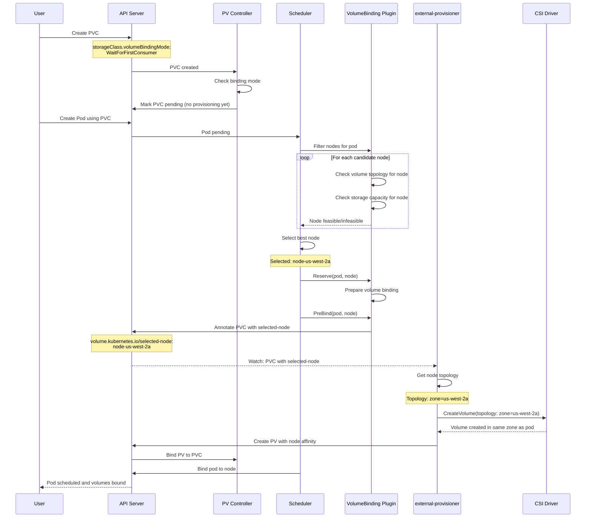
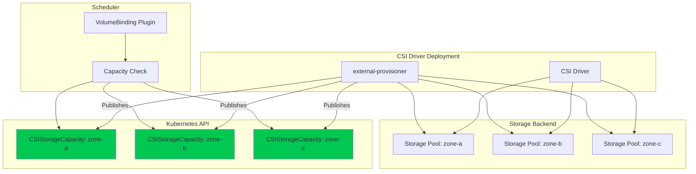
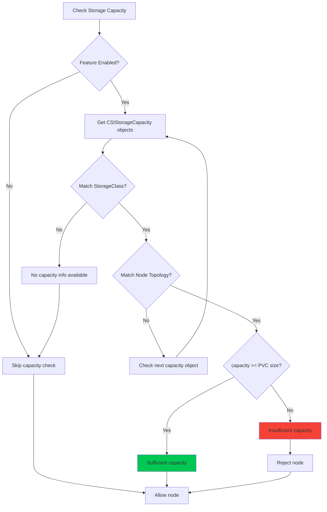
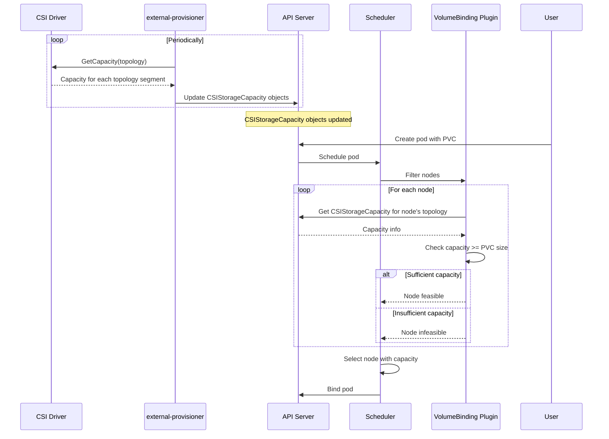
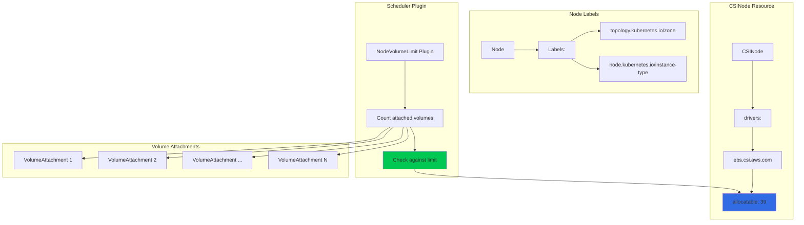
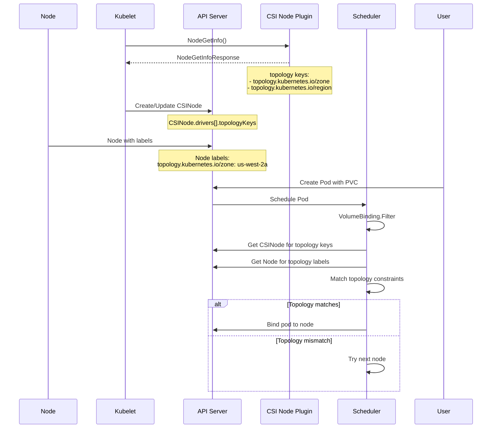

# **CSI Scheduler Integration**

━━━━━━━━━━━━━━━━━━━━━━━━━━━━━━━━━━━━━━━━━━━━━━━━━━━━━━━━━━━━━━━━━━━━━━━━━━━━━━

## **Overview**

The Kubernetes scheduler integrates deeply with CSI to ensure pods are scheduled to nodes where their volumes can be accessed. The VolumeBinding plugin coordinates volume provisioning with pod placement, implementing topology-aware scheduling, volume capacity tracking, and node volume limits enforcement.

**Key Responsibilities:**
- Delay volume binding until pod scheduling (WaitForFirstConsumer)
- Ensure pods are placed on nodes compatible with volume topology
- Track and enforce maximum volumes per node
- Consider storage capacity when scheduling pods
- Coordinate with external-provisioner for topology-aware provisioning

**Code Location:** `/pkg/scheduler/framework/plugins/volumebinding/`

━━━━━━━━━━━━━━━━━━━━━━━━━━━━━━━━━━━━━━━━━━━━━━━━━━━━━━━━━━━━━━━━━━━━━━━━━━━━━━

## **Architecture Overview**

### **Scheduler Plugin Architecture**



### **Scheduling Decision Flow**



━━━━━━━━━━━━━━━━━━━━━━━━━━━━━━━━━━━━━━━━━━━━━━━━━━━━━━━━━━━━━━━━━━━━━━━━━━━━━━

## **VolumeBinding Plugin Implementation**

### **Plugin Structure**

**File:** `/pkg/scheduler/framework/plugins/volumebinding/volume_binding.go:60-140`

```go
// VolumeBinding is a plugin that binds pod volumes in scheduling
type VolumeBinding struct {
    // Binder handles the binding of volumes
    Binder SchedulerVolumeBinder

    // PVCLister can list/get PVCs from the shared informer's store
    PVCLister corelisters.PersistentVolumeClaimLister

    // PVLister can list/get PVs from the shared informer's store
    PVLister corelisters.PersistentVolumeLister

    // StorageClassLister can list/get storage classes
    StorageClassLister storagelisters.StorageClassLister

    // CSINodeLister can list/get CSINode objects
    CSINodeLister storagelisters.CSINodeLister

    // CSIDriverLister can list/get CSIDriver objects
    CSIDriverLister storagelisters.CSIDriverLister

    // CSIStorageCapacityLister can list/get CSIStorageCapacity objects
    CSIStorageCapacityLister storagelisters.CSIStorageCapacityLister

    // frameworkHandle provides access to framework
    frameworkHandle framework.Handle
}

// Name returns name of the plugin
func (pl *VolumeBinding) Name() string {
    return names.VolumeBinding
}

// New initializes a new plugin and returns it
func New(plArgs runtime.Object, fh framework.Handle) (framework.Plugin, error) {
    sharedLister := fh.SnapshotSharedLister()
    pvcLister := sharedLister.PersistentVolumeClaims()
    pvLister := sharedLister.PersistentVolumes()
    storageLister := sharedLister.StorageInfos()

    capacityCheckEnabled := utilfeature.DefaultFeatureGate.Enabled(
        features.CSIStorageCapacity,
    )

    pl := &VolumeBinding{
        Binder: NewVolumeBinder(
            fh.ClientSet(),
            pvcLister,
            pvLister,
            storageLister.StorageClasses(),
            storageLister.CSINodes(),
            storageLister.CSIDrivers(),
            storageLister.CSIStorageCapacities(),
            capacityCheckEnabled,
            time.Second*30,
        ),
        PVCLister:                pvcLister,
        PVLister:                 pvLister,
        StorageClassLister:       storageLister.StorageClasses(),
        CSINodeLister:            storageLister.CSINodes(),
        CSIDriverLister:          storageLister.CSIDrivers(),
        CSIStorageCapacityLister: storageLister.CSIStorageCapacities(),
        frameworkHandle:          fh,
    }

    return pl, nil
}
```

### **Filter Extension Point**



**File:** `/pkg/scheduler/framework/plugins/volumebinding/volume_binding.go:200-300`

```go
// Filter invoked at the filter extension point
func (pl *VolumeBinding) Filter(
    ctx context.Context,
    cs *framework.CycleState,
    pod *v1.Pod,
    nodeInfo *framework.NodeInfo,
) *framework.Status {

    node := nodeInfo.Node()
    if node == nil {
        return framework.NewStatus(framework.Error, "node not found")
    }

    // Get pod volume information
    podVolumes, reasons, err := pl.Binder.GetPodVolumes(pod)
    if err != nil {
        return framework.AsStatus(err)
    }

    if len(reasons) > 0 {
        // Some PVCs are not ready for binding
        status := framework.NewStatus(framework.UnschedulableAndUnresolvable)
        for _, reason := range reasons {
            status.AppendReason(reason)
        }
        return status
    }

    // Find volumes that can be bound for this node
    podVolumeClaims := podVolumes.DynamicProvisions
    podVolumeClaims = append(podVolumeClaims, podVolumes.StaticBindings...)

    // Check if volumes can be satisfied on this node
    unboundVolumesSatisfied, boundVolumesFound, err := pl.Binder.FindPodVolumes(
        pod,
        podVolumeClaims,
        node,
    )

    if err != nil {
        return framework.AsStatus(err)
    }

    if !boundVolumesFound {
        return framework.NewStatus(
            framework.UnschedulableAndUnresolvable,
            "bound volumes not found on node",
        )
    }

    if !unboundVolumesSatisfied {
        return framework.NewStatus(
            framework.UnschedulableAndUnresolvable,
            "unbound volumes cannot be satisfied on node",
        )
    }

    // Store state for later use in Reserve/PreBind
    state := &stateData{
        podVolumes:           podVolumes,
        allBound:             true,
        boundVolumesFound:    boundVolumesFound,
        unboundVolumesSatisfied: unboundVolumesSatisfied,
    }

    cs.Write(stateKey, state)

    return nil
}
```

### **Volume Binder Logic**

**File:** `/pkg/scheduler/framework/plugins/volumebinding/binder.go:100-250`

```go
// FindPodVolumes finds volumes for a pod on a specific node
func (b *volumeBinder) FindPodVolumes(
    pod *v1.Pod,
    podVolumes *PodVolumes,
    node *v1.Node,
) (unboundVolumesSatisfied, boundVolumesFound bool, err error) {

    boundVolumesFound = true
    unboundVolumesSatisfied = true

    // Check bound volumes
    for _, pvc := range podVolumes.StaticBindings {
        pv, err := b.pvCache.GetPV(pvc.Spec.VolumeName)
        if err != nil {
            if errors.IsNotFound(err) {
                boundVolumesFound = false
                return false, false, nil
            }
            return false, false, err
        }

        // Check if PV's node affinity matches the node
        if !b.checkNodeAffinity(pv, node) {
            boundVolumesFound = false
            return false, false, nil
        }
    }

    // Find volumes for dynamic provisions
    for _, pvc := range podVolumes.DynamicProvisions {
        // Get StorageClass
        storageClassName := storagehelpers.GetPersistentVolumeClaimClass(pvc)
        storageClass, err := b.classLister.Get(storageClassName)
        if err != nil {
            return false, false, err
        }

        // Check volume binding mode
        if storageClass.VolumeBindingMode == nil ||
            *storageClass.VolumeBindingMode == storagev1.VolumeBindingImmediate {
            // Immediate mode - volume should already be provisioned
            continue
        }

        // WaitForFirstConsumer mode - check if volume can be provisioned for this node

        // Check topology constraints
        if !b.checkTopologyForNode(storageClass, node) {
            unboundVolumesSatisfied = false
            return false, boundVolumesFound, nil
        }

        // Check CSIStorageCapacity if enabled
        if b.capacityCheckEnabled {
            hasCapacity, err := b.checkStorageCapacity(pvc, storageClass, node)
            if err != nil {
                return false, false, err
            }
            if !hasCapacity {
                unboundVolumesSatisfied = false
                return false, boundVolumesFound, nil
            }
        }
    }

    return unboundVolumesSatisfied, boundVolumesFound, nil
}

// checkNodeAffinity checks if PV's node affinity matches the node
func (b *volumeBinder) checkNodeAffinity(
    pv *v1.PersistentVolume,
    node *v1.Node,
) bool {

    // If no node affinity, volume can be used on any node
    if pv.Spec.NodeAffinity == nil {
        return true
    }

    // Check required node affinity
    terms := pv.Spec.NodeAffinity.Required
    if terms == nil {
        return true
    }

    // Evaluate node selector terms (at least one must match)
    for _, term := range terms.NodeSelectorTerms {
        if b.matchNodeSelectorTerm(node, term) {
            return true
        }
    }

    return false
}

// checkTopologyForNode checks if node satisfies topology constraints
func (b *volumeBinder) checkTopologyForNode(
    class *storagev1.StorageClass,
    node *v1.Node,
) bool {

    // If no topology constraints, any node is acceptable
    if class.AllowedTopologies == nil {
        return true
    }

    // Check if node matches any of the allowed topologies
    for _, topology := range class.AllowedTopologies {
        if b.matchTopology(node, topology) {
            return true
        }
    }

    return false
}

// matchTopology checks if node matches a topology selector term
func (b *volumeBinder) matchTopology(
    node *v1.Node,
    topology v1.TopologySelectorTerm,
) bool {

    // All match expressions must be satisfied
    for _, expr := range topology.MatchLabelExpressions {
        nodeValue, hasLabel := node.Labels[expr.Key]

        if !hasLabel {
            return false
        }

        // Check if node value is in allowed values
        found := false
        for _, value := range expr.Values {
            if nodeValue == value {
                found = true
                break
            }
        }

        if !found {
            return false
        }
    }

    return true
}
```

━━━━━━━━━━━━━━━━━━━━━━━━━━━━━━━━━━━━━━━━━━━━━━━━━━━━━━━━━━━━━━━━━━━━━━━━━━━━━━

## **WaitForFirstConsumer Binding Mode**

### **WaitForFirstConsumer Workflow**



### **Immediate vs WaitForFirstConsumer**

```mermaid
graph TB
    subgraph "Immediate Mode"
        I1[PVC Created]
        I2[external-provisioner provisions immediately]
        I3[Volume created in arbitrary zone]
        I4[PV bound to PVC]
        I5[Pod created]
        I6[Scheduler finds compatible node]
        I7[Pod might be unschedulable]

        I1 --> I2 --> I3 --> I4 --> I5 --> I6
        I6 -->|No node in same zone| I7
    end

    subgraph "WaitForFirstConsumer Mode"
        W1[PVC Created]
        W2[PVC stays pending]
        W3[Pod created]
        W4[Scheduler selects node]
        W5[PVC annotated with selected-node]
        W6[external-provisioner provisions in node's zone]
        W7[Pod guaranteed schedulable]

        W1 --> W2 --> W3 --> W4 --> W5 --> W6 --> W7
    end

    style I7 fill:#F44336
    style W7 fill:#00C853
```



**Example StorageClass Configurations:**

```yaml
# Immediate binding (legacy behavior)
apiVersion: storage.k8s.io/v1
kind: StorageClass
metadata:
  name: ebs-immediate
provisioner: ebs.csi.aws.com
parameters:
  type: gp3
volumeBindingMode: Immediate  # Provision immediately
allowVolumeExpansion: true

---
# WaitForFirstConsumer (recommended for topology-aware drivers)
apiVersion: storage.k8s.io/v1
kind: StorageClass
metadata:
  name: ebs-topology-aware
provisioner: ebs.csi.aws.com
parameters:
  type: gp3
volumeBindingMode: WaitForFirstConsumer  # Wait for pod scheduling
allowVolumeExpansion: true
allowedTopologies:
- matchLabelExpressions:
  - key: topology.kubernetes.io/zone
    values:
    - us-west-2a
    - us-west-2b
    - us-west-2c
```

### **PreBind Implementation**

**File:** `/pkg/scheduler/framework/plugins/volumebinding/volume_binding.go:400-500`

```go
// PreBind will update PVCs to indicate the selected node
func (pl *VolumeBinding) PreBind(
    ctx context.Context,
    cs *framework.CycleState,
    pod *v1.Pod,
    nodeName string,
) *framework.Status {

    // Get state from Reserve
    s, err := getStateData(cs)
    if err != nil {
        return framework.AsStatus(err)
    }

    // If all volumes are already bound, nothing to do
    if s.allBound {
        klog.V(5).Infof("PreBind: all volumes already bound for pod %s", pod.Name)
        return nil
    }

    // Get node info
    node, err := pl.frameworkHandle.SnapshotSharedLister().NodeInfos().Get(nodeName)
    if err != nil {
        return framework.AsStatus(err)
    }

    // Bind volumes
    podVolumes := s.podVolumes
    klog.V(5).Infof("PreBind: binding volumes for pod %s to node %s",
        pod.Name, nodeName)

    // This will:
    // 1. Annotate dynamic PVCs with selected-node
    // 2. Bind static PVCs to matching PVs
    // 3. Update assume cache
    err = pl.Binder.BindPodVolumes(pod, podVolumes, node.Node())
    if err != nil {
        return framework.AsStatus(err)
    }

    return nil
}

// BindPodVolumes binds volumes for a pod
func (b *volumeBinder) BindPodVolumes(
    assumedPod *v1.Pod,
    podVolumes *PodVolumes,
    node *v1.Node,
) error {

    klog.V(4).Infof("BindPodVolumes for pod %s/%s", assumedPod.Namespace, assumedPod.Name)

    // Annotate PVCs with selected node for dynamic provisioning
    for _, pvc := range podVolumes.DynamicProvisions {
        if err := b.annotatePVCWithNode(pvc, node.Name); err != nil {
            return err
        }
    }

    // Bind static PVs
    for i, pvc := range podVolumes.StaticBindings {
        pv := podVolumes.StaticBindings[i]
        if err := b.bindPVToPVC(pv, pvc); err != nil {
            return err
        }
    }

    return nil
}

// annotatePVCWithNode adds selected-node annotation to PVC
func (b *volumeBinder) annotatePVCWithNode(
    pvc *v1.PersistentVolumeClaim,
    nodeName string,
) error {

    // Clone PVC
    pvcClone := pvc.DeepCopy()

    // Add annotation
    if pvcClone.Annotations == nil {
        pvcClone.Annotations = make(map[string]string)
    }

    pvcClone.Annotations[volume.AnnSelectedNode] = nodeName

    // Update PVC
    _, err := b.kubeClient.CoreV1().PersistentVolumeClaims(pvc.Namespace).
        Update(context.TODO(), pvcClone, metav1.UpdateOptions{})

    if err != nil {
        return fmt.Errorf("error annotating PVC %s with selected node: %v",
            pvc.Name, err)
    }

    klog.V(4).Infof("Annotated PVC %s/%s with selected-node: %s",
        pvc.Namespace, pvc.Name, nodeName)

    return nil
}
```

━━━━━━━━━━━━━━━━━━━━━━━━━━━━━━━━━━━━━━━━━━━━━━━━━━━━━━━━━━━━━━━━━━━━━━━━━━━━━━

## **CSIStorageCapacity-Aware Scheduling**

### **CSIStorageCapacity Architecture**



### **CSIStorageCapacity Resource**

**Example CSIStorageCapacity Objects:**

```yaml
apiVersion: storage.k8s.io/v1
kind: CSIStorageCapacity
metadata:
  name: ebs-csi-aws-com-zone-a
  namespace: kube-system
storageClassName: ebs-sc
nodeTopology:
  matchLabels:
    topology.kubernetes.io/zone: us-west-2a
capacity: 500Gi  # Available capacity in this topology segment

---
apiVersion: storage.k8s.io/v1
kind: CSIStorageCapacity
metadata:
  name: ebs-csi-aws-com-zone-b
  namespace: kube-system
storageClassName: ebs-sc
nodeTopology:
  matchLabels:
    topology.kubernetes.io/zone: us-west-2b
capacity: 100Gi  # Less capacity available

---
apiVersion: storage.k8s.io/v1
kind: CSIStorageCapacity
metadata:
  name: ebs-csi-aws-com-zone-c
  namespace: kube-system
storageClassName: ebs-sc
nodeTopology:
  matchLabels:
    topology.kubernetes.io/zone: us-west-2c
capacity: 0  # No capacity available
```

### **Capacity Checking Logic**



**File:** `/pkg/scheduler/framework/plugins/volumebinding/binder.go:400-500`

```go
// checkStorageCapacity checks if node has sufficient storage capacity
func (b *volumeBinder) checkStorageCapacity(
    pvc *v1.PersistentVolumeClaim,
    storageClass *storagev1.StorageClass,
    node *v1.Node,
) (bool, error) {

    if !b.capacityCheckEnabled {
        // Feature disabled, skip check
        return true, nil
    }

    // Get requested size
    requestedSize := pvc.Spec.Resources.Requests[v1.ResourceStorage]

    // Get CSIStorageCapacity objects for this storage class
    capacities, err := b.capacityLister.List(labels.Everything())
    if err != nil {
        return false, err
    }

    // Filter to matching storage class and topology
    var matchingCapacity *storagev1.CSIStorageCapacity

    for _, capacity := range capacities {
        // Check storage class
        if capacity.StorageClassName != storageClass.Name {
            continue
        }

        // Check topology - does this capacity apply to the node?
        if capacity.NodeTopology != nil {
            selector, err := metav1.LabelSelectorAsSelector(capacity.NodeTopology)
            if err != nil {
                klog.Errorf("Invalid node topology selector: %v", err)
                continue
            }

            if !selector.Matches(labels.Set(node.Labels)) {
                continue
            }
        }

        // Found matching capacity object
        matchingCapacity = capacity
        break
    }

    if matchingCapacity == nil {
        // No capacity information available - allow provisioning
        klog.V(4).Infof("No CSIStorageCapacity found for class %s and node %s, allowing",
            storageClass.Name, node.Name)
        return true, nil
    }

    // Check if capacity is sufficient
    if matchingCapacity.Capacity == nil {
        // Capacity unknown - allow provisioning
        return true, nil
    }

    available := matchingCapacity.Capacity.Value()
    required := requestedSize.Value()

    if available < required {
        klog.V(4).Infof("Insufficient storage capacity: available=%d, required=%d",
            available, required)
        return false, nil
    }

    klog.V(4).Infof("Sufficient storage capacity: available=%d, required=%d",
        available, required)
    return true, nil
}
```

### **Capacity Tracking Workflow**



━━━━━━━━━━━━━━━━━━━━━━━━━━━━━━━━━━━━━━━━━━━━━━━━━━━━━━━━━━━━━━━━━━━━━━━━━━━━━━

## **Node Volume Limits Plugin**

### **Volume Limits Architecture**



### **CSINode Resource Example**

```yaml
apiVersion: storage.k8s.io/v1
kind: CSINode
metadata:
  name: node-us-west-2a-1
spec:
  drivers:
  - name: ebs.csi.aws.com
    nodeID: i-0123456789abcdef0
    topologyKeys:
    - topology.kubernetes.io/zone
    allocatable:
      count: 39  # Max 39 EBS volumes can be attached

  - name: efs.csi.aws.com
    nodeID: i-0123456789abcdef0
    topologyKeys:
    - topology.kubernetes.io/zone
    # No allocatable limit (EFS doesn't have volume limit)
```

### **NodeVolumeLimit Filter**

**File:** `/pkg/scheduler/framework/plugins/nodevolumelimits/csi.go:80-180`

```go
// CSILimits is a plugin that checks CSI volume limits
type CSILimits struct {
    csiNodeLister storagelisters.CSINodeLister
    pvLister      corelisters.PersistentVolumeLister
    pvcLister     corelisters.PersistentVolumeClaimLister
    scLister      storagelisters.StorageClassLister

    // volumeAttachmentLister for counting attached volumes
    volumeAttachmentLister storagelisters.VolumeAttachmentLister
}

// Filter invoked at the filter extension point
func (pl *CSILimits) Filter(
    ctx context.Context,
    _ *framework.CycleState,
    pod *v1.Pod,
    nodeInfo *framework.NodeInfo,
) *framework.Status {

    node := nodeInfo.Node()
    if node == nil {
        return framework.NewStatus(framework.Error, "node not found")
    }

    // Get CSINode object
    csiNode, err := pl.csiNodeLister.Get(node.Name)
    if err != nil {
        if errors.IsNotFound(err) {
            // No CSINode object - no limits to check
            return nil
        }
        return framework.AsStatus(err)
    }

    // Get volumes needed by pod
    newVolumes := pl.getCSIVolumesForPod(pod)

    // Count volumes by driver
    volumesByDriver := make(map[string]int)
    for driverName, volumes := range newVolumes {
        volumesByDriver[driverName] = len(volumes)
    }

    // Check limits for each driver
    for _, driver := range csiNode.Spec.Drivers {
        // Check if driver has allocatable limit
        if driver.Allocatable == nil || driver.Allocatable.Count == nil {
            continue
        }

        maxVolumes := *driver.Allocatable.Count

        // Count currently attached volumes for this driver
        attachedCount := pl.countAttachedVolumes(node.Name, driver.Name)

        // Count new volumes needed
        newCount := volumesByDriver[driver.Name]

        totalCount := attachedCount + newCount

        if totalCount > int(maxVolumes) {
            return framework.NewStatus(
                framework.Unschedulable,
                fmt.Sprintf("max volume count exceeded for driver %s: %d/%d",
                    driver.Name, totalCount, maxVolumes),
            )
        }

        klog.V(5).Infof("Node %s driver %s: attached=%d, new=%d, max=%d",
            node.Name, driver.Name, attachedCount, newCount, maxVolumes)
    }

    return nil
}

// countAttachedVolumes counts volumes attached to a node for a specific driver
func (pl *CSILimits) countAttachedVolumes(nodeName, driverName string) int {
    attachments, err := pl.volumeAttachmentLister.List(labels.Everything())
    if err != nil {
        klog.Errorf("Error listing volume attachments: %v", err)
        return 0
    }

    count := 0
    for _, attachment := range attachments {
        // Check if attached to this node
        if attachment.Spec.NodeName != nodeName {
            continue
        }

        // Check if attachment is from this driver
        if attachment.Spec.Attacher != driverName {
            continue
        }

        // Check if attachment is successful
        if attachment.Status.Attached {
            count++
        }
    }

    return count
}

// getCSIVolumesForPod gets CSI volumes needed by pod, grouped by driver
func (pl *CSILimits) getCSIVolumesForPod(pod *v1.Pod) map[string][]string {
    volumesByDriver := make(map[string][]string)

    for _, volume := range pod.Spec.Volumes {
        var driverName, volumeHandle string

        if volume.PersistentVolumeClaim != nil {
            // Get PVC
            pvc, err := pl.pvcLister.PersistentVolumeClaims(pod.Namespace).
                Get(volume.PersistentVolumeClaim.ClaimName)
            if err != nil {
                continue
            }

            // Get PV
            if pvc.Spec.VolumeName == "" {
                continue
            }

            pv, err := pl.pvLister.Get(pvc.Spec.VolumeName)
            if err != nil {
                continue
            }

            // Check if CSI volume
            if pv.Spec.CSI == nil {
                continue
            }

            driverName = pv.Spec.CSI.Driver
            volumeHandle = pv.Spec.CSI.VolumeHandle

        } else if volume.CSI != nil {
            // Ephemeral CSI volume
            driverName = volume.CSI.Driver
            volumeHandle = fmt.Sprintf("ephemeral-%s-%s", pod.UID, volume.Name)
        } else {
            continue
        }

        volumesByDriver[driverName] = append(volumesByDriver[driverName], volumeHandle)
    }

    return volumesByDriver
}
```

### **Volume Limit Scoring**

**File:** `/pkg/scheduler/framework/plugins/nodevolumelimits/csi.go:250-320`

```go
// Score invoked at the score extension point
func (pl *CSILimits) Score(
    ctx context.Context,
    state *framework.CycleState,
    pod *v1.Pod,
    nodeName string,
) (int64, *framework.Status) {

    // Get node info
    nodeInfo, err := pl.frameworkHandle.SnapshotSharedLister().NodeInfos().Get(nodeName)
    if err != nil {
        return 0, framework.AsStatus(err)
    }

    node := nodeInfo.Node()

    // Get CSINode
    csiNode, err := pl.csiNodeLister.Get(nodeName)
    if err != nil {
        if errors.IsNotFound(err) {
            return framework.MaxNodeScore, nil
        }
        return 0, framework.AsStatus(err)
    }

    // Calculate score based on available capacity
    // Higher score = more available volume slots

    newVolumes := pl.getCSIVolumesForPod(pod)
    totalNewVolumes := 0
    for _, volumes := range newVolumes {
        totalNewVolumes += len(volumes)
    }

    // Find the most constrained driver
    var maxUtilization float64 = 0

    for _, driver := range csiNode.Spec.Drivers {
        if driver.Allocatable == nil || driver.Allocatable.Count == nil {
            continue
        }

        maxVolumes := int(*driver.Allocatable.Count)
        attachedCount := pl.countAttachedVolumes(nodeName, driver.Name)

        utilization := float64(attachedCount+totalNewVolumes) / float64(maxVolumes)

        if utilization > maxUtilization {
            maxUtilization = utilization
        }
    }

    // Convert utilization to score (0-100)
    // Lower utilization = higher score
    score := int64((1.0 - maxUtilization) * float64(framework.MaxNodeScore))

    if score < 0 {
        score = 0
    }

    klog.V(5).Infof("Node %s volume limit score: %d (utilization: %.2f)",
        nodeName, score, maxUtilization)

    return score, nil
}
```

━━━━━━━━━━━━━━━━━━━━━━━━━━━━━━━━━━━━━━━━━━━━━━━━━━━━━━━━━━━━━━━━━━━━━━━━━━━━━━

## **Topology Key Matching**

### **Common Topology Keys**

```yaml
# AWS topology keys
topology.kubernetes.io/region: us-west-2
topology.kubernetes.io/zone: us-west-2a

# GCE topology keys
topology.kubernetes.io/region: us-central1
topology.kubernetes.io/zone: us-central1-a

# Azure topology keys
topology.kubernetes.io/region: westus2
topology.kubernetes.io/zone: westus2-1

# Custom topology keys
custom.example.com/rack: rack-1
custom.example.com/datacenter: dc-east
```

### **Topology Propagation Flow**



**File:** `/pkg/volume/csi/csi_plugin.go:300-370`

```go
// getTopologyFromCSINode extracts topology from CSINode
func getTopologyFromCSINode(
    csiNode *storagev1.CSINode,
    driverName string,
) (map[string]string, error) {

    if csiNode == nil {
        return nil, nil
    }

    // Find driver in CSINode
    for _, driver := range csiNode.Spec.Drivers {
        if driver.Name != driverName {
            continue
        }

        // Get topology keys
        topologyKeys := driver.TopologyKeys
        if len(topologyKeys) == 0 {
            return nil, nil
        }

        return topologyKeys, nil
    }

    return nil, fmt.Errorf("driver %s not found in CSINode", driverName)
}

// matchTopologyToNode checks if topology requirements match node
func matchTopologyToNode(
    topology map[string]string,
    node *v1.Node,
) bool {

    if len(topology) == 0 {
        // No topology requirements
        return true
    }

    // Check if all topology keys match node labels
    for key, value := range topology {
        nodeValue, exists := node.Labels[key]
        if !exists {
            return false
        }

        if nodeValue != value {
            return false
        }
    }

    return true
}
```

━━━━━━━━━━━━━━━━━━━━━━━━━━━━━━━━━━━━━━━━━━━━━━━━━━━━━━━━━━━━━━━━━━━━━━━━━━━━━━

## **Best Practices**

### **StorageClass Design**

```yaml
# Production-ready StorageClass
apiVersion: storage.k8s.io/v1
kind: StorageClass
metadata:
  name: fast-ssd
  annotations:
    storageclass.kubernetes.io/is-default-class: "true"
provisioner: ebs.csi.aws.com
parameters:
  type: gp3
  iops: "3000"
  throughput: "125"
  encrypted: "true"

# Use WaitForFirstConsumer for topology awareness
volumeBindingMode: WaitForFirstConsumer

# Define allowed topologies
allowedTopologies:
- matchLabelExpressions:
  - key: topology.kubernetes.io/zone
    values:
    - us-west-2a
    - us-west-2b
    - us-west-2c

allowVolumeExpansion: true
reclaimPolicy: Delete
```

### **Pod Anti-Affinity for Volume Diversity**

```yaml
apiVersion: apps/v1
kind: StatefulSet
metadata:
  name: database
spec:
  replicas: 3
  selector:
    matchLabels:
      app: database
  template:
    metadata:
      labels:
        app: database
    spec:
      # Spread pods across zones for HA
      affinity:
        podAntiAffinity:
          requiredDuringSchedulingIgnoredDuringExecution:
          - labelSelector:
              matchLabels:
                app: database
            topologyKey: topology.kubernetes.io/zone

      containers:
      - name: database
        image: postgres:13
        volumeMounts:
        - name: data
          mountPath: /var/lib/postgresql/data

  volumeClaimTemplates:
  - metadata:
      name: data
    spec:
      accessModes: ["ReadWriteOnce"]
      storageClassName: fast-ssd
      resources:
        requests:
          storage: 100Gi
```

━━━━━━━━━━━━━━━━━━━━━━━━━━━━━━━━━━━━━━━━━━━━━━━━━━━━━━━━━━━━━━━━━━━━━━━━━━━━━━

## **Cross-References**

### **Related Documentation**

- **PV Controller Integration:** `/docs/architecture/claude/csi/middle-level/04-pv-controller-integration.md`
  - PV/PVC binding workflow
  - Dynamic provisioning coordination

- **Volume Attachment:** `/docs/architecture/claude/csi/high-level/02-attachment-controller.md`
  - VolumeAttachment counting
  - Attach/detach workflow

- **Kubelet Volume Manager:** `/docs/architecture/claude/csi/high-level/03-kubelet-volume-manager.md`
  - Volume mounting after scheduling
  - Node-side operations

━━━━━━━━━━━━━━━━━━━━━━━━━━━━━━━━━━━━━━━━━━━━━━━━━━━━━━━━━━━━━━━━━━━━━━━━━━━━━━

## **Summary**

The scheduler's integration with CSI enables intelligent pod placement that considers storage constraints and topology. Key features include:

**WaitForFirstConsumer:** Delays volume provisioning until pod scheduling, ensuring volumes are created in the same topology as the pod.

**CSIStorageCapacity:** Enables capacity-aware scheduling to avoid provisioning failures due to insufficient storage.

**NodeVolumeLimit:** Enforces maximum volumes per node based on driver capabilities.

**Topology Matching:** Ensures pods are scheduled to nodes where their volumes can be accessed.

This deep integration between scheduler and storage ensures efficient resource utilization and prevents scheduling failures.
