# **CSI Migration Framework - Complete Architecture**

━━━━━━━━━━━━━━━━━━━━━━━━━━━━━━━━━━━━━━━━━━━━━━━━━━━━━━━━━━━━━━━━━━━━━━━━━━━━━━

## **Overview**

The CSI Migration Framework is a critical component in Kubernetes that enables the seamless transition from in-tree volume plugins to out-of-tree CSI drivers. This comprehensive guide explores the complete architecture, translation mechanisms, feature gate lifecycle, and migration process for all supported storage providers.

**Key Objectives:**
- Move storage logic out of the core Kubernetes codebase
- Enable storage vendors to develop and release drivers independently
- Maintain backward compatibility with existing in-tree volume plugins
- Provide transparent migration without user intervention
- Support gradual rollout across Kubernetes versions

**Cross-References:**
- [CSI Core Components](../high-level/01-csi-core-components.md)
- [Volume Attachment](../middle-level/01-volume-attachment.md)
- [CSI Driver Object](../middle-level/02-csi-driver-object.md)
- [Plugin Registration](../low-level/01-plugin-registration.md)

━━━━━━━━━━━━━━━━━━━━━━━━━━━━━━━━━━━━━━━━━━━━━━━━━━━━━━━━━━━━━━━━━━━━━━━━━━━━━━

## **Why CSI Migration is Needed**

### **Problems with In-Tree Volume Plugins**

**Architectural Issues:**
1. **Tight Coupling**: Storage code embedded in core Kubernetes binaries
2. **Release Dependency**: Plugin updates tied to Kubernetes releases
3. **Vendor Lock-in**: Storage vendors depend on Kubernetes release cycles
4. **Code Bloat**: Growing binary size with each new plugin
5. **Testing Burden**: All plugins tested together in Kubernetes CI/CD
6. **Security Concerns**: Vendor code in privileged controller-manager/kubelet

**Operational Challenges:**
1. **Update Latency**: Bug fixes wait for next Kubernetes release
2. **Feature Development**: New features delayed by release schedules
3. **Maintenance Burden**: Kubernetes maintainers responsible for all plugins
4. **Deployment Complexity**: Can't update plugin without updating Kubernetes

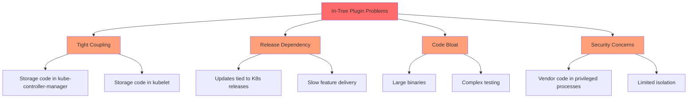

### **CSI Migration Benefits**

**Architectural Improvements:**
1. **Decoupling**: Storage logic separate from Kubernetes core
2. **Independent Releases**: Vendors control their release cycles
3. **Smaller Binaries**: Core Kubernetes without storage code
4. **Better Isolation**: CSI drivers run in separate processes
5. **Vendor Autonomy**: Direct control over features and fixes

**Operational Benefits:**
1. **Faster Updates**: Bug fixes deployed immediately
2. **Rapid Innovation**: New features without waiting for K8s releases
3. **Simplified Maintenance**: Kubernetes maintainers focus on core
4. **Flexible Deployment**: Update drivers independently

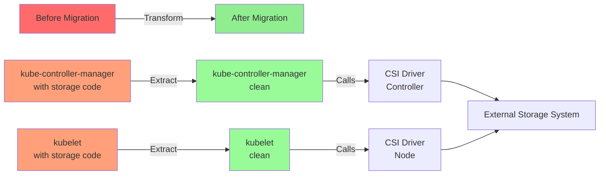

━━━━━━━━━━━━━━━━━━━━━━━━━━━━━━━━━━━━━━━━━━━━━━━━━━━━━━━━━━━━━━━━━━━━━━━━━━━━━━

## **CSI Migration Architecture**

### **Overall Architecture**

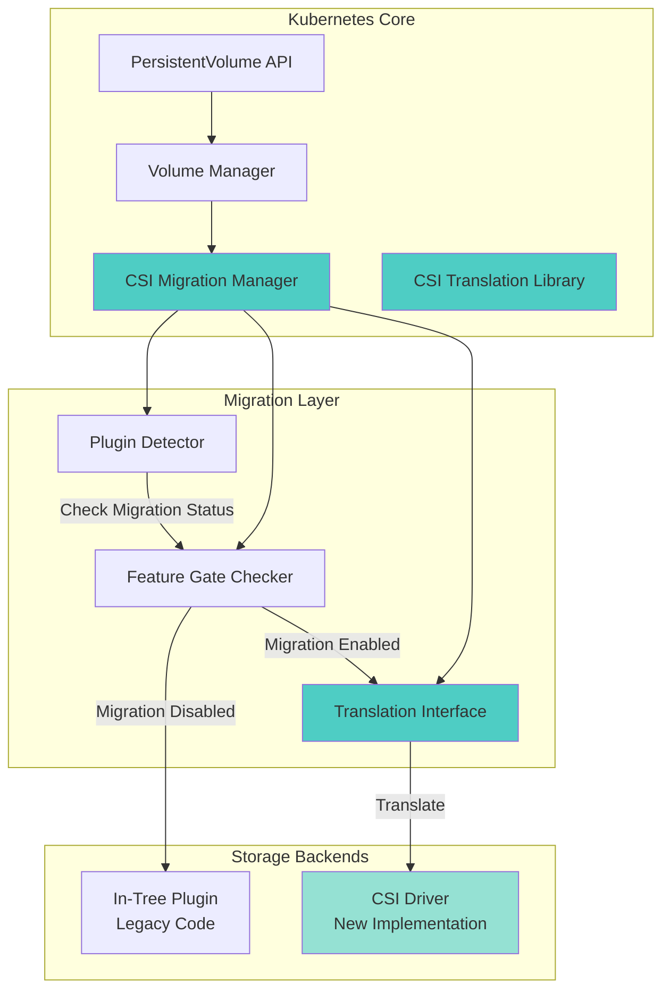

### **Component Locations**

**Migration Manager:**
```
/pkg/volume/csimigration/plugin_manager.go
/pkg/volume/csimigration/plugin_manager_test.go
```

**Translation Library:**
```
/staging/src/k8s.io/csi-translation-lib/
├── plugins/
│   ├── aws_ebs.go               # AWS EBS translation
│   ├── gce_pd.go                # GCE PD translation
│   ├── azure_disk.go            # Azure Disk translation
│   ├── azure_file.go            # Azure File translation
│   ├── vsphere_volume.go        # vSphere translation
│   ├── cinder.go                # OpenStack Cinder translation
│   └── in_tree_volume.go        # Base interface
├── translate.go                  # Translation orchestrator
└── translate_test.go
```

**Feature Gates:**
```
/pkg/features/kube_features.go
```

### **Translation Flow**

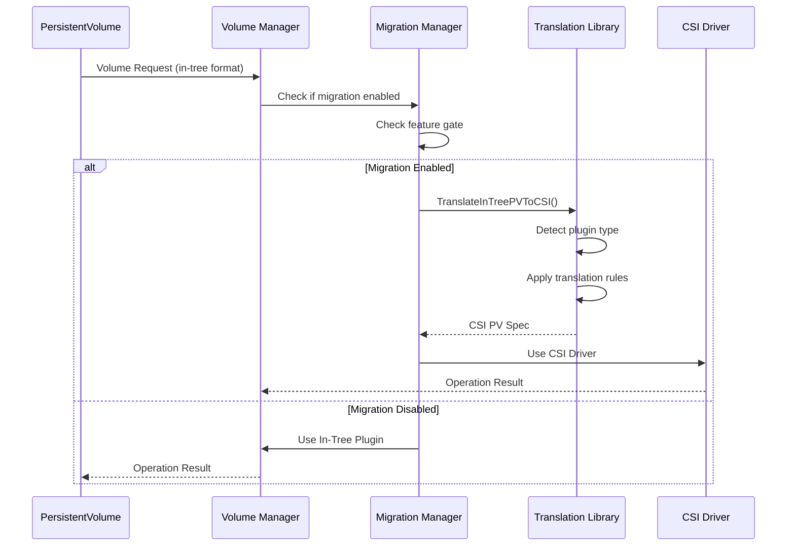

━━━━━━━━━━━━━━━━━━━━━━━━━━━━━━━━━━━━━━━━━━━━━━━━━━━━━━━━━━━━━━━━━━━━━━━━━━━━━━

## **CSI Migration Manager**

### **Plugin Manager Implementation**

**File: /pkg/volume/csimigration/plugin_manager.go**

```go
// PluginManager is a interface for CSI migration
type PluginManager interface {
    // IsMigrationEnabledForPlugin checks if migration is enabled for a plugin
    IsMigrationEnabledForPlugin(pluginName string) bool

    // CheckMigrationFeatureFlags checks migration feature flags
    CheckMigrationFeatureFlags(pluginName string) (enabled bool, locked bool)

    // GetPluginNameFromSpec gets plugin name from PV spec
    GetPluginNameFromSpec(pv *v1.PersistentVolume, vol *v1.Volume) (string, error)
}

// pluginManager implements PluginManager
type pluginManager struct {
    // Feature gate for checking migration status
    featureGate featuregate.FeatureGate
}

// NewPluginManager creates a new CSI migration plugin manager
func NewPluginManager(featureGate featuregate.FeatureGate) PluginManager {
    return &pluginManager{
        featureGate: featureGate,
    }
}
```

**Lines 45-78: Migration Detection**

```go
// IsMigrationEnabledForPlugin checks if CSI migration is enabled for a plugin
func (pm *pluginManager) IsMigrationEnabledForPlugin(pluginName string) bool {
    switch pluginName {
    case "kubernetes.io/aws-ebs":
        // AWS EBS migration is GA and locked in 1.27+
        return pm.featureGate.Enabled(features.CSIMigrationAWS)

    case "kubernetes.io/gce-pd":
        // GCE PD migration is GA and locked in 1.27+
        return pm.featureGate.Enabled(features.CSIMigrationGCE)

    case "kubernetes.io/azure-disk":
        // Azure Disk migration is GA in 1.24+
        return pm.featureGate.Enabled(features.CSIMigrationAzureDisk)

    case "kubernetes.io/azure-file":
        // Azure File migration is beta
        return pm.featureGate.Enabled(features.CSIMigrationAzureFile)

    case "kubernetes.io/vsphere-volume":
        // vSphere migration is GA in 1.26+
        return pm.featureGate.Enabled(features.CSIMigrationvSphere)

    case "kubernetes.io/cinder":
        // OpenStack Cinder migration is beta
        return pm.featureGate.Enabled(features.CSIMigrationOpenStack)

    default:
        return false
    }
}
```

**Lines 80-120: Feature Gate Checking**

```go
// CheckMigrationFeatureFlags checks feature gate status
func (pm *pluginManager) CheckMigrationFeatureFlags(pluginName string) (enabled bool, locked bool) {
    var feature featuregate.Feature
    var lockedFeature featuregate.Feature

    switch pluginName {
    case "kubernetes.io/aws-ebs":
        feature = features.CSIMigrationAWS
        lockedFeature = features.CSIMigrationAWSComplete

    case "kubernetes.io/gce-pd":
        feature = features.CSIMigrationGCE
        lockedFeature = features.CSIMigrationGCEComplete

    case "kubernetes.io/azure-disk":
        feature = features.CSIMigrationAzureDisk
        lockedFeature = features.CSIMigrationAzureDiskComplete

    case "kubernetes.io/azure-file":
        feature = features.CSIMigrationAzureFile
        // No locked feature yet (still beta)

    case "kubernetes.io/vsphere-volume":
        feature = features.CSIMigrationvSphere
        lockedFeature = features.CSIMigrationvSphereComplete

    case "kubernetes.io/cinder":
        feature = features.CSIMigrationOpenStack
        lockedFeature = features.CSIMigrationOpenStackComplete

    default:
        return false, false
    }

    enabled = pm.featureGate.Enabled(feature)
    locked = lockedFeature != "" && pm.featureGate.Enabled(lockedFeature)

    return enabled, locked
}
```

### **Migration Manager Workflow**

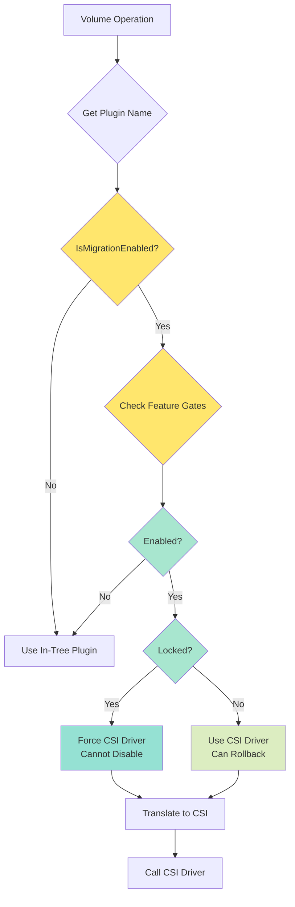

━━━━━━━━━━━━━━━━━━━━━━━━━━━━━━━━━━━━━━━━━━━━━━━━━━━━━━━━━━━━━━━━━━━━━━━━━━━━━━

## **CSI Translation Library**

### **Translation Interface**

**File: /staging/src/k8s.io/csi-translation-lib/plugins/in_tree_volume.go**

```go
// InTreePlugin is the interface for CSI migration of in-tree plugins
type InTreePlugin interface {
    // TranslateInTreePVToCSI converts in-tree PV to CSI PV
    TranslateInTreePVToCSI(pv *v1.PersistentVolume) (*v1.PersistentVolume, error)

    // TranslateInTreeInlineVolumeToCSI converts in-tree inline volume to CSI
    TranslateInTreeInlineVolumeToCSI(volume *v1.Volume, podNamespace string) (*v1.PersistentVolume, error)

    // TranslateCSIPVToInTree converts CSI PV back to in-tree (for compatibility)
    TranslateCSIPVToInTree(pv *v1.PersistentVolume) (*v1.PersistentVolume, error)

    // CanSupport checks if plugin can handle the volume
    CanSupport(pv *v1.PersistentVolume) bool

    // GetInTreePluginName returns the in-tree plugin name
    GetInTreePluginName() string

    // GetCSIDriverName returns the CSI driver name
    GetCSIDriverName() string

    // RepairVolumeHandle repairs volume handle if needed
    RepairVolumeHandle(volumeHandle, nodeID string) (string, error)
}
```

### **Translation Orchestrator**

**File: /staging/src/k8s.io/csi-translation-lib/translate.go**

```go
// Translator is the interface for translating between in-tree and CSI
type Translator interface {
    // TranslateInTreePVToCSI translates in-tree PV to CSI
    TranslateInTreePVToCSI(pv *v1.PersistentVolume) (*v1.PersistentVolume, error)

    // TranslateInTreeInlineVolumeToCSI translates inline volume to CSI
    TranslateInTreeInlineVolumeToCSI(volume *v1.Volume, podNamespace string) (*v1.PersistentVolume, error)

    // TranslateCSIPVToInTree translates CSI PV back to in-tree
    TranslateCSIPVToInTree(pv *v1.PersistentVolume) (*v1.PersistentVolume, error)

    // IsMigratable checks if volume is migratable
    IsMigratable(pv *v1.PersistentVolume) bool

    // GetInTreePluginNameFromSpec gets plugin name from spec
    GetInTreePluginNameFromSpec(pv *v1.PersistentVolume, vol *v1.Volume) (string, error)

    // GetCSINameFromInTreeName converts in-tree name to CSI name
    GetCSINameFromInTreeName(pluginName string) (string, error)
}

// translator implements Translator
type translator struct {
    // Map of in-tree plugin name to InTreePlugin
    plugins map[string]InTreePlugin
}

// NewTranslator creates a new translator
func NewTranslator() Translator {
    return &translator{
        plugins: map[string]InTreePlugin{
            "kubernetes.io/aws-ebs":        NewAWSElasticBlockStoreTranslator(),
            "kubernetes.io/gce-pd":         NewGCEPersistentDiskTranslator(),
            "kubernetes.io/azure-disk":     NewAzureDiskTranslator(),
            "kubernetes.io/azure-file":     NewAzureFileTranslator(),
            "kubernetes.io/vsphere-volume": NewvSphereTranslator(),
            "kubernetes.io/cinder":         NewCinderTranslator(),
        },
    }
}
```

**Lines 80-130: Translation Implementation**

```go
// TranslateInTreePVToCSI translates in-tree PV to CSI format
func (t *translator) TranslateInTreePVToCSI(pv *v1.PersistentVolume) (*v1.PersistentVolume, error) {
    if pv == nil {
        return nil, fmt.Errorf("persistent volume was nil")
    }

    // Find appropriate plugin
    var plugin InTreePlugin
    for _, p := range t.plugins {
        if p.CanSupport(pv) {
            plugin = p
            break
        }
    }

    if plugin == nil {
        return nil, fmt.Errorf("no migration plugin found for volume")
    }

    // Perform translation
    csiPV, err := plugin.TranslateInTreePVToCSI(pv)
    if err != nil {
        return nil, fmt.Errorf("failed to translate in-tree PV to CSI: %w", err)
    }

    // Preserve important fields
    csiPV.Name = pv.Name
    csiPV.Namespace = pv.Namespace
    csiPV.UID = pv.UID
    csiPV.ResourceVersion = pv.ResourceVersion
    csiPV.Labels = pv.Labels
    csiPV.Annotations = pv.Annotations
    csiPV.Finalizers = pv.Finalizers

    // Add migration annotation
    if csiPV.Annotations == nil {
        csiPV.Annotations = make(map[string]string)
    }
    csiPV.Annotations["pv.kubernetes.io/migrated-to"] = plugin.GetCSIDriverName()

    return csiPV, nil
}
```

### **Translation Process Flow**

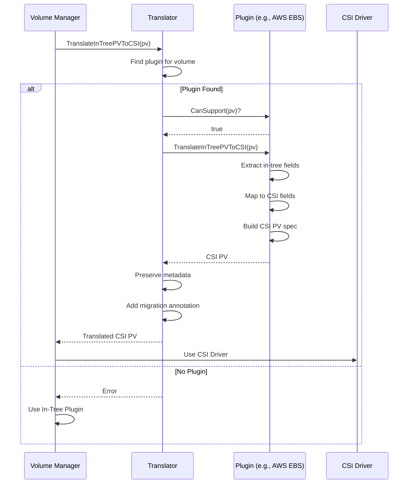

━━━━━━━━━━━━━━━━━━━━━━━━━━━━━━━━━━━━━━━━━━━━━━━━━━━━━━━━━━━━━━━━━━━━━━━━━━━━━━

## **Per-Plugin Migration Status**

### **AWS EBS Migration**

**Status: GA (1.25), Locked (1.27)**

**Feature Gates:**
```go
// File: /pkg/features/kube_features.go

// CSIMigrationAWS enables migration of AWS EBS volumes to CSI
CSIMigrationAWS featuregate.Feature = "CSIMigrationAWS"
// Default: enabled (GA in 1.25)
// Locked: true (1.27+)

// CSIMigrationAWSComplete disables in-tree AWS EBS plugin
CSIMigrationAWSComplete featuregate.Feature = "CSIMigrationAWSComplete"
// Default: enabled (locked in 1.27)
// Locked: true (1.27+)
```

**Translation Implementation:**

**File: /staging/src/k8s.io/csi-translation-lib/plugins/aws_ebs.go**

```go
// awsElasticBlockStoreTranslator handles AWS EBS translation
type awsElasticBlockStoreTranslator struct{}

var _ InTreePlugin = &awsElasticBlockStoreTranslator{}

const (
    // AWSEBSDriverName is the CSI driver name
    AWSEBSDriverName = "ebs.csi.aws.com"

    // AWSEBSInTreePluginName is the in-tree plugin name
    AWSEBSInTreePluginName = "kubernetes.io/aws-ebs"
)

// TranslateInTreePVToCSI converts AWS EBS PV to CSI
func (t *awsElasticBlockStoreTranslator) TranslateInTreePVToCSI(pv *v1.PersistentVolume) (*v1.PersistentVolume, error) {
    if pv == nil || pv.Spec.AWSElasticBlockStore == nil {
        return nil, fmt.Errorf("pv is nil or has no AWSElasticBlockStore source")
    }

    ebsSource := pv.Spec.AWSElasticBlockStore

    // Extract volume ID
    // Format: aws://us-east-1a/vol-0123456789abcdef0 or vol-0123456789abcdef0
    volumeID := ebsSource.VolumeID
    if !strings.HasPrefix(volumeID, "vol-") {
        // Parse AWS URI format
        parts := strings.Split(volumeID, "/")
        if len(parts) > 0 {
            volumeID = parts[len(parts)-1]
        }
    }

    // Create CSI PV
    csiPV := pv.DeepCopy()

    // Remove in-tree source
    csiPV.Spec.AWSElasticBlockStore = nil

    // Build CSI source
    csiPV.Spec.CSI = &v1.CSIPersistentVolumeSource{
        Driver:       AWSEBSDriverName,
        VolumeHandle: volumeID,
        FSType:       ebsSource.FSType,
        ReadOnly:     ebsSource.ReadOnly,
    }

    // Set default FSType if not specified
    if csiPV.Spec.CSI.FSType == "" {
        csiPV.Spec.CSI.FSType = "ext4"
    }

    // Translate volume attributes
    if ebsSource.Partition != 0 {
        if csiPV.Spec.CSI.VolumeAttributes == nil {
            csiPV.Spec.CSI.VolumeAttributes = make(map[string]string)
        }
        csiPV.Spec.CSI.VolumeAttributes["partition"] = fmt.Sprintf("%d", ebsSource.Partition)
    }

    return csiPV, nil
}

// TranslateCSIPVToInTree converts CSI PV back to AWS EBS format
func (t *awsElasticBlockStoreTranslator) TranslateCSIPVToInTree(pv *v1.PersistentVolume) (*v1.PersistentVolume, error) {
    if pv == nil || pv.Spec.CSI == nil {
        return nil, fmt.Errorf("pv is nil or has no CSI source")
    }

    csiSource := pv.Spec.CSI

    if csiSource.Driver != AWSEBSDriverName {
        return nil, fmt.Errorf("wrong CSI driver: %s", csiSource.Driver)
    }

    // Create in-tree PV
    inTreePV := pv.DeepCopy()

    // Remove CSI source
    inTreePV.Spec.CSI = nil

    // Build in-tree source
    inTreePV.Spec.AWSElasticBlockStore = &v1.AWSElasticBlockStoreVolumeSource{
        VolumeID: csiSource.VolumeHandle,
        FSType:   csiSource.FSType,
        ReadOnly: csiSource.ReadOnly,
    }

    // Translate partition attribute
    if partition, ok := csiSource.VolumeAttributes["partition"]; ok {
        partitionInt, err := strconv.Atoi(partition)
        if err == nil {
            inTreePV.Spec.AWSElasticBlockStore.Partition = int32(partitionInt)
        }
    }

    return inTreePV, nil
}

// CanSupport checks if this is an AWS EBS volume
func (t *awsElasticBlockStoreTranslator) CanSupport(pv *v1.PersistentVolume) bool {
    return pv != nil && pv.Spec.AWSElasticBlockStore != nil
}

// GetInTreePluginName returns the in-tree plugin name
func (t *awsElasticBlockStoreTranslator) GetInTreePluginName() string {
    return AWSEBSInTreePluginName
}

// GetCSIDriverName returns the CSI driver name
func (t *awsElasticBlockStoreTranslator) GetCSIDriverName() string {
    return AWSEBSDriverName
}

// RepairVolumeHandle repairs volume handle if needed
func (t *awsElasticBlockStoreTranslator) RepairVolumeHandle(volumeHandle, nodeID string) (string, error) {
    // AWS EBS volume handles don't need repair
    return volumeHandle, nil
}
```

**Before/After Example:**

**Before Migration (In-Tree):**
```yaml
apiVersion: v1
kind: PersistentVolume
metadata:
  name: my-ebs-volume
spec:
  capacity:
    storage: 100Gi
  accessModes:
    - ReadWriteOnce
  persistentVolumeReclaimPolicy: Retain
  awsElasticBlockStore:
    volumeID: vol-0123456789abcdef0
    fsType: ext4
    readOnly: false
```

**After Migration (CSI):**
```yaml
apiVersion: v1
kind: PersistentVolume
metadata:
  name: my-ebs-volume
  annotations:
    pv.kubernetes.io/migrated-to: ebs.csi.aws.com
spec:
  capacity:
    storage: 100Gi
  accessModes:
    - ReadWriteOnce
  persistentVolumeReclaimPolicy: Retain
  csi:
    driver: ebs.csi.aws.com
    volumeHandle: vol-0123456789abcdef0
    fsType: ext4
    readOnly: false
```

### **AWS EBS Migration Timeline**

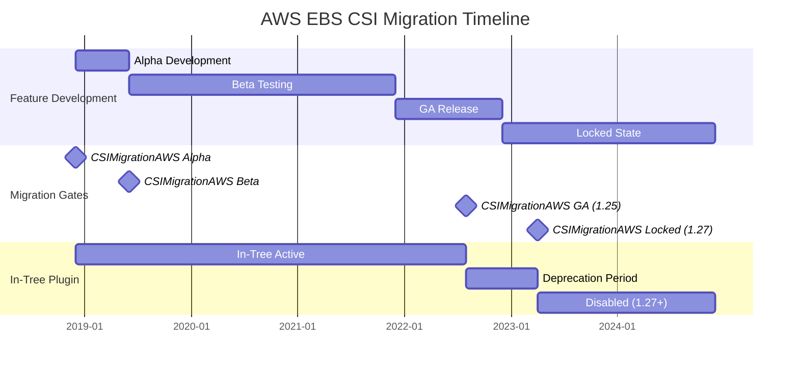

━━━━━━━━━━━━━━━━━━━━━━━━━━━━━━━━━━━━━━━━━━━━━━━━━━━━━━━━━━━━━━━━━━━━━━━━━━━━━━

## **GCE PD Migration**

**Status: GA (1.25), Locked (1.27)**

**Feature Gates:**
```go
// File: /pkg/features/kube_features.go

// CSIMigrationGCE enables migration of GCE PD volumes to CSI
CSIMigrationGCE featuregate.Feature = "CSIMigrationGCE"
// Default: enabled (GA in 1.25)
// Locked: true (1.27+)

// CSIMigrationGCEComplete disables in-tree GCE PD plugin
CSIMigrationGCEComplete featuregate.Feature = "CSIMigrationGCEComplete"
// Default: enabled (locked in 1.27)
// Locked: true (1.27+)
```

**Translation Implementation:**

**File: /staging/src/k8s.io/csi-translation-lib/plugins/gce_pd.go**

```go
// gcePersistentDiskTranslator handles GCE PD translation
type gcePersistentDiskTranslator struct{}

var _ InTreePlugin = &gcePersistentDiskTranslator{}

const (
    // GCEPDDriverName is the CSI driver name
    GCEPDDriverName = "pd.csi.storage.gke.io"

    // GCEPDInTreePluginName is the in-tree plugin name
    GCEPDInTreePluginName = "kubernetes.io/gce-pd"

    // Volume ID format for GCE
    // projects/{project}/zones/{zone}/disks/{disk}
    volumeIDTemplate = "projects/%s/zones/%s/disks/%s"
)

// TranslateInTreePVToCSI converts GCE PD PV to CSI
func (t *gcePersistentDiskTranslator) TranslateInTreePVToCSI(pv *v1.PersistentVolume) (*v1.PersistentVolume, error) {
    if pv == nil || pv.Spec.GCEPersistentDisk == nil {
        return nil, fmt.Errorf("pv is nil or has no GCEPersistentDisk source")
    }

    pdSource := pv.Spec.GCEPersistentDisk

    // Parse disk name to build volume handle
    // pdName can be:
    // 1. Just disk name: "my-disk"
    // 2. Partial path: "zones/us-central1-a/disks/my-disk"
    // 3. Full path: "projects/my-project/zones/us-central1-a/disks/my-disk"
    volumeHandle, err := t.buildVolumeHandle(pdSource.PDName)
    if err != nil {
        return nil, fmt.Errorf("failed to build volume handle: %w", err)
    }

    // Create CSI PV
    csiPV := pv.DeepCopy()

    // Remove in-tree source
    csiPV.Spec.GCEPersistentDisk = nil

    // Build CSI source
    csiPV.Spec.CSI = &v1.CSIPersistentVolumeSource{
        Driver:       GCEPDDriverName,
        VolumeHandle: volumeHandle,
        FSType:       pdSource.FSType,
        ReadOnly:     pdSource.ReadOnly,
    }

    // Set default FSType if not specified
    if csiPV.Spec.CSI.FSType == "" {
        csiPV.Spec.CSI.FSType = "ext4"
    }

    // Translate partition
    if pdSource.Partition != 0 {
        if csiPV.Spec.CSI.VolumeAttributes == nil {
            csiPV.Spec.CSI.VolumeAttributes = make(map[string]string)
        }
        csiPV.Spec.CSI.VolumeAttributes["partition"] = fmt.Sprintf("%d", pdSource.Partition)
    }

    return csiPV, nil
}

// buildVolumeHandle constructs proper GCE volume handle
func (t *gcePersistentDiskTranslator) buildVolumeHandle(pdName string) (string, error) {
    // If already full path, return as-is
    if strings.HasPrefix(pdName, "projects/") {
        return pdName, nil
    }

    // Parse zone/disk from partial path
    if strings.Contains(pdName, "/") {
        parts := strings.Split(pdName, "/")
        if len(parts) >= 4 && parts[0] == "zones" && parts[2] == "disks" {
            // Format: zones/{zone}/disks/{disk}
            // Need to get project from metadata
            project, err := t.getGCEProject()
            if err != nil {
                return "", fmt.Errorf("failed to get GCE project: %w", err)
            }
            return fmt.Sprintf(volumeIDTemplate, project, parts[1], parts[3]), nil
        }
    }

    // Just disk name - need project and zone from metadata
    project, err := t.getGCEProject()
    if err != nil {
        return "", fmt.Errorf("failed to get GCE project: %w", err)
    }

    zone, err := t.getGCEZone()
    if err != nil {
        return "", fmt.Errorf("failed to get GCE zone: %w", err)
    }

    return fmt.Sprintf(volumeIDTemplate, project, zone, pdName), nil
}

// getGCEProject retrieves GCE project from metadata or environment
func (t *gcePersistentDiskTranslator) getGCEProject() (string, error) {
    // Try environment variable first
    if project := os.Getenv("GCE_PROJECT"); project != "" {
        return project, nil
    }

    // Query metadata server
    // This would use GCE metadata API in real implementation
    return "", fmt.Errorf("GCE project not found")
}

// getGCEZone retrieves GCE zone from metadata
func (t *gcePersistentDiskTranslator) getGCEZone() (string, error) {
    // Try environment variable first
    if zone := os.Getenv("GCE_ZONE"); zone != "" {
        return zone, nil
    }

    // Query metadata server
    return "", fmt.Errorf("GCE zone not found")
}

// TranslateCSIPVToInTree converts CSI PV back to GCE PD format
func (t *gcePersistentDiskTranslator) TranslateCSIPVToInTree(pv *v1.PersistentVolume) (*v1.PersistentVolume, error) {
    if pv == nil || pv.Spec.CSI == nil {
        return nil, fmt.Errorf("pv is nil or has no CSI source")
    }

    csiSource := pv.Spec.CSI

    if csiSource.Driver != GCEPDDriverName {
        return nil, fmt.Errorf("wrong CSI driver: %s", csiSource.Driver)
    }

    // Extract disk name from volume handle
    // Format: projects/{project}/zones/{zone}/disks/{disk}
    diskName := t.extractDiskName(csiSource.VolumeHandle)

    // Create in-tree PV
    inTreePV := pv.DeepCopy()

    // Remove CSI source
    inTreePV.Spec.CSI = nil

    // Build in-tree source
    inTreePV.Spec.GCEPersistentDisk = &v1.GCEPersistentDiskVolumeSource{
        PDName:   diskName,
        FSType:   csiSource.FSType,
        ReadOnly: csiSource.ReadOnly,
    }

    // Translate partition attribute
    if partition, ok := csiSource.VolumeAttributes["partition"]; ok {
        partitionInt, err := strconv.Atoi(partition)
        if err == nil {
            inTreePV.Spec.GCEPersistentDisk.Partition = int32(partitionInt)
        }
    }

    return inTreePV, nil
}

// extractDiskName extracts disk name from volume handle
func (t *gcePersistentDiskTranslator) extractDiskName(volumeHandle string) string {
    // Handle can be full path or just disk name
    parts := strings.Split(volumeHandle, "/")
    if len(parts) >= 6 && parts[0] == "projects" && parts[2] == "zones" && parts[4] == "disks" {
        // Return full path for better specificity
        return volumeHandle
    }
    return volumeHandle
}

// CanSupport checks if this is a GCE PD volume
func (t *gcePersistentDiskTranslator) CanSupport(pv *v1.PersistentVolume) bool {
    return pv != nil && pv.Spec.GCEPersistentDisk != nil
}

// GetInTreePluginName returns the in-tree plugin name
func (t *gcePersistentDiskTranslator) GetInTreePluginName() string {
    return GCEPDInTreePluginName
}

// GetCSIDriverName returns the CSI driver name
func (t *gcePersistentDiskTranslator) GetCSIDriverName() string {
    return GCEPDDriverName
}

// RepairVolumeHandle repairs volume handle if needed
func (t *gcePersistentDiskTranslator) RepairVolumeHandle(volumeHandle, nodeID string) (string, error) {
    // Extract zone from nodeID (format: projects/{project}/zones/{zone}/instances/{instance})
    parts := strings.Split(nodeID, "/")
    if len(parts) < 4 {
        return volumeHandle, nil
    }

    zone := parts[3]

    // If volume handle doesn't have zone, add it
    if !strings.Contains(volumeHandle, "/zones/") {
        project, _ := t.getGCEProject()
        return fmt.Sprintf(volumeIDTemplate, project, zone, volumeHandle), nil
    }

    return volumeHandle, nil
}
```

**Before/After Example:**

**Before Migration (In-Tree):**
```yaml
apiVersion: v1
kind: PersistentVolume
metadata:
  name: my-gce-pd
spec:
  capacity:
    storage: 200Gi
  accessModes:
    - ReadWriteOnce
  persistentVolumeReclaimPolicy: Delete
  gcePersistentDisk:
    pdName: my-persistent-disk
    fsType: ext4
```

**After Migration (CSI):**
```yaml
apiVersion: v1
kind: PersistentVolume
metadata:
  name: my-gce-pd
  annotations:
    pv.kubernetes.io/migrated-to: pd.csi.storage.gke.io
spec:
  capacity:
    storage: 200Gi
  accessModes:
    - ReadWriteOnce
  persistentVolumeReclaimPolicy: Delete
  csi:
    driver: pd.csi.storage.gke.io
    volumeHandle: projects/my-project/zones/us-central1-a/disks/my-persistent-disk
    fsType: ext4
```

━━━━━━━━━━━━━━━━━━━━━━━━━━━━━━━━━━━━━━━━━━━━━━━━━━━━━━━━━━━━━━━━━━━━━━━━━━━━━━

## **Azure Disk Migration**

**Status: GA (1.24)**

**Feature Gates:**
```go
// File: /pkg/features/kube_features.go

// CSIMigrationAzureDisk enables migration of Azure Disk volumes to CSI
CSIMigrationAzureDisk featuregate.Feature = "CSIMigrationAzureDisk"
// Default: enabled (GA in 1.24)

// CSIMigrationAzureDiskComplete disables in-tree Azure Disk plugin
CSIMigrationAzureDiskComplete featuregate.Feature = "CSIMigrationAzureDiskComplete"
// Default: false (not locked yet)
```

**Translation Implementation:**

**File: /staging/src/k8s.io/csi-translation-lib/plugins/azure_disk.go**

```go
// azureDiskTranslator handles Azure Disk translation
type azureDiskTranslator struct{}

var _ InTreePlugin = &azureDiskTranslator{}

const (
    // AzureDiskDriverName is the CSI driver name
    AzureDiskDriverName = "disk.csi.azure.com"

    // AzureDiskInTreePluginName is the in-tree plugin name
    AzureDiskInTreePluginName = "kubernetes.io/azure-disk"
)

// TranslateInTreePVToCSI converts Azure Disk PV to CSI
func (t *azureDiskTranslator) TranslateInTreePVToCSI(pv *v1.PersistentVolume) (*v1.PersistentVolume, error) {
    if pv == nil || pv.Spec.AzureDisk == nil {
        return nil, fmt.Errorf("pv is nil or has no AzureDisk source")
    }

    azureSource := pv.Spec.AzureDisk

    // Create CSI PV
    csiPV := pv.DeepCopy()

    // Remove in-tree source
    csiPV.Spec.AzureDisk = nil

    // Build volume attributes
    volumeAttributes := make(map[string]string)

    // Translate caching mode
    if azureSource.CachingMode != nil {
        volumeAttributes["cachingmode"] = string(*azureSource.CachingMode)
    }

    // Translate disk kind
    if azureSource.Kind != nil {
        volumeAttributes["skuname"] = t.translateDiskKind(*azureSource.Kind)
    }

    // Build CSI source
    csiPV.Spec.CSI = &v1.CSIPersistentVolumeSource{
        Driver:           AzureDiskDriverName,
        VolumeHandle:     azureSource.DiskURI,
        FSType:           azureSource.FSType,
        ReadOnly:         azureSource.ReadOnly != nil && *azureSource.ReadOnly,
        VolumeAttributes: volumeAttributes,
    }

    // Set default FSType if not specified
    if csiPV.Spec.CSI.FSType == "" {
        csiPV.Spec.CSI.FSType = "ext4"
    }

    return csiPV, nil
}

// translateDiskKind converts in-tree disk kind to CSI SKU name
func (t *azureDiskTranslator) translateDiskKind(kind v1.AzureDataDiskKind) string {
    switch kind {
    case v1.AzureDedicatedBlobDisk:
        return "Standard_LRS"
    case v1.AzureSharedBlobDisk:
        return "Standard_LRS"
    case v1.AzureManagedDisk:
        return "StandardSSD_LRS"
    default:
        return "StandardSSD_LRS"
    }
}

// TranslateCSIPVToInTree converts CSI PV back to Azure Disk format
func (t *azureDiskTranslator) TranslateCSIPVToInTree(pv *v1.PersistentVolume) (*v1.PersistentVolume, error) {
    if pv == nil || pv.Spec.CSI == nil {
        return nil, fmt.Errorf("pv is nil or has no CSI source")
    }

    csiSource := pv.Spec.CSI

    if csiSource.Driver != AzureDiskDriverName {
        return nil, fmt.Errorf("wrong CSI driver: %s", csiSource.Driver)
    }

    // Create in-tree PV
    inTreePV := pv.DeepCopy()

    // Remove CSI source
    inTreePV.Spec.CSI = nil

    // Parse disk name from URI
    diskName := t.extractDiskName(csiSource.VolumeHandle)

    // Build in-tree source
    readOnly := csiSource.ReadOnly
    inTreePV.Spec.AzureDisk = &v1.AzureDiskVolumeSource{
        DiskName:  diskName,
        DiskURI:   csiSource.VolumeHandle,
        FSType:    &csiSource.FSType,
        ReadOnly:  &readOnly,
    }

    // Translate caching mode
    if cachingMode, ok := csiSource.VolumeAttributes["cachingmode"]; ok {
        cm := v1.AzureDataDiskCachingMode(cachingMode)
        inTreePV.Spec.AzureDisk.CachingMode = &cm
    }

    // Translate disk kind
    if skuname, ok := csiSource.VolumeAttributes["skuname"]; ok {
        kind := t.translateSKUNameToDiskKind(skuname)
        inTreePV.Spec.AzureDisk.Kind = &kind
    }

    return inTreePV, nil
}

// extractDiskName extracts disk name from Azure URI
func (t *azureDiskTranslator) extractDiskName(diskURI string) string {
    // URI format: /subscriptions/{sub}/resourceGroups/{rg}/providers/Microsoft.Compute/disks/{disk}
    parts := strings.Split(diskURI, "/")
    if len(parts) > 0 {
        return parts[len(parts)-1]
    }
    return diskURI
}

// translateSKUNameToDiskKind converts CSI SKU name to in-tree disk kind
func (t *azureDiskTranslator) translateSKUNameToDiskKind(skuname string) v1.AzureDataDiskKind {
    switch skuname {
    case "Standard_LRS":
        return v1.AzureDedicatedBlobDisk
    case "StandardSSD_LRS", "Premium_LRS", "UltraSSD_LRS":
        return v1.AzureManagedDisk
    default:
        return v1.AzureManagedDisk
    }
}

// CanSupport checks if this is an Azure Disk volume
func (t *azureDiskTranslator) CanSupport(pv *v1.PersistentVolume) bool {
    return pv != nil && pv.Spec.AzureDisk != nil
}

// GetInTreePluginName returns the in-tree plugin name
func (t *azureDiskTranslator) GetInTreePluginName() string {
    return AzureDiskInTreePluginName
}

// GetCSIDriverName returns the CSI driver name
func (t *azureDiskTranslator) GetCSIDriverName() string {
    return AzureDiskDriverName
}

// RepairVolumeHandle repairs volume handle if needed
func (t *azureDiskTranslator) RepairVolumeHandle(volumeHandle, nodeID string) (string, error) {
    // Azure Disk volume handles don't need repair
    return volumeHandle, nil
}
```

**Before/After Example:**

**Before Migration (In-Tree):**
```yaml
apiVersion: v1
kind: PersistentVolume
metadata:
  name: my-azure-disk
spec:
  capacity:
    storage: 100Gi
  accessModes:
    - ReadWriteOnce
  persistentVolumeReclaimPolicy: Delete
  azureDisk:
    diskName: my-disk
    diskURI: /subscriptions/12345/resourceGroups/my-rg/providers/Microsoft.Compute/disks/my-disk
    fsType: ext4
    cachingMode: ReadWrite
    kind: Managed
```

**After Migration (CSI):**
```yaml
apiVersion: v1
kind: PersistentVolume
metadata:
  name: my-azure-disk
  annotations:
    pv.kubernetes.io/migrated-to: disk.csi.azure.com
spec:
  capacity:
    storage: 100Gi
  accessModes:
    - ReadWriteOnce
  persistentVolumeReclaimPolicy: Delete
  csi:
    driver: disk.csi.azure.com
    volumeHandle: /subscriptions/12345/resourceGroups/my-rg/providers/Microsoft.Compute/disks/my-disk
    fsType: ext4
    volumeAttributes:
      cachingmode: ReadWrite
      skuname: StandardSSD_LRS
```

━━━━━━━━━━━━━━━━━━━━━━━━━━━━━━━━━━━━━━━━━━━━━━━━━━━━━━━━━━━━━━━━━━━━━━━━━━━━━━

## **Azure File Migration**

**Status: Beta**

**Feature Gates:**
```go
// File: /pkg/features/kube_features.go

// CSIMigrationAzureFile enables migration of Azure File volumes to CSI
CSIMigrationAzureFile featuregate.Feature = "CSIMigrationAzureFile"
// Default: false (beta)

// CSIMigrationAzureFileComplete disables in-tree Azure File plugin
CSIMigrationAzureFileComplete featuregate.Feature = "CSIMigrationAzureFileComplete"
// Default: false (not available yet)
```

**Translation Implementation:**

**File: /staging/src/k8s.io/csi-translation-lib/plugins/azure_file.go**

```go
// azureFileTranslator handles Azure File translation
type azureFileTranslator struct{}

var _ InTreePlugin = &azureFileTranslator{}

const (
    // AzureFileDriverName is the CSI driver name
    AzureFileDriverName = "file.csi.azure.com"

    // AzureFileInTreePluginName is the in-tree plugin name
    AzureFileInTreePluginName = "kubernetes.io/azure-file"

    // Volume handle format for Azure File
    // Format: {resourceGroup}#{storageAccount}#{shareName}#{secretNamespace}
    azureFileHandleTemplate = "%s#%s#%s#%s"
)

// TranslateInTreePVToCSI converts Azure File PV to CSI
func (t *azureFileTranslator) TranslateInTreePVToCSI(pv *v1.PersistentVolume) (*v1.PersistentVolume, error) {
    if pv == nil || pv.Spec.AzureFile == nil {
        return nil, fmt.Errorf("pv is nil or has no AzureFile source")
    }

    azureSource := pv.Spec.AzureFile

    // Build volume handle
    // Need to encode share name and secret information
    volumeHandle := t.buildVolumeHandle(azureSource.ShareName, azureSource.SecretName, pv.Namespace)

    // Create CSI PV
    csiPV := pv.DeepCopy()

    // Remove in-tree source
    csiPV.Spec.AzureFile = nil

    // Build volume attributes
    volumeAttributes := make(map[string]string)
    volumeAttributes["shareName"] = azureSource.ShareName

    if azureSource.SecretNamespace != nil && *azureSource.SecretNamespace != "" {
        volumeAttributes["secretNamespace"] = *azureSource.SecretNamespace
    }

    // Build CSI source
    csiPV.Spec.CSI = &v1.CSIPersistentVolumeSource{
        Driver:           AzureFileDriverName,
        VolumeHandle:     volumeHandle,
        ReadOnly:         azureSource.ReadOnly,
        VolumeAttributes: volumeAttributes,
    }

    // Translate secret reference
    if azureSource.SecretName != "" {
        csiPV.Spec.CSI.NodeStageSecretRef = &v1.SecretReference{
            Name:      azureSource.SecretName,
            Namespace: pv.Namespace,
        }

        if azureSource.SecretNamespace != nil {
            csiPV.Spec.CSI.NodeStageSecretRef.Namespace = *azureSource.SecretNamespace
        }
    }

    return csiPV, nil
}

// buildVolumeHandle constructs Azure File volume handle
func (t *azureFileTranslator) buildVolumeHandle(shareName, secretName, namespace string) string {
    // Volume handle encodes share and secret information
    // This allows CSI driver to locate the file share
    return fmt.Sprintf("%s#%s#%s", shareName, secretName, namespace)
}

// TranslateCSIPVToInTree converts CSI PV back to Azure File format
func (t *azureFileTranslator) TranslateCSIPVToInTree(pv *v1.PersistentVolume) (*v1.PersistentVolume, error) {
    if pv == nil || pv.Spec.CSI == nil {
        return nil, fmt.Errorf("pv is nil or has no CSI source")
    }

    csiSource := pv.Spec.CSI

    if csiSource.Driver != AzureFileDriverName {
        return nil, fmt.Errorf("wrong CSI driver: %s", csiSource.Driver)
    }

    // Parse volume handle
    shareName, secretName, secretNamespace := t.parseVolumeHandle(csiSource.VolumeHandle)

    // Create in-tree PV
    inTreePV := pv.DeepCopy()

    // Remove CSI source
    inTreePV.Spec.CSI = nil

    // Build in-tree source
    inTreePV.Spec.AzureFile = &v1.AzureFileVolumeSource{
        ShareName:  shareName,
        SecretName: secretName,
        ReadOnly:   csiSource.ReadOnly,
    }

    if secretNamespace != "" {
        inTreePV.Spec.AzureFile.SecretNamespace = &secretNamespace
    }

    return inTreePV, nil
}

// parseVolumeHandle parses Azure File volume handle
func (t *azureFileTranslator) parseVolumeHandle(volumeHandle string) (shareName, secretName, secretNamespace string) {
    // Format: {shareName}#{secretName}#{secretNamespace}
    parts := strings.Split(volumeHandle, "#")

    if len(parts) >= 1 {
        shareName = parts[0]
    }
    if len(parts) >= 2 {
        secretName = parts[1]
    }
    if len(parts) >= 3 {
        secretNamespace = parts[2]
    }

    return shareName, secretName, secretNamespace
}

// CanSupport checks if this is an Azure File volume
func (t *azureFileTranslator) CanSupport(pv *v1.PersistentVolume) bool {
    return pv != nil && pv.Spec.AzureFile != nil
}

// GetInTreePluginName returns the in-tree plugin name
func (t *azureFileTranslator) GetInTreePluginName() string {
    return AzureFileInTreePluginName
}

// GetCSIDriverName returns the CSI driver name
func (t *azureFileTranslator) GetCSIDriverName() string {
    return AzureFileDriverName
}

// RepairVolumeHandle repairs volume handle if needed
func (t *azureFileTranslator) RepairVolumeHandle(volumeHandle, nodeID string) (string, error) {
    // Azure File volume handles don't need repair
    return volumeHandle, nil
}
```

**Before/After Example:**

**Before Migration (In-Tree):**
```yaml
apiVersion: v1
kind: PersistentVolume
metadata:
  name: my-azure-file
  namespace: default
spec:
  capacity:
    storage: 100Gi
  accessModes:
    - ReadWriteMany
  persistentVolumeReclaimPolicy: Retain
  azureFile:
    secretName: azure-storage-secret
    shareName: my-file-share
    readOnly: false
```

**After Migration (CSI):**
```yaml
apiVersion: v1
kind: PersistentVolume
metadata:
  name: my-azure-file
  namespace: default
  annotations:
    pv.kubernetes.io/migrated-to: file.csi.azure.com
spec:
  capacity:
    storage: 100Gi
  accessModes:
    - ReadWriteMany
  persistentVolumeReclaimPolicy: Retain
  csi:
    driver: file.csi.azure.com
    volumeHandle: my-file-share#azure-storage-secret#default
    readOnly: false
    volumeAttributes:
      shareName: my-file-share
      secretNamespace: default
    nodeStageSecretRef:
      name: azure-storage-secret
      namespace: default
```

━━━━━━━━━━━━━━━━━━━━━━━━━━━━━━━━━━━━━━━━━━━━━━━━━━━━━━━━━━━━━━━━━━━━━━━━━━━━━━

## **vSphere Migration**

**Status: GA (1.26)**

**Feature Gates:**
```go
// File: /pkg/features/kube_features.go

// CSIMigrationvSphere enables migration of vSphere volumes to CSI
CSIMigrationvSphere featuregate.Feature = "CSIMigrationvSphere"
// Default: enabled (GA in 1.26)

// CSIMigrationvSphereComplete disables in-tree vSphere plugin
CSIMigrationvSphereComplete featuregate.Feature = "CSIMigrationvSphereComplete"
// Default: false (not locked yet)
```

**Translation Implementation:**

**File: /staging/src/k8s.io/csi-translation-lib/plugins/vsphere_volume.go**

```go
// vSphereTranslator handles vSphere volume translation
type vSphereTranslator struct{}

var _ InTreePlugin = &vSphereTranslator{}

const (
    // vSphereDriverName is the CSI driver name
    vSphereDriverName = "csi.vsphere.vmware.com"

    // vSphereInTreePluginName is the in-tree plugin name
    vSphereInTreePluginName = "kubernetes.io/vsphere-volume"
)

// TranslateInTreePVToCSI converts vSphere PV to CSI
func (t *vSphereTranslator) TranslateInTreePVToCSI(pv *v1.PersistentVolume) (*v1.PersistentVolume, error) {
    if pv == nil || pv.Spec.VsphereVolume == nil {
        return nil, fmt.Errorf("pv is nil or has no VsphereVolume source")
    }

    vsphereSource := pv.Spec.VsphereVolume

    // Volume path is the volume handle
    // Format: [datastore1] volumes/myDisk.vmdk
    volumeHandle := vsphereSource.VolumePath

    // Create CSI PV
    csiPV := pv.DeepCopy()

    // Remove in-tree source
    csiPV.Spec.VsphereVolume = nil

    // Build volume attributes
    volumeAttributes := make(map[string]string)

    // Translate storage policy name if present
    if vsphereSource.StoragePolicyName != "" {
        volumeAttributes["storagePolicyName"] = vsphereSource.StoragePolicyName
    }

    // Build CSI source
    csiPV.Spec.CSI = &v1.CSIPersistentVolumeSource{
        Driver:           vSphereDriverName,
        VolumeHandle:     volumeHandle,
        FSType:           vsphereSource.FSType,
        VolumeAttributes: volumeAttributes,
    }

    // Set default FSType if not specified
    if csiPV.Spec.CSI.FSType == "" {
        csiPV.Spec.CSI.FSType = "ext4"
    }

    return csiPV, nil
}

// TranslateCSIPVToInTree converts CSI PV back to vSphere format
func (t *vSphereTranslator) TranslateCSIPVToInTree(pv *v1.PersistentVolume) (*v1.PersistentVolume, error) {
    if pv == nil || pv.Spec.CSI == nil {
        return nil, fmt.Errorf("pv is nil or has no CSI source")
    }

    csiSource := pv.Spec.CSI

    if csiSource.Driver != vSphereDriverName {
        return nil, fmt.Errorf("wrong CSI driver: %s", csiSource.Driver)
    }

    // Create in-tree PV
    inTreePV := pv.DeepCopy()

    // Remove CSI source
    inTreePV.Spec.CSI = nil

    // Build in-tree source
    inTreePV.Spec.VsphereVolume = &v1.VsphereVirtualDiskVolumeSource{
        VolumePath: csiSource.VolumeHandle,
        FSType:     csiSource.FSType,
    }

    // Translate storage policy name
    if policyName, ok := csiSource.VolumeAttributes["storagePolicyName"]; ok {
        inTreePV.Spec.VsphereVolume.StoragePolicyName = policyName
    }

    return inTreePV, nil
}

// CanSupport checks if this is a vSphere volume
func (t *vSphereTranslator) CanSupport(pv *v1.PersistentVolume) bool {
    return pv != nil && pv.Spec.VsphereVolume != nil
}

// GetInTreePluginName returns the in-tree plugin name
func (t *vSphereTranslator) GetInTreePluginName() string {
    return vSphereInTreePluginName
}

// GetCSIDriverName returns the CSI driver name
func (t *vSphereTranslator) GetCSIDriverName() string {
    return vSphereDriverName
}

// RepairVolumeHandle repairs volume handle if needed
func (t *vSphereTranslator) RepairVolumeHandle(volumeHandle, nodeID string) (string, error) {
    // vSphere volume handles don't need repair
    return volumeHandle, nil
}
```

**Before/After Example:**

**Before Migration (In-Tree):**
```yaml
apiVersion: v1
kind: PersistentVolume
metadata:
  name: my-vsphere-volume
spec:
  capacity:
    storage: 100Gi
  accessModes:
    - ReadWriteOnce
  persistentVolumeReclaimPolicy: Delete
  vsphereVolume:
    volumePath: "[datastore1] volumes/myDisk.vmdk"
    fsType: ext4
    storagePolicyName: vSAN-Default-Storage-Policy
```

**After Migration (CSI):**
```yaml
apiVersion: v1
kind: PersistentVolume
metadata:
  name: my-vsphere-volume
  annotations:
    pv.kubernetes.io/migrated-to: csi.vsphere.vmware.com
spec:
  capacity:
    storage: 100Gi
  accessModes:
    - ReadWriteOnce
  persistentVolumeReclaimPolicy: Delete
  csi:
    driver: csi.vsphere.vmware.com
    volumeHandle: "[datastore1] volumes/myDisk.vmdk"
    fsType: ext4
    volumeAttributes:
      storagePolicyName: vSAN-Default-Storage-Policy
```

━━━━━━━━━━━━━━━━━━━━━━━━━━━━━━━━━━━━━━━━━━━━━━━━━━━━━━━━━━━━━━━━━━━━━━━━━━━━━━

## **OpenStack Cinder Migration**

**Status: Beta**

**Feature Gates:**
```go
// File: /pkg/features/kube_features.go

// CSIMigrationOpenStack enables migration of OpenStack Cinder volumes to CSI
CSIMigrationOpenStack featuregate.Feature = "CSIMigrationOpenStack"
// Default: false (beta, must enable explicitly)

// CSIMigrationOpenStackComplete disables in-tree Cinder plugin
CSIMigrationOpenStackComplete featuregate.Feature = "CSIMigrationOpenStackComplete"
// Default: false (not available yet)
```

**Translation Implementation:**

**File: /staging/src/k8s.io/csi-translation-lib/plugins/cinder.go**

```go
// cinderTranslator handles OpenStack Cinder translation
type cinderTranslator struct{}

var _ InTreePlugin = &cinderTranslator{}

const (
    // CinderDriverName is the CSI driver name
    CinderDriverName = "cinder.csi.openstack.org"

    // CinderInTreePluginName is the in-tree plugin name
    CinderInTreePluginName = "kubernetes.io/cinder"
)

// TranslateInTreePVToCSI converts Cinder PV to CSI
func (t *cinderTranslator) TranslateInTreePVToCSI(pv *v1.PersistentVolume) (*v1.PersistentVolume, error) {
    if pv == nil || pv.Spec.Cinder == nil {
        return nil, fmt.Errorf("pv is nil or has no Cinder source")
    }

    cinderSource := pv.Spec.Cinder

    // Create CSI PV
    csiPV := pv.DeepCopy()

    // Remove in-tree source
    csiPV.Spec.Cinder = nil

    // Build CSI source
    csiPV.Spec.CSI = &v1.CSIPersistentVolumeSource{
        Driver:       CinderDriverName,
        VolumeHandle: cinderSource.VolumeID,
        FSType:       cinderSource.FSType,
        ReadOnly:     cinderSource.ReadOnly,
    }

    // Set default FSType if not specified
    if csiPV.Spec.CSI.FSType == "" {
        csiPV.Spec.CSI.FSType = "ext4"
    }

    // Translate secret reference if present
    if cinderSource.SecretRef != nil {
        csiPV.Spec.CSI.NodePublishSecretRef = &v1.SecretReference{
            Name:      cinderSource.SecretRef.Name,
            Namespace: cinderSource.SecretRef.Namespace,
        }
    }

    return csiPV, nil
}

// TranslateCSIPVToInTree converts CSI PV back to Cinder format
func (t *cinderTranslator) TranslateCSIPVToInTree(pv *v1.PersistentVolume) (*v1.PersistentVolume, error) {
    if pv == nil || pv.Spec.CSI == nil {
        return nil, fmt.Errorf("pv is nil or has no CSI source")
    }

    csiSource := pv.Spec.CSI

    if csiSource.Driver != CinderDriverName {
        return nil, fmt.Errorf("wrong CSI driver: %s", csiSource.Driver)
    }

    // Create in-tree PV
    inTreePV := pv.DeepCopy()

    // Remove CSI source
    inTreePV.Spec.CSI = nil

    // Build in-tree source
    inTreePV.Spec.Cinder = &v1.CinderVolumeSource{
        VolumeID: csiSource.VolumeHandle,
        FSType:   csiSource.FSType,
        ReadOnly: csiSource.ReadOnly,
    }

    // Translate secret reference
    if csiSource.NodePublishSecretRef != nil {
        inTreePV.Spec.Cinder.SecretRef = &v1.LocalObjectReference{
            Name: csiSource.NodePublishSecretRef.Name,
        }
    }

    return inTreePV, nil
}

// CanSupport checks if this is a Cinder volume
func (t *cinderTranslator) CanSupport(pv *v1.PersistentVolume) bool {
    return pv != nil && pv.Spec.Cinder != nil
}

// GetInTreePluginName returns the in-tree plugin name
func (t *cinderTranslator) GetInTreePluginName() string {
    return CinderInTreePluginName
}

// GetCSIDriverName returns the CSI driver name
func (t *cinderTranslator) GetCSIDriverName() string {
    return CinderDriverName
}

// RepairVolumeHandle repairs volume handle if needed
func (t *cinderTranslator) RepairVolumeHandle(volumeHandle, nodeID string) (string, error) {
    // Cinder volume handles don't need repair
    return volumeHandle, nil
}
```

**Before/After Example:**

**Before Migration (In-Tree):**
```yaml
apiVersion: v1
kind: PersistentVolume
metadata:
  name: my-cinder-volume
spec:
  capacity:
    storage: 100Gi
  accessModes:
    - ReadWriteOnce
  persistentVolumeReclaimPolicy: Delete
  cinder:
    volumeID: bd82f7e2-wece-4c01-a505-4acf60b07f4a
    fsType: ext4
```

**After Migration (CSI):**
```yaml
apiVersion: v1
kind: PersistentVolume
metadata:
  name: my-cinder-volume
  annotations:
    pv.kubernetes.io/migrated-to: cinder.csi.openstack.org
spec:
  capacity:
    storage: 100Gi
  accessModes:
    - ReadWriteOnce
  persistentVolumeReclaimPolicy: Delete
  csi:
    driver: cinder.csi.openstack.org
    volumeHandle: bd82f7e2-wece-4c01-a505-4acf60b07f4a
    fsType: ext4
```

━━━━━━━━━━━━━━━━━━━━━━━━━━━━━━━━━━━━━━━━━━━━━━━━━━━━━━━━━━━━━━━━━━━━━━━━━━━━━━

## **Feature Gate Lifecycle**

### **Migration Phases**

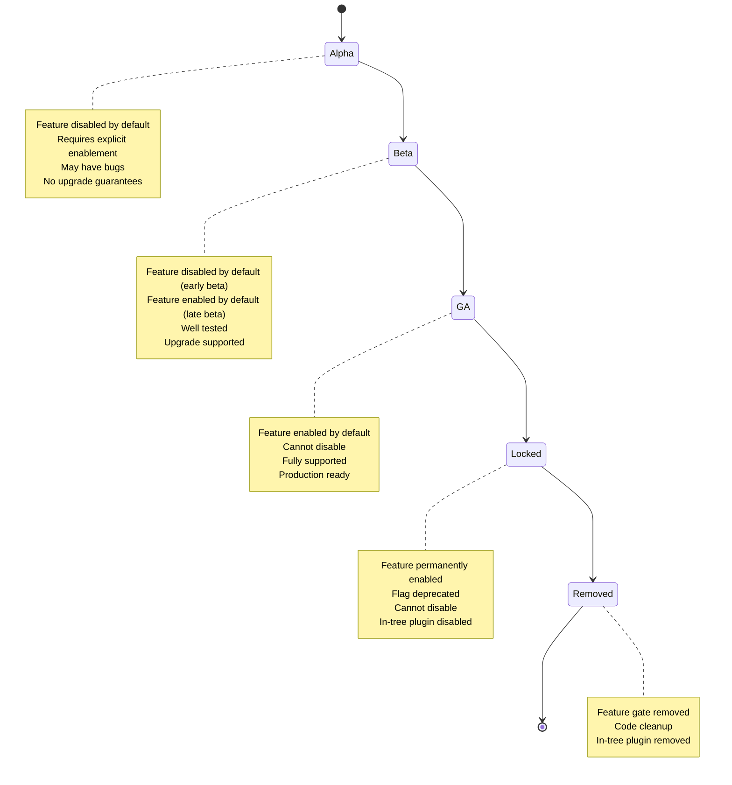

### **Feature Gate Phases in Detail**

**Phase 1: Alpha (Experimental)**
- **Status**: Disabled by default
- **Requirements**: Explicitly enable via feature gate
- **Stability**: May have bugs, incomplete features
- **Support**: No backward compatibility guarantees
- **Testing**: Limited testing
- **Use Case**: Early adopters, testing environments

```yaml
# kube-controller-manager flags
--feature-gates=CSIMigrationAWS=true

# kubelet flags
--feature-gates=CSIMigrationAWS=true
```

**Phase 2: Beta (Pre-release)**
- **Early Beta**:
  - Status: Disabled by default
  - Must explicitly enable
- **Late Beta**:
  - Status: Enabled by default
  - Can explicitly disable
- **Stability**: Well tested, few bugs
- **Support**: Upgrade path guaranteed
- **Testing**: Extensive testing
- **Use Case**: Production clusters (late beta)

```yaml
# Early beta - must enable
--feature-gates=CSIMigrationAWS=true

# Late beta - can disable if needed
--feature-gates=CSIMigrationAWS=false
```

**Phase 3: GA (General Availability)**
- **Status**: Enabled by default
- **Cannot Disable**: Feature gate ignored if set to false
- **Stability**: Production ready
- **Support**: Fully supported
- **Testing**: Comprehensive testing
- **Use Case**: All production clusters

```yaml
# Feature enabled, cannot disable
# This flag has no effect:
--feature-gates=CSIMigrationAWS=false
```

**Phase 4: Locked (Permanent)**
- **Status**: Permanently enabled
- **Feature Gate**: Deprecated but still exists
- **In-Tree Plugin**: Disabled and deprecated
- **Cannot Rollback**: Must use CSI driver
- **Complete Flag**: Separate flag locks migration

```yaml
# CSIMigrationAWS=true (locked, cannot change)
# CSIMigrationAWSComplete=true (in-tree disabled)
```

**Phase 5: Removed**
- **Status**: Feature gate removed from code
- **In-Tree Plugin**: Completely removed
- **Code Cleanup**: Migration code may remain for backward compatibility
- **Timeline**: Usually 2-3 releases after locked

### **Migration Status Matrix**

| Plugin | In-Tree Name | CSI Driver | Alpha | Beta | GA | Locked | Removed |
|--------|-------------|------------|-------|------|----|----|---------|
| AWS EBS | kubernetes.io/aws-ebs | ebs.csi.aws.com | 1.14 | 1.17 | 1.25 | 1.27 | TBD |
| GCE PD | kubernetes.io/gce-pd | pd.csi.storage.gke.io | 1.14 | 1.17 | 1.25 | 1.27 | TBD |
| Azure Disk | kubernetes.io/azure-disk | disk.csi.azure.com | 1.15 | 1.19 | 1.24 | TBD | TBD |
| Azure File | kubernetes.io/azure-file | file.csi.azure.com | 1.15 | 1.21 | TBD | TBD | TBD |
| vSphere | kubernetes.io/vsphere-volume | csi.vsphere.vmware.com | 1.18 | 1.19 | 1.26 | TBD | TBD |
| Cinder | kubernetes.io/cinder | cinder.csi.openstack.org | 1.18 | 1.21 | TBD | TBD | TBD |

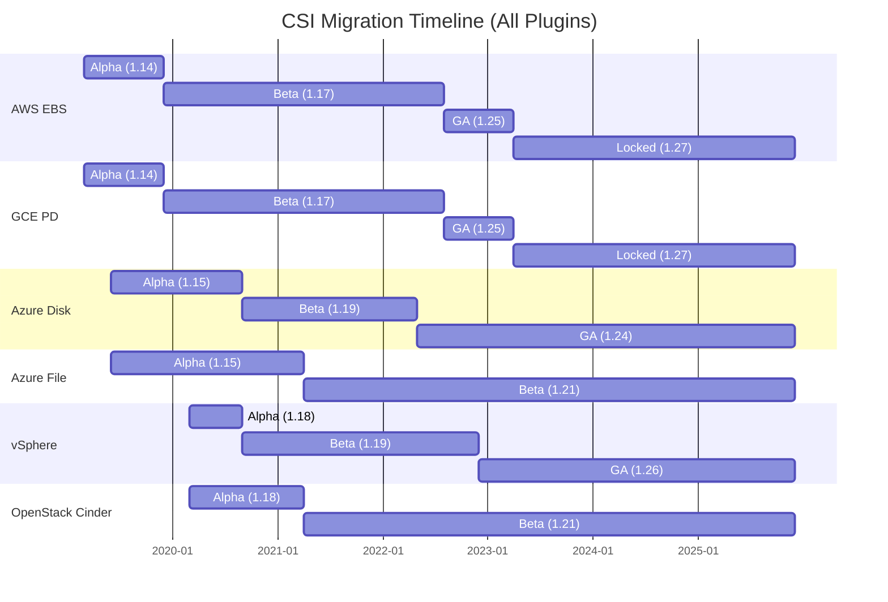

━━━━━━━━━━━━━━━━━━━━━━━━━━━━━━━━━━━━━━━━━━━━━━━━━━━━━━━━━━━━━━━━━━━━━━━━━━━━━━

## **Backward Compatibility**

### **Compatibility Guarantees**

**1. API Compatibility**
- PersistentVolume API remains unchanged
- Existing PVs continue to work
- No user intervention required
- Transparent to applications

**2. Data Compatibility**
- Existing data remains accessible
- No data migration needed
- Same underlying storage
- Same volume handles

**3. Operational Compatibility**
- Same kubectl commands
- Same StorageClass usage
- Same PVC workflow
- Same volume lifecycle

### **Translation Guarantees**

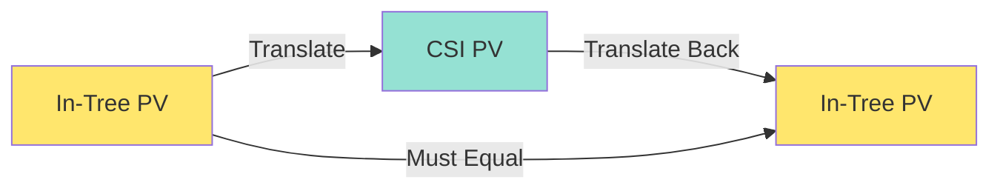

**Bidirectional Translation:**
1. In-Tree to CSI translation
2. CSI to In-Tree translation (for rollback)
3. Round-trip must be lossless

**Metadata Preservation:**
- PV name, namespace, UID preserved
- Labels and annotations preserved
- Finalizers preserved
- Ownership references preserved

### **Rollback Support**

**Before GA:**
- Can disable feature gate
- System reverts to in-tree plugin
- No data loss
- Transparent rollback

**After GA (before Locked):**
- Cannot disable via feature gate
- Must downgrade Kubernetes version
- More complex rollback
- Requires planning

**After Locked:**
- Cannot rollback
- In-tree plugin disabled
- Must use CSI driver
- One-way migration

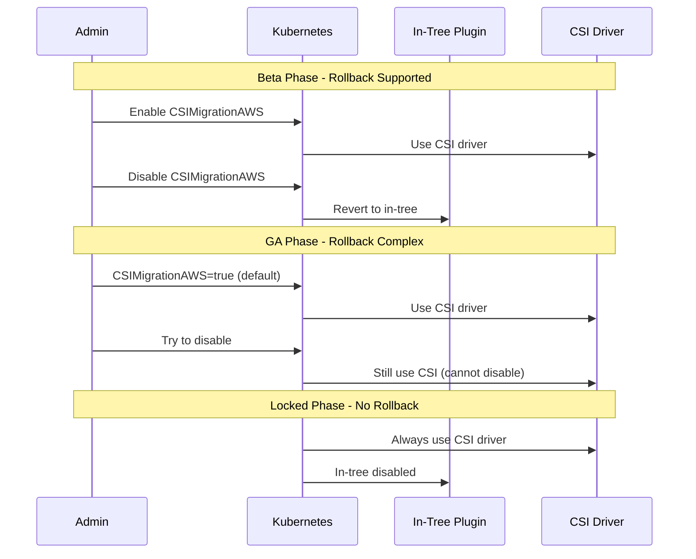

━━━━━━━━━━━━━━━━━━━━━━━━━━━━━━━━━━━━━━━━━━━━━━━━━━━━━━━━━━━━━━━━━━━━━━━━━━━━━━

## **Migration Validation**

### **Validation Process**

**File: /pkg/volume/csimigration/plugin_manager.go (Lines 150-200)**

```go
// ValidateMigration validates that migration is safe
func (pm *pluginManager) ValidateMigration(pv *v1.PersistentVolume) error {
    // Check if PV can be migrated
    if pv == nil {
        return fmt.Errorf("persistent volume is nil")
    }

    // Get plugin name
    pluginName, err := pm.GetPluginNameFromSpec(pv, nil)
    if err != nil {
        return fmt.Errorf("failed to get plugin name: %w", err)
    }

    // Check if migration is enabled
    if !pm.IsMigrationEnabledForPlugin(pluginName) {
        return fmt.Errorf("migration not enabled for plugin %s", pluginName)
    }

    // Verify CSI driver is installed
    if err := pm.verifyCSIDriverInstalled(pluginName); err != nil {
        return fmt.Errorf("CSI driver not installed: %w", err)
    }

    // Validate translation
    translator := pm.getTranslator()
    csiPV, err := translator.TranslateInTreePVToCSI(pv)
    if err != nil {
        return fmt.Errorf("translation failed: %w", err)
    }

    // Verify round-trip
    backPV, err := translator.TranslateCSIPVToInTree(csiPV)
    if err != nil {
        return fmt.Errorf("reverse translation failed: %w", err)
    }

    // Compare original and round-trip PV
    if !pm.comparePVs(pv, backPV) {
        return fmt.Errorf("round-trip translation failed: PVs don't match")
    }

    return nil
}

// verifyCSIDriverInstalled checks if CSI driver is available
func (pm *pluginManager) verifyCSIDriverInstalled(pluginName string) error {
    translator := pm.getTranslator()
    csiDriverName, err := translator.GetCSINameFromInTreeName(pluginName)
    if err != nil {
        return err
    }

    // Check if CSI driver is registered
    // This would query CSIDriver object in real implementation
    // For now, just check the driver name
    if csiDriverName == "" {
        return fmt.Errorf("CSI driver name is empty")
    }

    return nil
}

// comparePVs compares two PVs for equality (ignoring CSI-specific fields)
func (pm *pluginManager) comparePVs(pv1, pv2 *v1.PersistentVolume) bool {
    // Compare capacity
    if !pv1.Spec.Capacity.Storage().Equal(*pv2.Spec.Capacity.Storage()) {
        return false
    }

    // Compare access modes
    if len(pv1.Spec.AccessModes) != len(pv2.Spec.AccessModes) {
        return false
    }

    for i := range pv1.Spec.AccessModes {
        if pv1.Spec.AccessModes[i] != pv2.Spec.AccessModes[i] {
            return false
        }
    }

    // Compare reclaim policy
    if pv1.Spec.PersistentVolumeReclaimPolicy != pv2.Spec.PersistentVolumeReclaimPolicy {
        return false
    }

    return true
}
```

### **Validation Workflow**

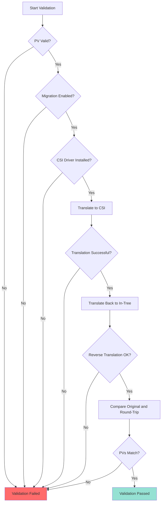

━━━━━━━━━━━━━━━━━━━━━━━━━━━━━━━━━━━━━━━━━━━━━━━━━━━━━━━━━━━━━━━━━━━━━━━━━━━━━━

## **Migration Metrics**

### **Exposed Metrics**

**File: /pkg/volume/csimigration/metrics.go**

```go
var (
    // csiMigrationPluginOperations tracks migration operations
    csiMigrationPluginOperations = metrics.NewCounterVec(
        &metrics.CounterOpts{
            Name:           "csi_migration_plugin_operations_total",
            Help:           "Total number of CSI migration plugin operations",
            StabilityLevel: metrics.ALPHA,
        },
        []string{"plugin_name", "operation_name", "status"},
    )

    // csiMigrationPluginOperationDuration tracks operation latency
    csiMigrationPluginOperationDuration = metrics.NewHistogramVec(
        &metrics.HistogramOpts{
            Name:           "csi_migration_plugin_operation_duration_seconds",
            Help:           "Duration of CSI migration plugin operations",
            Buckets:        metrics.ExponentialBuckets(0.001, 2, 10),
            StabilityLevel: metrics.ALPHA,
        },
        []string{"plugin_name", "operation_name"},
    )

    // csiMigrationPluginErrors tracks translation errors
    csiMigrationPluginErrors = metrics.NewCounterVec(
        &metrics.CounterOpts{
            Name:           "csi_migration_plugin_errors_total",
            Help:           "Total number of CSI migration plugin errors",
            StabilityLevel: metrics.ALPHA,
        },
        []string{"plugin_name", "error_type"},
    )
)
```

**Metric Examples:**

```prometheus
# Migration operations
csi_migration_plugin_operations_total{plugin_name="kubernetes.io/aws-ebs",operation_name="translate_to_csi",status="success"} 1523

# Operation duration
csi_migration_plugin_operation_duration_seconds{plugin_name="kubernetes.io/aws-ebs",operation_name="translate_to_csi",quantile="0.99"} 0.012

# Migration errors
csi_migration_plugin_errors_total{plugin_name="kubernetes.io/aws-ebs",error_type="translation_failed"} 3
```

### **Monitoring Dashboard**

```yaml
apiVersion: v1
kind: ConfigMap
metadata:
  name: csi-migration-dashboard
  namespace: monitoring
data:
  dashboard.json: |
    {
      "dashboard": {
        "title": "CSI Migration",
        "panels": [
          {
            "title": "Migration Operations",
            "targets": [{
              "expr": "rate(csi_migration_plugin_operations_total[5m])"
            }]
          },
          {
            "title": "Translation Errors",
            "targets": [{
              "expr": "rate(csi_migration_plugin_errors_total[5m])"
            }]
          },
          {
            "title": "Operation Latency",
            "targets": [{
              "expr": "histogram_quantile(0.99, rate(csi_migration_plugin_operation_duration_seconds_bucket[5m]))"
            }]
          }
        ]
      }
    }
```

━━━━━━━━━━━━━━━━━━━━━━━━━━━━━━━━━━━━━━━━━━━━━━━━━━━━━━━━━━━━━━━━━━━━━━━━━━━━━━

## **Troubleshooting**

### **Common Issues**

**Issue 1: Migration Not Working**

**Symptoms:**
- Volumes still using in-tree plugin
- No translation happening
- Events show in-tree plugin usage

**Diagnosis:**
```bash
# Check feature gates
kubectl get cm -n kube-system kube-controller-manager -o yaml | grep feature-gates
kubectl get cm -n kube-system kubelet-config -o yaml | grep featureGates

# Check CSI driver installed
kubectl get csidriver

# Check CSINode resources
kubectl get csinode
```

**Solution:**
```yaml
# Enable feature gate on controller-manager
apiVersion: v1
kind: Pod
metadata:
  name: kube-controller-manager
  namespace: kube-system
spec:
  containers:
  - name: kube-controller-manager
    command:
    - kube-controller-manager
    - --feature-gates=CSIMigrationAWS=true

# Enable feature gate on kubelet
apiVersion: kubelet.config.k8s.io/v1beta1
kind: KubeletConfiguration
featureGates:
  CSIMigrationAWS: true
```

**Issue 2: Translation Errors**

**Symptoms:**
- Events show translation failures
- Volumes fail to attach/mount
- Error logs mention translation

**Diagnosis:**
```bash
# Check controller-manager logs
kubectl logs -n kube-system kube-controller-manager-<node> | grep -i "translation"

# Check kubelet logs
journalctl -u kubelet | grep -i "csi migration"

# Check PV annotations
kubectl get pv <pv-name> -o yaml | grep annotations
```

**Solution:**
```bash
# Verify PV format is correct
kubectl get pv <pv-name> -o yaml

# Check for valid volume ID
# For AWS: should be vol-xxxxx
# For GCE: should be projects/.../zones/.../disks/...
# For Azure: should be full URI

# Re-create PV if needed with correct format
```

**Issue 3: CSI Driver Not Found**

**Symptoms:**
- Migration enabled but driver missing
- Attachment fails with "driver not found"
- No CSI pods running

**Diagnosis:**
```bash
# Check CSI driver deployment
kubectl get deploy -n kube-system | grep csi

# Check CSI driver pods
kubectl get pods -n kube-system | grep csi

# Check CSIDriver object
kubectl get csidriver <driver-name> -o yaml
```

**Solution:**
```bash
# Install CSI driver
# Example for AWS EBS
kubectl apply -k "github.com/kubernetes-sigs/aws-ebs-csi-driver/deploy/kubernetes/overlays/stable/?ref=release-1.20"

# Verify driver is running
kubectl get pods -n kube-system -l app=ebs-csi-controller
kubectl get pods -n kube-system -l app=ebs-csi-node

# Verify CSIDriver object
kubectl get csidriver ebs.csi.aws.com
```

### **Debugging Commands**

```bash
# Check migration status for all plugins
kubectl get csidriver -o custom-columns=NAME:.metadata.name,ATTACHED:.status.volumesAttached

# List all PVs with migration annotation
kubectl get pv -o json | jq '.items[] | select(.metadata.annotations["pv.kubernetes.io/migrated-to"] != null) | {name: .metadata.name, driver: .metadata.annotations["pv.kubernetes.io/migrated-to"]}'

# Check volume attachment status
kubectl get volumeattachment -o wide

# Verify CSINode has driver registered
kubectl get csinode <node-name> -o yaml

# Check for translation errors in events
kubectl get events --all-namespaces --field-selector reason=FailedMount,reason=FailedAttach
```

━━━━━━━━━━━━━━━━━━━━━━━━━━━━━━━━━━━━━━━━━━━━━━━━━━━━━━━━━━━━━━━━━━━━━━━━━━━━━━

## **Best Practices**

### **Migration Planning**

**1. Pre-Migration Checklist**
- [ ] Verify Kubernetes version supports migration
- [ ] Check CSI driver compatibility
- [ ] Install and test CSI driver in non-production
- [ ] Enable feature gate in staging environment
- [ ] Validate existing volumes translate correctly
- [ ] Plan rollback procedure
- [ ] Document all custom storage configurations
- [ ] Train team on CSI operations

**2. Migration Execution**
- [ ] Enable feature gate on control plane first
- [ ] Monitor for translation errors
- [ ] Enable feature gate on nodes gradually
- [ ] Verify volumes attach/mount correctly
- [ ] Monitor CSI driver metrics
- [ ] Check for performance issues
- [ ] Validate backup/restore procedures
- [ ] Update documentation and runbooks

**3. Post-Migration Validation**
- [ ] Verify all volumes using CSI driver
- [ ] Check volume operations (attach, mount, unmount, detach)
- [ ] Test volume expansion
- [ ] Test snapshot operations
- [ ] Validate monitoring and alerting
- [ ] Update disaster recovery procedures
- [ ] Remove in-tree plugin dependencies
- [ ] Update deployment automation

### **Testing Strategy**

```yaml
# Test Plan
apiVersion: v1
kind: ConfigMap
metadata:
  name: migration-test-plan
data:
  test-plan.yaml: |
    phases:
      - name: Unit Testing
        tests:
          - Verify translation functions
          - Test round-trip conversion
          - Validate error handling

      - name: Integration Testing
        tests:
          - Deploy test volumes with in-tree
          - Enable migration feature gate
          - Verify volumes use CSI driver
          - Test volume operations
          - Disable feature gate
          - Verify rollback to in-tree

      - name: E2E Testing
        tests:
          - Deploy application with volumes
          - Enable migration
          - Verify application continues working
          - Test pod restart
          - Test node drain
          - Test volume expansion
          - Test snapshots

      - name: Performance Testing
        tests:
          - Measure attach/detach latency
          - Measure mount/unmount latency
          - Compare in-tree vs CSI performance
          - Test under load

      - name: Failure Testing
        tests:
          - CSI driver pod failure
          - Node failure with attached volumes
          - Network partition
          - API server unavailability
          - Storage backend issues
```

### **Migration Timeline**

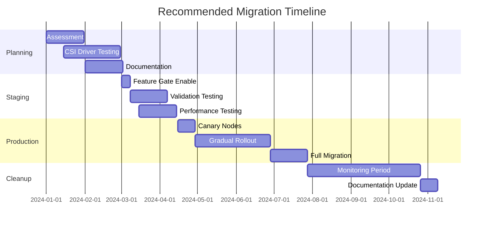

━━━━━━━━━━━━━━━━━━━━━━━━━━━━━━━━━━━━━━━━━━━━━━━━━━━━━━━━━━━━━━━━━━━━━━━━━━━━━━

## **Cross-References**

### **Related CSI Documentation**

**High-Level Architecture:**
- [CSI Core Components](../high-level/01-csi-core-components.md) - Overall CSI architecture
- [External Provisioner](../high-level/02-external-provisioner.md) - Dynamic provisioning
- [External Attacher](../high-level/03-external-attacher.md) - Volume attachment

**Middle-Level Components:**
- [Volume Attachment](../middle-level/01-volume-attachment.md) - VolumeAttachment resource
- [CSI Driver Object](../middle-level/02-csi-driver-object.md) - CSIDriver configuration
- [Storage Capacity](../middle-level/03-storage-capacity.md) - Capacity tracking
- [Volume Snapshots](../middle-level/04-volume-snapshots.md) - Snapshot operations
- [Ephemeral Volumes](../middle-level/05-ephemeral-volumes.md) - Inline volumes

**Low-Level Implementation:**
- [Plugin Registration](../low-level/01-plugin-registration.md) - Driver registration
- [gRPC Client](../low-level/02-grpc-client.md) - CSI RPC calls
- [Volume Operations](../low-level/03-volume-operations.md) - Mount/attach operations
- [Driver Store](../low-level/04-driver-store.md) - Driver management
- [Node Info Manager](../low-level/05-node-info-manager.md) - CSINode management

### **Kubernetes Core Documentation**

**Volume System:**
- [Volume Plugins](/pkg/volume/) - Volume plugin framework
- [Attach/Detach Controller](/pkg/controller/volume/attachdetach/) - Attachment logic
- [Volume Manager](/pkg/kubelet/volumemanager/) - Kubelet volume management

**Feature Gates:**
- [Feature Gates](/pkg/features/) - Feature gate definitions
- [API Server](/cmd/kube-apiserver/) - Feature gate configuration

━━━━━━━━━━━━━━━━━━━━━━━━━━━━━━━━━━━━━━━━━━━━━━━━━━━━━━━━━━━━━━━━━━━━━━━━━━━━━━

## **Summary**

The CSI Migration Framework provides a comprehensive solution for transitioning from in-tree volume plugins to out-of-tree CSI drivers. Key aspects include:

**Architecture:**
- Plugin manager coordinates migration
- Translation library handles conversion
- Feature gates control rollout
- Backward compatibility maintained

**Per-Plugin Status:**
- AWS EBS: GA, locked in 1.27
- GCE PD: GA, locked in 1.27
- Azure Disk: GA in 1.24
- Azure File: Beta
- vSphere: GA in 1.26
- OpenStack Cinder: Beta

**Translation Process:**
- Bidirectional conversion (in-tree ↔ CSI)
- Metadata preservation
- Round-trip validation
- Transparent to users

**Feature Gate Lifecycle:**
- Alpha → Beta → GA → Locked → Removed
- Rollback supported before locked
- Backward compatibility guaranteed
- Gradual rollout recommended

**Best Practices:**
- Test thoroughly before production
- Enable gradually (staging first)
- Monitor metrics and logs
- Plan rollback procedures
- Update documentation

This migration framework enables Kubernetes to evolve toward a fully pluggable storage architecture while maintaining compatibility with existing deployments.

━━━━━━━━━━━━━━━━━━━━━━━━━━━━━━━━━━━━━━━━━━━━━━━━━━━━━━━━━━━━━━━━━━━━━━━━━━━━━━
