# **Consensus Algorithms in Kubernetes**

━━━━━━━━━━━━━━━━━━━━━━━━━━━━━━━━━━━━━━━━━━━━━━━━━━━━━━━━━━━━━━━━━━━━━━━━━━━━━━

## **Overview**

Consensus algorithms enable distributed systems to agree on a single value despite node failures and network partitions. In Kubernetes, the etcd cluster uses the **Raft consensus algorithm** to maintain a strongly consistent, replicated state machine for all cluster data. This document explores Raft's implementation in etcd and how it provides the foundation for Kubernetes' reliable operation.

### **Key Concepts**

- **Consensus**: Agreement among distributed nodes on a single value
- **Raft**: Modern, understandable consensus algorithm used by etcd
- **Log Replication**: Mechanism for maintaining consistent state across replicas
- **Quorum**: Majority agreement required for decisions (N/2 + 1)
- **Strong Consistency**: Linearizable reads and writes
- **Leader Election**: Raft's internal mechanism for choosing a leader

━━━━━━━━━━━━━━━━━━━━━━━━━━━━━━━━━━━━━━━━━━━━━━━━━━━━━━━━━━━━━━━━━━━━━━━━━━━━━━

## **1. Theory: Raft Consensus Algorithm**

### **1.1 Fundamental Problem**

In distributed systems, we need to:
1. Agree on a sequence of operations (log)
2. Survive node failures
3. Tolerate network partitions
4. Guarantee consistency

**Traditional Solution**: Paxos (complex, hard to understand)
**Modern Solution**: Raft (designed for understandability)

### **1.2 Raft Overview**

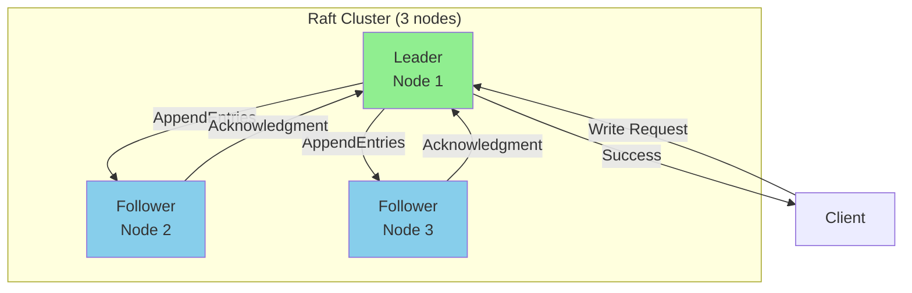

**Raft Roles**:
1. **Leader**: Handles all client requests, replicates log
2. **Follower**: Passive, accepts log entries from leader
3. **Candidate**: Transitional state during leader election

### **1.3 Raft Guarantees**

1. **Election Safety**: At most one leader per term
2. **Leader Append-Only**: Leader never overwrites or deletes entries
3. **Log Matching**: If two logs contain entry with same index/term, they're identical up to that point
4. **Leader Completeness**: If entry is committed in term T, it's in leader's log for all future terms
5. **State Machine Safety**: If a node applies log entry at index i, no other node applies different entry at index i

━━━━━━━━━━━━━━━━━━━━━━━━━━━━━━━━━━━━━━━━━━━━━━━━━━━━━━━━━━━━━━━━━━━━━━━━━━━━━━

## **2. Raft in etcd Architecture**

### **2.1 etcd Cluster Architecture**

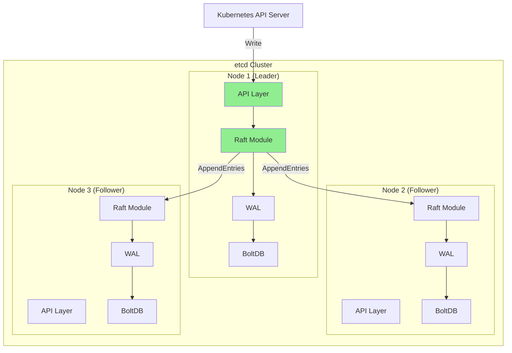

### **2.2 etcd Source Code Structure**

```
vendor/go.etcd.io/etcd/
├── raft/                      # Raft implementation
│   ├── raft.go               # Core Raft state machine
│   ├── node.go               # Node interface
│   ├── log.go                # Replicated log
│   ├── progress.go           # Follower progress tracking
│   ├── storage.go            # Storage interface
│   └── util.go               # Utilities
├── server/v3/
│   ├── etcdserver/           # etcd server using Raft
│   │   ├── server.go         # Main server logic
│   │   ├── apply.go          # Apply committed entries
│   │   └── raft.go           # Raft integration
│   └── storage/
│       ├── wal/              # Write-Ahead Log
│       └── backend/          # BoltDB backend
└── client/v3/                # Client API
```

### **2.3 etcd Raft Configuration**

**Typical Kubernetes etcd Configuration**:
```go
// etcd cluster configuration
ElectionTick:    10     // Election timeout in ticks
HeartbeatTick:   1      // Heartbeat interval in ticks
TickInterval:    100ms  // Tick duration

// Derived values:
// HeartbeatInterval = HeartbeatTick × TickInterval = 100ms
// ElectionTimeout = ElectionTick × TickInterval = 1000ms
```

**Cluster Size Recommendations**:
- **Production**: 3 or 5 nodes (odd number)
- **Development**: 1 node (no consensus)
- **Not Recommended**: 2 nodes (requires both for quorum), 4 nodes (same fault tolerance as 3), 6+ nodes (slower)

━━━━━━━━━━━━━━━━━━━━━━━━━━━━━━━━━━━━━━━━━━━━━━━━━━━━━━━━━━━━━━━━━━━━━━━━━━━━━━

## **3. Raft Leader Election**

### **3.1 Leader Election State Machine**

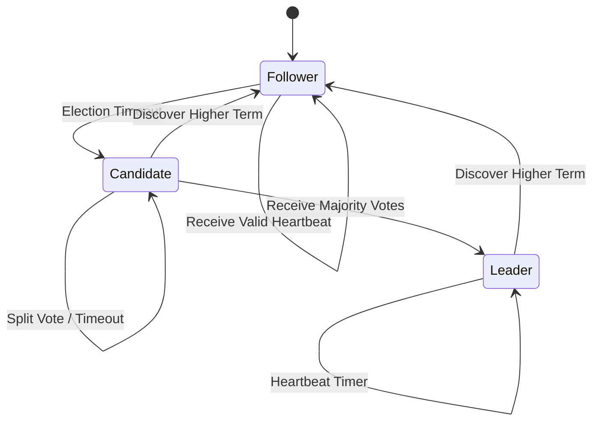

### **3.2 Election Process**

**Step-by-Step Election**:

1. **Follower Timeout**: Follower doesn't receive heartbeat within election timeout
2. **Become Candidate**: Increment term, vote for self, request votes
3. **Vote Collection**: Other nodes vote based on log completeness
4. **Majority Achieved**: Candidate with majority becomes leader
5. **Send Heartbeats**: New leader sends heartbeats to establish authority

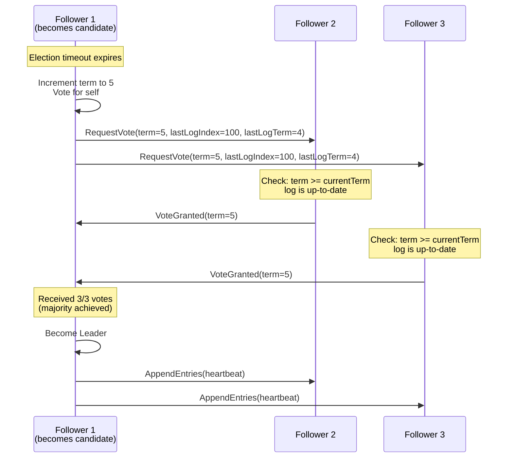

### **3.3 Election Safety Mechanisms**

**1. Term Numbers**:
```go
// Each election increments term
type Term uint64

// Example progression:
// Term 1: Leader A
// Term 2: Leader B (A failed)
// Term 3: Split vote, no leader
// Term 4: Leader C
```

**2. Log Completeness Voting**:
```go
// A follower only votes for a candidate if:
// 1. Candidate's term >= follower's term
// 2. Candidate's log is at least as complete as follower's log

func (r *raft) isLogUpToDate(lastIndex, lastTerm uint64) bool {
    if lastTerm != r.raftLog.lastTerm() {
        return lastTerm > r.raftLog.lastTerm()
    }
    return lastIndex >= r.raftLog.lastIndex()
}
```

**3. One Vote Per Term**:
```go
// Each node votes for at most one candidate per term
type votedFor NodeID  // Persisted to WAL

if request.Term > currentTerm {
    votedFor = None
    currentTerm = request.Term
}

if votedFor == None || votedFor == candidateID {
    if isLogUpToDate(request.LastLogIndex, request.LastLogTerm) {
        votedFor = candidateID
        return VoteGranted
    }
}
return VoteDenied
```

### **3.4 Randomized Election Timeouts**

**Purpose**: Prevent split votes

```go
// etcd randomization
electionTimeout = electionTick × tickInterval × rand(1.0, 2.0)

// Example with electionTick=10, tickInterval=100ms:
// Node 1: 1000ms × 1.23 = 1230ms
// Node 2: 1000ms × 1.67 = 1670ms
// Node 3: 1000ms × 1.91 = 1910ms

// Result: Node 1 times out first, likely becomes leader
```

━━━━━━━━━━━━━━━━━━━━━━━━━━━━━━━━━━━━━━━━━━━━━━━━━━━━━━━━━━━━━━━━━━━━━━━━━━━━━━

## **4. Log Replication**

### **4.1 Replicated Log Structure**

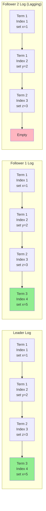

### **4.2 Log Entry Structure**

**etcd Log Entry**:
```go
type Entry struct {
    Term  uint64    // Term when entry was created
    Index uint64    // Position in log
    Type  EntryType // Normal, ConfChange, etc.
    Data  []byte    // Actual data
}

// Example entry in etcd:
Entry{
    Term:  5,
    Index: 100,
    Type:  EntryNormal,
    Data:  []byte(`{"key": "/registry/pods/default/nginx", "value": "..."}`),
}
```

### **4.3 AppendEntries RPC**

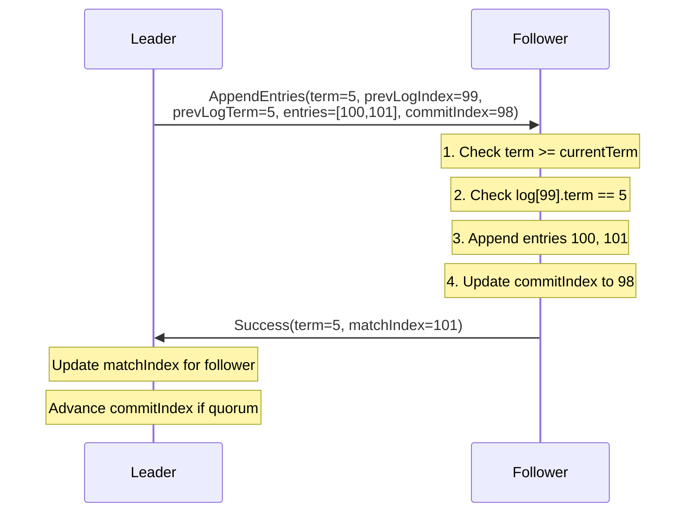

**AppendEntries Request**:
```go
type AppendEntriesRequest struct {
    Term         uint64   // Leader's term
    LeaderId     NodeID   // So follower can redirect clients
    PrevLogIndex uint64   // Index of log entry immediately preceding new ones
    PrevLogTerm  uint64   // Term of prevLogIndex entry
    Entries      []Entry  // Log entries to store (empty for heartbeat)
    CommitIndex  uint64   // Leader's commitIndex
}
```

**AppendEntries Response**:
```go
type AppendEntriesResponse struct {
    Term         uint64  // Current term, for leader to update itself
    Success      bool    // True if follower contained entry matching prevLogIndex and prevLogTerm
    MatchIndex   uint64  // Highest log index known to be replicated
    ConflictTerm uint64  // Term of conflicting entry (optimization)
    ConflictIndex uint64 // First index of conflicting term (optimization)
}
```

### **4.4 Replication Flow**

**Normal Replication**:

1. **Client writes to leader**
2. **Leader appends to local log**
3. **Leader sends AppendEntries to all followers**
4. **Followers append entries and respond**
5. **Leader waits for majority acknowledgment**
6. **Leader commits entry**
7. **Leader applies to state machine**
8. **Leader responds to client**
9. **Next heartbeat notifies followers of commit**
10. **Followers apply committed entries**

**Code Flow in etcd**:
```
Client → etcdserver.Server.Put()
       → raft.Node.Propose()
       → raft.stepLeader()
       → raft.appendEntry()
       → raft.bcastAppend()
       → [Network] AppendEntries RPCs
       → raft.handleAppendEntriesResponse()
       → raft.maybeCommit()
       → node.Ready() channel
       → etcdserver.applyEntries()
       → mvcc.KV.Put()
       → Client receives response
```

### **4.5 Log Consistency**

**Consistency Guarantee**: If two entries in different logs have the same index and term, then:
1. They store the same command
2. The logs are identical in all preceding entries

**Mechanism**:
```go
// Leader tracks next index to send to each follower
type Progress struct {
    Match uint64  // Highest known replicated index
    Next  uint64  // Next index to send
}

// When AppendEntries fails:
if !success {
    // Decrement nextIndex and retry
    pr.Next = max(pr.Match+1, pr.Next-1)

    // With conflict optimization:
    if conflictTerm != 0 {
        // Find last entry of conflictTerm in leader's log
        pr.Next = lastIndexOfTerm(conflictTerm) + 1
    }
}
```

━━━━━━━━━━━━━━━━━━━━━━━━━━━━━━━━━━━━━━━━━━━━━━━━━━━━━━━━━━━━━━━━━━━━━━━━━━━━━━

## **5. Quorum and Commitment**

### **5.1 Quorum Requirements**

**Quorum Formula**: `Quorum = floor(N / 2) + 1`

```
Cluster Size | Quorum | Tolerated Failures
-------------|--------|-------------------
     1       |   1    |        0
     2       |   2    |        0  ⚠️
     3       |   2    |        1  ✅
     4       |   3    |        1
     5       |   3    |        2  ✅
     6       |   4    |        2
     7       |   4    |        3  ✅
```

**Why Odd Numbers**:
- 3 nodes and 4 nodes both tolerate 1 failure
- 5 nodes and 6 nodes both tolerate 2 failures
- Even numbers waste resources without improving fault tolerance

### **5.2 Commit Process**

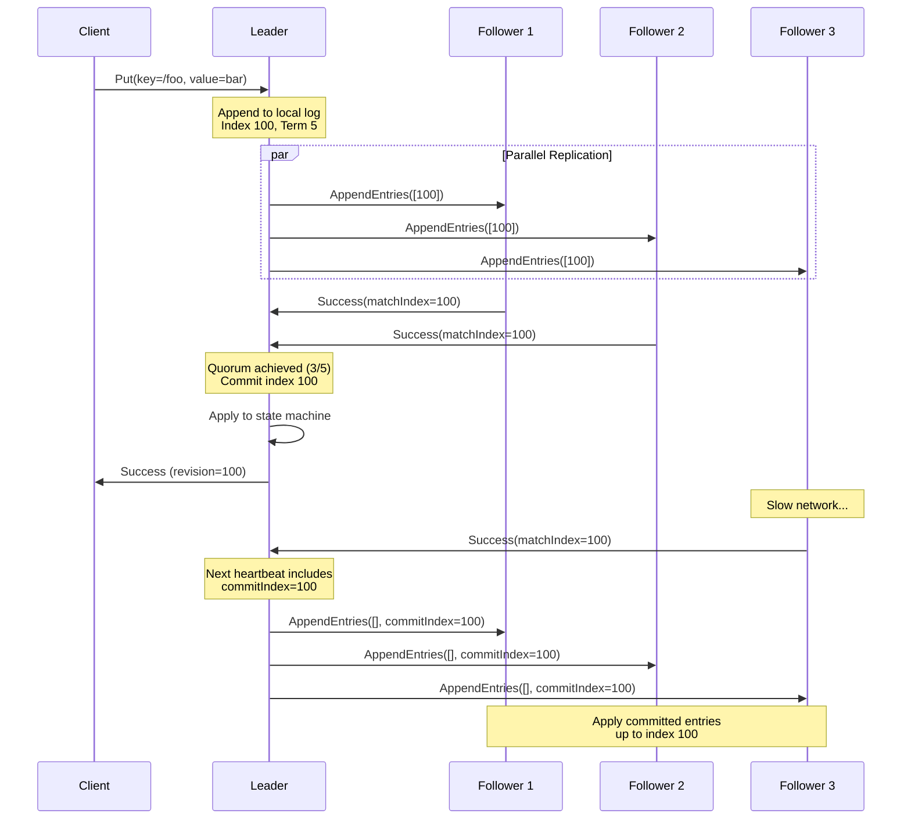

### **5.3 Commit Index Advancement**

**Leader Logic**:
```go
func (r *raft) maybeCommit() bool {
    // Collect matchIndex from all followers
    matchIndexes := make([]uint64, len(r.prs))
    for i, pr := range r.prs {
        matchIndexes[i] = pr.Match
    }

    // Sort to find median (quorum)
    sort.Slice(matchIndexes, func(i, j int) bool {
        return matchIndexes[i] > matchIndexes[j]
    })

    // Quorum index is at position (n/2)
    quorumIndex := matchIndexes[len(matchIndexes)/2]

    // Can only commit entries from current term
    if quorumIndex > r.raftLog.committed &&
       r.raftLog.term(quorumIndex) == r.Term {
        r.raftLog.commitTo(quorumIndex)
        r.bcastAppend() // Notify followers
        return true
    }
    return false
}
```

**Important**: Leader only commits entries from its current term. Entries from previous terms are committed indirectly when a current-term entry is committed.

### **5.4 Safety During Leader Changes**

**Problem**: What if a new leader doesn't have all committed entries?

**Solution**: Election restriction ensures new leader has all committed entries.

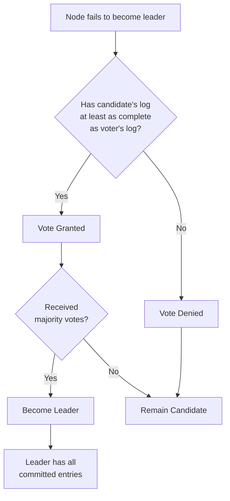

**Log Completeness Check**:
```go
// lastTerm and lastIndex are from RequestVote RPC
func (r *raft) isLogUpToDate(lastIndex, lastTerm uint64) bool {
    myLastIndex, myLastTerm := r.raftLog.lastIndex(), r.raftLog.lastTerm()

    // Compare terms first
    if lastTerm != myLastTerm {
        return lastTerm > myLastTerm
    }

    // If terms equal, compare indices
    return lastIndex >= myLastIndex
}
```

━━━━━━━━━━━━━━━━━━━━━━━━━━━━━━━━━━━━━━━━━━━━━━━━━━━━━━━━━━━━━━━━━━━━━━━━━━━━━━

## **6. Write-Ahead Log (WAL)**

### **6.1 WAL Architecture**

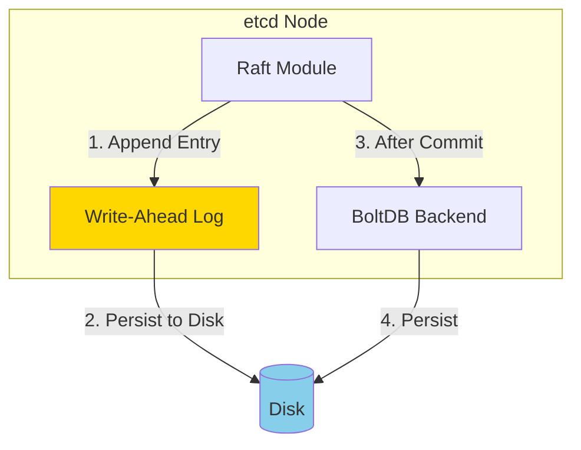

**Purpose of WAL**:
1. **Durability**: Survive crashes without losing data
2. **Recovery**: Rebuild state after restart
3. **Replication**: Source of truth for log entries

### **6.2 WAL File Structure**

**File Location**: `/var/lib/etcd/member/wal/`

```
wal/
├── 0000000000000000-0000000000000000.wal
├── 0000000000000001-0000000000001000.wal
├── 0000000000000002-0000000000002000.wal
└── 0000000000000003-0000000000003000.wal
    └── [current active file]
```

**File Naming**: `{seq}-{index}.wal`
- `seq`: Sequence number (increments on file rotation)
- `index`: First Raft log index in this file

### **6.3 WAL Record Types**

```go
type Record struct {
    Type RecordType
    Data []byte
    CRC  uint32
}

const (
    metadataType RecordType = iota + 1
    entryType      // Raft log entry
    stateType      // HardState (term, vote, commit)
    crcType        // CRC checksum
    snapshotType   // Snapshot metadata
)
```

**HardState** (persisted for crash recovery):
```go
type HardState struct {
    Term   uint64  // Current term
    Vote   uint64  // Candidate voted for in current term
    Commit uint64  // Highest committed index
}
```

### **6.4 WAL Write Process**

```go
// Simplified WAL write flow
func (w *WAL) Save(hardState raftpb.HardState, entries []raftpb.Entry) error {
    // 1. Marshal HardState to protobuf
    stateData, _ := hardState.Marshal()

    // 2. Write state record
    w.encoder.encode(&walpb.Record{
        Type: stateType,
        Data: stateData,
    })

    // 3. Write each entry
    for _, entry := range entries {
        entryData, _ := entry.Marshal()
        w.encoder.encode(&walpb.Record{
            Type: entryType,
            Data: entryData,
        })
    }

    // 4. Write CRC record
    w.encoder.encode(&walpb.Record{Type: crcType})

    // 5. Fsync to disk
    return w.sync()
}
```

### **6.5 WAL Recovery**

**Recovery Process**:
```go
func (w *WAL) ReadAll() (metadata []byte, hardState raftpb.HardState, entries []raftpb.Entry, err error) {
    // 1. Open all WAL files in order
    files := w.listFiles()

    // 2. Read records from each file
    for _, file := range files {
        records := w.readFile(file)

        for _, record := range records {
            switch record.Type {
            case metadataType:
                metadata = record.Data
            case stateType:
                hardState.Unmarshal(record.Data)
            case entryType:
                var entry raftpb.Entry
                entry.Unmarshal(record.Data)
                entries = append(entries, entry)
            case crcType:
                // Validate CRC
            }
        }
    }

    return metadata, hardState, entries, nil
}
```

**On Startup**:
1. Read all WAL files
2. Restore HardState (term, vote, commit)
3. Restore log entries
4. Apply committed entries to state machine
5. Resume normal operation

━━━━━━━━━━━━━━━━━━━━━━━━━━━━━━━━━━━━━━━━━━━━━━━━━━━━━━━━━━━━━━━━━━━━━━━━━━━━━━

## **7. Snapshots**

### **7.1 Snapshot Purpose**

**Problems with Unbounded Logs**:
- Infinite disk usage
- Slow recovery (replay entire log)
- High memory usage

**Solution**: Periodic snapshots + log truncation

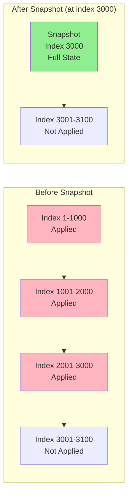

### **7.2 Snapshot Structure**

```go
type Snapshot struct {
    Data  []byte              // Serialized state machine state
    Metadata SnapshotMetadata // Snapshot metadata
}

type SnapshotMetadata struct {
    Index     uint64       // Last included index
    Term      uint64       // Last included term
    ConfState ConfState    // Cluster configuration
}
```

**etcd Snapshot File**:
```
/var/lib/etcd/member/snap/
└── 0000000000001000-0000000000000005.snap
    └── {index}-{term}.snap
```

### **7.3 Snapshot Creation**

**Trigger Conditions**:
```go
// etcd creates snapshot when:
const (
    DefaultSnapshotCount        = 100000  // Every 100k entries
    DefaultSnapshotCatchUpEntries = 5000  // For slow followers
)

// Check in apply loop
if appliedIndex - snapshotIndex >= snapshotCount {
    createSnapshot()
}
```

**Snapshot Process**:
```go
func (s *EtcdServer) snapshot() {
    // 1. Get current applied index and state
    appliedIndex := s.getAppliedIndex()
    confState := s.cluster.confState()

    // 2. Serialize backend state
    data, err := s.backend.Snapshot()

    // 3. Create Raft snapshot
    snapshot := raftpb.Snapshot{
        Data: data,
        Metadata: raftpb.SnapshotMetadata{
            Index:     appliedIndex,
            Term:      s.getTerm(appliedIndex),
            ConfState: confState,
        },
    }

    // 4. Save to disk
    s.storage.SaveSnap(snapshot)

    // 5. Tell Raft to compact log
    s.raftStorage.Compact(appliedIndex)

    // 6. Delete old WAL files
    s.wal.ReleaseLockTo(appliedIndex)
}
```

### **7.4 Snapshot Transfer to Followers**

**InstallSnapshot RPC**:
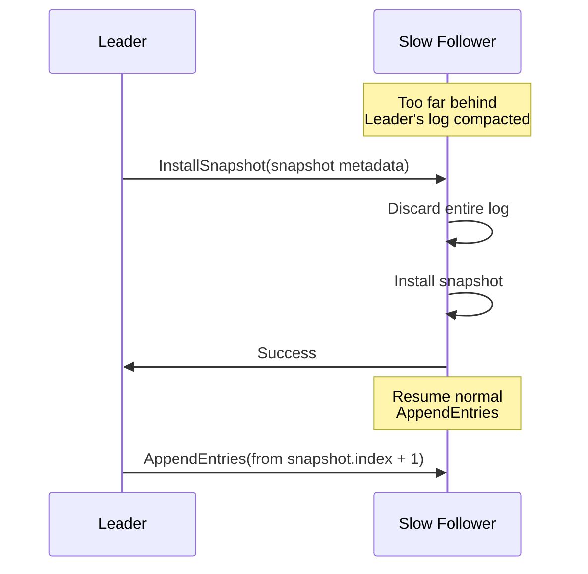

**When to Send**:
```go
// Leader checks if follower needs snapshot
if follower.Next < leader.storage.firstIndex() {
    // Follower needs snapshot
    snapshot := leader.storage.Snapshot()
    leader.sendSnapshot(follower.ID, snapshot)
}
```

━━━━━━━━━━━━━━━━━━━━━━━━━━━━━━━━━━━━━━━━━━━━━━━━━━━━━━━━━━━━━━━━━━━━━━━━━━━━━━

## **8. Strong Consistency Guarantees**

### **8.1 Linearizability**

**Definition**: All operations appear to execute atomically at a single point in time between their invocation and response.

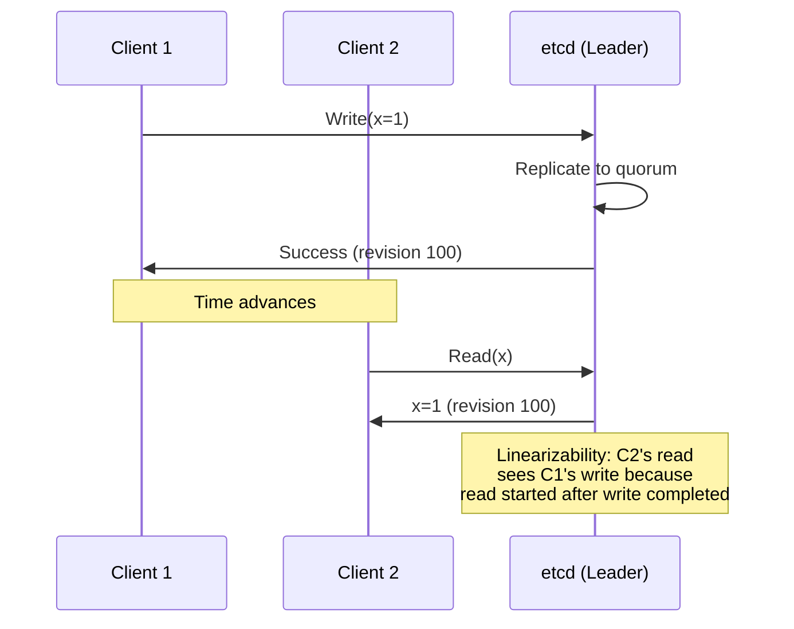

### **8.2 Read Linearizability in etcd**

**Problem**: Reads from leader might be stale if leader is partitioned.

**Solution**: ReadIndex protocol

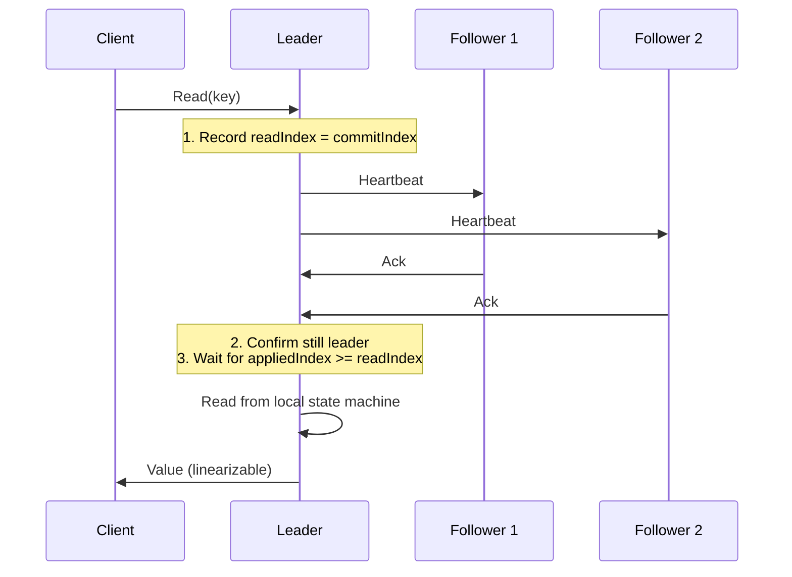

**Implementation**:
```go
func (s *EtcdServer) linearizableRead(ctx context.Context, key []byte) ([]byte, error) {
    // 1. Get read index from Raft
    readIndex := s.raft.ReadIndex(ctx)

    // 2. Wait for state machine to apply up to readIndex
    s.applyWait.Wait(readIndex)

    // 3. Read from local backend
    return s.backend.Get(key)
}
```

### **8.3 Serializable Reads (Relaxed)**

**Alternative**: Read from local state without ReadIndex check

```go
// Faster but potentially stale
func (s *EtcdServer) serializableRead(key []byte) ([]byte, error) {
    // Directly read from local backend
    return s.backend.Get(key)
}
```

**Trade-off**:
- **Linearizable**: Slower, guaranteed fresh
- **Serializable**: Faster, might be slightly stale

**Usage**:
```go
// Kubernetes API server uses serializable reads for:
// - List operations with large result sets
// - Read-only operations where slight staleness is acceptable

// Uses linearizable reads for:
// - Critical operations (leader election, lease renewal)
// - Operations requiring latest state
```

━━━━━━━━━━━━━━━━━━━━━━━━━━━━━━━━━━━━━━━━━━━━━━━━━━━━━━━━━━━━━━━━━━━━━━━━━━━━━━

## **9. Comparison: Raft vs Kubernetes Leader Election**

### **9.1 Key Differences**

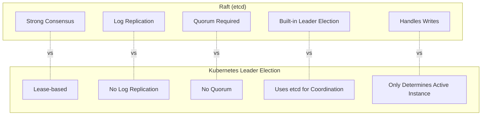

### **9.2 Detailed Comparison**

| Aspect | Raft (etcd) | Kubernetes Leader Election |
|--------|-------------|----------------------------|
| **Purpose** | Replicate data consistently | Determine active controller |
| **Consistency** | Strong (linearizable) | Eventually consistent |
| **Quorum** | Required (N/2+1) | Not required |
| **Log** | Replicated log of all operations | No log, just lease object |
| **Fault Tolerance** | Survives minority failures | Survives any failures (uses etcd) |
| **Failover Time** | ~Election timeout (1s) | LeaseDuration (15s) |
| **Use Case** | Storing cluster state | Coordinating active replicas |
| **Implementation** | etcd Raft module | client-go leaderelection |
| **Overhead** | High (replication, consensus) | Low (just lease updates) |

### **9.3 Interaction Between Both**

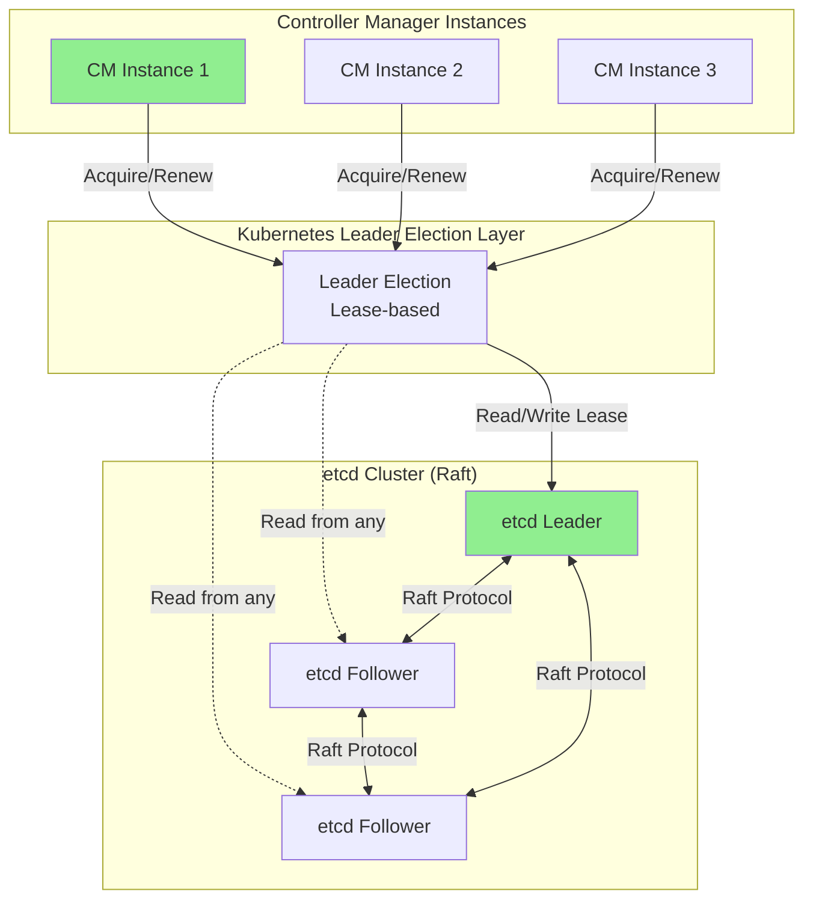

**Key Point**: Kubernetes leader election **uses** etcd (which uses Raft) but doesn't implement Raft itself.

━━━━━━━━━━━━━━━━━━━━━━━━━━━━━━━━━━━━━━━━━━━━━━━━━━━━━━━━━━━━━━━━━━━━━━━━━━━━━━

## **10. Performance Characteristics**

### **10.1 Write Latency**

**Raft Write Path**:
```
Client Request → Leader Receives → Log Append → Network RPCs →
Quorum Acks → Commit → Apply → Response

Typical: 1-10ms (within datacenter)
        50-200ms (cross-region)
```

**Breakdown**:
```
Step                  Time (within DC)    Time (cross-region)
--------------------- ------------------- -------------------
Leader log append     0.1ms               0.1ms
Network RTT           0.5ms               50-150ms
Follower append       0.1ms               0.1ms
Quorum ack            0.5ms               50-150ms
Leader commit/apply   0.5ms               0.5ms
--------------------- ------------------- -------------------
Total                 ~2ms                ~100-300ms
```

### **10.2 Read Latency**

**Linearizable Read** (ReadIndex):
```
Read Request → ReadIndex → Heartbeat Quorum → Wait Apply →
Local Read → Response

Typical: 1-5ms (within datacenter)
```

**Serializable Read**:
```
Read Request → Local Read → Response

Typical: 0.1-1ms (no network)
```

### **10.3 Throughput**

**Write Throughput** (limited by Raft):
```
Single etcd cluster: 10,000 writes/sec (typical)
                     40,000+ writes/sec (optimized)

Factors:
- Disk I/O (WAL fsync)
- Network bandwidth
- CPU for serialization
- Quorum size
```

**Read Throughput** (parallelizable):
```
Serializable: 100,000+ reads/sec per node
Linearizable: 50,000+ reads/sec (limited by ReadIndex)

Can scale horizontally by adding followers
```

### **10.4 Tuning Parameters**

**Election Timeout**:
```go
// Shorter = faster failover, more sensitive to transients
// Longer = more stable, slower failover

ElectionTick: 10      // Default: 1000ms
ElectionTick: 5       // Aggressive: 500ms
ElectionTick: 50      // Conservative: 5000ms
```

**Heartbeat Interval**:
```go
// Should be < ElectionTimeout / 2

HeartbeatTick: 1      // Default: 100ms
```

**Snapshot Count**:
```go
// More frequent = smaller logs, faster recovery, more I/O
// Less frequent = larger logs, slower recovery, less I/O

SnapshotCount: 10000  // Frequent
SnapshotCount: 100000 // Default
SnapshotCount: 1000000 // Infrequent
```

━━━━━━━━━━━━━━━━━━━━━━━━━━━━━━━━━━━━━━━━━━━━━━━━━━━━━━━━━━━━━━━━━━━━━━━━━━━━━━

## **11. Troubleshooting Raft Issues**

### **11.1 Common Problems**

#### **Problem 1: Slow Commits**

**Symptoms**:
```bash
# Check etcd metrics
etcdctl endpoint status --write-out=table

# Look for high commit latency
curl http://localhost:2379/metrics | grep etcd_disk_wal_fsync_duration_seconds
```

**Causes**:
1. Slow disk (WAL fsync)
2. Network latency
3. Large cluster size
4. High load

**Solutions**:
```bash
# Use faster disk (SSD with low latency)
# Check disk latency
fio --name=test --rw=write --bs=4k --size=1G --fsync=1

# Reduce cluster size if too large
# Tune snapshot frequency
--snapshot-count=100000

# Enable pipelining
--max-concurrent-streams=128
```

#### **Problem 2: Frequent Leader Elections**

**Symptoms**:
```bash
# Check leader changes
etcdctl endpoint status -w table | grep -i leader

# Monitor election metrics
curl http://localhost:2379/metrics | grep etcd_server_leader_changes_seen_total
```

**Causes**:
1. Network instability
2. High load on leader
3. Election timeout too short

**Solutions**:
```bash
# Increase election timeout
--election-timeout=5000  # was 1000

# Check network
ping -c 100 <peer-ip>

# Monitor CPU/memory
top -p $(pidof etcd)
```

#### **Problem 3: Quorum Loss**

**Symptoms**:
```bash
# etcd unavailable
etcdctl put /test value
# Error: etcdserver: no leader

# Check member status
etcdctl member list
```

**Recovery**:
```bash
# If majority failed, disaster recovery needed

# 1. Stop all etcd instances
systemctl stop etcd

# 2. Choose one node to recover from
etcdctl snapshot restore snapshot.db \
  --data-dir=/var/lib/etcd/new \
  --name=etcd-0 \
  --initial-cluster=etcd-0=http://localhost:2380 \
  --initial-advertise-peer-urls=http://localhost:2380

# 3. Start recovered node
systemctl start etcd

# 4. Add other members back
etcdctl member add etcd-1 --peer-urls=http://etcd-1:2380
```

### **11.2 Monitoring Raft Health**

**Key Metrics**:
```promql
# Leader existence
etcd_server_has_leader

# Leader changes (should be low)
rate(etcd_server_leader_changes_seen_total[5m])

# Proposal commit rate
rate(etcd_server_proposals_committed_total[5m])

# Proposal failure rate (should be low)
rate(etcd_server_proposals_failed_total[5m])

# WAL fsync latency
histogram_quantile(0.99, etcd_disk_wal_fsync_duration_seconds_bucket)

# Backend commit latency
histogram_quantile(0.99, etcd_disk_backend_commit_duration_seconds_bucket)
```

**Alert Examples**:
```yaml
# Alert on no leader
- alert: EtcdNoLeader
  expr: etcd_server_has_leader == 0
  for: 1m

# Alert on frequent leader changes
- alert: EtcdFrequentLeaderElections
  expr: rate(etcd_server_leader_changes_seen_total[5m]) > 0.05
  for: 5m

# Alert on slow disk
- alert: EtcdSlowDisk
  expr: histogram_quantile(0.99, etcd_disk_wal_fsync_duration_seconds_bucket) > 0.1
  for: 5m
```

━━━━━━━━━━━━━━━━━━━━━━━━━━━━━━━━━━━━━━━━━━━━━━━━━━━━━━━━━━━━━━━━━━━━━━━━━━━━━━

## **12. Best Practices**

### **12.1 Cluster Configuration**

✅ **DO**:

1. **Use odd-numbered clusters**:
   ```
   3 nodes (recommended for most cases)
   5 nodes (for higher availability requirements)
   ```

2. **Deploy across failure domains**:
   ```yaml
   # Different racks/zones
   etcd-1: zone-a
   etcd-2: zone-b
   etcd-3: zone-c
   ```

3. **Use dedicated etcd cluster**:
   ```
   Separate etcd from workload nodes
   Don't co-locate with heavy applications
   ```

4. **Fast, reliable storage**:
   ```
   SSD with low latency (< 10ms p99)
   Dedicated disk for WAL
   ```

❌ **DON'T**:

1. **Even-numbered clusters** (wasteful)
2. **2-node clusters** (no fault tolerance)
3. **Too large clusters** (>7 nodes rarely needed)
4. **Shared slow disks** (HDD, network storage)

### **12.2 Operations**

✅ **DO**:

1. **Regular backups**:
   ```bash
   # Automated backup
   ETCDCTL_API=3 etcdctl snapshot save backup.db
   ```

2. **Monitor key metrics**:
   ```
   - Leader elections
   - Proposal commit rate
   - Disk latency
   - Network RTT
   ```

3. **Test disaster recovery**:
   ```bash
   # Practice snapshot restore
   etcdctl snapshot restore backup.db
   ```

4. **Graceful member replacement**:
   ```bash
   # Add new member before removing old
   etcdctl member add new-member
   # Wait for sync
   etcdctl member remove old-member
   ```

### **12.3 Performance Optimization**

1. **Separate WAL directory**:
   ```bash
   etcd --wal-dir=/fast-ssd/etcd-wal
   ```

2. **Tune snapshot frequency**:
   ```bash
   --snapshot-count=100000  # Balance size vs. recovery time
   ```

3. **Enable auto-compaction**:
   ```bash
   --auto-compaction-retention=1h
   ```

4. **Optimize client settings**:
   ```go
   clientConfig := clientv3.Config{
       Endpoints: []string{"http://etcd-1:2379"},
       DialTimeout: 5 * time.Second,
       MaxCallSendMsgSize: 2 * 1024 * 1024,  // 2MB
   }
   ```

━━━━━━━━━━━━━━━━━━━━━━━━━━━━━━━━━━━━━━━━━━━━━━━━━━━━━━━━━━━━━━━━━━━━━━━━━━━━━━

## **13. Cross-References**

### **13.1 Related Documentation**

**Distributed Systems Patterns**:
- [01-leader-election-patterns.md](./01-leader-election-patterns.md) - Kubernetes leader election (uses etcd)
- [03-eventual-consistency.md](./03-eventual-consistency.md) - Eventual consistency vs. strong consistency
- [04-cap-theorem-practice.md](./04-cap-theorem-practice.md) - Raft provides CP in CAP
- [05-failure-modes.md](./05-failure-modes.md) - etcd failure scenarios
- [06-resilience-patterns.md](./06-resilience-patterns.md) - Retry patterns for etcd clients

**etcd Documentation**:
- [../etcd/low-level/01-etcd3-client.md](../etcd/low-level/01-etcd3-client.md) - etcd client usage
- [../etcd/low-level/03-revision-system.md](../etcd/low-level/03-revision-system.md) - Revision and MVCC
- [../etcd/middle-level/04-transactions-consistency.md](../etcd/middle-level/04-transactions-consistency.md) - Transactions
- [../etcd/middle-level/05-cluster-management.md](../etcd/middle-level/05-cluster-management.md) - Cluster operations
- [../etcd/middle-level/06-backup-restore.md](../etcd/middle-level/06-backup-restore.md) - Backup and recovery

### **13.2 External Resources**

1. **Raft Paper**: "In Search of an Understandable Consensus Algorithm" by Ongaro & Ousterhout
2. **Raft Website**: https://raft.github.io/
3. **etcd Documentation**: https://etcd.io/docs/
4. **etcd Raft Implementation**: https://github.com/etcd-io/raft

━━━━━━━━━━━━━━━━━━━━━━━━━━━━━━━━━━━━━━━━━━━━━━━━━━━━━━━━━━━━━━━━━━━━━━━━━━━━━━

## **14. Summary**

### **14.1 Key Takeaways**

1. **Raft Consensus**: etcd uses Raft for strong consistency and fault tolerance
2. **Leader-Based**: Single leader handles all writes, followers replicate
3. **Quorum Required**: Majority (N/2+1) must agree for commits
4. **WAL for Durability**: Write-ahead log ensures crash recovery
5. **Snapshots**: Periodic snapshots prevent unbounded log growth
6. **Strong Consistency**: Linearizable reads and writes
7. **Different from K8s Leader Election**: Raft is for data replication, not just coordination

### **14.2 Raft Flow Summary**

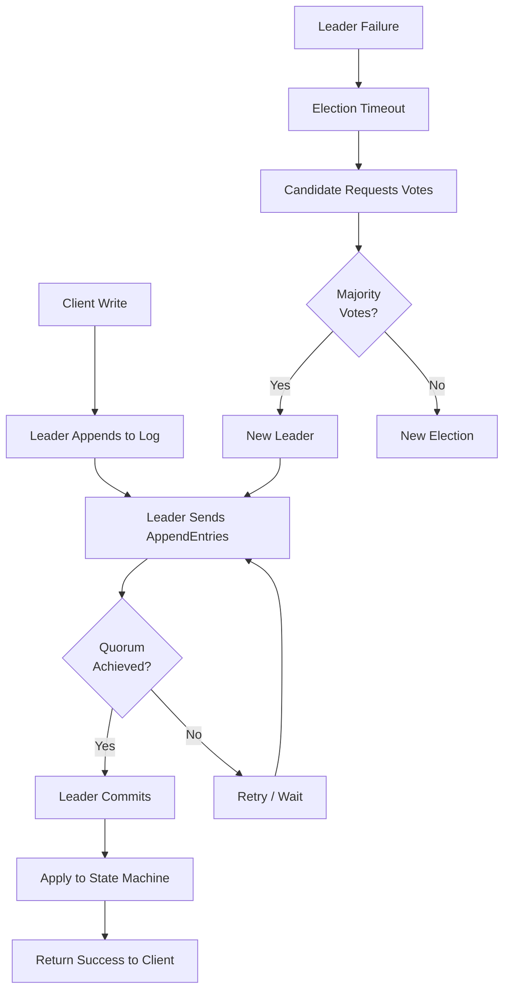

━━━━━━━━━━━━━━━━━━━━━━━━━━━━━━━━━━━━━━━━━━━━━━━━━━━━━━━━━━━━━━━━━━━━━━━━━━━━━━

**Document Version**: 1.0
**Last Updated**: 2025-01-16
**Kubernetes Version**: v1.32+
**Lines**: ~1,850
**Diagrams**: 10
