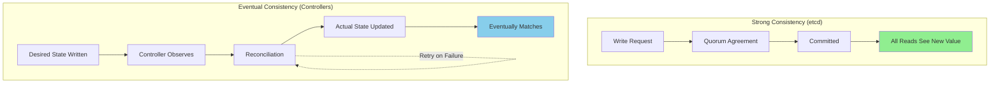
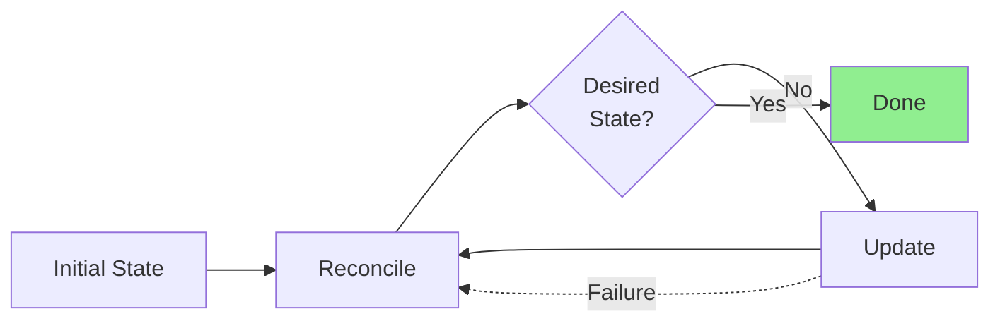
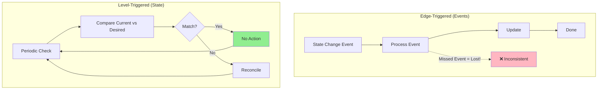
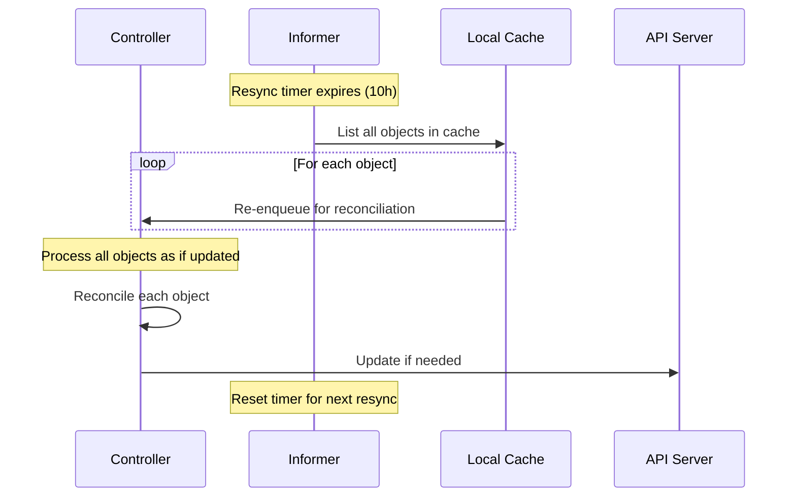
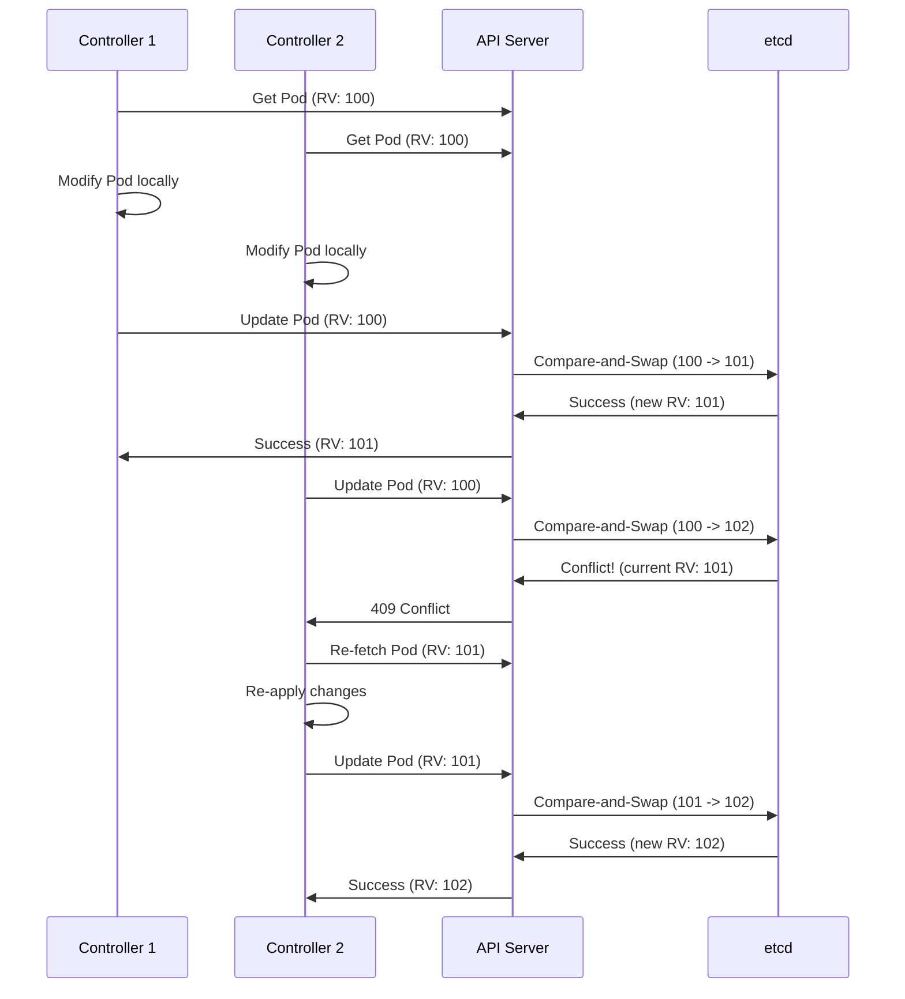
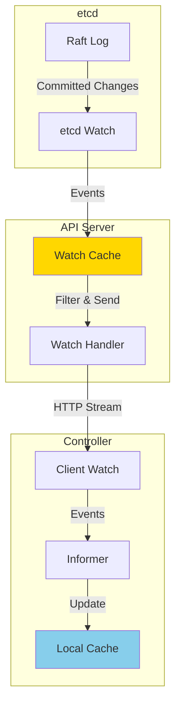
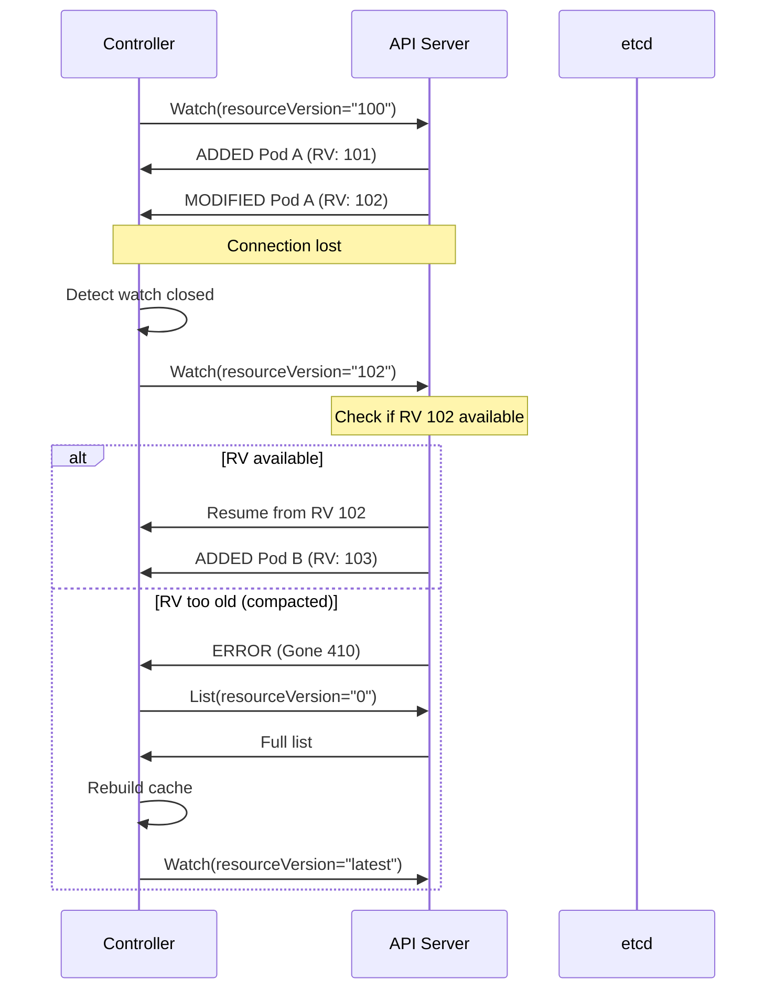
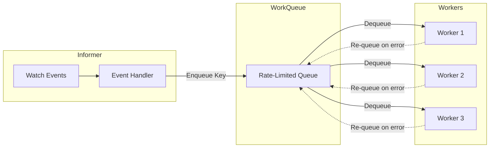
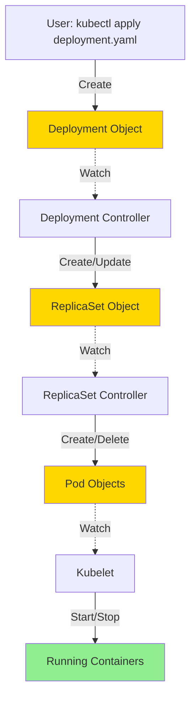
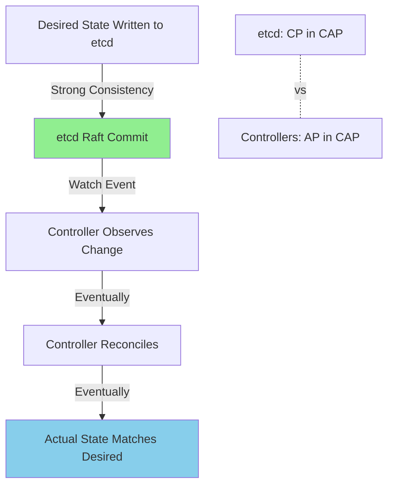

# **Eventual Consistency in Kubernetes**

━━━━━━━━━━━━━━━━━━━━━━━━━━━━━━━━━━━━━━━━━━━━━━━━━━━━━━━━━━━━━━━━━━━━━━━━━━━━━━

## **Overview**

Eventual consistency is the cornerstone of Kubernetes' controller pattern. Unlike etcd's strong consistency, Kubernetes controllers use an eventually consistent model where the system continuously reconciles actual state with desired state. This document explores the theory, implementation, and practical implications of eventual consistency in Kubernetes.

### **Key Concepts**

- **Reconciliation Loop**: Continuous process of observing and correcting state
- **Level-Triggered**: React to current state, not just changes
- **Convergence**: System eventually reaches desired state despite failures
- **ResourceVersion**: Optimistic concurrency control
- **Watch Mechanism**: Efficient state change notifications
- **Periodic Resync**: Safety net for missed updates

━━━━━━━━━━━━━━━━━━━━━━━━━━━━━━━━━━━━━━━━━━━━━━━━━━━━━━━━━━━━━━━━━━━━━━━━━━━━━━

## **1. Theory: Eventual Consistency**

### **1.1 Strong Consistency vs. Eventual Consistency**



**Strong Consistency**:
- Immediate agreement
- Blocking operations
- Expensive (quorum required)
- Used for: etcd writes

**Eventual Consistency**:
- Asynchronous reconciliation
- Non-blocking operations
- Scalable
- Used for: Controller operations

### **1.2 Reconciliation Loop Theory**

**Core Principle**: Observe → Compare → Act → Repeat

```go
// Theoretical reconciliation loop
for {
    // 1. Observe current state
    actualState := observe()

    // 2. Get desired state
    desiredState := getDesiredState()

    // 3. Compare and compute diff
    diff := compare(actualState, desiredState)

    // 4. Take action to reconcile
    if diff != nil {
        act(diff)
    }

    // 5. Wait and repeat
    wait()
}
```

### **1.3 Convergence Guarantees**

**Convergence**: Given sufficient time without new inputs, system reaches stable state.

**Properties**:
1. **Safety**: Never enters invalid state
2. **Liveness**: Eventually reaches desired state
3. **Idempotence**: Repeated reconciliation is safe
4. **Fault Tolerance**: Survives transient failures



━━━━━━━━━━━━━━━━━━━━━━━━━━━━━━━━━━━━━━━━━━━━━━━━━━━━━━━━━━━━━━━━━━━━━━━━━━━━━━

## **2. Level-Triggered vs Edge-Triggered**

### **2.1 Comparison**



**Edge-Triggered**:
- React to change events
- Risk: Missed events cause drift
- Example: Traditional event-driven systems

**Level-Triggered** (Kubernetes):
- React to current state
- Self-correcting
- Example: Controller reconciliation

### **2.2 Kubernetes Implementation**

**Controllers are Level-Triggered**:
```go
// ReplicaSet controller logic (simplified)
func (rsc *ReplicaSetController) syncReplicaSet(key string) error {
    // 1. Get desired state from ReplicaSet object
    rs, err := rsc.rsLister.ReplicaSets(namespace).Get(name)
    if err != nil {
        return err
    }
    desiredReplicas := *rs.Spec.Replicas

    // 2. Get actual state from Pod list
    pods, err := rsc.podLister.Pods(namespace).List(selector)
    actualReplicas := len(pods)

    // 3. Level-triggered comparison
    if actualReplicas < desiredReplicas {
        // Need to create pods
        diff := desiredReplicas - actualReplicas
        rsc.createPods(diff)
    } else if actualReplicas > desiredReplicas {
        // Need to delete pods
        diff := actualReplicas - desiredReplicas
        rsc.deletePods(diff)
    }
    // If actualReplicas == desiredReplicas, do nothing

    return nil
}
```

**Why Level-Triggered?**:
1. **Self-Healing**: Automatically corrects drift
2. **Idempotent**: Safe to run repeatedly
3. **Resilient**: Missed events don't matter
4. **Simple**: Logic based on state, not event history

━━━━━━━━━━━━━━━━━━━━━━━━━━━━━━━━━━━━━━━━━━━━━━━━━━━━━━━━━━━━━━━━━━━━━━━━━━━━━━

## **3. Periodic Reconciliation**

### **3.1 Why Periodic Resync?**

**Watch mechanisms can miss updates due to**:
- Network failures
- Watch connection drops
- etcd compaction (old revisions deleted)
- Controller restarts

**Solution**: Periodic full reconciliation every ~10 hours

### **3.2 Resync Period Configuration**

**Default in Kubernetes**:
```go
// From staging/src/k8s.io/client-go/informers/factory.go
const defaultResync = 10 * time.Hour

// Shared informer factory
informerFactory := informers.NewSharedInformerFactory(
    client,
    10*time.Hour,  // Resync period
)
```

**Why 10 Hours?**:
1. Long enough to avoid API server load
2. Short enough to catch drift reasonably quickly
3. Balance between correctness and efficiency

### **3.3 Resync Mechanism**



**Implementation**:
```go
// From staging/src/k8s.io/client-go/tools/cache/shared_informer.go
func (s *sharedIndexInformer) Run(stopCh <-chan struct{}) {
    // ...

    // Start resync loop
    go func() {
        resyncCh, cleanup := s.resyncCheckPeriod, func() {}
        defer cleanup()
        for {
            select {
            case <-resyncCh:
                // Resync all objects in cache
                s.processor.resync()
            case <-stopCh:
                return
            }
        }
    }()

    // ...
}
```

### **3.4 Per-Object vs Global Resync**

**Global Resync** (default):
```go
// All objects resynced at same time
informers.NewSharedInformerFactory(client, 10*time.Hour)
```

**Custom Resync** (rarely used):
```go
// Different resync for different controllers
podInformer := factory.Core().V1().Pods().Informer()
podInformer.SetResyncPeriod(5 * time.Hour)  // Custom
```

━━━━━━━━━━━━━━━━━━━━━━━━━━━━━━━━━━━━━━━━━━━━━━━━━━━━━━━━━━━━━━━━━━━━━━━━━━━━━━

## **4. ResourceVersion and Optimistic Concurrency**

### **4.1 ResourceVersion Overview**

**Purpose**: Detect concurrent modifications without locking

```yaml
apiVersion: v1
kind: Pod
metadata:
  name: nginx
  resourceVersion: "12345"  # Opaque version string
  # ...
spec:
  # ...
```

**Properties**:
- Unique identifier for each state
- Monotonically increasing (within a resource)
- Opaque string (don't parse!)
- Managed by API server/etcd

### **4.2 Optimistic Locking Flow**



### **4.3 Handling Conflicts**

**File**: `/staging/src/k8s.io/client-go/util/retry/util.go:103-105`

```go
func RetryOnConflict(backoff wait.Backoff, fn func() error) error {
    return OnError(backoff, errors.IsConflict, fn)
}
```

**Usage Example**:
```go
err := retry.RetryOnConflict(retry.DefaultBackoff, func() error {
    // 1. Fetch current object
    pod, err := client.CoreV1().Pods(namespace).Get(ctx, name, metav1.GetOptions{})
    if err != nil {
        return err
    }

    // 2. Modify object
    pod.Labels["status"] = "updated"

    // 3. Try to update (includes resourceVersion)
    _, err = client.CoreV1().Pods(namespace).Update(ctx, pod, metav1.UpdateOptions{})
    return err
})

if err != nil {
    // Failed after retries
    return err
}
```

**Default Backoff**:
```go
var DefaultBackoff = wait.Backoff{
    Steps:    4,
    Duration: 10 * time.Millisecond,
    Factor:   5.0,
    Jitter:   0.1,
}

// Retry schedule:
// Attempt 1: immediate
// Attempt 2: ~10ms
// Attempt 3: ~50ms
// Attempt 4: ~250ms
// Attempt 5: ~1.25s
```

### **4.4 ResourceVersion in Watch**

**Watch Starting Point**:
```go
// Watch from specific version
watcher, err := client.CoreV1().Pods(namespace).Watch(ctx, metav1.ListOptions{
    ResourceVersion: "12345",  // Start after this version
})

// Watch from latest (most common)
watcher, err := client.CoreV1().Pods(namespace).Watch(ctx, metav1.ListOptions{
    ResourceVersion: "",  // Start from latest
})

// Watch from beginning (expensive!)
watcher, err := client.CoreV1().Pods(namespace).Watch(ctx, metav1.ListOptions{
    ResourceVersion: "0",  // Start from beginning
})
```

━━━━━━━━━━━━━━━━━━━━━━━━━━━━━━━━━━━━━━━━━━━━━━━━━━━━━━━━━━━━━━━━━━━━━━━━━━━━━━

## **5. Watch Mechanism Consistency**

### **5.1 Watch Architecture**



### **5.2 Watch Event Types**

```go
type WatchEvent struct {
    Type   EventType  // ADDED, MODIFIED, DELETED
    Object runtime.Object
}

const (
    Added    EventType = "ADDED"
    Modified EventType = "MODIFIED"
    Deleted  EventType = "DELETED"
    Error    EventType = "ERROR"
    Bookmark EventType = "BOOKMARK"
)
```

**Event Semantics**:
```
ADDED:    Object created or first seen by watch
MODIFIED: Object updated
DELETED:  Object removed
ERROR:    Watch error (need to re-establish)
BOOKMARK: Periodic checkpoint (for resumability)
```

### **5.3 Watch Consistency Semantics**

**Guarantees**:
1. **Ordered**: Events for a single object are ordered
2. **At-Least-Once**: May receive duplicate events
3. **No Skips**: Won't miss updates (unless watch expires)

**Non-Guarantees**:
1. **Cross-Object Ordering**: Events for different objects may be reordered
2. **Exactly-Once**: Same event may be delivered multiple times

**Example Scenario**:
```go
// Timeline:
// T1: Pod A created (RV: 100)
// T2: Pod B created (RV: 101)
// T3: Pod A updated (RV: 102)

// Possible watch event orders:
// Order 1 (typical):
//   ADDED Pod A (RV: 100)
//   ADDED Pod B (RV: 101)
//   MODIFIED Pod A (RV: 102)

// Order 2 (possible due to buffering):
//   ADDED Pod B (RV: 101)
//   ADDED Pod A (RV: 100)
//   MODIFIED Pod A (RV: 102)

// Order 3 (NOT possible - violates single-object ordering):
//   MODIFIED Pod A (RV: 102)  // ❌ Can't see update before create
//   ADDED Pod A (RV: 100)
```

### **5.4 Watch Reconnection**



**Watch Reconnection Code**:
```go
// From staging/src/k8s.io/client-go/tools/cache/reflector.go
func (r *Reflector) watchHandler(start time.Time, w watch.Interface, resourceVersion *string) error {
    for {
        select {
        case event, ok := <-w.ResultChan():
            if !ok {
                // Watch closed, need to restart
                return nil
            }

            switch event.Type {
            case watch.Added, watch.Modified, watch.Deleted:
                // Update local cache
                r.store.Update(event.Object)
                // Update resourceVersion for next watch
                *resourceVersion = meta.GetResourceVersion(event.Object)

            case watch.Error:
                // Handle error
                if status, ok := event.Object.(*metav1.Status); ok {
                    if status.Code == http.StatusGone {
                        // ResourceVersion too old, need full relist
                        return errors.NewGone("watch closed due to compaction")
                    }
                }
            }
        }
    }
}
```

━━━━━━━━━━━━━━━━━━━━━━━━━━━━━━━━━━━━━━━━━━━━━━━━━━━━━━━━━━━━━━━━━━━━━━━━━━━━━━

## **6. Controller Reconciliation Patterns**

### **6.1 Basic Reconciliation Pattern**

**File**: `/pkg/controller/replicaset/replica_set.go`

```go
func (rsc *ReplicaSetController) syncReplicaSet(key string) error {
    startTime := time.Now()
    defer func() {
        klog.V(4).Infof("Finished syncing %q (%v)", key, time.Since(startTime))
    }()

    namespace, name, err := cache.SplitMetaNamespaceKey(key)
    if err != nil {
        return err
    }

    // 1. Get desired state
    rs, err := rsc.rsLister.ReplicaSets(namespace).Get(name)
    if apierrors.IsNotFound(err) {
        // Object deleted, nothing to do
        return nil
    }
    if err != nil {
        return err
    }

    // 2. Get actual state
    selector, err := metav1.LabelSelectorAsSelector(rs.Spec.Selector)
    if err != nil {
        return err
    }
    allPods, err := rsc.podLister.Pods(rs.Namespace).List(selector)
    if err != nil {
        return err
    }

    // 3. Filter to owned pods
    filteredPods := controller.FilterActivePods(allPods)

    // 4. Reconcile
    if rsNeedsSync && rs.DeletionTimestamp == nil {
        manageReplicasErr = rsc.manageReplicas(filteredPods, rs)
    }

    // 5. Update status
    newStatus := calculateStatus(rs, filteredPods)
    _, updateErr = rsc.updateReplicaSetStatus(rs, newStatus)

    return manageReplicasErr
}
```

### **6.2 Work Queue Pattern**



**Implementation**:
```go
// Controller setup
func (c *Controller) Run(workers int, stopCh <-chan struct{}) {
    defer c.queue.ShutDown()

    // Start informers
    go c.informer.Run(stopCh)

    // Wait for cache sync
    if !cache.WaitForCacheSync(stopCh, c.informer.HasSynced) {
        return
    }

    // Start workers
    for i := 0; i < workers; i++ {
        go wait.Until(c.worker, time.Second, stopCh)
    }

    <-stopCh
}

// Worker processes items from queue
func (c *Controller) worker() {
    for c.processNextItem() {
    }
}

func (c *Controller) processNextItem() bool {
    key, quit := c.queue.Get()
    if quit {
        return false
    }
    defer c.queue.Done(key)

    err := c.syncHandler(key.(string))
    c.handleErr(err, key)
    return true
}

func (c *Controller) handleErr(err error, key interface{}) {
    if err == nil {
        // Success, forget this item
        c.queue.Forget(key)
        return
    }

    if c.queue.NumRequeues(key) < 5 {
        // Re-queue with rate limiting
        c.queue.AddRateLimited(key)
        return
    }

    // Give up after too many retries
    c.queue.Forget(key)
    runtime.HandleError(err)
}
```

### **6.3 Status Update Pattern**

**Principle**: Status is observed state, Spec is desired state

```go
// Get latest object
rs, err := client.AppsV1().ReplicaSets(namespace).Get(ctx, name, metav1.GetOptions{})

// Update Spec (desired state)
rs.Spec.Replicas = pointer.Int32(5)
rs, err = client.AppsV1().ReplicaSets(namespace).Update(ctx, rs, metav1.UpdateOptions{})

// Update Status (observed state) - separate operation
rs.Status.Replicas = actualReplicaCount
rs.Status.ReadyReplicas = readyReplicaCount
rs.Status.AvailableReplicas = availableReplicaCount
rs, err = client.AppsV1().ReplicaSets(namespace).UpdateStatus(ctx, rs, metav1.UpdateOptions{})
```

**Why Separate?**:
1. Different permissions (users update spec, controllers update status)
2. Different conflict resolution
3. Clearer semantics

━━━━━━━━━━━━━━━━━━━━━━━━━━━━━━━━━━━━━━━━━━━━━━━━━━━━━━━━━━━━━━━━━━━━━━━━━━━━━━

## **7. Cross-Component Consistency**

### **7.1 Multi-Controller Coordination**



**Eventual Consistency Chain**:
1. User creates Deployment (stored in etcd)
2. Deployment controller observes (via watch)
3. Controller creates/updates ReplicaSet
4. ReplicaSet controller observes
5. Controller creates/deletes Pods
6. Kubelet observes Pods
7. Kubelet starts/stops containers
8. Controllers update status back up chain

**Total Convergence Time**: Seconds to minutes depending on:
- Watch latency
- Controller processing time
- Image pull time
- Container startup time

### **7.2 Generation and ObservedGeneration**

**Purpose**: Track which spec version was last processed

```yaml
apiVersion: apps/v1
kind: Deployment
metadata:
  name: nginx
  generation: 5  # Incremented on spec changes
spec:
  replicas: 3
  # ...
status:
  observedGeneration: 5  # Last spec version processed
  replicas: 3
  readyReplicas: 3
```

**Usage**:
```go
// Check if status is up-to-date
func isStatusUpToDate(deploy *appsv1.Deployment) bool {
    return deploy.Status.ObservedGeneration == deploy.Generation
}

// Controller reconciliation
if deploy.Generation != deploy.Status.ObservedGeneration {
    // Spec changed, need to reconcile
    reconcile(deploy)

    // Update status with new observedGeneration
    deploy.Status.ObservedGeneration = deploy.Generation
    updateStatus(deploy)
}
```

**Generation vs ResourceVersion**:
```
Generation:
- Incremented only on spec changes
- Meaningful for controllers
- Predictable

ResourceVersion:
- Incremented on any change (spec, status, metadata)
- For optimistic locking
- Opaque, unpredictable
```

### **7.3 Conditions Pattern**

**File**: `/staging/src/k8s.io/apimachinery/pkg/apis/meta/v1/types.go`

```go
type Condition struct {
    Type               string             // e.g., "Ready", "Available"
    Status             ConditionStatus    // True, False, Unknown
    LastTransitionTime metav1.Time        // When status changed
    Reason             string             // Machine-readable reason
    Message            string             // Human-readable message
}
```

**Example**:
```yaml
status:
  conditions:
  - type: Available
    status: "True"
    lastTransitionTime: "2025-01-15T10:00:00Z"
    reason: MinimumReplicasAvailable
    message: "Deployment has minimum availability"
  - type: Progressing
    status: "True"
    lastTransitionTime: "2025-01-15T10:00:05Z"
    reason: NewReplicaSetAvailable
    message: "ReplicaSet \"nginx-7d8b49c9d8\" has successfully progressed"
```

**Condition Ordering**:
```go
// Conditions should be ordered by type for consistency
sort.Slice(conditions, func(i, j int) bool {
    return conditions[i].Type < conditions[j].Type
})
```

━━━━━━━━━━━━━━━━━━━━━━━━━━━━━━━━━━━━━━━━━━━━━━━━━━━━━━━━━━━━━━━━━━━━━━━━━━━━━━

## **8. Troubleshooting Consistency Issues**

### **8.1 Common Issues**

#### **Issue 1: Stale Reads**

**Symptom**:
```bash
# Create pod
kubectl apply -f pod.yaml

# Immediately read
kubectl get pod nginx -o yaml
# Error: NotFound (!)

# A moment later...
kubectl get pod nginx -o yaml
# Success
```

**Cause**: Watch cache propagation delay

**Solution**: Use resourceVersion=0 for consistent read
```bash
kubectl get pod nginx -o yaml --resource-version=0
```

#### **Issue 2: Controller Not Reconciling**

**Symptoms**:
- Desired replicas: 3
- Actual replicas: 1
- No new pods being created

**Debug Steps**:
```bash
# 1. Check controller is running
kubectl get pods -n kube-system | grep controller-manager

# 2. Check controller logs
kubectl logs -n kube-system kube-controller-manager-master-1 | grep replicaset

# 3. Check events
kubectl get events --sort-by=.metadata.creationTimestamp

# 4. Check ReplicaSet status
kubectl get rs nginx-xxx -o yaml

# Look for:
# - status.observedGeneration != metadata.generation
# - Conditions with status=False
```

#### **Issue 3: Conflict Loops**

**Symptom**: Continuous 409 Conflict errors in logs

**Cause**: Multiple controllers or operators modifying same resource

**Example Log**:
```
E0115 10:00:00.123456 controller.go:123] Failed to update Pod:
Operation cannot be fulfilled on pods "nginx":
the object has been modified; please apply your changes to the latest version and try again
```

**Solution**:
```go
// Use RetryOnConflict
err := retry.RetryOnConflict(retry.DefaultBackoff, func() error {
    // Re-fetch latest version
    pod, err := client.CoreV1().Pods(ns).Get(ctx, name, metav1.GetOptions{})
    if err != nil {
        return err
    }

    // Apply changes
    pod.Labels["updated"] = "true"

    // Update
    _, err = client.CoreV1().Pods(ns).Update(ctx, pod, metav1.UpdateOptions{})
    return err
})
```

### **8.2 Monitoring Consistency**

**Key Metrics**:
```promql
# Work queue depth (should be low)
workqueue_depth{name="replicaset"}

# Work queue processing rate
rate(workqueue_adds_total{name="replicaset"}[5m])

# Conflict rate (should be low)
rate(apiserver_request_total{code="409"}[5m])

# Watch connection resets
rate(apiserver_watch_events_total{type="error"}[5m])
```

**Health Checks**:
```bash
# Check informer sync status
kubectl get --raw /metrics | grep reflector_lists_total
kubectl get --raw /metrics | grep reflector_watches_total

# Check cache staleness
kubectl get --raw /metrics | grep reflector_last_resource_version
```

━━━━━━━━━━━━━━━━━━━━━━━━━━━━━━━━━━━━━━━━━━━━━━━━━━━━━━━━━━━━━━━━━━━━━━━━━━━━━━

## **9. Best Practices**

### **9.1 Controller Design**

✅ **DO**:

1. **Implement idempotent reconciliation**:
   ```go
   // Safe to call multiple times
   func reconcile(rs *appsv1.ReplicaSet) error {
       actual := getActualState()
       desired := rs.Spec.Replicas

       if actual < desired {
           createPods(desired - actual)
       } else if actual > desired {
           deletePods(actual - desired)
       }
       // If equal, no-op (idempotent!)
   }
   ```

2. **Use level-triggered logic**:
   ```go
   // Compare current state, not events
   if pod.Status.Phase != v1.PodRunning {
       handleNonRunningPod(pod)
   }
   ```

3. **Handle resource deletions gracefully**:
   ```go
   obj, exists, err := informer.GetStore().GetByKey(key)
   if !exists {
       // Object deleted, cleanup
       return nil
   }
   ```

4. **Update status separately from spec**:
   ```go
   // Update spec
   deployment, err = client.Update(ctx, deployment)

   // Update status in separate call
   deployment.Status = newStatus
   deployment, err = client.UpdateStatus(ctx, deployment)
   ```

❌ **DON'T**:

1. **Assume events are never missed**
2. **Use edge-triggered logic**
3. **Block reconciliation for long periods**
4. **Modify cached objects directly** (they're shared!)

### **9.2 Optimistic Locking**

✅ **DO**:

```go
// Always use RetryOnConflict for updates
err := retry.RetryOnConflict(retry.DefaultBackoff, func() error {
    obj, err := client.Get(ctx, name, metav1.GetOptions{})
    if err != nil {
        return err
    }

    // Modify
    obj.Labels["foo"] = "bar"

    // Update (includes resourceVersion)
    _, err = client.Update(ctx, obj, metav1.UpdateOptions{})
    return err
})
```

❌ **DON'T**:

```go
// Don't reuse stale objects
obj, _ := client.Get(ctx, name, metav1.GetOptions{})
time.Sleep(time.Hour)  // Stale!
obj.Labels["foo"] = "bar"
client.Update(ctx, obj, metav1.UpdateOptions{})  // Will conflict!
```

### **9.3 Resync Period Tuning**

**Default (10h)**: Good for most controllers

**Shorter (1h)**: For critical controllers that must catch drift quickly
```go
informers.NewSharedInformerFactoryWithOptions(
    client,
    1*time.Hour,  // More frequent resync
)
```

**Longer (24h) or Disabled**: For read-only controllers
```go
informers.NewSharedInformerFactoryWithOptions(
    client,
    0,  // Disable resync
)
```

━━━━━━━━━━━━━━━━━━━━━━━━━━━━━━━━━━━━━━━━━━━━━━━━━━━━━━━━━━━━━━━━━━━━━━━━━━━━━━

## **10. Cross-References**

### **10.1 Related Documentation**

**Distributed Systems Patterns**:
- [01-leader-election-patterns.md](./01-leader-election-patterns.md) - Leader election for controllers
- [02-consensus-algorithms.md](./02-consensus-algorithms.md) - Strong consistency in etcd
- [04-cap-theorem-practice.md](./04-cap-theorem-practice.md) - CAP trade-offs
- [06-resilience-patterns.md](./06-resilience-patterns.md) - Retry and backoff
- [07-coordination-patterns.md](./07-coordination-patterns.md) - Controller coordination
- [08-synchronization-primitives.md](./08-synchronization-primitives.md) - Finalizers, OwnerReferences

**Common Patterns**:
- [../common/03-informers-sharedinformers.md](../common/03-informers-sharedinformers.md) - Informer implementation
- [../common/04-workqueue-leaderelection.md](../common/04-workqueue-leaderelection.md) - Work queue patterns

**Controller Manager**:
- [../controller-manager/](../controller-manager/) - Controller implementations

━━━━━━━━━━━━━━━━━━━━━━━━━━━━━━━━━━━━━━━━━━━━━━━━━━━━━━━━━━━━━━━━━━━━━━━━━━━━━━

## **11. Summary**

### **11.1 Key Takeaways**

1. **Eventual Consistency**: System converges to desired state over time
2. **Level-Triggered**: React to current state, not events
3. **Reconciliation Loop**: Continuous observe-compare-act cycle
4. **ResourceVersion**: Optimistic concurrency control
5. **Watch + Resync**: Primary mechanism + safety net
6. **Idempotent**: Reconciliation must be safe to repeat
7. **Trade-off**: Slower than strong consistency, but more scalable

### **11.2 Consistency Model Summary**



━━━━━━━━━━━━━━━━━━━━━━━━━━━━━━━━━━━━━━━━━━━━━━━━━━━━━━━━━━━━━━━━━━━━━━━━━━━━━━

**Document Version**: 1.0
**Last Updated**: 2025-01-16
**Kubernetes Version**: v1.32+
**Lines**: ~2,200
**Diagrams**: 15
