# **CAP Theorem in Practice: Kubernetes Architecture**

━━━━━━━━━━━━━━━━━━━━━━━━━━━━━━━━━━━━━━━━━━━━━━━━━━━━━━━━━━━━━━━━━━━━━━━━━━━━━━

## **Overview**

The CAP theorem states that in a distributed system, you can only have two out of three properties: Consistency, Availability, and Partition Tolerance. Kubernetes makes deliberate choices about where to prioritize each property across its architecture. This document explores how Kubernetes applies CAP theorem principles in different subsystems and the trade-offs involved.

### **Key Concepts**

- **Consistency (C)**: All nodes see the same data at the same time
- **Availability (A)**: Every request receives a response (success or failure)
- **Partition Tolerance (P)**: System continues despite network partitions
- **CP Systems**: Choose consistency over availability (etcd)
- **AP Systems**: Choose availability over consistency (controllers)

━━━━━━━━━━━━━━━━━━━━━━━━━━━━━━━━━━━━━━━━━━━━━━━━━━━━━━━━━━━━━━━━━━━━━━━━━━━━━━

## **1. CAP Theorem Fundamentals**

### **1.1 The Theorem**

**Original Statement** (Eric Brewer, 2000):
```
In a distributed system subject to network partitions,
you must choose between consistency and availability.
```

**Refined Statement**:
```
You can have at most two of:
1. Consistency: All reads see the most recent write
2. Availability: All requests get a response
3. Partition Tolerance: System works despite message loss
```

### **1.2 Visual Representation**

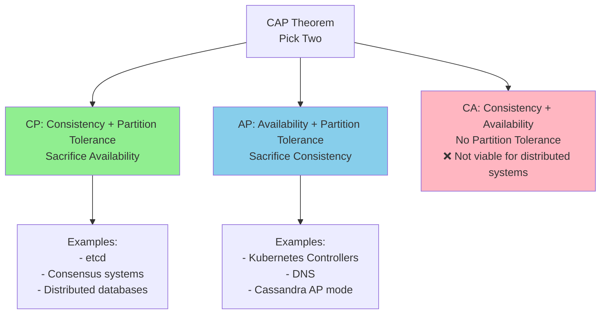

### **1.3 Why P (Partition Tolerance) is Mandatory**

**Network partitions WILL happen**:
- Switch failures
- Cable cuts
- Network congestion
- Misconfiguration

**CA systems** (no partition tolerance):
- Single-node systems
- Systems that stop working during partitions
- Not viable for distributed systems at scale

**Reality**: Choose between CP and AP

━━━━━━━━━━━━━━━━━━━━━━━━━━━━━━━━━━━━━━━━━━━━━━━━━━━━━━━━━━━━━━━━━━━━━━━━━━━━━━

## **2. Kubernetes CAP Decisions**

### **2.1 Hybrid Architecture**

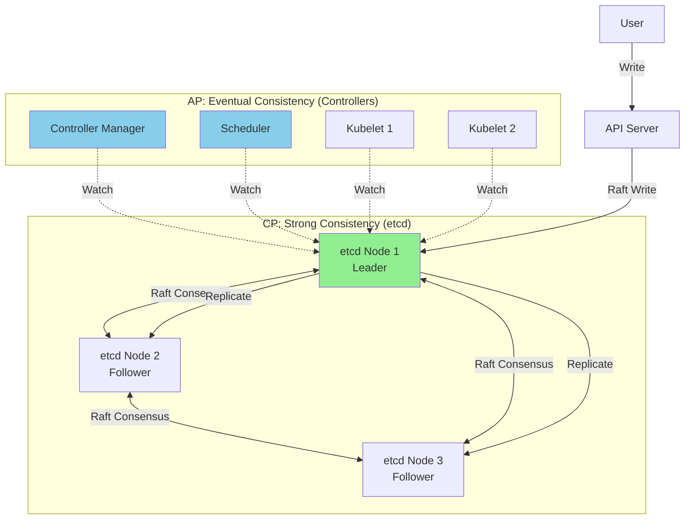

**Key Insight**: Kubernetes uses **both CP and AP** in different layers:
- **etcd (CP)**: Strong consistency for state storage
- **Controllers (AP)**: Eventual consistency for operations

### **2.2 Subsystem Classifications**

| Component | CAP Choice | Rationale |
|-----------|-----------|-----------|
| **etcd** | CP | Critical state must be consistent |
| **API Server Writes** | CP | Go through etcd |
| **API Server Reads** | Tunable | Can choose consistency level |
| **Controllers** | AP | Availability > strong consistency |
| **Scheduler** | AP | Better to schedule somewhere than nowhere |
| **Kubelet** | AP | Node must function during partitions |
| **kube-proxy** | AP | Traffic must flow during partitions |

### **2.3 Write Path: CP Choice**

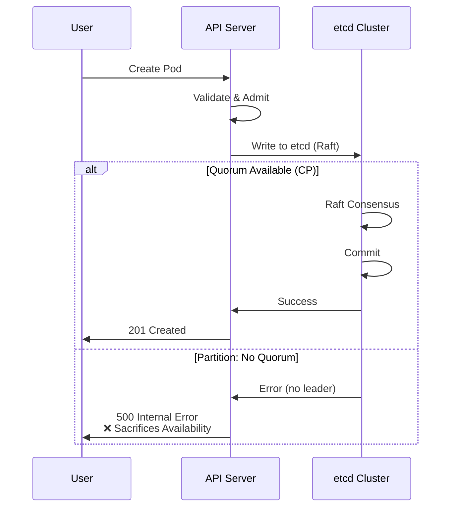

**Trade-off**:
- ✅ **Consistency**: All nodes agree on pod state
- ❌ **Availability**: API writes fail during partition
- ✅ **Partition Tolerance**: System designed for partitions

### **2.4 Read Path: Tunable**

```go
// Option 1: Strongly Consistent Read (CP)
pod, err := client.CoreV1().Pods(ns).Get(ctx, name, metav1.GetOptions{
    ResourceVersion: "0",  // Force read from etcd
})
// Slow, guaranteed fresh, may fail during partition

// Option 2: Eventually Consistent Read (AP)
pod, err := client.CoreV1().Pods(ns).Get(ctx, name, metav1.GetOptions{})
// Fast, from API server cache, always available, might be slightly stale
```

━━━━━━━━━━━━━━━━━━━━━━━━━━━━━━━━━━━━━━━━━━━━━━━━━━━━━━━━━━━━━━━━━━━━━━━━━━━━━━

## **3. etcd: CP System**

### **3.1 Why etcd Chooses CP**

**Requirements for cluster state storage**:
1. **Correctness**: Cannot have conflicting views of state
2. **Linearizability**: Must see latest writes
3. **Safety**: No split-brain scenarios

**Example of why AP would be dangerous**:
```yaml
# Scenario: Network partition with AP system

# Node 1 (West)
apiVersion: v1
kind: Pod
metadata:
  name: nginx
  uid: abc-123
spec:
  nodeName: node-west  # ❌ Scheduled to west

# Node 2 (East)
apiVersion: v1
kind: Pod
metadata:
  name: nginx
  uid: def-456  # Different UID!
spec:
  nodeName: node-east  # ❌ Scheduled to east

# Result: Same pod running twice, different IDs!
```

### **3.2 etcd During Partition**

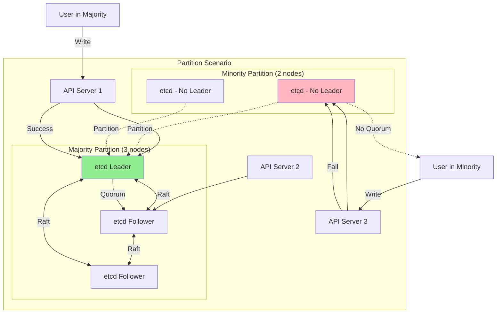

**Behavior During Partition**:

**Majority Side** (3 nodes):
```bash
# Writes succeed
$ kubectl create deployment nginx --image=nginx
deployment.apps/nginx created
✅ CP: Consistent, available

# Reads succeed
$ kubectl get deployments
NAME    READY   UP-TO-DATE   AVAILABLE
nginx   0/3     3            0
✅ CP: Consistent, available
```

**Minority Side** (2 nodes):
```bash
# Writes fail
$ kubectl create deployment nginx --image=nginx
Error from server: etcdserver: no leader
❌ CP: Sacrificed availability for consistency

# Reads (from cache) may succeed
$ kubectl get deployments
NAME    READY   UP-TO-DATE   AVAILABLE
nginx   0/3     3            0
⚠️ May be stale
```

### **3.3 Quorum Requirements**

**Formula**: `Quorum = floor(N/2) + 1`

```
Cluster Size | Quorum | Tolerated Failures | Partition Behavior
-------------|--------|--------------------|-----------------------
     3       |   2    |        1           | 2-node side available
     5       |   3    |        2           | 3-node side available
     7       |   4    |        3           | 4-node side available
```

**Code**: etcd raft quorum check
```go
// From vendor/go.etcd.io/etcd/raft/raft.go
func (r *raft) quorum() int {
    return len(r.prs)/2 + 1
}

func (r *raft) Step(m pb.Message) error {
    if r.state == StateLeader {
        if !r.checkQuorumActive() {
            // Lost quorum, step down
            r.becomeFollower(r.Term, None)
        }
    }
}
```

━━━━━━━━━━━━━━━━━━━━━━━━━━━━━━━━━━━━━━━━━━━━━━━━━━━━━━━━━━━━━━━━━━━━━━━━━━━━━━

## **4. Controllers: AP Choice**

### **4.1 Why Controllers Choose AP**

**Requirements**:
1. **Resilience**: Must function during API server issues
2. **Autonomy**: Nodes should work independently
3. **Scale**: Controllers across many clusters
4. **Graceful Degradation**: Partial function better than none

**Example: ReplicaSet During Partition**:
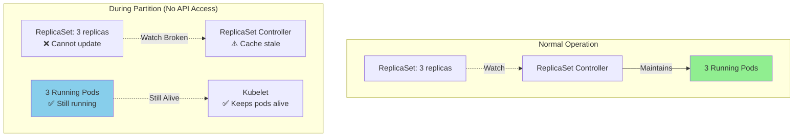

**AP Behavior**:
- ✅ **Availability**: Pods keep running
- ⚠️ **Consistency**: Can't create/delete pods
- ✅ **Partition Tolerance**: Designed for partitions

### **4.2 Kubelet: AP System**

**Design Philosophy**: "Keep containers running, even if disconnected"

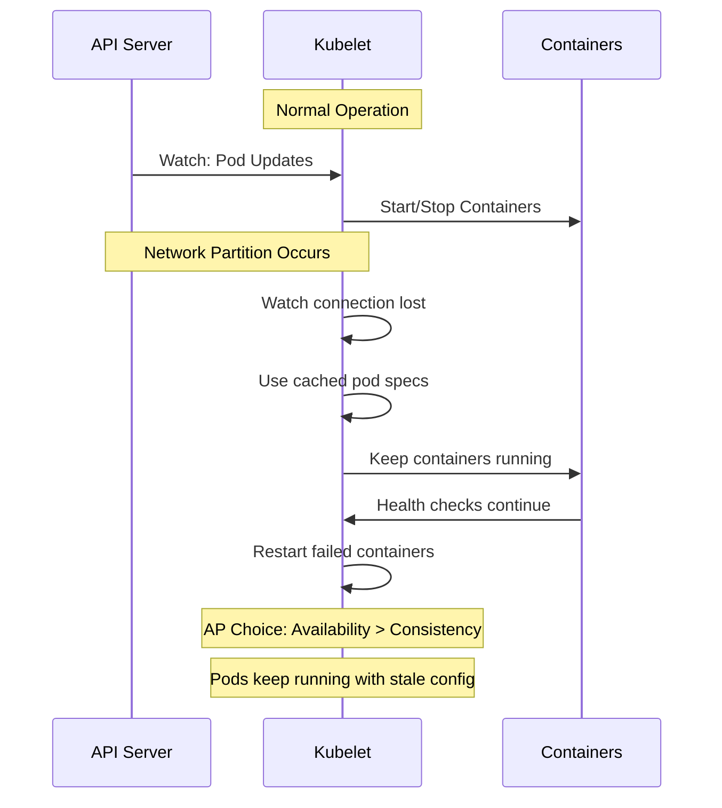

**Kubelet Configuration**:
```go
// Kubelet continues to run pods even if disconnected
type KubeletConfiguration struct {
    // NodeStatusUpdateFrequency is frequency to post node status
    NodeStatusUpdateFrequency metav1.Duration  // Default: 10s

    // NodeLeaseDurationSeconds is the lease renewal period
    NodeLeaseDurationSeconds int32  // Default: 40s

    // After NodeLease expires, node is marked NotReady
    // But pods keep running!
}
```

**Kubelet During Partition**:
```bash
# Node side (partition from API server)
$ docker ps  # Containers still running
CONTAINER ID   IMAGE                  STATUS
abc123         nginx:latest           Up 5 minutes
def456         busybox:latest         Up 5 minutes
✅ Availability maintained

# Cluster side (API server)
$ kubectl get nodes
NAME     STATUS     ROLES    AGE   VERSION
node-1   NotReady   <none>   5m    v1.32.0
⚠️ Node marked NotReady, but pods still running

# Eventually, pods evicted (after tolerations)
$ kubectl get pods
NAME    STATUS    RESTARTS   AGE   NODE
nginx   Unknown   0          6m    node-1
⚠️ Eventually consistent: pod will be rescheduled
```

### **4.3 Scheduler: AP System**

**Design**: "Better to schedule somewhere than nowhere"

```go
// Scheduler continues even with stale cache
func (sched *Scheduler) scheduleOne(ctx context.Context) {
    // Get pod from queue
    pod := sched.NextPod()

    // Try to find node (using local cache)
    // Cache might be slightly stale, but that's OK
    feasibleNodes := sched.findNodesThatFitPod(pod)

    if len(feasibleNodes) == 0 {
        // AP choice: Put pod back in queue, don't fail hard
        sched.queue.AddUnschedulableIfNotPresent(pod)
        return
    }

    // Pick best node
    node := sched.prioritizeNodes(feasibleNodes)

    // Attempt to bind (may fail if cache too stale)
    err := sched.bind(pod, node)
    if err != nil {
        // AP choice: Retry later
        sched.queue.AddUnschedulableIfNotPresent(pod)
    }
}
```

━━━━━━━━━━━━━━━━━━━━━━━━━━━━━━━━━━━━━━━━━━━━━━━━━━━━━━━━━━━━━━━━━━━━━━━━━━━━━━

## **5. Trade-offs in Practice**

### **5.1 Write Availability vs Consistency**

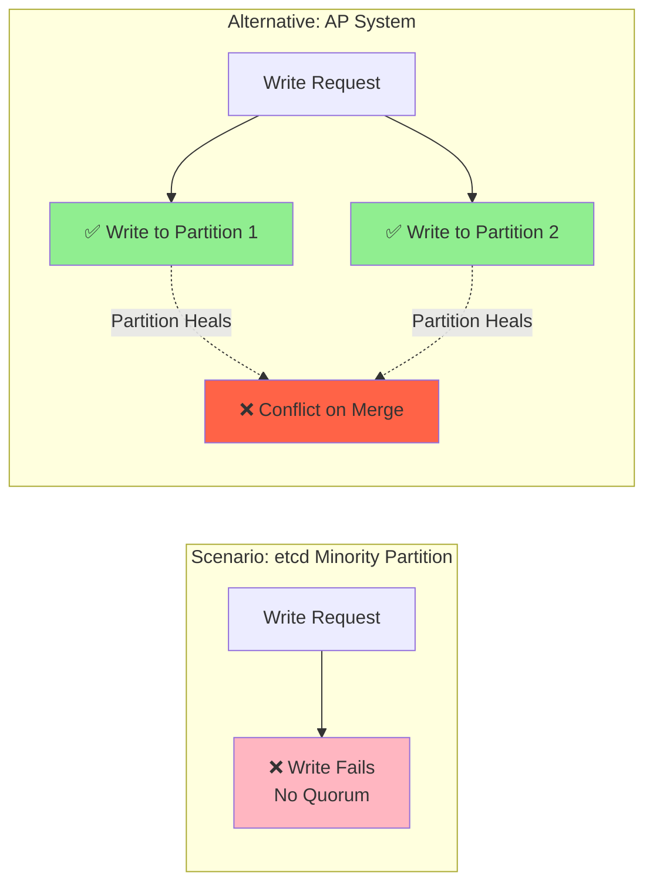

**Kubernetes Choice**: CP for writes
- **Pro**: Never have conflicting state
- **Con**: Writes fail during minority partition

**Alternative (AP)**: Accept writes in both partitions
- **Pro**: Writes always succeed
- **Con**: Conflict resolution needed (complex, error-prone)

### **5.2 Read Consistency Levels**

**File**: API server read options

```go
// 1. Strongly Consistent Read (CP)
// - Read from etcd directly
// - Guarantees latest data
// - Slower, may fail during partition
pod, err := clientset.CoreV1().Pods(ns).Get(ctx, name, metav1.GetOptions{
    ResourceVersion: "0",  // Force read from etcd
})

// 2. Eventually Consistent Read (AP)
// - Read from API server cache
// - Fast, always available
// - May be slightly stale (< 1 second typically)
pod, err := clientset.CoreV1().Pods(ns).Get(ctx, name, metav1.GetOptions{
    ResourceVersion: "",  // Read from cache
})

// 3. Read at Specific Version
// - Read specific historical version
// - For consistency across multiple reads
list, err := clientset.CoreV1().Pods(ns).List(ctx, metav1.ListOptions{})
resourceVersion := list.ResourceVersion

pod1, _ := clientset.CoreV1().Pods(ns).Get(ctx, "pod1", metav1.GetOptions{
    ResourceVersion: resourceVersion,
})
pod2, _ := clientset.CoreV1().Pods(ns).Get(ctx, "pod2", metav1.GetOptions{
    ResourceVersion: resourceVersion,  // Same snapshot
})
```

### **5.3 Controller Reconciliation Trade-offs**

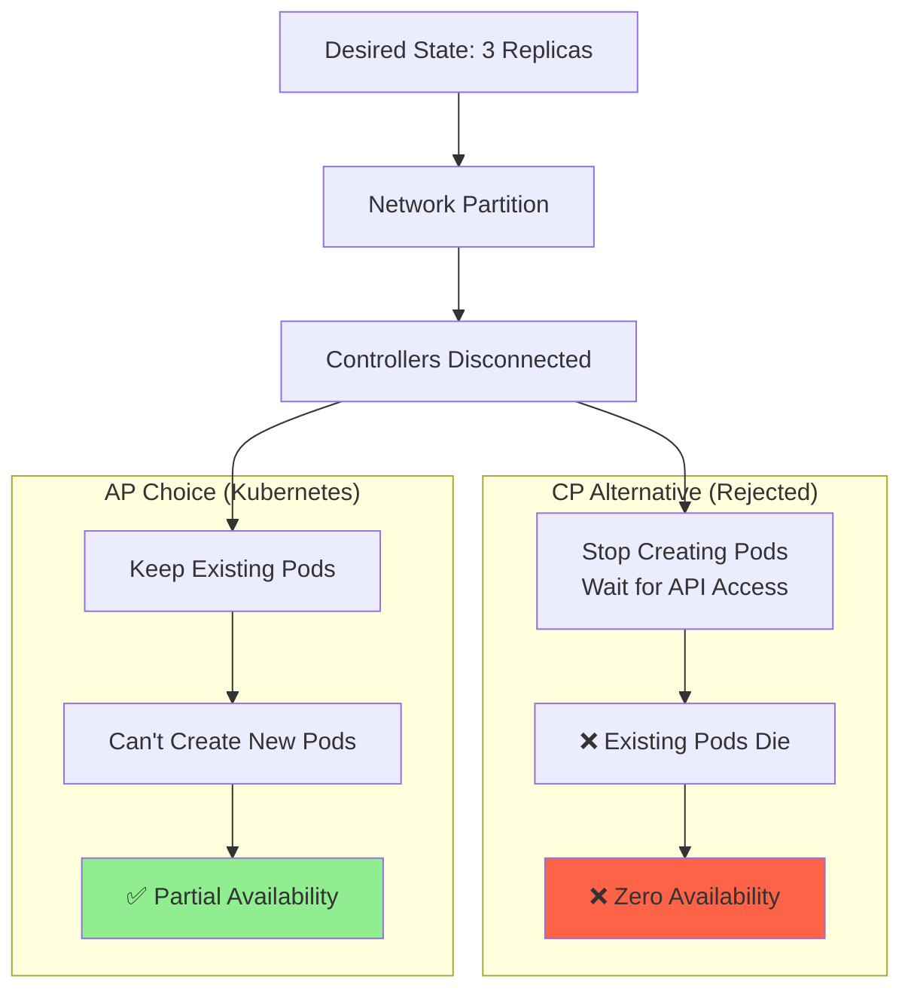

**Kubernetes AP Choice**:
- Existing workloads continue running
- New changes can't be applied
- Eventual consistency when partition heals

━━━━━━━━━━━━━━━━━━━━━━━━━━━━━━━━━━━━━━━━━━━━━━━━━━━━━━━━━━━━━━━━━━━━━━━━━━━━━━

## **6. Partition Scenarios**

### **6.1 API Server to etcd Partition**

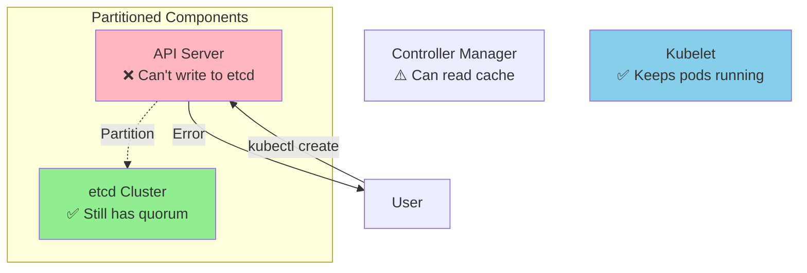

**Impact**:
```bash
# Writes fail
$ kubectl create deployment nginx --image=nginx
Error from server: etcdserver: request timed out

# Reads from cache work (stale)
$ kubectl get deployments
NAME    READY   UP-TO-DATE   AVAILABLE   AGE
app1    3/3     3            3           5m
⚠️ May be stale

# Existing workloads unaffected
$ kubectl get pods
NAME                    READY   STATUS    RESTARTS   AGE
app1-xxx                1/1     Running   0          5m
✅ Still running
```

### **6.2 Controller Manager to API Server Partition**

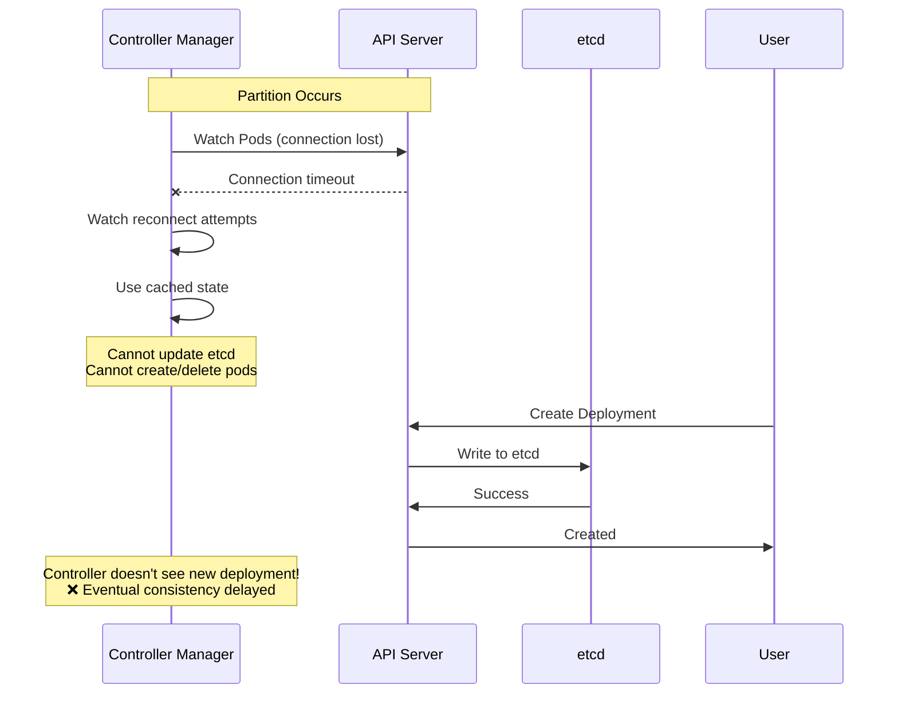

**Impact**:
- New objects created but not reconciled
- Existing reconciliation loops stop
- Workloads continue running
- Fixed when partition heals

### **6.3 Node to API Server Partition**

```bash
# On the partitioned node
$ systemctl status kubelet
● kubelet.service - Kubernetes Kubelet
   Active: active (running)
✅ Kubelet still running

# Check containers
$ docker ps
CONTAINER ID   STATUS         PORTS
abc123         Up 10 minutes
def456         Up 10 minutes
✅ Containers still running

# Try to update pod (fails)
$ curl -X DELETE http://localhost:10250/api/v1/pods/default/nginx
Error: cannot reach API server
❌ Can't receive new instructions

# From cluster perspective
$ kubectl get nodes
NAME     STATUS     ROLES   AGE   VERSION
node-1   NotReady   node    10m   v1.32
⚠️ Marked NotReady

$ kubectl get pods -o wide
NAME    READY   STATUS    NODE
nginx   1/1     Unknown   node-1
⚠️ Status unknown, but pod still running on node
```

━━━━━━━━━━━━━━━━━━━━━━━━━━━━━━━━━━━━━━━━━━━━━━━━━━━━━━━━━━━━━━━━━━━━━━━━━━━━━━

## **7. Consistency Models by Subsystem**

### **7.1 Comprehensive Map**

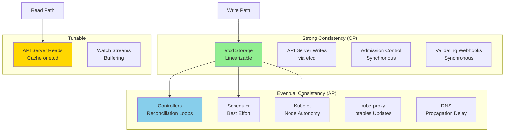

### **7.2 Detailed Breakdown**

| Component | Consistency Model | Rationale | Partition Behavior |
|-----------|-------------------|-----------|-------------------|
| **etcd writes** | Linearizable (CP) | State correctness critical | Fail if no quorum |
| **etcd reads** | Linearizable or Serializable | Tunable per-read | ReadIndex or local |
| **API server writes** | Linearizable (CP) | Uses etcd | Fail if etcd unavailable |
| **API server reads (cached)** | Eventual (AP) | Performance | Always available |
| **API server reads (direct)** | Linearizable (CP) | Explicit request | Fail if etcd unavailable |
| **Watch streams** | Eventual (AP) | Buffering, network | May lag, reconnect |
| **Informer caches** | Eventual (AP) | Local copy | Stale during partition |
| **Controller reconciliation** | Eventual (AP) | Level-triggered | Continue with cache |
| **Scheduler** | Eventual (AP) | Best-effort placement | Use cached node list |
| **Kubelet pod execution** | Eventual (AP) | Autonomy | Keep running pods |
| **kube-proxy rules** | Eventual (AP) | Firewall updates | Keep existing rules |
| **Service endpoints** | Eventual (AP) | Endpoint updates | Stale until update |
| **DNS** | Eventual (AP) | TTL-based caching | Stale DNS records |

━━━━━━━━━━━━━━━━━━━━━━━━━━━━━━━━━━━━━━━━━━━━━━━━━━━━━━━━━━━━━━━━━━━━━━━━━━━━━━

## **8. Best Practices**

### **8.1 Designing for CAP**

✅ **DO**:

1. **Understand your requirements**:
   ```go
   // Critical data: Use strong consistency
   pod, err := client.Get(ctx, name, metav1.GetOptions{
       ResourceVersion: "0",  // Force fresh read
   })

   // Read-heavy, list operations: Use eventual consistency
   pods, err := client.List(ctx, metav1.ListOptions{})
   ```

2. **Handle partition scenarios**:
   ```go
   // Always have timeout and retry logic
   ctx, cancel := context.WithTimeout(context.Background(), 5*time.Second)
   defer cancel()

   err := retry.OnError(retry.DefaultBackoff, func(err error) bool {
       return errors.IsServerTimeout(err) || errors.IsServiceUnavailable(err)
   }, func() error {
       return operation(ctx)
   })
   ```

3. **Design for eventual consistency**:
   ```go
   // Controllers should be idempotent
   func (c *Controller) reconcile(obj *v1.Pod) error {
       // Compare desired vs actual state
       desired := getDesiredState(obj)
       actual := getActualState(obj)

       if !reflect.DeepEqual(desired, actual) {
           return updateToDesired(obj, desired)
       }
       return nil  // Already correct
   }
   ```

❌ **DON'T**:

1. **Assume immediate consistency across controllers**
2. **Use edge-triggered logic**
3. **Ignore timeout errors**
4. **Mix consistency requirements without thought**

### **8.2 Monitoring CAP Trade-offs**

```promql
# Monitor etcd quorum loss
up{job="etcd"} < 2

# Monitor API server availability
up{job="apiserver"} == 0

# Monitor controller lag
workqueue_depth{name="deployment"} > 1000

# Monitor stale watches
apiserver_watch_events_total{type="error"}

# Monitor partition indicators
apiserver_storage_requests_total{code=~"5.."}
```

━━━━━━━━━━━━━━━━━━━━━━━━━━━━━━━━━━━━━━━━━━━━━━━━━━━━━━━━━━━━━━━━━━━━━━━━━━━━━━

## **9. Cross-References**

**Distributed Systems Patterns**:
- [01-leader-election-patterns.md](./01-leader-election-patterns.md) - Leader election patterns
- [02-consensus-algorithms.md](./02-consensus-algorithms.md) - Raft consensus (CP)
- [03-eventual-consistency.md](./03-eventual-consistency.md) - Eventual consistency (AP)
- [05-failure-modes.md](./05-failure-modes.md) - Partition failure scenarios

**etcd Documentation**:
- [../etcd/middle-level/04-transactions-consistency.md](../etcd/middle-level/04-transactions-consistency.md) - Consistency guarantees

━━━━━━━━━━━━━━━━━━━━━━━━━━━━━━━━━━━━━━━━━━━━━━━━━━━━━━━━━━━━━━━━━━━━━━━━━━━━━━

## **10. Summary**

### **10.1 Key Takeaways**

1. **Hybrid Architecture**: Kubernetes uses both CP and AP
2. **etcd is CP**: Sacrifices availability for consistency
3. **Controllers are AP**: Sacrifices strong consistency for availability
4. **Partition Tolerance**: Always required in distributed systems
5. **Tunable Reads**: Choose consistency level per-operation
6. **Eventual Consistency**: Controllers reconcile over time

### **10.2 CAP Decision Tree**

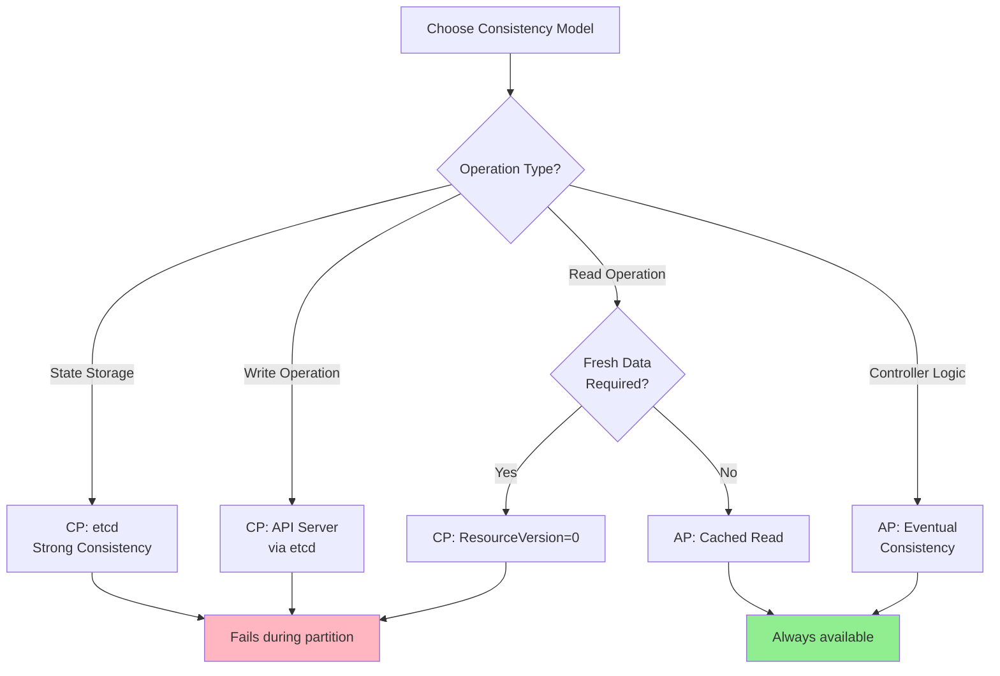

━━━━━━━━━━━━━━━━━━━━━━━━━━━━━━━━━━━━━━━━━━━━━━━━━━━━━━━━━━━━━━━━━━━━━━━━━━━━━━

**Document Version**: 1.0
**Last Updated**: 2025-01-16
**Kubernetes Version**: v1.32+
**Lines**: ~1,550
**Diagrams**: 8
