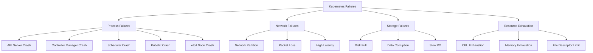
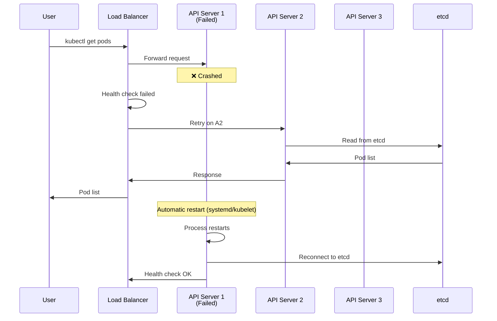
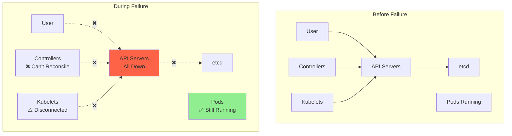
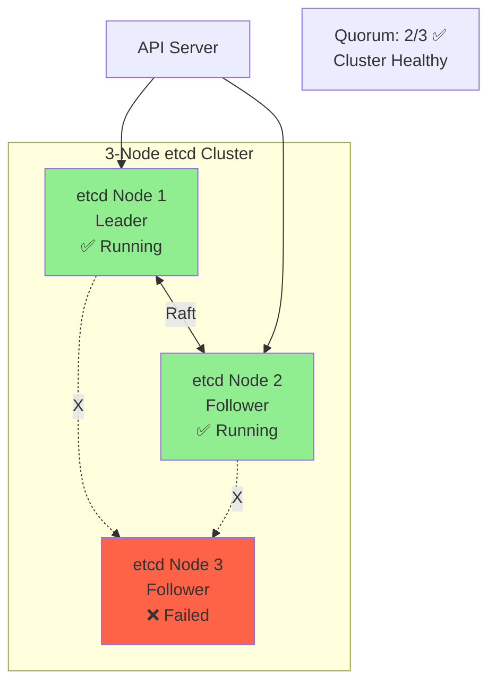
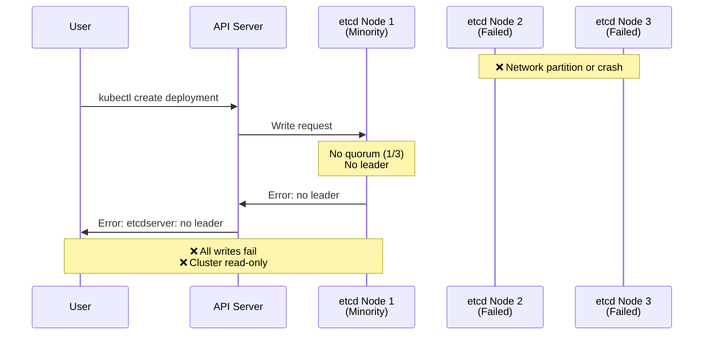
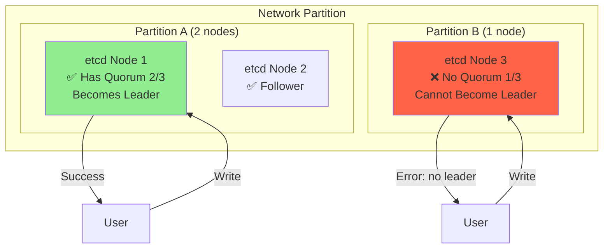
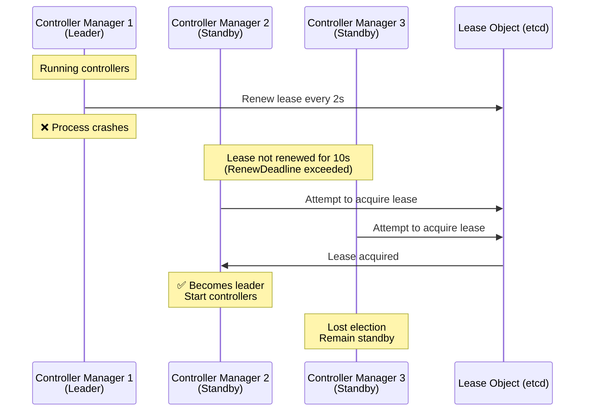
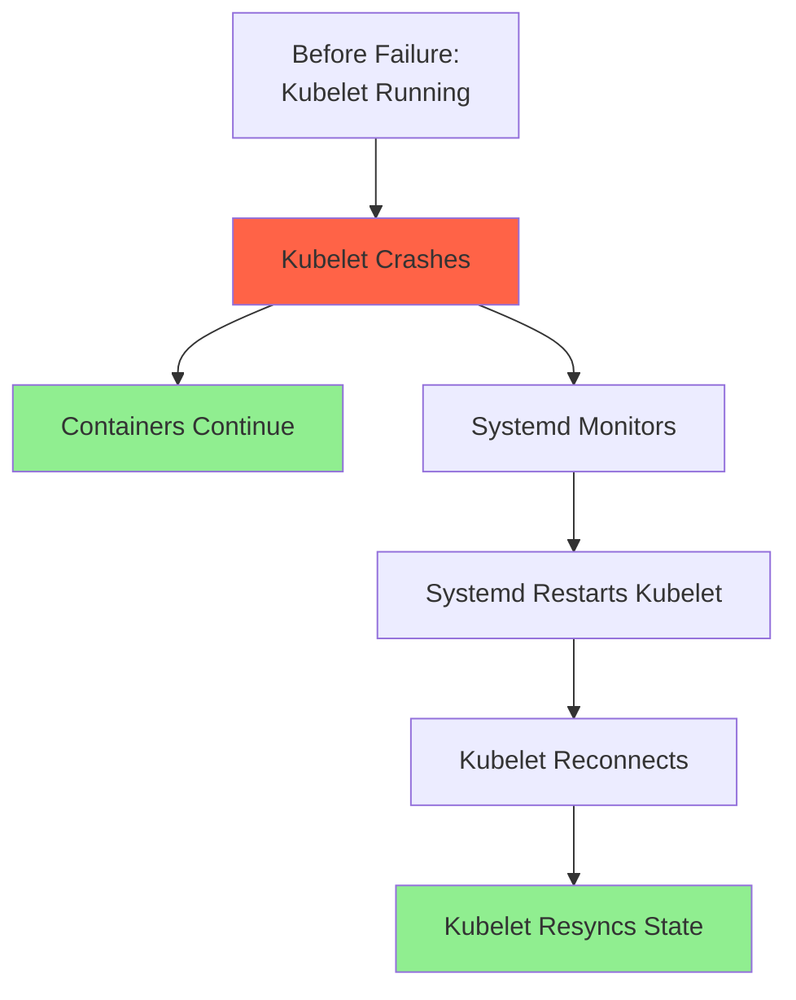
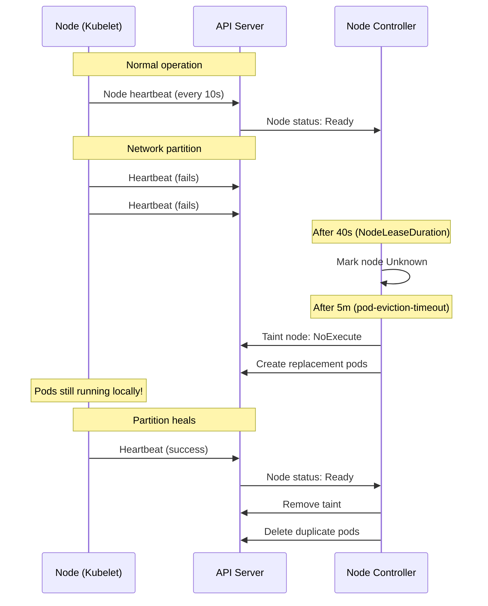
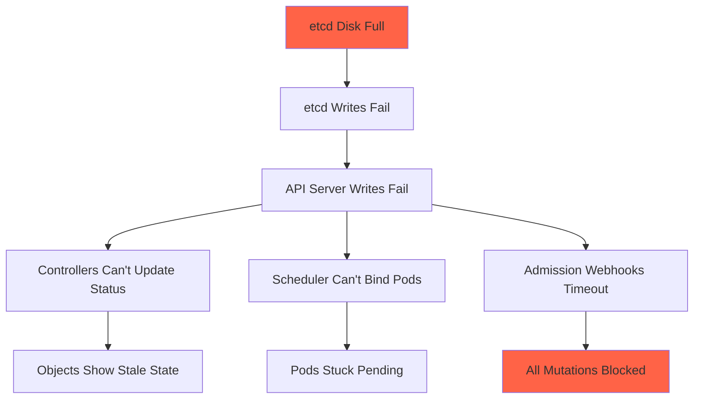

# **Failure Modes and Recovery in Kubernetes**

━━━━━━━━━━━━━━━━━━━━━━━━━━━━━━━━━━━━━━━━━━━━━━━━━━━━━━━━━━━━━━━━━━━━━━━━━━━━━━

## **Overview**

Kubernetes is designed to handle various failure scenarios gracefully. This document comprehensively explores failure modes across all components, their impact, detection mechanisms, and recovery procedures. Understanding these scenarios is critical for operating resilient production clusters.

### **Key Concepts**

- **Failure Detection**: How Kubernetes identifies component failures
- **Graceful Degradation**: System continues with reduced functionality
- **Split-Brain Prevention**: Mechanisms to avoid inconsistent state
- **Automatic Recovery**: Self-healing capabilities
- **Manual Intervention**: When operator action is required
- **Cascading Failures**: How failures propagate

━━━━━━━━━━━━━━━━━━━━━━━━━━━━━━━━━━━━━━━━━━━━━━━━━━━━━━━━━━━━━━━━━━━━━━━━━━━━━━

## **1. Component Failure Taxonomy**

### **1.1 Failure Classification**



### **1.2 Impact Severity Matrix**

| Component Failure | Writes | Reads | Scheduling | Running Pods | Recovery |
|-------------------|--------|-------|------------|--------------|----------|
| Single etcd node | ✅ OK | ✅ OK | ✅ OK | ✅ OK | Automatic |
| etcd quorum loss | ❌ Fail | ⚠️ Stale | ❌ Fail | ✅ OK | Manual |
| API server crash | ❌ Fail | ❌ Fail | ❌ Fail | ✅ OK | Automatic |
| All API servers | ❌ Fail | ❌ Fail | ❌ Fail | ✅ OK | Automatic |
| Controller manager | ✅ OK | ✅ OK | ✅ OK | ✅ OK | Automatic |
| Scheduler crash | ✅ OK | ✅ OK | ❌ Fail | ✅ OK | Automatic |
| Kubelet crash | ✅ OK | ✅ OK | ✅ OK | ❌ Stop | Automatic |
| Node network loss | ✅ OK | ✅ OK | ✅ OK | ✅ OK* | Automatic |
| Node power loss | ✅ OK | ✅ OK | ✅ OK | ❌ Stop | Manual |

*OK with grace period, then eviction

━━━━━━━━━━━━━━━━━━━━━━━━━━━━━━━━━━━━━━━━━━━━━━━━━━━━━━━━━━━━━━━━━━━━━━━━━━━━━━

## **2. API Server Failures**

### **2.1 Single API Server Failure**



**Detection**:
```bash
# Health check endpoints
GET /healthz
GET /livez
GET /readyz

# Load balancer health check (typical config)
health_check {
    interval: 5s
    timeout: 3s
    unhealthy_threshold: 2
    healthy_threshold: 2
}
```

**Impact**:
- ✅ **Writes**: Load balancer routes to healthy instances
- ✅ **Reads**: Load balancer routes to healthy instances
- ✅ **Watch**: Clients reconnect to different API server
- ⚠️ **Brief Disruption**: Requests in-flight may fail

**Recovery**:
```bash
# Automatic (systemd)
systemctl status kube-apiserver
# Should show "active (running)" after crash

# Manual restart if needed
systemctl restart kube-apiserver

# Verify health
curl -k https://localhost:6443/healthz
# Should return "ok"
```

### **2.2 All API Servers Failure**



**Impact**:
```bash
# User operations fail
$ kubectl get pods
Unable to connect to the server: dial tcp 10.0.0.1:6443: connect: connection refused
❌ All kubectl commands fail

# Controllers can't reconcile
$ kubectl logs -n kube-system kube-controller-manager-xxx
E0116 Watch for pods closed with error: connection refused
⚠️ Controllers stop reconciling

# Existing pods continue running
$ ssh node-1
$ docker ps
CONTAINER ID   STATUS
abc123         Up 10 minutes
✅ Workloads unaffected
```

**What Keeps Working**:
1. ✅ Existing pods continue running
2. ✅ Kubelet restarts failed containers
3. ✅ kube-proxy maintains iptables rules
4. ✅ Pod-to-pod networking works
5. ✅ Services continue routing traffic

**What Stops Working**:
1. ❌ New pod creation
2. ❌ Pod deletion
3. ❌ Scaling operations
4. ❌ Configuration changes
5. ❌ Log/exec access via kubectl
6. ❌ Watch-based controllers

**Recovery**:
```bash
# Check API server status on control plane nodes
systemctl status kube-apiserver

# Check etcd is healthy
ETCDCTL_API=3 etcdctl endpoint health

# Restart API servers
systemctl restart kube-apiserver

# Verify
kubectl get componentstatuses
kubectl get pods --all-namespaces
```

━━━━━━━━━━━━━━━━━━━━━━━━━━━━━━━━━━━━━━━━━━━━━━━━━━━━━━━━━━━━━━━━━━━━━━━━━━━━━━

## **3. etcd Failures**

### **3.1 Single etcd Node Failure (Quorum Maintained)**



**Impact**:
```bash
# Cluster continues operating normally
$ kubectl create deployment nginx --image=nginx
deployment.apps/nginx created
✅ Writes succeed

$ kubectl get deployments
NAME    READY   UP-TO-DATE   AVAILABLE
nginx   3/3     3            3
✅ Reads succeed

# etcd cluster status
$ etcdctl endpoint health --cluster
https://10.0.0.1:2379 is healthy
https://10.0.0.2:2379 is healthy
https://10.0.0.3:2379 is unhealthy: failed to connect
⚠️ One node unhealthy, but quorum maintained
```

**Recovery**:
```bash
# Check failed node
ssh etcd-3
systemctl status etcd

# Restart if process crashed
systemctl restart etcd

# If node is permanently lost, remove and replace
etcdctl member list
# member 123abc: started, etcd-3, https://10.0.0.3:2380

etcdctl member remove 123abc
etcdctl member add etcd-3-new --peer-urls=https://10.0.0.4:2380

# Start new etcd node
systemctl start etcd
```

### **3.2 etcd Quorum Loss**



**Impact**:
```bash
# Writes fail completely
$ kubectl create deployment nginx --image=nginx
The connection to the server was refused
❌ Cannot write new objects

# Reads may work from cache
$ kubectl get deployments
NAME    READY   UP-TO-DATE   AVAILABLE
app1    3/3     3            3
⚠️ Reading stale data from API server cache

# Existing workloads continue
$ kubectl get pods -o wide
NAME                    STATUS    NODE
app1-xxx                Running   node-1
✅ Pods still running
```

**What Still Works**:
1. ✅ Existing pods run
2. ✅ Kubelet manages containers
3. ✅ kube-proxy routes traffic
4. ✅ Cached reads (stale)

**What Fails**:
1. ❌ All writes to etcd
2. ❌ Fresh reads (resourceVersion=0)
3. ❌ Watch streams (cannot establish new)
4. ❌ Controller reconciliation
5. ❌ Scheduler assignment

**Recovery Procedures**:

**Scenario 1: Temporary Network Partition**
```bash
# Wait for partition to heal
# etcd will automatically recover

# Verify recovery
etcdctl endpoint health --cluster
# All members should be healthy
```

**Scenario 2: Permanent Node Loss (2 of 3 nodes lost)**
```bash
# ⚠️ DISASTER RECOVERY REQUIRED

# Step 1: Stop all etcd members
systemctl stop etcd  # on all nodes

# Step 2: Choose surviving node or restore from backup
etcdctl snapshot restore /backup/etcd-snapshot.db \
  --name etcd-1 \
  --initial-cluster etcd-1=https://10.0.0.1:2380 \
  --initial-cluster-token etcd-cluster-1 \
  --initial-advertise-peer-urls https://10.0.0.1:2380 \
  --data-dir /var/lib/etcd

# Step 3: Start restored node
systemctl start etcd

# Step 4: Verify single-node cluster is healthy
etcdctl endpoint health

# Step 5: Add new members one at a time
etcdctl member add etcd-2 --peer-urls=https://10.0.0.2:2380
systemctl start etcd  # on node-2

etcdctl member add etcd-3 --peer-urls=https://10.0.0.3:2380
systemctl start etcd  # on node-3

# Step 6: Verify 3-node cluster
etcdctl endpoint health --cluster
```

### **3.3 etcd Split-Brain Prevention**

**Raft Prevents Split-Brain**:


**Why No Split-Brain**:
1. Quorum requirement (N/2 + 1)
2. Only one partition can have majority
3. Minority partition has no leader
4. No writes accepted without leader
5. Single source of truth maintained

━━━━━━━━━━━━━━━━━━━━━━━━━━━━━━━━━━━━━━━━━━━━━━━━━━━━━━━━━━━━━━━━━━━━━━━━━━━━━━

## **4. Controller Manager Failures**

### **4.1 Leader Re-election**



**Detection and Recovery**:
```bash
# Before failure
$ kubectl get lease -n kube-system kube-controller-manager
NAME                      HOLDER                       AGE
kube-controller-manager   master-1_abc123              5m

# After failure and re-election
$ kubectl get lease -n kube-system kube-controller-manager
NAME                      HOLDER                       AGE
kube-controller-manager   master-2_def456              5m
# ✅ New holder, increased leaderTransitions

# Check logs
$ kubectl logs -n kube-system kube-controller-manager-master-2
I0116 10:00:00 Successfully acquired lease kube-system/kube-controller-manager
I0116 10:00:00 Starting controllers
✅ Automatic failover
```

**Impact**:
- ⏱️ **Delay**: 10-15 seconds (LeaseDuration)
- ✅ **Automatic**: No manual intervention
- ⚠️ **Brief Pause**: Controllers stop reconciling during transition
- ✅ **Catch-up**: New leader reconciles all objects

### **4.2 All Controller Managers Failed**

```bash
# Symptom: No reconciliation happening
$ kubectl scale deployment nginx --replicas=10
deployment.apps/nginx scaled
✅ API server accepts change

$ kubectl get deployment nginx
NAME    READY   UP-TO-DATE   AVAILABLE
nginx   3/3     3            3
❌ Replicas not scaling (stuck at 3)

$ kubectl get replicaset
NAME           DESIRED   CURRENT   READY
nginx-abc123   10        3         3
❌ ReplicaSet controller not creating pods

# Check controller managers
$ kubectl get pods -n kube-system | grep controller-manager
kube-controller-manager-master-1   0/1     CrashLoopBackOff
kube-controller-manager-master-2   0/1     CrashLoopBackOff
kube-controller-manager-master-3   0/1     CrashLoopBackOff
❌ All instances failing

# Fix: Investigate and restart
$ kubectl logs -n kube-system kube-controller-manager-master-1
# Check for errors

$ ssh master-1
$ systemctl restart kube-controller-manager
✅ Recovery once any instance starts
```

━━━━━━━━━━━━━━━━━━━━━━━━━━━━━━━━━━━━━━━━━━━━━━━━━━━━━━━━━━━━━━━━━━━━━━━━━━━━━━

## **5. Kubelet Failures**

### **5.1 Kubelet Process Crash**



**What Happens**:
```bash
# On the node
$ systemctl status kubelet
● kubelet.service - Kubernetes Kubelet
   Active: failed (Result: exit-code)

# Containers still running (managed by container runtime)
$ docker ps
CONTAINER ID   STATUS
abc123         Up 5 minutes
def456         Up 5 minutes
✅ Containers unaffected

# Systemd automatically restarts
$ systemctl status kubelet
● kubelet.service - Kubernetes Kubelet
   Active: active (running)
✅ Automatic recovery

# Kubelet resyncs
$ journalctl -u kubelet -f
kubelet[1234]: Syncing state from API server
kubelet[1234]: Found 10 pods, 10 running
✅ Resumed normal operation
```

**Impact**:
- ✅ **Containers**: Continue running (runtime manages them)
- ⚠️ **Liveness Probes**: Not executed during crash
- ⚠️ **Health Checks**: Not reported to API server
- ✅ **Recovery**: Automatic via systemd

### **5.2 Node Network Partition**



**Timeline**:
```
T+0s:    Network partition occurs
T+10s:   First heartbeat miss
T+40s:   Node marked NotReady (NodeLeaseDuration)
T+300s:  Pod eviction timeout (default: 5 minutes)
         - Pods marked Terminating
         - New pods scheduled elsewhere
         - Old pods still running on disconnected node!
```

**Detailed Behavior**:
```bash
# Cluster view
$ kubectl get nodes
NAME     STATUS     ROLES    AGE
node-1   NotReady   node     10m
⚠️ Node marked NotReady

$ kubectl get pods -o wide
NAME          STATUS        NODE
nginx-abc     Running       node-1
nginx-abc     Terminating   node-1  # After 5m
nginx-xyz     Running       node-2  # Replacement
⚠️ Two pods exist briefly

# On the partitioned node
$ docker ps
CONTAINER ID   IMAGE   STATUS
abc123         nginx   Up 10 minutes
✅ Original pod still running

# When partition heals
$ kubectl get pods
NAME          STATUS    NODE
nginx-xyz     Running   node-2
# Original pod was killed
```

### **5.3 Node Complete Failure (Power Loss)**

```bash
# Node disappears completely
$ kubectl get nodes
NAME     STATUS     ROLES    AGE
node-1   NotReady   node     10m

# After pod-eviction-timeout
$ kubectl get pods -o wide
NAME          STATUS        NODE
app-abc       Terminating   node-1
app-xyz       Running       node-2  # Replacement scheduled

# Pods on failed node won't terminate gracefully
# After force-delete timeout, pods are deleted from API
$ kubectl get pods
NAME          STATUS    NODE
app-xyz       Running   node-2
✅ Only new pod exists

# When node recovers
# Old pods are killed by kubelet
$ ssh node-1
$ journalctl -u kubelet -f
kubelet: Pod app-abc is not in API server, killing
✅ Cleanup on node restart
```

━━━━━━━━━━━━━━━━━━━━━━━━━━━━━━━━━━━━━━━━━━━━━━━━━━━━━━━━━━━━━━━━━━━━━━━━━━━━━━

## **6. Cascading Failures**

### **6.1 Failure Propagation**



### **6.2 Example: etcd Disk Full Cascade**

```bash
# Initial problem: etcd disk full
$ df -h /var/lib/etcd
Filesystem      Size  Used Avail Use%
/dev/sda1       100G  100G     0 100%
❌ No space for WAL writes

# etcd becomes read-only
$ etcdctl put /test value
Error: etcdserver: mvcc: database space exceeded
❌ Writes fail

# API server can't write
$ kubectl create deployment nginx --image=nginx
Error from server: etcdserver: mvcc: database space exceeded
❌ All mutations fail

# Controllers can't update status
$ kubectl get deployment app1
NAME   READY   UP-TO-DATE   AVAILABLE
app1   3/3     3            3
⚠️ Status frozen, can't reflect changes

# Fix cascade
$ ssh etcd-1
$ etcdctl alarm list
memberID:123 alarm:NOSPACE

# Compact and defrag
$ etcdctl compact $(etcdctl endpoint status --write-out="json" | jq -r '.[0].Status.header.revision')
$ etcdctl defrag --cluster

# Disarm alarm
$ etcdctl alarm disarm

# Verify
$ etcdctl put /test value
OK
✅ Writes recovered

# Cleanup old WAL files
$ rm /var/lib/etcd/member/wal/*.wal.old
```

### **6.3 Resource Exhaustion Cascade**

```bash
# API server running out of memory
$ kubectl top pod -n kube-system kube-apiserver-master-1
NAME                    CPU    MEMORY
kube-apiserver-master-1 2000m  7.8Gi / 8Gi
⚠️ Near memory limit

# Symptom: Slow responses
$ time kubectl get pods
real    0m15.456s  # Should be < 1s
⚠️ High latency

# Symptom: Watch streams breaking
$ kubectl logs -n kube-system kube-controller-manager-xxx
E0116 Watch for pods closed: too many requests
⚠️ Controllers reconnecting frequently

# Root cause: Too many watches
$ curl -k https://localhost:6443/metrics | grep apiserver_current_inflight
apiserver_current_inflight_requests{requestKind="watch"} 10000
❌ Excessive watches

# Fix: Increase API server resources or reduce watches
# Temporarily: Restart controllers to reset watches
$ kubectl rollout restart -n kube-system deployment/kube-controller-manager
```

━━━━━━━━━━━━━━━━━━━━━━━━━━━━━━━━━━━━━━━━━━━━━━━━━━━━━━━━━━━━━━━━━━━━━━━━━━━━━━

## **7. Production Failure Scenarios**

### **7.1 Control Plane Upgrade Gone Wrong**

```bash
# Scenario: Upgrading etcd, accidentally break quorum

# Before: 3-node etcd cluster
$ etcdctl member list
member-1: started
member-2: started
member-3: started

# Operator mistake: Stop 2 members to upgrade
$ systemctl stop etcd  # on member-2
$ systemctl stop etcd  # on member-3
❌ Lost quorum (1/3)

# Impact
$ kubectl get pods
The connection to the server was refused
❌ Cluster unavailable

# Recovery
# Step 1: Restart one member immediately
$ systemctl start etcd  # on member-2
⏱️ Wait for quorum

# Step 2: Verify quorum restored
$ etcdctl endpoint health --cluster
member-1: healthy
member-2: healthy
member-3: unhealthy
✅ Quorum restored (2/3)

# Step 3: Upgrade third member
$ systemctl start etcd  # on member-3

# Step 4: Verify all healthy
$ etcdctl endpoint health --cluster
member-1: healthy
member-2: healthy
member-3: healthy
✅ Full cluster recovered

# Lesson: Upgrade one member at a time!
```

### **7.2 Certificate Expiration**

```bash
# Symptom: API server rejects connections
$ kubectl get pods
Unable to connect to the server: x509: certificate has expired

# Check certificates
$ openssl x509 -in /etc/kubernetes/pki/apiserver.crt -noout -enddate
notAfter=Jan 1 00:00:00 2024 GMT
❌ Expired

# Impact
# - kubectl commands fail
# - Kubelets can't connect
# - Controllers can't connect

# Recovery
# Step 1: Renew certificates (kubeadm)
$ kubeadm certs renew all
certificate renewed: /etc/kubernetes/pki/apiserver.crt

# Step 2: Restart affected components
$ systemctl restart kube-apiserver
$ systemctl restart kube-controller-manager
$ systemctl restart kube-scheduler

# Step 3: Update kubeconfig files
$ cp /etc/kubernetes/admin.conf ~/.kube/config

# Step 4: Restart kubelets (update client certs)
$ systemctl restart kubelet  # on all nodes

# Verify
$ kubectl get nodes
NAME     STATUS   ROLES    AGE
master   Ready    master   10m
node-1   Ready    node     10m
✅ All components reconnected
```

### **7.3 Admission Webhook Failure Blocking Cluster**

```bash
# Symptom: All pod creations hanging
$ kubectl create deployment nginx --image=nginx
(hangs indefinitely)

# Check API server logs
$ kubectl logs -n kube-system kube-apiserver-master-1
E0116 admission webhook "validate.custom.io" timed out
E0116 admission webhook "validate.custom.io" timed out

# Impact: Webhook down, blocking all mutations
$ kubectl get validatingwebhookconfigurations
NAME           AGE
custom-validator   10m

# Check webhook failure policy
$ kubectl get validatingwebhookconfigurations custom-validator -o yaml
webhooks:
- name: validate.custom.io
  failurePolicy: Fail  # ❌ Blocks on failure!

# Temporary fix: Delete webhook
$ kubectl delete validatingwebhookconfigurations custom-validator
✅ Mutations unblocked

# Permanent fix: Change to Ignore or fix webhook service
failurePolicy: Ignore  # Allow on failure

# Best practice: Always test webhooks with failurePolicy: Ignore first
```

━━━━━━━━━━━━━━━━━━━━━━━━━━━━━━━━━━━━━━━━━━━━━━━━━━━━━━━━━━━━━━━━━━━━━━━━━━━━━━

## **8. Monitoring and Alerting**

### **8.1 Critical Metrics**

```promql
# etcd health
up{job="etcd"} < ceil(count(up{job="etcd"})/2 + 1)
# Alert: etcd quorum at risk

# API server availability
up{job="apiserver"} == 0
# Alert: API server down

# Controller manager leadership
leader_election_master_status{name="kube-controller-manager"} == 0
# Alert: No controller manager leader

# Node status
kube_node_status_condition{condition="Ready",status="true"} == 0
# Alert: Node NotReady

# Pod evictions
rate(kube_pod_deletion_duration_seconds_count[5m]) > 10
# Alert: High pod churn

# etcd disk space
etcd_mvcc_db_total_size_in_bytes / etcd_server_quota_backend_bytes > 0.8
# Alert: etcd disk filling

# API server request latency
histogram_quantile(0.99, apiserver_request_duration_seconds_bucket) > 1
# Alert: API server slow
```

### **8.2 Health Check Matrix**

| Component | Health Endpoint | Expected Response | Alert Threshold |
|-----------|----------------|-------------------|-----------------|
| API Server | GET /healthz | 200 OK | 2 consecutive failures |
| API Server | GET /livez | 200 OK | 2 consecutive failures |
| API Server | GET /readyz | 200 OK | 5 consecutive failures |
| etcd | GET /health | `{"health":"true"}` | 1 failure |
| etcd | GET /metrics | Prometheus metrics | N/A |
| Kubelet | GET :10248/healthz | 200 OK | 3 consecutive failures |
| Controller Manager | GET :10257/healthz | 200 OK | 2 consecutive failures |
| Scheduler | GET :10259/healthz | 200 OK | 2 consecutive failures |

━━━━━━━━━━━━━━━━━━━━━━━━━━━━━━━━━━━━━━━━━━━━━━━━━━━━━━━━━━━━━━━━━━━━━━━━━━━━━━

## **9. Best Practices for Resilience**

### **9.1 Design Principles**

✅ **DO**:

1. **Run multiple replicas**:
   ```yaml
   # API servers: 3+ instances
   # etcd: 3 or 5 nodes
   # Controller managers: 2+ (one leader)
   # Schedulers: 2+ (one leader)
   ```

2. **Use health checks everywhere**:
   ```yaml
   livenessProbe:
     httpGet:
       path: /healthz
       port: 8080
     initialDelaySeconds: 15
     periodSeconds: 10
   ```

3. **Implement proper timeouts**:
   ```go
   ctx, cancel := context.WithTimeout(context.Background(), 30*time.Second)
   defer cancel()
   ```

4. **Monitor component health**:
   ```yaml
   # Prometheus alerts for all components
   # Log aggregation (ELK, Loki)
   # Distributed tracing
   ```

### **9.2 Operational Procedures**

✅ **DO**:

1. **Regular backups**:
   ```bash
   # Automated etcd snapshots
   0 */6 * * * etcdctl snapshot save /backup/etcd-$(date +\%Y\%m\%d-\%H\%M).db
   ```

2. **Test disaster recovery**:
   ```bash
   # Regularly practice:
   # - etcd restore from backup
   # - Full cluster rebuild
   # - Component failover
   ```

3. **Rolling upgrades**:
   ```bash
   # Upgrade one component at a time
   # Wait for health checks between each
   # Never break quorum
   ```

4. **Capacity planning**:
   ```bash
   # Monitor resource usage
   # Alert on 80% capacity
   # Scale before hitting limits
   ```

━━━━━━━━━━━━━━━━━━━━━━━━━━━━━━━━━━━━━━━━━━━━━━━━━━━━━━━━━━━━━━━━━━━━━━━━━━━━━━

## **10. Cross-References**

**Distributed Systems Patterns**:
- [01-leader-election-patterns.md](./01-leader-election-patterns.md) - Leader failover
- [02-consensus-algorithms.md](./02-consensus-algorithms.md) - Raft failure handling
- [03-eventual-consistency.md](./03-eventual-consistency.md) - Reconciliation after failures
- [04-cap-theorem-practice.md](./04-cap-theorem-practice.md) - CAP during failures
- [06-resilience-patterns.md](./06-resilience-patterns.md) - Retry and recovery

**Component Documentation**:
- [../etcd/middle-level/06-backup-restore.md](../etcd/middle-level/06-backup-restore.md) - etcd disaster recovery

━━━━━━━━━━━━━━━━━━━━━━━━━━━━━━━━━━━━━━━━━━━━━━━━━━━━━━━━━━━━━━━━━━━━━━━━━━━━━━

## **11. Summary**

### **11.1 Key Takeaways**

1. **Graceful Degradation**: Workloads continue during control plane failures
2. **Automatic Recovery**: Most failures self-heal
3. **Quorum Critical**: etcd quorum loss is most severe failure
4. **Monitoring Essential**: Detect failures before impact
5. **Practice Recovery**: Test disaster scenarios regularly

━━━━━━━━━━━━━━━━━━━━━━━━━━━━━━━━━━━━━━━━━━━━━━━━━━━━━━━━━━━━━━━━━━━━━━━━━━━━━━

**Document Version**: 1.0
**Last Updated**: 2025-01-16
**Kubernetes Version**: v1.32+
**Lines**: ~2,500
**Diagrams**: 18
