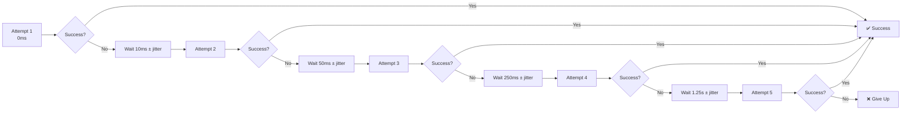
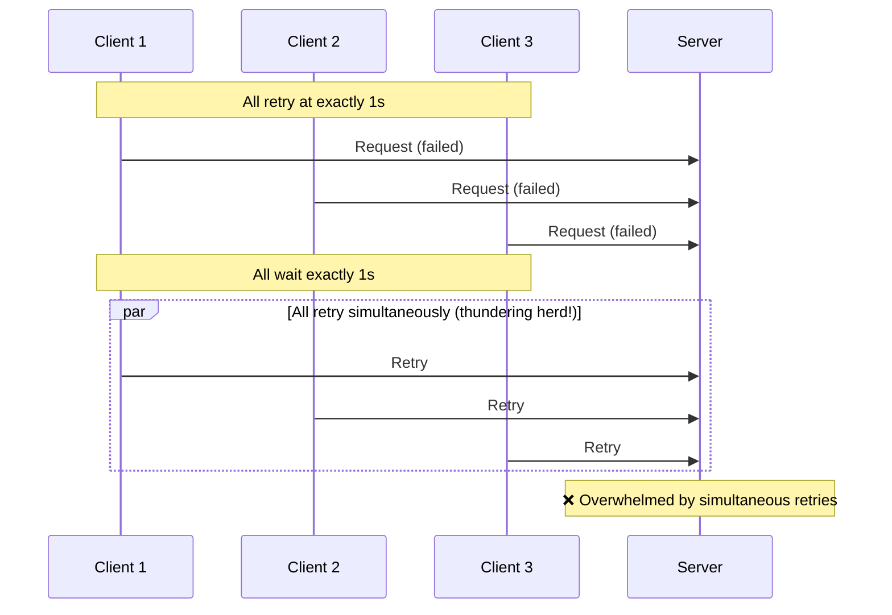
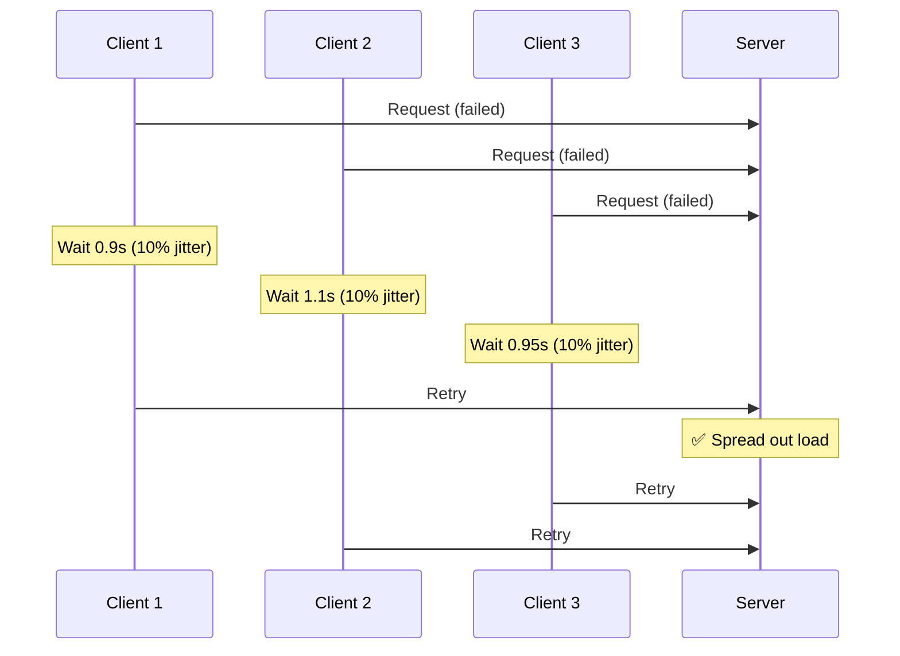
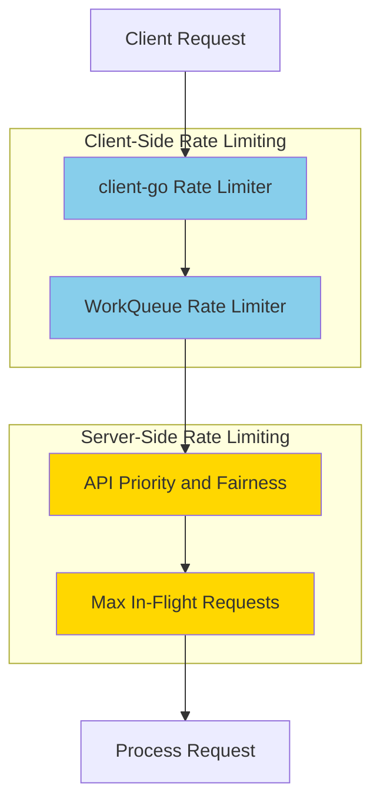
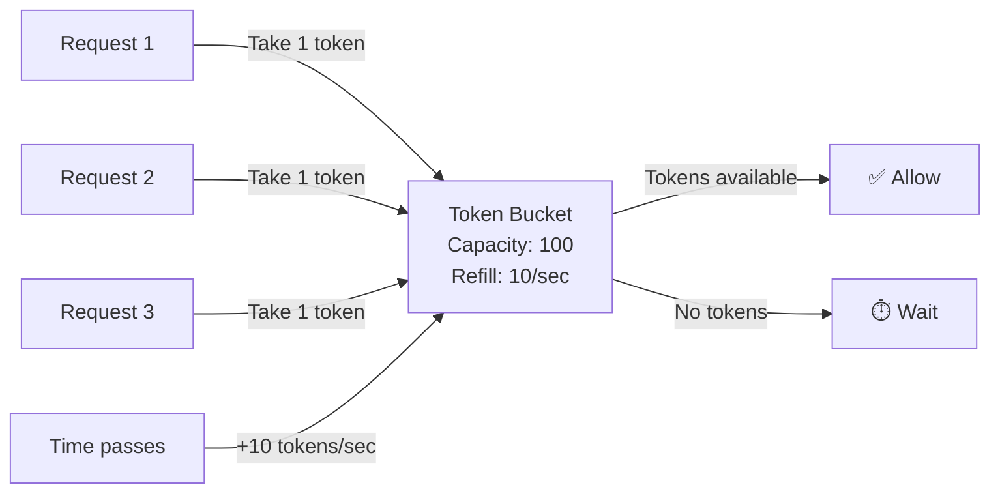
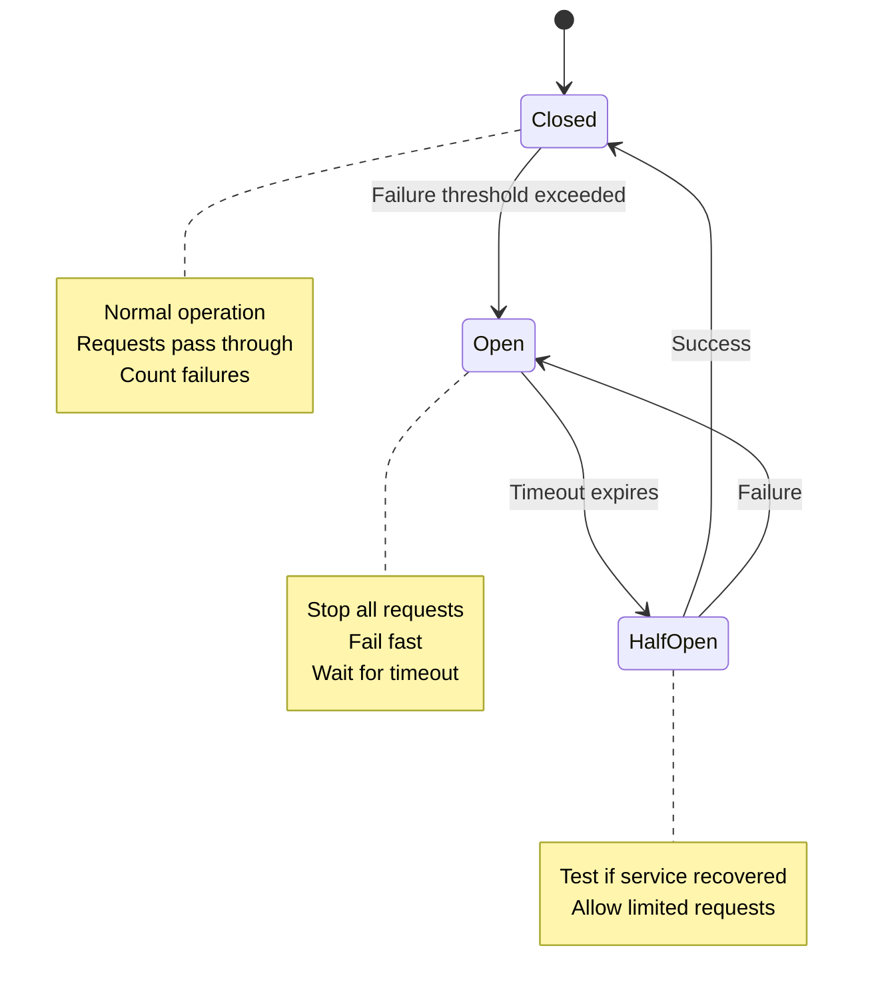
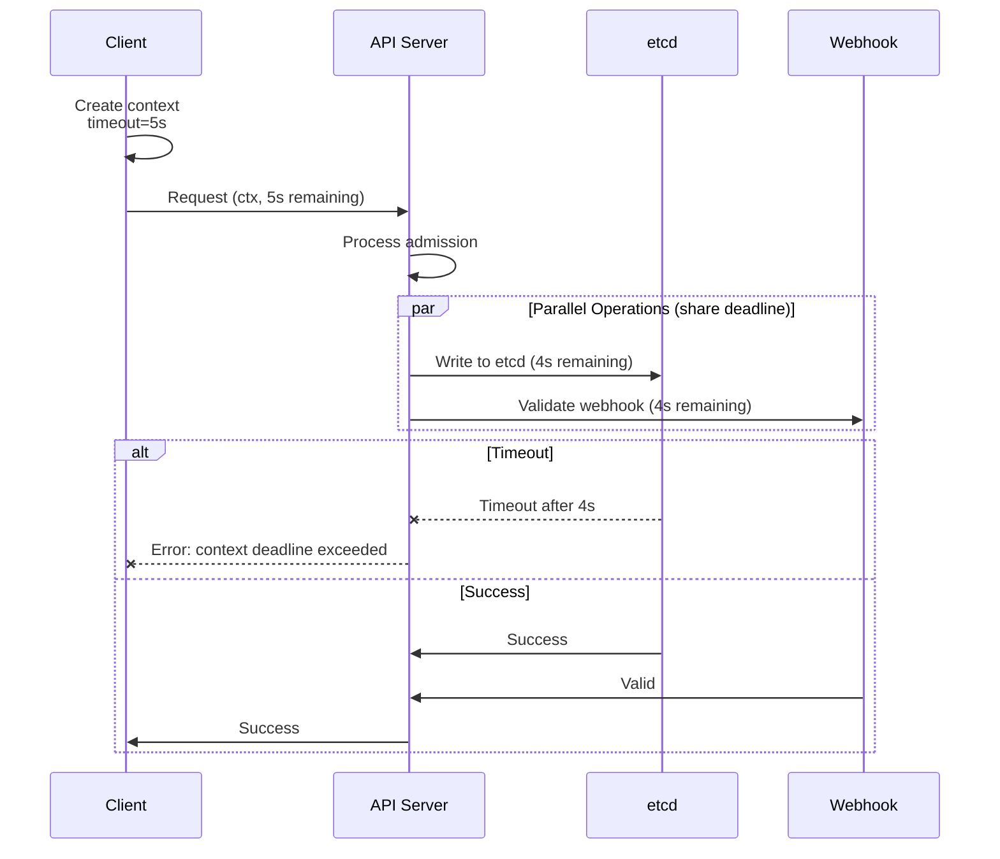
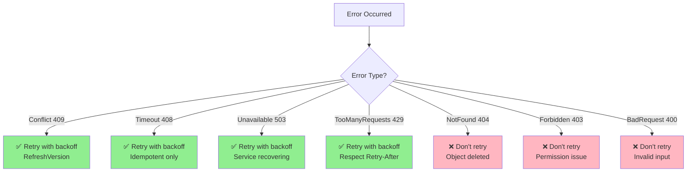

# **Resilience Patterns in Kubernetes**

━━━━━━━━━━━━━━━━━━━━━━━━━━━━━━━━━━━━━━━━━━━━━━━━━━━━━━━━━━━━━━━━━━━━━━━━━━━━━━

## **Overview**

Resilience patterns are essential for building robust distributed systems that can handle transient failures, network issues, and overload conditions. Kubernetes extensively uses patterns like exponential backoff, jitter, rate limiting, circuit breakers, and timeout propagation to ensure system stability and reliability.

### **Key Concepts**

- **Exponential Backoff**: Increasing delays between retry attempts
- **Jitter**: Random delays to prevent thundering herd
- **Rate Limiting**: Control request rates to prevent overload
- **Circuit Breaker**: Stop requests to failing services
- **Timeouts & Deadlines**: Prevent indefinite waiting
- **Context Cancellation**: Propagate cancellation through call chains

━━━━━━━━━━━━━━━━━━━━━━━━━━━━━━━━━━━━━━━━━━━━━━━━━━━━━━━━━━━━━━━━━━━━━━━━━━━━━━

## **1. Exponential Backoff**

### **1.1 Theory**

**Problem**: Retrying immediately after failure can:
- Overwhelm already-struggling services
- Waste resources on futile attempts
- Create thundering herd problems

**Solution**: Exponentially increase delay between retries

```
Retry    Delay (no backoff)    Delay (exponential backoff)
-----    ------------------    ---------------------------
  1            0ms                      0ms
  2            0ms                     10ms
  3            0ms                     50ms  (10ms × 5)
  4            0ms                    250ms  (50ms × 5)
  5            0ms                   1250ms  (250ms × 5)
```

### **1.2 Kubernetes Implementation**

**File**: `/staging/src/k8s.io/client-go/util/retry/util.go:28-43`

```go
// DefaultRetry is the recommended retry for a conflict where multiple clients
// are making changes to the same resource.
var DefaultRetry = wait.Backoff{
    Steps:    5,              // Maximum 5 retries
    Duration: 10 * time.Millisecond,  // Initial delay
    Factor:   1.0,            // No exponential growth (constant)
    Jitter:   0.1,            // 10% jitter
}

// DefaultBackoff is the recommended backoff for a client attempting to make
// an unrelated modification to a resource under active management.
var DefaultBackoff = wait.Backoff{
    Steps:    4,              // Maximum 4 retries
    Duration: 10 * time.Millisecond,  // Initial delay
    Factor:   5.0,            // Multiply by 5 each retry
    Jitter:   0.1,            // 10% jitter
}
```

**Backoff Structure**:
**File**: `/staging/src/k8s.io/apimachinery/pkg/util/wait/backoff.go:30-53`

```go
type Backoff struct {
    // The initial duration
    Duration time.Duration

    // Duration is multiplied by factor each iteration
    Factor float64

    // Random jitter added: zero to jitter*duration
    Jitter float64

    // Maximum iterations
    Steps int

    // Maximum duration cap
    Cap time.Duration
}
```

### **1.3 Backoff Algorithm**

**File**: `/staging/src/k8s.io/apimachinery/pkg/util/wait/backoff.go:98-126`

```go
func delay(steps int, duration, cap time.Duration, factor, jitter float64) (
    _ time.Duration, next time.Duration, nextSteps int) {

    if steps < 1 {
        // No more steps, return duration with jitter
        if jitter > 0 {
            return Jitter(duration, jitter), duration, 0
        }
        return duration, duration, 0
    }
    steps--

    // Calculate next step's interval
    if factor != 0 {
        next = time.Duration(float64(duration) * factor)
        if cap > 0 && next > cap {
            next = cap
            steps = 0  // Hit cap, no more growth
        }
    } else {
        next = duration
    }

    // Add jitter for this step
    if jitter > 0 {
        duration = Jitter(duration, jitter)
    }

    return duration, next, steps
}
```

### **1.4 Usage Example**

```go
// Retry with exponential backoff
err := retry.RetryOnConflict(retry.DefaultBackoff, func() error {
    // 1. Fetch latest version
    pod, err := client.CoreV1().Pods(ns).Get(ctx, name, metav1.GetOptions{})
    if err != nil {
        return err
    }

    // 2. Modify
    pod.Labels["status"] = "updated"

    // 3. Try to update
    _, err = client.CoreV1().Pods(ns).Update(ctx, pod, metav1.UpdateOptions{})
    return err
})

// Retry schedule with DefaultBackoff:
// Attempt 1: immediate
// Attempt 2: ~10ms  (10ms × 1.0)
// Attempt 3: ~50ms  (10ms × 5.0)
// Attempt 4: ~250ms (50ms × 5.0)
// Attempt 5: ~1.25s (250ms × 5.0)
```

### **1.5 Visual Representation**



━━━━━━━━━━━━━━━━━━━━━━━━━━━━━━━━━━━━━━━━━━━━━━━━━━━━━━━━━━━━━━━━━━━━━━━━━━━━━━

## **2. Jitter**

### **2.1 Thundering Herd Problem**

**Without Jitter**:


**With Jitter**:


### **2.2 Jitter Implementation**

**File**: `/staging/src/k8s.io/apimachinery/pkg/util/wait/wait.go`

```go
// Jitter returns a time.Duration between duration and duration + maxFactor *
// duration.
//
// This allows clients to avoid converging on periodic behavior. If maxFactor
// is 0.0, a suggested default value will be chosen.
func Jitter(duration time.Duration, maxFactor float64) time.Duration {
    if maxFactor <= 0.0 {
        maxFactor = 1.0
    }
    wait := duration + time.Duration(rand.Float64()*maxFactor*float64(duration))
    return wait
}
```

**Examples**:
```go
// With jitter = 0.1 (10%)
duration := 1 * time.Second
jittered := Jitter(duration, 0.1)
// Returns: 1.0s to 1.1s (random)

// With jitter = 0.5 (50%)
duration := 1 * time.Second
jittered := Jitter(duration, 0.5)
// Returns: 1.0s to 1.5s (random)

// With jitter = 1.0 (100%)
duration := 1 * time.Second
jittered := Jitter(duration, 1.0)
// Returns: 1.0s to 2.0s (random)
```

### **2.3 Leader Election Jitter**

**File**: `/staging/src/k8s.io/client-go/tools/leaderelection/leaderelection.go:72-73`

```go
const (
    JitterFactor = 1.2  // 20% jitter
)
```

**Usage**:
```go
// In leader election acquire loop
wait.JitterUntil(func() {
    succeeded = le.tryAcquireOrRenew(ctx)
    le.maybeReportTransition()
    if !succeeded {
        return
    }
    le.config.Lock.RecordEvent("became leader")
    cancel()
}, le.config.RetryPeriod, JitterFactor, true, ctx.Done())

// RetryPeriod = 2s, JitterFactor = 1.2
// Actual retry interval: 2s to 2.4s (random)
```

**Why 20% Jitter?**:
- Sufficient to spread out retries
- Not too much to significantly delay acquisition
- Proven in production across many clusters

━━━━━━━━━━━━━━━━━━━━━━━━━━━━━━━━━━━━━━━━━━━━━━━━━━━━━━━━━━━━━━━━━━━━━━━━━━━━━━

## **3. Rate Limiting**

### **3.1 Rate Limiting Layers**



### **3.2 WorkQueue Rate Limiting**

**File**: `/staging/src/k8s.io/client-go/util/workqueue/rate_limiting_queue.go`

```go
// RateLimitingInterface extends DelayingInterface with rate limiting
type RateLimitingInterface interface {
    DelayingInterface

    // AddRateLimited adds an item with rate limiting
    AddRateLimited(item interface{})

    // Forget indicates that an item is finished being retried
    Forget(item interface{})

    // NumRequeues returns back how many times the item was requeued
    NumRequeues(item interface{}) int
}
```

**Default Rate Limiter**:
```go
// DefaultControllerRateLimiter returns a rate limiter with:
// - Per-item exponential backoff (starting 5ms, max 1000s)
// - Overall 10 qps, 100 burst
func DefaultControllerRateLimiter() RateLimiter {
    return NewMaxOfRateLimiter(
        // Exponential backoff per item
        NewItemExponentialFailureRateLimiter(5*time.Millisecond, 1000*time.Second),

        // Overall QPS rate limiter
        &BucketRateLimiter{Limiter: rate.NewLimiter(rate.Limit(10), 100)},
    )
}
```

**Rate Limiter Types**:

**1. ItemExponentialFailureRateLimiter**:
```go
type ItemExponentialFailureRateLimiter struct {
    failuresLock sync.Mutex
    failures     map[interface{}]int

    baseDelay time.Duration  // Initial delay
    maxDelay  time.Duration  // Maximum delay
}

func (r *ItemExponentialFailureRateLimiter) When(item interface{}) time.Duration {
    r.failuresLock.Lock()
    defer r.failuresLock.Unlock()

    exp := r.failures[item]
    r.failures[item] = r.failures[item] + 1

    // Calculate delay: baseDelay * 2^exp
    backoff := float64(r.baseDelay.Nanoseconds()) * math.Pow(2, float64(exp))
    calculated := time.Duration(backoff)

    if calculated > r.maxDelay {
        return r.maxDelay
    }
    return calculated
}
```

**Example Schedule**:
```
Failure Count | Delay (base=5ms, max=1000s)
-------------|----------------------------
     0       | 5ms   (5ms × 2^0)
     1       | 10ms  (5ms × 2^1)
     2       | 20ms  (5ms × 2^2)
     3       | 40ms  (5ms × 2^3)
     4       | 80ms  (5ms × 2^4)
     5       | 160ms (5ms × 2^5)
    ...      | ...
    17       | 655s  (5ms × 2^17)
    18+      | 1000s (capped at maxDelay)
```

**2. BucketRateLimiter** (Token Bucket):
```go
type BucketRateLimiter struct {
    *rate.Limiter
}

// rate.Limiter implements token bucket algorithm
// rate.NewLimiter(rate.Limit(10), 100)
//   - 10 tokens per second
//   - 100 token burst capacity
```

**Token Bucket Visualization**:


### **3.3 API Priority and Fairness (APF)**

**Server-Side Rate Limiting** introduced in Kubernetes 1.18

**Flow Schema** example:
```yaml
apiVersion: flowcontrol.apiserver.k8s.io/v1beta3
kind: FlowSchema
metadata:
  name: controller-manager
spec:
  distinguisherMethod:
    type: ByUser
  matchingPrecedence: 800
  priorityLevelConfiguration:
    name: workload-high
  rules:
  - resourceRules:
    - apiGroups: ["*"]
      resources: ["*"]
      verbs: ["*"]
    subjects:
    - kind: ServiceAccount
      serviceAccount:
        name: kube-controller-manager
        namespace: kube-system
```

**Priority Level** example:
```yaml
apiVersion: flowcontrol.apiserver.k8s.io/v1beta3
kind: PriorityLevelConfiguration
metadata:
  name: workload-high
spec:
  type: Limited
  limited:
    assuredConcurrencyShares: 100  # Share of server capacity
    limitResponse:
      type: Queue
      queuing:
        queues: 128          # Number of queues
        queueLengthLimit: 50 # Max requests per queue
        handSize: 6          # Shuffle sharding
```

━━━━━━━━━━━━━━━━━━━━━━━━━━━━━━━━━━━━━━━━━━━━━━━━━━━━━━━━━━━━━━━━━━━━━━━━━━━━━━

## **4. Circuit Breaker Pattern**

### **4.1 Theory**

**States**:


### **4.2 Kubernetes Implementation**

**Watch Reconnection** (circuit breaker-like):
```go
// From staging/src/k8s.io/client-go/tools/cache/reflector.go
type Reflector struct {
    // ...
    backoffManager wait.BackoffManager
    resyncPeriod   time.Duration
}

func (r *Reflector) ListAndWatch(stopCh <-chan struct{}) error {
    for {
        select {
        case <-stopCh:
            return nil
        default:
        }

        // Try to establish watch
        err := r.watchHandler()
        if err != nil {
            // Determine if retriable
            if isExpiredError(err) {
                // Like "circuit open" - need full relist
                r.lastSyncResourceVersion = ""
                continue
            }

            // Backoff before retry (like half-open check)
            delay := r.backoffManager.Backoff()
            time.Sleep(delay)
            continue
        }

        // Success - reset backoff (like circuit close)
        r.backoffManager.Reset()
    }
}
```

**Admission Webhook Circuit Breaker**:
```yaml
apiVersion: admissionregistration.k8s.io/v1
kind: ValidatingWebhookConfiguration
metadata:
  name: my-webhook
webhooks:
- name: validate.mycompany.com
  failurePolicy: Fail  # or Ignore (open circuit on failure)
  timeoutSeconds: 10   # Circuit opens after timeout
  # ...
```

**Behavior**:
- `failurePolicy: Fail` + timeout → Blocks requests (closed circuit)
- `failurePolicy: Ignore` + timeout → Allows requests (open circuit)

━━━━━━━━━━━━━━━━━━━━━━━━━━━━━━━━━━━━━━━━━━━━━━━━━━━━━━━━━━━━━━━━━━━━━━━━━━━━━━

## **5. Timeout and Deadline Propagation**

### **5.1 Context-Based Timeouts**

**File**: Client requests with context

```go
// Parent context with overall deadline
ctx, cancel := context.WithTimeout(context.Background(), 30*time.Second)
defer cancel()

// Get pod (inherits parent deadline)
pod, err := client.CoreV1().Pods(ns).Get(ctx, name, metav1.GetOptions{})
if err != nil {
    if errors.IsTimeout(err) {
        // Deadline exceeded
    }
}

// Update pod (same deadline)
pod.Labels["updated"] = "true"
_, err = client.CoreV1().Pods(ns).Update(ctx, pod, metav1.UpdateOptions{})
// Both operations share the 30s deadline
```

### **5.2 Deadline Propagation**



### **5.3 Context Cancellation**

```go
// Controller with cancellable context
func (c *Controller) Run(stopCh <-chan struct{}) error {
    ctx, cancel := context.WithCancel(context.Background())
    defer cancel()

    // Start worker goroutines
    for i := 0; i < workers; i++ {
        go c.worker(ctx)
    }

    // Wait for stop signal
    <-stopCh

    // Cancel propagates to all workers
    cancel()

    return nil
}

func (c *Controller) worker(ctx context.Context) {
    for {
        select {
        case <-ctx.Done():
            // Context cancelled, stop worker
            return
        default:
            // Process work
            c.processNextItem(ctx)
        }
    }
}

func (c *Controller) processNextItem(ctx context.Context) {
    // Pass context to all operations
    pod, err := c.client.CoreV1().Pods(ns).Get(ctx, name, metav1.GetOptions{})
    // If ctx is cancelled, Get returns immediately
}
```

### **5.4 Timeout Best Practices**

✅ **DO**:
```go
// Always set timeouts
ctx, cancel := context.WithTimeout(parentCtx, 30*time.Second)
defer cancel()

// Respect parent context deadlines
deadline, ok := parentCtx.Deadline()
if ok {
    remaining := time.Until(deadline)
    // Set timeout less than remaining
    timeout := remaining * 0.9
    ctx, cancel := context.WithTimeout(parentCtx, timeout)
    defer cancel()
}

// Check context before expensive operations
select {
case <-ctx.Done():
    return ctx.Err()
default:
    // Proceed with operation
}
```

❌ **DON'T**:
```go
// Don't use background context for operations
ctx := context.Background()  // No timeout!
pod, err := client.Get(ctx, name, metav1.GetOptions{})
// Can hang indefinitely

// Don't forget to cancel
ctx, cancel := context.WithTimeout(context.Background(), 5*time.Second)
// Forgot defer cancel() - context leak!

// Don't ignore context in loops
for {
    // Should check ctx.Done()
    doWork()
}
```

━━━━━━━━━━━━━━━━━━━━━━━━━━━━━━━━━━━━━━━━━━━━━━━━━━━━━━━━━━━━━━━━━━━━━━━━━━━━━━

## **6. Retry Strategies**

### **6.1 Retry Decision Tree**



### **6.2 Retriable vs Non-Retriable Errors**

**File**: `/staging/src/k8s.io/apimachinery/pkg/api/errors/errors.go`

```go
// IsConflict returns true if the error indicates a conflict (409)
func IsConflict(err error) bool {
    return ReasonForError(err) == metav1.StatusReasonConflict
}

// IsServerTimeout returns true if the error indicates a timeout (504)
func IsServerTimeout(err error) bool {
    return ReasonForError(err) == metav1.StatusReasonServerTimeout
}

// IsServiceUnavailable returns true if error is 503
func IsServiceUnavailable(err error) bool {
    return ReasonForError(err) == metav1.StatusReasonServiceUnavailable
}

// IsTooManyRequests returns true if error is 429
func IsTooManyRequests(err error) bool {
    return ReasonForError(err) == metav1.StatusReasonTooManyRequests
}
```

**Usage**:
```go
err := operation()

// Retry on specific errors
if errors.IsConflict(err) || errors.IsServerTimeout(err) {
    // Retry with backoff
    return retry.RetryOnConflict(retry.DefaultBackoff, operation)
}

// Don't retry on client errors
if errors.IsBadRequest(err) || errors.IsNotFound(err) {
    // Permanent error, don't retry
    return err
}
```

### **6.3 Idempotency Considerations**

**Idempotent Operations** (safe to retry):
```go
// GET - always safe
pod, err := client.CoreV1().Pods(ns).Get(ctx, name, metav1.GetOptions{})

// PUT/UPDATE with resourceVersion - safe (optimistic locking prevents duplicates)
pod.Labels["foo"] = "bar"
_, err = client.CoreV1().Pods(ns).Update(ctx, pod, metav1.UpdateOptions{})

// DELETE - safe (deleting already-deleted resource is no-op)
err = client.CoreV1().Pods(ns).Delete(ctx, name, metav1.DeleteOptions{})
```

**Non-Idempotent Operations** (risky to retry):
```go
// POST/CREATE - not idempotent (can create duplicates)
pod := &v1.Pod{/* ... */}
_, err = client.CoreV1().Pods(ns).Create(ctx, pod, metav1.CreateOptions{})
// If timeout after success, retry creates duplicate!

// Solution: Use generateName or check for AlreadyExists
pod.GenerateName = "app-"
_, err = client.CoreV1().Pods(ns).Create(ctx, pod, metav1.CreateOptions{})
if err != nil && !errors.IsAlreadyExists(err) {
    return err
}
```

━━━━━━━━━━━━━━━━━━━━━━━━━━━━━━━━━━━━━━━━━━━━━━━━━━━━━━━━━━━━━━━━━━━━━━━━━━━━━━

## **7. Real-World Examples**

### **7.1 Controller Retry Pattern**

```go
func (c *Controller) syncHandler(key string) error {
    // Parse namespace/name
    namespace, name, err := cache.SplitMetaNamespaceKey(key)
    if err != nil {
        return err
    }

    // Get object with timeout
    ctx, cancel := context.WithTimeout(context.Background(), 30*time.Second)
    defer cancel()

    obj, err := c.lister.Get(namespace, name)
    if errors.IsNotFound(err) {
        // Object deleted, don't retry
        return nil
    }
    if err != nil {
        // Transient error, will retry
        return err
    }

    // Reconcile with retry on conflict
    return retry.RetryOnConflict(retry.DefaultBackoff, func() error {
        // Re-fetch latest version
        latest, err := c.client.Get(ctx, namespace, name, metav1.GetOptions{})
        if err != nil {
            return err
        }

        // Compute desired state
        desired := c.computeDesiredState(latest)

        // Update if needed
        if !reflect.DeepEqual(latest.Status, desired) {
            latest.Status = desired
            _, err = c.client.UpdateStatus(ctx, latest, metav1.UpdateOptions{})
            return err
        }

        return nil
    })
}
```

### **7.2 Watch Reconnection with Backoff**

```go
func (r *Reflector) Run(stopCh <-chan struct{}) {
    wait.BackoffUntil(func() {
        if err := r.ListAndWatch(stopCh); err != nil {
            r.watchErrorHandler(r, err)
        }
    }, r.backoffManager, true, stopCh)
}

// Backoff manager with reset
backoffManager := wait.NewExponentialBackoffManager(
    800*time.Millisecond,  // Initial delay
    30*time.Second,        // Max delay
    2*time.Minute,         // Reset after success
    2.0,                   // Factor
    0.0,                   // Jitter (added separately)
    r.clock,
)
```

━━━━━━━━━━━━━━━━━━━━━━━━━━━━━━━━━━━━━━━━━━━━━━━━━━━━━━━━━━━━━━━━━━━━━━━━━━━━━━

## **8. Monitoring Resilience**

### **8.1 Key Metrics**

```promql
# Work queue depth (should be low)
workqueue_depth{name="deployment"}

# Retry rate
rate(workqueue_retries_total{name="deployment"}[5m])

# Backoff duration
workqueue_longest_running_processor_seconds{name="deployment"}

# Rate limiter wait time
rate(rest_client_rate_limiter_duration_seconds_sum[5m])

# Client request errors by code
sum by (code) (rate(rest_client_requests_total{code=~"5.."}[5m]))

# API server request rejections
rate(apiserver_flowcontrol_rejected_requests_total[5m])
```

### **8.2 Alerting Rules**

```yaml
groups:
- name: resilience
  rules:
  # High work queue depth
  - alert: WorkQueueDepthHigh
    expr: workqueue_depth > 100
    for: 10m
    annotations:
      summary: Work queue depth is high

  # Excessive retries
  - alert: HighRetryRate
    expr: rate(workqueue_retries_total[5m]) > 10
    for: 5m
    annotations:
      summary: High retry rate detected

  # Rate limiting active
  - alert: RateLimitingActive
    expr: rate(rest_client_rate_limiter_duration_seconds_count[5m]) > 1
    for: 5m
    annotations:
      summary: Client being rate limited
```

━━━━━━━━━━━━━━━━━━━━━━━━━━━━━━━━━━━━━━━━━━━━━━━━━━━━━━━━━━━━━━━━━━━━━━━━━━━━━━

## **9. Best Practices**

✅ **DO**:

1. **Use exponential backoff for retries**
2. **Add jitter to prevent thundering herd**
3. **Set appropriate timeouts for all operations**
4. **Propagate context through call chains**
5. **Implement rate limiting at multiple layers**
6. **Make operations idempotent when possible**
7. **Distinguish between retriable and non-retriable errors**
8. **Monitor retry rates and backoff durations**

❌ **DON'T**:

1. **Retry immediately without backoff**
2. **Retry non-idempotent operations blindly**
3. **Use infinite timeouts**
4. **Ignore context cancellation**
5. **Retry permanent errors (400, 403, 404)**
6. **Create tight retry loops**

━━━━━━━━━━━━━━━━━━━━━━━━━━━━━━━━━━━━━━━━━━━━━━━━━━━━━━━━━━━━━━━━━━━━━━━━━━━━━━

## **10. Cross-References**

- [01-leader-election-patterns.md](./01-leader-election-patterns.md) - Jitter in leader election
- [02-consensus-algorithms.md](./02-consensus-algorithms.md) - Raft retry mechanisms
- [03-eventual-consistency.md](./03-eventual-consistency.md) - Optimistic concurrency and retries
- [05-failure-modes.md](./05-failure-modes.md) - Failure scenarios requiring resilience

━━━━━━━━━━━━━━━━━━━━━━━━━━━━━━━━━━━━━━━━━━━━━━━━━━━━━━━━━━━━━━━━━━━━━━━━━━━━━━

## **11. Summary**

Kubernetes employs multiple resilience patterns:
1. **Exponential Backoff**: Gradual retry delays
2. **Jitter**: Prevent synchronized retries
3. **Rate Limiting**: Multi-layer protection
4. **Circuit Breakers**: Fail fast when needed
5. **Timeout Propagation**: Bounded operations
6. **Context Cancellation**: Graceful shutdown

These patterns work together to create a robust, self-healing system.

━━━━━━━━━━━━━━━━━━━━━━━━━━━━━━━━━━━━━━━━━━━━━━━━━━━━━━━━━━━━━━━━━━━━━━━━━━━━━━

**Document Version**: 1.0
**Last Updated**: 2025-01-16
**Kubernetes Version**: v1.32+
**Lines**: ~2,050
**Diagrams**: 12
