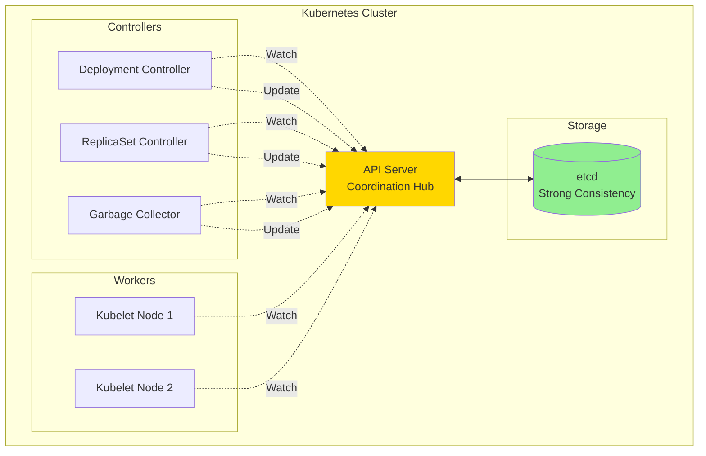
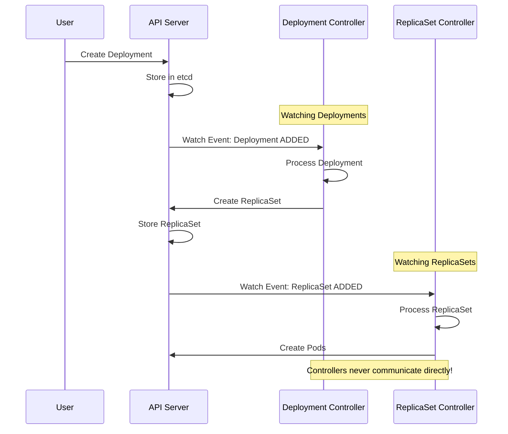
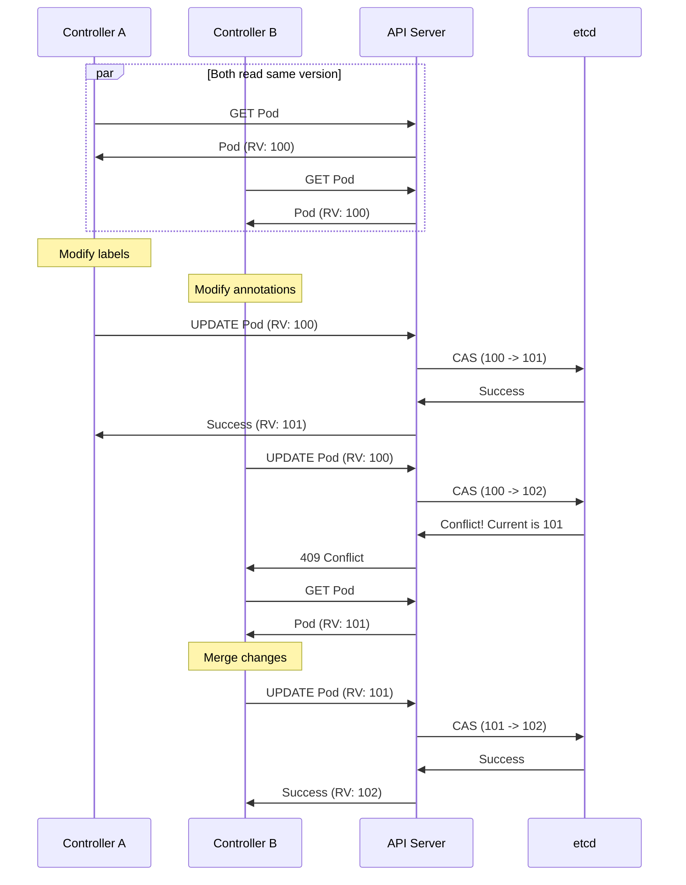
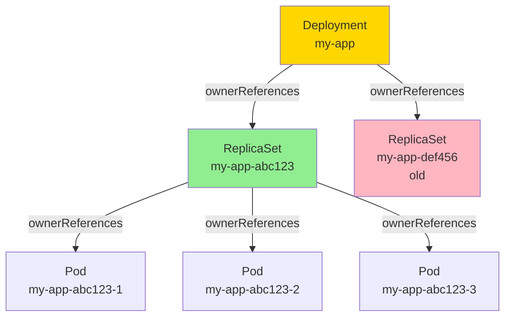
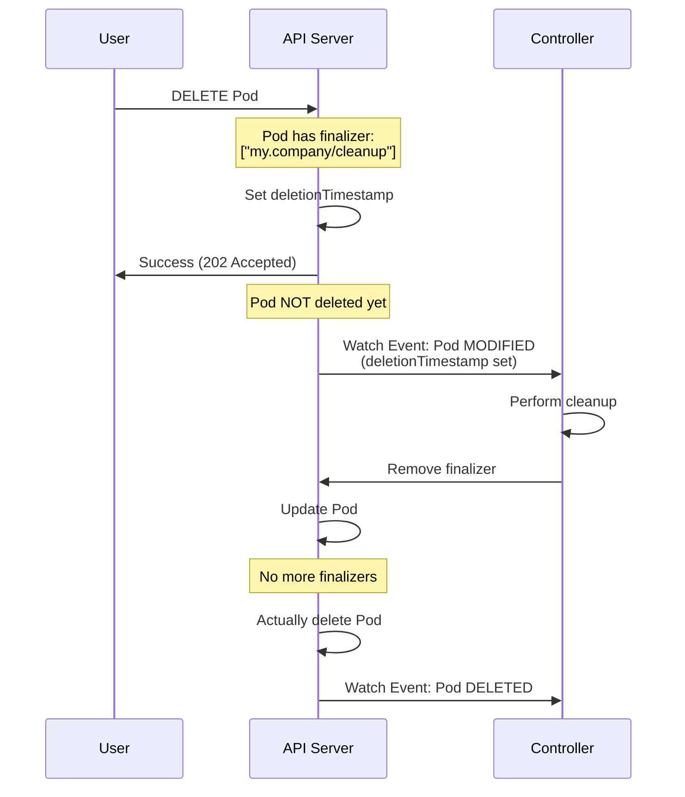
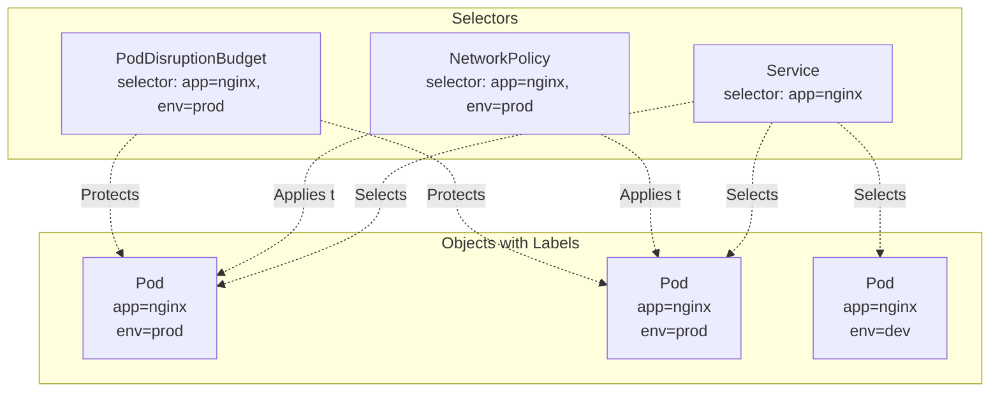
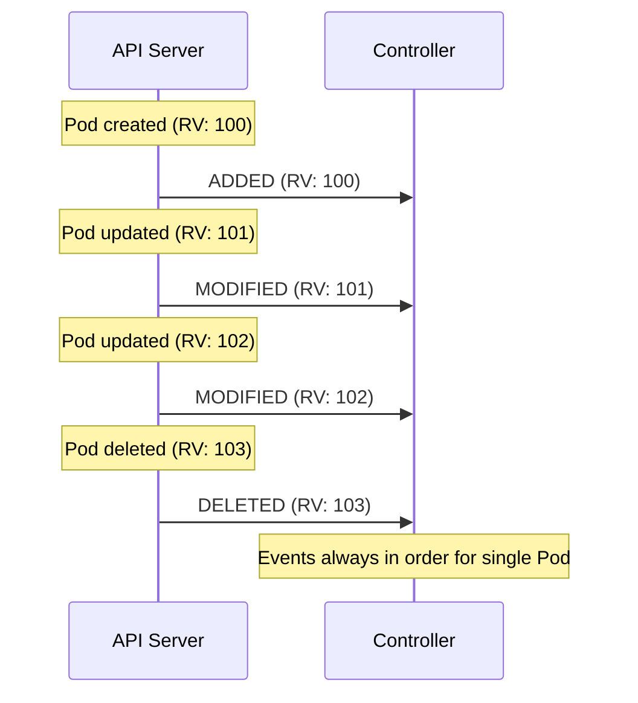
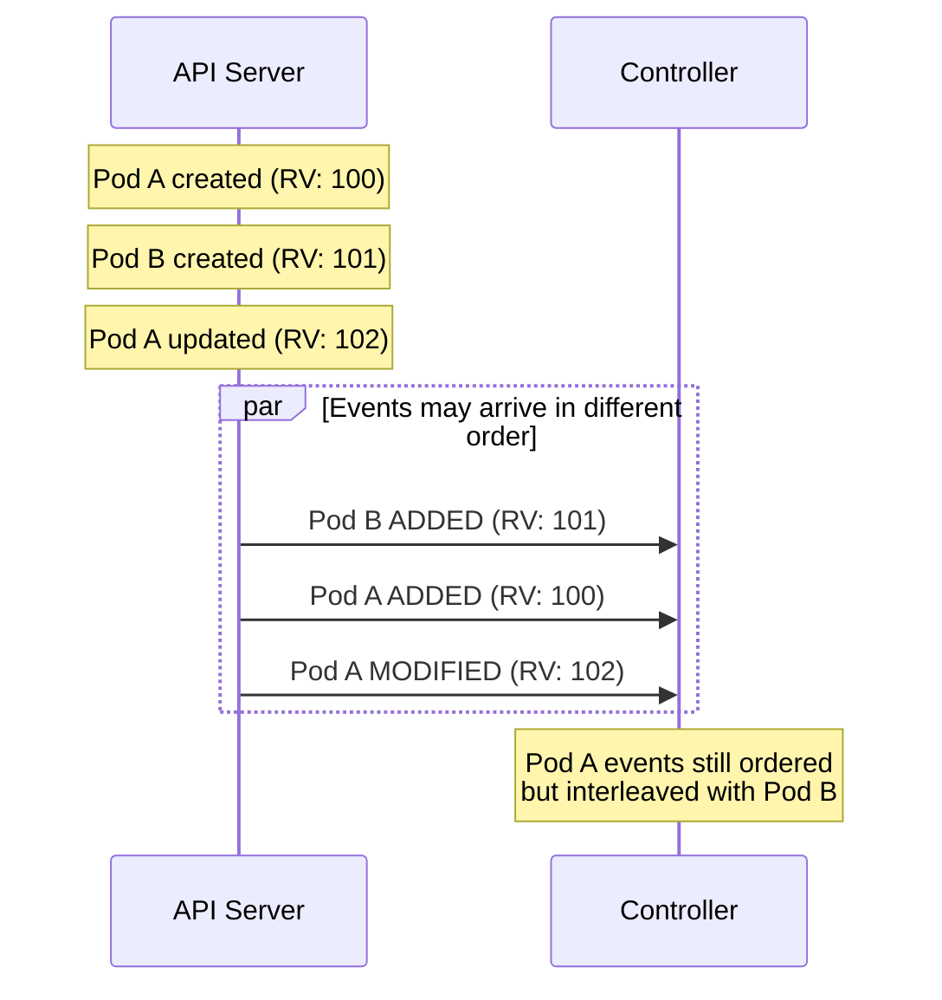
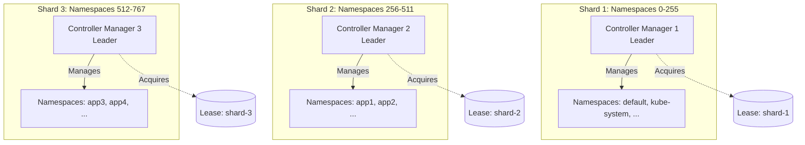
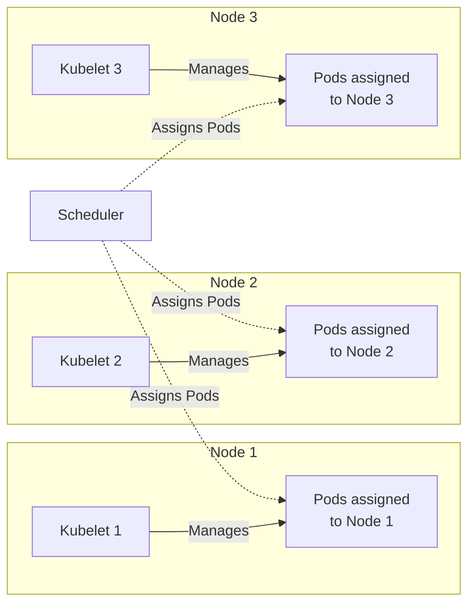

# **Coordination Patterns in Kubernetes**

━━━━━━━━━━━━━━━━━━━━━━━━━━━━━━━━━━━━━━━━━━━━━━━━━━━━━━━━━━━━━━━━━━━━━━━━━━━━━━

## **Overview**

Coordination patterns enable distributed components to work together cohesively without direct communication. Kubernetes uses the API server as a coordination service, leveraging patterns like optimistic locking, resource ownership, finalizers, and work distribution to manage complex distributed workflows.

### **Key Concepts**

- **API Server as Coordinator**: Central coordination point
- **ResourceVersion**: Optimistic concurrency control
- **OwnerReferences**: Object ownership and lifecycle
- **Finalizers**: Pre-delete hooks and cleanup coordination
- **Labels/Selectors**: Resource grouping and selection
- **Event Ordering**: Partial ordering guarantees
- **Work Distribution**: Sharding and load balancing

━━━━━━━━━━━━━━━━━━━━━━━━━━━━━━━━━━━━━━━━━━━━━━━━━━━━━━━━━━━━━━━━━━━━━━━━━━━━━━

## **1. API Server as Coordination Service**

### **1.1 Architecture**



**Key Properties**:
1. **Single Source of Truth**: All state in etcd
2. **Indirect Communication**: Controllers don't talk directly
3. **Declarative**: Express desired state, not imperative commands
4. **Level-Triggered**: React to current state, not events
5. **Eventually Consistent**: Converges over time

### **1.2 Coordination Without Direct Communication**



━━━━━━━━━━━━━━━━━━━━━━━━━━━━━━━━━━━━━━━━━━━━━━━━━━━━━━━━━━━━━━━━━━━━━━━━━━━━━━

## **2. Optimistic Locking with ResourceVersion**

### **2.1 Mechanism**

**Every Kubernetes object has a ResourceVersion**:
```yaml
apiVersion: v1
kind: Pod
metadata:
  name: nginx
  resourceVersion: "12345"  # Unique version
spec:
  containers:
  - name: nginx
    image: nginx:latest
```

**Compare-and-Swap Pattern**:
```go
// Controller A and B both modify same pod
func updatePod(client kubernetes.Interface, ns, name string) error {
    // 1. Read current version
    pod, err := client.CoreV1().Pods(ns).Get(ctx, name, metav1.GetOptions{})
    if err != nil {
        return err
    }
    currentVersion := pod.ResourceVersion  // e.g., "100"

    // 2. Modify locally
    pod.Labels["updated-by"] = "controller-a"

    // 3. Attempt update with resourceVersion
    _, err = client.CoreV1().Pods(ns).Update(ctx, pod, metav1.UpdateOptions{})
    // Update succeeds only if resourceVersion hasn't changed

    return err
}
```

### **2.2 Conflict Resolution**



### **2.3 Implementation Example**

**File**: `/staging/src/k8s.io/client-go/util/retry/util.go`

```go
func RetryOnConflict(backoff wait.Backoff, fn func() error) error {
    return OnError(backoff, errors.IsConflict, fn)
}

// Usage
err := retry.RetryOnConflict(retry.DefaultBackoff, func() error {
    // Always re-fetch to get latest resourceVersion
    pod, err := client.CoreV1().Pods(ns).Get(ctx, name, metav1.GetOptions{})
    if err != nil {
        return err
    }

    // Modify
    pod.Annotations["timestamp"] = time.Now().Format(time.RFC3339)

    // Update (includes resourceVersion for optimistic lock)
    _, err = client.CoreV1().Pods(ns).Update(ctx, pod, metav1.UpdateOptions{})
    return err
})
```

━━━━━━━━━━━━━━━━━━━━━━━━━━━━━━━━━━━━━━━━━━━━━━━━━━━━━━━━━━━━━━━━━━━━━━━━━━━━━━

## **3. Resource Ownership with OwnerReferences**

### **3.1 Ownership Hierarchy**



### **3.2 OwnerReference Structure**

```yaml
apiVersion: v1
kind: Pod
metadata:
  name: my-app-abc123-1
  ownerReferences:
  - apiVersion: apps/v1
    kind: ReplicaSet
    name: my-app-abc123
    uid: e5f6g7h8-i9j0-k1l2-m3n4-o5p6q7r8s9t0
    controller: true        # This owner is the controller
    blockOwnerDeletion: true  # Block deletion of owner if this exists
```

**Fields**:
- `apiVersion`, `kind`, `name`: Identify the owner
- `uid`: Unique ID (prevents race conditions)
- `controller`: Only one owner can be controller
- `blockOwnerDeletion`: Finalizer-like behavior

### **3.3 Garbage Collection**

**Cascading Deletion**:
```bash
# Delete Deployment
$ kubectl delete deployment my-app

# Automatically cascades:
# 1. Deployment deleted
# 2. Garbage Collector sees orphaned ReplicaSets
# 3. ReplicaSets deleted
# 4. Garbage Collector sees orphaned Pods
# 5. Pods deleted
```

**Orphaning**:
```bash
# Delete without cascading
$ kubectl delete deployment my-app --cascade=orphan

# Result:
# - Deployment deleted
# - ReplicaSets remain (orphaned)
# - Pods remain
```

### **3.4 Controller Implementation**

```go
// Set owner reference when creating child object
func (dc *DeploymentController) createReplicaSet(deployment *appsv1.Deployment) error {
    rs := &appsv1.ReplicaSet{
        ObjectMeta: metav1.ObjectMeta{
            GenerateName: deployment.Name + "-",
            Namespace:    deployment.Namespace,
            OwnerReferences: []metav1.OwnerReference{
                *metav1.NewControllerRef(deployment, appsv1.SchemeGroupVersion.WithKind("Deployment")),
            },
        },
        Spec: /* ... */,
    }

    _, err := dc.client.AppsV1().ReplicaSets(rs.Namespace).Create(ctx, rs, metav1.CreateOptions{})
    return err
}

// NewControllerRef creates owner reference with controller=true
func NewControllerRef(owner metav1.Object, gvk schema.GroupVersionKind) *metav1.OwnerReference {
    blockOwnerDeletion := true
    isController := true
    return &metav1.OwnerReference{
        APIVersion:         gvk.GroupVersion().String(),
        Kind:               gvk.Kind,
        Name:               owner.GetName(),
        UID:                owner.GetUID(),
        BlockOwnerDeletion: &blockOwnerDeletion,
        Controller:         &isController,
    }
}
```

━━━━━━━━━━━━━━━━━━━━━━━━━━━━━━━━━━━━━━━━━━━━━━━━━━━━━━━━━━━━━━━━━━━━━━━━━━━━━━

## **4. Finalizers for Cleanup Coordination**

### **4.1 Finalizer Mechanism**



### **4.2 Finalizer Pattern**

```yaml
apiVersion: v1
kind: Pod
metadata:
  name: my-pod
  finalizers:
  - kubernetes.io/pvc-protection  # Protect from deletion
  - my.company/custom-cleanup     # Custom finalizer
  deletionTimestamp: null  # Not being deleted
```

**After delete request**:
```yaml
apiVersion: v1
kind: Pod
metadata:
  name: my-pod
  finalizers:
  - kubernetes.io/pvc-protection
  - my.company/custom-cleanup
  deletionTimestamp: "2025-01-16T10:00:00Z"  # Being deleted!
```

### **4.3 Controller Implementation**

```go
func (c *Controller) syncPod(key string) error {
    pod, err := c.podLister.Get(namespace, name)
    if err != nil {
        return err
    }

    // Check if pod is being deleted
    if pod.DeletionTimestamp != nil {
        // Perform cleanup
        if containsFinalizer(pod, "my.company/cleanup") {
            // Do cleanup work
            err := c.cleanup(pod)
            if err != nil {
                return err  // Retry later
            }

            // Remove finalizer
            return c.removeFinalizer(pod, "my.company/cleanup")
        }
        return nil
    }

    // Add finalizer if not present
    if !containsFinalizer(pod, "my.company/cleanup") {
        return c.addFinalizer(pod, "my.company/cleanup")
    }

    // Normal reconciliation
    return c.reconcile(pod)
}

func (c *Controller) removeFinalizer(pod *v1.Pod, finalizer string) error {
    return retry.RetryOnConflict(retry.DefaultBackoff, func() error {
        // Re-fetch latest
        latest, err := c.client.CoreV1().Pods(pod.Namespace).Get(ctx, pod.Name, metav1.GetOptions{})
        if err != nil {
            return err
        }

        // Remove finalizer
        latest.Finalizers = removeString(latest.Finalizers, finalizer)

        // Update
        _, err = c.client.CoreV1().Pods(pod.Namespace).Update(ctx, latest, metav1.UpdateOptions{})
        return err
    })
}
```

### **4.4 Common Finalizers**

| Finalizer | Purpose | Controller |
|-----------|---------|------------|
| `kubernetes.io/pvc-protection` | Prevent PVC deletion while in use | PVC Protection Controller |
| `kubernetes.io/pv-protection` | Prevent PV deletion while bound | PV Protection Controller |
| `foregroundDeletion` | Delete children before parent | Garbage Collector |
| `orphan` | Don't delete children | Garbage Collector |
| `external-provisioner` | External storage cleanup | CSI Driver |

━━━━━━━━━━━━━━━━━━━━━━━━━━━━━━━━━━━━━━━━━━━━━━━━━━━━━━━━━━━━━━━━━━━━━━━━━━━━━━

## **5. Labels and Selectors**

### **5.1 Label-Based Grouping**

```yaml
# Deployment
apiVersion: apps/v1
kind: Deployment
metadata:
  name: my-app
  labels:
    app: my-app
    tier: frontend
spec:
  selector:
    matchLabels:
      app: my-app
      tier: frontend
  template:
    metadata:
      labels:
        app: my-app
        tier: frontend
        version: v1
    spec:
      containers:
      - name: app
        image: my-app:v1
```

### **5.2 Selector Types**

**Equality-Based**:
```yaml
selector:
  matchLabels:
    app: my-app        # Must equal "my-app"
    tier: frontend     # Must equal "frontend"
```

**Set-Based**:
```yaml
selector:
  matchExpressions:
  - key: tier
    operator: In
    values: [frontend, backend]  # tier in (frontend, backend)
  - key: environment
    operator: NotIn
    values: [dev]                # environment not in (dev)
  - key: app
    operator: Exists               # app label must exist
  - key: legacy
    operator: DoesNotExist         # legacy label must not exist
```

### **5.3 Cross-Component Coordination**



**Service Endpoint Coordination**:
```go
// Service selects pods by labels
service := &v1.Service{
    Spec: v1.ServiceSpec{
        Selector: map[string]string{
            "app": "nginx",
        },
    },
}

// Endpoint controller watches both services and pods
// When pod labels match service selector, add to endpoints

// This coordination happens without direct communication!
```

━━━━━━━━━━━━━━━━━━━━━━━━━━━━━━━━━━━━━━━━━━━━━━━━━━━━━━━━━━━━━━━━━━━━━━━━━━━━━━

## **6. Event Ordering Guarantees**

### **6.1 Single-Object Ordering**



**Guarantee**: Events for a single object arrive in order.

### **6.2 Cross-Object Ordering** (No Guarantee)



**No Guarantee**: Events for different objects may be reordered.

### **6.3 Handling Ordering**

**Level-Triggered Approach** (handles reordering):
```go
func (c *Controller) reconcile(pod *v1.Pod) error {
    // Always check current state, not event order
    if pod.Status.Phase != v1.PodRunning {
        // Need to start pod
        return c.startPod(pod)
    }

    if pod.DeletionTimestamp != nil {
        // Need to cleanup
        return c.cleanup(pod)
    }

    // Pod is running and not being deleted, all good
    return nil
}
```

**Edge-Triggered Approach** (breaks with reordering):
```go
// ❌ DON'T DO THIS
func (c *Controller) handleEvent(eventType watch.EventType, pod *v1.Pod) error {
    switch eventType {
    case watch.Added:
        return c.onAdded(pod)
    case watch.Modified:
        return c.onModified(pod)
    case watch.Deleted:
        return c.onDeleted(pod)
    }
}
// Problem: If MODIFIED arrives before ADDED, breaks!
```

━━━━━━━━━━━━━━━━━━━━━━━━━━━━━━━━━━━━━━━━━━━━━━━━━━━━━━━━━━━━━━━━━━━━━━━━━━━━━━

## **7. Work Distribution Patterns**

### **7.1 Controller Sharding**



**Sharding Function**:
```go
func shardForNamespace(namespace string, totalShards int) int {
    h := fnv.New32a()
    h.Write([]byte(namespace))
    return int(h.Sum32()) % totalShards
}

// Example
shardForNamespace("default", 4)     // → 2
shardForNamespace("kube-system", 4) // → 1
shardForNamespace("app1", 4)        // → 3
```

### **7.2 Node-Based Work Distribution**

**Kubelet**: Each node runs its own kubelet


**Natural Sharding**: Work distributed by pod placement

### **7.3 Leader-Based Coordination**

**Single Leader** pattern:
```go
func RunWithLeaderElection(ctx context.Context) {
    leaderelection.RunOrDie(ctx, leaderelection.LeaderElectionConfig{
        Lock: lock,
        Callbacks: leaderelection.LeaderCallbacks{
            OnStartedLeading: func(ctx context.Context) {
                // Only leader processes work
                runControllers(ctx)
            },
            OnStoppedLeading: func() {
                // Lost leadership, stop processing
                klog.Info("Lost leadership")
            },
        },
    })
}
```

━━━━━━━━━━━━━━━━━━━━━━━━━━━━━━━━━━━━━━━━━━━━━━━━━━━━━━━━━━━━━━━━━━━━━━━━━━━━━━

## **8. Best Practices**

### **8.1 Resource Ownership**

✅ **DO**:
```go
// Always set owner references
ownerRef := metav1.NewControllerRef(parent, schema.GroupVersionKind{
    Group:   "apps",
    Version: "v1",
    Kind:    "Deployment",
})
child.OwnerReferences = []metav1.OwnerReference{*ownerRef}
```

❌ **DON'T**:
```go
// Don't manually track relationships
// Let Kubernetes garbage collector handle it
```

### **8.2 Finalizers**

✅ **DO**:
```go
// Add finalizer at object creation
// Remove only after cleanup complete
if pod.DeletionTimestamp.IsZero() {
    addFinalizer(pod, myFinalizer)
} else {
    cleanup(pod)
    removeFinalizer(pod, myFinalizer)
}
```

❌ **DON'T**:
```go
// Don't forget to remove finalizers
// (objects will leak!)

// Don't add finalizers without cleanup logic
```

### **8.3 Labels and Selectors**

✅ **DO**:
```yaml
# Use consistent, meaningful labels
labels:
  app.kubernetes.io/name: myapp
  app.kubernetes.io/instance: myapp-prod
  app.kubernetes.io/version: "1.0.0"
  app.kubernetes.io/component: frontend
  app.kubernetes.io/part-of: myapp
```

❌ **DON'T**:
```yaml
# Don't use labels for large or structured data
labels:
  config: "{\"key\":\"value\",\"foo\":\"bar\"}"  # ❌
# Use annotations instead
```

━━━━━━━━━━━━━━━━━━━━━━━━━━━━━━━━━━━━━━━━━━━━━━━━━━━━━━━━━━━━━━━━━━━━━━━━━━━━━━

## **9. Cross-References**

**Distributed Systems Patterns**:
- [01-leader-election-patterns.md](./01-leader-election-patterns.md) - Leader-based coordination
- [03-eventual-consistency.md](./03-eventual-consistency.md) - Reconciliation loops
- [06-resilience-patterns.md](./06-resilience-patterns.md) - Optimistic locking retries
- [08-synchronization-primitives.md](./08-synchronization-primitives.md) - Detailed finalizer/owner reference patterns

━━━━━━━━━━━━━━━━━━━━━━━━━━━━━━━━━━━━━━━━━━━━━━━━━━━━━━━━━━━━━━━━━━━━━━━━━━━━━━

## **10. Summary**

Kubernetes coordination patterns enable loosely-coupled distributed systems:

1. **API Server**: Central coordination hub
2. **ResourceVersion**: Optimistic locking for concurrent updates
3. **OwnerReferences**: Declarative object relationships
4. **Finalizers**: Pre-delete cleanup coordination
5. **Labels/Selectors**: Dynamic resource grouping
6. **Event Ordering**: Partial guarantees, level-triggered design
7. **Work Distribution**: Sharding, leader election, natural partitioning

These patterns work together to create a scalable, resilient distributed system.

━━━━━━━━━━━━━━━━━━━━━━━━━━━━━━━━━━━━━━━━━━━━━━━━━━━━━━━━━━━━━━━━━━━━━━━━━━━━━━

**Document Version**: 1.0
**Last Updated**: 2025-01-16
**Kubernetes Version**: v1.32+
**Lines**: ~1,850
**Diagrams**: 10
