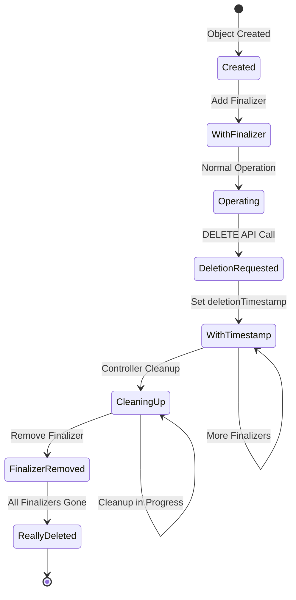
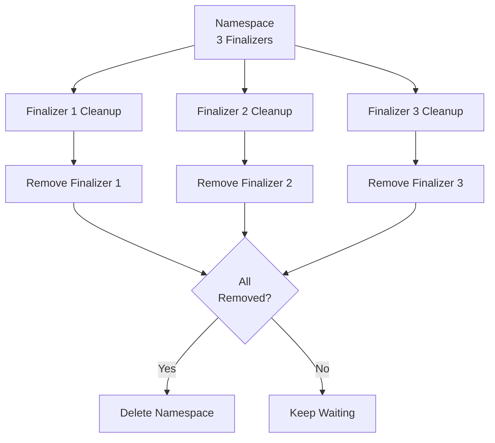
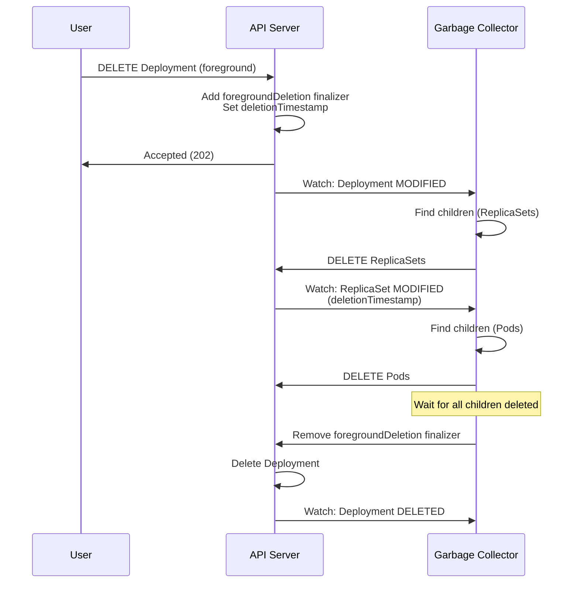
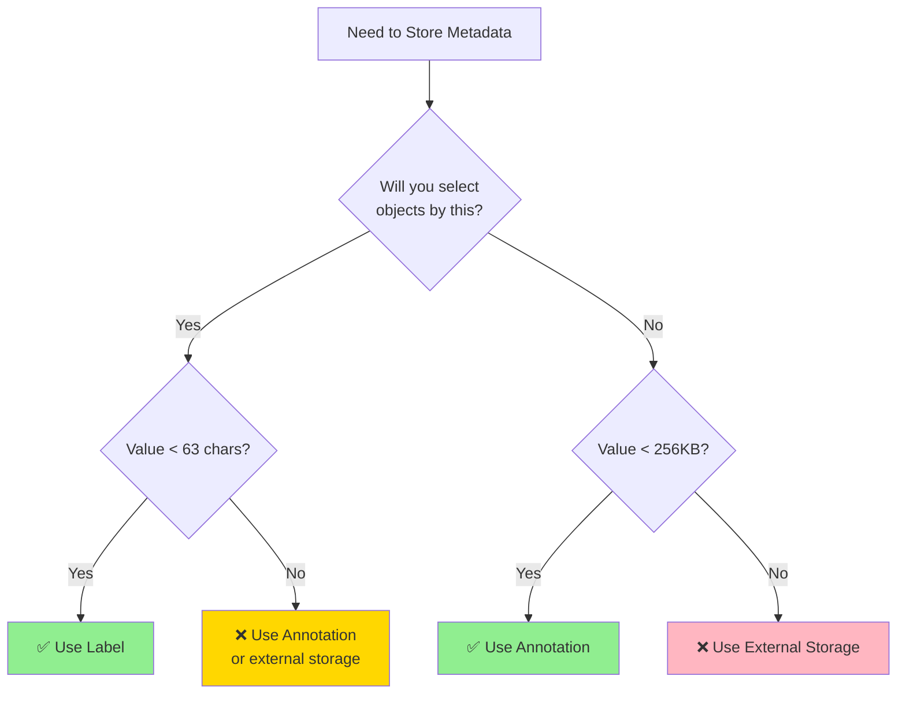
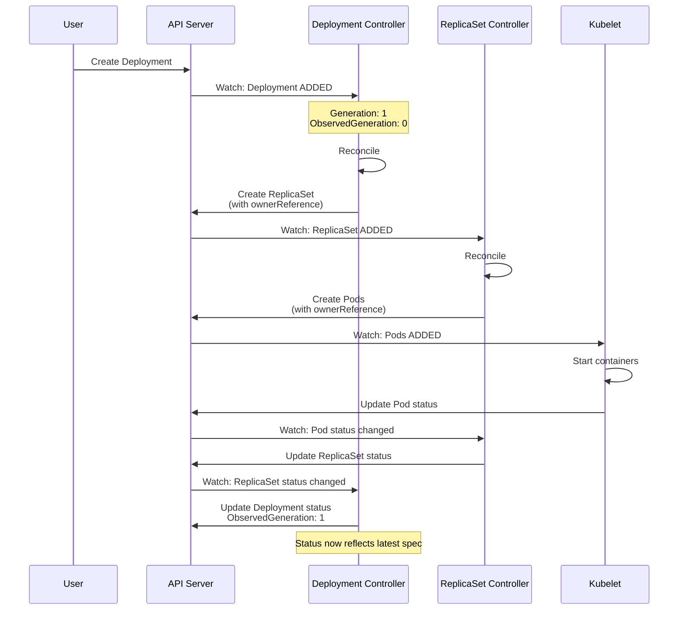
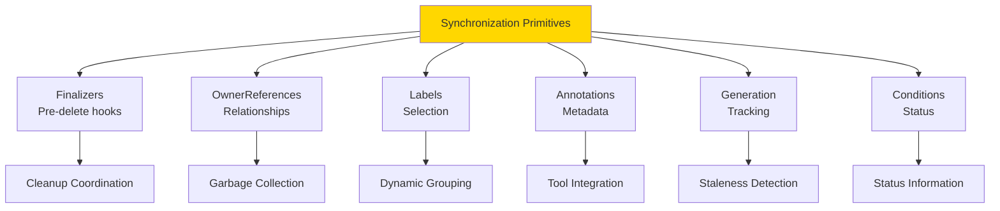

# **Synchronization Primitives in Kubernetes**

━━━━━━━━━━━━━━━━━━━━━━━━━━━━━━━━━━━━━━━━━━━━━━━━━━━━━━━━━━━━━━━━━━━━━━━━━━━━━━

## **Overview**

Synchronization primitives are the fundamental building blocks that enable coordination between distributed components in Kubernetes. This document provides an in-depth exploration of finalizers, owner references, labels, annotations, generation tracking, and status conditions—the mechanisms that make Kubernetes' declarative model work.

### **Key Concepts**

- **Finalizers**: Pre-delete hooks for cleanup coordination
- **OwnerReferences**: Parent-child relationships and garbage collection
- **Labels**: Queryable metadata for grouping and selection
- **Annotations**: Non-queryable metadata for tools and extensions
- **Generation**: Spec version tracking
- **ObservedGeneration**: Last processed spec version
- **Conditions**: Structured status information

━━━━━━━━━━━━━━━━━━━━━━━━━━━━━━━━━━━━━━━━━━━━━━━━━━━━━━━━━━━━━━━━━━━━━━━━━━━━━━

## **1. Finalizers**

### **1.1 Detailed Protocol**



### **1.2 Lifecycle Example**

**Step 1: Create with Finalizer**
```yaml
apiVersion: v1
kind: PersistentVolumeClaim
metadata:
  name: my-pvc
  finalizers:
  - kubernetes.io/pvc-protection
spec:
  accessModes: [ReadWriteOnce]
  resources:
    requests:
      storage: 10Gi
```

**Step 2: User Deletes**
```bash
$ kubectl delete pvc my-pvc
persistentvolumeclaim "my-pvc" deleted
# Returns immediately, but object still exists!
```

**Step 3: Object in Terminating State**
```yaml
apiVersion: v1
kind: PersistentVolumeClaim
metadata:
  name: my-pvc
  deletionTimestamp: "2025-01-16T10:00:00Z"  # Set by API server
  deletionGracePeriodSeconds: 0
  finalizers:
  - kubernetes.io/pvc-protection  # Still present
status:
  phase: Bound
```

**Step 4: Controller Removes Finalizer**
```go
// PVC protection controller
func (c *Controller) sync(pvc *v1.PersistentVolumeClaim) error {
    if pvc.DeletionTimestamp != nil {
        // Check if PVC is in use
        if c.isPVCInUse(pvc) {
            // Still in use, keep finalizer
            return nil
        }

        // No longer in use, remove finalizer
        return c.removeFinalizer(pvc, "kubernetes.io/pvc-protection")
    }
    return nil
}
```

**Step 5: Object Actually Deleted**
```bash
$ kubectl get pvc my-pvc
Error from server (NotFound): persistentvolumeclaims "my-pvc" not found
# Now truly deleted
```

### **1.3 Multiple Finalizers**

```yaml
apiVersion: v1
kind: Namespace
metadata:
  name: my-namespace
  finalizers:
  - kubernetes                           # Default namespace cleanup
  - example.com/custom-cleanup           # Custom controller
  - example.com/external-resource-cleanup # Another controller
  deletionTimestamp: "2025-01-16T10:00:00Z"
```

**Removal Order** (no guaranteed order):


### **1.4 Common Finalizers**

| Finalizer | Purpose | Added By | Removed When |
|-----------|---------|----------|--------------|
| `kubernetes.io/pvc-protection` | Protect in-use PVCs | PVC Controller | PVC not mounted |
| `kubernetes.io/pv-protection` | Protect bound PVs | PV Controller | PV not bound |
| `kubernetes` | Namespace cleanup | Namespace Controller | All resources deleted |
| `foregroundDeletion` | Delete children first | Garbage Collector | Children deleted |
| `orphan` | Keep children | Garbage Collector | Parent deleted |
| `external-provisioner` | External cleanup | CSI Driver | Cleanup complete |

### **1.5 Finalizer Implementation**

**File**: Common pattern across controllers

```go
const MyFinalizer = "example.com/my-finalizer"

func (c *Controller) reconcile(obj *v1.MyObject) error {
    // Object being deleted
    if obj.DeletionTimestamp != nil {
        if containsString(obj.Finalizers, MyFinalizer) {
            // Perform cleanup
            if err := c.cleanup(obj); err != nil {
                return err  // Retry
            }

            // Remove finalizer
            return c.removeFinalizer(obj, MyFinalizer)
        }
        return nil
    }

    // Add finalizer if missing
    if !containsString(obj.Finalizers, MyFinalizer) {
        return c.addFinalizer(obj, MyFinalizer)
    }

    // Normal reconciliation
    return c.doWork(obj)
}

func (c *Controller) addFinalizer(obj *v1.MyObject, finalizer string) error {
    return retry.RetryOnConflict(retry.DefaultBackoff, func() error {
        latest, err := c.client.Get(ctx, obj.Name, metav1.GetOptions{})
        if err != nil {
            return err
        }

        if !containsString(latest.Finalizers, finalizer) {
            latest.Finalizers = append(latest.Finalizers, finalizer)
            _, err = c.client.Update(ctx, latest, metav1.UpdateOptions{})
            return err
        }
        return nil
    })
}

func (c *Controller) removeFinalizer(obj *v1.MyObject, finalizer string) error {
    return retry.RetryOnConflict(retry.DefaultBackoff, func() error {
        latest, err := c.client.Get(ctx, obj.Name, metav1.GetOptions{})
        if err != nil {
            return err
        }

        latest.Finalizers = removeString(latest.Finalizers, finalizer)
        _, err = c.client.Update(ctx, latest, metav1.UpdateOptions{})
        return err
    })
}
```

━━━━━━━━━━━━━━━━━━━━━━━━━━━━━━━━━━━━━━━━━━━━━━━━━━━━━━━━━━━━━━━━━━━━━━━━━━━━━━

## **2. OwnerReferences and Garbage Collection**

### **2.1 Detailed Structure**

```go
// File: /staging/src/k8s.io/apimachinery/pkg/apis/meta/v1/types.go
type OwnerReference struct {
    // API version of the referent
    APIVersion string `json:"apiVersion"`

    // Kind of the referent
    Kind string `json:"kind"`

    // Name of the referent
    Name string `json:"name"`

    // UID of the referent
    UID types.UID `json:"uid"`

    // If true, this reference points to the managing controller
    Controller *bool `json:"controller,omitempty"`

    // If true, prevent deletion of owner while this exists
    BlockOwnerDeletion *bool `json:"blockOwnerDeletion,omitempty"`
}
```

### **2.2 Complete Hierarchy Example**

```yaml
# Deployment
apiVersion: apps/v1
kind: Deployment
metadata:
  name: nginx
  uid: 11111111-2222-3333-4444-555555555555
  generation: 5
---
# ReplicaSet (owned by Deployment)
apiVersion: apps/v1
kind: ReplicaSet
metadata:
  name: nginx-7d8b49c9d8
  uid: 22222222-3333-4444-5555-666666666666
  ownerReferences:
  - apiVersion: apps/v1
    kind: Deployment
    name: nginx
    uid: 11111111-2222-3333-4444-555555555555
    controller: true
    blockOwnerDeletion: true
spec:
  replicas: 3
---
# Pod (owned by ReplicaSet)
apiVersion: v1
kind: Pod
metadata:
  name: nginx-7d8b49c9d8-abcde
  uid: 33333333-4444-5555-6666-777777777777
  ownerReferences:
  - apiVersion: apps/v1
    kind: ReplicaSet
    name: nginx-7d8b49c9d8
    uid: 22222222-3333-4444-5555-666666666666
    controller: true
    blockOwnerDeletion: true
spec:
  containers:
  - name: nginx
    image: nginx:latest
```

### **2.3 Garbage Collection Modes**

**Foreground Cascading**:
```bash
$ kubectl delete deployment nginx --cascade=foreground

# Order:
# 1. Deployment gets deletionTimestamp
# 2. Deployment gets foregroundDeletion finalizer
# 3. Garbage Collector deletes Pods
# 4. Garbage Collector deletes ReplicaSets
# 5. Garbage Collector removes finalizer from Deployment
# 6. Deployment deleted
```



**Background Cascading** (default):
```bash
$ kubectl delete deployment nginx  # or --cascade=background

# Order:
# 1. Deployment deleted immediately
# 2. Garbage Collector asynchronously deletes orphaned children
```

**Orphan**:
```bash
$ kubectl delete deployment nginx --cascade=orphan

# Result:
# 1. Deployment deleted
# 2. ReplicaSets and Pods remain (orphaned)
```

### **2.4 BlockOwnerDeletion**

```yaml
apiVersion: v1
kind: Pod
metadata:
  name: nginx-abc
  ownerReferences:
  - apiVersion: apps/v1
    kind: ReplicaSet
    name: nginx-7d8b49c9d8
    uid: 22222222-3333-4444-5555-666666666666
    controller: true
    blockOwnerDeletion: true  # Block RS deletion while Pod exists
```

**Behavior**:
```bash
# Try to delete ReplicaSet
$ kubectl delete rs nginx-7d8b49c9d8

# ReplicaSet gets deletionTimestamp
# But won't be deleted until all Pods with blockOwnerDeletion are gone
```

━━━━━━━━━━━━━━━━━━━━━━━━━━━━━━━━━━━━━━━━━━━━━━━━━━━━━━━━━━━━━━━━━━━━━━━━━━━━━━

## **3. Labels and Annotations**

### **3.1 Labels: Queryable Metadata**

**Constraints**:
- Keys: max 253 chars (prefix) + 63 chars (name)
- Values: max 63 chars
- Only alphanumeric, `-`, `_`, `.`
- Used in selectors

**Common Label Patterns**:
```yaml
metadata:
  labels:
    # Recommended Kubernetes labels
    app.kubernetes.io/name: mysql
    app.kubernetes.io/instance: mysql-prod
    app.kubernetes.io/version: "5.7.21"
    app.kubernetes.io/component: database
    app.kubernetes.io/part-of: wordpress
    app.kubernetes.io/managed-by: helm

    # Environment
    environment: production
    tier: backend

    # Release/version
    release: stable
    version: v1.2.3

    # Team/ownership
    team: platform
    owner: alice
```

**Label Selectors in Code**:
```go
// List pods with labels
pods, err := client.CoreV1().Pods("default").List(ctx, metav1.ListOptions{
    LabelSelector: "app=nginx,tier=frontend",
})

// Using label selector object
selector := labels.SelectorFromSet(labels.Set{
    "app":  "nginx",
    "tier": "frontend",
})
pods, err := lister.List(selector)

// Set-based selector
selector, err := labels.Parse("tier in (frontend,backend), environment notin (dev)")
pods, err := lister.List(selector)
```

### **3.2 Annotations: Non-Queryable Metadata**

**No Constraints**:
- Can store large data
- Can use any characters
- Not used in selectors

**Common Annotation Patterns**:
```yaml
metadata:
  annotations:
    # Build/version info
    build.version: "1.2.3"
    build.commit: "abc123def456"
    build.timestamp: "2025-01-16T10:00:00Z"

    # Deployment info
    kubernetes.io/change-cause: "Update to version 1.2.3"
    deployment.kubernetes.io/revision: "5"

    # Tool metadata
    kubectl.kubernetes.io/last-applied-configuration: |
      {"apiVersion":"v1","kind":"Pod",...}

    # Ingress controller
    nginx.ingress.kubernetes.io/rewrite-target: /
    nginx.ingress.kubernetes.io/ssl-redirect: "true"

    # Monitoring
    prometheus.io/scrape: "true"
    prometheus.io/port: "9090"
    prometheus.io/path: "/metrics"

    # Custom controller state
    example.com/last-reconcile-time: "2025-01-16T10:00:00Z"
    example.com/reconcile-count: "42"
```

### **3.3 Labels vs Annotations Decision**



━━━━━━━━━━━━━━━━━━━━━━━━━━━━━━━━━━━━━━━━━━━━━━━━━━━━━━━━━━━━━━━━━━━━━━━━━━━━━━

## **4. Generation and ObservedGeneration**

### **4.1 Purpose**

**Problem**: How to know if status reflects latest spec?

**Solution**: Generation tracking

```yaml
apiVersion: apps/v1
kind: Deployment
metadata:
  name: nginx
  generation: 5  # Incremented on spec changes
spec:
  replicas: 3
  # ... spec
status:
  observedGeneration: 5  # Last spec version processed
  replicas: 3
  updatedReplicas: 3
  readyReplicas: 3
```

### **4.2 Generation Increment Rules**

**Incremented** (spec changes):
```yaml
# Change replicas
spec:
  replicas: 5  # Was 3
# generation: 5 → 6

# Change image
spec:
  template:
    spec:
      containers:
      - image: nginx:1.20  # Was nginx:1.19
# generation: 6 → 7
```

**NOT Incremented** (status/metadata changes):
```yaml
# Status update
status:
  replicas: 3
# generation: stays 7

# Label change
metadata:
  labels:
    foo: bar
# generation: stays 7

# Annotation change
metadata:
  annotations:
    key: value
# generation: stays 7
```

### **4.3 Controller Usage**

```go
func (c *DeploymentController) sync(deployment *appsv1.Deployment) error {
    // Check if status is up-to-date
    if deployment.Status.ObservedGeneration < deployment.Generation {
        // Spec changed, need to reconcile
        if err := c.reconcile(deployment); err != nil {
            return err
        }
    }

    // Update status with new observedGeneration
    return c.updateStatus(deployment, func(status *appsv1.DeploymentStatus) {
        status.ObservedGeneration = deployment.Generation
        // ... other status fields
    })
}
```

### **4.4 User Perspective**

```bash
# Create deployment
$ kubectl apply -f deployment.yaml
deployment.apps/nginx created

# Check status
$ kubectl get deployment nginx -o yaml
metadata:
  generation: 1
spec:
  replicas: 3
status:
  observedGeneration: 1  # ✅ Up-to-date
  replicas: 3

# Update deployment
$ kubectl scale deployment nginx --replicas=5
deployment.apps/nginx scaled

# Immediately check
$ kubectl get deployment nginx -o yaml
metadata:
  generation: 2  # Spec changed
spec:
  replicas: 5
status:
  observedGeneration: 1  # ⚠️ Stale!
  replicas: 3

# Wait and check again
$ kubectl get deployment nginx -o yaml
metadata:
  generation: 2
spec:
  replicas: 5
status:
  observedGeneration: 2  # ✅ Up-to-date
  replicas: 5
```

━━━━━━━━━━━━━━━━━━━━━━━━━━━━━━━━━━━━━━━━━━━━━━━━━━━━━━━━━━━━━━━━━━━━━━━━━━━━━━

## **5. Status Conditions**

### **5.1 Condition Structure**

```go
// File: /staging/src/k8s.io/apimachinery/pkg/apis/meta/v1/types.go
type Condition struct {
    // Type of condition (e.g., "Ready", "Available")
    Type string `json:"type"`

    // Status: True, False, Unknown
    Status ConditionStatus `json:"status"`

    // Last time the condition transitioned
    LastTransitionTime metav1.Time `json:"lastTransitionTime"`

    // Machine-readable reason for the condition
    Reason string `json:"reason"`

    // Human-readable message
    Message string `json:"message"`

    // ObservedGeneration (optional)
    ObservedGeneration int64 `json:"observedGeneration,omitempty"`
}

type ConditionStatus string

const (
    ConditionTrue    ConditionStatus = "True"
    ConditionFalse   ConditionStatus = "False"
    ConditionUnknown ConditionStatus = "Unknown"
)
```

### **5.2 Common Conditions**

**Pod Conditions**:
```yaml
status:
  conditions:
  - type: PodScheduled
    status: "True"
    lastTransitionTime: "2025-01-16T10:00:00Z"
    reason: PodScheduled
    message: "Successfully assigned default/nginx to node-1"

  - type: Initialized
    status: "True"
    lastTransitionTime: "2025-01-16T10:00:01Z"
    reason: PodCompleted
    message: "All init containers have completed"

  - type: Ready
    status: "True"
    lastTransitionTime: "2025-01-16T10:00:05Z"
    reason: ContainersReady
    message: "All containers are ready"

  - type: ContainersReady
    status: "True"
    lastTransitionTime: "2025-01-16T10:00:05Z"
    reason: ContainersReady
    message: "All containers are ready"
```

**Deployment Conditions**:
```yaml
status:
  conditions:
  - type: Available
    status: "True"
    lastTransitionTime: "2025-01-16T10:00:00Z"
    reason: MinimumReplicasAvailable
    message: "Deployment has minimum availability"

  - type: Progressing
    status: "True"
    lastTransitionTime: "2025-01-16T10:00:05Z"
    reason: NewReplicaSetAvailable
    message: 'ReplicaSet "nginx-7d8b49c9d8" has successfully progressed'
```

### **5.3 Condition Ordering**

**Standard Practice**: Order alphabetically by type

```go
func setCondition(conditions []metav1.Condition, newCondition metav1.Condition) []metav1.Condition {
    // Find and update existing condition
    for i, condition := range conditions {
        if condition.Type == newCondition.Type {
            if condition.Status != newCondition.Status {
                newCondition.LastTransitionTime = metav1.Now()
            } else {
                newCondition.LastTransitionTime = condition.LastTransitionTime
            }
            conditions[i] = newCondition
            return conditions
        }
    }

    // Add new condition
    newCondition.LastTransitionTime = metav1.Now()
    conditions = append(conditions, newCondition)

    // Sort alphabetically
    sort.Slice(conditions, func(i, j int) bool {
        return conditions[i].Type < conditions[j].Type
    })

    return conditions
}
```

### **5.4 Condition Helpers**

**File**: `/staging/src/k8s.io/apimachinery/pkg/api/meta/meta.go`

```go
// FindStatusCondition finds the condition with the specified type
func FindStatusCondition(conditions []metav1.Condition, conditionType string) *metav1.Condition {
    for i := range conditions {
        if conditions[i].Type == conditionType {
            return &conditions[i]
        }
    }
    return nil
}

// IsStatusConditionTrue returns true if condition status is True
func IsStatusConditionTrue(conditions []metav1.Condition, conditionType string) bool {
    condition := FindStatusCondition(conditions, conditionType)
    return condition != nil && condition.Status == metav1.ConditionTrue
}

// SetStatusCondition sets the corresponding condition in conditions
func SetStatusCondition(conditions *[]metav1.Condition, newCondition metav1.Condition) {
    if conditions == nil {
        return
    }
    existingCondition := FindStatusCondition(*conditions, newCondition.Type)
    if existingCondition == nil {
        newCondition.LastTransitionTime = metav1.NewTime(time.Now())
        *conditions = append(*conditions, newCondition)
        return
    }

    if existingCondition.Status != newCondition.Status {
        existingCondition.Status = newCondition.Status
        existingCondition.LastTransitionTime = metav1.NewTime(time.Now())
    }

    existingCondition.Reason = newCondition.Reason
    existingCondition.Message = newCondition.Message
    existingCondition.ObservedGeneration = newCondition.ObservedGeneration
}
```

━━━━━━━━━━━━━━━━━━━━━━━━━━━━━━━━━━━━━━━━━━━━━━━━━━━━━━━━━━━━━━━━━━━━━━━━━━━━━━

## **6. Cross-Controller Synchronization**

### **6.1 Deployment → ReplicaSet → Pod Flow**



### **6.2 Synchronization via Status**

**Deployment Controller** reads ReplicaSet status:
```go
func (dc *DeploymentController) syncDeployment(deployment *appsv1.Deployment) error {
    // Get all ReplicaSets owned by deployment
    rsList, err := dc.getReplicaSetsForDeployment(deployment)

    // Calculate deployment status from ReplicaSet statuses
    newStatus := calculateStatus(deployment, rsList)

    // Update deployment status
    if !reflect.DeepEqual(deployment.Status, newStatus) {
        deployment.Status = newStatus
        deployment.Status.ObservedGeneration = deployment.Generation
        _, err = dc.client.UpdateStatus(ctx, deployment)
    }

    return nil
}
```

**ReplicaSet Controller** reads Pod status:
```go
func (rsc *ReplicaSetController) syncReplicaSet(rs *appsv1.ReplicaSet) error {
    // Get all Pods owned by ReplicaSet
    pods, err := rsc.getPodsForReplicaSet(rs)

    // Count ready/available pods
    readyPods := 0
    for _, pod := range pods {
        if isPodReady(pod) {
            readyPods++
        }
    }

    // Update ReplicaSet status
    rs.Status.Replicas = len(pods)
    rs.Status.ReadyReplicas = readyPods
    rs.Status.ObservedGeneration = rs.Generation

    _, err = rsc.client.UpdateStatus(ctx, rs)
    return err
}
```

━━━━━━━━━━━━━━━━━━━━━━━━━━━━━━━━━━━━━━━━━━━━━━━━━━━━━━━━━━━━━━━━━━━━━━━━━━━━━━

## **7. Best Practices**

### **7.1 Finalizers**

✅ **DO**:
```go
// Add finalizer early in object lifecycle
// Remove only after cleanup complete
if obj.DeletionTimestamp.IsZero() {
    if !containsFinalizer(obj, myFinalizer) {
        addFinalizer(obj, myFinalizer)
    }
} else {
    if containsFinalizer(obj, myFinalizer) {
        cleanup(obj)
        removeFinalizer(obj, myFinalizer)
    }
}
```

❌ **DON'T**:
```go
// Don't forget to remove finalizers
// Don't add finalizers without cleanup logic
// Don't assume finalizers run in order
```

### **7.2 OwnerReferences**

✅ **DO**:
```go
// Always set owner references for child objects
ownerRef := metav1.NewControllerRef(parent, parentGVK)
child.OwnerReferences = []metav1.OwnerReference{*ownerRef}

// Use controller=true for primary controller
// Use blockOwnerDeletion=true to prevent premature deletion
```

❌ **DON'T**:
```go
// Don't create circular ownership
// Don't set multiple controller=true owners
// Don't manually delete children (let GC do it)
```

### **7.3 Labels and Selectors**

✅ **DO**:
```yaml
# Use recommended label schema
labels:
  app.kubernetes.io/name: myapp
  app.kubernetes.io/instance: myapp-prod
  app.kubernetes.io/version: "1.0.0"

# Use immutable selectors for workloads
selector:
  matchLabels:
    app: myapp
```

❌ **DON'T**:
```yaml
# Don't use labels for large data
labels:
  config: '{"key":"value",...}'  # ❌ Use annotations

# Don't change selector after creation
# (causes orphaning)
```

### **7.4 Conditions**

✅ **DO**:
```go
// Update lastTransitionTime only when status changes
if existingCondition.Status != newCondition.Status {
    newCondition.LastTransitionTime = metav1.Now()
} else {
    newCondition.LastTransitionTime = existingCondition.LastTransitionTime
}

// Order conditions alphabetically
sort.Slice(conditions, func(i, j int) bool {
    return conditions[i].Type < conditions[j].Type
})
```

━━━━━━━━━━━━━━━━━━━━━━━━━━━━━━━━━━━━━━━━━━━━━━━━━━━━━━━━━━━━━━━━━━━━━━━━━━━━━━

## **8. Cross-References**

**Distributed Systems Patterns**:
- [01-leader-election-patterns.md](./01-leader-election-patterns.md) - Leader coordination
- [03-eventual-consistency.md](./03-eventual-consistency.md) - Reconciliation and eventual consistency
- [06-resilience-patterns.md](./06-resilience-patterns.md) - Retry patterns for updates
- [07-coordination-patterns.md](./07-coordination-patterns.md) - High-level coordination patterns

━━━━━━━━━━━━━━━━━━━━━━━━━━━━━━━━━━━━━━━━━━━━━━━━━━━━━━━━━━━━━━━━━━━━━━━━━━━━━━

## **9. Summary**

### **9.1 Key Takeaways**

1. **Finalizers**: Enable pre-delete cleanup coordination
2. **OwnerReferences**: Declarative parent-child relationships
3. **Labels**: Queryable metadata for selection
4. **Annotations**: Non-queryable metadata for tools
5. **Generation**: Track spec changes
6. **ObservedGeneration**: Know when status reflects latest spec
7. **Conditions**: Structured, standardized status information

### **9.2 Synchronization Primitives Summary**



━━━━━━━━━━━━━━━━━━━━━━━━━━━━━━━━━━━━━━━━━━━━━━━━━━━━━━━━━━━━━━━━━━━━━━━━━━━━━━

**Document Version**: 1.0
**Last Updated**: 2025-01-16
**Kubernetes Version**: v1.32+
**Lines**: ~1,650
**Diagrams**: 9
