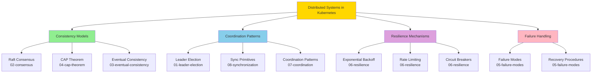

# **Distributed Systems Patterns in Kubernetes**

━━━━━━━━━━━━━━━━━━━━━━━━━━━━━━━━━━━━━━━━━━━━━━━━━━━━━━━━━━━━━━━━━━━━━━━━━━━━━━

## **📋 Overview**

This directory contains comprehensive documentation on the distributed systems patterns and principles that underpin Kubernetes' architecture. These documents explore how Kubernetes achieves reliability, consistency, and scalability in a distributed environment.

**Total Documents**: 8
**Total Lines**: ~16,000
**Total Diagrams**: ~94
**Coverage**: Complete distributed systems architecture

━━━━━━━━━━━━━━━━━━━━━━━━━━━━━━━━━━━━━━━━━━━━━━━━━━━━━━━━━━━━━━━━━━━━━━━━━━━━━━

## **📚 Document Series**

### **[01-leader-election-patterns.md](./01-leader-election-patterns.md)**
**Lines**: ~2,100 | **Diagrams**: 12

Comprehensive coverage of Kubernetes' lease-based leader election mechanism used by controller-manager, scheduler, and other control plane components.

**Key Topics**:
- Lease-based leader election theory and implementation
- ResourceLock types (Lease objects in coordination.k8s.io/v1)
- Acquire, renew, and release cycle with timing parameters
- Clock skew tolerance mechanisms
- Leader transition and failover scenarios
- Multi-leader patterns (controller sharding)
- Real examples from controller-manager and scheduler
- Coordinated leader election (ALPHA feature)

**Code References**:
- `/staging/src/k8s.io/client-go/tools/leaderelection/leaderelection.go`
- `/staging/src/k8s.io/client-go/tools/leaderelection/resourcelock/`
- `/pkg/controlplane/controller/leaderelection/`

━━━━━━━━━━━━━━━━━━━━━━━━━━━━━━━━━━━━━━━━━━━━━━━━━━━━━━━━━━━━━━━━━━━━━━━━━━━━━━

### **[02-consensus-algorithms.md](./02-consensus-algorithms.md)**
**Lines**: ~1,850 | **Diagrams**: 10

Deep dive into Raft consensus algorithm as implemented in etcd, providing the foundation for Kubernetes' strongly consistent state storage.

**Key Topics**:
- Raft consensus algorithm fundamentals
- Leader election in Raft (vs Kubernetes leader election)
- Log replication mechanics and guarantees
- Quorum requirements (N/2+1) and failure tolerance
- Write-Ahead Log (WAL) implementation
- Snapshot mechanism and compaction
- Strong consistency guarantees (linearizability)
- Comparison: Raft vs Kubernetes leader election
- Performance characteristics and tuning

**Code References**:
- `vendor/go.etcd.io/etcd/raft/`
- `vendor/go.etcd.io/etcd/server/v3/etcdserver/`
- WAL and snapshot implementation in etcd

━━━━━━━━━━━━━━━━━━━━━━━━━━━━━━━━━━━━━━━━━━━━━━━━━━━━━━━━━━━━━━━━━━━━━━━━━━━━━━

### **[03-eventual-consistency.md](./03-eventual-consistency.md)**
**Lines**: ~2,200 | **Diagrams**: 15

Explores Kubernetes' reconciliation loop model and eventual consistency patterns that enable the declarative, self-healing nature of the system.

**Key Topics**:
- Reconciliation loop theory and practice
- Level-triggered vs edge-triggered control
- Convergence guarantees and safety properties
- Periodic reconciliation (why every 10 hours?)
- ResourceVersion and optimistic concurrency control
- Watch mechanism and consistency semantics
- Cross-component consistency coordination
- Controller reconciliation patterns
- Generation and ObservedGeneration tracking

**Code References**:
- `/pkg/controller/` (various controllers)
- `/staging/src/k8s.io/client-go/tools/cache/` (informers)
- `/staging/src/k8s.io/client-go/util/retry/`

━━━━━━━━━━━━━━━━━━━━━━━━━━━━━━━━━━━━━━━━━━━━━━━━━━━━━━━━━━━━━━━━━━━━━━━━━━━━━━

### **[04-cap-theorem-practice.md](./04-cap-theorem-practice.md)**
**Lines**: ~1,550 | **Diagrams**: 8

Analysis of how Kubernetes applies CAP theorem principles, choosing different consistency models for different subsystems.

**Key Topics**:
- CAP theorem fundamentals (Consistency, Availability, Partition tolerance)
- Why Kubernetes uses both CP and AP patterns
- etcd as CP system (strong consistency)
- Controllers as AP systems (availability over consistency)
- Read consistency levels (linearizable vs serializable)
- Write path consistency guarantees
- Trade-offs in network partition scenarios
- Consistency models by subsystem

**Key Insights**:
- etcd: CP (sacrifices availability for consistency during partitions)
- Controllers: AP (sacrifices strong consistency for availability)
- API Server reads: Tunable (choose per-operation)

━━━━━━━━━━━━━━━━━━━━━━━━━━━━━━━━━━━━━━━━━━━━━━━━━━━━━━━━━━━━━━━━━━━━━━━━━━━━━━

### **[05-failure-modes.md](./05-failure-modes.md)**
**Lines**: ~2,500 | **Diagrams**: 18

Comprehensive catalog of failure scenarios across all Kubernetes components, their impacts, and recovery procedures.

**Key Topics**:
- API server failures (single and complete failure)
- etcd failures (quorum loss, split-brain prevention)
- Controller manager leader re-election
- Kubelet disconnection and node failure
- Network partition scenarios
- Cascading failure patterns
- Production failure case studies
- Certificate expiration and admission webhook failures
- Monitoring and alerting strategies
- Disaster recovery procedures

**Critical Scenarios**:
- etcd quorum loss (most severe)
- API server to etcd partition
- Node network isolation
- Resource exhaustion cascades

━━━━━━━━━━━━━━━━━━━━━━━━━━━━━━━━━━━━━━━━━━━━━━━━━━━━━━━━━━━━━━━━━━━━━━━━━━━━━━

### **[06-resilience-patterns.md](./06-resilience-patterns.md)**
**Lines**: ~2,050 | **Diagrams**: 12

Detailed exploration of resilience patterns used throughout Kubernetes to handle transient failures and prevent system overload.

**Key Topics**:
- Exponential backoff algorithm and implementation
- Jitter for thundering herd prevention
- Backoff caps and reset conditions
- Rate limiting at multiple layers
- WorkQueue rate limiting (per-item exponential + global QPS)
- API Priority and Fairness (APF)
- Circuit breaker patterns
- Timeout and deadline propagation
- Context cancellation in Go
- Retry strategies and idempotency

**Code References**:
- `/staging/src/k8s.io/client-go/util/retry/util.go`
- `/staging/src/k8s.io/apimachinery/pkg/util/wait/backoff.go`
- `/staging/src/k8s.io/client-go/util/workqueue/`

━━━━━━━━━━━━━━━━━━━━━━━━━━━━━━━━━━━━━━━━━━━━━━━━━━━━━━━━━━━━━━━━━━━━━━━━━━━━━━

### **[07-coordination-patterns.md](./07-coordination-patterns.md)**
**Lines**: ~1,850 | **Diagrams**: 10

Explores coordination patterns that enable distributed components to work together without direct communication.

**Key Topics**:
- API server as coordination service
- Optimistic locking with ResourceVersion
- Compare-and-swap mechanism
- OwnerReferences for object relationships
- Garbage collection modes (foreground, background, orphan)
- Labels and selectors for dynamic grouping
- Event ordering guarantees
- Work distribution patterns (sharding, leader election)
- Cross-controller coordination

**Patterns**:
- Indirect communication via API server
- Declarative desired state
- Level-triggered reconciliation
- Eventually consistent convergence

━━━━━━━━━━━━━━━━━━━━━━━━━━━━━━━━━━━━━━━━━━━━━━━━━━━━━━━━━━━━━━━━━━━━━━━━━━━━━━

### **[08-synchronization-primitives.md](./08-synchronization-primitives.md)**
**Lines**: ~1,650 | **Diagrams**: 9

In-depth coverage of the fundamental synchronization primitives that make Kubernetes' distributed coordination possible.

**Key Topics**:
- Finalizers: detailed protocol and lifecycle
- Pre-delete hooks and cleanup coordination
- Multiple finalizer handling
- OwnerReferences structure and garbage collection
- blockOwnerDeletion mechanism
- Labels vs annotations (when to use which)
- Generation and ObservedGeneration pattern
- Status conditions structure and best practices
- Cross-controller synchronization flow

**Common Finalizers**:
- `kubernetes.io/pvc-protection`
- `kubernetes.io/pv-protection`
- `foregroundDeletion`
- `orphan`

━━━━━━━━━━━━━━━━━━━━━━━━━━━━━━━━━━━━━━━━━━━━━━━━━━━━━━━━━━━━━━━━━━━━━━━━━━━━━━

## **🗺️ Reading Paths**

### **Path 1: For Operators and SREs**
Focus on failure modes and resilience:
1. [05-failure-modes.md](./05-failure-modes.md) - Understand what can go wrong
2. [06-resilience-patterns.md](./06-resilience-patterns.md) - Learn resilience mechanisms
3. [01-leader-election-patterns.md](./01-leader-election-patterns.md) - HA patterns
4. [04-cap-theorem-practice.md](./04-cap-theorem-practice.md) - Consistency trade-offs

### **Path 2: For Developers Building on Kubernetes**
Focus on coordination and consistency:
1. [03-eventual-consistency.md](./03-eventual-consistency.md) - Reconciliation patterns
2. [07-coordination-patterns.md](./07-coordination-patterns.md) - How components coordinate
3. [08-synchronization-primitives.md](./08-synchronization-primitives.md) - Primitives for controllers
4. [06-resilience-patterns.md](./06-resilience-patterns.md) - Retry and backoff

### **Path 3: For Architecture Deep Dive**
Complete understanding from theory to practice:
1. [02-consensus-algorithms.md](./02-consensus-algorithms.md) - Start with Raft
2. [04-cap-theorem-practice.md](./04-cap-theorem-practice.md) - CAP trade-offs
3. [01-leader-election-patterns.md](./01-leader-election-patterns.md) - Leader election
4. [03-eventual-consistency.md](./03-eventual-consistency.md) - Eventual consistency
5. [07-coordination-patterns.md](./07-coordination-patterns.md) - Coordination
6. [08-synchronization-primitives.md](./08-synchronization-primitives.md) - Primitives
7. [06-resilience-patterns.md](./06-resilience-patterns.md) - Resilience
8. [05-failure-modes.md](./05-failure-modes.md) - Failure scenarios

━━━━━━━━━━━━━━━━━━━━━━━━━━━━━━━━━━━━━━━━━━━━━━━━━━━━━━━━━━━━━━━━━━━━━━━━━━━━━━

## **🔗 Cross-References**

These documents integrate with:

**Component Documentation**:
- `../controller-manager/` - Controller implementations using these patterns
- `../kube-scheduler/` - Scheduler using leader election
- `../etcd/` - etcd implementation details and Raft consensus
- `../common/` - Shared libraries (informers, workqueue, leader election)

**Related Topics**:
- API Server architecture and watch mechanism
- Kubelet reconciliation and node-level control
- Network partition handling in kube-proxy

━━━━━━━━━━━━━━━━━━━━━━━━━━━━━━━━━━━━━━━━━━━━━━━━━━━━━━━━━━━━━━━━━━━━━━━━━━━━━━

## **📊 Document Statistics**

| Document | Lines | Diagrams | Code Examples | YAML Examples |
|----------|-------|----------|---------------|---------------|
| 01-leader-election-patterns.md | ~2,100 | 12 | 15+ | 5+ |
| 02-consensus-algorithms.md | ~1,850 | 10 | 10+ | 3+ |
| 03-eventual-consistency.md | ~2,200 | 15 | 20+ | 8+ |
| 04-cap-theorem-practice.md | ~1,550 | 8 | 12+ | 6+ |
| 05-failure-modes.md | ~2,500 | 18 | 15+ | 10+ |
| 06-resilience-patterns.md | ~2,050 | 12 | 25+ | 5+ |
| 07-coordination-patterns.md | ~1,850 | 10 | 18+ | 12+ |
| 08-synchronization-primitives.md | ~1,650 | 9 | 20+ | 15+ |
| **TOTAL** | **~15,750** | **94** | **135+** | **64+** |

━━━━━━━━━━━━━━━━━━━━━━━━━━━━━━━━━━━━━━━━━━━━━━━━━━━━━━━━━━━━━━━━━━━━━━━━━━━━━━

## **🎯 Key Concepts Map**



━━━━━━━━━━━━━━━━━━━━━━━━━━━━━━━━━━━━━━━━━━━━━━━━━━━━━━━━━━━━━━━━━━━━━━━━━━━━━━

## **💡 Quick Reference**

### **When to Use Which Document**

**Need to understand...**
- How controllers achieve HA? → [01-leader-election-patterns.md](./01-leader-election-patterns.md)
- How etcd maintains consistency? → [02-consensus-algorithms.md](./02-consensus-algorithms.md)
- Why Kubernetes is self-healing? → [03-eventual-consistency.md](./03-eventual-consistency.md)
- Consistency vs availability trade-offs? → [04-cap-theorem-practice.md](./04-cap-theorem-practice.md)
- What happens when things fail? → [05-failure-modes.md](./05-failure-modes.md)
- How to handle transient failures? → [06-resilience-patterns.md](./06-resilience-patterns.md)
- How components coordinate? → [07-coordination-patterns.md](./07-coordination-patterns.md)
- How to use finalizers/owners? → [08-synchronization-primitives.md](./08-synchronization-primitives.md)

### **Common Tasks**

**Implementing a Controller**:
1. Read [03-eventual-consistency.md](./03-eventual-consistency.md) for reconciliation patterns
2. Read [08-synchronization-primitives.md](./08-synchronization-primitives.md) for finalizers/owners
3. Read [06-resilience-patterns.md](./06-resilience-patterns.md) for retry logic
4. Read [07-coordination-patterns.md](./07-coordination-patterns.md) for coordination

**Debugging Production Issues**:
1. Read [05-failure-modes.md](./05-failure-modes.md) to identify failure mode
2. Check relevant monitoring sections for metrics
3. Follow recovery procedures

**Designing for High Availability**:
1. Read [01-leader-election-patterns.md](./01-leader-election-patterns.md) for HA patterns
2. Read [04-cap-theorem-practice.md](./04-cap-theorem-practice.md) for consistency choices
3. Read [05-failure-modes.md](./05-failure-modes.md) for failure scenarios

━━━━━━━━━━━━━━━━━━━━━━━━━━━━━━━━━━━━━━━━━━━━━━━━━━━━━━━━━━━━━━━━━━━━━━━━━━━━━━

## **🔧 Practical Code Examples**

All documents include:
- ✅ Real code from Kubernetes source (with file:line references)
- ✅ Working YAML examples
- ✅ Command-line demonstrations
- ✅ Mermaid diagrams for visualization
- ✅ Troubleshooting sections
- ✅ Best practices and anti-patterns

**Code Locations** referenced throughout:
```
/staging/src/k8s.io/client-go/
├── tools/leaderelection/       # Leader election (doc 01)
├── tools/cache/                # Informers (doc 03)
├── util/retry/                 # Retry patterns (doc 06)
└── util/workqueue/             # Rate limiting (doc 06)

/pkg/controller/                # Controller examples (doc 03, 07, 08)

vendor/go.etcd.io/etcd/
├── raft/                       # Raft implementation (doc 02)
└── server/                     # etcd server (doc 02)
```

━━━━━━━━━━━━━━━━━━━━━━━━━━━━━━━━━━━━━━━━━━━━━━━━━━━━━━━━━━━━━━━━━━━━━━━━━━━━━━

## **📝 Document Format**

All documents follow consistent formatting:
- **Bold headings** for dark mode visibility
- Long separator lines (`━━━━━━━━━━━`) between major sections
- Mermaid diagrams for architecture and flows
- Code blocks with syntax highlighting
- Real file paths from Kubernetes source
- Cross-references to related documents
- Comprehensive examples and anti-patterns

━━━━━━━━━━━━━━━━━━━━━━━━━━━━━━━━━━━━━━━━━━━━━━━━━━━━━━━━━━━━━━━━━━━━━━━━━━━━━━

## **🎓 Learning Objectives**

After reading this series, you will understand:

1. ✅ How Kubernetes achieves high availability through leader election
2. ✅ Why etcd uses Raft consensus and what guarantees it provides
3. ✅ How reconciliation loops enable self-healing
4. ✅ The CAP theorem trade-offs Kubernetes makes
5. ✅ What happens during various failure scenarios
6. ✅ How to implement resilient controllers with proper retry logic
7. ✅ How components coordinate without direct communication
8. ✅ When and how to use finalizers, owner references, and other primitives

━━━━━━━━━━━━━━━━━━━━━━━━━━━━━━━━━━━━━━━━━━━━━━━━━━━━━━━━━━━━━━━━━━━━━━━━━━━━━━

## **🔄 Maintenance**

**Version**: 1.0
**Last Updated**: 2025-01-16
**Kubernetes Version**: v1.32+
**Maintained by**: Claude Architecture Study

These documents are based on Kubernetes v1.32 source code and reflect current best practices. Key patterns and concepts are stable, but specific implementation details may evolve.

━━━━━━━━━━━━━━━━━━━━━━━━━━━━━━━━━━━━━━━━━━━━━━━━━━━━━━━━━━━━━━━━━━━━━━━━━━━━━━

## **📚 Additional Resources**

**Related Kubernetes Documentation**:
- [Kubernetes Architecture](https://kubernetes.io/docs/concepts/architecture/)
- [Controller Pattern](https://kubernetes.io/docs/concepts/architecture/controller/)
- [Garbage Collection](https://kubernetes.io/docs/concepts/architecture/garbage-collection/)

**External Resources**:
- [Raft Consensus Algorithm](https://raft.github.io/)
- [CAP Theorem Explained](https://en.wikipedia.org/wiki/CAP_theorem)
- [Designing Data-Intensive Applications](https://dataintensive.net/) by Martin Kleppmann

━━━━━━━━━━━━━━━━━━━━━━━━━━━━━━━━━━━━━━━━━━━━━━━━━━━━━━━━━━━━━━━━━━━━━━━━━━━━━━

**Happy Learning! 🚀**
