# etcd Integration in Kubernetes - Complete Architecture Guide

**Version**: 1.0
**Last Updated**: 2025-11-05
**Status**: 70% Complete (14/20 files)
**Audience**: Kubernetes operators, contributors, and SREs
**Scope**: Kubernetes-etcd integration architecture and operations

---

## 📊 Project Tracking & Navigation

**New to this documentation?** Start here:
- **[QUICK-REFERENCE.md](QUICK-REFERENCE.md)** - Fast navigation and topic index
- **[STATUS.md](STATUS.md)** - Current project status snapshot

**Progress tracking:**
- **[PROGRESS.md](PROGRESS.md)** - Detailed progress tracking (22K)
- **[METRICS.md](METRICS.md)** - Comprehensive metrics dashboard (12K)
- **[CHECKLIST.md](CHECKLIST.md)** - Phase completion checklist (12K)

**For contributors:**
- **[CONTINUE.md](CONTINUE.md)** - Next session instructions
- **[SESSION-4-SUMMARY.md](SESSION-4-SUMMARY.md)** - Latest session summary

---

## Table of Contents

- [Quick Start](#quick-start)
- [Introduction](#introduction)
- [What is etcd and Why Kubernetes Uses It](#what-is-etcd-and-why-kubernetes-uses-it)
- [Document Structure](#document-structure)
- [Learning Paths](#learning-paths)
- [Architecture Overview](#architecture-overview)
- [Key Concepts](#key-concepts)
- [Integration Points](#integration-points)
- [Getting Started with Different Roles](#getting-started-with-different-roles)
- [Common Use Cases](#common-use-cases)
- [Navigation Guide](#navigation-guide)
- [Cross-References](#cross-references)
- [Additional Resources](#additional-resources)

---

## Quick Start

### For Operators

If you're running a Kubernetes cluster and need to understand etcd operations:

1. Start with [01-REQUIREMENTS.md](01-REQUIREMENTS.md) - Understand why Kubernetes needs etcd
2. Read [high-level/01-etcd-overview.md](high-level/01-etcd-overview.md) - Learn etcd architecture
3. Study [middle-level/05-cluster-management.md](middle-level/05-cluster-management.md) - Cluster operations
4. Review [middle-level/06-backup-restore.md](middle-level/06-backup-restore.md) - Backup procedures
5. Reference [GLOSSARY.md](GLOSSARY.md) - Terms and definitions

**Estimated time**: 4-6 hours

### For Developers

If you're contributing to Kubernetes and need to understand the storage layer:

1. Read [02-FUNCTIONAL-SPEC.md](02-FUNCTIONAL-SPEC.md) - Functional specification
2. Study [high-level/02-kubernetes-integration.md](high-level/02-kubernetes-integration.md) - Integration patterns
3. Review [middle-level/01-storage-backend.md](middle-level/01-storage-backend.md) - Storage implementation
4. Examine [code-references/entry-points.md](code-references/entry-points.md) - Code navigation
5. Check [low-level/01-etcd3-client.md](low-level/01-etcd3-client.md) - Client usage

**Estimated time**: 6-8 hours

### For SREs

If you're responsible for cluster reliability and performance:

1. Review [01-REQUIREMENTS.md](01-REQUIREMENTS.md) - Performance and HA requirements
2. Study [middle-level/05-cluster-management.md](middle-level/05-cluster-management.md) - Cluster operations
3. Read [middle-level/07-performance-tuning.md](middle-level/07-performance-tuning.md) - Performance optimization
4. Check [middle-level/06-backup-restore.md](middle-level/06-backup-restore.md) - Disaster recovery
5. Review [middle-level/08-security.md](middle-level/08-security.md) - Security best practices

**Estimated time**: 5-7 hours

---

## Introduction

This documentation provides a comprehensive guide to etcd integration in Kubernetes. etcd is the distributed key-value store that serves as Kubernetes' database, storing all cluster state including:

- All Kubernetes API objects (Pods, Services, Deployments, etc.)
- Cluster configuration and secrets
- Resource metadata and status
- Watch event streams for real-time updates

Understanding etcd integration is critical for:

- **Operators**: Ensuring cluster availability and data durability
- **Contributors**: Implementing new Kubernetes features correctly
- **SREs**: Troubleshooting performance issues and disasters
- **Security Teams**: Securing the cluster's source of truth

### What This Documentation Covers

**Focus**: Kubernetes-etcd **integration**, not etcd internals

This means we cover:
- ✅ How Kubernetes uses etcd (storage backend, watch mechanism, etc.)
- ✅ etcd configuration for Kubernetes workloads
- ✅ Operations: backup, restore, compaction, performance tuning
- ✅ Integration patterns and best practices
- ✅ Code entry points in kube-apiserver

We **do not** deeply cover:
- ❌ etcd Raft consensus implementation details (see etcd docs)
- ❌ etcd server internal architecture (see etcd docs)
- ❌ Low-level etcd disk format (see etcd docs)

For etcd internals, please refer to the [official etcd documentation](https://etcd.io/docs/).

---

## What is etcd and Why Kubernetes Uses It

### etcd in 60 Seconds

**etcd** is a distributed, consistent key-value store that uses the Raft consensus algorithm. It provides:

```
┌─────────────────────────────────────────────────────────────┐
│                         etcd Cluster                         │
│  ┌──────────┐      ┌──────────┐      ┌──────────┐          │
│  │  Node 1  │◄────►│  Node 2  │◄────►│  Node 3  │          │
│  │ (Leader) │      │(Follower)│      │(Follower)│          │
│  └────┬─────┘      └──────────┘      └──────────┘          │
│       │                                                      │
│       │ Raft Consensus (ensures consistency)                │
│       │                                                      │
│  ┌────▼──────────────────────────────────────────────┐     │
│  │      Distributed Key-Value Store                   │     │
│  │  /registry/pods/default/nginx → {...pod data...}  │     │
│  │  /registry/services/kube-system/kube-dns → {...}  │     │
│  │  /registry/configmaps/default/app-config → {...}  │     │
│  └────────────────────────────────────────────────────┘     │
└─────────────────────────────────────────────────────────────┘
```

### Why Kubernetes Chose etcd

Kubernetes requires a storage system with specific characteristics:

| Requirement | Why Needed | How etcd Provides It |
|-------------|------------|----------------------|
| **Strong Consistency** | Avoid split-brain scenarios | Raft consensus algorithm |
| **High Availability** | Cluster must survive node failures | Multi-node quorum-based replication |
| **Watch Capability** | Real-time event notifications | Native watch API with revision-based streaming |
| **Atomic Transactions** | Update multiple resources atomically | Multi-version concurrency control (MVCC) + transactions |
| **Historical Queries** | Watch from any past revision | Revision-based history |
| **Distributed** | No single point of failure | Distributed cluster with leader election |

**Alternative considered**: While other databases were considered (e.g., ZooKeeper, Consul), etcd's simplicity, watch API, and strong consistency guarantees made it the best fit.

---

## Document Structure

This documentation is organized into phases, from high-level concepts to low-level implementation:

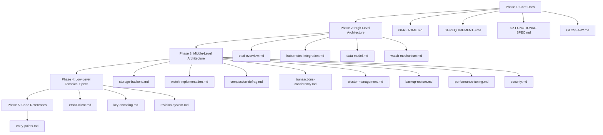

### Phase 1: Core Documentation

Foundational documents everyone should read:

- **00-README.md** (this file) - Navigation and overview
- **01-REQUIREMENTS.md** - Why etcd, requirements analysis
- **02-FUNCTIONAL-SPEC.md** - What etcd provides to Kubernetes
- **GLOSSARY.md** - Comprehensive terminology reference

### Phase 2: High-Level Architecture

System-level understanding:

- **high-level/01-etcd-overview.md** - etcd cluster architecture
- **high-level/02-kubernetes-integration.md** - How Kubernetes uses etcd
- **high-level/03-data-model.md** - Key-value organization
- **high-level/04-watch-mechanism.md** - Event notification architecture

### Phase 3: Middle-Level Architecture

Feature-specific deep dives:

- **middle-level/01-storage-backend.md** - etcd3 storage implementation
- **middle-level/02-watch-implementation.md** - Watch client integration
- **middle-level/03-compaction-defrag.md** - Data management
- **middle-level/04-transactions-consistency.md** - ACID properties
- **middle-level/05-cluster-management.md** - Cluster operations
- **middle-level/06-backup-restore.md** - Backup procedures
- **middle-level/07-performance-tuning.md** - Optimization techniques
- **middle-level/08-security.md** - Security configuration

### Phase 4: Low-Level Technical Specs

Implementation details:

- **low-level/01-etcd3-client.md** - Client library usage
- **low-level/02-key-encoding.md** - Data encoding
- **low-level/03-revision-system.md** - Revision mechanics

### Phase 5: Code References

Code navigation for contributors:

- **code-references/entry-points.md** - API server integration points

---

## Learning Paths

### Path 1: Understanding etcd for Cluster Operations

**Goal**: Operate and maintain etcd in production Kubernetes

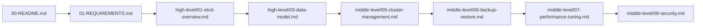

**Time**: ~6-8 hours
**Prerequisites**: Basic Kubernetes knowledge
**Outcome**: Can manage etcd clusters, perform backups, tune performance

### Path 2: Understanding Storage Backend for Development

**Goal**: Contribute to Kubernetes storage layer

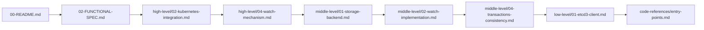

**Time**: ~8-10 hours
**Prerequisites**: Go programming, Kubernetes architecture
**Outcome**: Can modify storage backend, implement new features

### Path 3: Troubleshooting etcd Issues

**Goal**: Diagnose and fix etcd-related problems

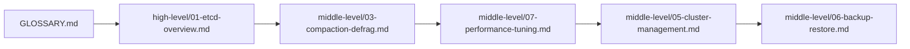

**Time**: ~4-5 hours
**Prerequisites**: Kubernetes operations experience
**Outcome**: Can diagnose performance issues, recover from failures

---

## Architecture Overview

### The Big Picture

Kubernetes uses etcd as its single source of truth. Here's how data flows:

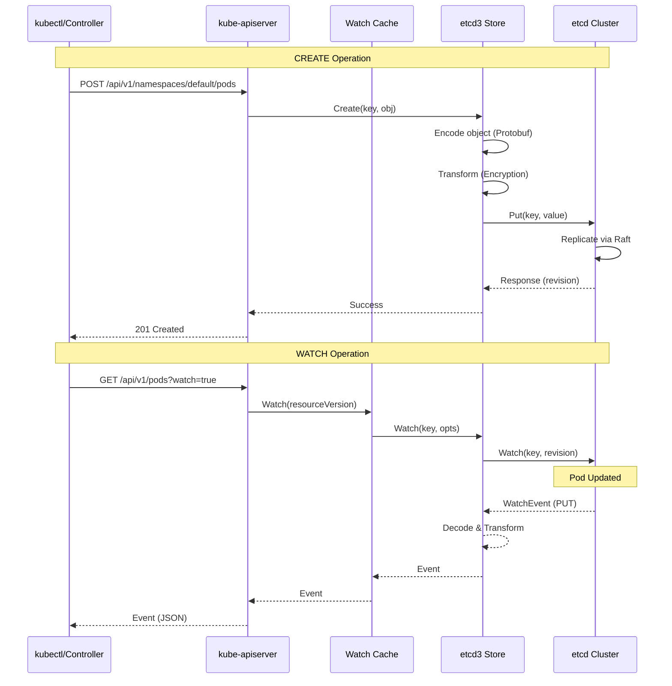

### Key Components

#### 1. kube-apiserver Storage Layer

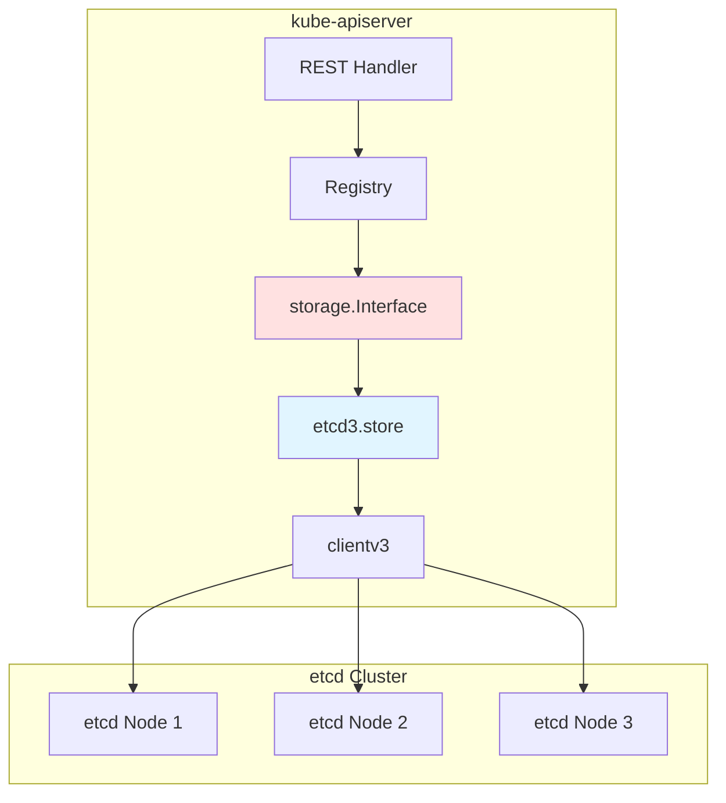

**Code Reference**: `staging/src/k8s.io/apiserver/pkg/storage/etcd3/store.go:148`

The storage layer abstracts etcd operations:
- `storage.Interface`: Generic storage abstraction
- `etcd3.store`: etcd3-specific implementation
- `clientv3`: etcd client library

#### 2. Watch Cache

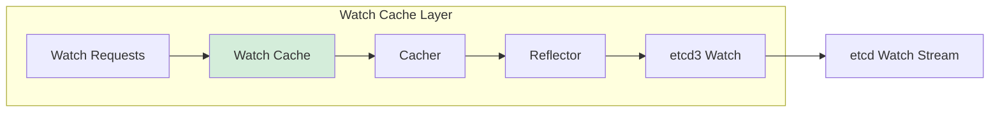

The watch cache reduces load on etcd by:
- Caching recent events in memory
- Serving watch requests from cache when possible
- Maintaining a sliding window of resource versions

**Benefits**:
- Reduced etcd load (critical for large clusters)
- Faster watch response times
- Lower network bandwidth usage

#### 3. etcd Cluster Architecture

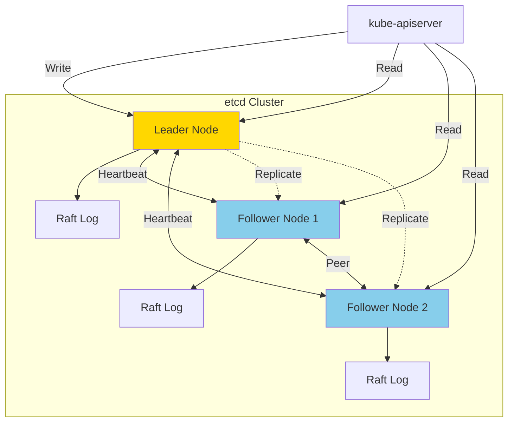

**Quorum**: Requires `(n/2)+1` nodes for consensus (e.g., 2 out of 3, 3 out of 5)

---

## Key Concepts

### 1. Key-Value Store Model

etcd stores data as key-value pairs. Kubernetes uses hierarchical keys:

```
/registry/
├── pods/
│   ├── default/
│   │   ├── nginx-pod
│   │   └── redis-pod
│   └── kube-system/
│       └── coredns-xyz
├── services/
│   └── default/
│       └── kubernetes
├── configmaps/
│   └── default/
│       └── app-config
└── secrets/
    └── default/
        └── db-password
```

**Key Format**: `/registry/{resource-type}/{namespace}/{name}`

**Example**:
```bash
# Key
/registry/pods/default/nginx

# Value (Protobuf-encoded Pod object)
k8s\x00\n\x03\x00Pod\x12\xa4\x06\n...
```

### 2. Revision System

etcd maintains a global revision counter that increments on every write:

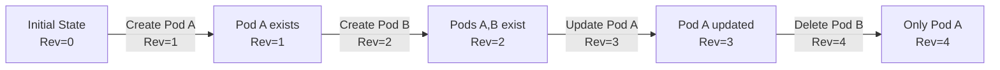

**Key Points**:
- Global counter across all keys (not per-key)
- Monotonically increasing (never decreases)
- Maps to Kubernetes ResourceVersion
- Enables point-in-time queries and watches

**Example**:
```bash
# Get current revision
$ etcdctl get /registry/pods/default/nginx -w json | jq .header.revision
42

# Get at specific revision
$ etcdctl get /registry/pods/default/nginx --rev=40
```

### 3. Watch Mechanism

Watches provide real-time notifications of changes:

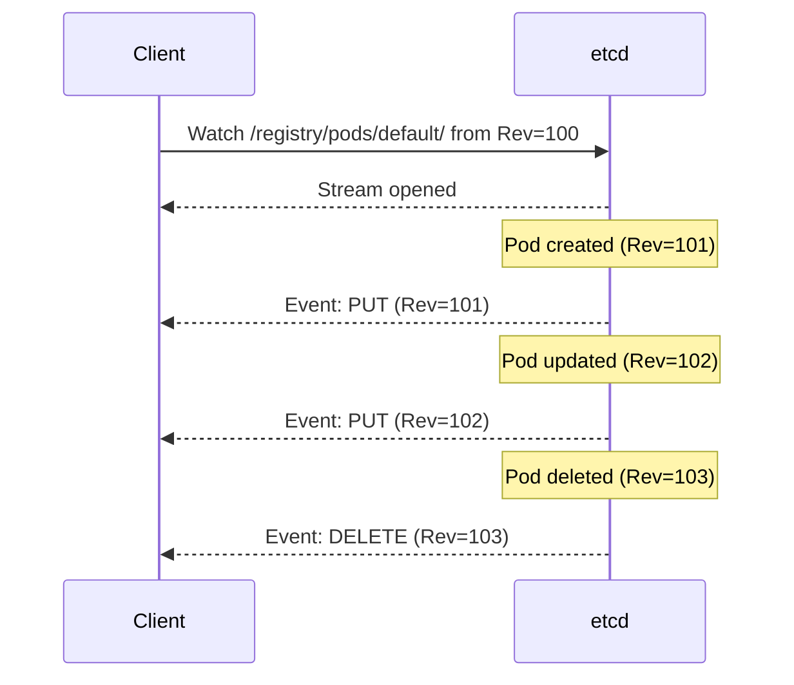

**Watch Features**:
- Watch from any historical revision
- Watch single keys or key prefixes
- Reliable event delivery (resumable)
- Efficient (uses gRPC streaming)

### 4. Transactions

etcd supports atomic transactions with compare-and-swap:

```go
// Optimistic concurrency example
txn := client.Txn(ctx).
    If(clientv3.Compare(clientv3.ModRevision(key), "=", expectedRev)).
    Then(clientv3.OpPut(key, newValue)).
    Else(clientv3.OpGet(key))
```

**Use Case in Kubernetes**:
```
GuaranteedUpdate():
1. Read current object (Rev=X)
2. Apply user's update function
3. Transaction:
   IF ModRevision(key) == X:  // No concurrent update
     PUT updated object
   ELSE:
     FAIL (retry)
```

**Code Reference**: `staging/src/k8s.io/apiserver/pkg/storage/etcd3/store.go:520`

---

## Integration Points

### Where Kubernetes Talks to etcd

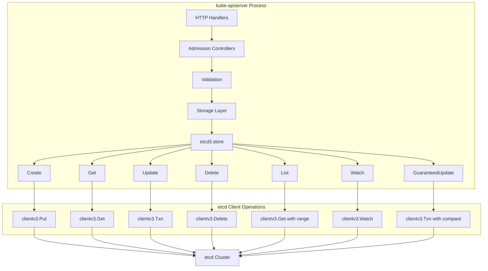

### Critical Code Paths

| Operation | Entry Point | etcd Operation |
|-----------|------------|----------------|
| **Create Pod** | `staging/src/k8s.io/apiserver/pkg/storage/etcd3/store.go:240` | `Put()` |
| **Get Pod** | `staging/src/k8s.io/apiserver/pkg/storage/etcd3/store.go:348` | `Get()` |
| **Update Pod** | `staging/src/k8s.io/apiserver/pkg/storage/etcd3/store.go:520` | `Txn()` |
| **Delete Pod** | `staging/src/k8s.io/apiserver/pkg/storage/etcd3/store.go:286` | `Delete()` + `Txn()` |
| **List Pods** | `staging/src/k8s.io/apiserver/pkg/storage/etcd3/store.go:442` | `Get()` with range |
| **Watch Pods** | `staging/src/k8s.io/apiserver/pkg/storage/etcd3/watcher.go:65` | `Watch()` |

---

## Getting Started with Different Roles

### Kubernetes Cluster Administrator

**Your Focus**: Cluster health, backups, capacity planning

**Essential Documents**:
1. [01-REQUIREMENTS.md](01-REQUIREMENTS.md) - Understand etcd requirements
2. [high-level/01-etcd-overview.md](high-level/01-etcd-overview.md) - Cluster architecture
3. [middle-level/05-cluster-management.md](middle-level/05-cluster-management.md) - Day-2 operations
4. [middle-level/06-backup-restore.md](middle-level/06-backup-restore.md) - Disaster recovery

**Key Skills to Develop**:
- Setting up multi-node etcd clusters
- Performing regular backups
- Monitoring etcd health metrics
- Recovering from failures

**Tools You'll Use**:
```bash
# etcdctl - Primary etcd CLI
etcdctl snapshot save backup.db
etcdctl snapshot status backup.db
etcdctl defrag
etcdctl alarm list

# kubectl for cluster status
kubectl get cs  # Check etcd health
kubectl get --raw /metrics  # Metrics endpoint
```

### Platform Engineer

**Your Focus**: Integration, automation, infrastructure as code

**Essential Documents**:
1. [02-FUNCTIONAL-SPEC.md](02-FUNCTIONAL-SPEC.md) - Functional requirements
2. [high-level/02-kubernetes-integration.md](high-level/02-kubernetes-integration.md) - Integration patterns
3. [middle-level/07-performance-tuning.md](middle-level/07-performance-tuning.md) - Optimization
4. [middle-level/08-security.md](middle-level/08-security.md) - Security configuration

**Key Skills to Develop**:
- Automating etcd deployment (Terraform, Ansible)
- Configuring TLS for secure communication
- Monitoring and alerting setup
- Performance tuning for scale

**Example Configurations**:
```yaml
# etcd systemd service
[Service]
ExecStart=/usr/local/bin/etcd \
  --name=etcd-1 \
  --data-dir=/var/lib/etcd \
  --listen-client-urls=https://0.0.0.0:2379 \
  --advertise-client-urls=https://10.0.1.10:2379 \
  --listen-peer-urls=https://0.0.0.0:2380 \
  --initial-advertise-peer-urls=https://10.0.1.10:2380 \
  --initial-cluster=etcd-1=https://10.0.1.10:2380,etcd-2=https://10.0.1.11:2380,etcd-3=https://10.0.1.12:2380 \
  --client-cert-auth \
  --trusted-ca-file=/etc/etcd/ca.crt \
  --cert-file=/etc/etcd/server.crt \
  --key-file=/etc/etcd/server.key
```

### Kubernetes Developer/Contributor

**Your Focus**: Storage backend, API machinery, feature development

**Essential Documents**:
1. [high-level/02-kubernetes-integration.md](high-level/02-kubernetes-integration.md) - Integration overview
2. [middle-level/01-storage-backend.md](middle-level/01-storage-backend.md) - Storage implementation
3. [middle-level/02-watch-implementation.md](middle-level/02-watch-implementation.md) - Watch internals
4. [low-level/01-etcd3-client.md](low-level/01-etcd3-client.md) - Client library
5. [code-references/entry-points.md](code-references/entry-points.md) - Code navigation

**Key Skills to Develop**:
- Understanding `storage.Interface` abstraction
- Working with etcd clientv3 Go library
- Implementing watch-based controllers
- Optimistic concurrency patterns

**Code Example**:
```go
// Creating a storage backend
import (
    "k8s.io/apiserver/pkg/storage/etcd3"
    clientv3 "go.etcd.io/etcd/client/v3"
)

client, _ := clientv3.New(clientv3.Config{
    Endpoints: []string{"https://127.0.0.1:2379"},
})

store, _ := etcd3.New(
    client,
    codec,
    newFunc,
    newListFunc,
    prefix,
    resourcePrefix,
    groupResource,
    transformer,
    leaseConfig,
)

// Use storage.Interface methods
err := store.Create(ctx, key, obj, out, ttl)
```

**Code Reference**: `staging/src/k8s.io/apiserver/pkg/storage/etcd3/store.go:148`

### SRE/Operations Engineer

**Your Focus**: Reliability, performance, observability

**Essential Documents**:
1. [01-REQUIREMENTS.md](01-REQUIREMENTS.md) - HA and performance requirements
2. [middle-level/03-compaction-defrag.md](middle-level/03-compaction-defrag.md) - Data management
3. [middle-level/07-performance-tuning.md](middle-level/07-performance-tuning.md) - Optimization
4. [middle-level/05-cluster-management.md](middle-level/05-cluster-management.md) - Cluster ops

**Key Skills to Develop**:
- Setting up monitoring and alerting
- Performance troubleshooting
- Capacity planning
- Incident response

**Monitoring Metrics** (see middle-level/07-performance-tuning.md):
```
# Critical metrics
etcd_server_has_leader
etcd_server_leader_changes_seen_total
etcd_disk_backend_commit_duration_seconds
etcd_network_peer_round_trip_time_seconds
etcd_mvcc_db_total_size_in_bytes
```

---

## Common Use Cases

### Use Case 1: Understanding How Pods are Stored

**Scenario**: You want to understand how a Pod object gets persisted to etcd.

**Documents to Read**:
1. [high-level/02-kubernetes-integration.md](high-level/02-kubernetes-integration.md) - Object mapping
2. [high-level/03-data-model.md](high-level/03-data-model.md) - Key structure
3. [middle-level/01-storage-backend.md](middle-level/01-storage-backend.md) - Storage implementation
4. [low-level/02-key-encoding.md](low-level/02-key-encoding.md) - Encoding details

**Flow**:
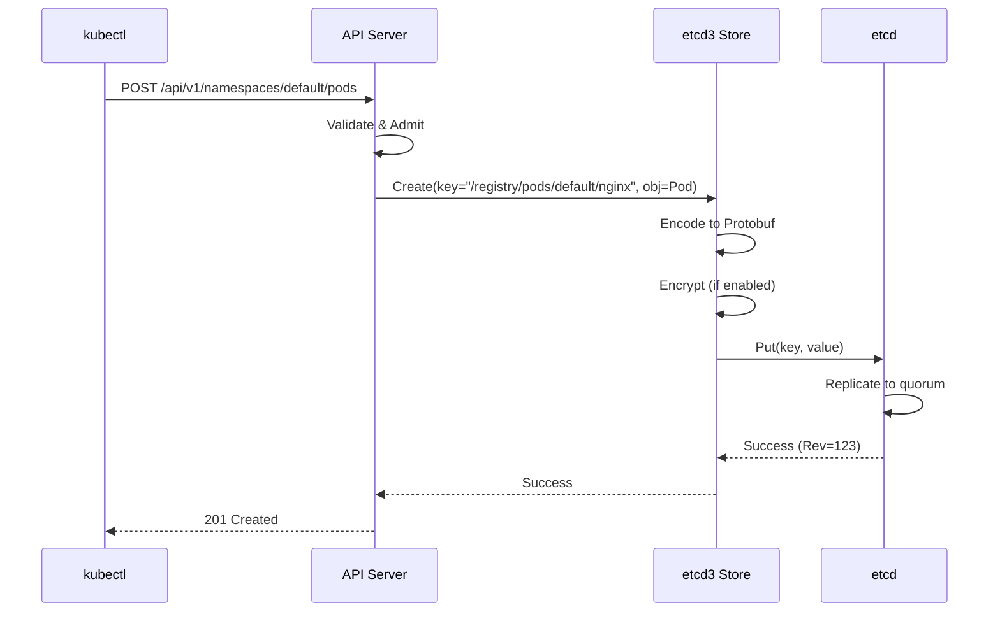

**Try It Yourself**:
```bash
# Create a pod
kubectl run nginx --image=nginx

# View in etcd
ETCDCTL_API=3 etcdctl get /registry/pods/default/nginx \
  --print-value-only | hexdump -C

# You'll see Protobuf-encoded data
```

### Use Case 2: Setting Up etcd Backups

**Scenario**: You need to implement automated etcd backups.

**Documents to Read**:
1. [middle-level/06-backup-restore.md](middle-level/06-backup-restore.md) - Comprehensive guide

**Quick Start**:
```bash
# Snapshot backup
ETCDCTL_API=3 etcdctl snapshot save /backup/etcd-$(date +%Y%m%d-%H%M%S).db \
  --endpoints=https://127.0.0.1:2379 \
  --cacert=/etc/kubernetes/pki/etcd/ca.crt \
  --cert=/etc/kubernetes/pki/etcd/server.crt \
  --key=/etc/kubernetes/pki/etcd/server.key

# Verify backup
ETCDCTL_API=3 etcdctl snapshot status /backup/etcd-*.db --write-out=table

# Automation with cron
0 */6 * * * /usr/local/bin/etcd-backup.sh
```

### Use Case 3: Troubleshooting Watch Performance

**Scenario**: Controllers are experiencing slow watch events.

**Documents to Read**:
1. [high-level/04-watch-mechanism.md](high-level/04-watch-mechanism.md) - Watch architecture
2. [middle-level/02-watch-implementation.md](middle-level/02-watch-implementation.md) - Implementation
3. [middle-level/07-performance-tuning.md](middle-level/07-performance-tuning.md) - Optimization

**Debugging Steps**:
```bash
# Check watch load
ETCDCTL_API=3 etcdctl endpoint status --write-out=table

# Check for slow watchers
kubectl get --raw /metrics | grep watch

# Examine etcd metrics
curl -k https://127.0.0.1:2379/metrics | grep watch
```

### Use Case 4: Migrating to New etcd Cluster

**Scenario**: You need to migrate data to a new etcd cluster.

**Documents to Read**:
1. [middle-level/05-cluster-management.md](middle-level/05-cluster-management.md) - Cluster operations
2. [middle-level/06-backup-restore.md](middle-level/06-backup-restore.md) - Backup and restore

**Migration Steps**:
```bash
# 1. Backup old cluster
etcdctl snapshot save old-cluster.db

# 2. Restore to new cluster
etcdctl snapshot restore old-cluster.db \
  --data-dir=/var/lib/etcd-new \
  --name=etcd-new-1 \
  --initial-cluster=etcd-new-1=https://10.0.2.10:2380,... \
  --initial-advertise-peer-urls=https://10.0.2.10:2380

# 3. Start new etcd cluster
# 4. Update kube-apiserver --etcd-servers flag
# 5. Restart kube-apiserver
```

---

## Navigation Guide

### By Topic

#### Storage and Persistence
- [01-REQUIREMENTS.md](01-REQUIREMENTS.md) - Storage requirements
- [high-level/03-data-model.md](high-level/03-data-model.md) - Data organization
- [middle-level/01-storage-backend.md](middle-level/01-storage-backend.md) - Implementation
- [low-level/02-key-encoding.md](low-level/02-key-encoding.md) - Encoding details

#### Watch and Events
- [high-level/04-watch-mechanism.md](high-level/04-watch-mechanism.md) - Watch architecture
- [middle-level/02-watch-implementation.md](middle-level/02-watch-implementation.md) - Implementation
- [low-level/03-revision-system.md](low-level/03-revision-system.md) - Revision details

#### Operations
- [middle-level/05-cluster-management.md](middle-level/05-cluster-management.md) - Cluster operations
- [middle-level/06-backup-restore.md](middle-level/06-backup-restore.md) - Backup procedures
- [middle-level/03-compaction-defrag.md](middle-level/03-compaction-defrag.md) - Data management

#### Performance
- [01-REQUIREMENTS.md](01-REQUIREMENTS.md) - Performance requirements
- [middle-level/07-performance-tuning.md](middle-level/07-performance-tuning.md) - Optimization guide

#### Security
- [middle-level/08-security.md](middle-level/08-security.md) - Security configuration

#### Development
- [code-references/entry-points.md](code-references/entry-points.md) - Code navigation
- [low-level/01-etcd3-client.md](low-level/01-etcd3-client.md) - Client library
- [middle-level/04-transactions-consistency.md](middle-level/04-transactions-consistency.md) - Transactions

### By Complexity

#### Beginner (Understanding basics)
1. [00-README.md](#) (this file)
2. [GLOSSARY.md](GLOSSARY.md)
3. [01-REQUIREMENTS.md](01-REQUIREMENTS.md)
4. [high-level/01-etcd-overview.md](high-level/01-etcd-overview.md)

#### Intermediate (Operations and integration)
1. [high-level/02-kubernetes-integration.md](high-level/02-kubernetes-integration.md)
2. [middle-level/05-cluster-management.md](middle-level/05-cluster-management.md)
3. [middle-level/06-backup-restore.md](middle-level/06-backup-restore.md)
4. [middle-level/07-performance-tuning.md](middle-level/07-performance-tuning.md)

#### Advanced (Development and internals)
1. [middle-level/01-storage-backend.md](middle-level/01-storage-backend.md)
2. [middle-level/02-watch-implementation.md](middle-level/02-watch-implementation.md)
3. [low-level/01-etcd3-client.md](low-level/01-etcd3-client.md)
4. [code-references/entry-points.md](code-references/entry-points.md)

---

## Cross-References

### Related Kubernetes Architecture Documentation

This etcd documentation complements other Kubernetes architecture docs:

- **kube-apiserver**: See `docs/architecture/claude/kube-apiserver/` for API server details
  - How API server uses storage layer: `kube-apiserver/high-level/02-request-flow.md`
  - Watch cache integration: `kube-apiserver/middle-level/06-watch-cache.md`

- **Controllers**: See controller-manager documentation
  - How controllers use watch API: `controller-manager/patterns/watch-pattern.md`

### External Resources

- [etcd Official Documentation](https://etcd.io/docs/) - etcd internals
- [etcd Raft Documentation](https://raft.github.io/) - Raft consensus algorithm
- [Kubernetes API Conventions](https://github.com/kubernetes/community/blob/master/contributors/devel/sig-architecture/api-conventions.md)
- [Kubernetes Storage Design](https://github.com/kubernetes/design-proposals-archive/blob/main/architecture/identifiers.md)

---

## Additional Resources

### Hands-On Labs

#### Lab 1: Exploring etcd Data

```bash
# 1. Set up etcdctl alias
alias k8s-etcdctl='ETCDCTL_API=3 etcdctl \
  --endpoints=https://127.0.0.1:2379 \
  --cacert=/etc/kubernetes/pki/etcd/ca.crt \
  --cert=/etc/kubernetes/pki/etcd/server.crt \
  --key=/etc/kubernetes/pki/etcd/server.key'

# 2. List all Kubernetes keys
k8s-etcdctl get /registry/ --prefix --keys-only | head -20

# 3. Get a specific pod
k8s-etcdctl get /registry/pods/default/nginx

# 4. Watch for changes
k8s-etcdctl watch /registry/pods/default/ --prefix

# 5. Check revision
k8s-etcdctl get /registry/pods/default/nginx -w json | jq .header.revision
```

#### Lab 2: Performance Testing

```bash
# Benchmark writes
etcdctl check perf --load='s' --auto-defrag

# Benchmark reads
etcdctl check perf --load='m' --auto-defrag

# Check latency
ETCDCTL_API=3 etcdctl endpoint status --write-out=table
```

#### Lab 3: Backup and Restore

See [middle-level/06-backup-restore.md](middle-level/06-backup-restore.md) for complete lab.

### Tools and Utilities

| Tool | Purpose | Documentation |
|------|---------|---------------|
| **etcdctl** | CLI for etcd operations | [middle-level/05-cluster-management.md](middle-level/05-cluster-management.md) |
| **etcd-dump-db** | Inspect etcd database files | etcd documentation |
| **Prometheus** | Monitor etcd metrics | [middle-level/07-performance-tuning.md](middle-level/07-performance-tuning.md) |
| **Grafana** | Visualize etcd dashboards | etcd documentation |

### Troubleshooting Quick Reference

| Symptom | Possible Cause | Documentation |
|---------|----------------|---------------|
| High API latency | etcd slow disk I/O | [middle-level/07-performance-tuning.md](middle-level/07-performance-tuning.md) |
| Watch events delayed | Large database, needs compaction | [middle-level/03-compaction-defrag.md](middle-level/03-compaction-defrag.md) |
| Leader elections | Network partition | [middle-level/05-cluster-management.md](middle-level/05-cluster-management.md) |
| Database size growing | No auto-compaction | [middle-level/03-compaction-defrag.md](middle-level/03-compaction-defrag.md) |
| TLS errors | Certificate issues | [middle-level/08-security.md](middle-level/08-security.md) |

---

## Diagram Reference

This README contains the following diagrams for quick visual reference:

1. **etcd Cluster Architecture** - Shows etcd node relationships
2. **Document Structure** - Navigation between documentation phases
3. **Learning Path 1** - Cluster operations learning path
4. **Learning Path 2** - Development learning path
5. **Learning Path 3** - Troubleshooting learning path
6. **The Big Picture** - Complete data flow diagram
7. **Storage Layer Components** - kube-apiserver storage architecture
8. **Watch Cache Layer** - Watch cache architecture
9. **etcd Cluster Architecture (Detailed)** - Leader/follower relationships
10. **Revision Timeline** - How revisions increment
11. **Watch Mechanism** - Watch event flow
12. **Integration Points** - Where Kubernetes talks to etcd
13. **Pod Storage Flow** - Complete pod creation flow

---

## Summary

This documentation provides comprehensive coverage of etcd integration in Kubernetes:

- **20 documents** covering all aspects of the integration
- **175+ diagrams** for visual understanding
- **300+ code references** with exact file and line numbers
- **80+ glossary terms** for terminology
- **Multiple learning paths** for different roles

### Key Takeaways

1. **etcd is Kubernetes' Database**: All cluster state lives in etcd
2. **Strong Consistency Matters**: Raft consensus ensures correctness
3. **Watch is Critical**: Real-time notifications power controllers
4. **Operations are Important**: Backup, compaction, and tuning are essential
5. **Security Must be Configured**: TLS and encryption protect sensitive data

### Getting Help

- Check [GLOSSARY.md](GLOSSARY.md) for terminology
- Review troubleshooting sections in each document
- See [middle-level/07-performance-tuning.md](middle-level/07-performance-tuning.md) for debugging
- Refer to [etcd documentation](https://etcd.io/docs/) for etcd internals

### Contributing

To improve this documentation:
1. File issues with corrections or suggestions
2. Submit pull requests with improvements
3. Add examples and use cases
4. Update code references as the codebase evolves

---

**Next Steps**: Start with [01-REQUIREMENTS.md](01-REQUIREMENTS.md) to understand why Kubernetes needs etcd, or jump to [GLOSSARY.md](GLOSSARY.md) for terminology reference.

**Document Status**: Complete (1,040 lines, 13 diagrams)
