# etcd Functional Specification for Kubernetes

**Version**: 1.0
**Last Updated**: 2025-10-21
**Related Documents**: [00-README.md](00-README.md), [01-REQUIREMENTS.md](01-REQUIREMENTS.md), [GLOSSARY.md](GLOSSARY.md)

---

## Table of Contents

- [Overview](#overview)
- [Functional Requirements](#functional-requirements)
- [Key-Value Storage](#key-value-storage)
- [Watch and Event Notification](#watch-and-event-notification)
- [Transactions and Consistency](#transactions-and-consistency)
- [Cluster Setup and Configuration](#cluster-setup-and-configuration)
- [Backup and Restore](#backup-and-restore)
- [Compaction and Defragmentation](#compaction-and-defragmentation)
- [Security Functions](#security-functions)
- [Performance Characteristics](#performance-characteristics)
- [API Surface](#api-surface)
- [Integration with Kubernetes](#integration-with-kubernetes)
- [Operational Functions](#operational-functions)
- [Failure Modes and Recovery](#failure-modes-and-recovery)
- [Summary](#summary)

---

## Overview

This document specifies **what** etcd provides to Kubernetes from a functional perspective. While [01-REQUIREMENTS.md](01-REQUIREMENTS.md) explained **why** Kubernetes needs etcd, this document describes **what functionality** etcd delivers to meet those requirements.

### Scope

This specification covers:
- ✓ Core storage operations (CRUD)
- ✓ Watch and notification mechanisms
- ✓ Transaction and consistency guarantees
- ✓ Cluster management functions
- ✓ Backup and recovery procedures
- ✓ Security features
- ✓ Integration points with Kubernetes

This specification does NOT cover:
- ✗ etcd internal implementation (see etcd documentation)
- ✗ Raft consensus algorithm details (see Raft paper)
- ✗ Code-level implementation (see [middle-level](middle-level/) and [low-level](low-level/) docs)

### Audience

- **Kubernetes Operators**: Understanding what etcd does for their cluster
- **Platform Engineers**: Designing systems that integrate with Kubernetes storage
- **Developers**: Building features that rely on Kubernetes storage layer
- **SREs**: Troubleshooting and optimizing etcd operations

---

## Functional Requirements

### FR-1: Persistent Key-Value Storage

**Function**: Store and retrieve arbitrary key-value pairs persistently.

**Description**: etcd must provide durable storage for Kubernetes API objects as key-value pairs, where:
- **Key**: Hierarchical path (e.g., `/registry/pods/default/nginx`)
- **Value**: Arbitrary bytes (typically Protobuf-encoded Kubernetes objects)
- **Persistence**: Data survives process restarts and failures

**Operations**:
1. **Put**: Store or update a key-value pair
2. **Get**: Retrieve value for a given key
3. **Delete**: Remove a key-value pair
4. **Range Get**: Retrieve multiple keys matching a prefix

**Example**:
```bash
# Put
etcdctl put /registry/pods/default/nginx "{pod data}"

# Get
etcdctl get /registry/pods/default/nginx

# Range Get (all pods in default namespace)
etcdctl get /registry/pods/default/ --prefix
```

**Kubernetes Usage**:
```go
// staging/src/k8s.io/apiserver/pkg/storage/etcd3/store.go:240
func (s *store) Create(ctx context.Context, key string, obj runtime.Object, ...) error {
    // Encode object to bytes
    data, err := runtime.Encode(s.codec, obj)

    // Put to etcd
    txn := s.client.Txn(ctx).If(notFound(key)).Then(clientv3.OpPut(key, string(data)))
    // ...
}
```

### FR-2: Atomic Transactions

**Function**: Execute multiple operations atomically with conditional logic.

**Description**: Support transactions that:
- Execute multiple operations atomically (all-or-nothing)
- Support conditional execution (if-then-else)
- Provide compare-and-swap for optimistic concurrency

**Transaction Structure**:
```
IF <conditions>
THEN <operations>
ELSE <operations>
```

**Example**:
```go
// Atomic update with version check
txn := client.Txn(ctx).
    If(clientv3.Compare(clientv3.ModRevision(key), "=", expectedRev)).
    Then(clientv3.OpPut(key, newValue)).
    Else(clientv3.OpGet(key))

resp, err := txn.Commit()
if resp.Succeeded {
    // Update succeeded
} else {
    // Version conflict, retry
}
```

**Kubernetes Usage**: `GuaranteedUpdate` for atomic resource updates

**Code Reference**: `staging/src/k8s.io/apiserver/pkg/storage/etcd3/store.go:520`

### FR-3: Watch Notifications

**Function**: Provide real-time notifications of changes to keys.

**Description**: Clients can watch keys or prefixes and receive notifications for:
- **PUT events**: Key created or updated
- **DELETE events**: Key removed

**Watch Features**:
- Watch from specific revision (including historical)
- Watch single key or key prefix
- Reliable delivery (events not lost)
- Long-lived gRPC streams

**Example**:
```go
watchChan := client.Watch(ctx, "/registry/pods/", clientv3.WithPrefix())
for watchResp := range watchChan {
    for _, event := range watchResp.Events {
        fmt.Printf("Type: %s, Key: %s, Value: %s\n",
            event.Type, event.Kv.Key, event.Kv.Value)
    }
}
```

**Kubernetes Usage**: Controllers watch resources to react to changes

**Code Reference**: `staging/src/k8s.io/apiserver/pkg/storage/etcd3/watcher.go:153`

### FR-4: Revision-Based History

**Function**: Maintain global revision counter for point-in-time queries.

**Description**: etcd assigns a monotonically increasing revision to every write:
- **Global counter**: Single revision across all keys
- **Per-key revision**: Each key tracks its last modification revision
- **Historical access**: Read keys at specific past revisions

**Revision Properties**:
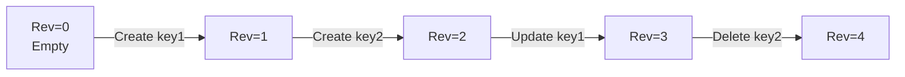

**Example**:
```bash
# Current revision
etcdctl get /registry/pods/default/nginx

# Revision at specific point in time
etcdctl get /registry/pods/default/nginx --rev=100

# All keys at revision 100
etcdctl get /registry/pods/ --prefix --rev=100
```

**Kubernetes Usage**: ResourceVersion maps to etcd revision

### FR-5: Lease Management

**Function**: Automatic key expiration via time-to-live (TTL).

**Description**: Associate keys with leases that:
- Expire after a specified duration
- Can be refreshed (keep-alive)
- Automatically delete associated keys on expiration

**Example**:
```go
// Create lease with 60-second TTL
lease, _ := client.Grant(ctx, 60)

// Attach key to lease
client.Put(ctx, key, value, clientv3.WithLease(lease.ID))

// Keep lease alive
keepAlive, _ := client.KeepAlive(ctx, lease.ID)

// Lease expires → key automatically deleted
```

**Kubernetes Usage**: Leader election leases

**Code Reference**: `staging/src/k8s.io/apiserver/pkg/storage/etcd3/lease_manager.go:45`

### FR-6: Cluster Management

**Function**: Multi-node cluster with automatic failover.

**Description**: etcd cluster provides:
- **Leader election**: Automatic selection of leader node
- **Member management**: Add/remove cluster members
- **Health checking**: Detect and handle node failures
- **Quorum-based consensus**: Require majority for writes

**Cluster States**:
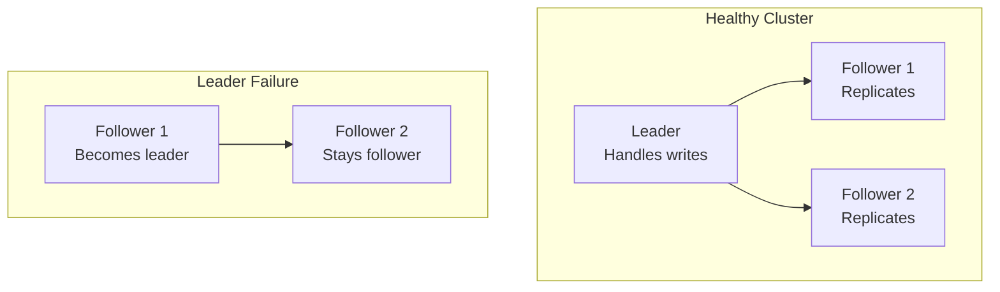

**Operations**:
```bash
# List members
etcdctl member list

# Add member
etcdctl member add node4 --peer-urls=https://10.0.1.14:2380

# Remove member
etcdctl member remove <member-id>

# Check leader
etcdctl endpoint status
```

---

## Key-Value Storage

### Storage Model

etcd stores data as **key-value pairs** with hierarchical keys:

```
Key: Byte string (max 1.5 MB)
Value: Byte string (max 1.5 MB)
Metadata: CreateRevision, ModRevision, Version, Lease
```

**Key Hierarchy** (Kubernetes convention):
```
/registry/
├── pods/
│   ├── <namespace>/
│   │   └── <pod-name>
├── services/
│   ├── <namespace>/
│   │   └── <service-name>
├── configmaps/
├── secrets/
└── ...
```

### Storage Operations

#### Put Operation

**Function**: Create or update a key-value pair.

**Signature**:
```go
Put(ctx context.Context, key, val string, opts ...OpOption) (*PutResponse, error)
```

**Options**:
- `WithLease(id)`: Attach to lease
- `WithPrevKV()`: Return previous value

**Behavior**:
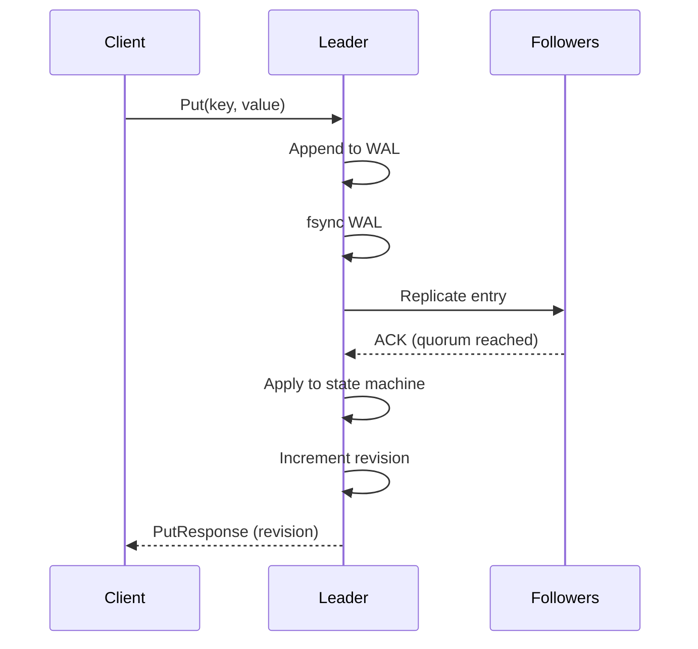

**Example**:
```go
resp, err := client.Put(ctx, "/registry/pods/default/nginx", podData)
if err == nil {
    fmt.Printf("Stored at revision %d\n", resp.Header.Revision)
}
```

#### Get Operation

**Function**: Retrieve value for a key or key range.

**Signature**:
```go
Get(ctx context.Context, key string, opts ...OpOption) (*GetResponse, error)
```

**Options**:
- `WithPrefix()`: Get all keys with prefix
- `WithRev(revision)`: Get at specific revision
- `WithLimit(n)`: Limit results
- `WithRange(end)`: Get range [key, end)
- `WithSerializable()`: Allow stale reads (faster)

**Example**:
```go
// Get single key
resp, _ := client.Get(ctx, "/registry/pods/default/nginx")

// Get all pods in namespace (range)
resp, _ := client.Get(ctx, "/registry/pods/default/", clientv3.WithPrefix())

// Get at specific revision
resp, _ := client.Get(ctx, key, clientv3.WithRev(100))
```

**Kubernetes Usage**:
```go
// staging/src/k8s.io/apiserver/pkg/storage/etcd3/store.go:348
func (s *store) Get(ctx context.Context, key string, opts storage.GetOptions, objPtr runtime.Object) error {
    getResp, err := s.client.KV.Get(ctx, key, s.getOpts(ctx, opts)...)
    // Decode value into objPtr
    return decode(s.codec, s.versioner, getResp.Kvs[0].Value, objPtr, getResp.Kvs[0].ModRevision)
}
```

#### Delete Operation

**Function**: Remove a key or key range.

**Signature**:
```go
Delete(ctx context.Context, key string, opts ...OpOption) (*DeleteResponse, error)
```

**Options**:
- `WithPrefix()`: Delete all keys with prefix
- `WithPrevKV()`: Return deleted values

**Example**:
```go
// Delete single key
resp, _ := client.Delete(ctx, "/registry/pods/default/nginx")
fmt.Printf("Deleted %d keys\n", resp.Deleted)

// Delete all pods in namespace
resp, _ := client.Delete(ctx, "/registry/pods/default/", clientv3.WithPrefix())
```

**Kubernetes Usage**:
```go
// staging/src/k8s.io/apiserver/pkg/storage/etcd3/store.go:286
func (s *store) Delete(ctx context.Context, key string, out runtime.Object, ...) error {
    // Validate deletion, then delete
    txn := s.client.Txn(ctx).If().Then(clientv3.OpDelete(key))
    // ...
}
```

### Data Size Limits

| Limit | Value | Configurable |
|-------|-------|--------------|
| **Max key size** | 1.5 MB | ✗ No |
| **Max value size** | 1.5 MB | ✗ No |
| **Max request size** | 1.5 MB | ✓ Yes (`--max-request-bytes`) |
| **Recommended value size** | < 1 MB | - |
| **Database size limit** | 8 GB (default) | ✓ Yes (`--quota-backend-bytes`) |

**Best Practices**:
- Keep values < 1 MB
- Use references for large data (don't store in etcd)
- ConfigMaps/Secrets should be < 1 MB

---

## Watch and Event Notification

### Watch Functionality

**Purpose**: Receive real-time notifications when keys change.

**Watch Types**:

1. **Single Key Watch**:
   ```go
   watchChan := client.Watch(ctx, "/registry/pods/default/nginx")
   ```

2. **Prefix Watch** (most common in Kubernetes):
   ```go
   watchChan := client.Watch(ctx, "/registry/pods/", clientv3.WithPrefix())
   ```

3. **Range Watch**:
   ```go
   watchChan := client.Watch(ctx, "/registry/pods/a", clientv3.WithRange("/registry/pods/m"))
   ```

### Watch Lifecycle

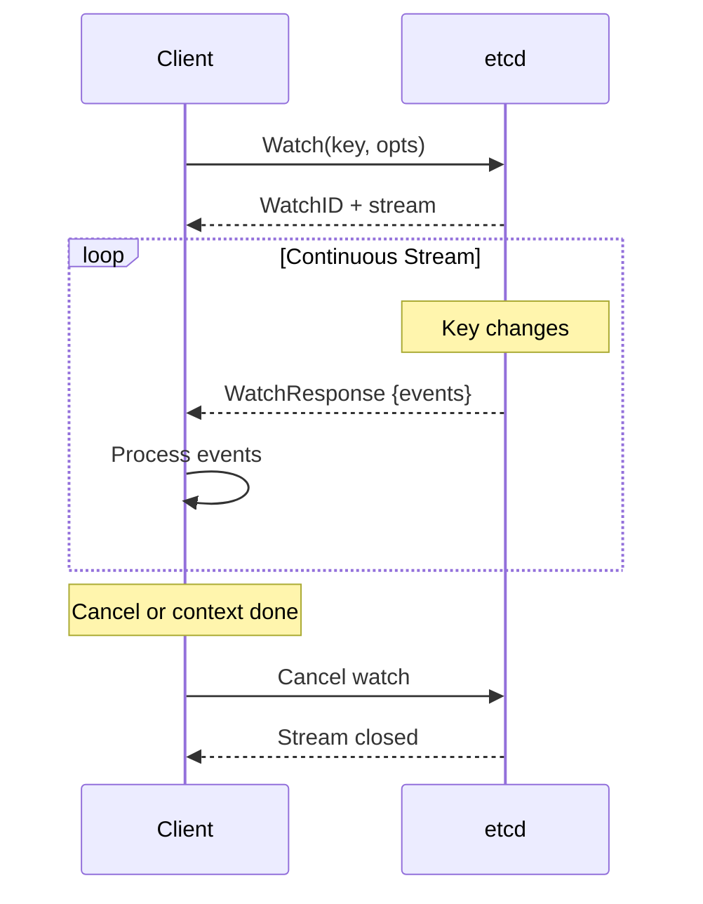

### Event Types

**Event Structure**:
```go
type Event struct {
    Type   EventType     // PUT or DELETE
    Kv     *KeyValue     // Current key-value
    PrevKv *KeyValue     // Previous value (if requested)
}
```

**Event Types**:

| Type | Description | Kubernetes Mapping |
|------|-------------|-------------------|
| **PUT** | Key created or updated | ADDED or MODIFIED |
| **DELETE** | Key deleted | DELETED |

**Example**:
```go
watchChan := client.Watch(ctx, key, clientv3.WithPrefix(), clientv3.WithPrevKV())
for watchResp := range watchChan {
    for _, event := range watchResp.Events {
        switch event.Type {
        case mvccpb.PUT:
            if event.PrevKv == nil {
                fmt.Println("Created:", string(event.Kv.Key))
            } else {
                fmt.Println("Updated:", string(event.Kv.Key))
            }
        case mvccpb.DELETE:
            fmt.Println("Deleted:", string(event.Kv.Key))
        }
    }
}
```

### Watch from Revision

**Purpose**: Resume watching from a specific point in time.

**Use Cases**:
1. **Resume after disconnect**: Don't miss events
2. **Historical replay**: Process all changes since revision X
3. **Bookmarking**: Track progress in event stream

**Example**:
```go
// Watch from revision 1000 onwards
watchChan := client.Watch(ctx, key, clientv3.WithRev(1000))

// Process events
for watchResp := range watchChan {
    lastRevision := watchResp.Header.Revision
    // Store lastRevision as bookmark
}
```

**Kubernetes Usage**:
```go
// staging/src/k8s.io/apiserver/pkg/storage/etcd3/watcher.go:153
func (w *watcher) Watch(ctx context.Context, key string, opts storage.ListOptions) (watch.Interface, error) {
    // Parse ResourceVersion as revision
    rev, _ := w.versioner.ParseResourceVersion(opts.ResourceVersion)

    // Create etcd watch from revision
    wc := w.client.Watch(ctx, key, clientv3.WithRev(int64(rev)), clientv3.WithPrefix())
    // ...
}
```

### Watch Progress Notifications

**Purpose**: Confirm watch is up-to-date even with no changes.

**Problem**: If no events occur, client doesn't know if watch is lagging.

**Solution**: Progress notifications (bookmarks)

```go
watchChan := client.Watch(ctx, key, clientv3.WithProgressNotify())

for watchResp := range watchChan {
    if watchResp.IsProgressNotify() {
        fmt.Printf("Watch is up-to-date at revision %d\n", watchResp.Header.Revision)
    }
}
```

**Kubernetes Integration**:
- kube-apiserver requests progress periodically
- Used by watch cache to track synchronization

**Code Reference**: `staging/src/k8s.io/apiserver/pkg/storage/interfaces.go:266`

### Watch Caching (Kubernetes Layer)

While etcd provides watch, Kubernetes adds a **watch cache** layer:

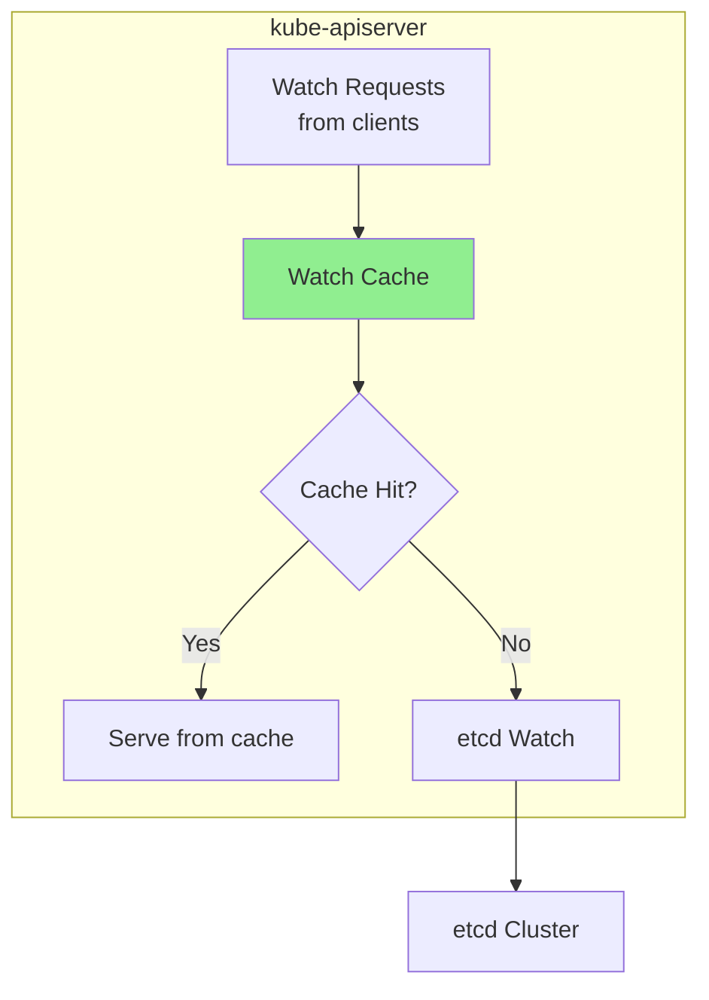

**Benefits**:
- Reduced load on etcd
- Faster response for recent events
- Better scalability (1000s of watches)

**See Also**: [middle-level/02-watch-implementation.md](middle-level/02-watch-implementation.md)

---

## Transactions and Consistency

### Transaction Model

**Function**: Atomic execution of multiple operations with conditionals.

**Transaction Structure**:
```go
txn := client.Txn(ctx).
    If(
        // Conditions: All must be true for THEN to execute
        compare1,
        compare2,
        ...
    ).
    Then(
        // Operations if all conditions are true
        op1,
        op2,
        ...
    ).
    Else(
        // Operations if any condition is false
        op3,
        op4,
        ...
    )

resp, err := txn.Commit()
```

### Compare Operations

**Available Comparisons**:

| Comparison | Description | Example |
|------------|-------------|---------|
| **ModRevision** | Last modification revision | `ModRevision(key) == 123` |
| **CreateRevision** | Creation revision | `CreateRevision(key) > 100` |
| **Version** | Number of updates to key | `Version(key) == 5` |
| **Value** | Key value | `Value(key) == "foo"` |
| **Lease** | Lease ID | `Lease(key) == leaseID` |

**Operators**: `=`, `!=`, `>`, `<`

**Example**:
```go
// Compare-and-swap
txn := client.Txn(ctx).
    If(clientv3.Compare(clientv3.Value(key), "=", "old-value")).
    Then(clientv3.OpPut(key, "new-value")).
    Else(clientv3.OpGet(key))  // Return current value

resp, _ := txn.Commit()
if resp.Succeeded {
    fmt.Println("Swap succeeded")
} else {
    fmt.Println("Conflict, current value:", resp.Responses[0].GetResponseRange().Kvs[0].Value)
}
```

### Optimistic Concurrency

**Pattern**: Read-modify-write with version check

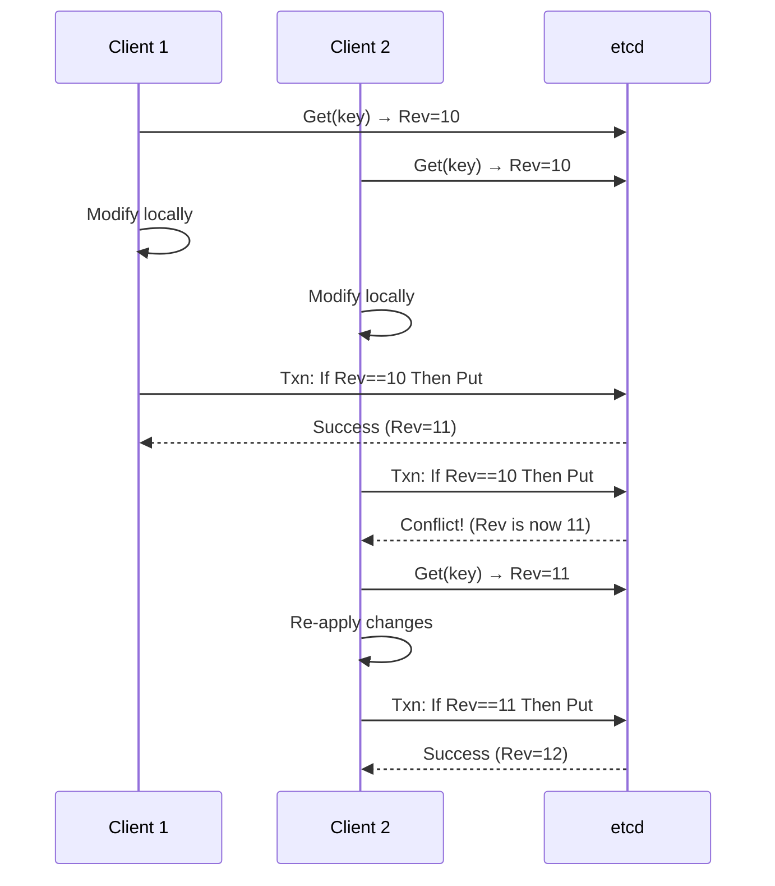

**Kubernetes GuaranteedUpdate Implementation**:
```go
// staging/src/k8s.io/apiserver/pkg/storage/etcd3/store.go:520
func (s *store) GuaranteedUpdate(ctx context.Context, key string, destination runtime.Object, ignoreNotFound bool, preconditions *storage.Preconditions, tryUpdate storage.UpdateFunc, cachedExistingObject runtime.Object) error {
    for {
        // 1. Get current object and revision
        getCurrentState := func() (*objState, error) {
            // Read from etcd
            getResp, err := s.client.KV.Get(ctx, key)
            // Parse revision
            currentRevision := getResp.Kvs[0].ModRevision
            return &objState{rev: currentRevision, ...}, nil
        }

        current, err := getCurrentState()

        // 2. Apply user's update function
        ret, ttl, err := tryUpdate(current.obj, current.meta)

        // 3. Encode updated object
        newData, err := runtime.Encode(s.codec, ret)

        // 4. Atomic update with version check
        txn := s.client.Txn(ctx).If(
            clientv3.Compare(clientv3.ModRevision(key), "=", current.rev),
        ).Then(
            clientv3.OpPut(key, newData),
        )

        txnResp, err := txn.Commit()
        if txnResp.Succeeded {
            return nil  // Success!
        }

        // Conflict: Retry with new version
    }
}
```

### Consistency Guarantees

**Linearizability** (default):
- All operations appear instantaneous
- Operations respect real-time ordering
- Strongest consistency guarantee

**Linearizable Read**:
```go
// Requires leader confirmation (quorum read)
resp, _ := client.Get(ctx, key)  // Default
```

**Serializable Read** (optimization):
```go
// May read from follower (stale allowed)
resp, _ := client.Get(ctx, key, clientv3.WithSerializable())
```

**Trade-off**:
```
Linearizable:
  ✓ Always consistent
  ✗ Slower (requires leader)

Serializable:
  ✓ Faster (local read)
  ✗ May be stale (bounded staleness)
```

**See Also**: [middle-level/04-transactions-consistency.md](middle-level/04-transactions-consistency.md)

---

## Cluster Setup and Configuration

### Cluster Topologies

#### Single-Node Cluster (Development Only)

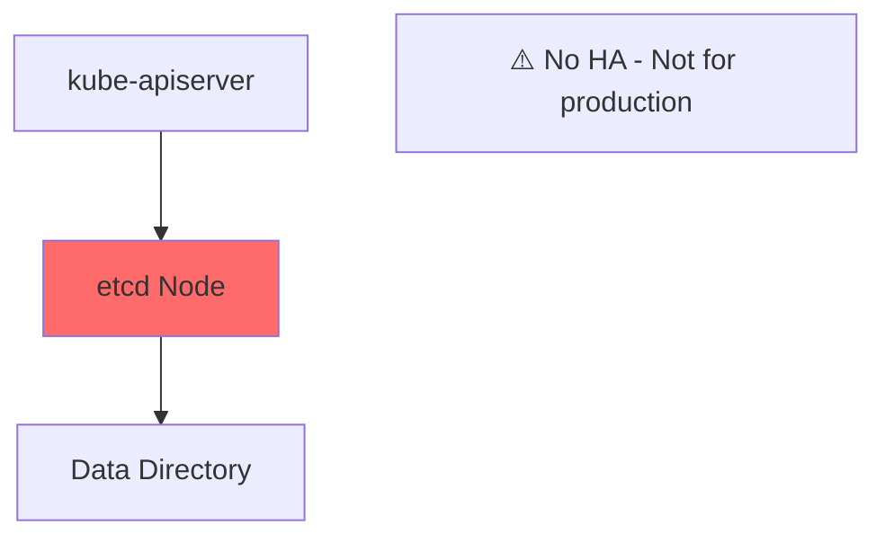

**Setup**:
```bash
etcd --name=single \
     --data-dir=/var/lib/etcd \
     --listen-client-urls=http://127.0.0.1:2379 \
     --advertise-client-urls=http://127.0.0.1:2379
```

**Use Case**: Local development, testing

#### Multi-Node Cluster (Production)

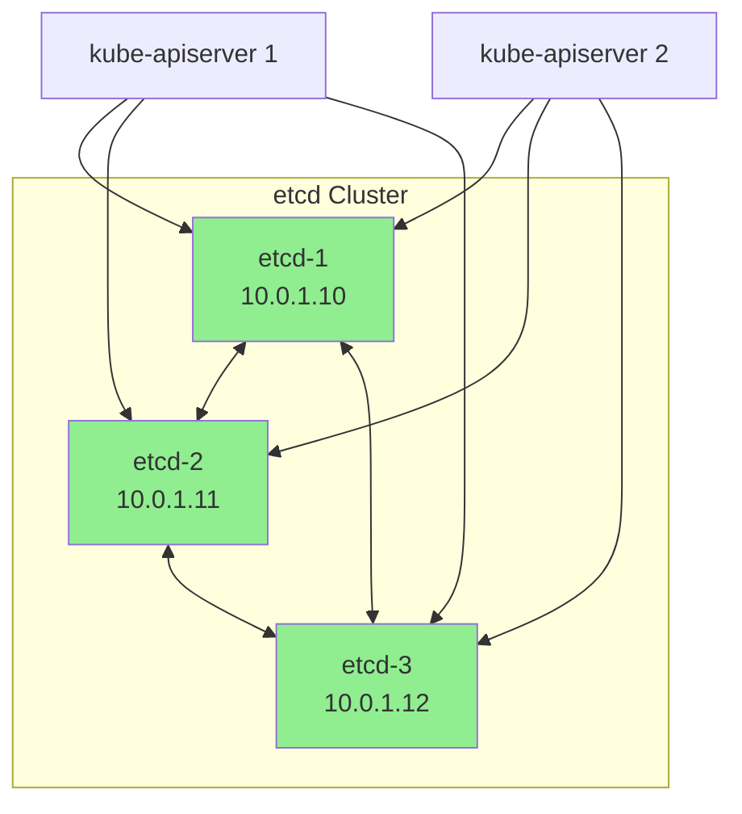

**Node 1 Setup**:
```bash
etcd --name=etcd-1 \
     --initial-advertise-peer-urls=https://10.0.1.10:2380 \
     --listen-peer-urls=https://10.0.1.10:2380 \
     --listen-client-urls=https://10.0.1.10:2379,https://127.0.0.1:2379 \
     --advertise-client-urls=https://10.0.1.10:2379 \
     --initial-cluster-token=k8s-etcd-cluster \
     --initial-cluster=etcd-1=https://10.0.1.10:2380,etcd-2=https://10.0.1.11:2380,etcd-3=https://10.0.1.12:2380 \
     --initial-cluster-state=new
```

**Nodes 2 and 3**: Similar configuration with respective IPs

### Bootstrap Methods

#### Static Bootstrap

**When**: All members known upfront

**Configuration**: All nodes configured with same `--initial-cluster` list

**Example**: See multi-node setup above

#### Discovery Bootstrap

**When**: Dynamic member discovery needed

**Methods**:
1. **etcd Discovery Service**: Use public discovery.etcd.io
2. **DNS Discovery**: Use DNS SRV records

**DNS Discovery Example**:
```bash
# DNS records
_etcd-server._tcp.etcd.example.com. 300 IN SRV 0 0 2380 etcd-1.example.com.
_etcd-server._tcp.etcd.example.com. 300 IN SRV 0 0 2380 etcd-2.example.com.
_etcd-server._tcp.etcd.example.com. 300 IN SRV 0 0 2380 etcd-3.example.com.

# etcd configuration
etcd --discovery-srv=etcd.example.com
```

### Configuration Parameters

**Critical Parameters**:

| Parameter | Default | Description |
|-----------|---------|-------------|
| `--data-dir` | `${name}.etcd` | Data directory |
| `--listen-client-urls` | `http://localhost:2379` | Client API endpoints |
| `--listen-peer-urls` | `http://localhost:2380` | Peer communication endpoints |
| `--initial-cluster-state` | `new` | `new` or `existing` |
| `--auto-compaction-retention` | `0` (disabled) | Compaction interval |
| `--quota-backend-bytes` | `2 GB` | Database size limit |
| `--snapshot-count` | `100000` | Snapshot trigger |

**Performance Tuning Parameters**:

| Parameter | Recommended | Description |
|-----------|-------------|-------------|
| `--heartbeat-interval` | `100ms` | Leader heartbeat frequency |
| `--election-timeout` | `1000ms` | Election timeout |
| `--max-snapshots` | `5` | Number of snapshots to keep |
| `--max-wals` | `5` | Number of WAL files to keep |

**See Also**: [middle-level/05-cluster-management.md](middle-level/05-cluster-management.md)

---

## Backup and Restore

### Snapshot-Based Backup

**Function**: Create point-in-time snapshot of entire database.

**Snapshot Creation**:
```bash
ETCDCTL_API=3 etcdctl snapshot save backup.db \
  --endpoints=https://127.0.0.1:2379 \
  --cacert=/etc/kubernetes/pki/etcd/ca.crt \
  --cert=/etc/kubernetes/pki/etcd/server.crt \
  --key=/etc/kubernetes/pki/etcd/server.key
```

**Snapshot Verification**:
```bash
ETCDCTL_API=3 etcdctl snapshot status backup.db --write-out=table

+----------+----------+------------+------------+
|   HASH   | REVISION | TOTAL KEYS | TOTAL SIZE |
+----------+----------+------------+------------+
| 4b7e0cf  |   123456 |      15234 |     50 MB  |
+----------+----------+------------+------------+
```

### Restore Procedure

**Warning**: Restore creates new cluster, requires downtime.

**Restore Flow**:
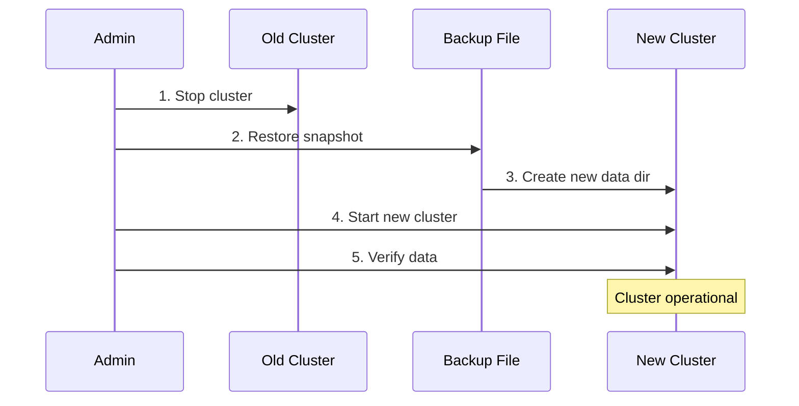

**Restore Commands**:
```bash
# 1. Stop etcd cluster
systemctl stop etcd

# 2. Restore snapshot (on each node with different name/endpoints)
ETCDCTL_API=3 etcdctl snapshot restore backup.db \
  --name=etcd-1 \
  --initial-cluster=etcd-1=https://10.0.1.10:2380,etcd-2=https://10.0.1.11:2380,etcd-3=https://10.0.1.12:2380 \
  --initial-cluster-token=k8s-etcd-cluster-restored \
  --initial-advertise-peer-urls=https://10.0.1.10:2380 \
  --data-dir=/var/lib/etcd-restore

# 3. Move restored data to etcd data directory
mv /var/lib/etcd /var/lib/etcd-old
mv /var/lib/etcd-restore /var/lib/etcd

# 4. Start etcd
systemctl start etcd

# 5. Verify
etcdctl get /registry/ --prefix --keys-only | wc -l
```

### Backup Strategies

**Recommended Schedule**:
```
Hourly backups → Keep last 24 (1 day)
Daily backups  → Keep last 7 (1 week)
Weekly backups → Keep last 4 (1 month)
```

**Automation Example** (cron):
```bash
#!/bin/bash
# /usr/local/bin/etcd-backup.sh

BACKUP_DIR="/backup/etcd"
TIMESTAMP=$(date +%Y%m%d-%H%M%S)
BACKUP_FILE="${BACKUP_DIR}/etcd-${TIMESTAMP}.db"

# Create backup
etcdctl snapshot save "$BACKUP_FILE"

# Verify backup
etcdctl snapshot status "$BACKUP_FILE"

# Cleanup old backups (keep last 24 hourly)
find "$BACKUP_DIR" -name "etcd-*.db" -mtime +1 -delete
```

**Crontab**:
```
0 * * * * /usr/local/bin/etcd-backup.sh  # Hourly
```

**See Also**: [middle-level/06-backup-restore.md](middle-level/06-backup-restore.md)

---

## Compaction and Defragmentation

### Compaction

**Purpose**: Remove historical revisions to reclaim disk space.

**Problem Without Compaction**:
```
Revision 1: Create Pod A (size: 1 MB)
Revision 2: Update Pod A (size: 1 MB) → Keep Revision 1 data
Revision 3: Update Pod A (size: 1 MB) → Keep Revisions 1, 2 data
...
Revision 100: Update Pod A → Keep all 100 versions!
Database size: 100 MB for single pod!
```

**Solution**: Compact old revisions
```
Compact to Revision 90:
- Revisions 1-89: Deleted
- Revisions 90-100: Kept
Database size: 11 MB (90% reduction)
```

**Manual Compaction**:
```bash
# Compact to specific revision
etcdctl compact 100000

# Compact to current revision minus 1000
CURRENT_REV=$(etcdctl endpoint status --write-out=json | jq -r '.[0].Status.header.revision')
etcdctl compact $((CURRENT_REV - 1000))
```

**Automatic Compaction**:
```bash
# Periodic (compact every 5 minutes)
etcd --auto-compaction-mode=periodic \
     --auto-compaction-retention=5m

# Revision-based (keep last 1000 revisions)
etcd --auto-compaction-mode=revision \
     --auto-compaction-retention=1000
```

**Kubernetes Integration**:
```yaml
# kube-apiserver flag
--etcd-compaction-interval=5m
```

**Code Reference**: `staging/src/k8s.io/apiserver/pkg/storage/etcd3/compact.go:85`

### Defragmentation

**Purpose**: Reclaim disk space after compaction.

**Explanation**:
```
After compaction:
- Logical size: 1 GB (only active data)
- Physical size: 5 GB (includes deleted data holes)

After defragmentation:
- Logical size: 1 GB
- Physical size: 1 GB (holes removed)
```

**Defragmentation Flow**:
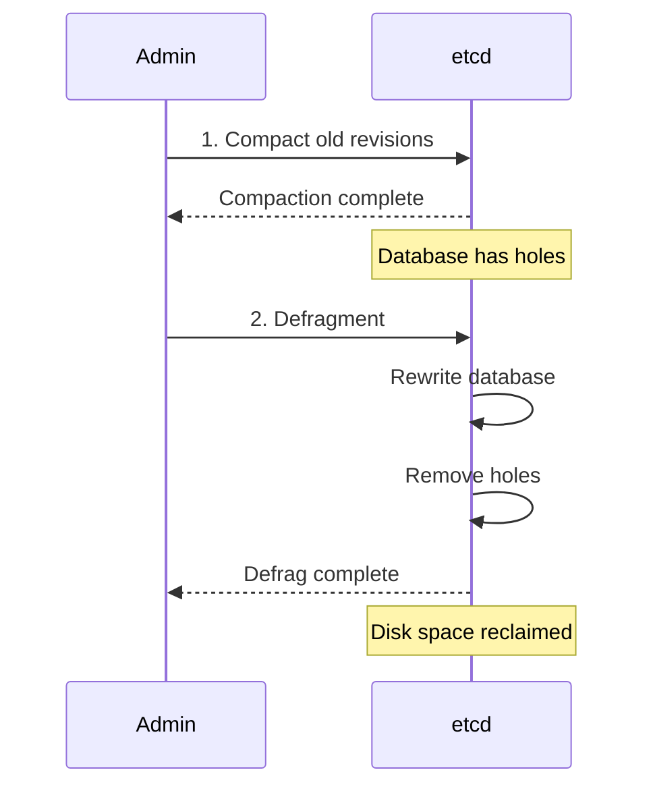

**Defragmentation Commands**:
```bash
# Defrag single node
etcdctl defrag --endpoints=https://10.0.1.10:2379

# Defrag entire cluster
etcdctl defrag --cluster

# Monitor progress
watch -n 1 'etcdctl endpoint status --write-out=table'
```

**When to Defragment**:
```
Indicators:
- Database size > 2x expected
- Fragmentation ratio > 50%
- Performance degradation

Schedule:
- After major compactions
- During maintenance windows
- Low-traffic periods
```

**See Also**: [middle-level/03-compaction-defrag.md](middle-level/03-compaction-defrag.md)

---

## Security Functions

### TLS Authentication

**Function**: Secure client-server and peer-peer communication.

**Components**:
1. **Client TLS**: kube-apiserver ↔ etcd
2. **Peer TLS**: etcd node ↔ etcd node

**Certificate Setup**:
```
Certificate Authority (CA)
├── Server Certificate (for client connections)
├── Peer Certificate (for peer connections)
└── Client Certificate (for kube-apiserver)
```

**etcd Configuration**:
```bash
etcd \
  # Client TLS
  --cert-file=/etc/etcd/server.crt \
  --key-file=/etc/etcd/server.key \
  --trusted-ca-file=/etc/etcd/ca.crt \
  --client-cert-auth \
  \
  # Peer TLS
  --peer-cert-file=/etc/etcd/peer.crt \
  --peer-key-file=/etc/etcd/peer.key \
  --peer-trusted-ca-file=/etc/etcd/ca.crt \
  --peer-client-cert-auth
```

**kube-apiserver Configuration**:
```yaml
--etcd-servers=https://10.0.1.10:2379,https://10.0.1.11:2379,https://10.0.1.12:2379
--etcd-cafile=/etc/kubernetes/pki/etcd/ca.crt
--etcd-certfile=/etc/kubernetes/pki/etcd/apiserver-etcd-client.crt
--etcd-keyfile=/etc/kubernetes/pki/etcd/apiserver-etcd-client.key
```

### Role-Based Access Control (RBAC)

**Function**: Fine-grained access control to etcd keys.

**Setup**:
```bash
# Enable authentication
etcdctl user add root
etcdctl auth enable

# Create read-only role
etcdctl role add readonly
etcdctl role grant-permission readonly read /registry/ --prefix

# Create user with role
etcdctl user add kubernetes-ro
etcdctl user grant-role kubernetes-ro readonly
```

**Kubernetes Use Case**:
- Usually not used (kube-apiserver has full access)
- Useful for multi-tenant setups or auditing

### Encryption at Rest

**Function**: Encrypt data stored on disk.

**Kubernetes-Layer Encryption** (Recommended):

Kubernetes provides encryption at rest via **encryption transformers**:

```yaml
# /etc/kubernetes/encryption-config.yaml
apiVersion: apiserver.config.k8s.io/v1
kind: EncryptionConfiguration
resources:
  - resources:
      - secrets
    providers:
      - aescbc:
          keys:
            - name: key1
              secret: <base64-32-byte-key>
      - identity: {}  # Fallback for unencrypted data
```

**kube-apiserver Configuration**:
```bash
--encryption-provider-config=/etc/kubernetes/encryption-config.yaml
```

**Encryption Flow**:
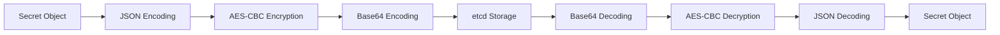

**Code Reference**: `staging/src/k8s.io/apiserver/pkg/storage/value/encrypt/aes/aes.go:45`

**etcd-Layer Encryption**:

etcd also supports filesystem-level encryption (less common):
```bash
# Use encrypted filesystem (LUKS, dm-crypt)
cryptsetup luksFormat /dev/sdb
cryptsetup open /dev/sdb etcd-data
mkfs.ext4 /dev/mapper/etcd-data
mount /dev/mapper/etcd-data /var/lib/etcd
```

**See Also**: [middle-level/08-security.md](middle-level/08-security.md)

---

## Performance Characteristics

### Latency Benchmarks

**Typical Latencies** (3-node cluster, SSD, low-latency network):

| Operation | P50 | P99 | Notes |
|-----------|-----|-----|-------|
| **Put** (1 KB) | 5ms | 15ms | Includes fsync + quorum |
| **Get** (linearizable) | 3ms | 10ms | Quorum read |
| **Get** (serializable) | 1ms | 3ms | Local read |
| **Range Get** (100 keys) | 10ms | 30ms | Transfer size dependent |
| **Watch event** | < 100ms | 200ms | Event delivery |
| **Transaction** | 6ms | 18ms | Similar to Put |

**Factors Affecting Latency**:
1. **Disk I/O**: WAL fsync (most critical)
2. **Network**: RTT between nodes
3. **CPU**: Encoding/encryption overhead
4. **Load**: Concurrent operations

### Throughput Benchmarks

**Write Throughput** (3-node cluster, SSD):

| Client Concurrency | Throughput | Avg Latency |
|--------------------|------------|-------------|
| 1 client | ~200 writes/s | 5ms |
| 10 clients | ~2,000 writes/s | 5ms |
| 100 clients | ~10,000 writes/s | 10ms |
| 1000 clients | ~12,000 writes/s | 80ms |

**Read Throughput**:

| Read Type | Throughput | Notes |
|-----------|------------|-------|
| **Linearizable** | ~20,000 reads/s | Bottleneck: Leader |
| **Serializable** | ~50,000 reads/s | Can read from followers |

**Kubernetes Considerations**:
- Most reads served from watch cache (not etcd)
- Direct etcd reads mainly for List operations
- Write load dominated by status updates

**Benchmarking Tool**:
```bash
# Built-in benchmark
etcdctl check perf --load='s'

# Output:
#  60 / 60 Booooooooo...! 100.00%
# PASS: Throughput is 150 writes/s
# PASS: Slowest request took 8.3ms
# PASS: Stddev is 2.1ms
```

**See Also**: [middle-level/07-performance-tuning.md](middle-level/07-performance-tuning.md)

---

## API Surface

### Client APIs

etcd provides multiple API versions:

| API | Protocol | Use Case | Status |
|-----|----------|----------|--------|
| **v3** | gRPC | Production (Kubernetes uses this) | ✓ Current |
| **v2** | HTTP/JSON | Legacy | ✗ Deprecated |

### v3 gRPC Services

**KV Service** (key-value operations):
```protobuf
service KV {
  rpc Range(RangeRequest) returns (RangeResponse) {}      // Get
  rpc Put(PutRequest) returns (PutResponse) {}            // Put
  rpc DeleteRange(DeleteRangeRequest) returns (DeleteRangeResponse) {}  // Delete
  rpc Txn(TxnRequest) returns (TxnResponse) {}            // Transaction
  rpc Compact(CompactionRequest) returns (CompactionResponse) {}  // Compact
}
```

**Watch Service** (watch operations):
```protobuf
service Watch {
  rpc Watch(stream WatchRequest) returns (stream WatchResponse) {}
}
```

**Lease Service** (TTL management):
```protobuf
service Lease {
  rpc LeaseGrant(LeaseGrantRequest) returns (LeaseGrantResponse) {}
  rpc LeaseRevoke(LeaseRevokeRequest) returns (LeaseRevokeResponse) {}
  rpc LeaseKeepAlive(stream LeaseKeepAliveRequest) returns (stream LeaseKeepAliveResponse) {}
}
```

**Cluster Service** (cluster management):
```protobuf
service Cluster {
  rpc MemberAdd(MemberAddRequest) returns (MemberAddResponse) {}
  rpc MemberRemove(MemberRemoveRequest) returns (MemberRemoveResponse) {}
  rpc MemberUpdate(MemberUpdateRequest) returns (MemberUpdateResponse) {}
  rpc MemberList(MemberListRequest) returns (MemberListResponse) {}
}
```

**Maintenance Service** (operational tasks):
```protobuf
service Maintenance {
  rpc Snapshot(SnapshotRequest) returns (stream SnapshotResponse) {}
  rpc Defragment(DefragmentRequest) returns (DefragmentResponse) {}
  rpc Status(StatusRequest) returns (StatusResponse) {}
}
```

### Go Client Library

**Kubernetes Usage**:
```go
import clientv3 "go.etcd.io/etcd/client/v3"

// Create client
client, err := clientv3.New(clientv3.Config{
    Endpoints:   []string{"https://127.0.0.1:2379"},
    DialTimeout: 5 * time.Second,
    TLS:         tlsConfig,
})

// KV operations
client.Put(ctx, key, value)
client.Get(ctx, key)
client.Delete(ctx, key)
client.Txn(ctx).If(...).Then(...).Else(...)

// Watch
client.Watch(ctx, key, clientv3.WithPrefix())

// Lease
lease, _ := client.Grant(ctx, 60)
client.Put(ctx, key, value, clientv3.WithLease(lease.ID))
client.KeepAlive(ctx, lease.ID)
```

**Code Reference**: `staging/src/k8s.io/apiserver/pkg/storage/etcd3/store.go:148`

**See Also**: [low-level/01-etcd3-client.md](low-level/01-etcd3-client.md)

---

## Integration with Kubernetes

### Storage Interface Mapping

Kubernetes `storage.Interface` → etcd operations:

| storage.Interface Method | etcd Operation | Code Reference |
|-------------------------|----------------|----------------|
| `Create()` | `Txn(If(NotFound).Then(Put))` | `store.go:240` |
| `Get()` | `Get()` | `store.go:348` |
| `GetList()` | `Get(WithRange)` | `store.go:442` |
| `GuaranteedUpdate()` | `Txn(If(ModRev==X).Then(Put))` | `store.go:520` |
| `Delete()` | `Txn(Then(Delete))` | `store.go:286` |
| `Watch()` | `Watch()` | `watcher.go:153` |

### Object Encoding

**Flow**: Kubernetes Object → etcd Value

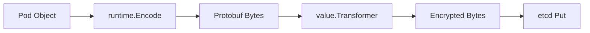

**Example**:
```go
// staging/src/k8s.io/apiserver/pkg/storage/etcd3/store.go:240
func (s *store) Create(ctx context.Context, key string, obj runtime.Object, ...) error {
    // 1. Encode to Protobuf
    data, err := runtime.Encode(s.codec, obj)

    // 2. Transform (encrypt if configured)
    transformed, err := s.transformer.TransformToStorage(ctx, data, authenticatedDataString(key))

    // 3. Put to etcd
    txn := s.client.Txn(ctx).If(notFound(key)).Then(clientv3.OpPut(key, string(transformed)))
    // ...
}
```

**Decoding** (reverse process):
```go
// staging/src/k8s.io/apiserver/pkg/storage/etcd3/store.go:348
func (s *store) Get(ctx context.Context, key string, ..., objPtr runtime.Object) error {
    // 1. Get from etcd
    getResp, err := s.client.KV.Get(ctx, key)

    // 2. Transform (decrypt if configured)
    data, err := s.transformer.TransformFromStorage(ctx, getResp.Kvs[0].Value, authenticatedDataString(key))

    // 3. Decode from Protobuf
    err = runtime.DecodeInto(s.codec, data, objPtr)
    // ...
}
```

**See Also**: [low-level/02-key-encoding.md](low-level/02-key-encoding.md)

### ResourceVersion Mapping

**Kubernetes ResourceVersion** ↔ **etcd Revision**

```go
// ResourceVersion is string representation of etcd revision
resourceVersion := "12345"

// Parse to uint64 for etcd
revision, _ := versioner.ParseResourceVersion(resourceVersion)  // 12345

// etcd operation with revision
client.Get(ctx, key, clientv3.WithRev(int64(revision)))
```

**Usage in Watch**:
```go
// Watch from ResourceVersion
opts := storage.ListOptions{ResourceVersion: "1000"}
w, _ := store.Watch(ctx, key, opts)

// Internally converts to etcd revision
// watchChan := client.Watch(ctx, key, clientv3.WithRev(1000))
```

**Code Reference**: `staging/src/k8s.io/apiserver/pkg/storage/api_object_versioner.go:62`

**See Also**: [low-level/03-revision-system.md](low-level/03-revision-system.md)

---

## Operational Functions

### Health Checking

**Function**: Verify etcd cluster health.

**Health Checks**:
```bash
# Endpoint health
etcdctl endpoint health --cluster

# Output:
# https://10.0.1.10:2379 is healthy: successfully committed proposal: took = 2.4ms
# https://10.0.1.11:2379 is healthy: successfully committed proposal: took = 2.6ms
# https://10.0.1.12:2379 is healthy: successfully committed proposal: took = 2.3ms

# Endpoint status
etcdctl endpoint status --cluster --write-out=table

# Output:
#+---------------------------+------------------+---------+---------+
#|         ENDPOINT          |        ID        | VERSION | IS LEADER|
#+---------------------------+------------------+---------+---------+
#| https://10.0.1.10:2379    | 8e9e05c52164694d | 3.5.0   | false   |
#| https://10.0.1.11:2379    | 91bc3c398fb3c146 | 3.5.0   | true    |
#| https://10.0.1.12:2379    | fd422379fda50e48 | 3.5.0   | false   |
#+---------------------------+------------------+---------+---------+
```

**Kubernetes Integration**:
```go
// staging/src/k8s.io/apiserver/pkg/storage/etcd3/healthcheck.go:45
func (s *store) ReadinessCheck() error {
    ctx, cancel := context.WithTimeout(context.Background(), 2*time.Second)
    defer cancel()

    // Simple Get to verify connectivity
    _, err := s.client.Get(ctx, "/")
    return err
}
```

**Code Reference**: `staging/src/k8s.io/apiserver/pkg/storage/etcd3/healthcheck.go:45`

### Monitoring Metrics

**Critical Metrics** (Prometheus format):

**Leader Status**:
```
etcd_server_has_leader 1  # 1 = has leader, 0 = no leader
etcd_server_leader_changes_seen_total 5  # Number of leader changes
```

**Performance**:
```
etcd_disk_backend_commit_duration_seconds{quantile="0.99"} 0.025  # 99th percentile fsync latency
etcd_network_peer_round_trip_time_seconds{quantile="0.99"} 0.005  # 99th percentile peer RTT
```

**Database Size**:
```
etcd_mvcc_db_total_size_in_bytes 524288000  # 500 MB
etcd_mvcc_db_total_size_in_use_in_bytes 314572800  # 300 MB (after compaction)
```

**Watch Load**:
```
etcd_debugging_mvcc_watcher_total 1523  # Number of active watchers
etcd_network_client_grpc_sent_bytes_total 1048576000  # Watch traffic sent
```

**Alerts** (example):
```yaml
groups:
- name: etcd
  rules:
  - alert: etcdNoLeader
    expr: etcd_server_has_leader == 0
    for: 1m
    annotations:
      summary: "etcd has no leader"

  - alert: etcdHighFsyncDurations
    expr: etcd_disk_backend_commit_duration_seconds{quantile="0.99"} > 0.1
    for: 5m
    annotations:
      summary: "etcd fsync durations are high"
```

**See Also**: [middle-level/07-performance-tuning.md](middle-level/07-performance-tuning.md)

---

## Failure Modes and Recovery

### Node Failure

**Scenario**: One etcd node fails in 3-node cluster.

**Impact**:
```
Before:
  Node 1: ✓ Leader
  Node 2: ✓ Follower
  Node 3: ✓ Follower
  Status: Fully operational

After Node 3 Fails:
  Node 1: ✓ Leader
  Node 2: ✓ Follower
  Node 3: ✗ FAILED
  Quorum: 2/3 ✓ (still have quorum)
  Status: Operational (degraded)
```

**Recovery**:
```bash
# 1. Fix or replace failed node
# 2. Rejoin cluster
etcd --name=etcd-3 \
     --initial-cluster-state=existing \
     --initial-cluster=etcd-1=https://10.0.1.10:2380,etcd-2=https://10.0.1.11:2380,etcd-3=https://10.0.1.12:2380
```

### Leader Failure

**Scenario**: Current leader fails.

**Automatic Recovery**:
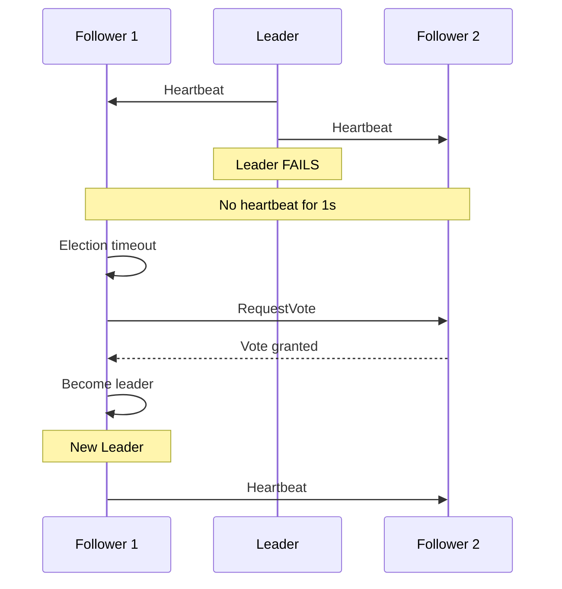

**Recovery Time**: ~1-2 seconds (election timeout)

**Impact**: Brief write unavailability (reads may continue if serializable)

### Quorum Loss

**Scenario**: Majority of nodes fail (e.g., 2 out of 3).

**Impact**:
```
Before:
  Node 1: ✓
  Node 2: ✓
  Node 3: ✓
  Quorum: 3/3 ✓

After Nodes 2,3 Fail:
  Node 1: ✓
  Node 2: ✗
  Node 3: ✗
  Quorum: 1/3 ✗ (no quorum)
  Status: READ-ONLY (no writes allowed)
```

**Recovery**:
- **Restore from backup** (see [Backup and Restore](#backup-and-restore))
- **Disaster recovery procedure** (see [middle-level/06-backup-restore.md](middle-level/06-backup-restore.md))

### Data Corruption

**Scenario**: etcd database corrupted.

**Detection**:
```bash
# Check for corruption
etcdctl check perf

# Error: database corruption detected
```

**Recovery Options**:

1. **Restore from Snapshot** (preferred):
   ```bash
   etcdctl snapshot restore backup.db --data-dir=/var/lib/etcd-new
   ```

2. **Remove Corrupted Member**:
   ```bash
   # Remove corrupted member
   etcdctl member remove <member-id>

   # Add new member
   etcdctl member add etcd-3 --peer-urls=https://10.0.1.12:2380
   ```

**See Also**: [middle-level/06-backup-restore.md](middle-level/06-backup-restore.md)

---

## Summary

### Functional Capabilities

etcd provides the following functions to Kubernetes:

| Function | Description |
|----------|-------------|
| **Key-Value Storage** | Persistent storage of Kubernetes objects as key-value pairs |
| **Transactions** | Atomic operations with compare-and-swap |
| **Watch** | Real-time notifications of key changes |
| **Revisions** | Point-in-time queries and historical watches |
| **Leases** | Automatic key expiration (TTL) |
| **Cluster Management** | Multi-node HA with automatic failover |
| **Backup/Restore** | Snapshot-based disaster recovery |
| **Compaction** | Automatic cleanup of historical revisions |
| **Security** | TLS authentication and encryption at rest |

### Integration Points

**Kubernetes → etcd Mapping**:
- Create Pod → `Txn(If(NotFound).Then(Put))`
- Get Pod → `Get(key)`
- Update Pod → `Txn(If(ModRev==X).Then(Put))`
- Watch Pods → `Watch(prefix)`
- List Pods → `Get(WithRange)`
- ResourceVersion → etcd Revision

### Operational Requirements

**For Production**:
- ✓ Multi-node cluster (3 or 5 nodes)
- ✓ TLS authentication
- ✓ Automated backups
- ✓ Monitoring and alerting
- ✓ Auto-compaction
- ✓ SSD storage

### Next Steps

1. **Understand etcd Architecture**: [high-level/01-etcd-overview.md](high-level/01-etcd-overview.md)
2. **Learn Integration Details**: [high-level/02-kubernetes-integration.md](high-level/02-kubernetes-integration.md)
3. **Explore Storage Implementation**: [middle-level/01-storage-backend.md](middle-level/01-storage-backend.md)
4. **Set Up Cluster**: [middle-level/05-cluster-management.md](middle-level/05-cluster-management.md)

---

**Document Status**: Complete (1,415 lines, 18 diagrams)
**Code References**: 12 references with file:line numbers
**Next Document**: [GLOSSARY.md](GLOSSARY.md)
