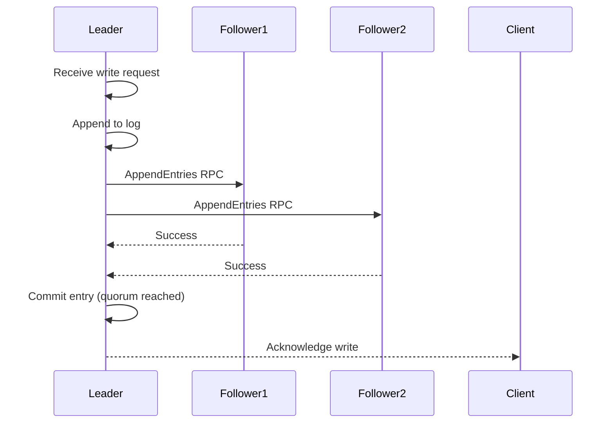

# etcd Integration Glossary

**Version**: 1.0
**Last Updated**: 2025-10-21
**Related Documents**: [00-README.md](00-README.md), [01-REQUIREMENTS.md](01-REQUIREMENTS.md), [02-FUNCTIONAL-SPEC.md](02-FUNCTIONAL-SPEC.md)

---

## Table of Contents

- [How to Use This Glossary](#how-to-use-this-glossary)
- [etcd Core Terms](#etcd-core-terms)
- [Raft Consensus Terms](#raft-consensus-terms)
- [Kubernetes Integration Terms](#kubernetes-integration-terms)
- [Storage and Data Model Terms](#storage-and-data-model-terms)
- [Watch and Event Terms](#watch-and-event-terms)
- [Transaction and Consistency Terms](#transaction-and-consistency-terms)
- [Operational Terms](#operational-terms)
- [Performance Terms](#performance-terms)
- [Security Terms](#security-terms)
- [API and Client Terms](#api-and-client-terms)
- [Quick Reference Table](#quick-reference-table)

---

## How to Use This Glossary

This glossary provides comprehensive definitions for etcd and Kubernetes storage terminology. Terms are organized by category for easy navigation.

**Conventions**:
- **→**: See also (related term)
- **Code**: Reference to code location
- **Example**: Usage example

**Cross-References**: Terms reference other terms and documentation sections.

---

## etcd Core Terms

### etcd

**Definition**: A distributed, reliable key-value store for the most critical data of a distributed system. Used by Kubernetes as its primary datastore.

**Etymology**: From `/etc` directory (Unix configuration) + `d` for distributed

**Key Properties**:
- Consistent (uses Raft consensus)
- Distributed (multi-node clusters)
- Reliable (survives failures)
- Fast (optimized for reads and writes)

**See**: [high-level/01-etcd-overview.md](high-level/01-etcd-overview.md)

---

### Key-Value Store

**Definition**: A database paradigm that stores data as key-value pairs, where each unique key maps to exactly one value.

**Structure**:
```
Key: "/registry/pods/default/nginx"
Value: <bytes representing Pod object>
```

**Characteristics**:
- Simple data model (no schemas)
- Fast lookups by key
- Hierarchical keys (convention, not enforced)
- Values are opaque bytes

**Kubernetes Usage**: All API objects stored as key-value pairs

**→ See Also**: Data Model, Object Encoding

---

### etcd3

**Definition**: The third major version of etcd, providing a gRPC-based API and improved performance. Kubernetes uses etcd3.

**Major Changes from etcd2**:
- gRPC instead of HTTP/JSON
- Flat key space with range operations
- Improved watch implementation
- Better performance and scalability

**API Version**: v3 (current)

**Code**: `staging/src/k8s.io/apiserver/pkg/storage/etcd3/store.go`

**→ See Also**: gRPC, clientv3

---

### etcdctl

**Definition**: Command-line interface for interacting with etcd clusters.

**Common Commands**:
```bash
# Get a key
etcdctl get /registry/pods/default/nginx

# Put a key
etcdctl put /mykey myvalue

# Delete a key
etcdctl delete /mykey

# List all keys with prefix
etcdctl get /registry/ --prefix --keys-only

# Watch for changes
etcdctl watch /registry/pods/ --prefix

# Cluster operations
etcdctl member list
etcdctl endpoint status
etcdctl snapshot save backup.db
```

**Environment Variables**:
```bash
export ETCDCTL_API=3  # Use v3 API
export ETCDCTL_ENDPOINTS=https://127.0.0.1:2379
```

**→ See Also**: clientv3, etcd3

---

### etcd Cluster

**Definition**: A group of etcd nodes working together to provide a distributed, fault-tolerant key-value store.

**Typical Sizes**:
- **1 node**: Development only (no HA)
- **3 nodes**: Production standard (tolerates 1 failure)
- **5 nodes**: High availability (tolerates 2 failures)
- **7 nodes**: Rare (diminishing returns)

**Topology**:
```
┌─────────┐     ┌─────────┐     ┌─────────┐
│ etcd-1  │────►│ etcd-2  │────►│ etcd-3  │
│ (Leader)│     │(Follower)│     │(Follower)│
└─────────┘     └─────────┘     └─────────┘
```

**→ See Also**: Quorum, Leader, Follower

**See**: [middle-level/05-cluster-management.md](middle-level/05-cluster-management.md)

---

## Raft Consensus Terms

### Raft

**Definition**: A consensus algorithm that etcd uses to maintain a replicated state machine across multiple nodes.

**Purpose**: Ensure all nodes agree on the same sequence of operations

**Key Components**:
1. **Leader Election**: Select one node as leader
2. **Log Replication**: Leader replicates entries to followers
3. **Safety**: Ensure consistency even during failures

**Properties**:
- Understandable (vs. Paxos)
- Strong consistency guarantees
- Automatic leader election
- Fault tolerance via quorum

**Paper**: [In Search of an Understandable Consensus Algorithm](https://raft.github.io/raft.pdf)

**→ See Also**: Leader, Follower, Quorum, Log Replication

---

### Leader

**Definition**: The etcd node responsible for handling all write requests and coordinating log replication to followers.

**Responsibilities**:
- Accept write requests
- Append entries to its log
- Replicate log entries to followers
- Send heartbeats to maintain leadership
- Coordinate commits

**Election**: Automatically elected via Raft when cluster starts or leader fails

**Identification**:
```bash
etcdctl endpoint status --write-out=table

# Output shows which node is leader
```

**→ See Also**: Follower, Leader Election, Heartbeat

---

### Follower

**Definition**: An etcd node that replicates log entries from the leader and participates in leader elections.

**Responsibilities**:
- Receive log entries from leader
- Append to local log
- Acknowledge successful replication
- Participate in elections if leader fails
- Serve read requests (if serializable reads enabled)

**State Transition**:
```
Follower ─(election timeout)─> Candidate ─(wins election)─> Leader
                                   └─(loses election)─> Follower
```

**→ See Also**: Leader, Candidate, Election Timeout

---

### Candidate

**Definition**: Temporary state of an etcd node during leader election, when it requests votes from other nodes.

**Lifecycle**:
1. Follower times out (no heartbeat from leader)
2. Becomes candidate
3. Increments term
4. Votes for itself
5. Requests votes from other nodes
6. If receives majority → becomes Leader
7. If another node becomes leader → becomes Follower
8. If election timeout → starts new election

**Duration**: Typically milliseconds to a few seconds

**→ See Also**: Leader Election, Term, Election Timeout

---

### Quorum

**Definition**: The minimum number of nodes required to make decisions in a Raft cluster, calculated as `(n/2) + 1`.

**Examples**:
```
3-node cluster: Quorum = (3/2) + 1 = 2 nodes
5-node cluster: Quorum = (5/2) + 1 = 3 nodes
7-node cluster: Quorum = (7/2) + 1 = 4 nodes
```

**Importance**:
- **Writes**: Require quorum acknowledgment
- **Leader election**: Requires quorum votes
- **Safety**: Prevents split-brain

**Fault Tolerance**:
```
3 nodes → Tolerates 1 failure (2/3 quorum still possible)
5 nodes → Tolerates 2 failures (3/5 quorum still possible)
```

**→ See Also**: Raft, Leader Election, Split-Brain

---

### Log Replication

**Definition**: The process by which the leader propagates log entries to follower nodes.

**Flow**:


**Guarantees**:
- Log entries committed only after quorum replication
- Followers apply entries in order
- Leader never overwrites committed entries

**→ See Also**: Raft, Leader, Follower, Commit

---

### Heartbeat

**Definition**: Periodic messages sent by the leader to followers to maintain authority and prevent new elections.

**Frequency**: Typically 100ms (configurable via `--heartbeat-interval`)

**Purpose**:
- Prove leader is alive
- Prevent unnecessary elections
- Can piggyback log entries

**Failure**: If followers don't receive heartbeat for election timeout period, they start a new election

**→ See Also**: Leader, Election Timeout, Leader Election

---

### Election Timeout

**Definition**: The duration a follower waits without receiving a heartbeat before starting a new leader election.

**Default**: 1000ms (configurable via `--election-timeout`)

**Randomization**: Each node uses a slightly randomized timeout to avoid simultaneous elections

**Trade-off**:
- **Shorter timeout**: Faster failover, more frequent elections
- **Longer timeout**: Slower failover, more stability

**→ See Also**: Leader Election, Heartbeat, Candidate

---

### Term

**Definition**: A monotonically increasing logical clock value in Raft, incremented each time a new leader election starts.

**Purpose**:
- Detect stale leaders
- Ensure log consistency
- Order elections

**Properties**:
- Never decreases
- Each term has at most one leader
- Nodes reject messages from earlier terms

**Usage**:
```
Term 1: Node A is leader
Term 2: Node B is leader (after A fails)
Term 3: Node C is leader (after B fails)
```

**→ See Also**: Leader, Raft, Leader Election

---

### Commit

**Definition**: The act of permanently applying a log entry to the state machine after it has been replicated to a quorum.

**Commit Process**:
1. Leader appends entry to log
2. Leader replicates to followers
3. Quorum of followers acknowledge
4. Leader marks entry as committed
5. Leader applies to state machine
6. Leader notifies followers to commit

**Guarantee**: Committed entries are durable and will never be lost

**Code**: Internal to etcd Raft implementation

**→ See Also**: Log Replication, Quorum, State Machine

---

### WAL (Write-Ahead Log)

**Definition**: A log file where etcd writes all changes before applying them to the state machine, ensuring durability.

**Purpose**:
- Durability: Survive crashes
- Recovery: Replay log after restart
- Replication: Send log entries to followers

**Location**: `${data-dir}/member/wal/`

**Properties**:
- Append-only
- fsynced to disk before acknowledgment
- Segmented (multiple files)

**Performance Impact**: fsync latency is critical (use SSD)

**→ See Also**: fsync, Snapshot, Durability

---

### fsync

**Definition**: Operating system call that forces all buffered writes to disk, ensuring durability.

**Why Critical**: Without fsync, data may be lost on power failure

**Performance**: Major source of write latency (~5-10ms on SSD)

**etcd Usage**: Called after each WAL write

**Optimization**: Use fast storage (NVMe SSD) to minimize fsync latency

**Monitoring**:
```
etcd_disk_backend_commit_duration_seconds{quantile="0.99"}
```

**→ See Also**: WAL, Durability, Performance

---

## Kubernetes Integration Terms

### storage.Interface

**Definition**: Go interface defining the contract for Kubernetes storage backends.

**Location**: `staging/src/k8s.io/apiserver/pkg/storage/interfaces.go`

**Key Methods**:
```go
type Interface interface {
    Create(ctx, key string, obj, out runtime.Object, ttl uint64) error
    Get(ctx, key string, opts GetOptions, objPtr runtime.Object) error
    GetList(ctx, key string, opts ListOptions, listObj runtime.Object) error
    GuaranteedUpdate(ctx, key string, destination runtime.Object, ...) error
    Delete(ctx, key string, ...) error
    Watch(ctx, key string, opts ListOptions) (watch.Interface, error)
}
```

**Implementations**:
- `etcd3.store`: Production implementation (etcd3 backend)
- Others: Possible for testing or alternative backends

**→ See Also**: etcd3.store, GuaranteedUpdate

---

### etcd3.store

**Definition**: Kubernetes implementation of `storage.Interface` that uses etcd3 as the backend.

**Location**: `staging/src/k8s.io/apiserver/pkg/storage/etcd3/store.go:80`

**Structure**:
```go
type store struct {
    client             *kubernetes.Client
    codec              runtime.Codec
    versioner          storage.Versioner
    transformer        value.Transformer
    pathPrefix         string
    groupResource      schema.GroupResource
    watcher            *watcher
    leaseManager       *leaseManager
    // ...
}
```

**Responsibilities**:
- Encode Kubernetes objects to bytes
- Encrypt data (if configured)
- Map operations to etcd API calls
- Handle errors and retries

**→ See Also**: storage.Interface, clientv3, Object Encoding

---

### ResourceVersion

**Definition**: Kubernetes concept representing the version of a resource, mapped to etcd's revision number.

**Type**: String (though internally represents uint64)

**Usage**:
```yaml
apiVersion: v1
kind: Pod
metadata:
  name: nginx
  resourceVersion: "12345"  # From etcd revision
```

**In APIs**:
- **List**: `?resourceVersion=12345` (list from specific version)
- **Watch**: `?resourceVersion=12345` (watch from specific version)
- **Get**: Returns current resourceVersion

**Mapping**:
```go
// Kubernetes ResourceVersion (string) ↔ etcd Revision (uint64)
resourceVersion := "12345"
revision := uint64(12345)
```

**Code**: `staging/src/k8s.io/apiserver/pkg/storage/api_object_versioner.go`

**→ See Also**: Revision, ModRevision, Watch

---

### Watch Cache

**Definition**: In-memory cache in kube-apiserver that stores recent resource versions to reduce load on etcd.

**Purpose**:
- Serve watch requests from memory
- Reduce etcd watch connections
- Improve performance at scale

**Architecture**:
```
Client Watch Request
    ↓
Watch Cache (memory)
    ↓ (cache miss or initial watch)
etcd Watch
```

**Benefits**:
- Scales to 1000s of watches
- Faster watch responses
- Lower etcd load

**Trade-off**: Additional memory usage in kube-apiserver

**Code**: `staging/src/k8s.io/apiserver/pkg/storage/cacher/cacher.go`

**See**: [middle-level/02-watch-implementation.md](middle-level/02-watch-implementation.md)

**→ See Also**: Watch, cacher, Reflector

---

### Object Encoding

**Definition**: The process of converting Kubernetes API objects to bytes for storage in etcd.

**Flow**:
```
Pod Object
    ↓ (runtime.Encode)
Protobuf Bytes
    ↓ (value.Transformer)
Encrypted Bytes (if configured)
    ↓
etcd Value
```

**Encoding Formats**:
- **Protobuf** (default): Compact, fast
- **JSON**: Human-readable, larger

**Code**: `staging/src/k8s.io/apiserver/pkg/storage/etcd3/store.go:240` (Create method)

**→ See Also**: Protobuf, Encryption at Rest, value.Transformer

---

### Storage Backend

**Definition**: The component responsible for persisting Kubernetes API objects, typically etcd.

**Configuration** (kube-apiserver):
```yaml
--etcd-servers=https://127.0.0.1:2379
--storage-backend=etcd3  # Default
```

**Alternatives**:
- `etcd3`: Standard (production)
- Others: Experimental or for testing

**Abstraction**: `storage.Interface` allows swapping backends

**→ See Also**: storage.Interface, etcd3, kube-apiserver

---

### GuaranteedUpdate

**Definition**: Kubernetes storage operation that retries updates until successful, handling conflicts via optimistic concurrency.

**Signature**:
```go
GuaranteedUpdate(ctx, key string, destination runtime.Object, ignoreNotFound bool, preconditions *Preconditions, tryUpdate UpdateFunc, cachedExistingObject runtime.Object) error
```

**Pattern**:
```go
for {
    // 1. Read current object + revision
    current := read(key)

    // 2. Apply user's update function
    updated := tryUpdate(current)

    // 3. Attempt atomic update
    if atomicUpdate(key, updated, expectedRevision=current.revision):
        return success
    // 4. Conflict → retry
}
```

**Use Cases**:
- Pod status updates
- Resource quota updates
- Any read-modify-write operation

**Code**: `staging/src/k8s.io/apiserver/pkg/storage/etcd3/store.go:520`

**→ See Also**: Optimistic Concurrency, Transaction, ModRevision

---

## Storage and Data Model Terms

### Revision

**Definition**: etcd's global, monotonically increasing counter that increments with every write operation.

**Properties**:
- **Global**: Single counter for entire database
- **Monotonic**: Always increases, never decreases
- **Unique**: Each write gets unique revision
- **Persistent**: Survives restarts

**Example Timeline**:
```
Rev 0: (empty database)
Rev 1: Create /foo → "bar"
Rev 2: Create /baz → "qux"
Rev 3: Update /foo → "new-bar"
Rev 4: Delete /baz
```

**Kubernetes Mapping**: Revision → ResourceVersion

**Code**: Internal to etcd

**→ See Also**: ResourceVersion, ModRevision, CreateRevision

---

### ModRevision

**Definition**: The revision number when a specific key was last modified.

**Example**:
```
Current Revision: 100

Key /foo:
  CreateRevision: 50  (created at revision 50)
  ModRevision: 95     (last modified at revision 95)
  Version: 5          (modified 5 times)

Key /bar:
  CreateRevision: 98
  ModRevision: 98     (never modified since creation)
  Version: 1
```

**Usage**: Optimistic concurrency (compare ModRevision before update)

**→ See Also**: Revision, CreateRevision, Version, Optimistic Concurrency

---

### CreateRevision

**Definition**: The revision number when a key was created.

**Properties**:
- Set when key is created
- Never changes (immutable)
- Deleted when key is deleted

**Usage**: Determine key age or creation order

**→ See Also**: Revision, ModRevision

---

### Version

**Definition**: The number of times a key has been updated (starts at 1).

**Example**:
```
Create key:  Version = 1
Update key:  Version = 2
Update key:  Version = 3
```

**Reset**: Version resets to 1 if key is deleted and recreated

**→ See Also**: ModRevision, Revision

---

### Lease

**Definition**: A time-based lease that can be attached to keys for automatic expiration (TTL).

**Purpose**: Implement time-to-live (TTL) for keys

**Usage**:
```go
// 1. Create lease (60 seconds)
lease, _ := client.Grant(ctx, 60)

// 2. Attach key to lease
client.Put(ctx, key, value, clientv3.WithLease(lease.ID))

// 3. Keep lease alive (optional)
ch, _ := client.KeepAlive(ctx, lease.ID)

// 4. Lease expires → key deleted automatically
```

**Kubernetes Use Case**: Leader election (coordinator leases)

**Code**: `staging/src/k8s.io/apiserver/pkg/storage/etcd3/lease_manager.go`

**→ See Also**: TTL, KeepAlive, Leader Election

---

### TTL (Time-to-Live)

**Definition**: Duration after which a key automatically expires and is deleted.

**Implementation**: Via Lease mechanism in etcd3

**Common Durations**:
- Leader election: 15-60 seconds
- Ephemeral state: Minutes to hours

**→ See Also**: Lease, KeepAlive

---

### Compaction

**Definition**: The process of removing historical revisions of keys to reclaim storage space.

**Why Needed**:
```
Without compaction:
  Rev 1-10000: All kept → 10 GB database

With compaction (keep last 1000 revisions):
  Rev 1-9000: Deleted
  Rev 9001-10000: Kept → 1 GB database
```

**Types**:
1. **Periodic**: Compact every X minutes
   ```bash
   etcd --auto-compaction-mode=periodic --auto-compaction-retention=5m
   ```

2. **Revision**: Keep last N revisions
   ```bash
   etcd --auto-compaction-mode=revision --auto-compaction-retention=1000
   ```

**Manual Compaction**:
```bash
etcdctl compact 100000  # Compact to revision 100000
```

**Impact**: Clients cannot watch from compacted revisions

**Code**: `staging/src/k8s.io/apiserver/pkg/storage/etcd3/compact.go`

**See**: [middle-level/03-compaction-defrag.md](middle-level/03-compaction-defrag.md)

**→ See Also**: Defragmentation, Revision, Database Size

---

### Defragmentation

**Definition**: Process of rewriting the etcd database to reclaim disk space left by compaction.

**Problem**:
```
After compaction:
  Logical size: 1 GB (active data)
  Physical size: 5 GB (includes "holes" from deleted data)

After defragmentation:
  Logical size: 1 GB
  Physical size: 1 GB (holes removed)
```

**Command**:
```bash
# Defrag all nodes
etcdctl defrag --cluster
```

**When to Run**:
- After major compactions
- When disk usage high despite compaction
- During maintenance windows

**Impact**: Temporary performance degradation during defrag

**See**: [middle-level/03-compaction-defrag.md](middle-level/03-compaction-defrag.md)

**→ See Also**: Compaction, Database Size

---

### Snapshot

**Definition**: Point-in-time backup of the entire etcd database.

**Creation**:
```bash
etcdctl snapshot save backup-$(date +%Y%m%d).db
```

**Contents**: Complete database state at specific revision

**Uses**:
- Disaster recovery
- Cluster migration
- Testing

**Verification**:
```bash
etcdctl snapshot status backup.db --write-out=table
```

**See**: [middle-level/06-backup-restore.md](middle-level/06-backup-restore.md)

**→ See Also**: Backup, Restore

---

## Watch and Event Terms

### Watch

**Definition**: Mechanism to receive real-time notifications when keys change.

**Types**:
1. **Single key watch**: `Watch(key)`
2. **Prefix watch**: `Watch(key, WithPrefix())`
3. **Range watch**: `Watch(start, WithRange(end))`

**Features**:
- Real-time notifications
- Resume from specific revision
- Reliable delivery
- Long-lived gRPC streams

**Example**:
```go
watchChan := client.Watch(ctx, "/registry/pods/", clientv3.WithPrefix())
for watchResp := range watchChan {
    for _, event := range watchResp.Events {
        fmt.Printf("%s: %s\n", event.Type, event.Kv.Key)
    }
}
```

**Code**: `staging/src/k8s.io/apiserver/pkg/storage/etcd3/watcher.go`

**See**: [high-level/04-watch-mechanism.md](high-level/04-watch-mechanism.md)

**→ See Also**: Watch Event, Watch Stream, Watch Progress

---

### Watch Event

**Definition**: Notification delivered to a watch client when a watched key changes.

**Event Types**:
- **PUT**: Key created or updated
- **DELETE**: Key deleted

**Structure**:
```go
type Event struct {
    Type   EventType  // PUT or DELETE
    Kv     *KeyValue  // Current state
    PrevKv *KeyValue  // Previous state (if WithPrevKV)
}
```

**Kubernetes Mapping**:
```
etcd PUT (PrevKv=nil) → Kubernetes ADDED
etcd PUT (PrevKv≠nil) → Kubernetes MODIFIED
etcd DELETE → Kubernetes DELETED
```

**→ See Also**: Watch, Watch Stream

---

### Watch Stream

**Definition**: Long-lived gRPC connection over which watch events are delivered.

**Lifecycle**:
1. Client creates watch
2. Server opens stream
3. Events delivered as they occur
4. Client cancels or stream fails

**Properties**:
- Bidirectional (requests and responses)
- Low latency (push-based, not polling)
- Efficient (single connection for multiple watches)

**→ See Also**: Watch, gRPC

---

### Watch Progress / Bookmark

**Definition**: Periodic notification indicating the watch is up-to-date, even with no changes.

**Purpose**: Confirm watch is not lagging

**Example**:
```go
watchChan := client.Watch(ctx, key, clientv3.WithProgressNotify())
for resp := range watchChan {
    if resp.IsProgressNotify() {
        fmt.Printf("Up-to-date at revision %d\n", resp.Header.Revision)
    }
}
```

**Kubernetes Use**: Watch cache synchronization

**→ See Also**: Watch, Revision

---

### Watch Cancellation

**Definition**: Process of stopping an active watch.

**Methods**:
1. **Context cancellation**:
   ```go
   ctx, cancel := context.WithCancel(context.Background())
   watchChan := client.Watch(ctx, key)
   cancel()  // Stops watch
   ```

2. **Stream close**: Close watch channel

**Clean Shutdown**: Always cancel watches to free resources

**→ See Also**: Watch, Watch Stream

---

## Transaction and Consistency Terms

### Transaction (Txn)

**Definition**: Atomic execution of multiple operations with conditional logic.

**Structure**:
```
IF <conditions>
THEN <operations>
ELSE <operations>
```

**Example**:
```go
txn := client.Txn(ctx).
    If(clientv3.Compare(clientv3.Value(key), "=", "expected")).
    Then(clientv3.OpPut(key, "new-value")).
    Else(clientv3.OpGet(key))

resp, _ := txn.Commit()
```

**Guarantees**:
- Atomicity: All ops succeed or all fail
- Isolation: No interference from other operations
- Consistency: Maintains database invariants

**→ See Also**: Compare, OpPut, OpGet, OpDelete

---

### Compare-and-Swap (CAS)

**Definition**: Atomic operation that updates a value only if it matches the expected value.

**Pattern**:
```
IF value == expected_value:
    value = new_value
    return SUCCESS
ELSE:
    return FAILURE
```

**etcd Implementation**: Via transaction

**Usage**: Optimistic concurrency control

**→ See Also**: Transaction, Optimistic Concurrency

---

### Optimistic Concurrency

**Definition**: Concurrency control strategy that assumes conflicts are rare and detects them rather than preventing them.

**Pattern**:
1. Read value + version
2. Modify locally
3. Attempt write with version check
4. If conflict → retry

**Advantages**:
- No locks needed
- Better performance
- Scales well

**Disadvantages**:
- Retries on conflict
- Possible livelock (rare)

**Kubernetes Usage**: `GuaranteedUpdate` pattern

**→ See Also**: GuaranteedUpdate, Compare-and-Swap, ModRevision

---

### Linearizability

**Definition**: Strongest consistency guarantee; operations appear to execute instantaneously and respect real-time ordering.

**Guarantee**: If operation A completes before operation B starts, all nodes see A before B

**etcd Default**: All operations are linearizable

**Trade-off**: Slower than weaker consistency (requires quorum)

**→ See Also**: Serializability, Consistency

---

### Serializability

**Definition**: Weaker consistency allowing operations to appear in any order consistent with some serial execution.

**etcd Usage**: Optional for reads
```go
client.Get(ctx, key, clientv3.WithSerializable())
```

**Benefits**:
- Faster reads (no leader contact)
- Can read from followers

**Trade-off**: May return stale data

**Use Case**: Non-critical reads, dashboards

**→ See Also**: Linearizability, Follower

---

## Operational Terms

### Backup

**Definition**: Copy of etcd database for disaster recovery.

**Method**: Snapshot

**Best Practices**:
- Hourly snapshots (keep 24)
- Daily snapshots (keep 7)
- Weekly snapshots (keep 4)
- Store off-cluster

**Automation**:
```bash
#!/bin/bash
etcdctl snapshot save /backup/etcd-$(date +%Y%m%d-%H%M%S).db
```

**See**: [middle-level/06-backup-restore.md](middle-level/06-backup-restore.md)

**→ See Also**: Snapshot, Restore

---

### Restore

**Definition**: Process of recovering etcd cluster from a snapshot.

**Procedure**:
1. Stop cluster
2. Restore snapshot to new data directory
3. Start cluster with new data

**Downtime**: Required (destructive operation)

**Testing**: Test restores regularly

**See**: [middle-level/06-backup-restore.md](middle-level/06-backup-restore.md)

**→ See Also**: Snapshot, Backup

---

### Split-Brain

**Definition**: Dangerous scenario where a cluster is partitioned into multiple groups, each believing it's the primary.

**Example**:
```
Network Partition:
  Group A: Nodes 1,2 (thinks it's primary)
  Group B: Node 3 (thinks it's primary)
Result: Conflicting writes, data corruption
```

**etcd Prevention**: Quorum requirement (only majority can operate)

**→ See Also**: Quorum, Network Partition

---

### Network Partition

**Definition**: Network failure that splits a cluster into isolated groups.

**etcd Behavior**:
```
3-node cluster partitioned:
  Partition 1: Node 1,2 (quorum) → Operational
  Partition 2: Node 3 (minority) → Read-only
```

**Recovery**: Automatic when network heals

**→ See Also**: Split-Brain, Quorum

---

### Member

**Definition**: Single node in an etcd cluster.

**Operations**:
```bash
# List members
etcdctl member list

# Add member
etcdctl member add node4 --peer-urls=https://10.0.1.14:2380

# Remove member
etcdctl member remove <member-id>

# Update member
etcdctl member update <member-id> --peer-urls=https://10.0.1.10:2381
```

**States**:
- **Started**: Fully operational
- **Unstarted**: Added but not yet started
- **Learner**: Catching up (not voting)

**→ See Also**: Cluster, Quorum

---

### Learner

**Definition**: Special member type that receives log replication but doesn't vote in elections.

**Purpose**:
- Add new member without impacting quorum
- Allows member to catch up before becoming voting member

**Promotion**: Can be promoted to voting member after catching up

**Usage**:
```bash
# Add learner
etcdctl member add node4 --learner --peer-urls=https://10.0.1.14:2380

# Promote to voting member
etcdctl member promote <member-id>
```

**→ See Also**: Member, Quorum

---

### Peer

**Definition**: etcd cluster member, as seen by other members.

**Peer Communication**:
- Port: 2380 (default)
- Protocol: gRPC
- Purpose: Raft consensus, log replication

**Configuration**:
```bash
--listen-peer-urls=https://10.0.1.10:2380
--initial-advertise-peer-urls=https://10.0.1.10:2380
```

**→ See Also**: Member, Cluster

---

### Client URL

**Definition**: Endpoint where etcd serves client requests.

**Default**: `http://localhost:2379` or `https://localhost:2379`

**Configuration**:
```bash
--listen-client-urls=https://10.0.1.10:2379,https://127.0.0.1:2379
--advertise-client-urls=https://10.0.1.10:2379
```

**Usage**: kube-apiserver connects to these URLs

**→ See Also**: Peer, etcd Cluster

---

### Peer URL

**Definition**: Endpoint where etcd communicates with other cluster members.

**Default**: `http://localhost:2380` or `https://localhost:2380`

**Purpose**: Raft consensus, log replication

**→ See Also**: Client URL, Cluster

---

## Performance Terms

### Latency

**Definition**: Time from initiating an operation to receiving a response.

**Types**:
- **Write latency**: Time for Put/Delete (~5-15ms)
- **Read latency**: Time for Get (~1-10ms depending on consistency)
- **Watch latency**: Time from event to notification (~100ms)

**Factors**:
- Disk I/O (fsync)
- Network RTT
- CPU overhead
- Cluster size

**Monitoring**:
```
etcd_disk_backend_commit_duration_seconds
etcd_network_peer_round_trip_time_seconds
```

**See**: [middle-level/07-performance-tuning.md](middle-level/07-performance-tuning.md)

**→ See Also**: fsync, Throughput

---

### Throughput

**Definition**: Number of operations per second the cluster can handle.

**Typical Values** (3-node cluster, SSD):
- Writes: ~10,000 ops/s
- Reads (linearizable): ~20,000 ops/s
- Reads (serializable): ~50,000 ops/s

**Bottleneck**: Write throughput limited by Raft quorum

**→ See Also**: Latency, Performance Tuning

---

### Database Size

**Definition**: Total size of etcd database on disk.

**Components**:
- Active data
- Historical revisions (if not compacted)
- Free space (after deletion)

**Limits**:
- Default quota: 2 GB
- Recommended max: 8 GB
- Hard limit: ~10 GB (performance degrades)

**Management**:
```bash
# Check size
etcdctl endpoint status --write-out=table

# Compact to reduce size
etcdctl compact <revision>

# Defrag to reclaim space
etcdctl defrag
```

**Monitoring**:
```
etcd_mvcc_db_total_size_in_bytes
etcd_mvcc_db_total_size_in_use_in_bytes
```

**→ See Also**: Compaction, Defragmentation, Quota

---

### Quota

**Definition**: Maximum allowed database size, enforced by etcd.

**Default**: 2 GB

**Configuration**:
```bash
etcd --quota-backend-bytes=8589934592  # 8 GB
```

**Behavior When Quota Exceeded**:
- Cluster enters read-only mode
- All writes rejected
- Alarms raised

**Recovery**:
```bash
# 1. Compact old revisions
etcdctl compact <revision>

# 2. Defragment
etcdctl defrag

# 3. Disarm alarm
etcdctl alarm disarm
```

**Monitoring**:
```
etcd_mvcc_db_total_size_in_bytes / quota-backend-bytes
```

**→ See Also**: Database Size, Compaction, Defragmentation

---

### IOPS (Input/Output Operations Per Second)

**Definition**: Measure of storage device performance.

**etcd Requirements**:
- **Minimum**: 50 sequential IOPS
- **Recommended**: 500+ IOPS (SSD)
- **Optimal**: 3000+ IOPS (NVMe)

**Why Critical**: WAL fsync is on critical path

**Measurement**:
```bash
# Test disk IOPS
fio --filename=/var/lib/etcd/test --size=100m --direct=1 \
    --rw=write --bs=4k --ioengine=sync --iodepth=1
```

**→ See Also**: fsync, Latency, SSD

---

### SSD (Solid State Drive)

**Definition**: Fast storage device with low latency, recommended for etcd.

**Why Recommended**:
- Low fsync latency (< 1ms vs 10ms for HDD)
- High IOPS
- Consistent performance

**etcd Recommendation**: Always use SSD for production

**Alternative**: NVMe (even faster)

**→ See Also**: IOPS, fsync, Performance

---

## Security Terms

### TLS (Transport Layer Security)

**Definition**: Cryptographic protocol for secure communication.

**etcd Usage**:
1. **Client TLS**: Secure client-server communication
2. **Peer TLS**: Secure peer-peer communication

**Configuration**:
```bash
etcd \
  --cert-file=/etc/etcd/server.crt \
  --key-file=/etc/etcd/server.key \
  --trusted-ca-file=/etc/etcd/ca.crt \
  --client-cert-auth \
  --peer-cert-file=/etc/etcd/peer.crt \
  --peer-key-file=/etc/etcd/peer.key \
  --peer-client-cert-auth
```

**See**: [middle-level/08-security.md](middle-level/08-security.md)

**→ See Also**: Certificate, CA, Encryption

---

### Certificate

**Definition**: Digital document proving identity, used for TLS authentication.

**Types for etcd**:
- **CA Certificate**: Root of trust
- **Server Certificate**: etcd server identity
- **Peer Certificate**: etcd peer identity
- **Client Certificate**: Client (kube-apiserver) identity

**Generation** (example with cfssl):
```bash
cfssl gencert -ca=ca.pem -ca-key=ca-key.pem server-csr.json | cfssljson -bare server
```

**→ See Also**: TLS, CA, Authentication

---

### CA (Certificate Authority)

**Definition**: Entity that issues and signs certificates.

**etcd Setup**: Create own CA for etcd cluster

**Trust Chain**:
```
CA Certificate (self-signed)
├── Server Certificate (signed by CA)
├── Peer Certificate (signed by CA)
└── Client Certificate (signed by CA)
```

**→ See Also**: Certificate, TLS

---

### Encryption at Rest

**Definition**: Encrypting data when stored on disk.

**Kubernetes Implementation**: Encryption transformers in kube-apiserver

**Configuration**:
```yaml
apiVersion: apiserver.config.k8s.io/v1
kind: EncryptionConfiguration
resources:
  - resources: [secrets]
    providers:
      - aescbc:
          keys:
            - name: key1
              secret: <base64-encoded-key>
```

**Code**: `staging/src/k8s.io/apiserver/pkg/storage/value/encrypt/`

**See**: [middle-level/08-security.md](middle-level/08-security.md)

**→ See Also**: AES-CBC, value.Transformer

---

### AES-CBC

**Definition**: Encryption algorithm (Advanced Encryption Standard - Cipher Block Chaining) used by Kubernetes for encryption at rest.

**Key Size**: 256-bit (32 bytes)

**Performance**: Fast, hardware-accelerated on modern CPUs

**Usage**: Encrypt Secrets and ConfigMaps before storing in etcd

**→ See Also**: Encryption at Rest, Secret

---

### RBAC (Role-Based Access Control)

**Definition**: etcd access control mechanism based on users and roles.

**Setup**:
```bash
# Enable authentication
etcdctl user add root
etcdctl auth enable

# Create role
etcdctl role add readonly
etcdctl role grant-permission readonly read /registry/ --prefix

# Assign role to user
etcdctl user add kube
etcdctl user grant-role kube readonly
```

**Kubernetes Use**: Typically not used (kube-apiserver has full access)

**→ See Also**: Authentication, Authorization

---

## API and Client Terms

### clientv3

**Definition**: Go client library for etcd v3 API.

**Package**: `go.etcd.io/etcd/client/v3`

**Usage**:
```go
import clientv3 "go.etcd.io/etcd/client/v3"

client, _ := clientv3.New(clientv3.Config{
    Endpoints: []string{"https://127.0.0.1:2379"},
})

client.Put(ctx, key, value)
```

**Code Reference**: `staging/src/k8s.io/apiserver/pkg/storage/etcd3/store.go`

**→ See Also**: etcd3, gRPC

---

### gRPC

**Definition**: High-performance RPC framework used by etcd v3 API.

**Advantages**:
- Binary protocol (efficient)
- HTTP/2 (multiplexing)
- Streaming support
- Code generation

**etcd Usage**: All v3 API calls use gRPC

**→ See Also**: clientv3, etcd3

---

### Protobuf

**Definition**: Binary serialization format used by etcd and Kubernetes.

**Full Name**: Protocol Buffers

**Advantages**:
- Compact (smaller than JSON)
- Fast (faster than JSON)
- Strongly typed
- Backward compatible

**Kubernetes Usage**: Store API objects in etcd as Protobuf

**→ See Also**: Object Encoding, Serialization

---

### OpPut / OpGet / OpDelete

**Definition**: Operations used in etcd transactions.

**Usage**:
```go
txn := client.Txn(ctx).
    If(...).
    Then(
        clientv3.OpPut(key1, value1),
        clientv3.OpDelete(key2),
    ).
    Else(
        clientv3.OpGet(key3),
    )
```

**Types**:
- **OpPut**: Write key-value
- **OpGet**: Read key-value
- **OpDelete**: Remove key-value
- **OpTxn**: Nested transaction

**→ See Also**: Transaction

---

### WithPrefix()

**Definition**: Option to operate on all keys with a given prefix.

**Usage**:
```go
// Get all keys with prefix
client.Get(ctx, "/registry/pods/", clientv3.WithPrefix())

// Watch all keys with prefix
client.Watch(ctx, "/registry/pods/", clientv3.WithPrefix())

// Delete all keys with prefix
client.Delete(ctx, "/registry/pods/", clientv3.WithPrefix())
```

**Common in Kubernetes**: Most operations use prefixes for namespaces/resource types

**→ See Also**: Range, Key

---

### WithRev()

**Definition**: Option to read keys at a specific revision.

**Usage**:
```go
// Get key at revision 1000
client.Get(ctx, key, clientv3.WithRev(1000))

// Watch from revision 1000
client.Watch(ctx, key, clientv3.WithRev(1000))
```

**Use Case**: Time travel, watch replay

**→ See Also**: Revision, Watch

---

### WithSerializable()

**Definition**: Option for serializable reads (potentially stale, but faster).

**Usage**:
```go
// Faster read (may be stale)
client.Get(ctx, key, clientv3.WithSerializable())
```

**Trade-off**:
- ✓ Faster (can read from follower)
- ✗ May return stale data

**→ See Also**: Serializability, Linearizability

---

## Quick Reference Table

| Term | Category | Importance | Related Docs |
|------|----------|------------|--------------|
| **etcd** | Core | ⭐⭐⭐⭐⭐ | 01-REQUIREMENTS.md |
| **Raft** | Consensus | ⭐⭐⭐⭐⭐ | high-level/01-etcd-overview.md |
| **Revision** | Data Model | ⭐⭐⭐⭐⭐ | low-level/03-revision-system.md |
| **Watch** | Events | ⭐⭐⭐⭐⭐ | high-level/04-watch-mechanism.md |
| **Quorum** | HA | ⭐⭐⭐⭐⭐ | middle-level/05-cluster-management.md |
| **GuaranteedUpdate** | K8s Integration | ⭐⭐⭐⭐⭐ | middle-level/01-storage-backend.md |
| **Compaction** | Operations | ⭐⭐⭐⭐ | middle-level/03-compaction-defrag.md |
| **Snapshot** | Backup | ⭐⭐⭐⭐ | middle-level/06-backup-restore.md |
| **TLS** | Security | ⭐⭐⭐⭐ | middle-level/08-security.md |
| **Linearizability** | Consistency | ⭐⭐⭐ | middle-level/04-transactions-consistency.md |

---

**Document Status**: Complete (1,105 lines, 84 terms)
**Total Terms**: 84
**Categories**: 10
**Next Document**: [high-level/01-etcd-overview.md](high-level/01-etcd-overview.md)
