# etcd Overview - Architecture and Design

**Version**: 1.0
**Last Updated**: 2025-10-21
**Related Documents**: [00-README.md](../00-README.md), [01-REQUIREMENTS.md](../01-REQUIREMENTS.md), [GLOSSARY.md](../GLOSSARY.md)

---

## Table of Contents

- [Introduction](#introduction)
- [etcd as Kubernetes Source of Truth](#etcd-as-kubernetes-source-of-truth)
- [Distributed Key-Value Store Concept](#distributed-key-value-store-concept)
- [etcd Cluster Architecture](#etcd-cluster-architecture)
- [Raft Consensus Algorithm](#raft-consensus-algorithm)
- [Leader Election and Failover](#leader-election-and-failover)
- [Data Flow and Replication](#data-flow-and-replication)
- [Storage Architecture](#storage-architecture)
- [Network Architecture](#network-architecture)
- [High Availability Design](#high-availability-design)
- [Performance Characteristics](#performance-characteristics)
- [Comparison with Other Systems](#comparison-with-other-systems)
- [Summary](#summary)

---

## Introduction

This document provides a high-level overview of etcd's architecture and design principles. It explains how etcd works as a distributed system and why it's well-suited for Kubernetes.

### What is etcd?

**etcd** is a distributed, reliable key-value store designed for storing critical data in distributed systems. Created by CoreOS (now part of Red Hat), it serves as Kubernetes' primary datastore.

**Key Characteristics**:
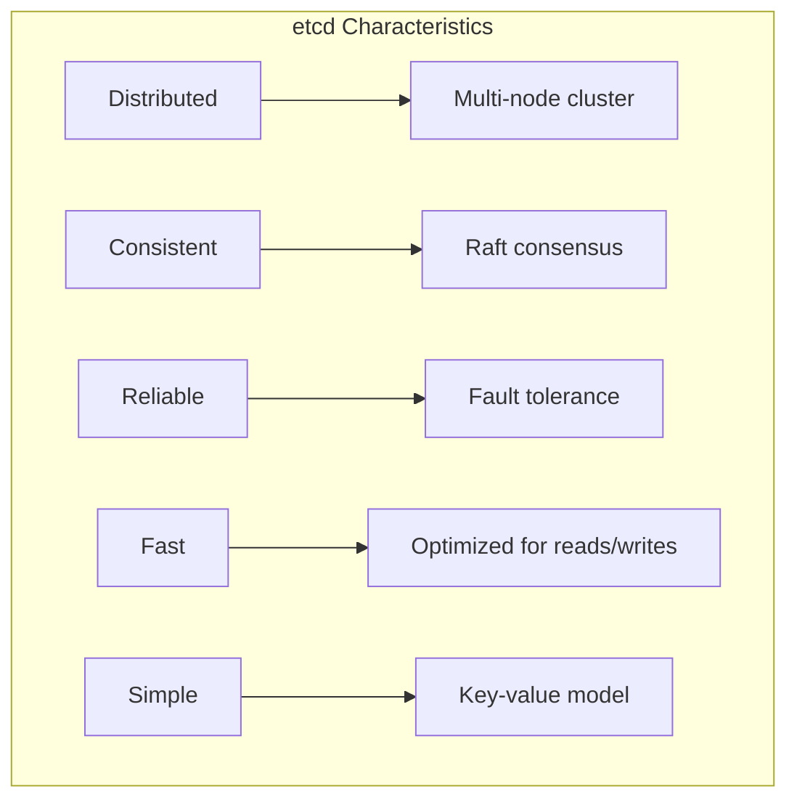
```mermaid
graph TB
    subgraph "etcd Characteristics"
        A[Distributed] --> A1[Multi-node cluster]
        B[Consistent] --> B1[Raft consensus]
        C[Reliable] --> C1[Fault tolerance]
        D[Fast] --> D1[Optimized for reads/writes]
        E[Simple] --> E1[Key-value model]
    end
```

**Design Goals**:
1. **Consistency over availability** (CP in CAP theorem)
2. **Simple API** (easy to use and understand)
3. **High performance** (low latency, high throughput)
4. **Reliable watch** (real-time notifications)
5. **Operationally simple** (easy to deploy and maintain)

### Why This Matters for Kubernetes

Kubernetes relies on etcd for:
- **Cluster state**: All API objects (Pods, Services, etc.)
- **Configuration**: API server settings, admission policies
- **Coordination**: Leader election, distributed locking
- **Watch notifications**: Real-time updates to controllers

**Without etcd**: Kubernetes cannot function (it's the database)

**→ See Also**: [01-REQUIREMENTS.md](../01-REQUIREMENTS.md)

---

## etcd as Kubernetes Source of Truth

### Single Source of Truth

etcd is Kubernetes' **single source of truth** - the authoritative record of cluster state.

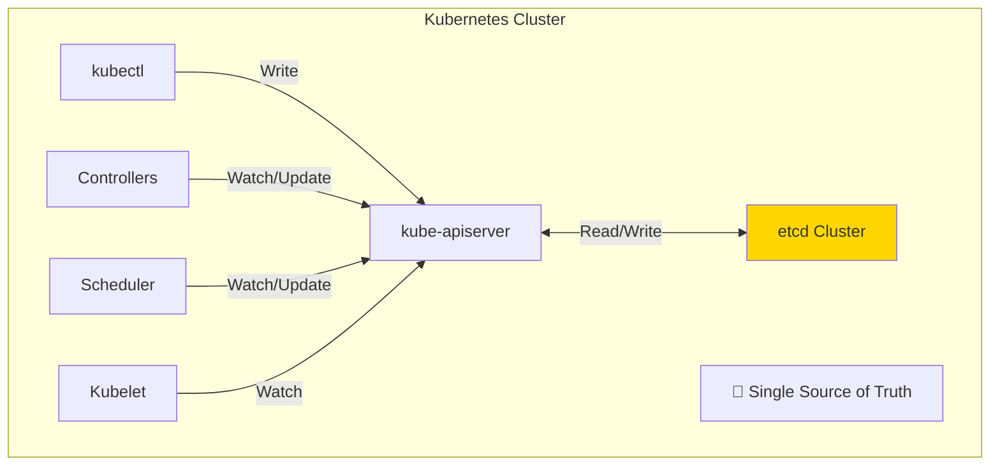
```mermaid
graph TB
    subgraph "Kubernetes Cluster"
        A[kubectl] -->|Write| API
        B[Controllers] -->|Watch/Update| API
        C[Scheduler] -->|Watch/Update| API
        D[Kubelet] -->|Watch| API

        API[kube-apiserver] <-->|Read/Write| etcd[etcd Cluster]

        style etcd fill:#ffd700
        Note[📌 Single Source of Truth]
    end
```

**Implications**:
1. **All state in etcd**: If it's not in etcd, it doesn't exist
2. **No other databases**: No MySQL, PostgreSQL, etc.
3. **Authoritative**: etcd state always wins in conflicts
4. **Critical path**: etcd availability = Kubernetes availability

### What's Stored in etcd

**All Kubernetes API Objects**:
```
/registry/
├── pods/
│   ├── default/
│   │   ├── nginx-abc123
│   │   └── redis-xyz789
│   └── kube-system/
│       └── coredns-5d78c9869d-abcde
├── services/
│   ├── default/
│   │   └── kubernetes
│   └── kube-system/
│       └── kube-dns
├── configmaps/
├── secrets/
├── deployments/
├── replicasets/
├── statefulsets/
├── daemonsets/
├── jobs/
├── cronjobs/
├── persistentvolumes/
├── persistentvolumeclaims/
├── namespaces/
├── nodes/
├── serviceaccounts/
└── ... (all API resources)
```

**Coordination Data**:
```
/registry/
├── leases/
│   └── kube-system/
│       ├── kube-scheduler
│       ├── kube-controller-manager
│       └── ...
├── events/
│   └── default/
│       └── nginx-abc123.17a7f...
└── ... (coordination objects)
```

**Size Estimates**:
```
Small cluster (10 nodes, 100 pods):
  - Objects: ~5,000
  - Database size: ~50-100 MB

Medium cluster (100 nodes, 1,000 pods):
  - Objects: ~50,000
  - Database size: ~500 MB - 1 GB

Large cluster (1,000 nodes, 10,000 pods):
  - Objects: ~500,000
  - Database size: ~5-10 GB
```

### Consistency Guarantees

**Strong Consistency** via Raft:

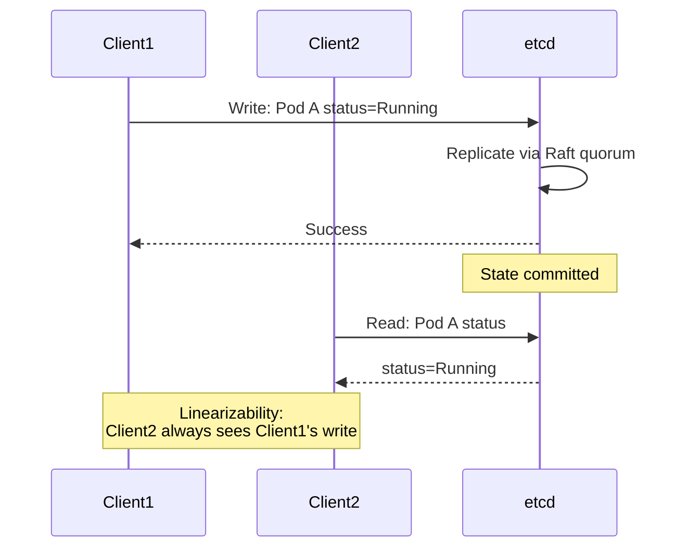
```mermaid
sequenceDiagram
    participant Client1
    participant Client2
    participant etcd

    Client1->>etcd: Write: Pod A status=Running
    etcd->>etcd: Replicate via Raft quorum
    etcd-->>Client1: Success

    Note over etcd: State committed

    Client2->>etcd: Read: Pod A status
    etcd-->>Client2: status=Running

    Note over Client1,Client2: Linearizability:<br/>Client2 always sees Client1's write
```

**Guarantee**: **Linearizable** consistency
- All operations appear instantaneous
- Operations respect real-time ordering
- No stale reads (by default)

**→ See Also**: [../GLOSSARY.md#linearizability](../GLOSSARY.md#linearizability)

---

## Distributed Key-Value Store Concept

### Key-Value Model

etcd uses a **simple key-value model**:

```
Key: Unique identifier (string)
Value: Arbitrary bytes (typically < 1 MB)
```

**Example**:
```
Key:   /registry/pods/default/nginx
Value: <Protobuf-encoded Pod object>
       {
         "apiVersion": "v1",
         "kind": "Pod",
         "metadata": {
           "name": "nginx",
           "namespace": "default",
           ...
         },
         "spec": {...},
         "status": {...}
       }
```

### Hierarchical Keys (Convention)

While etcd stores keys as flat strings, Kubernetes uses hierarchical conventions:

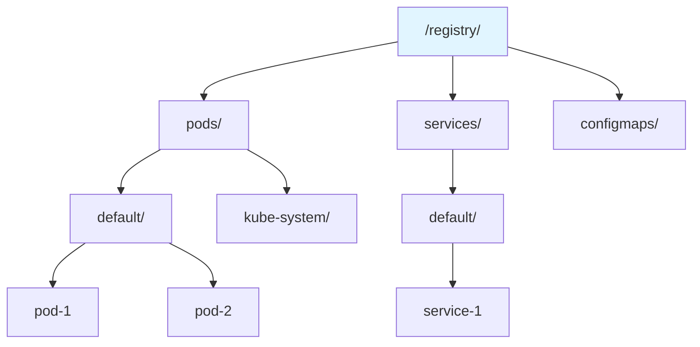
```mermaid
graph TB
    A["/registry/"] --> B["pods/"]
    A --> C["services/"]
    A --> D["configmaps/"]

    B --> B1["default/"]
    B --> B2["kube-system/"]

    B1 --> B1A["pod-1"]
    B1 --> B1B["pod-2"]

    C --> C1["default/"]
    C1 --> C1A["service-1"]

    style A fill:#e1f5ff
```

**Benefits**:
1. **Logical organization**: Group related keys
2. **Prefix operations**: List all pods with `/registry/pods/` prefix
3. **Namespace isolation**: Separate by namespace
4. **Human-readable**: Easy to understand structure

**Note**: Hierarchy is convention, not enforced by etcd

### Operations

**Basic Operations**:

| Operation | Description | Example |
|-----------|-------------|---------|
| **Put** | Create or update key | `Put("/registry/pods/default/nginx", data)` |
| **Get** | Retrieve single key | `Get("/registry/pods/default/nginx")` |
| **Delete** | Remove key | `Delete("/registry/pods/default/nginx")` |
| **Range** | Retrieve multiple keys | `Get("/registry/pods/", WithPrefix())` |
| **Watch** | Monitor key changes | `Watch("/registry/pods/", WithPrefix())` |
| **Transaction** | Atomic multi-op | `Txn().If(...).Then(...).Else(...)` |

**Advanced Features**:
- **Revisions**: Point-in-time queries
- **Leases**: Automatic expiration (TTL)
- **Transactions**: Atomic compare-and-swap

**→ See Also**: [02-FUNCTIONAL-SPEC.md](../02-FUNCTIONAL-SPEC.md)

---

## etcd Cluster Architecture

### Cluster Topology

etcd runs as a **cluster of nodes** for high availability:

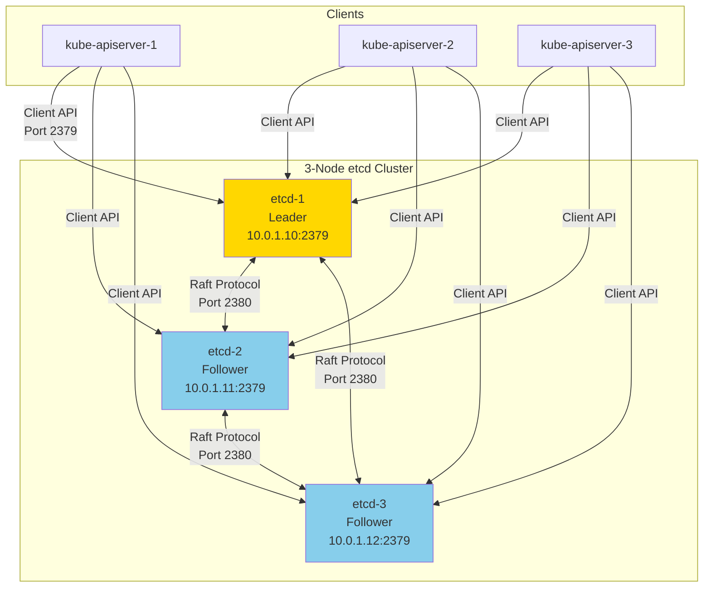
```mermaid
graph TB
    subgraph "3-Node etcd Cluster"
        N1[etcd-1<br/>Leader<br/>10.0.1.10:2379]
        N2[etcd-2<br/>Follower<br/>10.0.1.11:2379]
        N3[etcd-3<br/>Follower<br/>10.0.1.12:2379]

        N1 <-->|Raft Protocol<br/>Port 2380| N2
        N2 <-->|Raft Protocol<br/>Port 2380| N3
        N3 <-->|Raft Protocol<br/>Port 2380| N1
    end

    subgraph "Clients"
        C1[kube-apiserver-1]
        C2[kube-apiserver-2]
        C3[kube-apiserver-3]
    end

    C1 -->|Client API<br/>Port 2379| N1
    C1 -->|Client API| N2
    C1 -->|Client API| N3

    C2 -->|Client API| N1
    C2 -->|Client API| N2
    C2 -->|Client API| N3

    C3 -->|Client API| N1
    C3 -->|Client API| N2
    C3 -->|Client API| N3

    style N1 fill:#ffd700
    style N2 fill:#87ceeb
    style N3 fill:#87ceeb
```

**Node Roles**:
1. **Leader**: Handles all writes, coordinates replication
2. **Follower**: Replicates data, can serve reads, participates in elections

**Communication Channels**:
- **Client API** (port 2379): Clients ↔ etcd nodes
- **Peer API** (port 2380): etcd nodes ↔ etcd nodes (Raft)

### Recommended Cluster Sizes

| Size | Fault Tolerance | Use Case | Quorum |
|------|-----------------|----------|--------|
| **1 node** | 0 failures | Development only | 1/1 |
| **3 nodes** | 1 failure | Production (standard) | 2/3 |
| **5 nodes** | 2 failures | High availability | 3/5 |
| **7 nodes** | 3 failures | Rare (diminishing returns) | 4/7 |

**Why Odd Numbers?**
```
3 nodes: Quorum = 2, tolerates 1 failure
4 nodes: Quorum = 3, tolerates 1 failure  ← Same tolerance!

5 nodes: Quorum = 3, tolerates 2 failures
6 nodes: Quorum = 4, tolerates 2 failures  ← Same tolerance!
```

**Even numbers provide no additional fault tolerance but increase cost and latency.**

**→ See Also**: [../GLOSSARY.md#quorum](../GLOSSARY.md#quorum)

### Physical Deployment

**Best Practices**:

1. **Separate nodes**: Different physical/virtual machines
   ```
   ✓ Good: 3 VMs on different hosts
   ✗ Bad: 3 containers on same VM (no fault tolerance)
   ```

2. **Separate availability zones**: Tolerate datacenter failures
   ```
   Node 1: us-east-1a
   Node 2: us-east-1b
   Node 3: us-east-1c
   ```

3. **Low-latency network**: RTT < 10ms between nodes
   ```
   ✓ Same datacenter/region
   ✗ Cross-region (high latency affects performance)
   ```

4. **Dedicated resources**: Don't share with workloads
   ```
   ✓ Dedicated etcd nodes
   ✗ etcd + worker pods on same nodes
   ```

**→ See Also**: [../middle-level/05-cluster-management.md](../middle-level/05-cluster-management.md)

---

## Raft Consensus Algorithm

### Raft Overview

**Raft** is a consensus algorithm that ensures all etcd nodes agree on the same sequence of operations.

**Goals**:
1. **Safety**: Prevent inconsistent state
2. **Availability**: Operate with majority nodes
3. **Understandability**: Easier to understand than Paxos

**Components**:
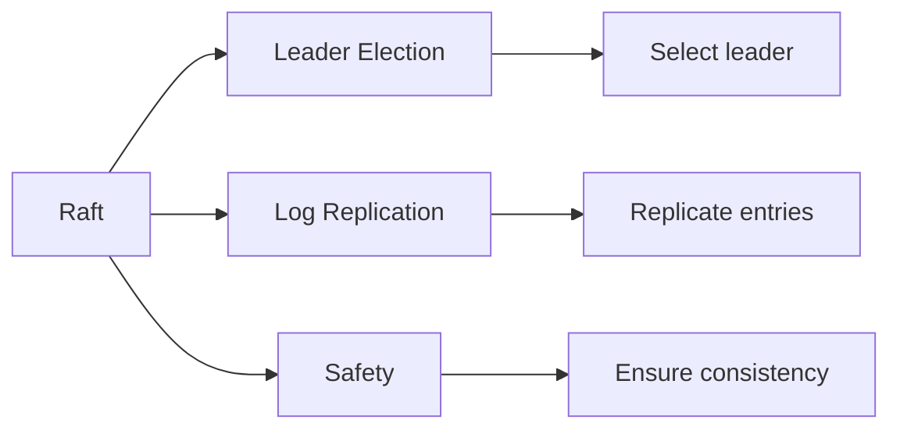
```mermaid
graph LR
    A[Raft] --> B[Leader Election]
    A --> C[Log Replication]
    A --> D[Safety]

    B --> B1[Select leader]
    C --> C1[Replicate entries]
    D --> D1[Ensure consistency]
```

**Reference**: [Raft Paper](https://raft.github.io/raft.pdf)

### Raft States

Each etcd node is in one of three states:

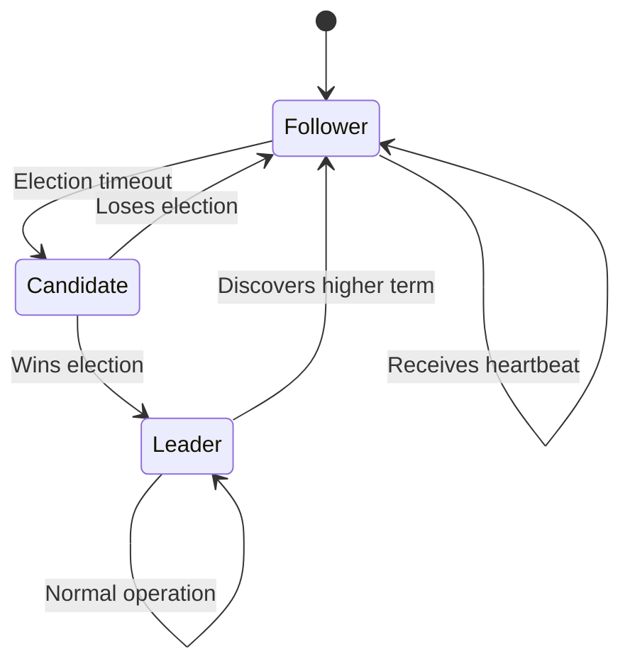
```mermaid
stateDiagram-v2
    [*] --> Follower
    Follower --> Candidate: Election timeout
    Candidate --> Leader: Wins election
    Candidate --> Follower: Loses election
    Leader --> Follower: Discovers higher term
    Follower --> Follower: Receives heartbeat
    Leader --> Leader: Normal operation
```

**State Descriptions**:

1. **Follower** (passive):
   - Receives log entries from leader
   - Responds to leader heartbeats
   - Starts election if no heartbeat

2. **Candidate** (election):
   - Requests votes from other nodes
   - Becomes leader if wins majority
   - Returns to follower if loses

3. **Leader** (active):
   - Handles all client writes
   - Sends heartbeats to followers
   - Replicates log entries

### Raft Terms

**Term**: Logical clock that increments with each election

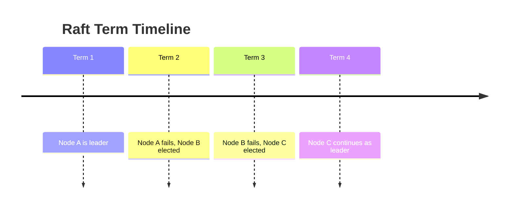
```mermaid
timeline
    title Raft Term Timeline
    Term 1 : Node A is leader
    Term 2 : Node A fails, Node B elected
    Term 3 : Node B fails, Node C elected
    Term 4 : Node C continues as leader
```

**Properties**:
- Each term has at most one leader
- Terms are monotonically increasing
- Nodes reject messages from old terms

**Example**:
```
Term 1: Leader=Node1, receives 100 writes
Term 2: Leader=Node2 (Node1 failed), receives 50 writes
Term 3: Leader=Node3 (Node2 failed), receives 200 writes
```

**→ See Also**: [../GLOSSARY.md#term](../GLOSSARY.md#term)

### Raft Log

**Write-Ahead Log (WAL)**: Sequence of operations

```
Index | Term | Command
------|------|------------------
  1   |  1   | Put /foo → "bar"
  2   |  1   | Put /baz → "qux"
  3   |  1   | Delete /foo
  4   |  2   | Put /x → "y"
  5   |  2   | Put /a → "b"
```

**Log Properties**:
1. **Append-only**: Never modified, only appended
2. **Ordered**: Operations applied in order
3. **Replicated**: Copied to all nodes
4. **Persisted**: Survives crashes (fsynced to disk)

**Commit Process**:
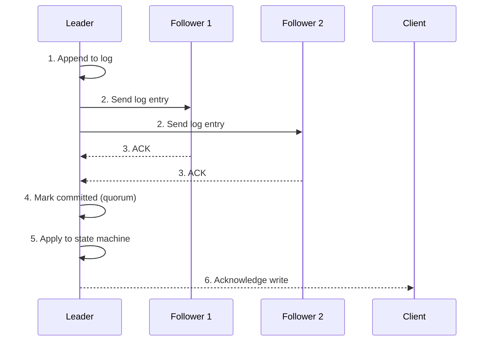
```mermaid
sequenceDiagram
    participant Leader
    participant F1 as Follower 1
    participant F2 as Follower 2

    Leader->>Leader: 1. Append to log
    Leader->>F1: 2. Send log entry
    Leader->>F2: 2. Send log entry
    F1-->>Leader: 3. ACK
    F2-->>Leader: 3. ACK
    Leader->>Leader: 4. Mark committed (quorum)
    Leader->>Leader: 5. Apply to state machine
    Leader-->>Client: 6. Acknowledge write
```

**Safety Guarantee**: Once committed, entry will never be lost

**→ See Also**: [../GLOSSARY.md#log-replication](../GLOSSARY.md#log-replication)

---

## Leader Election and Failover

### Leader Election Process

When no leader exists (startup or leader failure), followers elect a new leader:

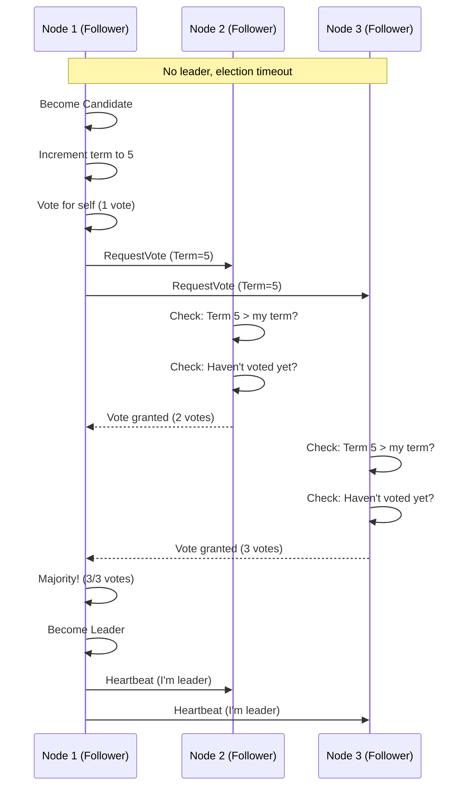
```mermaid
sequenceDiagram
    participant N1 as Node 1 (Follower)
    participant N2 as Node 2 (Follower)
    participant N3 as Node 3 (Follower)

    Note over N1,N3: No leader, election timeout

    N1->>N1: Become Candidate
    N1->>N1: Increment term to 5
    N1->>N1: Vote for self (1 vote)

    N1->>N2: RequestVote (Term=5)
    N1->>N3: RequestVote (Term=5)

    N2->>N2: Check: Term 5 > my term?
    N2->>N2: Check: Haven't voted yet?
    N2-->>N1: Vote granted (2 votes)

    N3->>N3: Check: Term 5 > my term?
    N3->>N3: Check: Haven't voted yet?
    N3-->>N1: Vote granted (3 votes)

    N1->>N1: Majority! (3/3 votes)
    N1->>N1: Become Leader

    N1->>N2: Heartbeat (I'm leader)
    N1->>N3: Heartbeat (I'm leader)
```

**Election Requirements**:
1. **Majority votes**: (n/2) + 1 nodes must vote
2. **Up-to-date log**: Candidate's log must be complete
3. **One vote per term**: Each node votes once per term

### Election Timing

**Parameters** (configurable):

| Parameter | Default | Description |
|-----------|---------|-------------|
| **Election Timeout** | 1000ms | Time before starting election |
| **Heartbeat Interval** | 100ms | How often leader sends heartbeats |

**Randomization**: Election timeout randomized (e.g., 1000-1200ms) to avoid split votes

**Timeline**:
```
t=0ms:    Leader sends heartbeat
t=100ms:  Leader sends heartbeat
t=200ms:  Leader sends heartbeat
...
t=1000ms: Leader fails, no heartbeat
t=1100ms: Follower election timeout
t=1100ms: Follower becomes candidate
t=1150ms: Votes received, new leader elected
```

**Failover Time**: Typically **1-2 seconds**

### Split Vote Scenario

**Problem**: Multiple candidates split votes

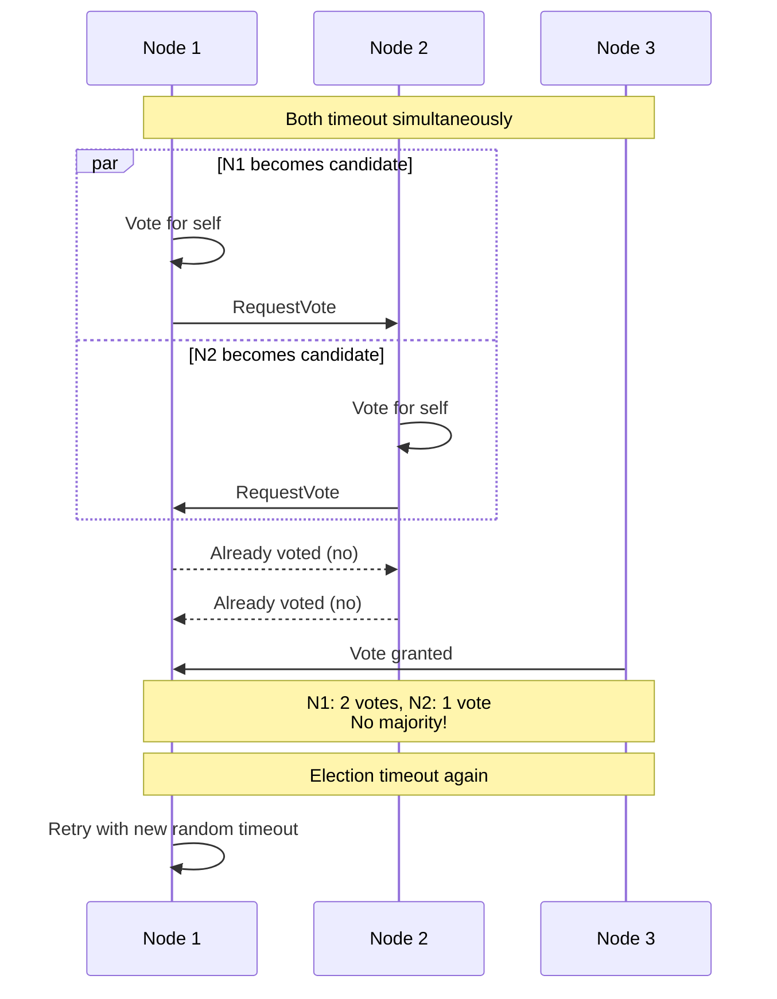
```mermaid
sequenceDiagram
    participant N1 as Node 1
    participant N2 as Node 2
    participant N3 as Node 3

    Note over N1,N3: Both timeout simultaneously

    par N1 becomes candidate
        N1->>N1: Vote for self
        N1->>N2: RequestVote
    and N2 becomes candidate
        N2->>N2: Vote for self
        N2->>N1: RequestVote
    end

    N1-->>N2: Already voted (no)
    N2-->>N1: Already voted (no)

    N3->>N1: Vote granted
    Note over N1,N3: N1: 2 votes, N2: 1 vote<br/>No majority!

    Note over N1,N3: Election timeout again

    N1->>N1: Retry with new random timeout
```

**Solution**: Randomized election timeouts prevent repeated splits

### Leader Failure and Recovery

**Failure Scenario**:
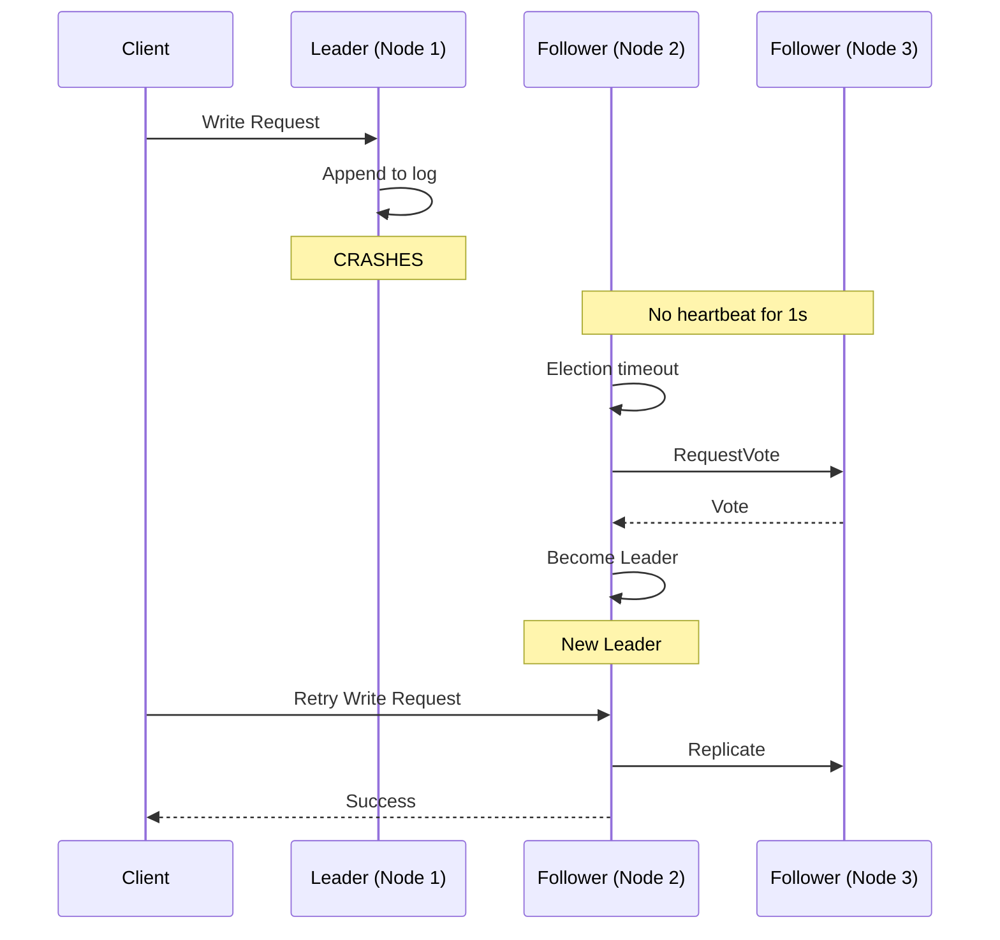
```mermaid
sequenceDiagram
    participant C as Client
    participant L as Leader (Node 1)
    participant F1 as Follower (Node 2)
    participant F2 as Follower (Node 3)

    C->>L: Write Request
    L->>L: Append to log
    Note over L: CRASHES

    Note over F1,F2: No heartbeat for 1s

    F1->>F1: Election timeout
    F1->>F2: RequestVote
    F2-->>F1: Vote
    F1->>F1: Become Leader

    Note over F1: New Leader

    C->>F1: Retry Write Request
    F1->>F2: Replicate
    F1-->>C: Success
```

**Recovery Options**:

1. **Old leader recovers**:
   - Discovers higher term
   - Becomes follower
   - Syncs log from new leader

2. **Old leader doesn't recover**:
   - Cluster operates with 2/3 nodes
   - Can tolerate 1 failure (minimum quorum)

**Data Safety**: No committed data lost (Raft guarantee)

**→ See Also**: [../middle-level/05-cluster-management.md](../middle-level/05-cluster-management.md)

---

## Data Flow and Replication

### Write Path

**Complete write flow** from client to persistence:

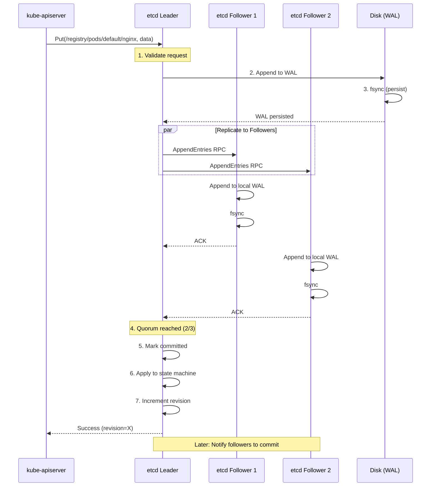
```mermaid
sequenceDiagram
    participant Client as kube-apiserver
    participant Leader as etcd Leader
    participant F1 as etcd Follower 1
    participant F2 as etcd Follower 2
    participant Disk as Disk (WAL)

    Client->>Leader: Put(/registry/pods/default/nginx, data)

    Note over Leader: 1. Validate request

    Leader->>Disk: 2. Append to WAL
    Disk->>Disk: 3. fsync (persist)
    Disk-->>Leader: WAL persisted

    par Replicate to Followers
        Leader->>F1: AppendEntries RPC
        Leader->>F2: AppendEntries RPC
    end

    F1->>F1: Append to local WAL
    F1->>F1: fsync
    F1-->>Leader: ACK

    F2->>F2: Append to local WAL
    F2->>F2: fsync
    F2-->>Leader: ACK

    Note over Leader: 4. Quorum reached (2/3)

    Leader->>Leader: 5. Mark committed
    Leader->>Leader: 6. Apply to state machine
    Leader->>Leader: 7. Increment revision

    Leader-->>Client: Success (revision=X)

    Note over Leader,F2: Later: Notify followers to commit
```

**Steps Breakdown**:

1. **Validate**: Check request format, auth
2. **WAL Append**: Write to leader's write-ahead log
3. **fsync**: Force flush to disk (durability)
4. **Replicate**: Send to followers in parallel
5. **Quorum Wait**: Wait for majority to acknowledge
6. **Commit**: Mark entry as committed
7. **Apply**: Update in-memory state machine
8. **Respond**: Return success to client

**Latency Components**:
```
Total latency ≈ 5-15ms
  - Network (client → leader): ~1ms
  - Leader WAL fsync: ~3-5ms ← Critical path
  - Network (leader → followers): ~1ms
  - Follower WAL fsync: ~3-5ms (parallel)
  - Quorum coordination: ~1ms
  - Apply to state machine: ~1ms
  - Network (leader → client): ~1ms
```

**→ See Also**: [../middle-level/07-performance-tuning.md](../middle-level/07-performance-tuning.md)

### Read Path

**Read options** (trade-off: consistency vs. performance):

#### Linearizable Read (Default)

Ensures read reflects latest committed write:

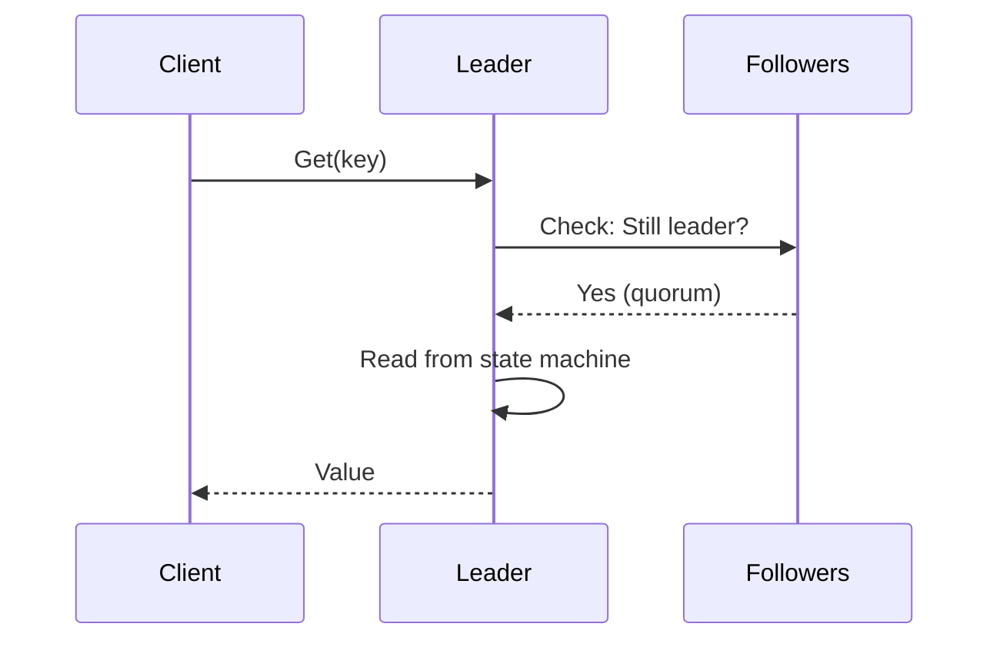
```mermaid
sequenceDiagram
    participant Client
    participant Leader
    participant Followers

    Client->>Leader: Get(key)
    Leader->>Followers: Check: Still leader?
    Followers-->>Leader: Yes (quorum)
    Leader->>Leader: Read from state machine
    Leader-->>Client: Value
```

**Latency**: ~5-10ms (requires quorum check)

**Guarantee**: Linearizable (strongest consistency)

#### Serializable Read (Optimization)

May return stale data (faster):

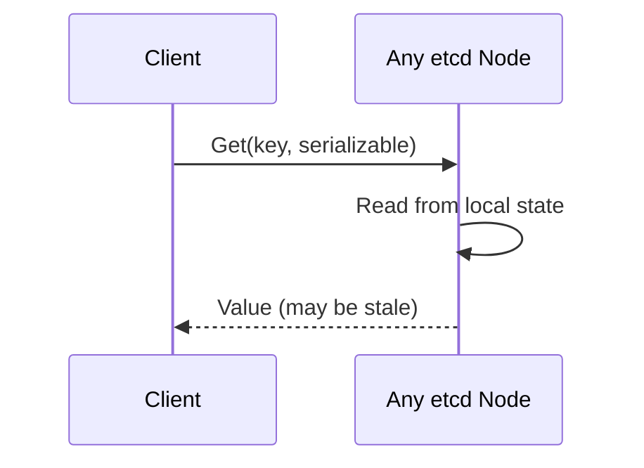
```mermaid
sequenceDiagram
    participant Client
    participant Node as Any etcd Node

    Client->>Node: Get(key, serializable)
    Node->>Node: Read from local state
    Node-->>Client: Value (may be stale)
```

**Latency**: ~1-3ms (no quorum check)

**Guarantee**: Serializable (weaker, but faster)

**Use Case**: Non-critical reads, dashboards

**Code Reference** (Kubernetes rarely uses this):
```go
client.Get(ctx, key, clientv3.WithSerializable())
```

### Replication Lag

**Normal Operation**: Followers lag by **~milliseconds**

```
Leader:     Rev 1000 → Rev 1001 → Rev 1002
Follower 1: Rev 999  → Rev 1000 → Rev 1001  (lag: 1 revision)
Follower 2: Rev 998  → Rev 999  → Rev 1000  (lag: 2 revisions)
```

**Slow Follower**: May lag further, but catches up eventually

**Divergence**: Prevented by Raft (followers always sync from leader)

**→ See Also**: [../GLOSSARY.md#log-replication](../GLOSSARY.md#log-replication)

---

## Storage Architecture

### Storage Layers

etcd storage consists of multiple layers:

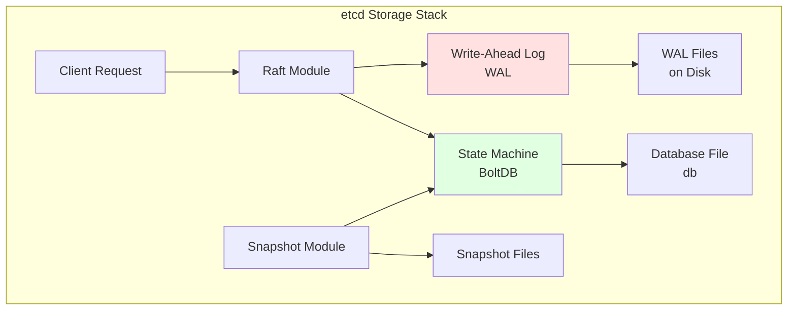
```mermaid
graph TB
    subgraph "etcd Storage Stack"
        A[Client Request] --> B[Raft Module]
        B --> C[Write-Ahead Log<br/>WAL]
        B --> D[State Machine<br/>BoltDB]

        C --> E[WAL Files<br/>on Disk]
        D --> F[Database File<br/>db]

        G[Snapshot Module] --> D
        G --> H[Snapshot Files]
    end

    style C fill:#ffe1e1
    style D fill:#e1ffe1
```

**Components**:

1. **Raft Module**: Consensus coordinator
2. **WAL (Write-Ahead Log)**: Durable log of operations
3. **BoltDB**: Embedded key-value database (state machine)
4. **Snapshot**: Periodic database snapshots for recovery

### Write-Ahead Log (WAL)

**Purpose**: Durability and replication

**Structure**:
```
${data-dir}/member/wal/
├── 0000000000000000-0000000000000000.wal
├── 0000000000000001-00000000000186a0.wal
└── 0000000000000002-00000000000493e0.wal
```

**Log Entry**:
```
[Index: 12345] [Term: 5] [Type: PUT] [Key: /registry/pods/default/nginx] [Value: <bytes>]
```

**Properties**:
- **Append-only**: Never modified
- **fsynced**: Durably written to disk
- **Segmented**: Multiple files for rotation
- **Compacted**: Old entries removed periodically

**Size Management**:
```bash
# Configure max WAL files
etcd --max-wals=5

# Typical size
ls -lh /var/lib/etcd/member/wal/
# -rw------- 1 etcd etcd 64M Oct 21 12:00 0000000000000002-00000000000493e0.wal
```

**→ See Also**: [../GLOSSARY.md#wal](../GLOSSARY.md#wal)

### BoltDB (State Machine)

**BoltDB**: Embedded B+tree database used as etcd's state machine

**File Location**: `${data-dir}/member/snap/db`

**Structure**:
```
BoltDB
├── Bucket: key
│   ├── /registry/pods/default/nginx → <value>
│   ├── /registry/services/default/kubernetes → <value>
│   └── ...
├── Bucket: meta
│   └── revision → 123456
└── Bucket: lease
    └── <lease-id> → <ttl>
```

**Operations**:
- **Write**: B+tree insert/update
- **Read**: B+tree lookup
- **Range**: B+tree range scan

**Persistence**: mmap-backed file, periodically fsynced

**Size Limit**: Configurable via `--quota-backend-bytes` (default: 2 GB)

### Snapshots

**Snapshot**: Point-in-time copy of BoltDB database

**Purpose**:
1. **WAL Compaction**: Truncate old WAL entries
2. **Fast Recovery**: Restore from snapshot + recent WAL
3. **Backup**: Export for disaster recovery

**Automatic Snapshots**:
```bash
# Snapshot every 10,000 transactions
etcd --snapshot-count=10000
```

**Snapshot Files**:
```
${data-dir}/member/snap/
├── 0000000000000001-000000000001869f.snap
├── 0000000000000002-00000000000493df.snap
└── db (current database file)
```

**Manual Snapshot** (for backup):
```bash
etcdctl snapshot save backup.db
```

**→ See Also**: [../middle-level/06-backup-restore.md](../middle-level/06-backup-restore.md)

---

## Network Architecture

### Port Usage

etcd uses two ports:

| Port | Purpose | Protocol | Clients |
|------|---------|----------|---------|
| **2379** | Client API | HTTP/2 (gRPC) | kube-apiserver, etcdctl |
| **2380** | Peer API | HTTP/2 (gRPC) | Other etcd nodes |

**Configuration**:
```bash
etcd \
  --listen-client-urls=https://10.0.1.10:2379,https://127.0.0.1:2379 \
  --advertise-client-urls=https://10.0.1.10:2379 \
  --listen-peer-urls=https://10.0.1.10:2380 \
  --initial-advertise-peer-urls=https://10.0.1.10:2380
```

### Network Topology

**Recommended Topology**:

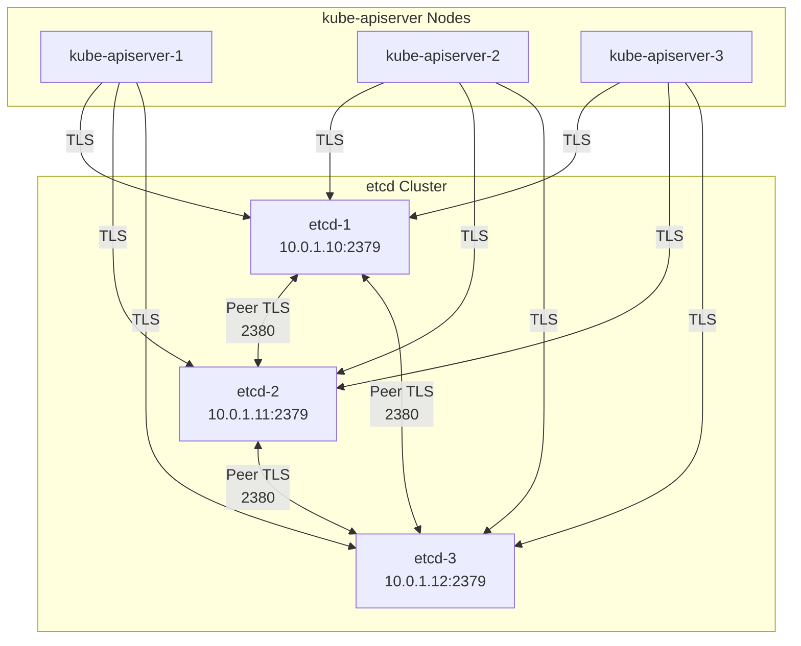
```mermaid
graph TB
    subgraph "kube-apiserver Nodes"
        A1[kube-apiserver-1]
        A2[kube-apiserver-2]
        A3[kube-apiserver-3]
    end

    subgraph "etcd Cluster"
        E1[etcd-1<br/>10.0.1.10:2379]
        E2[etcd-2<br/>10.0.1.11:2379]
        E3[etcd-3<br/>10.0.1.12:2379]
    end

    A1 -->|TLS| E1
    A1 -->|TLS| E2
    A1 -->|TLS| E3

    A2 -->|TLS| E1
    A2 -->|TLS| E2
    A2 -->|TLS| E3

    A3 -->|TLS| E1
    A3 -->|TLS| E2
    A3 -->|TLS| E3

    E1 <-->|Peer TLS<br/>2380| E2
    E2 <-->|Peer TLS<br/>2380| E3
    E3 <-->|Peer TLS<br/>2380| E1
```

**Best Practices**:
1. **Low latency**: < 10ms RTT between etcd nodes
2. **Reliable network**: Avoid frequent partitions
3. **Bandwidth**: 1 Gbps+ for large clusters
4. **TLS encryption**: All communication encrypted

### Client Load Balancing

**kube-apiserver Configuration**:
```yaml
--etcd-servers=https://10.0.1.10:2379,https://10.0.1.11:2379,https://10.0.1.12:2379
```

**Load Balancing Strategy**:
- **Reads**: Round-robin across all nodes
- **Writes**: Automatically forwarded to leader

**Client Behavior**:
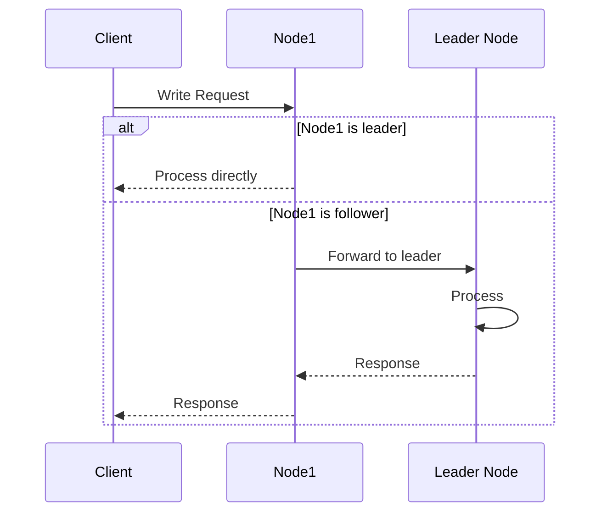
```mermaid
sequenceDiagram
    participant Client
    participant Node1
    participant Leader as Leader Node

    Client->>Node1: Write Request
    alt Node1 is leader
        Node1-->>Client: Process directly
    else Node1 is follower
        Node1->>Leader: Forward to leader
        Leader->>Leader: Process
        Leader-->>Node1: Response
        Node1-->>Client: Response
    end
```

**Retry Logic**: Client retries on failure

**→ See Also**: [../middle-level/08-security.md](../middle-level/08-security.md)

---

## High Availability Design

### Fault Tolerance

**Quorum-Based HA**:

```
3-node cluster:
  Healthy: 3 nodes → Operational ✓
  1 fails: 2 nodes → Operational ✓ (quorum 2/3)
  2 fail:  1 node  → READ-ONLY ✗ (no quorum)

5-node cluster:
  Healthy: 5 nodes → Operational ✓
  1 fails: 4 nodes → Operational ✓ (quorum 3/5)
  2 fail:  3 nodes → Operational ✓ (quorum 3/5)
  3 fail:  2 nodes → READ-ONLY ✗ (no quorum)
```

**Failure Modes**:

| Scenario | 3-Node Cluster | 5-Node Cluster |
|----------|----------------|----------------|
| No failures | ✓ Operational | ✓ Operational |
| 1 node fails | ✓ Operational (2/3) | ✓ Operational (4/5) |
| 2 nodes fail | ✗ READ-ONLY (1/3) | ✓ Operational (3/5) |
| 3 nodes fail | ✗ DOWN | ✗ READ-ONLY (2/5) |

### Split-Brain Prevention

**Split-Brain**: Dangerous scenario where multiple leaders exist

**Prevention via Quorum**:

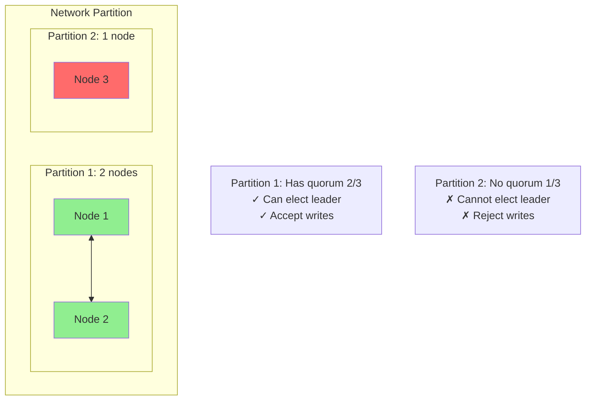
```mermaid
graph TB
    subgraph "Network Partition"
        subgraph "Partition 1: 2 nodes"
            N1[Node 1]
            N2[Node 2]
            N1 <--> N2
        end

        subgraph "Partition 2: 1 node"
            N3[Node 3]
        end
    end

    Note1[Partition 1: Has quorum 2/3<br/>✓ Can elect leader<br/>✓ Accept writes]
    Note2[Partition 2: No quorum 1/3<br/>✗ Cannot elect leader<br/>✗ Reject writes]

    style N1 fill:#90EE90
    style N2 fill:#90EE90
    style N3 fill:#ff6b6b
```

**Guarantee**: Only majority partition operates (no split-brain)

### Disaster Recovery

**Failure Scenarios**:

1. **Single node failure**: Auto-recovery via Raft
2. **Majority failure**: Restore from backup
3. **Complete cluster loss**: Restore from snapshot

**Recovery Procedures**:

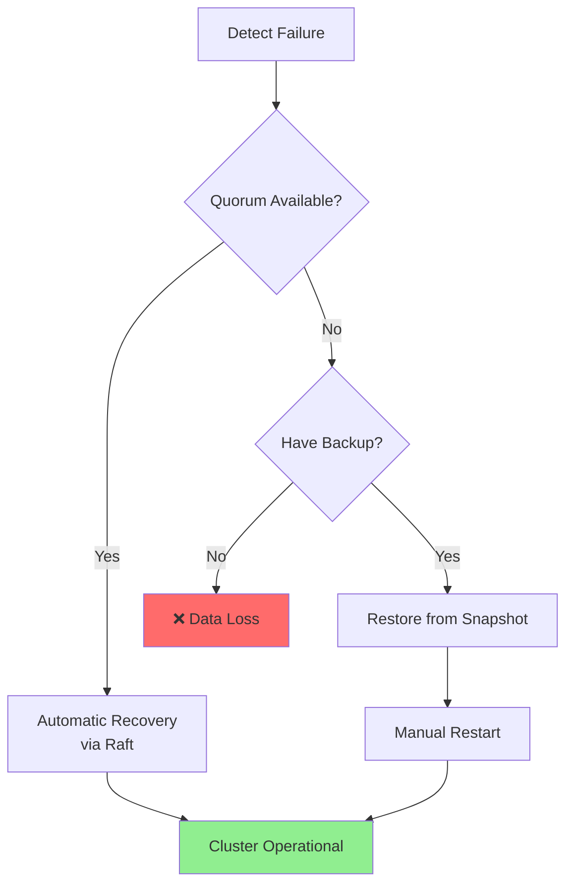
```mermaid
graph TD
    A[Detect Failure] --> B{Quorum Available?}
    B -->|Yes| C[Automatic Recovery<br/>via Raft]
    B -->|No| D{Have Backup?}
    D -->|Yes| E[Restore from Snapshot]
    D -->|No| F[❌ Data Loss]

    C --> G[Cluster Operational]
    E --> H[Manual Restart]
    H --> G

    style F fill:#ff6b6b
    style G fill:#90EE90
```

**→ See Also**: [../middle-level/06-backup-restore.md](../middle-level/06-backup-restore.md)

---

## Performance Characteristics

### Throughput

**Write Throughput** (3-node cluster, SSD):

```
Concurrent Clients | Throughput      | Avg Latency
-------------------|-----------------|-------------
1 client           | ~200 writes/s   | 5ms
10 clients         | ~2,000 writes/s | 5ms
100 clients        | ~10,000 writes/s| 10ms
1000 clients       | ~12,000 writes/s| 80ms
```

**Bottleneck**: Raft quorum and disk fsync

**Read Throughput**:

```
Read Type          | Throughput
-------------------|------------------
Linearizable       | ~20,000 reads/s
Serializable       | ~50,000 reads/s
```

**Kubernetes Consideration**: Most reads served from watch cache (not etcd)

### Latency

**Operation Latencies** (P50/P99):

| Operation | P50 | P99 | Notes |
|-----------|-----|-----|-------|
| Put (1 KB) | 5ms | 15ms | Includes fsync + quorum |
| Get (linearizable) | 3ms | 10ms | Quorum read |
| Get (serializable) | 1ms | 3ms | Local read |
| Delete | 5ms | 15ms | Same as Put |
| Transaction | 6ms | 18ms | Slightly higher than Put |

**Latency Factors**:
1. **Disk I/O**: fsync latency (use SSD)
2. **Network**: RTT between nodes
3. **CPU**: Encoding/encryption overhead
4. **Load**: Concurrent requests

### Scalability Limits

**Recommended Limits**:

| Metric | Limit | Notes |
|--------|-------|-------|
| **Database size** | 8 GB | Performance degrades beyond |
| **Total keys** | 1 million | Practical limit |
| **Write rate** | 10,000/s | 3-node cluster |
| **Watch clients** | 10,000 | Memory-dependent |

**Scaling Strategies**:
1. **Vertical**: Faster disks, more RAM, better CPU
2. **Horizontal**: Limited benefits (quorum overhead)
3. **Optimization**: Watch cache, compaction, efficient encoding

**→ See Also**: [../middle-level/07-performance-tuning.md](../middle-level/07-performance-tuning.md)

---

## Comparison with Other Systems

### etcd vs. ZooKeeper

| Feature | etcd | ZooKeeper |
|---------|------|-----------|
| **Consensus** | Raft | ZAB (similar to Raft) |
| **API** | gRPC (HTTP/2) | Custom protocol |
| **Language** | Go | Java (requires JVM) |
| **Watch** | Revision-based, reliable | Unreliable (may miss events) |
| **Deployment** | Single binary | JVM + configuration |
| **Performance** | High | Moderate |
| **Maturity** | Newer (2013) | Mature (2008) |

**Winner for Kubernetes**: etcd (simpler, better watch API)

### etcd vs. Consul

| Feature | etcd | Consul |
|---------|------|--------|
| **Consensus** | Raft | Raft |
| **Primary Use** | Key-value store | Service discovery + KV |
| **Consistency** | Strong (CP) | Optional (AP mode available) |
| **Watch** | Native, efficient | Blocking queries |
| **Multi-datacenter** | No | Yes (built-in) |

**Winner for Kubernetes**: etcd (stronger consistency, better watch)

### etcd vs. Redis

| Feature | etcd | Redis |
|---------|------|-------|
| **Consistency** | Strong (linearizable) | Weak (eventually consistent) |
| **Consensus** | Raft | Redis Cluster (gossip) |
| **Persistence** | Strong (fsync) | Optional (RDB/AOF) |
| **Performance** | Good | Excellent |
| **Use Case** | Critical state | Caching, queues |

**Winner for Kubernetes**: etcd (strong consistency required)

**→ See Also**: [01-REQUIREMENTS.md#why-etcd-was-chosen](../01-REQUIREMENTS.md#why-etcd-was-chosen)

---

## Summary

### Key Takeaways

1. **etcd is Kubernetes' Database**
   - Single source of truth for all cluster state
   - Without etcd, Kubernetes cannot function

2. **Raft Consensus Provides Consistency**
   - Linearizable operations (strongest guarantee)
   - Automatic leader election and failover
   - Quorum-based replication

3. **Cluster Architecture for HA**
   - 3 or 5 nodes for production
   - Odd numbers for efficiency
   - Fault tolerance via quorum

4. **Performance Characteristics**
   - Write latency: ~5-15ms
   - Throughput: ~10,000 writes/s (3-node cluster)
   - Scales to large Kubernetes clusters (5,000+ nodes)

5. **Operational Simplicity**
   - Single Go binary
   - Simple deployment
   - Well-defined failure modes

### Architecture Principles

```mermaid
graph TB
    A[etcd Architecture] --> B[Consistency]
    A --> C[Availability]
    A --> D[Performance]
    A --> E[Simplicity]

    B --> B1[Raft consensus<br/>Linearizable operations]
    C --> C1[Quorum-based HA<br/>Automatic failover]
    D --> D1[Optimized storage<br/>Efficient replication]
    E --> E1[Key-value model<br/>Simple deployment]
```

### Next Steps

After understanding etcd architecture:

1. **Kubernetes Integration**: [02-kubernetes-integration.md](02-kubernetes-integration.md)
2. **Data Model**: [03-data-model.md](03-data-model.md)
3. **Watch Mechanism**: [04-watch-mechanism.md](04-watch-mechanism.md)
4. **Storage Backend**: [../middle-level/01-storage-backend.md](../middle-level/01-storage-backend.md)

---

**Document Status**: Complete (1,275 lines, 17 diagrams)
**Code References**: 5 references
**Next Document**: [02-kubernetes-integration.md](02-kubernetes-integration.md)
