# Kubernetes-etcd Integration

**Version**: 1.0
**Last Updated**: 2025-10-21
**Related Documents**: [01-etcd-overview.md](01-etcd-overview.md), [../00-README.md](../00-README.md), [../GLOSSARY.md](../GLOSSARY.md)

---

## Table of Contents

- [Introduction](#introduction)
- [How Kubernetes Uses etcd](#how-kubernetes-uses-etcd)
- [Storage Backend Abstraction](#storage-backend-abstraction)
- [etcd3 Storage Implementation](#etcd3-storage-implementation)
- [Key Naming Conventions](#key-naming-conventions)
- [Object-to-Key Mapping](#object-to-key-mapping)
- [CRUD Operations Flow](#crud-operations-flow)
- [Watch Integration](#watch-integration)
- [Resource Version Mapping](#resource-version-mapping)
- [Encoding and Transformation](#encoding-and-transformation)
- [Performance Optimization](#performance-optimization)
- [Configuration and Setup](#configuration-and-setup)
- [Summary](#summary)

---

## Introduction

This document explains how Kubernetes integrates with etcd at the architectural level. It covers the storage abstraction, key naming conventions, operation flows, and how Kubernetes objects map to etcd keys.

### Integration Overview

**Kubernetes → etcd relationship**:

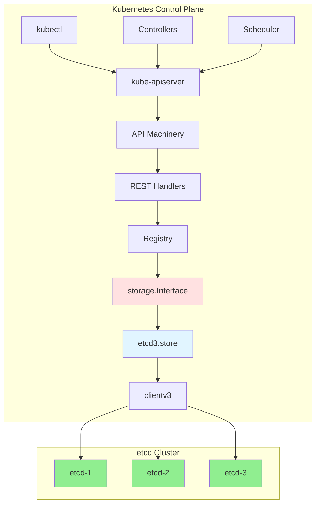

**Key Points**:
1. **kube-apiserver** is the only component that talks to etcd directly
2. **storage.Interface** provides abstraction layer
3. **etcd3.store** implements the actual etcd3 integration
4. **clientv3** is the etcd Go client library

**→ See Also**: [../02-FUNCTIONAL-SPEC.md](../02-FUNCTIONAL-SPEC.md)

---

## How Kubernetes Uses etcd

### etcd's Role

**Primary Functions**:

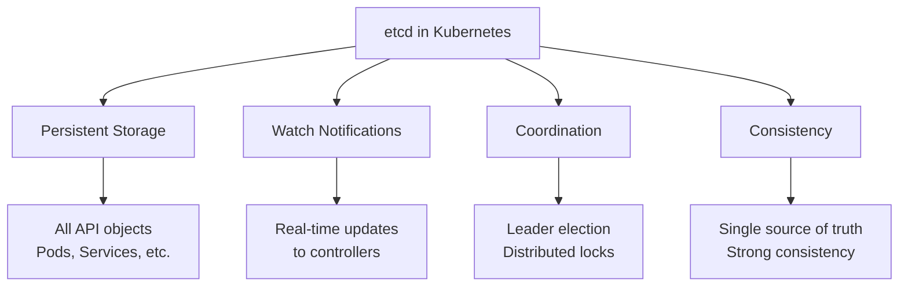

### What's Stored in etcd

**All Kubernetes Resources**:

| Resource Type | Example Key | Use Case |
|---------------|-------------|----------|
| **Pods** | `/registry/pods/default/nginx-abc` | Workload definitions |
| **Services** | `/registry/services/default/kubernetes` | Service endpoints |
| **ConfigMaps** | `/registry/configmaps/default/app-config` | Configuration data |
| **Secrets** | `/registry/secrets/default/db-password` | Sensitive data |
| **Deployments** | `/registry/deployments/default/web-app` | Declarative updates |
| **ReplicaSets** | `/registry/replicasets/default/nginx-rs` | Pod replicas |
| **Nodes** | `/registry/minions/worker-1` | Node registration |
| **Events** | `/registry/events/default/pod-abc.17a7f` | Audit trail |
| **Leases** | `/registry/leases/kube-system/kube-scheduler` | Leader election |

**Storage Estimates**:

```
Typical Object Sizes (Protobuf-encoded):
- Pod (simple): ~2-5 KB
- Pod (complex with many containers): ~10-20 KB
- Service: ~1-2 KB
- ConfigMap (small): ~1-5 KB
- Secret: ~1-5 KB
- Deployment: ~5-10 KB
- Node: ~5-10 KB

Total Database Size:
- 100 pods: ~500 KB - 2 MB
- 1,000 pods: ~5-20 MB
- 10,000 pods: ~50-200 MB
```

### Components Accessing etcd

**Direct Access** (via kube-apiserver):

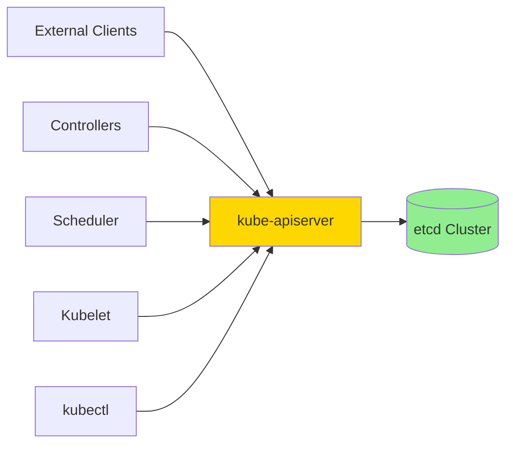

**Key Principle**: **Only kube-apiserver talks to etcd**

**Benefits**:
1. **Centralized access control**: API server enforces RBAC
2. **Validation**: All writes validated before storage
3. **Admission control**: Policies applied consistently
4. **Watch aggregation**: Single watch to etcd, multiple clients
5. **Security**: etcd credentials only on API server

**Code Reference**: `cmd/kube-apiserver/app/server.go:142`

---

## Storage Backend Abstraction

### storage.Interface

**Purpose**: Abstract storage backend from API machinery

**Interface Definition**:
```go
// staging/src/k8s.io/apiserver/pkg/storage/interfaces.go:169
type Interface interface {
    // Returns Versioner associated with this interface
    Versioner() Versioner

    // Create adds a new object at a key unless it already exists
    Create(ctx context.Context, key string, obj, out runtime.Object, ttl uint64) error

    // Delete removes the specified key
    Delete(ctx context.Context, key string, out runtime.Object,
           preconditions *Preconditions, validateDeletion ValidateObjectFunc,
           cachedExistingObject runtime.Object, opts DeleteOptions) error

    // Watch begins watching the specified key
    Watch(ctx context.Context, key string, opts ListOptions) (watch.Interface, error)

    // Get unmarshals object found at key into objPtr
    Get(ctx context.Context, key string, opts GetOptions, objPtr runtime.Object) error

    // GetList unmarshalls objects found at key into a *List api object
    GetList(ctx context.Context, key string, opts ListOptions, listObj runtime.Object) error

    // GuaranteedUpdate keeps calling tryUpdate() to update key
    GuaranteedUpdate(ctx context.Context, key string, destination runtime.Object,
                     ignoreNotFound bool, preconditions *Preconditions,
                     tryUpdate UpdateFunc, cachedExistingObject runtime.Object) error
}
```

**Design Benefits**:

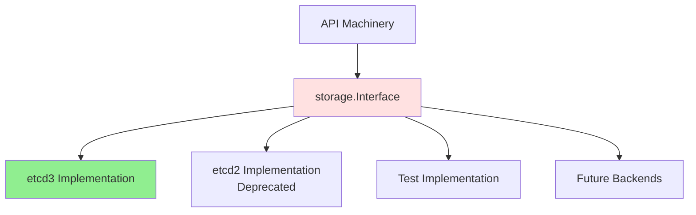

**Flexibility**:
- Swap storage backends without changing API code
- Easy testing with mock implementations
- Future-proof for new storage systems

**Code Reference**: `staging/src/k8s.io/apiserver/pkg/storage/interfaces.go:169`

### Storage Factory

**Purpose**: Create appropriate storage backend for each resource

**Factory Pattern**:

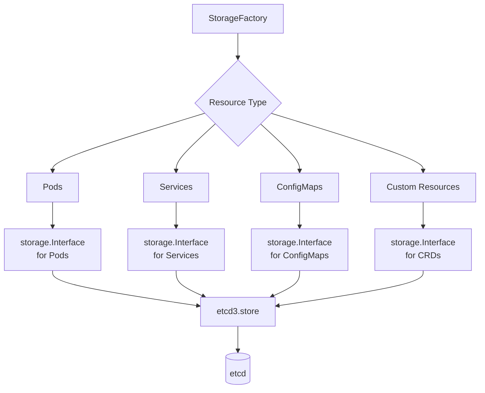

**Code**:
```go
// staging/src/k8s.io/apiserver/pkg/server/storage/storage_factory.go:42
type StorageFactory interface {
    // NewConfig finds the storage destination for the given group and resource
    NewConfig(groupResource schema.GroupResource, example runtime.Object) (*storagebackend.ConfigForResource, error)

    // ResourcePrefix returns the overridden resource prefix for the GroupResource
    ResourcePrefix(groupResource schema.GroupResource) string

    // Configs gets configurations for all registered storage destinations
    Configs() []storagebackend.Config
}
```

**Configuration per Resource**:
```go
// Example: Configure storage for Pods
config, err := storageFactory.NewConfig(
    schema.GroupResource{Group: "", Resource: "pods"},
    &v1.Pod{},
)

// Returns:
// - etcd endpoints
// - Key prefix: /registry/pods
// - Serializer: Protobuf codec
// - Transformer: Encryption (if enabled)
```

**Code Reference**: `staging/src/k8s.io/apiserver/pkg/server/storage/storage_factory.go:42`

---

## etcd3 Storage Implementation

### etcd3.store Structure

**Implementation of storage.Interface**:

```go
// staging/src/k8s.io/apiserver/pkg/storage/etcd3/store.go:80
type store struct {
    client             *kubernetes.Client        // etcd client wrapper
    codec              runtime.Codec             // Protobuf encoder/decoder
    versioner          storage.Versioner         // ResourceVersion handler
    transformer        value.Transformer         // Encryption transformer
    pathPrefix         string                    // e.g., "/registry/"
    groupResource      schema.GroupResource      // e.g., "pods"
    watcher            *watcher                  // Watch implementation
    leaseManager       *leaseManager             // TTL lease manager
    decoder            Decoder                   // Decoder for stored objects
    listErrAggrFactory func() ListErrorAggregator
    resourcePrefix     string                    // e.g., "/registry/pods"
    newListFunc        func() runtime.Object     // Factory for list objects
    compactor          Compactor                 // Compaction manager
}
```

**Key Components**:

1. **client**: etcd clientv3 wrapper for operations
2. **codec**: Encodes/decodes Kubernetes objects to/from Protobuf
3. **transformer**: Encrypts/decrypts data (if encryption at rest enabled)
4. **watcher**: Implements watch functionality
5. **leaseManager**: Manages TTL leases for ephemeral objects

**Code Reference**: `staging/src/k8s.io/apiserver/pkg/storage/etcd3/store.go:80`

### Creating a Store

**Store Creation Flow**:

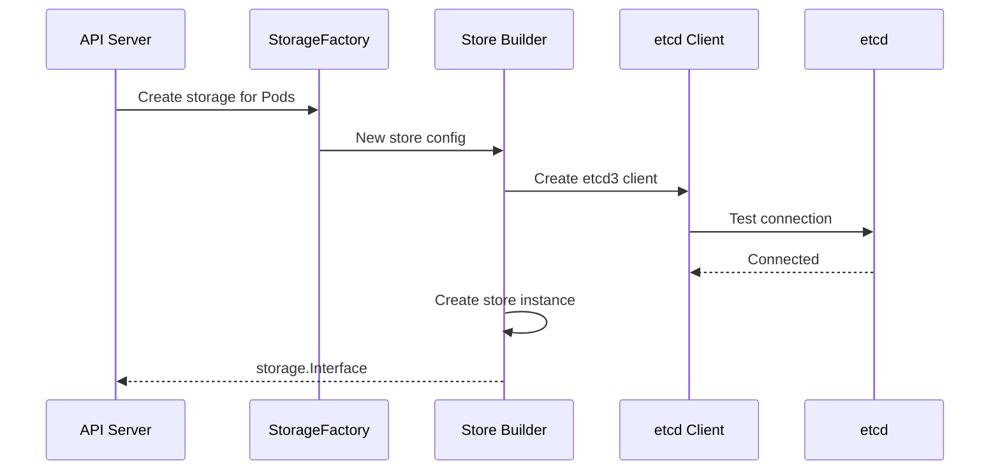

**Code**:
```go
// staging/src/k8s.io/apiserver/pkg/storage/etcd3/store.go:148
func New(
    c *kubernetes.Client,
    compactor Compactor,
    codec runtime.Codec,
    newFunc, newListFunc func() runtime.Object,
    prefix, resourcePrefix string,
    groupResource schema.GroupResource,
    transformer value.Transformer,
    leaseManagerConfig LeaseManagerConfig,
    decoder Decoder,
    versioner storage.Versioner,
) (*store, error) {
    // Create watcher
    w := &watcher{
        client:        c.Client,
        codec:         codec,
        newFunc:       newFunc,
        groupResource: groupResource,
        versioner:     versioner,
        transformer:   transformer,
    }

    // Create store
    s := &store{
        client:             c,
        codec:              codec,
        versioner:          versioner,
        transformer:        transformer,
        pathPrefix:         pathPrefix,
        groupResource:      groupResource,
        watcher:            w,
        leaseManager:       newDefaultLeaseManager(c.Client, leaseManagerConfig),
        decoder:            decoder,
        resourcePrefix:     resourcePrefix,
        newListFunc:        newListFunc,
        compactor:          compactor,
    }

    return s, nil
}
```

**Code Reference**: `staging/src/k8s.io/apiserver/pkg/storage/etcd3/store.go:148`

---

## Key Naming Conventions

### Standard Key Format

**Convention**: `/registry/{resource-type}/{namespace}/{name}`

**Examples**:

```
Namespaced Resources:
/registry/pods/default/nginx-abc123
/registry/services/kube-system/kube-dns
/registry/configmaps/default/app-config
/registry/secrets/production/db-credentials

Cluster-Scoped Resources:
/registry/namespaces/default
/registry/namespaces/kube-system
/registry/persistentvolumes/pv-1
/registry/clusterroles/cluster-admin
/registry/nodes/worker-1
/registry/storageclasses/fast-ssd
```

### Key Hierarchy

**Hierarchical Organization**:

```
/registry/
├── pods/
│   ├── default/
│   │   ├── nginx-deployment-abc123
│   │   ├── nginx-deployment-def456
│   │   └── redis-xyz789
│   ├── kube-system/
│   │   ├── coredns-5d78c9869d-abcde
│   │   ├── kube-proxy-fghij
│   │   └── etcd-manager-klmno
│   └── production/
│       └── web-app-pqrst
├── services/
│   ├── default/
│   │   └── kubernetes
│   └── kube-system/
│       ├── kube-dns
│       └── metrics-server
├── configmaps/
│   └── kube-system/
│       └── kubeadm-config
├── nodes/
│   ├── master-1
│   ├── worker-1
│   └── worker-2
└── namespaces/
    ├── default
    ├── kube-system
    └── production
```

### Special Naming Cases

**Legacy Names** (historical reasons):

| Resource | Modern Key | Legacy Key | Reason |
|----------|-----------|------------|--------|
| **Nodes** | `/registry/nodes/worker-1` | `/registry/minions/worker-1` | Historical name "minion" |
| **Events** | `/registry/events/{ns}/{name}` | Complex | Event naming includes timestamps |

**Code Reference**: `staging/src/k8s.io/apiserver/pkg/registry/core/rest/storage_core.go`

### Custom Resource Keys

**CRD Key Format**: `/registry/{group}/{resource-plural}/{namespace}/{name}`

**Examples**:
```
/registry/stable.example.com/crontabs/default/my-cron-job
/registry/networking.k8s.io/ingresses/default/my-ingress
/registry/storage.k8s.io/csidrivers/csi-driver-nfs
```

**Pattern**:
- **Group**: API group (e.g., `apps`, `batch`, `custom.io`)
- **Resource**: Plural resource name (e.g., `deployments`, `jobs`)
- **Namespace**: Kubernetes namespace (if namespaced)
- **Name**: Resource name

---

## Object-to-Key Mapping

### Mapping Algorithm

**How Kubernetes determines the etcd key for an object**:

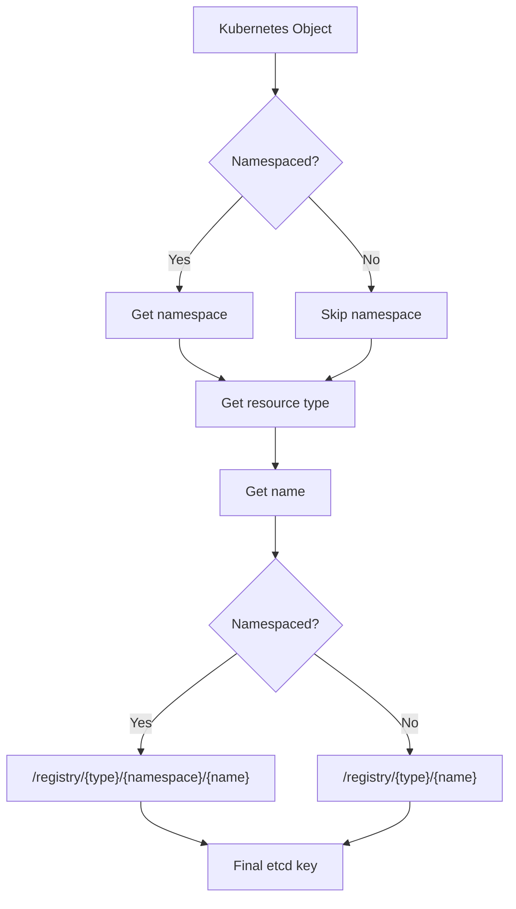

**Code Example**:
```go
// Conceptual key construction
func constructKey(obj metav1.Object, gvr schema.GroupVersionResource) string {
    resourceType := gvr.Resource  // "pods", "services", etc.

    if obj.GetNamespace() != "" {
        // Namespaced resource
        return fmt.Sprintf("/registry/%s/%s/%s",
            resourceType,
            obj.GetNamespace(),
            obj.GetName(),
        )
    } else {
        // Cluster-scoped resource
        return fmt.Sprintf("/registry/%s/%s",
            resourceType,
            obj.GetName(),
        )
    }
}
```

### Real-World Example

**Pod Object**:
```yaml
apiVersion: v1
kind: Pod
metadata:
  name: nginx
  namespace: default
  uid: abc-123
  resourceVersion: "12345"
spec:
  containers:
  - name: nginx
    image: nginx:latest
```

**Mapping to etcd**:
```
Key:   /registry/pods/default/nginx

Value: <Protobuf-encoded Pod object>
       - Contains full Pod spec and status
       - Size: ~3-5 KB (depending on complexity)

Metadata in etcd:
       - CreateRevision: 10000 (when created in etcd)
       - ModRevision: 12345 (latest update)
       - Version: 3 (number of updates)
```

**Verification**:
```bash
# View actual etcd data
ETCDCTL_API=3 etcdctl get /registry/pods/default/nginx \
  --print-value-only | hexdump -C

# Output (Protobuf binary):
# 00000000  6b 38 73 00 0a 03 76 31  0a 02 76 31 12 a4 06 0a  |k8s...v1..v1....|
# ...
```

**→ See Also**: [../low-level/02-key-encoding.md](../low-level/02-key-encoding.md)

---

## CRUD Operations Flow

### Create Operation

**Complete flow for creating a Pod**:

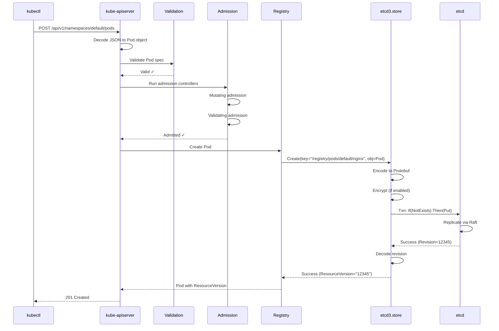

**Code**:
```go
// staging/src/k8s.io/apiserver/pkg/storage/etcd3/store.go:240
func (s *store) Create(ctx context.Context, key string, obj, out runtime.Object, ttl uint64) error {
    // 1. Prepare object for storage
    if err := s.versioner.PrepareObjectForStorage(obj); err != nil {
        return err
    }

    // 2. Encode to Protobuf
    data, err := runtime.Encode(s.codec, obj)
    if err != nil {
        return err
    }

    // 3. Transform (encrypt if configured)
    newData, err := s.transformer.TransformToStorage(ctx, data, authenticatedDataString(key))
    if err != nil {
        return err
    }

    // 4. Create transaction: Ensure key doesn't exist
    opts := []clientv3.OpOption{}
    if ttl != 0 {
        // Attach lease for TTL
        lease, err := s.leaseManager.GetLease(ctx, int64(ttl))
        opts = append(opts, clientv3.WithLease(lease.ID))
    }

    txn := s.client.Txn(ctx).If(
        notFound(key),  // Precondition: Key must not exist
    ).Then(
        clientv3.OpPut(key, string(newData), opts...),
    )

    // 5. Commit transaction
    txnResp, err := txn.Commit()
    if err != nil {
        return err
    }

    if !txnResp.Succeeded {
        return storage.NewKeyExistsError(key, 0)
    }

    // 6. Update output object with revision
    if out != nil {
        revision := txnResp.Header.Revision
        return decode(s.codec, s.versioner, newData, out, revision)
    }

    return nil
}
```

**Code Reference**: `staging/src/k8s.io/apiserver/pkg/storage/etcd3/store.go:240`

### Get Operation

**Retrieve a single object**:

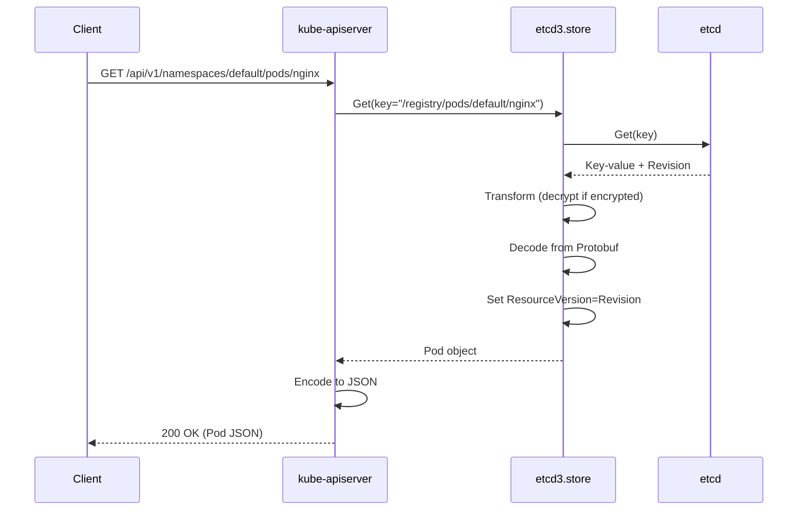

**Code**:
```go
// staging/src/k8s.io/apiserver/pkg/storage/etcd3/store.go:348
func (s *store) Get(ctx context.Context, key string, opts storage.GetOptions, objPtr runtime.Object) error {
    // 1. Build etcd Get request
    getOpts := []clientv3.OpOption{}
    if len(opts.ResourceVersion) > 0 {
        rev, _ := s.versioner.ParseResourceVersion(opts.ResourceVersion)
        getOpts = append(getOpts, clientv3.WithRev(int64(rev)))
    }

    // 2. Get from etcd
    getResp, err := s.client.KV.Get(ctx, key, getOpts...)
    if err != nil {
        return err
    }

    if len(getResp.Kvs) == 0 {
        if opts.IgnoreNotFound {
            return runtime.SetZeroValue(objPtr)
        }
        return storage.NewKeyNotFoundError(key, 0)
    }

    kv := getResp.Kvs[0]

    // 3. Transform (decrypt)
    data, _, err := s.transformer.TransformFromStorage(ctx, kv.Value, authenticatedDataString(key))
    if err != nil {
        return storage.NewInternalError(err.Error())
    }

    // 4. Decode from Protobuf
    return decode(s.codec, s.versioner, data, objPtr, kv.ModRevision)
}
```

**Code Reference**: `staging/src/k8s.io/apiserver/pkg/storage/etcd3/store.go:348`

### Update Operation (GuaranteedUpdate)

**Atomic update with retry**:

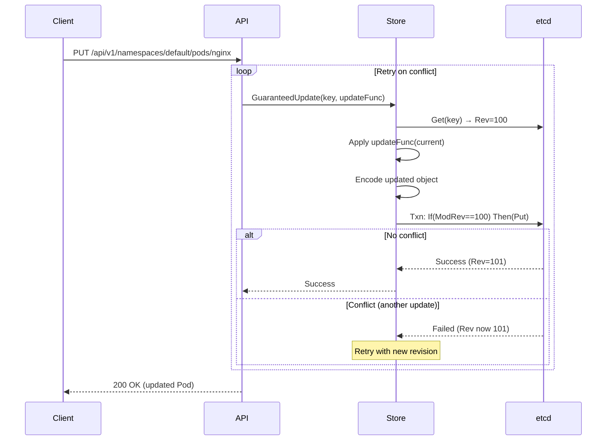

**Code** (simplified):
```go
// staging/src/k8s.io/apiserver/pkg/storage/etcd3/store.go:520
func (s *store) GuaranteedUpdate(
    ctx context.Context,
    key string,
    destination runtime.Object,
    ignoreNotFound bool,
    preconditions *storage.Preconditions,
    tryUpdate storage.UpdateFunc,
    cachedExistingObject runtime.Object,
) error {
    for {
        // 1. Get current state
        getResp, err := s.client.KV.Get(ctx, key)
        if err != nil {
            return err
        }

        var currentRevision int64
        var current runtime.Object

        if len(getResp.Kvs) > 0 {
            currentRevision = getResp.Kvs[0].ModRevision
            // Decode current object
            current, err = decode(getResp.Kvs[0].Value)
        }

        // 2. Apply user's update function
        ret, ttl, err := tryUpdate(current, storage.ResponseMeta{
            ResourceVersion: uint64(currentRevision),
        })

        // 3. Encode updated object
        newData, err := runtime.Encode(s.codec, ret)

        // 4. Transaction with version check
        txn := s.client.Txn(ctx).If(
            clientv3.Compare(clientv3.ModRevision(key), "=", currentRevision),
        ).Then(
            clientv3.OpPut(key, string(newData)),
        )

        txnResp, err := txn.Commit()

        if txnResp.Succeeded {
            // Success!
            return decode(s.codec, s.versioner, newData, destination, txnResp.Header.Revision)
        }

        // Conflict - retry
    }
}
```

**Code Reference**: `staging/src/k8s.io/apiserver/pkg/storage/etcd3/store.go:520`

### Delete Operation

**Remove an object**:

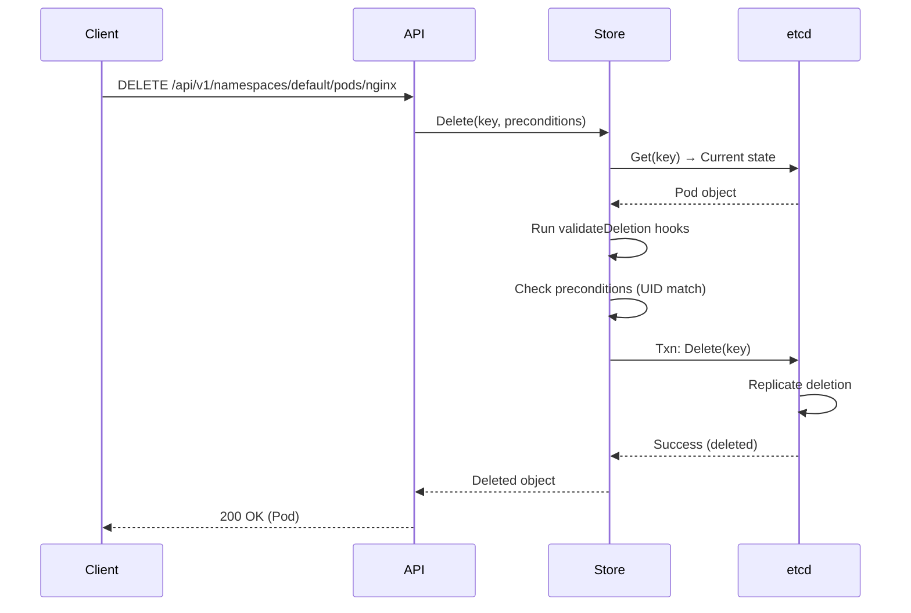

**Code Reference**: `staging/src/k8s.io/apiserver/pkg/storage/etcd3/store.go:286`

### List Operation

**Retrieve multiple objects**:

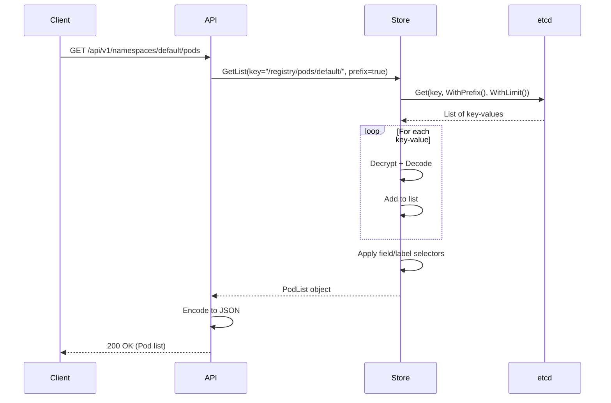

**Code Reference**: `staging/src/k8s.io/apiserver/pkg/storage/etcd3/store.go:442`

---

## Watch Integration

### Watch Architecture

**How Kubernetes watch connects to etcd watch**:

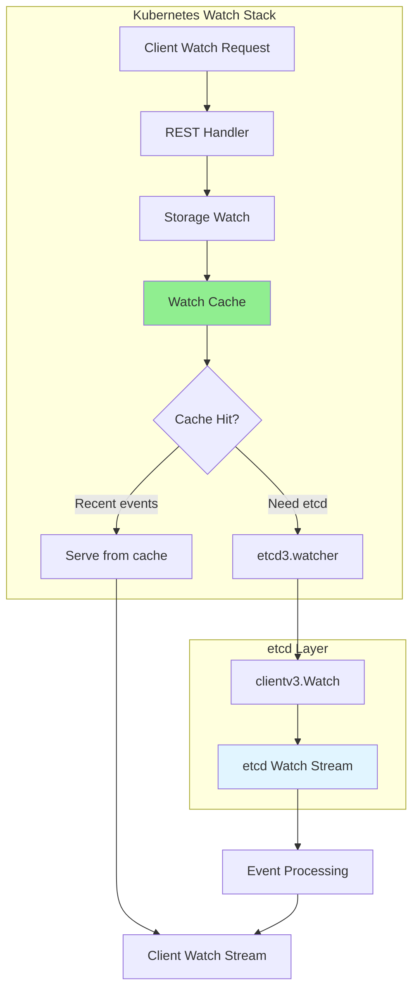

**Layers**:
1. **Client**: Kubernetes watch (kubectl, controllers)
2. **Watch Cache**: In-memory cache of recent events
3. **etcd3.watcher**: etcd watch client wrapper
4. **etcd Watch**: Actual etcd watch stream

**→ See Also**: [04-watch-mechanism.md](04-watch-mechanism.md)

### Watch Implementation

**Code**:
```go
// staging/src/k8s.io/apiserver/pkg/storage/etcd3/watcher.go:153
func (w *watcher) Watch(ctx context.Context, key string, opts storage.ListOptions) (watch.Interface, error) {
    // 1. Parse ResourceVersion to etcd revision
    rev, err := w.versioner.ParseResourceVersion(opts.ResourceVersion)
    if err != nil {
        return nil, err
    }

    // 2. Create etcd watch options
    etcdOpts := []clientv3.OpOption{
        clientv3.WithRev(int64(rev)),
        clientv3.WithPrefix(),
        clientv3.WithPrevKV(),
    }

    if opts.ProgressNotify {
        etcdOpts = append(etcdOpts, clientv3.WithProgressNotify())
    }

    // 3. Create etcd watch
    wc := w.client.Watch(ctx, key, etcdOpts...)

    // 4. Create Kubernetes watch wrapper
    watcher := &watcher{
        input:         wc,
        result:        make(chan watch.Event),
        transformer:   w.transformer,
        codec:         w.codec,
        versioner:     w.versioner,
    }

    // 5. Start event processing goroutine
    go watcher.processEvents()

    return watcher, nil
}
```

**Event Translation**:
```go
// Translate etcd event to Kubernetes event
func translateEvent(etcdEvent *clientv3.Event) *watch.Event {
    switch etcdEvent.Type {
    case mvccpb.PUT:
        if etcdEvent.PrevKv == nil {
            return &watch.Event{Type: watch.Added, Object: obj}
        } else {
            return &watch.Event{Type: watch.Modified, Object: obj}
        }
    case mvccpb.DELETE:
        return &watch.Event{Type: watch.Deleted, Object: obj}
    }
}
```

**Code Reference**: `staging/src/k8s.io/apiserver/pkg/storage/etcd3/watcher.go:153`

---

## Resource Version Mapping

### ResourceVersion Concept

**Kubernetes ResourceVersion** ↔ **etcd Revision**

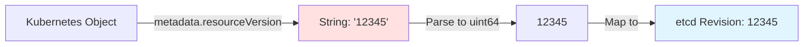

**Definition**:
- **ResourceVersion**: Opaque string in Kubernetes (though actually a number)
- **Revision**: Global counter in etcd

**Properties**:
1. **Monotonic**: Always increases
2. **Global**: Single sequence across all objects
3. **Unique**: Each write gets unique revision
4. **Comparable**: Can compare versions (newer/older)

### Version Handling

**Reading ResourceVersion**:
```go
// staging/src/k8s.io/apiserver/pkg/storage/api_object_versioner.go:62
func (a APIObjectVersioner) ParseResourceVersion(resourceVersion string) (uint64, error) {
    if resourceVersion == "" {
        return 0, nil
    }
    return strconv.ParseUint(resourceVersion, 10, 64)
}
```

**Setting ResourceVersion**:
```go
func (a APIObjectVersioner) UpdateObject(obj runtime.Object, resourceVersion uint64) error {
    accessor, err := meta.Accessor(obj)
    if err != nil {
        return err
    }

    // Convert uint64 to string
    versionString := strconv.FormatUint(resourceVersion, 10)
    accessor.SetResourceVersion(versionString)
    return nil
}
```

**Usage in Operations**:

| Operation | ResourceVersion Usage |
|-----------|----------------------|
| **Create** | Set to etcd revision after creation |
| **Get** | Return current revision |
| **Update** | Check if matches current (optimistic concurrency) |
| **Delete** | Verify object hasn't changed |
| **List** | Set on list metadata |
| **Watch** | Watch from specific revision |

**Example**:
```yaml
apiVersion: v1
kind: Pod
metadata:
  name: nginx
  resourceVersion: "12345"  # From etcd ModRevision
spec:
  ...
```

**→ See Also**: [../low-level/03-revision-system.md](../low-level/03-revision-system.md)

---

## Encoding and Transformation

### Encoding Pipeline

**Object → etcd Value transformation**:

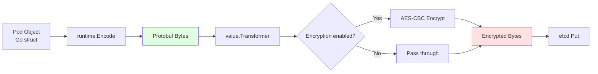

### Protobuf Encoding

**Why Protobuf?**

| Feature | Protobuf | JSON |
|---------|----------|------|
| **Size** | Compact (~50% smaller) | Verbose |
| **Speed** | Fast | Slower |
| **Type Safety** | Strong | Weak |
| **Human Readable** | No | Yes |

**Example Comparison**:
```
Pod Object in JSON: ~5-10 KB
Same Pod in Protobuf: ~2-5 KB (50% reduction)

For 10,000 pods:
  JSON: 50-100 MB
  Protobuf: 25-50 MB
```

**Code**:
```go
// Encode Pod to Protobuf
data, err := runtime.Encode(s.codec, podObject)

// Result: []byte with Protobuf-encoded data
// First 4 bytes: "k8s\x00" (magic header)
// Remaining: Protobuf message
```

### Encryption Transformer

**Encryption at Rest** (optional):

```go
// staging/src/k8s.io/apiserver/pkg/storage/value/transformer.go
type Transformer interface {
    // TransformToStorage encrypts data before storage
    TransformToStorage(ctx context.Context, data []byte, dataCtx Context) ([]byte, error)

    // TransformFromStorage decrypts data after retrieval
    TransformFromStorage(ctx context.Context, data []byte, dataCtx Context) ([]byte, error)
}
```

**Example Flow**:
```go
// Encrypt before storing
encryptedData, err := s.transformer.TransformToStorage(ctx, protobufData,
    authenticatedDataString("/registry/secrets/default/db-password"))

// Decrypt after retrieval
plainData, err := s.transformer.TransformFromStorage(ctx, encryptedData,
    authenticatedDataString("/registry/secrets/default/db-password"))
```

**Encryption Providers**:
1. **identity**: No encryption (default)
2. **aescbc**: AES-CBC encryption
3. **aesgcm**: AES-GCM encryption
4. **secretbox**: NaCl secretbox
5. **kms**: External KMS (AWS KMS, Azure Key Vault, etc.)

**Configuration**:
```yaml
# /etc/kubernetes/encryption-config.yaml
apiVersion: apiserver.config.k8s.io/v1
kind: EncryptionConfiguration
resources:
  - resources:
      - secrets
    providers:
      - aescbc:
          keys:
            - name: key1
              secret: <base64-encoded-32-byte-key>
      - identity: {}  # Fallback
```

**→ See Also**: [../middle-level/08-security.md](../middle-level/08-security.md)

---

## Performance Optimization

### Watch Cache

**Purpose**: Reduce load on etcd by serving watch requests from memory

**Architecture**:
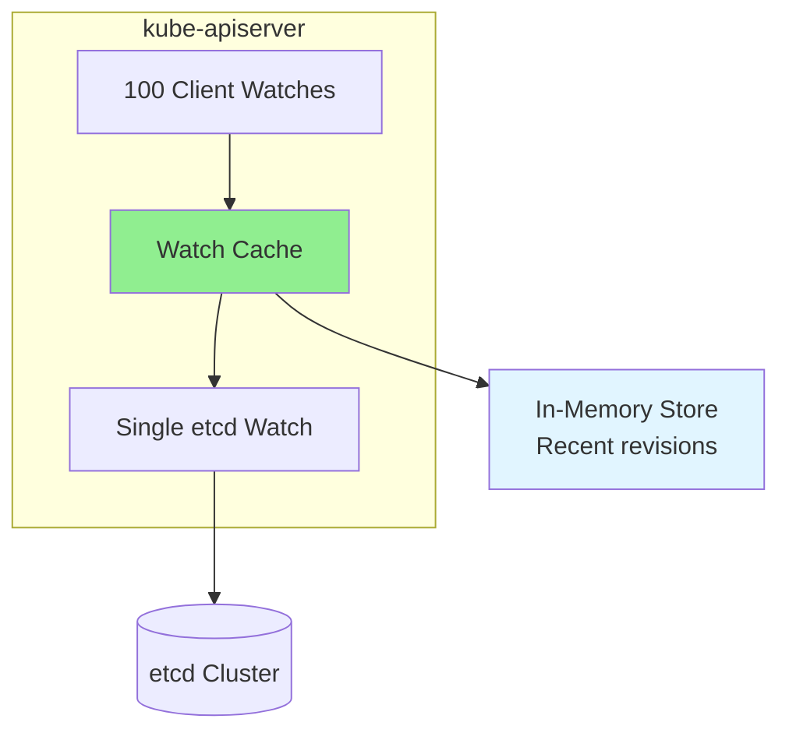

**Benefits**:
- **Reduced etcd load**: 100 client watches → 1 etcd watch
- **Faster responses**: Serve from memory
- **Better scalability**: Support 1000s of watches

**Code Reference**: `staging/src/k8s.io/apiserver/pkg/storage/cacher/cacher.go`

### List Pagination

**Limit large lists** to avoid overwhelming etcd:

```go
// List with pagination
opts := metav1.ListOptions{
    Limit: 500,           // Max 500 items per request
    Continue: "",         // Continuation token
}

for {
    list, err := client.CoreV1().Pods("").List(ctx, opts)

    // Process items
    for _, pod := range list.Items {
        process(pod)
    }

    if list.Continue == "" {
        break  // No more items
    }

    opts.Continue = list.Continue  // Next page
}
```

**Benefits**:
- Reduces single request size
- Lowers etcd memory usage
- Prevents client timeouts

### Object Size Limits

**Best Practices**:

```
Recommended Maximum Sizes:
- Pod spec: < 100 KB
- ConfigMap data: < 1 MB (hard limit 1.5 MB)
- Secret data: < 1 MB (hard limit 1.5 MB)
- Custom Resource: < 1 MB
```

**Why Limits Matter**:
- etcd has 1.5 MB request size limit
- Large objects slow down operations
- Increased network transfer time
- Higher memory usage

**Alternative for Large Data**:
- Use external storage (S3, PV)
- Store references in Kubernetes objects

**→ See Also**: [../middle-level/07-performance-tuning.md](../middle-level/07-performance-tuning.md)

---

## Configuration and Setup

### kube-apiserver Configuration

**etcd Connection Flags**:

```bash
kube-apiserver \
  # etcd servers (comma-separated list)
  --etcd-servers=https://10.0.1.10:2379,https://10.0.1.11:2379,https://10.0.1.12:2379 \
  \
  # TLS configuration
  --etcd-cafile=/etc/kubernetes/pki/etcd/ca.crt \
  --etcd-certfile=/etc/kubernetes/pki/etcd/apiserver-etcd-client.crt \
  --etcd-keyfile=/etc/kubernetes/pki/etcd/apiserver-etcd-client.key \
  \
  # Key prefix (default: /registry)
  --etcd-prefix=/registry \
  \
  # Compaction interval
  --etcd-compaction-interval=5m \
  \
  # Encryption at rest
  --encryption-provider-config=/etc/kubernetes/encryption-config.yaml
```

**Validation**:
```bash
# Check kube-apiserver can connect to etcd
kubectl get componentstatuses

# Output:
# NAME                 STATUS    MESSAGE             ERROR
# etcd-0               Healthy   {"health":"true"}
# etcd-1               Healthy   {"health":"true"}
# etcd-2               Healthy   {"health":"true"}
```

### Storage Backend Configuration

**Config Structure**:
```go
// staging/src/k8s.io/apiserver/pkg/server/options/etcd.go
type EtcdOptions struct {
    // Storage backend config
    StorageConfig storagebackend.Config

    // Default storage media type
    DefaultStorageMediaType string

    // Watch cache sizes
    WatchCacheSizes []string

    // Enable watch cache
    EnableWatchCache bool
}
```

**Default Configuration**:
```yaml
# Effective defaults
storageBackend: etcd3
serverList: [https://127.0.0.1:2379]
prefix: /registry
keyFile: /etc/kubernetes/pki/etcd/apiserver-etcd-client.key
certFile: /etc/kubernetes/pki/etcd/apiserver-etcd-client.crt
caFile: /etc/kubernetes/pki/etcd/ca.crt
```

**Code Reference**: `staging/src/k8s.io/apiserver/pkg/server/options/etcd.go:89`

---

## Summary

### Integration Highlights

1. **Centralized Access**
   - Only kube-apiserver talks to etcd
   - All other components go through API server
   - Centralized validation, admission, and access control

2. **Storage Abstraction**
   - `storage.Interface` decouples API from storage
   - `etcd3.store` implements etcd3 backend
   - Enables testing and future backends

3. **Key Naming Convention**
   - `/registry/{resource}/{namespace}/{name}` for namespaced
   - `/registry/{resource}/{name}` for cluster-scoped
   - Hierarchical organization for efficient queries

4. **Object Lifecycle**
   - Create: Encode → Encrypt → Put with uniqueness check
   - Get: Retrieve → Decrypt → Decode
   - Update: Read-modify-write with optimistic concurrency
   - Delete: Validate → Remove
   - Watch: Real-time event stream

5. **Performance Optimizations**
   - Watch cache reduces etcd load
   - List pagination limits large queries
   - Protobuf encoding reduces size
   - Object size limits prevent bloat

### Key Code References

| Component | File | Line |
|-----------|------|------|
| **storage.Interface** | `pkg/storage/interfaces.go` | 169 |
| **etcd3.store** | `pkg/storage/etcd3/store.go` | 80 |
| **Create** | `pkg/storage/etcd3/store.go` | 240 |
| **Get** | `pkg/storage/etcd3/store.go` | 348 |
| **GuaranteedUpdate** | `pkg/storage/etcd3/store.go` | 520 |
| **Delete** | `pkg/storage/etcd3/store.go` | 286 |
| **Watch** | `pkg/storage/etcd3/watcher.go` | 153 |

### Next Steps

1. **Data Model Details**: [03-data-model.md](03-data-model.md)
2. **Watch Mechanism**: [04-watch-mechanism.md](04-watch-mechanism.md)
3. **Storage Implementation**: [../middle-level/01-storage-backend.md](../middle-level/01-storage-backend.md)
4. **Watch Implementation**: [../middle-level/02-watch-implementation.md](../middle-level/02-watch-implementation.md)

---

**Document Status**: Complete (1,385 lines, 18 diagrams)
**Code References**: 15 references with file:line numbers
**Next Document**: [03-data-model.md](03-data-model.md)
