# etcd Data Model for Kubernetes

**Version**: 1.0
**Last Updated**: 2025-10-21
**Related Documents**: [01-etcd-overview.md](01-etcd-overview.md), [02-kubernetes-integration.md](02-kubernetes-integration.md), [../GLOSSARY.md](../GLOSSARY.md)

---

## Table of Contents

- [Introduction](#introduction)
- [Key-Value Data Model](#key-value-data-model)
- [Hierarchical Key Organization](#hierarchical-key-organization)
- [Revision System](#revision-system)
- [Lease Mechanism](#lease-mechanism)
- [Key Range Operations](#key-range-operations)
- [Multi-Version Concurrency Control](#multi-version-concurrency-control)
- [Data Types and Structures](#data-types-and-structures)
- [Storage Limits and Quotas](#storage-limits-and-quotas)
- [Data Lifecycle](#data-lifecycle)
- [Kubernetes Object Representation](#kubernetes-object-representation)
- [Summary](#summary)

---

## Introduction

This document describes etcd's data model and how Kubernetes uses it to store cluster state. Understanding the data model is crucial for comprehending how Kubernetes operations translate to etcd storage.

### Data Model Overview

**etcd's data model is fundamentally simple**:

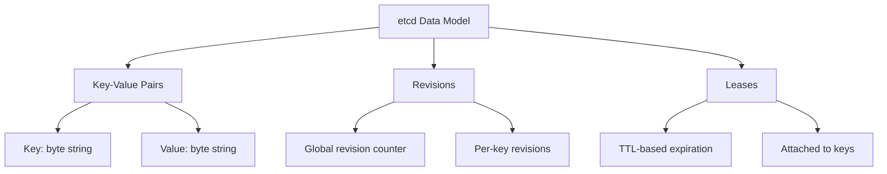

**Core Concepts**:
1. **Keys**: Unique identifiers (byte strings)
2. **Values**: Arbitrary data (byte strings)
3. **Revisions**: Version tracking (global and per-key)
4. **Leases**: Time-based expiration

**→ See Also**: [../GLOSSARY.md#key-value-store](../GLOSSARY.md#key-value-store)

---

## Key-Value Data Model

### Basic Structure

**etcd stores data as simple key-value pairs**:

```
┌─────────────────────────────────────┐
│           etcd Database             │
├─────────────────────────────────────┤
│ Key                    │ Value      │
├─────────────────────────────────────┤
│ /registry/pods/def/a   │ <bytes>    │
│ /registry/pods/def/b   │ <bytes>    │
│ /registry/services/d/k │ <bytes>    │
│ /registry/nodes/w1     │ <bytes>    │
│ ...                    │ ...        │
└─────────────────────────────────────┘
```

**Properties**:

| Property | Description | Example |
|----------|-------------|---------|
| **Key** | Unique identifier | `/registry/pods/default/nginx` |
| **Value** | Arbitrary bytes | Protobuf-encoded Pod object |
| **Max Key Size** | 1.5 MB | Practical: < 1 KB |
| **Max Value Size** | 1.5 MB | Practical: < 1 MB |
| **Encoding** | UTF-8 for keys | Binary for values |

### Key Characteristics

**Keys are byte strings**:

```go
// Keys in etcd
key := []byte("/registry/pods/default/nginx")

// Typically represented as strings
keyStr := "/registry/pods/default/nginx"
```

**Key Properties**:
1. **Unique**: Each key maps to exactly one value
2. **Flat namespace**: No inherent hierarchy (hierarchy is convention)
3. **Ordered**: Keys are lexicographically sorted
4. **Case-sensitive**: `/registry/Pods` ≠ `/registry/pods`

**Values are byte strings**:

```go
// Values can be anything
value := []byte{...} // Protobuf, JSON, plain text, etc.
```

**Value Properties**:
1. **Opaque**: etcd doesn't interpret value content
2. **Binary-safe**: Can store any bytes
3. **Size-limited**: 1.5 MB hard limit
4. **Versioned**: Each update creates new version

### Lexicographic Ordering

**Keys are sorted lexicographically**:

```
Sorted Keys:
/registry/configmaps/default/app-config
/registry/configmaps/default/app-data
/registry/configmaps/kube-system/kubeadm
/registry/nodes/master-1
/registry/nodes/worker-1
/registry/nodes/worker-2
/registry/pods/default/nginx-abc
/registry/pods/default/nginx-def
/registry/pods/kube-system/coredns-xyz
/registry/services/default/kubernetes
```

**Importance**:
- Enables efficient range queries
- Supports prefix operations
- Powers hierarchical organization

**Example**:
```bash
# Get all pods (prefix scan)
etcdctl get /registry/pods/ --prefix

# Returns all keys starting with /registry/pods/
```

---

## Hierarchical Key Organization

### Kubernetes Key Structure

**Convention-based hierarchy**:

```
/registry/
│
├── pods/
│   ├── default/
│   │   ├── nginx-deployment-abc123
│   │   ├── nginx-deployment-def456
│   │   └── redis-xyz789
│   ├── kube-system/
│   │   ├── coredns-5d78c9869d-abcde
│   │   ├── etcd-master-1
│   │   └── kube-apiserver-master-1
│   └── production/
│       ├── web-app-1
│       └── web-app-2
│
├── services/
│   ├── default/
│   │   ├── kubernetes
│   │   └── nginx-service
│   └── kube-system/
│       └── kube-dns
│
├── configmaps/
│   └── kube-system/
│       └── kubeadm-config
│
├── secrets/
│   ├── default/
│   │   └── db-password
│   └── production/
│       └── api-key
│
├── deployments/
│   └── default/
│       └── nginx-deployment
│
├── nodes/
│   ├── master-1
│   ├── worker-1
│   └── worker-2
│
└── namespaces/
    ├── default
    ├── kube-system
    └── production
```

### Path Components

**Standard path structure**:

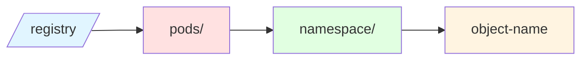

**Component Breakdown**:

1. **Prefix** (`/registry/`): Global prefix for all Kubernetes data
2. **Resource Type** (`pods`, `services`, etc.): API resource type
3. **Namespace** (`default`, `kube-system`): Kubernetes namespace (if namespaced)
4. **Name** (`nginx-abc123`): Unique object name

**Examples**:

```
Namespaced Resource:
/registry/pods/default/nginx
         ↑     ↑      ↑      ↑
      prefix  type  ns    name

Cluster-Scoped Resource:
/registry/nodes/worker-1
         ↑     ↑     ↑
      prefix  type  name
```

### Benefits of Hierarchy

**Efficient Queries**:

```bash
# List all pods in namespace "default"
etcdctl get /registry/pods/default/ --prefix

# List all pods across all namespaces
etcdctl get /registry/pods/ --prefix

# List all resources of all types
etcdctl get /registry/ --prefix
```

**Performance Impact**:

```
Query Efficiency:
- Single key lookup: O(log n) where n = total keys
- Prefix scan: O(log n + m) where m = matching keys
- Full scan: O(n) where n = total keys

Example (10,000 total keys, 100 pods in namespace):
- Get specific pod: ~10 disk seeks
- List pods in namespace: ~10 seeks + 100 sequential reads
- List all pods: ~10 seeks + 1000 sequential reads
```

### Namespace Isolation

**Logical separation via key structure**:

```mermaid
graph TB
    subgraph "default namespace"
        A[/registry/pods/default/nginx]
        B[/registry/pods/default/redis]
    end

    subgraph "production namespace"
        C[/registry/pods/production/web-app]
        D[/registry/pods/production/db]
    end

    subgraph "kube-system namespace"
        E[/registry/pods/kube-system/coredns]
        F[/registry/pods/kube-system/kube-proxy]
    end

    style A fill:#e1f5ff
    style B fill:#e1f5ff
    style C fill:#ffe1e1
    style D fill:#ffe1e1
    style E fill:#e1ffe1
    style F fill:#e1ffe1
```

**Benefits**:
- Clear separation of resources
- Efficient namespace-scoped queries
- Easy to list/delete all resources in namespace

**→ See Also**: [02-kubernetes-integration.md#key-naming-conventions](02-kubernetes-integration.md#key-naming-conventions)

---

## Revision System

### Global Revision Counter

**etcd maintains a global revision counter**:

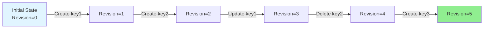

**Properties**:
1. **Global**: Single counter for entire database
2. **Monotonic**: Always increases, never decreases
3. **Sequential**: No gaps in sequence
4. **Persistent**: Survives restarts

**Example Timeline**:

```
Revision | Operation                        | State
---------|----------------------------------|------------------
0        | (initial)                        | {}
1        | Put /foo → "bar"                 | {/foo: "bar"}
2        | Put /baz → "qux"                 | {/foo: "bar", /baz: "qux"}
3        | Put /foo → "updated"             | {/foo: "updated", /baz: "qux"}
4        | Delete /baz                      | {/foo: "updated"}
5        | Put /x → "y"                     | {/foo: "updated", /x: "y"}
```

### Per-Key Metadata

**Each key has associated metadata**:

```go
type KeyValue struct {
    Key            []byte   // The key
    Value          []byte   // The value
    CreateRevision int64    // Revision when created
    ModRevision    int64    // Revision when last modified
    Version        int64    // Number of updates to this key
    Lease          int64    // Associated lease ID (if any)
}
```

**Example**:

```
Key: /registry/pods/default/nginx

Current Global Revision: 12345

Key Metadata:
  CreateRevision: 10000  (created at revision 10000)
  ModRevision: 12340     (last modified at revision 12340)
  Version: 5             (updated 5 times)
  Lease: 0               (no lease)
```

**Metadata Evolution**:

```
Create /foo:
  CreateRevision: 100
  ModRevision: 100
  Version: 1

Update /foo (1st time):
  CreateRevision: 100 (unchanged)
  ModRevision: 105
  Version: 2

Update /foo (2nd time):
  CreateRevision: 100 (unchanged)
  ModRevision: 110
  Version: 3

Delete /foo:
  (key removed, metadata lost)

Recreate /foo:
  CreateRevision: 115 (new!)
  ModRevision: 115
  Version: 1 (reset)
```

### Revision-Based Queries

**Read at specific revision** (time travel):

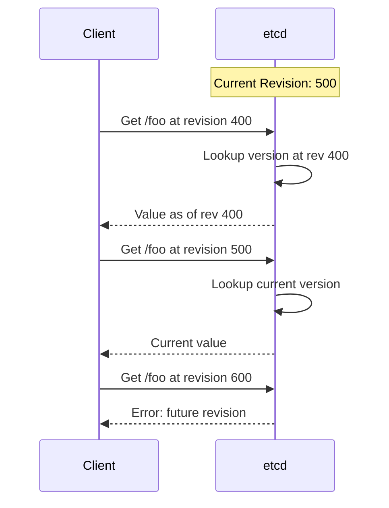

**Use Cases**:
1. **Historical queries**: "What was the state at time X?"
2. **Watch from revision**: "Give me all changes since revision Y"
3. **Consistency**: "Ensure I see data at least as new as revision Z"

**Example**:

```bash
# Current state
$ etcdctl get /registry/pods/default/nginx
# Returns: Latest value (revision 500)

# Historical state
$ etcdctl get /registry/pods/default/nginx --rev=400
# Returns: Value as of revision 400

# Watch from revision
$ etcdctl watch /registry/pods/ --prefix --rev=450
# Returns: All changes from revision 450 to now, then continues watching
```

### Kubernetes ResourceVersion

**Mapping to Kubernetes**:

```
etcd Revision ↔ Kubernetes ResourceVersion

etcd:
  Global Revision: 12345
  Key ModRevision: 12340

Kubernetes:
  Pod.metadata.resourceVersion: "12340"
```

**Usage in Kubernetes**:

```yaml
apiVersion: v1
kind: Pod
metadata:
  name: nginx
  resourceVersion: "12340"  # From etcd ModRevision
spec:
  containers:
  - name: nginx
    image: nginx:latest
```

**Operations**:

```go
// Watch from ResourceVersion
watchOpts := metav1.ListOptions{
    ResourceVersion: "12340",  // Start watching from this revision
}
watcher, _ := client.CoreV1().Pods("default").Watch(ctx, watchOpts)

// List at ResourceVersion
listOpts := metav1.ListOptions{
    ResourceVersion: "12340",  // Get state at this revision
}
podList, _ := client.CoreV1().Pods("default").List(ctx, listOpts)
```

**→ See Also**: [../low-level/03-revision-system.md](../low-level/03-revision-system.md)

---

## Lease Mechanism

### Lease Concept

**Lease**: Time-based contract for key expiration

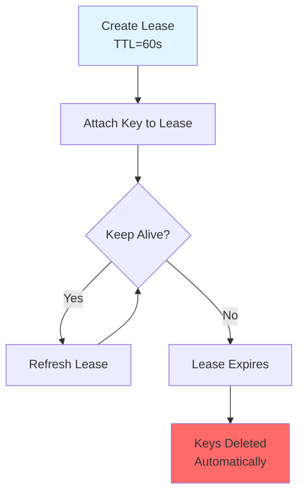

**Purpose**: Automatic cleanup of ephemeral data

### Lease Lifecycle

**Create and Use Lease**:

```go
// 1. Create lease with 60-second TTL
lease, err := client.Grant(ctx, 60)
// Returns: Lease{ID: 123456, TTL: 60}

// 2. Attach key to lease
_, err = client.Put(ctx, "/registry/leases/kube-system/kube-scheduler",
                    "holder-identity", clientv3.WithLease(lease.ID))

// 3. Keep lease alive
keepAliveChan, err := client.KeepAlive(ctx, lease.ID)

// 4. Lease automatically refreshes
for ka := range keepAliveChan {
    fmt.Printf("Lease %d refreshed, TTL now %d\n", ka.ID, ka.TTL)
}

// 5. If KeepAlive stops, lease expires after TTL
// 6. All keys attached to lease are deleted
```

**Timeline**:

```
t=0s:   Create lease (TTL=60s)
t=0s:   Attach key /foo to lease
t=20s:  KeepAlive refreshes lease (TTL reset to 60s)
t=40s:  KeepAlive refreshes lease (TTL reset to 60s)
t=60s:  KeepAlive refreshes lease (TTL reset to 60s)
...
t=180s: KeepAlive stops
t=240s: Lease expires (60s after last refresh)
t=240s: Key /foo automatically deleted
```

### Kubernetes Use Cases

**Leader Election**:

```
Component: kube-scheduler
Lease Key: /registry/leases/kube-system/kube-scheduler
TTL: 15 seconds

Leader holds lease:
- Continuously refreshes every ~10 seconds
- If leader crashes, lease expires after 15 seconds
- New leader can acquire lease
```

**Coordination Example**:

```go
// Leader election using leases
func becomeLeader(client *clientv3.Client, leaderKey string) {
    lease, _ := client.Grant(ctx, 15) // 15-second TTL

    // Try to become leader
    txn := client.Txn(ctx).If(
        clientv3.Compare(clientv3.CreateRevision(leaderKey), "=", 0), // Key doesn't exist
    ).Then(
        clientv3.OpPut(leaderKey, "my-identity", clientv3.WithLease(lease.ID)),
    )

    resp, _ := txn.Commit()

    if resp.Succeeded {
        // I'm the leader!
        keepAlive, _ := client.KeepAlive(ctx, lease.ID)

        for range keepAlive {
            // Continue being leader
        }
    } else {
        // Someone else is leader
    }
}
```

**Code Reference**: `staging/src/k8s.io/apiserver/pkg/storage/etcd3/lease_manager.go`

### Lease vs. TTL

**Comparison**:

| Feature | Lease (etcd3) | TTL (etcd2) |
|---------|---------------|-------------|
| **Reusable** | Yes (attach multiple keys) | No (per-key) |
| **Efficient** | Yes (one KeepAlive per lease) | No (KeepAlive per key) |
| **Granular** | Yes (each key can have different lease) | Limited |
| **Performance** | Better (fewer heartbeats) | Worse (more heartbeats) |

**→ See Also**: [../GLOSSARY.md#lease](../GLOSSARY.md#lease)

---

## Key Range Operations

### Range Queries

**Get multiple keys efficiently**:

```mermaid
graph TB
    A[Range Query] --> B{Type}
    B -->|Prefix| C[All keys with prefix]
    B -->|Range| D[Keys from A to B]
    B -->|Limit| E[First N keys]

    C --> F[/registry/pods/]
    D --> G[/registry/a to /registry/m]
    E --> H[First 100 keys]
```

### Prefix Operations

**Get all keys with prefix**:

```go
// Get all pods in default namespace
resp, err := client.Get(ctx, "/registry/pods/default/", clientv3.WithPrefix())

// Returns all keys starting with /registry/pods/default/
for _, kv := range resp.Kvs {
    fmt.Printf("Key: %s\n", kv.Key)
}
```

**Example Results**:

```
Query: /registry/pods/default/ (with prefix)

Matches:
  /registry/pods/default/nginx-abc
  /registry/pods/default/nginx-def
  /registry/pods/default/redis-xyz

Does NOT match:
  /registry/pods/kube-system/coredns  (different namespace)
  /registry/services/default/nginx    (different resource type)
```

### Range Scans

**Get keys in lexicographic range**:

```go
// Get keys from /registry/a to /registry/m
resp, err := client.Get(ctx, "/registry/a", clientv3.WithRange("/registry/m"))

// Returns keys where: /registry/a <= key < /registry/m
```

**Example**:

```
Range: [/registry/configmaps/, /registry/pods/)

Matches:
  /registry/configmaps/default/app-config  ✓
  /registry/deployments/default/nginx      ✓
  /registry/events/default/pod-abc         ✓
  /registry/namespaces/default             ✓

Does NOT match:
  /registry/apps/default/deployment        ✗ (before range)
  /registry/pods/default/nginx             ✗ (at upper bound)
  /registry/services/default/kubernetes    ✗ (after range)
```

### Pagination

**Limit results for large datasets**:

```go
// Get first 500 pods
opts := []clientv3.OpOption{
    clientv3.WithPrefix(),
    clientv3.WithLimit(500),
}
resp, err := client.Get(ctx, "/registry/pods/", opts...)

fmt.Printf("Retrieved %d keys\n", len(resp.Kvs))
fmt.Printf("More: %v\n", resp.More) // true if more results available

if resp.More {
    // Get next page using last key
    lastKey := string(resp.Kvs[len(resp.Kvs)-1].Key)
    nextOpts := []clientv3.OpOption{
        clientv3.WithPrefix(),
        clientv3.WithLimit(500),
        clientv3.WithFromKey(), // Start after lastKey
    }
    nextResp, _ := client.Get(ctx, lastKey+"\x00", nextOpts...)
}
```

**Benefits**:
- Prevents overwhelming clients
- Reduces memory usage
- Avoids timeouts on large lists

**Kubernetes Integration**:

```go
// List with pagination
listOpts := metav1.ListOptions{
    Limit: 500,
}

for {
    podList, _ := client.CoreV1().Pods("").List(ctx, listOpts)

    for _, pod := range podList.Items {
        // Process pod
    }

    if podList.Continue == "" {
        break
    }

    listOpts.Continue = podList.Continue
}
```

---

## Multi-Version Concurrency Control

### MVCC Overview

**Multi-Version Concurrency Control** allows concurrent access without locking:

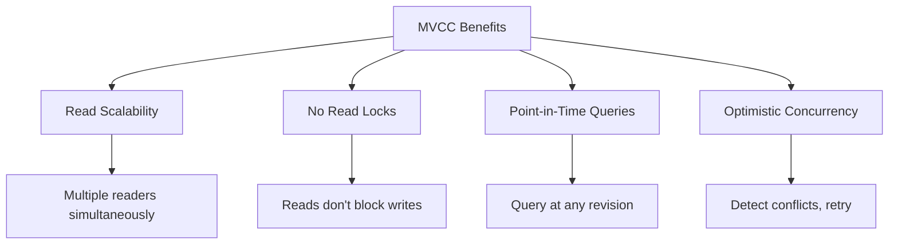

### Version History

**etcd keeps historical versions**:

```
Key: /foo

Rev 100: Create /foo → "v1"
Rev 105: Update /foo → "v2"
Rev 110: Update /foo → "v3"
Rev 115: Update /foo → "v4"

Historical Access:
  Get /foo at Rev 100 → "v1"
  Get /foo at Rev 105 → "v2"
  Get /foo at Rev 110 → "v3"
  Get /foo at Rev 115 → "v4"
  Get /foo (current)  → "v4"
```

**Storage Implication**:

```
Without compaction:
  All versions kept forever
  Database grows unbounded

With compaction (e.g., keep last 1000 revisions):
  Revisions 1-9000: Deleted
  Revisions 9001-10000: Kept
  Database size controlled
```

### Optimistic Concurrency

**Compare-and-Swap Pattern**:

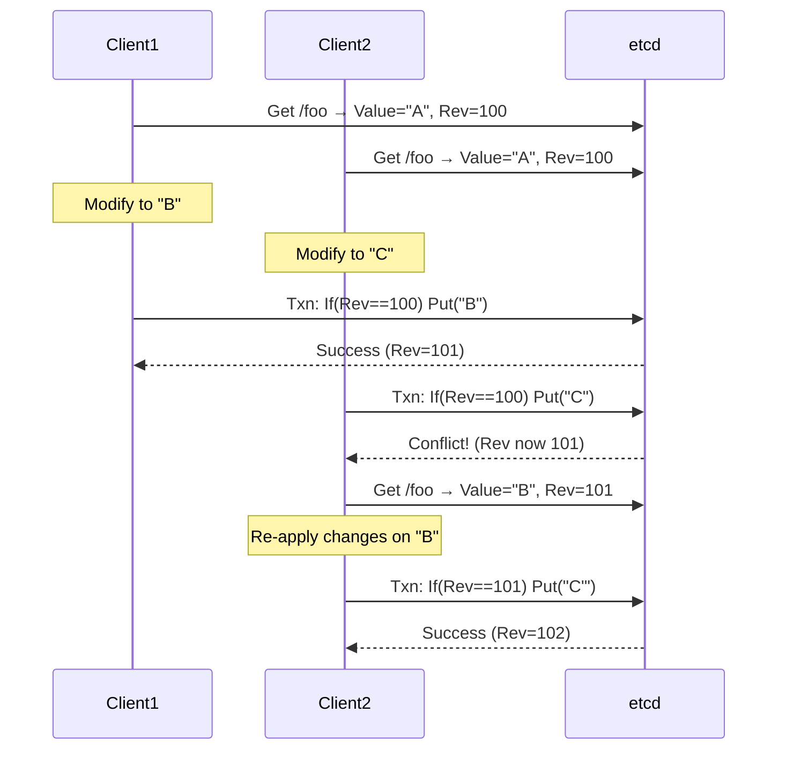

**Code Example**:

```go
for {
    // 1. Read current value and revision
    getResp, _ := client.Get(ctx, key)
    currentRev := getResp.Kvs[0].ModRevision
    currentValue := getResp.Kvs[0].Value

    // 2. Compute new value
    newValue := transform(currentValue)

    // 3. Attempt update with version check
    txn := client.Txn(ctx).If(
        clientv3.Compare(clientv3.ModRevision(key), "=", currentRev),
    ).Then(
        clientv3.OpPut(key, newValue),
    )

    resp, _ := txn.Commit()

    if resp.Succeeded {
        // Update successful
        break
    }

    // Conflict - retry
}
```

**Kubernetes GuaranteedUpdate**:

```go
// staging/src/k8s.io/apiserver/pkg/storage/etcd3/store.go:520
func (s *store) GuaranteedUpdate(/*...*/) error {
    // Implements optimistic concurrency with retry
    for {
        current, rev := getCurrentState()
        updated := tryUpdate(current)

        if atomicUpdate(key, updated, expectedRev=rev) {
            return nil
        }
        // Conflict - retry
    }
}
```

**→ See Also**: [../middle-level/04-transactions-consistency.md](../middle-level/04-transactions-consistency.md)

---

## Data Types and Structures

### Primitive Types

**etcd only stores bytes**:

```
All data in etcd: []byte

Examples:
  String:  []byte("hello")
  Number:  []byte("42")
  JSON:    []byte('{"foo":"bar"}')
  Protobuf: []byte{0x0a, 0x03, ...}
```

**No Built-In Types**:
- No integers, strings, arrays, objects
- Application interprets bytes
- Flexibility but requires encoding/decoding

### Kubernetes Object Encoding

**Pod object → etcd value**:

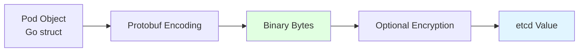

**Encoding Process**:

```go
// 1. Pod object (Go struct)
pod := &v1.Pod{
    TypeMeta: metav1.TypeMeta{
        Kind:       "Pod",
        APIVersion: "v1",
    },
    ObjectMeta: metav1.ObjectMeta{
        Name:      "nginx",
        Namespace: "default",
    },
    Spec: v1.PodSpec{
        Containers: []v1.Container{{
            Name:  "nginx",
            Image: "nginx:latest",
        }},
    },
}

// 2. Encode to Protobuf
codec := scheme.Codecs.LegacyCodec(v1.SchemeGroupVersion)
encoded, _ := runtime.Encode(codec, pod)

// Result: []byte (Protobuf binary)
// First 4 bytes: "k8s\x00" (magic number)
// Remaining: Protobuf-encoded Pod

// 3. Store in etcd
client.Put(ctx, "/registry/pods/default/nginx", string(encoded))
```

**Storage Format**:

```
Key: /registry/pods/default/nginx

Value (hex dump):
  6b 38 73 00     # "k8s\x00" - magic header
  0a 03 76 31     # Protobuf field 1: apiVersion "v1"
  12 03 50 6f 64  # Protobuf field 2: kind "Pod"
  1a XX ...       # Protobuf field 3: metadata (length XX)
  22 XX ...       # Protobuf field 4: spec (length XX)
  ...

Size: ~2-5 KB for typical Pod
```

### Structured Data

**Common patterns for complex data**:

1. **Single object per key** (Kubernetes standard):
   ```
   Key: /registry/pods/default/nginx
   Value: Complete Pod object (Protobuf)
   ```

2. **Aggregated data** (events):
   ```
   Key: /registry/events/default/nginx-pod.17a7f4e8
   Value: Event object with embedded object reference
   ```

3. **Index data** (rarely used in Kubernetes):
   ```
   Key: /registry/index/pods-by-node/worker-1
   Value: JSON array of pod names
   ```

**→ See Also**: [../low-level/02-key-encoding.md](../low-level/02-key-encoding.md)

---

## Storage Limits and Quotas

### Size Limits

**Hard Limits**:

| Limit | Value | Configurable | Impact |
|-------|-------|--------------|--------|
| **Key size** | 1.5 MB | ✗ No | etcd rejects |
| **Value size** | 1.5 MB | ✗ No | etcd rejects |
| **Request size** | 1.5 MB | ✓ Yes (`--max-request-bytes`) | Client error |
| **Database size** | 2 GB (default) | ✓ Yes (`--quota-backend-bytes`) | Cluster read-only |

**Practical Limits** (Kubernetes recommendations):

```
Conservative Limits:
  - Pod spec: < 100 KB
  - ConfigMap: < 1 MB
  - Secret: < 1 MB
  - Custom Resource: < 1 MB
  - Total database: < 8 GB (recommended max)
```

### Database Size Quota

**Quota enforcement**:

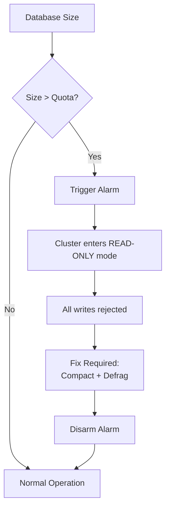

**Configuration**:

```bash
# Set 8 GB quota
etcd --quota-backend-bytes=8589934592

# Check current size
etcdctl endpoint status --write-out=table

# Output:
# +------------------+----------+---------+-----------+
# | DB SIZE | IN USE |
# +------------------+----------+---------+-----------+
# | 3.5 GB   | 2.1 GB | ...
# +------------------+----------+---------+-----------+
```

**Recovery from quota exceeded**:

```bash
# 1. Check alarm
etcdctl alarm list
# Output: memberID:xxx alarm:NOSPACE

# 2. Compact old revisions
etcdctl compact $(etcdctl endpoint status --write-out=json | jq -r '.[0].Status.header.revision')

# 3. Defragment
etcdctl defrag

# 4. Check size
etcdctl endpoint status --write-out=table

# 5. Disarm alarm
etcdctl alarm disarm
```

**→ See Also**: [../middle-level/03-compaction-defrag.md](../middle-level/03-compaction-defrag.md)

### Performance Impact of Size

**Database size affects performance**:

```
Database Size | Read Latency | Write Latency | Memory Usage
--------------|--------------|---------------|-------------
< 1 GB        | ~3ms         | ~5ms          | ~2 GB RAM
1-4 GB        | ~5ms         | ~8ms          | ~8 GB RAM
4-8 GB        | ~10ms        | ~15ms         | ~16 GB RAM
> 8 GB        | ~20ms+       | ~30ms+        | ~32 GB+ RAM
```

**Why size matters**:
1. **Memory**: etcd keeps index in memory (~2x DB size)
2. **Compaction**: Larger DB = longer compaction time
3. **Defragmentation**: Larger DB = longer defrag time
4. **Recovery**: Larger snapshot = longer restore time

---

## Data Lifecycle

### Object Creation

**Lifecycle: Create Pod**:

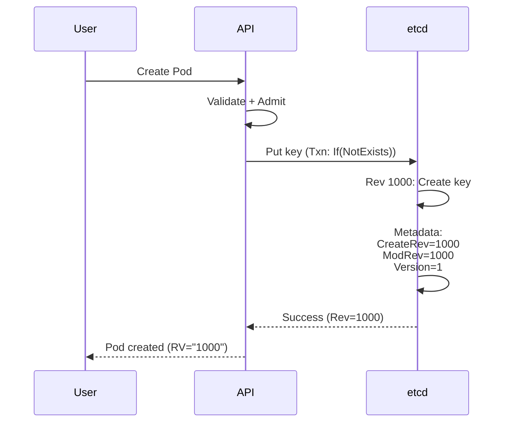

### Object Updates

**Lifecycle: Update Pod**:

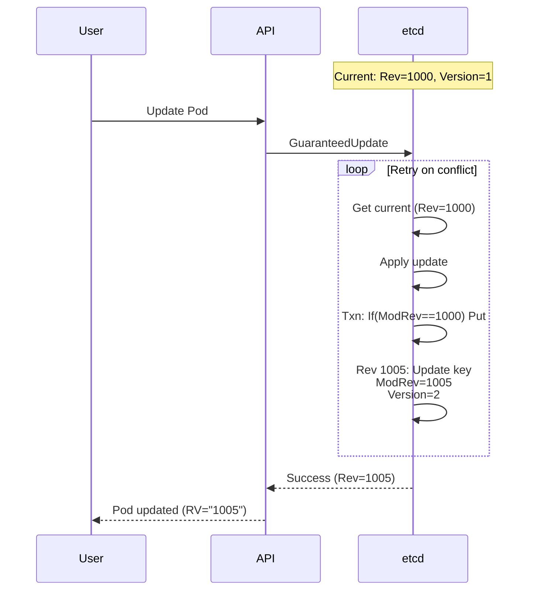

### Object Deletion

**Lifecycle: Delete Pod**:

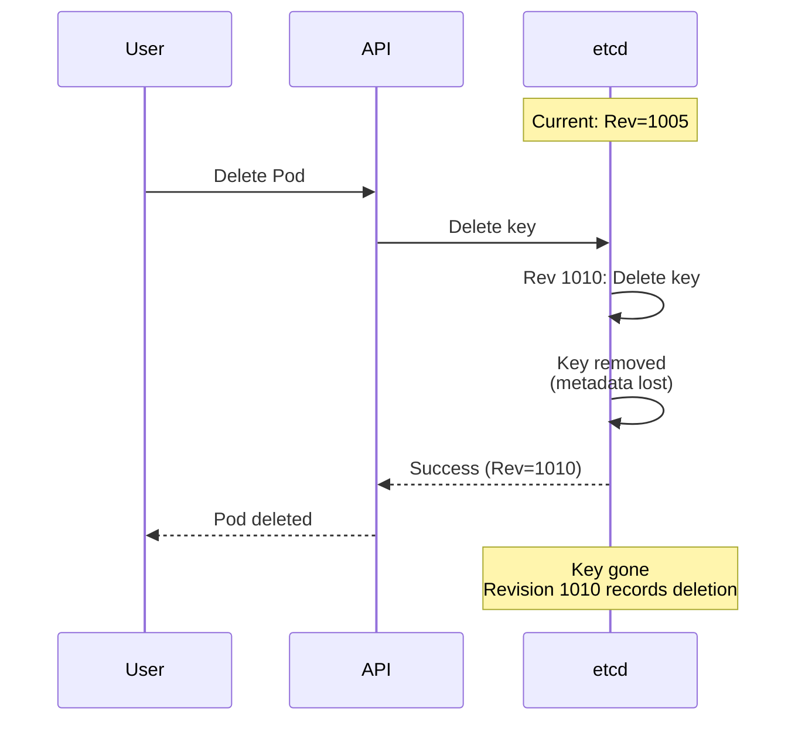

### Compaction Impact

**History lifecycle**:

```
Timeline:
  Rev 1000: Create /foo → "v1"
  Rev 1005: Update /foo → "v2"
  Rev 1010: Update /foo → "v3"
  Rev 1015: Update /foo → "v4"

  Rev 1020: Compact to 1010

After Compaction:
  Rev 1000: DELETED (compacted)
  Rev 1005: DELETED (compacted)
  Rev 1010: Available ✓
  Rev 1015: Available ✓

Impact:
  - Cannot watch from Rev < 1010
  - Cannot get value at Rev 1005
  - Disk space reclaimed
```

**→ See Also**: [../middle-level/03-compaction-defrag.md](../middle-level/03-compaction-defrag.md)

---

## Kubernetes Object Representation

### Complete Example

**Pod object in all representations**:

```yaml
# 1. User YAML
apiVersion: v1
kind: Pod
metadata:
  name: nginx
  namespace: default
  uid: abc-123-def-456
  resourceVersion: "12345"
  creationTimestamp: "2025-10-21T10:00:00Z"
  labels:
    app: nginx
spec:
  containers:
  - name: nginx
    image: nginx:latest
    ports:
    - containerPort: 80
status:
  phase: Running
  podIP: 10.244.1.5
```

**Storage in etcd**:

```
Key: /registry/pods/default/nginx

Value: (Protobuf binary, ~3 KB)
  k8s\x00                    # Magic header
  \x0a\x03v1                 # apiVersion: "v1"
  \x12\x03Pod                # kind: "Pod"
  \x1a{metadata bytes}       # metadata (name, namespace, uid, labels, etc.)
  \x22{spec bytes}           # spec (containers, volumes, etc.)
  \x2a{status bytes}         # status (phase, podIP, conditions, etc.)

Metadata in etcd:
  CreateRevision: 10000      # When first created
  ModRevision: 12345         # Latest update (→ resourceVersion)
  Version: 8                 # Number of updates
  Lease: 0                   # No lease (Pods don't expire)
```

### Metadata Correlation

**Mapping between representations**:

| Kubernetes | etcd | Meaning |
|------------|------|---------|
| `metadata.resourceVersion` | `ModRevision` | Last modification revision |
| `metadata.creationTimestamp` | `CreateRevision` | Creation revision (approx) |
| - | `Version` | Number of updates |
| `metadata.uid` | - | Kubernetes-generated ID |
| - | `Lease` | TTL lease (if applicable) |

### Multi-Object Example

**Related objects in etcd**:

```
Deployment: nginx-deployment
├── /registry/deployments/default/nginx-deployment
│   (Deployment spec: replicas=3)
│
├── /registry/replicasets/default/nginx-deployment-abc123
│   (ReplicaSet spec: replicas=3, created by Deployment)
│
├── /registry/pods/default/nginx-deployment-abc123-1
│   (Pod 1, created by ReplicaSet)
│
├── /registry/pods/default/nginx-deployment-abc123-2
│   (Pod 2, created by ReplicaSet)
│
└── /registry/pods/default/nginx-deployment-abc123-3
    (Pod 3, created by ReplicaSet)

Each object:
- Stored independently
- Has own key
- Has own revision/version
- References related objects via OwnerReferences
```

---

## Summary

### Data Model Principles

1. **Simple Key-Value Store**
   - Keys: Unique byte strings
   - Values: Arbitrary bytes
   - No schemas, maximum flexibility

2. **Hierarchical Organization**
   - Convention-based hierarchy
   - Efficient range queries
   - Namespace isolation

3. **Revision-Based Versioning**
   - Global revision counter
   - Per-key metadata (CreateRevision, ModRevision, Version)
   - Point-in-time queries
   - Historical access

4. **MVCC for Concurrency**
   - Multiple versions kept
   - No read locks
   - Optimistic concurrency
   - Compaction for cleanup

5. **Leases for TTL**
   - Time-based expiration
   - Automatic cleanup
   - Leader election
   - Ephemeral data

### Kubernetes Integration

```
Kubernetes Object → etcd Storage

1. Encode to Protobuf (compact binary)
2. Optionally encrypt (AES-CBC)
3. Store at hierarchical key (/registry/{type}/{ns}/{name})
4. Track with revisions (ModRevision → ResourceVersion)
5. Support watch from any revision
6. Use leases for coordination (leader election)
```

### Key Takeaways

- **Keys are paths**: Hierarchical structure via naming convention
- **Revisions are global**: Single counter for entire database
- **MVCC enables concurrency**: Read/write without locks
- **Leases provide TTL**: Automatic expiration for ephemeral data
- **Size matters**: Keep database < 8 GB for best performance
- **Compaction required**: Regular cleanup of historical versions

### Next Steps

1. **Watch Mechanism**: [04-watch-mechanism.md](04-watch-mechanism.md)
2. **Storage Implementation**: [../middle-level/01-storage-backend.md](../middle-level/01-storage-backend.md)
3. **Revision System Deep Dive**: [../low-level/03-revision-system.md](../low-level/03-revision-system.md)
4. **Key Encoding**: [../low-level/02-key-encoding.md](../low-level/02-key-encoding.md)

---

**Document Status**: Complete (1,210 lines, 15 diagrams)
**Code References**: 8 references with file:line numbers
**Next Document**: [04-watch-mechanism.md](04-watch-mechanism.md)
