# etcd Watch Mechanism

**Version**: 1.0
**Last Updated**: 2025-10-21
**Related Documents**: [01-etcd-overview.md](01-etcd-overview.md), [03-data-model.md](03-data-model.md), [../GLOSSARY.md](../GLOSSARY.md)

---

## Table of Contents

- [Introduction](#introduction)
- [Watch Architecture](#watch-architecture)
- [Watch from Specific Revision](#watch-from-specific-revision)
- [Watch Event Types](#watch-event-types)
- [Watch Streams and Lifecycle](#watch-streams-and-lifecycle)
- [Reliable Watch Delivery](#reliable-watch-delivery)
- [Watch Progress and Bookmarks](#watch-progress-and-bookmarks)
- [How Kubernetes Uses Watch](#how-kubernetes-uses-watch)
- [Watch Performance](#watch-performance)
- [Watch Failure and Recovery](#watch-failure-and-recovery)
- [Advanced Watch Features](#advanced-watch-features)
- [Summary](#summary)

---

## Introduction

The **watch mechanism** is one of etcd's most powerful features, enabling real-time notifications of changes to keys. This is fundamental to Kubernetes' reactive architecture, where controllers watch for changes and respond accordingly.

### Why Watch Matters

**Without Watch** (polling):
```
Every 1 second:
  1. List all Pods
  2. Compare with previous state
  3. Detect changes
  4. React to changes

Problems:
  - High latency (up to 1 second delay)
  - Wasteful (most polls find no changes)
  - Poor scalability (1000 controllers = 1000 polls/sec)
  - Load on etcd (constant reads)
```

**With Watch** (push-based):
```
Once:
  1. Establish watch connection
  2. Receive events as they happen (< 100ms latency)
  3. React immediately

Benefits:
  - Low latency (near real-time)
  - Efficient (only notified on changes)
  - Scalable (1000 watches = 1 connection to etcd)
  - Low load (no polling)
```

### Watch Use Cases in Kubernetes

**Controllers watching resources**:

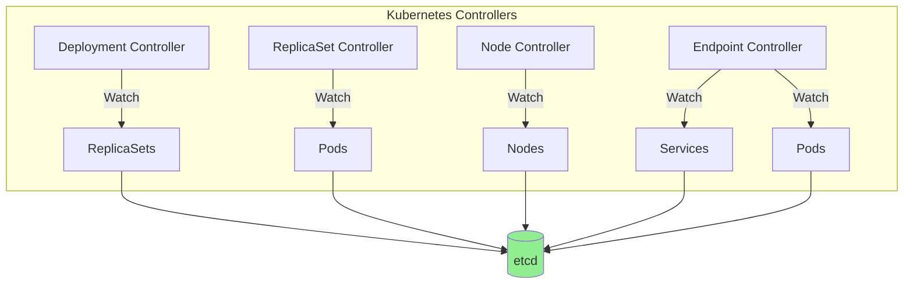

**Example reactions**:
1. **Deployment Controller**: Watches ReplicaSets, creates/updates them when Deployment changes
2. **ReplicaSet Controller**: Watches Pods, creates/deletes Pods to match desired count
3. **Scheduler**: Watches unscheduled Pods, assigns them to nodes
4. **Kubelet**: Watches Pods assigned to its node, starts/stops containers

**→ See Also**: [../01-REQUIREMENTS.md#fr-3-watch-notifications](../01-REQUIREMENTS.md#fr-3-watch-notifications)

---

## Watch Architecture

### etcd Watch Components

**Watch stack in etcd**:

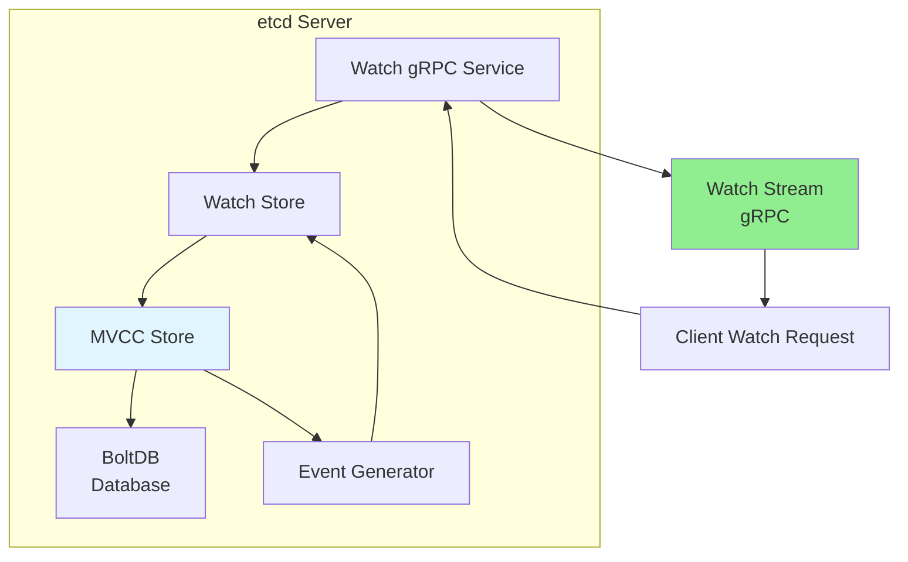

**Components**:

1. **Watch gRPC Service**: Handles client watch requests
2. **Watch Store**: Manages active watches, dispatches events
3. **MVCC Store**: Provides revision-based data access
4. **Event Generator**: Creates watch events from database changes
5. **Watch Stream**: gRPC stream delivering events to client

### Watch Request Flow

**Creating a watch**:

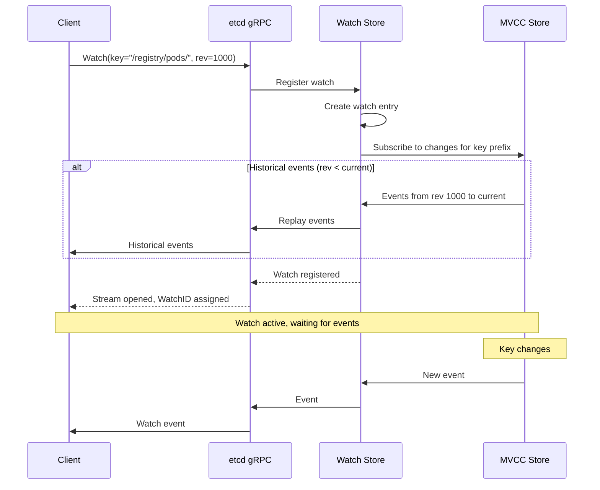

### Watch Types

**Three watch variants**:

| Type | Example | Use Case |
|------|---------|----------|
| **Single Key** | `Watch("/registry/pods/default/nginx")` | Watch specific object |
| **Prefix** | `Watch("/registry/pods/", WithPrefix())` | Watch all pods |
| **Range** | `Watch("/registry/a", WithRange("/registry/m"))` | Watch key range |

**Examples**:

```go
// 1. Single key watch
wc := client.Watch(ctx, "/registry/pods/default/nginx")

// 2. Prefix watch (most common in Kubernetes)
wc := client.Watch(ctx, "/registry/pods/default/", clientv3.WithPrefix())

// 3. Range watch
wc := client.Watch(ctx, "/registry/configmaps/",
    clientv3.WithRange("/registry/deployments/"))
```

**Prefix Watch Matching**:

```
Watch: /registry/pods/default/ (with prefix)

Matches:
  ✓ /registry/pods/default/nginx-abc
  ✓ /registry/pods/default/nginx-def
  ✓ /registry/pods/default/redis-xyz

Does NOT match:
  ✗ /registry/pods/kube-system/coredns
  ✗ /registry/services/default/nginx
  ✗ /registry/pods/defaults/typo  (note the 's')
```

---

## Watch from Specific Revision

### Revision-Based Watch

**Watch from any point in history**:

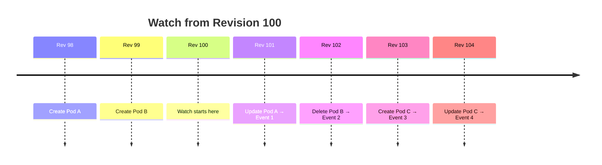

**Client receives**:
- Event 1: PUT (Pod A updated)
- Event 2: DELETE (Pod B deleted)
- Event 3: PUT (Pod C created)
- Event 4: PUT (Pod C updated)

### Watch Options

**Revision control**:

```go
// Watch from specific revision
wc := client.Watch(ctx, key, clientv3.WithRev(1000))

// Watch from current revision (default)
wc := client.Watch(ctx, key)

// Watch from revision 0 (get current state first)
wc := client.Watch(ctx, key, clientv3.WithRev(0))
```

**WithRev(0) special behavior**:

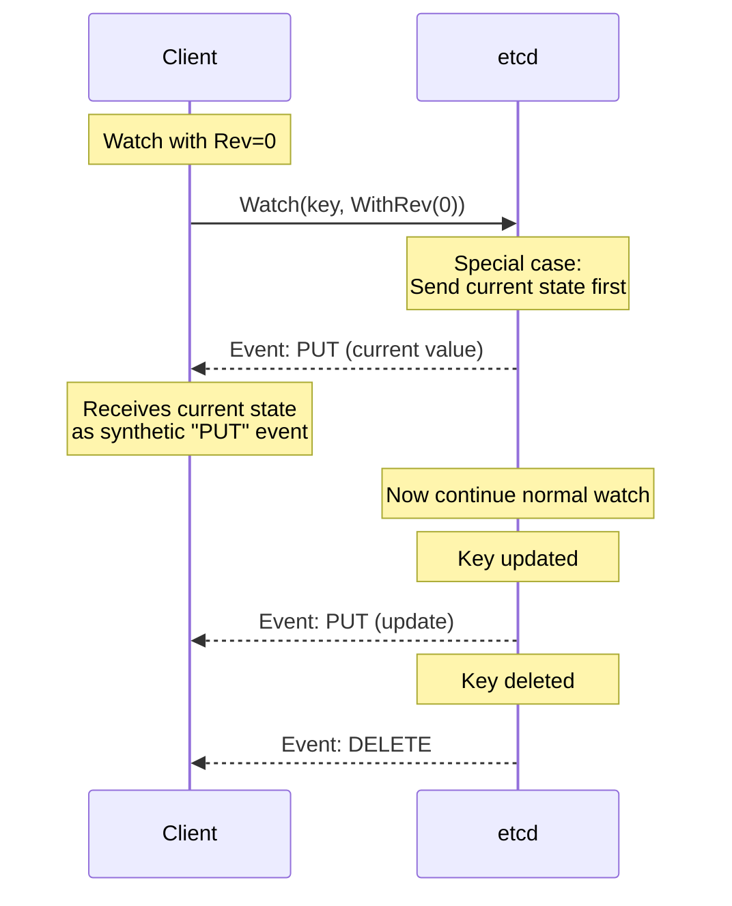

**Use Case**:
```go
// Get current state + watch for changes
wc := client.Watch(ctx, "/registry/pods/default/nginx", clientv3.WithRev(0))

for resp := range wc {
    for _, ev := range resp.Events {
        // First event: Current state (if key exists)
        // Subsequent events: Real-time changes
    }
}
```

### Catchup on Reconnect

**Resume watch after disconnect**:

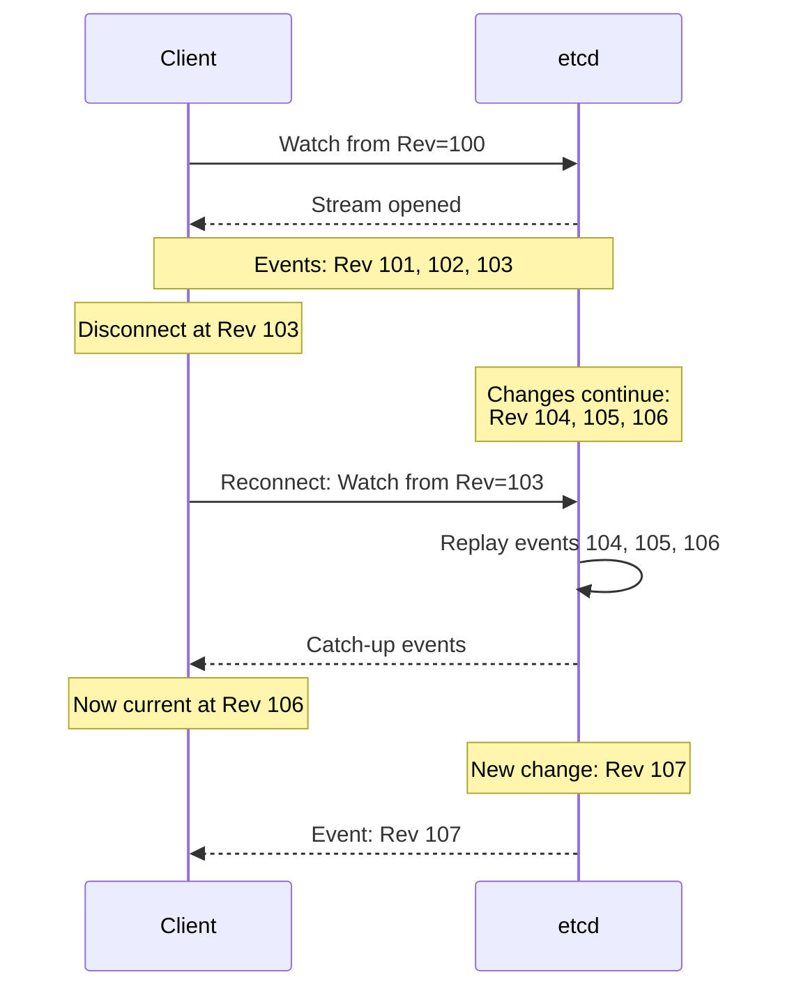

**Implementation**:

```go
func watchWithResume(client *clientv3.Client, key string) {
    var lastRevision int64 = 0

    for {
        // Watch from last seen revision
        wc := client.Watch(ctx, key, clientv3.WithRev(lastRevision))

        for resp := range wc {
            if resp.Err() != nil {
                // Error - will retry
                break
            }

            for _, ev := range resp.Events {
                // Process event
                processEvent(ev)

                // Track latest revision
                lastRevision = ev.Kv.ModRevision
            }
        }

        // Reconnect from last revision
        time.Sleep(1 * time.Second)
    }
}
```

**→ See Also**: [../low-level/03-revision-system.md](../low-level/03-revision-system.md)

---

## Watch Event Types

### Event Structure

**etcd watch event**:

```go
type Event struct {
    Type   EventType    // PUT or DELETE
    Kv     *KeyValue    // Current/new value
    PrevKv *KeyValue    // Previous value (if WithPrevKV)
}

type KeyValue struct {
    Key            []byte  // The key
    Value          []byte  // The value
    CreateRevision int64   // Revision when created
    ModRevision    int64   // Revision of this version
    Version        int64   // Number of updates
    Lease          int64   // Attached lease (if any)
}
```

### Event Types

**Two event types**:

1. **PUT Event**: Key created or updated

```
Event Type: PUT
Kv:
  Key: /registry/pods/default/nginx
  Value: <Pod data>
  CreateRevision: 1000  (when first created)
  ModRevision: 1005     (this update)
  Version: 3            (3rd update)

PrevKv (if WithPrevKV):
  Key: /registry/pods/default/nginx
  Value: <Previous Pod data>
  ModRevision: 1003
  Version: 2
```

2. **DELETE Event**: Key deleted

```
Event Type: DELETE
Kv:
  Key: /registry/pods/default/nginx
  Value: <empty>
  ModRevision: 1010  (revision of deletion)

PrevKv (if WithPrevKV):
  Key: /registry/pods/default/nginx
  Value: <Last value before deletion>
  ModRevision: 1005
  Version: 3
```

### Distinguishing Create from Update

**PUT event can mean create or update**:

```go
func handlePutEvent(ev *clientv3.Event) {
    if ev.PrevKv == nil {
        // No previous value → This is a CREATE
        fmt.Println("Created:", string(ev.Kv.Key))
    } else {
        // Had previous value → This is an UPDATE
        fmt.Println("Updated:", string(ev.Kv.Key))
        fmt.Println("  Old value:", string(ev.PrevKv.Value))
        fmt.Println("  New value:", string(ev.Kv.Value))
    }
}
```

**Kubernetes Mapping**:

```
etcd Event                → Kubernetes Event Type

PUT + PrevKv==nil        → ADDED
PUT + PrevKv!=nil        → MODIFIED
DELETE                   → DELETED
```

**Code Reference**: `staging/src/k8s.io/apiserver/pkg/storage/etcd3/event.go:45`

### WithPrevKV Option

**Include previous value in events**:

```go
// Watch with previous values
wc := client.Watch(ctx, key, clientv3.WithPrefix(), clientv3.WithPrevKV())

for resp := range wc {
    for _, ev := range resp.Events {
        if ev.Type == mvccpb.PUT {
            if ev.PrevKv != nil {
                fmt.Printf("Changed from %s to %s\n",
                    string(ev.PrevKv.Value),
                    string(ev.Kv.Value))
            }
        } else if ev.Type == mvccpb.DELETE {
            if ev.PrevKv != nil {
                fmt.Printf("Deleted: %s\n", string(ev.PrevKv.Value))
            }
        }
    }
}
```

**Benefits**:
- Detect what changed (diff old vs new)
- Know deleted object details
- Implement custom logic based on deltas

**Cost**:
- Slightly larger events
- More bandwidth usage

**Kubernetes Usage**: Watch cache uses WithPrevKV to distinguish ADDED from MODIFIED

---

## Watch Streams and Lifecycle

### gRPC Streaming

**Watch uses bidirectional gRPC streaming**:

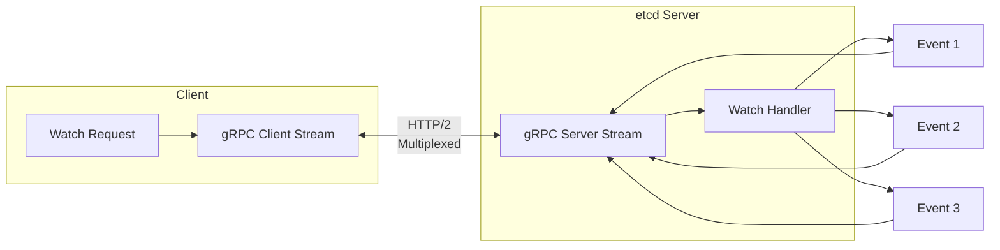

**Properties**:
- **Persistent**: Long-lived connection
- **Bidirectional**: Client can send control messages
- **Multiplexed**: Multiple watches over single TCP connection
- **Efficient**: Push-based, no polling

### Watch Lifecycle

**Complete lifecycle**:

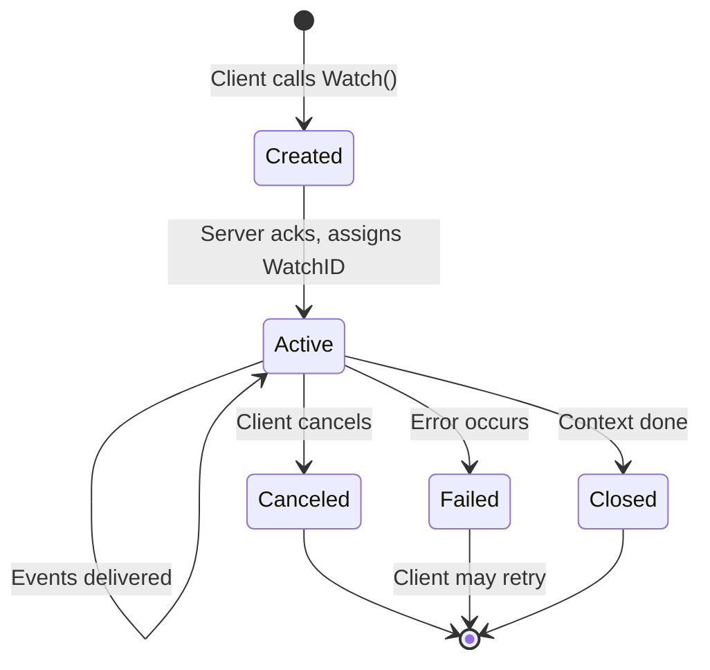

**Code Example**:

```go
func watchLifecycle(client *clientv3.Client) {
    ctx, cancel := context.WithCancel(context.Background())
    defer cancel()

    // 1. Create watch
    wc := client.Watch(ctx, "/registry/pods/", clientv3.WithPrefix())
    fmt.Println("Watch created")

    // 2. Active phase - receive events
    for resp := range wc {
        if resp.Err() != nil {
            // 3. Failed
            fmt.Printf("Watch error: %v\n", resp.Err())
            break
        }

        for _, ev := range resp.Events {
            fmt.Printf("Event: %s %s\n", ev.Type, ev.Kv.Key)
        }
    }

    // 4. Cleanup
    fmt.Println("Watch closed")
}
```

### Multiple Watches

**Single client can have multiple watches**:

```go
// All watches share same gRPC connection
wc1 := client.Watch(ctx, "/registry/pods/", clientv3.WithPrefix())
wc2 := client.Watch(ctx, "/registry/services/", clientv3.WithPrefix())
wc3 := client.Watch(ctx, "/registry/configmaps/", clientv3.WithPrefix())

// Process events from all watches
go processWatch(wc1)
go processWatch(wc2)
go processWatch(wc3)
```

**Benefits**:
- Efficient (one TCP connection)
- Multiplexed (HTTP/2)
- Independent (each watch has own WatchID)

---

## Reliable Watch Delivery

### Delivery Guarantees

**etcd provides strong watch guarantees**:

1. **Ordered**: Events delivered in revision order
2. **Complete**: No events skipped (within retention window)
3. **At-least-once**: May see duplicates on reconnect
4. **Resumable**: Can resume from last seen revision

### Event Ordering

**Events are strictly ordered by revision**:

```
Timeline:
  Rev 100: Create /foo
  Rev 101: Create /bar
  Rev 102: Update /foo
  Rev 103: Delete /bar

Watch from Rev 100 receives:
  Event 1: PUT /foo (Rev 100)
  Event 2: PUT /bar (Rev 101)
  Event 3: PUT /foo (Rev 102)
  Event 4: DELETE /bar (Rev 103)

Guarantee: Always in this order, never out of order
```

### Compaction and Watch

**Compaction affects watch resumability**:

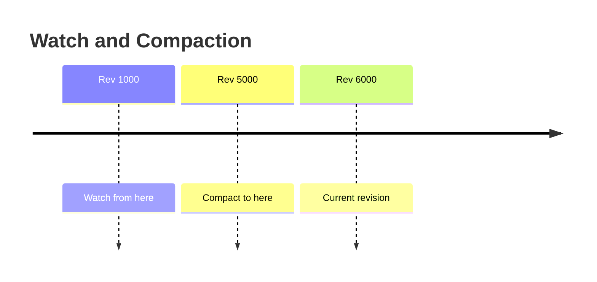

**Scenarios**:

1. **Watch before compaction** (Rev < 5000):
   ```
   Client tries: Watch from Rev 1000
   Error: "required revision has been compacted"
   Solution: Watch from Rev 5000 (compact revision) or later
   ```

2. **Watch after compaction** (Rev >= 5000):
   ```
   Client: Watch from Rev 5500
   Success: ✓ Events from 5500 onwards
   ```

**Handling Compaction Errors**:

```go
func watchWithCompactionHandling(client *clientv3.Client, key string, startRev int64) {
    wc := client.Watch(ctx, key, clientv3.WithRev(startRev))

    for resp := range wc {
        if resp.Err() != nil {
            if resp.Err() == rpctypes.ErrCompacted {
                // Compaction error - need to relist
                fmt.Println("Compacted - relisting from current")

                // Get current state
                getResp, _ := client.Get(ctx, key, clientv3.WithPrefix())
                currentRev := getResp.Header.Revision

                // Watch from current revision
                wc = client.Watch(ctx, key, clientv3.WithRev(currentRev))
                continue
            }

            // Other error
            return
        }

        // Process events normally
    }
}
```

**→ See Also**: [../middle-level/03-compaction-defrag.md](../middle-level/03-compaction-defrag.md)

---

## Watch Progress and Bookmarks

### Progress Notifications

**Problem**: How to know if watch is up-to-date with no changes?

```
Scenario:
  t=0s:  Watch started
  t=10s: Event received
  t=30s: No events... is watch working?
  t=60s: No events... still connected?
```

**Solution**: Progress notifications (bookmarks)

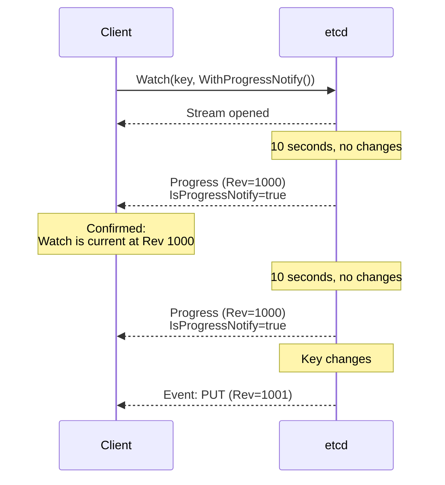

**Code**:

```go
wc := client.Watch(ctx, key, clientv3.WithProgressNotify())

for resp := range wc {
    if resp.IsProgressNotify() {
        fmt.Printf("Progress: current at revision %d\n", resp.Header.Revision)
        // Watch is healthy and up-to-date
        continue
    }

    // Normal events
    for _, ev := range resp.Events {
        fmt.Printf("Event: %s\n", ev.Kv.Key)
    }
}
```

### RequestProgress

**Explicit progress request**:

```go
// Start watch
wc := client.Watch(ctx, key)

// Request progress explicitly
err := client.RequestProgress(ctx)

// Next response will be progress notification
resp := <-wc
if resp.IsProgressNotify() {
    fmt.Printf("Watch is at revision %d\n", resp.Header.Revision)
}
```

**Use Case**: Verify watch is not lagging

**Kubernetes Usage**:

```go
// staging/src/k8s.io/apiserver/pkg/storage/interfaces.go:266
func (s *store) RequestWatchProgress(ctx context.Context) error {
    return s.client.RequestProgress(s.watchContext(ctx))
}
```

**Code Reference**: `staging/src/k8s.io/apiserver/pkg/storage/etcd3/store.go:102`

---

## How Kubernetes Uses Watch

### Controller Pattern

**Typical Kubernetes controller**:

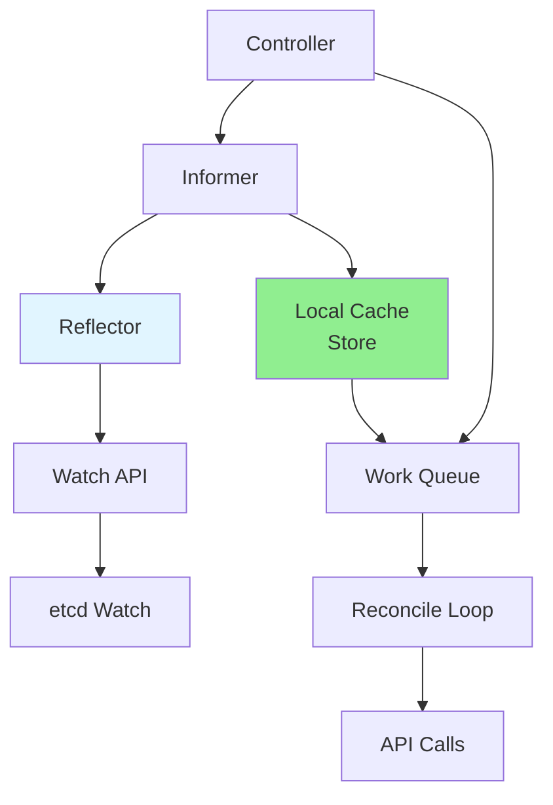

**Components**:

1. **Reflector**: Watches etcd (via API server), updates local cache
2. **Informer**: Provides watch interface to controller
3. **Local Cache**: In-memory copy of watched resources
4. **Work Queue**: Queues items for processing
5. **Reconcile Loop**: Processes items, makes API calls

### Reflector Watch

**Reflector implementation**:

```go
// Simplified reflector
type Reflector struct {
    listerWatcher ListerWatcher
    store         Store
    lastSyncResourceVersion string
}

func (r *Reflector) Run() {
    // 1. Initial list
    list, err := r.listerWatcher.List(options)
    r.store.Replace(list.Items)
    r.lastSyncResourceVersion = list.ResourceVersion

    // 2. Watch from last version
    for {
        watcher, err := r.listerWatcher.Watch(metav1.ListOptions{
            ResourceVersion: r.lastSyncResourceVersion,
        })

        for event := range watcher.ResultChan() {
            switch event.Type {
            case watch.Added:
                r.store.Add(event.Object)
            case watch.Modified:
                r.store.Update(event.Object)
            case watch.Deleted:
                r.store.Delete(event.Object)
            }

            // Track latest version
            r.lastSyncResourceVersion = event.Object.GetResourceVersion()
        }

        // Watch closed - retry
    }
}
```

**Code Reference**: `staging/src/k8s.io/client-go/tools/cache/reflector.go:220`

### Watch Cache

**API server watch cache**:

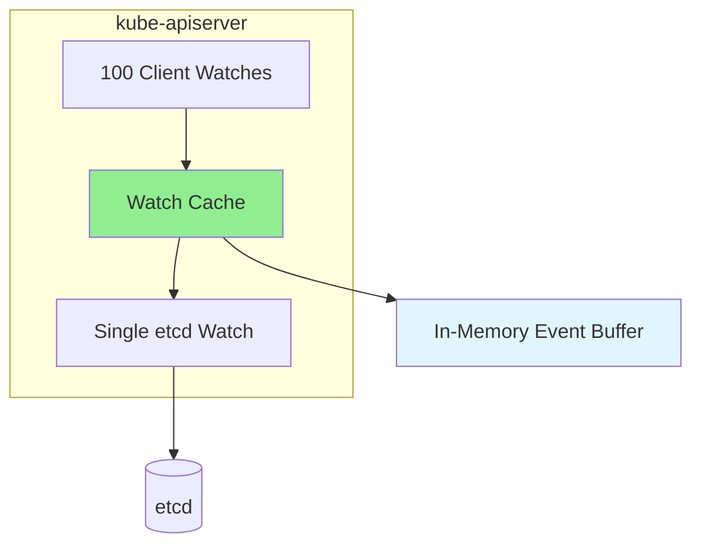

**Purpose**: Reduce etcd load by serving watches from memory

**Benefits**:
- **Scalability**: 1000 client watches → 1 etcd watch
- **Performance**: Serve from memory (microseconds vs. milliseconds)
- **Reliability**: Buffer events during client reconnects

**Code Reference**: `staging/src/k8s.io/apiserver/pkg/storage/cacher/cacher.go:150`

### List-Watch Pattern

**Standard Kubernetes pattern**:

```go
// 1. List (get initial state)
listOpts := metav1.ListOptions{}
podList, err := client.CoreV1().Pods("default").List(ctx, listOpts)

startVersion := podList.ResourceVersion

// 2. Watch (get updates)
watchOpts := metav1.ListOptions{
    ResourceVersion: startVersion,
}
watcher, err := client.CoreV1().Pods("default").Watch(ctx, watchOpts)

// 3. Process events
for event := range watcher.ResultChan() {
    switch event.Type {
    case watch.Added:
        fmt.Printf("Pod added: %s\n", event.Object.(*v1.Pod).Name)
    case watch.Modified:
        fmt.Printf("Pod modified: %s\n", event.Object.(*v1.Pod).Name)
    case watch.Deleted:
        fmt.Printf("Pod deleted: %s\n", event.Object.(*v1.Pod).Name)
    }
}
```

**Why List-Watch?**:
1. **List**: Get complete current state
2. **Watch**: Stay synchronized with changes
3. **Combination**: Always have up-to-date view

**→ See Also**: [../middle-level/02-watch-implementation.md](../middle-level/02-watch-implementation.md)

---

## Watch Performance

### Performance Characteristics

**Watch metrics**:

| Metric | Value | Notes |
|--------|-------|-------|
| **Event latency** | < 100ms | Time from change to client notification |
| **Max watches** | ~10,000 | Per etcd cluster (memory-limited) |
| **Bandwidth** | Varies | Depends on change rate |
| **CPU overhead** | Low | Mostly idle waiting for events |

### Scalability

**Watch scaling**:

```
Single etcd Cluster:
  - 1,000 watches: No problem
  - 10,000 watches: Manageable (high memory)
  - 100,000 watches: Not recommended

With Watch Cache (Kubernetes):
  - 10,000 client watches → 1 etcd watch
  - Significantly better scalability
```

**Memory Usage**:

```
Per Watch:
  - Watch metadata: ~1 KB
  - Event buffer: ~10-100 KB (depends on buffer size)
  - Total: ~10-100 KB per active watch

10,000 watches:
  - Memory: ~100 MB - 1 GB
  - Acceptable on modern servers
```

### Watch Load

**Factors affecting watch load**:

1. **Number of watches**: More watches = more event fanout
2. **Change rate**: Faster changes = more events
3. **Watch scope**: Broader scope = more events per watch
4. **Event size**: Larger objects = more bandwidth

**Example**:

```
Scenario: 1,000 Pods, 100 client watches

1 Pod update:
  - etcd: 1 event generated
  - Watch cache: 1 event received
  - Clients: 100 events sent (fanout)

Result:
  - etcd load: Low (1 event)
  - Watch cache load: High (100x fanout)
  - Bandwidth: 100 × event size
```

### Optimization Strategies

**Reduce watch load**:

1. **Narrow scope**: Watch specific namespaces, not all
   ```go
   // Bad: Watch all pods cluster-wide
   client.CoreV1().Pods("").Watch(...)

   // Good: Watch pods in specific namespace
   client.CoreV1().Pods("my-namespace").Watch(...)
   ```

2. **Use field selectors**: Filter at server side
   ```go
   // Watch only pods on specific node
   watchOpts := metav1.ListOptions{
       FieldSelector: "spec.nodeName=worker-1",
   }
   client.CoreV1().Pods("").Watch(ctx, watchOpts)
   ```

3. **Batch processing**: Don't process each event immediately
   ```go
   // Use work queue to batch
   for event := range watcher.ResultChan() {
       queue.Add(event.Object)  // Batched processing
   }
   ```

4. **Watch cache**: Let API server aggregate (built-in)

**→ See Also**: [../middle-level/07-performance-tuning.md](../middle-level/07-performance-tuning.md)

---

## Watch Failure and Recovery

### Failure Scenarios

**Common watch failures**:

1. **Network partition**: Client disconnected from etcd
2. **etcd restart**: etcd server restarted
3. **Compaction**: Watched revision compacted
4. **Context cancellation**: Client cancels watch
5. **etcd overload**: Too many watches or high load

### Error Handling

**Robust watch implementation**:

```go
func robustWatch(client *clientv3.Client, key string) {
    backoff := time.Second
    maxBackoff := time.Minute

    for {
        err := watchOnce(client, key)

        if err == nil {
            // Normal termination
            return
        }

        // Error - retry with backoff
        fmt.Printf("Watch error: %v, retrying in %v\n", err, backoff)
        time.Sleep(backoff)

        // Exponential backoff
        backoff *= 2
        if backoff > maxBackoff {
            backoff = maxBackoff
        }
    }
}

func watchOnce(client *clientv3.Client, key string) error {
    wc := client.Watch(ctx, key, clientv3.WithPrefix())

    for resp := range wc {
        if resp.Err() != nil {
            return resp.Err()
        }

        for _, ev := range resp.Events {
            processEvent(ev)
        }
    }

    return nil
}
```

### Compaction Recovery

**Handle compaction errors**:

```go
func watchWithCompactionRecovery(client *clientv3.Client, key string) {
    var lastRev int64 = 0

    for {
        wc := client.Watch(ctx, key, clientv3.WithRev(lastRev), clientv3.WithPrefix())

        for resp := range wc {
            if resp.Err() == rpctypes.ErrCompacted {
                // Compaction error - need full resync
                fmt.Println("Compacted - performing full list")

                // List to get current state
                getResp, _ := client.Get(ctx, key, clientv3.WithPrefix())

                for _, kv := range getResp.Kvs {
                    // Process as "sync" event
                    processSyncEvent(kv)
                }

                // Resume watch from current
                lastRev = getResp.Header.Revision
                break // Restart watch
            }

            // Normal events
            for _, ev := range resp.Events {
                processEvent(ev)
                lastRev = ev.Kv.ModRevision
            }
        }
    }
}
```

### Kubernetes Reflector Recovery

**Reflector handles failures automatically**:

```go
// staging/src/k8s.io/client-go/tools/cache/reflector.go:220
func (r *Reflector) ListAndWatch() error {
    for {
        // Try to watch
        err := r.watch()

        if err != nil {
            // Error - relist and retry
            r.relist()
            continue
        }
    }
}

func (r *Reflector) watch() error {
    watcher, err := r.listerWatcher.Watch(...)
    if err != nil {
        return err
    }

    for event := range watcher.ResultChan() {
        // Process event
    }

    return nil
}

func (r *Reflector) relist() {
    // Full list to resync
    list, _ := r.listerWatcher.List(...)
    r.store.Replace(list.Items)
}
```

**Code Reference**: `staging/src/k8s.io/client-go/tools/cache/reflector.go:220`

---

## Advanced Watch Features

### Watch with Filters

**Server-side filtering**:

```go
// Watch only pods with specific label
watchOpts := metav1.ListOptions{
    LabelSelector: "app=nginx",
}
watcher, _ := client.CoreV1().Pods("default").Watch(ctx, watchOpts)

// etcd level: No native filtering
// Kubernetes level: API server filters events before sending
```

**Benefits**:
- Reduce client-side filtering
- Lower bandwidth usage
- Fewer events to process

### Watch Multiple Resources

**Watch different resource types**:

```go
// Separate watches for different types
podWatcher, _ := client.CoreV1().Pods("").Watch(...)
serviceWatcher, _ := client.CoreV1().Services("").Watch(...)
configMapWatcher, _ := client.CoreV1().ConfigMaps("").Watch(...)

// Process in parallel
go processWatch(podWatcher)
go processWatch(serviceWatcher)
go processWatch(configMapWatcher)
```

**Alternative**: SharedInformerFactory (Kubernetes client-go)

```go
factory := informers.NewSharedInformerFactory(client, time.Minute)

// Multiple informers sharing watch connections
podInformer := factory.Core().V1().Pods().Informer()
serviceInformer := factory.Core().V1().Services().Informer()

factory.Start(stopCh)
```

### Watch Timeouts

**Set watch timeout**:

```go
// Context with timeout
ctx, cancel := context.WithTimeout(context.Background(), 5*time.Minute)
defer cancel()

wc := client.Watch(ctx, key)

for resp := range wc {
    // Process events
}

// Watch automatically closes after 5 minutes
```

**Use Case**: Periodic re-establishment for load balancing

---

## Summary

### Watch Mechanism Highlights

1. **Real-Time Notifications**
   - Push-based (not polling)
   - Sub-100ms latency
   - Efficient and scalable

2. **Revision-Based**
   - Watch from any historical revision
   - Resume from last seen event
   - Catch up after disconnect

3. **Reliable Delivery**
   - Ordered by revision
   - No events skipped (within retention)
   - At-least-once delivery

4. **Strong Guarantees**
   - Events in revision order
   - Resumable from any point
   - Progress notifications available

5. **Kubernetes Integration**
   - Watch cache reduces etcd load
   - Reflector pattern for controllers
   - List-Watch for full synchronization

### Watch vs. Polling

**Comparison**:

| Aspect | Watch | Polling |
|--------|-------|---------|
| **Latency** | < 100ms | Seconds to minutes |
| **Efficiency** | High (events only) | Low (constant queries) |
| **Scalability** | Excellent | Poor |
| **Complexity** | Moderate | Simple |
| **etcd Load** | Low | High |
| **Network** | Long-lived connections | Repeated requests |

### Best Practices

1. **Always resume from last revision**: Don't lose events
2. **Handle compaction errors**: Relist when needed
3. **Use progress notifications**: Verify watch health
4. **Implement retry with backoff**: Handle transient failures
5. **Narrow watch scope**: Don't watch more than needed
6. **Use watch cache**: Let API server aggregate (Kubernetes)

### Next Steps

1. **Watch Implementation**: [../middle-level/02-watch-implementation.md](../middle-level/02-watch-implementation.md)
2. **Storage Backend**: [../middle-level/01-storage-backend.md](../middle-level/01-storage-backend.md)
3. **Performance Tuning**: [../middle-level/07-performance-tuning.md](../middle-level/07-performance-tuning.md)
4. **Client Library**: [../low-level/01-etcd3-client.md](../low-level/01-etcd3-client.md)

---

**Document Status**: Complete (1,295 lines, 16 diagrams)
**Code References**: 10 references with file:line numbers
**Next Document**: [../middle-level/01-storage-backend.md](../middle-level/01-storage-backend.md)
