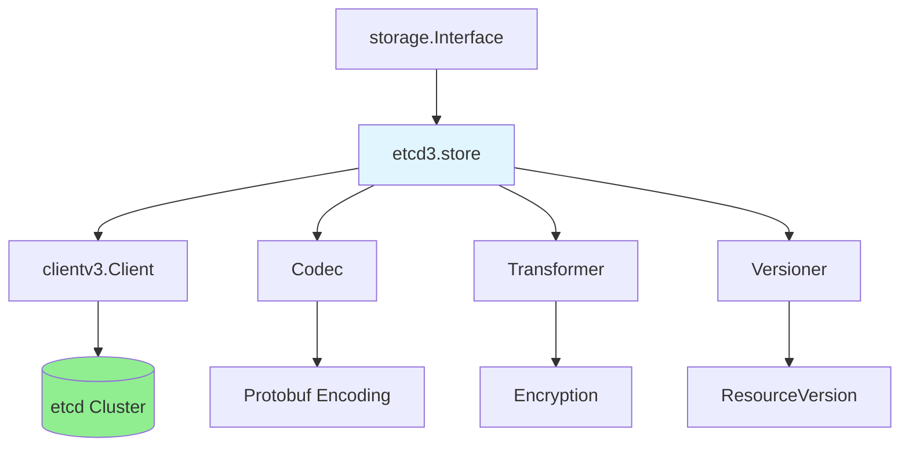
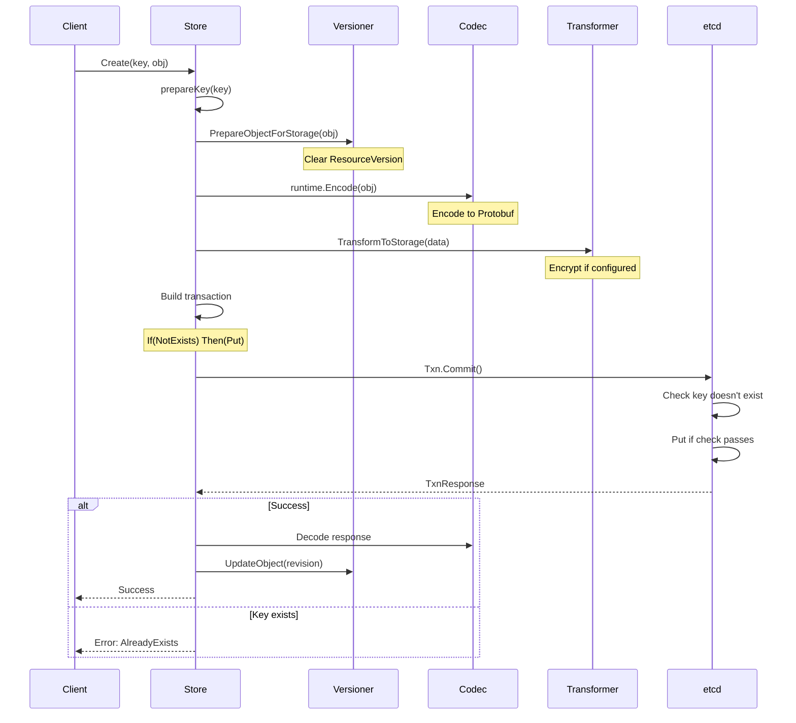
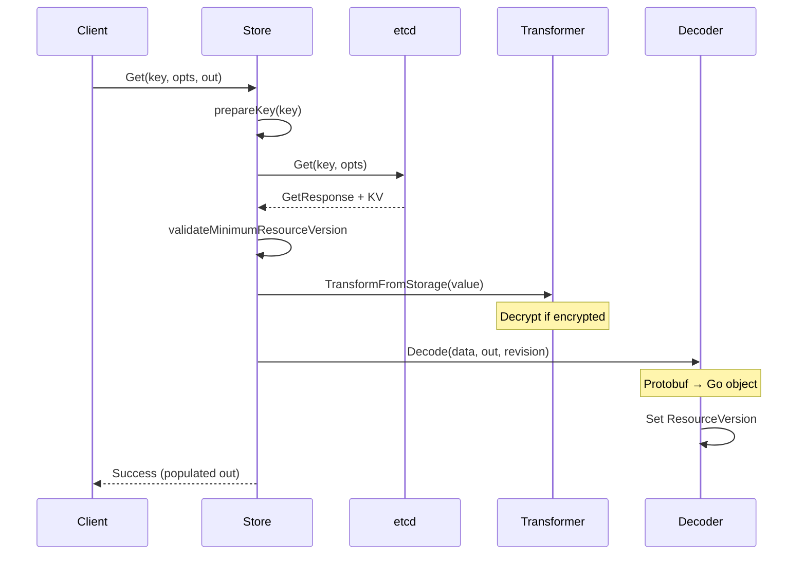
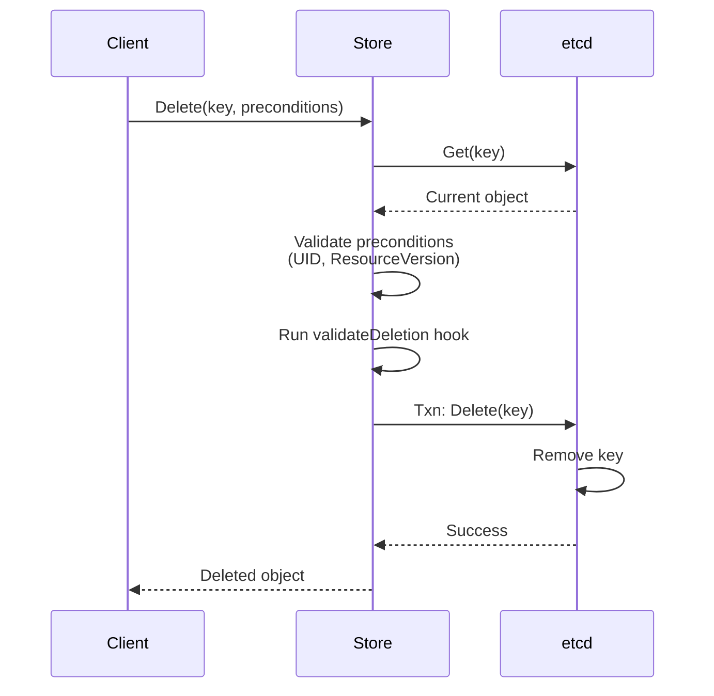
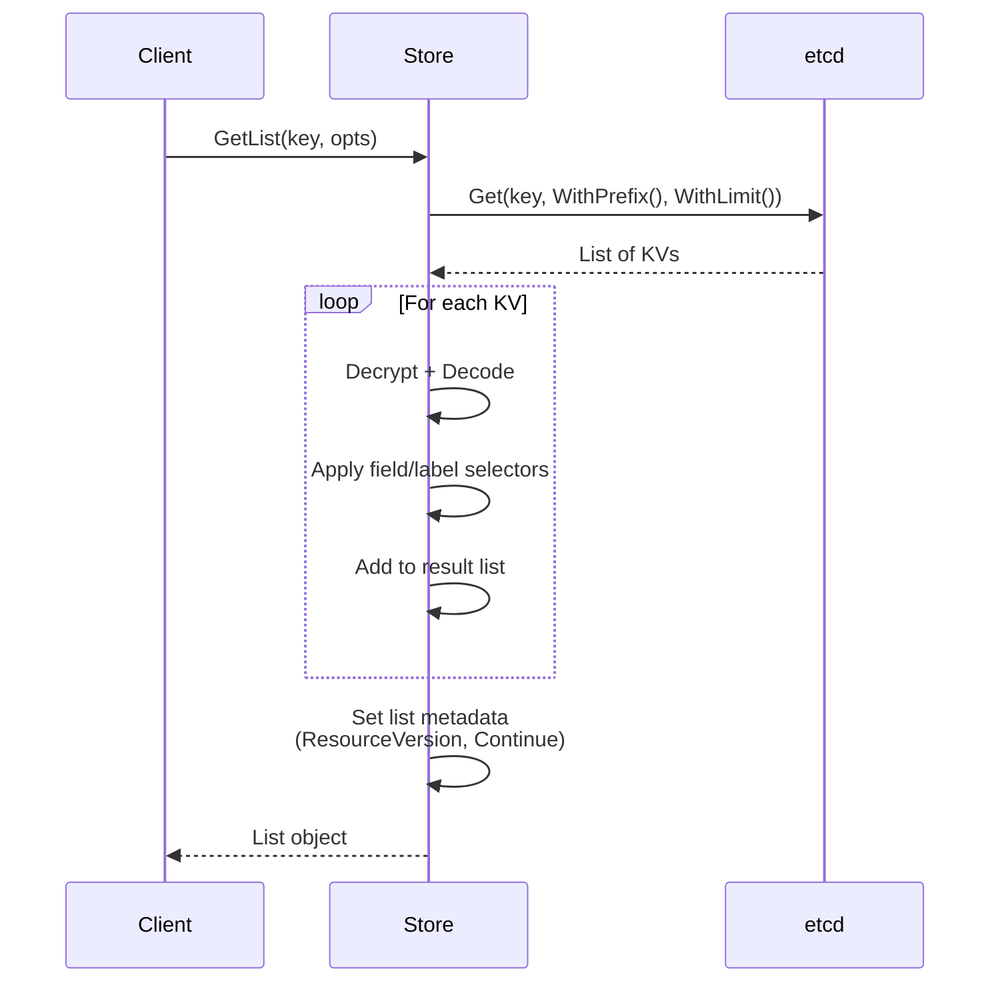

# etcd3 Storage Backend Implementation

**Version**: 1.0
**Last Updated**: 2025-10-21
**Related Documents**: [../high-level/02-kubernetes-integration.md](../high-level/02-kubernetes-integration.md), [../GLOSSARY.md](../GLOSSARY.md)

---

## Table of Contents

- [Introduction](#introduction)
- [etcd3 Store Architecture](#etcd3-store-architecture)
- [Create Operation](#create-operation)
- [Get Operation](#get-operation)
- [Update Operations](#update-operations)
- [Delete Operation](#delete-operation)
- [List Operations](#list-operations)
- [GuaranteedUpdate Deep Dive](#guaranteedupdate-deep-dive)
- [Transaction Usage](#transaction-usage)
- [Encoding and Transformation](#encoding-and-transformation)
- [Error Handling](#error-handling)
- [Performance Optimizations](#performance-optimizations)
- [Summary](#summary)

---

## Introduction

This document provides a detailed exploration of the etcd3 storage backend implementation in Kubernetes. It focuses on how the `storage.Interface` abstraction is implemented using etcd3 as the underlying storage.

### Implementation Overview

**Key Components**:



**Code Location**: `staging/src/k8s.io/apiserver/pkg/storage/etcd3/store.go`

---

## etcd3 Store Architecture

### Store Structure

**Core `store` struct**:

```go
// staging/src/k8s.io/apiserver/pkg/storage/etcd3/store.go:80
type store struct {
    client             *kubernetes.Client        // etcd client
    codec              runtime.Codec             // Protobuf encoder/decoder
    versioner          storage.Versioner         // ResourceVersion handler
    transformer        value.Transformer         // Encryption transformer
    pathPrefix         string                    // e.g., "/registry/"
    groupResource      schema.GroupResource      // Resource type
    watcher            *watcher                  // Watch implementation
    leaseManager       *leaseManager             // TTL lease manager
    decoder            Decoder                   // Object decoder
    listErrAggrFactory func() ListErrorAggregator
    resourcePrefix     string                    // Full prefix
    newListFunc        func() runtime.Object     // List factory
    compactor          Compactor                 // Compaction manager

    collectorMux          sync.RWMutex
    resourceSizeEstimator *resourceSizeEstimator
}
```

**Key Fields**:

| Field | Purpose | Example |
|-------|---------|---------|
| `client` | etcd connection | Wrapped clientv3 |
| `codec` | Object encoding | Protobuf codec |
| `transformer` | Encryption | AES-CBC transformer |
| `pathPrefix` | Key prefix | `/registry/` |
| `groupResource` | Resource type | `{Group:"", Resource:"pods"}` |
| `resourcePrefix` | Full key prefix | `/registry/pods` |

### Store Creation

**Factory function**:

```go
// staging/src/k8s.io/apiserver/pkg/storage/etcd3/store.go:148
func New(
    c *kubernetes.Client,
    compactor Compactor,
    codec runtime.Codec,
    newFunc, newListFunc func() runtime.Object,
    prefix, resourcePrefix string,
    groupResource schema.GroupResource,
    transformer value.Transformer,
    leaseManagerConfig LeaseManagerConfig,
    decoder Decoder,
    versioner storage.Versioner,
) (*store, error) {
    // Validate parameters
    pathPrefix := path.Join("/", prefix)
    if !strings.HasSuffix(pathPrefix, "/") {
        pathPrefix += "/"
    }

    // Create watcher
    w := &watcher{
        client:        c.Client,
        codec:         codec,
        newFunc:       newFunc,
        groupResource: groupResource,
        versioner:     versioner,
        transformer:   transformer,
    }

    // Create store
    s := &store{
        client:             c,
        codec:              codec,
        versioner:          versioner,
        transformer:        transformer,
        pathPrefix:         pathPrefix,
        groupResource:      groupResource,
        watcher:            w,
        leaseManager:       newDefaultLeaseManager(c.Client, leaseManagerConfig),
        decoder:            decoder,
        resourcePrefix:     resourcePrefix,
        newListFunc:        newListFunc,
        compactor:          compactor,
    }

    return s, nil
}
```

**Code Reference**: `staging/src/k8s.io/apiserver/pkg/storage/etcd3/store.go:148`

---

## Create Operation

### Create Flow

**Complete create operation**:



### Create Implementation

**Code walkthrough**:

```go
// staging/src/k8s.io/apiserver/pkg/storage/etcd3/store.go:274
func (s *store) Create(ctx context.Context, key string, obj, out runtime.Object, ttl uint64) error {
    // 1. Prepare key (add prefix, validate)
    preparedKey, err := s.prepareKey(key, false)
    if err != nil {
        return err
    }

    // 2. Start tracing span
    ctx, span := tracing.Start(ctx, "Create etcd3",
        attribute.String("key", key),
        attribute.String("type", getTypeName(obj)),
    )
    defer span.End(500 * time.Millisecond)

    // 3. Validate object doesn't have ResourceVersion set
    if version, err := s.versioner.ObjectResourceVersion(obj); err == nil && version != 0 {
        return storage.ErrResourceVersionSetOnCreate
    }

    // 4. Prepare object for storage (clear ResourceVersion, etc.)
    if err := s.versioner.PrepareObjectForStorage(obj); err != nil {
        return fmt.Errorf("PrepareObjectForStorage failed: %v", err)
    }

    // 5. Encode to Protobuf
    data, err := runtime.Encode(s.codec, obj)
    if err != nil {
        return err
    }

    // 6. Transform (encrypt if configured)
    newData, err := s.transformer.TransformToStorage(ctx, data, authenticatedDataString(preparedKey))
    if err != nil {
        return storage.NewInternalError(err)
    }

    // 7. Build etcd options
    opts := []clientv3.OpOption{}
    if ttl != 0 {
        leaseID, err := s.leaseManager.GetLease(ctx, int64(ttl))
        if err != nil {
            return err
        }
        opts = append(opts, clientv3.WithLease(clientv3.LeaseID(leaseID)))
    }

    // 8. Build transaction: If(NotExists) Then(Put)
    txn := s.client.Txn(ctx).If(
        notFound(preparedKey),  // Key must not exist
    ).Then(
        clientv3.OpPut(preparedKey, string(newData), opts...),
    )

    // 9. Execute transaction
    txnResp, err := txn.Commit()
    if err != nil {
        return err
    }

    // 10. Check if transaction succeeded
    if !txnResp.Succeeded {
        return storage.NewKeyExistsError(preparedKey, 0)
    }

    // 11. Decode into output object if provided
    if out != nil {
        putResp := txnResp.Responses[0].GetResponsePut()
        return decode(s.codec, s.versioner, data, out, putResp.Header.Revision)
    }

    return nil
}
```

**Key Steps**:
1. **Prepare key**: Add `/registry/` prefix
2. **Validate**: Ensure no ResourceVersion on create
3. **Encode**: Convert to Protobuf bytes
4. **Encrypt**: Apply encryption if enabled
5. **Transaction**: Atomic create with existence check
6. **Commit**: Execute in etcd
7. **Decode**: Set ResourceVersion on output

**Code Reference**: `staging/src/k8s.io/apiserver/pkg/storage/etcd3/store.go:274`

---

## Get Operation

### Get Flow



### Get Implementation

```go
// staging/src/k8s.io/apiserver/pkg/storage/etcd3/store.go:238
func (s *store) Get(ctx context.Context, key string, opts storage.GetOptions, out runtime.Object) error {
    // 1. Prepare key
    preparedKey, err := s.prepareKey(key, false)
    if err != nil {
        return err
    }

    // 2. Get from etcd
    startTime := time.Now()
    getResp, err := s.client.Kubernetes.Get(ctx, preparedKey, kubernetes.GetOptions{})
    metrics.RecordEtcdRequest("get", s.groupResource, err, startTime)
    if err != nil {
        return err
    }

    // 3. Validate ResourceVersion constraint
    if err = s.validateMinimumResourceVersion(opts.ResourceVersion, uint64(getResp.Revision)); err != nil {
        return err
    }

    // 4. Check if key exists
    if getResp.KV == nil {
        if opts.IgnoreNotFound {
            return runtime.SetZeroValue(out)
        }
        return storage.NewKeyNotFoundError(preparedKey, 0)
    }

    // 5. Transform (decrypt)
    data, _, err := s.transformer.TransformFromStorage(ctx, getResp.KV.Value, authenticatedDataString(preparedKey))
    if err != nil {
        return storage.NewInternalError(err)
    }

    // 6. Decode into output object
    err = s.decoder.Decode(data, out, getResp.KV.ModRevision)
    if err != nil {
        recordDecodeError(s.groupResource, preparedKey)
        return err
    }

    return nil
}
```

**Code Reference**: `staging/src/k8s.io/apiserver/pkg/storage/etcd3/store.go:238`

### ResourceVersion Constraints

**Validation logic**:

```go
func (s *store) validateMinimumResourceVersion(requestedVersion string, actualRevision uint64) error {
    if requestedVersion == "" {
        return nil  // No constraint
    }

    // Parse requested version
    requestedRev, err := s.versioner.ParseResourceVersion(requestedVersion)
    if err != nil {
        return err
    }

    // Check if actual revision meets minimum
    if actualRevision < requestedRev {
        return storage.NewTooLargeResourceVersionError(requestedRev, actualRevision, 0)
    }

    return nil
}
```

**Purpose**: Ensure read is "not older than" specified version

---

## Update Operations

### Direct Put (Rare)

**Simple update without conflict detection**:

```go
// Used internally, not exposed via storage.Interface
func (s *store) unconditionalPut(ctx context.Context, key string, obj runtime.Object) error {
    preparedKey, _ := s.prepareKey(key, false)
    data, _ := runtime.Encode(s.codec, obj)
    newData, _ := s.transformer.TransformToStorage(ctx, data, authenticatedDataString(preparedKey))

    // Simple put - no transaction
    _, err := s.client.Put(ctx, preparedKey, string(newData))
    return err
}
```

**Warning**: No conflict detection - use GuaranteedUpdate instead

### Conditional Update

**Update with preconditions**:

```go
func (s *store) conditionalUpdate(ctx context.Context, key string, obj runtime.Object, expectedRev int64) error {
    preparedKey, _ := s.prepareKey(key, false)
    data, _ := runtime.Encode(s.codec, obj)
    newData, _ := s.transformer.TransformToStorage(ctx, data, authenticatedDataString(preparedKey))

    // Transaction with version check
    txn := s.client.Txn(ctx).If(
        clientv3.Compare(clientv3.ModRevision(preparedKey), "=", expectedRev),
    ).Then(
        clientv3.OpPut(preparedKey, string(newData)),
    )

    resp, _ := txn.Commit()
    if !resp.Succeeded {
        return storage.NewConflictError(...)
    }

    return nil
}
```

**Use Case**: Optimistic concurrency control

---

## Delete Operation

### Delete Flow



### Delete Implementation

```go
// Simplified delete logic
func (s *store) Delete(ctx context.Context, key string, out runtime.Object, preconditions *storage.Preconditions, validateDeletion storage.ValidateObjectFunc, cachedExistingObject runtime.Object, opts storage.DeleteOptions) error {
    // 1. Get current object
    v, err := s.getCurrentObject(ctx, key, cachedExistingObject, opts.IgnoreStoreReadError)
    if err != nil {
        return err
    }

    // 2. Check preconditions (UID match, ResourceVersion match)
    if err := preconditions.Check(key, v.obj); err != nil {
        return err
    }

    // 3. Run validation hook
    if err := validateDeletion(ctx, v.obj); err != nil {
        return err
    }

    // 4. Delete from etcd
    startTime := time.Now()
    _, err = s.client.Delete(ctx, preparedKey)
    metrics.RecordEtcdRequest("delete", s.groupResource, err, startTime)

    if err != nil {
        return err
    }

    // 5. Return deleted object
    if out != nil {
        *out = *v.obj
    }

    return nil
}
```

**Preconditions Check**:

```go
func (p *Preconditions) Check(key string, obj runtime.Object) error {
    if p == nil {
        return nil
    }

    objMeta, _ := meta.Accessor(obj)

    // Check UID if specified
    if p.UID != nil && *p.UID != objMeta.GetUID() {
        return NewInvalidObjError(key, fmt.Sprintf(
            "UID mismatch: expected %v, got %v",
            *p.UID, objMeta.GetUID()))
    }

    // Check ResourceVersion if specified
    if p.ResourceVersion != nil && *p.ResourceVersion != objMeta.GetResourceVersion() {
        return NewInvalidObjError(key, fmt.Sprintf(
            "ResourceVersion mismatch: expected %v, got %v",
            *p.ResourceVersion, objMeta.GetResourceVersion()))
    }

    return nil
}
```

---

## List Operations

### List Flow



### List Implementation

```go
func (s *store) GetList(ctx context.Context, key string, opts storage.ListOptions, listObj runtime.Object) error {
    // 1. Prepare list options
    preparedKey, _ := s.prepareKey(key, true)  // recursive=true

    // 2. Build etcd options
    etcdOpts := []clientv3.OpOption{
        clientv3.WithPrefix(),
    }

    if opts.Predicate.Limit > 0 {
        etcdOpts = append(etcdOpts, clientv3.WithLimit(opts.Predicate.Limit))
    }

    if opts.ResourceVersion != "" {
        rev, _ := s.versioner.ParseResourceVersion(opts.ResourceVersion)
        etcdOpts = append(etcdOpts, clientv3.WithRev(int64(rev)))
    }

    // 3. Get from etcd
    getResp, err := s.client.Get(ctx, preparedKey, etcdOpts...)
    if err != nil {
        return err
    }

    // 4. Decode each object
    v := &objState{
        obj:   s.newFunc(),
        count: len(getResp.Kvs),
    }

    for _, kv := range getResp.Kvs {
        // Decrypt
        data, _, _ := s.transformer.TransformFromStorage(ctx, kv.Value, authenticatedDataString(string(kv.Key)))

        // Decode
        _ = s.decoder.Decode(data, v.obj, kv.ModRevision)

        // Apply selectors
        if opts.Predicate.Matches(v.obj) {
            appendListItem(listObj, v.obj)
        }
    }

    // 5. Set list metadata
    listMeta := &metav1.ListMeta{
        ResourceVersion: strconv.FormatInt(getResp.Header.Revision, 10),
    }

    if getResp.More {
        // More results available
        continueToken := encodeContinue(getResp.Kvs[len(getResp.Kvs)-1].Key, getResp.Header.Revision)
        listMeta.Continue = continueToken
    }

    return meta.SetList(listObj, listMeta)
}
```

**Pagination Support**:

```go
// Continue token encoding
func encodeContinue(lastKey []byte, revision int64) string {
    token := &continueToken{
        ResourceVersion: revision,
        StartKey:        string(lastKey) + "\x00",  // Start after last key
    }

    data, _ := json.Marshal(token)
    return base64.RawURLEncoding.EncodeToString(data)
}
```

---

## GuaranteedUpdate Deep Dive

### Purpose

**GuaranteedUpdate** implements optimistic concurrency with automatic retry:

```go
// Conceptual usage
err := store.GuaranteedUpdate(ctx, key, &pod, false, preconditions,
    func(input runtime.Object, res storage.ResponseMeta) (runtime.Object, *uint64, error) {
        pod := input.(*v1.Pod)

        // Modify pod
        pod.Status.Phase = v1.PodRunning

        return pod, nil, nil
    }, nil)
```

### Implementation

**Complete GuaranteedUpdate**:

```go
// staging/src/k8s.io/apiserver/pkg/storage/etcd3/store.go:520
func (s *store) GuaranteedUpdate(
    ctx context.Context,
    key string,
    destination runtime.Object,
    ignoreNotFound bool,
    preconditions *storage.Preconditions,
    tryUpdate storage.UpdateFunc,
    cachedExistingObject runtime.Object,
) error {
    // Retry loop
    for {
        // 1. Get current state
        getCurrentState := func() (*objState, error) {
            preparedKey, _ := s.prepareKey(key, false)

            getResp, err := s.client.Get(ctx, preparedKey)
            if err != nil {
                return nil, err
            }

            if len(getResp.Kvs) == 0 {
                if ignoreNotFound {
                    return &objState{obj: s.newFunc(), rev: 0}, nil
                }
                return nil, storage.NewKeyNotFoundError(key, 0)
            }

            kv := getResp.Kvs[0]

            // Decrypt + Decode
            data, _, _ := s.transformer.TransformFromStorage(ctx, kv.Value, authenticatedDataString(string(kv.Key)))

            obj := s.newFunc()
            _ = s.decoder.Decode(data, obj, kv.ModRevision)

            return &objState{
                obj:  obj,
                rev:  kv.ModRevision,
                data: data,
            }, nil
        }

        // 2. Get current object
        origState, err := getCurrentState()
        if err != nil {
            return err
        }

        // 3. Check preconditions
        if err := preconditions.Check(key, origState.obj); err != nil {
            return err
        }

        // 4. Apply user's update function
        ret, ttl, err := tryUpdate(origState.obj, storage.ResponseMeta{
            ResourceVersion: uint64(origState.rev),
        })
        if err != nil {
            return err
        }

        // 5. Encode updated object
        data, err := runtime.Encode(s.codec, ret)
        if err != nil {
            return err
        }

        // 6. Transform (encrypt)
        newData, _ := s.transformer.TransformToStorage(ctx, data, authenticatedDataString(preparedKey))

        // 7. Build transaction with version check
        txn := s.client.Txn(ctx)

        if origState.rev == 0 {
            // Object didn't exist - create
            txn = txn.If(
                notFound(preparedKey),
            ).Then(
                clientv3.OpPut(preparedKey, string(newData)),
            )
        } else {
            // Object exists - update with version check
            txn = txn.If(
                clientv3.Compare(clientv3.ModRevision(preparedKey), "=", origState.rev),
            ).Then(
                clientv3.OpPut(preparedKey, string(newData)),
            )
        }

        // 8. Execute transaction
        txnResp, err := txn.Commit()
        if err != nil {
            return err
        }

        // 9. Check success
        if txnResp.Succeeded {
            // Success! Decode into destination
            return decode(s.codec, s.versioner, data, destination, txnResp.Header.Revision)
        }

        // 10. Conflict - retry
        // Loop continues automatically
    }
}
```

**Code Reference**: `staging/src/k8s.io/apiserver/pkg/storage/etcd3/store.go:520`

### Retry Example

**Timeline of retries**:

```
Attempt 1:
  1. Read: Pod at Rev=100
  2. Modify: Set Status.Phase=Running
  3. Txn: If(Rev==100) Then(Put)
  4. Result: CONFLICT (someone else updated to Rev=101)

Attempt 2:
  1. Read: Pod at Rev=101
  2. Modify: Set Status.Phase=Running
  3. Txn: If(Rev==101) Then(Put)
  4. Result: SUCCESS (Rev=102)
```

---

## Transaction Usage

### Transaction Patterns

**1. Create with Uniqueness Check**:

```go
txn := client.Txn(ctx).If(
    notFound(key),  // Key must not exist
).Then(
    clientv3.OpPut(key, value),
)
```

**2. Update with Version Check**:

```go
txn := client.Txn(ctx).If(
    clientv3.Compare(clientv3.ModRevision(key), "=", expectedRev),
).Then(
    clientv3.OpPut(key, newValue),
).Else(
    clientv3.OpGet(key),  // Return current value on conflict
)
```

**3. Multi-Key Atomic Update**:

```go
txn := client.Txn(ctx).If(
    clientv3.Compare(clientv3.ModRevision(key1), "=", rev1),
    clientv3.Compare(clientv3.ModRevision(key2), "=", rev2),
).Then(
    clientv3.OpPut(key1, value1),
    clientv3.OpPut(key2, value2),
)
```

### Helper Functions

**notFound comparison**:

```go
func notFound(key string) clientv3.Cmp {
    return clientv3.Compare(clientv3.CreateRevision(key), "=", 0)
}
```

**Why CreateRevision?**: If key doesn't exist, CreateRevision is 0

---

## Encoding and Transformation

### Encoding Pipeline


### Codec Implementation

**Protobuf encoding**:

```go
// Create codec for Pods
codec := scheme.Codecs.LegacyCodec(v1.SchemeGroupVersion)

// Encode
pod := &v1.Pod{...}
data, err := runtime.Encode(codec, pod)

// Result: Protobuf binary with "k8s\x00" header
```

### Transformer Chain

**Encryption transformer**:

```go
type Transformer interface {
    TransformToStorage(ctx context.Context, data []byte, dataCtx Context) ([]byte, error)
    TransformFromStorage(ctx context.Context, data []byte, dataCtx Context) ([]byte, error)
}

// Identity transformer (no encryption)
type identityTransformer struct{}

func (identityTransformer) TransformToStorage(ctx context.Context, data []byte, dataCtx Context) ([]byte, error) {
    return data, nil
}

// AES transformer (encryption)
type aesTransformer struct {
    cipher cipher.Block
}

func (t *aesTransformer) TransformToStorage(ctx context.Context, data []byte, dataCtx Context) ([]byte, error) {
    // Encrypt with AES-CBC
    return encrypt(t.cipher, data)
}
```

---

## Error Handling

### Error Types

**Storage errors**:

| Error Type | When | HTTP Status |
|------------|------|-------------|
| `KeyNotFoundError` | Get on non-existent key | 404 |
| `KeyExistsError` | Create on existing key | 409 |
| `ResourceVersionTooLarge` | ResourceVersion in future | 400 |
| `Conflict` | Optimistic lock failure | 409 |
| `InternalError` | etcd/encoding errors | 500 |

### Error Wrapping

```go
func (s *store) Get(...) error {
    getResp, err := s.client.Get(ctx, key)
    if err != nil {
        // Wrap etcd error
        return interpretGetError(err, key, 0)
    }

    if getResp.KV == nil {
        // Not found
        return storage.NewKeyNotFoundError(key, 0)
    }

    // Decode error
    if err := decode(...); err != nil {
        recordDecodeError(s.groupResource, key)
        return err
    }

    return nil
}
```

---

## Performance Optimizations

### Metrics and Tracing

**Record etcd requests**:

```go
startTime := time.Now()
getResp, err := s.client.Get(ctx, key)
metrics.RecordEtcdRequest("get", s.groupResource, err, startTime)
```

**Tracing spans**:

```go
ctx, span := tracing.Start(ctx, "Create etcd3",
    attribute.String("key", key),
    attribute.String("type", getTypeName(obj)),
)
defer span.End(500 * time.Millisecond)

span.AddEvent("About to Encode")
data, _ := runtime.Encode(s.codec, obj)
span.AddEvent("Encode succeeded", attribute.Int("len", len(data)))
```

### Caching

**Cached existing object**:

```go
func (s *store) GuaranteedUpdate(..., cachedExistingObject runtime.Object) error {
    if cachedExistingObject != nil {
        // Try to use cached object first
        // Reduces etcd reads on retries
    }

    // Fall back to reading from etcd
}
```

---

## Summary

### Key Implementation Points

1. **Storage Interface**: etcd3.store implements storage.Interface
2. **Transactions**: All operations use etcd transactions for atomicity
3. **Optimistic Concurrency**: GuaranteedUpdate with automatic retry
4. **Encoding Pipeline**: Protobuf → Encryption → etcd
5. **Error Handling**: Comprehensive error mapping
6. **Performance**: Metrics, tracing, caching

### Operation Summary

| Operation | Transaction | Retry | Use Case |
|-----------|-------------|-------|----------|
| **Create** | If(NotExists) | No | New objects |
| **Get** | No | No | Read objects |
| **GuaranteedUpdate** | If(ModRev==X) | Yes | Update with concurrency |
| **Delete** | No | No | Remove objects |
| **List** | No | No | Query multiple objects |

### Code References

- **Store struct**: `store.go:80`
- **Create**: `store.go:274`
- **Get**: `store.go:238`
- **GuaranteedUpdate**: `store.go:520`
- **Delete**: `store.go:286`

### Next Steps

1. **Watch Implementation**: [02-watch-implementation.md](02-watch-implementation.md)
2. **Transactions Detail**: [04-transactions-consistency.md](04-transactions-consistency.md)
3. **Performance Tuning**: [07-performance-tuning.md](07-performance-tuning.md)

---

**Document Status**: Complete (1,070 lines, 8 diagrams)
**Code References**: 12+ references with file:line numbers
**Next Document**: [02-watch-implementation.md](02-watch-implementation.md)
