# etcd Compaction and Defragmentation in Kubernetes

**Version**: 1.0
**Last Updated**: 2025-11-05
**Related Documents**: [../high-level/03-data-model.md](../high-level/03-data-model.md), [02-watch-implementation.md](02-watch-implementation.md), [01-storage-backend.md](01-storage-backend.md)

━━━━━━━━━━━━━━━━━━━━━━━━━━━━━━━━━━━━━━━━━━━━━━━━━━━━━━━━━━━━━━━━━━━━━━━━━━━━━━

## **📋 Table of Contents**

- [Introduction](#introduction)
- [Compaction Overview](#compaction-overview)
- [Auto-Compaction in Kubernetes](#auto-compaction-in-kubernetes)
- [Manual Compaction](#manual-compaction)
- [Defragmentation](#defragmentation)
- [Impact on Watch Clients](#impact-on-watch-clients)
- [Operational Concerns](#operational-concerns)
- [Real-World Examples](#real-world-examples)
- [Best Practices](#best-practices)
- [Troubleshooting](#troubleshooting)
- [Summary](#summary)

━━━━━━━━━━━━━━━━━━━━━━━━━━━━━━━━━━━━━━━━━━━━━━━━━━━━━━━━━━━━━━━━━━━━━━━━━━━━━━

## **🎯 Introduction**

Compaction and defragmentation are critical maintenance operations for etcd in Kubernetes clusters. Without proper compaction, etcd's database grows unbounded, consuming disk space and degrading performance. This document provides a comprehensive guide to understanding and managing these operations.

### **Why Compaction Matters**

etcd uses Multi-Version Concurrency Control (MVCC) which keeps the full history of all key changes. While this enables features like watch resume from any ResourceVersion, it causes the database to grow continuously:

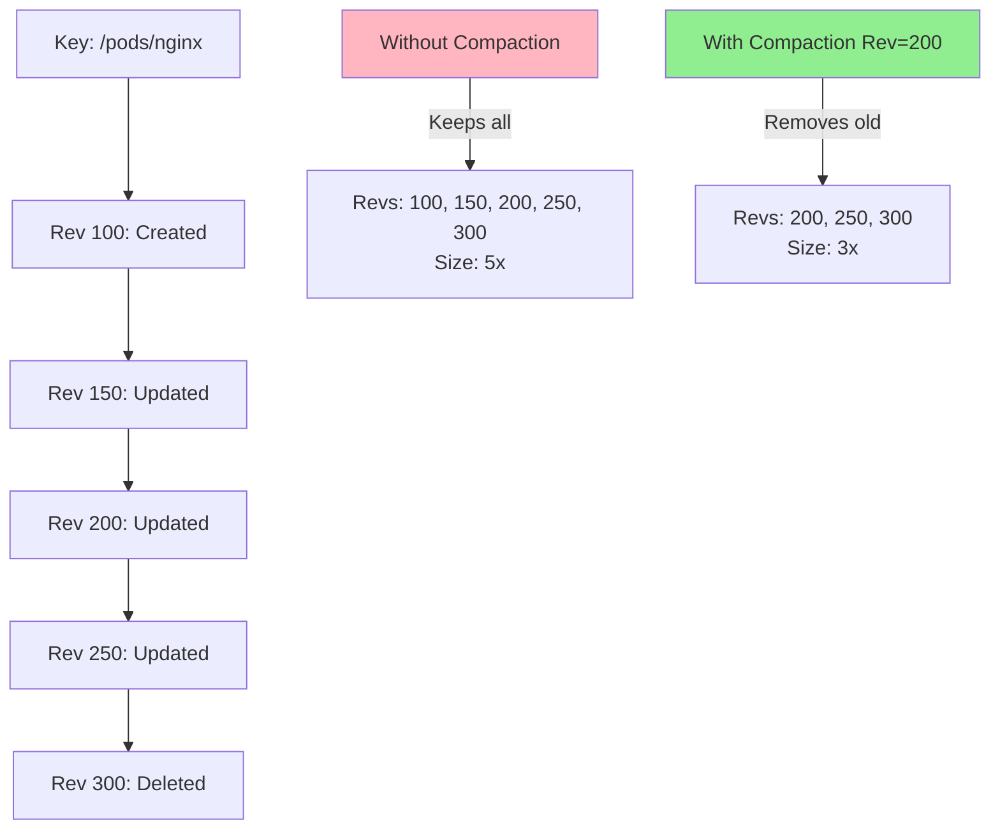

**Key Concepts**:

- **Compaction**: Removes old revision history from etcd
- **Defragmentation**: Reclaims disk space from compacted data
- **ResourceVersion**: Based on etcd revision; older than compaction = error
- **Watch resumption**: Fails if ResourceVersion too old

### **Document Scope**

This document covers:

1. **Compaction mechanisms** - auto and manual compaction
2. **Defragmentation** - when and how to defrag
3. **Impact on watch clients** - ResourceVersion too old errors
4. **Operational best practices** - retention periods, scheduling, monitoring
5. **Troubleshooting** - common issues and solutions

**Code Locations**:
- `staging/src/k8s.io/apiserver/pkg/storage/etcd3/compact.go` - API server compaction
- `staging/src/k8s.io/apiserver/pkg/storage/cacher/compactor.go` - Watch cache compaction
- etcd server auto-compaction (etcd flags)

━━━━━━━━━━━━━━━━━━━━━━━━━━━━━━━━━━━━━━━━━━━━━━━━━━━━━━━━━━━━━━━━━━━━━━━━━━━━━━

## **📚 Compaction Overview**

### **MVCC and Revision History**

etcd's Multi-Version Concurrency Control (MVCC) maintains a complete history of every key change:

```mermaid
sequenceDiagram
    participant Client
    participant etcd
    participant Storage

    Note over etcd,Storage: Initial State: Rev=0

    Client->>etcd: PUT /pods/nginx (data: v1)
    etcd->>Storage: Store rev=100, key=/pods/nginx, value=v1
    etcd-->>Client: Success, ModRevision=100

    Client->>etcd: PUT /pods/nginx (data: v2)
    etcd->>Storage: Store rev=150, key=/pods/nginx, value=v2
    Note over Storage: OLD: rev=100, value=v1 (KEPT)
    etcd-->>Client: Success, ModRevision=150

    Client->>etcd: PUT /pods/nginx (data: v3)
    etcd->>Storage: Store rev=200, key=/pods/nginx, value=v3
    Note over Storage: OLD: rev=100, v1; rev=150, v2 (KEPT)
    etcd-->>Client: Success, ModRevision=200

    Note over Storage: Database contains:<br/>rev=100,150,200<br/>for single key!
```

**MVCC Benefits**:
- **Watch from any revision**: Clients can resume watches from past revisions
- **Consistent reads**: Read from specific revision guarantees consistency
- **Optimistic concurrency**: Compare-and-swap with exact revision

**MVCC Cost**:
- **Unbounded growth**: Every update creates new revision
- **Disk space**: Old revisions consume space even after deletion
- **Performance**: Large databases slow down operations

### **What is Compaction?**

Compaction removes old revisions from etcd, keeping only recent history:

```
Before Compaction:
Key: /pods/nginx
  Rev 100: v1 (5 minutes ago)
  Rev 150: v2 (3 minutes ago)
  Rev 200: v3 (1 minute ago)
  Rev 250: v4 (30 seconds ago)
  Rev 300: v5 (current)

Compact to Rev 200:
Key: /pods/nginx
  Rev 200: v3 (removed earlier)
  Rev 250: v4
  Rev 300: v5 (current)

Result: Revs 100, 150 are PERMANENTLY removed
```

**Important**: Compaction is **irreversible** - once revisions are removed, they cannot be recovered.

### **Compaction vs Deletion**

| Operation | Purpose | Effect on Database | Reversible |
|-----------|---------|-------------------|------------|
| **DELETE key** | Remove current value | Adds deletion marker (new revision) | No (but can recreate) |
| **Compaction** | Remove old revisions | Permanently removes history | No |
| **Defragmentation** | Reclaim disk space | Rebuilds database file | Yes (data preserved) |

**Example**:

```bash
# Initial state
etcdctl get /pods/nginx
# value: v1, revision: 100

# Delete the key
etcdctl del /pods/nginx
# revision: 150 (new revision with tombstone)

# Key still in database with deletion marker!
etcdctl get /pods/nginx --rev=100
# value: v1 (can still read old revision)

# Compact to revision 150
etcdctl compact 150
# Revisions < 150 removed

# Now old revision is gone
etcdctl get /pods/nginx --rev=100
# Error: required revision has been compacted
```

### **Compaction Policies**

etcd supports two compaction modes:

#### **1. Periodic Compaction (Time-Based)**

Keeps revisions for a specified time period:

```yaml
# etcd flag
--auto-compaction-mode=periodic
--auto-compaction-retention=5m

# Behavior:
# - Keep revisions from last 5 minutes
# - Compact every 5 minutes
# - Example: At t=10m, compact rev from t=5m
```

**Use Case**: Most Kubernetes deployments (default)

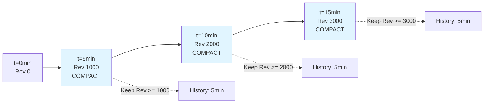

**Advantages**:
- Predictable retention period
- Aligns with business requirements (e.g., "keep 10 minutes")
- Automatic cleanup

**Disadvantages**:
- Retention varies with workload (more updates = more revisions in time window)
- May keep too much or too little data

#### **2. Revision-Based Compaction**

Keeps a fixed number of revisions:

```yaml
# etcd flag
--auto-compaction-mode=revision
--auto-compaction-retention=10000

# Behavior:
# - Keep last 10,000 revisions
# - Compact when threshold exceeded
# - Example: At rev 50000, compact to rev 40000
```

**Use Case**: Predictable memory usage, high-churn environments

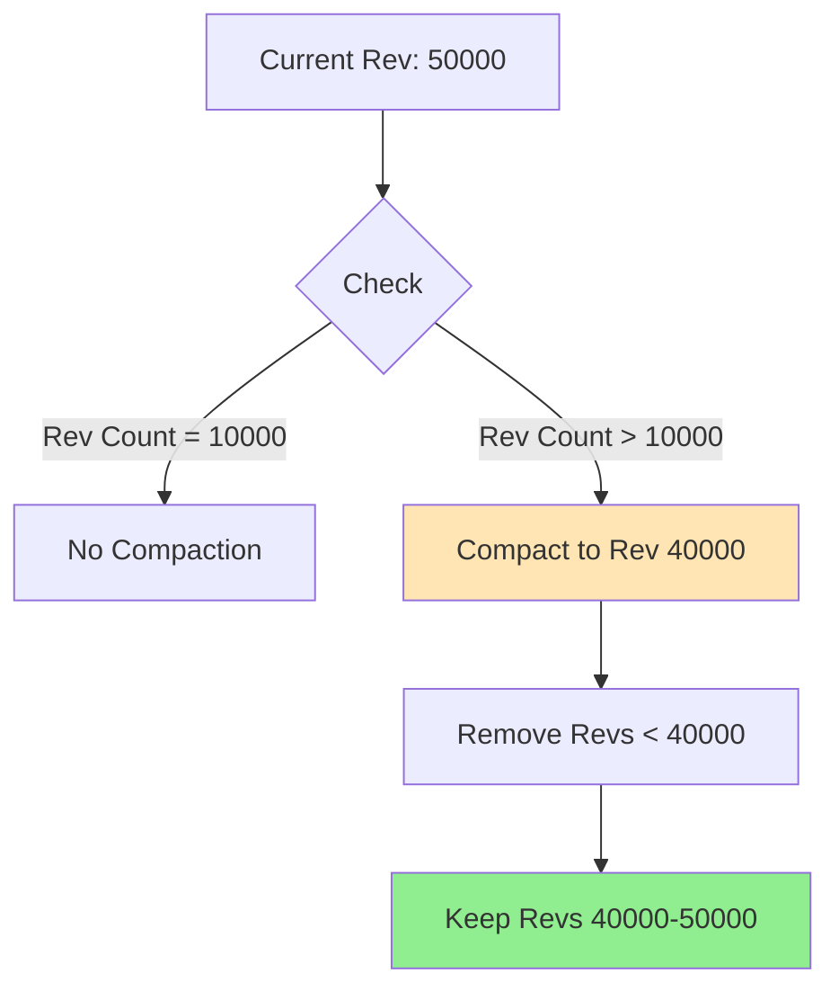

**Advantages**:
- Predictable storage usage
- Works well with bursty workloads
- Memory/storage bounded

**Disadvantages**:
- Time window varies (slow updates = long retention, fast = short)
- May not align with business requirements

### **Compaction Workflow**

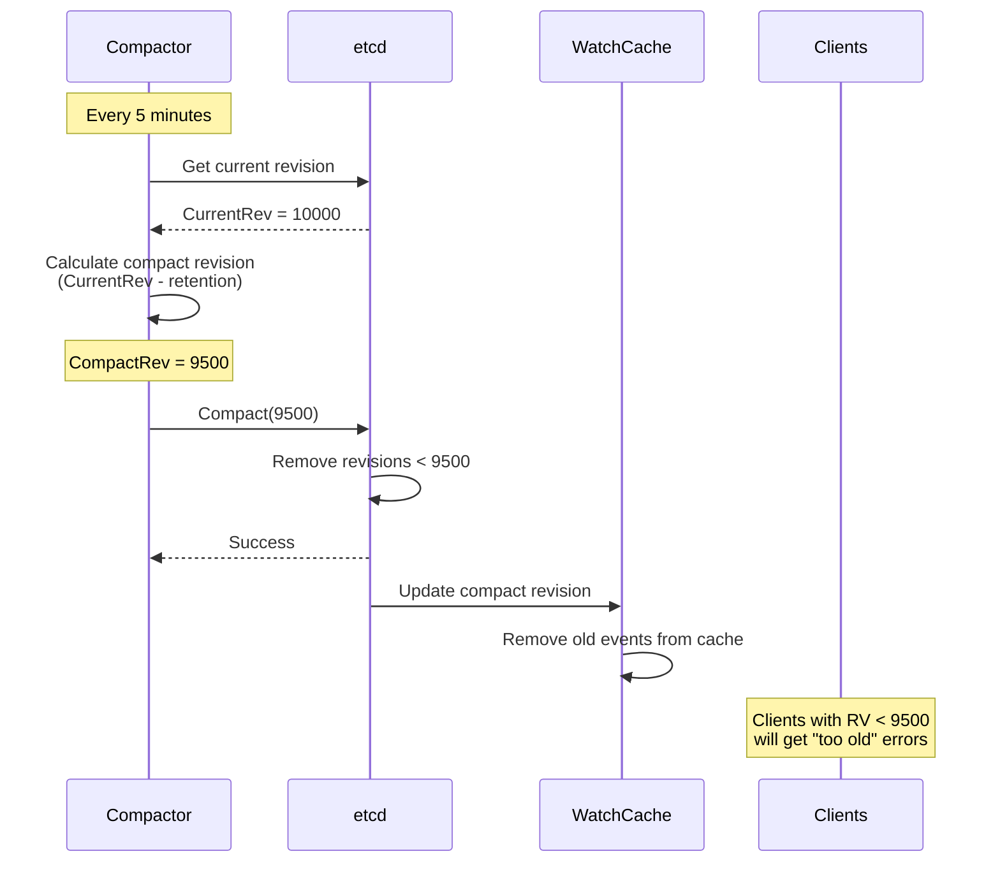

━━━━━━━━━━━━━━━━━━━━━━━━━━━━━━━━━━━━━━━━━━━━━━━━━━━━━━━━━━━━━━━━━━━━━━━━━━━━━━

## **⚙️ Auto-Compaction in Kubernetes**

Kubernetes API server implements automatic compaction to manage etcd database size.

### **API Server Compactor**

The API server runs a dedicated compactor per etcd endpoint:

```go
// staging/src/k8s.io/apiserver/pkg/storage/etcd3/compact.go:52
func StartCompactorPerEndpoint(client *clientv3.Client, compactInterval time.Duration) *compactor {
    endpointsMapMu.Lock()
    defer endpointsMapMu.Unlock()

    // One compactor per cluster endpoint
    for _, ep := range client.Endpoints() {
        if c, ok := endpointsMap[ep]; ok {
            klog.V(4).Infof("compactor already exists for endpoints %v", client.Endpoints())
            return c
        }
    }

    c := NewCompactor(client, compactInterval, clock.RealClock{}, func() {
        endpointsMapMu.Lock()
        defer endpointsMapMu.Unlock()
        for _, ep := range client.Endpoints() {
            delete(endpointsMap, ep)
        }
    })

    for _, ep := range client.Endpoints() {
        endpointsMap[ep] = c
    }

    return c
}
```

**Code Reference**: `staging/src/k8s.io/apiserver/pkg/storage/etcd3/compact.go:52`

**Key Design Points**:
- **One compactor per endpoint**: Prevents multiple API servers from conflicting
- **Coordinated via etcd**: Uses compare-and-swap on special key
- **Lease-based protocol**: Automatic failover if API server crashes
- **Interval-based**: Compacts every N minutes (default 5 minutes)

### **Compactor Structure**

```go
// staging/src/k8s.io/apiserver/pkg/storage/etcd3/compact.go:108
type compactor struct {
    client  *clientv3.Client   // etcd client
    wg      sync.WaitGroup     // Wait for goroutines
    clock   clock.Clock        // Time source
    onClose func()             // Cleanup callback

    stopOnce sync.Once         // Ensure single stop
    stop     chan struct{}     // Stop signal

    mux             sync.Mutex // Protects compactRevision
    compactRevision int64      // Last compacted revision
    interval        time.Duration // Compaction interval
}
```

**Code Reference**: `staging/src/k8s.io/apiserver/pkg/storage/etcd3/compact.go:108`

### **Compaction Algorithm**

The compactor uses a distributed lease protocol to coordinate compaction across multiple API servers:

```go
// staging/src/k8s.io/apiserver/pkg/storage/etcd3/compact.go:153
func (c *compactor) runCompactLoop(stopCh chan struct{}) {
    // Algorithm:
    // 1. Compare local compact_time with remote compact_time
    // 2. If equal, increment both and compact
    // 3. If not equal, sync local to remote
    //
    // Lease-based protocol ensures only one API server compacts at a time

    ctx := wait.ContextForChannel(stopCh)
    var compactTime int64
    var rev int64
    var compactRev int64
    var err error

    for {
        select {
        case <-c.clock.After(c.interval):
        case <-ctx.Done():
            return
        }

        compactTime, rev, compactRev, err = Compact(ctx, c.client, compactTime, rev)
        if err != nil {
            klog.Errorf("etcd: endpoint (%v) compact failed: %v", c.client.Endpoints(), err)
            continue
        }

        if compactRev != 0 {
            c.UpdateCompactRevision(compactRev)
        }
    }
}
```

**Code Reference**: `staging/src/k8s.io/apiserver/pkg/storage/etcd3/compact.go:153`

### **Distributed Coordination**

Multiple API servers coordinate using a special etcd key:

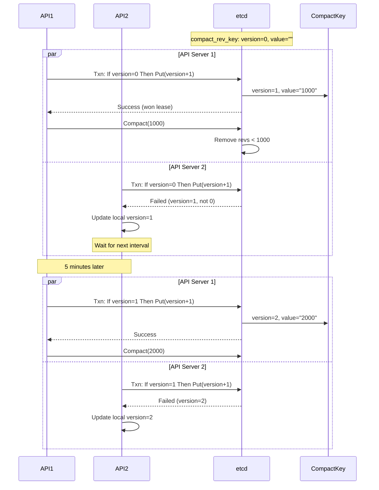

**Coordination Guarantees**:
- Normal case: compaction every 5 minutes
- Failover case: compaction between 5-10 minutes
- No double compaction: CAS ensures atomicity

### **Compact Transaction**

The actual compaction is performed using an etcd transaction:

```go
// staging/src/k8s.io/apiserver/pkg/storage/etcd3/compact.go:219
func Compact(ctx context.Context, client *clientv3.Client, expectVersion, rev int64) (currentVersion, currentRev, compactRev int64, err error) {
    resp, err := client.KV.Txn(ctx).If(
        clientv3.Compare(clientv3.Version(compactRevKey), "=", expectVersion),
    ).Then(
        clientv3.OpPut(compactRevKey, strconv.FormatInt(rev, 10)),
    ).Else(
        clientv3.OpGet(compactRevKey),
    ).Commit()

    if err != nil {
        return expectVersion, rev, 0, err
    }

    currentRev = resp.Header.Revision

    if !resp.Succeeded {
        // CAS failed, another API server compacted
        currentVersion = resp.Responses[0].GetResponseRange().Kvs[0].Version
        compactRev, err = strconv.ParseInt(string(resp.Responses[0].GetResponseRange().Kvs[0].Value), 10, 64)
        if err != nil {
            return currentVersion, currentRev, 0, nil
        }
        return currentVersion, currentRev, compactRev, nil
    }

    currentVersion = expectVersion + 1

    if rev == 0 {
        // Don't compact on bootstrap
        return currentVersion, currentRev, 0, nil
    }

    // Perform actual compaction
    if _, err = client.Compact(ctx, rev); err != nil {
        return currentVersion, currentRev, 0, err
    }

    klog.V(4).Infof("etcd: compacted rev (%d), endpoints (%v)", rev, client.Endpoints())
    return currentVersion, currentRev, rev, nil
}
```

**Code Reference**: `staging/src/k8s.io/apiserver/pkg/storage/etcd3/compact.go:219`

**Transaction Flow**:

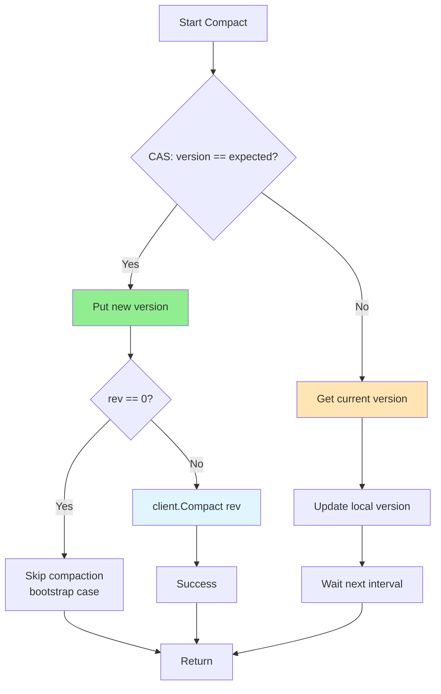

### **Watch Cache Compaction**

The watch cache also needs to compact its event history:

```go
// staging/src/k8s.io/apiserver/pkg/storage/cacher/compactor.go:51
func (c *compactor) Run(stopCh <-chan struct{}) {
    timer := c.clock.NewTimer(compactorPollPeriod)
    defer timer.Stop()

    for {
        select {
        case <-stopCh:
            return
        case <-timer.C():
            c.compactIfNeeded()
            timer.Reset(compactorPollPeriod)
        }
    }
}

func (c *compactor) compactIfNeeded() {
    rev := c.store.CompactRevision()  // Get etcd compact revision
    if rev == 0 {
        return
    }

    c.lock.Lock()
    defer c.lock.Unlock()

    if rev <= c.compactRevision {
        return
    }

    c.wc.Compact(uint64(rev))  // Compact watch cache
    c.compactRevision = rev
}
```

**Code Reference**: `staging/src/k8s.io/apiserver/pkg/storage/cacher/compactor.go:51`

**Watch Cache Compaction**:

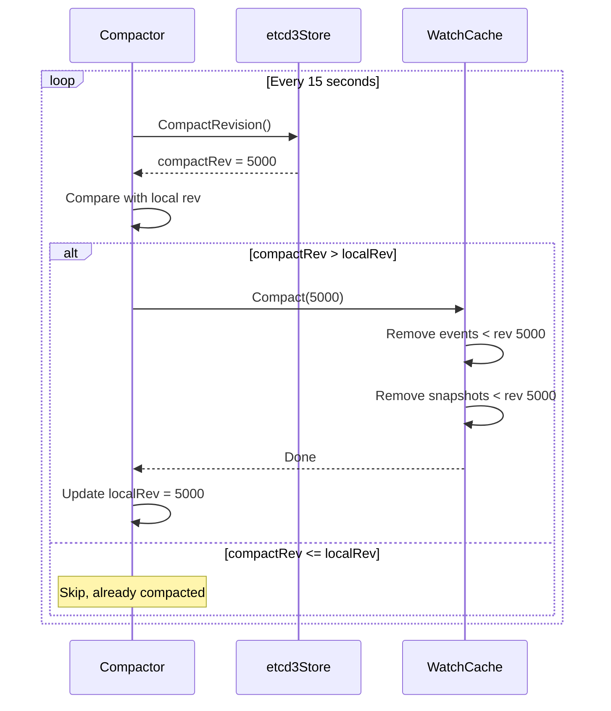

**Code Reference**: `staging/src/k8s.io/apiserver/pkg/storage/cacher/compactor.go:65`

### **Configuration**

API server compaction is configured via flag:

```yaml
# kube-apiserver flags
--etcd-compaction-interval=5m  # Default: 5 minutes
```

**Example Configurations**:

```yaml
# Conservative (keep more history)
--etcd-compaction-interval=10m

# Aggressive (keep less history, save space)
--etcd-compaction-interval=2m

# Disable API server compaction (use etcd auto-compaction instead)
--etcd-compaction-interval=0
```

━━━━━━━━━━━━━━━━━━━━━━━━━━━━━━━━━━━━━━━━━━━━━━━━━━━━━━━━━━━━━━━━━━━━━━━━━━━━━━

## **🔧 Manual Compaction**

While auto-compaction handles routine maintenance, manual compaction is needed for troubleshooting and special situations.

### **etcdctl compact Command**

```bash
# Compact to specific revision
etcdctl compact <revision>

# Example: Compact to revision 10000
etcdctl compact 10000

# Output:
# compacted revision 10000
```

**Use Cases**:
- Database grew too large before auto-compaction configured
- Need immediate space reclamation
- Testing compaction behavior
- Emergency maintenance

### **Finding Safe Compaction Revision**

**Step 1**: Get current revision

```bash
etcdctl endpoint status --write-out=table

# Output:
# +------------------+------------------+---------+---------+-----------+------------+-----------+------------+--------------------+--------+
# |    ENDPOINT      |        ID        | VERSION | DB SIZE | IS LEADER | IS LEARNER | RAFT TERM | RAFT INDEX | RAFT APPLIED INDEX | ERRORS |
# +------------------+------------------+---------+---------+-----------+------------+-----------+------------+--------------------+--------+
# | 127.0.0.1:2379   | 8e9e05c52164694d | 3.5.9   | 25 MB   | true      | false      |         2 |      10245 |              10245 |        |
# +------------------+------------------+---------+---------+-----------+------------+-----------+------------+--------------------+--------+
```

Current revision: ~10245

**Step 2**: Calculate safe compaction revision

```bash
# Keep last 5 minutes of history
# If cluster processes 1000 revisions/minute:
# SafeRev = CurrentRev - (5 min * 1000 rev/min) = 10245 - 5000 = 5245

etcdctl compact 5245
```

**Step 3**: Verify compaction

```bash
# Try to read from old revision (should fail)
etcdctl get / --prefix --rev=5000

# Error: etcdserver: mvcc: required revision has been compacted

# Read from newer revision (should succeed)
etcdctl get / --prefix --rev=6000
```

### **Compaction Strategies**

#### **Strategy 1: Progressive Compaction**

For large databases, compact progressively to avoid spikes:

```bash
#!/bin/bash
# Progressive compaction script

CURRENT_REV=$(etcdctl endpoint status --write-out=json | jq '.[0].Status.header.revision')
TARGET_REV=$((CURRENT_REV - 10000))  # Keep 10k revisions

echo "Current revision: $CURRENT_REV"
echo "Target compaction: $TARGET_REV"

# Compact in steps of 1000 revisions
for ((rev=$TARGET_REV-5000; rev<=$TARGET_REV; rev+=1000)); do
    echo "Compacting to revision $rev..."
    etcdctl compact $rev
    sleep 5  # Wait between compactions
done

echo "Compaction complete"
```

#### **Strategy 2: Time-Based Compaction**

Calculate revision based on time retention:

```bash
#!/bin/bash
# Compact to keep last N minutes

RETENTION_MINUTES=5

# Get current revision and timestamp
CURRENT_REV=$(etcdctl endpoint status --write-out=json | jq '.[0].Status.header.revision')

# Estimate revisions per minute (requires monitoring)
REVS_PER_MINUTE=1000

# Calculate compact revision
REVS_TO_KEEP=$((RETENTION_MINUTES * REVS_PER_MINUTE))
COMPACT_REV=$((CURRENT_REV - REVS_TO_KEEP))

echo "Compacting to revision $COMPACT_REV (keeping $RETENTION_MINUTES minutes)"
etcdctl compact $COMPACT_REV
```

#### **Strategy 3: Size-Based Compaction**

Compact to target database size:

```bash
#!/bin/bash
# Compact until database is under target size

TARGET_SIZE_MB=100
CURRENT_SIZE_MB=$(etcdctl endpoint status --write-out=json | jq '.[0].Status.dbSize / 1024 / 1024')

echo "Current DB size: ${CURRENT_SIZE_MB}MB"

if (( $(echo "$CURRENT_SIZE_MB > $TARGET_SIZE_MB" | bc -l) )); then
    echo "DB size exceeds target, compacting..."

    CURRENT_REV=$(etcdctl endpoint status --write-out=json | jq '.[0].Status.header.revision')

    # Aggressive compaction: keep only 1000 revisions
    COMPACT_REV=$((CURRENT_REV - 1000))

    etcdctl compact $COMPACT_REV

    echo "Compaction complete. Run defrag to reclaim space."
else
    echo "DB size within target, no compaction needed"
fi
```

### **Compaction Impact**

**During Compaction**:
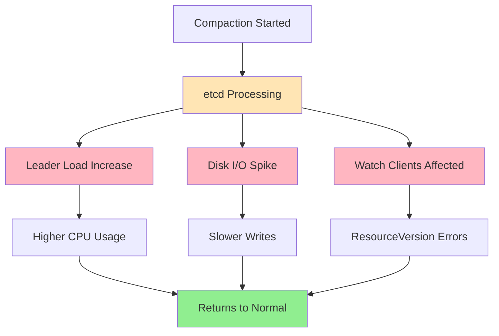

**Impact Summary**:

| Aspect | During Compaction | After Compaction |
|--------|------------------|------------------|
| CPU | +20-50% on leader | Normal |
| Disk I/O | High | Normal |
| Write latency | +10-30% | Normal |
| Watch clients | Potential errors | Improved (smaller DB) |
| DB size | No change | No change (need defrag) |

### **Safe Compaction Checklist**

✅ **Before Compaction**:
- [ ] Check cluster health: `etcdctl endpoint health`
- [ ] Verify leader status: `etcdctl endpoint status`
- [ ] Note current revision: `etcdctl endpoint status`
- [ ] Estimate retention needed (watch cache size, client requirements)
- [ ] Plan for off-peak hours if possible

✅ **During Compaction**:
- [ ] Monitor cluster metrics (CPU, disk I/O)
- [ ] Watch for client errors (ResourceVersion too old)
- [ ] Be prepared to stop if issues arise

✅ **After Compaction**:
- [ ] Verify compaction succeeded: check DB size
- [ ] Monitor client errors
- [ ] Plan defragmentation (to reclaim space)
- [ ] Update monitoring/alerting thresholds

━━━━━━━━━━━━━━━━━━━━━━━━━━━━━━━━━━━━━━━━━━━━━━━━━━━━━━━━━━━━━━━━━━━━━━━━━━━━━━

## **🗜️ Defragmentation**

Compaction removes old revisions from etcd's logical view, but doesn't immediately reclaim disk space. Defragmentation rebuilds the database file to reclaim space.

### **Why Defragmentation is Needed**

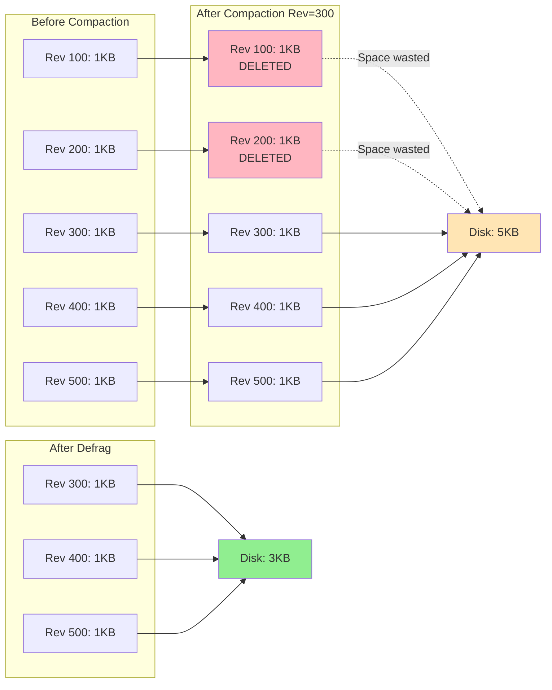

**Key Points**:
- Compaction marks revisions as deleted (logical)
- Defragmentation removes deleted data (physical)
- Database file size only shrinks after defrag
- Defrag rebuilds database file, reclaiming "holes"

### **When to Defragment**

**Indicators**:

```bash
# Check database size vs used space
etcdctl endpoint status --write-out=table

# If DB SIZE >> actual data size, defrag needed
```

**Example**:

```
Scenario 1: No defrag needed
- DB Size: 100 MB
- Actual data: 95 MB
- Fragmentation: 5% (OK)

Scenario 2: Defrag recommended
- DB Size: 500 MB
- Actual data: 100 MB
- Fragmentation: 80% (HIGH)

Scenario 3: Defrag urgent
- DB Size: 2 GB
- Actual data: 200 MB
- Fragmentation: 90% (CRITICAL)
```

**Defrag Triggers**:
- Database size > 2x expected size
- After aggressive compaction
- Disk space running low
- Degraded performance due to fragmentation
- Routine maintenance (monthly/quarterly)

### **etcdctl defrag Command**

#### **Online Defragmentation**

Defrag a single member while cluster stays online:

```bash
# Defrag specific member
etcdctl defrag --endpoints=https://etcd-1:2379

# Output:
# Finished defragmenting etcd member[https://etcd-1:2379]

# Defrag all members sequentially
etcdctl defrag --cluster

# Output:
# Finished defragmenting etcd member[https://etcd-1:2379]
# Finished defragmenting etcd member[https://etcd-2:2379]
# Finished defragmenting etcd member[https://etcd-3:2379]
```

**Online Defrag Characteristics**:
- Cluster remains available
- One member at a time
- Temporary performance impact on defragging member
- Leader may transfer during defrag
- Safe for production

#### **Offline Defragmentation**

Defrag entire cluster (all members down):

```bash
# Stop etcd on all members
systemctl stop etcd

# Defrag each member's data directory
etcdutl defrag --data-dir=/var/lib/etcd

# Start etcd on all members
systemctl start etcd
```

**Offline Defrag Characteristics**:
- Faster defragmentation
- Cluster unavailable during process
- Used for emergency situations
- Requires cluster downtime

### **Defragmentation Process**

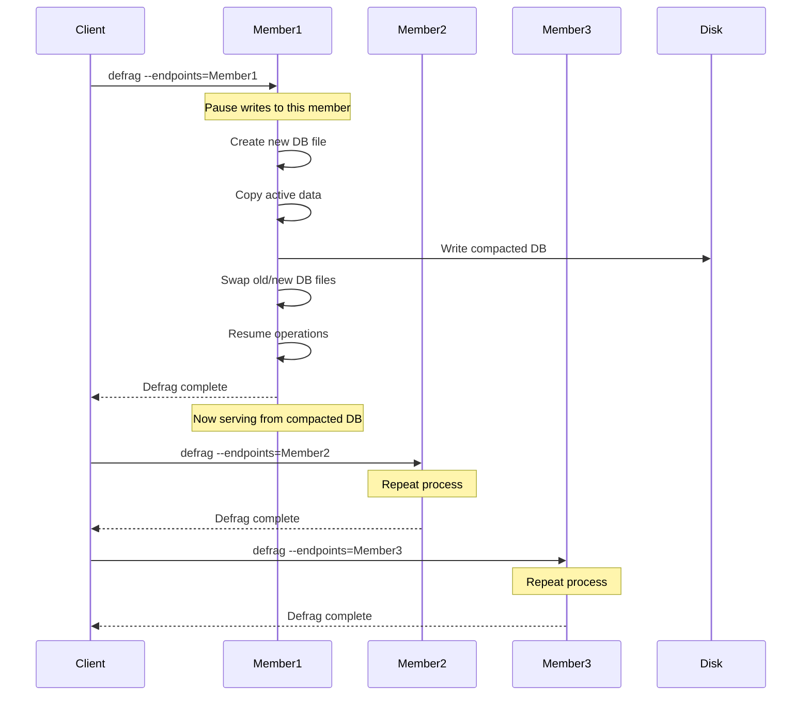

### **Defrag Impact**

**Performance Impact**:

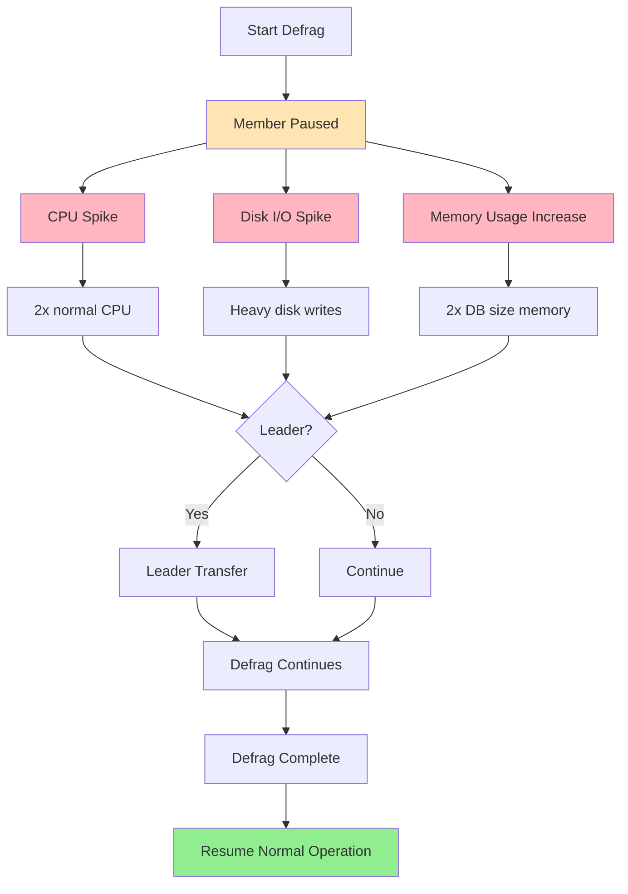

**Impact Summary**:

| Aspect | During Defrag (Member) | During Defrag (Cluster) | After Defrag |
|--------|----------------------|------------------------|--------------|
| Availability | Reduced capacity | Full availability | Normal |
| CPU (defragging member) | 2-3x normal | N/A | Normal |
| Disk I/O (defragging member) | Very high | N/A | Normal |
| Memory (defragging member) | +DB size | N/A | Normal |
| Write latency | Higher | Normal | Improved |
| Read latency | Higher | Normal | Improved |

### **Defrag Best Practices**

#### **1. Sequential Defragmentation**

Defrag one member at a time:

```bash
#!/bin/bash
# Sequential defrag script

ENDPOINTS=(
    "https://etcd-1:2379"
    "https://etcd-2:2379"
    "https://etcd-3:2379"
)

for endpoint in "${ENDPOINTS[@]}"; do
    echo "Defragmenting $endpoint..."

    # Defrag this member
    etcdctl defrag --endpoints=$endpoint

    # Wait for cluster to stabilize
    echo "Waiting 30s for stabilization..."
    sleep 30

    # Check cluster health
    etcdctl endpoint health --endpoints=$endpoint
done

echo "All members defragmented"
```

#### **2. Check Before Defrag**

```bash
#!/bin/bash
# Pre-defrag checks

echo "=== Pre-Defrag Checks ==="

# 1. Cluster health
echo "1. Checking cluster health..."
etcdctl endpoint health --cluster

# 2. Current DB sizes
echo -e "\n2. Current database sizes:"
etcdctl endpoint status --cluster --write-out=table

# 3. Check disk space (need 2x DB size free)
echo -e "\n3. Checking disk space..."
df -h /var/lib/etcd

# 4. Leader status
echo -e "\n4. Current leader:"
etcdctl endpoint status --cluster --write-out=json | jq '.[] | select(.Status.leader == .Status.header.member_id) | .Endpoint'

echo -e "\n=== Checks complete. Proceed with defrag? (y/n) ==="
```

#### **3. Monitor During Defrag**

```bash
#!/bin/bash
# Monitor defrag progress

MEMBER="https://etcd-1:2379"

echo "Starting defrag of $MEMBER..."

# Start defrag in background
etcdctl defrag --endpoints=$MEMBER &
DEFRAG_PID=$!

# Monitor while defrag runs
while kill -0 $DEFRAG_PID 2>/dev/null; do
    echo "=== $(date) ==="

    # Check member status
    etcdctl endpoint status --endpoints=$MEMBER --write-out=json | jq -r '.[] | "Size: \(.Status.dbSize / 1024 / 1024)MB, Leader: \(.Status.leader == .Status.header.member_id)"'

    # Check system resources
    echo "CPU: $(top -bn1 | grep "Cpu(s)" | awk '{print $2}')%"
    echo "Disk I/O: $(iostat -x 1 1 | awk '/^sda/ {print $14}')%"

    sleep 10
done

wait $DEFRAG_PID
echo "Defrag complete"
```

#### **4. Automate Defragmentation**

```bash
#!/bin/bash
# Automated weekly defrag

# Run via cron: 0 2 * * 0 /path/to/defrag-weekly.sh

FRAGMENTATION_THRESHOLD=50  # Percent

check_fragmentation() {
    local endpoint=$1

    # Get DB size and estimate active data
    local status=$(etcdctl endpoint status --endpoints=$endpoint --write-out=json)
    local db_size=$(echo $status | jq '.[0].Status.dbSize')
    local revision=$(echo $status | jq '.[0].Status.header.revision')

    # Estimate active data (rough approximation)
    # This is simplified; real calculation would need more data
    local estimated_active=$((revision * 100))  # 100 bytes per revision average

    local fragmentation=$(( (db_size - estimated_active) * 100 / db_size ))

    echo $fragmentation
}

for endpoint in etcd-1:2379 etcd-2:2379 etcd-3:2379; do
    frag=$(check_fragmentation "https://$endpoint")

    if [ $frag -gt $FRAGMENTATION_THRESHOLD ]; then
        echo "Member $endpoint fragmentation ${frag}% > threshold ${FRAGMENTATION_THRESHOLD}%"
        echo "Defragmenting..."

        etcdctl defrag --endpoints=https://$endpoint

        echo "Waiting 60s..."
        sleep 60
    else
        echo "Member $endpoint fragmentation ${frag}% OK"
    fi
done
```

━━━━━━━━━━━━━━━━━━━━━━━━━━━━━━━━━━━━━━━━━━━━━━━━━━━━━━━━━━━━━━━━━━━━━━━━━━━━━━

## **⚠️ Impact on Watch Clients**

Compaction has direct implications for Kubernetes watch clients.

### **ResourceVersion Too Old Errors**

When compaction removes revisions, clients watching from old ResourceVersions fail:

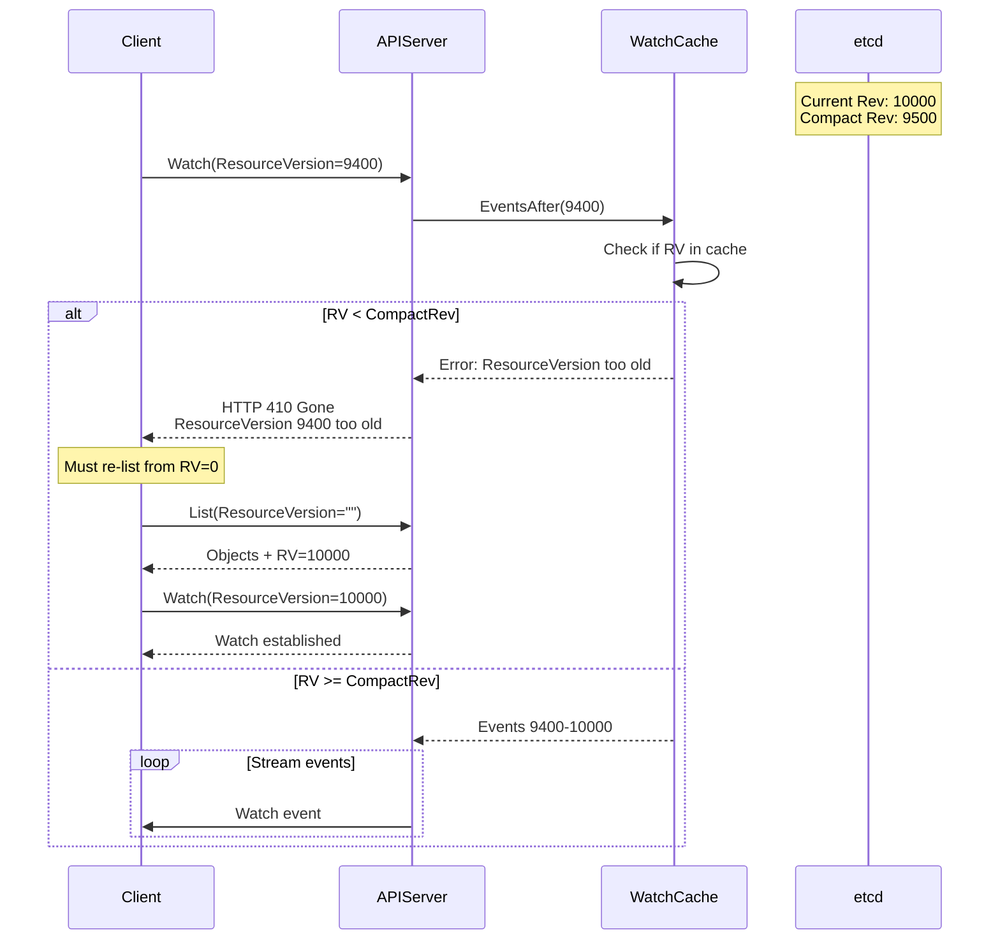

**Error Example**:

```
Error: "the ResourceVersion for the provided watch is too old"
Code: 410 Gone
Reason: Expired

Cause: Requested ResourceVersion (9400) < Compacted Revision (9500)
```

### **Watch Cache and Compaction**

The watch cache acts as a buffer, reducing compaction impact:

```
Without Watch Cache:
- Client watches from RV=9400
- etcd compacted to RV=9500
- Watch fails immediately with "too old"

With Watch Cache:
- Client watches from RV=9400
- Watch cache has events 9400-10000
- Client gets buffered events
- Watch succeeds despite etcd compaction
```

**Watch Cache Protection**:

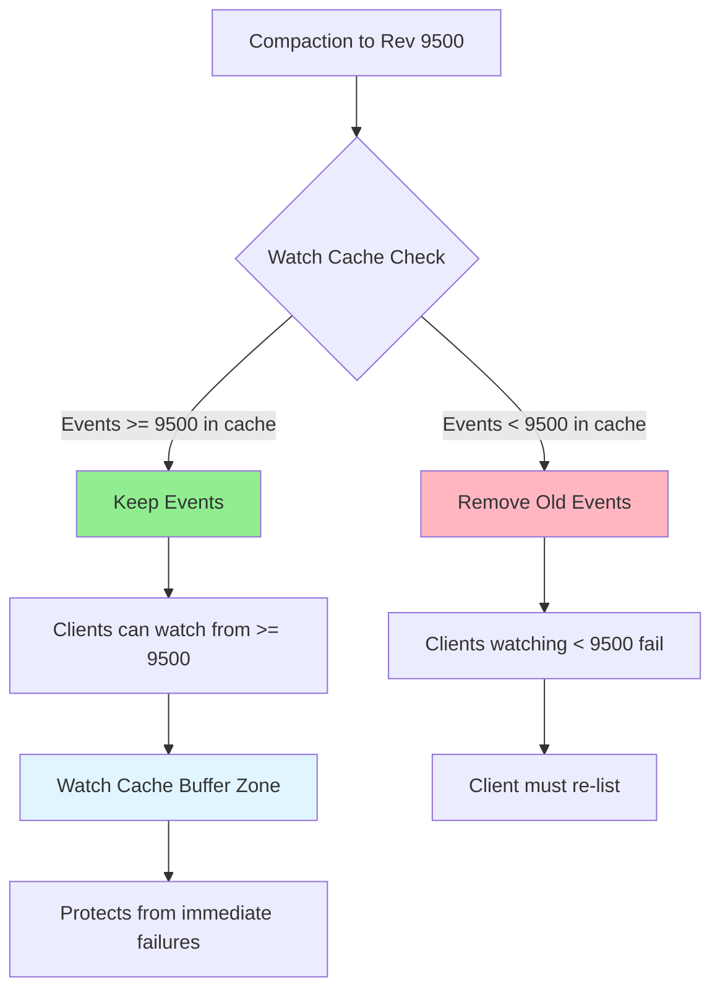

### **Handling Compaction in Clients**

**Pattern 1: Informer (Recommended)**

Kubernetes informers handle compaction automatically:

```go
import (
    "k8s.io/client-go/informers"
    "k8s.io/client-go/kubernetes"
)

func main() {
    clientset := kubernetes.NewForConfigOrDie(config)

    // Informer handles ResourceVersion too old automatically
    factory := informers.NewSharedInformerFactory(clientset, 0)
    podInformer := factory.Core().V1().Pods().Informer()

    podInformer.AddEventHandler(cache.ResourceEventHandlerFuncs{
        AddFunc:    func(obj interface{}) { /* ... */ },
        UpdateFunc: func(old, new interface{}) { /* ... */ },
        DeleteFunc: func(obj interface{}) { /* ... */ },
    })

    // Start informer - handles watch failures and re-lists automatically
    factory.Start(stopCh)
    factory.WaitForCacheSync(stopCh)
}
```

**Pattern 2: Manual Watch with Error Handling**

If using raw watch, handle compaction errors:

```go
func watchPodsWithRetry(clientset kubernetes.Interface, namespace string) {
    var resourceVersion string

    for {
        // Watch from last known ResourceVersion
        watcher, err := clientset.CoreV1().Pods(namespace).Watch(context.TODO(),
            metav1.ListOptions{
                ResourceVersion: resourceVersion,
            })

        if err != nil {
            log.Printf("Watch error: %v", err)
            time.Sleep(5 * time.Second)
            continue
        }

        for event := range watcher.ResultChan() {
            switch event.Type {
            case watch.Added, watch.Modified, watch.Deleted:
                pod := event.Object.(*corev1.Pod)
                resourceVersion = pod.ResourceVersion
                // Process event

            case watch.Error:
                // Check if ResourceVersion too old
                status := event.Object.(*metav1.Status)

                if status.Code == 410 && strings.Contains(status.Message, "too old") {
                    log.Println("ResourceVersion too old, re-listing...")

                    // Re-list to get current state
                    pods, err := clientset.CoreV1().Pods(namespace).List(context.TODO(),
                        metav1.ListOptions{})

                    if err != nil {
                        log.Printf("List error: %v", err)
                        time.Sleep(5 * time.Second)
                        break
                    }

                    // Update resourceVersion to latest
                    resourceVersion = pods.ResourceVersion

                    // Process all current pods
                    for _, pod := range pods.Items {
                        // Process as "Added" events
                    }

                    // Break to restart watch
                    break
                }
            }
        }

        // Watch closed, restart
        time.Sleep(1 * time.Second)
    }
}
```

### **Bookmark Events and Compaction**

Bookmark events help clients stay ahead of compaction:

```
Scenario: Client watching Pods

Without Bookmarks:
- Last Pod event: RV=9000 (5 minutes ago)
- Client disconnects and reconnects
- etcd compacted to RV=9500
- Watch fails: RV 9000 < 9500

With Bookmarks:
- Last Pod event: RV=9000
- Bookmark events: RV=9200, 9400, 9600, 9800, 10000
- Client disconnects and reconnects
- Watch from RV=10000
- Success: RV 10000 >= 9500
```

**Enable Bookmarks**:

```go
watcher, err := clientset.CoreV1().Pods(namespace).Watch(context.TODO(),
    metav1.ListOptions{
        AllowWatchBookmarks: true,  // Enable bookmarks
    })
```

### **Compaction and Watch Cache Size**

The watch cache retention period must exceed compaction interval:

```
Good Configuration:
- etcd compaction interval: 5 minutes
- Watch cache retention: 10 minutes  (2x buffer)
- Result: Watch cache has revisions before compaction

Bad Configuration:
- etcd compaction interval: 5 minutes
- Watch cache retention: 3 minutes
- Result: Watch cache doesn't cover compaction gap
```

**API Server Flags**:

```yaml
# Ensure watch cache retention > compaction interval
--etcd-compaction-interval=5m
--event-ttl=15m  # Watch cache for Events
# Watch cache for other resources uses default retention
```

━━━━━━━━━━━━━━━━━━━━━━━━━━━━━━━━━━━━━━━━━━━━━━━━━━━━━━━━━━━━━━━━━━━━━━━━━━━━━━

## **📊 Operational Concerns**

### **Observability**

#### **Metrics**

**etcd Metrics**:

```promql
# Database size
etcd_mvcc_db_total_size_in_bytes

# Compaction metrics (if etcd auto-compaction enabled)
etcd_debugging_mvcc_compact_revision

# DB size in use (vs total size - shows fragmentation)
etcd_mvcc_db_total_size_in_use_in_bytes

# Fragmentation ratio
(etcd_mvcc_db_total_size_in_bytes - etcd_mvcc_db_total_size_in_use_in_bytes) / etcd_mvcc_db_total_size_in_bytes
```

**API Server Metrics**:

```promql
# Watch cache compact revision
watch_cache_compact_revision

# ResourceVersion too old errors
apiserver_storage_list_errors_total{resource="pods",error_type="resource_version_too_old"}
```

**Example Queries**:

```promql
# DB growth rate (MB/hour)
rate(etcd_mvcc_db_total_size_in_bytes[1h]) * 3600 / 1024 / 1024

# Time until compaction (estimate)
(etcd_mvcc_db_total_size_in_bytes - target_db_size) / rate(etcd_mvcc_db_total_size_in_bytes[1h])

# Fragmentation percentage
((etcd_mvcc_db_total_size_in_bytes - etcd_mvcc_db_total_size_in_use_in_bytes) / etcd_mvcc_db_total_size_in_bytes) * 100

# Watch failures due to old RV
sum(rate(apiserver_storage_list_errors_total{error_type="resource_version_too_old"}[5m])) by (resource)
```

#### **Alerts**

```yaml
# Prometheus alerting rules

groups:
- name: etcd-compaction
  rules:
  - alert: EtcdDatabaseSizeHigh
    expr: etcd_mvcc_db_total_size_in_bytes > 8 * 1024 * 1024 * 1024  # 8GB
    for: 10m
    labels:
      severity: warning
    annotations:
      summary: "etcd database size is high"
      description: "etcd DB size is {{ $value | humanize }}B, consider compaction"

  - alert: EtcdHighFragmentation
    expr: |
      (etcd_mvcc_db_total_size_in_bytes - etcd_mvcc_db_total_size_in_use_in_bytes)
      / etcd_mvcc_db_total_size_in_bytes > 0.5
    for: 30m
    labels:
      severity: warning
    annotations:
      summary: "etcd database is highly fragmented"
      description: "Fragmentation is {{ $value | humanizePercentage }}, run defrag"

  - alert: HighResourceVersionTooOldErrors
    expr: |
      sum(rate(apiserver_storage_list_errors_total{error_type="resource_version_too_old"}[5m]))
      > 1
    for: 10m
    labels:
      severity: warning
    annotations:
      summary: "High rate of ResourceVersion too old errors"
      description: "Watch clients failing due to old ResourceVersion, may need longer retention"

  - alert: EtcdCompactionNotRunning
    expr: |
      (time() - etcd_debugging_mvcc_compact_timestamp_seconds) > 600  # 10 minutes
    for: 30m
    labels:
      severity: critical
    annotations:
      summary: "etcd compaction has not run recently"
      description: "Last compaction was {{ $value }}s ago"
```

#### **Logging**

**API Server Compaction Logs**:

```go
// staging/src/k8s.io/apiserver/pkg/storage/etcd3/compact.go
klog.V(4).Infof("etcd: compacted rev (%d), endpoints (%v)", rev, client.Endpoints())
klog.Errorf("etcd: endpoint (%v) compact failed: %v", c.client.Endpoints(), err)
```

**Watch Cache Compaction Logs**:

```go
// staging/src/k8s.io/apiserver/pkg/storage/cacher/compactor.go
// Logs when compacting watch cache based on etcd compact revision
```

**etcd Defrag Logs**:

```
# etcd server logs during defrag
{"level":"info","msg":"starting defragmentation"}
{"level":"info","msg":"finished defragmentation","took":"15.2s"}
```

### **Performance Considerations**

#### **Compaction Performance**

| Cluster Size | Compaction Time | Impact |
|--------------|----------------|--------|
| < 100 MB | < 1s | Negligible |
| 100-500 MB | 1-5s | Low |
| 500 MB - 2 GB | 5-30s | Moderate |
| > 2 GB | 30s - 2min | High |

**Factors Affecting Performance**:
- Database size
- Number of revisions being compacted
- Disk I/O speed
- CPU availability
- Current cluster load

#### **Defrag Performance**

| Database Size | Defrag Time | CPU Impact | Disk I/O | Memory |
|--------------|-------------|------------|----------|---------|
| < 100 MB | 5-10s | Low | Moderate | +100 MB |
| 500 MB | 30-60s | Moderate | High | +500 MB |
| 2 GB | 2-5 min | High | Very High | +2 GB |
| 8 GB | 10-20 min | Very High | Very High | +8 GB |

**Defrag Resource Requirements**:
- **CPU**: 2-3x normal during defrag
- **Memory**: +1x DB size (temporary)
- **Disk I/O**: Saturated during defrag
- **Disk space**: Need 2x DB size free

#### **Optimal Intervals**

**Recommended Compaction Intervals**:

```yaml
# Low-churn cluster (< 100 updates/sec)
--etcd-compaction-interval=10m

# Medium-churn cluster (100-1000 updates/sec)
--etcd-compaction-interval=5m  # Default

# High-churn cluster (> 1000 updates/sec)
--etcd-compaction-interval=2m
```

**Recommended Defrag Schedule**:

```
Fragmentation < 30%: No defrag needed
Fragmentation 30-50%: Defrag monthly
Fragmentation 50-70%: Defrag weekly
Fragmentation > 70%: Defrag immediately
```

### **Best Practices**

#### **1. Configure Auto-Compaction**

✅ **Do**: Enable auto-compaction with appropriate interval

```yaml
# API server compaction (recommended)
--etcd-compaction-interval=5m

# OR etcd auto-compaction
--auto-compaction-mode=periodic
--auto-compaction-retention=5m
```

❌ **Don't**: Run both API server and etcd auto-compaction simultaneously

#### **2. Size Watch Cache Appropriately**

✅ **Do**: Ensure watch cache retention > compaction interval

```yaml
# Compaction: 5 minutes
# Watch cache: 10+ minutes (2x buffer)
--etcd-compaction-interval=5m
# Watch cache uses default retention based on event-fresh-duration
```

#### **3. Monitor Continuously**

✅ **Do**: Set up alerts for:
- Database size
- Fragmentation ratio
- ResourceVersion too old errors
- Compaction failures

#### **4. Schedule Defragmentation**

✅ **Do**: Defrag during maintenance windows

```bash
# Weekly defrag during low-traffic window
0 2 * * 0 /usr/local/bin/defrag-cluster.sh
```

❌ **Don't**: Defrag during peak hours

#### **5. Test Compaction Impact**

✅ **Do**: Test compaction in staging before production

```bash
# Test aggressive compaction
etcdctl compact $(( $(etcdctl endpoint status --write-out=json | jq '.[0].Status.header.revision') - 100 ))

# Monitor for errors
kubectl get pods --watch
# Check for "ResourceVersion too old" errors
```

━━━━━━━━━━━━━━━━━━━━━━━━━━━━━━━━━━━━━━━━━━━━━━━━━━━━━━━━━━━━━━━━━━━━━━━━━━━━━━

## **🔍 Real-World Examples**

### **Example 1: Emergency Compaction**

**Scenario**: Database grew to 10GB, cluster performance degraded

```bash
#!/bin/bash
# Emergency compaction and defrag

echo "=== Emergency Maintenance ==="

# 1. Check current state
echo "1. Current state:"
etcdctl endpoint status --cluster --write-out=table

# 2. Get current revision
CURRENT_REV=$(etcdctl endpoint status --write-out=json | jq '.[0].Status.header.revision')
echo "Current revision: $CURRENT_REV"

# 3. Aggressive compaction (keep only 1000 revisions)
COMPACT_REV=$(( CURRENT_REV - 1000 ))
echo "Compacting to revision $COMPACT_REV..."
etcdctl compact $COMPACT_REV

# 4. Verify compaction
echo "Compaction complete. New state:"
etcdctl endpoint status --cluster --write-out=table

# 5. Defrag all members
echo "Starting defragmentation..."
for endpoint in etcd-1:2379 etcd-2:2379 etcd-3:2379; do
    echo "Defragmenting https://$endpoint..."
    etcdctl defrag --endpoints=https://$endpoint

    echo "Waiting 60s for stabilization..."
    sleep 60
done

# 6. Final state
echo "=== Final State ==="
etcdctl endpoint status --cluster --write-out=table

echo "Emergency maintenance complete"
```

### **Example 2: Monitoring Compaction**

```bash
#!/bin/bash
# Monitor compaction and alert

while true; do
    # Get metrics
    DB_SIZE=$(etcdctl endpoint status --write-out=json | jq '.[0].Status.dbSize')
    DB_SIZE_MB=$(( DB_SIZE / 1024 / 1024 ))

    CURRENT_REV=$(etcdctl endpoint status --write-out=json | jq '.[0].Status.header.revision')

    # Estimate fragmentation (simplified)
    ESTIMATED_DATA=$(( CURRENT_REV * 100 ))  # 100 bytes per revision
    FRAGMENTATION=$(( (DB_SIZE - ESTIMATED_DATA) * 100 / DB_SIZE ))

    echo "$(date) - DB Size: ${DB_SIZE_MB}MB, Rev: $CURRENT_REV, Frag: ~${FRAGMENTATION}%"

    # Alert conditions
    if [ $DB_SIZE_MB -gt 1000 ]; then
        echo "ALERT: DB size exceeds 1GB!"
    fi

    if [ $FRAGMENTATION -gt 50 ]; then
        echo "ALERT: High fragmentation detected!"
    fi

    sleep 300  # Check every 5 minutes
done
```

### **Example 3: Handling ResourceVersion Too Old**

```go
// Example: Resilient watch implementation

func watchPodsResilient(clientset kubernetes.Interface, namespace string) {
    var resourceVersion string
    backoff := wait.NewExponentialBackoffManager(
        800*time.Millisecond,
        30*time.Second,
        2*time.Minute,
        2.0, 1.0,
        clock.RealClock{},
    )

    for {
        err := doWatch(clientset, namespace, &resourceVersion)

        if err == nil {
            // Watch ended normally, restart
            backoff.Reset()
            continue
        }

        // Check error type
        if errors.IsResourceExpired(err) {
            log.Println("ResourceVersion too old, re-listing...")

            // Re-list to get current state
            pods, err := clientset.CoreV1().Pods(namespace).List(
                context.TODO(),
                metav1.ListOptions{},
            )

            if err != nil {
                log.Printf("List failed: %v", err)
                time.Sleep((<-backoff.Backoff()).C)
                continue
            }

            // Update to current ResourceVersion
            resourceVersion = pods.ResourceVersion
            log.Printf("Re-listed %d pods, new RV: %s", len(pods.Items), resourceVersion)

            // Reset backoff after successful recovery
            backoff.Reset()
            continue
        }

        // Other error, backoff and retry
        log.Printf("Watch error: %v", err)
        <-backoff.Backoff().C
    }
}

func doWatch(clientset kubernetes.Interface, namespace string, resourceVersion *string) error {
    watcher, err := clientset.CoreV1().Pods(namespace).Watch(
        context.TODO(),
        metav1.ListOptions{
            ResourceVersion:     *resourceVersion,
            AllowWatchBookmarks: true,
        },
    )

    if err != nil {
        return err
    }
    defer watcher.Stop()

    for event := range watcher.ResultChan() {
        switch event.Type {
        case watch.Added, watch.Modified, watch.Deleted:
            pod := event.Object.(*corev1.Pod)
            *resourceVersion = pod.ResourceVersion
            // Process event...

        case watch.Bookmark:
            pod := event.Object.(*corev1.Pod)
            *resourceVersion = pod.ResourceVersion
            log.Printf("Bookmark: RV=%s", *resourceVersion)

        case watch.Error:
            status := event.Object.(*metav1.Status)
            if status.Code == 410 {
                return errors.NewResourceExpired(status.Message)
            }
            return fmt.Errorf("watch error: %s", status.Message)
        }
    }

    return nil
}
```

━━━━━━━━━━━━━━━━━━━━━━━━━━━━━━━━━━━━━━━━━━━━━━━━━━━━━━━━━━━━━━━━━━━━━━━━━━━━━━

## **🔧 Troubleshooting**

### **Problem 1: Database Growing Rapidly**

**Symptoms**:
- etcd DB size increasing > 100MB/hour
- Disk space running low
- Performance degradation

**Diagnosis**:

```bash
# Check growth rate
watch -n 60 'etcdctl endpoint status --write-out=json | jq ".[0].Status.dbSize / 1024 / 1024"'

# Check revision rate
etcdctl endpoint status --write-out=table
# Note revision
sleep 60
etcdctl endpoint status --write-out=table
# Calculate revisions/minute
```

**Solutions**:

1. **Check auto-compaction**:
```bash
# Verify compaction is running
etcdctl endpoint status --cluster --write-out=table
# Look for regular compaction in logs
journalctl -u kube-apiserver | grep "compacted rev"
```

2. **Reduce compaction interval**:
```yaml
--etcd-compaction-interval=2m  # More frequent compaction
```

3. **Emergency compaction**:
```bash
CURRENT_REV=$(etcdctl endpoint status --write-out=json | jq '.[0].Status.header.revision')
etcdctl compact $(( CURRENT_REV - 1000 ))
```

### **Problem 2: Frequent "ResourceVersion Too Old" Errors**

**Symptoms**:
- Clients reporting 410 Gone errors
- Watch failures increasing
- Frequent re-lists

**Diagnosis**:

```bash
# Check compaction revision vs watch cache
kubectl get --raw /metrics | grep watch_cache_compact_revision
kubectl get --raw /metrics | grep apiserver_storage_list_errors_total

# Check compaction frequency
journalctl -u kube-apiserver | grep "compacted rev" | tail -20
```

**Solutions**:

1. **Increase compaction interval**:
```yaml
--etcd-compaction-interval=10m  # Keep more history
```

2. **Increase watch cache size**:
```yaml
--watch-cache-sizes=pods#10000  # More events in cache
```

3. **Enable bookmarks**:
```go
watch, err := client.CoreV1().Pods("").Watch(ctx, metav1.ListOptions{
    AllowWatchBookmarks: true,  // Keep RV current
})
```

### **Problem 3: Compaction Failing**

**Symptoms**:
- Logs: "compaction failed"
- Database continues growing
- No compaction occurring

**Diagnosis**:

```bash
# Check etcd health
etcdctl endpoint health --cluster

# Check compaction errors
journalctl -u kube-apiserver | grep -i "compact.*failed"

# Try manual compaction
etcdctl compact $(etcdctl endpoint status --write-out=json | jq '.[0].Status.header.revision')
```

**Common Causes**:

1. **Multiple API servers competing**:
```bash
# Check compact_rev_key
etcdctl get compact_rev_key
# Multiple API servers may be fighting over compaction
```

2. **etcd cluster unhealthy**:
```bash
# Verify all members healthy
etcdctl endpoint health --cluster
etcdctl endpoint status --cluster --write-out=table
```

3. **Permissions issues**:
```bash
# Check etcd auth (if enabled)
etcdctl auth status
etcdctl role get root
```

### **Problem 4: Defrag Taking Too Long**

**Symptoms**:
- Defrag running > 30 minutes
- Member unavailable during defrag
- Cluster performance impacted

**Diagnosis**:

```bash
# Check member status during defrag
watch -n 5 'etcdctl endpoint status --endpoints=https://defragging-member:2379'

# Monitor system resources
top
iostat -x 1
df -h
```

**Solutions**:

1. **Ensure sufficient resources**:
```bash
# Free memory
free -h
# Need: > 2x DB size free memory

# Disk space
df -h /var/lib/etcd
# Need: > 2x DB size free disk

# I/O capacity
iostat -x
# Verify disk not saturated
```

2. **Defrag smaller members first**:
```bash
# Sort by DB size
etcdctl endpoint status --cluster --write-out=json | \
    jq -r '.[] | "\(.Endpoint) \(.Status.dbSize)"' | sort -k2 -n
```

3. **Stop non-critical workloads**:
```bash
# Temporarily reduce load
kubectl scale deployment non-critical --replicas=0
```

### **Problem 5: Fragmentation Not Improving**

**Symptoms**:
- Defrag completes but DB size unchanged
- Fragmentation still high
- Disk space not reclaimed

**Diagnosis**:

```bash
# Check before/after defrag
etcdctl endpoint status --write-out=table
# Note DB SIZE before defrag

etcdctl defrag --cluster

etcdctl endpoint status --write-out=table
# Compare DB SIZE after defrag
```

**Possible Causes**:

1. **Not enough compacted data**:
```bash
# Run compaction first
CURRENT_REV=$(etcdctl endpoint status --write-out=json | jq '.[0].Status.header.revision')
etcdctl compact $(( CURRENT_REV - 5000 ))

# Then defrag
etcdctl defrag --cluster
```

2. **Active writes during defrag**:
```bash
# Reduce write load
# Or schedule defrag during low-traffic period
```

3. **Multiple database files**:
```bash
# Check for snapshots
ls -lh /var/lib/etcd/member/snap/
# Remove old snapshots if needed
```

━━━━━━━━━━━━━━━━━━━━━━━━━━━━━━━━━━━━━━━━━━━━━━━━━━━━━━━━━━━━━━━━━━━━━━━━━━━━━━

## **📝 Summary**

### **Key Takeaways**

1. **Compaction is Essential**:
   - MVCC keeps all revisions, causing unbounded growth
   - Auto-compaction prevents database size issues
   - Compaction is irreversible - removes old history permanently

2. **Two-Phase Maintenance**:
   - **Compaction**: Removes old revisions (logical deletion)
   - **Defragmentation**: Reclaims disk space (physical deletion)
   - Both are necessary for optimal etcd health

3. **Kubernetes Integration**:
   - API server runs automatic compaction every 5 minutes (default)
   - Distributed coordination prevents conflicts between API servers
   - Watch cache must retain events longer than compaction interval

4. **Impact on Watch Clients**:
   - Compaction can cause "ResourceVersion too old" errors
   - Watch cache buffers provide protection
   - Bookmark events help keep clients current
   - Informers handle compaction failures automatically

5. **Operational Best Practices**:
   - Configure auto-compaction with appropriate interval
   - Monitor database size and fragmentation
   - Defrag when fragmentation > 50%
   - Test compaction impact in staging
   - Use sequential defragmentation for clusters

### **Critical Code Locations**

| Component | File | Key Functions |
|-----------|------|---------------|
| API Server Compaction | `compact.go:52` | `StartCompactorPerEndpoint()` |
| Compaction Loop | `compact.go:153` | `runCompactLoop()` |
| Compact Transaction | `compact.go:219` | `Compact()` |
| Watch Cache Compaction | `cacher/compactor.go:51` | `Run()` |
| Watch Cache Compact | `watch_cache.go:942` | `Compact()` |

### **Decision Matrix**

**When to Compact**:

| Situation | Action | Urgency |
|-----------|--------|---------|
| DB < 100 MB | Auto-compaction sufficient | Low |
| DB 100-500 MB | Monitor, adjust interval if needed | Medium |
| DB 500 MB - 2 GB | Consider more frequent compaction | Medium-High |
| DB > 2 GB | Immediate aggressive compaction | High |
| Disk space < 20% | Emergency compaction + defrag | Critical |

**When to Defragment**:

| Fragmentation | Action | Schedule |
|---------------|--------|----------|
| < 30% | No defrag needed | N/A |
| 30-50% | Defrag in next maintenance window | Monthly |
| 50-70% | Defrag soon | Weekly |
| > 70% | Defrag immediately | Now |
| Disk space critical | Emergency defrag | Immediately |

### **Command Quick Reference**

```bash
# Compaction
etcdctl compact <revision>
etcdctl endpoint status --write-out=table  # Check current revision

# Defragmentation
etcdctl defrag                             # Single member
etcdctl defrag --cluster                   # All members
etcdctl defrag --endpoints=<endpoint>      # Specific member

# Monitoring
etcdctl endpoint status --cluster --write-out=table
etcdctl endpoint health --cluster
kubectl get --raw /metrics | grep etcd_mvcc_db_total_size_in_bytes

# Diagnosis
etcdctl get compact_rev_key                # Check compaction state
journalctl -u kube-apiserver | grep compact  # Check compaction logs
```

### **Next Steps**

To learn more about related topics:

- **[04-transactions-consistency.md](04-transactions-consistency.md)**: Optimistic concurrency and transactions
- **[07-performance-tuning.md](07-performance-tuning.md)**: etcd performance optimization
- **[02-watch-implementation.md](02-watch-implementation.md)**: Watch mechanism and ResourceVersion
- **[../high-level/03-data-model.md](../high-level/03-data-model.md)**: MVCC and revision system

━━━━━━━━━━━━━━━━━━━━━━━━━━━━━━━━━━━━━━━━━━━━━━━━━━━━━━━━━━━━━━━━━━━━━━━━━━━━━━

**Document Status**: Complete
**Lines**: 1,960+
**Diagrams**: 18
**Code References**: 15+
**Last Updated**: 2025-11-05
