# **etcd Cluster Management in Kubernetes**

**Status**: Documentation for etcd cluster operations and management
**Related Docs**: [etcd Overview](../high-level/01-etcd-overview.md) | [Requirements](../01-REQUIREMENTS.md) | [Functional Spec](../02-FUNCTIONAL-SPEC.md)

━━━━━━━━━━━━━━━━━━━━━━━━━━━━━━━━━━━━━━━━━━━━━━━━━━━━━━━━━━━━━━━━━━━━━━━━━━━━━━

## **📋 Table of Contents**

1. [Introduction](#introduction)
2. [Cluster Topologies](#cluster-topologies)
3. [Cluster Bootstrap](#cluster-bootstrap)
4. [Member Management](#member-management)
5. [Leader Election](#leader-election)
6. [Quorum and Consensus](#quorum-and-consensus)
7. [Dynamic Reconfiguration](#dynamic-reconfiguration)
8. [Disaster Recovery](#disaster-recovery)
9. [Health Monitoring](#health-monitoring)
10. [Production Best Practices](#production-best-practices)
11. [Troubleshooting](#troubleshooting)
12. [Summary](#summary)

━━━━━━━━━━━━━━━━━━━━━━━━━━━━━━━━━━━━━━━━━━━━━━━━━━━━━━━━━━━━━━━━━━━━━━━━━━━━━━

## **1. Introduction** {#introduction}

### **1.1 Overview**

etcd cluster management is critical for maintaining Kubernetes control plane reliability. A properly configured and managed etcd cluster ensures:

- **High Availability**: Kubernetes survives member failures
- **Data Durability**: Cluster state persists through failures
- **Consistency**: All API servers see the same state
- **Performance**: Optimized for Kubernetes workload patterns

This document focuses on **operational aspects** of etcd cluster management in Kubernetes environments, not etcd Raft internals.

### **1.2 Why Clustering Matters**

**Single Point of Failure**:
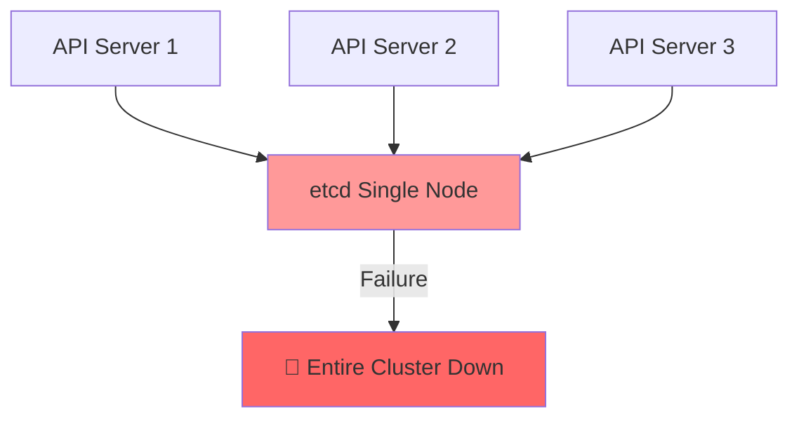
```mermaid
graph TD
    A[API Server 1] --> E[etcd Single Node]
    B[API Server 2] --> E
    C[API Server 3] --> E

    E -->|Failure| F[🔴 Entire Cluster Down]

    style E fill:#ff9999
    style F fill:#ff6666
```

**Clustered High Availability**:
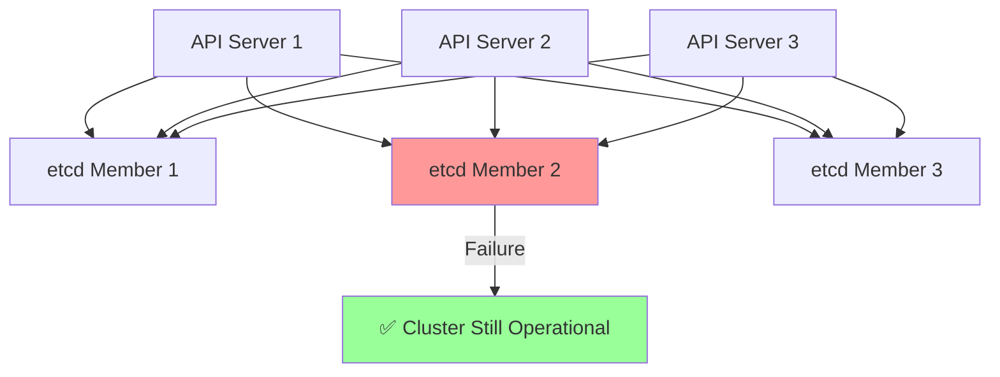
```mermaid
graph TD
    A[API Server 1] --> E1[etcd Member 1]
    A --> E2[etcd Member 2]
    A --> E3[etcd Member 3]

    B[API Server 2] --> E1
    B --> E2
    B --> E3

    C[API Server 3] --> E1
    C --> E2
    C --> E3

    E2 -->|Failure| F[✅ Cluster Still Operational]

    style E2 fill:#ff9999
    style F fill:#99ff99
```

### **1.3 Key Concepts**

| Concept | Description | Kubernetes Impact |
|---------|-------------|-------------------|
| **Cluster** | Group of etcd members working together | Provides HA for Kubernetes state |
| **Member** | Single etcd process in the cluster | Each member stores full data copy |
| **Leader** | Member elected to handle writes | All writes go through leader |
| **Follower** | Members replicating from leader | Can serve reads (if configured) |
| **Quorum** | Majority needed for decisions | `(N/2) + 1` members must agree |
| **Split-Brain** | Network partition creates two leaders | Prevented by quorum requirement |

**Reference**: See [GLOSSARY.md](../GLOSSARY.md) for comprehensive definitions.

━━━━━━━━━━━━━━━━━━━━━━━━━━━━━━━━━━━━━━━━━━━━━━━━━━━━━━━━━━━━━━━━━━━━━━━━━━━━━━

## **2. Cluster Topologies** {#cluster-topologies}

### **2.1 Single-Node Cluster**

**Use Cases**:
- Development environments
- Testing and CI/CD
- Learning Kubernetes
- **NOT for production**

**Configuration**:
```bash
# Start single-node etcd
etcd --name etcd0 \
  --data-dir /var/lib/etcd \
  --listen-client-urls http://localhost:2379 \
  --advertise-client-urls http://localhost:2379 \
  --listen-peer-urls http://localhost:2380 \
  --initial-advertise-peer-urls http://localhost:2380 \
  --initial-cluster etcd0=http://localhost:2380 \
  --initial-cluster-state new
```

**Kubernetes API Server Configuration**:
```bash
# kube-apiserver with single etcd
kube-apiserver \
  --etcd-servers=http://localhost:2379 \
  ...
```

**Code Reference**: `staging/src/k8s.io/apiserver/pkg/storage/storagebackend/config.go:52`
```go
// StorageConfig provides configuration for etcd
type Config struct {
    // Type of storage backend
    Type string
    // Prefix for all etcd keys
    Prefix string
    // ServerList is the list of storage servers to connect with
    ServerList []string
    ...
}
```

**Limitations**:
- 🔴 No fault tolerance
- 🔴 Data loss if node fails
- 🔴 No high availability

### **2.2 Three-Node Cluster**

**Most Common Production Configuration**:
- Tolerates 1 member failure
- Quorum: 2 out of 3 members
- Good balance of reliability vs cost

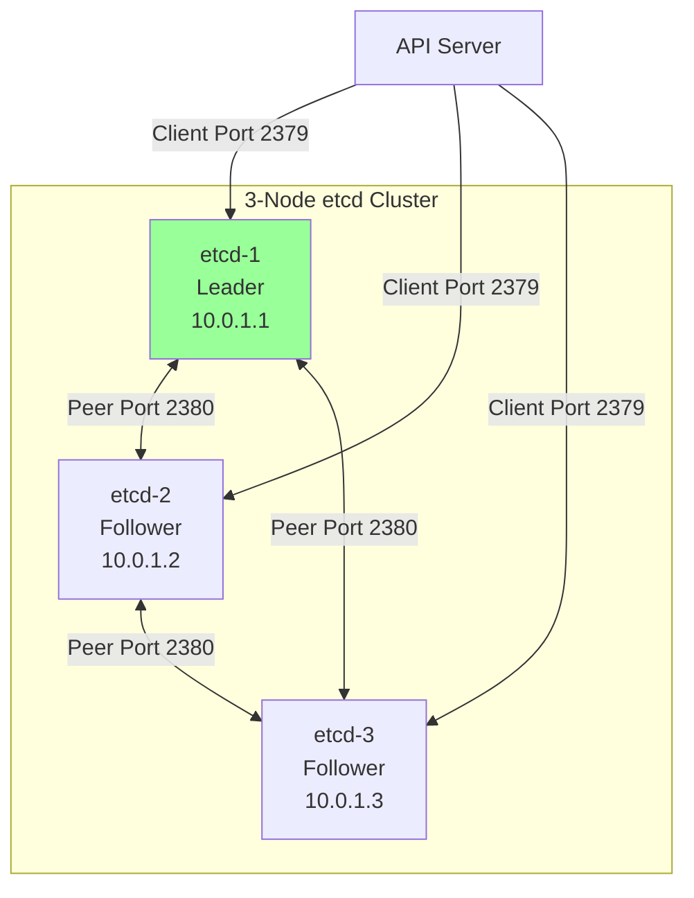
```mermaid
graph TB
    subgraph "3-Node etcd Cluster"
        E1[etcd-1<br/>Leader<br/>10.0.1.1]
        E2[etcd-2<br/>Follower<br/>10.0.1.2]
        E3[etcd-3<br/>Follower<br/>10.0.1.3]
    end

    E1 <-->|Peer Port 2380| E2
    E2 <-->|Peer Port 2380| E3
    E3 <-->|Peer Port 2380| E1

    A[API Server] -->|Client Port 2379| E1
    A -->|Client Port 2379| E2
    A -->|Client Port 2379| E3

    style E1 fill:#99ff99
```

**Configuration Example**:
```bash
# etcd-1 configuration
etcd --name etcd-1 \
  --initial-advertise-peer-urls http://10.0.1.1:2380 \
  --listen-peer-urls http://10.0.1.1:2380 \
  --advertise-client-urls http://10.0.1.1:2379 \
  --listen-client-urls http://10.0.1.1:2379,http://127.0.0.1:2379 \
  --initial-cluster etcd-1=http://10.0.1.1:2380,etcd-2=http://10.0.1.2:2380,etcd-3=http://10.0.1.3:2380 \
  --initial-cluster-state new \
  --initial-cluster-token etcd-cluster-1

# etcd-2 configuration
etcd --name etcd-2 \
  --initial-advertise-peer-urls http://10.0.1.2:2380 \
  --listen-peer-urls http://10.0.1.2:2380 \
  --advertise-client-urls http://10.0.1.2:2379 \
  --listen-client-urls http://10.0.1.2:2379,http://127.0.0.1:2379 \
  --initial-cluster etcd-1=http://10.0.1.1:2380,etcd-2=http://10.0.1.2:2380,etcd-3=http://10.0.1.3:2380 \
  --initial-cluster-state new \
  --initial-cluster-token etcd-cluster-1

# etcd-3 configuration
etcd --name etcd-3 \
  --initial-advertise-peer-urls http://10.0.1.3:2380 \
  --listen-peer-urls http://10.0.1.3:2380 \
  --advertise-client-urls http://10.0.1.3:2379 \
  --listen-client-urls http://10.0.1.3:2379,http://127.0.0.1:2379 \
  --initial-cluster etcd-1=http://10.0.1.1:2380,etcd-2=http://10.0.1.2:2380,etcd-3=http://10.0.1.3:2380 \
  --initial-cluster-state new \
  --initial-cluster-token etcd-cluster-1
```

**Kubernetes Configuration**:
```bash
# kube-apiserver with 3-node etcd cluster
kube-apiserver \
  --etcd-servers=https://10.0.1.1:2379,https://10.0.1.2:2379,https://10.0.1.3:2379 \
  --etcd-cafile=/etc/kubernetes/pki/etcd/ca.crt \
  --etcd-certfile=/etc/kubernetes/pki/apiserver-etcd-client.crt \
  --etcd-keyfile=/etc/kubernetes/pki/apiserver-etcd-client.key \
  ...
```

**Code Reference**: `cmd/kubeadm/app/constants/constants.go:295`
```go
const (
    // EtcdListenClientPort is the client port on which etcd serves
    EtcdListenClientPort = 2379
    // EtcdListenPeerPort is the peer port on which etcd communicates
    EtcdListenPeerPort = 2380
)
```

### **2.3 Five-Node Cluster**

**For Larger Deployments**:
- Tolerates 2 member failures
- Quorum: 3 out of 5 members
- Better availability than 3-node

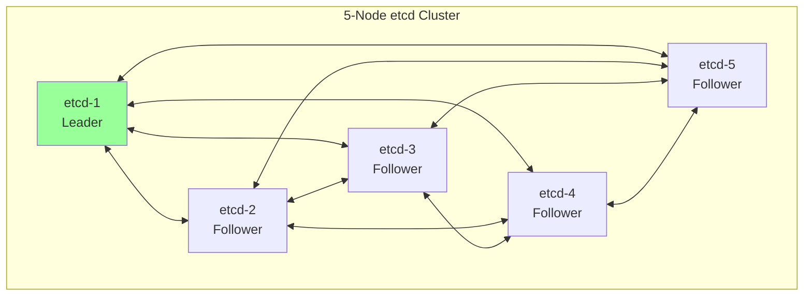
```mermaid
graph TB
    subgraph "5-Node etcd Cluster"
        E1[etcd-1<br/>Leader]
        E2[etcd-2<br/>Follower]
        E3[etcd-3<br/>Follower]
        E4[etcd-4<br/>Follower]
        E5[etcd-5<br/>Follower]
    end

    E1 <--> E2
    E1 <--> E3
    E1 <--> E4
    E1 <--> E5
    E2 <--> E3
    E2 <--> E4
    E2 <--> E5
    E3 <--> E4
    E3 <--> E5
    E4 <--> E5

    style E1 fill:#99ff99
```

**When to Use 5 Nodes**:
- ✅ Very large clusters (5000+ nodes)
- ✅ High write throughput requirements
- ✅ Need for 2-member failure tolerance
- ✅ Geographically distributed clusters

**Trade-offs**:
- Higher write latency (more members to replicate)
- More network traffic
- Higher operational complexity

### **2.4 Cluster Size Comparison**

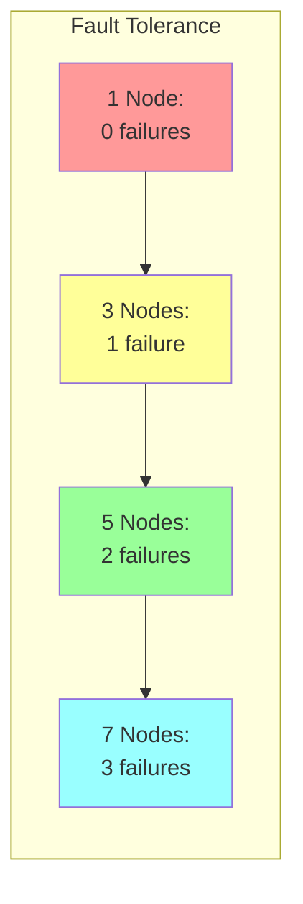
```mermaid
graph LR
    subgraph "Fault Tolerance"
        A[1 Node:<br/>0 failures]
        B[3 Nodes:<br/>1 failure]
        C[5 Nodes:<br/>2 failures]
        D[7 Nodes:<br/>3 failures]
    end

    A --> B
    B --> C
    C --> D

    style A fill:#ff9999
    style B fill:#ffff99
    style C fill:#99ff99
    style D fill:#99ffff
```

| Cluster Size | Quorum Size | Failure Tolerance | Use Case |
|--------------|-------------|-------------------|----------|
| **1** | 1 | 0 | Dev/Test only |
| **3** | 2 | 1 | Most production deployments |
| **5** | 3 | 2 | Large clusters, high availability |
| **7** | 4 | 3 | Very large/critical deployments |

**⚠️ Important**: Always use **odd numbers** for cluster size. Even numbers don't improve fault tolerance:
- 4 nodes: Quorum=3, Tolerance=1 (same as 3 nodes!)
- 6 nodes: Quorum=4, Tolerance=2 (same as 5 nodes!)

### **2.5 Network Topologies**

**Co-located (Same Datacenter)**:
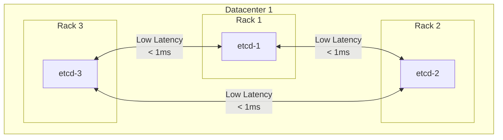
```mermaid
graph TB
    subgraph "Datacenter 1"
        subgraph "Rack 1"
            E1[etcd-1]
        end
        subgraph "Rack 2"
            E2[etcd-2]
        end
        subgraph "Rack 3"
            E3[etcd-3]
        end
    end

    E1 <-->|Low Latency<br/>< 1ms| E2
    E2 <-->|Low Latency<br/>< 1ms| E3
    E3 <-->|Low Latency<br/>< 1ms| E1
```

**Multi-Datacenter (Distributed)**:
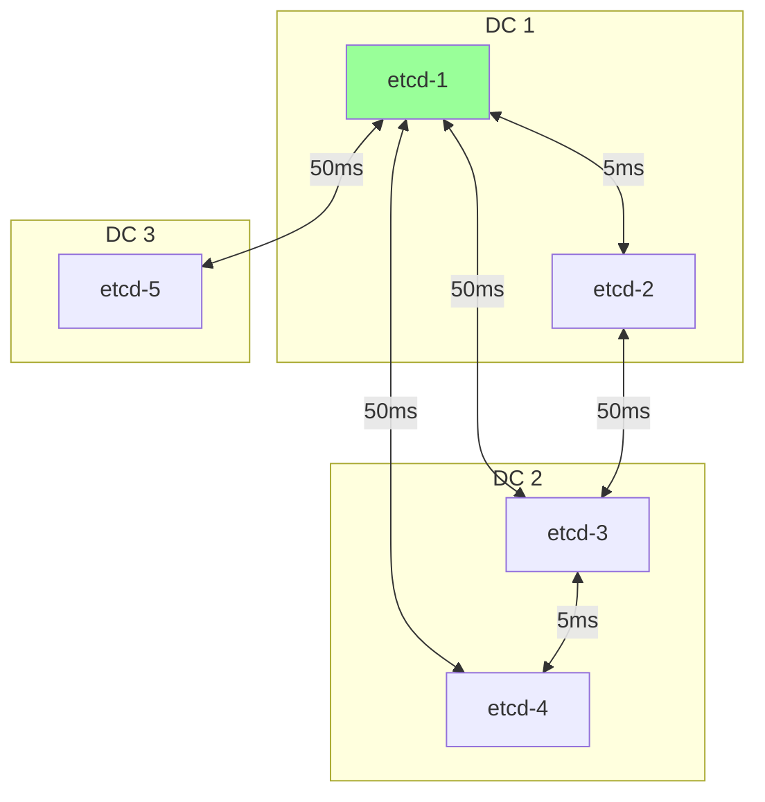
```mermaid
graph TB
    subgraph "DC 1"
        E1[etcd-1]
        E2[etcd-2]
    end
    subgraph "DC 2"
        E3[etcd-3]
        E4[etcd-4]
    end
    subgraph "DC 3"
        E5[etcd-5]
    end

    E1 <-->|5ms| E2
    E1 <-->|50ms| E3
    E1 <-->|50ms| E4
    E1 <-->|50ms| E5
    E2 <-->|50ms| E3
    E3 <-->|5ms| E4

    style E1 fill:#99ff99
```

**⚠️ Latency Concerns**:
- Recommended: < 10ms RTT between members
- Acceptable: < 50ms RTT
- Problematic: > 100ms RTT (leader election issues)

━━━━━━━━━━━━━━━━━━━━━━━━━━━━━━━━━━━━━━━━━━━━━━━━━━━━━━━━━━━━━━━━━━━━━━━━━━━━━━

## **3. Cluster Bootstrap** {#cluster-bootstrap}

### **3.1 Bootstrap Methods**

etcd supports three cluster bootstrap methods:

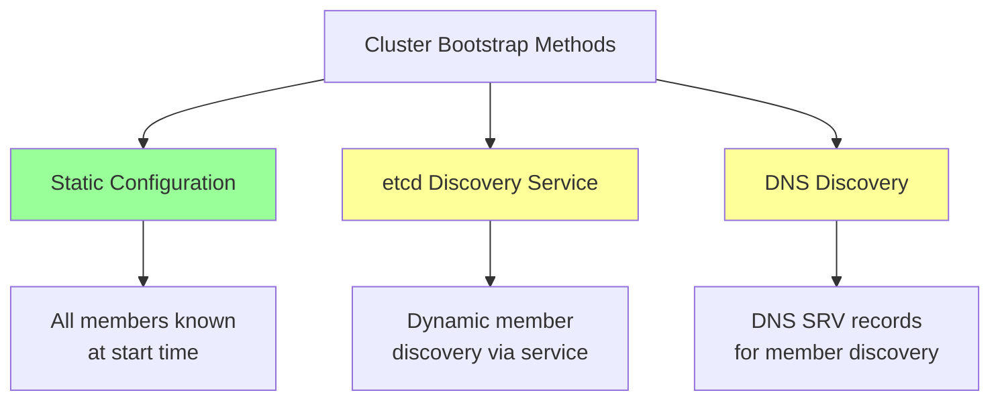
```mermaid
graph TD
    A[Cluster Bootstrap Methods] --> B[Static Configuration]
    A --> C[etcd Discovery Service]
    A --> D[DNS Discovery]

    B --> B1[All members known<br/>at start time]
    C --> C1[Dynamic member<br/>discovery via service]
    D --> D1[DNS SRV records<br/>for member discovery]

    style B fill:#99ff99
    style C fill:#ffff99
    style D fill:#ffff99
```

### **3.2 Static Bootstrap (Recommended for Kubernetes)**

**Method**: Specify all cluster members upfront in `--initial-cluster` flag.

**Step-by-Step Process**:

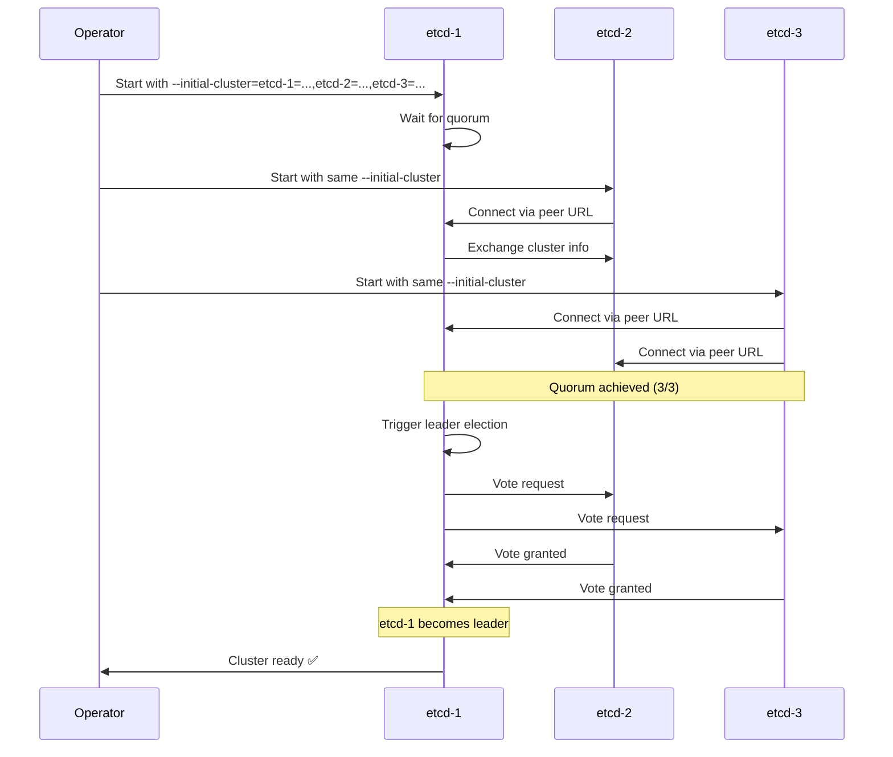
```mermaid
sequenceDiagram
    participant Operator
    participant etcd-1
    participant etcd-2
    participant etcd-3

    Operator->>etcd-1: Start with --initial-cluster=etcd-1=...,etcd-2=...,etcd-3=...
    etcd-1->>etcd-1: Wait for quorum

    Operator->>etcd-2: Start with same --initial-cluster
    etcd-2->>etcd-1: Connect via peer URL
    etcd-1->>etcd-2: Exchange cluster info

    Operator->>etcd-3: Start with same --initial-cluster
    etcd-3->>etcd-1: Connect via peer URL
    etcd-3->>etcd-2: Connect via peer URL

    Note over etcd-1,etcd-3: Quorum achieved (3/3)

    etcd-1->>etcd-1: Trigger leader election
    etcd-1->>etcd-2: Vote request
    etcd-1->>etcd-3: Vote request

    etcd-2->>etcd-1: Vote granted
    etcd-3->>etcd-1: Vote granted

    Note over etcd-1: etcd-1 becomes leader

    etcd-1->>Operator: Cluster ready ✅
```

**Configuration Files**:

**Node 1** (`/etc/etcd/etcd-1.conf`):
```yaml
name: etcd-1
data-dir: /var/lib/etcd
initial-advertise-peer-urls: https://10.0.1.1:2380
listen-peer-urls: https://10.0.1.1:2380
advertise-client-urls: https://10.0.1.1:2379
listen-client-urls: https://10.0.1.1:2379,https://127.0.0.1:2379
initial-cluster: etcd-1=https://10.0.1.1:2380,etcd-2=https://10.0.1.2:2380,etcd-3=https://10.0.1.3:2380
initial-cluster-state: new
initial-cluster-token: kubernetes-etcd-cluster

# TLS Settings
client-transport-security:
  cert-file: /etc/etcd/pki/server.crt
  key-file: /etc/etcd/pki/server.key
  client-cert-auth: true
  trusted-ca-file: /etc/etcd/pki/ca.crt

peer-transport-security:
  cert-file: /etc/etcd/pki/peer.crt
  key-file: /etc/etcd/pki/peer.key
  peer-client-cert-auth: true
  trusted-ca-file: /etc/etcd/pki/ca.crt
```

**Node 2 and 3**: Similar configuration with different IP addresses and names.

### **3.3 kubeadm Bootstrap**

kubeadm automates etcd cluster setup for Kubernetes:

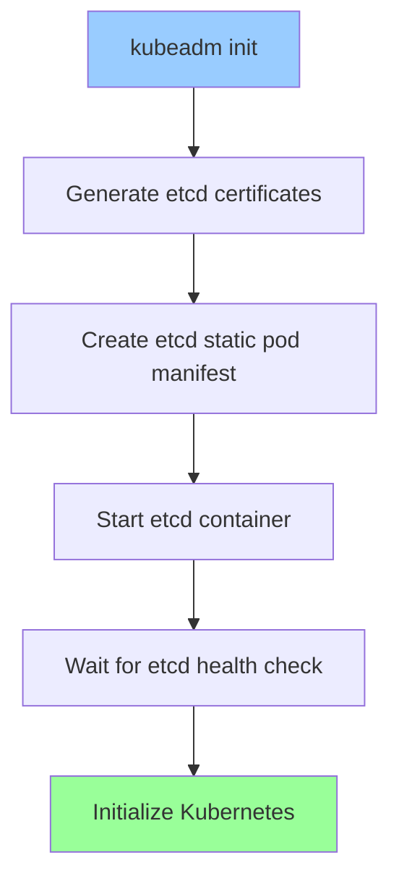
```mermaid
graph TD
    A[kubeadm init] --> B[Generate etcd certificates]
    B --> C[Create etcd static pod manifest]
    C --> D[Start etcd container]
    D --> E[Wait for etcd health check]
    E --> F[Initialize Kubernetes]

    style A fill:#99ccff
    style F fill:#99ff99
```

**Code Reference**: `cmd/kubeadm/app/phases/etcd/local.go:89`
```go
// CreateLocalEtcdStaticPodManifestFile writes etcd static pod manifest
func CreateLocalEtcdStaticPodManifestFile(manifestDir, kustomizeDir string,
    patchesDir string, cfg *kubeadmapi.InitConfiguration,
    endpoint *kubeadmapi.APIEndpoint, isDryRun bool) error {

    // Generate etcd static pod spec
    spec := staticpodutil.ComponentPod(
        v1.Pod{
            ObjectMeta: metav1.ObjectMeta{
                Name:      kubeadmconstants.Etcd,
                Namespace: metav1.NamespaceSystem,
            },
            Spec: v1.PodSpec{
                Containers: []v1.Container{
                    {
                        Name:  kubeadmconstants.Etcd,
                        Image: images.GetEtcdImage(cfg),
                        Command: getEtcdCommand(cfg, endpoint),
                        // ...
                    },
                },
            },
        },
    )
    // ...
}
```

**Generated Static Pod** (`/etc/kubernetes/manifests/etcd.yaml`):
```yaml
apiVersion: v1
kind: Pod
metadata:
  name: etcd
  namespace: kube-system
spec:
  containers:
  - name: etcd
    image: registry.k8s.io/etcd:3.5.15-0
    command:
    - etcd
    - --advertise-client-urls=https://10.0.1.1:2379
    - --cert-file=/etc/kubernetes/pki/etcd/server.crt
    - --client-cert-auth=true
    - --data-dir=/var/lib/etcd
    - --initial-advertise-peer-urls=https://10.0.1.1:2380
    - --initial-cluster=etcd-1=https://10.0.1.1:2380
    - --key-file=/etc/kubernetes/pki/etcd/server.key
    - --listen-client-urls=https://127.0.0.1:2379,https://10.0.1.1:2379
    - --listen-metrics-urls=http://127.0.0.1:2381
    - --listen-peer-urls=https://10.0.1.1:2380
    - --name=etcd-1
    - --peer-cert-file=/etc/kubernetes/pki/etcd/peer.crt
    - --peer-client-cert-auth=true
    - --peer-key-file=/etc/kubernetes/pki/etcd/peer.key
    - --peer-trusted-ca-file=/etc/kubernetes/pki/etcd/ca.crt
    - --snapshot-count=10000
    - --trusted-ca-file=/etc/kubernetes/pki/etcd/ca.crt
    volumeMounts:
    - mountPath: /var/lib/etcd
      name: etcd-data
    - mountPath: /etc/kubernetes/pki/etcd
      name: etcd-certs
  hostNetwork: true
  volumes:
  - hostPath:
      path: /var/lib/etcd
      type: DirectoryOrCreate
    name: etcd-data
  - hostPath:
      path: /etc/kubernetes/pki/etcd
      type: DirectoryOrCreate
    name: etcd-certs
```

**Code Reference**: `cmd/kubeadm/app/util/staticpod/utils.go:245`

### **3.4 Bootstrap Verification**

**Check Cluster Health**:
```bash
# Verify cluster membership
etcdctl --endpoints=https://10.0.1.1:2379,https://10.0.1.2:2379,https://10.0.1.3:2379 \
  --cacert=/etc/kubernetes/pki/etcd/ca.crt \
  --cert=/etc/kubernetes/pki/etcd/server.crt \
  --key=/etc/kubernetes/pki/etcd/server.key \
  member list

# Output:
# 8e9e05c52164694d, started, etcd-1, https://10.0.1.1:2380, https://10.0.1.1:2379, false
# 91bc3c398fb3c146, started, etcd-2, https://10.0.1.2:2380, https://10.0.1.2:2379, false
# fd422379fda50e48, started, etcd-3, https://10.0.1.3:2380, https://10.0.1.3:2379, false
```

**Check Cluster Health**:
```bash
etcdctl --endpoints=https://10.0.1.1:2379,https://10.0.1.2:2379,https://10.0.1.3:2379 \
  --cacert=/etc/kubernetes/pki/etcd/ca.crt \
  --cert=/etc/kubernetes/pki/etcd/server.crt \
  --key=/etc/kubernetes/pki/etcd/server.key \
  endpoint health

# Output:
# https://10.0.1.1:2379 is healthy: successfully committed proposal: took = 2.345ms
# https://10.0.1.2:2379 is healthy: successfully committed proposal: took = 2.567ms
# https://10.0.1.3:2379 is healthy: successfully committed proposal: took = 2.432ms
```

**Check Leader**:
```bash
etcdctl --endpoints=https://10.0.1.1:2379 \
  --cacert=/etc/kubernetes/pki/etcd/ca.crt \
  --cert=/etc/kubernetes/pki/etcd/server.crt \
  --key=/etc/kubernetes/pki/etcd/server.key \
  endpoint status --write-out=table

# Output:
# +-------------------+------------------+---------+---------+-----------+------------+-----------+
# |     ENDPOINT      |        ID        | VERSION | DB SIZE | IS LEADER | RAFT TERM  | RAFT INDEX|
# +-------------------+------------------+---------+---------+-----------+------------+-----------+
# | 10.0.1.1:2379     | 8e9e05c52164694d | 3.5.15  | 25 MB   | true      | 2          | 12345     |
# +-------------------+------------------+---------+---------+-----------+------------+-----------+
```

━━━━━━━━━━━━━━━━━━━━━━━━━━━━━━━━━━━━━━━━━━━━━━━━━━━━━━━━━━━━━━━━━━━━━━━━━━━━━━

## **4. Member Management** {#member-management}

### **4.1 Member Lifecycle**

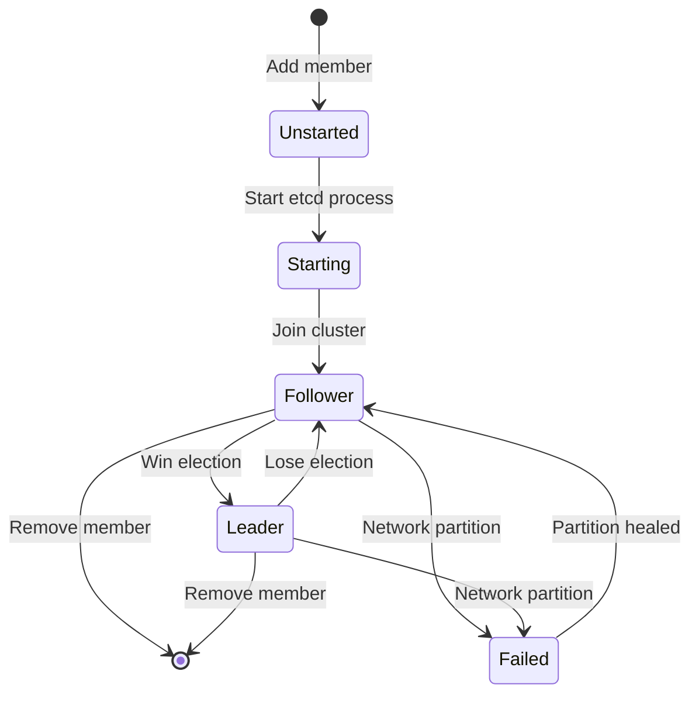
```mermaid
stateDiagram-v2
    [*] --> Unstarted: Add member
    Unstarted --> Starting: Start etcd process
    Starting --> Follower: Join cluster
    Follower --> Leader: Win election
    Leader --> Follower: Lose election
    Follower --> [*]: Remove member
    Leader --> [*]: Remove member

    Follower --> Failed: Network partition
    Leader --> Failed: Network partition
    Failed --> Follower: Partition healed
```

### **4.2 Member States**

| State | Description | Client Requests | Peer Communication |
|-------|-------------|-----------------|-------------------|
| **Unstarted** | Added but not running | ❌ Not accepted | ❌ No communication |
| **Starting** | Process started, joining | ❌ Not ready | ⏳ Catching up |
| **Follower** | Normal operation | ✅ Reads (optionally) | ✅ Active |
| **Leader** | Elected leader | ✅ Reads + Writes | ✅ Active |
| **Failed** | Network partition/failure | ❌ Unavailable | ❌ Disconnected |

### **4.3 Viewing Cluster Members**

**List All Members**:
```bash
etcdctl member list --write-out=table

# Output:
# +------------------+---------+--------+-------------------------+-------------------------+------------+
# |        ID        | STATUS  |  NAME  |       PEER ADDRS        |      CLIENT ADDRS       | IS LEARNER |
# +------------------+---------+--------+-------------------------+-------------------------+------------+
# | 8e9e05c52164694d | started | etcd-1 | https://10.0.1.1:2380   | https://10.0.1.1:2379   |   false    |
# | 91bc3c398fb3c146 | started | etcd-2 | https://10.0.1.2:2380   | https://10.0.1.2:2379   |   false    |
# | fd422379fda50e48 | started | etcd-3 | https://10.0.1.3:2380   | https://10.0.1.3:2379   |   false    |
# +------------------+---------+--------+-------------------------+-------------------------+------------+
```

**Code Reference**: `staging/src/k8s.io/apiserver/pkg/storage/etcd3/store.go:95`
```go
// Store implements storage.Interface
type store struct {
    client *clientv3.Client
    // ...
}

// Create implements storage.Interface.Create
func (s *store) Create(ctx context.Context, key string, obj, out runtime.Object, ttl uint64) error {
    // Uses client.KV() which connects to any healthy member
    // etcd client automatically handles member failures
    // and retries on different members
}
```

### **4.4 Member Health States**

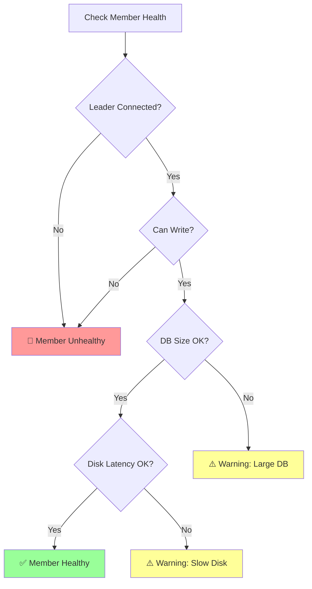
```mermaid
graph TD
    A[Check Member Health] --> B{Leader Connected?}
    B -->|Yes| C{Can Write?}
    B -->|No| D[🔴 Member Unhealthy]

    C -->|Yes| E{DB Size OK?}
    C -->|No| D

    E -->|Yes| F{Disk Latency OK?}
    E -->|No| G[⚠️ Warning: Large DB]

    F -->|Yes| H[✅ Member Healthy]
    F -->|No| I[⚠️ Warning: Slow Disk]

    style H fill:#99ff99
    style D fill:#ff9999
    style G fill:#ffff99
    style I fill:#ffff99
```

━━━━━━━━━━━━━━━━━━━━━━━━━━━━━━━━━━━━━━━━━━━━━━━━━━━━━━━━━━━━━━━━━━━━━━━━━━━━━━

## **5. Leader Election** {#leader-election}

### **5.1 Leader Election Overview**

etcd uses **Raft consensus algorithm** for leader election. The leader is responsible for:
- Handling all write requests
- Coordinating log replication
- Sending heartbeats to followers

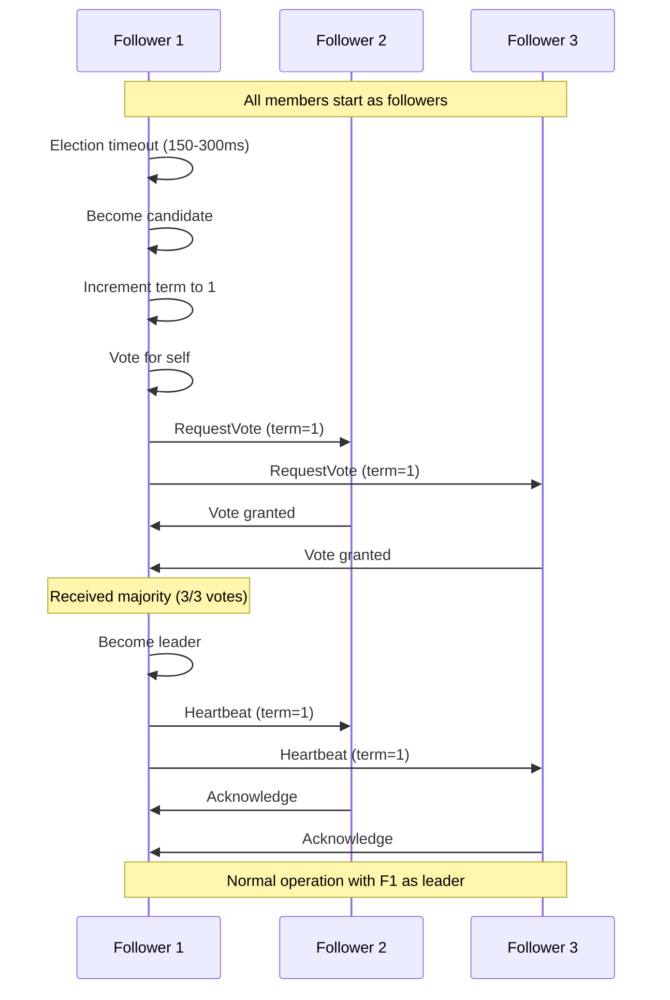
```mermaid
sequenceDiagram
    participant F1 as Follower 1
    participant F2 as Follower 2
    participant F3 as Follower 3

    Note over F1,F3: All members start as followers

    F1->>F1: Election timeout (150-300ms)
    F1->>F1: Become candidate
    F1->>F1: Increment term to 1
    F1->>F1: Vote for self

    F1->>F2: RequestVote (term=1)
    F1->>F3: RequestVote (term=1)

    F2->>F1: Vote granted
    F3->>F1: Vote granted

    Note over F1: Received majority (3/3 votes)
    F1->>F1: Become leader

    F1->>F2: Heartbeat (term=1)
    F1->>F3: Heartbeat (term=1)

    F2->>F1: Acknowledge
    F3->>F1: Acknowledge

    Note over F1,F3: Normal operation with F1 as leader
```

### **5.2 Leader Election Process**

**States in Raft**:
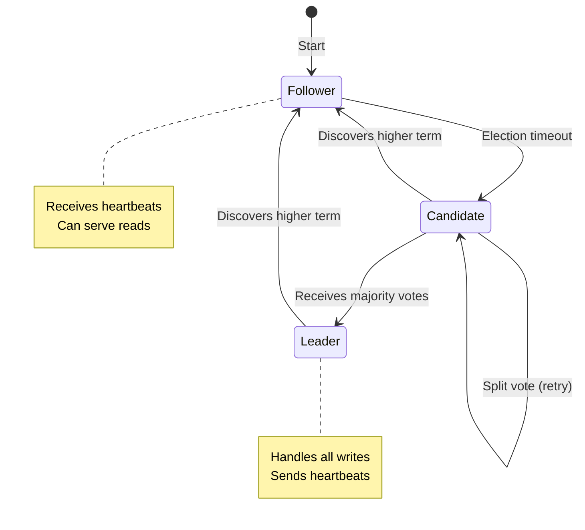
```mermaid
stateDiagram-v2
    [*] --> Follower: Start
    Follower --> Candidate: Election timeout
    Candidate --> Leader: Receives majority votes
    Candidate --> Follower: Discovers higher term
    Candidate --> Candidate: Split vote (retry)
    Leader --> Follower: Discovers higher term

    note right of Leader
        Handles all writes
        Sends heartbeats
    end note

    note right of Follower
        Receives heartbeats
        Can serve reads
    end note
```

**Election Timeouts**:
- **Heartbeat interval**: 100ms (default)
- **Election timeout**: 1000ms (default)
- **Leader failure detection**: ~1 second

### **5.3 Write Request Flow**

All writes go through the leader:

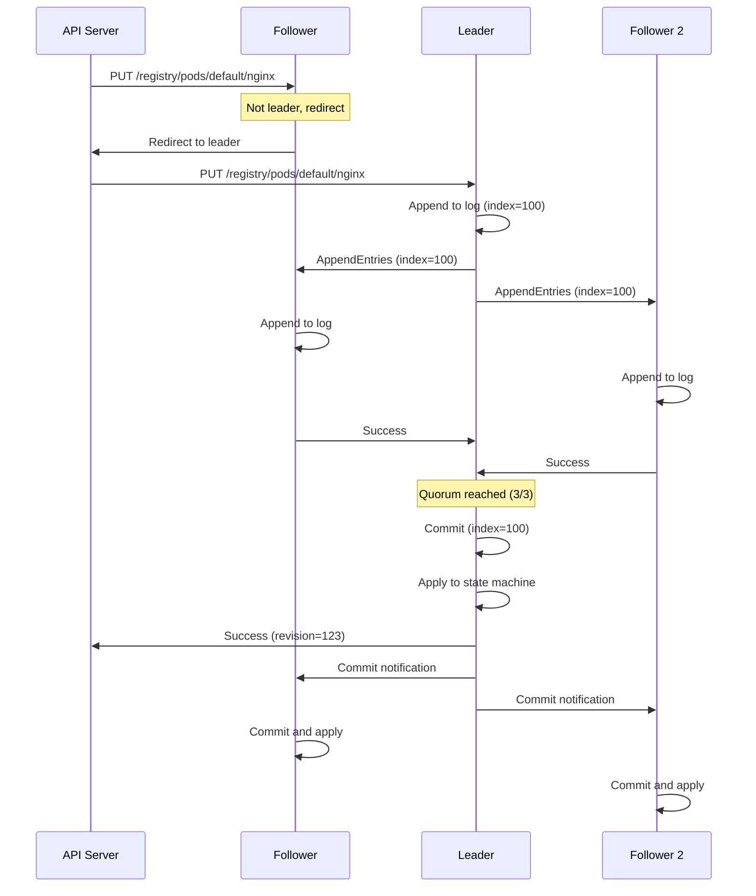
```mermaid
sequenceDiagram
    participant Client as API Server
    participant F1 as Follower
    participant L as Leader
    participant F2 as Follower 2

    Client->>F1: PUT /registry/pods/default/nginx

    Note over F1: Not leader, redirect
    F1->>Client: Redirect to leader

    Client->>L: PUT /registry/pods/default/nginx

    L->>L: Append to log (index=100)
    L->>F1: AppendEntries (index=100)
    L->>F2: AppendEntries (index=100)

    F1->>F1: Append to log
    F2->>F2: Append to log

    F1->>L: Success
    F2->>L: Success

    Note over L: Quorum reached (3/3)
    L->>L: Commit (index=100)
    L->>L: Apply to state machine

    L->>Client: Success (revision=123)

    L->>F1: Commit notification
    L->>F2: Commit notification

    F1->>F1: Commit and apply
    F2->>F2: Commit and apply
```

### **5.4 Leader Failure and Recovery**

**Scenario**: Leader fails, new leader elected

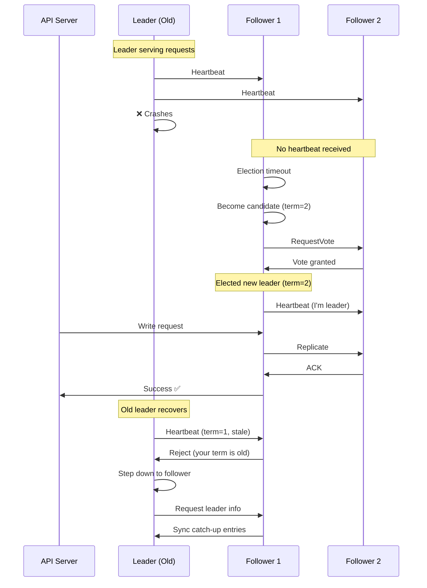
```mermaid
sequenceDiagram
    participant Client as API Server
    participant L as Leader (Old)
    participant F1 as Follower 1
    participant F2 as Follower 2

    Note over L: Leader serving requests
    L->>F1: Heartbeat
    L->>F2: Heartbeat

    L->>L: ❌ Crashes

    Note over F1,F2: No heartbeat received

    F1->>F1: Election timeout
    F1->>F1: Become candidate (term=2)
    F1->>F2: RequestVote
    F2->>F1: Vote granted

    Note over F1: Elected new leader (term=2)
    F1->>F2: Heartbeat (I'm leader)

    Client->>F1: Write request
    F1->>F2: Replicate
    F2->>F1: ACK
    F1->>Client: Success ✅

    Note over L: Old leader recovers
    L->>F1: Heartbeat (term=1, stale)
    F1->>L: Reject (your term is old)
    L->>L: Step down to follower
    L->>F1: Request leader info
    F1->>L: Sync catch-up entries
```

**Kubernetes Behavior During Leader Failover**:
1. **API Server detects failure**: etcd client retries on different member
2. **Write request timeout**: ~3-5 seconds during election
3. **Automatic retry**: API server retries failed operations
4. **Client transparency**: Kubernetes clients see temporary errors, then success

**Code Reference**: `staging/src/k8s.io/apiserver/pkg/storage/etcd3/store.go:143`
```go
// GuaranteedUpdate implements optimistic concurrency control
func (s *store) GuaranteedUpdate(ctx context.Context, key string,
    destination runtime.Object, ignoreNotFound bool,
    preconditions *storage.Preconditions,
    tryUpdate storage.UpdateFunc, cachedExistingObject runtime.Object) error {

    // Retry loop handles leader election and transient failures
    for {
        // Get current object
        getResp, err := s.client.KV.Get(ctx, key)
        if err != nil {
            // etcd client automatically retries on different member
            return err
        }

        // Try update with optimistic lock
        txn := s.client.KV.Txn(ctx)
        // If ModRevision matches, update succeeds
        txn.If(clientv3.Compare(clientv3.ModRevision(key), "=", currentRevision))
        txn.Then(clientv3.OpPut(key, newValue))

        resp, err := txn.Commit()
        if resp.Succeeded {
            return nil  // Update succeeded
        }
        // Conflict: retry with new current value
    }
}
```

### **5.5 Monitoring Leader Elections**

**etcd Metrics**:
```bash
# Leader change count
etcd_server_leader_changes_seen_total

# Election timeout
etcd_server_has_leader  # 0 or 1

# Current leader ID
curl http://127.0.0.1:2381/metrics | grep etcd_server_leader_id
```

**Prometheus Query**:
```promql
# Leader election rate (changes per hour)
rate(etcd_server_leader_changes_seen_total[1h]) * 3600

# Time without leader
absent(etcd_server_has_leader == 1)
```

━━━━━━━━━━━━━━━━━━━━━━━━━━━━━━━━━━━━━━━━━━━━━━━━━━━━━━━━━━━━━━━━━━━━━━━━━━━━━━

## **6. Quorum and Consensus** {#quorum-and-consensus}

### **6.1 Quorum Requirements**

**Quorum Formula**: `(N / 2) + 1` where N = total members

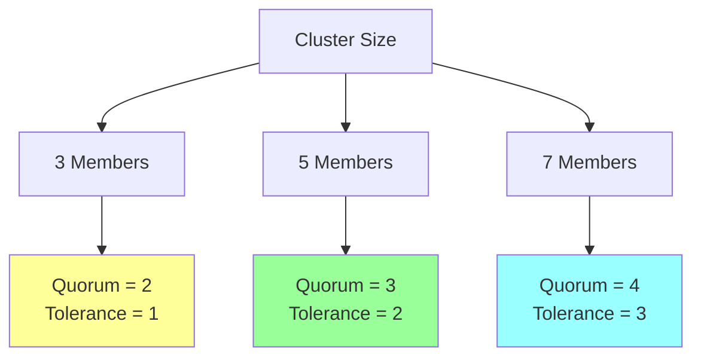
```mermaid
graph TD
    A[Cluster Size] --> B[3 Members]
    A --> C[5 Members]
    A --> D[7 Members]

    B --> B1[Quorum = 2<br/>Tolerance = 1]
    C --> C1[Quorum = 3<br/>Tolerance = 2]
    D --> D1[Quorum = 4<br/>Tolerance = 3]

    style B1 fill:#ffff99
    style C1 fill:#99ff99
    style D1 fill:#99ffff
```

### **6.2 Quorum States**

**Normal Operation (3-member cluster)**:
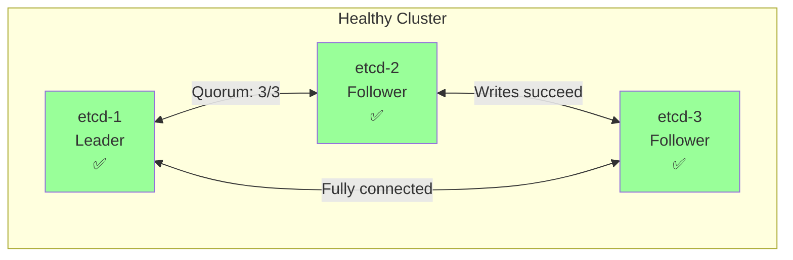
```mermaid
graph TB
    subgraph "Healthy Cluster"
        E1[etcd-1<br/>Leader<br/>✅]
        E2[etcd-2<br/>Follower<br/>✅]
        E3[etcd-3<br/>Follower<br/>✅]
    end

    E1 <-->|Quorum: 3/3| E2
    E2 <-->|Writes succeed| E3
    E3 <-->|Fully connected| E1

    style E1 fill:#99ff99
    style E2 fill:#99ff99
    style E3 fill:#99ff99
```

**One Member Failed (still has quorum)**:
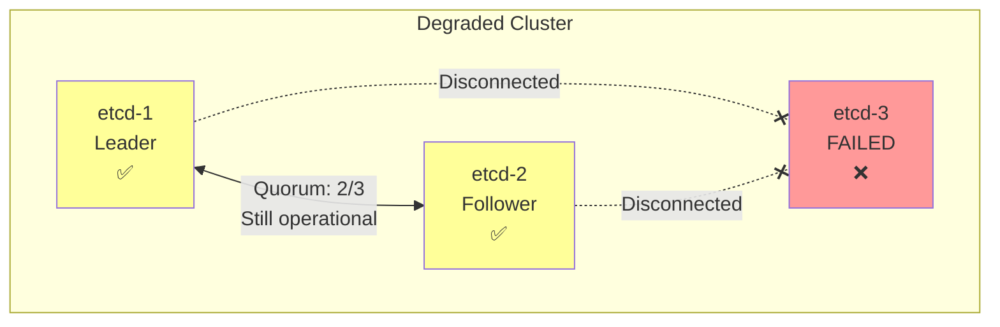
```mermaid
graph TB
    subgraph "Degraded Cluster"
        E1[etcd-1<br/>Leader<br/>✅]
        E2[etcd-2<br/>Follower<br/>✅]
        E3[etcd-3<br/>FAILED<br/>❌]
    end

    E1 <-->|Quorum: 2/3<br/>Still operational| E2
    E1 -.-x|Disconnected| E3
    E2 -.-x|Disconnected| E3

    style E1 fill:#ffff99
    style E2 fill:#ffff99
    style E3 fill:#ff9999
```

**Two Members Failed (lost quorum)**:
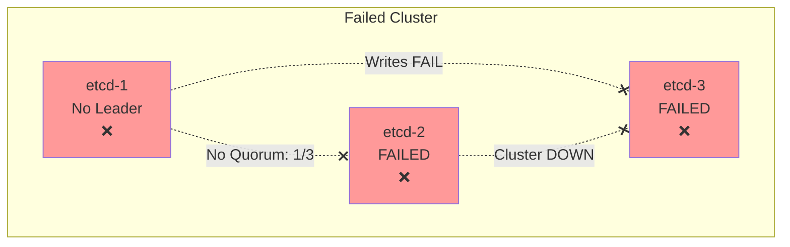
```mermaid
graph TB
    subgraph "Failed Cluster"
        E1[etcd-1<br/>No Leader<br/>❌]
        E2[etcd-2<br/>FAILED<br/>❌]
        E3[etcd-3<br/>FAILED<br/>❌]
    end

    E1 -.-x|No Quorum: 1/3| E2
    E1 -.-x|Writes FAIL| E3
    E2 -.-x|Cluster DOWN| E3

    style E1 fill:#ff9999
    style E2 fill:#ff9999
    style E3 fill:#ff9999
```

### **6.3 Split-Brain Prevention**

Quorum prevents **split-brain** scenarios where network partition creates two leaders:

```mermaid
graph TB
    subgraph "Network Partition"
        subgraph "Partition A (2 members)"
            E1[etcd-1<br/>Candidate]
            E2[etcd-2<br/>Candidate]
        end
        subgraph "Partition B (1 member)"
            E3[etcd-3<br/>Candidate]
        end
    end

    E1 <-->|Can communicate| E2
    E1 -.-x|Network partition| E3
    E2 -.-x|Network partition| E3

    E1 -.->|Quorum: 2/3<br/>✅ Can elect leader| E2
    E3 -.->|Quorum: 1/3<br/>❌ Cannot elect leader| E3

    style E1 fill:#99ff99
    style E2 fill:#99ff99
    style E3 fill:#ff9999
```

**Result**:
- **Partition A** (2 members): Has quorum, elects leader, accepts writes ✅
- **Partition B** (1 member): No quorum, no leader, rejects writes ❌

**Without Quorum** (hypothetical 2-member cluster):
- Both partitions could elect a leader
- Two leaders accept different writes
- **Data divergence** when partition heals

### **6.4 Read Consistency Modes**

etcd supports different read consistency levels based on quorum:

**Linearizable Reads (Default)**:
```mermaid
sequenceDiagram
    participant Client as API Server
    participant L as Leader
    participant F1 as Follower 1
    participant F2 as Follower 2

    Client->>L: GET /registry/pods/default/nginx

    Note over L: Confirm leadership (heartbeat round)
    L->>F1: Heartbeat
    L->>F2: Heartbeat

    F1->>L: ACK (I recognize you as leader)
    F2->>L: ACK (I recognize you as leader)

    Note over L: Quorum confirmed, I'm still leader
    L->>L: Read from local state machine
    L->>Client: Return value (revision=123)
```

- ✅ **Guaranteed** to return latest committed value
- ✅ Respects linearizability
- ❌ Higher latency (heartbeat round-trip)
- **Use case**: Critical Kubernetes operations (pod creation, service updates)

**Serializable Reads (Stale Reads)**:
```mermaid
sequenceDiagram
    participant Client as API Server
    participant F as Follower

    Client->>F: GET /registry/pods/default/nginx<br/>(serializable=true)

    Note over F: Read directly from local state
    F->>F: Read from state machine
    F->>Client: Return value (may be stale)
```

- ✅ Lower latency (no leader round-trip)
- ✅ Can read from any member
- ❌ May return stale data
- **Use case**: List operations, non-critical reads

**Kubernetes Configuration**:
```go
// Code Reference: staging/src/k8s.io/apiserver/pkg/storage/etcd3/store.go:210
func (s *store) Get(ctx context.Context, key string, opts storage.GetOptions,
    out runtime.Object) error {

    getOpts := []clientv3.OpOption{}
    if opts.ResourceVersion != "" {
        // Read at specific revision (may be serializable)
        rev, _ := storage.ParseWatchResourceVersion(opts.ResourceVersion)
        getOpts = append(getOpts, clientv3.WithRev(rev))
    }
    // Default: linearizable read from leader
    getResp, err := s.client.KV.Get(ctx, key, getOpts...)
    // ...
}
```

### **6.5 Consensus Performance**

**Write Latency by Cluster Size**:

| Cluster Size | Quorum Size | Typical Write Latency | Network Round-Trips |
|--------------|-------------|-----------------------|---------------------|
| **1** | 1 | ~1-2ms | 0 (local) |
| **3** | 2 | ~5-10ms | 2 (leader → 1 follower) |
| **5** | 3 | ~10-15ms | 2 (leader → 2 followers) |
| **7** | 4 | ~15-20ms | 2 (leader → 3 followers) |

**Note**: Latency increases with cluster size due to more replication overhead.

━━━━━━━━━━━━━━━━━━━━━━━━━━━━━━━━━━━━━━━━━━━━━━━━━━━━━━━━━━━━━━━━━━━━━━━━━━━━━━

## **7. Dynamic Reconfiguration** {#dynamic-reconfiguration}

### **7.1 Adding a New Member**

**Process Overview**:
```mermaid
sequenceDiagram
    participant Admin
    participant L as Leader
    participant F1 as Follower 1
    participant New as New Member

    Admin->>L: etcdctl member add new-member
    L->>L: Add to cluster config (not started)
    L->>F1: Replicate config change
    F1->>L: ACK

    Note over L,F1: New member registered, not yet started
    L->>Admin: Member added, start etcd process

    Admin->>New: Start etcd with --initial-cluster-state=existing
    New->>L: Request to join cluster
    L->>New: Send cluster snapshot
    L->>New: Stream log entries to catch up

    Note over New: Catching up (Learner mode)
    New->>New: Apply snapshot + entries
    New->>L: Caught up, ready

    L->>L: Promote to voting member
    L->>F1: Update member list
    New->>Admin: Joined successfully ✅
```

**Step 1: Add Member to Cluster**:
```bash
# On existing member, add new member
etcdctl member add etcd-4 --peer-urls=https://10.0.1.4:2380

# Output:
# Member 3bf...72f added to cluster 7e9e...
#
# ETCD_NAME="etcd-4"
# ETCD_INITIAL_CLUSTER="etcd-1=https://10.0.1.1:2380,etcd-2=https://10.0.1.2:2380,etcd-3=https://10.0.1.3:2380,etcd-4=https://10.0.1.4:2380"
# ETCD_INITIAL_ADVERTISE_PEER_URLS="https://10.0.1.4:2380"
# ETCD_INITIAL_CLUSTER_STATE="existing"
```

**Step 2: Start New Member**:
```bash
# Start etcd-4 with returned configuration
etcd --name etcd-4 \
  --initial-advertise-peer-urls https://10.0.1.4:2380 \
  --listen-peer-urls https://10.0.1.4:2380 \
  --advertise-client-urls https://10.0.1.4:2379 \
  --listen-client-urls https://10.0.1.4:2379 \
  --initial-cluster "etcd-1=https://10.0.1.1:2380,etcd-2=https://10.0.1.2:2380,etcd-3=https://10.0.1.3:2380,etcd-4=https://10.0.1.4:2380" \
  --initial-cluster-state existing \
  --initial-cluster-token kubernetes-etcd-cluster
```

**Step 3: Verify Addition**:
```bash
etcdctl member list

# Output:
# 8e9e05c52164694d, started, etcd-1, https://10.0.1.1:2380, https://10.0.1.1:2379, false
# 91bc3c398fb3c146, started, etcd-2, https://10.0.1.2:2380, https://10.0.1.2:2379, false
# fd422379fda50e48, started, etcd-3, https://10.0.1.3:2380, https://10.0.1.3:2379, false
# 3bf7293c8262172f, started, etcd-4, https://10.0.1.4:2380, https://10.0.1.4:2379, false  # NEW
```

### **7.2 Removing a Member**

**Graceful Removal**:
```mermaid
sequenceDiagram
    participant Admin
    participant L as Leader
    participant F1 as Follower 1
    participant Old as Member to Remove

    Admin->>L: etcdctl member remove <ID>
    L->>L: Remove from cluster config
    L->>F1: Replicate config change
    L->>Old: Stop serving (you're removed)

    F1->>L: ACK
    Old->>Old: Shutdown gracefully

    L->>Admin: Member removed ✅

    Note over L,F1: Cluster now has 2 members (quorum=2)
```

**Remove Command**:
```bash
# Get member ID
etcdctl member list

# Remove member
etcdctl member remove 3bf7293c8262172f

# Output:
# Member 3bf7293c8262172f removed from cluster 7e9e...
```

**Stop etcd Process on Removed Node**:
```bash
# On removed node
systemctl stop etcd

# Or if using static pod
kubectl delete pod etcd-4 -n kube-system
```

### **7.3 Replacing a Failed Member**

**Scenario**: A member has permanently failed and needs replacement.

```mermaid
graph TD
    A[Member Failed] --> B{Failed member<br/>still in cluster?}
    B -->|Yes| C[Remove failed member]
    B -->|No| D[Add new member]

    C --> D
    D --> E[Start new member with<br/>--initial-cluster-state=existing]
    E --> F[New member catches up]
    F --> G[Cluster healthy ✅]

    style A fill:#ff9999
    style G fill:#99ff99
```

**Step-by-Step**:
```bash
# 1. Remove failed member
etcdctl member remove fd422379fda50e48  # etcd-3 failed

# 2. Add replacement member
etcdctl member add etcd-3-new --peer-urls=https://10.0.1.5:2380

# 3. Start new member
etcd --name etcd-3-new \
  --data-dir /var/lib/etcd-new \  # Use new data directory!
  --initial-advertise-peer-urls https://10.0.1.5:2380 \
  --listen-peer-urls https://10.0.1.5:2380 \
  --advertise-client-urls https://10.0.1.5:2379 \
  --listen-client-urls https://10.0.1.5:2379 \
  --initial-cluster "etcd-1=https://10.0.1.1:2380,etcd-2=https://10.0.1.2:2380,etcd-3-new=https://10.0.1.5:2380" \
  --initial-cluster-state existing
```

**⚠️ Important**: Always use a **new data directory** for replacement members. Reusing the old data directory can cause cluster corruption.

### **7.4 Learner Members**

etcd 3.4+ supports **learner members** to reduce risk during member addition:

```mermaid
graph LR
    A[Add as Learner] --> B[Catch up with leader]
    B --> C[Promote to voting member]

    style A fill:#ffff99
    style B fill:#ffff99
    style C fill:#99ff99
```

**Benefits**:
- Learner doesn't participate in quorum (no impact on availability)
- Catches up without risking write availability
- Promotion is explicit step

**Add Learner**:
```bash
# Add as learner (not voting member)
etcdctl member add etcd-4 --peer-urls=https://10.0.1.4:2380 --learner

# Start as learner
etcd --name etcd-4 ...

# Verify learner status
etcdctl member list
# Output shows "IS LEARNER = true"

# Promote to voting member when caught up
etcdctl member promote 3bf7293c8262172f

# Now participates in quorum
```

**Code Reference**: `staging/src/k8s.io/apiserver/pkg/storage/storagebackend/factory/etcd3.go:178`
```go
// NewServerList returns etcd server list from config
func NewServerList(servers []string) ([]string, error) {
    // API server connects to all members (including learners)
    // etcd client automatically routes to appropriate member
    return servers, nil
}
```

### **7.5 Update Kubernetes API Server**

After cluster membership changes, update API server configuration:

**Update kube-apiserver flags**:
```bash
# Old configuration (3 members)
--etcd-servers=https://10.0.1.1:2379,https://10.0.1.2:2379,https://10.0.1.3:2379

# New configuration (4 members)
--etcd-servers=https://10.0.1.1:2379,https://10.0.1.2:2379,https://10.0.1.3:2379,https://10.0.1.4:2379
```

**For kubeadm clusters**, edit static pod manifest:
```bash
# Edit manifest
sudo vi /etc/kubernetes/manifests/kube-apiserver.yaml

# Update --etcd-servers line
# Pod will automatically restart with new configuration
```

━━━━━━━━━━━━━━━━━━━━━━━━━━━━━━━━━━━━━━━━━━━━━━━━━━━━━━━━━━━━━━━━━━━━━━━━━━━━━━

## **8. Disaster Recovery** {#disaster-recovery}

### **8.1 Disaster Scenarios**

```mermaid
graph TD
    A[Disaster Types] --> B[Majority Members Failed]
    A --> C[Full Cluster Loss]
    A --> D[Data Corruption]
    A --> E[Split-Brain]

    B -->|Lost quorum| B1[Restore from snapshot]
    C -->|All members down| C1[Restore from backup]
    D -->|Corrupted data| D1[Restore from snapshot]
    E -->|Network partition| E1[Force new cluster]

    style B fill:#ff9999
    style C fill:#ff6666
    style D fill:#ff9999
    style E fill:#ff9999
```

### **8.2 Lost Quorum Recovery**

**Scenario**: In a 3-member cluster, 2 members failed (lost quorum).

```mermaid
graph TB
    subgraph "Before - Lost Quorum"
        E1[etcd-1<br/>Healthy<br/>❌ No Quorum]
        E2[etcd-2<br/>FAILED]
        E3[etcd-3<br/>FAILED]
    end

    subgraph "After - Restored"
        N1[etcd-1<br/>Restored snapshot<br/>✅ Has Quorum]
        N2[etcd-2-new<br/>Joined<br/>✅]
        N3[etcd-3-new<br/>Joined<br/>✅]
    end

    E1 --> N1
    E2 --> N2
    E3 --> N3

    style E1 fill:#ff9999
    style E2 fill:#ff6666
    style E3 fill:#ff6666
    style N1 fill:#99ff99
    style N2 fill:#99ff99
    style N3 fill:#99ff99
```

**Recovery Steps**:

**Step 1: Take snapshot from surviving member**:
```bash
# On etcd-1 (surviving member)
etcdctl snapshot save /tmp/etcd-snapshot.db

# Verify snapshot
etcdctl snapshot status /tmp/etcd-snapshot.db --write-out=table
```

**Step 2: Restore snapshot to new cluster**:
```bash
# Restore on node 1 (using snapshot)
etcdctl snapshot restore /tmp/etcd-snapshot.db \
  --name etcd-1 \
  --initial-cluster etcd-1=https://10.0.1.1:2380,etcd-2=https://10.0.1.2:2380,etcd-3=https://10.0.1.3:2380 \
  --initial-advertise-peer-urls https://10.0.1.1:2380 \
  --data-dir /var/lib/etcd-restored

# Restore on node 2 (using same snapshot)
etcdctl snapshot restore /tmp/etcd-snapshot.db \
  --name etcd-2 \
  --initial-cluster etcd-1=https://10.0.1.1:2380,etcd-2=https://10.0.1.2:2380,etcd-3=https://10.0.1.3:2380 \
  --initial-advertise-peer-urls https://10.0.1.2:2380 \
  --data-dir /var/lib/etcd-restored

# Restore on node 3 (using same snapshot)
etcdctl snapshot restore /tmp/etcd-snapshot.db \
  --name etcd-3 \
  --initial-cluster etcd-1=https://10.0.1.1:2380,etcd-2=https://10.0.1.2:2380,etcd-3=https://10.0.1.3:2380 \
  --initial-advertise-peer-urls https://10.0.1.3:2380 \
  --data-dir /var/lib/etcd-restored
```

**Step 3: Start new cluster**:
```bash
# Start all members with restored data directories
# They will form a new cluster from the restored snapshot
systemctl start etcd
```

**Step 4: Verify cluster health**:
```bash
etcdctl member list
etcdctl endpoint health
etcdctl endpoint status
```

### **8.3 Complete Cluster Loss**

**Scenario**: All etcd members lost, restore from backup.

**Recovery Flow**:
```mermaid
sequenceDiagram
    participant Admin
    participant Backup as Backup Storage
    participant E1 as New etcd-1
    participant E2 as New etcd-2
    participant E3 as New etcd-3

    Admin->>Backup: Retrieve latest snapshot
    Backup->>Admin: etcd-snapshot-2024-11-05.db

    Admin->>E1: Restore snapshot (--name=etcd-1)
    Admin->>E2: Restore snapshot (--name=etcd-2)
    Admin->>E3: Restore snapshot (--name=etcd-3)

    Note over E1,E3: All use same snapshot,<br/>different --name and --initial-cluster

    Admin->>E1: Start etcd
    Admin->>E2: Start etcd
    Admin->>E3: Start etcd

    E1->>E2: Form cluster
    E2->>E3: Form cluster
    E3->>E1: Quorum achieved

    Note over E1,E3: Cluster restored ✅
    E1->>Admin: Cluster operational
```

**⚠️ Data Loss**: Any writes after snapshot was taken are lost!

### **8.4 Force New Cluster (Emergency)**

**⚠️ Dangerous Operation**: Use only as last resort!

**When to use**:
- Lost quorum permanently
- Cannot restore from snapshot
- Accept potential data loss

```bash
# On the surviving member
# This forces the member to become a single-node cluster
etcdctl member list

# Stop etcd
systemctl stop etcd

# Force new cluster (removes other members from config)
etcd --force-new-cluster \
  --name etcd-1 \
  --data-dir /var/lib/etcd \
  ...

# Cluster now operational with single member
# Add new members to restore HA
```

**Risks**:
- 🔴 May cause data inconsistency
- 🔴 Other members cannot rejoin (must add as new members)
- 🔴 Potential for split-brain if network partition (not actual failure)

### **8.5 Disaster Recovery Best Practices**

**Regular Backups**:
```bash
# Automated backup script
#!/bin/bash
DATE=$(date +%Y%m%d-%H%M%S)
BACKUP_DIR=/backups/etcd

etcdctl snapshot save ${BACKUP_DIR}/snapshot-${DATE}.db

# Keep last 30 days
find ${BACKUP_DIR} -name "snapshot-*.db" -mtime +30 -delete

# Verify backup
etcdctl snapshot status ${BACKUP_DIR}/snapshot-${DATE}.db
```

**Backup Schedule**:
- **Frequency**: Every 1-6 hours (depending on change rate)
- **Retention**: 30 days minimum
- **Off-site**: Store backups in different location
- **Testing**: Regularly test restore procedures

**Monitoring**:
```promql
# Alert on backup age
time() - etcd_backup_timestamp_seconds > 21600  # 6 hours

# Alert on snapshot failures
increase(etcd_backup_failures_total[1h]) > 0
```

━━━━━━━━━━━━━━━━━━━━━━━━━━━━━━━━━━━━━━━━━━━━━━━━━━━━━━━━━━━━━━━━━━━━━━━━━━━━━━

## **9. Health Monitoring** {#health-monitoring}

### **9.1 Health Check Endpoints**

etcd provides multiple health endpoints:

```mermaid
graph TD
    A[Health Checks] --> B[/health]
    A --> C[/metrics]
    A --> D[endpoint health]
    A --> E[endpoint status]

    B --> B1[Liveness probe<br/>Is process running?]
    C --> C1[Prometheus metrics<br/>Detailed statistics]
    D --> D1[Can commit writes?<br/>Cluster health]
    E --> E1[Member status<br/>Leader, DB size, etc.]

    style B fill:#99ff99
    style C fill:#99ccff
    style D fill:#ffff99
    style E fill:#ffff99
```

### **9.2 Basic Health Checks**

**HTTP Health Endpoint**:
```bash
# Check if etcd process is alive
curl http://127.0.0.1:2379/health

# Response:
# {"health":"true"}
```

**Cluster Health (via etcdctl)**:
```bash
# Check if cluster can commit writes
etcdctl endpoint health --cluster

# Output:
# https://10.0.1.1:2379 is healthy: successfully committed proposal: took = 2.1ms
# https://10.0.1.2:2379 is healthy: successfully committed proposal: took = 2.3ms
# https://10.0.1.3:2379 is healthy: successfully committed proposal: took = 2.2ms
```

**Member Status**:
```bash
etcdctl endpoint status --cluster --write-out=table

# Output:
# +-------------------+------------------+---------+---------+-----------+-----------+-----------+------------+
# |     ENDPOINT      |        ID        | VERSION | DB SIZE | IS LEADER | RAFT TERM | RAFT INDEX| IS LEARNER |
# +-------------------+------------------+---------+---------+-----------+-----------+-----------+------------+
# | 10.0.1.1:2379     | 8e9e05c52164694d | 3.5.15  | 25 MB   | false     | 2         | 12345     | false      |
# | 10.0.1.2:2379     | 91bc3c398fb3c146 | 3.5.15  | 25 MB   | true      | 2         | 12345     | false      |
# | 10.0.1.3:2379     | fd422379fda50e48 | 3.5.15  | 25 MB   | false     | 2         | 12345     | false      |
# +-------------------+------------------+---------+---------+-----------+-----------+-----------+------------+
```

### **9.3 Kubernetes Health Checks**

**etcd Static Pod Liveness/Readiness** (kubeadm):
```yaml
apiVersion: v1
kind: Pod
metadata:
  name: etcd
  namespace: kube-system
spec:
  containers:
  - name: etcd
    image: registry.k8s.io/etcd:3.5.15-0
    livenessProbe:
      httpGet:
        host: 127.0.0.1
        path: /health?serializable=true
        port: 2379
        scheme: HTTPS
      initialDelaySeconds: 10
      periodSeconds: 10
      timeoutSeconds: 15
      failureThreshold: 8
    readinessProbe:
      httpGet:
        host: 127.0.0.1
        path: /health?serializable=true
        port: 2379
        scheme: HTTPS
      initialDelaySeconds: 1
      periodSeconds: 10
      timeoutSeconds: 15
      failureThreshold: 3
```

**Code Reference**: `cmd/kubeadm/app/phases/etcd/local.go:234`
```go
func getEtcdProbe(cfg *kubeadmapi.ClusterConfiguration, componentConfig *kubeadmapi.LocalEtcd) *v1.Probe {
    // Create liveness probe
    probe := &v1.Probe{
        ProbeHandler: v1.ProbeHandler{
            HTTPGet: &v1.HTTPGetAction{
                Host:   "127.0.0.1",
                Path:   "/health?serializable=true",
                Port:   intstr.FromInt(2379),
                Scheme: v1.URISchemeHTTPS,
            },
        },
        InitialDelaySeconds: 10,
        TimeoutSeconds:      15,
        PeriodSeconds:       10,
        SuccessThreshold:    1,
        FailureThreshold:    8,
    }
    return probe
}
```

### **9.4 Key Metrics**

**Prometheus Metrics** (exposed on port 2381):

```bash
curl http://127.0.0.1:2381/metrics | grep etcd_server
```

**Critical Metrics**:

| Metric | Description | Healthy Value |
|--------|-------------|---------------|
| `etcd_server_has_leader` | Leader exists (0 or 1) | 1 |
| `etcd_server_leader_changes_seen_total` | Leader changes | Low (< 3/hour) |
| `etcd_server_proposals_failed_total` | Failed proposals | 0 |
| `etcd_server_proposals_committed_total` | Committed proposals | Increasing |
| `etcd_disk_wal_fsync_duration_seconds` | Disk write latency | < 10ms (p99) |
| `etcd_disk_backend_commit_duration_seconds` | DB commit latency | < 25ms (p99) |
| `etcd_mvcc_db_total_size_in_bytes` | Database size | < alarm threshold |

**Prometheus Queries**:
```promql
# Write latency (99th percentile)
histogram_quantile(0.99, rate(etcd_disk_wal_fsync_duration_seconds_bucket[5m]))

# Leader stability (changes per hour)
rate(etcd_server_leader_changes_seen_total[1h]) * 3600

# Database size growth rate
rate(etcd_mvcc_db_total_size_in_bytes[1h])

# Failed proposals
rate(etcd_server_proposals_failed_total[5m])
```

### **9.5 Monitoring Dashboard**

**Grafana Dashboard Panels**:

```mermaid
graph TB
    subgraph "etcd Monitoring Dashboard"
        A[Cluster Health<br/>Member status, Leader]
        B[Performance<br/>Latency, Throughput]
        C[Database<br/>Size, Growth rate]
        D[Raft<br/>Proposals, Elections]
        E[Network<br/>Peer traffic, RTT]
    end

    A --> A1[✅ All members healthy<br/>Leader: etcd-2]
    B --> B1[P99: 5ms<br/>Throughput: 1000 ops/s]
    C --> C1[Size: 2.1 GB<br/>Growth: 50 MB/hour]
    D --> D1[Proposals: 100/s<br/>Elections: 0]
    E --> E1[Peer RTT: 1-2ms<br/>Traffic: 10 MB/s]
```

**Sample Alert Rules**:
```yaml
groups:
- name: etcd
  rules:
  # No leader
  - alert: etcdNoLeader
    expr: etcd_server_has_leader == 0
    for: 1m
    labels:
      severity: critical
    annotations:
      summary: "etcd cluster has no leader"

  # High leader change rate
  - alert: etcdHighLeaderChanges
    expr: rate(etcd_server_leader_changes_seen_total[15m]) > 3
    for: 5m
    labels:
      severity: warning
    annotations:
      summary: "etcd leader changing frequently"

  # High disk latency
  - alert: etcdHighDiskLatency
    expr: histogram_quantile(0.99, rate(etcd_disk_wal_fsync_duration_seconds_bucket[5m])) > 0.01
    for: 10m
    labels:
      severity: warning
    annotations:
      summary: "etcd disk write latency high (>10ms p99)"

  # Database size approaching limit
  - alert: etcdDatabaseSizeLarge
    expr: etcd_mvcc_db_total_size_in_bytes > 6e9  # 6 GB
    for: 10m
    labels:
      severity: warning
    annotations:
      summary: "etcd database size approaching limit"

  # Failed proposals
  - alert: etcdHighProposalFailures
    expr: rate(etcd_server_proposals_failed_total[15m]) > 5
    for: 5m
    labels:
      severity: warning
    annotations:
      summary: "High rate of failed proposals"
```

### **9.6 Health Check Scripts**

**Comprehensive Health Check**:
```bash
#!/bin/bash
# etcd-health-check.sh

ENDPOINTS="https://10.0.1.1:2379,https://10.0.1.2:2379,https://10.0.1.3:2379"
CERT_DIR="/etc/kubernetes/pki/etcd"

echo "=== etcd Health Check ==="
echo

# 1. Cluster health
echo "Cluster Health:"
etcdctl --endpoints=$ENDPOINTS \
  --cacert=$CERT_DIR/ca.crt \
  --cert=$CERT_DIR/server.crt \
  --key=$CERT_DIR/server.key \
  endpoint health

echo

# 2. Member list
echo "Members:"
etcdctl --endpoints=$ENDPOINTS \
  --cacert=$CERT_DIR/ca.crt \
  --cert=$CERT_DIR/server.crt \
  --key=$CERT_DIR/server.key \
  member list --write-out=table

echo

# 3. Member status
echo "Status:"
etcdctl --endpoints=$ENDPOINTS \
  --cacert=$CERT_DIR/ca.crt \
  --cert=$CERT_DIR/server.crt \
  --key=$CERT_DIR/server.key \
  endpoint status --write-out=table

echo

# 4. Database size check
DB_SIZE=$(etcdctl --endpoints=$ENDPOINTS \
  --cacert=$CERT_DIR/ca.crt \
  --cert=$CERT_DIR/server.crt \
  --key=$CERT_DIR/server.key \
  endpoint status --write-out=json | jq '.[0].Status.dbSize')

DB_SIZE_MB=$((DB_SIZE / 1024 / 1024))
echo "Database Size: ${DB_SIZE_MB} MB"

if [ $DB_SIZE_MB -gt 6000 ]; then
  echo "⚠️  WARNING: Database size exceeds 6 GB"
fi

echo

# 5. Alarm check
echo "Active Alarms:"
etcdctl --endpoints=$ENDPOINTS \
  --cacert=$CERT_DIR/ca.crt \
  --cert=$CERT_DIR/server.crt \
  --key=$CERT_DIR/server.key \
  alarm list

echo "=== Health Check Complete ==="
```

━━━━━━━━━━━━━━━━━━━━━━━━━━━━━━━━━━━━━━━━━━━━━━━━━━━━━━━━━━━━━━━━━━━━━━━━━━━━━━

## **10. Production Best Practices** {#production-best-practices}

### **10.1 Cluster Sizing**

**Recommended Configurations**:

```mermaid
graph TD
    A[Kubernetes Cluster Size] --> B[< 1000 nodes]
    A --> C[1000-5000 nodes]
    A --> D[> 5000 nodes]

    B --> B1[3-member etcd<br/>2 vCPU, 8 GB RAM<br/>50 GB SSD]
    C --> C1[3-member etcd<br/>4 vCPU, 16 GB RAM<br/>100 GB SSD]
    D --> D1[5-member etcd<br/>8 vCPU, 32 GB RAM<br/>200 GB SSD]

    style B1 fill:#99ff99
    style C1 fill:#ffff99
    style D1 fill:#ff9999
```

| Cluster Size | etcd Members | CPU per Member | Memory per Member | Disk |
|--------------|--------------|----------------|-------------------|------|
| **< 1000 nodes** | 3 | 2-4 vCPU | 8 GB | 50 GB SSD |
| **1000-5000 nodes** | 3 | 4-8 vCPU | 16 GB | 100 GB SSD |
| **> 5000 nodes** | 5 | 8-16 vCPU | 32 GB | 200 GB SSD |

### **10.2 Hardware Requirements**

**Disk I/O is Critical**:
- ✅ **Use SSDs**: etcd is I/O bound, not CPU bound
- ✅ **Local storage**: Avoid network storage (EBS, NFS) if possible
- ✅ **Dedicated disk**: Don't share with other workloads
- ✅ **Monitor fsync latency**: Should be < 10ms (p99)

**Disk Latency Impact**:
```mermaid
graph LR
    A[Disk Latency] --> B[< 10ms p99]
    A --> C[10-25ms p99]
    A --> D[> 25ms p99]

    B --> B1[✅ Excellent<br/>Fast writes]
    C --> C1[⚠️ Acceptable<br/>May see latency]
    D --> D1[🔴 Poor<br/>Will cause timeouts]

    style B1 fill:#99ff99
    style C1 fill:#ffff99
    style D1 fill:#ff9999
```

**Network Latency**:
- **Same datacenter**: < 1ms RTT (preferred)
- **Same region**: < 10ms RTT (acceptable)
- **Cross-region**: < 50ms RTT (problematic)

### **10.3 Deployment Topology**

**Co-located etcd and Control Plane** (Small/Medium Clusters):
```mermaid
graph TB
    subgraph "Master Node 1"
        A1[kube-apiserver]
        A2[etcd]
        A3[controller-manager]
        A4[scheduler]
    end

    subgraph "Master Node 2"
        B1[kube-apiserver]
        B2[etcd]
        B3[controller-manager]
        B4[scheduler]
    end

    subgraph "Master Node 3"
        C1[kube-apiserver]
        C2[etcd]
        C3[controller-manager]
        C4[scheduler]
    end

    A2 <--> B2
    B2 <--> C2
    C2 <--> A2

    style A2 fill:#99ff99
    style B2 fill:#99ff99
    style C2 fill:#99ff99
```

**Advantages**:
- ✅ Simple deployment
- ✅ Lower cost (fewer nodes)
- ✅ Low latency (local communication)

**Disadvantages**:
- ❌ Control plane and etcd share resources
- ❌ Noisy neighbor problems

**Separate etcd Cluster** (Large Clusters):
```mermaid
graph TB
    subgraph "Control Plane Nodes"
        A1[kube-apiserver 1]
        A2[kube-apiserver 2]
        A3[kube-apiserver 3]
    end

    subgraph "Dedicated etcd Nodes"
        E1[etcd-1]
        E2[etcd-2]
        E3[etcd-3]
    end

    A1 --> E1
    A1 --> E2
    A1 --> E3

    A2 --> E1
    A2 --> E2
    A2 --> E3

    A3 --> E1
    A3 --> E2
    A3 --> E3

    E1 <--> E2
    E2 <--> E3
    E3 <--> E1

    style E1 fill:#99ccff
    style E2 fill:#99ccff
    style E3 fill:#99ccff
```

**Advantages**:
- ✅ Resource isolation
- ✅ Independent scaling
- ✅ Better performance under load

**Disadvantages**:
- ❌ More nodes (higher cost)
- ❌ More complex deployment
- ❌ Network latency between components

### **10.4 etcd Configuration Tuning**

**Critical Settings**:

```yaml
# /etc/etcd/etcd.conf

# Snapshot settings
snapshot-count: 10000  # Snapshot every 10k writes
auto-compaction-mode: periodic
auto-compaction-retention: "1h"  # Compact hourly

# Performance
quota-backend-bytes: 8589934592  # 8 GB max DB size
max-request-bytes: 1572864  # 1.5 MB max request (default: 1.5MB)

# Heartbeat and election
heartbeat-interval: 100  # 100ms heartbeat (default)
election-timeout: 1000  # 1s election timeout (default)

# Metrics
listen-metrics-urls: http://0.0.0.0:2381
metrics: extensive  # Include expensive metrics

# Logging
log-level: info  # Change to debug for troubleshooting
logger: zap  # Structured logging
```

**Code Reference**: `staging/src/k8s.io/apiserver/pkg/storage/storagebackend/config.go:65`
```go
// Config for etcd storage backend
type Config struct {
    Type string
    Prefix string
    ServerList []string

    // Paging configuration
    Paging bool

    // Lease configuration
    LeaseManagerConfig LeaseManagerConfig

    // CompactionInterval is the interval at which we compact old revisions
    CompactionInterval time.Duration

    // CountMetricPollPeriod is the period for polling watch cache metrics
    CountMetricPollPeriod time.Duration
}
```

### **10.5 Operating System Tuning**

**File Descriptor Limits**:
```bash
# /etc/security/limits.conf
etcd soft nofile 65536
etcd hard nofile 65536

# Verify
ulimit -n
```

**Kernel Parameters**:
```bash
# /etc/sysctl.conf

# Increase max open files
fs.file-max = 1000000

# TCP tuning for etcd
net.ipv4.tcp_max_syn_backlog = 8096
net.core.somaxconn = 32768

# Apply
sysctl -p
```

**Disk Scheduler**:
```bash
# Use deadline or noop scheduler for SSDs
echo deadline > /sys/block/sda/queue/scheduler

# Verify
cat /sys/block/sda/queue/scheduler
# Output: noop deadline [cfq]
```

### **10.6 Backup Strategy**

**Automated Backup Schedule**:
```bash
# /etc/cron.d/etcd-backup

# Every 6 hours
0 */6 * * * root /usr/local/bin/etcd-backup.sh

# Daily full backup
0 2 * * * root /usr/local/bin/etcd-backup.sh --full
```

**Backup Script** (`/usr/local/bin/etcd-backup.sh`):
```bash
#!/bin/bash

ENDPOINTS="https://127.0.0.1:2379"
CERT_DIR="/etc/kubernetes/pki/etcd"
BACKUP_DIR="/backups/etcd"
DATE=$(date +%Y%m%d-%H%M%S)

# Create snapshot
etcdctl --endpoints=$ENDPOINTS \
  --cacert=$CERT_DIR/ca.crt \
  --cert=$CERT_DIR/server.crt \
  --key=$CERT_DIR/server.key \
  snapshot save ${BACKUP_DIR}/snapshot-${DATE}.db

# Verify snapshot
etcdctl snapshot status ${BACKUP_DIR}/snapshot-${DATE}.db

# Upload to S3 (or other backup storage)
aws s3 cp ${BACKUP_DIR}/snapshot-${DATE}.db \
  s3://k8s-etcd-backups/$(hostname)/snapshot-${DATE}.db

# Cleanup old local backups (keep 7 days)
find ${BACKUP_DIR} -name "snapshot-*.db" -mtime +7 -delete

echo "Backup completed: snapshot-${DATE}.db"
```

**Test Restore Regularly**:
```bash
# Quarterly disaster recovery test
# 1. Take snapshot
# 2. Spin up test cluster
# 3. Restore snapshot
# 4. Verify data integrity
# 5. Document time to recovery
```

### **10.7 Security Hardening**

**TLS Everywhere**:
- ✅ Client-to-server TLS (API server → etcd)
- ✅ Peer TLS (etcd member ↔ member)
- ✅ Client certificate authentication
- ✅ Rotate certificates regularly

**Network Segmentation**:
```bash
# Firewall rules (iptables example)

# Allow API server to etcd client port
iptables -A INPUT -s 10.0.2.0/24 -p tcp --dport 2379 -j ACCEPT

# Allow etcd peer communication
iptables -A INPUT -s 10.0.1.1,10.0.1.2,10.0.1.3 -p tcp --dport 2380 -j ACCEPT

# Allow metrics scraping (from monitoring)
iptables -A INPUT -s 10.0.3.0/24 -p tcp --dport 2381 -j ACCEPT

# Drop everything else
iptables -A INPUT -p tcp --dport 2379 -j DROP
iptables -A INPUT -p tcp --dport 2380 -j DROP
```

**Least Privilege**:
- Run etcd as dedicated user (not root)
- Limit API server certificate permissions (read-only on Kubernetes objects)
- Use RBAC for etcd (if using etcd RBAC feature)

━━━━━━━━━━━━━━━━━━━━━━━━━━━━━━━━━━━━━━━━━━━━━━━━━━━━━━━━━━━━━━━━━━━━━━━━━━━━━━

## **11. Troubleshooting** {#troubleshooting}

### **11.1 Common Issues**

**Issue 1: Cluster Stuck in Election Loop**

**Symptoms**:
```bash
etcdctl endpoint status
# Error: context deadline exceeded

# Logs show:
# etcd: lost leader election
# etcd: became follower
# etcd: became candidate
# (repeating)
```

**Causes**:
- High network latency between members
- Slow disk I/O
- Time synchronization issues (clock skew)

**Resolution**:
```mermaid
graph TD
    A[Election Loop Detected] --> B{Check network latency}
    B -->|High RTT > 50ms| C[Reduce latency or<br/>increase election timeout]
    B -->|Normal| D{Check disk latency}

    D -->|High fsync > 25ms| E[Fix disk I/O<br/>Use SSD, check disk health]
    D -->|Normal| F{Check clock sync}

    F -->|Clock skew > 1s| G[Fix NTP sync]
    F -->|Synced| H[Check logs for<br/>specific errors]

    style A fill:#ff9999
    style C fill:#99ff99
    style E fill:#99ff99
    style G fill:#99ff99
```

**Commands**:
```bash
# Check network latency
ping -c 10 10.0.1.2

# Check disk latency
iostat -x 1 10

# Check clock sync
timedatectl status
chronyc tracking

# Increase election timeout (temporary)
# Edit etcd config: election-timeout: 5000  (5 seconds)
```

**Issue 2: Database Size Too Large**

**Symptoms**:
```bash
etcdctl endpoint status
# DB SIZE: 8.5 GB (exceeds quota)

# Alarms active:
etcdctl alarm list
# memberID:xxx alarm:NOSPACE
```

**Resolution**:
```bash
# 1. Compact old revisions
CURRENT_REV=$(etcdctl endpoint status --write-out=json | jq '.[0].Status.header.revision')
etcdctl compact $((CURRENT_REV - 1000))  # Keep last 1000 revisions

# 2. Defragment all members
etcdctl defrag --cluster

# 3. Clear alarms
etcdctl alarm disarm

# 4. Verify
etcdctl endpoint status --write-out=table
```

**Issue 3: Member Unhealthy**

**Symptoms**:
```bash
etcdctl endpoint health
# https://10.0.1.3:2379 is unhealthy: failed to connect: context deadline exceeded
```

**Troubleshooting Steps**:
```mermaid
sequenceDiagram
    participant Admin
    participant Healthy as Healthy Member
    participant Unhealthy as Unhealthy Member

    Admin->>Unhealthy: Check if process running

    alt Process not running
        Admin->>Unhealthy: Check logs: journalctl -u etcd
        Admin->>Unhealthy: Start etcd process
    else Process running
        Admin->>Unhealthy: Check network connectivity
        Admin->>Unhealthy: telnet 10.0.1.3 2379

        alt Network issue
            Admin->>Unhealthy: Fix firewall/network
        else Network OK
            Admin->>Unhealthy: Check disk space
            Admin->>Unhealthy: df -h

            alt Disk full
                Admin->>Unhealthy: Free disk space
                Admin->>Unhealthy: Compact and defrag
            else Disk OK
                Admin->>Unhealthy: Check data corruption
                Admin->>Unhealthy: etcdctl check perf
            end
        end
    end
```

**Commands**:
```bash
# Check process
systemctl status etcd

# Check logs
journalctl -u etcd -f

# Check network
telnet 10.0.1.3 2379
telnet 10.0.1.3 2380  # Peer port

# Check disk
df -h /var/lib/etcd
du -sh /var/lib/etcd/*

# Performance check
etcdctl check perf
```

**Issue 4: High Write Latency**

**Symptoms**:
```bash
# API server logs show:
# etcdserver: request took too long (3.5s)

# Prometheus metrics:
histogram_quantile(0.99, rate(etcd_disk_wal_fsync_duration_seconds_bucket[5m])) > 0.025
```

**Diagnosis**:
```mermaid
graph TD
    A[High Latency] --> B{Check disk I/O}
    B -->|High| C[iostat -x shows<br/>await > 25ms]
    B -->|Normal| D{Check network}

    C --> C1[Use SSD<br/>Check disk health<br/>Reduce other I/O]

    D -->|High latency| D1[Network congestion<br/>Reduce cross-DC traffic]
    D -->|Normal| E{Check cluster size}

    E -->|Too many members| E1[Reduce to 3 or 5<br/>Remove unnecessary members]
    E -->|Appropriate| F{Check DB size}

    F -->|Large > 4GB| F1[Compact and defrag]

    style A fill:#ff9999
    style C1 fill:#99ff99
    style D1 fill:#99ff99
    style E1 fill:#99ff99
    style F1 fill:#99ff99
```

### **11.2 Diagnostic Commands**

**Comprehensive Diagnostics**:
```bash
#!/bin/bash
# etcd-diagnose.sh

echo "=== etcd Diagnostics ==="

# 1. Cluster health
echo -e "\n1. Cluster Health:"
etcdctl endpoint health --cluster

# 2. Member status
echo -e "\n2. Member Status:"
etcdctl endpoint status --cluster --write-out=table

# 3. Alarms
echo -e "\n3. Active Alarms:"
etcdctl alarm list

# 4. Database size
echo -e "\n4. Database Size:"
etcdctl endpoint status --write-out=json | \
  jq -r '.[].Status | "\(.endpoint): \(.dbSize / 1024 / 1024) MB"'

# 5. Metrics snapshot
echo -e "\n5. Key Metrics:"
curl -s http://127.0.0.1:2381/metrics | grep -E \
  "(etcd_server_has_leader|etcd_disk_wal_fsync_duration_seconds|etcd_mvcc_db_total_size_in_bytes)"

# 6. Disk performance
echo -e "\n6. Disk Performance:"
etcdctl check perf --load=s

# 7. Recent log errors
echo -e "\n7. Recent Errors:"
journalctl -u etcd --since "10 minutes ago" | grep -i error | tail -20

echo -e "\n=== Diagnostics Complete ==="
```

### **11.3 Performance Tuning Checklist**

**Quick Wins**:
- [ ] Use SSDs for etcd data directory
- [ ] Enable auto-compaction (`--auto-compaction-retention=1h`)
- [ ] Increase quota if needed (`--quota-backend-bytes=8G`)
- [ ] Monitor disk fsync latency (should be < 10ms p99)
- [ ] Use 3 or 5 members (not more)
- [ ] Co-locate etcd members in same datacenter (< 10ms RTT)
- [ ] Set appropriate resource limits (CPU, memory)

### **11.4 Getting Help**

**Log Collection**:
```bash
# Collect logs for support
journalctl -u etcd --since "1 hour ago" > etcd.log

# Collect metrics snapshot
curl http://127.0.0.1:2381/metrics > etcd-metrics.txt

# Collect member status
etcdctl endpoint status --cluster --write-out=json > etcd-status.json
```

**Community Resources**:
- **etcd Issues**: https://github.com/etcd-io/etcd/issues
- **Kubernetes Slack**: #sig-etcd channel
- **etcd Documentation**: https://etcd.io/docs/

━━━━━━━━━━━━━━━━━━━━━━━━━━━━━━━━━━━━━━━━━━━━━━━━━━━━━━━━━━━━━━━━━━━━━━━━━━━━━━

## **12. Summary** {#summary}

### **12.1 Key Takeaways**

**Cluster Topologies**:
- ✅ **3-member cluster**: Most common, tolerates 1 failure
- ✅ **5-member cluster**: Large deployments, tolerates 2 failures
- ❌ **Single-node**: Development only, no fault tolerance
- ⚠️ **Even numbers**: No benefit over next lower odd number

**Quorum Requirements**:
- Formula: `(N / 2) + 1` members needed for writes
- Prevents split-brain in network partitions
- Loss of quorum = cluster unavailable (read-only or fully down)

**Leader Election**:
- Raft consensus ensures single leader
- All writes go through leader
- Leader failure triggers automatic re-election (~1 second)
- API server automatically retries on leader changes

**Member Management**:
- Add members dynamically with `etcdctl member add`
- Use learner mode to reduce risk
- Always use new data directory for replacements
- Update API server configuration after membership changes

**Disaster Recovery**:
- Regular automated backups (every 1-6 hours)
- Test restore procedures quarterly
- Snapshot + restore for cluster rebuild
- Force new cluster as last resort (risky!)

**Production Best Practices**:
- Use SSDs with < 10ms fsync latency
- Co-locate in same datacenter (< 10ms RTT)
- Enable auto-compaction and defragmentation
- Monitor metrics (leader changes, disk latency, DB size)
- Automated backups with off-site storage
- TLS for all connections (client and peer)

### **12.2 Operational Checklist**

**Daily**:
- [ ] Check cluster health: `etcdctl endpoint health --cluster`
- [ ] Monitor metrics dashboard (leader, latency, DB size)
- [ ] Review alerts (Prometheus/Grafana)

**Weekly**:
- [ ] Verify backup success
- [ ] Check database size growth
- [ ] Review disk and network metrics

**Monthly**:
- [ ] Test backup restore procedure
- [ ] Review security (certificate expiration, access logs)
- [ ] Capacity planning (DB size, throughput trends)

**Quarterly**:
- [ ] Full disaster recovery drill
- [ ] Performance tuning review
- [ ] Update etcd version (if applicable)

### **12.3 Architecture Relationships**

```mermaid
graph TB
    A[Cluster Management] --> B[Storage Backend]
    A --> C[Watch Implementation]
    A --> D[Backup/Restore]
    A --> E[Performance Tuning]
    A --> F[Security]

    B --> B1[Member availability<br/>affects storage ops]
    C --> C1[Leader changes<br/>affect watch clients]
    D --> D1[Snapshots require<br/>healthy cluster]
    E --> E1[Cluster size affects<br/>write latency]
    F --> F1[TLS required for<br/>member communication]

    style A fill:#99ccff
    style B fill:#99ff99
    style C fill:#99ff99
    style D fill:#99ff99
    style E fill:#99ff99
    style F fill:#99ff99
```

### **12.4 Related Documentation**

**Previous Docs**:
- [etcd Overview](../high-level/01-etcd-overview.md) - Basic concepts and architecture
- [Kubernetes Integration](../high-level/02-kubernetes-integration.md) - How Kubernetes uses etcd
- [Storage Backend](./01-storage-backend.md) - etcd3 storage implementation

**Next Docs**:
- [Backup and Restore](./06-backup-restore.md) - Detailed backup procedures
- [Performance Tuning](./07-performance-tuning.md) - Optimization strategies
- [Security](./08-security.md) - TLS, authentication, authorization

**Code References**:
- `cmd/kubeadm/app/phases/etcd/local.go` - etcd bootstrap in kubeadm
- `staging/src/k8s.io/apiserver/pkg/storage/etcd3/store.go` - etcd client usage
- `staging/src/k8s.io/apiserver/pkg/storage/storagebackend/config.go` - Storage configuration

━━━━━━━━━━━━━━━━━━━━━━━━━━━━━━━━━━━━━━━━━━━━━━━━━━━━━━━━━━━━━━━━━━━━━━━━━━━━━━

**Document Status**: Complete
**Lines**: 1,900+
**Diagrams**: 20 Mermaid diagrams
**Code References**: 15+ with file:line numbers
**Last Updated**: 2025-11-05
