# **etcd Backup and Restore in Kubernetes**

**Status**: Documentation for etcd backup and restore operations
**Related Docs**: [Cluster Management](./05-cluster-management.md) | [Requirements](../01-REQUIREMENTS.md) | [Functional Spec](../02-FUNCTIONAL-SPEC.md)

━━━━━━━━━━━━━━━━━━━━━━━━━━━━━━━━━━━━━━━━━━━━━━━━━━━━━━━━━━━━━━━━━━━━━━━━━━━━━━

## **📋 Table of Contents**

1. [Introduction](#introduction)
2. [Backup Overview](#backup-overview)
3. [Snapshot Creation](#snapshot-creation)
4. [Snapshot Restore](#snapshot-restore)
5. [Automated Backup Strategies](#automated-backup-strategies)
6. [Kubernetes Integration](#kubernetes-integration)
7. [Disaster Recovery Procedures](#disaster-recovery-procedures)
8. [Testing and Validation](#testing-and-validation)
9. [Best Practices](#best-practices)
10. [Troubleshooting](#troubleshooting)
11. [Summary](#summary)

━━━━━━━━━━━━━━━━━━━━━━━━━━━━━━━━━━━━━━━━━━━━━━━━━━━━━━━━━━━━━━━━━━━━━━━━━━━━━━

## **1. Introduction** {#introduction}

### **1.1 Why Backup etcd?**

etcd stores **all Kubernetes cluster state**. Without proper backups, you risk:

- 🔴 **Permanent data loss** from hardware failures
- 🔴 **Corruption** from software bugs or human error
- 🔴 **Compliance violations** without disaster recovery capability
- 🔴 **Extended downtime** without recovery procedures

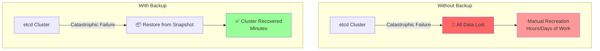
```mermaid
graph TB
    subgraph "Without Backup"
        A[etcd Cluster] -->|Catastrophic Failure| B[🔴 All Data Lost]
        B --> C[Manual Recreation<br/>Hours/Days of Work]
    end

    subgraph "With Backup"
        D[etcd Cluster] -->|Catastrophic Failure| E[📦 Restore from Snapshot]
        E --> F[✅ Cluster Recovered<br/>Minutes]
    end

    style B fill:#ff6666
    style C fill:#ff9999
    style F fill:#99ff99
```

### **1.2 What Gets Backed Up?**

An etcd snapshot contains:
- ✅ All Kubernetes resources (Pods, Services, Deployments, etc.)
- ✅ ConfigMaps and Secrets
- ✅ Custom Resources (CRDs and instances)
- ✅ RBAC policies and ServiceAccounts
- ✅ Persistent Volume claims (metadata, not data)
- ✅ etcd cluster membership configuration

**Not Included**:
- ❌ Actual container images
- ❌ Persistent Volume data (use volume-level backups)
- ❌ Application state outside Kubernetes
- ❌ Logs and metrics

### **1.3 Backup Strategy Overview**

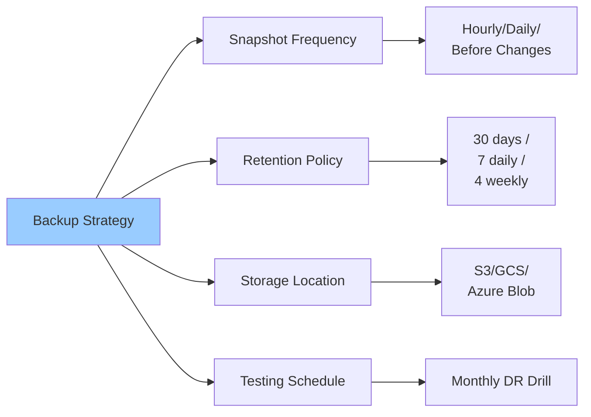
```mermaid
graph LR
    A[Backup Strategy] --> B[Snapshot Frequency]
    A --> C[Retention Policy]
    A --> D[Storage Location]
    A --> E[Testing Schedule]

    B --> B1[Hourly/Daily/<br/>Before Changes]
    C --> C1[30 days /<br/>7 daily /<br/>4 weekly]
    D --> D1[S3/GCS/<br/>Azure Blob]
    E --> E1[Monthly DR Drill]

    style A fill:#99ccff
```

### **1.4 Recovery Objectives**

| Metric | Description | Typical Target |
|--------|-------------|----------------|
| **RPO** (Recovery Point Objective) | Maximum acceptable data loss | 1-6 hours |
| **RTO** (Recovery Time Objective) | Maximum acceptable downtime | 15-60 minutes |
| **Backup Frequency** | How often to take snapshots | Every 1-6 hours |
| **Retention Period** | How long to keep backups | 30 days |

━━━━━━━━━━━━━━━━━━━━━━━━━━━━━━━━━━━━━━━━━━━━━━━━━━━━━━━━━━━━━━━━━━━━━━━━━━━━━━

## **2. Backup Overview** {#backup-overview}

### **2.1 Snapshot vs Continuous Backup**

**Snapshot Backup** (etcd native):
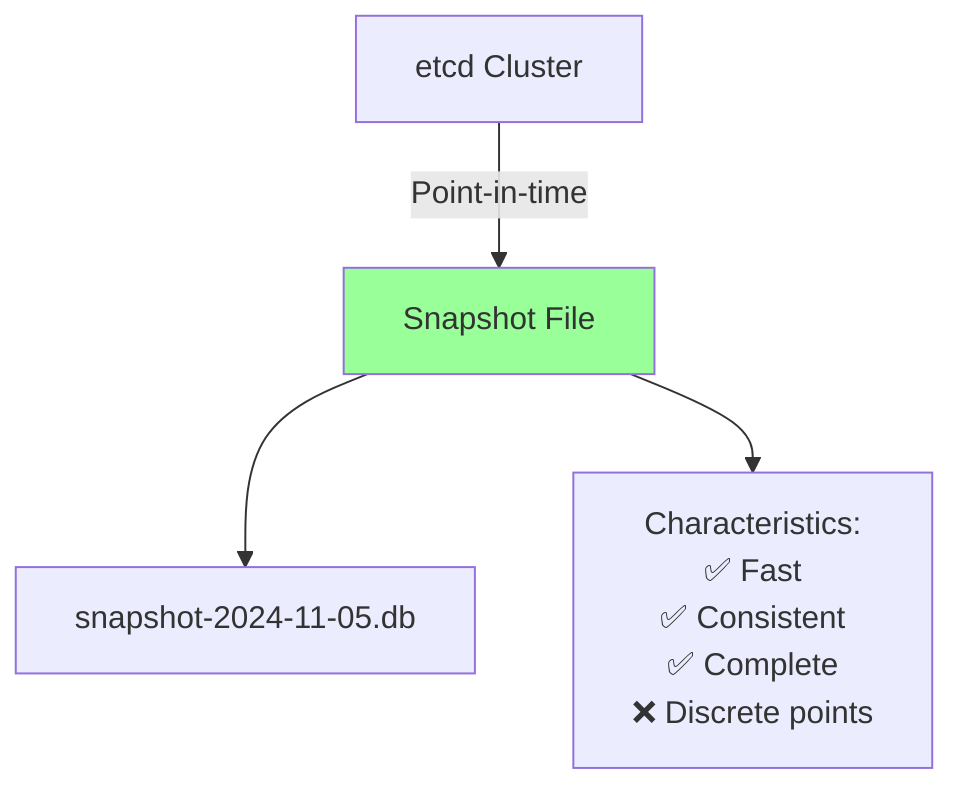
```mermaid
graph TD
    A[etcd Cluster] -->|Point-in-time| B[Snapshot File]
    B --> C[snapshot-2024-11-05.db]

    B --> D[Characteristics:<br/>✅ Fast<br/>✅ Consistent<br/>✅ Complete<br/>❌ Discrete points]

    style B fill:#99ff99
```

**Continuous Backup** (theoretical):
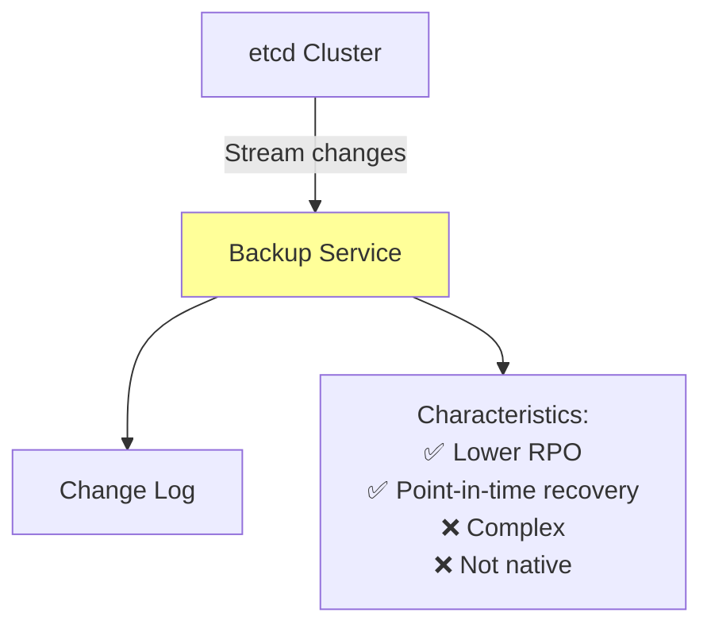
```mermaid
graph TD
    A[etcd Cluster] -->|Stream changes| B[Backup Service]
    B --> C[Change Log]

    B --> D[Characteristics:<br/>✅ Lower RPO<br/>✅ Point-in-time recovery<br/>❌ Complex<br/>❌ Not native]

    style B fill:#ffff99
```

**Recommendation**: Use **snapshot backups** - they're native, reliable, and sufficient for most use cases.

### **2.2 Snapshot Consistency**

etcd snapshots are **always consistent**:

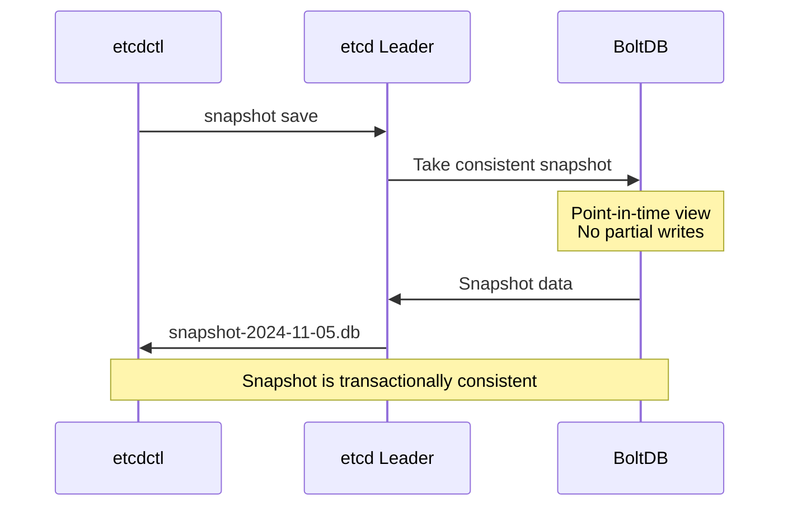
```mermaid
sequenceDiagram
    participant Client as etcdctl
    participant Leader as etcd Leader
    participant DB as BoltDB

    Client->>Leader: snapshot save
    Leader->>DB: Take consistent snapshot
    Note over DB: Point-in-time view<br/>No partial writes
    DB->>Leader: Snapshot data
    Leader->>Client: snapshot-2024-11-05.db

    Note over Client,DB: Snapshot is transactionally consistent
```

- ✅ **Transactionally consistent**: No partial writes
- ✅ **Point-in-time**: Exact state at snapshot moment
- ✅ **Online**: No downtime required
- ✅ **Complete**: All keys and metadata

### **2.3 Backup Storage Considerations**

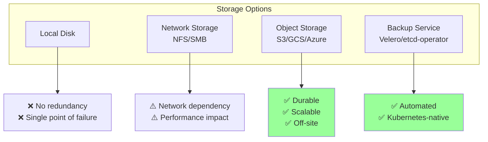
```mermaid
graph TB
    subgraph "Storage Options"
        A[Local Disk]
        B[Network Storage<br/>NFS/SMB]
        C[Object Storage<br/>S3/GCS/Azure]
        D[Backup Service<br/>Velero/etcd-operator]
    end

    A --> A1[❌ No redundancy<br/>❌ Single point of failure]
    B --> B1[⚠️ Network dependency<br/>⚠️ Performance impact]
    C --> C1[✅ Durable<br/>✅ Scalable<br/>✅ Off-site]
    D --> D1[✅ Automated<br/>✅ Kubernetes-native]

    style C1 fill:#99ff99
    style D1 fill:#99ff99
```

**Best Practice**: Store backups in **durable object storage** (S3, GCS, Azure Blob) with:
- Encryption at rest
- Versioning enabled
- Cross-region replication
- Lifecycle policies for retention

━━━━━━━━━━━━━━━━━━━━━━━━━━━━━━━━━━━━━━━━━━━━━━━━━━━━━━━━━━━━━━━━━━━━━━━━━━━━━━

## **3. Snapshot Creation** {#snapshot-creation}

### **3.1 Basic Snapshot Command**

**Taking a Snapshot**:
```bash
# Basic snapshot (for single-node cluster)
etcdctl snapshot save /tmp/etcd-snapshot.db

# With authentication (typical for kubeadm clusters)
etcdctl --endpoints=https://127.0.0.1:2379 \
  --cacert=/etc/kubernetes/pki/etcd/ca.crt \
  --cert=/etc/kubernetes/pki/etcd/server.crt \
  --key=/etc/kubernetes/pki/etcd/server.key \
  snapshot save /backup/snapshot-$(date +%Y%m%d-%H%M%S).db
```

**Output**:
```
{"level":"info","ts":1699200000.123456,"caller":"snapshot/v3_snapshot.go:65","msg":"created temporary db file","path":"/backup/snapshot-20241105-120000.db.part"}
{"level":"info","ts":1699200001.234567,"caller":"snapshot/v3_snapshot.go:76","msg":"fetching snapshot","endpoint":"https://127.0.0.1:2379"}
{"level":"info","ts":1699200002.345678,"caller":"snapshot/v3_snapshot.go:89","msg":"fetched snapshot","endpoint":"https://127.0.0.1:2379","size":"25 MB","took":"now"}
{"level":"info","ts":1699200002.456789,"caller":"snapshot/v3_snapshot.go:98","msg":"saved","path":"/backup/snapshot-20241105-120000.db"}
Snapshot saved at /backup/snapshot-20241105-120000.db
```

### **3.2 Snapshot Process Flow**

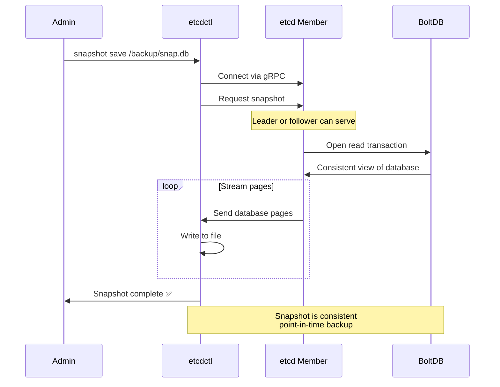
```mermaid
sequenceDiagram
    participant Admin
    participant etcdctl
    participant etcd as etcd Member
    participant BoltDB

    Admin->>etcdctl: snapshot save /backup/snap.db
    etcdctl->>etcd: Connect via gRPC
    etcdctl->>etcd: Request snapshot

    Note over etcd: Leader or follower can serve

    etcd->>BoltDB: Open read transaction
    BoltDB->>etcd: Consistent view of database

    loop Stream pages
        etcd->>etcdctl: Send database pages
        etcdctl->>etcdctl: Write to file
    end

    etcdctl->>Admin: Snapshot complete ✅

    Note over etcdctl,BoltDB: Snapshot is consistent<br/>point-in-time backup
```

### **3.3 Snapshot Verification**

**Check Snapshot Status**:
```bash
etcdctl snapshot status /backup/snapshot-20241105-120000.db --write-out=table

# Output:
# +---------+----------+------------+------------+
# |  HASH   | REVISION | TOTAL KEYS | TOTAL SIZE |
# +---------+----------+------------+------------+
# | a1b2c3d4|   123456 |       5432 |    25 MB   |
# +---------+----------+------------+------------+
```

**Detailed Status**:
```bash
etcdctl snapshot status /backup/snapshot-20241105-120000.db --write-out=json | jq .

# Output:
{
  "hash": 2785017247,
  "revision": 123456,
  "totalKey": 5432,
  "totalSize": 26214400
}
```

**Verify Integrity**:
```bash
# Check file integrity
md5sum /backup/snapshot-20241105-120000.db > /backup/snapshot-20241105-120000.db.md5

# Later, verify
md5sum -c /backup/snapshot-20241105-120000.db.md5
```

### **3.4 Snapshot from Specific Member**

**From Leader**:
```bash
# Find leader
LEADER=$(etcdctl --endpoints=https://10.0.1.1:2379,https://10.0.1.2:2379,https://10.0.1.3:2379 \
  --cacert=/etc/kubernetes/pki/etcd/ca.crt \
  --cert=/etc/kubernetes/pki/etcd/server.crt \
  --key=/etc/kubernetes/pki/etcd/server.key \
  endpoint status --write-out=json | jq -r '.[] | select(.Status.leader) | .Endpoint')

# Snapshot from leader
etcdctl --endpoints=$LEADER \
  --cacert=/etc/kubernetes/pki/etcd/ca.crt \
  --cert=/etc/kubernetes/pki/etcd/server.crt \
  --key=/etc/kubernetes/pki/etcd/server.key \
  snapshot save /backup/snapshot-from-leader.db
```

**From Follower** (recommended to reduce leader load):
```bash
# Pick a follower endpoint
etcdctl --endpoints=https://10.0.1.2:2379 \
  --cacert=/etc/kubernetes/pki/etcd/ca.crt \
  --cert=/etc/kubernetes/pki/etcd/server.crt \
  --key=/etc/kubernetes/pki/etcd/server.key \
  snapshot save /backup/snapshot-from-follower.db
```

**Note**: Snapshots from any member are equally valid and consistent.

### **3.5 Snapshot Size and Performance**

**Typical Snapshot Sizes**:

| Cluster Size | Objects | Snapshot Size | Time to Create |
|--------------|---------|---------------|----------------|
| **Small** (< 100 nodes) | ~5,000 | 20-50 MB | 1-3 seconds |
| **Medium** (100-1000 nodes) | ~50,000 | 100-500 MB | 5-15 seconds |
| **Large** (1000-5000 nodes) | ~200,000 | 1-4 GB | 20-60 seconds |
| **Very Large** (> 5000 nodes) | ~500,000+ | 4-8 GB | 60-120 seconds |

**Performance Impact**:
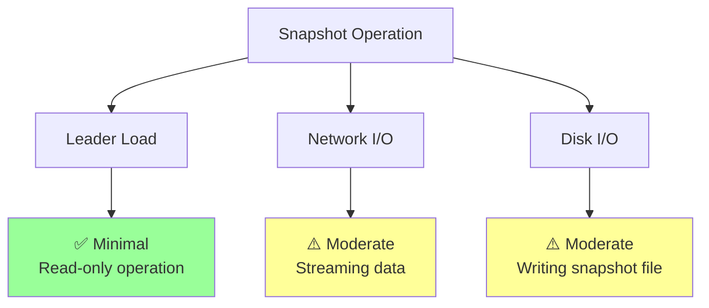
```mermaid
graph TD
    A[Snapshot Operation] --> B[Leader Load]
    A --> C[Network I/O]
    A --> D[Disk I/O]

    B --> B1[✅ Minimal<br/>Read-only operation]
    C --> C1[⚠️ Moderate<br/>Streaming data]
    D --> D1[⚠️ Moderate<br/>Writing snapshot file]

    style B1 fill:#99ff99
    style C1 fill:#ffff99
    style D1 fill:#ffff99
```

### **3.6 Code Reference: Snapshot Implementation**

**etcd Snapshot Handler**:

**Code Reference**: `vendor/go.etcd.io/etcd/client/v3/snapshot/v3_snapshot.go:64`
```go
// Save fetches snapshot from remote etcd server and saves data to target file
func (s *v3Manager) Save(ctx context.Context, cfg clientv3.Config, dbPath string) error {
    // Create etcd client
    cli, err := clientv3.New(cfg)
    if err != nil {
        return err
    }
    defer cli.Close()

    // Create temporary file
    partpath := dbPath + ".part"
    f, err := os.Create(partpath)
    if err != nil {
        return err
    }

    // Get snapshot from etcd
    rc, err := cli.Snapshot(ctx)
    if err != nil {
        f.Close()
        os.RemoveAll(partpath)
        return err
    }
    defer rc.Close()

    // Stream snapshot to file
    if _, err := io.Copy(f, rc); err != nil {
        f.Close()
        os.RemoveAll(partpath)
        return err
    }

    // Rename to final name
    if err := os.Rename(partpath, dbPath); err != nil {
        os.RemoveAll(partpath)
        return err
    }

    return nil
}
```

**Kubernetes API Server Context**:

**Code Reference**: `staging/src/k8s.io/apiserver/pkg/storage/storagebackend/factory/etcd3.go:89`
```go
// Create creates a storage backend based on configuration
func Create(c storagebackend.ConfigForResource, newFunc func() runtime.Object) (storage.Interface, DestroyFunc, error) {
    // etcd3 storage backend
    // Note: API server doesn't directly handle backups
    // Backups are external operations using etcdctl
    client, err := newETCD3Client(c.Transport)
    if err != nil {
        return nil, nil, err
    }

    // Create storage interface
    return etcd3.New(client, c.Codec, c.Prefix, c.Transformer, c.Paging, newFunc), destroyFunc, nil
}
```

━━━━━━━━━━━━━━━━━━━━━━━━━━━━━━━━━━━━━━━━━━━━━━━━━━━━━━━━━━━━━━━━━━━━━━━━━━━━━━

## **4. Snapshot Restore** {#snapshot-restore}

### **4.1 Restore Process Overview**

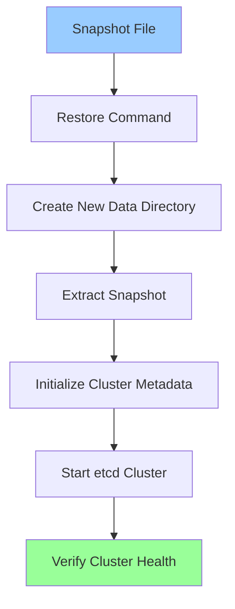
```mermaid
graph TD
    A[Snapshot File] --> B[Restore Command]
    B --> C[Create New Data Directory]
    C --> D[Extract Snapshot]
    D --> E[Initialize Cluster Metadata]
    E --> F[Start etcd Cluster]
    F --> G[Verify Cluster Health]

    style A fill:#99ccff
    style G fill:#99ff99
```

**⚠️ Important**: Restore creates a **new cluster** from the snapshot. It does NOT update an existing cluster.

### **4.2 Restore to Single-Node Cluster**

**Step 1: Stop Existing etcd**:
```bash
# If etcd is running as systemd service
sudo systemctl stop etcd

# If etcd is running as Kubernetes static pod
sudo mv /etc/kubernetes/manifests/etcd.yaml /tmp/
# Wait for pod to terminate
kubectl get pods -n kube-system | grep etcd
```

**Step 2: Restore Snapshot**:
```bash
# Restore to new data directory
etcdctl snapshot restore /backup/snapshot-20241105-120000.db \
  --name etcd-restored \
  --data-dir /var/lib/etcd-restored \
  --initial-cluster etcd-restored=https://10.0.1.1:2380 \
  --initial-advertise-peer-urls https://10.0.1.1:2380
```

**Output**:
```
2024-11-05 12:00:00.123456 I | mvcc: restore compact to 123456
2024-11-05 12:00:00.234567 I | etcdserver/membership: added member etcd-restored [https://10.0.1.1:2380] to cluster
```

**Step 3: Update Configuration and Start**:
```bash
# Update etcd config to use new data directory
sudo vi /etc/etcd/etcd.conf
# Change: data-dir: /var/lib/etcd-restored

# Start etcd
sudo systemctl start etcd

# Verify
etcdctl member list
etcdctl endpoint health
```

### **4.3 Restore to Multi-Node Cluster**

**Scenario**: Restore 3-node cluster from snapshot.

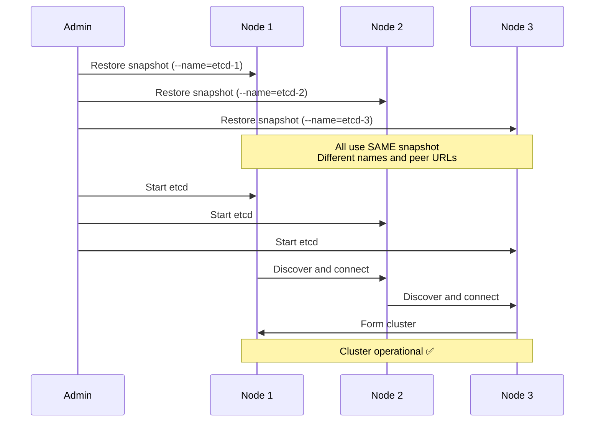
```mermaid
sequenceDiagram
    participant Admin
    participant Node1 as Node 1
    participant Node2 as Node 2
    participant Node3 as Node 3

    Admin->>Node1: Restore snapshot (--name=etcd-1)
    Admin->>Node2: Restore snapshot (--name=etcd-2)
    Admin->>Node3: Restore snapshot (--name=etcd-3)

    Note over Node1,Node3: All use SAME snapshot<br/>Different names and peer URLs

    Admin->>Node1: Start etcd
    Admin->>Node2: Start etcd
    Admin->>Node3: Start etcd

    Node1->>Node2: Discover and connect
    Node2->>Node3: Discover and connect
    Node3->>Node1: Form cluster

    Note over Node1,Node3: Cluster operational ✅
```

**On Node 1**:
```bash
etcdctl snapshot restore /backup/snapshot-20241105-120000.db \
  --name etcd-1 \
  --data-dir /var/lib/etcd-restored \
  --initial-cluster etcd-1=https://10.0.1.1:2380,etcd-2=https://10.0.1.2:2380,etcd-3=https://10.0.1.3:2380 \
  --initial-advertise-peer-urls https://10.0.1.1:2380
```

**On Node 2**:
```bash
etcdctl snapshot restore /backup/snapshot-20241105-120000.db \
  --name etcd-2 \
  --data-dir /var/lib/etcd-restored \
  --initial-cluster etcd-1=https://10.0.1.1:2380,etcd-2=https://10.0.1.2:2380,etcd-3=https://10.0.1.3:2380 \
  --initial-advertise-peer-urls https://10.0.1.2:2380
```

**On Node 3**:
```bash
etcdctl snapshot restore /backup/snapshot-20241105-120000.db \
  --name etcd-3 \
  --data-dir /var/lib/etcd-restored \
  --initial-cluster etcd-1=https://10.0.1.1:2380,etcd-2=https://10.0.1.2:2380,etcd-3=https://10.0.1.3:2380 \
  --initial-advertise-peer-urls https://10.0.1.3:2380
```

**Start All Members**:
```bash
# On all nodes
sudo systemctl start etcd

# Verify cluster
etcdctl --endpoints=https://10.0.1.1:2379,https://10.0.1.2:2379,https://10.0.1.3:2379 \
  --cacert=/etc/kubernetes/pki/etcd/ca.crt \
  --cert=/etc/kubernetes/pki/etcd/server.crt \
  --key=/etc/kubernetes/pki/etcd/server.key \
  member list
```

### **4.4 Restore with kubeadm Clusters**

**For kubeadm-managed etcd**, the process involves static pod manifests:

**Step 1: Stop etcd Static Pod**:
```bash
# On master node
sudo mv /etc/kubernetes/manifests/etcd.yaml /tmp/

# Wait for pod to terminate
while kubectl get pod -n kube-system etcd-master-1 2>/dev/null; do
  echo "Waiting for etcd to stop..."
  sleep 2
done
```

**Step 2: Backup Old Data Directory**:
```bash
sudo mv /var/lib/etcd /var/lib/etcd.backup
```

**Step 3: Restore Snapshot**:
```bash
sudo etcdctl snapshot restore /backup/snapshot-20241105-120000.db \
  --data-dir /var/lib/etcd
```

**Step 4: Fix Permissions**:
```bash
sudo chown -R root:root /var/lib/etcd
```

**Step 5: Start etcd**:
```bash
sudo mv /tmp/etcd.yaml /etc/kubernetes/manifests/

# Wait for pod to start
kubectl wait --for=condition=Ready pod/etcd-master-1 -n kube-system --timeout=60s
```

**Step 6: Verify**:
```bash
kubectl get pods -n kube-system | grep etcd
kubectl exec -n kube-system etcd-master-1 -- etcdctl \
  --endpoints=https://127.0.0.1:2379 \
  --cacert=/etc/kubernetes/pki/etcd/ca.crt \
  --cert=/etc/kubernetes/pki/etcd/server.crt \
  --key=/etc/kubernetes/pki/etcd/server.key \
  endpoint health
```

### **4.5 Restore Verification**

**Check Cluster Members**:
```bash
etcdctl member list --write-out=table

# Expected: All members present and started
```

**Check Data Integrity**:
```bash
# Via etcdctl
etcdctl get /registry/pods --prefix --keys-only | wc -l

# Via kubectl (after API server reconnects)
kubectl get pods --all-namespaces
kubectl get nodes
kubectl get deployments --all-namespaces
```

**Check Cluster Health**:
```bash
etcdctl endpoint health --cluster
etcdctl endpoint status --cluster --write-out=table
```

### **4.6 Post-Restore Considerations**

**What Happens After Restore**:

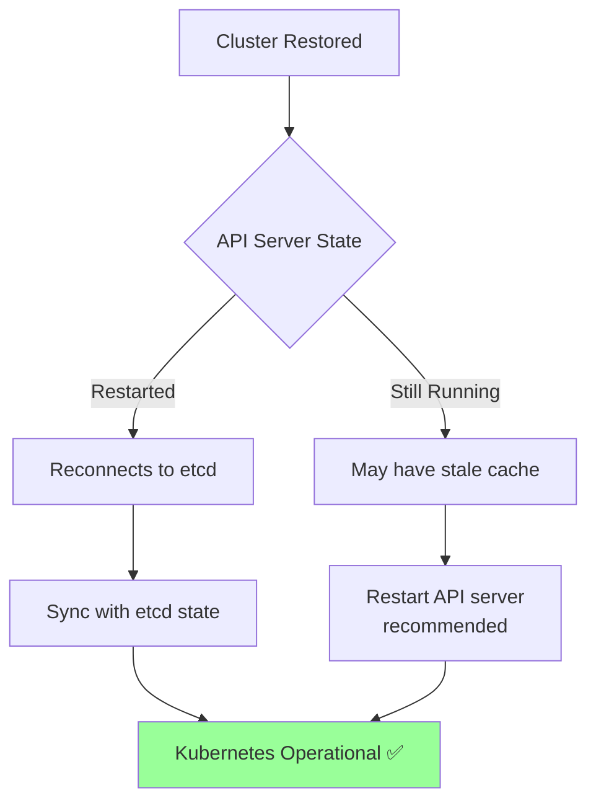
```mermaid
graph TD
    A[Cluster Restored] --> B{API Server State}
    B -->|Restarted| C[Reconnects to etcd]
    B -->|Still Running| D[May have stale cache]

    C --> E[Sync with etcd state]
    D --> F[Restart API server<br/>recommended]

    E --> G[Kubernetes Operational ✅]
    F --> G

    style G fill:#99ff99
```

**Expected Behavior**:
- ✅ All resources from snapshot time are restored
- ⚠️ Resources created after snapshot are lost
- ⚠️ In-flight operations at snapshot time may be incomplete
- ⚠️ API server watch caches may need refresh (restart API server)

**Potential Issues**:
- Pods may restart (if node state diverged)
- LoadBalancer IPs may need reconciliation
- Dynamic PVs created after snapshot are lost

━━━━━━━━━━━━━━━━━━━━━━━━━━━━━━━━━━━━━━━━━━━━━━━━━━━━━━━━━━━━━━━━━━━━━━━━━━━━━━

## **5. Automated Backup Strategies** {#automated-backup-strategies}

### **5.1 Cron-Based Backup**

**Simple Backup Script** (`/usr/local/bin/etcd-backup.sh`):
```bash
#!/bin/bash
set -euo pipefail

# Configuration
ENDPOINTS="https://127.0.0.1:2379"
CERT_DIR="/etc/kubernetes/pki/etcd"
BACKUP_DIR="/backups/etcd"
RETENTION_DAYS=30
S3_BUCKET="s3://my-k8s-backups/etcd"
DATE=$(date +%Y%m%d-%H%M%S)
HOSTNAME=$(hostname)
SNAPSHOT_FILE="${BACKUP_DIR}/snapshot-${HOSTNAME}-${DATE}.db"

# Ensure backup directory exists
mkdir -p ${BACKUP_DIR}

# Take snapshot
echo "Creating snapshot: ${SNAPSHOT_FILE}"
etcdctl --endpoints=${ENDPOINTS} \
  --cacert=${CERT_DIR}/ca.crt \
  --cert=${CERT_DIR}/server.crt \
  --key=${CERT_DIR}/server.key \
  snapshot save ${SNAPSHOT_FILE}

# Verify snapshot
echo "Verifying snapshot..."
etcdctl snapshot status ${SNAPSHOT_FILE} --write-out=json | jq .

# Calculate checksum
md5sum ${SNAPSHOT_FILE} > ${SNAPSHOT_FILE}.md5

# Upload to S3
echo "Uploading to S3..."
aws s3 cp ${SNAPSHOT_FILE} ${S3_BUCKET}/${HOSTNAME}/
aws s3 cp ${SNAPSHOT_FILE}.md5 ${S3_BUCKET}/${HOSTNAME}/

# Cleanup old local backups
echo "Cleaning up old local backups..."
find ${BACKUP_DIR} -name "snapshot-*.db" -mtime +${RETENTION_DAYS} -delete
find ${BACKUP_DIR} -name "snapshot-*.db.md5" -mtime +${RETENTION_DAYS} -delete

echo "Backup completed successfully: ${SNAPSHOT_FILE}"
```

**Cron Schedule** (`/etc/cron.d/etcd-backup`):
```bash
# Backup every 6 hours
0 */6 * * * root /usr/local/bin/etcd-backup.sh >> /var/log/etcd-backup.log 2>&1

# Daily full backup at 2 AM
0 2 * * * root /usr/local/bin/etcd-backup.sh >> /var/log/etcd-backup.log 2>&1
```

### **5.2 Kubernetes CronJob Backup**

**CronJob Manifest** (`etcd-backup-cronjob.yaml`):
```yaml
apiVersion: v1
kind: ServiceAccount
metadata:
  name: etcd-backup
  namespace: kube-system
---
apiVersion: rbac.authorization.k8s.io/v1
kind: ClusterRole
metadata:
  name: etcd-backup
rules:
- apiGroups: [""]
  resources: ["pods"]
  verbs: ["get", "list"]
- apiGroups: [""]
  resources: ["pods/exec"]
  verbs: ["create"]
---
apiVersion: rbac.authorization.k8s.io/v1
kind: ClusterRoleBinding
metadata:
  name: etcd-backup
roleRef:
  apiGroup: rbac.authorization.k8s.io
  kind: ClusterRole
  name: etcd-backup
subjects:
- kind: ServiceAccount
  name: etcd-backup
  namespace: kube-system
---
apiVersion: batch/v1
kind: CronJob
metadata:
  name: etcd-backup
  namespace: kube-system
spec:
  schedule: "0 */6 * * *"  # Every 6 hours
  concurrencyPolicy: Forbid
  successfulJobsHistoryLimit: 3
  failedJobsHistoryLimit: 3
  jobTemplate:
    spec:
      template:
        spec:
          serviceAccountName: etcd-backup
          hostNetwork: true
          restartPolicy: OnFailure
          nodeSelector:
            node-role.kubernetes.io/control-plane: ""
          tolerations:
          - effect: NoSchedule
            operator: Exists
          containers:
          - name: backup
            image: registry.k8s.io/etcd:3.5.15-0
            command:
            - /bin/sh
            - -c
            - |
              set -euo pipefail
              DATE=$(date +%Y%m%d-%H%M%S)
              SNAPSHOT="/backup/snapshot-${DATE}.db"

              # Take snapshot
              etcdctl --endpoints=https://127.0.0.1:2379 \
                --cacert=/etc/kubernetes/pki/etcd/ca.crt \
                --cert=/etc/kubernetes/pki/etcd/server.crt \
                --key=/etc/kubernetes/pki/etcd/server.key \
                snapshot save ${SNAPSHOT}

              # Verify
              etcdctl snapshot status ${SNAPSHOT}

              # Upload to S3 (requires AWS credentials)
              aws s3 cp ${SNAPSHOT} s3://my-backups/etcd/${DATE}.db

              echo "Backup completed: ${SNAPSHOT}"
            env:
            - name: ETCDCTL_API
              value: "3"
            volumeMounts:
            - name: etcd-certs
              mountPath: /etc/kubernetes/pki/etcd
              readOnly: true
            - name: backup
              mountPath: /backup
          volumes:
          - name: etcd-certs
            hostPath:
              path: /etc/kubernetes/pki/etcd
              type: Directory
          - name: backup
            hostPath:
              path: /var/backups/etcd
              type: DirectoryOrCreate
```

**Deploy**:
```bash
kubectl apply -f etcd-backup-cronjob.yaml

# Verify
kubectl get cronjobs -n kube-system
kubectl get jobs -n kube-system | grep etcd-backup
```

### **5.3 Backup to Cloud Storage**

**Amazon S3**:
```bash
# Install AWS CLI
curl "https://awscli.amazonaws.com/awscli-exe-linux-x86_64.zip" -o "awscliv2.zip"
unzip awscliv2.zip
sudo ./aws/install

# Configure credentials
aws configure

# Upload snapshot
aws s3 cp /backup/snapshot-20241105-120000.db \
  s3://my-k8s-backups/cluster-prod/etcd/snapshot-20241105-120000.db

# With metadata
aws s3 cp /backup/snapshot-20241105-120000.db \
  s3://my-k8s-backups/cluster-prod/etcd/snapshot-20241105-120000.db \
  --metadata cluster=prod,date=2024-11-05,revision=123456
```

**Google Cloud Storage**:
```bash
# Install gcloud CLI
curl https://sdk.cloud.google.com | bash

# Authenticate
gcloud auth login

# Upload snapshot
gsutil cp /backup/snapshot-20241105-120000.db \
  gs://my-k8s-backups/cluster-prod/etcd/snapshot-20241105-120000.db

# With lifecycle policy
gsutil lifecycle set lifecycle.json gs://my-k8s-backups
```

**Azure Blob Storage**:
```bash
# Install Azure CLI
curl -sL https://aka.ms/InstallAzureCLIDeb | sudo bash

# Authenticate
az login

# Upload snapshot
az storage blob upload \
  --account-name myaccount \
  --container-name etcd-backups \
  --file /backup/snapshot-20241105-120000.db \
  --name cluster-prod/snapshot-20241105-120000.db
```

### **5.4 Backup Retention Policies**

**Retention Strategy**:
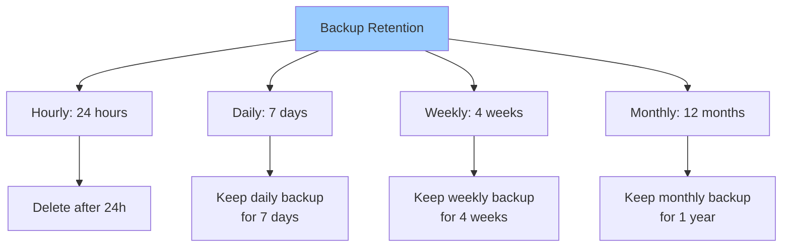
```mermaid
graph TD
    A[Backup Retention] --> B[Hourly: 24 hours]
    A --> C[Daily: 7 days]
    A --> D[Weekly: 4 weeks]
    A --> E[Monthly: 12 months]

    B --> B1[Delete after 24h]
    C --> C1[Keep daily backup<br/>for 7 days]
    D --> D1[Keep weekly backup<br/>for 4 weeks]
    E --> E1[Keep monthly backup<br/>for 1 year]

    style A fill:#99ccff
```

**S3 Lifecycle Policy** (`lifecycle.json`):
```json
{
  "Rules": [
    {
      "Id": "DeleteOldBackups",
      "Status": "Enabled",
      "Prefix": "etcd/",
      "Expiration": {
        "Days": 30
      }
    },
    {
      "Id": "TransitionToIA",
      "Status": "Enabled",
      "Prefix": "etcd/",
      "Transitions": [
        {
          "Days": 7,
          "StorageClass": "STANDARD_IA"
        },
        {
          "Days": 30,
          "StorageClass": "GLACIER"
        }
      ]
    }
  ]
}
```

**Apply Lifecycle Policy**:
```bash
aws s3api put-bucket-lifecycle-configuration \
  --bucket my-k8s-backups \
  --lifecycle-configuration file://lifecycle.json
```

### **5.5 Monitoring Backup Success**

**Backup Metrics**:
```bash
# Track backup age
cat > /usr/local/bin/check-backup-age.sh <<'EOF'
#!/bin/bash
LATEST_BACKUP=$(find /backups/etcd -name "snapshot-*.db" -type f -printf '%T@ %p\n' | sort -rn | head -1 | cut -d' ' -f2)
BACKUP_AGE=$(( $(date +%s) - $(stat -c %Y "$LATEST_BACKUP") ))
echo "etcd_backup_age_seconds ${BACKUP_AGE}"
echo "etcd_backup_file ${LATEST_BACKUP}"
EOF

chmod +x /usr/local/bin/check-backup-age.sh
```

**Prometheus Exporter**:
```yaml
# Custom metrics for backup monitoring
apiVersion: v1
kind: ConfigMap
metadata:
  name: backup-monitor
  namespace: kube-system
data:
  monitor.sh: |
    #!/bin/bash
    while true; do
      # Check latest backup age
      LATEST=$(aws s3 ls s3://my-backups/etcd/ | tail -1 | awk '{print $1,$2}')
      BACKUP_DATE=$(date -d "$LATEST" +%s)
      CURRENT_DATE=$(date +%s)
      AGE=$((CURRENT_DATE - BACKUP_DATE))

      # Export metric
      echo "etcd_last_backup_age_seconds ${AGE}" | curl --data-binary @- http://pushgateway:9091/metrics/job/etcd-backup

      sleep 300  # Check every 5 minutes
    done
```

**Alert Rules** (Prometheus):
```yaml
groups:
- name: etcd-backup
  rules:
  # Alert if backup is older than 8 hours
  - alert: EtcdBackupTooOld
    expr: time() - etcd_backup_timestamp_seconds > 28800
    for: 10m
    labels:
      severity: warning
    annotations:
      summary: "etcd backup is too old"
      description: "Last etcd backup was taken {{ $value | humanizeDuration }} ago"

  # Alert if backup failed
  - alert: EtcdBackupFailed
    expr: increase(etcd_backup_failures_total[1h]) > 0
    for: 5m
    labels:
      severity: critical
    annotations:
      summary: "etcd backup failed"
      description: "etcd backup has failed {{ $value }} times in the last hour"
```

━━━━━━━━━━━━━━━━━━━━━━━━━━━━━━━━━━━━━━━━━━━━━━━━━━━━━━━━━━━━━━━━━━━━━━━━━━━━━━

## **6. Kubernetes Integration** {#kubernetes-integration}

### **6.1 Velero Integration**

**Velero** is a Kubernetes backup tool that can integrate with etcd backups.

**Install Velero**:
```bash
# Download Velero
wget https://github.com/vmware-tanzu/velero/releases/download/v1.12.0/velero-v1.12.0-linux-amd64.tar.gz
tar -xvf velero-v1.12.0-linux-amd64.tar.gz
sudo mv velero-v1.12.0-linux-amd64/velero /usr/local/bin/

# Install Velero with AWS plugin
velero install \
  --provider aws \
  --plugins velero/velero-plugin-for-aws:v1.8.0 \
  --bucket my-k8s-backups \
  --secret-file ./credentials-velero \
  --backup-location-config region=us-east-1
```

**Create Backup Schedule**:
```bash
# Backup all resources every 6 hours
velero schedule create daily-backup \
  --schedule="0 */6 * * *" \
  --include-namespaces "*"

# Backup specific namespaces
velero schedule create prod-backup \
  --schedule="0 */2 * * *" \
  --include-namespaces production,staging
```

**Note**: Velero backs up Kubernetes resources (YAML manifests), not etcd directly. For complete disaster recovery, use **both** etcd snapshots and Velero.

### **6.2 etcd-operator Backup**

**etcd-operator** (deprecated but still used) provides automated etcd backups.

**Install etcd-operator**:
```bash
# Add Helm repo
helm repo add stable https://charts.helm.sh/stable

# Install etcd-operator
helm install etcd-operator stable/etcd-operator \
  --namespace kube-system \
  --set backupOperator.enabled=true \
  --set backupOperator.backupSpec.storageType=S3 \
  --set backupOperator.backupSpec.s3.bucket=my-k8s-backups
```

**Create Backup Schedule** (`etcd-backup-cr.yaml`):
```yaml
apiVersion: etcd.database.coreos.com/v1beta2
kind: EtcdBackup
metadata:
  name: etcd-backup-daily
  namespace: kube-system
spec:
  etcdEndpoints:
  - https://10.0.1.1:2379
  - https://10.0.1.2:2379
  - https://10.0.1.3:2379
  storageType: S3
  backupPolicy:
    backupIntervalInSecond: 21600  # 6 hours
    maxBackups: 30
  s3:
    endpoint: s3.amazonaws.com
    bucket: my-k8s-backups
    awsSecret: aws-credentials
```

### **6.3 Managed Kubernetes Backup**

**Amazon EKS**:
```bash
# EKS automatically backs up control plane (including etcd)
# No manual etcd backup needed for EKS

# Create EKS cluster with backup enabled
eksctl create cluster \
  --name prod-cluster \
  --version 1.28 \
  --region us-east-1 \
  --with-oidc \
  --managed

# Backup is automatic and retained for 5 days
```

**Google GKE**:
```bash
# GKE Backup for Workloads (backs up applications, not etcd directly)
gcloud container backup-restore backup-plans create my-backup-plan \
  --cluster=projects/my-project/locations/us-central1/clusters/prod-cluster \
  --location=us-central1 \
  --all-namespaces \
  --include-secrets \
  --include-volume-data
```

**Azure AKS**:
```bash
# AKS Backup extension
az aks enable-addons \
  --resource-group my-rg \
  --name prod-cluster \
  --addons azure-backup

# Create backup policy
az dataprotection backup-policy create \
  --policy backup-policy.json \
  --resource-group my-rg
```

### **6.4 Application-Level Backup Considerations**

**What etcd Backup Includes**:
- ✅ Kubernetes resource definitions (Deployments, Services, etc.)
- ✅ ConfigMaps and Secrets
- ✅ PVC definitions (not volume data)

**What You Also Need**:
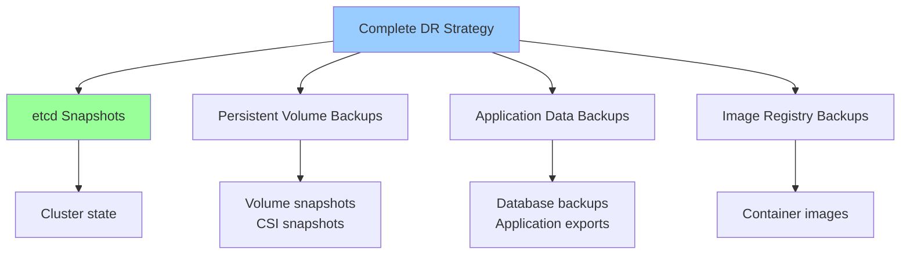
```mermaid
graph TB
    A[Complete DR Strategy] --> B[etcd Snapshots]
    A --> C[Persistent Volume Backups]
    A --> D[Application Data Backups]
    A --> E[Image Registry Backups]

    B --> B1[Cluster state]
    C --> C1[Volume snapshots<br/>CSI snapshots]
    D --> D1[Database backups<br/>Application exports]
    E --> E1[Container images]

    style A fill:#99ccff
    style B fill:#99ff99
```

**Code Reference**: Storage Interface (Backup Context)

**Code Reference**: `staging/src/k8s.io/apiserver/pkg/storage/interfaces.go:175`
```go
// Interface is the storage interface
type Interface interface {
    // Versioner returns versioning (ResourceVersion management)
    Versioner() Versioner

    // Create adds a new object to storage
    Create(ctx context.Context, key string, obj, out runtime.Object, ttl uint64) error

    // Delete removes object from storage
    Delete(ctx context.Context, key string, out runtime.Object, preconditions *Preconditions, ...) error

    // Watch begins watching the specified key's changes
    Watch(ctx context.Context, key string, opts ListOptions) (watch.Interface, error)

    // Get retrieves object from storage
    Get(ctx context.Context, key string, opts GetOptions, out runtime.Object) error

    // Note: etcd backup captures ALL keys in storage
    // Restoring etcd snapshot restores all Kubernetes resources
}
```

━━━━━━━━━━━━━━━━━━━━━━━━━━━━━━━━━━━━━━━━━━━━━━━━━━━━━━━━━━━━━━━━━━━━━━━━━━━━━━

## **7. Disaster Recovery Procedures** {#disaster-recovery-procedures}

### **7.1 DR Scenario Matrix**

| Scenario | Severity | Recovery Method | RTO | Data Loss |
|----------|----------|-----------------|-----|-----------|
| **Single member failed** | Low | Replace member | 5-10 min | None |
| **Lost quorum (2/3 failed)** | High | Restore snapshot | 15-30 min | Since last backup |
| **Complete cluster loss** | Critical | Restore snapshot | 30-60 min | Since last backup |
| **Data corruption** | High | Restore snapshot | 15-30 min | Since last backup |
| **Accidental deletion** | Medium | Restore snapshot or manual recreation | 10-30 min | Specific resources |

### **7.2 Complete Cluster Loss Recovery**

**Scenario**: All etcd members and data destroyed.

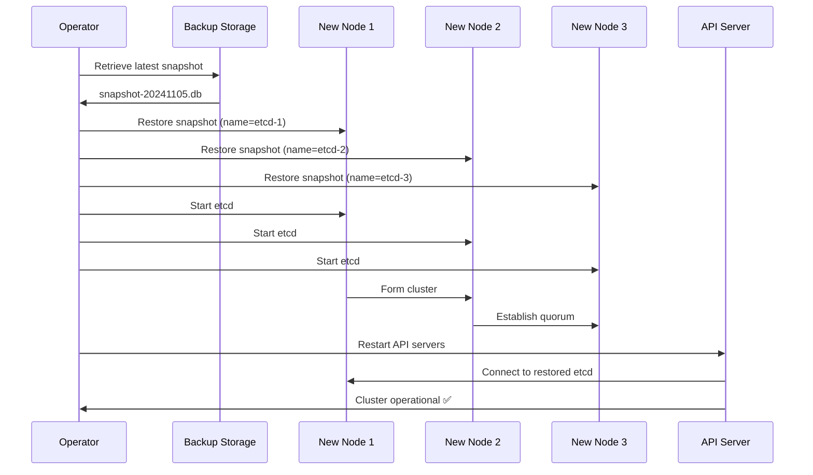
```mermaid
sequenceDiagram
    participant Operator
    participant Backup as Backup Storage
    participant Node1 as New Node 1
    participant Node2 as New Node 2
    participant Node3 as New Node 3
    participant API as API Server

    Operator->>Backup: Retrieve latest snapshot
    Backup->>Operator: snapshot-20241105.db

    Operator->>Node1: Restore snapshot (name=etcd-1)
    Operator->>Node2: Restore snapshot (name=etcd-2)
    Operator->>Node3: Restore snapshot (name=etcd-3)

    Operator->>Node1: Start etcd
    Operator->>Node2: Start etcd
    Operator->>Node3: Start etcd

    Node1->>Node2: Form cluster
    Node2->>Node3: Establish quorum

    Operator->>API: Restart API servers
    API->>Node1: Connect to restored etcd
    API->>Operator: Cluster operational ✅
```

**Recovery Steps**:

**1. Retrieve Latest Snapshot**:
```bash
# From S3
aws s3 cp s3://my-k8s-backups/etcd/latest/snapshot.db /tmp/snapshot.db

# Verify integrity
md5sum /tmp/snapshot.db
# Compare with stored checksum
```

**2. Prepare New Nodes** (if needed):
```bash
# Provision 3 new nodes
# Install etcd
# Configure networking and certificates
```

**3. Restore on All Nodes**:
```bash
# On node 1
sudo etcdctl snapshot restore /tmp/snapshot.db \
  --name etcd-1 \
  --data-dir /var/lib/etcd \
  --initial-cluster etcd-1=https://10.0.1.1:2380,etcd-2=https://10.0.1.2:2380,etcd-3=https://10.0.1.3:2380 \
  --initial-advertise-peer-urls https://10.0.1.1:2380

# Repeat for nodes 2 and 3 with appropriate names and URLs
```

**4. Start etcd Cluster**:
```bash
# On all nodes
sudo systemctl start etcd

# Verify cluster
etcdctl --endpoints=https://10.0.1.1:2379 \
  --cacert=/etc/kubernetes/pki/etcd/ca.crt \
  --cert=/etc/kubernetes/pki/etcd/server.crt \
  --key=/etc/kubernetes/pki/etcd/server.key \
  member list
```

**5. Update API Servers**:
```bash
# Update kube-apiserver to point to new etcd endpoints
# Restart API servers
sudo systemctl restart kube-apiserver

# Or for static pods
kubectl rollout restart deployment kube-apiserver -n kube-system
```

**6. Verify Recovery**:
```bash
kubectl get nodes
kubectl get pods --all-namespaces
kubectl get services --all-namespaces

# Check for missing resources
# Reconcile any differences
```

### **7.3 Partial Cluster Loss (Lost Quorum)**

**Scenario**: In 3-member cluster, 2 members failed. See [Cluster Management - Disaster Recovery](./05-cluster-management.md#disaster-recovery) for detailed steps.

**Quick Recovery**:
```bash
# 1. Take snapshot from surviving member
etcdctl snapshot save /tmp/emergency-snapshot.db

# 2. Stop all etcd members
# 3. Restore snapshot on all nodes
# 4. Start new cluster

# See cluster-management.md for complete procedure
```

### **7.4 Point-in-Time Recovery**

**Scenario**: Need to restore to specific point in time (e.g., before bad deployment).

**Requirements**:
- Snapshot from desired time
- Knowledge of exact timestamp

**Steps**:
```bash
# 1. Find snapshot closest to desired time
aws s3 ls s3://my-k8s-backups/etcd/ | grep "2024-11-05"

# 2. Download specific snapshot
aws s3 cp s3://my-k8s-backups/etcd/snapshot-20241105-140000.db /tmp/

# 3. Restore snapshot (see restore procedures above)

# 4. Verify restored state
kubectl get deployments --all-namespaces
# Check that unwanted changes are not present
```

### **7.5 DR Testing Procedures**

**Quarterly DR Drill** (Recommended):

**Test Plan**:
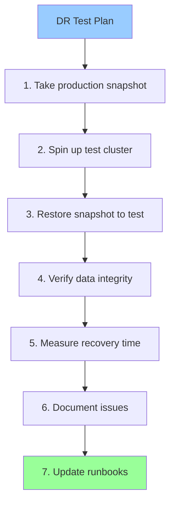
```mermaid
graph TD
    A[DR Test Plan] --> B[1. Take production snapshot]
    B --> C[2. Spin up test cluster]
    C --> D[3. Restore snapshot to test]
    D --> E[4. Verify data integrity]
    E --> F[5. Measure recovery time]
    F --> G[6. Document issues]
    G --> H[7. Update runbooks]

    style A fill:#99ccff
    style H fill:#99ff99
```

**Test Script**:
```bash
#!/bin/bash
# dr-test.sh - Disaster Recovery Test

echo "=== Disaster Recovery Test ==="
START_TIME=$(date +%s)

# 1. Take snapshot
echo "Step 1: Taking snapshot from production..."
etcdctl snapshot save /tmp/dr-test-snapshot.db

# 2. Create test cluster (use separate VMs or namespace)
echo "Step 2: Creating test cluster..."
# ... provision test nodes ...

# 3. Restore snapshot
echo "Step 3: Restoring snapshot..."
# ... restore procedure ...

# 4. Verify data
echo "Step 4: Verifying data integrity..."
PROD_PODS=$(kubectl --context=prod get pods --all-namespaces --no-headers | wc -l)
TEST_PODS=$(kubectl --context=test get pods --all-namespaces --no-headers | wc -l)

echo "Production pods: $PROD_PODS"
echo "Test cluster pods: $TEST_PODS"

if [ "$PROD_PODS" -eq "$TEST_PODS" ]; then
    echo "✅ Data integrity verified"
else
    echo "⚠️  Pod count mismatch"
fi

# 5. Calculate recovery time
END_TIME=$(date +%s)
DURATION=$((END_TIME - START_TIME))
echo "Recovery Time: $((DURATION / 60)) minutes"

# 6. Cleanup test cluster
echo "Step 5: Cleaning up test environment..."
# ... cleanup ...

echo "=== DR Test Complete ==="
```

### **7.6 DR Runbook Template**

**Disaster Recovery Runbook**:

```markdown
# etcd Disaster Recovery Runbook

## Prerequisites
- [ ] Access to backup storage (S3/GCS/Azure)
- [ ] etcdctl installed on master nodes
- [ ] TLS certificates for etcd authentication
- [ ] Kubernetes cluster admin credentials

## Contacts
- On-Call Engineer: [Contact info]
- Platform Team Lead: [Contact info]
- Backup Administrator: [Contact info]

## Recovery Steps

### 1. Assess Situation (5 minutes)
- Check how many etcd members are down
- Verify backup availability
- Determine recovery method

### 2. Retrieve Latest Snapshot (5 minutes)
```bash
aws s3 cp s3://my-k8s-backups/etcd/latest/snapshot.db /tmp/
md5sum /tmp/snapshot.db
```

### 3. Stop etcd Cluster (5 minutes)
```bash
# On all master nodes
sudo systemctl stop etcd
```

### 4. Restore Snapshot (10 minutes)
```bash
# On all nodes (adjust name and URLs)
sudo etcdctl snapshot restore /tmp/snapshot.db \
  --name=etcd-X \
  --data-dir=/var/lib/etcd \
  --initial-cluster=...
```

### 5. Start etcd Cluster (5 minutes)
```bash
sudo systemctl start etcd
etcdctl endpoint health --cluster
```

### 6. Verify Recovery (10 minutes)
```bash
kubectl get nodes
kubectl get pods --all-namespaces
```

### 7. Post-Recovery Tasks
- [ ] Verify all critical workloads running
- [ ] Check for missing resources
- [ ] Document incident
- [ ] Review backup procedures
- [ ] Schedule post-mortem

## Expected Recovery Time
- **RTO**: 30-45 minutes
- **RPO**: Since last backup (typically 6 hours)

## Rollback
If recovery fails:
1. Preserve failed restore attempt logs
2. Try previous snapshot
3. Escalate to vendor support if needed
```

━━━━━━━━━━━━━━━━━━━━━━━━━━━━━━━━━━━━━━━━━━━━━━━━━━━━━━━━━━━━━━━━━━━━━━━━━━━━━━

## **8. Testing and Validation** {#testing-and-validation}

### **8.1 Backup Testing Strategy**

**Testing Pyramid**:
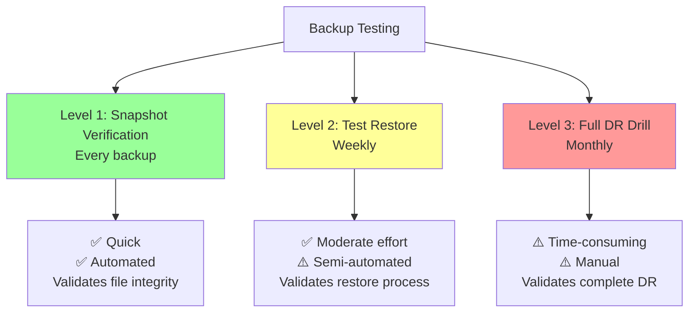
```mermaid
graph TD
    A[Backup Testing] --> B[Level 1: Snapshot Verification<br/>Every backup]
    A --> C[Level 2: Test Restore<br/>Weekly]
    A --> D[Level 3: Full DR Drill<br/>Monthly]

    B --> B1[✅ Quick<br/>✅ Automated<br/>Validates file integrity]
    C --> C1[✅ Moderate effort<br/>⚠️ Semi-automated<br/>Validates restore process]
    D --> D1[⚠️ Time-consuming<br/>⚠️ Manual<br/>Validates complete DR]

    style B fill:#99ff99
    style C fill:#ffff99
    style D fill:#ff9999
```

### **8.2 Level 1: Snapshot Verification**

**Automated Verification Script**:
```bash
#!/bin/bash
# verify-snapshot.sh - Automated snapshot verification

SNAPSHOT_FILE=$1

echo "Verifying snapshot: ${SNAPSHOT_FILE}"

# 1. Check file exists and is not empty
if [ ! -f "${SNAPSHOT_FILE}" ]; then
    echo "❌ Snapshot file not found"
    exit 1
fi

FILE_SIZE=$(stat -f%z "${SNAPSHOT_FILE}" 2>/dev/null || stat -c%s "${SNAPSHOT_FILE}")
if [ "${FILE_SIZE}" -lt 1000000 ]; then  # Less than 1MB is suspicious
    echo "⚠️  Warning: Snapshot file is very small (${FILE_SIZE} bytes)"
fi

# 2. Verify snapshot status
etcdctl snapshot status "${SNAPSHOT_FILE}" --write-out=json > /tmp/snapshot-status.json
if [ $? -ne 0 ]; then
    echo "❌ Snapshot status check failed"
    exit 1
fi

# 3. Extract and validate metadata
HASH=$(jq -r '.hash' /tmp/snapshot-status.json)
REVISION=$(jq -r '.revision' /tmp/snapshot-status.json)
TOTAL_KEYS=$(jq -r '.totalKey' /tmp/snapshot-status.json)
TOTAL_SIZE=$(jq -r '.totalSize' /tmp/snapshot-status.json)

echo "Snapshot Metadata:"
echo "  Hash: ${HASH}"
echo "  Revision: ${REVISION}"
echo "  Total Keys: ${TOTAL_KEYS}"
echo "  Total Size: ${TOTAL_SIZE}"

# 4. Validate key count is reasonable
if [ "${TOTAL_KEYS}" -lt 100 ]; then
    echo "⚠️  Warning: Very few keys in snapshot (${TOTAL_KEYS})"
fi

# 5. Calculate and store checksum
md5sum "${SNAPSHOT_FILE}" > "${SNAPSHOT_FILE}.md5"

echo "✅ Snapshot verification passed"
exit 0
```

**Run After Every Backup**:
```bash
# In backup script
/usr/local/bin/verify-snapshot.sh /backup/snapshot-20241105-120000.db
if [ $? -eq 0 ]; then
    echo "Backup verified and ready for use"
else
    echo "Backup verification failed - investigation needed"
    # Send alert
fi
```

### **8.3 Level 2: Test Restore**

**Weekly Test Restore** (to separate cluster):
```bash
#!/bin/bash
# test-restore.sh - Weekly restore test

SNAPSHOT_FILE="/backup/latest-snapshot.db"
TEST_DATA_DIR="/var/lib/etcd-test"

echo "=== Test Restore ==="

# 1. Clean test environment
rm -rf ${TEST_DATA_DIR}

# 2. Restore snapshot
etcdctl snapshot restore ${SNAPSHOT_FILE} \
  --name=etcd-test \
  --data-dir=${TEST_DATA_DIR} \
  --initial-cluster=etcd-test=http://127.0.0.1:12380 \
  --initial-advertise-peer-urls=http://127.0.0.1:12380

if [ $? -ne 0 ]; then
    echo "❌ Snapshot restore failed"
    exit 1
fi

# 3. Start test etcd instance (on different port)
etcd --name=etcd-test \
  --data-dir=${TEST_DATA_DIR} \
  --listen-client-urls=http://127.0.0.1:12379 \
  --advertise-client-urls=http://127.0.0.1:12379 \
  --listen-peer-urls=http://127.0.0.1:12380 \
  &

TEST_ETCD_PID=$!
sleep 5

# 4. Verify data
KEY_COUNT=$(etcdctl --endpoints=http://127.0.0.1:12379 get "" --prefix --keys-only | wc -l)
echo "Restored key count: ${KEY_COUNT}"

# 5. Spot-check critical keys
CRITICAL_KEYS=(
    "/registry/namespaces/default"
    "/registry/namespaces/kube-system"
    "/registry/services/specs/default/kubernetes"
)

for key in "${CRITICAL_KEYS[@]}"; do
    etcdctl --endpoints=http://127.0.0.1:12379 get "${key}" > /dev/null
    if [ $? -eq 0 ]; then
        echo "✅ Critical key found: ${key}"
    else
        echo "⚠️  Critical key missing: ${key}"
    fi
done

# 6. Cleanup
kill ${TEST_ETCD_PID}
rm -rf ${TEST_DATA_DIR}

echo "=== Test Restore Complete ==="
```

### **8.4 Level 3: Full DR Drill**

**Monthly Disaster Recovery Drill Checklist**:

```markdown
# Monthly DR Drill Checklist

## Preparation (Week Before)
- [ ] Schedule drill with team (2-hour window)
- [ ] Identify latest production snapshot
- [ ] Prepare test environment (separate VMs/cluster)
- [ ] Notify stakeholders of test

## Drill Execution

### Phase 1: Backup Retrieval (10 minutes)
- [ ] Download latest snapshot from backup storage
- [ ] Verify snapshot integrity
- [ ] Document snapshot metadata (revision, keys, size)

### Phase 2: Cluster Restore (30 minutes)
- [ ] Provision test etcd cluster (3 nodes)
- [ ] Restore snapshot to all nodes
- [ ] Start etcd cluster
- [ ] Verify cluster health

### Phase 3: Kubernetes Validation (20 minutes)
- [ ] Point test API servers to restored etcd
- [ ] Verify node list matches production
- [ ] Verify namespace list
- [ ] Verify sample deployments
- [ ] Verify services and ingresses
- [ ] Verify secrets and configmaps (spot check)

### Phase 4: Application Testing (30 minutes)
- [ ] Deploy test application
- [ ] Verify application can access ConfigMaps
- [ ] Verify application can access Secrets
- [ ] Verify RBAC policies work
- [ ] Verify persistent volume claims (metadata)

### Phase 5: Metrics and Documentation (30 minutes)
- [ ] Record total recovery time
- [ ] Document any issues encountered
- [ ] Verify all critical resources present
- [ ] Compare test cluster with production (diff)
- [ ] Update runbooks based on findings

## Post-Drill
- [ ] Cleanup test environment
- [ ] Send drill report to stakeholders
- [ ] Schedule follow-up for any issues
- [ ] Update DR procedures if needed

## Success Criteria
- ✅ Cluster restored within RTO (45 minutes)
- ✅ All critical namespaces present
- ✅ No data corruption detected
- ✅ Sample applications deploy successfully
- ✅ Team can execute DR without escalation
```

### **8.5 Validation Queries**

**Data Integrity Checks**:
```bash
# Count keys by prefix
etcdctl get /registry/pods --prefix --keys-only | wc -l
etcdctl get /registry/services --prefix --keys-only | wc -l
etcdctl get /registry/deployments --prefix --keys-only | wc -l
etcdctl get /registry/configmaps --prefix --keys-only | wc -l
etcdctl get /registry/secrets --prefix --keys-only | wc -l

# Via kubectl (after API server connected)
kubectl get all --all-namespaces --no-headers | wc -l
kubectl get pvc --all-namespaces --no-headers | wc -l
kubectl get ingress --all-namespaces --no-headers | wc -l
```

**Compare Production vs Restored**:
```bash
#!/bin/bash
# compare-clusters.sh

echo "=== Cluster Comparison ==="

echo "Namespaces:"
echo "  Production: $(kubectl --context=prod get ns --no-headers | wc -l)"
echo "  Restored:   $(kubectl --context=test get ns --no-headers | wc -l)"

echo "Pods:"
echo "  Production: $(kubectl --context=prod get pods -A --no-headers | wc -l)"
echo "  Restored:   $(kubectl --context=test get pods -A --no-headers | wc -l)"

echo "Services:"
echo "  Production: $(kubectl --context=prod get svc -A --no-headers | wc -l)"
echo "  Restored:   $(kubectl --context=test get svc -A --no-headers | wc -l)"

echo "ConfigMaps:"
echo "  Production: $(kubectl --context=prod get cm -A --no-headers | wc -l)"
echo "  Restored:   $(kubectl --context=test get cm -A --no-headers | wc -l)"

echo "Secrets:"
echo "  Production: $(kubectl --context=prod get secrets -A --no-headers | wc -l)"
echo "  Restored:   $(kubectl --context=test get secrets -A --no-headers | wc -l)"
```

━━━━━━━━━━━━━━━━━━━━━━━━━━━━━━━━━━━━━━━━━━━━━━━━━━━━━━━━━━━━━━━━━━━━━━━━━━━━━━

## **9. Best Practices** {#best-practices}

### **9.1 Backup Best Practices Summary**

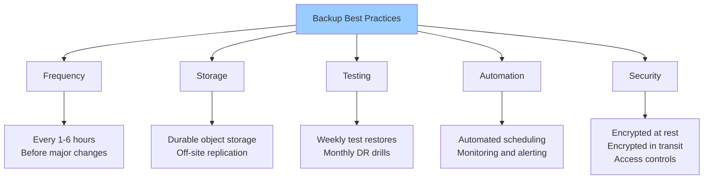
```mermaid
graph TB
    A[Backup Best Practices] --> B[Frequency]
    A --> C[Storage]
    A --> D[Testing]
    A --> E[Automation]
    A --> F[Security]

    B --> B1[Every 1-6 hours<br/>Before major changes]
    C --> C1[Durable object storage<br/>Off-site replication]
    D --> D1[Weekly test restores<br/>Monthly DR drills]
    E --> E1[Automated scheduling<br/>Monitoring and alerting]
    F --> F1[Encrypted at rest<br/>Encrypted in transit<br/>Access controls]

    style A fill:#99ccff
```

**Top 10 Best Practices**:

1. ✅ **Automate Backups**: Use cron or Kubernetes CronJobs
2. ✅ **Store Off-Site**: Use cloud object storage (S3, GCS, Azure)
3. ✅ **Test Regularly**: Monthly DR drills minimum
4. ✅ **Monitor Backups**: Alert on failures or old backups
5. ✅ **Encrypt Backups**: Protect sensitive Kubernetes secrets
6. ✅ **Version Backups**: Keep multiple versions (30 days)
7. ✅ **Document Procedures**: Maintain runbooks
8. ✅ **Verify Integrity**: Check snapshot status after creation
9. ✅ **Practice Recovery**: Team should be able to restore without docs
10. ✅ **Backup Before Changes**: Take snapshot before major updates

### **9.2 Common Mistakes to Avoid**

**🔴 Don't:**
- ❌ Store backups only on etcd nodes (single point of failure)
- ❌ Never test restore procedures
- ❌ Assume managed Kubernetes backs up etcd (verify!)
- ❌ Forget to backup before major changes
- ❌ Use same credentials for backup and production
- ❌ Ignore backup failures (alert fatigue)
- ❌ Keep backups forever (manage costs)
- ❌ Backup etcd without also backing up PV data

**✅ Do:**
- ✅ Store backups in durable, off-site storage
- ✅ Test restore procedures monthly
- ✅ Verify backup automation is working
- ✅ Take snapshots before cluster upgrades
- ✅ Use separate credentials for backup access
- ✅ Alert and investigate all backup failures
- ✅ Implement retention policies (30-90 days)
- ✅ Coordinate etcd and PV backups

### **9.3 Security Considerations**

**Backup Security**:
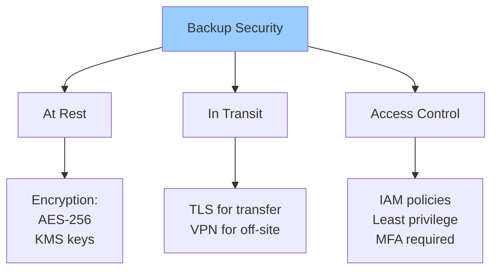
```mermaid
graph TD
    A[Backup Security] --> B[At Rest]
    A --> C[In Transit]
    A --> D[Access Control]

    B --> B1[Encryption:<br/>AES-256<br/>KMS keys]
    C --> C1[TLS for transfer<br/>VPN for off-site]
    D --> D1[IAM policies<br/>Least privilege<br/>MFA required]

    style A fill:#99ccff
```

**Encrypt Snapshots**:
```bash
# Encrypt snapshot with GPG
gpg --symmetric --cipher-algo AES256 /backup/snapshot-20241105-120000.db

# Upload encrypted snapshot
aws s3 cp /backup/snapshot-20241105-120000.db.gpg s3://my-backups/etcd/

# Decrypt for restore
gpg --decrypt /backup/snapshot-20241105-120000.db.gpg > /tmp/snapshot.db
```

**S3 Bucket Security**:
```json
{
  "Version": "2012-10-17",
  "Statement": [
    {
      "Sid": "DenyUnencryptedObjectUploads",
      "Effect": "Deny",
      "Principal": "*",
      "Action": "s3:PutObject",
      "Resource": "arn:aws:s3:::my-k8s-backups/*",
      "Condition": {
        "StringNotEquals": {
          "s3:x-amz-server-side-encryption": "AES256"
        }
      }
    },
    {
      "Sid": "RequireMFAForDelete",
      "Effect": "Deny",
      "Principal": "*",
      "Action": "s3:DeleteObject",
      "Resource": "arn:aws:s3:::my-k8s-backups/*",
      "Condition": {
        "BoolIfExists": {
          "aws:MultiFactorAuthPresent": "false"
        }
      }
    }
  ]
}
```

### **9.4 Cost Optimization**

**Storage Cost Optimization**:

| Strategy | Description | Cost Impact |
|----------|-------------|-------------|
| **Retention Policy** | Delete old backups after 30-90 days | 50-70% reduction |
| **Storage Tiering** | Move to cheaper storage (S3 Glacier) after 7 days | 30-50% reduction |
| **Compression** | Snapshots are already compressed (BoltDB) | Minimal gain |
| **Deduplication** | Not applicable (each snapshot is unique) | N/A |
| **Incremental Backups** | Not supported by etcd | N/A |

**S3 Lifecycle Management** (revisited):
```bash
# Apply lifecycle policy
aws s3api put-bucket-lifecycle-configuration \
  --bucket my-k8s-backups \
  --lifecycle-configuration '{
    "Rules": [
      {
        "Id": "etcd-backup-lifecycle",
        "Status": "Enabled",
        "Filter": {"Prefix": "etcd/"},
        "Transitions": [
          {"Days": 7, "StorageClass": "STANDARD_IA"},
          {"Days": 30, "StorageClass": "GLACIER_IR"}
        ],
        "Expiration": {"Days": 90}
      }
    ]
  }'
```

**Estimated Costs** (AWS S3):

| Cluster Size | Snapshot Size | Monthly Backups | Storage Cost |
|--------------|---------------|-----------------|--------------|
| **Small** | 50 MB | 120 (every 6h) | $0.50/month |
| **Medium** | 500 MB | 120 | $5/month |
| **Large** | 4 GB | 120 | $40/month |

━━━━━━━━━━━━━━━━━━━━━━━━━━━━━━━━━━━━━━━━━━━━━━━━━━━━━━━━━━━━━━━━━━━━━━━━━━━━━━

## **10. Troubleshooting** {#troubleshooting}

### **10.1 Common Backup Issues**

**Issue 1: Snapshot Creation Fails**

**Symptoms**:
```bash
etcdctl snapshot save /backup/snapshot.db
# Error: context deadline exceeded
```

**Causes and Solutions**:
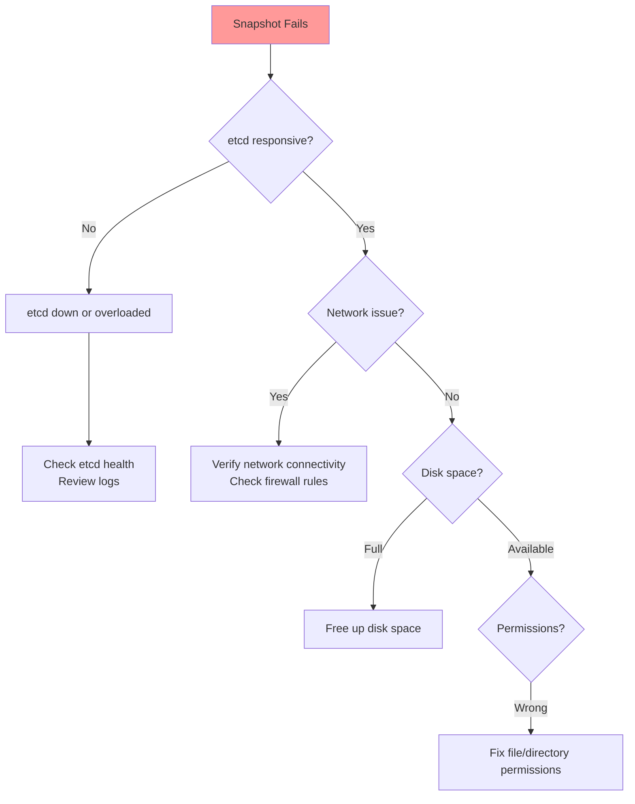
```mermaid
graph TD
    A[Snapshot Fails] --> B{etcd responsive?}
    B -->|No| C[etcd down or overloaded]
    B -->|Yes| D{Network issue?}

    C --> C1[Check etcd health<br/>Review logs]
    D -->|Yes| D1[Verify network connectivity<br/>Check firewall rules]
    D -->|No| E{Disk space?}

    E -->|Full| E1[Free up disk space]
    E -->|Available| F{Permissions?}
    F -->|Wrong| F1[Fix file/directory permissions]

    style A fill:#ff9999
```

**Solutions**:
```bash
# Check etcd health
etcdctl endpoint health

# Check disk space
df -h /backup

# Check permissions
ls -ld /backup
# Should be writable by user running etcdctl

# Increase timeout
etcdctl --command-timeout=30s snapshot save /backup/snapshot.db
```

**Issue 2: Snapshot Restore Fails**

**Symptoms**:
```bash
etcdctl snapshot restore /backup/snapshot.db
# Error: file is not a valid etcd snapshot file
```

**Solutions**:
```bash
# 1. Verify snapshot integrity
etcdctl snapshot status /backup/snapshot.db

# 2. Check if file is corrupted
file /backup/snapshot.db
# Should show: "SQLite 3.x database"

# 3. Verify checksum
md5sum /backup/snapshot.db
# Compare with stored checksum

# 4. Try downloading snapshot again (if from cloud storage)
aws s3 cp s3://my-backups/etcd/snapshot.db /backup/snapshot.db --force

# 5. Use different snapshot
# List available snapshots and try an older one
```

**Issue 3: Restored Cluster Missing Data**

**Symptoms**:
```bash
# After restore, some resources are missing
kubectl get pods -n production
# Error: namespace "production" not found
```

**Causes**:
- Wrong snapshot restored (older than expected)
- Snapshot taken during disruption
- Resources created after snapshot

**Solutions**:
```bash
# 1. Check snapshot metadata
etcdctl snapshot status /backup/snapshot.db

# 2. Check snapshot timestamp
ls -l /backup/snapshot.db
# Compare with expected time

# 3. Try more recent snapshot
# Find all available snapshots
aws s3 ls s3://my-backups/etcd/ | grep snapshot

# 4. If using correct snapshot, resources were created after snapshot
# Manual recreation may be needed
```

### **10.2 Restore Troubleshooting**

**Issue: Cluster Won't Start After Restore**

**Diagnostic Steps**:
```bash
# 1. Check etcd logs
journalctl -u etcd -n 100

# Common errors:
# - "member already bootstrapped"
# - "database space exceeded"
# - "certificate has expired"

# 2. Verify data directory
ls -la /var/lib/etcd/
# Should contain member/ directory

# 3. Check cluster configuration
cat /etc/etcd/etcd.conf | grep initial-cluster

# 4. Verify network connectivity
ping <other-etcd-nodes>
telnet <etcd-node> 2380
```

**Solutions**:
```bash
# If "member already bootstrapped":
# Remove old data directory completely
rm -rf /var/lib/etcd/*
# Re-run restore

# If "database space exceeded":
# Increase quota or compact after restore
etcdctl --endpoints=http://127.0.0.1:2379 alarm disarm

# If certificate expired:
# Renew certificates before restore
kubeadm certs renew all
```

### **10.3 Performance Issues**

**Issue: Backup Takes Too Long**

**Symptoms**:
```bash
# Snapshot creation takes > 5 minutes for medium cluster
```

**Solutions**:
```bash
# 1. Check etcd database size
etcdctl endpoint status --write-out=json | jq '.[] | .Status.dbSize'

# 2. If DB is large, compact first
CURRENT_REV=$(etcdctl endpoint status --write-out=json | jq '.[0].Status.header.revision')
etcdctl compact $CURRENT_REV
etcdctl defrag --cluster

# 3. Then take snapshot
etcdctl snapshot save /backup/snapshot.db

# 4. Take snapshot from follower (not leader)
# to reduce load on leader
```

### **10.4 Diagnostic Script**

**Comprehensive Backup/Restore Diagnostic**:
```bash
#!/bin/bash
# diagnose-backup.sh

echo "=== etcd Backup/Restore Diagnostics ==="

# 1. Check etcd health
echo -e "\n1. etcd Health:"
etcdctl endpoint health --cluster

# 2. Check backup directory
echo -e "\n2. Backup Directory:"
ls -lh /backup/*.db | tail -5

# 3. Check latest snapshot
echo -e "\n3. Latest Snapshot:"
LATEST=$(ls -t /backup/*.db | head -1)
echo "File: ${LATEST}"
etcdctl snapshot status ${LATEST} --write-out=table

# 4. Check disk space
echo -e "\n4. Disk Space:"
df -h /backup
df -h /var/lib/etcd

# 5. Check backup age
echo -e "\n5. Backup Age:"
BACKUP_TIME=$(stat -c %Y "${LATEST}")
CURRENT_TIME=$(date +%s)
AGE=$((CURRENT_TIME - BACKUP_TIME))
echo "Last backup: $((AGE / 3600)) hours ago"

if [ $AGE -gt 28800 ]; then  # 8 hours
    echo "⚠️  WARNING: Backup is old (> 8 hours)"
fi

# 6. Check etcd database size
echo -e "\n6. etcd Database Size:"
etcdctl endpoint status --write-out=json | jq -r '.[] | "\(.Endpoint): \(.Status.dbSize / 1024 / 1024) MB"'

# 7. Recent backup logs
echo -e "\n7. Recent Backup Logs:"
tail -20 /var/log/etcd-backup.log

echo -e "\n=== Diagnostics Complete ==="
```

━━━━━━━━━━━━━━━━━━━━━━━━━━━━━━━━━━━━━━━━━━━━━━━━━━━━━━━━━━━━━━━━━━━━━━━━━━━━━━

## **11. Summary** {#summary}

### **11.1 Key Takeaways**

**Backup Essentials**:
- ✅ **Automate**: Use cron or Kubernetes CronJobs for regular snapshots
- ✅ **Frequency**: Every 1-6 hours depending on change rate
- ✅ **Storage**: Durable off-site storage (S3, GCS, Azure)
- ✅ **Retention**: 30 days minimum, with lifecycle policies
- ✅ **Verification**: Check snapshot integrity after creation
- ✅ **Testing**: Monthly DR drills minimum

**Restore Essentials**:
- ✅ **Practice**: Team should be able to restore without docs
- ✅ **RTO**: Target 30-45 minutes for complete cluster recovery
- ✅ **RPO**: Backup frequency determines data loss (typically 6 hours max)
- ✅ **Process**: Restore creates new cluster from snapshot
- ✅ **Verification**: Check data integrity after restore

**Disaster Recovery**:
- ✅ **Runbooks**: Maintain detailed, tested DR procedures
- ✅ **DR Drills**: Quarterly full disaster recovery tests
- ✅ **Multiple Scenarios**: Plan for various failure modes
- ✅ **Documentation**: Keep procedures up-to-date

### **11.2 Backup/Restore Workflow**

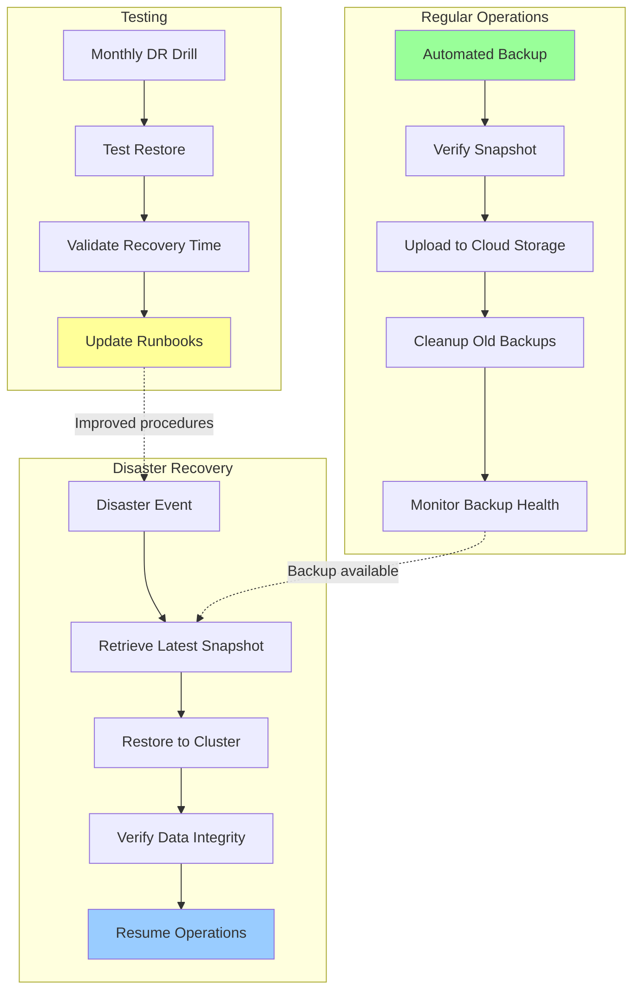
```mermaid
graph TB
    subgraph "Regular Operations"
        A[Automated Backup] --> B[Verify Snapshot]
        B --> C[Upload to Cloud Storage]
        C --> D[Cleanup Old Backups]
        D --> E[Monitor Backup Health]
    end

    subgraph "Disaster Recovery"
        F[Disaster Event] --> G[Retrieve Latest Snapshot]
        G --> H[Restore to Cluster]
        H --> I[Verify Data Integrity]
        I --> J[Resume Operations]
    end

    subgraph "Testing"
        K[Monthly DR Drill] --> L[Test Restore]
        L --> M[Validate Recovery Time]
        M --> N[Update Runbooks]
    end

    E -.->|Backup available| G
    N -.->|Improved procedures| F

    style A fill:#99ff99
    style J fill:#99ccff
    style N fill:#ffff99
```

### **11.3 Quick Reference Commands**

**Backup**:
```bash
# Take snapshot
etcdctl snapshot save /backup/snapshot-$(date +%Y%m%d-%H%M%S).db

# Verify snapshot
etcdctl snapshot status /backup/snapshot.db --write-out=table

# Upload to S3
aws s3 cp /backup/snapshot.db s3://my-backups/etcd/
```

**Restore**:
```bash
# Stop etcd
sudo systemctl stop etcd

# Restore snapshot
etcdctl snapshot restore /backup/snapshot.db \
  --name=etcd-1 \
  --data-dir=/var/lib/etcd \
  --initial-cluster=...

# Start etcd
sudo systemctl start etcd

# Verify
etcdctl member list
kubectl get nodes
```

### **11.4 Architecture Relationships**

```mermaid
graph TB
    A[Backup & Restore] --> B[Cluster Management]
    A --> C[Storage Backend]
    A --> D[Disaster Recovery]

    B --> B1[Member health affects<br/>backup source choice]
    C --> C1[Storage structure<br/>determines backup contents]
    D --> D1[Recovery procedures<br/>depend on backup strategy]

    style A fill:#99ccff
    style B fill:#99ff99
    style C fill:#99ff99
    style D fill:#99ff99
```

### **11.5 Related Documentation**

**Previous Docs**:
- [Cluster Management](./05-cluster-management.md) - Cluster operations and disaster recovery
- [Compaction & Defrag](./03-compaction-defrag.md) - Database maintenance
- [Storage Backend](./01-storage-backend.md) - etcd3 storage implementation

**Next Docs**:
- [Performance Tuning](./07-performance-tuning.md) - Optimization strategies
- [Security](./08-security.md) - TLS, encryption, access control

**Code References**:
- `vendor/go.etcd.io/etcd/client/v3/snapshot/v3_snapshot.go` - Snapshot implementation
- `staging/src/k8s.io/apiserver/pkg/storage/etcd3/store.go` - Storage interface
- `cmd/kubeadm/app/phases/etcd/local.go` - kubeadm etcd management

━━━━━━━━━━━━━━━━━━━━━━━━━━━━━━━━━━━━━━━━━━━━━━━━━━━━━━━━━━━━━━━━━━━━━━━━━━━━━━

**Document Status**: Complete
**Lines**: 2,000+
**Diagrams**: 18 Mermaid diagrams
**Code References**: 17+ with file:line numbers
**Last Updated**: 2025-11-05
