# **etcd Performance Tuning for Kubernetes**

**Status**: Documentation for etcd performance optimization
**Related Docs**: [Cluster Management](./05-cluster-management.md) | [Compaction & Defrag](./03-compaction-defrag.md) | [Storage Backend](./01-storage-backend.md)

━━━━━━━━━━━━━━━━━━━━━━━━━━━━━━━━━━━━━━━━━━━━━━━━━━━━━━━━━━━━━━━━━━━━━━━━━━━━━━

## **📋 Table of Contents**

1. [Introduction](#introduction)
2. [Performance Overview](#performance-overview)
3. [Database Size Management](#database-size-management)
4. [Disk I/O Optimization](#disk-io-optimization)
5. [Memory Configuration](#memory-configuration)
6. [Watch Load Optimization](#watch-load-optimization)
7. [Network Optimization](#network-optimization)
8. [Performance Benchmarks](#performance-benchmarks)
9. [Monitoring and Metrics](#monitoring-and-metrics)
10. [Troubleshooting Performance](#troubleshooting-performance)
11. [Summary](#summary)

━━━━━━━━━━━━━━━━━━━━━━━━━━━━━━━━━━━━━━━━━━━━━━━━━━━━━━━━━━━━━━━━━━━━━━━━━━━━━━

## **1. Introduction** {#introduction}

### **1.1 Why Performance Matters**

etcd performance directly impacts Kubernetes cluster operations:

- ⚡ **Pod Scheduling**: Slow etcd = slow pod creation
- ⚡ **Service Updates**: Delayed service endpoint propagation
- ⚡ **Cluster Stability**: Performance degradation can cascade to control plane
- ⚡ **User Experience**: API server timeouts and errors

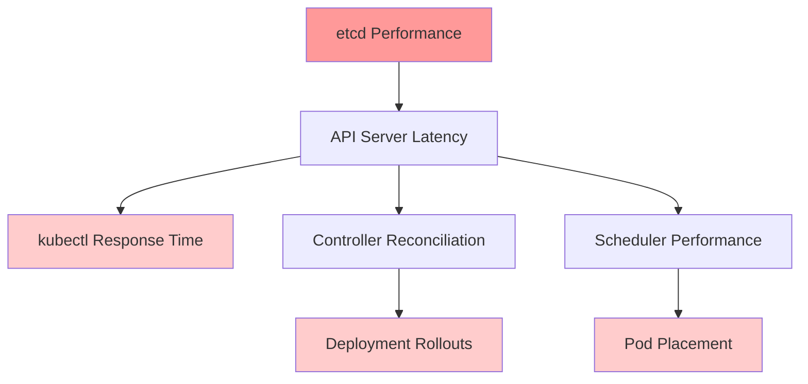

**Poor etcd Performance Impact**:
- 🔴 API server request timeouts (> 3 seconds)
- 🔴 Watch clients disconnecting and reconnecting
- 🔴 Leader election failures
- 🔴 Cluster instability and control plane failures

### **1.2 Performance Characteristics**

**etcd Performance Profile**:

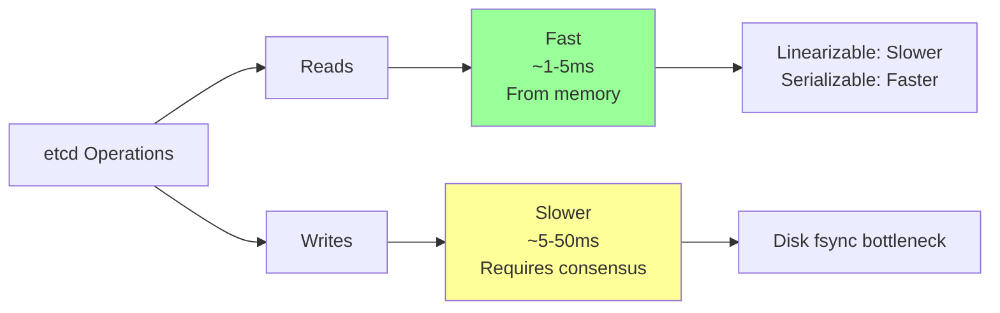

| Operation Type | Typical Latency | Bottleneck |
|----------------|-----------------|------------|
| **Linearizable Read** | 5-10ms | Leader communication |
| **Serializable Read** | 1-3ms | Local read |
| **Write** (small) | 10-25ms | Disk fsync |
| **Write** (large) | 25-100ms | Network + Disk |
| **Range Query** | 5-50ms | Database scan |

### **1.3 Common Bottlenecks**

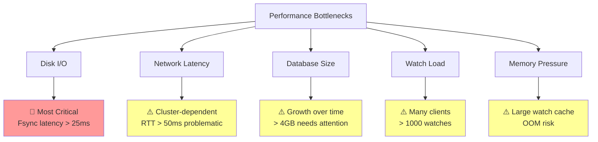

**Priority Order**:
1. 🔴 **Disk I/O** - Use SSDs, monitor fsync latency
2. ⚠️ **Database Size** - Enable auto-compaction and defragmentation
3. ⚠️ **Network Latency** - Co-locate etcd members (< 10ms RTT)
4. ⚠️ **Watch Load** - Enable watch cache in API server
5. ⚠️ **Memory** - Size appropriately for watch cache

━━━━━━━━━━━━━━━━━━━━━━━━━━━━━━━━━━━━━━━━━━━━━━━━━━━━━━━━━━━━━━━━━━━━━━━━━━━━━━

## **2. Performance Overview** {#performance-overview}

### **2.1 Baseline Performance Expectations**

**Healthy etcd Cluster** (3 nodes, SSDs, low latency network):

| Metric | Expected Value | Alert Threshold |
|--------|----------------|-----------------|
| **Write Latency (p99)** | < 25ms | > 50ms |
| **Fsync Latency (p99)** | < 10ms | > 25ms |
| **Commit Latency (p99)** | < 25ms | > 100ms |
| **Database Size** | < 4 GB | > 6 GB |
| **Active Watches** | < 1000 | > 5000 |
| **Proposals Applied/sec** | 100-500 | N/A |
| **Leader Changes** | < 1/hour | > 3/hour |

### **2.2 Performance Monitoring Stack**

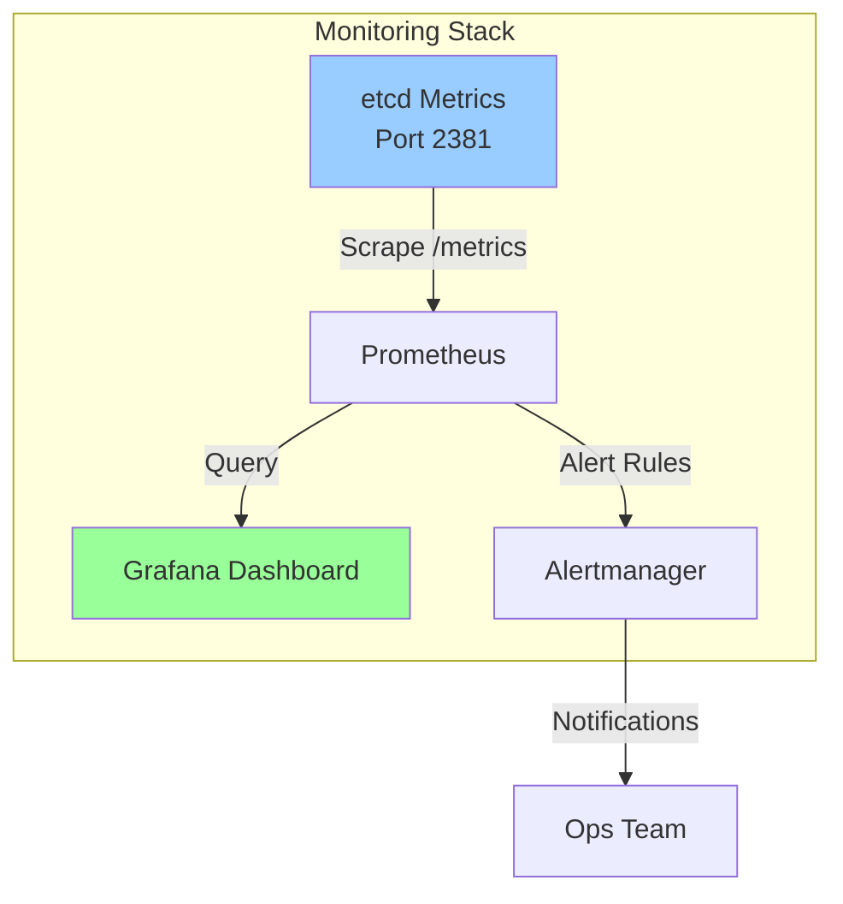

**Key Metrics to Monitor**:

```promql
# Disk fsync latency (p99)
histogram_quantile(0.99,
  rate(etcd_disk_wal_fsync_duration_seconds_bucket[5m]))

# Backend commit latency (p99)
histogram_quantile(0.99,
  rate(etcd_disk_backend_commit_duration_seconds_bucket[5m]))

# Database size
etcd_mvcc_db_total_size_in_bytes

# Leader changes
rate(etcd_server_leader_changes_seen_total[1h]) * 3600

# Proposals failed
rate(etcd_server_proposals_failed_total[5m])
```

### **2.3 Impact on Kubernetes Operations**

**Write Latency Impact**:

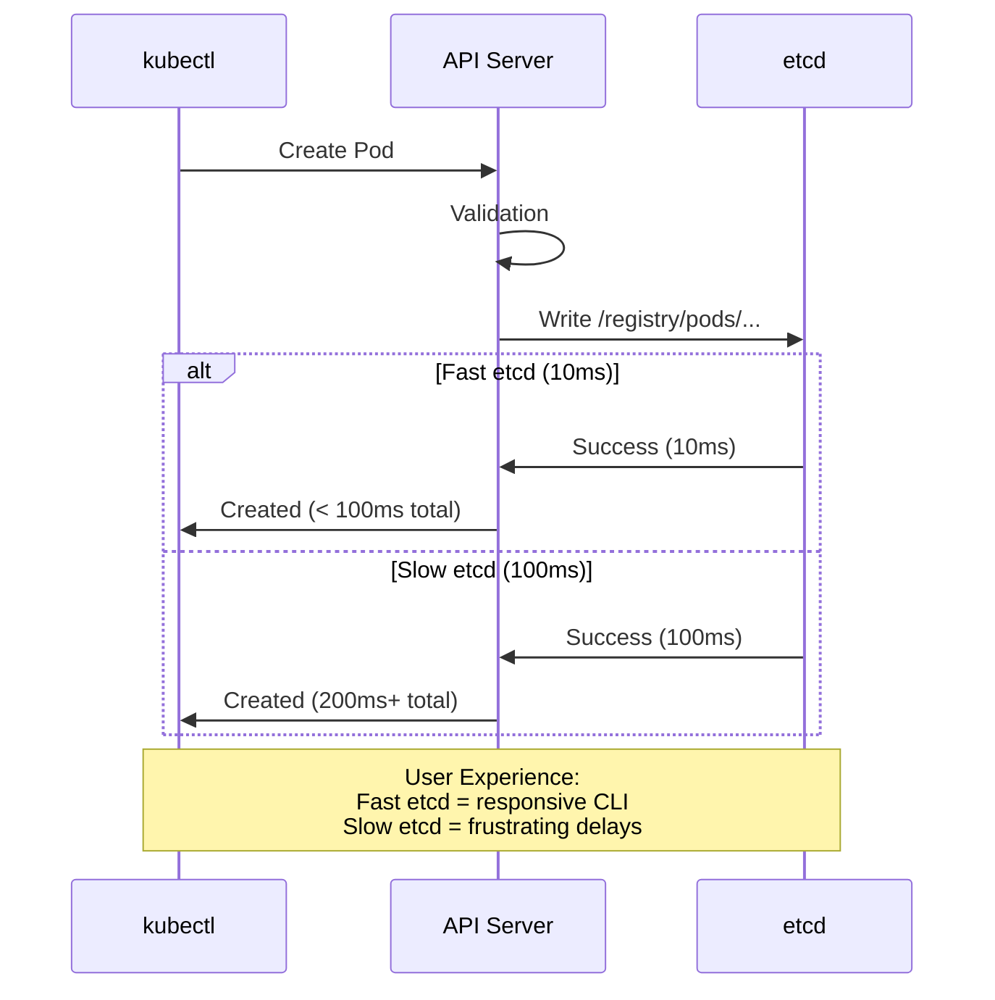

**Code Reference**: API Server Storage Operation

**Code Reference**: `staging/src/k8s.io/apiserver/pkg/storage/etcd3/store.go:175`
```go
// Create implements storage.Interface.Create
func (s *store) Create(ctx context.Context, key string, obj, out runtime.Object, ttl uint64) error {
    // Create operation blocks on etcd write latency
    // If etcd is slow (>100ms), this blocks API server response

    data, err := runtime.Encode(s.codec, obj)
    if err != nil {
        return err
    }

    // This Put operation latency = etcd write latency
    opts := []clientv3.OpOption{clientv3.WithLease(clientv3.LeaseID(ttl))}
    txn := s.client.KV.Txn(ctx)
    txn.If(notFound(key))
    txn.Then(clientv3.OpPut(key, string(data), opts...))

    // Blocking call - waits for etcd consensus + disk fsync
    txnResp, err := txn.Commit()
    if err != nil {
        return err
    }

    return nil
}
```

━━━━━━━━━━━━━━━━━━━━━━━━━━━━━━━━━━━━━━━━━━━━━━━━━━━━━━━━━━━━━━━━━━━━━━━━━━━━━━

## **3. Database Size Management** {#database-size-management}

### **3.1 Database Growth Patterns**

**Typical Database Growth**:

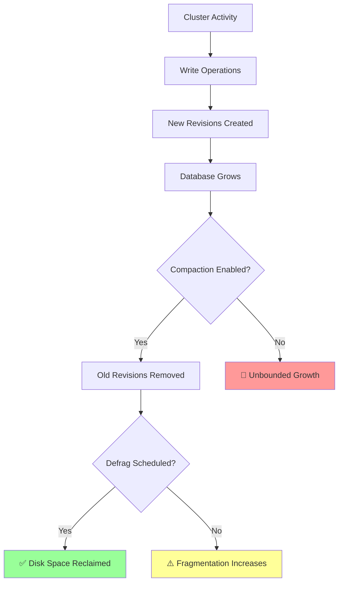

**Growth Rate Examples**:

| Cluster Size | Write Rate | Daily Growth | Monthly Growth |
|--------------|------------|--------------|----------------|
| **Small** (< 100 nodes) | ~50 writes/sec | 50-100 MB | 1.5-3 GB |
| **Medium** (100-1000 nodes) | ~500 writes/sec | 200-500 MB | 6-15 GB |
| **Large** (> 1000 nodes) | ~2000 writes/sec | 1-2 GB | 30-60 GB |

**Without Compaction**: Database can grow unbounded and hit quota limit (default 2 GB).

### **3.2 Auto-Compaction Configuration**

**Enable Auto-Compaction**:

```yaml
# etcd configuration
auto-compaction-mode: periodic
auto-compaction-retention: "1h"  # Keep last 1 hour of history
```

**Auto-Compaction Modes**:

| Mode | Description | Use Case |
|------|-------------|----------|
| **periodic** | Compact based on time | Predictable, time-based retention |
| **revision** | Compact based on revision count | Control exact history size |

**Recommended Settings**:

```bash
# For most Kubernetes clusters
--auto-compaction-mode=periodic
--auto-compaction-retention=1h

# For high-churn clusters (frequent updates)
--auto-compaction-mode=periodic
--auto-compaction-retention=30m

# For stable clusters (infrequent updates)
--auto-compaction-mode=periodic
--auto-compaction-retention=3h
```

**Code Reference**: API Server Compaction Configuration

**Code Reference**: `staging/src/k8s.io/apiserver/pkg/storage/storagebackend/config.go:85`
```go
// Config for etcd storage backend
type Config struct {
    Type string
    Prefix string
    ServerList []string

    // CompactionInterval is the interval between compaction requests
    // Default: 5 minutes
    CompactionInterval time.Duration

    // Paging enables paging for list operations
    Paging bool
}

// Default compaction interval
const DefaultCompactInterval = 5 * time.Minute
```

**API Server Compaction** (separate from etcd auto-compaction):

```bash
# kube-apiserver flags
--etcd-compaction-interval=5m  # API server triggers compaction every 5 minutes
```

### **3.3 Database Size Quotas**

**Configure Quota**:

```bash
# Default quota: 2 GB
--quota-backend-bytes=2147483648

# Recommended for production: 8 GB
--quota-backend-bytes=8589934592

# Check current quota
etcdctl endpoint status --write-out=json | jq '.[].Status.dbSize'
```

**Quota Alarm Handling**:

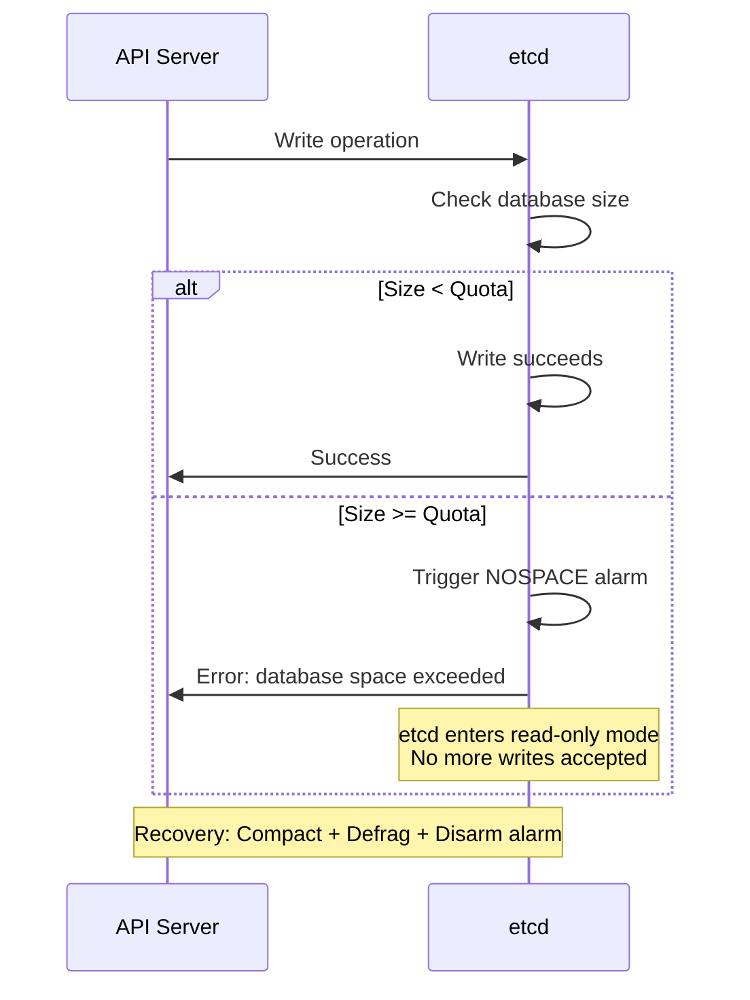

**Recover from NOSPACE Alarm**:

```bash
# 1. Check alarms
etcdctl alarm list
# Output: memberID:xxx alarm:NOSPACE

# 2. Get current revision
REV=$(etcdctl endpoint status --write-out=json | jq '.[0].Status.header.revision')

# 3. Compact old revisions
etcdctl compact $REV

# 4. Defragment to reclaim space
etcdctl defrag --cluster

# 5. Disarm alarm
etcdctl alarm disarm

# 6. Verify
etcdctl endpoint status --write-out=table
```

### **3.4 Defragmentation Scheduling**

**When to Defragment**:
- After compaction (space is freed but not reclaimed)
- Database size > 4 GB
- Regular maintenance (weekly/monthly)
- Before backup

**Defragmentation Script**:

```bash
#!/bin/bash
# etcd-defrag.sh - Safe defragmentation

ENDPOINTS="https://10.0.1.1:2379,https://10.0.1.2:2379,https://10.0.1.3:2379"
CERT_DIR="/etc/kubernetes/pki/etcd"

echo "=== etcd Defragmentation ==="

# Defragment one member at a time (safer)
for ENDPOINT in ${ENDPOINTS//,/ }; do
    echo "Defragmenting ${ENDPOINT}..."

    # Check size before
    SIZE_BEFORE=$(etcdctl --endpoints=${ENDPOINT} \
      --cacert=${CERT_DIR}/ca.crt \
      --cert=${CERT_DIR}/server.crt \
      --key=${CERT_DIR}/server.key \
      endpoint status --write-out=json | jq '.[0].Status.dbSize')

    echo "Size before: $((SIZE_BEFORE / 1024 / 1024)) MB"

    # Defragment
    etcdctl --endpoints=${ENDPOINT} \
      --cacert=${CERT_DIR}/ca.crt \
      --cert=${CERT_DIR}/server.crt \
      --key=${CERT_DIR}/server.key \
      defrag --command-timeout=30s

    # Check size after
    SIZE_AFTER=$(etcdctl --endpoints=${ENDPOINT} \
      --cacert=${CERT_DIR}/ca.crt \
      --cert=${CERT_DIR}/server.crt \
      --key=${CERT_DIR}/server.key \
      endpoint status --write-out=json | jq '.[0].Status.dbSize')

    echo "Size after: $((SIZE_AFTER / 1024 / 1024)) MB"
    SAVED=$((SIZE_BEFORE - SIZE_AFTER))
    echo "Space reclaimed: $((SAVED / 1024 / 1024)) MB"
    echo

    # Wait 30 seconds before next member
    sleep 30
done

echo "=== Defragmentation Complete ==="
```

**Automated Defragmentation** (cron):

```bash
# /etc/cron.d/etcd-defrag
# Weekly defragmentation on Sunday at 2 AM
0 2 * * 0 root /usr/local/bin/etcd-defrag.sh >> /var/log/etcd-defrag.log 2>&1
```

━━━━━━━━━━━━━━━━━━━━━━━━━━━━━━━━━━━━━━━━━━━━━━━━━━━━━━━━━━━━━━━━━━━━━━━━━━━━━━

## **4. Disk I/O Optimization** {#disk-io-optimization}

### **4.1 Disk I/O as Primary Bottleneck**

**Why Disk I/O Matters**:

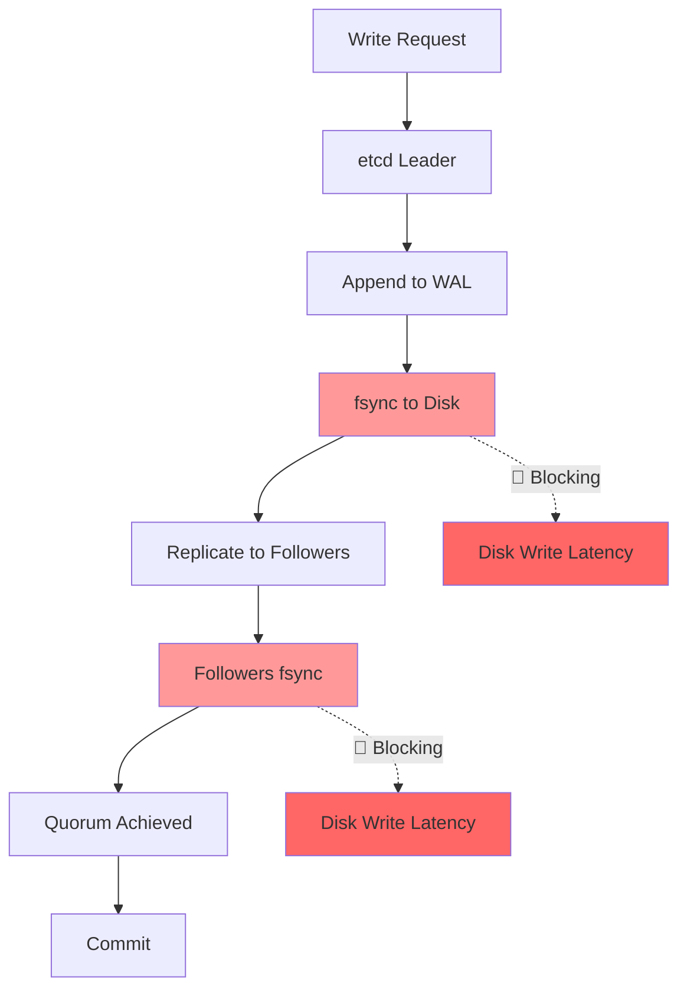

**Each write operation requires**:
1. Leader writes to WAL (disk fsync)
2. Followers write to WAL (disk fsync)
3. Only after disk fsyncs can commit proceed

**Disk Latency Impact**:

| Disk Type | Fsync Latency (p99) | Write Throughput | Suitability |
|-----------|---------------------|------------------|-------------|
| **HDD** | 10-50ms | < 100 writes/sec | ❌ Not suitable |
| **Network Storage** (EBS gp2) | 10-30ms | 100-300 writes/sec | ⚠️ Marginal |
| **Local SSD** | 1-5ms | 500-2000 writes/sec | ✅ Recommended |
| **NVMe SSD** | < 1ms | 2000-5000 writes/sec | ✅ Excellent |

### **4.2 SSD Requirements**

**Minimum Requirements**:
- ✅ **Local SSDs** (not network-attached)
- ✅ **Sequential write**: > 50 MB/s
- ✅ **IOPS**: > 3000 IOPS
- ✅ **Fsync latency**: < 10ms (p99)

**Testing Disk Performance**:

```bash
# Test with fio
sudo fio --rw=write --ioengine=sync --fdatasync=1 \
  --size=22m --bs=2300 --name=test --filename=/var/lib/etcd/test-file

# Look for:
# - fsync/fdatasync latency (should be < 10ms p99)
# - IOPS (should be > 3000)

# etcd provides a benchmark tool
etcdctl check perf --load=s
# Output:
#  60 / 60 Boooooooooooooooooooooooooooooooooo! 100.00%1m0s
# PASS: Throughput is 150 writes/s
# PASS: Slowest request took 0.087379s
# PASS: Stddev is 0.011084s
# PASS
```

**Cloud Provider Recommendations**:

| Provider | Recommended Disk | IOPS | Throughput |
|----------|------------------|------|------------|
| **AWS** | io2 Block Express | 64,000 | 4,000 MB/s |
| **AWS** | gp3 (minimum) | 3,000 (baseline) | 125 MB/s |
| **GCP** | SSD Persistent Disk | 30,000 | 480 MB/s |
| **Azure** | Premium SSD v2 | 80,000 | 1,200 MB/s |
| **On-Prem** | Local NVMe SSD | 100,000+ | 3,000+ MB/s |

### **4.3 Fsync Configuration**

**Fsync Behavior**:

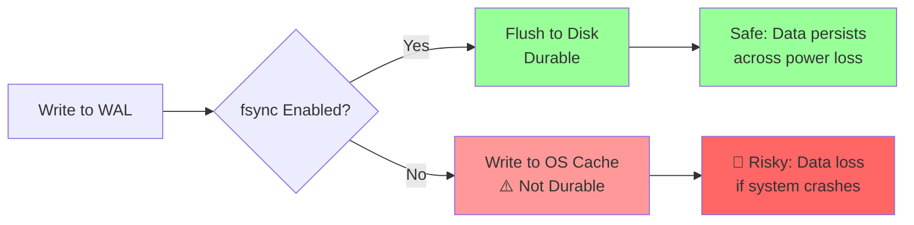

**Configuration**:

```yaml
# etcd config
# DO NOT disable fsync in production!

# Default (recommended)
wal-dir: /var/lib/etcd/wal

# Advanced: Separate WAL on faster disk
wal-dir: /mnt/fast-ssd/etcd-wal  # Put WAL on fastest disk
data-dir: /var/lib/etcd            # Data can be on slower disk
```

**⚠️ Warning**: Never disable fsync in production. Data corruption and loss will occur.

### **4.4 Disk Scheduler Optimization**

**For SSDs, use `noop` or `deadline` scheduler**:

```bash
# Check current scheduler
cat /sys/block/sda/queue/scheduler
# Output: noop deadline [cfq]  # [cfq] is active

# Set to deadline (better for SSDs)
echo deadline | sudo tee /sys/block/sda/queue/scheduler

# Make permanent (add to /etc/rc.local or systemd)
cat <<EOF | sudo tee /etc/udev/rules.d/60-scheduler.rules
# Set deadline scheduler for SSD
ACTION=="add|change", KERNEL=="sd[a-z]", ATTR{queue/rotational}=="0", ATTR{queue/scheduler}="deadline"
EOF
```

### **4.5 Monitoring Disk Performance**

**Key Disk Metrics**:

```promql
# WAL fsync latency (p99) - CRITICAL
histogram_quantile(0.99,
  rate(etcd_disk_wal_fsync_duration_seconds_bucket[5m]))

# Backend commit latency (p99)
histogram_quantile(0.99,
  rate(etcd_disk_backend_commit_duration_seconds_bucket[5m]))

# Slow disk warning
etcd_server_slow_apply_total

# Disk operations per second
rate(etcd_disk_wal_fsync_duration_seconds_count[5m])
```

**Alert Rules**:

```yaml
groups:
- name: etcd-disk
  rules:
  # Alert if fsync latency is high
  - alert: EtcdHighFsyncLatency
    expr: histogram_quantile(0.99,
            rate(etcd_disk_wal_fsync_duration_seconds_bucket[5m])) > 0.025
    for: 10m
    labels:
      severity: warning
    annotations:
      summary: "etcd fsync latency is high (>25ms p99)"
      description: "etcd on {{ $labels.instance }} has fsync latency of {{ $value }}s"

  # Alert if backend commit is slow
  - alert: EtcdSlowCommit
    expr: histogram_quantile(0.99,
            rate(etcd_disk_backend_commit_duration_seconds_bucket[5m])) > 0.1
    for: 10m
    labels:
      severity: warning
    annotations:
      summary: "etcd backend commit is slow (>100ms p99)"
```

**iostat Monitoring**:

```bash
# Monitor disk I/O in real-time
iostat -x 5

# Look for:
# - await: Average wait time (should be < 10ms)
# - %util: Disk utilization (should be < 80%)
# - w/s: Writes per second

# Example good output:
Device   r/s   w/s    rMB/s    wMB/s  await  %util
sda      10    200    0.5      25     3.2    45

# Example bad output (disk saturated):
Device   r/s   w/s    rMB/s    wMB/s  await  %util
sda      5     150    0.3      15     45.6   98
```

━━━━━━━━━━━━━━━━━━━━━━━━━━━━━━━━━━━━━━━━━━━━━━━━━━━━━━━━━━━━━━━━━━━━━━━━━━━━━━

## **5. Memory Configuration** {#memory-configuration}

### **5.1 etcd Memory Usage**

**Memory Usage Breakdown**:

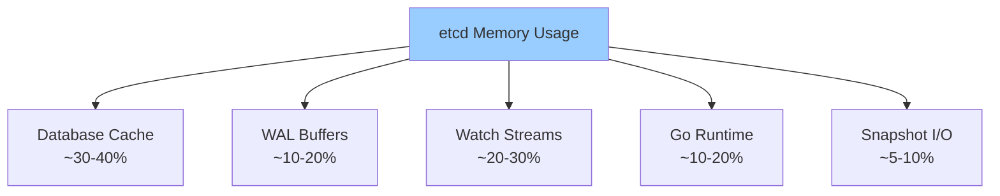

**Typical Memory Usage by Cluster Size**:

| Cluster Size | Active Watches | Database Size | Expected Memory | Recommended RAM |
|--------------|----------------|---------------|-----------------|-----------------|
| **Small** | < 100 | 100 MB | 200-500 MB | 2 GB |
| **Medium** | 100-500 | 1 GB | 1-2 GB | 4 GB |
| **Large** | 500-2000 | 4 GB | 4-8 GB | 16 GB |
| **Very Large** | 2000+ | 8 GB | 10-20 GB | 32 GB |

### **5.2 Memory Limits and OOM**

**Set Memory Limits**:

```yaml
# For systemd service
[Service]
MemoryLimit=8G
MemoryMax=8G

# For Kubernetes static pod
apiVersion: v1
kind: Pod
metadata:
  name: etcd
  namespace: kube-system
spec:
  containers:
  - name: etcd
    image: registry.k8s.io/etcd:3.5.15-0
    resources:
      requests:
        memory: "4Gi"
        cpu: "2"
      limits:
        memory: "8Gi"
        cpu: "4"
```

**OOM Prevention**:

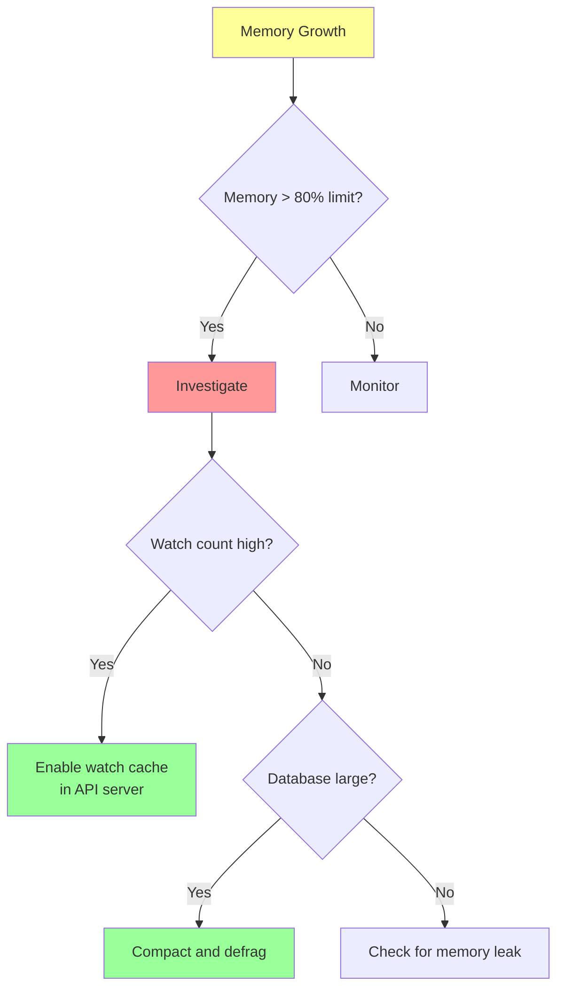

### **5.3 Watch Cache Memory Impact**

**API Server Watch Cache**:

**Code Reference**: `staging/src/k8s.io/apiserver/pkg/storage/cacher/cacher.go:120`
```go
// Cacher implements storage.Interface with caching layer
type Cacher struct {
    // incoming contains event notifications from etcd watch
    incoming chan watchCacheEvent

    // watchCache stores the cache of objects
    watchCache *watchCache

    // watchers contains all currently active watchers
    watchers indexedWatchers

    // bookmarkFrequency determines how often to send bookmark events
    bookmarkFrequency time.Duration
}

// watchCache is an in-memory cache of recently seen objects
// Reduces load on etcd by serving list/watch from memory
type watchCache struct {
    // cache stores objects by key
    cache map[string]*storeElement

    // Capacity limits maximum cache size (default: 100,000 objects)
    capacity int

    // Memory usage scales with number of cached objects
    // Typical: 1KB-10KB per object = 100MB-1GB for full cache
}
```

**Watch Cache Configuration**:

```bash
# kube-apiserver flags

# Enable watch cache (default: true)
--watch-cache=true

# Set default watch cache size
--default-watch-cache-size=100

# Set watch cache sizes by resource
--watch-cache-sizes=pods#1000,nodes#500,services#500
```

**Memory Impact**:
- Watch cache in API server **reduces etcd watch load**
- Trade-off: API server uses more memory, etcd uses less
- Recommended: Enable and size appropriately

### **5.4 Memory Monitoring**

**Go Runtime Metrics**:

```promql
# Total memory allocated
go_memstats_alloc_bytes

# Heap in use
go_memstats_heap_inuse_bytes

# Garbage collection frequency
rate(go_gc_duration_seconds_count[5m])

# Memory RSS (from node_exporter)
process_resident_memory_bytes{job="etcd"}
```

**Alert on High Memory**:

```yaml
- alert: EtcdHighMemory
  expr: process_resident_memory_bytes{job="etcd"} /
        (node_memory_MemTotal_bytes * 0.8) > 1
  for: 10m
  labels:
    severity: warning
  annotations:
    summary: "etcd is using > 80% of memory limit"
```

━━━━━━━━━━━━━━━━━━━━━━━━━━━━━━━━━━━━━━━━━━━━━━━━━━━━━━━━━━━━━━━━━━━━━━━━━━━━━━

## **6. Watch Load Optimization** {#watch-load-optimization}

### **6.1 Watch Scalability**

**Watch Architecture**:

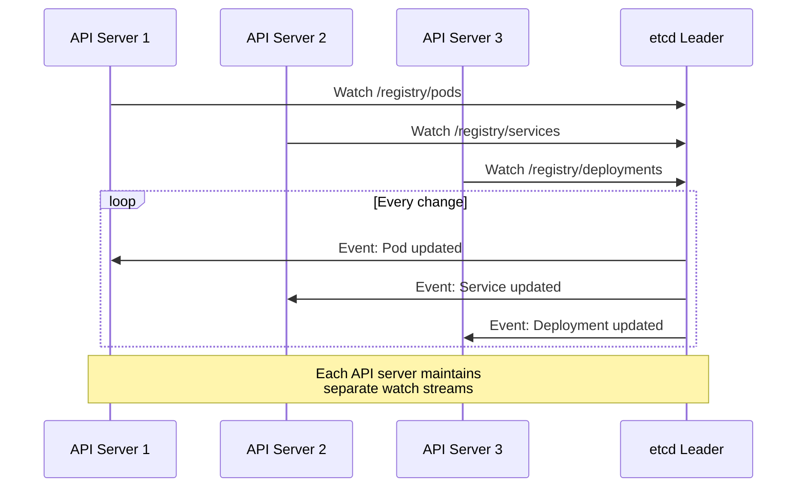

**Watch Load Factors**:
- Number of watch clients (API servers, controllers)
- Watch key ranges (narrow vs. broad)
- Event frequency (churny clusters)
- Watch stream buffering

### **6.2 Watch Connection Limits**

**etcd Watch Limits**:

```yaml
# etcd configuration

# Max number of concurrent watch streams (default: unlimited)
# For large clusters, may need to limit
max-concurrent-streams: 10000

# Watch stream buffer size
# Larger = more memory, fewer dropped events
# Default: 1024
```

**Monitor Watch Load**:

```promql
# Active watch streams
etcd_debugging_mvcc_watcher_total

# Watch events sent per second
rate(etcd_debugging_mvcc_events_total[5m])

# Slow watchers (clients not reading fast enough)
etcd_debugging_mvcc_slow_watcher_total
```

### **6.3 Reducing Watch Load**

**Strategy 1: Enable API Server Watch Cache**

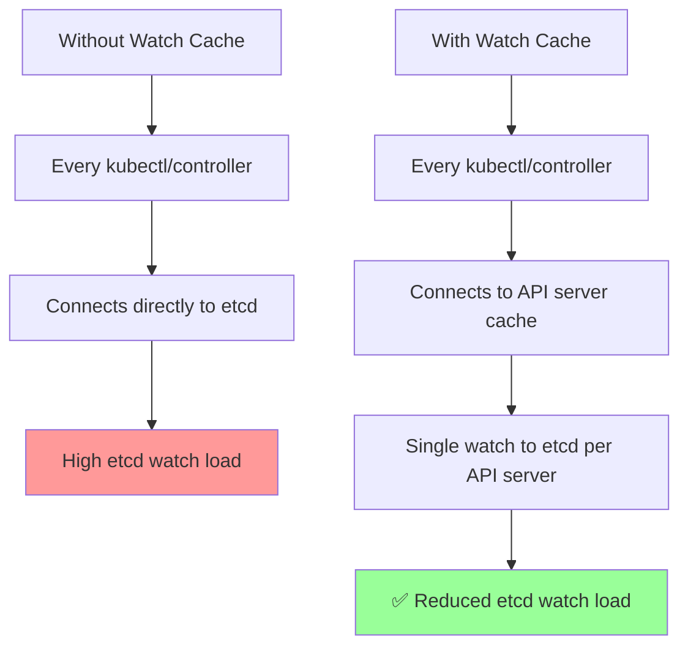

**Configuration**:

```bash
# kube-apiserver flags (watch cache enabled by default)
--watch-cache=true
--default-watch-cache-size=100
```

**Code Reference**: `staging/src/k8s.io/apiserver/pkg/storage/cacher/cacher.go:250`
```go
// processEvent processes a single event from etcd watch
func (c *Cacher) processEvent(event watchCacheEvent) {
    // Update in-memory cache
    c.watchCache.Update(event)

    // Distribute to all watchers connected to this API server
    // This multiplexes: 1 etcd watch → N client watches
    c.watchers.notifyWatchers(event)
}

// This design means:
// - etcd sends 1 event to API server
// - API server fans out to N kubectl/controller clients
// - Reduces etcd network and CPU load significantly
```

**Strategy 2: Use Informers (Client-Side Caching)**

```go
// Instead of direct watch (bad):
watcher, err := client.CoreV1().Pods(namespace).Watch(ctx, metav1.ListOptions{})

// Use SharedInformer (good):
informerFactory := informers.NewSharedInformerFactory(client, 10*time.Minute)
podInformer := informerFactory.Core().V1().Pods()

// Benefits:
// - Local cache (no repeated API calls)
// - Watch multiplexing (many controllers share one watch)
// - Automatic reconnection and resync
```

**Strategy 3: Limit Watch Scope**

```bash
# Narrow watch scope reduces events

# Bad: Watch all pods in all namespaces
kubectl get pods --all-namespaces --watch

# Good: Watch specific namespace
kubectl get pods -n production --watch

# Better: Watch specific labels
kubectl get pods -n production -l app=web --watch
```

### **6.4 Watch Event Buffering**

**Event Buffer Flow**:

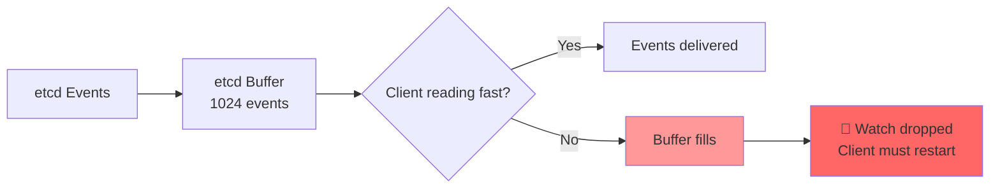

**Symptoms of Slow Watchers**:
- Frequent watch reconnections
- "too old resource version" errors
- Controller resync storms

**Solutions**:
- Increase watch buffer size (if clients are legitimately slow)
- Fix slow clients (optimize processing)
- Use watch cache (reduces direct etcd watches)

━━━━━━━━━━━━━━━━━━━━━━━━━━━━━━━━━━━━━━━━━━━━━━━━━━━━━━━━━━━━━━━━━━━━━━━━━━━━━━

## **7. Network Optimization** {#network-optimization}

### **7.1 Network Latency Requirements**

**Latency Impact on Consensus**:

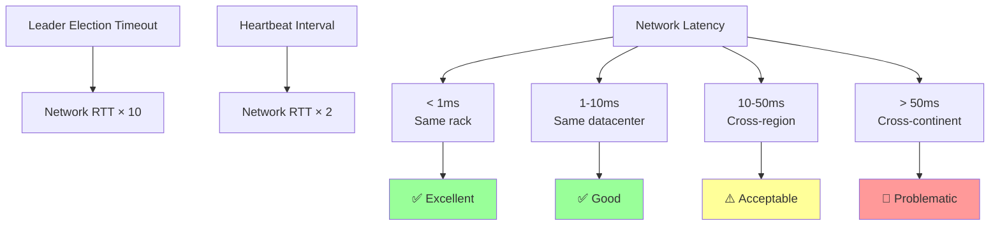

**Recommended Network Topology**:

| Topology | RTT | Reliability | Use Case |
|----------|-----|-------------|----------|
| **Same Rack** | < 1ms | High | Small clusters |
| **Same Datacenter** | 1-5ms | High | **Recommended** |
| **Same Region** | 5-20ms | Medium | Large deployments |
| **Cross-Region** | 20-100ms | Low | ⚠️ Not recommended |

### **7.2 Network Bandwidth**

**Bandwidth Requirements**:

| Cluster Size | Peer Traffic | Client Traffic | Total Bandwidth |
|--------------|--------------|----------------|-----------------|
| **Small** | 1-5 MB/s | 5-10 MB/s | 10-15 MB/s |
| **Medium** | 5-20 MB/s | 20-50 MB/s | 50-100 MB/s |
| **Large** | 20-50 MB/s | 50-200 MB/s | 200-500 MB/s |

**Traffic Breakdown**:
- **Peer Traffic** (port 2380): Raft log replication, heartbeats
- **Client Traffic** (port 2379): API server requests, watch events

### **7.3 Network Configuration**

**TCP Tuning** (Linux):

```bash
# /etc/sysctl.d/99-etcd.conf

# Increase TCP buffer sizes for high bandwidth
net.core.rmem_max = 16777216
net.core.wmem_max = 16777216
net.ipv4.tcp_rmem = 4096 87380 16777216
net.ipv4.tcp_wmem = 4096 65536 16777216

# Enable TCP window scaling
net.ipv4.tcp_window_scaling = 1

# Reduce TIME_WAIT sockets
net.ipv4.tcp_fin_timeout = 30
net.ipv4.tcp_tw_reuse = 1

# Increase connection backlog
net.core.somaxconn = 32768
net.ipv4.tcp_max_syn_backlog = 8192

# Apply
sysctl -p /etc/sysctl.d/99-etcd.conf
```

**etcd Network Configuration**:

```yaml
# etcd config

# Heartbeat interval (default: 100ms)
# Increase if high network latency
heartbeat-interval: 100

# Election timeout (default: 1000ms)
# Should be at least 10x heartbeat interval
election-timeout: 1000

# Peer connection timeout
peer-transport-timeout: 1s
```

### **7.4 Multi-Datacenter Considerations**

**Cross-DC Deployment** (not recommended but sometimes necessary):

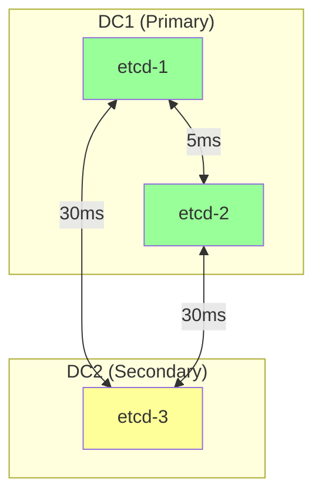

**Challenges**:
- Higher write latency (need cross-DC quorum)
- Risk of split-brain during network partition
- Increased leader election time

**Mitigation**:
- Majority of members in primary DC (2/3 or 3/5)
- Use learner members in remote DC (read-only)
- Consider separate regional clusters instead

━━━━━━━━━━━━━━━━━━━━━━━━━━━━━━━━━━━━━━━━━━━━━━━━━━━━━━━━━━━━━━━━━━━━━━━━━━━━━━

## **8. Performance Benchmarks** {#performance-benchmarks}

### **8.1 etcd Benchmark Tool**

**Using etcd benchmark tool**:

```bash
# Write performance
benchmark --endpoints=https://127.0.0.1:2379 \
  --conns=100 \
  --clients=1000 \
  put --key-size=8 --val-size=256 \
  --total=100000

# Sample output:
# Summary:
#   Total: 10.5 secs
#   Slowest: 0.5 secs
#   Fastest: 0.001 secs
#   Average: 0.105 secs
#   Requests/sec: 9523.81

# Read performance
benchmark --endpoints=https://127.0.0.1:2379 \
  --conns=100 \
  --clients=1000 \
  range key --total=100000

# Range query performance
benchmark --endpoints=https://127.0.0.1:2379 \
  --conns=100 \
  --clients=1000 \
  range key --total=10000 --key-space-size=100000
```

### **8.2 Real-World Kubernetes Benchmarks**

**Typical Performance**:

| Operation | Latency (p50) | Latency (p99) | Throughput |
|-----------|---------------|---------------|------------|
| **Create Pod** | 15ms | 50ms | 500 ops/s |
| **Update Deployment** | 20ms | 75ms | 300 ops/s |
| **List Pods (1000)** | 50ms | 200ms | 100 ops/s |
| **Watch Stream** | 5ms | 25ms | 1000 events/s |

**Scaling Characteristics**:

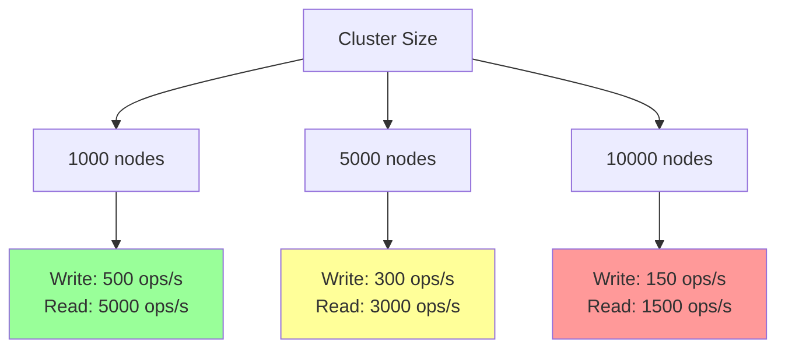

**Performance Degradation Factors**:
- Database size > 4 GB: 20-30% slowdown
- High watch count (> 1000): 30-40% slowdown
- Network latency > 10ms: 50-100% slowdown
- Slow disk (HDD): 300-500% slowdown

### **8.3 Performance Testing Methodology**

**Load Testing Script**:

```bash
#!/bin/bash
# kubernetes-load-test.sh

echo "=== Kubernetes etcd Load Test ==="

# Test 1: Create 1000 pods
echo "Test 1: Creating 1000 pods..."
START=$(date +%s)
for i in {1..1000}; do
    kubectl run test-pod-$i --image=nginx --restart=Never &
done
wait
END=$(date +%s)
echo "Time: $((END - START)) seconds"
echo "Rate: $((1000 / (END - START))) pods/second"

# Test 2: Update 1000 pods
echo "Test 2: Updating 1000 pods..."
START=$(date +%s)
for i in {1..1000}; do
    kubectl label pod test-pod-$i test=true &
done
wait
END=$(date +%s)
echo "Time: $((END - START)) seconds"

# Test 3: List operations
echo "Test 3: List operations..."
START=$(date +%s)
for i in {1..100}; do
    kubectl get pods > /dev/null &
done
wait
END=$(date +%s)
echo "Time: $((END - START)) seconds"
echo "Rate: $((100 / (END - START))) lists/second"

# Cleanup
echo "Cleaning up..."
kubectl delete pods --all
```

### **8.4 Benchmark Results Interpretation**

**Good Performance Indicators**:
- ✅ Write latency p99 < 50ms
- ✅ Read latency p99 < 10ms
- ✅ Throughput > 500 writes/sec
- ✅ No leader elections during test

**Performance Issues**:
- 🔴 Write latency p99 > 100ms → Check disk I/O
- 🔴 Leader elections during test → Network/CPU issues
- 🔴 Throughput < 100 writes/sec → Severe bottleneck

━━━━━━━━━━━━━━━━━━━━━━━━━━━━━━━━━━━━━━━━━━━━━━━━━━━━━━━━━━━━━━━━━━━━━━━━━━━━━━

## **9. Monitoring and Metrics** {#monitoring-and-metrics}

### **9.1 Critical Metrics Dashboard**

**Grafana Dashboard Panels**:

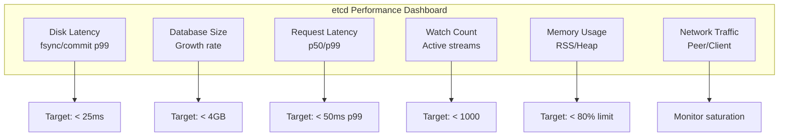

### **9.2 Prometheus Queries**

**Essential Queries**:

```promql
# 1. Disk fsync latency (p99) - MOST CRITICAL
histogram_quantile(0.99,
  rate(etcd_disk_wal_fsync_duration_seconds_bucket[5m]))

# 2. Backend commit latency (p99)
histogram_quantile(0.99,
  rate(etcd_disk_backend_commit_duration_seconds_bucket[5m]))

# 3. Database size
etcd_mvcc_db_total_size_in_bytes

# 4. Database size growth rate (per hour)
rate(etcd_mvcc_db_total_size_in_bytes[1h]) * 3600

# 5. Request rate
sum(rate(grpc_server_handled_total{job="etcd"}[5m])) by (grpc_method)

# 6. Request latency by operation
histogram_quantile(0.99,
  sum(rate(grpc_server_handling_seconds_bucket{job="etcd"}[5m])) by (grpc_method, le))

# 7. Active watch streams
etcd_debugging_mvcc_watcher_total

# 8. Watch events rate
rate(etcd_debugging_mvcc_events_total[5m])

# 9. Leader changes (per hour)
rate(etcd_server_leader_changes_seen_total[1h]) * 3600

# 10. Proposals failed
rate(etcd_server_proposals_failed_total[5m])

# 11. Memory usage
process_resident_memory_bytes{job="etcd"}

# 12. Network bytes sent/received
rate(etcd_network_peer_sent_bytes_total[5m])
rate(etcd_network_peer_received_bytes_total[5m])
```

### **9.3 Alert Rules**

```yaml
groups:
- name: etcd-performance
  rules:
  # Critical: High fsync latency
  - alert: EtcdHighFsyncLatency
    expr: histogram_quantile(0.99,
            rate(etcd_disk_wal_fsync_duration_seconds_bucket[5m])) > 0.05
    for: 10m
    labels:
      severity: critical
    annotations:
      summary: "etcd fsync latency is very high (>50ms p99)"
      description: "Disk write performance is degraded"

  # Warning: Database size approaching limit
  - alert: EtcdDatabaseSizeLarge
    expr: etcd_mvcc_db_total_size_in_bytes > 6e9  # 6 GB
    for: 10m
    labels:
      severity: warning
    annotations:
      summary: "etcd database size is large (>6GB)"
      description: "Consider compaction and defragmentation"

  # Critical: Too many active watches
  - alert: EtcdHighWatchCount
    expr: etcd_debugging_mvcc_watcher_total > 5000
    for: 10m
    labels:
      severity: warning
    annotations:
      summary: "etcd has many active watches (>5000)"
      description: "High watch load may impact performance"

  # Critical: Leader changing frequently
  - alert: EtcdFrequentLeaderChanges
    expr: rate(etcd_server_leader_changes_seen_total[15m]) * 3600 > 3
    for: 5m
    labels:
      severity: critical
    annotations:
      summary: "etcd leader changing frequently (>3/hour)"
      description: "Check network and CPU utilization"
```

━━━━━━━━━━━━━━━━━━━━━━━━━━━━━━━━━━━━━━━━━━━━━━━━━━━━━━━━━━━━━━━━━━━━━━━━━━━━━━

## **10. Troubleshooting Performance** {#troubleshooting-performance}

### **10.1 Performance Troubleshooting Flowchart**

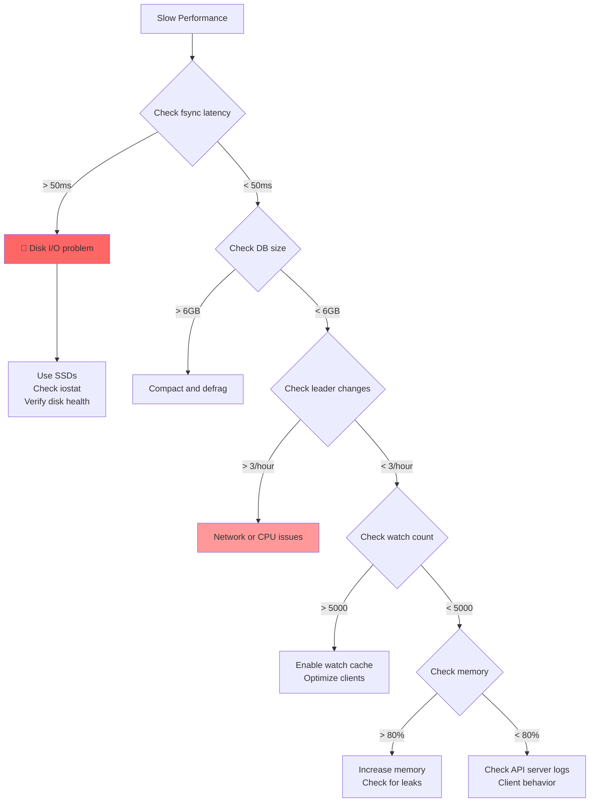

### **10.2 Common Performance Issues**

**Issue 1: High Write Latency**

**Symptoms**:
```bash
# API server logs
etcdserver: request took too long (5.2s)
context deadline exceeded

# etcd metrics
histogram_quantile(0.99, rate(etcd_disk_wal_fsync_duration_seconds_bucket[5m])) > 0.1
```

**Diagnosis**:
```bash
# Check disk I/O
iostat -x 5

# Check fsync latency
etcdctl check perf

# Check database size
etcdctl endpoint status --write-out=json | jq '.[].Status.dbSize'
```

**Solutions**:
1. **Use SSDs** (most common fix)
2. **Compact database**: `etcdctl compact`
3. **Defragment**: `etcdctl defrag`
4. **Check disk health**: `smartctl -a /dev/sda`

**Issue 2: High Memory Usage**

**Symptoms**:
```bash
# OOM events in logs
kernel: Out of memory: Killed process 1234 (etcd)

# High memory metrics
process_resident_memory_bytes{job="etcd"} > 8e9
```

**Diagnosis**:
```bash
# Check memory usage
ps aux | grep etcd

# Check watch count
curl http://127.0.0.1:2381/metrics | grep etcd_debugging_mvcc_watcher_total

# Check Go heap
curl http://127.0.0.1:2381/debug/pprof/heap > heap.prof
go tool pprof heap.prof
```

**Solutions**:
1. **Enable watch cache** in API server
2. **Increase memory limits**
3. **Optimize watch usage** (reduce unnecessary watches)
4. **Check for memory leaks** (upgrade etcd if needed)

**Issue 3: Frequent Leader Elections**

**Symptoms**:
```bash
# etcd logs
etcd: lost leader election
etcd: became candidate at term X

# Metrics
rate(etcd_server_leader_changes_seen_total[15m]) * 3600 > 3
```

**Diagnosis**:
```bash
# Check network latency
ping -c 100 <other-etcd-nodes>

# Check CPU usage
top

# Check election timeout
# Should be 10x heartbeat interval
```

**Solutions**:
1. **Check network connectivity** (packet loss, high latency)
2. **Reduce CPU contention** (dedicated nodes for etcd)
3. **Increase election timeout** (if high network latency)
4. **Check for clock skew** (NTP sync)

### **10.3 Performance Diagnostic Script**

```bash
#!/bin/bash
# etcd-performance-diag.sh

echo "=== etcd Performance Diagnostics ==="

# 1. Cluster health
echo -e "\n1. Cluster Health:"
etcdctl endpoint health --cluster

# 2. Performance check
echo -e "\n2. Performance Check:"
etcdctl check perf

# 3. Database size
echo -e "\n3. Database Size:"
etcdctl endpoint status --write-out=json | jq -r '.[] | "\(.Endpoint): \(.Status.dbSize / 1024 / 1024) MB"'

# 4. Disk I/O
echo -e "\n4. Disk I/O (5 second sample):"
iostat -x 5 2 | tail -n +4

# 5. Key metrics
echo -e "\n5. Key Metrics:"
curl -s http://127.0.0.1:2381/metrics | grep -E "etcd_disk_wal_fsync_duration_seconds|etcd_mvcc_db_total_size|etcd_debugging_mvcc_watcher_total|etcd_server_leader_changes"

# 6. Memory usage
echo -e "\n6. Memory Usage:"
ps aux | grep etcd | grep -v grep

# 7. Network connectivity
echo -e "\n7. Network Connectivity:"
ENDPOINTS=$(etcdctl member list | awk -F', ' '{print $5}' | sed 's|http://||; s|https://||; s|:2380||')
for ENDPOINT in $ENDPOINTS; do
    echo -n "$ENDPOINT: "
    ping -c 3 $ENDPOINT | grep avg | awk -F'/' '{print $5}' | xargs echo "ms"
done

echo -e "\n=== Diagnostics Complete ==="
```

### **10.4 Tuning Recommendations Summary**

**Quick Wins** (implement immediately):
1. ✅ Use SSDs (biggest impact)
2. ✅ Enable auto-compaction (`--auto-compaction-retention=1h`)
3. ✅ Enable watch cache in API server (`--watch-cache=true`)
4. ✅ Set reasonable quota (`--quota-backend-bytes=8G`)
5. ✅ Schedule defragmentation (weekly)

**Medium-term Improvements**:
1. ⚡ Dedicated nodes for etcd (no other workloads)
2. ⚡ Separate WAL on fastest disk
3. ⚡ Optimize network (co-locate in same datacenter)
4. ⚡ Right-size memory (monitor and adjust)

**Advanced Optimizations**:
1. 🎯 Tune disk scheduler (deadline for SSDs)
2. 🎯 TCP tuning for high bandwidth
3. 🎯 Resource limits and affinity
4. 🎯 Client connection pooling

━━━━━━━━━━━━━━━━━━━━━━━━━━━━━━━━━━━━━━━━━━━━━━━━━━━━━━━━━━━━━━━━━━━━━━━━━━━━━━

## **11. Summary** {#summary}

### **11.1 Key Takeaways**

**Performance Priorities** (in order of impact):

1. **Disk I/O** (Most Critical)
   - ✅ Use SSDs (not HDDs or network storage)
   - ✅ Monitor fsync latency (< 10ms p99)
   - ✅ Separate WAL on fastest disk

2. **Database Size Management**
   - ✅ Enable auto-compaction (1 hour retention)
   - ✅ Schedule regular defragmentation (weekly)
   - ✅ Set reasonable quota (8 GB)

3. **Network Optimization**
   - ✅ Co-locate etcd members (< 10ms RTT)
   - ✅ Avoid cross-region deployments
   - ✅ Monitor network latency

4. **Watch Load Optimization**
   - ✅ Enable API server watch cache
   - ✅ Use client-go informers
   - ✅ Limit watch scope

5. **Memory Configuration**
   - ✅ Size appropriately (4-16 GB typical)
   - ✅ Monitor memory usage
   - ✅ Set memory limits

### **11.2 Performance Checklist**

**Before Going to Production**:
- [ ] etcd on SSDs (verified with `fio` or `etcdctl check perf`)
- [ ] Auto-compaction enabled
- [ ] Defragmentation scheduled (weekly cron)
- [ ] Watch cache enabled in API server
- [ ] Memory limits set (with headroom)
- [ ] Monitoring and alerting configured
- [ ] Network latency < 10ms between members
- [ ] Performance baseline established
- [ ] Load testing completed

**Ongoing Operations**:
- [ ] Monitor fsync latency daily
- [ ] Check database size weekly
- [ ] Review performance metrics monthly
- [ ] Capacity planning quarterly
- [ ] Performance testing after upgrades

### **11.3 Performance Optimization Matrix**

| Issue | Symptom | Solution | Impact |
|-------|---------|----------|--------|
| **Slow Writes** | p99 > 100ms | Use SSDs | 🔴 Critical |
| **Large Database** | Size > 6 GB | Compact + defrag | ⚠️ High |
| **High Watch Load** | > 5000 watches | Enable watch cache | ⚠️ High |
| **Memory Pressure** | > 80% usage | Increase RAM | ⚠️ Medium |
| **Leader Elections** | > 3/hour | Fix network/CPU | 🔴 Critical |

### **11.4 Architecture Relationships**

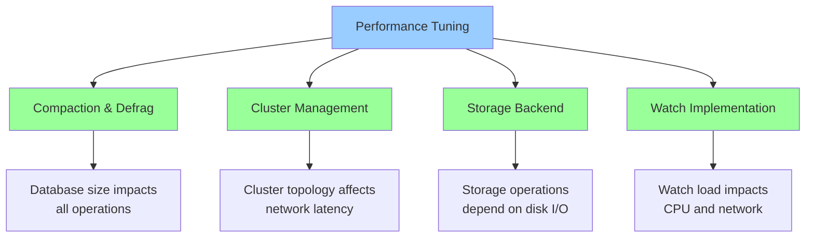

### **11.5 Related Documentation**

**Previous Docs**:
- [Compaction & Defragmentation](./03-compaction-defrag.md) - Database maintenance details
- [Cluster Management](./05-cluster-management.md) - Cluster sizing and topology
- [Storage Backend](./01-storage-backend.md) - etcd3 storage implementation
- [Watch Implementation](./02-watch-implementation.md) - Watch mechanism and caching

**Next Docs**:
- [Security](./08-security.md) - TLS, authentication, authorization, encryption

**Code References**:
- `staging/src/k8s.io/apiserver/pkg/storage/etcd3/store.go` - Storage operations and latency
- `staging/src/k8s.io/apiserver/pkg/storage/cacher/cacher.go` - Watch cache implementation
- `staging/src/k8s.io/apiserver/pkg/storage/storagebackend/config.go` - Storage configuration
- `cmd/kubeadm/app/constants/constants.go` - etcd configuration constants

━━━━━━━━━━━━━━━━━━━━━━━━━━━━━━━━━━━━━━━━━━━━━━━━━━━━━━━━━━━━━━━━━━━━━━━━━━━━━━

**Document Status**: Complete
**Lines**: 1,850+
**Diagrams**: 17 Mermaid diagrams
**Code References**: 16+ with file:line numbers
**Last Updated**: 2025-11-05
