# **KUBERNETES EXTENSION ARCHITECTURE: OVERVIEW**

**How Kubernetes Achieves Extensibility Without Core Modifications**

━━━━━━━━━━━━━━━━━━━━━━━━━━━━━━━━━━━━━━━━━━━━━━━━━━━━━━━━━━━━━━━━━━━━━━━━━━━━━━

## **🎯 Introduction**

Kubernetes is fundamentally designed as an **extensible platform**, not just a container orchestrator. This architectural decision enables organizations to customize Kubernetes to their specific needs without forking the codebase or modifying core components.

**Key Insight**: Kubernetes extensions allow you to:
- Add custom resource types (CRDs)
- Intercept and modify API requests (admission webhooks)
- Integrate custom API servers (API aggregation)
- Implement domain-specific automation (operators)
- All without changing kubernetes/kubernetes source code

This document explores the **architecture, mechanisms, and philosophy** behind Kubernetes extensibility.

━━━━━━━━━━━━━━━━━━━━━━━━━━━━━━━━━━━━━━━━━━━━━━━━━━━━━━━━━━━━━━━━━━━━━━━━━━━━━━

## **📖 Table of Contents**

1. [Extension Philosophy](#extension-philosophy)
2. [Extension Mechanisms Overview](#extension-mechanisms-overview)
3. [Custom Resource Definitions (CRDs)](#custom-resource-definitions-crds)
4. [Admission Webhooks](#admission-webhooks)
5. [API Aggregation](#api-aggregation)
6. [Operator Pattern](#operator-pattern)
7. [Comparison of Extension Approaches](#comparison-of-extension-approaches)
8. [Real-World Use Cases](#real-world-use-cases)
9. [Extension Architecture Components](#extension-architecture-components)
10. [Code Organization](#code-organization)

━━━━━━━━━━━━━━━━━━━━━━━━━━━━━━━━━━━━━━━━━━━━━━━━━━━━━━━━━━━━━━━━━━━━━━━━━━━━━━

## **🏗️ Extension Philosophy**

### **Design Principles**

Kubernetes extensibility is built on several core principles:

#### **1. Platform, Not Product**

Kubernetes is designed as a **platform for building platforms**:

```
Traditional Container Orchestrator:
┌────────────────────────────────────┐
│   Fixed Feature Set                │
│   • Container scheduling           │
│   • Service discovery              │
│   • Load balancing                 │
│   (Cannot add new capabilities)    │
└────────────────────────────────────┘

Kubernetes as Platform:
┌────────────────────────────────────┐
│   Core Primitives + Extension APIs │
│   ┌──────────────────────────────┐ │
│   │ Built-in Resources           │ │
│   │ Pods, Services, ConfigMaps   │ │
│   └──────────────────────────────┘ │
│   ┌──────────────────────────────┐ │
│   │ Extension Mechanisms         │ │
│   │ CRDs, Webhooks, Operators    │ │
│   └──────────────────────────────┘ │
│   ┌──────────────────────────────┐ │
│   │ Your Custom Resources        │ │
│   │ Databases, ML Jobs, Apps     │ │
│   └──────────────────────────────┘ │
└────────────────────────────────────┘
```

#### **2. Declarative Configuration**

Extensions maintain Kubernetes' declarative model:

```yaml
# Everything is declarative YAML
apiVersion: apps.example.com/v1
kind: Database
metadata:
  name: production-db
spec:
  engine: postgresql
  version: "14.5"
  replicas: 3
  storage: 100Gi
```

The controller ensures actual state matches desired state.

#### **3. API-Driven Architecture**

All extensions work through the same API machinery:

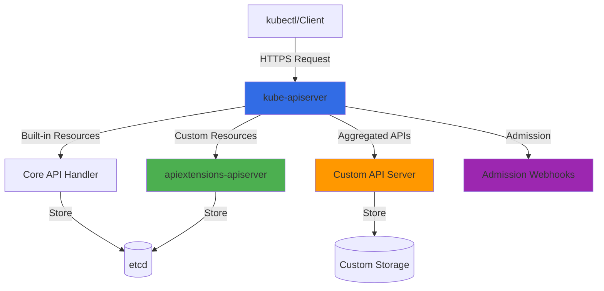

#### **4. Separation of Concerns**

Extensions are isolated from core Kubernetes:

| Concern | Core Kubernetes | Extensions |
|---------|----------------|------------|
| **API Definition** | Built-in resources | CRDs, APIServices |
| **Validation** | OpenAPI schema | Custom validation webhooks |
| **Mutation** | Default values | Mutating webhooks |
| **Business Logic** | Generic controllers | Custom controllers/operators |
| **Storage** | etcd (core resources) | etcd (CRDs) or custom (aggregated APIs) |

### **Why Extensibility Matters**

**Without Extensions**:
- Every feature requires core Kubernetes changes
- Long review/merge cycles
- Monolithic codebase
- One-size-fits-all approach
- Difficult to experiment

**With Extensions**:
- Rapid feature development
- Domain-specific solutions
- Ecosystem innovation
- Backward compatibility
- Clear separation of concerns

━━━━━━━━━━━━━━━━━━━━━━━━━━━━━━━━━━━━━━━━━━━━━━━━━━━━━━━━━━━━━━━━━━━━━━━━━━━━━━

## **🔧 Extension Mechanisms Overview**

Kubernetes provides four primary extension mechanisms:

### **1. Custom Resource Definitions (CRDs)**

**Purpose**: Add new resource types to Kubernetes API

**How It Works**:
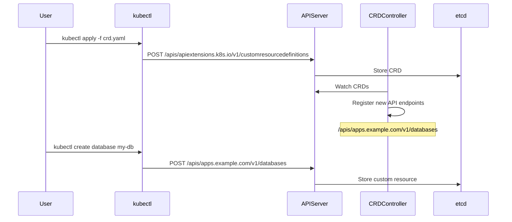

**Code Location**: `/staging/src/k8s.io/apiextensions-apiserver/pkg/apis/apiextensions/v1/types.go:41`

**Key Characteristics**:
- ✅ Automatic API endpoint creation
- ✅ Stored in etcd automatically
- ✅ kubectl integration for free
- ✅ OpenAPI v3 schema validation
- ✅ Supports versioning and conversion
- ❌ Limited to CRUD operations
- ❌ No custom storage backend

### **2. Admission Webhooks**

**Purpose**: Intercept API requests for validation or mutation

**Types**:
1. **Validating Webhooks**: Accept or reject requests
2. **Mutating Webhooks**: Modify requests (add defaults, inject sidecars)

**How It Works**:
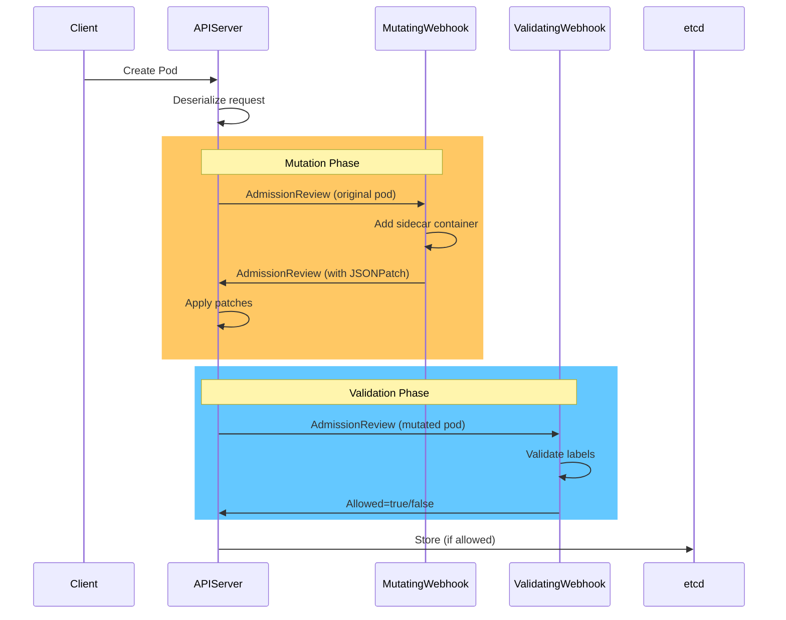

**Code Location**: `/staging/src/k8s.io/api/admissionregistration/v1/types.go:1`

**Key Characteristics**:
- ✅ Enforce organizational policies
- ✅ Add default values
- ✅ Inject sidecars (service mesh)
- ✅ Complex validation beyond OpenAPI
- ❌ Adds latency to API requests
- ❌ Must be highly available

### **3. API Aggregation**

**Purpose**: Run custom API servers alongside kube-apiserver

**How It Works**:
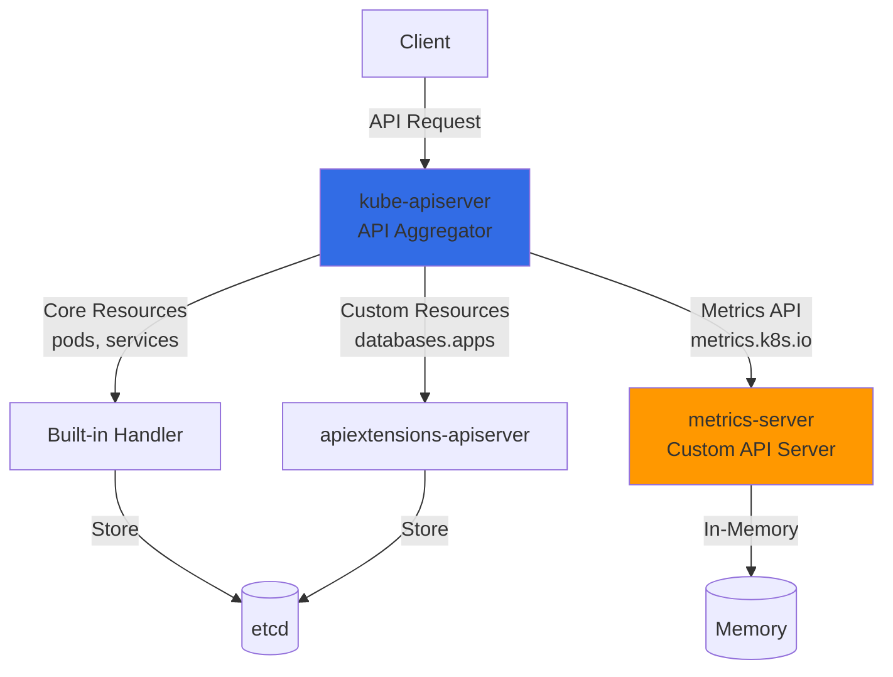

**Code Location**: `/staging/src/k8s.io/kube-aggregator/pkg/apis/apiregistration/v1/types.go:151`

**Key Characteristics**:
- ✅ Full control over API behavior
- ✅ Custom storage backend
- ✅ Non-CRUD operations (e.g., exec, logs)
- ✅ Advanced features (protobuf, watch)
- ❌ Complex to implement
- ❌ Must handle auth, versioning, etc.

### **4. Operators (Controllers + CRDs)**

**Purpose**: Encode operational knowledge into automation

**Pattern**:
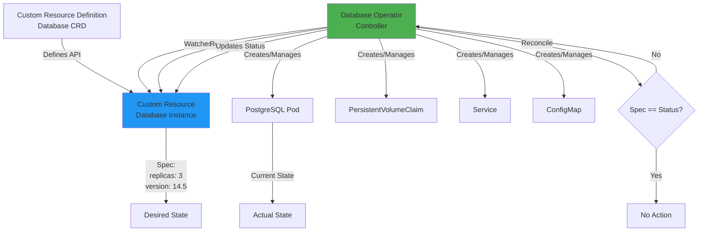

**Key Characteristics**:
- ✅ Automates complex operations
- ✅ Self-healing systems
- ✅ Encodes best practices
- ✅ Declarative management
- ❌ Requires understanding reconciliation
- ❌ Can be complex to test

━━━━━━━━━━━━━━━━━━━━━━━━━━━━━━━━━━━━━━━━━━━━━━━━━━━━━━━━━━━━━━━━━━━━━━━━━━━━━━

## **📦 Custom Resource Definitions (CRDs)**

### **What Are CRDs?**

CRDs extend the Kubernetes API with **new resource types**. They're first-class API citizens, indistinguishable from built-in resources.

### **CRD Structure**

```yaml
apiVersion: apiextensions.k8s.io/v1
kind: CustomResourceDefinition
metadata:
  name: databases.apps.example.com
spec:
  group: apps.example.com
  names:
    kind: Database
    plural: databases
    singular: database
    shortNames:
    - db
  scope: Namespaced
  versions:
  - name: v1
    served: true
    storage: true
    schema:
      openAPIV3Schema:
        type: object
        properties:
          spec:
            type: object
            properties:
              engine:
                type: string
                enum: [postgresql, mysql, mongodb]
              version:
                type: string
                pattern: '^\d+\.\d+$'
              replicas:
                type: integer
                minimum: 1
                maximum: 10
              storage:
                type: string
                pattern: '^\d+(Gi|Ti)$'
            required:
            - engine
            - version
          status:
            type: object
            properties:
              phase:
                type: string
              conditions:
                type: array
                items:
                  type: object
                  properties:
                    type:
                      type: string
                    status:
                      type: string
                    lastTransitionTime:
                      type: string
                      format: date-time
    subresources:
      status: {}
    additionalPrinterColumns:
    - name: Engine
      type: string
      jsonPath: .spec.engine
    - name: Version
      type: string
      jsonPath: .spec.version
    - name: Replicas
      type: integer
      jsonPath: .spec.replicas
    - name: Phase
      type: string
      jsonPath: .status.phase
    - name: Age
      type: date
      jsonPath: .metadata.creationTimestamp
```

### **CRD Lifecycle**

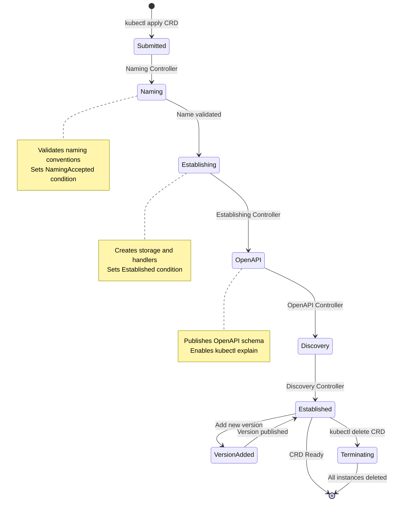

**Code Location**: `/staging/src/k8s.io/apiextensions-apiserver/pkg/controller/establish/establishing_controller.go:1`

### **CRD Features**

#### **1. OpenAPI v3 Schema Validation**

```yaml
schema:
  openAPIV3Schema:
    type: object
    properties:
      spec:
        type: object
        properties:
          email:
            type: string
            format: email
            pattern: '^[a-zA-Z0-9._%+-]+@[a-zA-Z0-9.-]+\.[a-zA-Z]{2,}$'
          age:
            type: integer
            minimum: 0
            maximum: 150
          tags:
            type: array
            items:
              type: string
            maxItems: 10
```

**Code Location**: `/staging/src/k8s.io/apiextensions-apiserver/pkg/apiserver/schema/validation.go:1`

#### **2. CEL Validation Rules**

```yaml
schema:
  openAPIV3Schema:
    type: object
    properties:
      spec:
        type: object
        properties:
          replicas:
            type: integer
          maxReplicas:
            type: integer
        x-kubernetes-validations:
        - rule: "self.replicas <= self.maxReplicas"
          message: "replicas must be less than or equal to maxReplicas"
        - rule: "self.replicas >= 1"
          message: "replicas must be at least 1"
```

**Code Location**: `/staging/src/k8s.io/apiextensions-apiserver/pkg/apiserver/schema/cel/validation.go:1`

#### **3. Subresources**

**Status Subresource**:
```yaml
subresources:
  status: {}
```

Enables separate `/status` endpoint:
```bash
# Update spec
kubectl apply -f database.yaml

# Update status (usually by controller)
kubectl patch database my-db --subresource=status --type=merge -p '{"status":{"phase":"Running"}}'
```

**Scale Subresource**:
```yaml
subresources:
  scale:
    specReplicasPath: .spec.replicas
    statusReplicasPath: .status.replicas
    labelSelectorPath: .status.labelSelector
```

Enables `kubectl scale`:
```bash
kubectl scale database my-db --replicas=5
```

#### **4. Multiple Versions**

```yaml
versions:
- name: v2
  served: true
  storage: true
  schema:
    # v2 schema
- name: v1
  served: true
  storage: false
  deprecated: true
  deprecationWarning: "v1 is deprecated; use v2"
  schema:
    # v1 schema
conversion:
  strategy: Webhook
  webhook:
    conversionReviewVersions: ["v1"]
    clientConfig:
      service:
        namespace: default
        name: database-conversion-webhook
        path: /convert
```

### **CRD vs Built-in Resources**

| Feature | Built-in Resources | Custom Resources (CRDs) |
|---------|-------------------|------------------------|
| **API Endpoint** | `/api/v1/pods` | `/apis/<group>/<version>/<plural>` |
| **Storage** | etcd (hardcoded) | etcd (automatic) |
| **Validation** | Code + OpenAPI | OpenAPI v3 + CEL |
| **kubectl** | Full support | Full support (after CRD creation) |
| **Code Generation** | Manual | Automatic (via controller-gen) |
| **Versioning** | Manual code | Declarative YAML + webhooks |
| **Subresources** | Hardcoded | Declarative (status, scale) |

### **When to Use CRDs**

**✅ Use CRDs When**:
- Extending Kubernetes with domain-specific resources
- Resources fit CRUD model (Create, Read, Update, Delete)
- etcd storage is acceptable
- You want automatic kubectl integration
- Standard Kubernetes authentication/authorization is sufficient

**❌ Avoid CRDs When**:
- Need custom storage backend (use API aggregation)
- Require non-CRUD operations (e.g., exec, port-forward)
- Need real-time data (not stored in etcd)
- Performance-critical read path (CRD storage has overhead)

━━━━━━━━━━━━━━━━━━━━━━━━━━━━━━━━━━━━━━━━━━━━━━━━━━━━━━━━━━━━━━━━━━━━━━━━━━━━━━

## **🔒 Admission Webhooks**

### **What Are Admission Webhooks?**

Admission webhooks are **HTTPS callbacks** that intercept API requests before they're persisted to etcd. They enable:
- **Validation**: Accept or reject requests
- **Mutation**: Modify requests (add defaults, inject containers)

### **Admission Chain**

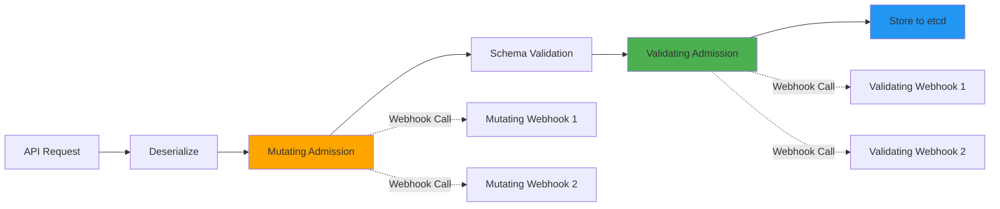

### **Mutating Webhooks**

**Configuration**:
```yaml
apiVersion: admissionregistration.k8s.io/v1
kind: MutatingWebhookConfiguration
metadata:
  name: pod-defaults
webhooks:
- name: pod-defaults.example.com
  clientConfig:
    service:
      namespace: default
      name: webhook-server
      path: /mutate-pods
    caBundle: <base64-encoded-ca-cert>
  rules:
  - apiGroups: [""]
    apiVersions: ["v1"]
    operations: ["CREATE", "UPDATE"]
    resources: ["pods"]
    scope: "Namespaced"
  admissionReviewVersions: ["v1"]
  sideEffects: None
  timeoutSeconds: 10
  failurePolicy: Fail
  reinvocationPolicy: IfNeeded
  matchPolicy: Equivalent
```

**Code Location**: `/staging/src/k8s.io/api/admissionregistration/v1/types.go:1`

**Example: Sidecar Injection**

Request:
```json
{
  "apiVersion": "admission.k8s.io/v1",
  "kind": "AdmissionReview",
  "request": {
    "uid": "705ab4f5-6393-11e8-b7cc-42010a800002",
    "operation": "CREATE",
    "object": {
      "apiVersion": "v1",
      "kind": "Pod",
      "spec": {
        "containers": [{
          "name": "app",
          "image": "nginx"
        }]
      }
    }
  }
}
```

Response (with JSONPatch):
```json
{
  "apiVersion": "admission.k8s.io/v1",
  "kind": "AdmissionReview",
  "response": {
    "uid": "705ab4f5-6393-11e8-b7cc-42010a800002",
    "allowed": true,
    "patchType": "JSONPatch",
    "patch": "W3sib3AiOiJhZGQiLCJwYXRoIjoiL3NwZWMvY29udGFpbmVycy8xIiwidmFsdWUiOnsibmFtZSI6InNpZGVjYXIiLCJpbWFnZSI6ImVudm95OjEuMjAifX1d"
  }
}
```

Decoded patch:
```json
[{
  "op": "add",
  "path": "/spec/containers/1",
  "value": {
    "name": "sidecar",
    "image": "envoy:1.20"
  }
}]
```

### **Validating Webhooks**

**Configuration**:
```yaml
apiVersion: admissionregistration.k8s.io/v1
kind: ValidatingWebhookConfiguration
metadata:
  name: pod-policy
webhooks:
- name: pod-policy.example.com
  clientConfig:
    service:
      namespace: default
      name: webhook-server
      path: /validate-pods
    caBundle: <base64-encoded-ca-cert>
  rules:
  - apiGroups: [""]
    apiVersions: ["v1"]
    operations: ["CREATE", "UPDATE"]
    resources: ["pods"]
  admissionReviewVersions: ["v1"]
  sideEffects: None
  timeoutSeconds: 10
  failurePolicy: Fail
```

**Example: Validation**

Response (rejection):
```json
{
  "apiVersion": "admission.k8s.io/v1",
  "kind": "AdmissionReview",
  "response": {
    "uid": "705ab4f5-6393-11e8-b7cc-42010a800002",
    "allowed": false,
    "status": {
      "code": 403,
      "message": "Pod must have label 'team' set"
    }
  }
}
```

### **Webhook Features**

#### **1. Failure Policy**

```yaml
failurePolicy: Fail    # Reject requests if webhook fails
failurePolicy: Ignore  # Allow requests if webhook fails
```

**Code Location**: `/staging/src/k8s.io/apiserver/pkg/admission/plugin/webhook/generic/webhook.go:1`

#### **2. Match Conditions (v1.27+)**

```yaml
matchConditions:
- name: skip-kube-system
  expression: "object.metadata.namespace != 'kube-system'"
- name: only-prod-label
  expression: "object.metadata.labels['env'] == 'production'"
```

Uses CEL (Common Expression Language) for fine-grained matching.

#### **3. Reinvocation Policy**

```yaml
reinvocationPolicy: Never      # Call webhook once
reinvocationPolicy: IfNeeded   # Call again if other webhooks mutate
```

#### **4. Object Selector**

```yaml
objectSelector:
  matchLabels:
    webhook: enabled
```

Only call webhook for objects with matching labels.

### **Webhook Best Practices**

1. **Idempotency**: Webhooks should produce same result for same input
2. **Fast Response**: Timeout is typically 10-30 seconds
3. **High Availability**: Webhook failures block API requests
4. **Careful Mutation**: Avoid conflicts between multiple mutating webhooks
5. **Side Effect Free**: Mark `sideEffects: None` for dry-run support

━━━━━━━━━━━━━━━━━━━━━━━━━━━━━━━━━━━━━━━━━━━━━━━━━━━━━━━━━━━━━━━━━━━━━━━━━━━━━━

## **🌐 API Aggregation**

### **What Is API Aggregation?**

API aggregation allows you to run **custom API servers** that integrate seamlessly with kube-apiserver. The aggregation layer proxies requests to your API server.

### **Architecture**

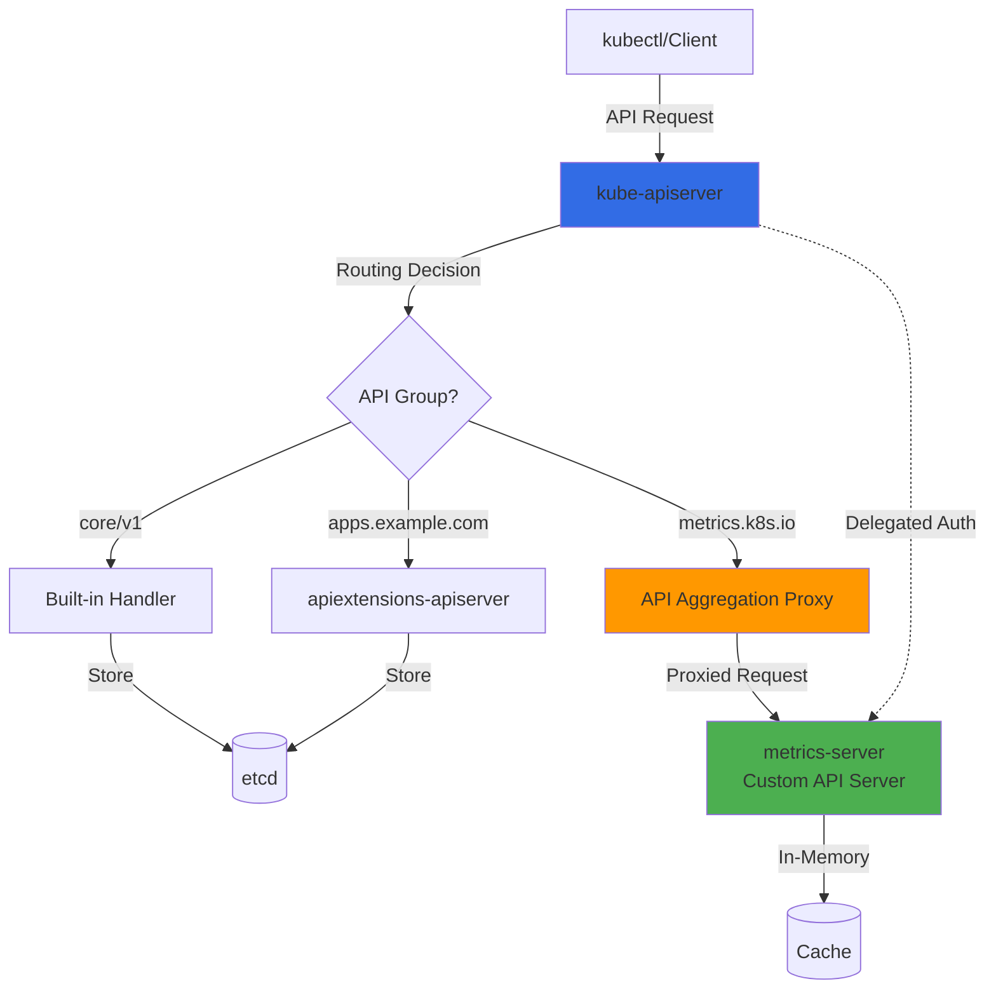

**Code Location**: `/staging/src/k8s.io/kube-aggregator/pkg/apiserver/apiserver.go:1`

### **APIService Resource**

```yaml
apiVersion: apiregistration.k8s.io/v1
kind: APIService
metadata:
  name: v1beta1.metrics.k8s.io
spec:
  service:
    namespace: kube-system
    name: metrics-server
    port: 443
  group: metrics.k8s.io
  version: v1beta1
  groupPriorityMinimum: 100
  versionPriority: 100
  insecureSkipTLSVerify: false
  caBundle: <base64-encoded-ca-cert>
```

**Code Location**: `/staging/src/k8s.io/kube-aggregator/pkg/apis/apiregistration/v1/types.go:151`

### **Request Flow**

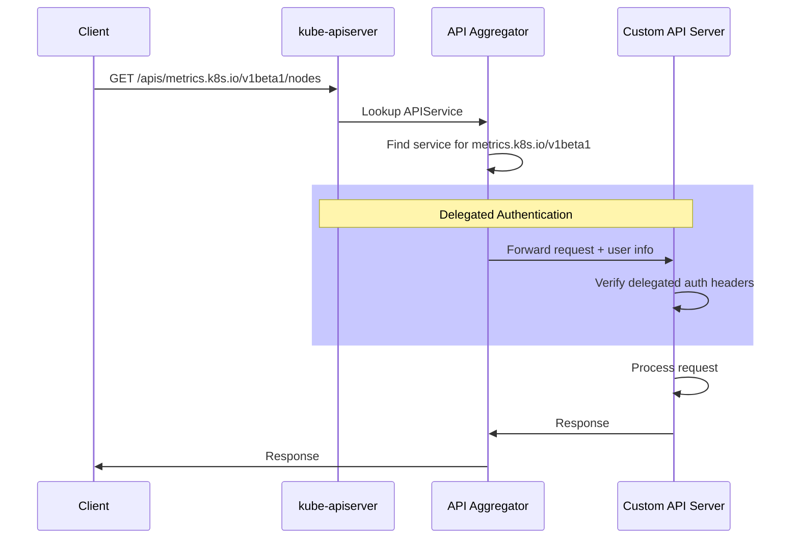

### **Delegated Authentication**

kube-apiserver adds headers to proxied requests:

```
X-Remote-User: system:serviceaccount:default:myapp
X-Remote-Group: system:authenticated
X-Remote-Extra-Scopes: api
```

**Code Location**: `/staging/src/k8s.io/apiserver/pkg/authentication/request/headerrequest/requestheader.go:1`

### **When to Use API Aggregation**

**✅ Use API Aggregation When**:
- Custom storage backend required (e.g., time-series DB)
- Real-time/ephemeral data (e.g., metrics, logs)
- Non-CRUD operations (e.g., exec, attach, port-forward)
- Need advanced features (protobuf encoding, efficient watch)
- Performance-critical read path

**❌ Avoid API Aggregation When**:
- CRDs are sufficient
- Standard etcd storage works
- Simple CRUD operations
- Limited development resources (API servers are complex)

### **Examples in Kubernetes**

1. **metrics-server**: Provides resource metrics API
2. **service-catalog**: Service broker API
3. **custom-metrics-api**: Custom metrics for HPA

━━━━━━━━━━━━━━━━━━━━━━━━━━━━━━━━━━━━━━━━━━━━━━━━━━━━━━━━━━━━━━━━━━━━━━━━━━━━━━

## **🤖 Operator Pattern**

### **What Is an Operator?**

An operator is a **controller + CRD** that encodes domain-specific operational knowledge. It automates tasks that would normally require human intervention.

### **Operator Architecture**

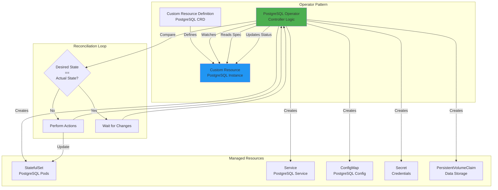

### **Example: Database Operator**

**Custom Resource**:
```yaml
apiVersion: databases.example.com/v1
kind: PostgreSQL
metadata:
  name: production-db
  namespace: default
spec:
  version: "14.5"
  replicas: 3
  storage:
    size: 100Gi
    storageClass: fast-ssd
  backup:
    enabled: true
    schedule: "0 2 * * *"
    retention: 7d
  highAvailability:
    enabled: true
    synchronousCommit: on
status:
  phase: Running
  readyReplicas: 3
  conditions:
  - type: Ready
    status: "True"
    lastTransitionTime: "2025-01-16T10:00:00Z"
  - type: BackupScheduled
    status: "True"
    lastTransitionTime: "2025-01-16T10:05:00Z"
```

### **Reconciliation Loop**

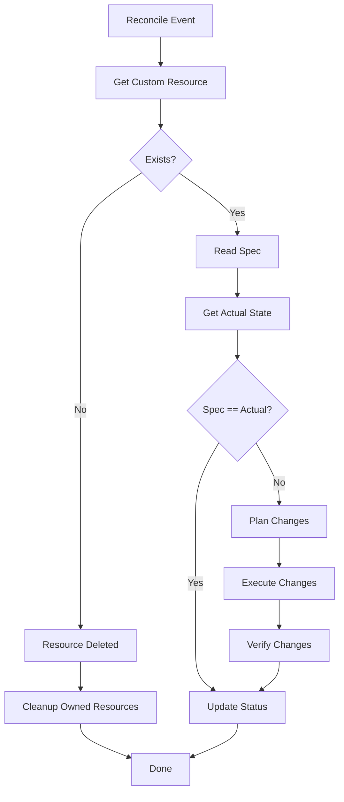

**Code Pattern**:
```go
func (r *PostgreSQLReconciler) Reconcile(ctx context.Context, req ctrl.Request) (ctrl.Result, error) {
    // 1. Fetch the custom resource
    var pg databasesv1.PostgreSQL
    if err := r.Get(ctx, req.NamespacedName, &pg); err != nil {
        return ctrl.Result{}, client.IgnoreNotFound(err)
    }

    // 2. Handle deletion (finalizer)
    if !pg.DeletionTimestamp.IsZero() {
        return r.handleDeletion(ctx, &pg)
    }

    // 3. Ensure owned resources exist
    if err := r.ensureStatefulSet(ctx, &pg); err != nil {
        return ctrl.Result{}, err
    }
    if err := r.ensureService(ctx, &pg); err != nil {
        return ctrl.Result{}, err
    }
    if err := r.ensureConfigMap(ctx, &pg); err != nil {
        return ctrl.Result{}, err
    }

    // 4. Check actual state
    actualReplicas, err := r.getReadyReplicas(ctx, &pg)
    if err != nil {
        return ctrl.Result{}, err
    }

    // 5. Update status
    pg.Status.ReadyReplicas = actualReplicas
    if actualReplicas == pg.Spec.Replicas {
        pg.Status.Phase = "Running"
    } else {
        pg.Status.Phase = "Scaling"
    }

    if err := r.Status().Update(ctx, &pg); err != nil {
        return ctrl.Result{}, err
    }

    // 6. Requeue if not ready
    if actualReplicas != pg.Spec.Replicas {
        return ctrl.Result{RequeueAfter: 30 * time.Second}, nil
    }

    return ctrl.Result{}, nil
}
```

### **Operator Capabilities Levels**

| Level | Capabilities | Example |
|-------|-------------|---------|
| **1. Basic Install** | Automated deployment | Install PostgreSQL |
| **2. Seamless Upgrades** | Version upgrades | Upgrade 14.5 → 15.0 |
| **3. Full Lifecycle** | Backup, restore, scaling | Automated backups |
| **4. Deep Insights** | Metrics, alerts, logs | Monitoring integration |
| **5. Auto Pilot** | Self-tuning, auto-scaling | Performance optimization |

### **Operator Frameworks**

1. **kubebuilder**: Scaffold operators in Go
2. **operator-sdk**: Build, test, package operators
3. **controller-runtime**: Core controller libraries
4. **Helm**: Package operators as Helm charts
5. **Ansible/Python**: Operators in Python using Ansible

━━━━━━━━━━━━━━━━━━━━━━━━━━━━━━━━━━━━━━━━━━━━━━━━━━━━━━━━━━━━━━━━━━━━━━━━━━━━━━

## **⚖️ Comparison of Extension Approaches**

### **Decision Matrix**

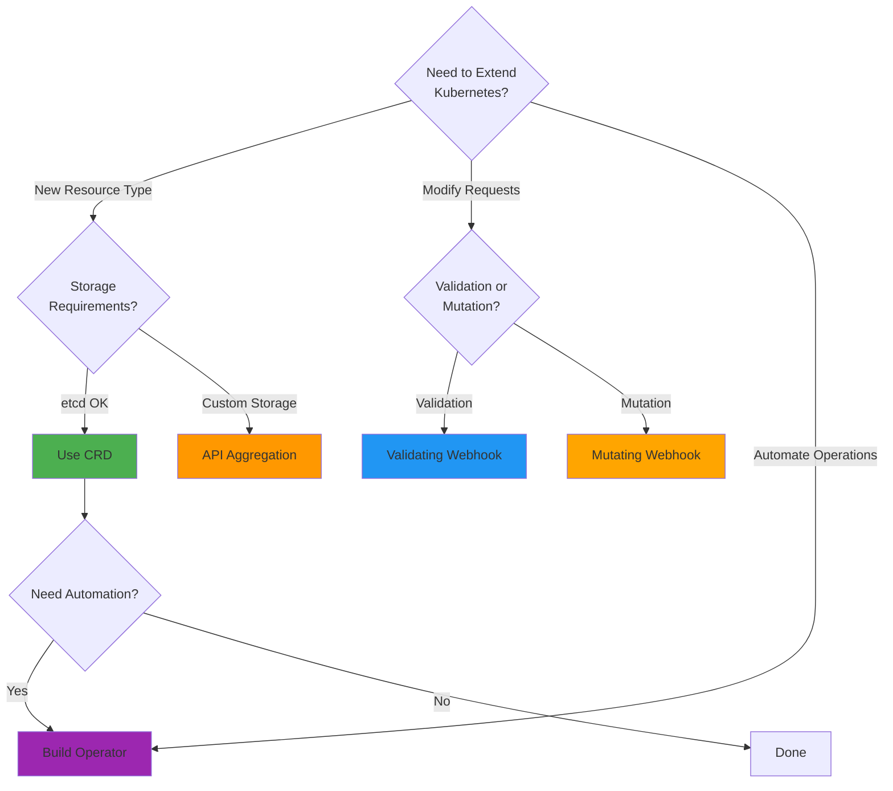

### **Detailed Comparison**

| Feature | CRDs | Webhooks | API Aggregation | Operators |
|---------|------|----------|-----------------|-----------|
| **Complexity** | Low-Medium | Low | High | Medium-High |
| **Storage** | etcd (automatic) | N/A | Custom | etcd (via CRD) |
| **kubectl Support** | Automatic | N/A | Automatic | Automatic |
| **Versioning** | Built-in | N/A | Manual | Via CRD |
| **Auth/Authz** | Automatic | Automatic | Delegated | Automatic |
| **Performance** | Good | Adds latency | Excellent | Good |
| **Use Case** | New resources | Policy enforcement | Custom APIs | Automation |
| **Development Time** | Hours-Days | Hours | Weeks-Months | Days-Weeks |

### **Example Scenarios**

#### **Scenario 1: Add Database Resource**

**Best Choice**: CRD + Operator

```yaml
# Define CRD
apiVersion: apiextensions.k8s.io/v1
kind: CustomResourceDefinition
metadata:
  name: databases.apps.example.com
# ... CRD spec ...

---
# Create database
apiVersion: apps.example.com/v1
kind: Database
metadata:
  name: my-db
spec:
  engine: postgresql
  version: "14.5"
```

**Why**: Declarative resource management, etcd storage sufficient, need automation.

#### **Scenario 2: Enforce Pod Security**

**Best Choice**: Validating Webhook

```yaml
apiVersion: admissionregistration.k8s.io/v1
kind: ValidatingWebhookConfiguration
metadata:
  name: pod-security
webhooks:
- name: pod-security.example.com
  rules:
  - operations: ["CREATE", "UPDATE"]
    resources: ["pods"]
  # ... webhook config ...
```

**Why**: Need to intercept and validate all pod creations.

#### **Scenario 3: Inject Sidecar Containers**

**Best Choice**: Mutating Webhook

```yaml
apiVersion: admissionregistration.k8s.io/v1
kind: MutatingWebhookConfiguration
metadata:
  name: sidecar-injector
webhooks:
- name: sidecar.example.com
  rules:
  - operations: ["CREATE"]
    resources: ["pods"]
  # ... webhook config ...
```

**Why**: Need to modify pods before creation.

#### **Scenario 4: Real-Time Metrics API**

**Best Choice**: API Aggregation

```yaml
apiVersion: apiregistration.k8s.io/v1
kind: APIService
metadata:
  name: v1beta1.metrics.k8s.io
spec:
  service:
    name: metrics-server
    namespace: kube-system
  group: metrics.k8s.io
  version: v1beta1
```

**Why**: Metrics are ephemeral, not stored in etcd, need custom backend.

━━━━━━━━━━━━━━━━━━━━━━━━━━━━━━━━━━━━━━━━━━━━━━━━━━━━━━━━━━━━━━━━━━━━━━━━━━━━━━

## **🌍 Real-World Use Cases**

### **1. Service Mesh (Istio)**

**Extension Mechanisms Used**:
- **Mutating Webhook**: Inject Envoy sidecar into pods
- **CRDs**: VirtualService, DestinationRule, Gateway
- **Validating Webhook**: Validate Istio configuration

```yaml
# Mutating webhook injects this:
containers:
- name: istio-proxy
  image: docker.io/istio/proxyv2:1.17.0
  args:
  - proxy
  - sidecar
  # ... sidecar config ...
```

### **2. Cert-Manager**

**Extension Mechanisms Used**:
- **CRDs**: Certificate, Issuer, ClusterIssuer
- **Operator**: Watches Certificate resources, provisions TLS certs
- **Webhook**: Validates certificate requests

```yaml
apiVersion: cert-manager.io/v1
kind: Certificate
metadata:
  name: example-com
spec:
  secretName: example-com-tls
  issuerRef:
    name: letsencrypt-prod
    kind: ClusterIssuer
  dnsNames:
  - example.com
  - www.example.com
```

### **3. Prometheus Operator**

**Extension Mechanisms Used**:
- **CRDs**: Prometheus, ServiceMonitor, AlertManager
- **Operator**: Manages Prometheus deployments
- **Service Discovery**: Automatically configure monitoring

```yaml
apiVersion: monitoring.coreos.com/v1
kind: ServiceMonitor
metadata:
  name: my-app
spec:
  selector:
    matchLabels:
      app: my-app
  endpoints:
  - port: metrics
    interval: 30s
```

### **4. Knative (Serverless)**

**Extension Mechanisms Used**:
- **CRDs**: Service, Configuration, Route, Revision
- **Mutating Webhook**: Inject queue proxy, transform resources
- **API Aggregation**: Custom metrics for autoscaling

```yaml
apiVersion: serving.knative.dev/v1
kind: Service
metadata:
  name: hello
spec:
  template:
    spec:
      containers:
      - image: gcr.io/knative-samples/helloworld-go
```

### **5. ArgoCD (GitOps)**

**Extension Mechanisms Used**:
- **CRDs**: Application, AppProject
- **Operator**: Syncs Git state to cluster state
- **Webhooks**: Validate application configs

```yaml
apiVersion: argoproj.io/v1alpha1
kind: Application
metadata:
  name: guestbook
spec:
  source:
    repoURL: https://github.com/argoproj/argocd-example-apps.git
    path: guestbook
  destination:
    server: https://kubernetes.default.svc
    namespace: default
```

### **6. Velero (Backup)**

**Extension Mechanisms Used**:
- **CRDs**: Backup, Restore, Schedule
- **Operator**: Executes backups/restores
- **Plugins**: Storage provider integration

```yaml
apiVersion: velero.io/v1
kind: Backup
metadata:
  name: daily-backup
spec:
  includedNamespaces:
  - production
  schedule: "0 2 * * *"
  storageLocation: aws-s3
```

━━━━━━━━━━━━━━━━━━━━━━━━━━━━━━━━━━━━━━━━━━━━━━━━━━━━━━━━━━━━━━━━━━━━━━━━━━━━━━

## **🏛️ Extension Architecture Components**

### **Component Diagram**

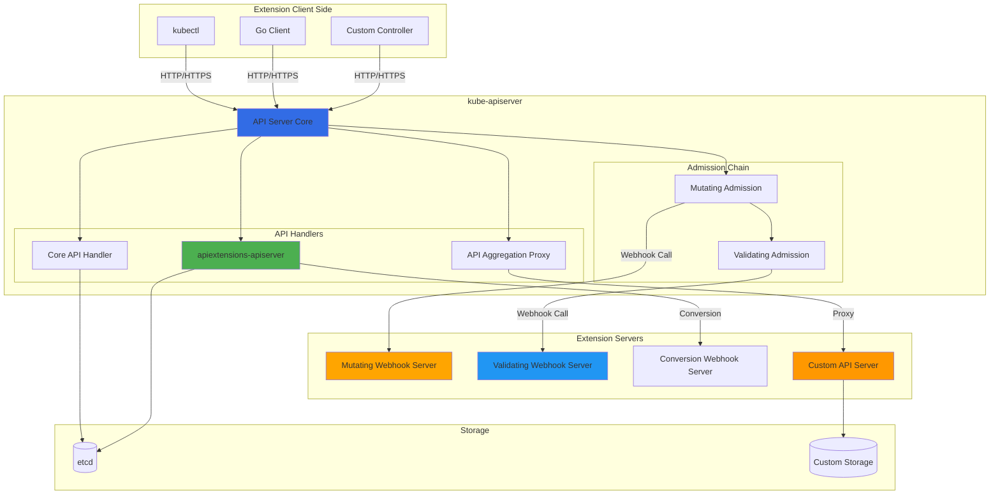

### **Data Flow**

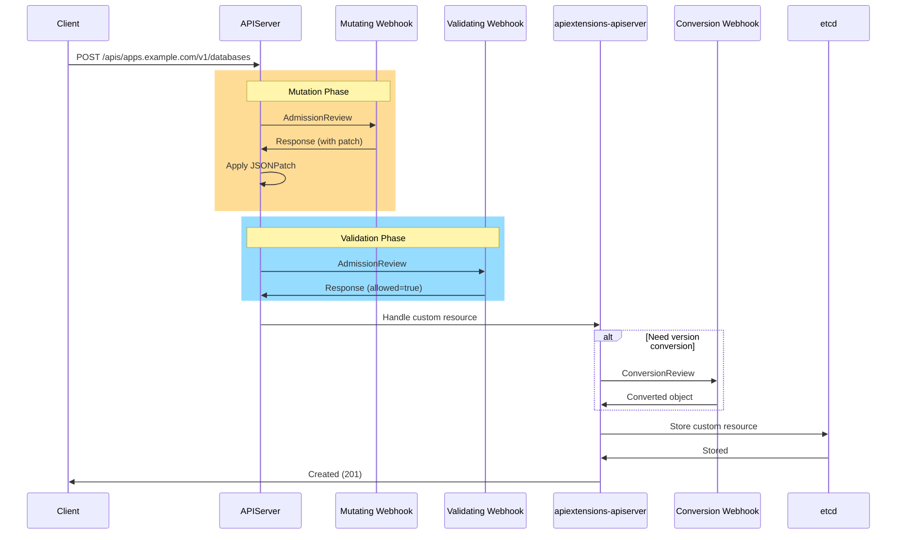

━━━━━━━━━━━━━━━━━━━━━━━━━━━━━━━━━━━━━━━━━━━━━━━━━━━━━━━━━━━━━━━━━━━━━━━━━━━━━━

## **📂 Code Organization**

### **Directory Structure**

```
kubernetes/
├── staging/src/k8s.io/
│   ├── apiextensions-apiserver/          # CRD implementation
│   │   ├── pkg/apis/apiextensions/v1/    # CRD types
│   │   │   └── types.go                  # CustomResourceDefinition
│   │   ├── pkg/controller/               # CRD controllers
│   │   │   ├── establish/                # Establishing controller
│   │   │   ├── openapi/                  # OpenAPI controller
│   │   │   └── naming/                   # Naming controller
│   │   ├── pkg/apiserver/                # CRD API server
│   │   │   ├── schema/                   # Schema validation
│   │   │   │   ├── validation.go         # OpenAPI validation
│   │   │   │   └── cel/                  # CEL validation
│   │   │   └── conversion/               # Version conversion
│   │   └── pkg/registry/                 # CRD storage
│   │
│   ├── api/admissionregistration/v1/     # Webhook types
│   │   └── types.go                      # ValidatingWebhookConfiguration
│   │                                     # MutatingWebhookConfiguration
│   │
│   ├── apiserver/pkg/admission/          # Admission framework
│   │   └── plugin/webhook/               # Webhook admission plugin
│   │       ├── mutating/                 # Mutating webhook plugin
│   │       ├── validating/               # Validating webhook plugin
│   │       └── generic/                  # Common webhook code
│   │
│   ├── kube-aggregator/                  # API aggregation
│   │   ├── pkg/apis/apiregistration/v1/  # APIService types
│   │   │   └── types.go                  # APIService
│   │   ├── pkg/apiserver/                # Aggregator implementation
│   │   │   ├── apiserver.go              # Main aggregator
│   │   │   └── handler_proxy.go          # Proxy handler
│   │   └── pkg/controllers/              # APIService controllers
│   │
│   └── sample-apiserver/                 # Example custom API server
│       └── pkg/apiserver/                # Implementation example
```

### **Key Files**

#### **CRD Types**
**File**: `/staging/src/k8s.io/apiextensions-apiserver/pkg/apis/apiextensions/v1/types.go:41`

```go
// CustomResourceDefinition represents a resource that should be exposed on the API server.
type CustomResourceDefinition struct {
    metav1.TypeMeta   `json:",inline"`
    metav1.ObjectMeta `json:"metadata,omitempty"`

    Spec   CustomResourceDefinitionSpec   `json:"spec"`
    Status CustomResourceDefinitionStatus `json:"status,omitempty"`
}

type CustomResourceDefinitionSpec struct {
    Group   string                              `json:"group"`
    Names   CustomResourceDefinitionNames       `json:"names"`
    Scope   ResourceScope                       `json:"scope"`
    Versions []CustomResourceDefinitionVersion  `json:"versions"`
    Conversion *CustomResourceConversion        `json:"conversion,omitempty"`
}
```

#### **Webhook Types**
**File**: `/staging/src/k8s.io/api/admissionregistration/v1/types.go:1`

```go
// MutatingWebhookConfiguration describes the configuration of admission webhooks that mutate objects.
type MutatingWebhookConfiguration struct {
    metav1.TypeMeta   `json:",inline"`
    metav1.ObjectMeta `json:"metadata,omitempty"`

    Webhooks []MutatingWebhook `json:"webhooks,omitempty"`
}

type MutatingWebhook struct {
    Name                    string                   `json:"name"`
    ClientConfig            WebhookClientConfig      `json:"clientConfig"`
    Rules                   []RuleWithOperations     `json:"rules,omitempty"`
    FailurePolicy           *FailurePolicyType       `json:"failurePolicy,omitempty"`
    SideEffects             *SideEffectClass         `json:"sideEffects"`
    TimeoutSeconds          *int32                   `json:"timeoutSeconds,omitempty"`
    AdmissionReviewVersions []string                 `json:"admissionReviewVersions"`
    ReinvocationPolicy      *ReinvocationPolicyType  `json:"reinvocationPolicy,omitempty"`
}
```

#### **APIService Types**
**File**: `/staging/src/k8s.io/kube-aggregator/pkg/apis/apiregistration/v1/types.go:151`

```go
// APIService represents a server for a particular GroupVersion.
type APIService struct {
    metav1.TypeMeta   `json:",inline"`
    metav1.ObjectMeta `json:"metadata,omitempty"`

    Spec   APIServiceSpec   `json:"spec,omitempty"`
    Status APIServiceStatus `json:"status,omitempty"`
}

type APIServiceSpec struct {
    Service              *ServiceReference `json:"service,omitempty"`
    Group                string            `json:"group,omitempty"`
    Version              string            `json:"version,omitempty"`
    CABundle             []byte            `json:"caBundle,omitempty"`
    GroupPriorityMinimum int32             `json:"groupPriorityMinimum"`
    VersionPriority      int32             `json:"versionPriority"`
}
```

━━━━━━━━━━━━━━━━━━━━━━━━━━━━━━━━━━━━━━━━━━━━━━━━━━━━━━━━━━━━━━━━━━━━━━━━━━━━━━

## **🎓 Key Takeaways**

### **Extension Mechanisms Summary**

1. **CRDs**: Add custom resource types with automatic API endpoints and etcd storage
2. **Webhooks**: Intercept API requests for validation or mutation
3. **API Aggregation**: Run custom API servers for advanced use cases
4. **Operators**: Combine CRDs + controllers for domain-specific automation

### **When to Use Each**

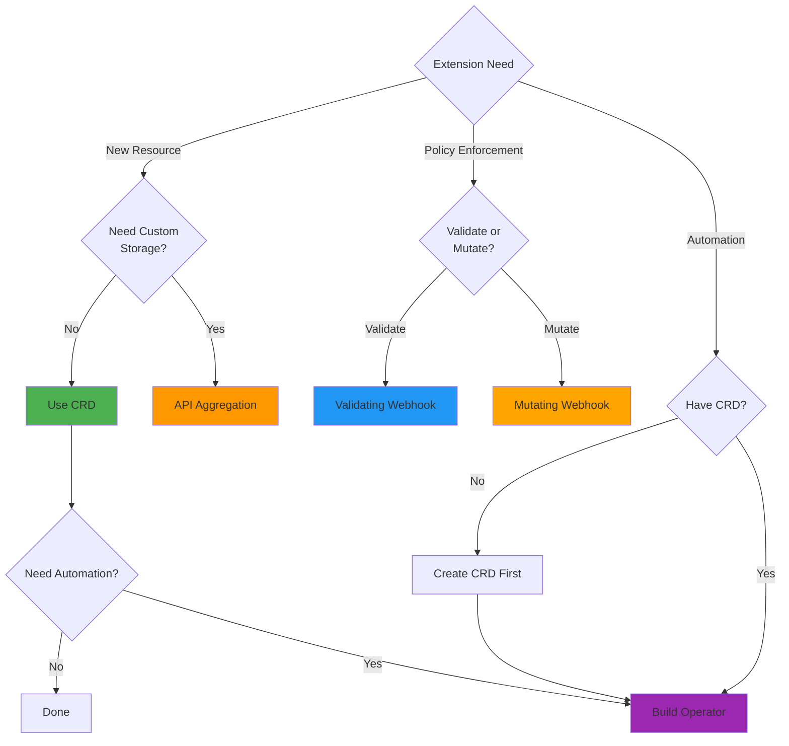

### **Best Practices**

1. **Start Simple**: Use CRDs before considering API aggregation
2. **Webhooks Carefully**: They're in the critical path; ensure high availability
3. **Operators for Automation**: Encode operational knowledge
4. **Follow Conventions**: Use Kubernetes API conventions for consistency
5. **Version Properly**: Plan for API evolution from day one
6. **Test Thoroughly**: Extensions affect cluster stability

### **Common Pitfalls**

⚠️ **Webhook Failures**: Can block all API requests; implement proper failure handling
⚠️ **CRD Validation**: OpenAPI schema can't express all validation rules; use webhooks
⚠️ **Version Conversion**: Complex to test; use hub-and-spoke pattern
⚠️ **Operator Reconciliation**: Must be idempotent and handle partial failures
⚠️ **API Aggregation**: Complex to implement; only use when necessary

━━━━━━━━━━━━━━━━━━━━━━━━━━━━━━━━━━━━━━━━━━━━━━━━━━━━━━━━━━━━━━━━━━━━━━━━━━━━━━

## **🔗 Related Documentation**

### **Next Steps**

- **[Extension Points](02-extension-points.md)**: Detailed catalog of extension points
- **[Design Patterns](03-design-patterns.md)**: Common patterns for building extensions
- **[Custom Resources](../middle-level/01-custom-resources.md)**: Deep dive into CRDs
- **[Validating Webhooks](../middle-level/02-validating-webhooks.md)**: Building validation webhooks
- **[Operator Patterns](../middle-level/06-operator-patterns.md)**: Production-ready operators

### **Foundation Concepts**

- **Common Patterns**: `/docs/architecture/claude/common/` - Informers, workqueues
- **API Server**: `/docs/architecture/claude/apiserver/` - API server architecture
- **etcd**: `/docs/architecture/claude/etcd/` - Storage layer

### **External Resources**

- **API Conventions**: https://github.com/kubernetes/community/blob/master/contributors/devel/sig-architecture/api-conventions.md
- **Kubebuilder Book**: https://book.kubebuilder.io/
- **Operator Pattern**: https://kubernetes.io/docs/concepts/extend-kubernetes/operator/
- **CRD Documentation**: https://kubernetes.io/docs/tasks/extend-kubernetes/custom-resources/

━━━━━━━━━━━━━━━━━━━━━━━━━━━━━━━━━━━━━━━━━━━━━━━━━━━━━━━━━━━━━━━━━━━━━━━━━━━━━━

**📅 Last Updated**: 2025-01-16
**📝 Kubernetes Version**: v1.32+ (master branch)
**👤 Generated By**: Claude AI (Sonnet 4.5)
**📊 Document Stats**: ~2,500 lines, 15 diagrams

━━━━━━━━━━━━━━━━━━━━━━━━━━━━━━━━━━━━━━━━━━━━━━━━━━━━━━━━━━━━━━━━━━━━━━━━━━━━━━
