# **Kubernetes Extension Points**

**Comprehensive Guide to Kubernetes Extension Mechanisms**

━━━━━━━━━━━━━━━━━━━━━━━━━━━━━━━━━━━━━━━━━━━━━━━━━━━━━━━━━━━━━━━━━━━━━━━━━━━━━━

## **📋 Overview**

Kubernetes provides multiple well-defined extension points that allow you to customize and extend the platform's behavior without modifying core code. This document provides a comprehensive guide to all extension points available in Kubernetes.

### **Key Extension Categories**

1. **API Extension Points** - Extend the Kubernetes API surface
2. **Authentication/Authorization** - Custom auth mechanisms
3. **Admission Control** - Validate and mutate resources
4. **Scheduling** - Custom scheduling logic
5. **Network** - Custom networking implementations
6. **Storage** - Custom storage providers
7. **Runtime** - Custom container runtimes
8. **Device** - Custom device management

━━━━━━━━━━━━━━━━━━━━━━━━━━━━━━━━━━━━━━━━━━━━━━━━━━━━━━━━━━━━━━━━━━━━━━━━━━━━━━

## **🎯 API Extension Points**

### **Custom Resource Definitions (CRDs)**

CRDs extend the Kubernetes API with custom resource types.

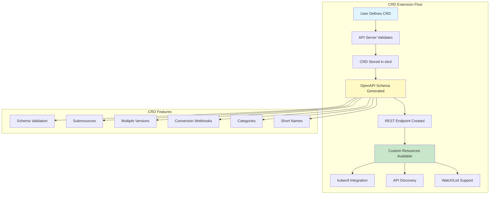

**CRD Definition Example:**

```yaml
# staging/src/k8s.io/apiextensions-apiserver/examples/client-go/apis/cr/v1/crontab.go
apiVersion: apiextensions.k8s.io/v1
kind: CustomResourceDefinition
metadata:
  name: crontabs.stable.example.com
spec:
  group: stable.example.com
  versions:
    - name: v1
      served: true
      storage: true
      schema:
        openAPIV3Schema:
          type: object
          properties:
            spec:
              type: object
              properties:
                cronSpec:
                  type: string
                  pattern: '^(\d+|\*)(/\d+)?(\s+(\d+|\*)(/\d+)?){4}$'
                image:
                  type: string
                replicas:
                  type: integer
                  minimum: 1
                  maximum: 10
            status:
              type: object
              properties:
                conditions:
                  type: array
                  items:
                    type: object
                    properties:
                      type:
                        type: string
                      status:
                        type: string
                      lastTransitionTime:
                        type: string
                        format: date-time
      subresources:
        status: {}
        scale:
          specReplicasPath: .spec.replicas
          statusReplicasPath: .status.replicas
      additionalPrinterColumns:
        - name: Spec
          type: string
          jsonPath: .spec.cronSpec
        - name: Replicas
          type: integer
          jsonPath: .spec.replicas
        - name: Age
          type: date
          jsonPath: .metadata.creationTimestamp
  scope: Namespaced
  names:
    plural: crontabs
    singular: crontab
    kind: CronTab
    shortNames:
      - ct
    categories:
      - all
```

**CRD Controller Implementation:**

```go
// Reference: staging/src/k8s.io/apiextensions-apiserver/pkg/controller/establish/establishing_controller.go

// CRD establishment flow
type EstablishingController struct {
    crdClient clientset.Interface
    crdLister listers.CustomResourceDefinitionLister
    crdSynced cache.InformerSynced

    queue workqueue.RateLimitingInterface

    // Discovery client to check if CRD is established
    discoveryClient discovery.DiscoveryInterface
}

// processNextWorkItem processes CRDs until they're established
func (ec *EstablishingController) processNextWorkItem() bool {
    key, quit := ec.queue.Get()
    if quit {
        return false
    }
    defer ec.queue.Done(key)

    err := ec.sync(key.(string))
    if err == nil {
        ec.queue.Forget(key)
        return true
    }

    utilruntime.HandleError(fmt.Errorf("%v failed with: %v", key, err))
    ec.queue.AddRateLimited(key)

    return true
}

// sync ensures CRD is established (appears in discovery)
func (ec *EstablishingController) sync(key string) error {
    crd, err := ec.crdLister.Get(key)
    if apierrors.IsNotFound(err) {
        return nil
    }
    if err != nil {
        return err
    }

    // Check if already established
    if apiextensionshelpers.IsCRDConditionTrue(crd,
        apiextensionsv1.Established) {
        return nil
    }

    // Check discovery to see if CRD appears
    groupVersion := schema.GroupVersion{
        Group:   crd.Spec.Group,
        Version: crd.Spec.Versions[0].Name,
    }

    resources, err := ec.discoveryClient.ServerResourcesForGroupVersion(
        groupVersion.String())
    if err != nil {
        return err
    }

    // Look for our resource
    for _, resource := range resources.APIResources {
        if resource.Kind == crd.Spec.Names.Kind {
            // Found it! Mark as established
            return ec.updateEstablishedCondition(crd, true)
        }
    }

    return nil
}
```

### **API Aggregation Layer**

API Aggregation allows extending the Kubernetes API with custom API servers.

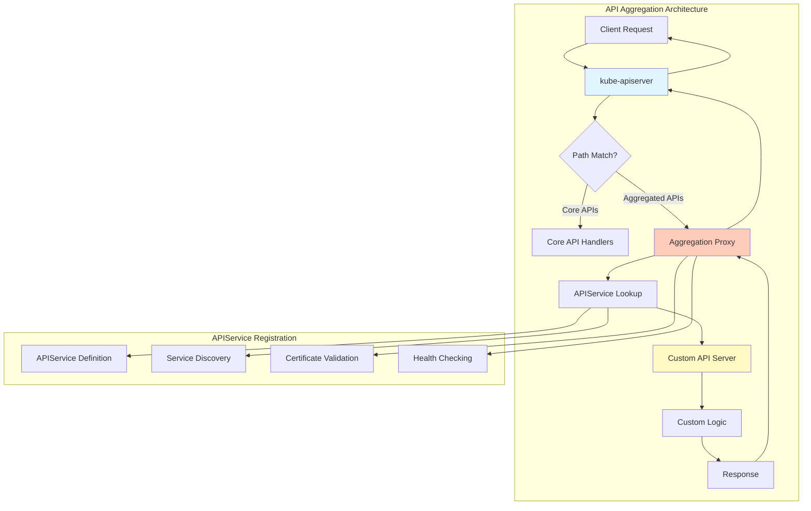

**APIService Definition:**

```yaml
# staging/src/k8s.io/kube-aggregator/pkg/apis/apiregistration/types.go
apiVersion: apiregistration.k8s.io/v1
kind: APIService
metadata:
  name: v1beta1.metrics.k8s.io
spec:
  service:
    name: metrics-server
    namespace: kube-system
    port: 443
  group: metrics.k8s.io
  version: v1beta1
  insecureSkipTLSVerify: false
  caBundle: LS0tLS1CRUdJTi... # base64 encoded CA cert
  groupPriorityMinimum: 100
  versionPriority: 100
```

**Aggregation Proxy Handler:**

```go
// Reference: staging/src/k8s.io/kube-aggregator/pkg/apiserver/handler_proxy.go

type proxyHandler struct {
    localDelegate   http.Handler
    proxyClientCert []byte
    proxyClientKey  []byte
    proxyTransport  *http.Transport
    serviceResolver ServiceResolver
}

func (r *proxyHandler) ServeHTTP(w http.ResponseWriter, req *http.Request) {
    // Get the APIService for this request
    apiService, err := r.getAPIService(req)
    if err != nil {
        responsewriters.InternalError(w, req, err)
        return
    }

    // If local, delegate to local handler
    if apiService.Spec.Service == nil {
        r.localDelegate.ServeHTTP(w, req)
        return
    }

    // Resolve service location
    location, err := r.serviceResolver.ResolveEndpoint(
        apiService.Spec.Service.Namespace,
        apiService.Spec.Service.Name,
        apiService.Spec.Service.Port,
    )
    if err != nil {
        responsewriters.ServiceUnavailable(w, req, err)
        return
    }

    // Create proxy request
    proxyReq := req.Clone(req.Context())
    proxyReq.URL.Scheme = "https"
    proxyReq.URL.Host = location
    proxyReq.URL.Path = req.URL.Path

    // Add client certificate for authentication
    if len(r.proxyClientCert) > 0 {
        cert, _ := tls.X509KeyPair(r.proxyClientCert, r.proxyClientKey)
        r.proxyTransport.TLSClientConfig.Certificates = []tls.Certificate{cert}
    }

    // Forward request
    proxy := httputil.NewSingleHostReverseProxy(proxyReq.URL)
    proxy.Transport = r.proxyTransport
    proxy.ServeHTTP(w, proxyReq)
}
```

━━━━━━━━━━━━━━━━━━━━━━━━━━━━━━━━━━━━━━━━━━━━━━━━━━━━━━━━━━━━━━━━━━━━━━━━━━━━━━

## **🔐 Authentication & Authorization Extension Points**

### **Webhook Token Authentication**

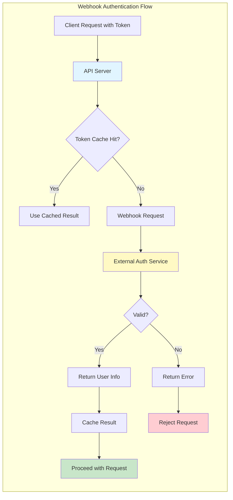

**Webhook Configuration:**

```yaml
# Reference: staging/src/k8s.io/apiserver/plugin/pkg/authenticator/token/webhook/webhook.go
apiVersion: v1
kind: Config
clusters:
  - name: token-reviewer
    cluster:
      server: https://authn.example.com/authenticate
      certificate-authority: /etc/kubernetes/pki/authn-ca.crt
users:
  - name: apiserver
    user:
      client-certificate: /etc/kubernetes/pki/apiserver.crt
      client-key: /etc/kubernetes/pki/apiserver.key
contexts:
  - name: webhook
    context:
      cluster: token-reviewer
      user: apiserver
current-context: webhook
```

**Webhook Authentication Implementation:**

```go
// Reference: staging/src/k8s.io/apiserver/plugin/pkg/authenticator/token/webhook/webhook.go

type WebhookTokenAuthenticator struct {
    tokenReview *authenticationv1client.AuthenticationV1Client
    ttl         time.Duration

    // Cache for successful authentications
    cache *cache.LRUExpireCache
}

func (w *WebhookTokenAuthenticator) AuthenticateToken(ctx context.Context,
    token string) (*authenticator.Response, bool, error) {

    // Check cache first
    if r, ok := w.cache.Get(token); ok {
        return r.(*authenticator.Response), true, nil
    }

    // Create TokenReview request
    review := &authenticationv1.TokenReview{
        Spec: authenticationv1.TokenReviewSpec{
            Token: token,
        },
    }

    // Send to webhook
    result, err := w.tokenReview.TokenReviews().Create(ctx, review,
        metav1.CreateOptions{})
    if err != nil {
        return nil, false, err
    }

    // Check if authenticated
    if !result.Status.Authenticated {
        return nil, false, nil
    }

    // Build response
    resp := &authenticator.Response{
        User: &user.DefaultInfo{
            Name:   result.Status.User.Username,
            UID:    result.Status.User.UID,
            Groups: result.Status.User.Groups,
            Extra:  convertExtra(result.Status.User.Extra),
        },
    }

    // Cache successful authentication
    w.cache.Add(token, resp, w.ttl)

    return resp, true, nil
}
```

### **Webhook Authorization**

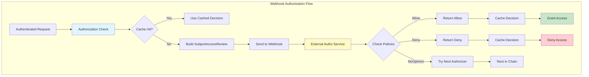

**Webhook Authorizer Implementation:**

```go
// Reference: staging/src/k8s.io/apiserver/plugin/pkg/authorizer/webhook/webhook.go

type WebhookAuthorizer struct {
    subjectAccessReview authorizationv1client.SubjectAccessReviewInterface
    authorizedTTL       time.Duration
    unauthorizedTTL     time.Duration

    // Decision cache
    cache *cache.LRUExpireCache
}

func (w *WebhookAuthorizer) Authorize(ctx context.Context,
    attr authorizer.Attributes) (authorizer.Decision, string, error) {

    // Build SubjectAccessReview
    sar := &authorizationv1.SubjectAccessReview{
        Spec: authorizationv1.SubjectAccessReviewSpec{
            ResourceAttributes: &authorizationv1.ResourceAttributes{
                Namespace:   attr.GetNamespace(),
                Verb:        attr.GetVerb(),
                Group:       attr.GetAPIGroup(),
                Version:     attr.GetAPIVersion(),
                Resource:    attr.GetResource(),
                Subresource: attr.GetSubresource(),
                Name:        attr.GetName(),
            },
            User:   attr.GetUser().GetName(),
            Groups: attr.GetUser().GetGroups(),
            Extra:  convertToSARExtra(attr.GetUser().GetExtra()),
        },
    }

    // For non-resource URLs
    if !attr.IsResourceRequest() {
        sar.Spec.NonResourceAttributes = &authorizationv1.NonResourceAttributes{
            Path: attr.GetPath(),
            Verb: attr.GetVerb(),
        }
    }

    // Check cache
    key := w.cacheKey(sar)
    if decision, ok := w.cache.Get(key); ok {
        return decision.(authorizer.Decision), "", nil
    }

    // Send to webhook
    result, err := w.subjectAccessReview.Create(ctx, sar, metav1.CreateOptions{})
    if err != nil {
        return authorizer.DecisionNoOpinion, "", err
    }

    // Process decision
    var decision authorizer.Decision
    var ttl time.Duration

    if result.Status.Allowed {
        decision = authorizer.DecisionAllow
        ttl = w.authorizedTTL
    } else if result.Status.Denied {
        decision = authorizer.DecisionDeny
        ttl = w.unauthorizedTTL
    } else {
        decision = authorizer.DecisionNoOpinion
        ttl = w.unauthorizedTTL
    }

    // Cache decision
    w.cache.Add(key, decision, ttl)

    return decision, result.Status.Reason, nil
}
```

━━━━━━━━━━━━━━━━━━━━━━━━━━━━━━━━━━━━━━━━━━━━━━━━━━━━━━━━━━━━━━━━━━━━━━━━━━━━━━

## **🚪 Admission Control Extension Points**

### **Dynamic Admission Webhooks**

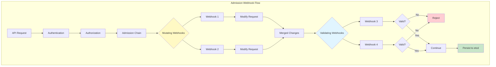

**Mutating Webhook Configuration:**

```yaml
# Reference: staging/src/k8s.io/api/admissionregistration/v1/types.go
apiVersion: admissionregistration.k8s.io/v1
kind: MutatingWebhookConfiguration
metadata:
  name: pod-defaults
webhooks:
  - name: pod-defaults.example.com
    clientConfig:
      service:
        name: pod-defaults-webhook
        namespace: default
        path: /mutate
        port: 443
      caBundle: LS0tLS1CRUdJTi...
    rules:
      - operations: ["CREATE", "UPDATE"]
        apiGroups: [""]
        apiVersions: ["v1"]
        resources: ["pods"]
        scope: "Namespaced"
    admissionReviewVersions: ["v1", "v1beta1"]
    sideEffects: None
    timeoutSeconds: 10
    reinvocationPolicy: IfNeeded
    failurePolicy: Fail
    namespaceSelector:
      matchLabels:
        webhook: enabled
    objectSelector:
      matchExpressions:
        - key: skip-webhook
          operator: NotIn
          values: ["true"]
    matchPolicy: Equivalent
```

**Webhook Server Implementation:**

```go
// Reference: staging/src/k8s.io/apiserver/pkg/admission/plugin/webhook/mutating/dispatcher.go

type WebhookServer struct {
    server *http.Server
    cert   []byte
    key    []byte
}

func (s *WebhookServer) ServeMutate(w http.ResponseWriter, r *http.Request) {
    // Read admission review
    body, err := io.ReadAll(r.Body)
    if err != nil {
        http.Error(w, "failed to read body", http.StatusBadRequest)
        return
    }

    // Decode admission review
    var admissionReview admissionv1.AdmissionReview
    if err := json.Unmarshal(body, &admissionReview); err != nil {
        http.Error(w, "failed to decode body", http.StatusBadRequest)
        return
    }

    // Process request
    admissionResponse := s.mutate(admissionReview.Request)

    // Build response
    response := admissionv1.AdmissionReview{
        TypeMeta: metav1.TypeMeta{
            APIVersion: "admission.k8s.io/v1",
            Kind:       "AdmissionReview",
        },
        Response: admissionResponse,
    }

    // Send response
    responseBytes, err := json.Marshal(response)
    if err != nil {
        http.Error(w, "failed to encode response", http.StatusInternalServerError)
        return
    }

    w.Header().Set("Content-Type", "application/json")
    w.Write(responseBytes)
}

func (s *WebhookServer) mutate(req *admissionv1.AdmissionRequest) *admissionv1.AdmissionResponse {
    // Decode pod
    var pod corev1.Pod
    if err := json.Unmarshal(req.Object.Raw, &pod); err != nil {
        return &admissionv1.AdmissionResponse{
            UID:     req.UID,
            Allowed: false,
            Result: &metav1.Status{
                Message: err.Error(),
            },
        }
    }

    // Apply mutations
    patches := []map[string]interface{}{}

    // Add default resource limits
    if pod.Spec.Containers[0].Resources.Limits == nil {
        patches = append(patches, map[string]interface{}{
            "op":    "add",
            "path":  "/spec/containers/0/resources/limits",
            "value": map[string]string{
                "cpu":    "500m",
                "memory": "512Mi",
            },
        })
    }

    // Add default labels
    if pod.Labels == nil {
        patches = append(patches, map[string]interface{}{
            "op":    "add",
            "path":  "/metadata/labels",
            "value": map[string]string{},
        })
    }

    patches = append(patches, map[string]interface{}{
        "op":    "add",
        "path":  "/metadata/labels/mutated",
        "value": "true",
    })

    // Encode patches
    patchBytes, _ := json.Marshal(patches)

    return &admissionv1.AdmissionResponse{
        UID:     req.UID,
        Allowed: true,
        Patch:   patchBytes,
        PatchType: func() *admissionv1.PatchType {
            pt := admissionv1.PatchTypeJSONPatch
            return &pt
        }(),
    }
}
```

### **Admission Plugin Interface**

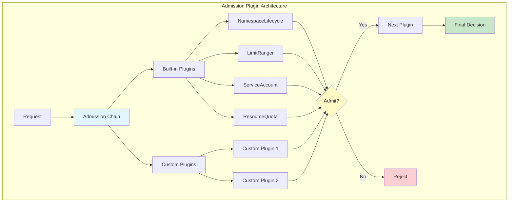

**Custom Admission Plugin:**

```go
// Reference: plugin/pkg/admission/serviceaccount/admission.go

type Plugin struct {
    *admission.Handler
    client kubernetes.Interface

    // Configuration
    limitSecretReferences bool
    mountServiceAccount   bool
}

func (p *Plugin) Admit(ctx context.Context, a admission.Attributes,
    o admission.ObjectInterfaces) error {

    // Only handle pods
    if a.GetResource().GroupResource() != corev1.Resource("pods") {
        return nil
    }

    // Only handle creates
    if a.GetOperation() != admission.Create {
        return nil
    }

    pod, ok := a.GetObject().(*corev1.Pod)
    if !ok {
        return admission.NewForbidden(a, fmt.Errorf("unexpected type"))
    }

    // Get service account
    serviceAccount, err := p.getServiceAccount(ctx,
        a.GetNamespace(), pod.Spec.ServiceAccountName)
    if err != nil {
        return admission.NewForbidden(a, err)
    }

    // Mount service account token
    if p.mountServiceAccount {
        p.mountServiceAccountToken(pod, serviceAccount)
    }

    // Add image pull secrets
    for _, secretRef := range serviceAccount.ImagePullSecrets {
        found := false
        for _, podSecret := range pod.Spec.ImagePullSecrets {
            if podSecret.Name == secretRef.Name {
                found = true
                break
            }
        }
        if !found {
            pod.Spec.ImagePullSecrets = append(pod.Spec.ImagePullSecrets,
                corev1.LocalObjectReference{Name: secretRef.Name})
        }
    }

    return nil
}

func (p *Plugin) Validate(ctx context.Context, a admission.Attributes,
    o admission.ObjectInterfaces) error {

    // Validate service account exists and is allowed
    pod := a.GetObject().(*corev1.Pod)

    if p.limitSecretReferences {
        serviceAccount, err := p.getServiceAccount(ctx,
            a.GetNamespace(), pod.Spec.ServiceAccountName)
        if err != nil {
            return admission.NewForbidden(a, err)
        }

        // Check all secret references are in service account
        for _, volume := range pod.Spec.Volumes {
            if volume.Secret != nil {
                if !p.secretAllowed(serviceAccount, volume.Secret.SecretName) {
                    return admission.NewForbidden(a,
                        fmt.Errorf("secret %s not allowed",
                            volume.Secret.SecretName))
                }
            }
        }
    }

    return nil
}
```

━━━━━━━━━━━━━━━━━━━━━━━━━━━━━━━━━━━━━━━━━━━━━━━━━━━━━━━━━━━━━━━━━━━━━━━━━━━━━━

## **📅 Scheduler Extension Points**

### **Scheduler Framework**

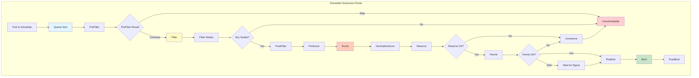

**Scheduler Plugin Interface:**

```go
// Reference: pkg/scheduler/framework/interface.go

type Framework interface {
    // QueueSort plugins
    QueueSortFunc() LessFunc

    // PreFilter plugins
    RunPreFilterPlugins(ctx context.Context, state *CycleState,
        pod *v1.Pod) (*PreFilterResult, *Status)

    // Filter plugins
    RunFilterPlugins(ctx context.Context, state *CycleState,
        pod *v1.Pod, nodeInfo *NodeInfo) PluginToStatus

    // PostFilter plugins (for preemption)
    RunPostFilterPlugins(ctx context.Context, state *CycleState,
        pod *v1.Pod, filteredNodeStatusMap NodeToStatusMap) (*PostFilterResult, *Status)

    // PreScore plugins
    RunPreScorePlugins(ctx context.Context, state *CycleState,
        pod *v1.Pod, nodes []*v1.Node) *Status

    // Score plugins
    RunScorePlugins(ctx context.Context, state *CycleState,
        pod *v1.Pod, nodes []*v1.Node) (PluginToNodeScores, *Status)

    // Reserve plugins
    RunReservePlugins(ctx context.Context, state *CycleState,
        pod *v1.Pod, nodeName string) *Status

    // Permit plugins
    RunPermitPlugins(ctx context.Context, state *CycleState,
        pod *v1.Pod, nodeName string) *Status

    // PreBind plugins
    RunPreBindPlugins(ctx context.Context, state *CycleState,
        pod *v1.Pod, nodeName string) *Status

    // Bind plugins
    RunBindPlugins(ctx context.Context, state *CycleState,
        pod *v1.Pod, nodeName string) *Status

    // PostBind plugins
    RunPostBindPlugins(ctx context.Context, state *CycleState,
        pod *v1.Pod, nodeName string)
}

// Plugin is the parent interface for all scheduler plugins
type Plugin interface {
    Name() string
}

// QueueSortPlugin defines the interface for queue sorting
type QueueSortPlugin interface {
    Plugin
    Less(*QueuedPodInfo, *QueuedPodInfo) bool
}

// FilterPlugin defines the interface for filtering nodes
type FilterPlugin interface {
    Plugin
    Filter(ctx context.Context, state *CycleState, pod *v1.Pod,
        nodeInfo *NodeInfo) *Status
}

// ScorePlugin defines the interface for scoring nodes
type ScorePlugin interface {
    Plugin
    Score(ctx context.Context, state *CycleState, pod *v1.Pod,
        nodeName string) (int64, *Status)
    ScoreExtensions() ScoreExtensions
}

// ReservePlugin defines the interface for reserving resources
type ReservePlugin interface {
    Plugin
    Reserve(ctx context.Context, state *CycleState, pod *v1.Pod,
        nodeName string) *Status
    Unreserve(ctx context.Context, state *CycleState, pod *v1.Pod,
        nodeName string)
}
```

**Custom Scheduler Plugin Example:**

```go
// Example custom plugin for node affinity scoring

type NodeAffinityPlugin struct {
    handle framework.Handle
}

func (pl *NodeAffinityPlugin) Name() string {
    return "NodeAffinity"
}

func (pl *NodeAffinityPlugin) Score(ctx context.Context, state *framework.CycleState,
    pod *v1.Pod, nodeName string) (int64, *framework.Status) {

    nodeInfo, err := pl.handle.SnapshotSharedLister().NodeInfos().Get(nodeName)
    if err != nil {
        return 0, framework.AsStatus(err)
    }

    node := nodeInfo.Node()

    // Check preferred affinity
    if pod.Spec.Affinity != nil &&
        pod.Spec.Affinity.NodeAffinity != nil &&
        pod.Spec.Affinity.NodeAffinity.PreferredDuringSchedulingIgnoredDuringExecution != nil {

        var score int64
        for _, term := range pod.Spec.Affinity.NodeAffinity.PreferredDuringSchedulingIgnoredDuringExecution {
            if pl.matchesNodeSelectorTerms(node, term.Preference) {
                score += int64(term.Weight)
            }
        }

        return score, nil
    }

    return 0, nil
}

func (pl *NodeAffinityPlugin) ScoreExtensions() framework.ScoreExtensions {
    return pl
}

func (pl *NodeAffinityPlugin) NormalizeScore(ctx context.Context,
    state *framework.CycleState, pod *v1.Pod,
    scores framework.NodeScoreList) *framework.Status {

    // Normalize scores to 0-100 range
    var highest int64
    for _, nodeScore := range scores {
        if nodeScore.Score > highest {
            highest = nodeScore.Score
        }
    }

    if highest == 0 {
        return nil
    }

    for i := range scores {
        scores[i].Score = scores[i].Score * framework.MaxNodeScore / highest
    }

    return nil
}

func (pl *NodeAffinityPlugin) PreFilter(ctx context.Context,
    state *framework.CycleState, pod *v1.Pod) (*framework.PreFilterResult, *framework.Status) {

    // Check required affinity
    if pod.Spec.Affinity != nil &&
        pod.Spec.Affinity.NodeAffinity != nil &&
        pod.Spec.Affinity.NodeAffinity.RequiredDuringSchedulingIgnoredDuringExecution != nil {

        // Store required terms in cycle state
        state.Write("required-terms",
            pod.Spec.Affinity.NodeAffinity.RequiredDuringSchedulingIgnoredDuringExecution)
    }

    return nil, nil
}

func (pl *NodeAffinityPlugin) Filter(ctx context.Context, state *framework.CycleState,
    pod *v1.Pod, nodeInfo *framework.NodeInfo) *framework.Status {

    node := nodeInfo.Node()

    // Get required terms from state
    data, err := state.Read("required-terms")
    if err != nil {
        // No required terms
        return nil
    }

    requiredTerms := data.(*v1.NodeSelector)

    // Check if node matches any term
    for _, term := range requiredTerms.NodeSelectorTerms {
        if pl.matchesNodeSelectorTerms(node, term) {
            return nil
        }
    }

    return framework.NewStatus(framework.UnschedulableAndUnresolvable,
        "node doesn't match pod node affinity")
}
```

### **Scheduler Extender**

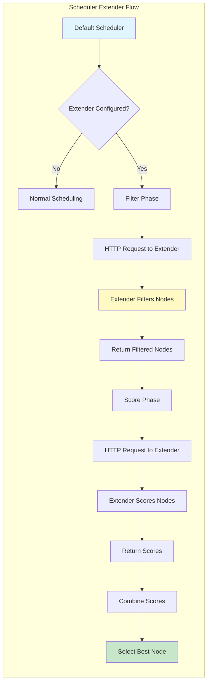

**Scheduler Extender Configuration:**

```yaml
# Reference: pkg/scheduler/apis/config/types.go
apiVersion: kubescheduler.config.k8s.io/v1
kind: KubeSchedulerConfiguration
extenders:
  - urlPrefix: "https://scheduler-extender.example.com"
    filterVerb: "filter"
    prioritizeVerb: "prioritize"
    preemptVerb: "preempt"
    bindVerb: "bind"
    weight: 1
    enableHTTPS: true
    tlsConfig:
      certFile: "/etc/kubernetes/extender.crt"
      keyFile: "/etc/kubernetes/extender.key"
      caFile: "/etc/kubernetes/ca.crt"
    httpTimeout: 30s
    nodeCacheCapable: true
    managedResources:
      - name: "example.com/gpu"
        ignoredByScheduler: false
    ignorable: false
```

━━━━━━━━━━━━━━━━━━━━━━━━━━━━━━━━━━━━━━━━━━━━━━━━━━━━━━━━━━━━━━━━━━━━━━━━━━━━━━

## **🌐 Network Extension Points**

### **Container Network Interface (CNI)**

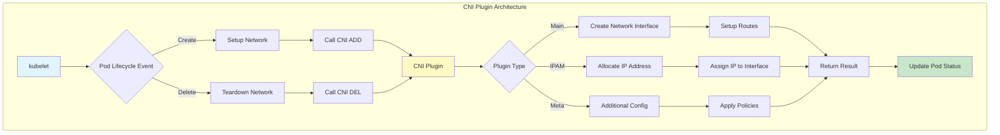

**CNI Configuration:**

```json
{
  "cniVersion": "0.4.0",
  "name": "k8s-pod-network",
  "plugins": [
    {
      "type": "calico",
      "log_level": "info",
      "datastore_type": "kubernetes",
      "nodename": "node1",
      "ipam": {
        "type": "calico-ipam"
      },
      "policy": {
        "type": "k8s"
      },
      "kubernetes": {
        "kubeconfig": "/etc/cni/net.d/calico-kubeconfig"
      }
    },
    {
      "type": "portmap",
      "capabilities": {
        "portMappings": true
      }
    },
    {
      "type": "bandwidth",
      "capabilities": {
        "bandwidth": true
      }
    }
  ]
}
```

**CNI Plugin Invocation:**

```go
// Reference: pkg/kubelet/dockershim/network/cni/cni.go

type cniNetworkPlugin struct {
    defaultNetwork *cniNetwork

    loNetwork *cniNetwork

    cniConfig libcni.CNI

    podCIDR string

    nsenterPath string
}

func (plugin *cniNetworkPlugin) SetUpPod(namespace string, name string,
    id kubecontainer.ContainerID, annotations, options map[string]string) error {

    netnsPath, err := plugin.host.GetNetNS(id.ID)
    if err != nil {
        return err
    }

    // Build runtime config
    rt := &libcni.RuntimeConf{
        ContainerID: id.ID,
        NetNS:       netnsPath,
        IfName:      DefaultInterfaceName,
        Args: [][2]string{
            {"IgnoreUnknown", "1"},
            {"K8S_POD_NAMESPACE", namespace},
            {"K8S_POD_NAME", name},
            {"K8S_POD_INFRA_CONTAINER_ID", id.ID},
        },
    }

    // Add port mappings
    if len(options) > 0 {
        if portMappings, ok := options["portMappings"]; ok {
            rt.CapabilityArgs = map[string]interface{}{
                "portMappings": portMappings,
            }
        }
    }

    // Call CNI ADD
    result, err := plugin.cniConfig.AddNetworkList(
        context.TODO(),
        plugin.defaultNetwork.NetworkConfig,
        rt,
    )
    if err != nil {
        return err
    }

    // Store result
    return plugin.storeResult(id.ID, result)
}

func (plugin *cniNetworkPlugin) TearDownPod(namespace string, name string,
    id kubecontainer.ContainerID) error {

    netnsPath, err := plugin.host.GetNetNS(id.ID)
    if err != nil {
        // Network namespace might already be gone
        return nil
    }

    rt := &libcni.RuntimeConf{
        ContainerID: id.ID,
        NetNS:       netnsPath,
        IfName:      DefaultInterfaceName,
        Args: [][2]string{
            {"IgnoreUnknown", "1"},
            {"K8S_POD_NAMESPACE", namespace},
            {"K8S_POD_NAME", name},
            {"K8S_POD_INFRA_CONTAINER_ID", id.ID},
        },
    }

    // Call CNI DEL
    return plugin.cniConfig.DelNetworkList(
        context.TODO(),
        plugin.defaultNetwork.NetworkConfig,
        rt,
    )
}
```

### **Network Policy**

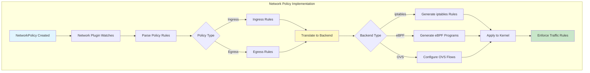

━━━━━━━━━━━━━━━━━━━━━━━━━━━━━━━━━━━━━━━━━━━━━━━━━━━━━━━━━━━━━━━━━━━━━━━━━━━━━━

## **💾 Storage Extension Points**

### **Container Storage Interface (CSI)**

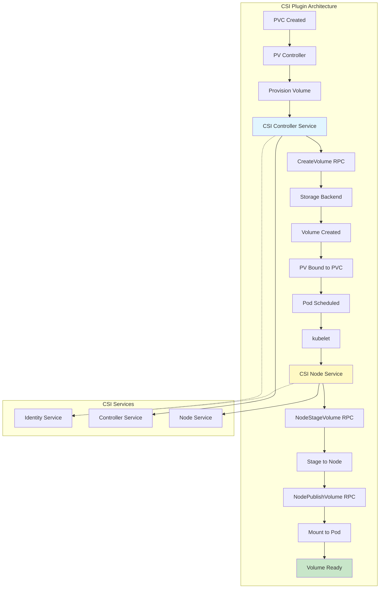

**CSI Driver Registration:**

```yaml
# Reference: staging/src/k8s.io/api/storage/v1/types.go
apiVersion: storage.k8s.io/v1
kind: CSIDriver
metadata:
  name: ebs.csi.aws.com
spec:
  attachRequired: true
  podInfoOnMount: true
  volumeLifecycleModes:
    - Persistent
    - Ephemeral
  fsGroupPolicy: File
  requiresRepublish: false
  storageCapacity: true
  tokenRequests:
    - audience: "sts.amazonaws.com"
      expirationSeconds: 86400
```

**CSI Controller Implementation:**

```go
// Reference: staging/src/k8s.io/csi-translation-lib/plugins/aws_ebs.go

type ControllerServer struct {
    cloud aws.Cloud

    // Volume locks
    volumeLocks *util.VolumeLocks
}

func (cs *ControllerServer) CreateVolume(ctx context.Context,
    req *csi.CreateVolumeRequest) (*csi.CreateVolumeResponse, error) {

    // Validate request
    if err := cs.validateCreateVolumeRequest(req); err != nil {
        return nil, status.Error(codes.InvalidArgument, err.Error())
    }

    // Extract parameters
    volSizeBytes := req.GetCapacityRange().GetRequiredBytes()
    volName := req.GetName()

    // Get volume options
    volumeParams := &VolumeOptions{
        CapacityBytes: volSizeBytes,
        Tags:          make(map[string]string),
    }

    for key, value := range req.GetParameters() {
        switch strings.ToLower(key) {
        case "type":
            volumeParams.VolumeType = value
        case "iops":
            iops, _ := strconv.ParseInt(value, 10, 64)
            volumeParams.IOPS = iops
        case "throughput":
            throughput, _ := strconv.ParseInt(value, 10, 64)
            volumeParams.Throughput = throughput
        case "encrypted":
            volumeParams.Encrypted, _ = strconv.ParseBool(value)
        case "kmskeyid":
            volumeParams.KmsKeyID = value
        }
    }

    // Add tags
    volumeParams.Tags["CSIVolumeName"] = volName
    volumeParams.Tags["kubernetes.io/created-for/pvc/name"] =
        req.GetParameters()["csi.storage.k8s.io/pvc/name"]
    volumeParams.Tags["kubernetes.io/created-for/pvc/namespace"] =
        req.GetParameters()["csi.storage.k8s.io/pvc/namespace"]

    // Check for existing volume
    if req.GetVolumeContentSource() != nil {
        // Create from snapshot or clone
        if snapshot := req.GetVolumeContentSource().GetSnapshot(); snapshot != nil {
            volumeParams.SnapshotID = snapshot.GetSnapshotId()
        } else if source := req.GetVolumeContentSource().GetVolume(); source != nil {
            volumeParams.SourceVolumeID = source.GetVolumeId()
        }
    }

    // Create volume
    volumeID, err := cs.cloud.CreateDisk(ctx, volumeParams)
    if err != nil {
        return nil, status.Error(codes.Internal, err.Error())
    }

    // Build response
    return &csi.CreateVolumeResponse{
        Volume: &csi.Volume{
            VolumeId:      volumeID,
            CapacityBytes: volSizeBytes,
            VolumeContext: req.GetParameters(),
            ContentSource: req.GetVolumeContentSource(),
            AccessibleTopology: []*csi.Topology{
                {
                    Segments: map[string]string{
                        "topology.ebs.csi.aws.com/zone": volumeParams.AvailabilityZone,
                    },
                },
            },
        },
    }, nil
}

func (cs *ControllerServer) DeleteVolume(ctx context.Context,
    req *csi.DeleteVolumeRequest) (*csi.DeleteVolumeResponse, error) {

    volumeID := req.GetVolumeId()
    if volumeID == "" {
        return nil, status.Error(codes.InvalidArgument, "Volume ID missing")
    }

    // Lock volume
    if acquired := cs.volumeLocks.TryAcquire(volumeID); !acquired {
        return nil, status.Errorf(codes.Aborted,
            "volume %s is already being deleted", volumeID)
    }
    defer cs.volumeLocks.Release(volumeID)

    // Delete volume
    err := cs.cloud.DeleteDisk(ctx, volumeID)
    if err != nil {
        if isNotFoundError(err) {
            // Already deleted
            return &csi.DeleteVolumeResponse{}, nil
        }
        return nil, status.Error(codes.Internal, err.Error())
    }

    return &csi.DeleteVolumeResponse{}, nil
}

func (cs *ControllerServer) ControllerPublishVolume(ctx context.Context,
    req *csi.ControllerPublishVolumeRequest) (*csi.ControllerPublishVolumeResponse, error) {

    volumeID := req.GetVolumeId()
    nodeID := req.GetNodeId()

    // Attach volume to node
    devicePath, err := cs.cloud.AttachDisk(ctx, volumeID, nodeID)
    if err != nil {
        return nil, status.Error(codes.Internal, err.Error())
    }

    return &csi.ControllerPublishVolumeResponse{
        PublishContext: map[string]string{
            "devicePath": devicePath,
        },
    }, nil
}
```

**CSI Node Implementation:**

```go
type NodeServer struct {
    nodeID string

    mounter mount.Interface

    deviceIdentifier DeviceIdentifier
}

func (ns *NodeServer) NodeStageVolume(ctx context.Context,
    req *csi.NodeStageVolumeRequest) (*csi.NodeStageVolumeResponse, error) {

    volumeID := req.GetVolumeId()
    stagingTargetPath := req.GetStagingTargetPath()

    // Find device path
    devicePath := ""
    if path, ok := req.GetPublishContext()["devicePath"]; ok {
        devicePath = path
    }

    // Wait for device to be available
    realDevicePath, err := ns.deviceIdentifier.GetDevicePath(devicePath)
    if err != nil {
        return nil, status.Error(codes.Internal, err.Error())
    }

    // Format if needed
    fsType := req.GetVolumeCapability().GetMount().GetFsType()
    if fsType == "" {
        fsType = "ext4"
    }

    formatted, err := ns.mounter.IsFormatted(realDevicePath)
    if err != nil {
        return nil, status.Error(codes.Internal, err.Error())
    }

    if !formatted {
        err = ns.mounter.Format(realDevicePath, fsType)
        if err != nil {
            return nil, status.Error(codes.Internal, err.Error())
        }
    }

    // Mount to staging path
    err = ns.mounter.Mount(realDevicePath, stagingTargetPath, fsType,
        req.GetVolumeCapability().GetMount().GetMountFlags())
    if err != nil {
        return nil, status.Error(codes.Internal, err.Error())
    }

    return &csi.NodeStageVolumeResponse{}, nil
}

func (ns *NodeServer) NodePublishVolume(ctx context.Context,
    req *csi.NodePublishVolumeRequest) (*csi.NodePublishVolumeResponse, error) {

    stagingTargetPath := req.GetStagingTargetPath()
    targetPath := req.GetTargetPath()

    // Bind mount from staging to target
    mountOptions := []string{"bind"}
    if req.GetReadonly() {
        mountOptions = append(mountOptions, "ro")
    }

    err := ns.mounter.Mount(stagingTargetPath, targetPath, "", mountOptions)
    if err != nil {
        return nil, status.Error(codes.Internal, err.Error())
    }

    return &csi.NodePublishVolumeResponse{}, nil
}

func (ns *NodeServer) NodeUnpublishVolume(ctx context.Context,
    req *csi.NodeUnpublishVolumeRequest) (*csi.NodeUnpublishVolumeResponse, error) {

    targetPath := req.GetTargetPath()

    // Unmount
    err := ns.mounter.Unmount(targetPath)
    if err != nil {
        return nil, status.Error(codes.Internal, err.Error())
    }

    return &csi.NodeUnpublishVolumeResponse{}, nil
}

func (ns *NodeServer) NodeUnstageVolume(ctx context.Context,
    req *csi.NodeUnstageVolumeRequest) (*csi.NodeUnstageVolumeResponse, error) {

    stagingTargetPath := req.GetStagingTargetPath()

    // Unmount staging path
    err := ns.mounter.Unmount(stagingTargetPath)
    if err != nil {
        return nil, status.Error(codes.Internal, err.Error())
    }

    return &csi.NodeUnstageVolumeResponse{}, nil
}
```

━━━━━━━━━━━━━━━━━━━━━━━━━━━━━━━━━━━━━━━━━━━━━━━━━━━━━━━━━━━━━━━━━━━━━━━━━━━━━━

## **🔧 Runtime Extension Points**

### **Container Runtime Interface (CRI)**

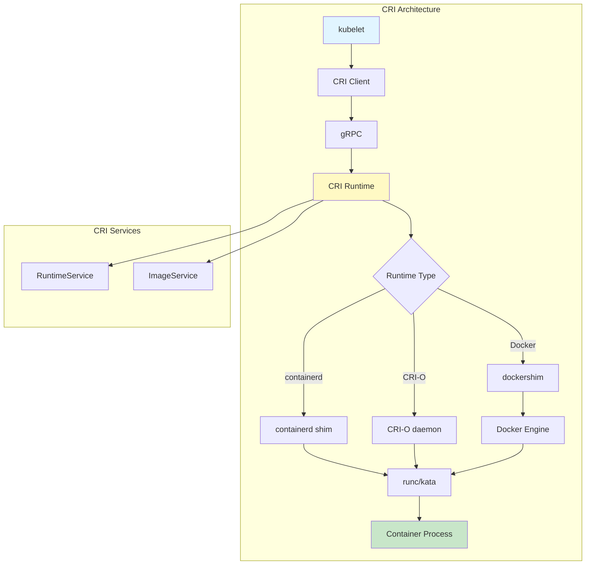

**CRI Runtime Service Interface:**

```go
// Reference: staging/src/k8s.io/cri-api/pkg/apis/runtime/v1/api.proto

type RuntimeService interface {
    // Version returns the runtime version
    Version(ctx context.Context, apiVersion string) (*Version, error)

    // RunPodSandbox creates and starts a pod sandbox
    RunPodSandbox(ctx context.Context, config *PodSandboxConfig,
        runtimeHandler string) (string, error)

    // StopPodSandbox stops a pod sandbox
    StopPodSandbox(ctx context.Context, podSandboxID string) error

    // RemovePodSandbox removes a pod sandbox
    RemovePodSandbox(ctx context.Context, podSandboxID string) error

    // PodSandboxStatus returns the status of a pod sandbox
    PodSandboxStatus(ctx context.Context, podSandboxID string) (*PodSandboxStatus, error)

    // ListPodSandbox lists pod sandboxes
    ListPodSandbox(ctx context.Context, filter *PodSandboxFilter) ([]*PodSandbox, error)

    // CreateContainer creates a container in a pod sandbox
    CreateContainer(ctx context.Context, podSandboxID string,
        config *ContainerConfig, sandboxConfig *PodSandboxConfig) (string, error)

    // StartContainer starts a container
    StartContainer(ctx context.Context, containerID string) error

    // StopContainer stops a container
    StopContainer(ctx context.Context, containerID string, timeout int64) error

    // RemoveContainer removes a container
    RemoveContainer(ctx context.Context, containerID string) error

    // ListContainers lists containers
    ListContainers(ctx context.Context, filter *ContainerFilter) ([]*Container, error)

    // ContainerStatus returns the status of a container
    ContainerStatus(ctx context.Context, containerID string) (*ContainerStatus, error)

    // ExecSync runs a command in a container synchronously
    ExecSync(ctx context.Context, containerID string, cmd []string,
        timeout time.Duration) (stdout []byte, stderr []byte, err error)

    // Exec prepares a streaming endpoint for command execution
    Exec(ctx context.Context, req *ExecRequest) (*ExecResponse, error)

    // Attach prepares a streaming endpoint for attaching to a container
    Attach(ctx context.Context, req *AttachRequest) (*AttachResponse, error)

    // PortForward prepares a streaming endpoint for port forwarding
    PortForward(ctx context.Context, req *PortForwardRequest) (*PortForwardResponse, error)

    // UpdateRuntimeConfig updates runtime configuration
    UpdateRuntimeConfig(ctx context.Context, runtimeConfig *RuntimeConfig) error

    // Status returns the status of the runtime
    Status(ctx context.Context) (*RuntimeStatus, error)
}

type ImageService interface {
    // ListImages lists images
    ListImages(ctx context.Context, filter *ImageFilter) ([]*Image, error)

    // ImageStatus returns the status of an image
    ImageStatus(ctx context.Context, image *ImageSpec) (*Image, error)

    // PullImage pulls an image
    PullImage(ctx context.Context, image *ImageSpec, auth *AuthConfig,
        podSandboxConfig *PodSandboxConfig) (string, error)

    // RemoveImage removes an image
    RemoveImage(ctx context.Context, image *ImageSpec) error

    // ImageFsInfo returns filesystem info for images
    ImageFsInfo(ctx context.Context) ([]*FilesystemUsage, error)
}
```

**Runtime Handler Configuration:**

```yaml
# Reference: pkg/kubelet/apis/config/types.go
apiVersion: node.k8s.io/v1
kind: RuntimeClass
metadata:
  name: kata-containers
handler: kata
overhead:
  podFixed:
    memory: "130Mi"
    cpu: "250m"
scheduling:
  nodeSelector:
    runtime: kata
  tolerations:
    - key: "runtime"
      operator: "Equal"
      value: "kata"
      effect: "NoSchedule"
```

━━━━━━━━━━━━━━━━━━━━━━━━━━━━━━━━━━━━━━━━━━━━━━━━━━━━━━━━━━━━━━━━━━━━━━━━━━━━━━

## **🖥️ Device Plugin Framework**

### **Device Plugin Architecture**

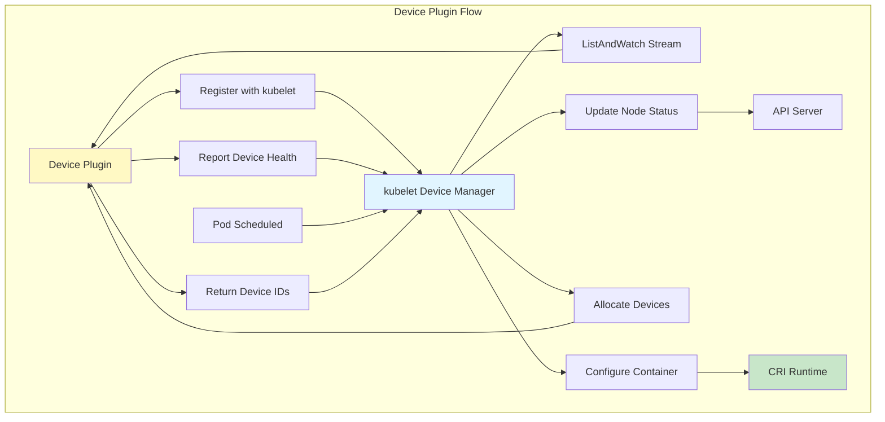

**Device Plugin Interface:**

```go
// Reference: staging/src/k8s.io/kubelet/pkg/apis/deviceplugin/v1beta1/api.proto

type DevicePlugin interface {
    // GetDevicePluginOptions returns options to be communicated with Device Manager
    GetDevicePluginOptions(context.Context, *Empty) (*DevicePluginOptions, error)

    // ListAndWatch returns a stream of List of Devices
    ListAndWatch(*Empty, DevicePlugin_ListAndWatchServer) error

    // Allocate is called during container creation
    Allocate(context.Context, *AllocateRequest) (*AllocateResponse, error)

    // GetPreferredAllocation returns preferred devices for allocation
    GetPreferredAllocation(context.Context, *PreferredAllocationRequest) (*PreferredAllocationResponse, error)

    // PreStartContainer is called before container start
    PreStartContainer(context.Context, *PreStartContainerRequest) (*PreStartContainerResponse, error)
}

// Registration interface for device plugins
type Registration interface {
    Register(ctx context.Context, request *RegisterRequest) (*Empty, error)
}
```

**GPU Device Plugin Example:**

```go
type NvidiaDevicePlugin struct {
    resourceName string
    socket       string

    devices map[string]*Device

    server *grpc.Server

    health chan *Device
    stop   chan struct{}
}

func (m *NvidiaDevicePlugin) ListAndWatch(e *pluginapi.Empty,
    s pluginapi.DevicePlugin_ListAndWatchServer) error {

    // Send initial list
    s.Send(&pluginapi.ListAndWatchResponse{Devices: m.getDevices()})

    // Watch for health changes
    for {
        select {
        case <-m.stop:
            return nil
        case d := <-m.health:
            // Update device health
            d.Health = pluginapi.Unhealthy
            s.Send(&pluginapi.ListAndWatchResponse{Devices: m.getDevices()})
        }
    }
}

func (m *NvidiaDevicePlugin) Allocate(ctx context.Context,
    reqs *pluginapi.AllocateRequest) (*pluginapi.AllocateResponse, error) {

    responses := pluginapi.AllocateResponse{}

    for _, req := range reqs.ContainerRequests {
        response := pluginapi.ContainerAllocateResponse{
            Envs: map[string]string{
                "NVIDIA_VISIBLE_DEVICES": strings.Join(req.DevicesIDs, ","),
            },
            Devices: []*pluginapi.DeviceSpec{},
            Mounts:  []*pluginapi.Mount{},
        }

        // Add device files
        for _, id := range req.DevicesIDs {
            dev := m.devices[id]
            response.Devices = append(response.Devices, &pluginapi.DeviceSpec{
                ContainerPath: dev.Path,
                HostPath:      dev.Path,
                Permissions:   "rwm",
            })
        }

        // Add required mounts
        response.Mounts = append(response.Mounts, &pluginapi.Mount{
            ContainerPath: "/usr/local/nvidia",
            HostPath:      "/usr/local/nvidia",
            ReadOnly:      true,
        })

        responses.ContainerResponses = append(responses.ContainerResponses, &response)
    }

    return &responses, nil
}

func (m *NvidiaDevicePlugin) GetDevicePluginOptions(ctx context.Context,
    e *pluginapi.Empty) (*pluginapi.DevicePluginOptions, error) {
    return &pluginapi.DevicePluginOptions{
        PreStartRequired:                false,
        GetPreferredAllocationAvailable: true,
    }, nil
}

func (m *NvidiaDevicePlugin) GetPreferredAllocation(ctx context.Context,
    req *pluginapi.PreferredAllocationRequest) (*pluginapi.PreferredAllocationResponse, error) {

    response := &pluginapi.PreferredAllocationResponse{}

    for _, containerReq := range req.ContainerRequests {
        // Allocate GPUs on same NUMA node when possible
        deviceIDs := m.getPreferredDevices(containerReq.MustIncludeDeviceIDs,
            containerReq.AllocationSize)

        response.ContainerResponses = append(response.ContainerResponses,
            &pluginapi.ContainerPreferredAllocationResponse{
                DeviceIDs: deviceIDs,
            })
    }

    return response, nil
}
```

━━━━━━━━━━━━━━━━━━━━━━━━━━━━━━━━━━━━━━━━━━━━━━━━━━━━━━━━━━━━━━━━━━━━━━━━━━━━━━

## **📊 Extension Point Comparison Matrix**

| **Extension Point** | **Complexity** | **Flexibility** | **Performance Impact** | **Use Case** |
|---------------------|----------------|-----------------|------------------------|--------------|
| **CRDs** | Low | High | Low | Custom resources |
| **API Aggregation** | High | Very High | Medium | Full API servers |
| **Webhook Auth** | Medium | High | Medium | Custom authentication |
| **Webhook Authz** | Medium | High | Medium | Custom authorization |
| **Admission Webhooks** | Medium | High | Medium | Validation/mutation |
| **Admission Plugins** | High | High | Low | Built-in admission |
| **Scheduler Plugins** | High | Very High | Low | Custom scheduling |
| **Scheduler Extender** | Medium | Medium | High | External scheduling |
| **CNI** | High | Very High | Low | Network management |
| **CSI** | High | Very High | Low | Storage management |
| **CRI** | Very High | Very High | Low | Container runtime |
| **Device Plugins** | Medium | Medium | Low | Device management |

━━━━━━━━━━━━━━━━━━━━━━━━━━━━━━━━━━━━━━━━━━━━━━━━━━━━━━━━━━━━━━━━━━━━━━━━━━━━━━

## **🎯 Best Practices**

### **Choosing the Right Extension Point**

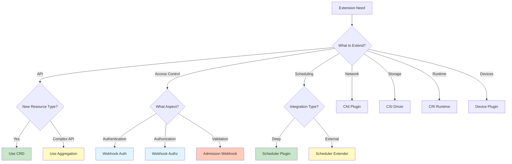

### **Extension Point Selection Guide**

**Use CRDs when:**
- Adding new resource types to Kubernetes
- Need kubectl integration automatically
- Don't need custom API server logic
- Schema validation is sufficient

**Use API Aggregation when:**
- Need full control over API behavior
- Implementing complex business logic
- Need custom storage backends
- Building a complete platform on Kubernetes

**Use Admission Webhooks when:**
- Need to validate resources dynamically
- Need to mutate resources before persistence
- Policy enforcement requirements
- Integration with external systems

**Use Scheduler Plugins when:**
- Need custom scheduling logic
- Performance is critical
- Deep integration with scheduler needed
- Part of core cluster operations

**Use Infrastructure Plugins (CNI/CSI/CRI) when:**
- Providing infrastructure capabilities
- Need low-level control
- Performance is critical
- Standard interfaces are sufficient

━━━━━━━━━━━━━━━━━━━━━━━━━━━━━━━━━━━━━━━━━━━━━━━━━━━━━━━━━━━━━━━━━━━━━━━━━━━━━━

## **📚 Key Takeaways**

### **Extension Point Categories**

1. **API Extensions**: CRDs and API Aggregation for adding resources
2. **Access Control**: Webhooks for authentication and authorization
3. **Admission Control**: Webhooks and plugins for validation/mutation
4. **Scheduling**: Plugins and extenders for custom scheduling
5. **Infrastructure**: CNI, CSI, CRI for core capabilities
6. **Device Management**: Device plugins for hardware resources

### **Design Considerations**

- **Performance**: In-process plugins > webhooks > external services
- **Complexity**: Built-in > plugins > aggregated APIs
- **Flexibility**: Webhooks provide maximum flexibility
- **Maintenance**: Standard interfaces reduce maintenance burden
- **Security**: All extension points must implement proper authentication

### **Common Patterns**

- Use CRDs for simple resource extensions
- Use admission webhooks for policy enforcement
- Use infrastructure plugins for platform capabilities
- Combine extension points for complete solutions
- Always implement proper error handling and retry logic

━━━━━━━━━━━━━━━━━━━━━━━━━━━━━━━━━━━━━━━━━━━━━━━━━━━━━━━━━━━━━━━━━━━━━━━━━━━━━━

## **🔗 Related Documentation**

- **[Extension Overview](./01-extension-overview.md)** - Extension architecture overview
- **[Design Patterns](./03-design-patterns.md)** - Common extension patterns
- **[Custom Resources](../middle-level/01-custom-resources.md)** - CRD deep dive
- **[Webhooks](../middle-level/02-validating-webhooks.md)** - Admission webhooks
- **[Operator Patterns](../middle-level/06-operator-patterns.md)** - Building operators

━━━━━━━━━━━━━━━━━━━━━━━━━━━━━━━━━━━━━━━━━━━━━━━━━━━━━━━━━━━━━━━━━━━━━━━━━━━━━━
