# **Kubernetes Extension Design Patterns**

**Common Patterns and Best Practices for Kubernetes Extensions**

━━━━━━━━━━━━━━━━━━━━━━━━━━━━━━━━━━━━━━━━━━━━━━━━━━━━━━━━━━━━━━━━━━━━━━━━━━━━━━

## **📋 Overview**

This document covers proven design patterns for building Kubernetes extensions, including operators, controllers, webhooks, and other extension mechanisms. These patterns emerge from real-world production systems and represent best practices from the Kubernetes community.

### **Pattern Categories**

1. **Controller Patterns** - Reconciliation and state management
2. **Operator Patterns** - Application-specific knowledge encoding
3. **Webhook Patterns** - Admission control and validation
4. **Resource Patterns** - Custom resource design
5. **Integration Patterns** - External system integration
6. **Observability Patterns** - Monitoring and debugging
7. **Security Patterns** - Authentication and authorization

━━━━━━━━━━━━━━━━━━━━━━━━━━━━━━━━━━━━━━━━━━━━━━━━━━━━━━━━━━━━━━━━━━━━━━━━━━━━━━

## **🔄 Controller Patterns**

### **Level-Triggered Reconciliation Pattern**

The fundamental pattern for Kubernetes controllers: continuously reconcile desired state with actual state.

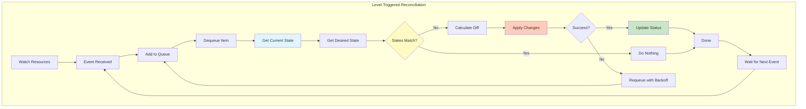

**Implementation:**

```go
// Reference: staging/src/k8s.io/sample-controller/controller.go

type Controller struct {
    kubeclientset kubernetes.Interface
    sampleclientset clientset.Interface

    deploymentsLister appslisters.DeploymentLister
    deploymentsSynced cache.InformerSynced

    foosLister listers.FooLister
    foosSynced cache.InformerSynced

    workqueue workqueue.RateLimitingInterface

    recorder record.EventRecorder
}

// syncHandler compares the actual state with the desired state
func (c *Controller) syncHandler(key string) error {
    // Convert the namespace/name string into namespace and name
    namespace, name, err := cache.SplitMetaNamespaceKey(key)
    if err != nil {
        utilruntime.HandleError(fmt.Errorf("invalid resource key: %s", key))
        return nil
    }

    // Get the Foo resource with this namespace/name
    foo, err := c.foosLister.Foos(namespace).Get(name)
    if err != nil {
        if errors.IsNotFound(err) {
            // Object has been deleted
            utilruntime.HandleError(fmt.Errorf("foo '%s' in work queue no longer exists", key))
            return nil
        }
        return err
    }

    deploymentName := foo.Spec.DeploymentName
    if deploymentName == "" {
        // We choose to absorb the error here as the worker would requeue the
        // resource otherwise. Instead, the next time the resource is updated
        // the resource will be queued again.
        utilruntime.HandleError(fmt.Errorf("%s: deployment name must be specified", key))
        return nil
    }

    // Get the deployment with the name specified in Foo.spec
    deployment, err := c.deploymentsLister.Deployments(foo.Namespace).Get(deploymentName)
    // If the resource doesn't exist, we'll create it
    if errors.IsNotFound(err) {
        deployment, err = c.kubeclientset.AppsV1().Deployments(foo.Namespace).Create(
            context.TODO(), newDeployment(foo), metav1.CreateOptions{})
    }

    // If an error occurs during Get/Create, we'll requeue the item so we can
    // attempt processing again later.
    if err != nil {
        return err
    }

    // If the Deployment is not controlled by this Foo resource, log a warning
    // and return error
    if !metav1.IsControlledBy(deployment, foo) {
        msg := fmt.Sprintf(MessageResourceExists, deployment.Name)
        c.recorder.Event(foo, corev1.EventTypeWarning, ErrResourceExists, msg)
        return fmt.Errorf("%s", msg)
    }

    // If Foo.spec.replicas differs from Deployment.spec.replicas, update
    if foo.Spec.Replicas != nil && *foo.Spec.Replicas != *deployment.Spec.Replicas {
        klog.V(4).Infof("Foo %s replicas: %d, deployment replicas: %d",
            name, *foo.Spec.Replicas, *deployment.Spec.Replicas)
        deployment, err = c.kubeclientset.AppsV1().Deployments(foo.Namespace).Update(
            context.TODO(), newDeployment(foo), metav1.UpdateOptions{})
    }

    // If an error occurs during Update, we'll requeue the item
    if err != nil {
        return err
    }

    // Finally, we update the status block of the Foo resource to reflect the
    // current state of the world
    err = c.updateFooStatus(foo, deployment)
    if err != nil {
        return err
    }

    c.recorder.Event(foo, corev1.EventTypeNormal, SuccessSynced, MessageResourceSynced)
    return nil
}
```

### **Owner References Pattern**

Establish parent-child relationships between resources for automatic garbage collection.

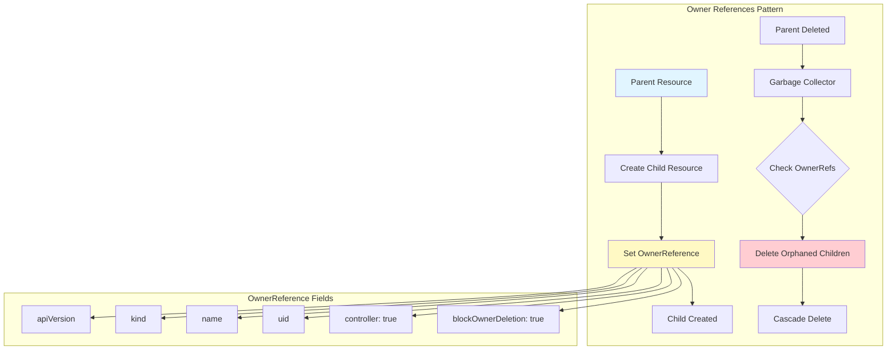

**Implementation:**

```go
// Reference: pkg/controller/deployment/deployment_controller.go

func (dc *DeploymentController) syncDeployment(key string) error {
    deployment, err := dc.dLister.Deployments(namespace).Get(name)
    if err != nil {
        return err
    }

    // List ReplicaSets owned by this Deployment
    rsList, err := dc.getReplicaSetsForDeployment(deployment)
    if err != nil {
        return err
    }

    // Create new ReplicaSet with owner reference
    newRS, err := dc.createReplicaSet(deployment)
    if err != nil {
        return err
    }

    return nil
}

func (dc *DeploymentController) createReplicaSet(deployment *apps.Deployment) (*apps.ReplicaSet, error) {
    // Build new ReplicaSet from deployment template
    newRS := &apps.ReplicaSet{
        ObjectMeta: metav1.ObjectMeta{
            Name:      fmt.Sprintf("%s-%s", deployment.Name, hash),
            Namespace: deployment.Namespace,
            Labels:    deployment.Spec.Template.Labels,
            // Set owner reference for garbage collection
            OwnerReferences: []metav1.OwnerReference{
                *metav1.NewControllerRef(deployment, apps.SchemeGroupVersion.WithKind("Deployment")),
            },
        },
        Spec: apps.ReplicaSetSpec{
            Replicas: deployment.Spec.Replicas,
            Selector: deployment.Spec.Selector,
            Template: deployment.Spec.Template,
        },
    }

    return dc.client.AppsV1().ReplicaSets(deployment.Namespace).Create(
        context.TODO(), newRS, metav1.CreateOptions{})
}

// Helper to create owner reference
func newControllerRef(owner metav1.Object, gvk schema.GroupVersionKind) *metav1.OwnerReference {
    blockOwnerDeletion := true
    isController := true
    return &metav1.OwnerReference{
        APIVersion:         gvk.GroupVersion().String(),
        Kind:               gvk.Kind,
        Name:               owner.GetName(),
        UID:                owner.GetUID(),
        BlockOwnerDeletion: &blockOwnerDeletion,
        Controller:         &isController,
    }
}
```

### **Workqueue Pattern**

Reliable, rate-limited processing of items with automatic retries.

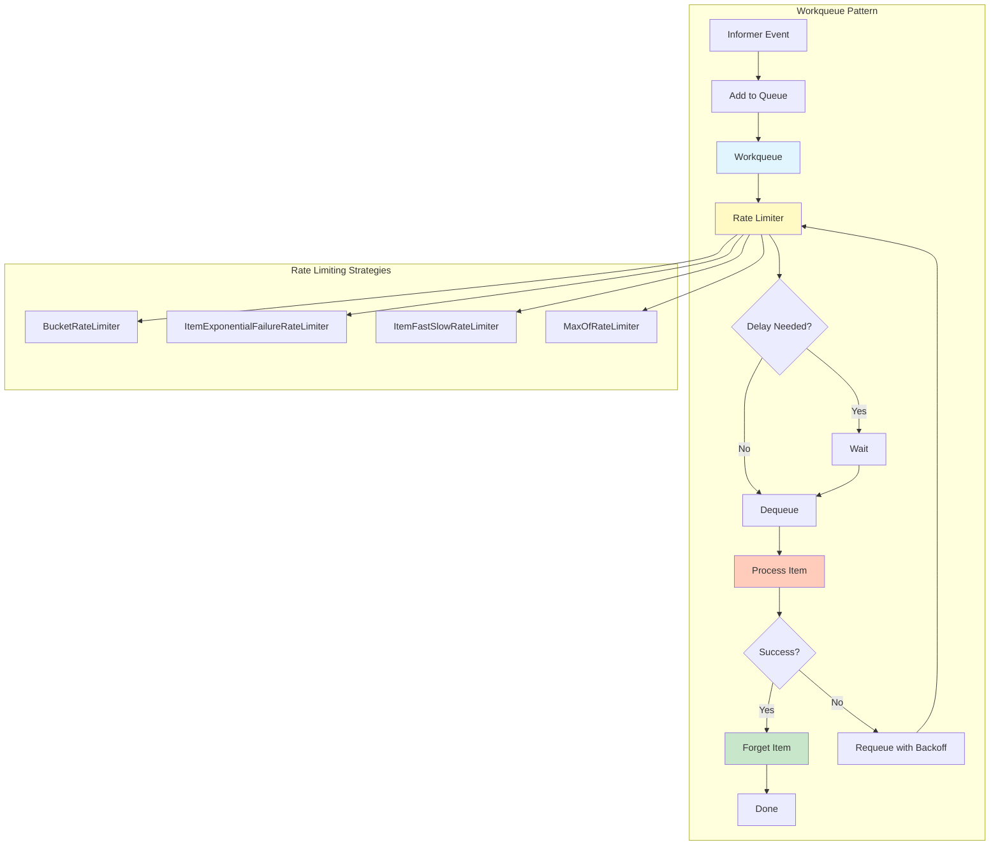

**Implementation:**

```go
// Reference: staging/src/k8s.io/client-go/util/workqueue/rate_limiting_queue.go

type Controller struct {
    // workqueue is a rate limited work queue
    workqueue workqueue.RateLimitingInterface
}

func NewController() *Controller {
    c := &Controller{
        // Create rate limiting queue
        workqueue: workqueue.NewNamedRateLimitingQueue(
            // Combine multiple rate limiters
            workqueue.NewMaxOfRateLimiter(
                // Exponential backoff: 5ms, 10ms, 20ms, ..., up to 1000s
                workqueue.NewItemExponentialFailureRateLimiter(5*time.Millisecond, 1000*time.Second),
                // Overall rate limit: 10 qps, 100 bucket size
                &workqueue.BucketRateLimiter{Limiter: rate.NewLimiter(rate.Limit(10), 100)},
            ),
            "MyController",
        ),
    }

    return c
}

func (c *Controller) runWorker() {
    for c.processNextWorkItem() {
    }
}

func (c *Controller) processNextWorkItem() bool {
    obj, shutdown := c.workqueue.Get()
    if shutdown {
        return false
    }

    // We wrap this block in a func so we can defer c.workqueue.Done.
    err := func(obj interface{}) error {
        // We call Done here so the workqueue knows we have finished
        // processing this item.
        defer c.workqueue.Done(obj)

        var key string
        var ok bool
        if key, ok = obj.(string); !ok {
            // As the item in the workqueue is actually invalid, we call
            // Forget here to avoid getting stuck processing this item
            c.workqueue.Forget(obj)
            utilruntime.HandleError(fmt.Errorf("expected string in workqueue but got %#v", obj))
            return nil
        }

        // Run the syncHandler, passing it the namespace/name string of the resource
        if err := c.syncHandler(key); err != nil {
            // Put the item back on the workqueue to handle any transient errors
            c.workqueue.AddRateLimited(key)
            return fmt.Errorf("error syncing '%s': %s, requeuing", key, err.Error())
        }

        // Finally, if no error occurs we Forget this item so it is not
        // requeued until another change happens
        c.workqueue.Forget(obj)
        klog.Infof("Successfully synced '%s'", key)
        return nil
    }(obj)

    if err != nil {
        utilruntime.HandleError(err)
        return true
    }

    return true
}
```

### **Finalizer Pattern**

Pre-delete hooks to perform cleanup before resource deletion.

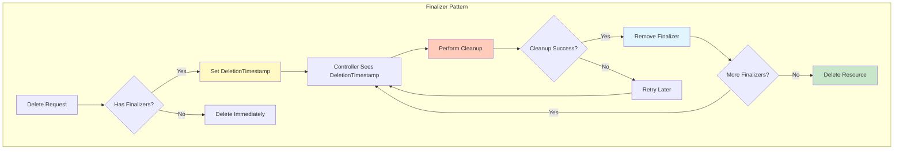

**Implementation:**

```go
// Reference: pkg/controller/volume/persistentvolume/pv_controller.go

const (
    // PVProtectionFinalizer is the finalizer for PV protection
    PVProtectionFinalizer = "kubernetes.io/pv-protection"
)

func (ctrl *PersistentVolumeController) syncVolume(volume *v1.PersistentVolume) error {
    // Check if volume is being deleted
    if volume.ObjectMeta.DeletionTimestamp != nil {
        // Volume is being deleted
        if slice.ContainsString(volume.ObjectMeta.Finalizers, PVProtectionFinalizer, nil) {
            // Our finalizer is present, perform cleanup
            if volume.Status.Phase != v1.VolumeBound {
                // Not bound, safe to remove finalizer
                return ctrl.removeFinalizer(volume)
            }

            // Still bound, check if PVC still exists
            pvc, err := ctrl.claims.GetPVCByKey(volume.Spec.ClaimRef)
            if err != nil || pvc == nil {
                // PVC gone, safe to remove finalizer
                return ctrl.removeFinalizer(volume)
            }

            // PVC still exists, don't remove finalizer yet
            klog.V(4).Infof("Keeping finalizer on PV %s because PVC %s still exists",
                volume.Name, pvc.Name)
            return nil
        }
        // Finalizer already removed, resource will be deleted
        return nil
    }

    // Volume not being deleted, ensure finalizer is present
    if !slice.ContainsString(volume.ObjectMeta.Finalizers, PVProtectionFinalizer, nil) {
        return ctrl.addFinalizer(volume)
    }

    return nil
}

func (ctrl *PersistentVolumeController) addFinalizer(volume *v1.PersistentVolume) error {
    volumeClone := volume.DeepCopy()
    volumeClone.ObjectMeta.Finalizers = append(volumeClone.ObjectMeta.Finalizers,
        PVProtectionFinalizer)

    _, err := ctrl.kubeClient.CoreV1().PersistentVolumes().Update(
        context.TODO(), volumeClone, metav1.UpdateOptions{})
    if err != nil {
        klog.Errorf("Error adding finalizer to PV %s: %v", volume.Name, err)
        return err
    }

    klog.V(4).Infof("Added finalizer to PV %s", volume.Name)
    return nil
}

func (ctrl *PersistentVolumeController) removeFinalizer(volume *v1.PersistentVolume) error {
    volumeClone := volume.DeepCopy()

    // Remove our finalizer
    newFinalizers := []string{}
    for _, f := range volumeClone.ObjectMeta.Finalizers {
        if f != PVProtectionFinalizer {
            newFinalizers = append(newFinalizers, f)
        }
    }
    volumeClone.ObjectMeta.Finalizers = newFinalizers

    _, err := ctrl.kubeClient.CoreV1().PersistentVolumes().Update(
        context.TODO(), volumeClone, metav1.UpdateOptions{})
    if err != nil {
        klog.Errorf("Error removing finalizer from PV %s: %v", volume.Name, err)
        return err
    }

    klog.V(4).Infof("Removed finalizer from PV %s", volume.Name)
    return nil
}
```

━━━━━━━━━━━━━━━━━━━━━━━━━━━━━━━━━━━━━━━━━━━━━━━━━━━━━━━━━━━━━━━━━━━━━━━━━━━━━━

## **🎛️ Operator Patterns**

### **Capability Levels Pattern**

Operators at different maturity levels provide different capabilities.

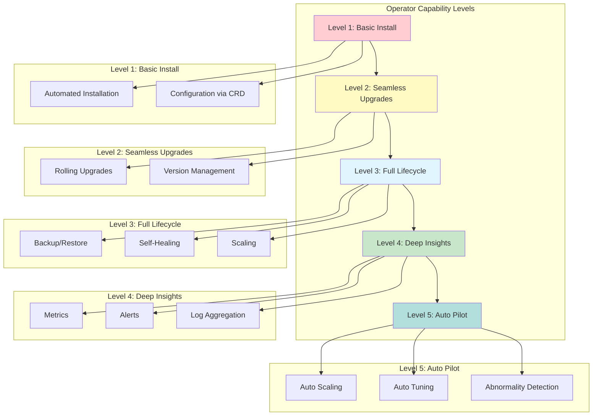

**Level 3 Implementation Example:**

```go
type DatabaseOperator struct {
    client client.Client
    scheme *runtime.Scheme
}

func (r *DatabaseOperator) Reconcile(ctx context.Context,
    req ctrl.Request) (ctrl.Result, error) {

    var database myv1.Database
    if err := r.client.Get(ctx, req.NamespacedName, &database); err != nil {
        return ctrl.Result{}, client.IgnoreNotFound(err)
    }

    // Level 1: Basic Installation
    if err := r.ensureStatefulSet(ctx, &database); err != nil {
        return ctrl.Result{}, err
    }

    // Level 2: Seamless Upgrades
    if err := r.handleUpgrade(ctx, &database); err != nil {
        return ctrl.Result{}, err
    }

    // Level 3: Full Lifecycle
    if err := r.handleBackup(ctx, &database); err != nil {
        return ctrl.Result{}, err
    }

    if err := r.handleScaling(ctx, &database); err != nil {
        return ctrl.Result{}, err
    }

    if err := r.handleFailover(ctx, &database); err != nil {
        return ctrl.Result{}, err
    }

    return ctrl.Result{}, nil
}

func (r *DatabaseOperator) handleBackup(ctx context.Context,
    db *myv1.Database) error {

    if db.Spec.Backup == nil {
        return nil
    }

    // Check if backup is due
    lastBackup, err := r.getLastBackup(ctx, db)
    if err != nil {
        return err
    }

    if time.Since(lastBackup.Status.CompletionTime.Time) < db.Spec.Backup.Interval.Duration {
        // Backup not due yet
        return nil
    }

    // Create backup job
    backup := &myv1.DatabaseBackup{
        ObjectMeta: metav1.ObjectMeta{
            Name:      fmt.Sprintf("%s-%s", db.Name, time.Now().Format("20060102-150405")),
            Namespace: db.Namespace,
            OwnerReferences: []metav1.OwnerReference{
                *metav1.NewControllerRef(db, myv1.GroupVersion.WithKind("Database")),
            },
        },
        Spec: myv1.DatabaseBackupSpec{
            DatabaseRef: myv1.LocalObjectReference{Name: db.Name},
            Destination: db.Spec.Backup.Destination,
        },
    }

    return r.client.Create(ctx, backup)
}

func (r *DatabaseOperator) handleFailover(ctx context.Context,
    db *myv1.Database) error {

    // Get primary pod
    primary, err := r.getPrimaryPod(ctx, db)
    if err != nil {
        return err
    }

    // Check if primary is healthy
    if r.isPodHealthy(primary) {
        return nil
    }

    // Primary is unhealthy, initiate failover
    replicas, err := r.getReplicaPods(ctx, db)
    if err != nil {
        return err
    }

    if len(replicas) == 0 {
        return fmt.Errorf("no replicas available for failover")
    }

    // Select best replica (most up-to-date)
    bestReplica := r.selectBestReplica(replicas)

    // Promote replica to primary
    if err := r.promoteReplica(ctx, db, bestReplica); err != nil {
        return err
    }

    // Update database status
    db.Status.Primary = bestReplica.Name
    db.Status.Conditions = append(db.Status.Conditions, myv1.DatabaseCondition{
        Type:               "FailoverCompleted",
        Status:             corev1.ConditionTrue,
        LastTransitionTime: metav1.Now(),
        Reason:             "PrimaryUnhealthy",
        Message:            fmt.Sprintf("Promoted %s to primary", bestReplica.Name),
    })

    return r.client.Status().Update(ctx, db)
}
```

### **Composite Operator Pattern**

Operators that manage multiple resource types together.

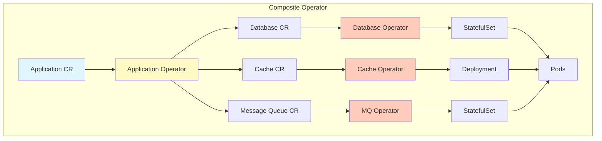

**Implementation:**

```go
type ApplicationReconciler struct {
    client.Client
    Scheme *runtime.Scheme
}

func (r *ApplicationReconciler) Reconcile(ctx context.Context,
    req ctrl.Request) (ctrl.Result, error) {

    var app myv1.Application
    if err := r.Get(ctx, req.NamespacedName, &app); err != nil {
        return ctrl.Result{}, client.IgnoreNotFound(err)
    }

    // Reconcile database
    if err := r.reconcileDatabase(ctx, &app); err != nil {
        return ctrl.Result{}, err
    }

    // Reconcile cache
    if err := r.reconcileCache(ctx, &app); err != nil {
        return ctrl.Result{}, err
    }

    // Reconcile message queue
    if err := r.reconcileMessageQueue(ctx, &app); err != nil {
        return ctrl.Result{}, err
    }

    // Reconcile application deployment
    if err := r.reconcileDeployment(ctx, &app); err != nil {
        return ctrl.Result{}, err
    }

    // Wait for all components to be ready
    if !r.allComponentsReady(ctx, &app) {
        return ctrl.Result{RequeueAfter: 30 * time.Second}, nil
    }

    // Update application status
    app.Status.Phase = "Ready"
    return ctrl.Result{}, r.Status().Update(ctx, &app)
}

func (r *ApplicationReconciler) reconcileDatabase(ctx context.Context,
    app *myv1.Application) error {

    db := &databasev1.Database{
        ObjectMeta: metav1.ObjectMeta{
            Name:      fmt.Sprintf("%s-db", app.Name),
            Namespace: app.Namespace,
            OwnerReferences: []metav1.OwnerReference{
                *metav1.NewControllerRef(app, myv1.GroupVersion.WithKind("Application")),
            },
        },
        Spec: databasev1.DatabaseSpec{
            Version:  app.Spec.Database.Version,
            Storage:  app.Spec.Database.Storage,
            Replicas: app.Spec.Database.Replicas,
        },
    }

    // Create or update database
    var existing databasev1.Database
    err := r.Get(ctx, client.ObjectKeyFromObject(db), &existing)
    if err != nil {
        if errors.IsNotFound(err) {
            return r.Create(ctx, db)
        }
        return err
    }

    // Update if needed
    if !reflect.DeepEqual(existing.Spec, db.Spec) {
        existing.Spec = db.Spec
        return r.Update(ctx, &existing)
    }

    return nil
}
```

### **Parent-Child Operator Pattern**

Hierarchical operators where parent coordinates children.

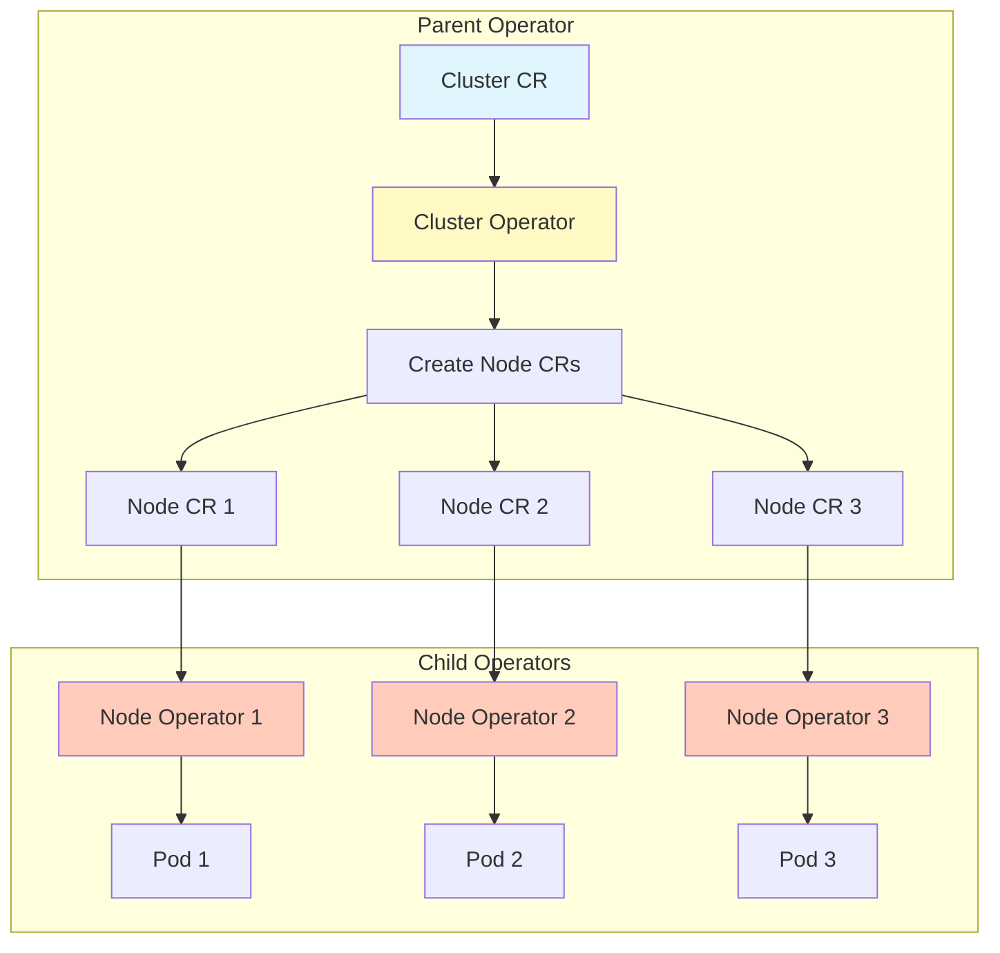

━━━━━━━━━━━━━━━━━━━━━━━━━━━━━━━━━━━━━━━━━━━━━━━━━━━━━━━━━━━━━━━━━━━━━━━━━━━━━━

## **🎣 Webhook Patterns**

### **Default Value Injection Pattern**

Mutating webhooks that inject sensible defaults.

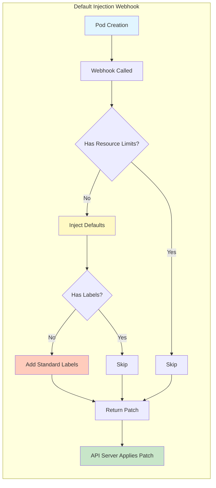

**Implementation:**

```go
type PodDefaulter struct {
    decoder *admission.Decoder
}

func (pd *PodDefaulter) Handle(ctx context.Context,
    req admission.Request) admission.Response {

    pod := &corev1.Pod{}
    err := pd.decoder.Decode(req, pod)
    if err != nil {
        return admission.Errored(http.StatusBadRequest, err)
    }

    // Build patches
    var patches []map[string]interface{}

    // Inject resource limits if missing
    for i := range pod.Spec.Containers {
        container := &pod.Spec.Containers[i]

        if container.Resources.Limits == nil {
            patches = append(patches, map[string]interface{}{
                "op":   "add",
                "path": fmt.Sprintf("/spec/containers/%d/resources/limits", i),
                "value": map[string]string{
                    "cpu":    "500m",
                    "memory": "512Mi",
                },
            })
        }

        if container.Resources.Requests == nil {
            patches = append(patches, map[string]interface{}{
                "op":   "add",
                "path": fmt.Sprintf("/spec/containers/%d/resources/requests", i),
                "value": map[string]string{
                    "cpu":    "250m",
                    "memory": "256Mi",
                },
            })
        }

        // Inject environment variables
        if container.Env == nil {
            patches = append(patches, map[string]interface{}{
                "op":    "add",
                "path":  fmt.Sprintf("/spec/containers/%d/env", i),
                "value": []corev1.EnvVar{},
            })
        }

        patches = append(patches, map[string]interface{}{
            "op":   "add",
            "path": fmt.Sprintf("/spec/containers/%d/env/-", i),
            "value": corev1.EnvVar{
                Name:  "POD_NAME",
                ValueFrom: &corev1.EnvVarSource{
                    FieldRef: &corev1.ObjectFieldSelector{
                        FieldPath: "metadata.name",
                    },
                },
            },
        })
    }

    // Add standard labels
    if pod.Labels == nil {
        patches = append(patches, map[string]interface{}{
            "op":    "add",
            "path":  "/metadata/labels",
            "value": map[string]string{},
        })
    }

    patches = append(patches, map[string]interface{}{
        "op":    "add",
        "path":  "/metadata/labels/app.kubernetes.io~1managed-by",
        "value": "pod-defaulter",
    })

    // Marshal patches
    patchBytes, err := json.Marshal(patches)
    if err != nil {
        return admission.Errored(http.StatusInternalServerError, err)
    }

    return admission.PatchResponseFromRaw(req.Object.Raw, patchBytes)
}
```

### **Policy Enforcement Pattern**

Validating webhooks that enforce organizational policies.

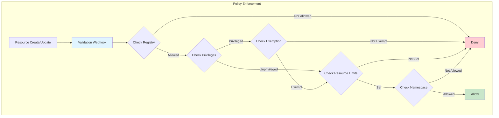

**Implementation:**

```go
type PodValidator struct {
    decoder         *admission.Decoder
    allowedRegistries []string
    exemptNamespaces []string
}

func (pv *PodValidator) Handle(ctx context.Context,
    req admission.Request) admission.Response {

    pod := &corev1.Pod{}
    err := pv.decoder.Decode(req, pod)
    if err != nil {
        return admission.Errored(http.StatusBadRequest, err)
    }

    // Skip exempt namespaces
    if pv.isExempt(pod.Namespace) {
        return admission.Allowed("")
    }

    // Validate image registries
    for _, container := range pod.Spec.Containers {
        if !pv.isAllowedRegistry(container.Image) {
            return admission.Denied(fmt.Sprintf(
                "Image %s is from an unauthorized registry", container.Image))
        }
    }

    // Validate security context
    if pod.Spec.SecurityContext != nil {
        if pod.Spec.SecurityContext.HostNetwork {
            return admission.Denied("HostNetwork is not allowed")
        }
        if pod.Spec.SecurityContext.HostPID {
            return admission.Denied("HostPID is not allowed")
        }
        if pod.Spec.SecurityContext.HostIPC {
            return admission.Denied("HostIPC is not allowed")
        }
    }

    // Validate container security
    for _, container := range pod.Spec.Containers {
        if container.SecurityContext != nil {
            if container.SecurityContext.Privileged != nil &&
                *container.SecurityContext.Privileged {
                return admission.Denied(fmt.Sprintf(
                    "Container %s cannot run in privileged mode", container.Name))
            }

            if container.SecurityContext.AllowPrivilegeEscalation != nil &&
                *container.SecurityContext.AllowPrivilegeEscalation {
                return admission.Denied(fmt.Sprintf(
                    "Container %s cannot allow privilege escalation", container.Name))
            }
        }

        // Validate resource limits
        if container.Resources.Limits == nil {
            return admission.Denied(fmt.Sprintf(
                "Container %s must have resource limits", container.Name))
        }
    }

    return admission.Allowed("")
}

func (pv *PodValidator) isAllowedRegistry(image string) bool {
    for _, registry := range pv.allowedRegistries {
        if strings.HasPrefix(image, registry) {
            return true
        }
    }
    return false
}

func (pv *PodValidator) isExempt(namespace string) bool {
    for _, ns := range pv.exemptNamespaces {
        if ns == namespace {
            return true
        }
    }
    return false
}
```

### **Cross-Resource Validation Pattern**

Webhooks that validate resources against other resources.

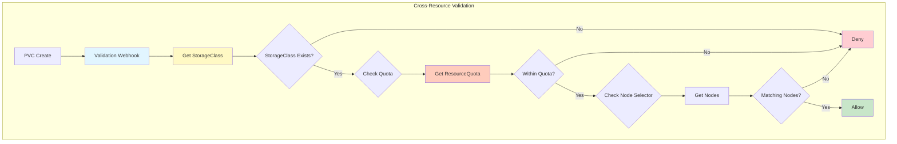

━━━━━━━━━━━━━━━━━━━━━━━━━━━━━━━━━━━━━━━━━━━━━━━━━━━━━━━━━━━━━━━━━━━━━━━━━━━━━━

## **📦 Resource Design Patterns**

### **Spec-Status Pattern**

Separate desired state (spec) from observed state (status).

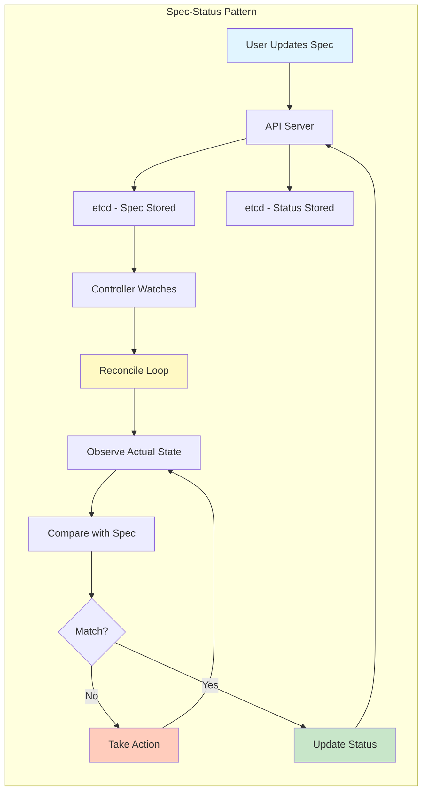

**CRD Design:**

```yaml
apiVersion: apiextensions.k8s.io/v1
kind: CustomResourceDefinition
metadata:
  name: databases.example.com
spec:
  group: example.com
  names:
    kind: Database
    plural: databases
  scope: Namespaced
  versions:
    - name: v1
      served: true
      storage: true
      schema:
        openAPIV3Schema:
          type: object
          properties:
            # SPEC: Desired state (user-provided)
            spec:
              type: object
              required:
                - version
                - storage
              properties:
                version:
                  type: string
                  description: "Database version"
                replicas:
                  type: integer
                  minimum: 1
                  default: 3
                storage:
                  type: object
                  properties:
                    size:
                      type: string
                      pattern: '^[0-9]+[KMGT]i$'
                    storageClass:
                      type: string
                backup:
                  type: object
                  properties:
                    enabled:
                      type: boolean
                    schedule:
                      type: string
                    retention:
                      type: integer

            # STATUS: Observed state (controller-managed)
            status:
              type: object
              properties:
                phase:
                  type: string
                  enum:
                    - Pending
                    - Provisioning
                    - Ready
                    - Failed
                conditions:
                  type: array
                  items:
                    type: object
                    properties:
                      type:
                        type: string
                      status:
                        type: string
                      lastTransitionTime:
                        type: string
                        format: date-time
                      reason:
                        type: string
                      message:
                        type: string
                observedGeneration:
                  type: integer
                  description: "Generation of spec being observed"
                replicas:
                  type: integer
                  description: "Current number of replicas"
                readyReplicas:
                  type: integer
                  description: "Number of ready replicas"
                primary:
                  type: string
                  description: "Primary node name"
      subresources:
        status: {}  # Enable /status subresource
      additionalPrinterColumns:
        - name: Phase
          type: string
          jsonPath: .status.phase
        - name: Replicas
          type: integer
          jsonPath: .status.readyReplicas
        - name: Age
          type: date
          jsonPath: .metadata.creationTimestamp
```

### **Subresources Pattern**

Separate endpoints for status and scale operations.

```mermaid
graph TB
    subgraph "Subresources"
        A[Main Resource] --> B[/status Subresource]
        A --> C[/scale Subresource]

        B --> D[Status Updates]
        D --> E[No Spec Validation]
        E --> F[optimisticLockFailed Retry]

        C --> G[Scale Operations]
        G --> H[Get Current Scale]
        G --> I[Update Replicas]
    end

    subgraph "Benefits"
        J[Separate RBAC]
        K[No Spec Changes]
        L[Optimistic Locking]
    end

    B --> J
    C --> J
    B --> K
    E --> L

    style A fill:#e1f5ff
    style B fill:#fff9c4
    style C fill:#ffccbc
```

**Controller Status Update:**

```go
// Reference: pkg/controller/deployment/deployment_controller.go

func (dc *DeploymentController) syncDeployment(key string) error {
    deployment, err := dc.dLister.Deployments(namespace).Get(name)
    if err != nil {
        return err
    }

    // Perform reconciliation logic
    // ...

    // Update status using /status subresource
    return dc.updateStatus(deployment)
}

func (dc *DeploymentController) updateStatus(deployment *apps.Deployment) error {
    // Clone to avoid modifying cache
    newDeployment := deployment.DeepCopy()

    // Calculate new status
    newStatus := dc.calculateStatus(newDeployment)

    // Only update if status changed
    if reflect.DeepEqual(deployment.Status, newStatus) {
        return nil
    }

    newDeployment.Status = newStatus

    // Update using /status subresource
    // This doesn't trigger spec validation
    _, err := dc.client.AppsV1().Deployments(deployment.Namespace).UpdateStatus(
        context.TODO(), newDeployment, metav1.UpdateOptions{})

    return err
}

func (dc *DeploymentController) calculateStatus(deployment *apps.Deployment) apps.DeploymentStatus {
    allRSs, err := dc.getAllReplicaSets(deployment)
    if err != nil {
        return deployment.Status
    }

    newRS := deploymentutil.FindNewReplicaSet(deployment, allRSs)

    status := apps.DeploymentStatus{
        ObservedGeneration: deployment.Generation,
        Replicas:           deploymentutil.GetReplicaCountForReplicaSets(allRSs),
        UpdatedReplicas:    deploymentutil.GetReplicaCountForReplicaSets([]*apps.ReplicaSet{newRS}),
        ReadyReplicas:      deploymentutil.GetReadyReplicaCountForReplicaSets(allRSs),
        AvailableReplicas:  deploymentutil.GetAvailableReplicaCountForReplicaSets(allRSs),
    }

    // Calculate conditions
    status.Conditions = dc.calculateConditions(deployment, allRSs, newRS)

    return status
}
```

### **Conditions Pattern**

Standard way to report resource health and status.

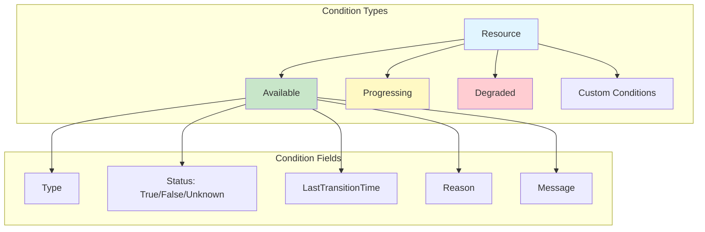

**Condition Management:**

```go
// Reference: staging/src/k8s.io/apimachinery/pkg/api/meta/conditions.go

const (
    ConditionAvailable   = "Available"
    ConditionProgressing = "Progressing"
    ConditionDegraded    = "Degraded"
)

type Condition struct {
    Type               string      `json:"type"`
    Status             ConditionStatus `json:"status"`
    ObservedGeneration int64       `json:"observedGeneration,omitempty"`
    LastTransitionTime metav1.Time `json:"lastTransitionTime"`
    Reason             string      `json:"reason"`
    Message            string      `json:"message"`
}

// SetCondition updates or adds a condition
func SetCondition(conditions *[]Condition, newCondition Condition) {
    if conditions == nil {
        conditions = &[]Condition{}
    }

    existingCondition := FindCondition(*conditions, newCondition.Type)
    if existingCondition == nil {
        newCondition.LastTransitionTime = metav1.Now()
        *conditions = append(*conditions, newCondition)
        return
    }

    if existingCondition.Status != newCondition.Status {
        existingCondition.Status = newCondition.Status
        existingCondition.LastTransitionTime = metav1.Now()
    }

    existingCondition.Reason = newCondition.Reason
    existingCondition.Message = newCondition.Message
    existingCondition.ObservedGeneration = newCondition.ObservedGeneration
}

// IsConditionTrue returns true if condition is True
func IsConditionTrue(conditions []Condition, conditionType string) bool {
    condition := FindCondition(conditions, conditionType)
    return condition != nil && condition.Status == ConditionTrue
}

// Example usage in controller
func (r *DatabaseReconciler) updateAvailableCondition(ctx context.Context,
    db *myv1.Database) error {

    ready := db.Status.ReadyReplicas >= *db.Spec.Replicas

    condition := Condition{
        Type:               ConditionAvailable,
        Status:             ConditionFalse,
        ObservedGeneration: db.Generation,
        Reason:             "ReplicasNotReady",
        Message:            fmt.Sprintf("%d/%d replicas ready",
            db.Status.ReadyReplicas, *db.Spec.Replicas),
    }

    if ready {
        condition.Status = ConditionTrue
        condition.Reason = "AllReplicasReady"
        condition.Message = "All replicas are ready"
    }

    SetCondition(&db.Status.Conditions, condition)

    return r.Status().Update(ctx, db)
}
```

━━━━━━━━━━━━━━━━━━━━━━━━━━━━━━━━━━━━━━━━━━━━━━━━━━━━━━━━━━━━━━━━━━━━━━━━━━━━━━

## **🔌 Integration Patterns**

### **External System Sync Pattern**

Synchronize Kubernetes resources with external systems.

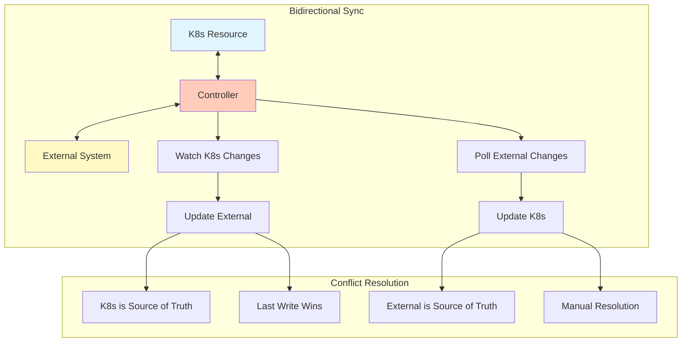

**Implementation:**

```go
type ExternalSyncController struct {
    client       client.Client
    externalAPI  ExternalAPI
    syncInterval time.Duration
}

func (c *ExternalSyncController) Reconcile(ctx context.Context,
    req ctrl.Request) (ctrl.Result, error) {

    var resource myv1.ExternalResource
    if err := c.client.Get(ctx, req.NamespacedName, &resource); err != nil {
        if errors.IsNotFound(err) {
            // Resource deleted in K8s, delete from external system
            return ctrl.Result{}, c.deleteFromExternal(ctx, req.Name)
        }
        return ctrl.Result{}, err
    }

    // Check if resource is being deleted
    if !resource.DeletionTimestamp.IsZero() {
        return ctrl.Result{}, c.handleDeletion(ctx, &resource)
    }

    // Ensure finalizer exists
    if !containsString(resource.Finalizers, "external-sync.example.com") {
        resource.Finalizers = append(resource.Finalizers, "external-sync.example.com")
        return ctrl.Result{}, c.client.Update(ctx, &resource)
    }

    // Get resource from external system
    externalState, err := c.externalAPI.Get(ctx, resource.Spec.ExternalID)
    if err != nil {
        if isNotFoundError(err) {
            // Create in external system
            externalID, err := c.externalAPI.Create(ctx, c.toExternalSpec(&resource))
            if err != nil {
                return ctrl.Result{}, err
            }
            resource.Spec.ExternalID = externalID
            return ctrl.Result{}, c.client.Update(ctx, &resource)
        }
        return ctrl.Result{}, err
    }

    // Compare states
    if !c.statesMatch(&resource, externalState) {
        // Determine which is authoritative
        if c.k8sIsNewer(&resource, externalState) {
            // Update external system
            err = c.externalAPI.Update(ctx, resource.Spec.ExternalID,
                c.toExternalSpec(&resource))
        } else {
            // Update K8s resource
            c.fromExternalState(&resource, externalState)
            err = c.client.Update(ctx, &resource)
        }
        if err != nil {
            return ctrl.Result{}, err
        }
    }

    // Update status
    resource.Status.LastSyncTime = metav1.Now()
    resource.Status.ExternalState = externalState.State
    if err := c.client.Status().Update(ctx, &resource); err != nil {
        return ctrl.Result{}, err
    }

    // Requeue for periodic sync
    return ctrl.Result{RequeueAfter: c.syncInterval}, nil
}

func (c *ExternalSyncController) handleDeletion(ctx context.Context,
    resource *myv1.ExternalResource) error {

    if containsString(resource.Finalizers, "external-sync.example.com") {
        // Delete from external system
        if err := c.externalAPI.Delete(ctx, resource.Spec.ExternalID); err != nil {
            if !isNotFoundError(err) {
                return err
            }
        }

        // Remove finalizer
        resource.Finalizers = removeString(resource.Finalizers,
            "external-sync.example.com")
        return c.client.Update(ctx, resource)
    }

    return nil
}

func (c *ExternalSyncController) k8sIsNewer(resource *myv1.ExternalResource,
    externalState *ExternalState) bool {

    k8sUpdateTime := resource.Generation
    externalUpdateTime := externalState.LastModified

    return k8sUpdateTime > externalUpdateTime
}
```

### **Event-Driven Pattern**

React to events instead of polling.

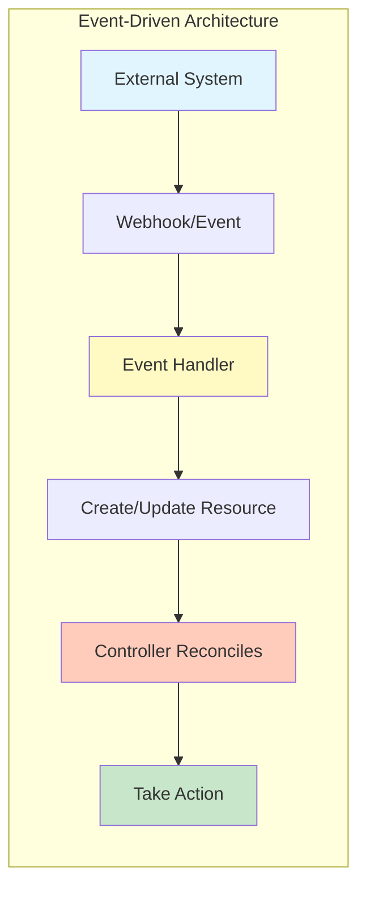

**Implementation:**

```go
type EventHandler struct {
    client client.Client
}

// HTTP handler for external events
func (h *EventHandler) HandleWebhook(w http.ResponseWriter, r *http.Request) {
    // Parse webhook payload
    var event ExternalEvent
    if err := json.NewDecoder(r.Body).Decode(&event); err != nil {
        http.Error(w, err.Error(), http.StatusBadRequest)
        return
    }

    // Verify webhook signature
    if !h.verifySignature(r, event) {
        http.Error(w, "invalid signature", http.StatusUnauthorized)
        return
    }

    ctx := r.Context()

    // Create or update corresponding K8s resource
    resource := &myv1.ExternalResource{}
    err := h.client.Get(ctx,
        types.NamespacedName{
            Name:      event.ResourceID,
            Namespace: "default",
        },
        resource)

    if err != nil {
        if errors.IsNotFound(err) {
            // Create new resource
            resource = h.eventToResource(&event)
            if err := h.client.Create(ctx, resource); err != nil {
                http.Error(w, err.Error(), http.StatusInternalServerError)
                return
            }
        } else {
            http.Error(w, err.Error(), http.StatusInternalServerError)
            return
        }
    } else {
        // Update existing resource
        h.updateResourceFromEvent(resource, &event)
        if err := h.client.Update(ctx, resource); err != nil {
            http.Error(w, err.Error(), http.StatusInternalServerError)
            return
        }
    }

    w.WriteHeader(http.StatusOK)
}

func (h *EventHandler) eventToResource(event *ExternalEvent) *myv1.ExternalResource {
    return &myv1.ExternalResource{
        ObjectMeta: metav1.ObjectMeta{
            Name:      event.ResourceID,
            Namespace: "default",
            Annotations: map[string]string{
                "external-event-id": event.EventID,
            },
        },
        Spec: myv1.ExternalResourceSpec{
            ExternalID: event.ResourceID,
            State:      event.State,
            Data:       event.Data,
        },
    }
}
```

━━━━━━━━━━━━━━━━━━━━━━━━━━━━━━━━━━━━━━━━━━━━━━━━━━━━━━━━━━━━━━━━━━━━━━━━━━━━━━

## **📊 Observability Patterns**

### **Metrics Pattern**

Export metrics for monitoring operator health.

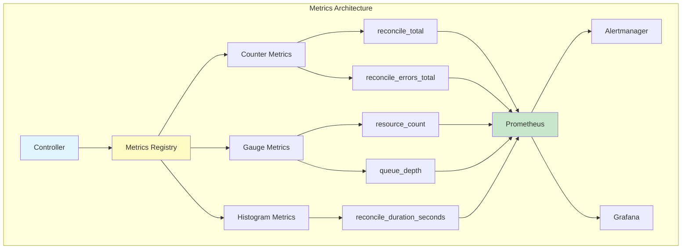

**Implementation:**

```go
// Reference: controller-runtime metrics

import (
    "github.com/prometheus/client_golang/prometheus"
    "sigs.k8s.io/controller-runtime/pkg/metrics"
)

var (
    reconcileTotal = prometheus.NewCounterVec(
        prometheus.CounterOpts{
            Name: "controller_reconcile_total",
            Help: "Total number of reconciliations per controller",
        },
        []string{"controller", "result"},
    )

    reconcileErrors = prometheus.NewCounterVec(
        prometheus.CounterOpts{
            Name: "controller_reconcile_errors_total",
            Help: "Total number of reconciliation errors per controller",
        },
        []string{"controller"},
    )

    reconcileDuration = prometheus.NewHistogramVec(
        prometheus.HistogramOpts{
            Name:    "controller_reconcile_duration_seconds",
            Help:    "Length of time per reconciliation per controller",
            Buckets: prometheus.ExponentialBuckets(0.001, 2, 15),
        },
        []string{"controller"},
    )

    resourceCount = prometheus.NewGaugeVec(
        prometheus.GaugeOpts{
            Name: "controller_resource_count",
            Help: "Number of resources managed by controller",
        },
        []string{"controller", "namespace"},
    )
)

func init() {
    // Register custom metrics with the global registry
    metrics.Registry.MustRegister(
        reconcileTotal,
        reconcileErrors,
        reconcileDuration,
        resourceCount,
    )
}

type MetricsController struct {
    client client.Client
}

func (r *MetricsController) Reconcile(ctx context.Context,
    req ctrl.Request) (ctrl.Result, error) {

    start := time.Now()
    controllerName := "database-controller"

    defer func() {
        // Record reconciliation duration
        reconcileDuration.WithLabelValues(controllerName).Observe(
            time.Since(start).Seconds())
    }()

    var database myv1.Database
    if err := r.client.Get(ctx, req.NamespacedName, &database); err != nil {
        if errors.IsNotFound(err) {
            reconcileTotal.WithLabelValues(controllerName, "not_found").Inc()
            return ctrl.Result{}, nil
        }

        reconcileErrors.WithLabelValues(controllerName).Inc()
        reconcileTotal.WithLabelValues(controllerName, "error").Inc()
        return ctrl.Result{}, err
    }

    // Perform reconciliation
    if err := r.reconcile(ctx, &database); err != nil {
        reconcileErrors.WithLabelValues(controllerName).Inc()
        reconcileTotal.WithLabelValues(controllerName, "error").Inc()
        return ctrl.Result{}, err
    }

    reconcileTotal.WithLabelValues(controllerName, "success").Inc()

    // Update resource count gauge
    var databaseList myv1.DatabaseList
    if err := r.client.List(ctx, &databaseList,
        client.InNamespace(req.Namespace)); err == nil {
        resourceCount.WithLabelValues(controllerName, req.Namespace).Set(
            float64(len(databaseList.Items)))
    }

    return ctrl.Result{}, nil
}
```

### **Structured Logging Pattern**

Consistent, queryable logs with context.

```go
// Using controller-runtime's logger

func (r *DatabaseReconciler) Reconcile(ctx context.Context,
    req ctrl.Request) (ctrl.Result, error) {

    log := ctrl.LoggerFrom(ctx).WithValues(
        "database", req.NamespacedName,
        "reconcileID", uuid.New().String(),
    )

    log.Info("Starting reconciliation")

    var database myv1.Database
    if err := r.client.Get(ctx, req.NamespacedName, &database); err != nil {
        if errors.IsNotFound(err) {
            log.Info("Resource not found, likely deleted")
            return ctrl.Result{}, nil
        }
        log.Error(err, "Failed to get resource")
        return ctrl.Result{}, err
    }

    log.V(1).Info("Resource retrieved",
        "generation", database.Generation,
        "resourceVersion", database.ResourceVersion,
    )

    // Reconciliation logic
    if err := r.reconcileStatefulSet(ctx, &database, log); err != nil {
        log.Error(err, "Failed to reconcile StatefulSet",
            "phase", database.Status.Phase,
        )
        return ctrl.Result{}, err
    }

    log.Info("Reconciliation complete",
        "phase", database.Status.Phase,
        "replicas", database.Status.ReadyReplicas,
    )

    return ctrl.Result{}, nil
}

func (r *DatabaseReconciler) reconcileStatefulSet(ctx context.Context,
    database *myv1.Database, log logr.Logger) error {

    log = log.WithValues("component", "statefulset")

    var sts appsv1.StatefulSet
    err := r.client.Get(ctx, types.NamespacedName{
        Name:      database.Name,
        Namespace: database.Namespace,
    }, &sts)

    if err != nil {
        if errors.IsNotFound(err) {
            log.Info("Creating StatefulSet",
                "replicas", *database.Spec.Replicas,
            )
            return r.createStatefulSet(ctx, database)
        }
        return err
    }

    log.V(1).Info("StatefulSet exists",
        "replicas", *sts.Spec.Replicas,
        "readyReplicas", sts.Status.ReadyReplicas,
    )

    return nil
}
```

━━━━━━━━━━━━━━━━━━━━━━━━━━━━━━━━━━━━━━━━━━━━━━━━━━━━━━━━━━━━━━━━━━━━━━━━━━━━━━

## **🔒 Security Patterns**

### **Least Privilege RBAC Pattern**

Grant minimum required permissions.

```yaml
# Separate roles for different operations
---
apiVersion: rbac.authorization.k8s.io/v1
kind: ClusterRole
metadata:
  name: database-operator-manager
rules:
  # Core resource permissions
  - apiGroups: ["example.com"]
    resources: ["databases"]
    verbs: ["get", "list", "watch", "update", "patch"]
  - apiGroups: ["example.com"]
    resources: ["databases/status"]
    verbs: ["get", "update", "patch"]
  - apiGroups: ["example.com"]
    resources: ["databases/finalizers"]
    verbs: ["update"]

  # Managed resource permissions
  - apiGroups: ["apps"]
    resources: ["statefulsets"]
    verbs: ["get", "list", "watch", "create", "update", "patch", "delete"]
  - apiGroups: [""]
    resources: ["services", "configmaps"]
    verbs: ["get", "list", "watch", "create", "update", "patch", "delete"]

  # Read-only permissions
  - apiGroups: [""]
    resources: ["persistentvolumeclaims"]
    verbs: ["get", "list", "watch"]
  - apiGroups: ["storage.k8s.io"]
    resources: ["storageclasses"]
    verbs: ["get", "list", "watch"]

  # Event recording
  - apiGroups: [""]
    resources: ["events"]
    verbs: ["create", "patch"]

---
# Separate role for leader election
apiVersion: rbac.authorization.k8s.io/v1
kind: Role
metadata:
  name: database-operator-leader-election
  namespace: database-operator-system
rules:
  - apiGroups: [""]
    resources: ["configmaps"]
    verbs: ["get", "list", "watch", "create", "update", "patch", "delete"]
  - apiGroups: ["coordination.k8s.io"]
    resources: ["leases"]
    verbs: ["get", "list", "watch", "create", "update", "patch", "delete"]
  - apiGroups: [""]
    resources: ["events"]
    verbs: ["create", "patch"]
```

### **Webhook TLS Pattern**

Secure webhook endpoints with TLS.

```go
type WebhookServer struct {
    certDir  string
    certName string
    keyName  string

    server *http.Server
}

func (s *WebhookServer) Start(ctx context.Context) error {
    // Load certificates
    certPath := filepath.Join(s.certDir, s.certName)
    keyPath := filepath.Join(s.certDir, s.keyName)

    // Watch for certificate updates
    go s.watchCertificates(ctx, certPath, keyPath)

    // Configure TLS
    tlsConfig := &tls.Config{
        MinVersion: tls.VersionTLS12,
        CipherSuites: []uint16{
            tls.TLS_ECDHE_RSA_WITH_AES_128_GCM_SHA256,
            tls.TLS_ECDHE_RSA_WITH_AES_256_GCM_SHA384,
            tls.TLS_ECDHE_ECDSA_WITH_AES_128_GCM_SHA256,
            tls.TLS_ECDHE_ECDSA_WITH_AES_256_GCM_SHA384,
        },
        GetCertificate: func(info *tls.ClientHelloInfo) (*tls.Certificate, error) {
            // Reload certificate on each request to support rotation
            cert, err := tls.LoadX509KeyPair(certPath, keyPath)
            if err != nil {
                return nil, err
            }
            return &cert, nil
        },
    }

    s.server = &http.Server{
        Addr:      ":9443",
        TLSConfig: tlsConfig,
        Handler:   s.buildHandler(),
    }

    return s.server.ListenAndServeTLS("", "")
}

func (s *WebhookServer) watchCertificates(ctx context.Context,
    certPath, keyPath string) {

    watcher, err := fsnotify.NewWatcher()
    if err != nil {
        return
    }
    defer watcher.Close()

    watcher.Add(filepath.Dir(certPath))

    for {
        select {
        case <-ctx.Done():
            return
        case event := <-watcher.Events:
            if event.Name == certPath || event.Name == keyPath {
                log.Info("Certificate updated, will be reloaded on next request")
            }
        }
    }
}
```

━━━━━━━━━━━━━━━━━━━━━━━━━━━━━━━━━━━━━━━━━━━━━━━━━━━━━━━━━━━━━━━━━━━━━━━━━━━━━━

## **📊 Pattern Selection Matrix**

| **Pattern** | **Complexity** | **Use Case** | **Benefits** | **Drawbacks** |
|-------------|----------------|--------------|--------------|---------------|
| **Level-Triggered Reconciliation** | Low | All controllers | Self-healing, eventual consistency | May reconcile unnecessarily |
| **Owner References** | Low | Resource hierarchy | Auto cleanup, relationship tracking | Limited to namespace or cluster scope |
| **Workqueue** | Medium | Event processing | Rate limiting, retry logic | Adds complexity |
| **Finalizers** | Medium | Cleanup on delete | Pre-delete hooks, external cleanup | Can block deletion |
| **Spec-Status** | Low | Resource state | Clear separation, optimistic locking | Requires /status subresource |
| **Conditions** | Low | Health reporting | Standardized status, tooling support | Requires consistent implementation |
| **External Sync** | High | Cloud integration | Bi-directional sync | Conflict resolution complexity |
| **Event-Driven** | Medium | Real-time updates | Lower latency, reduced polling | Requires webhook endpoint |
| **Metrics** | Low | Observability | Monitoring, alerting | Additional infrastructure |

━━━━━━━━━━━━━━━━━━━━━━━━━━━━━━━━━━━━━━━━━━━━━━━━━━━━━━━━━━━━━━━━━━━━━━━━━━━━━━

## **📚 Key Takeaways**

### **Controller Patterns**
- Use level-triggered reconciliation for reliability
- Implement owner references for automatic cleanup
- Use workqueues for rate limiting and retries
- Use finalizers for cleanup before deletion

### **Resource Patterns**
- Separate spec (desired) from status (observed)
- Use subresources for status and scale operations
- Use conditions for standardized health reporting
- Follow Kubernetes API conventions

### **Integration Patterns**
- Choose sync vs event-driven based on requirements
- Implement proper conflict resolution
- Handle network failures gracefully
- Use exponential backoff for retries

### **Observability Patterns**
- Export Prometheus metrics for monitoring
- Use structured logging with context
- Include correlation IDs for request tracking
- Monitor queue depth and reconciliation latency

### **Security Patterns**
- Follow least privilege for RBAC
- Use TLS for all webhook endpoints
- Support certificate rotation
- Validate all inputs

━━━━━━━━━━━━━━━━━━━━━━━━━━━━━━━━━━━━━━━━━━━━━━━━━━━━━━━━━━━━━━━━━━━━━━━━━━━━━━

## **🔗 Related Documentation**

- **[Extension Overview](./01-extension-overview.md)** - Extension architecture overview
- **[Extension Points](./02-extension-points.md)** - Available extension points
- **[Custom Resources](../middle-level/01-custom-resources.md)** - CRD patterns
- **[Operator Patterns](../middle-level/06-operator-patterns.md)** - Operator implementation
- **[Controller Runtime](../middle-level/07-controller-runtime.md)** - Controller framework

━━━━━━━━━━━━━━━━━━━━━━━━━━━━━━━━━━━━━━━━━━━━━━━━━━━━━━━━━━━━━━━━━━━━━━━━━━━━━━
