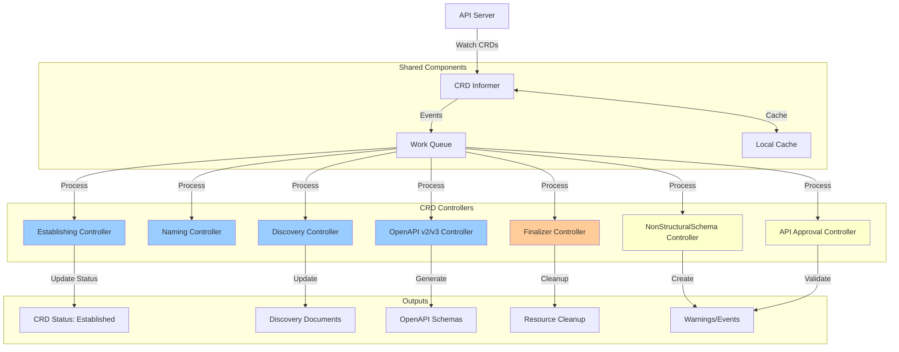
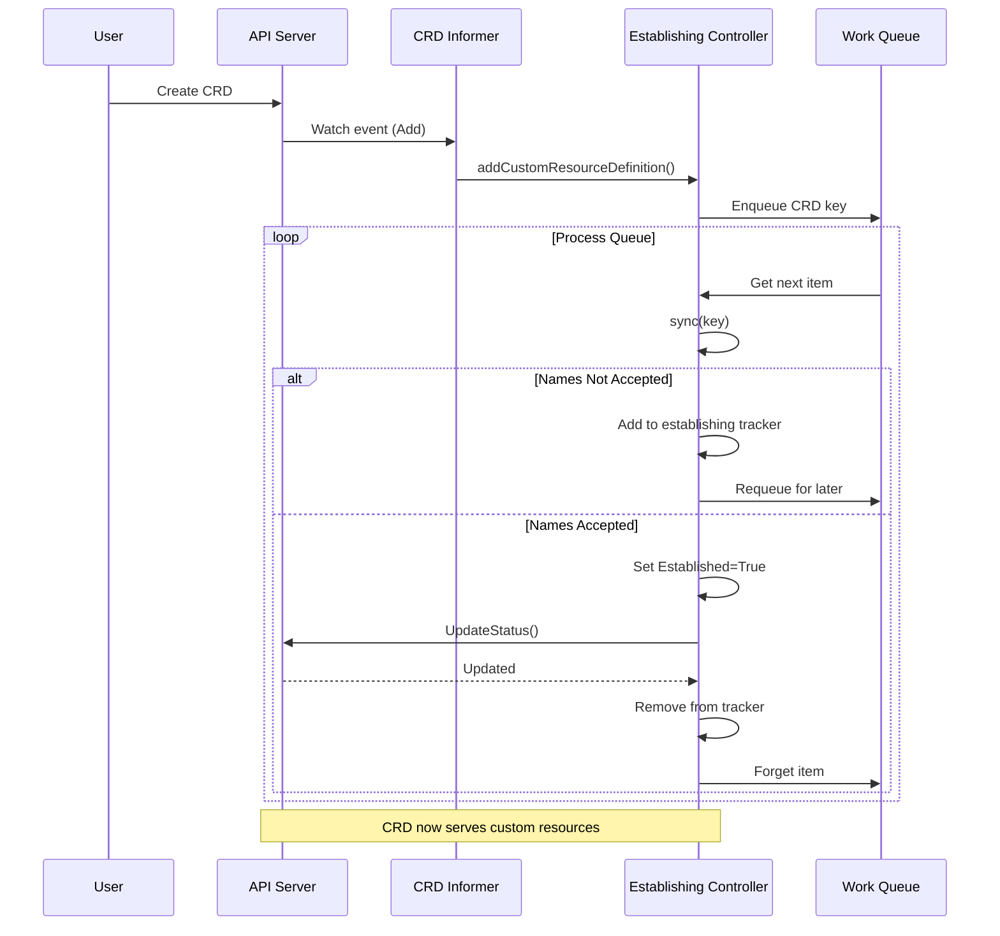
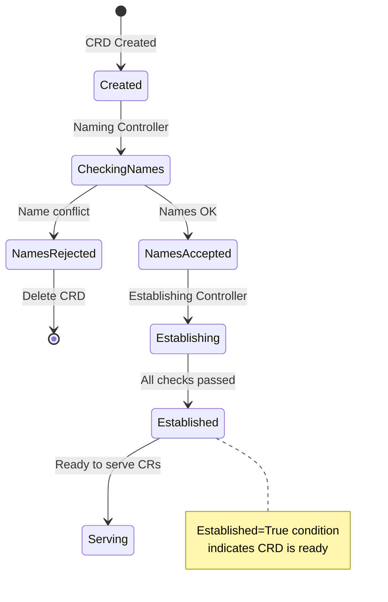
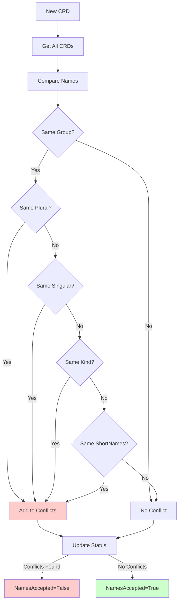
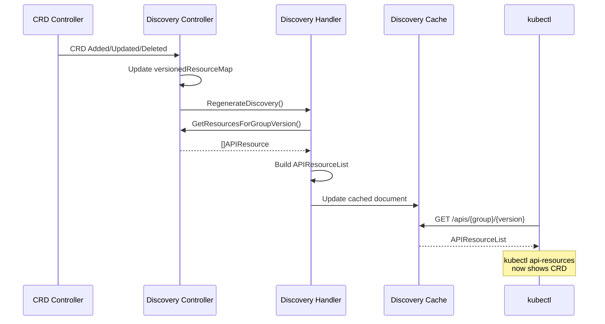
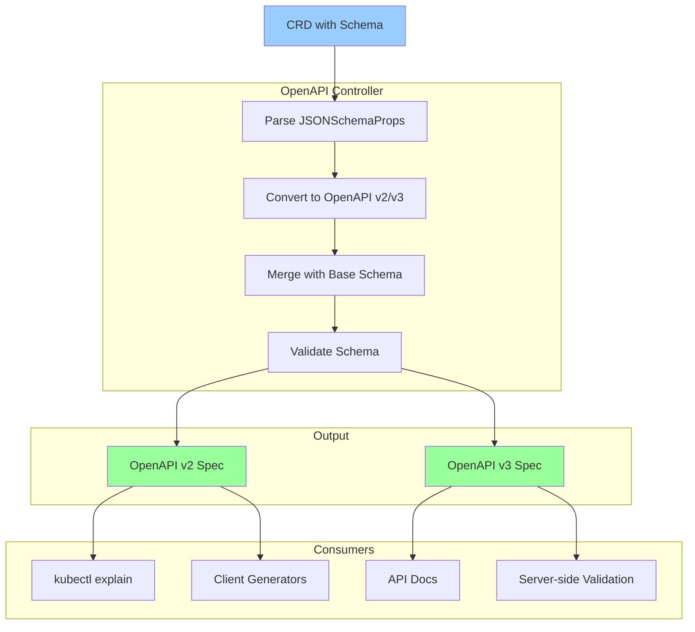
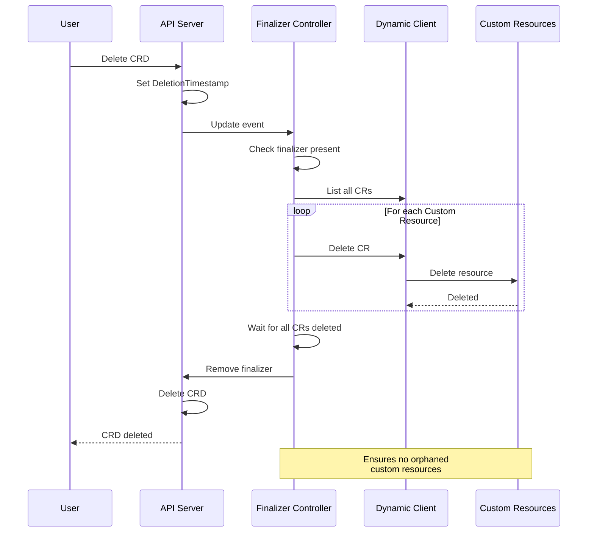
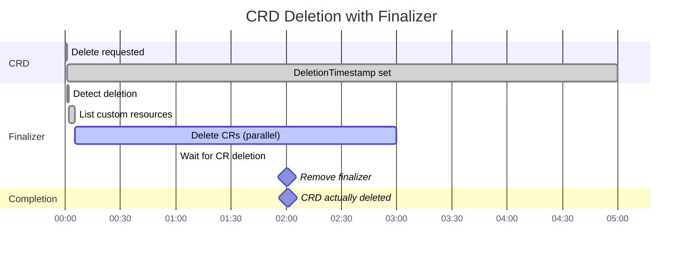
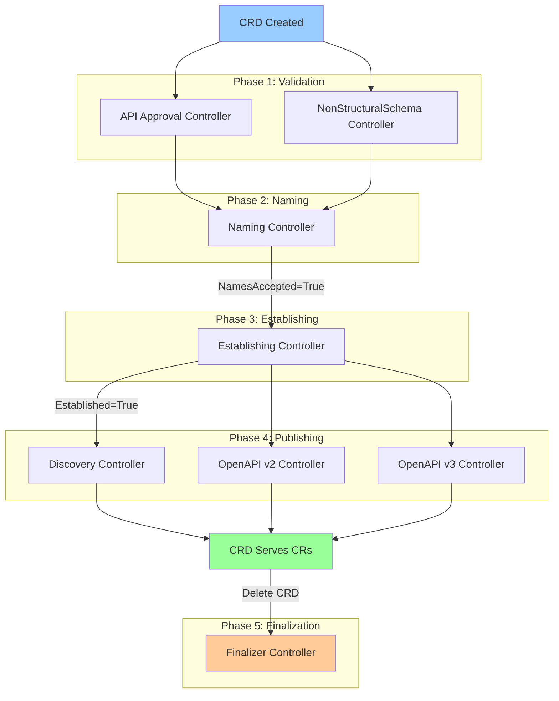
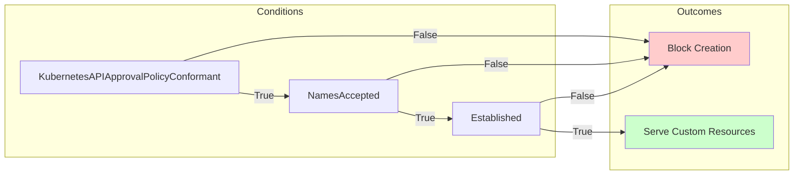

# **CRD Controller Implementation**

━━━━━━━━━━━━━━━━━━━━━━━━━━━━━━━━━━━━━━━━━━━━━━━━━━━━━━━━━━━━━━━━━━━━━━━━━━━━━━

## **📋 Overview**

The CRD (CustomResourceDefinition) controller is part of the apiextensions-apiserver and manages the lifecycle of CRDs. It consists of multiple sub-controllers that handle different aspects of CRD management.

**Key Controllers:**
- **Establishing Controller**: Marks CRDs as established when they're ready
- **Naming Controller**: Validates CRD naming conflicts
- **Discovery Controller**: Updates API discovery information
- **OpenAPI Controller**: Generates OpenAPI v2/v3 schemas
- **Finalizer Controller**: Handles CRD deletion and cleanup
- **NonStructuralSchema Controller**: Warns about non-structural schemas
- **API Approval Controller**: Validates k8s.io API group approvals

**Source Location:** `/staging/src/k8s.io/apiextensions-apiserver/pkg/controller/`

━━━━━━━━━━━━━━━━━━━━━━━━━━━━━━━━━━━━━━━━━━━━━━━━━━━━━━━━━━━━━━━━━━━━━━━━━━━━━━

## **🏗️ CRD Controller Architecture**

### **Overall Architecture**



### **Controller Responsibilities**

| Controller | Purpose | Trigger | Output |
|-----------|---------|---------|--------|
| **Establishing** | Mark CRDs as established | CRD creation/update | Status.Conditions |
| **Naming** | Validate naming conflicts | CRD creation/update | Status.Conditions |
| **Discovery** | Update API discovery | CRD changes | Discovery documents |
| **OpenAPI v2** | Generate OpenAPI v2 schema | CRD schema changes | OpenAPI spec |
| **OpenAPI v3** | Generate OpenAPI v3 schema | CRD schema changes | OpenAPI v3 spec |
| **Finalizer** | Clean up on deletion | CRD deletion | Remove finalizer |
| **NonStructuralSchema** | Warn about schema issues | Schema validation | Events/Warnings |
| **API Approval** | Validate k8s.io groups | k8s.io CRDs | Validation errors |

━━━━━━━━━━━━━━━━━━━━━━━━━━━━━━━━━━━━━━━━━━━━━━━━━━━━━━━━━━━━━━━━━━━━━━━━━━━━━━

## **✅ Establishing Controller**

### **Purpose**

The establishing controller monitors CRDs and marks them as "Established" when they're ready to serve custom resources.

### **Source Code**

```go
// File: staging/src/k8s.io/apiextensions-apiserver/pkg/controller/establish/establishing_controller.go:50-120
package establish

import (
    "context"
    "fmt"
    "time"

    apiextensionsv1 "k8s.io/apiextensions-apiserver/pkg/apis/apiextensions/v1"
    client "k8s.io/apiextensions-apiserver/pkg/client/clientset/clientset/typed/apiextensions/v1"
    informers "k8s.io/apiextensions-apiserver/pkg/client/informers/externalversions/apiextensions/v1"
    listers "k8s.io/apiextensions-apiserver/pkg/client/listers/apiextensions/v1"
    "k8s.io/apimachinery/pkg/api/errors"
    metav1 "k8s.io/apimachinery/pkg/apis/meta/v1"
    utilruntime "k8s.io/apimachinery/pkg/util/runtime"
    "k8s.io/apimachinery/pkg/util/wait"
    "k8s.io/client-go/tools/cache"
    "k8s.io/client-go/util/workqueue"
)

// EstablishingController marks CRDs as established when they are ready to serve objects
type EstablishingController struct {
    crdClient client.CustomResourceDefinitionsGetter
    crdLister listers.CustomResourceDefinitionLister
    crdSynced cache.InformerSynced

    // To allow injection for testing
    syncFn func(key string) error

    queue workqueue.RateLimitingInterface

    // A store of CRDs with established condition set to false
    establishing *EstablishingTracker
}

// EstablishingTracker tracks CRDs that need to be established
type EstablishingTracker struct {
    // key -> true for CRDs that are not yet established
    establishing map[string]bool
    // key -> timestamp when the CRD was first seen as not established
    timestamps map[string]time.Time
}

func NewEstablishingController(
    crdInformer informers.CustomResourceDefinitionInformer,
    crdClient client.CustomResourceDefinitionsGetter,
) *EstablishingController {
    ec := &EstablishingController{
        crdClient:    crdClient,
        crdLister:    crdInformer.Lister(),
        crdSynced:    crdInformer.Informer().HasSynced,
        queue:        workqueue.NewNamedRateLimitingQueue(workqueue.DefaultControllerRateLimiter(), "crd_establishing"),
        establishing: &EstablishingTracker{
            establishing: make(map[string]bool),
            timestamps:   make(map[string]time.Time),
        },
    }

    crdInformer.Informer().AddEventHandler(cache.ResourceEventHandlerFuncs{
        AddFunc:    ec.addCustomResourceDefinition,
        UpdateFunc: ec.updateCustomResourceDefinition,
        DeleteFunc: ec.deleteCustomResourceDefinition,
    })

    ec.syncFn = ec.sync

    return ec
}

func (ec *EstablishingController) sync(key string) error {
    cachedCRD, err := ec.crdLister.Get(key)
    if errors.IsNotFound(err) {
        return nil
    }
    if err != nil {
        return err
    }

    // Check if already established
    if apiextensionshelpers.IsCRDConditionTrue(cachedCRD, apiextensionsv1.Established) {
        ec.establishing.Remove(key)
        return nil
    }

    // Check if names are accepted (prerequisite for establishing)
    if !apiextensionshelpers.IsCRDConditionTrue(cachedCRD, apiextensionsv1.NamesAccepted) {
        ec.establishing.Add(key)
        return nil
    }

    // Mark as established
    crd := cachedCRD.DeepCopy()
    apiextensionshelpers.SetCRDCondition(crd, apiextensionsv1.CustomResourceDefinitionCondition{
        Type:    apiextensionsv1.Established,
        Status:  apiextensionsv1.ConditionTrue,
        Reason:  "InitialNamesAccepted",
        Message: "the initial names have been accepted",
    })

    // Update the CRD
    _, err = ec.crdClient.CustomResourceDefinitions().UpdateStatus(context.TODO(), crd, metav1.UpdateOptions{})
    if errors.IsNotFound(err) || errors.IsConflict(err) {
        // Deleted or updated, will be re-queued
        return nil
    }
    if err != nil {
        return err
    }

    ec.establishing.Remove(key)
    return nil
}

func (ec *EstablishingController) addCustomResourceDefinition(obj interface{}) {
    castObj := obj.(*apiextensionsv1.CustomResourceDefinition)
    klog.V(4).Infof("Adding customresourcedefinition %s", castObj.Name)
    ec.enqueue(castObj)
}

func (ec *EstablishingController) updateCustomResourceDefinition(oldObj, newObj interface{}) {
    castNewObj := newObj.(*apiextensionsv1.CustomResourceDefinition)
    castOldObj := oldObj.(*apiextensionsv1.CustomResourceDefinition)
    klog.V(4).Infof("Updating customresourcedefinition %s", castNewObj.Name)

    // Enqueue both old and new
    ec.enqueue(castNewObj)
    if castNewObj.UID != castOldObj.UID {
        ec.enqueue(castOldObj)
    }
}

func (ec *EstablishingController) deleteCustomResourceDefinition(obj interface{}) {
    castObj, ok := obj.(*apiextensionsv1.CustomResourceDefinition)
    if !ok {
        tombstone, ok := obj.(cache.DeletedFinalStateUnknown)
        if !ok {
            utilruntime.HandleError(fmt.Errorf("couldn't get object from tombstone %#v", obj))
            return
        }
        castObj, ok = tombstone.Obj.(*apiextensionsv1.CustomResourceDefinition)
        if !ok {
            utilruntime.HandleError(fmt.Errorf("tombstone contained object that is not a CustomResourceDefinition %#v", obj))
            return
        }
    }
    klog.V(4).Infof("Deleting customresourcedefinition %s", castObj.Name)
    ec.enqueue(castObj)
}

func (ec *EstablishingController) enqueue(obj *apiextensionsv1.CustomResourceDefinition) {
    key, err := cache.DeletionHandlingMetaNamespaceKeyFunc(obj)
    if err != nil {
        utilruntime.HandleError(fmt.Errorf("couldn't get key for object %#v: %v", obj, err))
        return
    }

    ec.queue.Add(key)
}

func (ec *EstablishingController) Run(stopCh <-chan struct{}) {
    defer utilruntime.HandleCrash()
    defer ec.queue.ShutDown()

    klog.Info("Starting EstablishingController")
    defer klog.Info("Shutting down EstablishingController")

    if !cache.WaitForCacheSync(stopCh, ec.crdSynced) {
        return
    }

    // Start worker
    go wait.Until(ec.runWorker, time.Second, stopCh)

    <-stopCh
}

func (ec *EstablishingController) runWorker() {
    for ec.processNextWorkItem() {
    }
}

func (ec *EstablishingController) processNextWorkItem() bool {
    key, quit := ec.queue.Get()
    if quit {
        return false
    }
    defer ec.queue.Done(key)

    err := ec.syncFn(key.(string))
    if err == nil {
        ec.queue.Forget(key)
        return true
    }

    utilruntime.HandleError(fmt.Errorf("sync %q failed: %v", key, err))
    ec.queue.AddRateLimited(key)

    return true
}
```

### **Establishing Flow**



### **Condition Transitions**



━━━━━━━━━━━━━━━━━━━━━━━━━━━━━━━━━━━━━━━━━━━━━━━━━━━━━━━━━━━━━━━━━━━━━━━━━━━━━━

## **🏷️ Naming Controller**

### **Purpose**

The naming controller validates that CRD names don't conflict with existing CRDs and updates the NamesAccepted condition.

### **Source Code**

```go
// File: staging/src/k8s.io/apiextensions-apiserver/pkg/controller/status/naming_controller.go:60-180
package status

import (
    "context"
    "fmt"
    "time"

    apiextensionsv1 "k8s.io/apiextensions-apiserver/pkg/apis/apiextensions/v1"
    client "k8s.io/apiextensions-apiserver/pkg/client/clientset/clientset/typed/apiextensions/v1"
    informers "k8s.io/apiextensions-apiserver/pkg/client/informers/externalversions/apiextensions/v1"
    listers "k8s.io/apiextensions-apiserver/pkg/client/listers/apiextensions/v1"
    "k8s.io/apimachinery/pkg/api/errors"
    metav1 "k8s.io/apimachinery/pkg/apis/meta/v1"
    utilruntime "k8s.io/apimachinery/pkg/util/runtime"
    "k8s.io/apimachinery/pkg/util/wait"
    "k8s.io/client-go/tools/cache"
    "k8s.io/client-go/util/workqueue"
)

// NamingConditionController validates CRD names
type NamingConditionController struct {
    crdClient client.CustomResourceDefinitionsGetter
    crdLister listers.CustomResourceDefinitionLister
    crdSynced cache.InformerSynced

    syncFn func(key string) error

    queue workqueue.RateLimitingInterface
}

func NewNamingConditionController(
    crdInformer informers.CustomResourceDefinitionInformer,
    crdClient client.CustomResourceDefinitionsGetter,
) *NamingConditionController {
    nc := &NamingConditionController{
        crdClient: crdClient,
        crdLister: crdInformer.Lister(),
        crdSynced: crdInformer.Informer().HasSynced,
        queue:     workqueue.NewNamedRateLimitingQueue(workqueue.DefaultControllerRateLimiter(), "crd_naming"),
    }

    crdInformer.Informer().AddEventHandler(cache.ResourceEventHandlerFuncs{
        AddFunc:    nc.addCustomResourceDefinition,
        UpdateFunc: nc.updateCustomResourceDefinition,
        DeleteFunc: nc.deleteCustomResourceDefinition,
    })

    nc.syncFn = nc.sync

    return nc
}

func (nc *NamingConditionController) sync(key string) error {
    cachedCRD, err := nc.crdLister.Get(key)
    if errors.IsNotFound(err) {
        return nil
    }
    if err != nil {
        return err
    }

    // Get all CRDs to check for conflicts
    allCRDs, err := nc.crdLister.List(labels.Everything())
    if err != nil {
        return err
    }

    // Check for naming conflicts
    conflicts := nc.findNamingConflicts(cachedCRD, allCRDs)

    crd := cachedCRD.DeepCopy()

    if len(conflicts) > 0 {
        // Names are NOT accepted
        apiextensionshelpers.SetCRDCondition(crd, apiextensionsv1.CustomResourceDefinitionCondition{
            Type:    apiextensionsv1.NamesAccepted,
            Status:  apiextensionsv1.ConditionFalse,
            Reason:  "NamingConflict",
            Message: fmt.Sprintf("conflicts with %v", conflicts),
        })
    } else {
        // Names are accepted
        apiextensionshelpers.SetCRDCondition(crd, apiextensionsv1.CustomResourceDefinitionCondition{
            Type:    apiextensionsv1.NamesAccepted,
            Status:  apiextensionsv1.ConditionTrue,
            Reason:  "NoConflicts",
            Message: "no naming conflicts",
        })
    }

    // Update status if changed
    if !apiextensionshelpers.IsCRDConditionEquivalent(&crd.Status.Conditions, &cachedCRD.Status.Conditions) {
        _, err = nc.crdClient.CustomResourceDefinitions().UpdateStatus(context.TODO(), crd, metav1.UpdateOptions{})
        if errors.IsNotFound(err) || errors.IsConflict(err) {
            return nil
        }
        return err
    }

    return nil
}

func (nc *NamingConditionController) findNamingConflicts(crd *apiextensionsv1.CustomResourceDefinition, allCRDs []*apiextensionsv1.CustomResourceDefinition) []string {
    var conflicts []string

    for _, other := range allCRDs {
        if other.Name == crd.Name {
            continue // Skip self
        }

        // Check if group+plural conflicts
        if crd.Spec.Group == other.Spec.Group && crd.Spec.Names.Plural == other.Spec.Names.Plural {
            conflicts = append(conflicts, other.Name)
        }

        // Check if group+singular conflicts
        if crd.Spec.Group == other.Spec.Group && crd.Spec.Names.Singular == other.Spec.Names.Singular {
            conflicts = append(conflicts, other.Name)
        }

        // Check if group+kind conflicts
        if crd.Spec.Group == other.Spec.Group && crd.Spec.Names.Kind == other.Spec.Names.Kind {
            conflicts = append(conflicts, other.Name)
        }

        // Check shortNames conflicts
        for _, shortName := range crd.Spec.Names.ShortNames {
            for _, otherShortName := range other.Spec.Names.ShortNames {
                if shortName == otherShortName && crd.Spec.Group == other.Spec.Group {
                    conflicts = append(conflicts, other.Name)
                }
            }
        }
    }

    return conflicts
}

func (nc *NamingConditionController) Run(stopCh <-chan struct{}, workers int) {
    defer utilruntime.HandleCrash()
    defer nc.queue.ShutDown()

    klog.Info("Starting NamingConditionController")
    defer klog.Info("Shutting down NamingConditionController")

    if !cache.WaitForCacheSync(stopCh, nc.crdSynced) {
        return
    }

    for i := 0; i < workers; i++ {
        go wait.Until(nc.runWorker, time.Second, stopCh)
    }

    <-stopCh
}

func (nc *NamingConditionController) runWorker() {
    for nc.processNextWorkItem() {
    }
}

func (nc *NamingConditionController) processNextWorkItem() bool {
    key, quit := nc.queue.Get()
    if quit {
        return false
    }
    defer nc.queue.Done(key)

    err := nc.syncFn(key.(string))
    if err == nil {
        nc.queue.Forget(key)
        return true
    }

    utilruntime.HandleError(fmt.Errorf("sync %q failed: %v", key, err))
    nc.queue.AddRateLimited(key)

    return true
}
```

### **Naming Conflict Detection**



### **Name Conflict Examples**

**Scenario 1: Plural Conflict**
```yaml
# CRD 1
apiVersion: apiextensions.k8s.io/v1
kind: CustomResourceDefinition
metadata:
  name: databases.db.example.com
spec:
  group: db.example.com
  names:
    plural: databases  # ← Conflict!
    singular: database
    kind: Database

---
# CRD 2
apiVersion: apiextensions.k8s.io/v1
kind: CustomResourceDefinition
metadata:
  name: databases.storage.example.com
spec:
  group: db.example.com  # Same group
  names:
    plural: databases    # ← Conflict!
    singular: db
    kind: DB
```

**Scenario 2: Kind Conflict**
```yaml
# CRD 1
spec:
  group: apps.example.com
  names:
    kind: Application  # ← Conflict!

---
# CRD 2
spec:
  group: apps.example.com  # Same group
  names:
    kind: Application    # ← Conflict!
```

━━━━━━━━━━━━━━━━━━━━━━━━━━━━━━━━━━━━━━━━━━━━━━━━━━━━━━━━━━━━━━━━━━━━━━━━━━━━━━

## **📖 Discovery Controller**

### **Purpose**

The discovery controller updates API discovery documents when CRDs are created, updated, or deleted. This allows `kubectl api-resources` and clients to discover custom resources.

### **Integration with Discovery**

```go
// File: staging/src/k8s.io/apiextensions-apiserver/pkg/apiserver/customresource_discovery_controller.go:50-150
package apiserver

import (
    "sync"

    apiextensionsv1 "k8s.io/apiextensions-apiserver/pkg/apis/apiextensions/v1"
    informers "k8s.io/apiextensions-apiserver/pkg/client/informers/externalversions/apiextensions/v1"
    listers "k8s.io/apiextensions-apiserver/pkg/client/listers/apiextensions/v1"
    "k8s.io/apimachinery/pkg/runtime/schema"
    "k8s.io/client-go/tools/cache"
)

// DiscoveryController updates API discovery when CRDs change
type DiscoveryController struct {
    crdLister listers.CustomResourceDefinitionLister
    crdSynced cache.InformerSynced

    // Map of GVR to CRD name
    versionedResourceMap map[schema.GroupVersionResource]string

    // Handler called when discovery needs to be regenerated
    discoveryHandler DiscoveryHandler

    lock sync.RWMutex
}

type DiscoveryHandler interface {
    // RegenerateDiscovery regenerates the discovery document
    RegenerateDiscovery()
}

func NewDiscoveryController(
    crdInformer informers.CustomResourceDefinitionInformer,
    discoveryHandler DiscoveryHandler,
) *DiscoveryController {
    dc := &DiscoveryController{
        crdLister:            crdInformer.Lister(),
        crdSynced:            crdInformer.Informer().HasSynced,
        versionedResourceMap: make(map[schema.GroupVersionResource]string),
        discoveryHandler:     discoveryHandler,
    }

    crdInformer.Informer().AddEventHandler(cache.ResourceEventHandlerFuncs{
        AddFunc:    dc.addCustomResourceDefinition,
        UpdateFunc: dc.updateCustomResourceDefinition,
        DeleteFunc: dc.deleteCustomResourceDefinition,
    })

    return dc
}

func (dc *DiscoveryController) addCustomResourceDefinition(obj interface{}) {
    crd := obj.(*apiextensionsv1.CustomResourceDefinition)

    dc.lock.Lock()
    defer dc.lock.Unlock()

    // Add all versions to the map
    for _, version := range crd.Spec.Versions {
        gvr := schema.GroupVersionResource{
            Group:    crd.Spec.Group,
            Version:  version.Name,
            Resource: crd.Spec.Names.Plural,
        }
        dc.versionedResourceMap[gvr] = crd.Name
    }

    // Trigger discovery regeneration
    dc.discoveryHandler.RegenerateDiscovery()
}

func (dc *DiscoveryController) updateCustomResourceDefinition(oldObj, newObj interface{}) {
    oldCRD := oldObj.(*apiextensionsv1.CustomResourceDefinition)
    newCRD := newObj.(*apiextensionsv1.CustomResourceDefinition)

    dc.lock.Lock()
    defer dc.lock.Unlock()

    // Remove old versions
    for _, version := range oldCRD.Spec.Versions {
        gvr := schema.GroupVersionResource{
            Group:    oldCRD.Spec.Group,
            Version:  version.Name,
            Resource: oldCRD.Spec.Names.Plural,
        }
        delete(dc.versionedResourceMap, gvr)
    }

    // Add new versions
    for _, version := range newCRD.Spec.Versions {
        gvr := schema.GroupVersionResource{
            Group:    newCRD.Spec.Group,
            Version:  version.Name,
            Resource: newCRD.Spec.Names.Plural,
        }
        dc.versionedResourceMap[gvr] = newCRD.Name
    }

    // Trigger discovery regeneration
    dc.discoveryHandler.RegenerateDiscovery()
}

func (dc *DiscoveryController) deleteCustomResourceDefinition(obj interface{}) {
    crd, ok := obj.(*apiextensionsv1.CustomResourceDefinition)
    if !ok {
        tombstone, ok := obj.(cache.DeletedFinalStateUnknown)
        if !ok {
            return
        }
        crd, ok = tombstone.Obj.(*apiextensionsv1.CustomResourceDefinition)
        if !ok {
            return
        }
    }

    dc.lock.Lock()
    defer dc.lock.Unlock()

    // Remove all versions
    for _, version := range crd.Spec.Versions {
        gvr := schema.GroupVersionResource{
            Group:    crd.Spec.Group,
            Version:  version.Name,
            Resource: crd.Spec.Names.Plural,
        }
        delete(dc.versionedResourceMap, gvr)
    }

    // Trigger discovery regeneration
    dc.discoveryHandler.RegenerateDiscovery()
}

func (dc *DiscoveryController) GetResourcesForGroupVersion(gv schema.GroupVersion) []metav1.APIResource {
    dc.lock.RLock()
    defer dc.lock.RUnlock()

    var resources []metav1.APIResource

    // Find all resources for this GroupVersion
    for gvr, crdName := range dc.versionedResourceMap {
        if gvr.Group == gv.Group && gvr.Version == gv.Version {
            crd, err := dc.crdLister.Get(crdName)
            if err != nil {
                continue
            }

            // Find the version spec
            var versionSpec *apiextensionsv1.CustomResourceDefinitionVersion
            for i := range crd.Spec.Versions {
                if crd.Spec.Versions[i].Name == gv.Version {
                    versionSpec = &crd.Spec.Versions[i]
                    break
                }
            }

            if versionSpec == nil {
                continue
            }

            resource := metav1.APIResource{
                Name:         crd.Spec.Names.Plural,
                SingularName: crd.Spec.Names.Singular,
                Namespaced:   crd.Spec.Scope == apiextensionsv1.NamespaceScoped,
                Kind:         crd.Spec.Names.Kind,
                ShortNames:   crd.Spec.Names.ShortNames,
                Categories:   crd.Spec.Names.Categories,
                Verbs:        metav1.Verbs{"get", "list", "watch", "create", "update", "patch", "delete"},
            }

            // Add subresources
            if versionSpec.Subresources != nil {
                if versionSpec.Subresources.Status != nil {
                    resource.Verbs = append(resource.Verbs, "update")
                }
                if versionSpec.Subresources.Scale != nil {
                    resource.Verbs = append(resource.Verbs, "scale")
                }
            }

            resources = append(resources, resource)
        }
    }

    return resources
}
```

### **Discovery Document Generation**



### **Discovery Output Example**

**Request:**
```bash
kubectl get --raw /apis/db.example.com/v1
```

**Response:**
```json
{
  "kind": "APIResourceList",
  "apiVersion": "v1",
  "groupVersion": "db.example.com/v1",
  "resources": [
    {
      "name": "databases",
      "singularName": "database",
      "namespaced": true,
      "kind": "Database",
      "verbs": ["create", "delete", "get", "list", "patch", "update", "watch"],
      "shortNames": ["db"],
      "categories": ["all"]
    },
    {
      "name": "databases/status",
      "singularName": "",
      "namespaced": true,
      "kind": "Database",
      "verbs": ["get", "patch", "update"]
    }
  ]
}
```

━━━━━━━━━━━━━━━━━━━━━━━━━━━━━━━━━━━━━━━━━━━━━━━━━━━━━━━━━━━━━━━━━━━━━━━━━━━━━━

## **📜 OpenAPI Controller**

### **Purpose**

The OpenAPI controller generates OpenAPI v2 and v3 schemas for CRDs, enabling schema validation and documentation.

### **OpenAPI v2 Controller**

```go
// File: staging/src/k8s.io/apiextensions-apiserver/pkg/controller/openapi/controller.go:60-200
package openapi

import (
    "fmt"
    "sync"
    "time"

    apiextensionsv1 "k8s.io/apiextensions-apiserver/pkg/apis/apiextensions/v1"
    informers "k8s.io/apiextensions-apiserver/pkg/client/informers/externalversions/apiextensions/v1"
    listers "k8s.io/apiextensions-apiserver/pkg/client/listers/apiextensions/v1"
    "k8s.io/apiextensions-apiserver/pkg/controller/openapi/builder"
    "k8s.io/apimachinery/pkg/labels"
    utilruntime "k8s.io/apimachinery/pkg/util/runtime"
    "k8s.io/apimachinery/pkg/util/wait"
    "k8s.io/client-go/tools/cache"
    "k8s.io/client-go/util/workqueue"
    "k8s.io/kube-openapi/pkg/common"
)

// Controller generates OpenAPI v2 specs for CRDs
type Controller struct {
    crdLister listers.CustomResourceDefinitionLister
    crdSynced cache.InformerSynced

    // Spec generator
    specGenerator *builder.SpecGenerator

    // Callback when spec changes
    updateHandler UpdateHandler

    queue workqueue.RateLimitingInterface

    lock sync.Mutex
}

type UpdateHandler interface {
    // UpdateSpec is called when the OpenAPI spec should be regenerated
    UpdateSpec(spec *spec.Swagger) error
}

func NewController(
    crdInformer informers.CustomResourceDefinitionInformer,
) *Controller {
    c := &Controller{
        crdLister:     crdInformer.Lister(),
        crdSynced:     crdInformer.Informer().HasSynced,
        specGenerator: builder.NewSpecGenerator(),
        queue:         workqueue.NewNamedRateLimitingQueue(workqueue.DefaultControllerRateLimiter(), "crd_openapi_controller"),
    }

    crdInformer.Informer().AddEventHandler(cache.ResourceEventHandlerFuncs{
        AddFunc:    c.addCustomResourceDefinition,
        UpdateFunc: c.updateCustomResourceDefinition,
        DeleteFunc: c.deleteCustomResourceDefinition,
    })

    return c
}

func (c *Controller) addCustomResourceDefinition(obj interface{}) {
    crd := obj.(*apiextensionsv1.CustomResourceDefinition)
    c.enqueueCRD(crd)
}

func (c *Controller) updateCustomResourceDefinition(oldObj, newObj interface{}) {
    oldCRD := oldObj.(*apiextensionsv1.CustomResourceDefinition)
    newCRD := newObj.(*apiextensionsv1.CustomResourceDefinition)

    if oldCRD.ResourceVersion == newCRD.ResourceVersion {
        return
    }

    c.enqueueCRD(newCRD)
}

func (c *Controller) deleteCustomResourceDefinition(obj interface{}) {
    crd, ok := obj.(*apiextensionsv1.CustomResourceDefinition)
    if !ok {
        tombstone, ok := obj.(cache.DeletedFinalStateUnknown)
        if !ok {
            utilruntime.HandleError(fmt.Errorf("couldn't get object from tombstone %#v", obj))
            return
        }
        crd, ok = tombstone.Obj.(*apiextensionsv1.CustomResourceDefinition)
        if !ok {
            utilruntime.HandleError(fmt.Errorf("tombstone contained object that is not a CRD %#v", obj))
            return
        }
    }
    c.enqueueCRD(crd)
}

func (c *Controller) enqueueCRD(crd *apiextensionsv1.CustomResourceDefinition) {
    key, err := cache.DeletionHandlingMetaNamespaceKeyFunc(crd)
    if err != nil {
        utilruntime.HandleError(fmt.Errorf("couldn't get key for object %#v: %v", crd, err))
        return
    }
    c.queue.Add(key)
}

func (c *Controller) sync() error {
    c.lock.Lock()
    defer c.lock.Unlock()

    // Get all CRDs
    crds, err := c.crdLister.List(labels.Everything())
    if err != nil {
        return err
    }

    // Build OpenAPI spec
    swagger := c.buildOpenAPISpec(crds)

    // Update handler
    if c.updateHandler != nil {
        return c.updateHandler.UpdateSpec(swagger)
    }

    return nil
}

func (c *Controller) buildOpenAPISpec(crds []*apiextensionsv1.CustomResourceDefinition) *spec.Swagger {
    swagger := &spec.Swagger{
        SwaggerProps: spec.SwaggerProps{
            Swagger:     "2.0",
            Info:        &spec.Info{},
            Paths:       &spec.Paths{Paths: map[string]spec.PathItem{}},
            Definitions: spec.Definitions{},
        },
    }

    for _, crd := range crds {
        // Only include established CRDs
        if !apiextensionshelpers.IsCRDConditionTrue(crd, apiextensionsv1.Established) {
            continue
        }

        for _, version := range crd.Spec.Versions {
            if !version.Served {
                continue
            }

            // Convert CRD schema to OpenAPI schema
            if version.Schema != nil && version.Schema.OpenAPIV3Schema != nil {
                schema := c.convertToOpenAPIV2(version.Schema.OpenAPIV3Schema)

                // Add to definitions
                defName := c.getDefinitionName(crd, version.Name)
                swagger.Definitions[defName] = *schema
            }
        }
    }

    return swagger
}

func (c *Controller) convertToOpenAPIV2(v3Schema *apiextensionsv1.JSONSchemaProps) *spec.Schema {
    schema := &spec.Schema{
        SchemaProps: spec.SchemaProps{
            Type:        v3Schema.Type,
            Format:      v3Schema.Format,
            Description: v3Schema.Description,
            Required:    v3Schema.Required,
        },
    }

    // Convert properties
    if v3Schema.Properties != nil {
        schema.Properties = make(map[string]spec.Schema)
        for propName, propSchema := range v3Schema.Properties {
            schema.Properties[propName] = *c.convertToOpenAPIV2(&propSchema)
        }
    }

    // Convert items
    if v3Schema.Items != nil {
        if v3Schema.Items.Schema != nil {
            itemSchema := c.convertToOpenAPIV2(v3Schema.Items.Schema)
            schema.Items = &spec.SchemaOrArray{Schema: itemSchema}
        }
    }

    return schema
}

func (c *Controller) getDefinitionName(crd *apiextensionsv1.CustomResourceDefinition, version string) string {
    return fmt.Sprintf("%s.%s.%s", crd.Spec.Group, version, crd.Spec.Names.Kind)
}

func (c *Controller) Run(stopCh <-chan struct{}, workers int) {
    defer utilruntime.HandleCrash()
    defer c.queue.ShutDown()

    klog.Info("Starting OpenAPI controller")
    defer klog.Info("Shutting down OpenAPI controller")

    if !cache.WaitForCacheSync(stopCh, c.crdSynced) {
        return
    }

    // Initial sync
    if err := c.sync(); err != nil {
        utilruntime.HandleError(err)
    }

    for i := 0; i < workers; i++ {
        go wait.Until(c.runWorker, time.Second, stopCh)
    }

    <-stopCh
}

func (c *Controller) runWorker() {
    for c.processNextWorkItem() {
    }
}

func (c *Controller) processNextWorkItem() bool {
    key, quit := c.queue.Get()
    if quit {
        return false
    }
    defer c.queue.Done(key)

    // Sync all CRDs (not just the one that changed)
    err := c.sync()
    if err == nil {
        c.queue.Forget(key)
        return true
    }

    utilruntime.HandleError(fmt.Errorf("sync failed: %v", err))
    c.queue.AddRateLimited(key)

    return true
}
```

### **OpenAPI v3 Schema Example**

**Input CRD Schema:**
```yaml
apiVersion: apiextensions.k8s.io/v1
kind: CustomResourceDefinition
metadata:
  name: databases.db.example.com
spec:
  group: db.example.com
  versions:
  - name: v1
    schema:
      openAPIV3Schema:
        type: object
        properties:
          spec:
            type: object
            required:
            - size
            properties:
              size:
                type: string
                pattern: '^[0-9]+Gi$'
              replicas:
                type: integer
                minimum: 1
                maximum: 5
                default: 1
          status:
            type: object
            properties:
              phase:
                type: string
                enum:
                - Pending
                - Running
                - Failed
```

**Generated OpenAPI v2 Definition:**
```json
{
  "db.example.com.v1.Database": {
    "type": "object",
    "properties": {
      "apiVersion": {
        "type": "string"
      },
      "kind": {
        "type": "string"
      },
      "metadata": {
        "$ref": "#/definitions/io.k8s.apimachinery.pkg.apis.meta.v1.ObjectMeta"
      },
      "spec": {
        "type": "object",
        "required": ["size"],
        "properties": {
          "size": {
            "type": "string",
            "pattern": "^[0-9]+Gi$"
          },
          "replicas": {
            "type": "integer",
            "minimum": 1,
            "maximum": 5,
            "default": 1
          }
        }
      },
      "status": {
        "type": "object",
        "properties": {
          "phase": {
            "type": "string",
            "enum": ["Pending", "Running", "Failed"]
          }
        }
      }
    }
  }
}
```

### **OpenAPI Generation Flow**



━━━━━━━━━━━━━━━━━━━━━━━━━━━━━━━━━━━━━━━━━━━━━━━━━━━━━━━━━━━━━━━━━━━━━━━━━━━━━━

## **🗑️ Finalizer Controller**

### **Purpose**

The finalizer controller ensures that when a CRD is deleted, all custom resources of that type are deleted first.

### **Source Code**

```go
// File: staging/src/k8s.io/apiextensions-apiserver/pkg/controller/finalizer/crd_finalizer.go:60-200
package finalizer

import (
    "context"
    "fmt"
    "time"

    apiextensionsv1 "k8s.io/apiextensions-apiserver/pkg/apis/apiextensions/v1"
    client "k8s.io/apiextensions-apiserver/pkg/client/clientset/clientset/typed/apiextensions/v1"
    informers "k8s.io/apiextensions-apiserver/pkg/client/informers/externalversions/apiextensions/v1"
    listers "k8s.io/apiextensions-apiserver/pkg/client/listers/apiextensions/v1"
    "k8s.io/apimachinery/pkg/api/errors"
    metav1 "k8s.io/apimachinery/pkg/apis/meta/v1"
    "k8s.io/apimachinery/pkg/runtime/schema"
    utilruntime "k8s.io/apimachinery/pkg/util/runtime"
    "k8s.io/apimachinery/pkg/util/wait"
    "k8s.io/client-go/dynamic"
    "k8s.io/client-go/tools/cache"
    "k8s.io/client-go/util/workqueue"
)

const (
    crdFinalizer = "customresourcecleanup.apiextensions.k8s.io"
)

// CRDFinalizer handles CRD deletion and cleanup
type CRDFinalizer struct {
    crdClient     client.CustomResourceDefinitionsGetter
    crdLister     listers.CustomResourceDefinitionLister
    crdSynced     cache.InformerSynced
    dynamicClient dynamic.Interface

    queue workqueue.RateLimitingInterface
}

func NewCRDFinalizer(
    crdInformer informers.CustomResourceDefinitionInformer,
    crdClient client.CustomResourceDefinitionsGetter,
    dynamicClient dynamic.Interface,
) *CRDFinalizer {
    f := &CRDFinalizer{
        crdClient:     crdClient,
        crdLister:     crdInformer.Lister(),
        crdSynced:     crdInformer.Informer().HasSynced,
        dynamicClient: dynamicClient,
        queue:         workqueue.NewNamedRateLimitingQueue(workqueue.DefaultControllerRateLimiter(), "crd_finalizer"),
    }

    crdInformer.Informer().AddEventHandler(cache.ResourceEventHandlerFuncs{
        AddFunc:    f.addCustomResourceDefinition,
        UpdateFunc: f.updateCustomResourceDefinition,
    })

    return f
}

func (f *CRDFinalizer) sync(key string) error {
    cachedCRD, err := f.crdLister.Get(key)
    if errors.IsNotFound(err) {
        return nil
    }
    if err != nil {
        return err
    }

    // If not being deleted, ensure finalizer is present
    if cachedCRD.DeletionTimestamp.IsZero() {
        return f.ensureFinalizer(cachedCRD)
    }

    // If being deleted, clean up custom resources
    return f.cleanupCustomResources(cachedCRD)
}

func (f *CRDFinalizer) ensureFinalizer(crd *apiextensionsv1.CustomResourceDefinition) error {
    // Check if finalizer already present
    for _, finalizer := range crd.Finalizers {
        if finalizer == crdFinalizer {
            return nil
        }
    }

    // Add finalizer
    crdCopy := crd.DeepCopy()
    crdCopy.Finalizers = append(crdCopy.Finalizers, crdFinalizer)

    _, err := f.crdClient.CustomResourceDefinitions().Update(context.TODO(), crdCopy, metav1.UpdateOptions{})
    if errors.IsNotFound(err) || errors.IsConflict(err) {
        return nil
    }
    return err
}

func (f *CRDFinalizer) cleanupCustomResources(crd *apiextensionsv1.CustomResourceDefinition) error {
    // Check if finalizer present
    finalizerPresent := false
    for _, finalizer := range crd.Finalizers {
        if finalizer == crdFinalizer {
            finalizerPresent = true
            break
        }
    }

    if !finalizerPresent {
        return nil
    }

    // Delete all custom resources for each version
    for _, version := range crd.Spec.Versions {
        gvr := schema.GroupVersionResource{
            Group:    crd.Spec.Group,
            Version:  version.Name,
            Resource: crd.Spec.Names.Plural,
        }

        if err := f.deleteCustomResourcesForVersion(crd, gvr); err != nil {
            return err
        }
    }

    // Remove finalizer
    return f.removeFinalizer(crd)
}

func (f *CRDFinalizer) deleteCustomResourcesForVersion(crd *apiextensionsv1.CustomResourceDefinition, gvr schema.GroupVersionResource) error {
    if crd.Spec.Scope == apiextensionsv1.NamespaceScoped {
        // List and delete from all namespaces
        return f.deleteNamespacedResources(gvr)
    }

    // Delete cluster-scoped resources
    return f.deleteClusterResources(gvr)
}

func (f *CRDFinalizer) deleteNamespacedResources(gvr schema.GroupVersionResource) error {
    // Get dynamic client for this GVR
    resourceClient := f.dynamicClient.Resource(gvr)

    // List resources in all namespaces
    list, err := resourceClient.Namespace("").List(context.TODO(), metav1.ListOptions{})
    if errors.IsNotFound(err) {
        return nil
    }
    if err != nil {
        return err
    }

    // Delete each resource
    for i := range list.Items {
        item := &list.Items[i]
        if err := resourceClient.Namespace(item.GetNamespace()).Delete(
            context.TODO(),
            item.GetName(),
            metav1.DeleteOptions{},
        ); err != nil && !errors.IsNotFound(err) {
            return err
        }
    }

    // Wait for all resources to be deleted
    return wait.PollImmediate(time.Second, 60*time.Second, func() (bool, error) {
        list, err := resourceClient.Namespace("").List(context.TODO(), metav1.ListOptions{})
        if errors.IsNotFound(err) {
            return true, nil
        }
        if err != nil {
            return false, err
        }
        return len(list.Items) == 0, nil
    })
}

func (f *CRDFinalizer) deleteClusterResources(gvr schema.GroupVersionResource) error {
    // Get dynamic client for this GVR
    resourceClient := f.dynamicClient.Resource(gvr)

    // List all resources
    list, err := resourceClient.List(context.TODO(), metav1.ListOptions{})
    if errors.IsNotFound(err) {
        return nil
    }
    if err != nil {
        return err
    }

    // Delete each resource
    for i := range list.Items {
        item := &list.Items[i]
        if err := resourceClient.Delete(
            context.TODO(),
            item.GetName(),
            metav1.DeleteOptions{},
        ); err != nil && !errors.IsNotFound(err) {
            return err
        }
    }

    // Wait for all resources to be deleted
    return wait.PollImmediate(time.Second, 60*time.Second, func() (bool, error) {
        list, err := resourceClient.List(context.TODO(), metav1.ListOptions{})
        if errors.IsNotFound(err) {
            return true, nil
        }
        if err != nil {
            return false, err
        }
        return len(list.Items) == 0, nil
    })
}

func (f *CRDFinalizer) removeFinalizer(crd *apiextensionsv1.CustomResourceDefinition) error {
    crdCopy := crd.DeepCopy()

    // Remove finalizer
    newFinalizers := []string{}
    for _, finalizer := range crdCopy.Finalizers {
        if finalizer != crdFinalizer {
            newFinalizers = append(newFinalizers, finalizer)
        }
    }
    crdCopy.Finalizers = newFinalizers

    _, err := f.crdClient.CustomResourceDefinitions().Update(context.TODO(), crdCopy, metav1.UpdateOptions{})
    if errors.IsNotFound(err) {
        return nil
    }
    return err
}

func (f *CRDFinalizer) Run(stopCh <-chan struct{}, workers int) {
    defer utilruntime.HandleCrash()
    defer f.queue.ShutDown()

    klog.Info("Starting CRDFinalizer")
    defer klog.Info("Shutting down CRDFinalizer")

    if !cache.WaitForCacheSync(stopCh, f.crdSynced) {
        return
    }

    for i := 0; i < workers; i++ {
        go wait.Until(f.runWorker, time.Second, stopCh)
    }

    <-stopCh
}
```

### **Finalizer Cleanup Flow**



### **Deletion Timeline**



━━━━━━━━━━━━━━━━━━━━━━━━━━━━━━━━━━━━━━━━━━━━━━━━━━━━━━━━━━━━━━━━━━━━━━━━━━━━━━

## **⚠️ NonStructuralSchema Controller**

### **Purpose**

This controller warns about CRDs with non-structural schemas, which are deprecated and will be removed in future versions.

### **Structural Schema Requirements**

A schema is **structural** if:
1. It specifies types for all values (no untyped/empty types except at the root)
2. Every object has properties defined (or `x-kubernetes-preserve-unknown-fields: true`)
3. `additionalProperties`, `not`, `anyOf`, `oneOf`, `allOf` are not used
4. `x-kubernetes-*` extensions are used correctly

### **Implementation**

```go
// File: staging/src/k8s.io/apiextensions-apiserver/pkg/controller/nonstructuralschema/nonstructuralschema_controller.go:50-150
package nonstructuralschema

import (
    apiextensionsv1 "k8s.io/apiextensions-apiserver/pkg/apis/apiextensions/v1"
    "k8s.io/apiextensions-apiserver/pkg/apiserver/schema"
    informers "k8s.io/apiextensions-apiserver/pkg/client/informers/externalversions/apiextensions/v1"
)

type Controller struct {
    crdLister listers.CustomResourceDefinitionLister
    crdSynced cache.InformerSynced
}

func (c *Controller) sync(key string) error {
    crd, err := c.crdLister.Get(key)
    if errors.IsNotFound(err) {
        return nil
    }
    if err != nil {
        return err
    }

    for _, version := range crd.Spec.Versions {
        if version.Schema == nil || version.Schema.OpenAPIV3Schema == nil {
            continue
        }

        // Check if schema is structural
        structural, err := schema.NewStructural(version.Schema.OpenAPIV3Schema)
        if err != nil {
            // Schema is non-structural
            c.recordNonStructuralWarning(crd, version.Name, err.Error())
            continue
        }

        if structural == nil {
            c.recordNonStructuralWarning(crd, version.Name, "schema is not structural")
        }
    }

    return nil
}

func (c *Controller) recordNonStructuralWarning(crd *apiextensionsv1.CustomResourceDefinition, version string, reason string) {
    // Create event warning about non-structural schema
    c.recorder.Eventf(crd, corev1.EventTypeWarning, "NonStructuralSchema",
        "version %s: %s. Non-structural schemas are deprecated and will be removed in a future release.",
        version, reason)
}
```

### **Structural vs Non-Structural Examples**

**Non-Structural (Bad):**
```yaml
# Missing types
properties:
  value: {}  # ← No type specified

# Untyped additional properties
properties:
  data:
    type: object
    additionalProperties: {}  # ← No type for additional properties

# Using forbidden keywords
properties:
  config:
    type: object
    anyOf:  # ← Not allowed in structural schemas
    - required: [a]
    - required: [b]
```

**Structural (Good):**
```yaml
# All values typed
properties:
  value:
    type: string  # ← Type specified

# Typed additional properties
properties:
  data:
    type: object
    additionalProperties:
      type: string  # ← Type specified

# Use x-kubernetes-preserve-unknown-fields instead
properties:
  config:
    type: object
    x-kubernetes-preserve-unknown-fields: true
```

━━━━━━━━━━━━━━━━━━━━━━━━━━━━━━━━━━━━━━━━━━━━━━━━━━━━━━━━━━━━━━━━━━━━━━━━━━━━━━

## **🔒 API Approval Controller**

### **Purpose**

The API approval controller validates that CRDs in the `*.k8s.io` or `*.kubernetes.io` API groups have proper approval annotations.

### **Implementation**

```go
// File: staging/src/k8s.io/apiextensions-apiserver/pkg/controller/apiapproval/apiapproval_controller.go:50-120
package apiapproval

import (
    "fmt"
    "strings"

    apiextensionsv1 "k8s.io/apiextensions-apiserver/pkg/apis/apiextensions/v1"
)

const (
    apiApprovedAnnotation = "api-approved.kubernetes.io"

    // Special values
    apiApprovedUnapproved = "unapproved"  // For development/testing
)

type Controller struct {
    // ... similar structure to other controllers
}

func (c *Controller) sync(key string) error {
    crd, err := c.crdLister.Get(key)
    if errors.IsNotFound(err) {
        return nil
    }
    if err != nil {
        return err
    }

    // Only check k8s.io/kubernetes.io API groups
    if !isKubernetesAPIGroup(crd.Spec.Group) {
        return nil
    }

    // Check for approval annotation
    approval, hasApproval := crd.Annotations[apiApprovedAnnotation]

    if !hasApproval {
        return c.setCondition(crd, apiextensionsv1.CustomResourceDefinitionCondition{
            Type:    apiextensionsv1.KubernetesAPIApprovalPolicyConformant,
            Status:  apiextensionsv1.ConditionFalse,
            Reason:  "MissingAnnotation",
            Message: fmt.Sprintf("CRDs in the %s API group must have an approval annotation", crd.Spec.Group),
        })
    }

    if approval == apiApprovedUnapproved {
        // Allowed for development but warn
        return c.setCondition(crd, apiextensionsv1.CustomResourceDefinitionCondition{
            Type:    apiextensionsv1.KubernetesAPIApprovalPolicyConformant,
            Status:  apiextensionsv1.ConditionFalse,
            Reason:  "UnapprovedAnnotation",
            Message: "This CRD is marked as unapproved and should not be used in production",
        })
    }

    // Approved - check if it's a valid PR link
    if !isValidApprovalLink(approval) {
        return c.setCondition(crd, apiextensionsv1.CustomResourceDefinitionCondition{
            Type:    apiextensionsv1.KubernetesAPIApprovalPolicyConformant,
            Status:  apiextensionsv1.ConditionFalse,
            Reason:  "InvalidAnnotation",
            Message: "Approval annotation must be a link to a kubernetes/kubernetes PR or 'unapproved'",
        })
    }

    // Approved!
    return c.setCondition(crd, apiextensionsv1.CustomResourceDefinitionCondition{
        Type:    apiextensionsv1.KubernetesAPIApprovalPolicyConformant,
        Status:  apiextensionsv1.ConditionTrue,
        Reason:  "ApprovedAnnotation",
        Message: fmt.Sprintf("Approved by %s", approval),
    })
}

func isKubernetesAPIGroup(group string) bool {
    return strings.HasSuffix(group, ".k8s.io") || strings.HasSuffix(group, ".kubernetes.io")
}

func isValidApprovalLink(link string) bool {
    // Check if it's a kubernetes/kubernetes PR link
    return strings.HasPrefix(link, "https://github.com/kubernetes/kubernetes/pull/")
}
```

### **API Approval Examples**

**Valid Approval:**
```yaml
apiVersion: apiextensions.k8s.io/v1
kind: CustomResourceDefinition
metadata:
  name: myresources.example.k8s.io
  annotations:
    api-approved.kubernetes.io: "https://github.com/kubernetes/kubernetes/pull/12345"
spec:
  group: example.k8s.io  # ← k8s.io group requires approval
```

**Unapproved (Development Only):**
```yaml
metadata:
  annotations:
    api-approved.kubernetes.io: "unapproved, dev only"
```

**Missing Annotation (Error):**
```yaml
metadata:
  name: myresources.example.k8s.io
  # Missing api-approved.kubernetes.io annotation
spec:
  group: example.k8s.io  # ← Will fail validation
```

━━━━━━━━━━━━━━━━━━━━━━━━━━━━━━━━━━━━━━━━━━━━━━━━━━━━━━━━━━━━━━━━━━━━━━━━━━━━━━

## **🔄 Controller Coordination**

### **Event Flow Through All Controllers**



### **Condition Dependencies**



━━━━━━━━━━━━━━━━━━━━━━━━━━━━━━━━━━━━━━━━━━━━━━━━━━━━━━━━━━━━━━━━━━━━━━━━━━━━━━

## **🔍 Summary**

The CRD controller subsystem consists of multiple coordinated controllers:

**Core Controllers:**
- **Establishing Controller**: Marks CRDs as ready to serve
- **Naming Controller**: Validates naming conflicts
- **Discovery Controller**: Updates API discovery documents
- **OpenAPI Controller**: Generates OpenAPI v2/v3 schemas
- **Finalizer Controller**: Cleans up custom resources on CRD deletion
- **NonStructuralSchema Controller**: Warns about deprecated schemas
- **API Approval Controller**: Validates k8s.io API group approvals

**Key Concepts:**
- Controllers work independently but coordinate via CRD conditions
- Each controller watches the same CRD informer
- Status conditions track progress through the workflow
- Finalizers ensure proper cleanup on deletion

**Condition Flow:**
1. KubernetesAPIApprovalPolicyConformant (if k8s.io group)
2. NamesAccepted
3. Established
4. → CRD serves custom resources

━━━━━━━━━━━━━━━━━━━━━━━━━━━━━━━━━━━━━━━━━━━━━━━━━━━━━━━━━━━━━━━━━━━━━━━━━━━━━━
