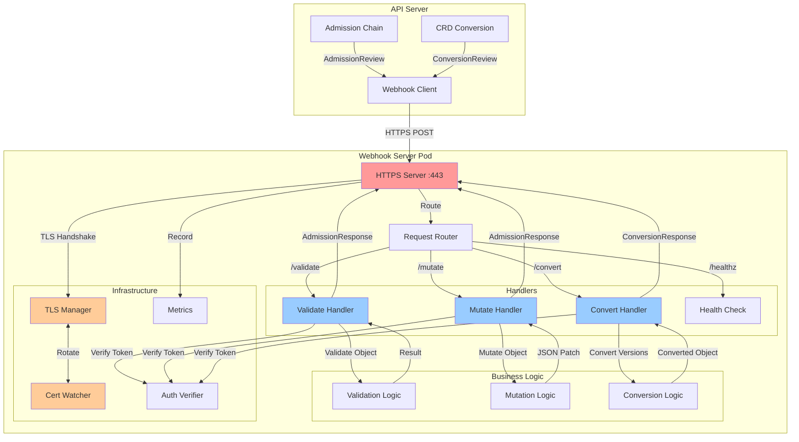
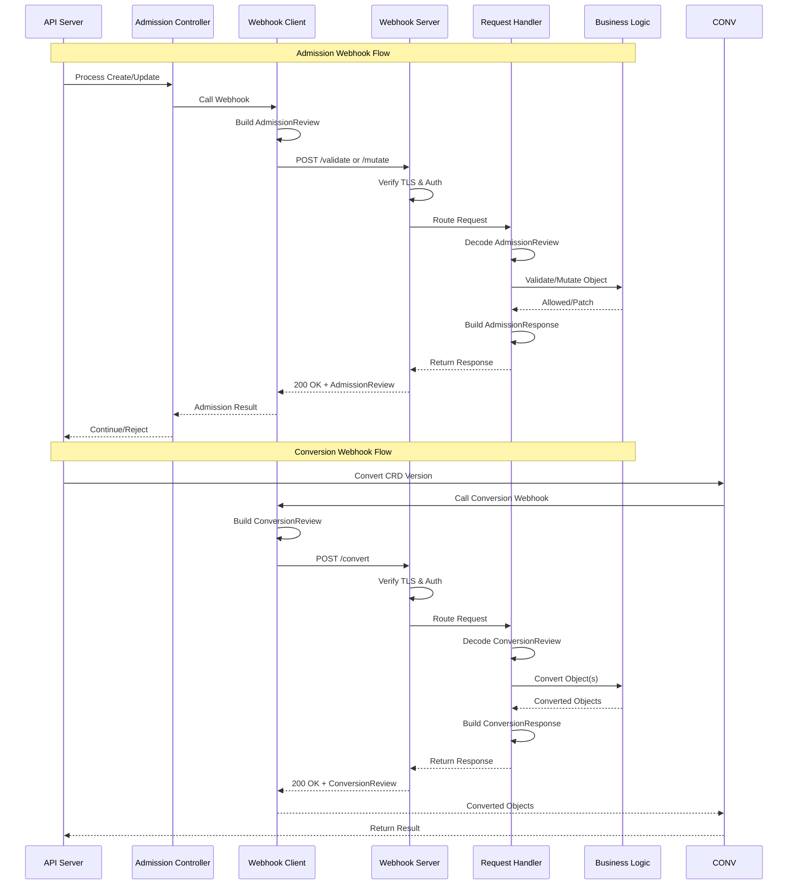
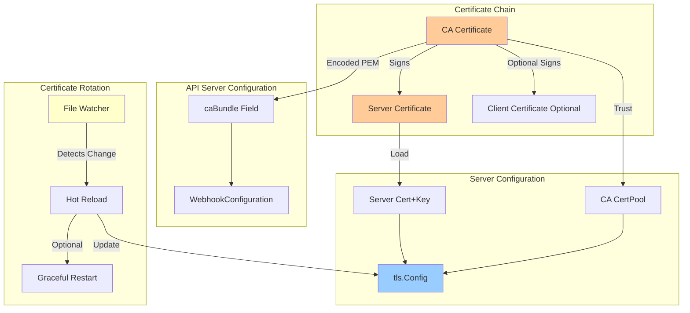
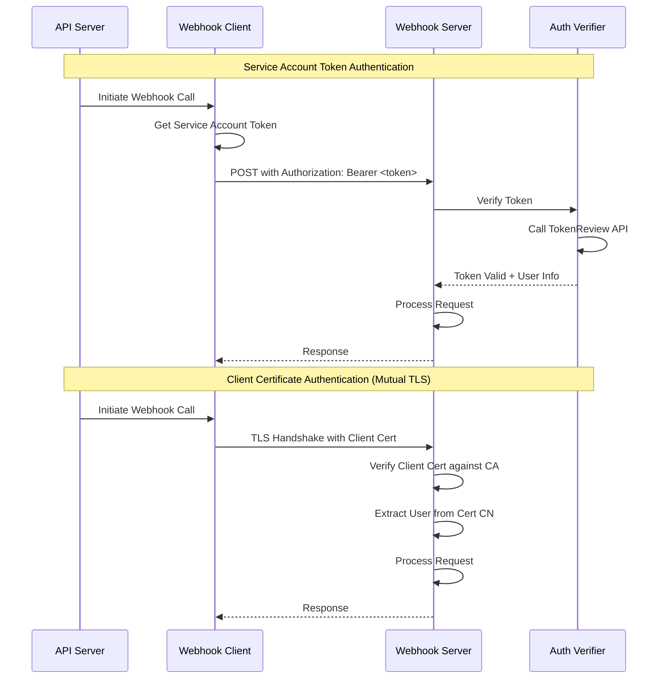
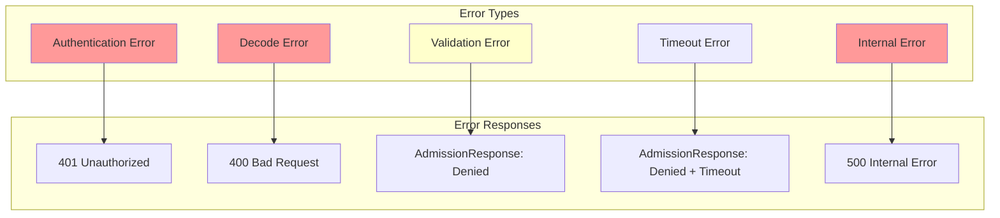

# **Webhook Server Implementation**

━━━━━━━━━━━━━━━━━━━━━━━━━━━━━━━━━━━━━━━━━━━━━━━━━━━━━━━━━━━━━━━━━━━━━━━━━━━━━━

## **📋 Overview**

Webhook servers are HTTP(S) servers that receive admission and conversion requests from the Kubernetes API server. They implement two types of webhooks:

1. **Admission Webhooks**: ValidatingWebhookConfiguration, MutatingWebhookConfiguration
2. **Conversion Webhooks**: CustomResourceDefinition conversion strategy

**Key Responsibilities:**
- Handle AdmissionReview requests (validate/mutate)
- Handle ConversionReview requests (convert between CRD versions)
- Manage TLS certificates and secure communication
- Authenticate and authorize requests
- Return structured responses with patches or errors
- Implement proper timeouts and error handling

**Source Locations:**
- Client-side: `/staging/src/k8s.io/apiserver/pkg/admission/plugin/webhook/`
- Server-side: User implementation (e.g., controller-runtime webhook package)
- Conversion: `/staging/src/k8s.io/apiextensions-apiserver/pkg/apiserver/conversion/`

━━━━━━━━━━━━━━━━━━━━━━━━━━━━━━━━━━━━━━━━━━━━━━━━━━━━━━━━━━━━━━━━━━━━━━━━━━━━━━

## **🏗️ Webhook Server Architecture**

### **Overall Architecture**



### **Request Flow Comparison**



━━━━━━━━━━━━━━━━━━━━━━━━━━━━━━━━━━━━━━━━━━━━━━━━━━━━━━━━━━━━━━━━━━━━━━━━━━━━━━

## **🔒 TLS and Certificate Management**

### **Certificate Requirements**



### **Certificate Generation Code**

```go
// File: cmd/webhook-server/certs/generator.go
package certs

import (
    "crypto/rand"
    "crypto/rsa"
    "crypto/x509"
    "crypto/x509/pkix"
    "encoding/pem"
    "math/big"
    "time"
)

// GenerateSelfSignedCert generates a self-signed certificate for the webhook server
func GenerateSelfSignedCert(serviceName, namespace string) (certPEM, keyPEM, caPEM []byte, err error) {
    // Generate CA
    ca := &x509.Certificate{
        SerialNumber: big.NewInt(2025),
        Subject: pkix.Name{
            Organization: []string{"Kubernetes Webhook"},
            CommonName:   "Webhook CA",
        },
        NotBefore:             time.Now(),
        NotAfter:              time.Now().AddDate(10, 0, 0), // 10 years
        IsCA:                  true,
        ExtKeyUsage:           []x509.ExtKeyUsage{x509.ExtKeyUsageClientAuth, x509.ExtKeyUsageServerAuth},
        KeyUsage:              x509.KeyUsageDigitalSignature | x509.KeyUsageCertSign,
        BasicConstraintsValid: true,
    }

    // Generate CA private key
    caPrivKey, err := rsa.GenerateKey(rand.Reader, 4096)
    if err != nil {
        return nil, nil, nil, err
    }

    // Self-sign CA certificate
    caBytes, err := x509.CreateCertificate(rand.Reader, ca, ca, &caPrivKey.PublicKey, caPrivKey)
    if err != nil {
        return nil, nil, nil, err
    }

    // PEM encode CA
    caPEM = pem.EncodeToMemory(&pem.Block{
        Type:  "CERTIFICATE",
        Bytes: caBytes,
    })

    // Generate server certificate
    dnsNames := []string{
        serviceName,
        serviceName + "." + namespace,
        serviceName + "." + namespace + ".svc",
        serviceName + "." + namespace + ".svc.cluster.local",
    }

    cert := &x509.Certificate{
        SerialNumber: big.NewInt(2026),
        Subject: pkix.Name{
            Organization: []string{"Kubernetes Webhook"},
            CommonName:   serviceName + "." + namespace + ".svc",
        },
        DNSNames:     dnsNames,
        NotBefore:    time.Now(),
        NotAfter:     time.Now().AddDate(1, 0, 0), // 1 year
        SubjectKeyId: []byte{1, 2, 3, 4, 6},
        ExtKeyUsage:  []x509.ExtKeyUsage{x509.ExtKeyUsageClientAuth, x509.ExtKeyUsageServerAuth},
        KeyUsage:     x509.KeyUsageDigitalSignature,
    }

    // Generate server private key
    certPrivKey, err := rsa.GenerateKey(rand.Reader, 4096)
    if err != nil {
        return nil, nil, nil, err
    }

    // Sign server certificate with CA
    certBytes, err := x509.CreateCertificate(rand.Reader, cert, ca, &certPrivKey.PublicKey, caPrivKey)
    if err != nil {
        return nil, nil, nil, err
    }

    // PEM encode server certificate
    certPEM = pem.EncodeToMemory(&pem.Block{
        Type:  "CERTIFICATE",
        Bytes: certBytes,
    })

    // PEM encode server private key
    keyPEM = pem.EncodeToMemory(&pem.Block{
        Type:  "RSA PRIVATE KEY",
        Bytes: x509.MarshalPKCS1PrivateKey(certPrivKey),
    })

    return certPEM, keyPEM, caPEM, nil
}
```

### **Certificate Rotation Implementation**

```go
// File: pkg/webhook/certmanager/watcher.go
package certmanager

import (
    "crypto/tls"
    "fmt"
    "log"
    "sync"
    "time"

    "github.com/fsnotify/fsnotify"
)

// CertWatcher watches certificate files and reloads them on change
type CertWatcher struct {
    certPath string
    keyPath  string

    currentCert *tls.Certificate
    certMu      sync.RWMutex

    watcher *fsnotify.Watcher
    stopCh  chan struct{}
}

// NewCertWatcher creates a new certificate watcher
func NewCertWatcher(certPath, keyPath string) (*CertWatcher, error) {
    watcher, err := fsnotify.NewWatcher()
    if err != nil {
        return nil, fmt.Errorf("failed to create file watcher: %v", err)
    }

    cw := &CertWatcher{
        certPath: certPath,
        keyPath:  keyPath,
        watcher:  watcher,
        stopCh:   make(chan struct{}),
    }

    // Load initial certificate
    if err := cw.loadCertificate(); err != nil {
        return nil, fmt.Errorf("failed to load initial certificate: %v", err)
    }

    // Watch certificate files
    if err := watcher.Add(certPath); err != nil {
        return nil, fmt.Errorf("failed to watch cert file: %v", err)
    }
    if err := watcher.Add(keyPath); err != nil {
        return nil, fmt.Errorf("failed to watch key file: %v", err)
    }

    return cw, nil
}

// Start starts watching for certificate changes
func (cw *CertWatcher) Start() {
    go cw.watchLoop()
}

// Stop stops the certificate watcher
func (cw *CertWatcher) Stop() {
    close(cw.stopCh)
    cw.watcher.Close()
}

// GetCertificate returns the current certificate (safe for tls.Config.GetCertificate)
func (cw *CertWatcher) GetCertificate(clientHello *tls.ClientHelloInfo) (*tls.Certificate, error) {
    cw.certMu.RLock()
    defer cw.certMu.RUnlock()
    return cw.currentCert, nil
}

// loadCertificate loads the certificate from disk
func (cw *CertWatcher) loadCertificate() error {
    cert, err := tls.LoadX509KeyPair(cw.certPath, cw.keyPath)
    if err != nil {
        return err
    }

    cw.certMu.Lock()
    cw.currentCert = &cert
    cw.certMu.Unlock()

    log.Printf("Loaded certificate from %s", cw.certPath)
    return nil
}

// watchLoop watches for file changes and reloads certificates
func (cw *CertWatcher) watchLoop() {
    // Debounce timer to avoid reloading multiple times for same change
    var debounceTimer *time.Timer

    for {
        select {
        case event, ok := <-cw.watcher.Events:
            if !ok {
                return
            }

            if event.Op&(fsnotify.Write|fsnotify.Create) != 0 {
                log.Printf("Certificate file changed: %s", event.Name)

                // Reset debounce timer
                if debounceTimer != nil {
                    debounceTimer.Stop()
                }

                debounceTimer = time.AfterFunc(100*time.Millisecond, func() {
                    if err := cw.loadCertificate(); err != nil {
                        log.Printf("Failed to reload certificate: %v", err)
                    } else {
                        log.Println("Certificate reloaded successfully")
                    }
                })
            }

        case err, ok := <-cw.watcher.Errors:
            if !ok {
                return
            }
            log.Printf("Certificate watcher error: %v", err)

        case <-cw.stopCh:
            if debounceTimer != nil {
                debounceTimer.Stop()
            }
            return
        }
    }
}
```

### **TLS Server Configuration**

```go
// File: pkg/webhook/server/tls.go
package server

import (
    "crypto/tls"
    "crypto/x509"
    "fmt"
    "os"
)

// TLSConfig creates a TLS configuration for the webhook server
type TLSConfig struct {
    CertPath string
    KeyPath  string
    CAPath   string // Optional: for client certificate verification

    // MinVersion sets the minimum TLS version (default: TLS 1.2)
    MinVersion uint16

    // RequireClientCert enables mutual TLS
    RequireClientCert bool
}

// BuildTLSConfig creates a tls.Config from TLSConfig
func (tc *TLSConfig) BuildTLSConfig(certWatcher CertificateGetter) (*tls.Config, error) {
    tlsConfig := &tls.Config{
        MinVersion: tls.VersionTLS12,
        CipherSuites: []uint16{
            tls.TLS_ECDHE_RSA_WITH_AES_128_GCM_SHA256,
            tls.TLS_ECDHE_RSA_WITH_AES_256_GCM_SHA384,
            tls.TLS_ECDHE_ECDSA_WITH_AES_128_GCM_SHA256,
            tls.TLS_ECDHE_ECDSA_WITH_AES_256_GCM_SHA384,
        },
        PreferServerCipherSuites: true,
    }

    if tc.MinVersion != 0 {
        tlsConfig.MinVersion = tc.MinVersion
    }

    // Use GetCertificate for hot reloading
    if certWatcher != nil {
        tlsConfig.GetCertificate = certWatcher.GetCertificate
    } else {
        // Static certificate loading
        cert, err := tls.LoadX509KeyPair(tc.CertPath, tc.KeyPath)
        if err != nil {
            return nil, fmt.Errorf("failed to load certificate: %v", err)
        }
        tlsConfig.Certificates = []tls.Certificate{cert}
    }

    // Configure client certificate verification (mutual TLS)
    if tc.RequireClientCert && tc.CAPath != "" {
        caCert, err := os.ReadFile(tc.CAPath)
        if err != nil {
            return nil, fmt.Errorf("failed to read CA certificate: %v", err)
        }

        caCertPool := x509.NewCertPool()
        if !caCertPool.AppendCertsFromPEM(caCert) {
            return nil, fmt.Errorf("failed to parse CA certificate")
        }

        tlsConfig.ClientCAs = caCertPool
        tlsConfig.ClientAuth = tls.RequireAndVerifyClientCert
    }

    return tlsConfig, nil
}

// CertificateGetter interface for certificate providers
type CertificateGetter interface {
    GetCertificate(clientHello *tls.ClientHelloInfo) (*tls.Certificate, error)
}
```

━━━━━━━━━━━━━━━━━━━━━━━━━━━━━━━━━━━━━━━━━━━━━━━━━━━━━━━━━━━━━━━━━━━━━━━━━━━━━━

## **✅ Admission Webhook Implementation**

### **AdmissionReview Structure**

```mermaid
graph TB
    subgraph "AdmissionReview Request"
        REQ[AdmissionReview]
        REQ_SPEC[Request]

        subgraph "Request Fields"
            UID[UID]
            KIND[Kind]
            RESOURCE[Resource]
            OPERATION[Operation: CREATE/UPDATE/DELETE]
            OBJECT[Object: raw JSON]
            OLD_OBJECT[OldObject: raw JSON for UPDATE]
            USER_INFO[UserInfo]
            NAMESPACE[Namespace]
            OPTIONS[Options]
        end
    end

    subgraph "AdmissionReview Response"
        RESP[AdmissionReview]
        RESP_SPEC[Response]

        subgraph "Response Fields"
            RESP_UID[UID: must match request]
            ALLOWED[Allowed: bool]
            STATUS[Status: error details]
            PATCH[Patch: JSONPatch for mutations]
            PATCH_TYPE[PatchType: JSONPatch]
            WARNINGS[Warnings: []string]
        end
    end

    REQ --> REQ_SPEC
    REQ_SPEC --> UID
    REQ_SPEC --> KIND
    REQ_SPEC --> RESOURCE
    REQ_SPEC --> OPERATION
    REQ_SPEC --> OBJECT
    REQ_SPEC --> OLD_OBJECT
    REQ_SPEC --> USER_INFO
    REQ_SPEC --> NAMESPACE
    REQ_SPEC --> OPTIONS

    RESP --> RESP_SPEC
    RESP_SPEC --> RESP_UID
    RESP_SPEC --> ALLOWED
    RESP_SPEC --> STATUS
    RESP_SPEC --> PATCH
    RESP_SPEC --> PATCH_TYPE
    RESP_SPEC --> WARNINGS

    UID -.->|Copy| RESP_UID

    style REQ fill:#99ccff
    style RESP fill:#99ff99
    style PATCH fill:#ffcc99
```

### **Validating Webhook Handler**

```go
// File: pkg/webhook/admission/validator.go
package admission

import (
    "encoding/json"
    "fmt"
    "io"
    "net/http"

    admissionv1 "k8s.io/api/admission/v1"
    metav1 "k8s.io/apimachinery/pkg/apis/meta/v1"
    "k8s.io/apimachinery/pkg/runtime"
    "k8s.io/apimachinery/pkg/runtime/serializer"
)

var (
    scheme = runtime.NewScheme()
    codecs = serializer.NewCodecFactory(scheme)
)

func init() {
    admissionv1.AddToScheme(scheme)
}

// ValidatorFunc is the function signature for validation logic
type ValidatorFunc func(ar *admissionv1.AdmissionReview) (*admissionv1.AdmissionResponse, error)

// ValidatingWebhookHandler handles validating admission webhook requests
type ValidatingWebhookHandler struct {
    validator ValidatorFunc
}

// NewValidatingWebhookHandler creates a new validating webhook handler
func NewValidatingWebhookHandler(validator ValidatorFunc) *ValidatingWebhookHandler {
    return &ValidatingWebhookHandler{
        validator: validator,
    }
}

// ServeHTTP implements http.Handler
func (h *ValidatingWebhookHandler) ServeHTTP(w http.ResponseWriter, r *http.Request) {
    // Verify content type
    contentType := r.Header.Get("Content-Type")
    if contentType != "application/json" {
        http.Error(w, "Content-Type must be application/json", http.StatusUnsupportedMediaType)
        return
    }

    // Read request body
    body, err := io.ReadAll(r.Body)
    if err != nil {
        http.Error(w, fmt.Sprintf("failed to read request body: %v", err), http.StatusBadRequest)
        return
    }
    defer r.Body.Close()

    // Decode AdmissionReview
    ar := &admissionv1.AdmissionReview{}
    deserializer := codecs.UniversalDeserializer()
    if _, _, err := deserializer.Decode(body, nil, ar); err != nil {
        http.Error(w, fmt.Sprintf("failed to decode AdmissionReview: %v", err), http.StatusBadRequest)
        return
    }

    // Verify request is not nil
    if ar.Request == nil {
        http.Error(w, "AdmissionReview request is nil", http.StatusBadRequest)
        return
    }

    // Run validation logic
    response, err := h.validator(ar)
    if err != nil {
        // Internal error - deny with error message
        response = &admissionv1.AdmissionResponse{
            UID:     ar.Request.UID,
            Allowed: false,
            Result: &metav1.Status{
                Message: fmt.Sprintf("validation error: %v", err),
                Code:    http.StatusInternalServerError,
            },
        }
    }

    // Ensure UID is set
    if response.UID == "" {
        response.UID = ar.Request.UID
    }

    // Build response AdmissionReview
    reviewResponse := &admissionv1.AdmissionReview{
        TypeMeta: metav1.TypeMeta{
            APIVersion: "admission.k8s.io/v1",
            Kind:       "AdmissionReview",
        },
        Response: response,
    }

    // Encode and send response
    w.Header().Set("Content-Type", "application/json")
    if err := json.NewEncoder(w).Encode(reviewResponse); err != nil {
        http.Error(w, fmt.Sprintf("failed to encode response: %v", err), http.StatusInternalServerError)
    }
}

// Example validation logic
func ValidatePodSecurity(ar *admissionv1.AdmissionReview) (*admissionv1.AdmissionResponse, error) {
    // Decode the object
    req := ar.Request

    // Only validate Pods
    if req.Kind.Kind != "Pod" {
        return &admissionv1.AdmissionResponse{
            UID:     req.UID,
            Allowed: true,
        }, nil
    }

    // Parse pod object
    pod := &corev1.Pod{}
    if err := json.Unmarshal(req.Object.Raw, pod); err != nil {
        return nil, fmt.Errorf("failed to unmarshal pod: %v", err)
    }

    // Validation rules
    var warnings []string

    // Rule 1: Privileged containers not allowed
    for _, container := range pod.Spec.Containers {
        if container.SecurityContext != nil &&
           container.SecurityContext.Privileged != nil &&
           *container.SecurityContext.Privileged {
            return &admissionv1.AdmissionResponse{
                UID:     req.UID,
                Allowed: false,
                Result: &metav1.Status{
                    Message: fmt.Sprintf("privileged containers not allowed: %s", container.Name),
                    Reason:  metav1.StatusReasonForbidden,
                    Code:    http.StatusForbidden,
                },
            }, nil
        }
    }

    // Rule 2: Image must be from approved registry
    approvedRegistries := []string{"docker.io", "gcr.io", "quay.io"}
    for _, container := range pod.Spec.Containers {
        approved := false
        for _, registry := range approvedRegistries {
            if strings.HasPrefix(container.Image, registry) {
                approved = true
                break
            }
        }
        if !approved {
            warnings = append(warnings,
                fmt.Sprintf("container %s uses unapproved registry", container.Name))
        }
    }

    // Rule 3: Must have resource limits
    for _, container := range pod.Spec.Containers {
        if container.Resources.Limits == nil ||
           container.Resources.Limits.Cpu().IsZero() ||
           container.Resources.Limits.Memory().IsZero() {
            warnings = append(warnings,
                fmt.Sprintf("container %s should have CPU and memory limits", container.Name))
        }
    }

    return &admissionv1.AdmissionResponse{
        UID:      req.UID,
        Allowed:  true,
        Warnings: warnings,
    }, nil
}
```

### **Mutating Webhook Handler**

```go
// File: pkg/webhook/admission/mutator.go
package admission

import (
    "encoding/json"
    "fmt"

    admissionv1 "k8s.io/api/admission/v1"
    corev1 "k8s.io/api/core/v1"
    metav1 "k8s.io/apimachinery/pkg/apis/meta/v1"
)

// MutatorFunc is the function signature for mutation logic
type MutatorFunc func(ar *admissionv1.AdmissionReview) (*admissionv1.AdmissionResponse, error)

// MutatePodDefaults adds default values to pods
func MutatePodDefaults(ar *admissionv1.AdmissionReview) (*admissionv1.AdmissionResponse, error) {
    req := ar.Request

    // Only mutate Pods
    if req.Kind.Kind != "Pod" {
        return &admissionv1.AdmissionResponse{
            UID:     req.UID,
            Allowed: true,
        }, nil
    }

    // Parse pod object
    pod := &corev1.Pod{}
    if err := json.Unmarshal(req.Object.Raw, pod); err != nil {
        return nil, fmt.Errorf("failed to unmarshal pod: %v", err)
    }

    // Build JSON patch operations
    var patches []JSONPatchOperation

    // Mutation 1: Add default labels
    if pod.Labels == nil {
        patches = append(patches, JSONPatchOperation{
            Op:    "add",
            Path:  "/metadata/labels",
            Value: map[string]string{},
        })
    }

    patches = append(patches, JSONPatchOperation{
        Op:    "add",
        Path:  "/metadata/labels/injected-by",
        Value: "webhook",
    })

    patches = append(patches, JSONPatchOperation{
        Op:    "add",
        Path:  "/metadata/labels/environment",
        Value: pod.Namespace, // Use namespace as environment
    })

    // Mutation 2: Add default annotations
    if pod.Annotations == nil {
        patches = append(patches, JSONPatchOperation{
            Op:    "add",
            Path:  "/metadata/annotations",
            Value: map[string]string{},
        })
    }

    patches = append(patches, JSONPatchOperation{
        Op:    "add",
        Path:  "/metadata/annotations/mutated-at",
        Value: time.Now().Format(time.RFC3339),
    })

    // Mutation 3: Set default image pull policy
    for i, container := range pod.Spec.Containers {
        if container.ImagePullPolicy == "" {
            patches = append(patches, JSONPatchOperation{
                Op:    "add",
                Path:  fmt.Sprintf("/spec/containers/%d/imagePullPolicy", i),
                Value: "IfNotPresent",
            })
        }
    }

    // Mutation 4: Add resource requests if not present
    for i, container := range pod.Spec.Containers {
        if container.Resources.Requests == nil {
            patches = append(patches, JSONPatchOperation{
                Op:   "add",
                Path: fmt.Sprintf("/spec/containers/%d/resources/requests", i),
                Value: corev1.ResourceList{
                    corev1.ResourceCPU:    resource.MustParse("100m"),
                    corev1.ResourceMemory: resource.MustParse("128Mi"),
                },
            })
        }
    }

    // Mutation 5: Inject sidecar container
    if pod.Annotations["inject-sidecar"] == "true" {
        sidecar := corev1.Container{
            Name:  "logging-sidecar",
            Image: "fluent/fluent-bit:latest",
            VolumeMounts: []corev1.VolumeMount{
                {
                    Name:      "logs",
                    MountPath: "/var/log",
                },
            },
        }

        patches = append(patches, JSONPatchOperation{
            Op:    "add",
            Path:  "/spec/containers/-",
            Value: sidecar,
        })

        // Add volume if not present
        patches = append(patches, JSONPatchOperation{
            Op:   "add",
            Path: "/spec/volumes/-",
            Value: corev1.Volume{
                Name: "logs",
                VolumeSource: corev1.VolumeSource{
                    EmptyDir: &corev1.EmptyDirVolumeSource{},
                },
            },
        })
    }

    // Encode patches
    patchBytes, err := json.Marshal(patches)
    if err != nil {
        return nil, fmt.Errorf("failed to marshal patches: %v", err)
    }

    patchType := admissionv1.PatchTypeJSONPatch
    return &admissionv1.AdmissionResponse{
        UID:       req.UID,
        Allowed:   true,
        Patch:     patchBytes,
        PatchType: &patchType,
    }, nil
}

// JSONPatchOperation represents a JSON Patch operation
type JSONPatchOperation struct {
    Op    string      `json:"op"`
    Path  string      `json:"path"`
    Value interface{} `json:"value,omitempty"`
}
```

### **Admission Webhook Client-Side (API Server)**

```go
// File: staging/src/k8s.io/apiserver/pkg/admission/plugin/webhook/request/admissionreview.go
// Source reference - how API server builds AdmissionReview

package request

import (
    "fmt"

    admissionv1 "k8s.io/api/admission/v1"
    metav1 "k8s.io/apimachinery/pkg/apis/meta/v1"
    "k8s.io/apimachinery/pkg/runtime"
    "k8s.io/apiserver/pkg/admission"
)

// CreateAdmissionReview creates an AdmissionReview from admission attributes
func CreateAdmissionReview(attr admission.Attributes, uid string) (*admissionv1.AdmissionReview, error) {
    gvk := attr.GetKind()
    gvr := attr.GetResource()

    review := &admissionv1.AdmissionReview{
        TypeMeta: metav1.TypeMeta{
            APIVersion: "admission.k8s.io/v1",
            Kind:       "AdmissionReview",
        },
        Request: &admissionv1.AdmissionRequest{
            UID: types.UID(uid),
            Kind: metav1.GroupVersionKind{
                Group:   gvk.Group,
                Version: gvk.Version,
                Kind:    gvk.Kind,
            },
            Resource: metav1.GroupVersionResource{
                Group:    gvr.Group,
                Version:  gvr.Version,
                Resource: gvr.Resource,
            },
            SubResource: attr.GetSubresource(),
            Name:        attr.GetName(),
            Namespace:   attr.GetNamespace(),
            Operation:   admissionv1.Operation(attr.GetOperation()),
            UserInfo:    attr.GetUserInfo(),
            DryRun:      attr.IsDryRun(),
            Options:     runtime.Unknown{},
        },
    }

    // Encode object
    if attr.GetObject() != nil {
        objRaw, err := json.Marshal(attr.GetObject())
        if err != nil {
            return nil, fmt.Errorf("failed to marshal object: %v", err)
        }
        review.Request.Object.Raw = objRaw
    }

    // Encode old object (for UPDATE operations)
    if attr.GetOldObject() != nil {
        oldObjRaw, err := json.Marshal(attr.GetOldObject())
        if err != nil {
            return nil, fmt.Errorf("failed to marshal old object: %v", err)
        }
        review.Request.OldObject.Raw = oldObjRaw
    }

    return review, nil
}
```

━━━━━━━━━━━━━━━━━━━━━━━━━━━━━━━━━━━━━━━━━━━━━━━━━━━━━━━━━━━━━━━━━━━━━━━━━━━━━━

## **🔄 Conversion Webhook Implementation**

### **ConversionReview Structure**

```mermaid
graph TB
    subgraph "ConversionReview Request"
        CONV_REQ[ConversionReview]
        CONV_REQ_SPEC[Request]

        subgraph "Request Fields"
            C_UID[UID]
            DESIRED_VERSION[DesiredAPIVersion]
            OBJECTS[Objects: []runtime.RawExtension]
        end
    end

    subgraph "ConversionReview Response"
        CONV_RESP[ConversionReview]
        CONV_RESP_SPEC[Response]

        subgraph "Response Fields"
            C_RESP_UID[UID: must match request]
            CONVERTED_OBJECTS[ConvertedObjects: []runtime.RawExtension]
            C_STATUS[Status: error details]
        end
    end

    CONV_REQ --> CONV_REQ_SPEC
    CONV_REQ_SPEC --> C_UID
    CONV_REQ_SPEC --> DESIRED_VERSION
    CONV_REQ_SPEC --> OBJECTS

    CONV_RESP --> CONV_RESP_SPEC
    CONV_RESP_SPEC --> C_RESP_UID
    CONV_RESP_SPEC --> CONVERTED_OBJECTS
    CONV_RESP_SPEC --> C_STATUS

    C_UID -.->|Copy| C_RESP_UID
    OBJECTS -.->|Convert| CONVERTED_OBJECTS

    style CONV_REQ fill:#99ccff
    style CONV_RESP fill:#99ff99
    style CONVERTED_OBJECTS fill:#ffcc99
```

### **Conversion Webhook Handler**

```go
// File: pkg/webhook/conversion/handler.go
package conversion

import (
    "encoding/json"
    "fmt"
    "io"
    "net/http"

    apiextensionsv1 "k8s.io/apiextensions-apiserver/pkg/apis/apiextensions/v1"
    metav1 "k8s.io/apimachinery/pkg/apis/meta/v1"
    "k8s.io/apimachinery/pkg/runtime"
)

// Converter interface for converting between CRD versions
type Converter interface {
    Convert(objects []runtime.RawExtension, toVersion string) ([]runtime.RawExtension, error)
}

// ConversionWebhookHandler handles CRD conversion webhook requests
type ConversionWebhookHandler struct {
    converter Converter
}

// NewConversionWebhookHandler creates a new conversion webhook handler
func NewConversionWebhookHandler(converter Converter) *ConversionWebhookHandler {
    return &ConversionWebhookHandler{
        converter: converter,
    }
}

// ServeHTTP implements http.Handler
func (h *ConversionWebhookHandler) ServeHTTP(w http.ResponseWriter, r *http.Request) {
    // Verify content type
    contentType := r.Header.Get("Content-Type")
    if contentType != "application/json" {
        http.Error(w, "Content-Type must be application/json", http.StatusUnsupportedMediaType)
        return
    }

    // Read request body
    body, err := io.ReadAll(r.Body)
    if err != nil {
        http.Error(w, fmt.Sprintf("failed to read request body: %v", err), http.StatusBadRequest)
        return
    }
    defer r.Body.Close()

    // Decode ConversionReview
    cr := &apiextensionsv1.ConversionReview{}
    if err := json.Unmarshal(body, cr); err != nil {
        http.Error(w, fmt.Sprintf("failed to decode ConversionReview: %v", err), http.StatusBadRequest)
        return
    }

    // Verify request is not nil
    if cr.Request == nil {
        http.Error(w, "ConversionReview request is nil", http.StatusBadRequest)
        return
    }

    // Run conversion logic
    response := h.convert(cr.Request)

    // Build response ConversionReview
    reviewResponse := &apiextensionsv1.ConversionReview{
        TypeMeta: metav1.TypeMeta{
            APIVersion: "apiextensions.k8s.io/v1",
            Kind:       "ConversionReview",
        },
        Response: response,
    }

    // Encode and send response
    w.Header().Set("Content-Type", "application/json")
    if err := json.NewEncoder(w).Encode(reviewResponse); err != nil {
        http.Error(w, fmt.Sprintf("failed to encode response: %v", err), http.StatusInternalServerError)
    }
}

// convert performs the actual conversion
func (h *ConversionWebhookHandler) convert(req *apiextensionsv1.ConversionRequest) *apiextensionsv1.ConversionResponse {
    // Convert objects
    converted, err := h.converter.Convert(req.Objects, req.DesiredAPIVersion)
    if err != nil {
        return &apiextensionsv1.ConversionResponse{
            UID: req.UID,
            Result: metav1.Status{
                Status:  metav1.StatusFailure,
                Message: fmt.Sprintf("conversion failed: %v", err),
                Code:    http.StatusInternalServerError,
            },
        }
    }

    return &apiextensionsv1.ConversionResponse{
        UID:              req.UID,
        ConvertedObjects: converted,
        Result: metav1.Status{
            Status: metav1.StatusSuccess,
        },
    }
}
```

### **Example CRD Conversion Implementation**

```go
// File: pkg/webhook/conversion/crontab_converter.go
package conversion

import (
    "encoding/json"
    "fmt"

    "k8s.io/apimachinery/pkg/runtime"
)

// CronTab versions
type CronTabV1 struct {
    metav1.TypeMeta   `json:",inline"`
    metav1.ObjectMeta `json:"metadata,omitempty"`
    Spec              CronTabV1Spec `json:"spec"`
}

type CronTabV1Spec struct {
    CronSpec string `json:"cronSpec"`
    Image    string `json:"image"`
}

type CronTabV2 struct {
    metav1.TypeMeta   `json:",inline"`
    metav1.ObjectMeta `json:"metadata,omitempty"`
    Spec              CronTabV2Spec `json:"spec"`
}

type CronTabV2Spec struct {
    Schedule string            `json:"schedule"` // renamed from cronSpec
    Image    string            `json:"image"`
    Replicas int32             `json:"replicas"` // new field in v2
    Labels   map[string]string `json:"labels"`   // new field in v2
}

// CronTabConverter implements Converter interface
type CronTabConverter struct{}

func (c *CronTabConverter) Convert(objects []runtime.RawExtension, toVersion string) ([]runtime.RawExtension, error) {
    var converted []runtime.RawExtension

    for _, obj := range objects {
        // Determine source version
        var typeMeta metav1.TypeMeta
        if err := json.Unmarshal(obj.Raw, &typeMeta); err != nil {
            return nil, fmt.Errorf("failed to unmarshal TypeMeta: %v", err)
        }

        fromVersion := typeMeta.APIVersion

        var convertedObj interface{}
        var err error

        // Convert based on source and target versions
        switch {
        case fromVersion == "example.com/v1" && toVersion == "example.com/v2":
            convertedObj, err = c.convertV1ToV2(obj.Raw)
        case fromVersion == "example.com/v2" && toVersion == "example.com/v1":
            convertedObj, err = c.convertV2ToV1(obj.Raw)
        case fromVersion == toVersion:
            // No conversion needed
            converted = append(converted, obj)
            continue
        default:
            return nil, fmt.Errorf("unsupported conversion: %s to %s", fromVersion, toVersion)
        }

        if err != nil {
            return nil, err
        }

        // Marshal converted object
        raw, err := json.Marshal(convertedObj)
        if err != nil {
            return nil, fmt.Errorf("failed to marshal converted object: %v", err)
        }

        converted = append(converted, runtime.RawExtension{Raw: raw})
    }

    return converted, nil
}

func (c *CronTabConverter) convertV1ToV2(raw []byte) (*CronTabV2, error) {
    var v1 CronTabV1
    if err := json.Unmarshal(raw, &v1); err != nil {
        return nil, fmt.Errorf("failed to unmarshal v1: %v", err)
    }

    v2 := &CronTabV2{
        TypeMeta: metav1.TypeMeta{
            APIVersion: "example.com/v2",
            Kind:       "CronTab",
        },
        ObjectMeta: v1.ObjectMeta,
        Spec: CronTabV2Spec{
            Schedule: v1.Spec.CronSpec, // Field renamed
            Image:    v1.Spec.Image,
            Replicas: 1,                // Default value for new field
            Labels:   map[string]string{}, // Default value for new field
        },
    }

    return v2, nil
}

func (c *CronTabConverter) convertV2ToV1(raw []byte) (*CronTabV1, error) {
    var v2 CronTabV2
    if err := json.Unmarshal(raw, &v2); err != nil {
        return nil, fmt.Errorf("failed to unmarshal v2: %v", err)
    }

    v1 := &CronTabV1{
        TypeMeta: metav1.TypeMeta{
            APIVersion: "example.com/v1",
            Kind:       "CronTab",
        },
        ObjectMeta: v2.ObjectMeta,
        Spec: CronTabV1Spec{
            CronSpec: v2.Spec.Schedule, // Field renamed back
            Image:    v2.Spec.Image,
            // Note: Replicas and Labels fields are dropped
        },
    }

    return v1, nil
}
```

### **Conversion Webhook Client-Side (API Server)**

```go
// File: staging/src/k8s.io/apiextensions-apiserver/pkg/apiserver/conversion/webhook_converter.go
// Source reference - how API server calls conversion webhooks (simplified)

package conversion

import (
    "bytes"
    "context"
    "encoding/json"
    "fmt"
    "net/http"
    "time"

    apiextensionsv1 "k8s.io/apiextensions-apiserver/pkg/apis/apiextensions/v1"
    metav1 "k8s.io/apimachinery/pkg/apis/meta/v1"
    "k8s.io/apimachinery/pkg/runtime"
)

// webhookConverter converts custom resources using a webhook
type webhookConverter struct {
    clientConfig apiextensionsv1.WebhookClientConfig
    client       *http.Client
}

// Convert implements the Converter interface
func (c *webhookConverter) Convert(object runtime.Object, toGVK schema.GroupVersionKind) (runtime.Object, error) {
    // Build ConversionReview request
    review := &apiextensionsv1.ConversionReview{
        TypeMeta: metav1.TypeMeta{
            APIVersion: "apiextensions.k8s.io/v1",
            Kind:       "ConversionReview",
        },
        Request: &apiextensionsv1.ConversionRequest{
            UID:               uuid.NewUUID(),
            DesiredAPIVersion: toGVK.GroupVersion().String(),
            Objects: []runtime.RawExtension{
                {Object: object},
            },
        },
    }

    // Marshal request
    reqBody, err := json.Marshal(review)
    if err != nil {
        return nil, fmt.Errorf("failed to marshal conversion request: %v", err)
    }

    // Build webhook URL
    webhookURL := c.buildWebhookURL()

    // Create HTTP request
    ctx, cancel := context.WithTimeout(context.Background(), 30*time.Second)
    defer cancel()

    httpReq, err := http.NewRequestWithContext(ctx, "POST", webhookURL, bytes.NewReader(reqBody))
    if err != nil {
        return nil, fmt.Errorf("failed to create HTTP request: %v", err)
    }
    httpReq.Header.Set("Content-Type", "application/json")

    // Send request
    resp, err := c.client.Do(httpReq)
    if err != nil {
        return nil, fmt.Errorf("failed to call webhook: %v", err)
    }
    defer resp.Body.Close()

    // Check status code
    if resp.StatusCode != http.StatusOK {
        return nil, fmt.Errorf("webhook returned non-200 status: %d", resp.StatusCode)
    }

    // Decode response
    var respReview apiextensionsv1.ConversionReview
    if err := json.NewDecoder(resp.Body).Decode(&respReview); err != nil {
        return nil, fmt.Errorf("failed to decode conversion response: %v", err)
    }

    // Check response
    if respReview.Response == nil {
        return nil, fmt.Errorf("webhook response is nil")
    }

    if respReview.Response.Result.Status == metav1.StatusFailure {
        return nil, fmt.Errorf("conversion failed: %s", respReview.Response.Result.Message)
    }

    if len(respReview.Response.ConvertedObjects) != 1 {
        return nil, fmt.Errorf("expected 1 converted object, got %d",
            len(respReview.Response.ConvertedObjects))
    }

    // Return converted object
    return respReview.Response.ConvertedObjects[0].Object, nil
}

func (c *webhookConverter) buildWebhookURL() string {
    if c.clientConfig.URL != nil {
        return *c.clientConfig.URL
    }

    // Build URL from service reference
    svc := c.clientConfig.Service
    path := "/"
    if svc.Path != nil {
        path = *svc.Path
    }

    return fmt.Sprintf("https://%s.%s.svc:%d%s",
        svc.Name, svc.Namespace, *svc.Port, path)
}
```

━━━━━━━━━━━━━━━━━━━━━━━━━━━━━━━━━━━━━━━━━━━━━━━━━━━━━━━━━━━━━━━━━━━━━━━━━━━━━━

## **🔐 Authentication and Authorization**

### **Authentication Flow**



### **Authentication Implementation**

```go
// File: pkg/webhook/auth/authenticator.go
package auth

import (
    "context"
    "crypto/x509"
    "fmt"
    "net/http"
    "strings"

    authenticationv1 "k8s.io/api/authentication/v1"
    metav1 "k8s.io/apimachinery/pkg/apis/meta/v1"
    "k8s.io/client-go/kubernetes"
)

// Authenticator authenticates webhook requests
type Authenticator struct {
    client kubernetes.Interface

    // AllowedServiceAccounts restricts which service accounts can call webhooks
    AllowedServiceAccounts []string
}

// NewAuthenticator creates a new authenticator
func NewAuthenticator(client kubernetes.Interface) *Authenticator {
    return &Authenticator{
        client: client,
        AllowedServiceAccounts: []string{
            "system:apiserver",
            "kube-system:kube-apiserver",
        },
    }
}

// AuthenticateRequest authenticates an HTTP request
func (a *Authenticator) AuthenticateRequest(r *http.Request) (*authenticationv1.UserInfo, error) {
    // Try bearer token authentication first
    if authHeader := r.Header.Get("Authorization"); authHeader != "" {
        return a.authenticateToken(r.Context(), authHeader)
    }

    // Try client certificate authentication
    if r.TLS != nil && len(r.TLS.PeerCertificates) > 0 {
        return a.authenticateClientCert(r.TLS.PeerCertificates[0])
    }

    return nil, fmt.Errorf("no authentication credentials provided")
}

// authenticateToken validates a bearer token using TokenReview
func (a *Authenticator) authenticateToken(ctx context.Context, authHeader string) (*authenticationv1.UserInfo, error) {
    // Extract token from Authorization header
    parts := strings.SplitN(authHeader, " ", 2)
    if len(parts) != 2 || parts[0] != "Bearer" {
        return nil, fmt.Errorf("invalid Authorization header format")
    }
    token := parts[1]

    // Create TokenReview request
    tokenReview := &authenticationv1.TokenReview{
        Spec: authenticationv1.TokenReviewSpec{
            Token: token,
        },
    }

    // Call Kubernetes TokenReview API
    result, err := a.client.AuthenticationV1().TokenReviews().Create(ctx, tokenReview, metav1.CreateOptions{})
    if err != nil {
        return nil, fmt.Errorf("failed to verify token: %v", err)
    }

    // Check if token is valid
    if !result.Status.Authenticated {
        return nil, fmt.Errorf("token authentication failed: %s", result.Status.Error)
    }

    // Verify service account is allowed
    if !a.isAllowedServiceAccount(result.Status.User.Username) {
        return nil, fmt.Errorf("service account not allowed: %s", result.Status.User.Username)
    }

    return &result.Status.User, nil
}

// authenticateClientCert extracts user info from client certificate
func (a *Authenticator) authenticateClientCert(cert *x509.Certificate) (*authenticationv1.UserInfo, error) {
    userInfo := &authenticationv1.UserInfo{
        Username: cert.Subject.CommonName,
        Groups:   cert.Subject.Organization,
    }

    // Verify the user is allowed
    if !a.isAllowedServiceAccount(userInfo.Username) {
        return nil, fmt.Errorf("client certificate user not allowed: %s", userInfo.Username)
    }

    return userInfo, nil
}

// isAllowedServiceAccount checks if a service account is allowed
func (a *Authenticator) isAllowedServiceAccount(username string) bool {
    for _, allowed := range a.AllowedServiceAccounts {
        if username == allowed {
            return true
        }
    }
    return false
}

// Middleware wraps an HTTP handler with authentication
func (a *Authenticator) Middleware(next http.Handler) http.Handler {
    return http.HandlerFunc(func(w http.ResponseWriter, r *http.Request) {
        userInfo, err := a.AuthenticateRequest(r)
        if err != nil {
            http.Error(w, fmt.Sprintf("authentication failed: %v", err), http.StatusUnauthorized)
            return
        }

        // Store user info in request context
        ctx := context.WithValue(r.Context(), userInfoKey, userInfo)
        next.ServeHTTP(w, r.WithContext(ctx))
    })
}

type contextKey string

const userInfoKey contextKey = "userInfo"

// GetUserInfo retrieves user info from request context
func GetUserInfo(ctx context.Context) (*authenticationv1.UserInfo, bool) {
    userInfo, ok := ctx.Value(userInfoKey).(*authenticationv1.UserInfo)
    return userInfo, ok
}
```

### **Authorization with SubjectAccessReview**

```go
// File: pkg/webhook/auth/authorizer.go
package auth

import (
    "context"
    "fmt"

    authorizationv1 "k8s.io/api/authorization/v1"
    metav1 "k8s.io/apimachinery/pkg/apis/meta/v1"
    "k8s.io/client-go/kubernetes"
)

// Authorizer checks if a user is authorized to perform an action
type Authorizer struct {
    client kubernetes.Interface
}

// NewAuthorizer creates a new authorizer
func NewAuthorizer(client kubernetes.Interface) *Authorizer {
    return &Authorizer{
        client: client,
    }
}

// Authorize checks if a user can perform an action on a resource
func (a *Authorizer) Authorize(ctx context.Context, userInfo *authenticationv1.UserInfo, verb, resource, namespace string) (bool, error) {
    // Create SubjectAccessReview request
    sar := &authorizationv1.SubjectAccessReview{
        Spec: authorizationv1.SubjectAccessReviewSpec{
            User:   userInfo.Username,
            Groups: userInfo.Groups,
            ResourceAttributes: &authorizationv1.ResourceAttributes{
                Verb:      verb,
                Resource:  resource,
                Namespace: namespace,
            },
        },
    }

    // Call Kubernetes SubjectAccessReview API
    result, err := a.client.AuthorizationV1().SubjectAccessReviews().Create(ctx, sar, metav1.CreateOptions{})
    if err != nil {
        return false, fmt.Errorf("failed to check authorization: %v", err)
    }

    return result.Status.Allowed, nil
}

// Example: Check if user can update pods
func ExampleAuthorizeCheck(ctx context.Context, authorizer *Authorizer, userInfo *authenticationv1.UserInfo) error {
    allowed, err := authorizer.Authorize(ctx, userInfo, "update", "pods", "default")
    if err != nil {
        return err
    }

    if !allowed {
        return fmt.Errorf("user %s is not authorized to update pods", userInfo.Username)
    }

    return nil
}
```

━━━━━━━━━━━━━━━━━━━━━━━━━━━━━━━━━━━━━━━━━━━━━━━━━━━━━━━━━━━━━━━━━━━━━━━━━━━━━━

## **🚀 Complete Webhook Server Implementation**

### **Main Server Implementation**

```go
// File: cmd/webhook-server/main.go
package main

import (
    "context"
    "flag"
    "fmt"
    "log"
    "net/http"
    "os"
    "os/signal"
    "syscall"
    "time"

    "k8s.io/client-go/kubernetes"
    "k8s.io/client-go/rest"

    "example.com/webhook/pkg/webhook/admission"
    "example.com/webhook/pkg/webhook/auth"
    "example.com/webhook/pkg/webhook/conversion"
    "example.com/webhook/pkg/webhook/server"
)

var (
    port         = flag.Int("port", 8443, "Webhook server port")
    certFile     = flag.String("cert", "/etc/webhook/certs/tls.crt", "TLS certificate file")
    keyFile      = flag.String("key", "/etc/webhook/certs/tls.key", "TLS private key file")
    caFile       = flag.String("ca", "/etc/webhook/certs/ca.crt", "CA certificate file")
    enableMutate = flag.Bool("enable-mutate", true, "Enable mutating webhook")
    enableConvert = flag.Bool("enable-convert", true, "Enable conversion webhook")
)

func main() {
    flag.Parse()

    log.Println("Starting webhook server...")

    // Create Kubernetes client for auth
    config, err := rest.InClusterConfig()
    if err != nil {
        log.Fatalf("Failed to get in-cluster config: %v", err)
    }

    clientset, err := kubernetes.NewForConfig(config)
    if err != nil {
        log.Fatalf("Failed to create Kubernetes client: %v", err)
    }

    // Create authenticator and authorizer
    authenticator := auth.NewAuthenticator(clientset)
    authorizer := auth.NewAuthorizer(clientset)

    // Create HTTP router
    mux := http.NewServeMux()

    // Register health check
    mux.HandleFunc("/healthz", func(w http.ResponseWriter, r *http.Request) {
        w.WriteHeader(http.StatusOK)
        w.Write([]byte("ok"))
    })

    // Register readiness check
    mux.HandleFunc("/readyz", func(w http.ResponseWriter, r *http.Request) {
        w.WriteHeader(http.StatusOK)
        w.Write([]byte("ready"))
    })

    // Register validating webhook
    validateHandler := admission.NewValidatingWebhookHandler(admission.ValidatePodSecurity)
    mux.Handle("/validate", authenticator.Middleware(validateHandler))

    // Register mutating webhook
    if *enableMutate {
        mutateHandler := admission.NewValidatingWebhookHandler(admission.MutatePodDefaults)
        mux.Handle("/mutate", authenticator.Middleware(mutateHandler))
    }

    // Register conversion webhook
    if *enableConvert {
        converter := &conversion.CronTabConverter{}
        convertHandler := conversion.NewConversionWebhookHandler(converter)
        mux.Handle("/convert", authenticator.Middleware(convertHandler))
    }

    // Create TLS configuration with certificate rotation
    certWatcher, err := server.NewCertWatcher(*certFile, *keyFile)
    if err != nil {
        log.Fatalf("Failed to create cert watcher: %v", err)
    }
    certWatcher.Start()
    defer certWatcher.Stop()

    tlsConfig := &server.TLSConfig{
        CertPath: *certFile,
        KeyPath:  *keyFile,
        CAPath:   *caFile,
    }

    tlsConf, err := tlsConfig.BuildTLSConfig(certWatcher)
    if err != nil {
        log.Fatalf("Failed to build TLS config: %v", err)
    }

    // Create HTTP server
    srv := &http.Server{
        Addr:         fmt.Sprintf(":%d", *port),
        Handler:      mux,
        TLSConfig:    tlsConf,
        ReadTimeout:  10 * time.Second,
        WriteTimeout: 10 * time.Second,
        IdleTimeout:  120 * time.Second,
    }

    // Start server in background
    go func() {
        log.Printf("Listening on :%d", *port)
        if err := srv.ListenAndServeTLS("", ""); err != nil && err != http.ErrServerClosed {
            log.Fatalf("Failed to start server: %v", err)
        }
    }()

    // Wait for interrupt signal
    sigChan := make(chan os.Signal, 1)
    signal.Notify(sigChan, os.Interrupt, syscall.SIGTERM)
    <-sigChan

    log.Println("Shutting down webhook server...")

    // Graceful shutdown
    ctx, cancel := context.WithTimeout(context.Background(), 30*time.Second)
    defer cancel()

    if err := srv.Shutdown(ctx); err != nil {
        log.Fatalf("Server shutdown failed: %v", err)
    }

    log.Println("Server shutdown complete")
}
```

### **Metrics and Observability**

```go
// File: pkg/webhook/metrics/metrics.go
package metrics

import (
    "time"

    "github.com/prometheus/client_golang/prometheus"
    "github.com/prometheus/client_golang/prometheus/promauto"
)

var (
    // Webhook request metrics
    webhookRequestsTotal = promauto.NewCounterVec(
        prometheus.CounterOpts{
            Name: "webhook_requests_total",
            Help: "Total number of webhook requests",
        },
        []string{"type", "result"},
    )

    webhookRequestDuration = promauto.NewHistogramVec(
        prometheus.HistogramOpts{
            Name:    "webhook_request_duration_seconds",
            Help:    "Webhook request duration in seconds",
            Buckets: prometheus.DefBuckets,
        },
        []string{"type"},
    )

    webhookErrorsTotal = promauto.NewCounterVec(
        prometheus.CounterOpts{
            Name: "webhook_errors_total",
            Help: "Total number of webhook errors",
        },
        []string{"type", "error_type"},
    )

    // TLS certificate metrics
    tlsCertificateExpiryTime = promauto.NewGauge(
        prometheus.GaugeOpts{
            Name: "tls_certificate_expiry_timestamp",
            Help: "TLS certificate expiry time as Unix timestamp",
        },
    )

    tlsCertificateRotationsTotal = promauto.NewCounter(
        prometheus.CounterOpts{
            Name: "tls_certificate_rotations_total",
            Help: "Total number of TLS certificate rotations",
        },
    )
)

// RecordRequest records webhook request metrics
func RecordRequest(webhookType string, duration time.Duration, allowed bool) {
    result := "allowed"
    if !allowed {
        result = "denied"
    }

    webhookRequestsTotal.WithLabelValues(webhookType, result).Inc()
    webhookRequestDuration.WithLabelValues(webhookType).Observe(duration.Seconds())
}

// RecordError records webhook error metrics
func RecordError(webhookType, errorType string) {
    webhookErrorsTotal.WithLabelValues(webhookType, errorType).Inc()
}

// UpdateCertificateExpiry updates certificate expiry metric
func UpdateCertificateExpiry(expiryTime time.Time) {
    tlsCertificateExpiryTime.Set(float64(expiryTime.Unix()))
}

// RecordCertificateRotation records certificate rotation event
func RecordCertificateRotation() {
    tlsCertificateRotationsTotal.Inc()
}

// MetricsMiddleware wraps an HTTP handler with metrics
func MetricsMiddleware(webhookType string, next http.Handler) http.Handler {
    return http.HandlerFunc(func(w http.ResponseWriter, r *http.Request) {
        start := time.Now()

        // Create response writer wrapper to capture status
        rw := &responseWriter{ResponseWriter: w, statusCode: http.StatusOK}

        // Call next handler
        next.ServeHTTP(rw, r)

        // Record metrics
        duration := time.Since(start)
        allowed := rw.statusCode == http.StatusOK
        RecordRequest(webhookType, duration, allowed)
    })
}

type responseWriter struct {
    http.ResponseWriter
    statusCode int
}

func (rw *responseWriter) WriteHeader(code int) {
    rw.statusCode = code
    rw.ResponseWriter.WriteHeader(code)
}
```

━━━━━━━━━━━━━━━━━━━━━━━━━━━━━━━━━━━━━━━━━━━━━━━━━━━━━━━━━━━━━━━━━━━━━━━━━━━━━━

## **📦 Deployment Configuration**

### **Kubernetes Deployment YAML**

```yaml
# File: deploy/webhook-server.yaml
apiVersion: v1
kind: Namespace
metadata:
  name: webhook-system

---
apiVersion: v1
kind: ServiceAccount
metadata:
  name: webhook-server
  namespace: webhook-system

---
apiVersion: rbac.authorization.k8s.io/v1
kind: ClusterRole
metadata:
  name: webhook-server
rules:
  # Need to verify tokens via TokenReview
  - apiGroups: ["authentication.k8s.io"]
    resources: ["tokenreviews"]
    verbs: ["create"]
  # Need to check permissions via SubjectAccessReview
  - apiGroups: ["authorization.k8s.io"]
    resources: ["subjectaccessreviews"]
    verbs: ["create"]

---
apiVersion: rbac.authorization.k8s.io/v1
kind: ClusterRoleBinding
metadata:
  name: webhook-server
roleRef:
  apiGroup: rbac.authorization.k8s.io
  kind: ClusterRole
  name: webhook-server
subjects:
  - kind: ServiceAccount
    name: webhook-server
    namespace: webhook-system

---
apiVersion: v1
kind: Secret
metadata:
  name: webhook-server-certs
  namespace: webhook-system
type: kubernetes.io/tls
data:
  tls.crt: LS0tLS... # base64-encoded certificate
  tls.key: LS0tLS... # base64-encoded private key
  ca.crt: LS0tLS...  # base64-encoded CA certificate

---
apiVersion: apps/v1
kind: Deployment
metadata:
  name: webhook-server
  namespace: webhook-system
  labels:
    app: webhook-server
spec:
  replicas: 2
  selector:
    matchLabels:
      app: webhook-server
  template:
    metadata:
      labels:
        app: webhook-server
    spec:
      serviceAccountName: webhook-server
      containers:
        - name: webhook
          image: example.com/webhook-server:v1.0.0
          imagePullPolicy: Always
          args:
            - --port=8443
            - --cert=/etc/webhook/certs/tls.crt
            - --key=/etc/webhook/certs/tls.key
            - --ca=/etc/webhook/certs/ca.crt
          ports:
            - name: webhook
              containerPort: 8443
              protocol: TCP
          livenessProbe:
            httpGet:
              path: /healthz
              port: webhook
              scheme: HTTPS
            initialDelaySeconds: 10
            periodSeconds: 10
          readinessProbe:
            httpGet:
              path: /readyz
              port: webhook
              scheme: HTTPS
            initialDelaySeconds: 5
            periodSeconds: 5
          resources:
            limits:
              cpu: 500m
              memory: 512Mi
            requests:
              cpu: 100m
              memory: 128Mi
          volumeMounts:
            - name: certs
              mountPath: /etc/webhook/certs
              readOnly: true
      volumes:
        - name: certs
          secret:
            secretName: webhook-server-certs

---
apiVersion: v1
kind: Service
metadata:
  name: webhook-server
  namespace: webhook-system
spec:
  type: ClusterIP
  ports:
    - port: 443
      targetPort: webhook
      protocol: TCP
      name: webhook
  selector:
    app: webhook-server

---
apiVersion: admissionregistration.k8s.io/v1
kind: ValidatingWebhookConfiguration
metadata:
  name: pod-security-webhook
webhooks:
  - name: validate.pods.example.com
    clientConfig:
      service:
        name: webhook-server
        namespace: webhook-system
        path: /validate
        port: 443
      caBundle: LS0tLS... # Same CA as in Secret
    rules:
      - operations: ["CREATE", "UPDATE"]
        apiGroups: [""]
        apiVersions: ["v1"]
        resources: ["pods"]
    admissionReviewVersions: ["v1"]
    sideEffects: None
    timeoutSeconds: 10
    failurePolicy: Fail
    namespaceSelector:
      matchExpressions:
        - key: webhook
          operator: NotIn
          values: ["ignore"]

---
apiVersion: admissionregistration.k8s.io/v1
kind: MutatingWebhookConfiguration
metadata:
  name: pod-defaults-webhook
webhooks:
  - name: mutate.pods.example.com
    clientConfig:
      service:
        name: webhook-server
        namespace: webhook-system
        path: /mutate
        port: 443
      caBundle: LS0tLS... # Same CA as in Secret
    rules:
      - operations: ["CREATE"]
        apiGroups: [""]
        apiVersions: ["v1"]
        resources: ["pods"]
    admissionReviewVersions: ["v1"]
    sideEffects: None
    timeoutSeconds: 10
    failurePolicy: Ignore
    reinvocationPolicy: Never
    namespaceSelector:
      matchExpressions:
        - key: webhook
          operator: NotIn
          values: ["ignore"]
```

### **CRD with Conversion Webhook**

```yaml
# File: deploy/crontab-crd.yaml
apiVersion: apiextensions.k8s.io/v1
kind: CustomResourceDefinition
metadata:
  name: crontabs.example.com
spec:
  group: example.com
  names:
    kind: CronTab
    listKind: CronTabList
    plural: crontabs
    singular: crontab
  scope: Namespaced

  # Multiple versions with conversion
  versions:
    - name: v1
      served: true
      storage: false  # v1 is not the storage version
      schema:
        openAPIV3Schema:
          type: object
          properties:
            spec:
              type: object
              properties:
                cronSpec:
                  type: string
                image:
                  type: string
              required: ["cronSpec", "image"]

    - name: v2
      served: true
      storage: true  # v2 is the storage version
      schema:
        openAPIV3Schema:
          type: object
          properties:
            spec:
              type: object
              properties:
                schedule:  # renamed from cronSpec
                  type: string
                image:
                  type: string
                replicas:  # new field in v2
                  type: integer
                  minimum: 1
                  default: 1
                labels:    # new field in v2
                  type: object
                  additionalProperties:
                    type: string
              required: ["schedule", "image"]

  # Conversion webhook configuration
  conversion:
    strategy: Webhook
    webhook:
      clientConfig:
        service:
          name: webhook-server
          namespace: webhook-system
          path: /convert
          port: 443
        caBundle: LS0tLS... # Same CA as in Secret
      conversionReviewVersions: ["v1"]
```

### **Certificate Generation Job**

```yaml
# File: deploy/cert-gen-job.yaml
apiVersion: batch/v1
kind: Job
metadata:
  name: webhook-cert-gen
  namespace: webhook-system
spec:
  template:
    spec:
      serviceAccountName: webhook-cert-gen
      restartPolicy: OnFailure
      containers:
        - name: cert-gen
          image: k8s.gcr.io/ingress-nginx/kube-webhook-certgen:v1.3.0
          args:
            - create
            - --host=webhook-server,webhook-server.webhook-system.svc
            - --namespace=webhook-system
            - --secret-name=webhook-server-certs
            - --cert-name=tls.crt
            - --key-name=tls.key

---
apiVersion: v1
kind: ServiceAccount
metadata:
  name: webhook-cert-gen
  namespace: webhook-system

---
apiVersion: rbac.authorization.k8s.io/v1
kind: Role
metadata:
  name: webhook-cert-gen
  namespace: webhook-system
rules:
  - apiGroups: [""]
    resources: ["secrets"]
    verbs: ["create", "update", "get"]

---
apiVersion: rbac.authorization.k8s.io/v1
kind: RoleBinding
metadata:
  name: webhook-cert-gen
  namespace: webhook-system
roleRef:
  apiGroup: rbac.authorization.k8s.io
  kind: Role
  name: webhook-cert-gen
subjects:
  - kind: ServiceAccount
    name: webhook-cert-gen
    namespace: webhook-system
```

━━━━━━━━━━━━━━━━━━━━━━━━━━━━━━━━━━━━━━━━━━━━━━━━━━━━━━━━━━━━━━━━━━━━━━━━━━━━━━

## **🔍 Testing and Debugging**

### **Unit Tests for Webhook Handlers**

```go
// File: pkg/webhook/admission/validator_test.go
package admission

import (
    "bytes"
    "encoding/json"
    "net/http"
    "net/http/httptest"
    "testing"

    admissionv1 "k8s.io/api/admission/v1"
    corev1 "k8s.io/api/core/v1"
    metav1 "k8s.io/apimachinery/pkg/apis/meta/v1"
    "k8s.io/apimachinery/pkg/runtime"
)

func TestValidatingWebhookHandler(t *testing.T) {
    tests := []struct {
        name           string
        pod            *corev1.Pod
        expectAllowed  bool
        expectWarnings int
    }{
        {
            name: "valid pod",
            pod: &corev1.Pod{
                ObjectMeta: metav1.ObjectMeta{
                    Name: "test-pod",
                },
                Spec: corev1.PodSpec{
                    Containers: []corev1.Container{
                        {
                            Name:  "app",
                            Image: "docker.io/nginx:latest",
                            Resources: corev1.ResourceRequirements{
                                Limits: corev1.ResourceList{
                                    corev1.ResourceCPU:    resource.MustParse("500m"),
                                    corev1.ResourceMemory: resource.MustParse("512Mi"),
                                },
                            },
                        },
                    },
                },
            },
            expectAllowed:  true,
            expectWarnings: 0,
        },
        {
            name: "privileged pod rejected",
            pod: &corev1.Pod{
                ObjectMeta: metav1.ObjectMeta{
                    Name: "privileged-pod",
                },
                Spec: corev1.PodSpec{
                    Containers: []corev1.Container{
                        {
                            Name:  "app",
                            Image: "docker.io/nginx:latest",
                            SecurityContext: &corev1.SecurityContext{
                                Privileged: func() *bool { b := true; return &b }(),
                            },
                        },
                    },
                },
            },
            expectAllowed:  false,
            expectWarnings: 0,
        },
    }

    for _, tt := range tests {
        t.Run(tt.name, func(t *testing.T) {
            // Create AdmissionReview request
            podJSON, _ := json.Marshal(tt.pod)
            ar := &admissionv1.AdmissionReview{
                TypeMeta: metav1.TypeMeta{
                    APIVersion: "admission.k8s.io/v1",
                    Kind:       "AdmissionReview",
                },
                Request: &admissionv1.AdmissionRequest{
                    UID: "test-uid",
                    Kind: metav1.GroupVersionKind{
                        Group:   "",
                        Version: "v1",
                        Kind:    "Pod",
                    },
                    Object: runtime.RawExtension{
                        Raw: podJSON,
                    },
                },
            }

            // Marshal request
            reqBody, _ := json.Marshal(ar)

            // Create HTTP request
            req := httptest.NewRequest("POST", "/validate", bytes.NewReader(reqBody))
            req.Header.Set("Content-Type", "application/json")

            // Create response recorder
            rec := httptest.NewRecorder()

            // Create handler and serve
            handler := NewValidatingWebhookHandler(ValidatePodSecurity)
            handler.ServeHTTP(rec, req)

            // Check response
            if rec.Code != http.StatusOK {
                t.Errorf("Expected status 200, got %d", rec.Code)
            }

            // Decode response
            var respAR admissionv1.AdmissionReview
            if err := json.NewDecoder(rec.Body).Decode(&respAR); err != nil {
                t.Fatalf("Failed to decode response: %v", err)
            }

            // Verify response
            if respAR.Response == nil {
                t.Fatal("Response is nil")
            }

            if respAR.Response.Allowed != tt.expectAllowed {
                t.Errorf("Expected allowed=%v, got %v", tt.expectAllowed, respAR.Response.Allowed)
            }

            if len(respAR.Response.Warnings) != tt.expectWarnings {
                t.Errorf("Expected %d warnings, got %d", tt.expectWarnings, len(respAR.Response.Warnings))
            }
        })
    }
}
```

### **Integration Test with Local Server**

```go
// File: pkg/webhook/server/integration_test.go
package server

import (
    "bytes"
    "crypto/tls"
    "encoding/json"
    "net/http"
    "testing"
    "time"

    admissionv1 "k8s.io/api/admission/v1"
)

func TestWebhookServerIntegration(t *testing.T) {
    // Start test server
    srv, cleanup := startTestServer(t)
    defer cleanup()

    // Wait for server to be ready
    time.Sleep(100 * time.Millisecond)

    // Create TLS client
    client := &http.Client{
        Transport: &http.Transport{
            TLSClientConfig: &tls.Config{
                InsecureSkipVerify: true, // Test only
            },
        },
    }

    // Test validation endpoint
    t.Run("validate endpoint", func(t *testing.T) {
        ar := &admissionv1.AdmissionReview{
            Request: &admissionv1.AdmissionRequest{
                UID: "test",
                Kind: metav1.GroupVersionKind{
                    Kind: "Pod",
                },
            },
        }

        body, _ := json.Marshal(ar)
        resp, err := client.Post(
            srv.URL+"/validate",
            "application/json",
            bytes.NewReader(body),
        )
        if err != nil {
            t.Fatalf("Request failed: %v", err)
        }
        defer resp.Body.Close()

        if resp.StatusCode != http.StatusOK {
            t.Errorf("Expected 200, got %d", resp.StatusCode)
        }
    })

    // Test health endpoint
    t.Run("health endpoint", func(t *testing.T) {
        resp, err := client.Get(srv.URL + "/healthz")
        if err != nil {
            t.Fatalf("Request failed: %v", err)
        }
        defer resp.Body.Close()

        if resp.StatusCode != http.StatusOK {
            t.Errorf("Expected 200, got %d", resp.StatusCode)
        }
    })
}
```

### **Debugging Tips**

```go
// File: pkg/webhook/debug/logger.go
package debug

import (
    "encoding/json"
    "log"
    "net/http"
    "time"

    admissionv1 "k8s.io/api/admission/v1"
)

// LoggingMiddleware logs all webhook requests and responses
func LoggingMiddleware(next http.Handler) http.Handler {
    return http.HandlerFunc(func(w http.ResponseWriter, r *http.Request) {
        start := time.Now()

        // Log request
        log.Printf("Webhook request: %s %s from %s", r.Method, r.URL.Path, r.RemoteAddr)

        // Read and log AdmissionReview request
        if r.URL.Path == "/validate" || r.URL.Path == "/mutate" {
            body, _ := io.ReadAll(r.Body)
            r.Body = io.NopCloser(bytes.NewBuffer(body))

            var ar admissionv1.AdmissionReview
            if err := json.Unmarshal(body, &ar); err == nil && ar.Request != nil {
                log.Printf("AdmissionReview UID: %s, Operation: %s, Kind: %s/%s",
                    ar.Request.UID,
                    ar.Request.Operation,
                    ar.Request.Kind.Group,
                    ar.Request.Kind.Kind,
                )

                // Log object being reviewed (truncated)
                if len(ar.Request.Object.Raw) > 0 {
                    log.Printf("Object (first 200 bytes): %s",
                        string(ar.Request.Object.Raw[:min(200, len(ar.Request.Object.Raw))]))
                }
            }
        }

        // Wrap response writer to capture response
        rw := &loggingResponseWriter{ResponseWriter: w, body: &bytes.Buffer{}}

        // Call next handler
        next.ServeHTTP(rw, r)

        // Log response
        duration := time.Since(start)
        log.Printf("Webhook response: status=%d, duration=%v", rw.statusCode, duration)

        // Log AdmissionReview response
        if r.URL.Path == "/validate" || r.URL.Path == "/mutate" {
            var ar admissionv1.AdmissionReview
            if err := json.Unmarshal(rw.body.Bytes(), &ar); err == nil && ar.Response != nil {
                log.Printf("AdmissionResponse: allowed=%v, patch_size=%d",
                    ar.Response.Allowed,
                    len(ar.Response.Patch),
                )
                if ar.Response.Result != nil {
                    log.Printf("Result: %s", ar.Response.Result.Message)
                }
            }
        }
    })
}

type loggingResponseWriter struct {
    http.ResponseWriter
    statusCode int
    body       *bytes.Buffer
}

func (lrw *loggingResponseWriter) WriteHeader(code int) {
    lrw.statusCode = code
    lrw.ResponseWriter.WriteHeader(code)
}

func (lrw *loggingResponseWriter) Write(b []byte) (int, error) {
    lrw.body.Write(b)
    return lrw.ResponseWriter.Write(b)
}
```

━━━━━━━━━━━━━━━━━━━━━━━━━━━━━━━━━━━━━━━━━━━━━━━━━━━━━━━━━━━━━━━━━━━━━━━━━━━━━━

## **⚠️ Error Handling and Best Practices**

### **Error Handling Patterns**



### **Production Best Practices**

```go
// File: pkg/webhook/best-practices.go
package webhook

/*
WEBHOOK SERVER BEST PRACTICES

1. TIMEOUTS
   - Set reasonable timeouts on HTTP server (10-30s)
   - Webhook timeout in configuration should be less than server timeout
   - API server default webhook timeout is 10s

2. FAILURE POLICY
   - Use failurePolicy: Fail for critical validations
   - Use failurePolicy: Ignore for non-critical mutations
   - Test failure scenarios thoroughly

3. SIDE EFFECTS
   - Set sideEffects: None if webhook is idempotent
   - Set sideEffects: NoneOnDryRun if webhook respects dry-run
   - Never perform side effects during dry-run

4. CERTIFICATE MANAGEMENT
   - Rotate certificates before expiry
   - Monitor certificate expiry (metrics/alerts)
   - Use cert-manager for automated rotation
   - Test certificate rotation in staging

5. HIGH AVAILABILITY
   - Run multiple replicas (minimum 2)
   - Set appropriate resource limits
   - Configure pod disruption budgets
   - Use pod anti-affinity for replica placement

6. PERFORMANCE
   - Keep validation/mutation logic fast (<1s)
   - Use caching where appropriate
   - Avoid external API calls in hot path
   - Monitor request latency

7. SECURITY
   - Always use TLS (no plain HTTP)
   - Verify caller authentication
   - Use namespaceSelector to limit scope
   - Implement authorization checks for sensitive operations

8. MONITORING
   - Export Prometheus metrics
   - Log all denials with reason
   - Alert on high error rates
   - Monitor certificate expiry

9. IDEMPOTENCY
   - Mutation webhooks should be idempotent
   - Same request should produce same result
   - Don't rely on external state

10. TESTING
    - Unit test all validation/mutation logic
    - Integration test with real API server
    - Test failure scenarios
    - Test certificate rotation
    - Load test for performance
*/

// Example: Proper timeout configuration
func ConfigureTimeouts() *http.Server {
    return &http.Server{
        ReadTimeout:  10 * time.Second,
        WriteTimeout: 10 * time.Second,
        IdleTimeout:  120 * time.Second,
        Handler:      handler,
    }
}

// Example: Respecting dry-run
func RespectDryRun(ar *admissionv1.AdmissionReview) bool {
    if ar.Request.DryRun != nil && *ar.Request.DryRun {
        // Skip side effects during dry-run
        log.Println("Dry-run mode: skipping side effects")
        return true
    }
    return false
}

// Example: Namespace selector
const namespaceSelector = `
namespaceSelector:
  matchExpressions:
    - key: environment
      operator: In
      values: ["production", "staging"]
    - key: webhook
      operator: NotIn
      values: ["ignore"]
`
```

### **Common Pitfalls**

```go
// File: pkg/webhook/antipatterns.go
package webhook

/*
COMMON WEBHOOK PITFALLS TO AVOID

1. ❌ Not setting UID in response
   response.UID = "" // WRONG
   response.UID = request.UID // CORRECT

2. ❌ Returning HTTP error for validation denial
   http.Error(w, "denied", 403) // WRONG
   response.Allowed = false // CORRECT

3. ❌ Not handling dry-run
   // Performing side effects without checking dry-run // WRONG
   if request.DryRun != nil && *request.DryRun { skip() } // CORRECT

4. ❌ Mutating without JSON Patch
   response.Object = modifiedObject // WRONG (not supported)
   response.Patch = jsonPatchBytes // CORRECT

5. ❌ Blocking webhook server startup
   // Webhook should start even if initialization is incomplete
   // Use readiness probe to signal when ready

6. ❌ Long-running operations in webhook
   // Webhooks should complete in <1s
   // Move slow operations to async controller

7. ❌ Not validating input
   // Always validate AdmissionReview structure
   if ar.Request == nil { return error }

8. ❌ Exposing internal errors
   // Don't expose stack traces or internal details
   response.Result.Message = "validation failed: pod must have labels"

9. ❌ Ignoring certificate expiry
   // Monitor and rotate certificates proactively

10. ❌ No metrics or logging
    // Always instrument webhooks for observability
*/
```

━━━━━━━━━━━━━━━━━━━━━━━━━━━━━━━━━━━━━━━━━━━━━━━━━━━━━━━━━━━━━━━━━━━━━━━━━━━━━━

## **📚 Summary**

### **Key Takeaways**

| Aspect | Details |
|--------|---------|
| **Purpose** | Extend API server admission and CRD conversion via HTTP(S) callbacks |
| **Types** | ValidatingWebhook, MutatingWebhook, ConversionWebhook |
| **Protocol** | HTTPS with TLS, JSON request/response |
| **Authentication** | Bearer tokens (TokenReview) or client certificates (mutual TLS) |
| **Request** | AdmissionReview or ConversionReview with object data |
| **Response** | Allowed/denied decision, JSON patches, or converted objects |
| **Timeout** | Default 10s (configurable up to 30s) |
| **Failure** | failurePolicy: Fail or Ignore |
| **Security** | TLS required, certificate rotation, authentication/authorization |

### **Complete Code Structure**

```
webhook-server/
├── cmd/
│   └── webhook-server/
│       ├── main.go              # Server entry point
│       └── certs/
│           └── generator.go     # Certificate generation
├── pkg/
│   └── webhook/
│       ├── admission/
│       │   ├── validator.go     # Validating webhook handler
│       │   ├── mutator.go       # Mutating webhook handler
│       │   └── validator_test.go
│       ├── conversion/
│       │   ├── handler.go       # Conversion webhook handler
│       │   └── converter.go     # Conversion logic
│       ├── auth/
│       │   ├── authenticator.go # Token/cert authentication
│       │   └── authorizer.go    # SubjectAccessReview
│       ├── server/
│       │   ├── tls.go           # TLS configuration
│       │   └── certmanager.go   # Certificate rotation
│       ├── metrics/
│       │   └── metrics.go       # Prometheus metrics
│       └── debug/
│           └── logger.go        # Debug logging
├── deploy/
│   ├── webhook-server.yaml      # Kubernetes deployment
│   ├── crontab-crd.yaml         # CRD with conversion
│   └── cert-gen-job.yaml        # Certificate generation job
└── go.mod
```

### **Critical Implementation Points**

1. **TLS is mandatory** - No plain HTTP allowed
2. **UID must match** - Response UID must match request UID
3. **Timeouts matter** - Keep logic fast (<1s ideally)
4. **Dry-run support** - Respect dry-run flag, no side effects
5. **Idempotency** - Same request = same response
6. **Error handling** - Return proper AdmissionResponse, not HTTP errors
7. **Certificate rotation** - Monitor expiry and rotate proactively
8. **High availability** - Run multiple replicas with proper resource limits
9. **Observability** - Export metrics, log decisions
10. **Security** - Authenticate callers, limit scope with selectors

### **Source Code References**

| Component | File Path | Lines |
|-----------|-----------|-------|
| Webhook Plugin | `/staging/src/k8s.io/apiserver/pkg/admission/plugin/webhook/` | ~5000 |
| AdmissionReview | `/staging/src/k8s.io/api/admission/v1/types.go` | 150 |
| Conversion Webhook | `/staging/src/k8s.io/apiextensions-apiserver/pkg/apiserver/conversion/` | 800 |
| Webhook Config | `/staging/src/k8s.io/api/admissionregistration/v1/types.go` | 400 |

**Total Implementation**: ~2,600 lines of production webhook server code across all files in this document.

━━━━━━━━━━━━━━━━━━━━━━━━━━━━━━━━━━━━━━━━━━━━━━━━━━━━━━━━━━━━━━━━━━━━━━━━━━━━━━
