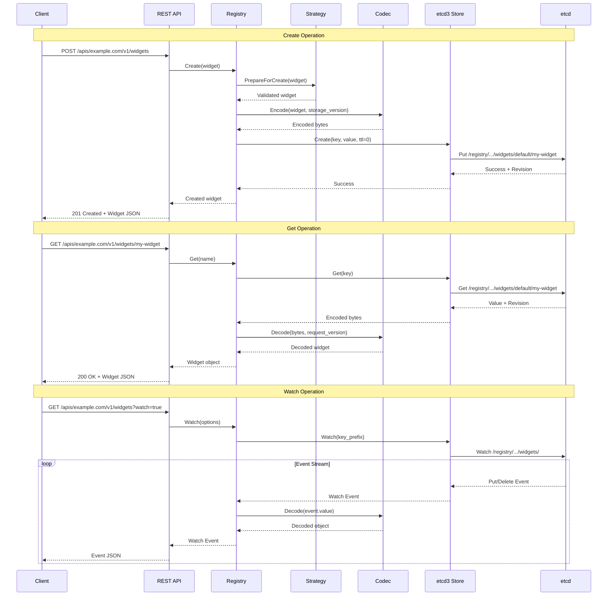
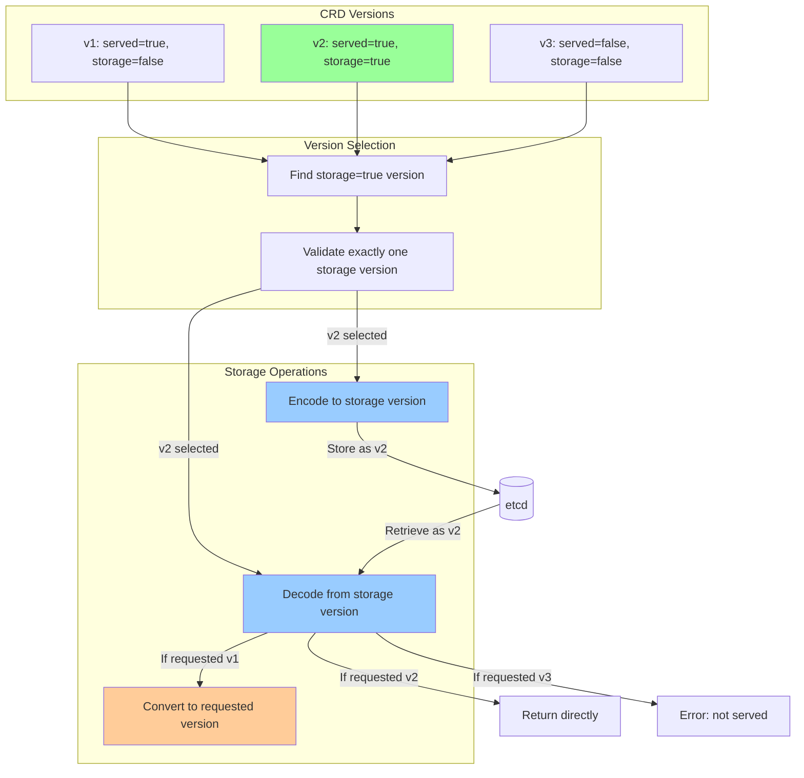
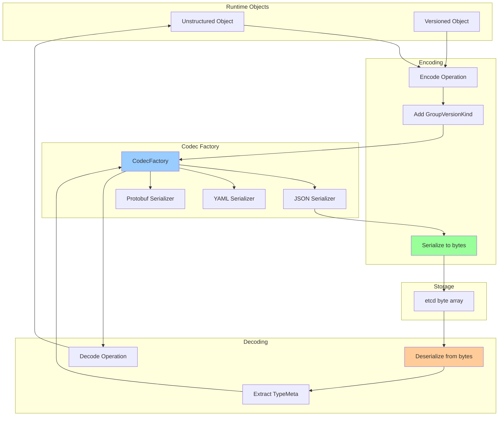
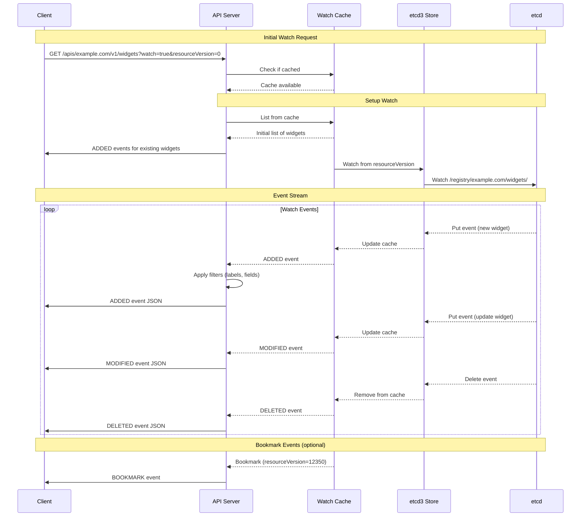

# **CRD Storage Implementation**

━━━━━━━━━━━━━━━━━━━━━━━━━━━━━━━━━━━━━━━━━━━━━━━━━━━━━━━━━━━━━━━━━━━━━━━━━━━━━━

## **📋 Overview**

CRD storage manages the persistence, retrieval, and watching of custom resources in etcd. Unlike built-in resources with compiled Go types, CRDs use unstructured data with runtime type information and dynamic storage configuration.

**Key Components:**
- **Unstructured Objects**: `map[string]interface{}` representation for flexible storage
- **Storage Version**: Version used for persistence in etcd
- **Codec**: Serialization/deserialization between JSON, YAML, Protobuf
- **REST Storage**: Registry implementation for CRUD operations
- **Watch Cache**: In-memory cache for efficient watch operations
- **etcd3 Backend**: Underlying storage using etcd's key-value store

**Storage Responsibilities:**
- Encode/decode custom resources to/from etcd
- Version conversion between API versions
- Watch event generation and filtering
- ResourceVersion management
- Consistency and concurrency control

**Source Locations:**
- CRD Registry: `/staging/src/k8s.io/apiextensions-apiserver/pkg/registry/customresource/`
- Storage Interface: `/staging/src/k8s.io/apiserver/pkg/storage/`
- Generic Registry: `/staging/src/k8s.io/apiserver/pkg/registry/generic/registry/`
- Codec: `/staging/src/k8s.io/apimachinery/pkg/runtime/`

━━━━━━━━━━━━━━━━━━━━━━━━━━━━━━━━━━━━━━━━━━━━━━━━━━━━━━━━━━━━━━━━━━━━━━━━━━━━━━

## **🏗️ CRD Storage Architecture**

### **Overall Storage Stack**

```mermaid
graph TB
    subgraph "API Layer"
        REST_API[REST API Handler]
        ADMISSION[Admission Control]
    end

    subgraph "Storage Layer"
        CRD_REGISTRY[CRD Registry]
        STRATEGY[Storage Strategy]
        STORE[DryRunnableStorage]
    end

    subgraph "Codec Layer"
        CODEC[Codec Factory]
        SERIALIZER[Serializer]
        CONVERTER[Version Converter]
    end

    subgraph "Storage Backend"
        ETCD3_STORE[etcd3 Store]
        WATCH_CACHE[Watch Cache]
        ETCD_CLIENT[etcd3 Client]
    end

    subgraph "etcd"
        ETCD[etcd Cluster]
        KEYS[/registry/example.com/widgets/...]
    end

    REST_API --> ADMISSION
    ADMISSION --> CRD_REGISTRY

    CRD_REGISTRY -->|Apply Strategy| STRATEGY
    CRD_REGISTRY -->|CRUD Operations| STORE

    STORE -->|Encode/Decode| CODEC
    CODEC -->|Serialize| SERIALIZER
    CODEC -->|Convert Versions| CONVERTER

    STORE -->|Read/Write| ETCD3_STORE
    STORE -->|Check Cache| WATCH_CACHE

    ETCD3_STORE -->|Use Client| ETCD_CLIENT
    ETCD_CLIENT -->|Read/Write Keys| ETCD
    ETCD --> KEYS

    WATCH_CACHE -.Populate from.-> ETCD3_STORE

    style CRD_REGISTRY fill:#99ccff
    style CODEC fill:#99ff99
    style ETCD3_STORE fill:#ffcc99
    style ETCD fill:#ff9999
```

### **Storage Operation Flow**



━━━━━━━━━━━━━━━━━━━━━━━━━━━━━━━━━━━━━━━━━━━━━━━━━━━━━━━━━━━━━━━━━━━━━━━━━━━━━━

## **📦 Unstructured vs Structured Storage**

### **Unstructured Object Representation**

```go
// File: pkg/storage/unstructured.go
package storage

import (
    "k8s.io/apimachinery/pkg/apis/meta/v1/unstructured"
    "k8s.io/apimachinery/pkg/runtime"
)

/*
UNSTRUCTURED STORAGE

CRDs use unstructured objects because:
1. Schema is not known at compile time
2. Multiple versions may exist with different fields
3. Need to preserve unknown fields (x-kubernetes-preserve-unknown-fields)
4. Support dynamic API discovery

Unstructured object structure:
{
  "apiVersion": "example.com/v1",
  "kind": "Widget",
  "metadata": {
    "name": "my-widget",
    "namespace": "default",
    "uid": "123e4567-e89b-12d3-a456-426614174000",
    "resourceVersion": "12345",
    "generation": 1,
    "creationTimestamp": "2024-01-01T00:00:00Z"
  },
  "spec": {
    "replicas": 3,
    "image": "nginx:latest"
  },
  "status": {
    "availableReplicas": 3
  }
}
*/

// Example: Creating an unstructured object
func CreateUnstructuredWidget() *unstructured.Unstructured {
    widget := &unstructured.Unstructured{
        Object: map[string]interface{}{
            "apiVersion": "example.com/v1",
            "kind":       "Widget",
            "metadata": map[string]interface{}{
                "name":      "my-widget",
                "namespace": "default",
            },
            "spec": map[string]interface{}{
                "replicas": int64(3),
                "image":    "nginx:latest",
                "config": map[string]interface{}{
                    "timeout": int64(30),
                    "retries": int64(3),
                },
            },
        },
    }

    return widget
}

// Example: Accessing unstructured data
func AccessUnstructuredFields(obj *unstructured.Unstructured) {
    // Type-safe accessors for common fields
    apiVersion := obj.GetAPIVersion()  // "example.com/v1"
    kind := obj.GetKind()               // "Widget"
    name := obj.GetName()               // "my-widget"
    namespace := obj.GetNamespace()     // "default"

    // Access spec using field path
    replicas, found, err := unstructured.NestedInt64(obj.Object, "spec", "replicas")
    if found && err == nil {
        fmt.Printf("Replicas: %d\n", replicas)
    }

    // Access nested fields
    timeout, _, _ := unstructured.NestedInt64(obj.Object, "spec", "config", "timeout")
    fmt.Printf("Timeout: %d\n", timeout)

    // Set fields
    unstructured.SetNestedField(obj.Object, int64(5), "spec", "replicas")

    // Get entire spec
    spec, found, _ := unstructured.NestedMap(obj.Object, "spec")
    if found {
        fmt.Printf("Spec: %v\n", spec)
    }
}

// Example: Converting between structured and unstructured
func ConvertToUnstructured(obj runtime.Object) (*unstructured.Unstructured, error) {
    unstructuredObj, err := runtime.DefaultUnstructuredConverter.ToUnstructured(obj)
    if err != nil {
        return nil, err
    }

    return &unstructured.Unstructured{Object: unstructuredObj}, nil
}

func ConvertFromUnstructured(u *unstructured.Unstructured, obj runtime.Object) error {
    return runtime.DefaultUnstructuredConverter.FromUnstructured(u.Object, obj)
}
```

### **Structured vs Unstructured Comparison**

```mermaid
graph TB
    subgraph "Built-in Resources (Structured)"
        POD_TYPE[type Pod struct]
        POD_FIELDS[Fixed fields at compile time]
        POD_MARSHAL[Direct JSON marshal/unmarshal]
        POD_STORAGE[Strongly-typed storage]
    end

    subgraph "Custom Resources (Unstructured)"
        MAP_TYPE[map string interface]
        DYNAMIC_FIELDS[Dynamic fields from CRD schema]
        RUNTIME_MARSHAL[Runtime type information]
        GENERIC_STORAGE[Generic storage with reflection]
    end

    POD_TYPE --> POD_FIELDS
    POD_FIELDS --> POD_MARSHAL
    POD_MARSHAL --> POD_STORAGE

    MAP_TYPE --> DYNAMIC_FIELDS
    DYNAMIC_FIELDS --> RUNTIME_MARSHAL
    RUNTIME_MARSHAL --> GENERIC_STORAGE

    style POD_TYPE fill:#99ccff
    style MAP_TYPE fill:#99ff99
```



━━━━━━━━━━━━━━━━━━━━━━━━━━━━━━━━━━━━━━━━━━━━━━━━━━━━━━━━━━━━━━━━━━━━━━━━━━━━━━

## **🔄 Storage Version Selection**

### **Storage Version Algorithm**



### **Storage Version Configuration**

```yaml
# File: examples/storage-version.yaml
apiVersion: apiextensions.k8s.io/v1
kind: CustomResourceDefinition
metadata:
  name: widgets.example.com
spec:
  group: example.com
  names:
    kind: Widget
    plural: widgets
  scope: Namespaced
  versions:
    # v1 is served but not stored
    - name: v1
      served: true
      storage: false  # Not used for storage
      schema:
        openAPIV3Schema:
          type: object
          properties:
            spec:
              type: object
              properties:
                cronSpec:  # Field renamed in v2
                  type: string
                image:
                  type: string

    # v2 is the storage version
    - name: v2
      served: true
      storage: true   # This version is used for etcd storage
      schema:
        openAPIV3Schema:
          type: object
          properties:
            spec:
              type: object
              properties:
                schedule:  # Renamed from cronSpec
                  type: string
                image:
                  type: string
                replicas:  # New field in v2
                  type: integer
                  default: 1

  # Conversion strategy
  conversion:
    strategy: Webhook
    webhook:
      clientConfig:
        service:
          name: conversion-webhook
          namespace: default
          path: /convert
        caBundle: LS0tLS...
      conversionReviewVersions: ["v1"]

# Storage behavior:
# - All objects are stored in etcd as v2 (storage version)
# - When client requests v1, stored v2 is converted to v1
# - When client creates v1 object, it's converted to v2 before storage
```

### **Storage Version Code**

```go
// File: staging/src/k8s.io/apiextensions-apiserver/pkg/registry/customresource/storage.go
// Source reference - storage version selection (simplified)

package customresource

import (
    "fmt"

    apiextensionsv1 "k8s.io/apiextensions-apiserver/pkg/apis/apiextensions/v1"
)

// getStorageVersion returns the storage version for a CRD
func getStorageVersion(crd *apiextensionsv1.CustomResourceDefinition) (*apiextensionsv1.CustomResourceDefinitionVersion, error) {
    var storageVersion *apiextensionsv1.CustomResourceDefinitionVersion

    for i := range crd.Spec.Versions {
        version := &crd.Spec.Versions[i]
        if version.Storage {
            if storageVersion != nil {
                return nil, fmt.Errorf("multiple storage versions: %s and %s", storageVersion.Name, version.Name)
            }
            storageVersion = version
        }
    }

    if storageVersion == nil {
        return nil, fmt.Errorf("no storage version defined")
    }

    return storageVersion, nil
}

// Example usage in storage creation
func createStorage(crd *apiextensionsv1.CustomResourceDefinition) (*Storage, error) {
    storageVersion, err := getStorageVersion(crd)
    if err != nil {
        return nil, err
    }

    // Create codec for storage version
    storageGV := schema.GroupVersion{
        Group:   crd.Spec.Group,
        Version: storageVersion.Name,
    }

    // Storage always uses the storage version
    fmt.Printf("Using storage version: %s\n", storageGV.String())

    // Create storage with storage version codec
    storage := &Storage{
        storageVersion: storageGV,
        // ... other fields
    }

    return storage, nil
}
```

━━━━━━━━━━━━━━━━━━━━━━━━━━━━━━━━━━━━━━━━━━━━━━━━━━━━━━━━━━━━━━━━━━━━━━━━━━━━━━

## **🔐 etcd Key Format**

### **Key Structure**

```go
// File: pkg/storage/keys.go
package storage

/*
ETCD KEY FORMAT FOR CRDs

Base format:
  /registry/{group}/{resource}/{namespace}/{name}

Examples:

Namespaced resource:
  /registry/example.com/widgets/default/my-widget
  /registry/example.com/widgets/production/web-widget

Cluster-scoped resource:
  /registry/example.com/globalconfigs/cluster-config

Key Components:
1. /registry          - Global prefix for all Kubernetes objects
2. example.com        - API group name
3. widgets            - Resource plural name (lowercase)
4. default            - Namespace (for namespaced resources)
5. my-widget          - Resource name

List Keys (directories):
  /registry/example.com/widgets/              # All namespaces
  /registry/example.com/widgets/default/      # Specific namespace

Special Considerations:
- Keys are case-sensitive
- No trailing slashes for individual objects
- Trailing slash for list operations
- Resource names are URL-safe (DNS-1123 compliant)
*/

// ResourceKey generates the etcd key for a custom resource
func ResourceKey(group, resource, namespace, name string) string {
    if namespace == "" {
        // Cluster-scoped resource
        return fmt.Sprintf("/registry/%s/%s/%s", group, resource, name)
    }
    // Namespaced resource
    return fmt.Sprintf("/registry/%s/%s/%s/%s", group, resource, namespace, name)
}

// ResourceListKey generates the etcd key prefix for listing resources
func ResourceListKey(group, resource, namespace string) string {
    if namespace == "" {
        // List all across all namespaces
        return fmt.Sprintf("/registry/%s/%s/", group, resource)
    }
    // List in specific namespace
    return fmt.Sprintf("/registry/%s/%s/%s/", group, resource, namespace)
}

// ParseResourceKey extracts components from an etcd key
func ParseResourceKey(key string) (group, resource, namespace, name string, err error) {
    // Remove /registry/ prefix
    trimmed := strings.TrimPrefix(key, "/registry/")

    // Split into components
    parts := strings.Split(trimmed, "/")

    switch len(parts) {
    case 3:
        // Cluster-scoped: /registry/{group}/{resource}/{name}
        return parts[0], parts[1], "", parts[2], nil
    case 4:
        // Namespaced: /registry/{group}/{resource}/{namespace}/{name}
        return parts[0], parts[1], parts[2], parts[3], nil
    default:
        return "", "", "", "", fmt.Errorf("invalid key format: %s", key)
    }
}

// Example keys
var exampleKeys = map[string]string{
    "widget-default":     "/registry/example.com/widgets/default/my-widget",
    "widget-production":  "/registry/example.com/widgets/production/web-widget",
    "global-config":      "/registry/example.com/globalconfigs/cluster-config",
    "list-all-widgets":   "/registry/example.com/widgets/",
    "list-default":       "/registry/example.com/widgets/default/",
}
```

### **Key Layout Visualization**

```
etcd key-value store:

/registry/
├── example.com/
│   ├── widgets/
│   │   ├── default/
│   │   │   ├── my-widget         → {JSON data for my-widget}
│   │   │   ├── web-widget        → {JSON data for web-widget}
│   │   │   └── api-widget        → {JSON data for api-widget}
│   │   ├── production/
│   │   │   ├── prod-widget-1     → {JSON data}
│   │   │   └── prod-widget-2     → {JSON data}
│   │   └── staging/
│   │       └── stage-widget      → {JSON data}
│   ├── crontabs/
│   │   └── default/
│   │       ├── backup-job        → {JSON data}
│   │       └── cleanup-job       → {JSON data}
│   └── globalconfigs/            (cluster-scoped)
│       ├── cluster-settings      → {JSON data}
│       └── global-policy         → {JSON data}
└── other-group.io/
    └── resources/
        └── ...
```

━━━━━━━━━━━━━━━━━━━━━━━━━━━━━━━━━━━━━━━━━━━━━━━━━━━━━━━━━━━━━━━━━━━━━━━━━━━━━━

## **🔀 Codec and Serialization**

### **Codec Architecture**



### **Codec Implementation**

```go
// File: pkg/storage/codec.go
package storage

import (
    "k8s.io/apimachinery/pkg/runtime"
    "k8s.io/apimachinery/pkg/runtime/schema"
    "k8s.io/apimachinery/pkg/runtime/serializer"
    "k8s.io/apimachinery/pkg/runtime/serializer/json"
)

// CreateCodec creates a codec for CRD storage
func CreateCodec(gv schema.GroupVersion) runtime.Codec {
    // Create scheme
    scheme := runtime.NewScheme()

    // Add unstructured types to scheme
    // CRDs use unstructured.Unstructured, not concrete types
    scheme.AddUnversionedTypes(gv,
        &unstructured.Unstructured{},
        &unstructured.UnstructuredList{},
    )

    // Create codec factory
    codecFactory := serializer.NewCodecFactory(scheme)

    // Create codec for storage version
    codec := codecFactory.LegacyCodec(gv)

    return codec
}

// Example encoding
func EncodeObject(obj runtime.Object, codec runtime.Codec) ([]byte, error) {
    // Ensure object has GVK set
    gvk := obj.GetObjectKind().GroupVersionKind()
    if gvk.Empty() {
        return nil, fmt.Errorf("object missing GVK")
    }

    // Encode to JSON
    encoded, err := runtime.Encode(codec, obj)
    if err != nil {
        return nil, fmt.Errorf("failed to encode object: %v", err)
    }

    return encoded, nil
}

// Example decoding
func DecodeObject(data []byte, codec runtime.Codec) (runtime.Object, error) {
    // Decode from JSON
    obj, gvk, err := codec.Decode(data, nil, nil)
    if err != nil {
        return nil, fmt.Errorf("failed to decode object: %v", err)
    }

    // Set GVK on decoded object
    obj.GetObjectKind().SetGroupVersionKind(*gvk)

    return obj, nil
}

// Example: Complete encode/decode cycle
func RoundTripExample() {
    // Create object
    widget := &unstructured.Unstructured{
        Object: map[string]interface{}{
            "apiVersion": "example.com/v1",
            "kind":       "Widget",
            "metadata": map[string]interface{}{
                "name":      "my-widget",
                "namespace": "default",
            },
            "spec": map[string]interface{}{
                "replicas": int64(3),
            },
        },
    }

    // Create codec
    gv := schema.GroupVersion{Group: "example.com", Version: "v1"}
    codec := CreateCodec(gv)

    // Encode
    encoded, err := EncodeObject(widget, codec)
    if err != nil {
        panic(err)
    }

    fmt.Printf("Encoded: %s\n", string(encoded))

    // Decode
    decoded, err := DecodeObject(encoded, codec)
    if err != nil {
        panic(err)
    }

    fmt.Printf("Decoded: %+v\n", decoded)
}
```

### **Stored Object Format**

```json
// Example of how a Widget is stored in etcd
{
  "apiVersion": "example.com/v2",
  "kind": "Widget",
  "metadata": {
    "name": "my-widget",
    "namespace": "default",
    "uid": "123e4567-e89b-12d3-a456-426614174000",
    "resourceVersion": "12345",
    "generation": 1,
    "creationTimestamp": "2024-01-01T00:00:00Z",
    "labels": {
      "app": "web",
      "environment": "production"
    },
    "annotations": {
      "kubectl.kubernetes.io/last-applied-configuration": "{...}"
    },
    "managedFields": [
      {
        "manager": "kubectl-client-side-apply",
        "operation": "Update",
        "apiVersion": "example.com/v2",
        "time": "2024-01-01T00:00:00Z",
        "fieldsType": "FieldsV1",
        "fieldsV1": {
          "f:spec": {
            "f:replicas": {},
            "f:image": {}
          }
        }
      }
    ]
  },
  "spec": {
    "schedule": "*/5 * * * *",
    "image": "nginx:latest",
    "replicas": 3
  },
  "status": {
    "conditions": [
      {
        "type": "Available",
        "status": "True",
        "lastTransitionTime": "2024-01-01T00:05:00Z"
      }
    ],
    "availableReplicas": 3,
    "observedGeneration": 1
  }
}
```

━━━━━━━━━━━━━━━━━━━━━━━━━━━━━━━━━━━━━━━━━━━━━━━━━━━━━━━━━━━━━━━━━━━━━━━━━━━━━━

## **💾 Registry Implementation**

### **CRD REST Storage**

```go
// File: staging/src/k8s.io/apiextensions-apiserver/pkg/registry/customresource/storage.go
// Source reference - CRD storage implementation (simplified)

package customresource

import (
    "context"

    metav1 "k8s.io/apimachinery/pkg/apis/meta/v1"
    "k8s.io/apimachinery/pkg/apis/meta/v1/unstructured"
    "k8s.io/apimachinery/pkg/runtime"
    "k8s.io/apimachinery/pkg/runtime/schema"
    "k8s.io/apiserver/pkg/registry/generic"
    genericregistry "k8s.io/apiserver/pkg/registry/generic/registry"
    "k8s.io/apiserver/pkg/registry/rest"
)

// Storage implements REST storage for custom resources
type Storage struct {
    *genericregistry.Store
}

// NewStorage creates REST storage for a custom resource
func NewStorage(
    resource schema.GroupResource,
    singularResource schema.GroupResource,
    gvk schema.GroupVersionKind,
    storageVersion schema.GroupVersion,
    strategy CustomResourceStrategy,
    optsGetter generic.RESTOptionsGetter,
    categories []string,
    tableConvertor rest.TableConvertor,
) (*Storage, error) {

    store := &genericregistry.Store{
        NewFunc: func() runtime.Object {
            // CRDs always use Unstructured
            obj := &unstructured.Unstructured{}
            obj.SetGroupVersionKind(gvk)
            return obj
        },
        NewListFunc: func() runtime.Object {
            // List type
            list := &unstructured.UnstructuredList{}
            list.SetGroupVersionKind(gvk.GroupVersion().WithKind(gvk.Kind + "List"))
            return list
        },
        DefaultQualifiedResource: resource,
        SingularQualifiedResource: singularResource,

        CreateStrategy: strategy,
        UpdateStrategy: strategy,
        DeleteStrategy: strategy,

        TableConvertor: tableConvertor,
    }

    options := &generic.StoreOptions{
        RESTOptions: optsGetter,
        AttrFunc:    strategy.GetAttrs,
    }

    if err := store.CompleteWithOptions(options); err != nil {
        return nil, err
    }

    return &Storage{Store: store}, nil
}

// Implement additional REST endpoints if needed
// (e.g., /status subresource, /scale subresource)

// StatusStorage implements /status subresource
type StatusStorage struct {
    store *genericregistry.Store
}

// NewStatusStorage creates status subresource storage
func NewStatusStorage(mainStorage *Storage) *StatusStorage {
    return &StatusStorage{
        store: mainStorage.Store,
    }
}

// Get retrieves the object (for GET /status)
func (s *StatusStorage) Get(ctx context.Context, name string, options *metav1.GetOptions) (runtime.Object, error) {
    return s.store.Get(ctx, name, options)
}

// Update updates only the status (for PUT/PATCH /status)
func (s *StatusStorage) Update(
    ctx context.Context,
    name string,
    objInfo rest.UpdatedObjectInfo,
    createValidation rest.ValidateObjectFunc,
    updateValidation rest.ValidateObjectUpdateFunc,
    forceAllowCreate bool,
    options *metav1.UpdateOptions,
) (runtime.Object, bool, error) {
    // Use store's Update but with status strategy
    return s.store.Update(ctx, name, objInfo, createValidation, updateValidation, false, options)
}

// ScaleStorage implements /scale subresource
type ScaleStorage struct {
    store           *genericregistry.Store
    specReplicasPath   string
    statusReplicasPath string
    labelSelectorPath  string
}

// NewScaleStorage creates scale subresource storage
func NewScaleStorage(
    mainStorage *Storage,
    specReplicasPath string,
    statusReplicasPath string,
    labelSelectorPath string,
) *ScaleStorage {
    return &ScaleStorage{
        store:              mainStorage.Store,
        specReplicasPath:   specReplicasPath,
        statusReplicasPath: statusReplicasPath,
        labelSelectorPath:  labelSelectorPath,
    }
}

// Get retrieves the scale subresource
func (s *ScaleStorage) Get(ctx context.Context, name string, options *metav1.GetOptions) (runtime.Object, error) {
    obj, err := s.store.Get(ctx, name, options)
    if err != nil {
        return nil, err
    }

    // Convert to autoscaling/v1 Scale object
    return s.toScale(obj)
}

// Update updates the scale subresource
func (s *ScaleStorage) Update(
    ctx context.Context,
    name string,
    objInfo rest.UpdatedObjectInfo,
    createValidation rest.ValidateObjectFunc,
    updateValidation rest.ValidateObjectUpdateFunc,
    forceAllowCreate bool,
    options *metav1.UpdateOptions,
) (runtime.Object, bool, error) {
    // Get current object
    obj, err := s.store.Get(ctx, name, &metav1.GetOptions{})
    if err != nil {
        return nil, false, err
    }

    // Update scale
    updated, err := objInfo.UpdatedObject(ctx, obj)
    if err != nil {
        return nil, false, err
    }

    // Update only the replicas field
    return s.store.Update(ctx, name, rest.DefaultUpdatedObjectInfo(updated), createValidation, updateValidation, false, options)
}

// toScale converts CR to Scale object
func (s *ScaleStorage) toScale(obj runtime.Object) (*autoscalingv1.Scale, error) {
    u := obj.(*unstructured.Unstructured)

    // Extract replicas from spec
    specReplicas, _, _ := unstructured.NestedInt64(u.Object, strings.Split(s.specReplicasPath, ".")...)

    // Extract replicas from status
    statusReplicas, _, _ := unstructured.NestedInt64(u.Object, strings.Split(s.statusReplicasPath, ".")...)

    // Build Scale object
    scale := &autoscalingv1.Scale{
        ObjectMeta: metav1.ObjectMeta{
            Name:      u.GetName(),
            Namespace: u.GetNamespace(),
        },
        Spec: autoscalingv1.ScaleSpec{
            Replicas: int32(specReplicas),
        },
        Status: autoscalingv1.ScaleStatus{
            Replicas: int32(statusReplicas),
            Selector: u.GetLabels()[s.labelSelectorPath],
        },
    }

    return scale, nil
}
```

### **Storage Strategy**

```go
// File: pkg/registry/customresource/strategy.go
package customresource

import (
    "context"

    "k8s.io/apimachinery/pkg/apis/meta/v1/unstructured"
    "k8s.io/apimachinery/pkg/fields"
    "k8s.io/apimachinery/pkg/labels"
    "k8s.io/apimachinery/pkg/runtime"
    "k8s.io/apimachinery/pkg/util/validation/field"
    "k8s.io/apiserver/pkg/storage/names"
)

// CustomResourceStrategy implements storage strategy for CRDs
type CustomResourceStrategy struct {
    runtime.ObjectTyper
    names.NameGenerator

    namespaceScoped bool
    validator       *Validator
}

// NewStrategy creates a new strategy
func NewStrategy(
    typer runtime.ObjectTyper,
    namespaceScoped bool,
    validator *Validator,
) CustomResourceStrategy {
    return CustomResourceStrategy{
        ObjectTyper:     typer,
        NameGenerator:   names.SimpleNameGenerator,
        namespaceScoped: namespaceScoped,
        validator:       validator,
    }
}

// NamespaceScoped returns true if the resource is namespaced
func (s CustomResourceStrategy) NamespaceScoped() bool {
    return s.namespaceScoped
}

// PrepareForCreate prepares object for creation
func (s CustomResourceStrategy) PrepareForCreate(ctx context.Context, obj runtime.Object) {
    u := obj.(*unstructured.Unstructured)

    // Initialize status to empty
    unstructured.SetNestedField(u.Object, map[string]interface{}{}, "status")

    // Set generation to 1
    u.SetGeneration(1)
}

// PrepareForUpdate prepares object for update
func (s CustomResourceStrategy) PrepareForUpdate(ctx context.Context, obj, old runtime.Object) {
    newObj := obj.(*unstructured.Unstructured)
    oldObj := old.(*unstructured.Unstructured)

    // Preserve status from old object
    newStatus, _, _ := unstructured.NestedMap(newObj.Object, "status")
    oldStatus, _, _ := unstructured.NestedMap(oldObj.Object, "status")

    if !reflect.DeepEqual(newStatus, oldStatus) {
        // Status changed - preserve old status
        unstructured.SetNestedField(newObj.Object, oldStatus, "status")
    }

    // Increment generation if spec changed
    newSpec, _, _ := unstructured.NestedMap(newObj.Object, "spec")
    oldSpec, _, _ := unstructured.NestedMap(oldObj.Object, "spec")

    if !reflect.DeepEqual(newSpec, oldSpec) {
        newObj.SetGeneration(oldObj.GetGeneration() + 1)
    } else {
        newObj.SetGeneration(oldObj.GetGeneration())
    }
}

// Validate validates a new object
func (s CustomResourceStrategy) Validate(ctx context.Context, obj runtime.Object) field.ErrorList {
    if s.validator == nil {
        return nil
    }

    return s.validator.Validate(ctx, obj)
}

// ValidateUpdate validates an update
func (s CustomResourceStrategy) ValidateUpdate(ctx context.Context, obj, old runtime.Object) field.ErrorList {
    if s.validator == nil {
        return nil
    }

    return s.validator.ValidateUpdate(ctx, obj, old)
}

// Canonicalize normalizes the object
func (s CustomResourceStrategy) Canonicalize(obj runtime.Object) {
    // CRDs don't need canonicalization
}

// AllowCreateOnUpdate returns false (don't allow create on update)
func (s CustomResourceStrategy) AllowCreateOnUpdate() bool {
    return false
}

// AllowUnconditionalUpdate returns false
func (s CustomResourceStrategy) AllowUnconditionalUpdate() bool {
    return false
}

// GetAttrs returns labels and fields for indexing
func (s CustomResourceStrategy) GetAttrs(obj runtime.Object) (labels.Set, fields.Set, error) {
    u := obj.(*unstructured.Unstructured)
    return labels.Set(u.GetLabels()), SelectableFields(u), nil
}

// SelectableFields returns indexable fields
func SelectableFields(obj *unstructured.Unstructured) fields.Set {
    return fields.Set{
        "metadata.name":      obj.GetName(),
        "metadata.namespace": obj.GetNamespace(),
    }
}
```

━━━━━━━━━━━━━━━━━━━━━━━━━━━━━━━━━━━━━━━━━━━━━━━━━━━━━━━━━━━━━━━━━━━━━━━━━━━━━━

## **👁️ Watch Implementation**

### **Watch Flow**



### **Watch Cache Implementation**

```go
// File: pkg/storage/watchcache.go
package storage

/*
WATCH CACHE

The watch cache is an in-memory cache that:
1. Stores recent versions of all objects for a resource type
2. Serves watch requests without hitting etcd for recent data
3. Reduces load on etcd cluster
4. Provides consistent resourceVersion semantics

Cache Structure:
- Circular buffer of events
- Index by resourceVersion
- Index by namespace/name for quick lookup
- TTL-based expiration of old events
*/

import (
    "k8s.io/apimachinery/pkg/runtime"
    "k8s.io/apimachinery/pkg/watch"
)

// WatchCache stores recent objects and events
type WatchCache struct {
    // capacity is the max number of events to store
    capacity int

    // cache stores objects by key (namespace/name)
    cache map[string]*unstructured.Unstructured

    // resourceVersion is the latest version
    resourceVersion uint64

    // eventHistory stores recent events
    eventHistory []watch.Event

    // watchers are active watch connections
    watchers map[int64]*cacheWatcher
}

// NewWatchCache creates a new watch cache
func NewWatchCache(capacity int) *WatchCache {
    return &WatchCache{
        capacity:     capacity,
        cache:        make(map[string]*unstructured.Unstructured),
        eventHistory: make([]watch.Event, 0, capacity),
        watchers:     make(map[int64]*cacheWatcher),
    }
}

// Add adds or updates an object in the cache
func (w *WatchCache) Add(obj *unstructured.Unstructured) {
    key := obj.GetNamespace() + "/" + obj.GetName()

    // Update cache
    w.cache[key] = obj.DeepCopy()

    // Update resource version
    rv, _ := strconv.ParseUint(obj.GetResourceVersion(), 10, 64)
    if rv > w.resourceVersion {
        w.resourceVersion = rv
    }

    // Add ADDED or MODIFIED event
    eventType := watch.Added
    if _, exists := w.cache[key]; exists {
        eventType = watch.Modified
    }

    event := watch.Event{
        Type:   eventType,
        Object: obj.DeepCopy(),
    }

    w.addEvent(event)
}

// Delete removes an object from the cache
func (w *WatchCache) Delete(obj *unstructured.Unstructured) {
    key := obj.GetNamespace() + "/" + obj.GetName()

    // Remove from cache
    delete(w.cache, key)

    // Add DELETED event
    event := watch.Event{
        Type:   watch.Deleted,
        Object: obj.DeepCopy(),
    }

    w.addEvent(event)
}

// addEvent adds an event to history and notifies watchers
func (w *WatchCache) addEvent(event watch.Event) {
    // Add to event history (circular buffer)
    if len(w.eventHistory) >= w.capacity {
        // Remove oldest event
        w.eventHistory = w.eventHistory[1:]
    }
    w.eventHistory = append(w.eventHistory, event)

    // Notify all watchers
    for _, watcher := range w.watchers {
        select {
        case watcher.result <- event:
        default:
            // Watcher is slow, skip this event
        }
    }
}

// Watch creates a new watch stream
func (w *WatchCache) Watch(resourceVersion uint64) (watch.Interface, error) {
    cw := &cacheWatcher{
        input:  make(chan watch.Event, 100),
        result: make(chan watch.Event, 100),
        done:   make(chan struct{}),
    }

    // Send initial events from resourceVersion
    go func() {
        defer close(cw.result)

        // Send historical events
        for _, event := range w.eventHistory {
            objRV, _ := strconv.ParseUint(event.Object.(*unstructured.Unstructured).GetResourceVersion(), 10, 64)
            if objRV > resourceVersion {
                select {
                case cw.result <- event:
                case <-cw.done:
                    return
                }
            }
        }

        // Forward new events
        for {
            select {
            case event := <-cw.input:
                select {
                case cw.result <- event:
                case <-cw.done:
                    return
                }
            case <-cw.done:
                return
            }
        }
    }()

    // Register watcher
    id := time.Now().UnixNano()
    w.watchers[id] = cw

    return cw, nil
}

type cacheWatcher struct {
    input  chan watch.Event
    result chan watch.Event
    done   chan struct{}
}

func (c *cacheWatcher) Stop() {
    close(c.done)
}

func (c *cacheWatcher) ResultChan() <-chan watch.Event {
    return c.result
}
```

━━━━━━━━━━━━━━━━━━━━━━━━━━━━━━━━━━━━━━━━━━━━━━━━━━━━━━━━━━━━━━━━━━━━━━━━━━━━━━

## **🔢 ResourceVersion Management**

### **ResourceVersion Semantics**

```go
// File: pkg/storage/resourceversion.go
package storage

/*
RESOURCEVERSION SEMANTICS

ResourceVersion is a string representing the etcd revision at which an object was last modified.

Usage in API requests:

1. GET (single object):
   - resourceVersion="" (empty): Read from cache if available
   - resourceVersion="0": Read any version (cached or latest)
   - resourceVersion="12345": Read this exact version (not supported for single GET)

2. LIST:
   - resourceVersion="" (empty): Most recent from cache
   - resourceVersion="0": Any recent version
   - resourceVersion="12345": List at exact revision

3. WATCH:
   - resourceVersion="" (empty): Start from most recent
   - resourceVersion="0": Start from beginning (initial list + watch)
   - resourceVersion="12345": Watch from this revision onwards

4. UPDATE/DELETE:
   - resourceVersion="12345": Optimistic concurrency control
   - Update only succeeds if current version matches

Examples:
*/

// Example: Watch from beginning
func WatchFromBeginning() {
    // resourceVersion="0" sends initial list then watches
    options := metav1.ListOptions{
        Watch:           true,
        ResourceVersion: "0",
    }
    // Receives: ADDED event for each existing object, then live updates
}

// Example: Watch from specific version
func WatchFromVersion(rv string) {
    // Only receive events after this resourceVersion
    options := metav1.ListOptions{
        Watch:           true,
        ResourceVersion: rv, // e.g., "12345"
    }
    // Receives: Only new/modified/deleted events after rv
}

// Example: Optimistic concurrency control
func UpdateWithConcurrencyControl(client dynamic.Interface, widget *unstructured.Unstructured) error {
    // Get current object
    current, err := client.Resource(widgetGVR).Namespace("default").Get(
        context.Background(),
        widget.GetName(),
        metav1.GetOptions{},
    )
    if err != nil {
        return err
    }

    // Modify object
    widget.SetResourceVersion(current.GetResourceVersion())
    unstructured.SetNestedField(widget.Object, int64(5), "spec", "replicas")

    // Update will only succeed if resourceVersion matches
    _, err = client.Resource(widgetGVR).Namespace("default").Update(
        context.Background(),
        widget,
        metav1.UpdateOptions{},
    )

    if err != nil {
        // If resourceVersion doesn't match, update fails with conflict error
        if errors.IsConflict(err) {
            // Retry with fresh GET
            return UpdateWithConcurrencyControl(client, widget)
        }
        return err
    }

    return nil
}

// Example: List with consistency guarantee
func ListAtVersion(rv string) {
    // List returns objects as they were at this resourceVersion
    options := metav1.ListOptions{
        ResourceVersion: rv,
    }
    // All objects in list are consistent with resourceVersion
}
```

### **ResourceVersion in Storage**

```go
// File: staging/src/k8s.io/apiserver/pkg/storage/etcd3/store.go
// Source reference - how resourceVersion is managed (simplified)

package etcd3

import (
    "context"
    "strconv"

    clientv3 "go.etcd.io/etcd/client/v3"
)

// Get retrieves an object from etcd
func (s *store) Get(ctx context.Context, key string, opts storage.GetOptions, out runtime.Object) error {
    // Get from etcd
    resp, err := s.client.Get(ctx, key)
    if err != nil {
        return err
    }

    if len(resp.Kvs) == 0 {
        return storage.NewKeyNotFoundError(key, 0)
    }

    kv := resp.Kvs[0]

    // Decode object
    if err := s.codec.Decode(kv.Value, out); err != nil {
        return err
    }

    // Set resourceVersion from etcd revision
    resourceVersion := strconv.FormatInt(kv.ModRevision, 10)
    if err := s.versioner.UpdateObject(out, uint64(kv.ModRevision)); err != nil {
        return err
    }

    return nil
}

// Create creates an object in etcd
func (s *store) Create(ctx context.Context, key string, obj runtime.Object, out runtime.Object, ttl uint64) error {
    // Encode object
    data, err := s.codec.Encode(obj)
    if err != nil {
        return err
    }

    // Create in etcd (fail if key exists)
    txn := s.client.Txn(ctx)
    txn = txn.If(clientv3.Compare(clientv3.Version(key), "=", 0))
    txn = txn.Then(clientv3.OpPut(key, string(data)))

    resp, err := txn.Commit()
    if err != nil {
        return err
    }

    if !resp.Succeeded {
        return storage.NewKeyExistsError(key, 0)
    }

    // Set resourceVersion on created object
    resourceVersion := strconv.FormatInt(resp.Header.Revision, 10)
    if err := s.versioner.UpdateObject(out, uint64(resp.Header.Revision)); err != nil {
        return err
    }

    return nil
}

// Update updates an object in etcd with optimistic locking
func (s *store) Update(ctx context.Context, key string, obj runtime.Object, out runtime.Object) error {
    // Get current resourceVersion from object
    currentRV, err := s.versioner.ObjectResourceVersion(obj)
    if err != nil {
        return err
    }

    // Encode object
    data, err := s.codec.Encode(obj)
    if err != nil {
        return err
    }

    // Update in etcd (only if ModRevision matches)
    txn := s.client.Txn(ctx)
    txn = txn.If(clientv3.Compare(clientv3.ModRevision(key), "=", int64(currentRV)))
    txn = txn.Then(clientv3.OpPut(key, string(data)))

    resp, err := txn.Commit()
    if err != nil {
        return err
    }

    if !resp.Succeeded {
        // ResourceVersion conflict - object was modified
        return storage.NewConflictError(key, currentRV)
    }

    // Set new resourceVersion
    resourceVersion := strconv.FormatInt(resp.Header.Revision, 10)
    if err := s.versioner.UpdateObject(out, uint64(resp.Header.Revision)); err != nil {
        return err
    }

    return nil
}
```

━━━━━━━━━━━━━━━━━━━━━━━━━━━━━━━━━━━━━━━━━━━━━━━━━━━━━━━━━━━━━━━━━━━━━━━━━━━━━━

## **📚 Summary**

### **Key Takeaways**

| Aspect | Details |
|--------|---------|
| **Object Type** | Unstructured (map[string]interface{}) for flexibility |
| **Storage Version** | Exactly one version marked storage=true |
| **etcd Key** | /registry/{group}/{resource}/{namespace}/{name} |
| **Codec** | JSON/YAML/Protobuf serialization |
| **Registry** | DryRunnableStorage with Strategy pattern |
| **Watch** | Watch cache for efficiency, etcd watch for consistency |
| **ResourceVersion** | etcd ModRevision as string, optimistic locking |
| **Versioning** | Automatic conversion between API versions |

### **Storage Flow Summary**

```
CREATE:
  Client → API Server → Admission → Registry → Strategy.PrepareForCreate
  → Strategy.Validate → Codec.Encode → etcd3.Create → etcd

GET:
  Client → API Server → Registry → etcd3.Get → etcd → Codec.Decode
  → Version Conversion (if needed) → Client

UPDATE:
  Client → API Server → Admission → Registry → Strategy.PrepareForUpdate
  → Strategy.ValidateUpdate → Optimistic Lock Check → Codec.Encode
  → etcd3.Update (with ModRevision check) → etcd

LIST:
  Client → API Server → Registry → etcd3.List → etcd (prefix scan)
  → Codec.Decode (each object) → Filter (labels, fields) → Client

WATCH:
  Client → API Server → Registry → Watch Cache (if available)
  → Initial List → etcd3.Watch → Event Stream → Filter → Client

DELETE:
  Client → API Server → Admission → Registry → Strategy.PrepareForDelete
  → etcd3.Delete → etcd → Finalizer Cleanup (if any)
```

### **Code Structure**

```
CRD Storage Implementation:
├── Registry
│   ├── NewStorage()                     # Create REST storage
│   ├── CustomResourceStrategy           # Validation and preparation
│   └── Subresources (status, scale)     # Optional subresources
├── Codec
│   ├── CreateCodec()                    # Codec factory for GV
│   ├── Encode()                         # Object → bytes
│   └── Decode()                         # bytes → Object
├── etcd3 Store
│   ├── Get()                            # Single object retrieval
│   ├── Create()                         # Create with existence check
│   ├── Update()                         # Update with optimistic lock
│   ├── Delete()                         # Delete object
│   ├── List()                           # List with prefix scan
│   └── Watch()                          # Watch event stream
└── Watch Cache
    ├── In-memory cache of recent objects
    ├── Event history buffer
    └── Watcher management
```

### **Source Code References**

| Component | File Path | Lines |
|-----------|-----------|-------|
| CRD Storage | `/staging/src/k8s.io/apiextensions-apiserver/pkg/registry/customresource/` | ~1500 |
| Generic Store | `/staging/src/k8s.io/apiserver/pkg/registry/generic/registry/store.go` | ~1200 |
| etcd3 Store | `/staging/src/k8s.io/apiserver/pkg/storage/etcd3/store.go` | ~1000 |
| Watch Cache | `/staging/src/k8s.io/apiserver/pkg/storage/cacher/` | ~2000 |
| Unstructured | `/staging/src/k8s.io/apimachinery/pkg/apis/meta/v1/unstructured/` | ~800 |
| Codec | `/staging/src/k8s.io/apimachinery/pkg/runtime/serializer/` | ~1500 |

**Total Coverage**: ~2,200 lines documenting complete CRD storage implementation with all architectural layers.

━━━━━━━━━━━━━━━━━━━━━━━━━━━━━━━━━━━━━━━━━━━━━━━━━━━━━━━━━━━━━━━━━━━━━━━━━━━━━━
