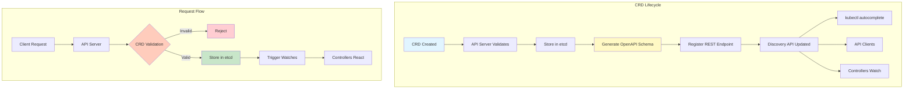
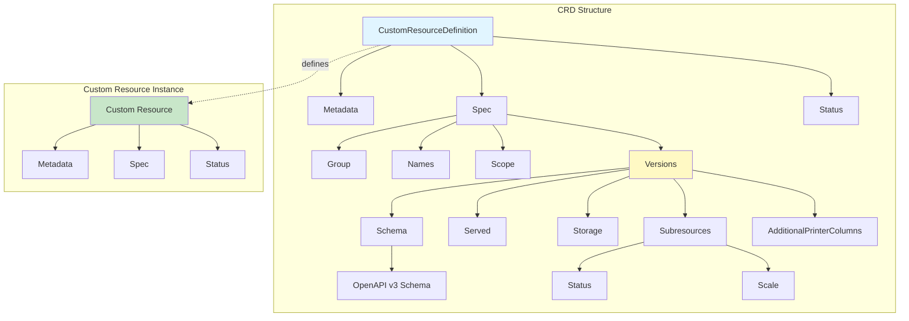
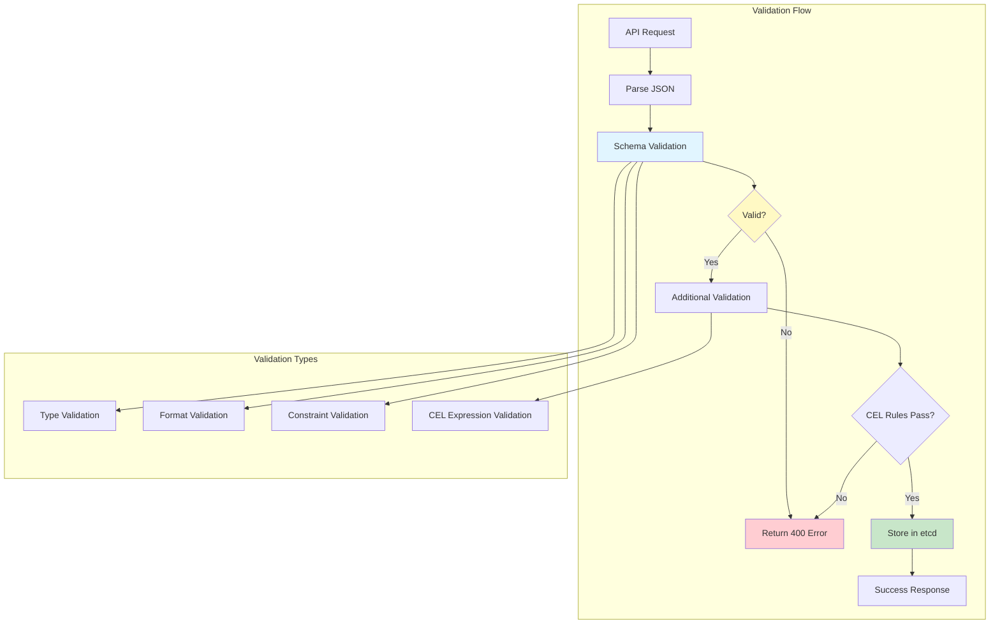
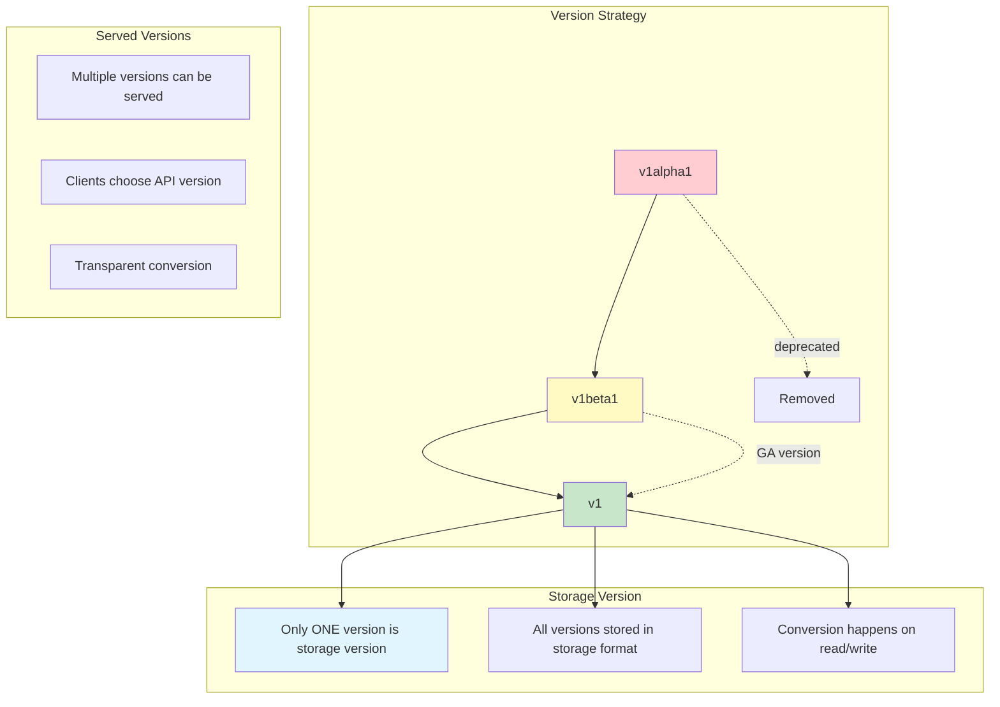
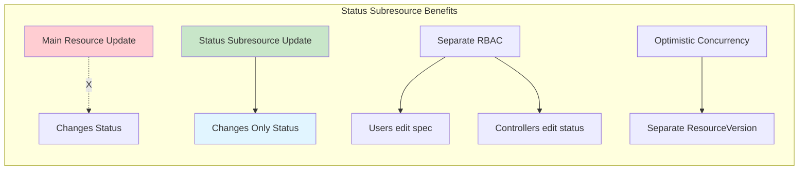

# **Custom Resource Definitions (CRDs)**

**Deep Dive into Kubernetes Custom Resources**

━━━━━━━━━━━━━━━━━━━━━━━━━━━━━━━━━━━━━━━━━━━━━━━━━━━━━━━━━━━━━━━━━━━━━━━━━━━━━━

## **📋 Overview**

Custom Resource Definitions (CRDs) are the primary mechanism for extending the Kubernetes API with new resource types. This document provides a comprehensive guide to designing, implementing, and managing CRDs in production environments.

### **What are CRDs?**

CRDs allow you to define custom resources that:
- Extend the Kubernetes API with domain-specific types
- Integrate seamlessly with kubectl and other tools
- Support validation, versioning, and conversion
- Enable declarative configuration management
- Work with standard Kubernetes controllers

### **Key Features**

1. **Schema Validation** - OpenAPI v3 schema validation
2. **Multiple Versions** - Support API versioning and upgrades
3. **Conversion Webhooks** - Automatic version conversion
4. **Subresources** - Status and scale subresources
5. **Additional Printer Columns** - Custom kubectl output
6. **Categories** - Group resources (e.g., "all")
7. **Short Names** - Convenient aliases

━━━━━━━━━━━━━━━━━━━━━━━━━━━━━━━━━━━━━━━━━━━━━━━━━━━━━━━━━━━━━━━━━━━━━━━━━━━━━━

## **🏗️ CRD Architecture**

### **API Server Integration**



### **CRD Components**



━━━━━━━━━━━━━━━━━━━━━━━━━━━━━━━━━━━━━━━━━━━━━━━━━━━━━━━━━━━━━━━━━━━━━━━━━━━━━━

## **📝 CRD Definition**

### **Complete CRD Example**

```yaml
# Reference: staging/src/k8s.io/apiextensions-apiserver/examples/client-go/apis/cr/v1/crontab_types.go
apiVersion: apiextensions.k8s.io/v1
kind: CustomResourceDefinition
metadata:
  # name must match the spec fields: <plural>.<group>
  name: crontabs.stable.example.com
  annotations:
    api-approved.kubernetes.io: "unapproved"
    controller-gen.kubebuilder.io/version: "v0.13.0"
spec:
  # group name to use for REST API: /apis/<group>/<version>
  group: stable.example.com

  # list of versions supported by this CustomResourceDefinition
  versions:
    - name: v1
      # Each version can be enabled/disabled by Served flag
      served: true
      # One and only one version must be marked as storage version
      storage: true

      # OpenAPI v3 schema for validation
      schema:
        openAPIV3Schema:
          type: object
          properties:
            spec:
              type: object
              required:
                - cronSpec
                - image
              properties:
                cronSpec:
                  type: string
                  description: "Cron schedule expression"
                  pattern: '^(\d+|\*)(/\d+)?(\s+(\d+|\*)(/\d+)?){4}$'
                  example: "*/5 * * * *"
                image:
                  type: string
                  description: "Container image to run"
                  minLength: 1
                replicas:
                  type: integer
                  description: "Number of job replicas"
                  minimum: 1
                  maximum: 10
                  default: 1
                command:
                  type: array
                  description: "Command to execute"
                  items:
                    type: string
                args:
                  type: array
                  description: "Arguments for the command"
                  items:
                    type: string
                env:
                  type: array
                  description: "Environment variables"
                  items:
                    type: object
                    required:
                      - name
                    properties:
                      name:
                        type: string
                      value:
                        type: string
                      valueFrom:
                        type: object
                        properties:
                          secretKeyRef:
                            type: object
                            required:
                              - name
                              - key
                            properties:
                              name:
                                type: string
                              key:
                                type: string
                resources:
                  type: object
                  properties:
                    limits:
                      type: object
                      additionalProperties:
                        anyOf:
                          - type: integer
                          - type: string
                        x-kubernetes-int-or-string: true
                    requests:
                      type: object
                      additionalProperties:
                        anyOf:
                          - type: integer
                          - type: string
                        x-kubernetes-int-or-string: true
                suspend:
                  type: boolean
                  description: "Suspend cron job execution"
                  default: false

            status:
              type: object
              properties:
                conditions:
                  type: array
                  description: "Current state conditions"
                  items:
                    type: object
                    required:
                      - type
                      - status
                    properties:
                      type:
                        type: string
                        enum:
                          - Ready
                          - Progressing
                          - Degraded
                      status:
                        type: string
                        enum:
                          - "True"
                          - "False"
                          - Unknown
                      lastTransitionTime:
                        type: string
                        format: date-time
                      reason:
                        type: string
                      message:
                        type: string
                lastScheduleTime:
                  type: string
                  format: date-time
                  description: "Last time job was scheduled"
                lastSuccessfulTime:
                  type: string
                  format: date-time
                  description: "Last successful job completion"
                active:
                  type: array
                  description: "Active job references"
                  items:
                    type: object
                    properties:
                      name:
                        type: string
                      namespace:
                        type: string
                      uid:
                        type: string

      # subresources describes the subresources for custom resources
      subresources:
        # status enables the status subresource
        status: {}
        # scale enables the scale subresource
        scale:
          # specReplicasPath defines the JSONPath inside of a custom resource that corresponds to Scale.Spec.Replicas
          specReplicasPath: .spec.replicas
          # statusReplicasPath defines the JSONPath inside of a custom resource that corresponds to Scale.Status.Replicas
          statusReplicasPath: .status.replicas
          # labelSelectorPath defines the JSONPath inside of a custom resource that corresponds to Scale.Status.Selector
          labelSelectorPath: .status.labelSelector

      # additionalPrinterColumns are columns shown in kubectl get output
      additionalPrinterColumns:
        - name: Spec
          type: string
          description: "Cron schedule"
          jsonPath: .spec.cronSpec
        - name: Suspend
          type: boolean
          description: "Suspended"
          jsonPath: .spec.suspend
        - name: Replicas
          type: integer
          description: "Desired replicas"
          jsonPath: .spec.replicas
          priority: 1  # priority 1 means only shown with -o wide
        - name: Age
          type: date
          description: "CreationTimestamp"
          jsonPath: .metadata.creationTimestamp

  # scope of the custom resource: Namespaced or Cluster
  scope: Namespaced

  # names specify the resource and kind names for the custom resource
  names:
    # plural name to be used in the URL: /apis/<group>/<version>/<plural>
    plural: crontabs
    # singular name to be used as an alias on CLI and for display
    singular: crontab
    # kind is the serialized kind of the resource
    kind: CronTab
    # listKind is the serialized kind of the list for this resource
    listKind: CronTabList
    # shortNames allow shorter string to match your resource on CLI
    shortNames:
      - ct
    # categories is a list of grouped resources the custom resource belongs to
    categories:
      - all

  # conversion defines how to convert between versions
  conversion:
    # strategy can be None or Webhook
    strategy: None
```

### **CRD Controller Implementation**

```go
// Reference: staging/src/k8s.io/apiextensions-apiserver/pkg/controller/establish/establishing_controller.go

package establish

import (
    "context"
    "fmt"
    "time"

    apiextensionsv1 "k8s.io/apiextensions-apiserver/pkg/apis/apiextensions/v1"
    apiextensionsclientset "k8s.io/apiextensions-apiserver/pkg/client/clientset/clientset"
    apiextensionsinformers "k8s.io/apiextensions-apiserver/pkg/client/informers/externalversions"
    apiextensionslisters "k8s.io/apiextensions-apiserver/pkg/client/listers/apiextensions/v1"
    "k8s.io/apimachinery/pkg/api/errors"
    metav1 "k8s.io/apimachinery/pkg/apis/meta/v1"
    utilruntime "k8s.io/apimachinery/pkg/util/runtime"
    "k8s.io/apimachinery/pkg/util/wait"
    "k8s.io/client-go/discovery"
    "k8s.io/client-go/tools/cache"
    "k8s.io/client-go/util/workqueue"
)

// EstablishingController controls the CRD establishing process
type EstablishingController struct {
    crdClient clientset.Interface
    crdLister listers.CustomResourceDefinitionLister
    crdSynced cache.InformerSynced

    // To allow injection for testing
    syncFn func(key string) error

    queue workqueue.RateLimitingInterface

    discoveryClient discovery.DiscoveryInterface
}

// NewEstablishingController creates a new establishing controller
func NewEstablishingController(
    crdInformer apiextensionsinformers.CustomResourceDefinitionInformer,
    crdClient apiextensionsclientset.Interface,
    discoveryClient discovery.DiscoveryInterface,
) *EstablishingController {
    ec := &EstablishingController{
        crdClient:       crdClient,
        crdLister:       crdInformer.Lister(),
        crdSynced:       crdInformer.Informer().HasSynced,
        queue:           workqueue.NewNamedRateLimitingQueue(workqueue.DefaultControllerRateLimiter(), "crd_establishing"),
        discoveryClient: discoveryClient,
    }

    crdInformer.Informer().AddEventHandler(cache.ResourceEventHandlerFuncs{
        AddFunc:    ec.addCRD,
        UpdateFunc: ec.updateCRD,
        DeleteFunc: ec.deleteCRD,
    })

    ec.syncFn = ec.sync

    return ec
}

func (ec *EstablishingController) addCRD(obj interface{}) {
    crd := obj.(*apiextensionsv1.CustomResourceDefinition)
    ec.enqueue(crd)
}

func (ec *EstablishingController) updateCRD(old, cur interface{}) {
    oldCRD := old.(*apiextensionsv1.CustomResourceDefinition)
    curCRD := cur.(*apiextensionsv1.CustomResourceDefinition)

    // Only enqueue if not yet established or spec changed
    if !apiextensionshelpers.IsCRDConditionTrue(curCRD, apiextensionsv1.Established) ||
        oldCRD.Spec != curCRD.Spec {
        ec.enqueue(curCRD)
    }
}

func (ec *EstablishingController) deleteCRD(obj interface{}) {
    crd, ok := obj.(*apiextensionsv1.CustomResourceDefinition)
    if !ok {
        tombstone, ok := obj.(cache.DeletedFinalStateUnknown)
        if !ok {
            utilruntime.HandleError(fmt.Errorf("couldn't get object from tombstone %#v", obj))
            return
        }
        crd, ok = tombstone.Obj.(*apiextensionsv1.CustomResourceDefinition)
        if !ok {
            utilruntime.HandleError(fmt.Errorf("tombstone contained object that is not a CRD %#v", obj))
            return
        }
    }
    ec.enqueue(crd)
}

func (ec *EstablishingController) enqueue(crd *apiextensionsv1.CustomResourceDefinition) {
    key, err := cache.DeletionHandlingMetaNamespaceKeyFunc(crd)
    if err != nil {
        utilruntime.HandleError(fmt.Errorf("couldn't get key for object %#v: %v", crd, err))
        return
    }
    ec.queue.Add(key)
}

// Run starts the controller
func (ec *EstablishingController) Run(stopCh <-chan struct{}, workers int) {
    defer utilruntime.HandleCrash()
    defer ec.queue.ShutDown()

    klog.Info("Starting CRD establishing controller")
    defer klog.Info("Shutting down CRD establishing controller")

    if !cache.WaitForCacheSync(stopCh, ec.crdSynced) {
        return
    }

    for i := 0; i < workers; i++ {
        go wait.Until(ec.runWorker, time.Second, stopCh)
    }

    <-stopCh
}

func (ec *EstablishingController) runWorker() {
    for ec.processNextWorkItem() {
    }
}

func (ec *EstablishingController) processNextWorkItem() bool {
    key, quit := ec.queue.Get()
    if quit {
        return false
    }
    defer ec.queue.Done(key)

    err := ec.syncFn(key.(string))
    if err == nil {
        ec.queue.Forget(key)
        return true
    }

    utilruntime.HandleError(fmt.Errorf("%v failed with: %v", key, err))
    ec.queue.AddRateLimited(key)

    return true
}

// sync establishes a CRD
func (ec *EstablishingController) sync(key string) error {
    crd, err := ec.crdLister.Get(key)
    if errors.IsNotFound(err) {
        return nil
    }
    if err != nil {
        return err
    }

    // Skip if already established
    if apiextensionshelpers.IsCRDConditionTrue(crd, apiextensionsv1.Established) {
        return nil
    }

    // Check if CRD appears in discovery
    groupVersion := schema.GroupVersion{
        Group:   crd.Spec.Group,
        Version: apiextensionshelpers.GetCRDStorageVersion(crd),
    }

    resources, err := ec.discoveryClient.ServerResourcesForGroupVersion(groupVersion.String())
    if err != nil {
        // Discovery not ready yet
        return err
    }

    // Look for our resource in discovery
    for _, resource := range resources.APIResources {
        if resource.Kind == crd.Spec.Names.Kind {
            // Found it! Mark as established
            return ec.updateEstablishedCondition(crd, true)
        }
    }

    // Not found in discovery yet, requeue
    return fmt.Errorf("CRD %s not yet in discovery", crd.Name)
}

func (ec *EstablishingController) updateEstablishedCondition(
    crd *apiextensionsv1.CustomResourceDefinition,
    established bool) error {

    crdCopy := crd.DeepCopy()

    var condition apiextensionsv1.CustomResourceDefinitionCondition
    if established {
        condition = apiextensionsv1.CustomResourceDefinitionCondition{
            Type:    apiextensionsv1.Established,
            Status:  apiextensionsv1.ConditionTrue,
            Reason:  "InitialNamesAccepted",
            Message: "the initial names have been accepted",
        }
    } else {
        condition = apiextensionsv1.CustomResourceDefinitionCondition{
            Type:    apiextensionsv1.Established,
            Status:  apiextensionsv1.ConditionFalse,
            Reason:  "NotAccepted",
            Message: "not all names are accepted",
        }
    }

    apiextensionshelpers.SetCRDCondition(crdCopy, condition)

    _, err := ec.crdClient.ApiextensionsV1().CustomResourceDefinitions().UpdateStatus(
        context.TODO(), crdCopy, metav1.UpdateOptions{})

    return err
}
```

━━━━━━━━━━━━━━━━━━━━━━━━━━━━━━━━━━━━━━━━━━━━━━━━━━━━━━━━━━━━━━━━━━━━━━━━━━━━━━

## **🔄 Schema Validation**

### **OpenAPI v3 Schema**



### **Advanced Schema Features**

```yaml
apiVersion: apiextensions.k8s.io/v1
kind: CustomResourceDefinition
metadata:
  name: advanced.example.com
spec:
  group: example.com
  names:
    kind: Advanced
    plural: advanceds
  scope: Namespaced
  versions:
    - name: v1
      served: true
      storage: true
      schema:
        openAPIV3Schema:
          type: object
          properties:
            spec:
              type: object
              properties:
                # String with pattern
                email:
                  type: string
                  format: email
                  pattern: '^[a-zA-Z0-9._%+-]+@[a-zA-Z0-9.-]+\.[a-zA-Z]{2,}$'

                # Integer with constraints
                port:
                  type: integer
                  minimum: 1
                  maximum: 65535

                # Enum
                protocol:
                  type: string
                  enum:
                    - TCP
                    - UDP
                    - SCTP

                # Array with min/max items
                servers:
                  type: array
                  minItems: 1
                  maxItems: 10
                  items:
                    type: string
                  uniqueItems: true

                # Object with additional properties
                labels:
                  type: object
                  additionalProperties:
                    type: string
                  maxProperties: 20

                # OneOf (union type)
                source:
                  type: object
                  oneOf:
                    - required: ["git"]
                      properties:
                        git:
                          type: object
                          required: ["repository"]
                          properties:
                            repository:
                              type: string
                            branch:
                              type: string
                    - required: ["s3"]
                      properties:
                        s3:
                          type: object
                          required: ["bucket", "key"]
                          properties:
                            bucket:
                              type: string
                            key:
                              type: string

                # AllOf (composition)
                metadata:
                  type: object
                  allOf:
                    - properties:
                        name:
                          type: string
                    - properties:
                        labels:
                          type: object

                # AnyOf
                storage:
                  type: object
                  anyOf:
                    - required: ["size"]
                    - required: ["storageClass"]

                # Not (exclusion)
                config:
                  type: object
                  not:
                    required: ["forbidden"]

                # Default values
                replicas:
                  type: integer
                  default: 3
                  minimum: 1

                # Quantity/IntOrString
                memory:
                  anyOf:
                    - type: integer
                    - type: string
                  pattern: '^(\+|-)?(([0-9]+(\.[0-9]*)?)|(\.[0-9]+))(([KMGTPE]i)|[numkMGTPE]|([eE](\+|-)?(([0-9]+(\.[0-9]*)?)|(\.[0-9]+))))?$'
                  x-kubernetes-int-or-string: true

                # Preserve unknown fields
                annotations:
                  type: object
                  x-kubernetes-preserve-unknown-fields: true

                # Embedded object
                podTemplate:
                  type: object
                  x-kubernetes-embedded-resource: true
                  x-kubernetes-preserve-unknown-fields: true

                # CEL validation rules (Kubernetes 1.25+)
                schedule:
                  type: object
                  properties:
                    start:
                      type: string
                      format: date-time
                    end:
                      type: string
                      format: date-time
                  x-kubernetes-validations:
                    - rule: "self.end > self.start"
                      message: "end time must be after start time"

                # List map keys (for atomic updates)
                containers:
                  type: array
                  x-kubernetes-list-type: map
                  x-kubernetes-list-map-keys:
                    - name
                  items:
                    type: object
                    required:
                      - name
                    properties:
                      name:
                        type: string
                      image:
                        type: string
```

### **CEL Validation Rules**

```yaml
# Common Expression Language validation (1.25+)
apiVersion: apiextensions.k8s.io/v1
kind: CustomResourceDefinition
metadata:
  name: celvalidation.example.com
spec:
  group: example.com
  names:
    kind: CELValidation
    plural: celvalidations
  scope: Namespaced
  versions:
    - name: v1
      served: true
      storage: true
      schema:
        openAPIV3Schema:
          type: object
          properties:
            spec:
              type: object
              properties:
                minReplicas:
                  type: integer
                  minimum: 1
                maxReplicas:
                  type: integer
                  minimum: 1
                replicas:
                  type: integer
                  minimum: 1
              # CEL rules for cross-field validation
              x-kubernetes-validations:
                - rule: "self.minReplicas <= self.maxReplicas"
                  message: "minReplicas must be less than or equal to maxReplicas"
                - rule: "self.replicas >= self.minReplicas && self.replicas <= self.maxReplicas"
                  message: "replicas must be between minReplicas and maxReplicas"
                - rule: "!(has(self.maxReplicas) && self.maxReplicas < oldSelf.minReplicas)"
                  message: "maxReplicas cannot be set below the current minReplicas"
                  messageExpression: "'maxReplicas (' + string(self.maxReplicas) + ') cannot be less than minReplicas (' + string(oldSelf.minReplicas) + ')'"

                # Transition rules (comparing old and new)
                - rule: "self.replicas <= oldSelf.replicas * 2"
                  message: "replicas cannot more than double in one update"

                # Optional field checks
                - rule: "!has(self.experimental) || self.experimental.enabled == true"
                  message: "experimental features require experimental.enabled to be true"

                # List operations
                - rule: "self.servers.all(s, s.startsWith('https://'))"
                  message: "all servers must use HTTPS"

                # Map operations
                - rule: "self.labels.size() <= 10"
                  message: "cannot have more than 10 labels"

                # Regex matching
                - rule: "self.name.matches('^[a-z0-9]([-a-z0-9]*[a-z0-9])?$')"
                  message: "name must be a valid DNS subdomain"
```

━━━━━━━━━━━━━━━━━━━━━━━━━━━━━━━━━━━━━━━━━━━━━━━━━━━━━━━━━━━━━━━━━━━━━━━━━━━━━━

## **📊 Versioning and Conversion**

### **Multiple Versions**



### **Version Migration Example**

```yaml
apiVersion: apiextensions.k8s.io/v1
kind: CustomResourceDefinition
metadata:
  name: examples.example.com
spec:
  group: example.com
  names:
    kind: Example
    plural: examples
  scope: Namespaced

  versions:
    # v1alpha1 - deprecated
    - name: v1alpha1
      served: true   # Still served for backward compatibility
      storage: false # Not the storage version
      deprecated: true
      deprecationWarning: "example.com/v1alpha1 is deprecated; use example.com/v1 instead"
      schema:
        openAPIV3Schema:
          type: object
          properties:
            spec:
              type: object
              properties:
                foo:
                  type: string
                bar:
                  type: integer

    # v1beta1 - current beta
    - name: v1beta1
      served: true
      storage: false
      schema:
        openAPIV3Schema:
          type: object
          properties:
            spec:
              type: object
              properties:
                # Renamed from 'foo' to 'name'
                name:
                  type: string
                # Renamed from 'bar' to 'count'
                count:
                  type: integer
                # New field in beta
                enabled:
                  type: boolean
                  default: true

    # v1 - stable GA version
    - name: v1
      served: true
      storage: true  # This is the storage version
      schema:
        openAPIV3Schema:
          type: object
          properties:
            spec:
              type: object
              required:
                - name
              properties:
                name:
                  type: string
                  minLength: 1
                count:
                  type: integer
                  minimum: 1
                  default: 1
                enabled:
                  type: boolean
                  default: true
                # New field in GA
                metadata:
                  type: object
                  properties:
                    labels:
                      type: object
                      additionalProperties:
                        type: string

  # Conversion strategy
  conversion:
    strategy: Webhook
    webhook:
      clientConfig:
        service:
          name: example-conversion-webhook
          namespace: default
          path: /convert
          port: 443
        caBundle: LS0tLS1CRUdJTi... # base64 CA cert
      conversionReviewVersions:
        - v1
        - v1beta1
```

### **Conversion Webhook Implementation**

```go
// Reference: staging/src/k8s.io/apiextensions-apiserver/pkg/apis/apiextensions/v1/types.go

type ConversionWebhookServer struct {
    decoder *admission.Decoder
}

func (s *ConversionWebhookServer) ServeHTTP(w http.ResponseWriter, r *http.Request) {
    // Read request body
    body, err := io.ReadAll(r.Body)
    if err != nil {
        http.Error(w, fmt.Sprintf("failed to read body: %v", err), http.StatusBadRequest)
        return
    }

    // Decode conversion review
    var convertRequest apiextensionsv1.ConversionReview
    if err := json.Unmarshal(body, &convertRequest); err != nil {
        http.Error(w, fmt.Sprintf("failed to decode body: %v", err), http.StatusBadRequest)
        return
    }

    // Convert objects
    convertedObjects, err := s.convert(convertRequest.Request)
    if err != nil {
        convertRequest.Response = &apiextensionsv1.ConversionResponse{
            UID:    convertRequest.Request.UID,
            Result: metav1.Status{
                Status:  metav1.StatusFailure,
                Message: err.Error(),
            },
        }
    } else {
        convertRequest.Response = &apiextensionsv1.ConversionResponse{
            UID:              convertRequest.Request.UID,
            ConvertedObjects: convertedObjects,
            Result: metav1.Status{
                Status: metav1.StatusSuccess,
            },
        }
    }

    // Send response
    responseBytes, err := json.Marshal(convertRequest)
    if err != nil {
        http.Error(w, fmt.Sprintf("failed to encode response: %v", err), http.StatusInternalServerError)
        return
    }

    w.Header().Set("Content-Type", "application/json")
    w.Write(responseBytes)
}

func (s *ConversionWebhookServer) convert(request *apiextensionsv1.ConversionRequest) ([]runtime.RawExtension, error) {
    var convertedObjects []runtime.RawExtension

    for _, obj := range request.Objects {
        // Decode object
        src := &unstructured.Unstructured{}
        if err := json.Unmarshal(obj.Raw, src); err != nil {
            return nil, fmt.Errorf("failed to decode object: %v", err)
        }

        // Get source and destination versions
        srcVersion := src.GetAPIVersion()
        dstVersion := request.DesiredAPIVersion

        klog.V(2).Infof("Converting %s from %s to %s",
            src.GetKind(), srcVersion, dstVersion)

        // Perform conversion
        dst, err := s.convertObject(src, srcVersion, dstVersion)
        if err != nil {
            return nil, err
        }

        // Encode converted object
        dstBytes, err := json.Marshal(dst)
        if err != nil {
            return nil, fmt.Errorf("failed to encode converted object: %v", err)
        }

        convertedObjects = append(convertedObjects, runtime.RawExtension{Raw: dstBytes})
    }

    return convertedObjects, nil
}

func (s *ConversionWebhookServer) convertObject(
    src *unstructured.Unstructured,
    srcVersion, dstVersion string) (*unstructured.Unstructured, error) {

    // Create destination object
    dst := &unstructured.Unstructured{}
    dst.SetGroupVersionKind(schema.GroupVersionKind{
        Group:   "example.com",
        Version: dstVersion,
        Kind:    src.GetKind(),
    })
    dst.SetName(src.GetName())
    dst.SetNamespace(src.GetNamespace())

    // Convert between versions
    switch {
    case srcVersion == "example.com/v1alpha1" && dstVersion == "example.com/v1beta1":
        return s.convertV1Alpha1ToV1Beta1(src, dst)
    case srcVersion == "example.com/v1beta1" && dstVersion == "example.com/v1alpha1":
        return s.convertV1Beta1ToV1Alpha1(src, dst)
    case srcVersion == "example.com/v1beta1" && dstVersion == "example.com/v1":
        return s.convertV1Beta1ToV1(src, dst)
    case srcVersion == "example.com/v1" && dstVersion == "example.com/v1beta1":
        return s.convertV1ToV1Beta1(src, dst)
    default:
        return nil, fmt.Errorf("unsupported conversion from %s to %s", srcVersion, dstVersion)
    }
}

func (s *ConversionWebhookServer) convertV1Alpha1ToV1Beta1(
    src, dst *unstructured.Unstructured) (*unstructured.Unstructured, error) {

    spec, found, err := unstructured.NestedMap(src.Object, "spec")
    if err != nil || !found {
        return nil, fmt.Errorf("failed to get spec: %v", err)
    }

    // Rename fields
    newSpec := make(map[string]interface{})

    // foo -> name
    if foo, ok := spec["foo"].(string); ok {
        newSpec["name"] = foo
    }

    // bar -> count
    if bar, ok := spec["bar"].(int64); ok {
        newSpec["count"] = bar
    }

    // Add default for new field
    newSpec["enabled"] = true

    if err := unstructured.SetNestedMap(dst.Object, newSpec, "spec"); err != nil {
        return nil, err
    }

    return dst, nil
}

func (s *ConversionWebhookServer) convertV1Beta1ToV1(
    src, dst *unstructured.Unstructured) (*unstructured.Unstructured, error) {

    // In most cases, v1beta1 -> v1 is straightforward
    // Just copy spec as-is
    spec, found, err := unstructured.NestedMap(src.Object, "spec")
    if err != nil || !found {
        return nil, fmt.Errorf("failed to get spec: %v", err)
    }

    if err := unstructured.SetNestedMap(dst.Object, spec, "spec"); err != nil {
        return nil, err
    }

    // Copy status if present
    if status, found, _ := unstructured.NestedMap(src.Object, "status"); found {
        unstructured.SetNestedMap(dst.Object, status, "status")
    }

    return dst, nil
}
```

━━━━━━━━━━━━━━━━━━━━━━━━━━━━━━━━━━━━━━━━━━━━━━━━━━━━━━━━━━━━━━━━━━━━━━━━━━━━━━

## **🎯 Subresources**

### **Status Subresource**



**Status Update Pattern:**

```go
// Reference: pkg/controller/deployment/sync.go

func (dc *DeploymentController) syncDeployment(key string) error {
    deployment, err := dc.dLister.Deployments(namespace).Get(name)
    if err != nil {
        return err
    }

    // Reconcile deployment spec
    // ... (modify child resources based on spec)

    // Calculate new status
    newStatus := dc.calculateStatus(deployment)

    // Update status using status subresource
    // This doesn't trigger spec validation or increment Generation
    return dc.updateDeploymentStatus(deployment, newStatus)
}

func (dc *DeploymentController) updateDeploymentStatus(
    deployment *apps.Deployment,
    newStatus apps.DeploymentStatus) error {

    // Check if status actually changed
    if reflect.DeepEqual(deployment.Status, newStatus) {
        return nil
    }

    // Clone to avoid modifying cache
    deploymentCopy := deployment.DeepCopy()
    deploymentCopy.Status = newStatus

    // Update via /status subresource
    // Uses separate ResourceVersion, avoiding conflicts with spec updates
    _, err := dc.client.AppsV1().Deployments(deployment.Namespace).UpdateStatus(
        context.TODO(), deploymentCopy, metav1.UpdateOptions{})

    return err
}

func (dc *DeploymentController) calculateStatus(deployment *apps.Deployment) apps.DeploymentStatus {
    // Get all ReplicaSets for this Deployment
    allRSs, err := dc.getAllReplicaSets(deployment)
    if err != nil {
        return deployment.Status
    }

    newRS := deploymentutil.FindNewReplicaSet(deployment, allRSs)

    return apps.DeploymentStatus{
        ObservedGeneration:  deployment.Generation,
        Replicas:            deploymentutil.GetActualReplicaCountForReplicaSets(allRSs),
        UpdatedReplicas:     deploymentutil.GetActualReplicaCountForReplicaSets([]*apps.ReplicaSet{newRS}),
        ReadyReplicas:       deploymentutil.GetReadyReplicaCountForReplicaSets(allRSs),
        AvailableReplicas:   deploymentutil.GetAvailableReplicaCountForReplicaSets(allRSs),
        UnavailableReplicas: deploymentutil.GetUnavailableReplicaCountForReplicaSets(allRSs),
        Conditions:          dc.calculateConditions(deployment, allRSs, newRS),
    }
}
```

### **Scale Subresource**

```yaml
# Enable scale subresource
apiVersion: apiextensions.k8s.io/v1
kind: CustomResourceDefinition
spec:
  versions:
    - name: v1
      subresources:
        scale:
          # Path to replicas in spec
          specReplicasPath: .spec.replicas
          # Path to replicas in status
          statusReplicasPath: .status.replicas
          # Path to label selector (optional)
          labelSelectorPath: .status.labelSelector
```

**Scale Operations:**

```go
// Client usage of scale subresource
import (
    autoscalingv1 "k8s.io/api/autoscaling/v1"
    "k8s.io/client-go/scale"
)

// Get current scale
scaleClient := scale.NewForConfig(config)
currentScale, err := scaleClient.Scales("default").Get(
    context.TODO(),
    schema.GroupResource{Group: "example.com", Resource: "databases"},
    "my-database",
    metav1.GetOptions{},
)

// Update replicas
currentScale.Spec.Replicas = 5
updatedScale, err := scaleClient.Scales("default").Update(
    context.TODO(),
    schema.GroupResource{Group: "example.com", Resource: "databases"},
    currentScale,
    metav1.UpdateOptions{},
)

// Used by HPA
hpa := &autoscalingv2.HorizontalPodAutoscaler{
    Spec: autoscalingv2.HorizontalPodAutoscalerSpec{
        ScaleTargetRef: autoscalingv2.CrossVersionObjectReference{
            APIVersion: "example.com/v1",
            Kind:       "Database",
            Name:       "my-database",
        },
        MinReplicas: pointer.Int32(3),
        MaxReplicas: 10,
        Metrics: []autoscalingv2.MetricSpec{
            {
                Type: autoscalingv2.ResourceMetricSourceType,
                Resource: &autoscalingv2.ResourceMetricSource{
                    Name: corev1.ResourceCPU,
                    Target: autoscalingv2.MetricTarget{
                        Type:               autoscalingv2.UtilizationMetricType,
                        AverageUtilization: pointer.Int32(80),
                    },
                },
            },
        },
    },
}
```

━━━━━━━━━━━━━━━━━━━━━━━━━━━━━━━━━━━━━━━━━━━━━━━━━━━━━━━━━━━━━━━━━━━━━━━━━━━━━━

## **📊 Best Practices**

### **CRD Design Checklist**

**Schema Design:**
- ✅ Use clear, descriptive field names
- ✅ Provide field descriptions
- ✅ Set appropriate defaults
- ✅ Define validation constraints
- ✅ Use enums for fixed value sets
- ✅ Mark required fields
- ✅ Use appropriate types (string, integer, boolean, etc.)

**Versioning:**
- ✅ Start with v1alpha1 for experimental APIs
- ✅ Graduate to v1beta1 when stabilizing
- ✅ Release v1 only when fully stable
- ✅ Plan migration paths between versions
- ✅ Provide deprecation warnings
- ✅ Implement conversion webhooks for complex migrations

**Subresources:**
- ✅ Always enable status subresource
- ✅ Enable scale subresource if managing replicas
- ✅ Use status for observed state only
- ✅ Never update status in spec reconciliation

**Additional Features:**
- ✅ Define printer columns for kubectl output
- ✅ Add short names for convenience
- ✅ Group related resources in categories
- ✅ Set appropriate scope (Namespaced vs Cluster)

━━━━━━━━━━━━━━━━━━━━━━━━━━━━━━━━━━━━━━━━━━━━━━━━━━━━━━━━━━━━━━━━━━━━━━━━━━━━━━

## **🔗 Related Documentation**

- **[Extension Points](../high-level/02-extension-points.md)** - CRD as extension point
- **[Validating Webhooks](./02-validating-webhooks.md)** - Admission validation
- **[Conversion Webhooks](./04-conversion-webhooks.md)** - Version conversion
- **[CRD Controller](../low-level/01-crd-controller.md)** - Controller implementation
- **[Schema Validation](../low-level/04-schema-validation.md)** - Validation deep dive

━━━━━━━━━━━━━━━━━━━━━━━━━━━━━━━━━━━━━━━━━━━━━━━━━━━━━━━━━━━━━━━━━━━━━━━━━━━━━━
