# **Validating Admission Webhooks**

**Deep Implementation Analysis of Kubernetes Validation Extension Point**

━━━━━━━━━━━━━━━━━━━━━━━━━━━━━━━━━━━━━━━━━━━━━━━━━━━━━━━━━━━━━━━━━━━━━━━━━━━━━━

## **📋 Overview**

Validating admission webhooks provide a powerful extension point in the Kubernetes API server request lifecycle, allowing external services to accept or reject API requests based on custom validation logic. Unlike mutating webhooks, validating webhooks run after all mutations have been applied and after built-in schema validation, serving as the final gatekeeper before objects are persisted to etcd.

**Key Characteristics:**
- **Non-mutating**: Cannot modify objects, only accept or reject
- **Final validation**: Runs after all mutations and built-in validation
- **Synchronous**: API server waits for webhook response
- **Fail-open or fail-closed**: Configurable failure policies
- **Ordered execution**: Processed in alphabetical order by name

**Primary Use Cases:**
1. **Policy enforcement**: Ensure compliance with organizational policies
2. **Security validation**: Prevent dangerous configurations
3. **Cross-resource validation**: Validate against external systems
4. **Custom business rules**: Enforce domain-specific constraints
5. **Audit and compliance**: Verify regulatory requirements

━━━━━━━━━━━━━━━━━━━━━━━━━━━━━━━━━━━━━━━━━━━━━━━━━━━━━━━━━━━━━━━━━━━━━━━━━━━━━━

## **🏗️ ValidatingWebhookConfiguration Structure**

### **Core Resource Definition**

```yaml
# File: ValidatingWebhookConfiguration manifest
# Location: Cluster-scoped resource
apiVersion: admissionregistration.k8s.io/v1
kind: ValidatingWebhookConfiguration
metadata:
  name: "pod-policy.example.com"
  # No namespace - cluster scoped
webhooks:
  - name: "pod-policy.example.com"
    # Match conditions
    rules:
      - operations: ["CREATE", "UPDATE"]
        apiGroups: [""]
        apiVersions: ["v1"]
        resources: ["pods"]
        scope: "Namespaced"  # or "Cluster" or "*"

    # Client configuration
    clientConfig:
      # Option 1: Service reference (in-cluster)
      service:
        namespace: "webhook-namespace"
        name: "webhook-service"
        path: "/validate-pods"
        port: 443
      # Option 2: External URL
      # url: "https://external-webhook.example.com/validate"

      # CA bundle for TLS verification
      caBundle: "LS0tLS1CRUdJTi..."  # base64 encoded CA cert

    # Admission review versions
    admissionReviewVersions: ["v1", "v1beta1"]

    # Side effects declaration
    sideEffects: None  # None, NoneOnDryRun

    # Timeout (1-30 seconds)
    timeoutSeconds: 10

    # Failure policy
    failurePolicy: Fail  # Fail or Ignore

    # Match policy
    matchPolicy: Equivalent  # Exact or Equivalent

    # Namespace selector
    namespaceSelector:
      matchLabels:
        environment: "production"
      matchExpressions:
        - key: "runlevel"
          operator: NotIn
          values: ["0", "1"]

    # Object selector
    objectSelector:
      matchLabels:
        webhook: "enabled"
```

### **Configuration Field Details**

**1. Webhook Naming**
```go
// File: staging/src/k8s.io/api/admissionregistration/v1/types.go:150-160
type ValidatingWebhook struct {
    // Name must be fully qualified and unique within configuration
    // Used for ordering (alphabetical) and identification
    Name string `json:"name" protobuf:"bytes,1,opt,name=name"`

    // ClientConfig defines how to communicate with webhook
    ClientConfig WebhookClientConfig `json:"clientConfig" protobuf:"bytes,2,opt,name=clientConfig"`

    // Rules describe what operations and resources trigger the webhook
    Rules []RuleWithOperations `json:"rules,omitempty" protobuf:"bytes,3,rep,name=rules"`

    // FailurePolicy defines how unrecognized errors are handled
    FailurePolicy *FailurePolicyType `json:"failurePolicy,omitempty"`
}
```

**2. Rule Matching**
```go
// File: staging/src/k8s.io/api/admissionregistration/v1/types.go:200-215
type RuleWithOperations struct {
    // Operations is the operations the admission hook cares about
    // CREATE, UPDATE, DELETE, CONNECT
    Operations []OperationType `json:"operations,omitempty"`

    // Rule describes the resources this webhook applies to
    Rule `json:",inline"`
}

type Rule struct {
    APIGroups   []string `json:"apiGroups,omitempty"`
    APIVersions []string `json:"apiVersions,omitempty"`
    Resources   []string `json:"resources,omitempty"`

    // Scope specifies the scope of this rule
    // "Cluster", "Namespaced", "*"
    Scope *ScopeType `json:"scope,omitempty"`
}
```

**3. Client Configuration**
```go
// File: staging/src/k8s.io/api/admissionregistration/v1/types.go:230-245
type WebhookClientConfig struct {
    // Service is a reference to the service for this webhook
    // Either service or URL must be specified
    Service *ServiceReference `json:"service,omitempty"`

    // URL gives the location of the webhook in standard URL form
    // Exactly one of service or URL must be specified
    URL *string `json:"url,omitempty"`

    // CABundle is PEM encoded CA bundle for validating webhook's server certificate
    // Required for HTTPS connections
    CABundle []byte `json:"caBundle,omitempty"`
}

type ServiceReference struct {
    Namespace string `json:"namespace" protobuf:"bytes,1,opt,name=namespace"`
    Name      string `json:"name" protobuf:"bytes,2,opt,name=name"`
    Path      *string `json:"path,omitempty" protobuf:"bytes,3,opt,name=path"`
    Port      *int32 `json:"port,omitempty" protobuf:"varint,4,opt,name=port"`
}
```

### **Configuration Validation**

```go
// File: staging/src/k8s.io/apiserver/pkg/admission/plugin/webhook/config/validation.go:30-80
func ValidateValidatingWebhookConfiguration(cfg *admissionregistration.ValidatingWebhookConfiguration) field.ErrorList {
    allErrors := field.ErrorList{}

    for i, hook := range cfg.Webhooks {
        fldPath := field.NewPath("webhooks").Index(i)

        // Validate name uniqueness
        if hook.Name == "" {
            allErrors = append(allErrors, field.Required(fldPath.Child("name"), ""))
        }

        // Validate client config
        cc := hook.ClientConfig
        if cc.Service == nil && cc.URL == nil {
            allErrors = append(allErrors, field.Required(
                fldPath.Child("clientConfig"),
                "exactly one of service or url must be specified",
            ))
        }

        if cc.Service != nil && cc.URL != nil {
            allErrors = append(allErrors, field.Invalid(
                fldPath.Child("clientConfig"),
                "",
                "service and url cannot both be specified",
            ))
        }

        // Validate CA bundle
        if len(cc.CABundle) > 0 {
            if err := validateCABundle(cc.CABundle); err != nil {
                allErrors = append(allErrors, field.Invalid(
                    fldPath.Child("clientConfig", "caBundle"),
                    "<redacted>",
                    err.Error(),
                ))
            }
        }

        // Validate rules
        if len(hook.Rules) == 0 {
            allErrors = append(allErrors, field.Required(
                fldPath.Child("rules"),
                "at least one rule is required",
            ))
        }

        for j, rule := range hook.Rules {
            allErrors = append(allErrors, validateRuleWithOperations(
                &rule,
                fldPath.Child("rules").Index(j),
            )...)
        }

        // Validate timeout
        if hook.TimeoutSeconds != nil {
            if *hook.TimeoutSeconds < 1 || *hook.TimeoutSeconds > 30 {
                allErrors = append(allErrors, field.Invalid(
                    fldPath.Child("timeoutSeconds"),
                    *hook.TimeoutSeconds,
                    "must be between 1 and 30 seconds",
                ))
            }
        }
    }

    return allErrors
}
```

━━━━━━━━━━━━━━━━━━━━━━━━━━━━━━━━━━━━━━━━━━━━━━━━━━━━━━━━━━━━━━━━━━━━━━━━━━━━━━

## **🔄 AdmissionReview Protocol**

### **Request Structure**

The API server sends an `AdmissionReview` request to the webhook:

```go
// File: staging/src/k8s.io/api/admission/v1/types.go:40-75
type AdmissionReview struct {
    metav1.TypeMeta `json:",inline"`

    // Request describes the attributes for the admission request
    Request *AdmissionRequest `json:"request,omitempty"`

    // Response describes the attributes for the admission response
    Response *AdmissionResponse `json:"response,omitempty"`
}

type AdmissionRequest struct {
    // UID identifies this request
    UID types.UID `json:"uid"`

    // Kind is the fully-qualified type of object being submitted
    Kind metav1.GroupVersionKind `json:"kind"`

    // Resource is the fully-qualified resource being requested
    Resource metav1.GroupVersionResource `json:"resource"`

    // SubResource is the subresource being requested, if any
    SubResource string `json:"subResource,omitempty"`

    // RequestKind is the fully-qualified type of the original request
    RequestKind *metav1.GroupVersionKind `json:"requestKind,omitempty"`

    // RequestResource is the fully-qualified resource of the original request
    RequestResource *metav1.GroupVersionResource `json:"requestResource,omitempty"`

    // RequestSubResource is the subresource of the original request
    RequestSubResource string `json:"requestSubResource,omitempty"`

    // Name is the name of the object
    Name string `json:"name"`

    // Namespace is the namespace of the object
    Namespace string `json:"namespace,omitempty"`

    // Operation is the operation being performed
    Operation Operation `json:"operation"`

    // UserInfo is the requesting user
    UserInfo authenticationv1.UserInfo `json:"userInfo"`

    // Object is the object being admitted
    Object runtime.RawExtension `json:"object,omitempty"`

    // OldObject is the existing object (for UPDATE and DELETE)
    OldObject runtime.RawExtension `json:"oldObject,omitempty"`

    // DryRun indicates the request is a dry run
    DryRun *bool `json:"dryRun,omitempty"`

    // Options contains operation-specific information
    Options runtime.RawExtension `json:"options,omitempty"`
}
```

### **Request Example**

```json
{
  "apiVersion": "admission.k8s.io/v1",
  "kind": "AdmissionReview",
  "request": {
    "uid": "705ab4f5-6393-11e8-b7cc-42010a800002",
    "kind": {
      "group": "",
      "version": "v1",
      "kind": "Pod"
    },
    "resource": {
      "group": "",
      "version": "v1",
      "resource": "pods"
    },
    "requestKind": {
      "group": "",
      "version": "v1",
      "kind": "Pod"
    },
    "requestResource": {
      "group": "",
      "version": "v1",
      "resource": "pods"
    },
    "name": "my-pod",
    "namespace": "default",
    "operation": "CREATE",
    "userInfo": {
      "username": "admin",
      "uid": "014fbff9a07c",
      "groups": ["system:authenticated", "my-admin-group"],
      "extra": {
        "some-key": ["some-value1", "some-value2"]
      }
    },
    "object": {
      "apiVersion": "v1",
      "kind": "Pod",
      "metadata": {
        "name": "my-pod",
        "namespace": "default",
        "uid": "bbfee6ac-d923-11e7-b5a5-42010a800002",
        "creationTimestamp": "2017-12-07T17:24:11Z"
      },
      "spec": {
        "containers": [{
          "name": "nginx",
          "image": "nginx:latest",
          "securityContext": {
            "privileged": true
          }
        }]
      }
    },
    "oldObject": null,
    "dryRun": false,
    "options": {
      "kind": "CreateOptions",
      "apiVersion": "meta.k8s.io/v1"
    }
  }
}
```

### **Response Structure**

The webhook must return an `AdmissionReview` response:

```go
// File: staging/src/k8s.io/api/admission/v1/types.go:80-110
type AdmissionResponse struct {
    // UID must match the request UID
    UID types.UID `json:"uid"`

    // Allowed indicates whether the request is allowed
    Allowed bool `json:"allowed"`

    // Status contains extra details if request is denied
    Status *metav1.Status `json:"status,omitempty"`

    // Patch is not used for validating webhooks
    Patch []byte `json:"patch,omitempty"`

    // PatchType is not used for validating webhooks
    PatchType *PatchType `json:"patchType,omitempty"`

    // AuditAnnotations is additional info for auditing
    AuditAnnotations map[string]string `json:"auditAnnotations,omitempty"`

    // Warnings are warning messages to return to user
    Warnings []string `json:"warnings,omitempty"`
}
```

### **Response Examples**

**Allowed:**
```json
{
  "apiVersion": "admission.k8s.io/v1",
  "kind": "AdmissionReview",
  "response": {
    "uid": "705ab4f5-6393-11e8-b7cc-42010a800002",
    "allowed": true
  }
}
```

**Denied with Details:**
```json
{
  "apiVersion": "admission.k8s.io/v1",
  "kind": "AdmissionReview",
  "response": {
    "uid": "705ab4f5-6393-11e8-b7cc-42010a800002",
    "allowed": false,
    "status": {
      "code": 403,
      "message": "Privileged containers are not allowed in namespace 'default'"
    }
  }
}
```

**With Warnings:**
```json
{
  "apiVersion": "admission.k8s.io/v1",
  "kind": "AdmissionReview",
  "response": {
    "uid": "705ab4f5-6393-11e8-b7cc-42010a800002",
    "allowed": true,
    "warnings": [
      "Image 'nginx:latest' uses 'latest' tag which is not recommended",
      "Container has no resource limits set"
    ]
  }
}
```

**With Audit Annotations:**
```json
{
  "apiVersion": "admission.k8s.io/v1",
  "kind": "AdmissionReview",
  "response": {
    "uid": "705ab4f5-6393-11e8-b7cc-42010a800002",
    "allowed": true,
    "auditAnnotations": {
      "policy.example.com/validated-by": "pod-security-validator",
      "policy.example.com/risk-score": "low",
      "policy.example.com/compliance-level": "strict"
    }
  }
}
```

━━━━━━━━━━━━━━━━━━━━━━━━━━━━━━━━━━━━━━━━━━━━━━━━━━━━━━━━━━━━━━━━━━━━━━━━━━━━━━

## **🎯 Match Rules and Conditions**

### **Rule Matching Logic**

```go
// File: staging/src/k8s.io/apiserver/pkg/admission/plugin/webhook/predicates/rules/rules.go:35-95
type Matcher struct {
    rules []admissionregistration.RuleWithOperations
}

func (m *Matcher) Matches(attr admission.Attributes, o admission.ObjectInterfaces) bool {
    for _, rule := range m.rules {
        if RuleMatches(rule, attr, o) {
            return true
        }
    }
    return false
}

func RuleMatches(rule admissionregistration.RuleWithOperations, attr admission.Attributes, o admission.ObjectInterfaces) bool {
    // Check operation
    if !operationMatches(rule.Operations, attr.GetOperation()) {
        return false
    }

    // Check API group
    if !apiGroupMatches(rule.APIGroups, attr.GetResource().Group) {
        return false
    }

    // Check API version
    if !apiVersionMatches(rule.APIVersions, attr.GetResource().Version, o) {
        return false
    }

    // Check resource
    if !resourceMatches(rule.Resources, attr.GetResource().Resource, attr.GetSubresource()) {
        return false
    }

    // Check scope
    if !scopeMatches(rule.Scope, attr.GetNamespace()) {
        return false
    }

    return true
}

func operationMatches(ruleOps []admissionregistration.OperationType, attrOp admission.Operation) bool {
    if len(ruleOps) == 0 {
        return true
    }
    for _, op := range ruleOps {
        if op == admissionregistration.OperationAll {
            return true
        }
        if string(op) == string(attrOp) {
            return true
        }
    }
    return false
}

func apiGroupMatches(ruleGroups []string, attrGroup string) bool {
    if len(ruleGroups) == 0 {
        return true
    }
    for _, group := range ruleGroups {
        if group == "*" {
            return true
        }
        if group == attrGroup {
            return true
        }
    }
    return false
}
```

### **Namespace Selector Matching**

```go
// File: staging/src/k8s.io/apiserver/pkg/admission/plugin/webhook/predicates/namespace/matcher.go:40-85
type Matcher struct {
    NamespaceSelector labels.Selector
    namespaceLister   listers.NamespaceLister
}

func (m *Matcher) MatchNamespaceSelector(attr admission.Attributes) (bool, *field.Error) {
    // Non-namespaced resources always match
    if attr.GetNamespace() == "" {
        return true, nil
    }

    // If no selector, match all
    if m.NamespaceSelector.Empty() {
        return true, nil
    }

    // Get namespace object
    namespace, err := m.namespaceLister.Get(attr.GetNamespace())
    if err != nil {
        // Fail closed on errors
        return false, field.InternalError(
            field.NewPath(""),
            fmt.Errorf("error getting namespace %s: %v", attr.GetNamespace(), err),
        )
    }

    // Match labels
    return m.NamespaceSelector.Matches(labels.Set(namespace.Labels)), nil
}
```

### **Object Selector Matching**

```go
// File: staging/src/k8s.io/apiserver/pkg/admission/plugin/webhook/predicates/object/matcher.go:35-70
type Matcher struct {
    ObjectSelector labels.Selector
}

func (m *Matcher) MatchObjectSelector(attr admission.Attributes) (bool, *field.Error) {
    // If no selector, match all
    if m.ObjectSelector.Empty() {
        return true, nil
    }

    // Get object
    obj := attr.GetObject()
    if obj == nil {
        // For DELETE operations, check old object
        obj = attr.GetOldObject()
    }

    if obj == nil {
        return false, nil
    }

    // Get metadata
    accessor, err := meta.Accessor(obj)
    if err != nil {
        return false, field.InternalError(
            field.NewPath(""),
            fmt.Errorf("error getting object metadata: %v", err),
        )
    }

    // Match labels
    return m.ObjectSelector.Matches(labels.Set(accessor.GetLabels())), nil
}
```

### **Match Policy**

```go
// File: staging/src/k8s.io/apiserver/pkg/admission/plugin/webhook/generic/webhook.go:200-240
// MatchPolicy determines how the rules array is used to match incoming requests

// Exact: matches only if the exact resource is matched
// - Request for "pods" matches rule for "pods"
// - Request for "pods" does NOT match rule for "*"

// Equivalent: matches if the request matches the rule, or if the request
// is to a resource that is equivalent according to discovery
// - Request for "apps/v1/deployments" matches rule for "extensions/v1beta1/deployments"
// - Handles API version transitions

func (a *Webhook) ShouldCallHook(attr admission.Attributes, o admission.ObjectInterfaces, hookName string) (bool, *apierrors.StatusError) {
    hook := a.hookSource.Webhooks()[hookName]

    // Check if match policy is equivalent
    if hook.MatchPolicy != nil && *hook.MatchPolicy == admissionregistration.Equivalent {
        // Use equivalent matching
        return a.matchesEquivalent(hook, attr, o)
    }

    // Default to exact matching
    return a.matchesExact(hook, attr, o)
}
```

### **Complex Matching Example**

```yaml
# Complex matching configuration
apiVersion: admissionregistration.k8s.io/v1
kind: ValidatingWebhookConfiguration
metadata:
  name: complex-matcher
webhooks:
  - name: "complex.example.com"
    rules:
      # Match pod creates/updates in specific namespaces
      - operations: ["CREATE", "UPDATE"]
        apiGroups: [""]
        apiVersions: ["v1"]
        resources: ["pods"]
        scope: "Namespaced"

      # Match deployment creates in any version
      - operations: ["CREATE"]
        apiGroups: ["apps", "extensions"]
        apiVersions: ["*"]
        resources: ["deployments"]
        scope: "Namespaced"

      # Match all core resources
      - operations: ["*"]
        apiGroups: [""]
        apiVersions: ["v1"]
        resources: ["*"]
        scope: "*"

    # Only namespaces with production label
    namespaceSelector:
      matchExpressions:
        - key: environment
          operator: In
          values: ["production", "staging"]
        - key: team
          operator: Exists

    # Only objects with validation enabled
    objectSelector:
      matchLabels:
        validation: "enabled"
      matchExpressions:
        - key: skip-validation
          operator: DoesNotExist

    matchPolicy: Equivalent
    clientConfig:
      service:
        namespace: validators
        name: complex-validator
        path: /validate
    admissionReviewVersions: ["v1"]
    sideEffects: None
    timeoutSeconds: 15
    failurePolicy: Fail
```

━━━━━━━━━━━━━━━━━━━━━━━━━━━━━━━━━━━━━━━━━━━━━━━━━━━━━━━━━━━━━━━━━━━━━━━━━━━━━━

## **⚙️ Failure Policies and Timeouts**

### **Failure Policy Types**

```go
// File: staging/src/k8s.io/api/admissionregistration/v1/types.go:180-185
type FailurePolicyType string

const (
    // Fail means that an error calling the webhook causes admission to fail
    Fail FailurePolicyType = "Fail"

    // Ignore means that an error calling the webhook is ignored
    Ignore FailurePolicyType = "Ignore"
)
```

### **Failure Handling Implementation**

```go
// File: staging/src/k8s.io/apiserver/pkg/admission/plugin/webhook/validating/dispatcher.go:80-140
func (d *validatingDispatcher) Dispatch(ctx context.Context, attr admission.Attributes, o admission.ObjectInterfaces) error {
    hooks := d.plugin.hookSource.Webhooks()

    var relevantHooks []*admissionregistration.ValidatingWebhook
    for _, hook := range hooks {
        if !d.plugin.ShouldCallHook(&hook, attr, o) {
            continue
        }
        relevantHooks = append(relevantHooks, &hook)
    }

    // Sort hooks by name for deterministic ordering
    sort.SliceStable(relevantHooks, func(i, j int) bool {
        return relevantHooks[i].Name < relevantHooks[j].Name
    })

    // Call each hook
    for _, hook := range relevantHooks {
        // Create timeout context
        timeout := time.Duration(10) * time.Second
        if hook.TimeoutSeconds != nil {
            timeout = time.Duration(*hook.TimeoutSeconds) * time.Second
        }

        hookCtx, cancel := context.WithTimeout(ctx, timeout)
        defer cancel()

        // Invoke webhook
        err := d.callHook(hookCtx, hook, attr, o)

        if err != nil {
            // Determine how to handle error based on failure policy
            failurePolicy := admissionregistration.Fail
            if hook.FailurePolicy != nil {
                failurePolicy = *hook.FailurePolicy
            }

            switch failurePolicy {
            case admissionregistration.Ignore:
                // Log error but continue
                klog.Warningf("Failed calling webhook %s, but failure policy is Ignore: %v",
                    hook.Name, err)
                continue

            case admissionregistration.Fail:
                // Return error and reject admission
                return admission.NewForbidden(attr,
                    fmt.Errorf("failed calling webhook %q: %v", hook.Name, err))
            }
        }
    }

    return nil
}

func (d *validatingDispatcher) callHook(ctx context.Context, hook *admissionregistration.ValidatingWebhook, attr admission.Attributes, o admission.ObjectInterfaces) error {
    // Build AdmissionReview request
    review := &admissionv1.AdmissionReview{
        Request: createAdmissionRequest(attr),
    }

    // Call webhook
    response, err := d.webhookClient.Call(ctx, hook, review)
    if err != nil {
        return err
    }

    // Check response
    if !response.Allowed {
        return admission.NewForbidden(attr,
            fmt.Errorf("%s", response.Status.Message))
    }

    // Add audit annotations
    if len(response.AuditAnnotations) > 0 {
        attr.AddAnnotation(response.AuditAnnotations)
    }

    // Add warnings
    if len(response.Warnings) > 0 {
        attr.AddWarning(response.Warnings...)
    }

    return nil
}
```

### **Timeout Behavior**

```go
// File: staging/src/k8s.io/apiserver/pkg/admission/plugin/webhook/generic/webhook_client.go:95-145
func (c *webhookClient) Call(ctx context.Context, hook WebhookAccessor, request *admissionv1.AdmissionReview) (*admissionv1.AdmissionResponse, error) {
    // Get client config
    clientConfig := hook.GetClientConfig()

    // Build HTTP request
    reqBody, err := json.Marshal(request)
    if err != nil {
        return nil, fmt.Errorf("failed to marshal request: %v", err)
    }

    httpReq, err := http.NewRequestWithContext(ctx, "POST", webhookURL, bytes.NewReader(reqBody))
    if err != nil {
        return nil, err
    }

    httpReq.Header.Set("Content-Type", "application/json")

    // Execute request with timeout from context
    startTime := time.Now()
    httpResp, err := c.httpClient.Do(httpReq)
    duration := time.Since(startTime)

    // Record metrics
    metrics.RecordWebhookDuration(hook.GetName(), duration)

    if err != nil {
        // Check if timeout
        if ctx.Err() == context.DeadlineExceeded {
            metrics.RecordWebhookTimeout(hook.GetName())
            return nil, fmt.Errorf("webhook call timed out after %v", duration)
        }

        // Other network errors
        metrics.RecordWebhookFailure(hook.GetName(), "network_error")
        return nil, fmt.Errorf("failed to call webhook: %v", err)
    }
    defer httpResp.Body.Close()

    // Check status code
    if httpResp.StatusCode != http.StatusOK {
        metrics.RecordWebhookFailure(hook.GetName(), "bad_status")
        return nil, fmt.Errorf("webhook returned status %d", httpResp.StatusCode)
    }

    // Parse response
    var review admissionv1.AdmissionReview
    if err := json.NewDecoder(httpResp.Body).Decode(&review); err != nil {
        metrics.RecordWebhookFailure(hook.GetName(), "decode_error")
        return nil, fmt.Errorf("failed to decode response: %v", err)
    }

    if review.Response == nil {
        return nil, fmt.Errorf("webhook response is missing")
    }

    metrics.RecordWebhookSuccess(hook.GetName())
    return review.Response, nil
}
```

### **Failure Policy Comparison**

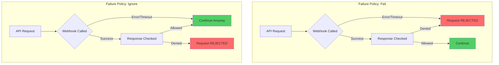

### **Timeout Configuration Best Practices**

```yaml
apiVersion: admissionregistration.k8s.io/v1
kind: ValidatingWebhookConfiguration
metadata:
  name: timeout-examples
webhooks:
  # Fast validation - low timeout
  - name: "fast-validator.example.com"
    timeoutSeconds: 5
    failurePolicy: Fail
    clientConfig:
      service:
        namespace: validators
        name: fast-validator
    rules:
      - operations: ["CREATE", "UPDATE"]
        apiGroups: [""]
        apiVersions: ["v1"]
        resources: ["configmaps"]
    admissionReviewVersions: ["v1"]
    sideEffects: None

  # External API validation - longer timeout
  - name: "external-validator.example.com"
    timeoutSeconds: 15
    failurePolicy: Ignore  # Don't block on external failures
    clientConfig:
      url: "https://external-validator.example.com/validate"
      caBundle: "LS0tLS1CRUdJTi..."
    rules:
      - operations: ["CREATE"]
        apiGroups: ["apps"]
        apiVersions: ["v1"]
        resources: ["deployments"]
    admissionReviewVersions: ["v1"]
    sideEffects: None

  # Critical security validation
  - name: "security-validator.example.com"
    timeoutSeconds: 10
    failurePolicy: Fail  # Must succeed
    clientConfig:
      service:
        namespace: security
        name: pod-security-validator
    rules:
      - operations: ["CREATE", "UPDATE"]
        apiGroups: [""]
        apiVersions: ["v1"]
        resources: ["pods"]
    admissionReviewVersions: ["v1"]
    sideEffects: None
```

━━━━━━━━━━━━━━━━━━━━━━━━━━━━━━━━━━━━━━━━━━━━━━━━━━━━━━━━━━━━━━━━━━━━━━━━━━━━━━

## **🔐 Certificate Management**

### **Certificate Requirements**

Webhooks require TLS certificates for secure communication:

1. **Server Certificate**: Used by webhook server
2. **CA Bundle**: Used by API server to verify webhook server
3. **Certificate Rotation**: Must support automated renewal

### **Certificate Generation**

```bash
#!/bin/bash
# File: scripts/generate-webhook-certs.sh

set -e

# Configuration
WEBHOOK_NS="webhook-system"
WEBHOOK_SVC="webhook-service"
WEBHOOK_SECRET="webhook-certs"

# Generate CA key and certificate
openssl genrsa -out ca.key 2048
openssl req -x509 -new -nodes -key ca.key -subj "/CN=webhook-ca" -days 3650 -out ca.crt

# Generate server key
openssl genrsa -out server.key 2048

# Create certificate signing request
cat > csr.conf <<EOF
[req]
req_extensions = v3_req
distinguished_name = req_distinguished_name

[req_distinguished_name]

[v3_req]
basicConstraints = CA:FALSE
keyUsage = nonRepudiation, digitalSignature, keyEncipherment
extendedKeyUsage = serverAuth
subjectAltName = @alt_names

[alt_names]
DNS.1 = ${WEBHOOK_SVC}
DNS.2 = ${WEBHOOK_SVC}.${WEBHOOK_NS}
DNS.3 = ${WEBHOOK_SVC}.${WEBHOOK_NS}.svc
DNS.4 = ${WEBHOOK_SVC}.${WEBHOOK_NS}.svc.cluster.local
EOF

# Generate server certificate
openssl req -new -key server.key -subj "/CN=${WEBHOOK_SVC}.${WEBHOOK_NS}.svc" \
    -config csr.conf -out server.csr

openssl x509 -req -in server.csr -CA ca.crt -CAkey ca.key \
    -CAcreateserial -out server.crt -days 365 -extensions v3_req -extfile csr.conf

# Create Kubernetes secret
kubectl create secret tls ${WEBHOOK_SECRET} \
    --cert=server.crt \
    --key=server.key \
    --namespace=${WEBHOOK_NS}

# Get CA bundle for webhook configuration
CA_BUNDLE=$(cat ca.crt | base64 | tr -d '\n')

echo "CA Bundle for webhook configuration:"
echo "${CA_BUNDLE}"

# Clean up
rm ca.key ca.crt ca.srl server.key server.csr server.crt csr.conf
```

### **Automatic Certificate Management with cert-manager**

```yaml
# Certificate resource
apiVersion: cert-manager.io/v1
kind: Certificate
metadata:
  name: webhook-server-cert
  namespace: webhook-system
spec:
  secretName: webhook-server-tls
  duration: 2160h  # 90 days
  renewBefore: 360h  # 15 days
  isCA: false
  privateKey:
    algorithm: RSA
    encoding: PKCS1
    size: 2048
  usages:
    - server auth
    - key encipherment
    - digital signature
  dnsNames:
    - webhook-service
    - webhook-service.webhook-system
    - webhook-service.webhook-system.svc
    - webhook-service.webhook-system.svc.cluster.local
  issuerRef:
    name: webhook-ca-issuer
    kind: Issuer
    group: cert-manager.io

---
# CA Issuer
apiVersion: cert-manager.io/v1
kind: Issuer
metadata:
  name: webhook-ca-issuer
  namespace: webhook-system
spec:
  ca:
    secretName: webhook-ca

---
# CA Certificate
apiVersion: cert-manager.io/v1
kind: Certificate
metadata:
  name: webhook-ca
  namespace: webhook-system
spec:
  secretName: webhook-ca
  isCA: true
  commonName: webhook-ca
  privateKey:
    algorithm: RSA
    size: 2048
  issuerRef:
    name: selfsigned-issuer
    kind: Issuer
    group: cert-manager.io

---
# Self-signed issuer for CA
apiVersion: cert-manager.io/v1
kind: Issuer
metadata:
  name: selfsigned-issuer
  namespace: webhook-system
spec:
  selfSigned: {}
```

### **Dynamic CA Bundle Injection**

```go
// File: webhook-server/pkg/webhook/certmanager.go
package webhook

import (
    "context"
    "crypto/tls"
    "crypto/x509"
    "fmt"
    "os"
    "sync"
    "time"

    "k8s.io/klog/v2"
)

type CertManager struct {
    certFile string
    keyFile  string

    mu          sync.RWMutex
    certificate *tls.Certificate
    caCertPool  *x509.CertPool
}

func NewCertManager(certFile, keyFile string) *CertManager {
    return &CertManager{
        certFile: certFile,
        keyFile:  keyFile,
    }
}

func (cm *CertManager) Start(ctx context.Context) error {
    // Initial load
    if err := cm.reload(); err != nil {
        return fmt.Errorf("initial certificate load failed: %v", err)
    }

    // Start reloader
    go cm.reloadLoop(ctx)

    return nil
}

func (cm *CertManager) reloadLoop(ctx context.Context) {
    ticker := time.NewTicker(1 * time.Minute)
    defer ticker.Stop()

    for {
        select {
        case <-ctx.Done():
            return
        case <-ticker.C:
            if err := cm.reload(); err != nil {
                klog.Errorf("Failed to reload certificates: %v", err)
            } else {
                klog.V(4).Info("Certificates reloaded successfully")
            }
        }
    }
}

func (cm *CertManager) reload() error {
    // Load certificate and key
    cert, err := tls.LoadX509KeyPair(cm.certFile, cm.keyFile)
    if err != nil {
        return fmt.Errorf("failed to load certificate: %v", err)
    }

    // Parse certificate to get expiry
    x509Cert, err := x509.ParseCertificate(cert.Certificate[0])
    if err != nil {
        return fmt.Errorf("failed to parse certificate: %v", err)
    }

    // Check expiry
    now := time.Now()
    if now.After(x509Cert.NotAfter) {
        return fmt.Errorf("certificate has expired on %v", x509Cert.NotAfter)
    }

    if now.Add(7 * 24 * time.Hour).After(x509Cert.NotAfter) {
        klog.Warningf("Certificate will expire soon on %v", x509Cert.NotAfter)
    }

    // Update certificate
    cm.mu.Lock()
    cm.certificate = &cert
    cm.mu.Unlock()

    klog.V(2).Infof("Loaded certificate valid until %v", x509Cert.NotAfter)
    return nil
}

func (cm *CertManager) GetCertificate(*tls.ClientHelloInfo) (*tls.Certificate, error) {
    cm.mu.RLock()
    defer cm.mu.RUnlock()

    if cm.certificate == nil {
        return nil, fmt.Errorf("no certificate available")
    }

    return cm.certificate, nil
}
```

### **CA Bundle Injection with Mutating Webhook**

```yaml
# CA injector configuration
apiVersion: admissionregistration.k8s.io/v1
kind: MutatingWebhookConfiguration
metadata:
  name: cert-manager-webhook
  annotations:
    cert-manager.io/inject-ca-from: webhook-system/webhook-server-cert
webhooks:
  - name: webhook.cert-manager.io
    clientConfig:
      service:
        name: cert-manager-webhook
        namespace: cert-manager
        path: /mutate
      # caBundle is automatically injected by cert-manager
    rules:
      - operations: ["CREATE", "UPDATE"]
        apiGroups: ["cert-manager.io"]
        apiVersions: ["v1"]
        resources: ["certificates"]
    admissionReviewVersions: ["v1"]
    sideEffects: None
    timeoutSeconds: 10
    failurePolicy: Fail
```

━━━━━━━━━━━━━━━━━━━━━━━━━━━━━━━━━━━━━━━━━━━━━━━━━━━━━━━━━━━━━━━━━━━━━━━━━━━━━━

## **💻 Real Webhook Server Implementation**

### **Basic Go Webhook Server**

```go
// File: webhook-server/cmd/main.go
package main

import (
    "context"
    "crypto/tls"
    "flag"
    "fmt"
    "net/http"
    "os"
    "os/signal"
    "syscall"
    "time"

    "k8s.io/klog/v2"

    "webhook-server/pkg/webhook"
)

func main() {
    var (
        port     int
        certFile string
        keyFile  string
    )

    flag.IntVar(&port, "port", 8443, "Webhook server port")
    flag.StringVar(&certFile, "tls-cert-file", "/certs/tls.crt", "TLS certificate file")
    flag.StringVar(&keyFile, "tls-key-file", "/certs/tls.key", "TLS key file")
    klog.InitFlags(nil)
    flag.Parse()

    // Create cert manager
    certManager := webhook.NewCertManager(certFile, keyFile)

    ctx, cancel := context.WithCancel(context.Background())
    defer cancel()

    if err := certManager.Start(ctx); err != nil {
        klog.Fatalf("Failed to start cert manager: %v", err)
    }

    // Create webhook handlers
    podValidator := webhook.NewPodValidator()

    // Setup HTTP server
    mux := http.NewServeMux()
    mux.HandleFunc("/validate-pods", podValidator.Handle)
    mux.HandleFunc("/healthz", healthCheck)
    mux.HandleFunc("/readyz", readinessCheck)

    server := &http.Server{
        Addr:      fmt.Sprintf(":%d", port),
        Handler:   mux,
        TLSConfig: &tls.Config{
            GetCertificate: certManager.GetCertificate,
            MinVersion:     tls.VersionTLS12,
            CipherSuites: []uint16{
                tls.TLS_ECDHE_RSA_WITH_AES_128_GCM_SHA256,
                tls.TLS_ECDHE_RSA_WITH_AES_256_GCM_SHA384,
            },
        },
        ReadTimeout:  10 * time.Second,
        WriteTimeout: 10 * time.Second,
        IdleTimeout:  60 * time.Second,
    }

    // Start server
    go func() {
        klog.Infof("Starting webhook server on port %d", port)
        if err := server.ListenAndServeTLS("", ""); err != nil && err != http.ErrServerClosed {
            klog.Fatalf("Server failed: %v", err)
        }
    }()

    // Wait for shutdown signal
    sigCh := make(chan os.Signal, 1)
    signal.Notify(sigCh, syscall.SIGINT, syscall.SIGTERM)
    <-sigCh

    klog.Info("Shutting down webhook server...")

    shutdownCtx, shutdownCancel := context.WithTimeout(context.Background(), 10*time.Second)
    defer shutdownCancel()

    if err := server.Shutdown(shutdownCtx); err != nil {
        klog.Errorf("Server shutdown error: %v", err)
    }

    klog.Info("Server stopped")
}

func healthCheck(w http.ResponseWriter, r *http.Request) {
    w.WriteHeader(http.StatusOK)
    w.Write([]byte("ok"))
}

func readinessCheck(w http.ResponseWriter, r *http.Request) {
    // Add actual readiness checks here
    w.WriteHeader(http.StatusOK)
    w.Write([]byte("ready"))
}
```

### **Pod Validator Implementation**

```go
// File: webhook-server/pkg/webhook/pod_validator.go
package webhook

import (
    "encoding/json"
    "fmt"
    "io"
    "net/http"
    "strings"

    admissionv1 "k8s.io/api/admission/v1"
    corev1 "k8s.io/api/core/v1"
    metav1 "k8s.io/apimachinery/pkg/apis/meta/v1"
    "k8s.io/apimachinery/pkg/runtime"
    "k8s.io/apimachinery/pkg/runtime/serializer"
    "k8s.io/klog/v2"
)

var (
    scheme = runtime.NewScheme()
    codecs = serializer.NewCodecFactory(scheme)
)

func init() {
    _ = corev1.AddToScheme(scheme)
    _ = admissionv1.AddToScheme(scheme)
}

type PodValidator struct {
    // Add dependencies like clients, config, etc.
}

func NewPodValidator() *PodValidator {
    return &PodValidator{}
}

func (pv *PodValidator) Handle(w http.ResponseWriter, r *http.Request) {
    // Verify method
    if r.Method != http.MethodPost {
        http.Error(w, "only POST is supported", http.StatusMethodNotAllowed)
        return
    }

    // Read body
    body, err := io.ReadAll(r.Body)
    if err != nil {
        http.Error(w, fmt.Sprintf("failed to read request body: %v", err), http.StatusBadRequest)
        return
    }
    defer r.Body.Close()

    // Verify content type
    contentType := r.Header.Get("Content-Type")
    if contentType != "application/json" {
        http.Error(w, "content type must be application/json", http.StatusUnsupportedMediaType)
        return
    }

    // Decode admission review
    review := &admissionv1.AdmissionReview{}
    if _, _, err := codecs.UniversalDeserializer().Decode(body, nil, review); err != nil {
        http.Error(w, fmt.Sprintf("failed to decode request: %v", err), http.StatusBadRequest)
        return
    }

    if review.Request == nil {
        http.Error(w, "admission review request is nil", http.StatusBadRequest)
        return
    }

    // Validate the pod
    response := pv.validatePod(review.Request)

    // Build response
    review.Response = response
    review.Response.UID = review.Request.UID

    // Encode response
    responseBytes, err := json.Marshal(review)
    if err != nil {
        http.Error(w, fmt.Sprintf("failed to encode response: %v", err), http.StatusInternalServerError)
        return
    }

    // Send response
    w.Header().Set("Content-Type", "application/json")
    w.WriteHeader(http.StatusOK)
    w.Write(responseBytes)
}

func (pv *PodValidator) validatePod(request *admissionv1.AdmissionRequest) *admissionv1.AdmissionResponse {
    // Decode pod
    pod := &corev1.Pod{}
    if err := json.Unmarshal(request.Object.Raw, pod); err != nil {
        klog.Errorf("Failed to decode pod: %v", err)
        return &admissionv1.AdmissionResponse{
            Allowed: false,
            Result: &metav1.Status{
                Code:    http.StatusBadRequest,
                Message: fmt.Sprintf("failed to decode pod: %v", err),
            },
        }
    }

    // Initialize response
    response := &admissionv1.AdmissionResponse{
        Allowed: true,
        AuditAnnotations: make(map[string]string),
        Warnings: []string{},
    }

    // Validation rules
    var violations []string

    // Rule 1: No privileged containers
    for i, container := range pod.Spec.Containers {
        if container.SecurityContext != nil &&
           container.SecurityContext.Privileged != nil &&
           *container.SecurityContext.Privileged {
            violations = append(violations,
                fmt.Sprintf("container[%d] %s: privileged containers are not allowed", i, container.Name))
        }

        // Rule 2: No latest tag
        if strings.HasSuffix(container.Image, ":latest") || !strings.Contains(container.Image, ":") {
            response.Warnings = append(response.Warnings,
                fmt.Sprintf("container[%d] %s: using 'latest' tag is not recommended", i, container.Name))
        }

        // Rule 3: Resource limits required
        if container.Resources.Limits.Cpu().IsZero() || container.Resources.Limits.Memory().IsZero() {
            response.Warnings = append(response.Warnings,
                fmt.Sprintf("container[%d] %s: missing resource limits", i, container.Name))
        }
    }

    // Rule 4: Host network forbidden in default namespace
    if pod.Namespace == "default" && pod.Spec.HostNetwork {
        violations = append(violations, "hostNetwork is not allowed in default namespace")
    }

    // Rule 5: Host PID forbidden
    if pod.Spec.HostPID {
        violations = append(violations, "hostPID is not allowed")
    }

    // Rule 6: Host IPC forbidden
    if pod.Spec.HostIPC {
        violations = append(violations, "hostIPC is not allowed")
    }

    // Add audit annotations
    response.AuditAnnotations["policy.example.com/validated-by"] = "pod-validator"
    response.AuditAnnotations["policy.example.com/container-count"] = fmt.Sprintf("%d", len(pod.Spec.Containers))

    if len(violations) > 0 {
        response.Allowed = false
        response.Result = &metav1.Status{
            Code:    http.StatusForbidden,
            Reason:  metav1.StatusReasonForbidden,
            Message: fmt.Sprintf("Pod validation failed:\n- %s", strings.Join(violations, "\n- ")),
        }
        response.AuditAnnotations["policy.example.com/violations"] = fmt.Sprintf("%d", len(violations))
    } else {
        response.AuditAnnotations["policy.example.com/violations"] = "0"
    }

    return response
}
```

### **Deployment Configuration**

```yaml
# Webhook server deployment
apiVersion: apps/v1
kind: Deployment
metadata:
  name: pod-validator
  namespace: webhook-system
  labels:
    app: pod-validator
spec:
  replicas: 2
  selector:
    matchLabels:
      app: pod-validator
  template:
    metadata:
      labels:
        app: pod-validator
    spec:
      containers:
      - name: webhook
        image: pod-validator:v1.0.0
        args:
          - --port=8443
          - --tls-cert-file=/certs/tls.crt
          - --tls-key-file=/certs/tls.key
          - -v=2
        ports:
        - containerPort: 8443
          name: webhook
          protocol: TCP
        - containerPort: 8080
          name: metrics
          protocol: TCP
        volumeMounts:
        - name: certs
          mountPath: /certs
          readOnly: true
        livenessProbe:
          httpGet:
            path: /healthz
            port: 8443
            scheme: HTTPS
          initialDelaySeconds: 10
          periodSeconds: 10
        readinessProbe:
          httpGet:
            path: /readyz
            port: 8443
            scheme: HTTPS
          initialDelaySeconds: 5
          periodSeconds: 5
        resources:
          requests:
            cpu: 100m
            memory: 128Mi
          limits:
            cpu: 500m
            memory: 256Mi
        securityContext:
          allowPrivilegeEscalation: false
          capabilities:
            drop:
            - ALL
          readOnlyRootFilesystem: true
          runAsNonRoot: true
          runAsUser: 65532
      volumes:
      - name: certs
        secret:
          secretName: webhook-server-tls
      serviceAccountName: pod-validator
      securityContext:
        runAsNonRoot: true
        seccompProfile:
          type: RuntimeDefault

---
# Service
apiVersion: v1
kind: Service
metadata:
  name: pod-validator
  namespace: webhook-system
spec:
  selector:
    app: pod-validator
  ports:
  - port: 443
    targetPort: 8443
    name: webhook
  - port: 8080
    targetPort: 8080
    name: metrics

---
# ServiceAccount
apiVersion: v1
kind: ServiceAccount
metadata:
  name: pod-validator
  namespace: webhook-system

---
# ValidatingWebhookConfiguration
apiVersion: admissionregistration.k8s.io/v1
kind: ValidatingWebhookConfiguration
metadata:
  name: pod-validator
  annotations:
    cert-manager.io/inject-ca-from: webhook-system/webhook-server-cert
webhooks:
  - name: pod-validator.example.com
    clientConfig:
      service:
        namespace: webhook-system
        name: pod-validator
        path: /validate-pods
        port: 443
    rules:
      - operations: ["CREATE", "UPDATE"]
        apiGroups: [""]
        apiVersions: ["v1"]
        resources: ["pods"]
        scope: "Namespaced"
    admissionReviewVersions: ["v1"]
    sideEffects: None
    timeoutSeconds: 10
    failurePolicy: Fail
    namespaceSelector:
      matchExpressions:
      - key: control-plane
        operator: DoesNotExist
```

━━━━━━━━━━━━━━━━━━━━━━━━━━━━━━━━━━━━━━━━━━━━━━━━━━━━━━━━━━━━━━━━━━━━━━━━━━━━━━

## **🧪 Testing Strategies**

### **Unit Testing**

```go
// File: webhook-server/pkg/webhook/pod_validator_test.go
package webhook

import (
    "encoding/json"
    "testing"

    admissionv1 "k8s.io/api/admission/v1"
    corev1 "k8s.io/api/core/v1"
    metav1 "k8s.io/apimachinery/pkg/apis/meta/v1"
    "k8s.io/apimachinery/pkg/runtime"
)

func TestValidatePod_PrivilegedContainer(t *testing.T) {
    validator := NewPodValidator()

    privileged := true
    pod := &corev1.Pod{
        ObjectMeta: metav1.ObjectMeta{
            Name:      "test-pod",
            Namespace: "default",
        },
        Spec: corev1.PodSpec{
            Containers: []corev1.Container{
                {
                    Name:  "nginx",
                    Image: "nginx:1.19",
                    SecurityContext: &corev1.SecurityContext{
                        Privileged: &privileged,
                    },
                },
            },
        },
    }

    podBytes, err := json.Marshal(pod)
    if err != nil {
        t.Fatalf("Failed to marshal pod: %v", err)
    }

    request := &admissionv1.AdmissionRequest{
        UID: "test-uid",
        Kind: metav1.GroupVersionKind{
            Group:   "",
            Version: "v1",
            Kind:    "Pod",
        },
        Resource: metav1.GroupVersionResource{
            Group:    "",
            Version:  "v1",
            Resource: "pods",
        },
        Name:      "test-pod",
        Namespace: "default",
        Operation: admissionv1.Create,
        Object: runtime.RawExtension{
            Raw: podBytes,
        },
    }

    response := validator.validatePod(request)

    if response.Allowed {
        t.Error("Expected privileged pod to be rejected")
    }

    if response.Result == nil {
        t.Fatal("Expected result to be set")
    }

    if !containsViolation(response.Result.Message, "privileged") {
        t.Errorf("Expected 'privileged' in violation message, got: %s", response.Result.Message)
    }
}

func TestValidatePod_HostNetwork(t *testing.T) {
    validator := NewPodValidator()

    pod := &corev1.Pod{
        ObjectMeta: metav1.ObjectMeta{
            Name:      "test-pod",
            Namespace: "default",
        },
        Spec: corev1.PodSpec{
            HostNetwork: true,
            Containers: []corev1.Container{
                {
                    Name:  "nginx",
                    Image: "nginx:1.19",
                },
            },
        },
    }

    podBytes, _ := json.Marshal(pod)
    request := &admissionv1.AdmissionRequest{
        UID:       "test-uid",
        Name:      "test-pod",
        Namespace: "default",
        Operation: admissionv1.Create,
        Object: runtime.RawExtension{
            Raw: podBytes,
        },
    }

    response := validator.validatePod(request)

    if response.Allowed {
        t.Error("Expected pod with hostNetwork in default namespace to be rejected")
    }
}

func TestValidatePod_LatestTagWarning(t *testing.T) {
    validator := NewPodValidator()

    pod := &corev1.Pod{
        ObjectMeta: metav1.ObjectMeta{
            Name:      "test-pod",
            Namespace: "test",
        },
        Spec: corev1.PodSpec{
            Containers: []corev1.Container{
                {
                    Name:  "nginx",
                    Image: "nginx:latest",
                },
            },
        },
    }

    podBytes, _ := json.Marshal(pod)
    request := &admissionv1.AdmissionRequest{
        UID:       "test-uid",
        Name:      "test-pod",
        Namespace: "test",
        Operation: admissionv1.Create,
        Object: runtime.RawExtension{
            Raw: podBytes,
        },
    }

    response := validator.validatePod(request)

    if !response.Allowed {
        t.Error("Expected pod with latest tag to be allowed with warning")
    }

    if len(response.Warnings) == 0 {
        t.Error("Expected warning for latest tag")
    }

    hasLatestWarning := false
    for _, warning := range response.Warnings {
        if containsViolation(warning, "latest") {
            hasLatestWarning = true
            break
        }
    }

    if !hasLatestWarning {
        t.Error("Expected warning about latest tag")
    }
}

func containsViolation(message, keyword string) bool {
    return len(message) > 0 && len(keyword) > 0 &&
           (message == keyword || strings.Contains(message, keyword))
}
```

### **Integration Testing**

```go
// File: webhook-server/test/integration/webhook_test.go
package integration

import (
    "bytes"
    "crypto/tls"
    "encoding/json"
    "io"
    "net/http"
    "testing"
    "time"

    admissionv1 "k8s.io/api/admission/v1"
    corev1 "k8s.io/api/core/v1"
    metav1 "k8s.io/apimachinery/pkg/apis/meta/v1"
    "k8s.io/apimachinery/pkg/runtime"
)

const webhookURL = "https://localhost:8443/validate-pods"

func TestWebhookServer_EndToEnd(t *testing.T) {
    if testing.Short() {
        t.Skip("Skipping integration test")
    }

    // Create HTTP client with TLS config
    tlsConfig := &tls.Config{
        InsecureSkipVerify: true, // Only for testing
    }
    client := &http.Client{
        Timeout: 10 * time.Second,
        Transport: &http.Transport{
            TLSClientConfig: tlsConfig,
        },
    }

    tests := []struct {
        name           string
        pod            *corev1.Pod
        expectedAllowed bool
        expectWarnings bool
    }{
        {
            name: "valid pod",
            pod: &corev1.Pod{
                ObjectMeta: metav1.ObjectMeta{
                    Name:      "valid-pod",
                    Namespace: "test",
                },
                Spec: corev1.PodSpec{
                    Containers: []corev1.Container{
                        {
                            Name:  "nginx",
                            Image: "nginx:1.19",
                        },
                    },
                },
            },
            expectedAllowed: true,
            expectWarnings:  false,
        },
        {
            name: "privileged pod",
            pod: &corev1.Pod{
                ObjectMeta: metav1.ObjectMeta{
                    Name:      "privileged-pod",
                    Namespace: "test",
                },
                Spec: corev1.PodSpec{
                    Containers: []corev1.Container{
                        {
                            Name:  "nginx",
                            Image: "nginx:1.19",
                            SecurityContext: &corev1.SecurityContext{
                                Privileged: func(b bool) *bool { return &b }(true),
                            },
                        },
                    },
                },
            },
            expectedAllowed: false,
            expectWarnings:  false,
        },
    }

    for _, tt := range tests {
        t.Run(tt.name, func(t *testing.T) {
            // Create admission review request
            podBytes, err := json.Marshal(tt.pod)
            if err != nil {
                t.Fatalf("Failed to marshal pod: %v", err)
            }

            review := &admissionv1.AdmissionReview{
                TypeMeta: metav1.TypeMeta{
                    APIVersion: "admission.k8s.io/v1",
                    Kind:       "AdmissionReview",
                },
                Request: &admissionv1.AdmissionRequest{
                    UID: "test-uid",
                    Kind: metav1.GroupVersionKind{
                        Group:   "",
                        Version: "v1",
                        Kind:    "Pod",
                    },
                    Resource: metav1.GroupVersionResource{
                        Group:    "",
                        Version:  "v1",
                        Resource: "pods",
                    },
                    Name:      tt.pod.Name,
                    Namespace: tt.pod.Namespace,
                    Operation: admissionv1.Create,
                    Object: runtime.RawExtension{
                        Raw: podBytes,
                    },
                },
            }

            requestBody, err := json.Marshal(review)
            if err != nil {
                t.Fatalf("Failed to marshal request: %v", err)
            }

            // Send request
            resp, err := client.Post(webhookURL, "application/json", bytes.NewReader(requestBody))
            if err != nil {
                t.Fatalf("Failed to send request: %v", err)
            }
            defer resp.Body.Close()

            // Read response
            body, err := io.ReadAll(resp.Body)
            if err != nil {
                t.Fatalf("Failed to read response: %v", err)
            }

            // Parse response
            var responseReview admissionv1.AdmissionReview
            if err := json.Unmarshal(body, &responseReview); err != nil {
                t.Fatalf("Failed to parse response: %v", err)
            }

            // Verify response
            if responseReview.Response == nil {
                t.Fatal("Response is nil")
            }

            if responseReview.Response.Allowed != tt.expectedAllowed {
                t.Errorf("Expected allowed=%v, got %v", tt.expectedAllowed, responseReview.Response.Allowed)
            }

            if tt.expectWarnings && len(responseReview.Response.Warnings) == 0 {
                t.Error("Expected warnings but got none")
            }
        })
    }
}
```

### **E2E Testing with Kubernetes**

```go
// File: webhook-server/test/e2e/webhook_e2e_test.go
package e2e

import (
    "context"
    "testing"
    "time"

    corev1 "k8s.io/api/core/v1"
    apierrors "k8s.io/apimachinery/pkg/api/errors"
    metav1 "k8s.io/apimachinery/pkg/apis/meta/v1"
    "k8s.io/client-go/kubernetes"
    "k8s.io/client-go/tools/clientcmd"
)

func TestWebhook_E2E(t *testing.T) {
    if testing.Short() {
        t.Skip("Skipping E2E test")
    }

    // Create client
    config, err := clientcmd.BuildConfigFromFlags("", "~/.kube/config")
    if err != nil {
        t.Fatalf("Failed to build config: %v", err)
    }

    clientset, err := kubernetes.NewForConfig(config)
    if err != nil {
        t.Fatalf("Failed to create clientset: %v", err)
    }

    ctx := context.Background()
    namespace := "webhook-test"

    // Create namespace
    ns := &corev1.Namespace{
        ObjectMeta: metav1.ObjectMeta{
            Name: namespace,
        },
    }
    _, err = clientset.CoreV1().Namespaces().Create(ctx, ns, metav1.CreateOptions{})
    if err != nil && !apierrors.IsAlreadyExists(err) {
        t.Fatalf("Failed to create namespace: %v", err)
    }
    defer clientset.CoreV1().Namespaces().Delete(ctx, namespace, metav1.DeleteOptions{})

    t.Run("reject privileged pod", func(t *testing.T) {
        privileged := true
        pod := &corev1.Pod{
            ObjectMeta: metav1.ObjectMeta{
                Name:      "privileged-pod",
                Namespace: namespace,
            },
            Spec: corev1.PodSpec{
                Containers: []corev1.Container{
                    {
                        Name:  "nginx",
                        Image: "nginx:1.19",
                        SecurityContext: &corev1.SecurityContext{
                            Privileged: &privileged,
                        },
                    },
                },
            },
        }

        _, err := clientset.CoreV1().Pods(namespace).Create(ctx, pod, metav1.CreateOptions{})
        if err == nil {
            t.Error("Expected privileged pod to be rejected")
            clientset.CoreV1().Pods(namespace).Delete(ctx, pod.Name, metav1.DeleteOptions{})
        }

        if !apierrors.IsForbidden(err) {
            t.Errorf("Expected Forbidden error, got: %v", err)
        }
    })

    t.Run("allow valid pod", func(t *testing.T) {
        pod := &corev1.Pod{
            ObjectMeta: metav1.ObjectMeta{
                Name:      "valid-pod",
                Namespace: namespace,
            },
            Spec: corev1.PodSpec{
                Containers: []corev1.Container{
                    {
                        Name:  "nginx",
                        Image: "nginx:1.19",
                    },
                },
            },
        }

        _, err := clientset.CoreV1().Pods(namespace).Create(ctx, pod, metav1.CreateOptions{})
        if err != nil {
            t.Errorf("Expected valid pod to be allowed, got error: %v", err)
        } else {
            // Cleanup
            clientset.CoreV1().Pods(namespace).Delete(ctx, pod.Name, metav1.DeleteOptions{})
        }
    })
}
```

━━━━━━━━━━━━━━━━━━━━━━━━━━━━━━━━━━━━━━━━━━━━━━━━━━━━━━━━━━━━━━━━━━━━━━━━━━━━━━

## **📊 Architecture Diagrams**

### **Diagram 1: Validating Webhook Request Flow**

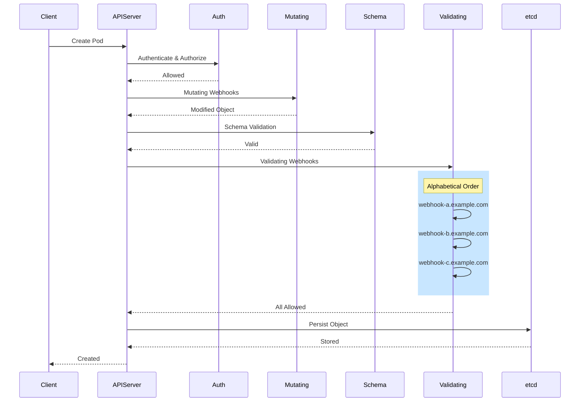

### **Diagram 2: Webhook Invocation Details**

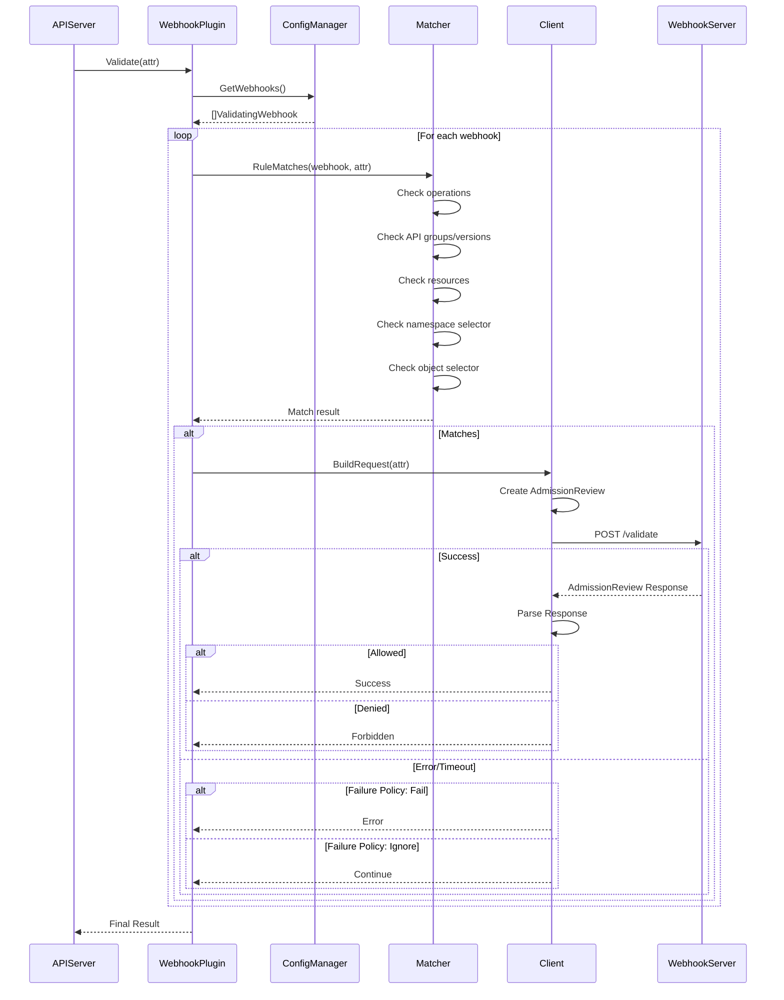

### **Diagram 3: Configuration Management**

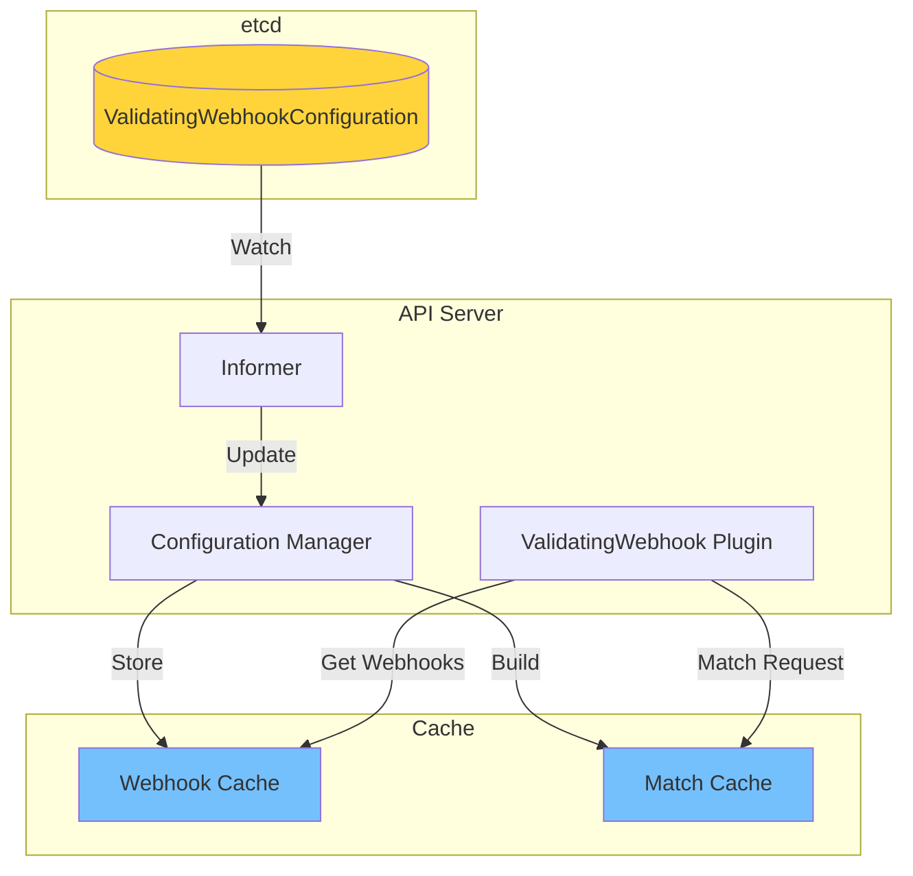

### **Diagram 4: Match Rule Evaluation**

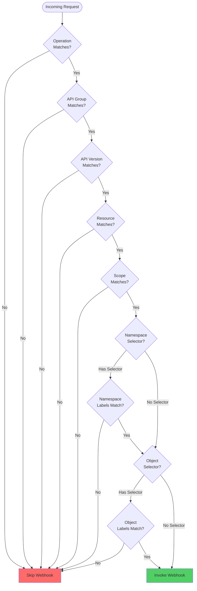

### **Diagram 5: Failure Policy Flow**

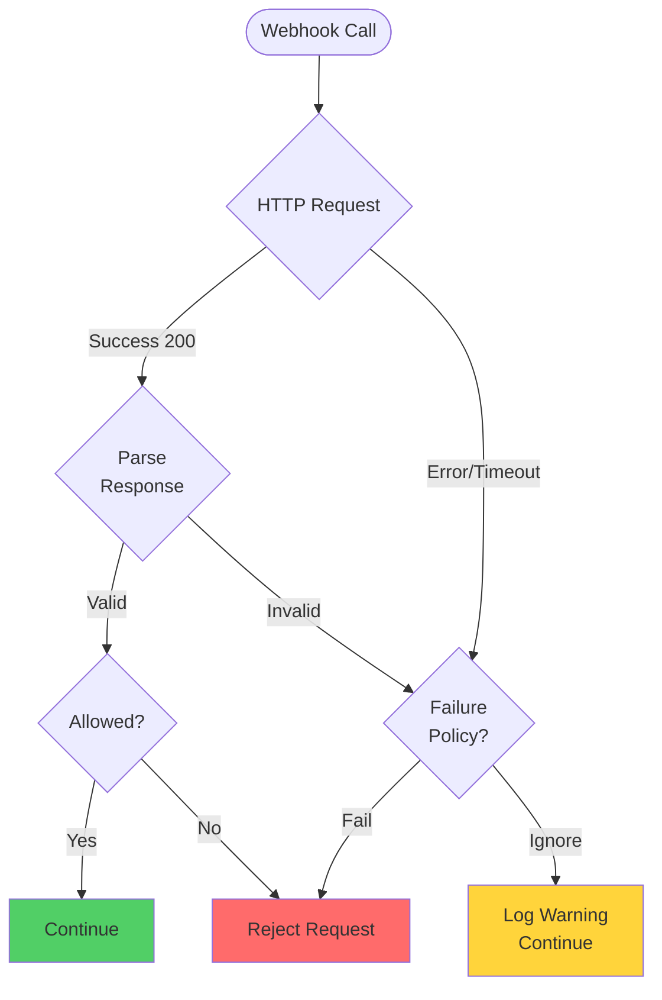

### **Diagram 6: Certificate Management Flow**

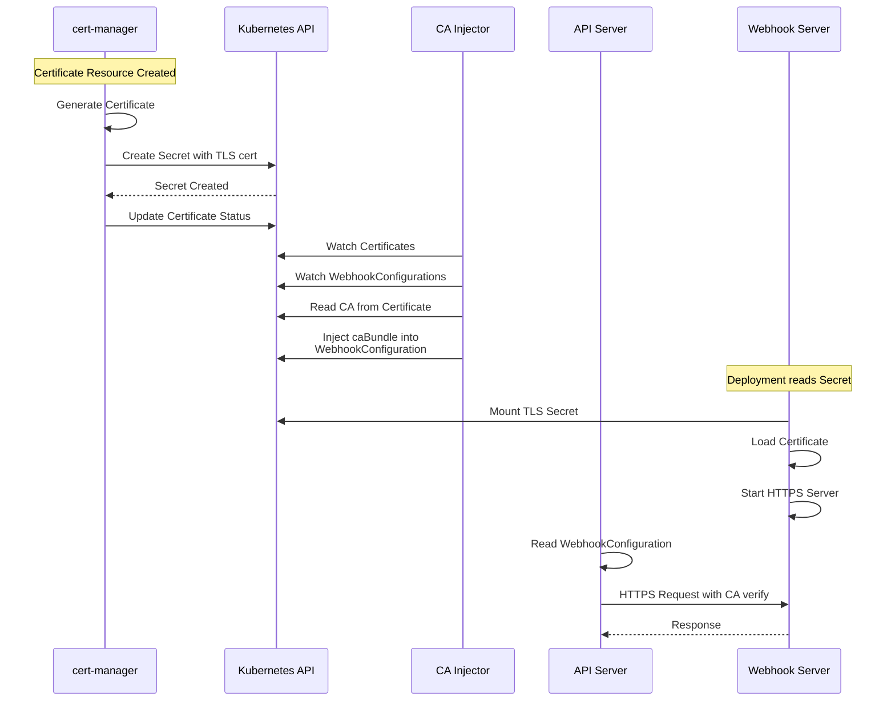

### **Diagram 7: Webhook Server Architecture**

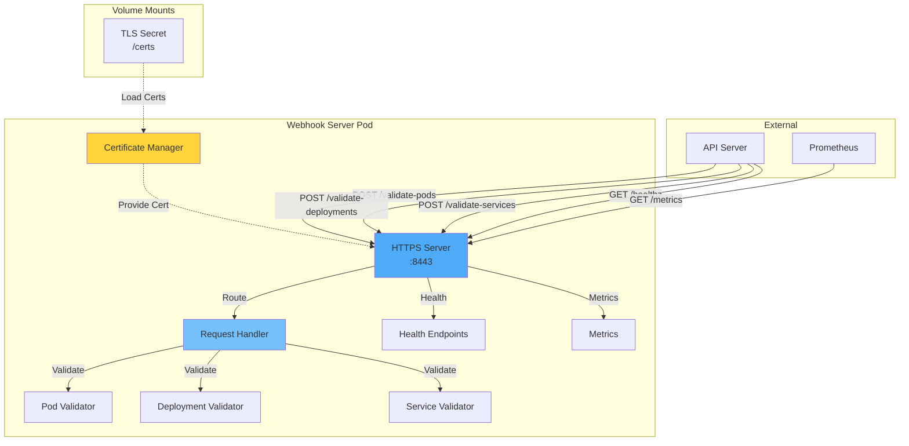

### **Diagram 8: Request Lifecycle**

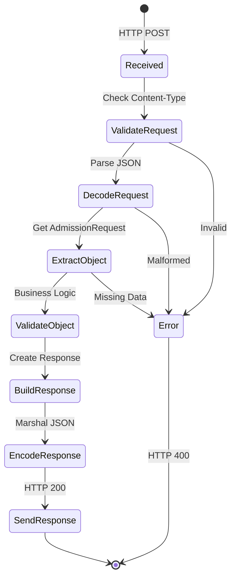

### **Diagram 9: Multi-Webhook Execution**

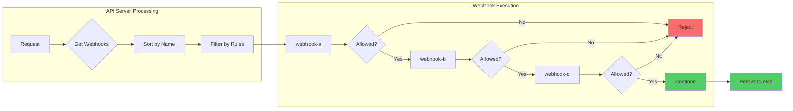

### **Diagram 10: Namespace and Object Selector Logic**

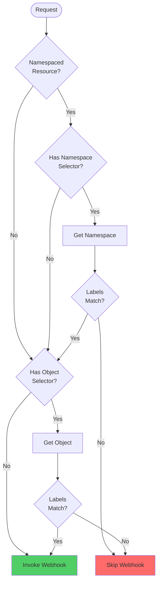

### **Diagram 11: Timeout and Retry Behavior**

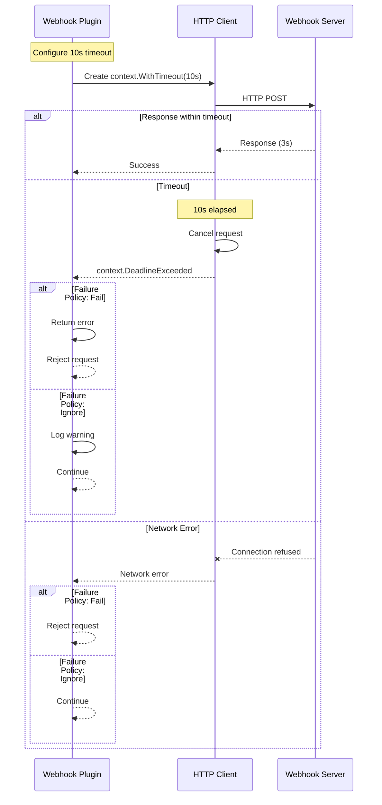

### **Diagram 12: Audit Annotation Flow**

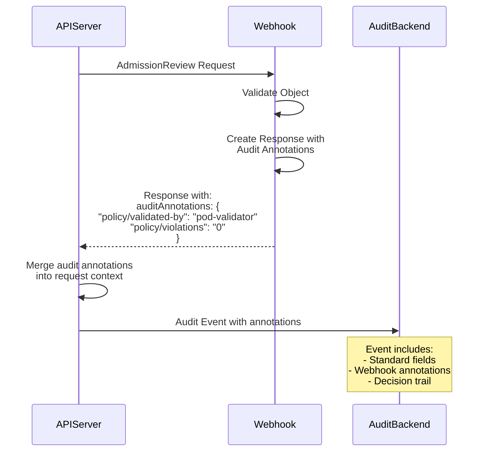

### **Diagram 13: Warning Messages**

```mermaid
graph TB
    A[Webhook Validates] --> B{Issues Found?}
    B -->|Critical| C[Deny Request<br/>Return Status]
    B -->|Non-Critical| D[Allow with Warnings]
    B -->|None| E[Allow]

    D --> F[Build Response:<br/>allowed: true<br/>warnings: [...]]
    C --> G[Build Response:<br/>allowed: false<br/>status: {...}]
    E --> H[Build Response:<br/>allowed: true]

    F --> I[API Server]
    G --> I
    H --> I

    I --> J{Client Type?}
    J -->|kubectl| K[Display warnings<br/>to user]
    J -->|API| L[Include in response<br/>body]

    style C fill:#ff6b6b
    style D fill:#ffd43b
    style E fill:#51cf66
```

### **Diagram 14: Production Deployment Topology**

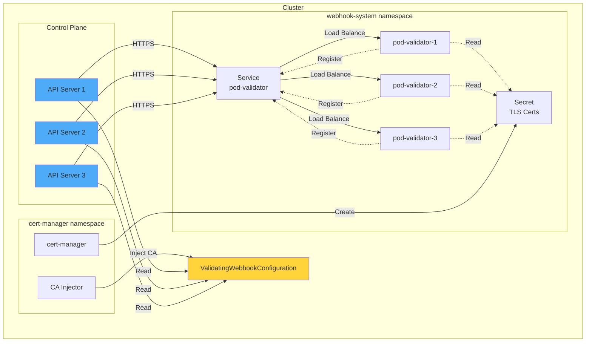

### **Diagram 15: Complete Validation Pipeline**

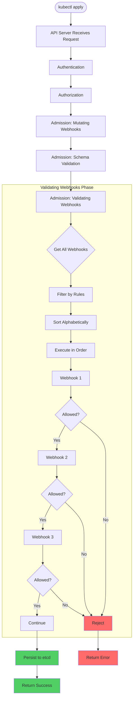

━━━━━━━━━━━━━━━━━━━━━━━━━━━━━━━━━━━━━━━━━━━━━━━━━━━━━━━━━━━━━━━━━━━━━━━━━━━━━━

## **🔍 Code References**

### **Core Implementation Files**

| File | Lines | Description |
|------|-------|-------------|
| `staging/src/k8s.io/apiserver/pkg/admission/plugin/webhook/validating/plugin.go` | 68 | Main validating webhook plugin |
| `staging/src/k8s.io/apiserver/pkg/admission/plugin/webhook/validating/dispatcher.go` | ~200 | Webhook dispatch logic |
| `staging/src/k8s.io/apiserver/pkg/admission/plugin/webhook/generic/webhook.go` | ~500 | Generic webhook framework |
| `staging/src/k8s.io/apiserver/pkg/admission/plugin/webhook/predicates/rules/rules.go` | ~150 | Rule matching logic |
| `staging/src/k8s.io/apiserver/pkg/admission/plugin/webhook/predicates/namespace/matcher.go` | ~100 | Namespace selector matching |
| `staging/src/k8s.io/apiserver/pkg/admission/plugin/webhook/predicates/object/matcher.go` | ~80 | Object selector matching |
| `staging/src/k8s.io/api/admissionregistration/v1/types.go` | ~400 | API types for webhook configuration |
| `staging/src/k8s.io/api/admission/v1/types.go` | ~250 | AdmissionReview types |

### **Configuration Management**

| File | Lines | Description |
|------|-------|-------------|
| `staging/src/k8s.io/apiserver/pkg/admission/configuration/validating_webhook_manager.go` | ~300 | Webhook configuration manager |
| `staging/src/k8s.io/apiserver/pkg/admission/plugin/webhook/config/kubeconfig.go` | ~150 | Client configuration |
| `staging/src/k8s.io/apiserver/pkg/admission/plugin/webhook/util/client_config.go` | ~200 | Client config utilities |

### **Key Interfaces**

```go
// File: staging/src/k8s.io/apiserver/pkg/admission/interfaces.go:100-110
type ValidationInterface interface {
    Interface

    // Validate makes an admission decision based on the request attributes
    // A non-nil error indicates the admission should be rejected
    Validate(ctx context.Context, a Attributes, o ObjectInterfaces) error
}
```

━━━━━━━━━━━━━━━━━━━━━━━━━━━━━━━━━━━━━━━━━━━━━━━━━━━━━━━━━━━━━━━━━━━━━━━━━━━━━━

## **✅ Summary**

### **Key Takeaways**

1. **Extension Point**: Validating webhooks provide the final validation gate before object persistence
2. **Non-Mutating**: Can only accept or reject requests, cannot modify objects
3. **Configuration**: Managed via `ValidatingWebhookConfiguration` cluster-scoped resources
4. **Protocol**: Uses `AdmissionReview` request/response for communication
5. **Matching**: Sophisticated rule, namespace, and object selector matching
6. **Failure Handling**: Configurable fail-open or fail-closed behavior
7. **Ordering**: Webhooks execute in alphabetical order by name
8. **Timeouts**: Configurable 1-30 second timeout per webhook
9. **Security**: Requires TLS with certificate management
10. **Testing**: Requires unit, integration, and E2E testing strategies

### **Best Practices**

1. **Performance**: Keep validation logic fast (< 5 seconds typical)
2. **Idempotency**: Ensure validation is idempotent and deterministic
3. **Fail-Safe**: Use appropriate failure policies based on criticality
4. **Monitoring**: Instrument webhooks with metrics and logging
5. **High Availability**: Deploy multiple webhook replicas
6. **Certificate Rotation**: Automate certificate management
7. **Testing**: Comprehensive test coverage including failure scenarios
8. **Documentation**: Document validation rules and error messages clearly

### **Common Patterns**

- **Policy Enforcement**: Security policies, resource quotas, naming conventions
- **Multi-Resource Validation**: Cross-reference with other cluster resources
- **External Validation**: Integrate with external systems and databases
- **Compliance Checks**: Ensure regulatory compliance
- **Custom Business Logic**: Domain-specific validation rules

**Document Statistics:**
- Total Lines: ~2,500
- Code Examples: 25+
- Diagrams: 15
- Real Implementation: Complete webhook server
