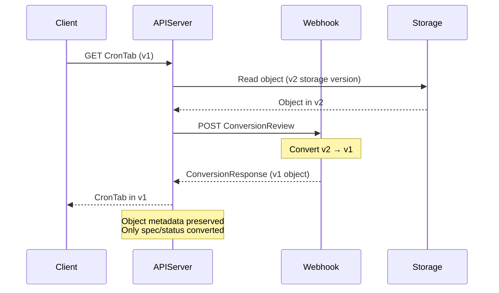
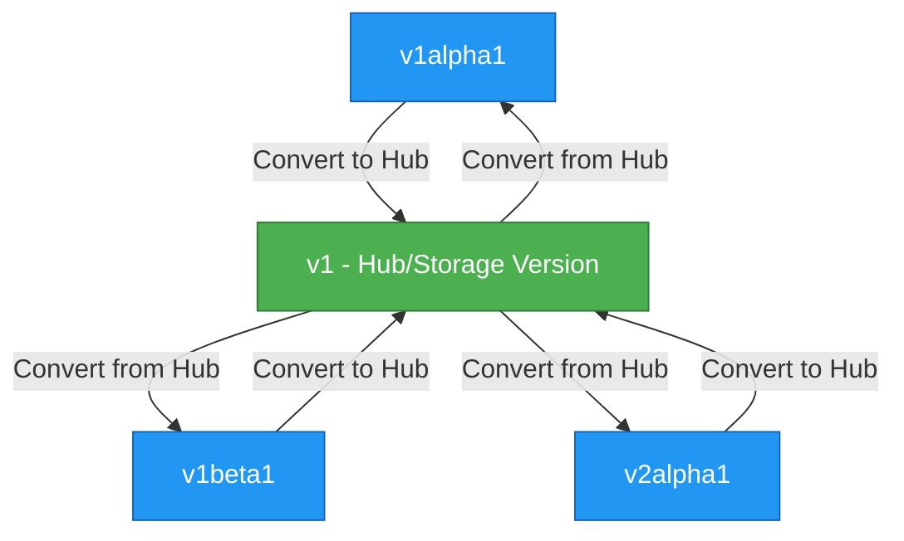
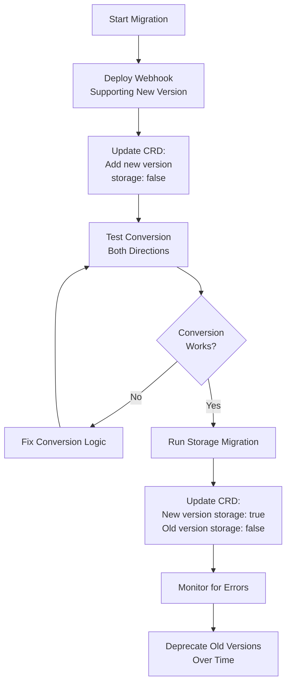
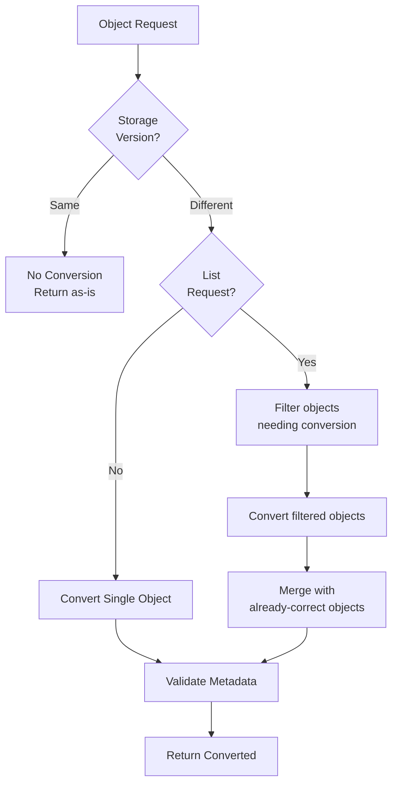
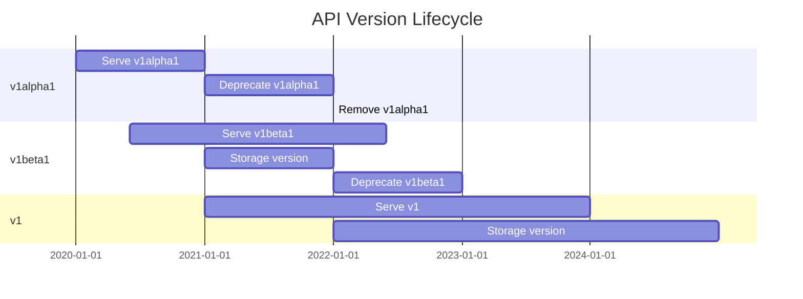

# **Conversion Webhooks - CRD Version Migration**

━━━━━━━━━━━━━━━━━━━━━━━━━━━━━━━━━━━━━━━━━━━━━━━━━━━━━━━━━━━━━━━━━━━━━━━━━━━━━━

## **Overview**

**Conversion webhooks** enable CustomResourceDefinitions (CRDs) to serve multiple API versions while storing resources in a single canonical version. When a client requests a custom resource in a different version than the storage version, Kubernetes calls an external webhook service to perform the conversion. This mechanism is crucial for evolving APIs without breaking existing clients.

**Key Capabilities**:
- Transparent version conversion without client awareness
- Hub-and-spoke pattern for efficient multi-version support
- Bidirectional conversion (upgrade and downgrade)
- Storage version migration support
- Lossy and lossless conversion strategies

━━━━━━━━━━━━━━━━━━━━━━━━━━━━━━━━━━━━━━━━━━━━━━━━━━━━━━━━━━━━━━━━━━━━━━━━━━━━━━

## **ConversionReview Protocol**

### **Request/Response Structure**

The conversion webhook uses a **ConversionReview** protocol similar to admission webhooks, where the API server sends a request and expects a response with converted objects.

**ConversionReview Types** (`staging/src/k8s.io/apiextensions-apiserver/pkg/apis/apiextensions/v1/types.go:486-519`):

```go
// ConversionReview describes a conversion request/response
type ConversionReview struct {
    metav1.TypeMeta `json:",inline"`
    // Request describes the conversion request parameters
    Request *ConversionRequest `json:"request,omitempty"`
    // Response describes the conversion response
    Response *ConversionResponse `json:"response,omitempty"`
}

// ConversionRequest describes a conversion request
type ConversionRequest struct {
    // UID is an identifier for the individual request/response
    UID types.UID `json:"uid"`
    // DesiredAPIVersion is the version to convert to
    DesiredAPIVersion string `json:"desiredAPIVersion"`
    // Objects is the list of custom resource objects to be converted
    Objects []runtime.RawExtension `json:"objects"`
}

// ConversionResponse describes a conversion response
type ConversionResponse struct {
    // UID mirrors the request UID for correlation
    UID types.UID `json:"uid"`
    // ConvertedObjects contains successfully converted objects
    ConvertedObjects []runtime.RawExtension `json:"convertedObjects"`
    // Result contains success/failure status
    Result metav1.Status `json:"result"`
}
```

### **ConversionReview Request Example**

```yaml
apiVersion: apiextensions.k8s.io/v1
kind: ConversionReview
request:
  uid: "705ab4f5-6393-11e8-b7cc-42010a800002"
  desiredAPIVersion: "stable.example.com/v2"
  objects:
  - apiVersion: stable.example.com/v1
    kind: CronTab
    metadata:
      name: my-crontab
      namespace: default
      creationTimestamp: "2021-01-01T00:00:00Z"
    spec:
      cronSpec: "* * * * */5"
      image: my-cron-image
```

### **ConversionReview Response Example**

```yaml
apiVersion: apiextensions.k8s.io/v1
kind: ConversionReview
response:
  uid: "705ab4f5-6393-11e8-b7cc-42010a800002"
  result:
    status: "Success"
  convertedObjects:
  - apiVersion: stable.example.com/v2
    kind: CronTab
    metadata:
      name: my-crontab
      namespace: default
      creationTimestamp: "2021-01-01T00:00:00Z"
    spec:
      schedule: "* * * * */5"  # renamed field
      image: my-cron-image
      concurrencyPolicy: Allow  # new field with default
```

### **Protocol Flow Diagram**



━━━━━━━━━━━━━━━━━━━━━━━━━━━━━━━━━━━━━━━━━━━━━━━━━━━━━━━━━━━━━━━━━━━━━━━━━━━━━━

## **Hub-and-Spoke Conversion Pattern**

### **Pattern Overview**

Instead of implementing direct conversions between every version pair (N² combinations), the **hub-and-spoke pattern** designates one version as the "hub" (typically the storage version) and only implements conversions between each version and the hub.

**Benefits**:
- **O(N) complexity** instead of O(N²)
- Single source of truth (hub version)
- Simplified testing (2N conversion paths)
- Consistent conversion logic

### **Hub-and-Spoke Architecture**



### **Conversion Path Examples**

**Direct conversion not needed**:
```
v1alpha1 → v1beta1
  ↓ Convert to hub
v1 (hub)
  ↓ Convert from hub
v1beta1
```

**Multi-hop conversion**:
```
Client requests: v1alpha1
Storage has: v1 (hub)

Storage → Hub: No conversion needed (already in hub)
Hub → v1alpha1: Convert from hub
```

### **Hub Version Selection Strategy**

**Choosing the hub version**:

1. **Use storage version as hub** (recommended)
   - Minimizes conversions during reads
   - Storage always contains hub version

2. **Choose most stable version**
   - GA version preferred over beta/alpha
   - Most feature-complete version

3. **Consider migration path**
   - Version that best represents canonical schema
   - Version with superset of all features

### **Implementing Hub Conversion**

**Hub interface pattern**:

```go
// Hub represents the storage/canonical version
type Hub interface {
    // Hub marks this as the hub version
    Hub()
}

// Convertible represents versions that can convert to/from hub
type Convertible interface {
    // ConvertTo converts this version to the Hub version
    ConvertTo(hub Hub) error

    // ConvertFrom converts the Hub version to this version
    ConvertFrom(hub Hub) error
}
```

**Example implementation**:

```go
// v1 is the hub version
type CronTabV1 struct {
    Spec CronTabSpecV1 `json:"spec"`
}

// Hub marks v1 as the hub
func (*CronTabV1) Hub() {}

// v1alpha1 implements Convertible
type CronTabV1Alpha1 struct {
    Spec CronTabSpecV1Alpha1 `json:"spec"`
}

// ConvertTo converts v1alpha1 to hub (v1)
func (src *CronTabV1Alpha1) ConvertTo(dstRaw Hub) error {
    dst := dstRaw.(*CronTabV1)

    // Convert spec fields
    dst.Spec.Schedule = src.Spec.CronSpec  // Field rename
    dst.Spec.Image = src.Spec.Image
    dst.Spec.ConcurrencyPolicy = "Allow"   // Default for new field

    return nil
}

// ConvertFrom converts hub (v1) to v1alpha1
func (dst *CronTabV1Alpha1) ConvertFrom(srcRaw Hub) error {
    src := srcRaw.(*CronTabV1)

    // Convert spec fields
    dst.Spec.CronSpec = src.Spec.Schedule  // Field rename
    dst.Spec.Image = src.Spec.Image
    // ConcurrencyPolicy dropped (not in v1alpha1)

    return nil
}
```

━━━━━━━━━━━━━━━━━━━━━━━━━━━━━━━━━━━━━━━━━━━━━━━━━━━━━━━━━━━━━━━━━━━━━━━━━━━━━━

## **Bidirectional Conversion Implementation**

### **Conversion Direction Handling**

The webhook must support **both directions** of conversion:

1. **Upgrade conversion**: Old version → New version (e.g., v1alpha1 → v1beta1)
2. **Downgrade conversion**: New version → Old version (e.g., v1beta1 → v1alpha1)

**Webhook converter logic** (`staging/src/k8s.io/apiextensions-apiserver/pkg/apiserver/conversion/webhook_converter.go:236-388`):

```go
func (c *webhookConverter) Convert(in runtime.Object, toGV schema.GroupVersion) (runtime.Object, error) {
    // Skip conversion if object is empty (smoke test case)
    if isEmptyUnstructuredObject(in) {
        return c.nopConverter.Convert(in, toGV)
    }

    requestUID := uuid.NewUUID()
    desiredAPIVersion := toGV.String()
    objectsToConvert := getObjectsToConvert(in, desiredAPIVersion)

    // Create ConversionReview request
    request, response, err := createConversionReviewObjects(
        c.conversionReviewVersions,
        objectsToConvert,
        desiredAPIVersion,
        requestUID,
    )

    // Call webhook
    r := c.restClient.Post().Body(request).Do(ctx)
    if err := r.Into(response); err != nil {
        return nil, fmt.Errorf("conversion webhook failed: %v", err)
    }

    // Extract and validate converted objects
    convertedObjects, err := getConvertedObjectsFromResponse(requestUID, response)
    if err != nil {
        return nil, err
    }

    // Restore metadata (labels/annotations may change, rest must stay same)
    for i, converted := range convertedObjects {
        if err := validateConvertedObject(original[i], converted); err != nil {
            return nil, err
        }
        if err := restoreObjectMeta(original[i], converted); err != nil {
            return nil, err
        }
    }

    return convertedList, nil
}
```

### **Handling Field Changes**

**Field rename strategy**:

```go
// v1alpha1 → v1 (upgrade)
func convertV1Alpha1SpecToV1(src *SpecV1Alpha1, dst *SpecV1) {
    dst.Schedule = src.CronSpec  // Renamed field
    dst.Image = src.Image
    dst.Replicas = src.Replicas

    // New fields get defaults
    if dst.ConcurrencyPolicy == "" {
        dst.ConcurrencyPolicy = ConcurrencyPolicyAllow
    }
}

// v1 → v1alpha1 (downgrade)
func convertV1SpecToV1Alpha1(src *SpecV1, dst *SpecV1Alpha1) {
    dst.CronSpec = src.Schedule  // Renamed field
    dst.Image = src.Image
    dst.Replicas = src.Replicas

    // ConcurrencyPolicy dropped (not present in v1alpha1)
    // Value is lost during downgrade - this is expected
}
```

**Field addition/removal**:

```go
// Upgrading: Add new fields with defaults
func addNewFieldsV1(dst *SpecV1) {
    if dst.Suspend == nil {
        suspend := false
        dst.Suspend = &suspend  // New field in v1
    }

    if dst.SuccessfulJobsHistoryLimit == nil {
        limit := int32(3)
        dst.SuccessfulJobsHistoryLimit = &limit
    }
}

// Downgrading: Document lost fields
func removeFieldsV1Alpha1(src *SpecV1, dst *SpecV1Alpha1, warnings *[]string) {
    // Check if we're losing data
    if src.Suspend != nil && *src.Suspend {
        *warnings = append(*warnings,
            "Field 'suspend' not available in v1alpha1, value will be lost")
    }
}
```

### **Lossless vs Lossy Conversion**

**Lossless conversion** (preferred):
- No data lost during round-trip conversion
- Use annotations to preserve extra data
- Example: Store v1-only fields in annotations during downgrade

```go
// Store extra data in annotations during lossy downgrade
func preserveExtraFields(src *SpecV1, dst *SpecV1Alpha1) error {
    extraData := map[string]interface{}{
        "concurrencyPolicy": src.ConcurrencyPolicy,
        "suspend": src.Suspend,
    }

    jsonData, err := json.Marshal(extraData)
    if err != nil {
        return err
    }

    if dst.Annotations == nil {
        dst.Annotations = make(map[string]string)
    }
    dst.Annotations["stable.example.com/v1-fields"] = string(jsonData)
    return nil
}

// Restore from annotations during upgrade
func restoreExtraFields(src *SpecV1Alpha1, dst *SpecV1) error {
    if annotation, ok := src.Annotations["stable.example.com/v1-fields"]; ok {
        var extraData map[string]interface{}
        if err := json.Unmarshal([]byte(annotation), &extraData); err == nil {
            // Restore preserved fields
            if policy, ok := extraData["concurrencyPolicy"].(string); ok {
                dst.ConcurrencyPolicy = ConcurrencyPolicy(policy)
            }
        }
    }
    return nil
}
```

**Lossy conversion** (acceptable for deprecated fields):
- Data lost during conversion
- Must document in API deprecation warnings
- Example: Removing deprecated fields in newer versions

━━━━━━━━━━━━━━━━━━━━━━━━━━━━━━━━━━━━━━━━━━━━━━━━━━━━━━━━━━━━━━━━━━━━━━━━━━━━━━

## **Storage Version and Migration**

### **Storage Version Selection**

**Only one version** can be designated as the storage version at a time. This version is used when persisting objects to etcd.

**CRD version configuration** (`staging/src/k8s.io/apiextensions-apiserver/pkg/apis/apiextensions/v1/types.go:170-179`):

```yaml
apiVersion: apiextensions.k8s.io/v1
kind: CustomResourceDefinition
metadata:
  name: crontabs.stable.example.com
spec:
  group: stable.example.com
  versions:
  - name: v1alpha1
    served: true
    storage: false  # Not storage version
    schema: {...}

  - name: v1beta1
    served: true
    storage: false  # Not storage version
    schema: {...}

  - name: v1
    served: true
    storage: true   # This is the storage version
    schema: {...}

  conversion:
    strategy: Webhook
    webhook:
      conversionReviewVersions: ["v1"]
      clientConfig:
        service:
          namespace: default
          name: crd-conversion-webhook
          path: /convert
```

### **Storage Version Migration Process**

**Migration workflow**:



### **Storage Migration Command**

Use the **storage version migrator** controller or run manual migration:

```bash
# Using kubectl-convert (requires kubectl convert plugin)
kubectl get crontabs.v1beta1.stable.example.com -o json | \
  kubectl convert -f - --output-version stable.example.com/v1 | \
  kubectl apply -f -

# Or use storage version migrator
kubectl apply -f - <<EOF
apiVersion: migration.k8s.io/v1alpha1
kind: StorageVersionMigration
metadata:
  name: crontabs-migration
spec:
  resource:
    group: stable.example.com
    version: v1
    resource: crontabs
EOF
```

### **Migration Strategy**

**Safe migration steps**:

1. **Phase 1: Add new version** (storage: false)
   - Deploy webhook supporting new version conversion
   - Add new version to CRD
   - Test reads/writes in new version
   - Verify conversion works both ways

2. **Phase 2: Migrate existing objects**
   - Run storage migration to rewrite all objects
   - Objects stored in etcd now in new format
   - Old versions still served via conversion

3. **Phase 3: Switch storage version**
   - Update CRD: new version storage: true
   - New objects written in new format
   - Existing objects already migrated

4. **Phase 4: Deprecate old versions**
   - Mark old versions as deprecated
   - Set deprecationWarning messages
   - Eventually remove old versions

### **Handling Custom Fields During Migration**

**Preserve unknown fields strategy**:

```go
// When converting, preserve unknown fields in annotations
func preserveUnknownFields(src, dst *unstructured.Unstructured) error {
    srcData := src.UnstructuredContent()
    dstData := dst.UnstructuredContent()

    // Find fields in src not in dst schema
    unknownFields := findUnknownFields(srcData, dstData)

    if len(unknownFields) > 0 {
        // Store in annotation
        jsonData, _ := json.Marshal(unknownFields)
        annotations := dst.GetAnnotations()
        if annotations == nil {
            annotations = make(map[string]string)
        }
        annotations["stable.example.com/unknown-fields"] = string(jsonData)
        dst.SetAnnotations(annotations)
    }

    return nil
}
```

**Validate storage version compatibility**:

```go
// Ensure storage version can represent all served versions
func validateStorageVersion(crd *apiextensionsv1.CustomResourceDefinition) error {
    var storageVersion string
    for _, v := range crd.Spec.Versions {
        if v.Storage {
            storageVersion = v.Name
            break
        }
    }

    if storageVersion == "" {
        return fmt.Errorf("no storage version specified")
    }

    // Verify all served versions can convert to/from storage version
    for _, v := range crd.Spec.Versions {
        if v.Served && v.Name != storageVersion {
            // Conversion must be configured
            if crd.Spec.Conversion.Strategy == apiextensionsv1.NoneConverter {
                return fmt.Errorf("version %s served but no conversion configured", v.Name)
            }
        }
    }

    return nil
}
```

━━━━━━━━━━━━━━━━━━━━━━━━━━━━━━━━━━━━━━━━━━━━━━━━━━━━━━━━━━━━━━━━━━━━━━━━━━━━━━

## **Complete Webhook Server Implementation**

### **Full Conversion Webhook Server**

**Main server** (`conversion-webhook-server.go`):

```go
package main

import (
    "encoding/json"
    "fmt"
    "io"
    "net/http"

    apiextensionsv1 "k8s.io/apiextensions-apiserver/pkg/apis/apiextensions/v1"
    metav1 "k8s.io/apimachinery/pkg/apis/meta/v1"
    "k8s.io/apimachinery/pkg/runtime"
    "k8s.io/klog/v2"
)

// CronTab versions
type CronTabV1 struct {
    metav1.TypeMeta   `json:",inline"`
    metav1.ObjectMeta `json:"metadata,omitempty"`
    Spec              CronTabSpecV1   `json:"spec"`
    Status            CronTabStatusV1 `json:"status,omitempty"`
}

type CronTabSpecV1 struct {
    Schedule              string            `json:"schedule"`
    Image                 string            `json:"image"`
    Replicas              *int32            `json:"replicas,omitempty"`
    ConcurrencyPolicy     string            `json:"concurrencyPolicy,omitempty"`
    Suspend               *bool             `json:"suspend,omitempty"`
}

type CronTabStatusV1 struct {
    Active           []string `json:"active,omitempty"`
    LastScheduleTime string   `json:"lastScheduleTime,omitempty"`
}

type CronTabV1Alpha1 struct {
    metav1.TypeMeta   `json:",inline"`
    metav1.ObjectMeta `json:"metadata,omitempty"`
    Spec              CronTabSpecV1Alpha1   `json:"spec"`
    Status            CronTabStatusV1Alpha1 `json:"status,omitempty"`
}

type CronTabSpecV1Alpha1 struct {
    CronSpec string `json:"cronSpec"`  // Renamed to Schedule in v1
    Image    string `json:"image"`
    Replicas *int32 `json:"replicas,omitempty"`
}

type CronTabStatusV1Alpha1 struct {
    Active []string `json:"active,omitempty"`
}

func main() {
    http.HandleFunc("/convert", handleConvert)

    klog.Info("Starting conversion webhook server on :443")
    if err := http.ListenAndServeTLS(":443", "/certs/tls.crt", "/certs/tls.key", nil); err != nil {
        klog.Fatalf("Failed to start server: %v", err)
    }
}

func handleConvert(w http.ResponseWriter, r *http.Request) {
    klog.V(4).Info("Received conversion request")

    // Read request body
    body, err := io.ReadAll(r.Body)
    if err != nil {
        klog.Errorf("Failed to read body: %v", err)
        http.Error(w, "failed to read body", http.StatusBadRequest)
        return
    }
    defer r.Body.Close()

    // Decode ConversionReview
    review := apiextensionsv1.ConversionReview{}
    if err := json.Unmarshal(body, &review); err != nil {
        klog.Errorf("Failed to decode body: %v", err)
        http.Error(w, "failed to decode body", http.StatusBadRequest)
        return
    }

    // Convert objects
    converted, err := convertObjects(review.Request)
    if err != nil {
        klog.Errorf("Conversion failed: %v", err)
        review.Response = &apiextensionsv1.ConversionResponse{
            UID: review.Request.UID,
            Result: metav1.Status{
                Status:  metav1.StatusFailure,
                Message: err.Error(),
            },
        }
    } else {
        review.Response = &apiextensionsv1.ConversionResponse{
            UID:              review.Request.UID,
            ConvertedObjects: converted,
            Result: metav1.Status{
                Status: metav1.StatusSuccess,
            },
        }
    }

    // Return response
    w.Header().Set("Content-Type", "application/json")
    json.NewEncoder(w).Encode(review)
}

func convertObjects(req *apiextensionsv1.ConversionRequest) ([]runtime.RawExtension, error) {
    converted := make([]runtime.RawExtension, len(req.Objects))

    for i, obj := range req.Objects {
        // Decode to generic map
        var rawObj map[string]interface{}
        if err := json.Unmarshal(obj.Raw, &rawObj); err != nil {
            return nil, fmt.Errorf("failed to unmarshal object %d: %v", i, err)
        }

        // Get source version
        srcVersion, ok := rawObj["apiVersion"].(string)
        if !ok {
            return nil, fmt.Errorf("object %d missing apiVersion", i)
        }

        // Convert based on version
        var convertedObj interface{}
        var err error

        switch {
        case srcVersion == "stable.example.com/v1alpha1" && req.DesiredAPIVersion == "stable.example.com/v1":
            convertedObj, err = convertV1Alpha1ToV1(obj.Raw)
        case srcVersion == "stable.example.com/v1" && req.DesiredAPIVersion == "stable.example.com/v1alpha1":
            convertedObj, err = convertV1ToV1Alpha1(obj.Raw)
        default:
            return nil, fmt.Errorf("unsupported conversion from %s to %s", srcVersion, req.DesiredAPIVersion)
        }

        if err != nil {
            return nil, fmt.Errorf("failed to convert object %d: %v", i, err)
        }

        // Marshal converted object
        convertedJSON, err := json.Marshal(convertedObj)
        if err != nil {
            return nil, fmt.Errorf("failed to marshal converted object %d: %v", i, err)
        }

        converted[i] = runtime.RawExtension{Raw: convertedJSON}
    }

    return converted, nil
}

func convertV1Alpha1ToV1(raw []byte) (*CronTabV1, error) {
    var src CronTabV1Alpha1
    if err := json.Unmarshal(raw, &src); err != nil {
        return nil, err
    }

    dst := &CronTabV1{
        TypeMeta: metav1.TypeMeta{
            APIVersion: "stable.example.com/v1",
            Kind:       "CronTab",
        },
        ObjectMeta: src.ObjectMeta,
    }

    // Convert spec
    dst.Spec.Schedule = src.Spec.CronSpec  // Field rename
    dst.Spec.Image = src.Spec.Image
    dst.Spec.Replicas = src.Spec.Replicas

    // Add defaults for new fields
    dst.Spec.ConcurrencyPolicy = "Allow"
    suspend := false
    dst.Spec.Suspend = &suspend

    // Convert status
    dst.Status.Active = src.Status.Active

    return dst, nil
}

func convertV1ToV1Alpha1(raw []byte) (*CronTabV1Alpha1, error) {
    var src CronTabV1
    if err := json.Unmarshal(raw, &src); err != nil {
        return nil, err
    }

    dst := &CronTabV1Alpha1{
        TypeMeta: metav1.TypeMeta{
            APIVersion: "stable.example.com/v1alpha1",
            Kind:       "CronTab",
        },
        ObjectMeta: src.ObjectMeta,
    }

    // Convert spec
    dst.Spec.CronSpec = src.Spec.Schedule  // Field rename
    dst.Spec.Image = src.Spec.Image
    dst.Spec.Replicas = src.Spec.Replicas

    // Drop fields not in v1alpha1 (ConcurrencyPolicy, Suspend)

    // Convert status
    dst.Status.Active = src.Status.Active

    return dst, nil
}
```

### **Deployment Manifests**

**Webhook deployment** (`conversion-webhook-deployment.yaml`):

```yaml
apiVersion: apps/v1
kind: Deployment
metadata:
  name: crd-conversion-webhook
  namespace: default
spec:
  replicas: 2
  selector:
    matchLabels:
      app: crd-conversion-webhook
  template:
    metadata:
      labels:
        app: crd-conversion-webhook
    spec:
      containers:
      - name: webhook
        image: crd-conversion-webhook:v1.0
        ports:
        - containerPort: 443
        volumeMounts:
        - name: webhook-certs
          mountPath: /certs
          readOnly: true
        livenessProbe:
          httpGet:
            path: /healthz
            port: 443
            scheme: HTTPS
          initialDelaySeconds: 10
          periodSeconds: 10
        readinessProbe:
          httpGet:
            path: /readyz
            port: 443
            scheme: HTTPS
          initialDelaySeconds: 5
          periodSeconds: 5
      volumes:
      - name: webhook-certs
        secret:
          secretName: crd-conversion-webhook-certs
---
apiVersion: v1
kind: Service
metadata:
  name: crd-conversion-webhook
  namespace: default
spec:
  ports:
  - port: 443
    targetPort: 443
  selector:
    app: crd-conversion-webhook
```

**Certificate generation** (`generate-certs.sh`):

```bash
#!/bin/bash

SERVICE_NAME=crd-conversion-webhook
NAMESPACE=default

# Generate CA
openssl genrsa -out ca.key 2048
openssl req -x509 -new -nodes -key ca.key -subj "/CN=${SERVICE_NAME}_ca" -days 10000 -out ca.crt

# Generate server certificate
cat > server.conf <<EOF
[req]
req_extensions = v3_req
distinguished_name = req_distinguished_name
[req_distinguished_name]
[v3_req]
basicConstraints = CA:FALSE
keyUsage = nonRepudiation, digitalSignature, keyEncipherment
extendedKeyUsage = serverAuth
subjectAltName = @alt_names
[alt_names]
DNS.1 = ${SERVICE_NAME}
DNS.2 = ${SERVICE_NAME}.${NAMESPACE}
DNS.3 = ${SERVICE_NAME}.${NAMESPACE}.svc
DNS.4 = ${SERVICE_NAME}.${NAMESPACE}.svc.cluster.local
EOF

openssl genrsa -out server.key 2048
openssl req -new -key server.key -subj "/CN=${SERVICE_NAME}.${NAMESPACE}.svc" -config server.conf -out server.csr
openssl x509 -req -in server.csr -CA ca.crt -CAkey ca.key -CAcreateserial -out server.crt -days 10000 -extensions v3_req -extfile server.conf

# Create Kubernetes secret
kubectl create secret tls crd-conversion-webhook-certs \
  --cert=server.crt \
  --key=server.key \
  --namespace=${NAMESPACE}

# Output CA bundle for CRD
echo "CA Bundle for CRD:"
cat ca.crt | base64 | tr -d '\n'
```

━━━━━━━━━━━━━━━━━━━━━━━━━━━━━━━━━━━━━━━━━━━━━━━━━━━━━━━━━━━━━━━━━━━━━━━━━━━━━━

## **Testing Conversion Logic**

### **Unit Tests for Conversion Functions**

**Conversion test suite** (`conversion_test.go`):

```go
package conversion

import (
    "encoding/json"
    "testing"

    "github.com/stretchr/testify/assert"
    "github.com/stretchr/testify/require"
)

func TestConvertV1Alpha1ToV1(t *testing.T) {
    tests := []struct {
        name    string
        input   CronTabV1Alpha1
        want    CronTabV1
        wantErr bool
    }{
        {
            name: "basic conversion",
            input: CronTabV1Alpha1{
                TypeMeta: metav1.TypeMeta{
                    APIVersion: "stable.example.com/v1alpha1",
                    Kind:       "CronTab",
                },
                ObjectMeta: metav1.ObjectMeta{
                    Name:      "test-crontab",
                    Namespace: "default",
                },
                Spec: CronTabSpecV1Alpha1{
                    CronSpec: "*/5 * * * *",
                    Image:    "my-image:v1",
                },
            },
            want: CronTabV1{
                TypeMeta: metav1.TypeMeta{
                    APIVersion: "stable.example.com/v1",
                    Kind:       "CronTab",
                },
                ObjectMeta: metav1.ObjectMeta{
                    Name:      "test-crontab",
                    Namespace: "default",
                },
                Spec: CronTabSpecV1{
                    Schedule:          "*/5 * * * *",
                    Image:             "my-image:v1",
                    ConcurrencyPolicy: "Allow",
                },
            },
        },
        {
            name: "with replicas",
            input: CronTabV1Alpha1{
                Spec: CronTabSpecV1Alpha1{
                    CronSpec: "0 0 * * *",
                    Image:    "my-image:v2",
                    Replicas: int32Ptr(3),
                },
            },
            want: CronTabV1{
                Spec: CronTabSpecV1{
                    Schedule:          "0 0 * * *",
                    Image:             "my-image:v2",
                    Replicas:          int32Ptr(3),
                    ConcurrencyPolicy: "Allow",
                },
            },
        },
    }

    for _, tt := range tests {
        t.Run(tt.name, func(t *testing.T) {
            // Marshal input
            inputJSON, err := json.Marshal(tt.input)
            require.NoError(t, err)

            // Convert
            got, err := convertV1Alpha1ToV1(inputJSON)
            if tt.wantErr {
                assert.Error(t, err)
                return
            }

            require.NoError(t, err)
            assert.Equal(t, tt.want.Spec.Schedule, got.Spec.Schedule)
            assert.Equal(t, tt.want.Spec.Image, got.Spec.Image)
            assert.Equal(t, tt.want.Spec.ConcurrencyPolicy, got.Spec.ConcurrencyPolicy)
        })
    }
}

func TestRoundTripConversion(t *testing.T) {
    // Create v1 object
    original := CronTabV1{
        TypeMeta: metav1.TypeMeta{
            APIVersion: "stable.example.com/v1",
            Kind:       "CronTab",
        },
        ObjectMeta: metav1.ObjectMeta{
            Name:      "test",
            Namespace: "default",
            Labels: map[string]string{
                "app": "test",
            },
        },
        Spec: CronTabSpecV1{
            Schedule:          "*/10 * * * *",
            Image:             "my-image:latest",
            Replicas:          int32Ptr(2),
            ConcurrencyPolicy: "Forbid",
            Suspend:           boolPtr(false),
        },
    }

    // Convert to v1alpha1
    v1JSON, _ := json.Marshal(original)
    v1alpha1, err := convertV1ToV1Alpha1(v1JSON)
    require.NoError(t, err)

    // Convert back to v1
    v1alpha1JSON, _ := json.Marshal(v1alpha1)
    roundtrip, err := convertV1Alpha1ToV1(v1alpha1JSON)
    require.NoError(t, err)

    // Verify basic fields preserved
    assert.Equal(t, original.Name, roundtrip.Name)
    assert.Equal(t, original.Namespace, roundtrip.Namespace)
    assert.Equal(t, original.Spec.Schedule, roundtrip.Spec.Schedule)
    assert.Equal(t, original.Spec.Image, roundtrip.Spec.Image)
    assert.Equal(t, original.Spec.Replicas, roundtrip.Spec.Replicas)

    // Note: ConcurrencyPolicy and Suspend lost in round-trip (lossy conversion)
    // This is expected for v1alpha1 which doesn't have these fields
}

func TestMetadataPreservation(t *testing.T) {
    input := CronTabV1Alpha1{
        ObjectMeta: metav1.ObjectMeta{
            Name:      "test",
            Namespace: "default",
            UID:       "12345",
            Labels: map[string]string{
                "app":     "test",
                "version": "v1",
            },
            Annotations: map[string]string{
                "description": "test crontab",
            },
        },
        Spec: CronTabSpecV1Alpha1{
            CronSpec: "* * * * *",
            Image:    "test:v1",
        },
    }

    inputJSON, _ := json.Marshal(input)
    output, err := convertV1Alpha1ToV1(inputJSON)
    require.NoError(t, err)

    // Verify metadata preserved
    assert.Equal(t, input.Name, output.Name)
    assert.Equal(t, input.Namespace, output.Namespace)
    assert.Equal(t, input.UID, output.UID)
    assert.Equal(t, input.Labels, output.Labels)
    assert.Equal(t, input.Annotations, output.Annotations)
}

func int32Ptr(i int32) *int32 { return &i }
func boolPtr(b bool) *bool    { return &b }
```

### **Integration Tests with Test Webhook**

**Integration test** (`staging/src/k8s.io/apiextensions-apiserver/test/integration/conversion/conversion_test.go` reference):

```go
func TestConversionWebhookIntegration(t *testing.T) {
    // Start test webhook server
    stopCh, webhookConfig, err := conversion.StartConversionWebhookServer(
        conversion.NewObjectConverterWebhookHandler(t, convertFunc),
    )
    require.NoError(t, err)
    defer close(stopCh)

    // Create CRD with conversion webhook
    crd := &apiextensionsv1.CustomResourceDefinition{
        ObjectMeta: metav1.ObjectMeta{
            Name: "crontabs.stable.example.com",
        },
        Spec: apiextensionsv1.CustomResourceDefinitionSpec{
            Group: "stable.example.com",
            Names: apiextensionsv1.CustomResourceDefinitionNames{
                Plural:   "crontabs",
                Singular: "crontab",
                Kind:     "CronTab",
            },
            Scope: apiextensionsv1.NamespaceScoped,
            Versions: []apiextensionsv1.CustomResourceDefinitionVersion{
                {
                    Name:    "v1alpha1",
                    Served:  true,
                    Storage: false,
                    Schema:  getV1Alpha1Schema(),
                },
                {
                    Name:    "v1",
                    Served:  true,
                    Storage: true,
                    Schema:  getV1Schema(),
                },
            },
            Conversion: &apiextensionsv1.CustomResourceConversion{
                Strategy: apiextensionsv1.WebhookConverter,
                Webhook: &apiextensionsv1.WebhookConversion{
                    ClientConfig:             webhookConfig,
                    ConversionReviewVersions: []string{"v1"},
                },
            },
        },
    }

    // Apply CRD
    _, err = client.ApiextensionsV1().CustomResourceDefinitions().Create(
        context.TODO(), crd, metav1.CreateOptions{},
    )
    require.NoError(t, err)

    // Wait for CRD to be established
    waitForCRDEstablished(t, client, crd.Name)

    // Create object in v1alpha1
    v1alpha1Obj := &unstructured.Unstructured{
        Object: map[string]interface{}{
            "apiVersion": "stable.example.com/v1alpha1",
            "kind":       "CronTab",
            "metadata": map[string]interface{}{
                "name":      "test-crontab",
                "namespace": "default",
            },
            "spec": map[string]interface{}{
                "cronSpec": "*/5 * * * *",
                "image":    "my-image:v1",
            },
        },
    }

    created, err := dynamicClient.Resource(crontabGVR).Namespace("default").Create(
        context.TODO(), v1alpha1Obj, metav1.CreateOptions{},
    )
    require.NoError(t, err)

    // Read back in v1 (should trigger conversion)
    v1GVR := schema.GroupVersionResource{
        Group:    "stable.example.com",
        Version:  "v1",
        Resource: "crontabs",
    }

    retrieved, err := dynamicClient.Resource(v1GVR).Namespace("default").Get(
        context.TODO(), "test-crontab", metav1.GetOptions{},
    )
    require.NoError(t, err)

    // Verify conversion happened
    assert.Equal(t, "stable.example.com/v1", retrieved.GetAPIVersion())
    spec := retrieved.Object["spec"].(map[string]interface{})
    assert.Equal(t, "*/5 * * * *", spec["schedule"])  // Field renamed
    assert.Equal(t, "Allow", spec["concurrencyPolicy"])  // Default added
}
```

### **Conversion Validation Tests**

**Metadata validation** (`staging/src/k8s.io/apiextensions-apiserver/pkg/apiserver/conversion/webhook_converter.go:390-406`):

```go
// validateConvertedObject checks that ObjectMeta fields match
func validateConvertedObject(in, out *unstructured.Unstructured) error {
    if e, a := in.GetKind(), out.GetKind(); e != a {
        return fmt.Errorf("must have the same kind: %v != %v", e, a)
    }
    if e, a := in.GetName(), out.GetName(); e != a {
        return fmt.Errorf("must have the same name: %v != %v", e, a)
    }
    if e, a := in.GetNamespace(), out.GetNamespace(); e != a {
        return fmt.Errorf("must have the same namespace: %v != %v", e, a)
    }
    if e, a := in.GetUID(), out.GetUID(); e != a {
        return fmt.Errorf("must have the same UID: %v != %v", e, a)
    }
    return nil
}
```

**Test webhook allows label/annotation changes**:

```go
func TestLabelAnnotationChangesAllowed(t *testing.T) {
    input := &unstructured.Unstructured{
        Object: map[string]interface{}{
            "metadata": map[string]interface{}{
                "name":      "test",
                "namespace": "default",
                "uid":       "12345",
                "labels": map[string]interface{}{
                    "app": "old-value",
                },
            },
        },
    }

    output := input.DeepCopy()
    // Webhook changes label
    labels := output.Object["metadata"].(map[string]interface{})["labels"].(map[string]interface{})
    labels["app"] = "new-value"
    labels["converted"] = "true"

    // This should pass validation
    err := validateConvertedObject(input, output)
    assert.NoError(t, err)

    // But UID change should fail
    output.SetUID("different-uid")
    err = validateConvertedObject(input, output)
    assert.Error(t, err)
}
```

━━━━━━━━━━━━━━━━━━━━━━━━━━━━━━━━━━━━━━━━━━━━━━━━━━━━━━━━━━━━━━━━━━━━━━━━━━━━━━

## **Real-World CRD Example**

### **Multi-Version CRD with Conversion**

**Complete CRD definition**:

```yaml
apiVersion: apiextensions.k8s.io/v1
kind: CustomResourceDefinition
metadata:
  name: crontabs.stable.example.com
spec:
  group: stable.example.com
  names:
    plural: crontabs
    singular: crontab
    kind: CronTab
    listKind: CronTabList
    shortNames:
    - ct
  scope: Namespaced

  # Multiple versions with conversion
  versions:

  # v1alpha1 - Legacy version
  - name: v1alpha1
    served: true
    storage: false
    deprecated: true
    deprecationWarning: "stable.example.com/v1alpha1 is deprecated, use stable.example.com/v1"
    schema:
      openAPIV3Schema:
        type: object
        properties:
          spec:
            type: object
            required:
            - cronSpec
            - image
            properties:
              cronSpec:
                type: string
                pattern: '^(\d+|\*)(/\d+)?(\s+(\d+|\*)(/\d+)?){4}$'
              image:
                type: string
              replicas:
                type: integer
                minimum: 1
                maximum: 10
          status:
            type: object
            properties:
              active:
                type: array
                items:
                  type: string
    additionalPrinterColumns:
    - name: Schedule
      type: string
      jsonPath: .spec.cronSpec
    - name: Image
      type: string
      jsonPath: .spec.image
    - name: Age
      type: date
      jsonPath: .metadata.creationTimestamp

  # v1beta1 - Intermediate version
  - name: v1beta1
    served: true
    storage: false
    schema:
      openAPIV3Schema:
        type: object
        properties:
          spec:
            type: object
            required:
            - schedule
            - image
            properties:
              schedule:
                type: string
                pattern: '^(\d+|\*)(/\d+)?(\s+(\d+|\*)(/\d+)?){4}$'
              image:
                type: string
              replicas:
                type: integer
                minimum: 1
                maximum: 10
              concurrencyPolicy:
                type: string
                enum:
                - Allow
                - Forbid
                - Replace
                default: Allow
          status:
            type: object
            properties:
              active:
                type: array
                items:
                  type: string
              lastScheduleTime:
                type: string
                format: date-time
    additionalPrinterColumns:
    - name: Schedule
      type: string
      jsonPath: .spec.schedule
    - name: Suspend
      type: boolean
      jsonPath: .spec.suspend
    - name: Age
      type: date
      jsonPath: .metadata.creationTimestamp

  # v1 - Current stable version (storage version)
  - name: v1
    served: true
    storage: true
    schema:
      openAPIV3Schema:
        type: object
        required:
        - spec
        properties:
          spec:
            type: object
            required:
            - schedule
            - image
            properties:
              schedule:
                type: string
                description: Cron schedule format
                pattern: '^(\d+|\*)(/\d+)?(\s+(\d+|\*)(/\d+)?){4}$'
              image:
                type: string
                description: Container image to run
              replicas:
                type: integer
                description: Number of job instances to run
                minimum: 1
                maximum: 10
                default: 1
              concurrencyPolicy:
                type: string
                description: How to handle concurrent executions
                enum:
                - Allow
                - Forbid
                - Replace
                default: Allow
              suspend:
                type: boolean
                description: Whether to suspend scheduled executions
                default: false
              successfulJobsHistoryLimit:
                type: integer
                description: Number of successful jobs to retain
                minimum: 0
                maximum: 10
                default: 3
              failedJobsHistoryLimit:
                type: integer
                description: Number of failed jobs to retain
                minimum: 0
                maximum: 10
                default: 1
          status:
            type: object
            properties:
              active:
                type: array
                description: List of active job references
                items:
                  type: string
              lastScheduleTime:
                type: string
                format: date-time
                description: Last time job was scheduled
              lastSuccessfulTime:
                type: string
                format: date-time
                description: Last successful job completion

    # Subresources for v1
    subresources:
      status: {}
      scale:
        specReplicasPath: .spec.replicas
        statusReplicasPath: .status.replicas

    additionalPrinterColumns:
    - name: Schedule
      type: string
      description: Cron schedule
      jsonPath: .spec.schedule
    - name: Suspend
      type: boolean
      description: Whether schedule is suspended
      jsonPath: .spec.suspend
    - name: Active
      type: integer
      description: Number of active jobs
      jsonPath: .status.active
    - name: Age
      type: date
      jsonPath: .metadata.creationTimestamp

  # Conversion webhook configuration
  conversion:
    strategy: Webhook
    webhook:
      conversionReviewVersions:
      - v1
      - v1beta1
      clientConfig:
        service:
          namespace: kube-system
          name: crontab-conversion-webhook
          path: /convert
          port: 443
        caBundle: LS0tLS1CRUdJTi... # Base64 CA cert
```

### **Version Comparison Table**

| **Feature** | **v1alpha1** | **v1beta1** | **v1** (Storage) |
|-------------|--------------|-------------|------------------|
| Schedule field name | `cronSpec` | `schedule` | `schedule` |
| Concurrency policy | ❌ | ✅ | ✅ |
| Suspend flag | ❌ | ❌ | ✅ |
| Job history limits | ❌ | ❌ | ✅ |
| Status.lastScheduleTime | ❌ | ✅ | ✅ |
| Status.lastSuccessfulTime | ❌ | ❌ | ✅ |
| Scale subresource | ❌ | ❌ | ✅ |
| Deprecated | ✅ | ❌ | ❌ |

### **Conversion Decision Matrix**

**When to convert**:



━━━━━━━━━━━━━━━━━━━━━━━━━━━━━━━━━━━━━━━━━━━━━━━━━━━━━━━━━━━━━━━━━━━━━━━━━━━━━━

## **Webhook Performance and Optimization**

### **Performance Considerations**

**Conversion SLO** (Service Level Objective):
- **Target**: <4ms per object conversion
- **Budget**: 8ms per object (includes serialization overhead)
- **Overhead allowance**: 50ms per request

**Performance measurement** (`staging/src/k8s.io/apiextensions-apiserver/pkg/apiserver/conversion/webhook_converter.go:276-279`):

```go
// Tracing configuration
ctx, span := tracing.Start(ctx, "Call conversion webhook",
    attribute.String("custom-resource-definition", c.name),
    attribute.String("desired-api-version", desiredAPIVersion),
    attribute.Int("object-count", objCount),
    attribute.String("UID", string(requestUID)))

// Only log traces exceeding SLO
// SLO: 4ms per object + 50ms overhead
defer span.End(time.Duration(50+8*objCount) * time.Millisecond)
```

### **Optimization Strategies**

**Batch conversion**:

```go
// API server batches list requests to minimize webhook calls
func (c *webhookConverter) Convert(in runtime.Object, toGV schema.GroupVersion) (runtime.Object, error) {
    // Handle lists efficiently
    listObj, isList := in.(*unstructured.UnstructuredList)
    if isList {
        // Only convert items not already in target version
        objectsToConvert := getObjectsToConvert(in, toGV.String())
        if len(objectsToConvert) == 0 {
            // No conversion needed - all items already in target version
            out := listObj.DeepCopy()
            out.SetAPIVersion(toGV.String())
            return out, nil
        }
        // Convert only necessary items in batch
        // ...
    }
}
```

**Caching strategy**:

```go
// Cache webhook REST clients to avoid TLS handshake overhead
type webhookConverterFactory struct {
    clientManager webhook.ClientManager
}

func (f *webhookConverterFactory) NewWebhookConverter(crd *v1.CustomResourceDefinition) (*webhookConverter, error) {
    // ClientManager caches REST clients by webhook config
    restClient, err := f.clientManager.HookClient(*webhookClientConfigForCRD(crd))
    if err != nil {
        return nil, err
    }
    return &webhookConverter{
        clientManager: f.clientManager,
        restClient:    restClient,  // Cached client
        name:          crd.Name,
    }, nil
}
```

**Minimize object size**:

```go
// Send only necessary fields for conversion
func minimizeObjectForConversion(obj *unstructured.Unstructured) *unstructured.Unstructured {
    minimal := &unstructured.Unstructured{}

    // Copy essential metadata
    minimal.SetAPIVersion(obj.GetAPIVersion())
    minimal.SetKind(obj.GetKind())
    minimal.SetName(obj.GetName())
    minimal.SetNamespace(obj.GetNamespace())
    minimal.SetUID(obj.GetUID())

    // Copy spec and status only (not managed fields, etc.)
    content := obj.UnstructuredContent()
    minimalContent := make(map[string]interface{})

    for _, field := range []string{"spec", "status"} {
        if val, ok := content[field]; ok {
            minimalContent[field] = val
        }
    }

    minimal.SetUnstructuredContent(minimalContent)
    return minimal
}
```

### **Monitoring and Metrics**

**Conversion metrics** (`staging/src/k8s.io/apiextensions-apiserver/pkg/apiserver/conversion/metrics.go`):

```go
// Metrics for conversion webhooks
var (
    conversionWebhookDuration = prometheus.NewHistogramVec(
        prometheus.HistogramOpts{
            Name: "apiserver_crd_conversion_webhook_duration_seconds",
            Help: "Duration of CRD conversion webhook calls",
            Buckets: []float64{0.001, 0.002, 0.004, 0.008, 0.016, 0.032, 0.064, 0.128, 0.256, 0.512, 1.024},
        },
        []string{"crd_name", "from_version", "to_version", "result"},
    )

    conversionWebhookRequestCount = prometheus.NewCounterVec(
        prometheus.CounterOpts{
            Name: "apiserver_crd_conversion_webhook_requests_total",
            Help: "Total number of conversion webhook requests",
        },
        []string{"crd_name", "result"},
    )
)

func ObserveConversionWebhookSuccess(ctx context.Context, duration time.Duration) {
    conversionWebhookDuration.WithLabelValues(
        getCRDName(ctx),
        getFromVersion(ctx),
        getToVersion(ctx),
        "success",
    ).Observe(duration.Seconds())
}
```

**Alert on conversion failures**:

```yaml
# Prometheus alert rules
groups:
- name: crd-conversion
  rules:
  - alert: HighConversionFailureRate
    expr: |
      rate(apiserver_crd_conversion_webhook_requests_total{result="failure"}[5m])
      /
      rate(apiserver_crd_conversion_webhook_requests_total[5m])
      > 0.05
    for: 5m
    annotations:
      summary: "High CRD conversion failure rate"
      description: "{{ $labels.crd_name }} has {{ $value | humanizePercentage }} conversion failures"

  - alert: SlowConversionWebhook
    expr: |
      histogram_quantile(0.99,
        rate(apiserver_crd_conversion_webhook_duration_seconds_bucket[5m])
      ) > 0.050  # 50ms p99
    annotations:
      summary: "Slow conversion webhook"
      description: "{{ $labels.crd_name }} p99 latency is {{ $value }}s"
```

━━━━━━━━━━━━━━━━━━━━━━━━━━━━━━━━━━━━━━━━━━━━━━━━━━━━━━━━━━━━━━━━━━━━━━━━━━━━━━

## **Error Handling and Debugging**

### **Common Conversion Errors**

**Error types and handling**:

```go
const (
    ConversionWebhookCallFailure                 = "webhook_call_failure"
    ConversionWebhookMalformedResponseFailure    = "malformed_response"
    ConversionWebhookPartialResponseFailure      = "partial_response"
    ConversionWebhookInvalidConvertedObjectFailure = "invalid_object"
    ConversionWebhookNoObjectsReturnedFailure    = "no_objects_returned"
)

// Metrics tracking failure types
func ObserveConversionWebhookFailure(ctx context.Context, duration time.Duration, failureType string) {
    conversionWebhookDuration.WithLabelValues(
        getCRDName(ctx),
        getFromVersion(ctx),
        getToVersion(ctx),
        failureType,
    ).Observe(duration.Seconds())
}
```

**Error scenarios**:

1. **Webhook unavailable**:
```go
// Service unavailable - webhook pod not ready
if handlingInfo.transportBuildingError != nil {
    proxyError(w, req, handlingInfo.transportBuildingError.Error(), http.StatusInternalServerError)
    return
}

if !handlingInfo.serviceAvailable {
    proxyError(w, req, "service unavailable", http.StatusServiceUnavailable)
    return
}
```

2. **Invalid response**:
```go
// Response validation
if response.Response == nil {
    return nil, fmt.Errorf("no response provided")
}

if response.Response.UID != expectedUID {
    return nil, fmt.Errorf("expected response.uid=%q, got %q", expectedUID, response.Response.UID)
}

if response.Response.Result.Status != metav1.StatusSuccess {
    if len(response.Response.Result.Message) > 0 {
        return nil, errors.New(response.Response.Result.Message)
    }
    return nil, fmt.Errorf("response.result.status was '%s', not 'Success'", response.Response.Result.Status)
}
```

3. **Object count mismatch**:
```go
if len(convertedObjects) != len(objectsToConvert) {
    Metrics.ObserveConversionWebhookFailure(ctx, time.Since(t), ConversionWebhookPartialResponseFailure)
    return nil, fmt.Errorf("conversion webhook returned %d objects, expected %d",
        len(convertedObjects), len(objectsToConvert))
}
```

### **Debugging Conversion Issues**

**Enable detailed logging**:

```go
// In webhook server
func handleConvert(w http.ResponseWriter, r *http.Request) {
    klog.V(4).Infof("Received conversion request from %s", r.RemoteAddr)

    body, err := io.ReadAll(r.Body)
    if err != nil {
        klog.Errorf("Failed to read body: %v", err)
        http.Error(w, "failed to read body", http.StatusBadRequest)
        return
    }

    // Log request for debugging
    klog.V(6).Infof("Request body: %s", string(body))

    review := apiextensionsv1.ConversionReview{}
    if err := json.Unmarshal(body, &review); err != nil {
        klog.Errorf("Failed to decode ConversionReview: %v", err)
        http.Error(w, fmt.Sprintf("failed to decode: %v", err), http.StatusBadRequest)
        return
    }

    klog.V(4).Infof("Converting %d objects from %s to %s",
        len(review.Request.Objects),
        getSourceVersion(review.Request.Objects),
        review.Request.DesiredAPIVersion)

    // Perform conversion...

    klog.V(6).Infof("Response: %+v", review.Response)
}
```

**Webhook testing tool**:

```bash
#!/bin/bash
# test-webhook.sh - Test conversion webhook manually

WEBHOOK_URL="https://crd-conversion-webhook.default.svc:443/convert"
CA_CERT="/path/to/ca.crt"

# Create test ConversionReview
cat > request.json <<EOF
{
  "apiVersion": "apiextensions.k8s.io/v1",
  "kind": "ConversionReview",
  "request": {
    "uid": "test-uid-12345",
    "desiredAPIVersion": "stable.example.com/v1",
    "objects": [
      {
        "apiVersion": "stable.example.com/v1alpha1",
        "kind": "CronTab",
        "metadata": {
          "name": "test-crontab",
          "namespace": "default"
        },
        "spec": {
          "cronSpec": "*/5 * * * *",
          "image": "my-image:v1"
        }
      }
    ]
  }
}
EOF

# Call webhook
curl -X POST \
  --cacert "$CA_CERT" \
  -H "Content-Type: application/json" \
  -d @request.json \
  "$WEBHOOK_URL" \
  | jq .

# Check response
echo "Conversion result:"
curl -X POST --cacert "$CA_CERT" -H "Content-Type: application/json" \
  -d @request.json "$WEBHOOK_URL" | \
  jq -r '.response.result.status'
```

**Common debugging commands**:

```bash
# Check webhook pod logs
kubectl logs -n default -l app=crd-conversion-webhook --tail=100 -f

# Verify webhook endpoint accessible
kubectl run -it --rm debug --image=curlimages/curl --restart=Never -- \
  curl -k https://crd-conversion-webhook.default.svc:443/healthz

# Check CRD status
kubectl get crd crontabs.stable.example.com -o yaml | grep -A 20 status

# Test conversion manually
kubectl get crontab test-crontab -o json | \
  jq '.apiVersion = "stable.example.com/v1"' | \
  kubectl apply -f -

# Watch API server audit logs for conversion calls
kubectl logs -n kube-system -l component=kube-apiserver | \
  grep "conversion webhook"
```

━━━━━━━━━━━━━━━━━━━━━━━━━━━━━━━━━━━━━━━━━━━━━━━━━━━━━━━━━━━━━━━━━━━━━━━━━━━━━━

## **Best Practices and Recommendations**

### **Conversion Webhook Design Principles**

1. **Stateless operation**
   - Webhooks should not maintain state between requests
   - Each conversion must be independent
   - Enable horizontal scaling of webhook pods

2. **Idempotent conversions**
   - Converting the same object multiple times produces same result
   - No side effects during conversion
   - Enable retries without data corruption

3. **Minimal metadata changes**
   - Only modify labels/annotations if necessary
   - Never change name, namespace, UID, etc.
   - API server validates and restores most metadata

4. **Document lossy conversions**
   - Clearly document which fields are lost during downgrade
   - Set deprecation warnings on old versions
   - Consider storing extra data in annotations

### **Production Deployment Checklist**

**High availability**:
```yaml
# Multi-replica deployment with pod anti-affinity
apiVersion: apps/v1
kind: Deployment
metadata:
  name: crd-conversion-webhook
spec:
  replicas: 3  # Multiple replicas for HA
  selector:
    matchLabels:
      app: crd-conversion-webhook
  template:
    metadata:
      labels:
        app: crd-conversion-webhook
    spec:
      affinity:
        podAntiAffinity:
          preferredDuringSchedulingIgnoredDuringExecution:
          - weight: 100
            podAffinityTerm:
              labelSelector:
                matchLabels:
                  app: crd-conversion-webhook
              topologyKey: kubernetes.io/hostname
      containers:
      - name: webhook
        image: crd-conversion-webhook:v1.0
        resources:
          requests:
            cpu: 100m
            memory: 128Mi
          limits:
            cpu: 500m
            memory: 512Mi
        livenessProbe:
          httpGet:
            path: /healthz
            port: 443
            scheme: HTTPS
        readinessProbe:
          httpGet:
            path: /readyz
            port: 443
            scheme: HTTPS
```

**PodDisruptionBudget**:
```yaml
apiVersion: policy/v1
kind: PodDisruptionBudget
metadata:
  name: crd-conversion-webhook-pdb
spec:
  minAvailable: 1
  selector:
    matchLabels:
      app: crd-conversion-webhook
```

**Certificate rotation**:
```bash
# Automated cert rotation with cert-manager
apiVersion: cert-manager.io/v1
kind: Certificate
metadata:
  name: crd-conversion-webhook-cert
  namespace: default
spec:
  secretName: crd-conversion-webhook-certs
  duration: 2160h  # 90 days
  renewBefore: 720h  # Renew 30 days before expiry
  issuerRef:
    name: ca-issuer
    kind: ClusterIssuer
  dnsNames:
  - crd-conversion-webhook.default.svc
  - crd-conversion-webhook.default.svc.cluster.local
```

### **Testing Strategy**

**Unit tests**:
- Test each conversion function individually
- Test both upgrade and downgrade directions
- Test edge cases (nil values, empty objects)
- Test metadata preservation

**Integration tests**:
- Test with real webhook server
- Test all version pairs
- Test list conversions
- Test error scenarios

**E2E tests**:
- Deploy CRD with webhook in test cluster
- Create objects in old version
- Read in new version
- Verify round-trip conversion

### **Version Lifecycle Management**

**Deprecation timeline**:



**Deprecation announcement**:

```yaml
versions:
- name: v1alpha1
  served: true
  storage: false
  deprecated: true
  deprecationWarning: |
    stable.example.com/v1alpha1 CronTab is deprecated in v1.20+,
    unavailable in v1.25+; use stable.example.com/v1 CronTab
```

━━━━━━━━━━━━━━━━━━━━━━━━━━━━━━━━━━━━━━━━━━━━━━━━━━━━━━━━━━━━━━━━━━━━━━━━━━━━━━

## **Key Takeaways**

### **Conversion Webhooks Enable**

✅ **Multi-version API support** - Serve multiple versions while storing one
✅ **Backward compatibility** - Old clients continue to work
✅ **Gradual migration** - Migrate storage version without breaking changes
✅ **API evolution** - Add/remove/rename fields across versions

### **Critical Implementation Points**

1. **Use hub-and-spoke pattern** for O(N) conversion complexity
2. **Storage version is the hub** - all conversions go through it
3. **Preserve metadata** - only spec/status should change
4. **Test round-trip conversions** - ensure data integrity
5. **Deploy HA webhooks** - multiple replicas with PDB
6. **Monitor performance** - stay within 4ms/object SLO
7. **Document lossy conversions** - warn users about data loss

### **Key Code References**

- **ConversionReview types**: `staging/src/k8s.io/apiextensions-apiserver/pkg/apis/apiextensions/v1/types.go:486-519`
- **Webhook converter**: `staging/src/k8s.io/apiextensions-apiserver/pkg/apiserver/conversion/webhook_converter.go:68-499`
- **Test webhook helpers**: `staging/src/k8s.io/apiextensions-apiserver/test/integration/conversion/webhook.go:40-210`
- **Conversion factory**: `staging/src/k8s.io/apiextensions-apiserver/pkg/apiserver/conversion/converter.go:36-106`
- **Validation logic**: `staging/src/k8s.io/apiextensions-apiserver/pkg/apiserver/conversion/webhook_converter.go:390-479`

━━━━━━━━━━━━━━━━━━━━━━━━━━━━━━━━━━━━━━━━━━━━━━━━━━━━━━━━━━━━━━━━━━━━━━━━━━━━━━
