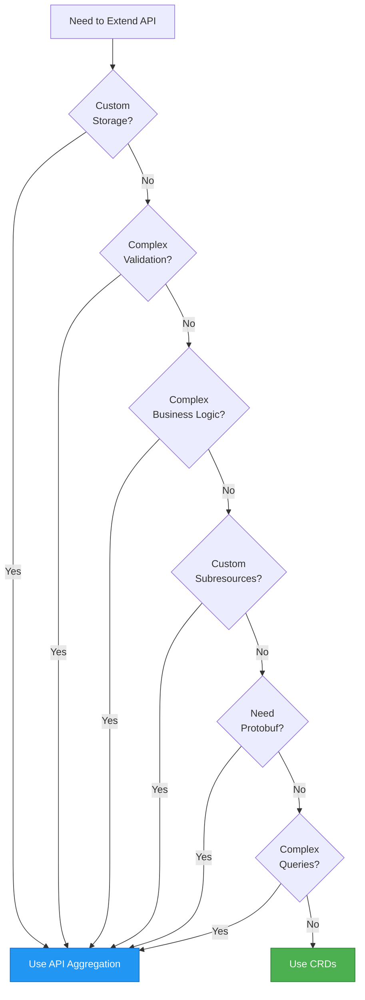
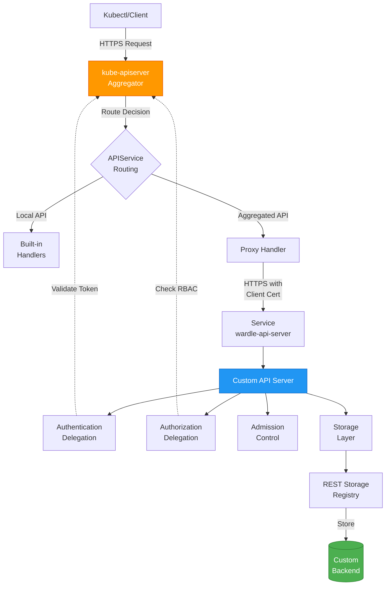
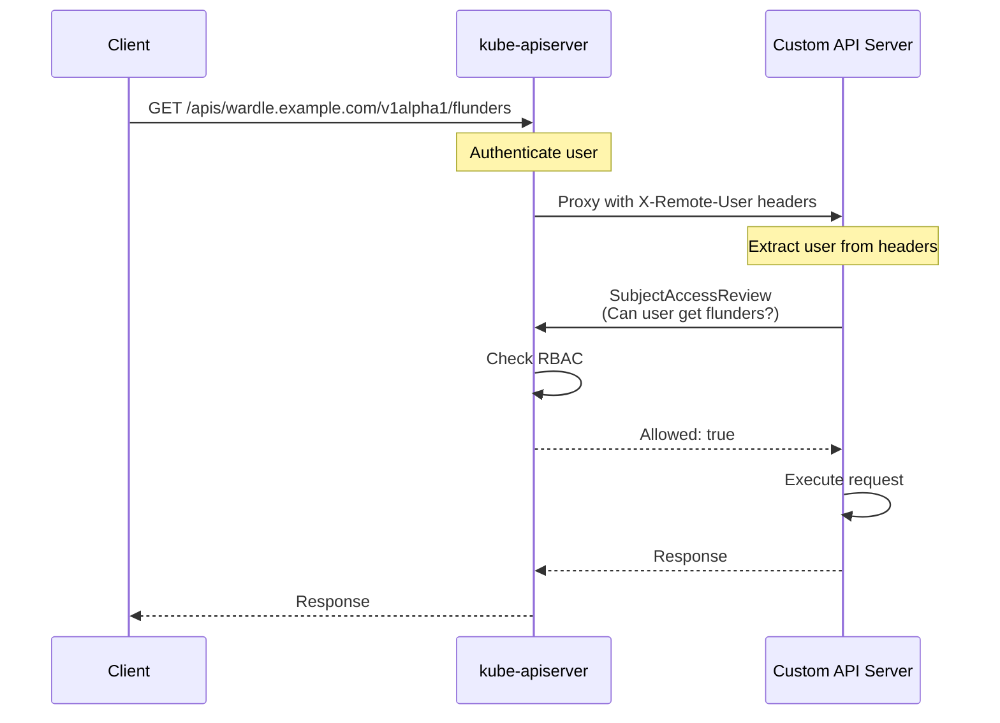
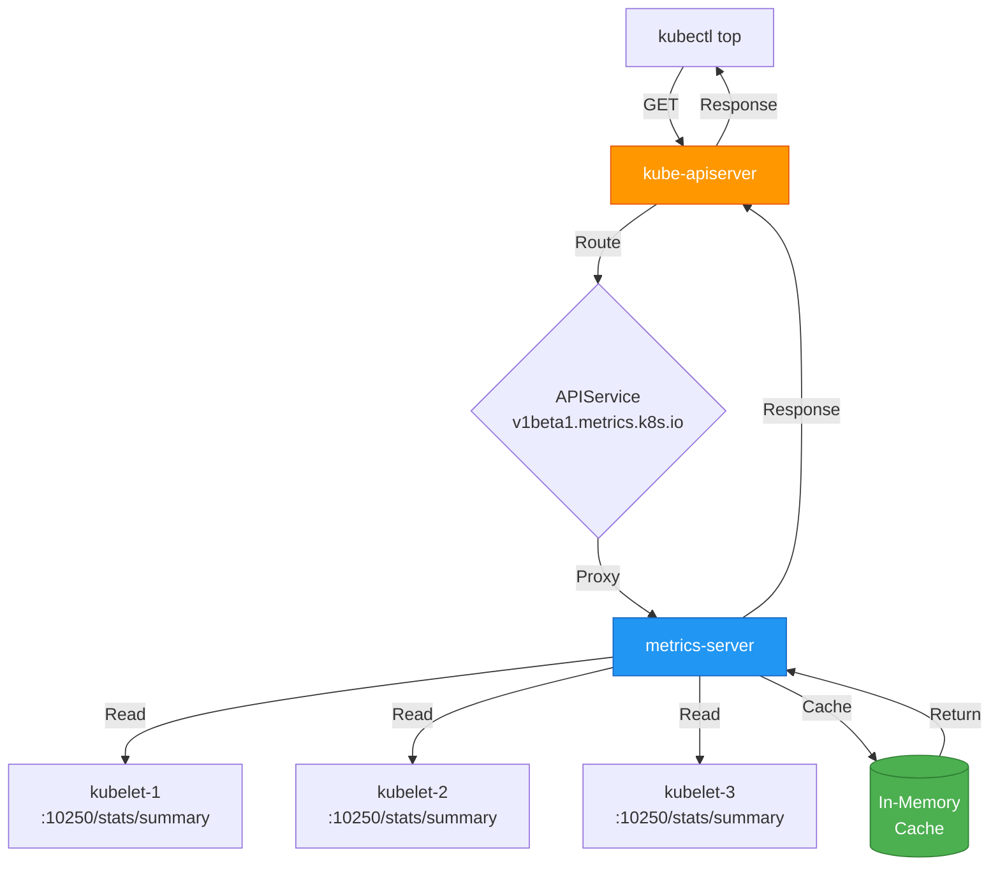

# **API Aggregation - Extending Kubernetes with Custom API Servers**

━━━━━━━━━━━━━━━━━━━━━━━━━━━━━━━━━━━━━━━━━━━━━━━━━━━━━━━━━━━━━━━━━━━━━━━━━━━━━━

## **Overview**

**API Aggregation** enables extending the Kubernetes API with custom API servers that run as separate processes. Unlike CustomResourceDefinitions (CRDs) which extend the API within the main kube-apiserver, aggregated APIs provide full control over API implementation, storage, validation, and custom business logic.

**Key Capabilities**:
- Custom storage backends (not limited to etcd)
- Advanced validation and admission control
- Custom subresources and operations
- Protocol buffer support and optimization
- Independent scaling and versioning
- Integration with existing Kubernetes RBAC and authentication

**Use Cases**:
- Complex domain logic requiring custom code
- Integration with external systems
- Advanced query capabilities beyond label selectors
- Metrics and monitoring APIs (e.g., metrics-server)
- Service catalog and operator APIs

━━━━━━━━━━━━━━━━━━━━━━━━━━━━━━━━━━━━━━━━━━━━━━━━━━━━━━━━━━━━━━━━━━━━━━━━━━━━━━

## **APIService Resource Structure**

### **APIService Definition**

The **APIService** resource registers a custom API server with the kube-apiserver aggregator. When clients make requests to aggregated API paths, kube-apiserver proxies them to the backing service.

**APIService Types** (`staging/src/k8s.io/kube-aggregator/pkg/apis/apiregistration/v1/types.go:49-164`):

```go
// APIService represents a server for a particular GroupVersion
type APIService struct {
    metav1.TypeMeta   `json:",inline"`
    metav1.ObjectMeta `json:"metadata,omitempty"`

    // Spec contains information for locating and communicating with a server
    Spec APIServiceSpec `json:"spec,omitempty"`

    // Status contains derived information about an API server
    Status APIServiceStatus `json:"status,omitempty"`
}

// APIServiceSpec contains information for locating and communicating with a server
type APIServiceSpec struct {
    // Service is a reference to the service for this API server
    // If nil, the API is handled locally (by kube-apiserver)
    Service *ServiceReference `json:"service,omitempty"`

    // Group is the API group name this server hosts
    Group string `json:"group,omitempty"`

    // Version is the API version this server hosts (e.g., "v1")
    Version string `json:"version,omitempty"`

    // InsecureSkipTLSVerify disables TLS certificate verification
    // Strongly discouraged - use CABundle instead
    InsecureSkipTLSVerify bool `json:"insecureSkipTLSVerify,omitempty"`

    // CABundle is a PEM encoded CA bundle for validating the server's certificate
    CABundle []byte `json:"caBundle,omitempty"`

    // GroupPriorityMinimum is the priority this group should have at least
    // Higher priority means the group is preferred by clients
    // Primary sort is based on GroupPriorityMinimum (20 before 10)
    // Recommendations:
    //   - *.k8s.io (except extensions): 18000
    //   - PaaSes (OpenShift, Deis): 2000s
    GroupPriorityMinimum int32 `json:"groupPriorityMinimum"`

    // VersionPriority controls ordering of this API version inside its group
    // Must be greater than zero
    // Primary sort: VersionPriority (20 before 10)
    // Secondary sort: Version string (kube-like versions, then lexicographic)
    VersionPriority int32 `json:"versionPriority"`
}

// ServiceReference holds a reference to Service.legacy.k8s.io
type ServiceReference struct {
    // Namespace is the namespace of the service
    Namespace string `json:"namespace,omitempty"`

    // Name is the name of the service
    Name string `json:"name,omitempty"`

    // Port is the service port (defaults to 443)
    // Valid range: 1-65535
    Port *int32 `json:"port,omitempty"`
}

// APIServiceStatus contains derived information about an API server
type APIServiceStatus struct {
    // Conditions current service state of apiService
    Conditions []APIServiceCondition `json:"conditions,omitempty"`
}

// APIServiceCondition describes the state of an APIService
type APIServiceCondition struct {
    // Type is the type of the condition (e.g., Available)
    Type APIServiceConditionType `json:"type"`

    // Status is the status of the condition (True, False, Unknown)
    Status ConditionStatus `json:"status"`

    // LastTransitionTime is when the condition last changed
    LastTransitionTime metav1.Time `json:"lastTransitionTime,omitempty"`

    // Reason is a one-word CamelCase reason for the condition
    Reason string `json:"reason,omitempty"`

    // Message is a human-readable message about the condition
    Message string `json:"message,omitempty"`
}
```

### **Example APIService Definition**

```yaml
apiVersion: apiregistration.k8s.io/v1
kind: APIService
metadata:
  name: v1beta1.metrics.k8s.io
spec:
  # Service reference - where to proxy requests
  service:
    namespace: kube-system
    name: metrics-server
    port: 443

  # Group and version this APIService handles
  group: metrics.k8s.io
  version: v1beta1

  # TLS configuration
  insecureSkipTLSVerify: false
  caBundle: LS0tLS1CRUdJTi... # Base64 encoded CA certificate

  # Priority configuration
  groupPriorityMinimum: 100    # Priority relative to other groups
  versionPriority: 100          # Priority within the group

status:
  conditions:
  - type: Available
    status: "True"
    lastTransitionTime: "2024-01-15T10:00:00Z"
    reason: Passed
    message: all checks passed
```

### **Local vs Remote APIServices**

**Local APIServices** (Service is nil):
- Handled directly by kube-apiserver
- Core Kubernetes APIs (pods, services, etc.)
- No network hop required
- Highest priority in discovery

```yaml
# Local APIService - handled by kube-apiserver itself
apiVersion: apiregistration.k8s.io/v1
kind: APIService
metadata:
  name: v1.
spec:
  group: ""           # Empty for core API
  version: v1
  service: null       # Local - no service reference
  groupPriorityMinimum: 18000
  versionPriority: 1
```

**Remote APIServices** (Service is non-nil):
- Proxied to external service
- Custom API servers
- Requires network call
- Certificate validation needed

```yaml
# Remote APIService - proxied to external server
apiVersion: apiregistration.k8s.io/v1
kind: APIService
metadata:
  name: v1alpha1.wardle.example.com
spec:
  group: wardle.example.com
  version: v1alpha1
  service:
    namespace: wardle-system
    name: wardle-api-server
    port: 443
  caBundle: LS0tLS1CRUdJTi...
  groupPriorityMinimum: 1000
  versionPriority: 15
```

━━━━━━━━━━━━━━━━━━━━━━━━━━━━━━━━━━━━━━━━━━━━━━━━━━━━━━━━━━━━━━━━━━━━━━━━━━━━━━

## **When to Use API Aggregation vs CRDs**

### **Decision Matrix**

| **Criteria** | **Use CRDs** | **Use API Aggregation** |
|--------------|--------------|--------------------------|
| **Complexity** | Simple declarative resources | Complex business logic required |
| **Storage** | etcd is acceptable | Need custom storage (SQL, external systems) |
| **Validation** | OpenAPI v3 schema sufficient | Complex validation logic needed |
| **Performance** | Standard etcd performance OK | Need optimization (caching, indexing) |
| **Subresources** | Standard status/scale enough | Need custom subresources (exec, logs, etc.) |
| **Development effort** | Minimal (just YAML + controller) | Significant (full API server code) |
| **Protocol buffer** | JSON only | Need protobuf for performance |
| **Query capabilities** | Label/field selectors sufficient | Need complex queries (SQL-like) |
| **External integration** | Kubernetes-native only | Integrate with existing systems |
| **Admission control** | Webhooks sufficient | Need custom admission logic |

### **Recommendation Flow**



### **Real-World Examples**

**Use CRDs**:
- **Operators**: Deploy and manage applications (Prometheus Operator)
- **Configuration**: Store cluster configuration (NetworkPolicies)
- **Simple workflows**: GitOps resources, pipelines
- **Custom controllers**: Reconciliation loops without complex queries

**Use API Aggregation**:
- **Metrics Server**: Custom query capabilities, efficient storage
- **Service Catalog**: Integration with external service brokers
- **Virtual Kubelet**: Node API with custom backing
- **KubeVirt**: Virtual machine management with complex lifecycle
- **Knative Serving**: Sophisticated autoscaling and routing logic

### **Hybrid Approach**

Some systems use **both CRDs and API aggregation**:

```yaml
# CRD for configuration
apiVersion: apiextensions.k8s.io/v1
kind: CustomResourceDefinition
metadata:
  name: databases.example.com
spec:
  group: example.com
  names:
    kind: Database
  versions:
  - name: v1
    served: true
    storage: true
---
# Aggregated API for metrics
apiVersion: apiregistration.k8s.io/v1
kind: APIService
metadata:
  name: v1alpha1.metrics.example.com
spec:
  group: metrics.example.com
  version: v1alpha1
  service:
    name: database-metrics-api
    namespace: default
```

**Benefits of hybrid**:
- CRD for user-facing configuration (declarative)
- Aggregated API for internal metrics/status (optimized queries)
- CRD controllers watch CRDs, call aggregated API for complex operations

━━━━━━━━━━━━━━━━━━━━━━━━━━━━━━━━━━━━━━━━━━━━━━━━━━━━━━━━━━━━━━━━━━━━━━━━━━━━━━

## **Custom API Server Architecture**

### **GenericAPIServer Foundation**

All custom API servers build on **GenericAPIServer** from `k8s.io/apiserver`, which provides:
- HTTP server and routing
- Authentication/authorization delegation
- Request handling pipeline
- Storage interface abstraction
- OpenAPI/Discovery integration
- Admission control framework
- Audit logging
- Metrics and tracing

**GenericAPIServer structure** (`staging/src/k8s.io/sample-apiserver/pkg/apiserver/apiserver.go:34-125`):

```go
package apiserver

import (
    metav1 "k8s.io/apimachinery/pkg/apis/meta/v1"
    "k8s.io/apimachinery/pkg/runtime"
    "k8s.io/apimachinery/pkg/runtime/schema"
    "k8s.io/apimachinery/pkg/runtime/serializer"
    "k8s.io/apiserver/pkg/registry/rest"
    genericapiserver "k8s.io/apiserver/pkg/server"

    "k8s.io/sample-apiserver/pkg/apis/wardle"
    "k8s.io/sample-apiserver/pkg/apis/wardle/install"
    wardleregistry "k8s.io/sample-apiserver/pkg/registry"
    flunderstorage "k8s.io/sample-apiserver/pkg/registry/wardle/flunder"
)

var (
    // Scheme defines methods for serializing and deserializing API objects
    Scheme = runtime.NewScheme()

    // Codecs provides methods for retrieving codecs and serializers
    Codecs = serializer.NewCodecFactory(Scheme)
)

func init() {
    // Install all API versions into the scheme
    install.Install(Scheme)

    // Add v1 metadata types
    metav1.AddToGroupVersion(Scheme, schema.GroupVersion{Version: "v1"})

    // Add unversioned types
    unversioned := schema.GroupVersion{Group: "", Version: "v1"}
    Scheme.AddUnversionedTypes(unversioned,
        &metav1.Status{},
        &metav1.APIVersions{},
        &metav1.APIGroupList{},
        &metav1.APIGroup{},
        &metav1.APIResourceList{},
    )
}

// Config defines the config for the apiserver
type Config struct {
    GenericConfig *genericapiserver.RecommendedConfig
    ExtraConfig   ExtraConfig
}

// ExtraConfig holds custom apiserver config
type ExtraConfig struct {
    // Place your custom config here
}

// WardleServer contains state for a Kubernetes cluster master/api server
type WardleServer struct {
    GenericAPIServer *genericapiserver.GenericAPIServer
}

// Complete fills in any fields not set that are required to have valid data
func (cfg *Config) Complete() CompletedConfig {
    c := completedConfig{
        cfg.GenericConfig.Complete(),
        &cfg.ExtraConfig,
    }
    return CompletedConfig{&c}
}

// New returns a new instance of WardleServer from the given config
func (c completedConfig) New() (*WardleServer, error) {
    // Create generic API server
    genericServer, err := c.GenericConfig.New(
        "sample-apiserver",
        genericapiserver.NewEmptyDelegate(),
    )
    if err != nil {
        return nil, err
    }

    s := &WardleServer{
        GenericAPIServer: genericServer,
    }

    // Create API group info
    apiGroupInfo := genericapiserver.NewDefaultAPIGroupInfo(
        wardle.GroupName,
        Scheme,
        metav1.ParameterCodec,
        Codecs,
    )

    // Register v1alpha1 storage
    v1alpha1storage := map[string]rest.Storage{}
    v1alpha1storage["flunders"] = wardleregistry.RESTInPeace(
        flunderstorage.NewREST(Scheme, c.GenericConfig.RESTOptionsGetter),
    )
    apiGroupInfo.VersionedResourcesStorageMap["v1alpha1"] = v1alpha1storage

    // Install API group
    if err := s.GenericAPIServer.InstallAPIGroup(&apiGroupInfo); err != nil {
        return nil, err
    }

    return s, nil
}
```

### **API Server Component Architecture**



### **Request Flow Through Aggregator**

**Proxy handler logic** (`staging/src/k8s.io/kube-aggregator/pkg/apiserver/handler_proxy.go:106-187`):

```go
func (r *proxyHandler) ServeHTTP(w http.ResponseWriter, req *http.Request) {
    value := r.handlingInfo.Load()
    if value == nil {
        r.localDelegate.ServeHTTP(w, req)
        return
    }

    handlingInfo := value.(proxyHandlingInfo)

    // Handle local APIServices
    if handlingInfo.local {
        if r.localDelegate == nil {
            http.Error(w, "", http.StatusNotFound)
            return
        }
        r.localDelegate.ServeHTTP(w, req)
        return
    }

    // Check if service is available
    if !handlingInfo.serviceAvailable {
        proxyError(w, req, "service unavailable", http.StatusServiceUnavailable)
        return
    }

    // Extract user from request context
    user, ok := genericapirequest.UserFrom(req.Context())
    if !ok {
        proxyError(w, req, "missing user", http.StatusInternalServerError)
        return
    }

    // Build target location
    location := &url.URL{}
    location.Scheme = "https"
    rloc, err := r.serviceResolver.ResolveEndpoint(
        handlingInfo.serviceNamespace,
        handlingInfo.serviceName,
        handlingInfo.servicePort,
    )
    if err != nil {
        proxyError(w, req, "service unavailable", http.StatusServiceUnavailable)
        return
    }
    location.Host = rloc.Host
    location.Path = req.URL.Path
    location.RawQuery = req.URL.Query().Encode()

    // Create new request for proxy
    newReq, cancelFn := apiserverproxyutil.NewRequestForProxy(location, req)
    defer cancelFn()

    // Add authentication headers
    proxyRoundTripper := transport.NewAuthProxyRoundTripper(
        user.GetName(),
        user.GetUID(),
        user.GetGroups(),
        user.GetExtra(),
        handlingInfo.proxyRoundTripper,
    )

    // Handle upgrade requests (websockets, SPDY)
    upgrade := httpstream.IsUpgradeRequest(req)
    if upgrade {
        transport.SetAuthProxyHeaders(newReq, user.GetName(), user.GetUID(),
            user.GetGroups(), user.GetExtra())
    }

    // Proxy the request
    handler := proxy.NewUpgradeAwareHandler(location, proxyRoundTripper,
        true, upgrade, &responder{w: w})
    handler.ServeHTTP(w, newReq)
}
```

━━━━━━━━━━━━━━━━━━━━━━━━━━━━━━━━━━━━━━━━━━━━━━━━━━━━━━━━━━━━━━━━━━━━━━━━━━━━━━

## **Delegated Authentication and Authorization**

### **Authentication Delegation**

The aggregator forwards user credentials to the aggregated API server using **authentication headers**:

**Authentication headers added**:
```
X-Remote-User: <username>
X-Remote-Group: <group1>
X-Remote-Group: <group2>
X-Remote-Extra-<key>: <value>
X-Remote-Uid: <user-uid>
```

**Custom API server validates these headers**:

```go
package server

import (
    "k8s.io/apiserver/pkg/server"
    "k8s.io/apiserver/pkg/server/options"
)

func (o *WardleServerOptions) Config() (*apiserver.Config, error) {
    // Configure recommended options
    serverConfig := genericapiserver.NewRecommendedConfig(apiserver.Codecs)

    // Configure authentication
    if err := o.RecommendedOptions.Authentication.ApplyTo(
        &serverConfig.Authentication,
        serverConfig.SecureServing,
        serverConfig.OpenAPIConfig,
    ); err != nil {
        return nil, err
    }

    // This enables delegated authentication
    // The API server will trust X-Remote-User headers from the aggregator
    serverConfig.Authentication.RequestHeaderConfig = &authenticator.RequestHeaderConfig{
        UsernameHeaders:     []string{"X-Remote-User"},
        GroupHeaders:        []string{"X-Remote-Group"},
        ExtraHeaderPrefixes: []string{"X-Remote-Extra-"},
        ClientCAFile:        "/path/to/request-header-ca.crt",
        AllowedClientNames:  []string{"kube-apiserver-proxy-client"},
    }

    return &apiserver.Config{
        GenericConfig: serverConfig,
    }, nil
}
```

### **Authorization Delegation**

Custom API servers delegate authorization checks back to kube-apiserver using **SubjectAccessReview**:

**Authorization flow**:



**SubjectAccessReview implementation**:

```go
import (
    authorizationv1 "k8s.io/api/authorization/v1"
    "k8s.io/client-go/kubernetes"
)

func checkAuthorization(client kubernetes.Interface, user, verb, group, resource, name string) (bool, error) {
    sar := &authorizationv1.SubjectAccessReview{
        Spec: authorizationv1.SubjectAccessReviewSpec{
            User: user,
            ResourceAttributes: &authorizationv1.ResourceAttributes{
                Verb:     verb,      // get, list, create, update, delete
                Group:    group,     // wardle.example.com
                Resource: resource,  // flunders
                Name:     name,      // specific resource name
            },
        },
    }

    result, err := client.AuthorizationV1().SubjectAccessReviews().Create(
        context.TODO(), sar, metav1.CreateOptions{},
    )
    if err != nil {
        return false, err
    }

    return result.Status.Allowed, nil
}
```

**Simplified authorization using GenericAPIServer**:

```go
// GenericAPIServer handles authorization automatically
// Configure it in RecommendedOptions

func (o *WardleServerOptions) Config() (*apiserver.Config, error) {
    serverConfig := genericapiserver.NewRecommendedConfig(apiserver.Codecs)

    // Authorization delegation configuration
    if err := o.RecommendedOptions.Authorization.ApplyTo(
        &serverConfig.Authorization,
    ); err != nil {
        return nil, err
    }

    // Now all requests will be automatically authorized
    // using SubjectAccessReview against kube-apiserver
    return &apiserver.Config{GenericConfig: serverConfig}, nil
}
```

### **Certificate-Based Trust**

The aggregator and custom API server mutually authenticate:

**Aggregator → Custom API Server**:
- Aggregator presents **client certificate** (proxy-client cert)
- Custom API server validates against **request-header CA**

**Custom API Server → Aggregator**:
- Custom API server presents **server certificate** (serving cert)
- Aggregator validates against **caBundle** in APIService

**Certificate generation**:

```bash
#!/bin/bash
# Generate certificates for API aggregation

# 1. Generate proxy client cert (for aggregator)
openssl req -x509 -newkey rsa:2048 -nodes \
  -keyout proxy-client.key \
  -out proxy-client.crt \
  -days 365 \
  -subj "/CN=aggregator-proxy-client"

# 2. Generate serving cert for custom API server
openssl req -x509 -newkey rsa:2048 -nodes \
  -keyout serving.key \
  -out serving.crt \
  -days 365 \
  -subj "/CN=wardle-api-server.wardle-system.svc" \
  -addext "subjectAltName=DNS:wardle-api-server.wardle-system.svc,DNS:wardle-api-server.wardle-system.svc.cluster.local"

# 3. Create secrets
kubectl create secret tls wardle-serving-cert \
  --cert=serving.crt \
  --key=serving.key \
  -n wardle-system

# 4. Update APIService with caBundle
CA_BUNDLE=$(cat serving.crt | base64 | tr -d '\n')
kubectl patch apiservice v1alpha1.wardle.example.com \
  --type='json' -p="[{\"op\": \"replace\", \"path\": \"/spec/caBundle\", \"value\":\"$CA_BUNDLE\"}]"
```

━━━━━━━━━━━━━━━━━━━━━━━━━━━━━━━━━━━━━━━━━━━━━━━━━━━━━━━━━━━━━━━━━━━━━━━━━━━━━━

## **API Priority and Ordering**

### **Priority Algorithm**

API groups and versions are ordered by priority to determine precedence in discovery and client selection.

**Priority sorting** (`staging/src/k8s.io/kube-aggregator/pkg/controllers/openapi/aggregator/priority.go:25-78`):

```go
// byPriority sorts APIServices by priority
type byPriority struct {
    apiServices     []*apiregistrationv1.APIService
    groupPriorities map[string]int32
}

func (a byPriority) Less(i, j int) bool {
    // Rule 1: Local specs come first (Service == nil)
    if a.apiServices[i].Spec.Service == nil && a.apiServices[j].Spec.Service != nil {
        return true
    }
    if a.apiServices[i].Spec.Service != nil && a.apiServices[j].Spec.Service == nil {
        return false
    }

    // Rule 2: For local specs, sort by name
    if a.apiServices[i].Spec.Service == nil {
        return a.apiServices[i].Name < a.apiServices[j].Name
    }

    // Rule 3: For remote specs, sort by priority
    var iPriority, jPriority int32
    if a.apiServices[i].Spec.Group == a.apiServices[j].Spec.Group {
        // Same group - use VersionPriority
        iPriority = a.apiServices[i].Spec.VersionPriority
        jPriority = a.apiServices[j].Spec.VersionPriority
    } else {
        // Different groups - use GroupPriorityMinimum
        iPriority = a.groupPriorities[a.apiServices[i].Spec.Group]
        jPriority = a.groupPriorities[a.apiServices[j].Spec.Group]
    }

    if iPriority != jPriority {
        // Higher priority comes first
        return iPriority > jPriority
    }

    // Rule 4: If priorities equal, sort by name
    return a.apiServices[i].Name < a.apiServices[j].Name
}
```

### **Priority Examples**

**Group priority recommendations**:

| **Group Type** | **Priority Range** | **Examples** |
|----------------|-------------------|--------------|
| **Core APIs** (local) | 18000+ | v1 (pods, services) |
| **Kubernetes APIs** (local) | 17000-18000 | apps/v1, batch/v1 |
| **Extended APIs** (*.k8s.io) | 16000-17000 | metrics.k8s.io, apiextensions.k8s.io |
| **PaaS platforms** | 2000-3000 | openshift.io |
| **Third-party** | 1000-2000 | custom operators |
| **Experimental** | 100-1000 | alpha features |

**Version priority**:

```yaml
# Example: metrics.k8s.io with two versions
---
apiVersion: apiregistration.k8s.io/v1
kind: APIService
metadata:
  name: v1beta1.metrics.k8s.io
spec:
  group: metrics.k8s.io
  version: v1beta1
  groupPriorityMinimum: 100
  versionPriority: 100    # Lower priority
---
apiVersion: apiregistration.k8s.io/v1
kind: APIService
metadata:
  name: v1.metrics.k8s.io
spec:
  group: metrics.k8s.io
  version: v1
  groupPriorityMinimum: 100
  versionPriority: 200    # Higher priority - preferred version
```

### **Discovery with Priority**

**API discovery response**:

```json
{
  "kind": "APIGroupList",
  "apiVersion": "v1",
  "groups": [
    {
      "name": "metrics.k8s.io",
      "versions": [
        {
          "groupVersion": "metrics.k8s.io/v1",
          "version": "v1"
        },
        {
          "groupVersion": "metrics.k8s.io/v1beta1",
          "version": "v1beta1"
        }
      ],
      "preferredVersion": {
        "groupVersion": "metrics.k8s.io/v1",
        "version": "v1"
      }
    }
  ]
}
```

Clients use **preferredVersion** (determined by VersionPriority) when no specific version is requested.

━━━━━━━━━━━━━━━━━━━━━━━━━━━━━━━━━━━━━━━━━━━━━━━━━━━━━━━━━━━━━━━━━━━━━━━━━━━━━━

## **Request Proxying and Delegation**

### **Proxying Mechanism**

The aggregator acts as a **reverse proxy** for aggregated APIs:

1. **Route selection**: Determine if request is for local or aggregated API
2. **Endpoint resolution**: Resolve service to pod endpoints
3. **Request transformation**: Add authentication headers
4. **TLS verification**: Validate server certificate
5. **Proxy request**: Forward to backend
6. **Response streaming**: Stream response back to client

**Endpoint resolution**:

```go
// ServiceResolver resolves services to routable endpoints
type ServiceResolver interface {
    ResolveEndpoint(namespace, name string, port int32) (*url.URL, error)
}

// Example: Kubernetes service resolver
type kubeServiceResolver struct {
    client kubernetes.Interface
}

func (r *kubeServiceResolver) ResolveEndpoint(namespace, name string, port int32) (*url.URL, error) {
    // Get service
    svc, err := r.client.CoreV1().Services(namespace).Get(
        context.TODO(), name, metav1.GetOptions{},
    )
    if err != nil {
        return nil, err
    }

    // Find endpoints
    endpoints, err := r.client.CoreV1().Endpoints(namespace).Get(
        context.TODO(), name, metav1.GetOptions{},
    )
    if err != nil {
        return nil, err
    }

    // Select endpoint (typically first ready address)
    if len(endpoints.Subsets) == 0 || len(endpoints.Subsets[0].Addresses) == 0 {
        return nil, fmt.Errorf("no endpoints available")
    }

    addr := endpoints.Subsets[0].Addresses[0]
    return &url.URL{
        Scheme: "https",
        Host:   fmt.Sprintf("%s:%d", addr.IP, port),
    }, nil
}
```

### **Upgrade Requests (WebSockets, SPDY)**

Special handling for **protocol upgrade** requests (exec, logs, port-forward):

```go
// Handle upgrade requests
upgrade := httpstream.IsUpgradeRequest(req)
if upgrade {
    // For upgrades, set auth headers on the request itself
    // (bypass round tripper which doesn't run for upgrades)
    transport.SetAuthProxyHeaders(newReq,
        user.GetName(),
        user.GetUID(),
        user.GetGroups(),
        user.GetExtra(),
    )
}

// Create upgrade-aware proxy handler
handler := proxy.NewUpgradeAwareHandler(
    location,              // Backend URL
    proxyRoundTripper,    // HTTP client
    true,                 // Respect location
    upgrade,              // Is this an upgrade request?
    &responder{w: w},     // Error responder
)

handler.ServeHTTP(w, newReq)
```

### **Load Balancing and HA**

**Multiple backend endpoints**:

```go
// Round-robin load balancer
type roundRobinResolver struct {
    client   kubernetes.Interface
    counters map[string]*int32
    mu       sync.Mutex
}

func (r *roundRobinResolver) ResolveEndpoint(namespace, name string, port int32) (*url.URL, error) {
    endpoints, err := r.client.CoreV1().Endpoints(namespace).Get(
        context.TODO(), name, metav1.GetOptions{},
    )
    if err != nil {
        return nil, err
    }

    // Collect all ready addresses
    var addresses []string
    for _, subset := range endpoints.Subsets {
        for _, addr := range subset.Addresses {
            addresses = append(addresses, addr.IP)
        }
    }

    if len(addresses) == 0 {
        return nil, fmt.Errorf("no endpoints available")
    }

    // Round-robin selection
    r.mu.Lock()
    key := fmt.Sprintf("%s/%s", namespace, name)
    if r.counters[key] == nil {
        var zero int32 = 0
        r.counters[key] = &zero
    }
    counter := atomic.AddInt32(r.counters[key], 1)
    r.mu.Unlock()

    selected := addresses[int(counter)%len(addresses)]

    return &url.URL{
        Scheme: "https",
        Host:   fmt.Sprintf("%s:%d", selected, port),
    }, nil
}
```

━━━━━━━━━━━━━━━━━━━━━━━━━━━━━━━━━━━━━━━━━━━━━━━━━━━━━━━━━━━━━━━━━━━━━━━━━━━━━━

## **Complete Aggregated API Server Implementation**

### **API Types Definition**

**Define your API types** (`pkg/apis/wardle/types.go`):

```go
package wardle

import (
    metav1 "k8s.io/apimachinery/pkg/apis/meta/v1"
)

// +genclient
// +k8s:deepcopy-gen:interfaces=k8s.io/apimachinery/pkg/runtime.Object

// Flunder is a custom resource
type Flunder struct {
    metav1.TypeMeta   `json:",inline"`
    metav1.ObjectMeta `json:"metadata,omitempty"`

    Spec   FlunderSpec   `json:"spec"`
    Status FlunderStatus `json:"status,omitempty"`
}

type FlunderSpec struct {
    // ReferenceGrant allows access to reference another namespace
    ReferenceGrant string `json:"referenceGrant,omitempty"`
}

type FlunderStatus struct {
    // Conditions represent the latest available observations
    Conditions []FlunderCondition `json:"conditions,omitempty"`
}

type FlunderCondition struct {
    Type               string             `json:"type"`
    Status             metav1.ConditionStatus `json:"status"`
    LastTransitionTime metav1.Time        `json:"lastTransitionTime,omitempty"`
    Reason             string             `json:"reason,omitempty"`
    Message            string             `json:"message,omitempty"`
}

// +k8s:deepcopy-gen:interfaces=k8s.io/apimachinery/pkg/runtime.Object

// FlunderList is a list of Flunder resources
type FlunderList struct {
    metav1.TypeMeta `json:",inline"`
    metav1.ListMeta `json:"metadata,omitempty"`

    Items []Flunder `json:"items"`
}
```

### **Versioned Types** (`pkg/apis/wardle/v1alpha1/types.go`):

```go
package v1alpha1

import (
    metav1 "k8s.io/apimachinery/pkg/apis/meta/v1"
)

// +genclient
// +k8s:deepcopy-gen:interfaces=k8s.io/apimachinery/pkg/runtime.Object

type Flunder struct {
    metav1.TypeMeta   `json:",inline"`
    metav1.ObjectMeta `json:"metadata,omitempty"`

    Spec   FlunderSpec   `json:"spec"`
    Status FlunderStatus `json:"status,omitempty"`
}

type FlunderSpec struct {
    ReferenceGrant string `json:"referenceGrant,omitempty"`
}

type FlunderStatus struct {
    Conditions []FlunderCondition `json:"conditions,omitempty"`
}

type FlunderCondition struct {
    Type               string                  `json:"type"`
    Status             metav1.ConditionStatus  `json:"status"`
    LastTransitionTime metav1.Time             `json:"lastTransitionTime,omitempty"`
    Reason             string                  `json:"reason,omitempty"`
    Message            string                  `json:"message,omitempty"`
}

// +k8s:deepcopy-gen:interfaces=k8s.io/apimachinery/pkg/runtime.Object

type FlunderList struct {
    metav1.TypeMeta `json:",inline"`
    metav1.ListMeta `json:"metadata,omitempty"`

    Items []Flunder `json:"items"`
}
```

### **Storage Implementation**

**REST storage** (`pkg/registry/wardle/flunder/etcd.go`):

```go
package flunder

import (
    "k8s.io/apimachinery/pkg/runtime"
    "k8s.io/apiserver/pkg/registry/generic"
    genericregistry "k8s.io/apiserver/pkg/registry/generic/registry"
    "k8s.io/apiserver/pkg/registry/rest"

    "k8s.io/sample-apiserver/pkg/apis/wardle"
)

// REST implements a RESTStorage for Flunders
type REST struct {
    *genericregistry.Store
}

// NewREST returns a RESTStorage object that will work against Flunders
func NewREST(scheme *runtime.Scheme, optsGetter generic.RESTOptionsGetter) (*REST, error) {
    strategy := NewStrategy(scheme)

    store := &genericregistry.Store{
        NewFunc:                   func() runtime.Object { return &wardle.Flunder{} },
        NewListFunc:               func() runtime.Object { return &wardle.FlunderList{} },
        PredicateFunc:             MatchFlunder,
        DefaultQualifiedResource:  wardle.Resource("flunders"),
        SingularQualifiedResource: wardle.Resource("flunder"),

        CreateStrategy: strategy,
        UpdateStrategy: strategy,
        DeleteStrategy: strategy,

        TableConvertor: rest.NewDefaultTableConvertor(wardle.Resource("flunders")),
    }

    options := &generic.StoreOptions{
        RESTOptions: optsGetter,
        AttrFunc:    GetAttrs,
    }

    if err := store.CompleteWithOptions(options); err != nil {
        return nil, err
    }

    return &REST{store}, nil
}

// Implement the rest.ShortNamesProvider interface
func (r *REST) ShortNames() []string {
    return []string{"fln"}
}
```

**Strategy** (`pkg/registry/wardle/flunder/strategy.go`):

```go
package flunder

import (
    "context"

    "k8s.io/apimachinery/pkg/runtime"
    "k8s.io/apimachinery/pkg/util/validation/field"
    "k8s.io/apiserver/pkg/registry/rest"
    "k8s.io/apiserver/pkg/storage/names"

    "k8s.io/sample-apiserver/pkg/apis/wardle"
    "k8s.io/sample-apiserver/pkg/apis/wardle/validation"
)

type flunderStrategy struct {
    runtime.ObjectTyper
    names.NameGenerator
}

func NewStrategy(typer runtime.ObjectTyper) flunderStrategy {
    return flunderStrategy{typer, names.SimpleNameGenerator}
}

// NamespaceScoped returns true because Flunders are namespaced
func (flunderStrategy) NamespaceScoped() bool {
    return true
}

// PrepareForCreate clears fields that are not allowed on creation
func (flunderStrategy) PrepareForCreate(ctx context.Context, obj runtime.Object) {
    flunder := obj.(*wardle.Flunder)
    // Clear status on create
    flunder.Status = wardle.FlunderStatus{}
}

// PrepareForUpdate clears fields that are not allowed on update
func (flunderStrategy) PrepareForUpdate(ctx context.Context, obj, old runtime.Object) {
    newFlunder := obj.(*wardle.Flunder)
    oldFlunder := old.(*wardle.Flunder)

    // Spec is mutable
    // Status should not be changed here (use status subresource)
    newFlunder.Status = oldFlunder.Status
}

// Validate validates a new Flunder
func (flunderStrategy) Validate(ctx context.Context, obj runtime.Object) field.ErrorList {
    flunder := obj.(*wardle.Flunder)
    return validation.ValidateFlunder(flunder)
}

// ValidateUpdate validates an update
func (flunderStrategy) ValidateUpdate(ctx context.Context, obj, old runtime.Object) field.ErrorList {
    newFlunder := obj.(*wardle.Flunder)
    oldFlunder := old.(*wardle.Flunder)
    return validation.ValidateFlunderUpdate(newFlunder, oldFlunder)
}

// AllowCreateOnUpdate allows updates to create objects
func (flunderStrategy) AllowCreateOnUpdate() bool {
    return false
}

// AllowUnconditionalUpdate allows updates even if ResourceVersion doesn't match
func (flunderStrategy) AllowUnconditionalUpdate() bool {
    return false
}

// Canonicalize normalizes the object after validation
func (flunderStrategy) Canonicalize(obj runtime.Object) {
}

// GetAttrs returns labels and fields for indexing
func GetAttrs(obj runtime.Object) (labels.Set, fields.Set, error) {
    flunder, ok := obj.(*wardle.Flunder)
    if !ok {
        return nil, nil, fmt.Errorf("not a Flunder")
    }
    return labels.Set(flunder.Labels), SelectableFields(flunder), nil
}

// SelectableFields returns fields that can be used in field selectors
func SelectableFields(obj *wardle.Flunder) fields.Set {
    return fields.Set{
        "metadata.name":      obj.Name,
        "metadata.namespace": obj.Namespace,
    }
}

// MatchFlunder returns a predicate for matching Flunders
func MatchFlunder(label labels.Selector, field fields.Selector) storage.SelectionPredicate {
    return storage.SelectionPredicate{
        Label:    label,
        Field:    field,
        GetAttrs: GetAttrs,
    }
}
```

### **Main Server** (`cmd/server/main.go`):

```go
package main

import (
    "os"

    "k8s.io/component-base/cli"
    _ "k8s.io/component-base/logs/json/register"

    "k8s.io/sample-apiserver/pkg/cmd/server"
)

func main() {
    ctx := genericapiserver.SetupSignalContext()
    options := server.NewWardleServerOptions(os.Stdout, os.Stderr)
    cmd := server.NewCommandStartWardleServer(ctx, options)
    code := cli.Run(cmd)
    os.Exit(code)
}
```

### **Deployment Manifests**

**API server deployment** (`deploy/apiserver.yaml`):

```yaml
apiVersion: v1
kind: Service
metadata:
  name: wardle-api-server
  namespace: wardle-system
spec:
  ports:
  - port: 443
    protocol: TCP
    targetPort: 443
  selector:
    app: wardle-api-server
---
apiVersion: apps/v1
kind: Deployment
metadata:
  name: wardle-api-server
  namespace: wardle-system
spec:
  replicas: 2
  selector:
    matchLabels:
      app: wardle-api-server
  template:
    metadata:
      labels:
        app: wardle-api-server
    spec:
      containers:
      - name: apiserver
        image: wardle-apiserver:latest
        args:
        - --etcd-servers=http://etcd:2379
        - --secure-port=443
        - --cert-dir=/var/run/wardle-apiserver
        - --authentication-kubeconfig=/etc/kubernetes/kubeconfig
        - --authorization-kubeconfig=/etc/kubernetes/kubeconfig
        - --kubeconfig=/etc/kubernetes/kubeconfig
        ports:
        - containerPort: 443
        volumeMounts:
        - name: kubeconfig
          mountPath: /etc/kubernetes
          readOnly: true
        - name: serving-cert
          mountPath: /var/run/wardle-apiserver
          readOnly: true
        livenessProbe:
          httpGet:
            path: /healthz
            port: 443
            scheme: HTTPS
          initialDelaySeconds: 10
        readinessProbe:
          httpGet:
            path: /readyz
            port: 443
            scheme: HTTPS
          initialDelaySeconds: 5
      volumes:
      - name: kubeconfig
        secret:
          secretName: wardle-kubeconfig
      - name: serving-cert
        secret:
          secretName: wardle-serving-cert
---
apiVersion: apiregistration.k8s.io/v1
kind: APIService
metadata:
  name: v1alpha1.wardle.example.com
spec:
  group: wardle.example.com
  version: v1alpha1
  service:
    namespace: wardle-system
    name: wardle-api-server
    port: 443
  caBundle: LS0tLS1CRUdJTi... # Base64 CA cert
  groupPriorityMinimum: 1000
  versionPriority: 15
```

━━━━━━━━━━━━━━━━━━━━━━━━━━━━━━━━━━━━━━━━━━━━━━━━━━━━━━━━━━━━━━━━━━━━━━━━━━━━━━

## **Real-World Example: Metrics Server Pattern**

### **Metrics Server Architecture**

The **metrics-server** is a canonical example of API aggregation:



**Why metrics-server uses aggregation**:
- **Custom storage**: In-memory cache (not etcd)
- **Custom collection**: Scrapes kubelet APIs directly
- **Query optimization**: Efficient aggregation of pod metrics
- **No persistence**: Metrics are ephemeral
- **Custom protocols**: Uses Summary API from kubelets

### **Metrics API Definition**

```yaml
apiVersion: apiregistration.k8s.io/v1
kind: APIService
metadata:
  name: v1beta1.metrics.k8s.io
spec:
  service:
    namespace: kube-system
    name: metrics-server
  group: metrics.k8s.io
  version: v1beta1
  insecureSkipTLSVerify: true
  groupPriorityMinimum: 100
  versionPriority: 100
```

**Metrics API resources**:

```bash
# Node metrics
kubectl get --raw /apis/metrics.k8s.io/v1beta1/nodes
kubectl get --raw /apis/metrics.k8s.io/v1beta1/nodes/node-1

# Pod metrics
kubectl get --raw /apis/metrics.k8s.io/v1beta1/namespaces/default/pods
kubectl get --raw /apis/metrics.k8s.io/v1beta1/namespaces/default/pods/my-pod

# Top command uses metrics API
kubectl top nodes
kubectl top pods
```

**Response format**:

```json
{
  "kind": "PodMetrics",
  "apiVersion": "metrics.k8s.io/v1beta1",
  "metadata": {
    "name": "my-pod",
    "namespace": "default",
    "creationTimestamp": "2024-01-15T10:00:00Z"
  },
  "timestamp": "2024-01-15T10:00:00Z",
  "window": "30s",
  "containers": [
    {
      "name": "app",
      "usage": {
        "cpu": "100m",
        "memory": "256Mi"
      }
    }
  ]
}
```

━━━━━━━━━━━━━━━━━━━━━━━━━━━━━━━━━━━━━━━━━━━━━━━━━━━━━━━━━━━━━━━━━━━━━━━━━━━━━━

## **Testing Strategies**

### **Unit Tests**

**Test storage operations**:

```go
package flunder

import (
    "context"
    "testing"

    metav1 "k8s.io/apimachinery/pkg/apis/meta/v1"
    "k8s.io/apimachinery/pkg/runtime"
    "k8s.io/apiserver/pkg/registry/generic"
    "k8s.io/apiserver/pkg/storage"
    etcd3testing "k8s.io/apiserver/pkg/storage/etcd3/testing"

    "k8s.io/sample-apiserver/pkg/apis/wardle"
)

func TestFlunderCreate(t *testing.T) {
    ctx, store, closer := setup(t)
    defer closer()

    flunder := &wardle.Flunder{
        ObjectMeta: metav1.ObjectMeta{
            Name:      "test-flunder",
            Namespace: "default",
        },
        Spec: wardle.FlunderSpec{
            ReferenceGrant: "test-grant",
        },
    }

    // Create
    out, err := store.Create(ctx, flunder, nil, &metav1.CreateOptions{})
    if err != nil {
        t.Fatalf("Create failed: %v", err)
    }

    created := out.(*wardle.Flunder)
    if created.Name != flunder.Name {
        t.Errorf("Expected name %s, got %s", flunder.Name, created.Name)
    }

    // Verify it was stored
    obj, err := store.Get(ctx, flunder.Name, &metav1.GetOptions{})
    if err != nil {
        t.Fatalf("Get failed: %v", err)
    }

    retrieved := obj.(*wardle.Flunder)
    if retrieved.Spec.ReferenceGrant != flunder.Spec.ReferenceGrant {
        t.Errorf("Spec mismatch")
    }
}

func setup(t *testing.T) (context.Context, *REST, func()) {
    server, closer := etcd3testing.NewUnsecuredEtcd3TestClientServer(t)

    restOptions := generic.RESTOptions{
        StorageConfig: server.StorageConfig,
        Decorator:     generic.UndecoratedStorage,
        DeleteCollectionWorkers: 1,
        EnableGarbageCollection: false,
        ResourcePrefix: "flunders",
    }

    store, err := NewREST(wardle.Scheme, &testRESTOptionsGetter{restOptions})
    if err != nil {
        t.Fatal(err)
    }

    ctx := context.Background()
    return ctx, store, closer
}
```

### **Integration Tests**

**Test full API server**:

```go
package integration

import (
    "context"
    "testing"
    "time"

    metav1 "k8s.io/apimachinery/pkg/apis/meta/v1"
    "k8s.io/client-go/rest"

    wardleclient "k8s.io/sample-apiserver/pkg/generated/clientset/versioned"
    "k8s.io/sample-apiserver/pkg/generated/clientset/versioned/typed/wardle/v1alpha1"
)

func TestFlunderCRUD(t *testing.T) {
    // Start test API server
    ctx, cancel := context.WithTimeout(context.Background(), 5*time.Minute)
    defer cancel()

    config := startTestServer(t, ctx)
    client := wardleclient.NewForConfigOrDie(config)

    // Create
    flunder := &v1alpha1.Flunder{
        ObjectMeta: metav1.ObjectMeta{
            Name: "test-flunder",
        },
        Spec: v1alpha1.FlunderSpec{
            ReferenceGrant: "test-grant",
        },
    }

    created, err := client.WardleV1alpha1().Flunders("default").Create(
        ctx, flunder, metav1.CreateOptions{},
    )
    if err != nil {
        t.Fatalf("Create failed: %v", err)
    }

    // Get
    retrieved, err := client.WardleV1alpha1().Flunders("default").Get(
        ctx, created.Name, metav1.GetOptions{},
    )
    if err != nil {
        t.Fatalf("Get failed: %v", err)
    }
    if retrieved.Spec.ReferenceGrant != flunder.Spec.ReferenceGrant {
        t.Error("Spec mismatch")
    }

    // List
    list, err := client.WardleV1alpha1().Flunders("default").List(
        ctx, metav1.ListOptions{},
    )
    if err != nil {
        t.Fatalf("List failed: %v", err)
    }
    if len(list.Items) != 1 {
        t.Errorf("Expected 1 item, got %d", len(list.Items))
    }

    // Update
    retrieved.Spec.ReferenceGrant = "updated-grant"
    updated, err := client.WardleV1alpha1().Flunders("default").Update(
        ctx, retrieved, metav1.UpdateOptions{},
    )
    if err != nil {
        t.Fatalf("Update failed: %v", err)
    }
    if updated.Spec.ReferenceGrant != "updated-grant" {
        t.Error("Update didn't persist")
    }

    // Delete
    err = client.WardleV1alpha1().Flunders("default").Delete(
        ctx, created.Name, metav1.DeleteOptions{},
    )
    if err != nil {
        t.Fatalf("Delete failed: %v", err)
    }

    // Verify deletion
    _, err = client.WardleV1alpha1().Flunders("default").Get(
        ctx, created.Name, metav1.GetOptions{},
    )
    if err == nil {
        t.Error("Expected NotFound error after delete")
    }
}
```

### **E2E Tests**

**Test with real cluster**:

```bash
#!/bin/bash
# e2e-test.sh

set -e

# Deploy API server
kubectl apply -f deploy/

# Wait for API server to be ready
kubectl wait --for=condition=Available apiservice/v1alpha1.wardle.example.com --timeout=120s

# Create a resource
kubectl apply -f - <<EOF
apiVersion: wardle.example.com/v1alpha1
kind: Flunder
metadata:
  name: test-flunder
  namespace: default
spec:
  referenceGrant: test-grant
EOF

# Verify creation
kubectl get flunders.wardle.example.com test-flunder -o yaml

# Test update
kubectl patch flunder test-flunder -p '{"spec":{"referenceGrant":"updated-grant"}}'

# Verify update
GRANT=$(kubectl get flunder test-flunder -o jsonpath='{.spec.referenceGrant}')
if [ "$GRANT" != "updated-grant" ]; then
  echo "Update failed"
  exit 1
fi

# Test deletion
kubectl delete flunder test-flunder

# Verify deletion
if kubectl get flunder test-flunder 2>/dev/null; then
  echo "Delete failed"
  exit 1
fi

echo "E2E tests passed!"
```

━━━━━━━━━━━━━━━━━━━━━━━━━━━━━━━━━━━━━━━━━━━━━━━━━━━━━━━━━━━━━━━━━━━━━━━━━━━━━━

## **Monitoring and Observability**

### **Health Checks**

**Implement health endpoints**:

```go
// Add health checks to GenericAPIServer
func (c completedConfig) New() (*WardleServer, error) {
    genericServer, err := c.GenericConfig.New("wardle-apiserver", genericapiserver.NewEmptyDelegate())
    if err != nil {
        return nil, err
    }

    // Add custom health checks
    genericServer.AddHealthChecks(
        healthz.NamedCheck("etcd", func(r *http.Request) error {
            // Check etcd connectivity
            ctx, cancel := context.WithTimeout(r.Context(), 2*time.Second)
            defer cancel()

            _, err := etcdClient.Get(ctx, "health-check")
            return err
        }),
        healthz.NamedCheck("api-registration", func(r *http.Request) error {
            // Check APIService registration
            // ...
            return nil
        }),
    )

    return &WardleServer{GenericAPIServer: genericServer}, nil
}
```

**Health check endpoints**:

```bash
# Liveness probe
curl -k https://localhost:443/healthz
# Response: ok

# Readiness probe
curl -k https://localhost:443/readyz
# Response: ok

# Detailed health
curl -k https://localhost:443/healthz?verbose=true
# Response:
# [+]ping ok
# [+]log ok
# [+]etcd ok
# [+]poststarthook/start-wardle-apiserver-informers ok
# [+]poststarthook/generic-apiserver-start-informers ok
# healthz check passed
```

### **Metrics**

**Expose Prometheus metrics**:

```go
import (
    "github.com/prometheus/client_golang/prometheus"
    "k8s.io/component-base/metrics/legacyregistry"
)

var (
    flunderOperations = prometheus.NewCounterVec(
        prometheus.CounterOpts{
            Name: "wardle_flunder_operations_total",
            Help: "Total number of Flunder operations",
        },
        []string{"operation", "status"},
    )

    flunderOperationDuration = prometheus.NewHistogramVec(
        prometheus.HistogramOpts{
            Name:    "wardle_flunder_operation_duration_seconds",
            Help:    "Duration of Flunder operations",
            Buckets: prometheus.DefBuckets,
        },
        []string{"operation"},
    )
)

func init() {
    legacyregistry.MustRegister(flunderOperations)
    legacyregistry.MustRegister(flunderOperationDuration)
}

// Instrument operations
func (r *REST) Create(ctx context.Context, obj runtime.Object, ...) (runtime.Object, error) {
    start := time.Now()
    defer func() {
        flunderOperationDuration.WithLabelValues("create").Observe(time.Since(start).Seconds())
    }()

    out, err := r.Store.Create(ctx, obj, createValidation, options)

    status := "success"
    if err != nil {
        status = "error"
    }
    flunderOperations.WithLabelValues("create", status).Inc()

    return out, err
}
```

**Metrics endpoint**:

```bash
# Metrics available at /metrics
curl -k https://localhost:443/metrics | grep wardle

# wardle_flunder_operations_total{operation="create",status="success"} 10
# wardle_flunder_operations_total{operation="get",status="success"} 25
# wardle_flunder_operation_duration_seconds_bucket{operation="create",le="0.005"} 8
```

### **Tracing**

**OpenTelemetry tracing**:

```go
import (
    "go.opentelemetry.io/otel"
    "k8s.io/component-base/tracing"
)

func (r *REST) Get(ctx context.Context, name string, options *metav1.GetOptions) (runtime.Object, error) {
    ctx, span := tracing.Start(ctx, "Flunder.Get",
        attribute.String("name", name),
        attribute.String("namespace", genericapirequest.NamespaceValue(ctx)),
    )
    defer span.End()

    // Add custom attributes
    span.SetAttributes(attribute.String("api.version", "v1alpha1"))

    obj, err := r.Store.Get(ctx, name, options)
    if err != nil {
        span.RecordError(err)
        span.SetStatus(codes.Error, err.Error())
        return nil, err
    }

    span.SetStatus(codes.Ok, "success")
    return obj, nil
}
```

━━━━━━━━━━━━━━━━━━━━━━━━━━━━━━━━━━━━━━━━━━━━━━━━━━━━━━━━━━━━━━━━━━━━━━━━━━━━━━

## **Best Practices and Recommendations**

### **Production Deployment Checklist**

**High availability**:
- ✅ Deploy **multiple replicas** (minimum 2, recommended 3+)
- ✅ Use **PodDisruptionBudget** to ensure minimum availability
- ✅ Configure **pod anti-affinity** for replica spreading
- ✅ Use **readiness/liveness probes** with appropriate timeouts
- ✅ Implement **graceful shutdown** (handle SIGTERM)

**Security**:
- ✅ Use **valid TLS certificates** (not self-signed in production)
- ✅ Enable **client certificate authentication** from aggregator
- ✅ Configure **authorization delegation** to kube-apiserver
- ✅ Apply **principle of least privilege** for RBAC
- ✅ Enable **audit logging** for compliance
- ✅ Use **network policies** to restrict traffic

**Performance**:
- ✅ Configure **resource requests/limits** appropriately
- ✅ Enable **horizontal pod autoscaling** if needed
- ✅ Use **efficient storage backends** (consider caching)
- ✅ Implement **connection pooling** for database access
- ✅ Monitor **response latencies** and set SLOs
- ✅ Enable **request compression** for large responses

**Reliability**:
- ✅ Implement **circuit breakers** for external dependencies
- ✅ Configure **timeout policies** for all operations
- ✅ Add **retry logic** with exponential backoff
- ✅ Handle **partial failures** gracefully
- ✅ Implement **health checks** for all dependencies
- ✅ Monitor **error rates** and set alerts

### **Common Pitfalls to Avoid**

1. **Not handling authentication headers**
   - Always validate X-Remote-User headers from aggregator
   - Don't implement custom authentication

2. **Skipping TLS verification**
   - Never use `insecureSkipTLSVerify: true` in production
   - Always provide proper `caBundle`

3. **Ignoring version compatibility**
   - Test with multiple Kubernetes versions
   - Follow Kubernetes API conventions

4. **Poor error handling**
   - Return proper HTTP status codes
   - Include helpful error messages
   - Log errors with context

5. **Not monitoring availability**
   - Always check APIService status
   - Alert on `Available: False` condition
   - Monitor backend service health

### **Development Workflow**

**1. Local development**:
```bash
# Run etcd locally
docker run -d --name etcd \
  -p 2379:2379 \
  -e ALLOW_NONE_AUTHENTICATION=yes \
  bitnami/etcd:latest

# Run API server locally
go run ./cmd/server/main.go \
  --etcd-servers=http://localhost:2379 \
  --secure-port=9443 \
  --kubeconfig=$HOME/.kube/config
```

**2. Testing with kind cluster**:
```bash
# Create kind cluster
kind create cluster

# Build and load image
docker build -t wardle-apiserver:dev .
kind load docker-image wardle-apiserver:dev

# Deploy
kubectl apply -f deploy/

# Test
kubectl get flunders
```

**3. CI/CD pipeline**:
```yaml
# .github/workflows/test.yaml
name: Test
on: [push, pull_request]
jobs:
  test:
    runs-on: ubuntu-latest
    steps:
    - uses: actions/checkout@v2
    - uses: actions/setup-go@v2
      with:
        go-version: '1.21'

    # Unit tests
    - run: go test ./pkg/...

    # Integration tests
    - run: go test ./test/integration/...

    # E2E tests
    - uses: engineerd/setup-kind@v0.5.0
    - run: make e2e-test
```

━━━━━━━━━━━━━━━━━━━━━━━━━━━━━━━━━━━━━━━━━━━━━━━━━━━━━━━━━━━━━━━━━━━━━━━━━━━━━━

## **Key Takeaways**

### **API Aggregation Enables**

✅ **Full API control** - Complete control over implementation
✅ **Custom storage** - Use any backend (SQL, in-memory, external systems)
✅ **Advanced logic** - Complex validation, business rules, custom operations
✅ **Independent scaling** - Scale API server independently
✅ **Protocol optimization** - Protocol buffers for performance
✅ **External integration** - Bridge existing systems into Kubernetes

### **Critical Implementation Points**

1. **Build on GenericAPIServer** - Don't reinvent the wheel
2. **Delegate auth/authz** - Trust kube-apiserver for security
3. **Use proper TLS** - Certificate-based mutual authentication
4. **Configure priorities** - Set appropriate group/version priorities
5. **Implement health checks** - Enable monitoring and alerting
6. **Follow API conventions** - Maintain Kubernetes API consistency
7. **Test thoroughly** - Unit, integration, and E2E tests

### **When to Choose API Aggregation**

**Choose API Aggregation when**:
- Need custom storage backends
- Complex business logic required
- Performance optimization critical
- External system integration needed
- Custom subresources/operations required

**Choose CRDs when**:
- Simple declarative resources
- etcd storage is acceptable
- OpenAPI validation is sufficient
- Minimal development effort desired

### **Key Code References**

- **APIService types**: `staging/src/k8s.io/kube-aggregator/pkg/apis/apiregistration/v1/types.go:49-164`
- **Aggregator server**: `staging/src/k8s.io/kube-aggregator/pkg/apiserver/apiserver.go:140-188`
- **Proxy handler**: `staging/src/k8s.io/kube-aggregator/pkg/apiserver/handler_proxy.go:106-187`
- **Priority sorting**: `staging/src/k8s.io/kube-aggregator/pkg/controllers/openapi/aggregator/priority.go:25-78`
- **Sample API server**: `staging/src/k8s.io/sample-apiserver/pkg/apiserver/apiserver.go:34-125`

━━━━━━━━━━━━━━━━━━━━━━━━━━━━━━━━━━━━━━━━━━━━━━━━━━━━━━━━━━━━━━━━━━━━━━━━━━━━━━
