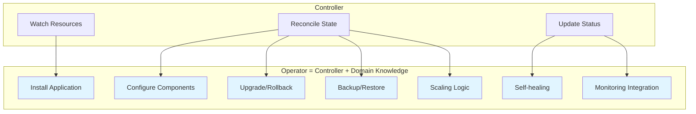
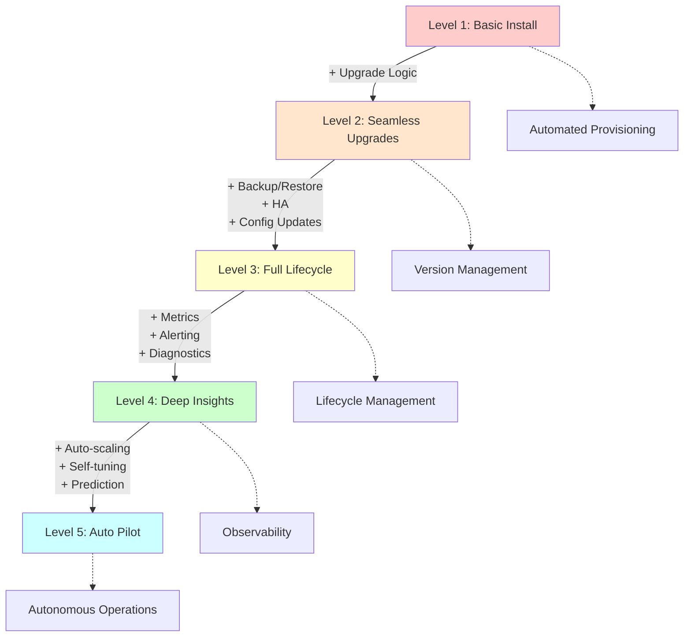
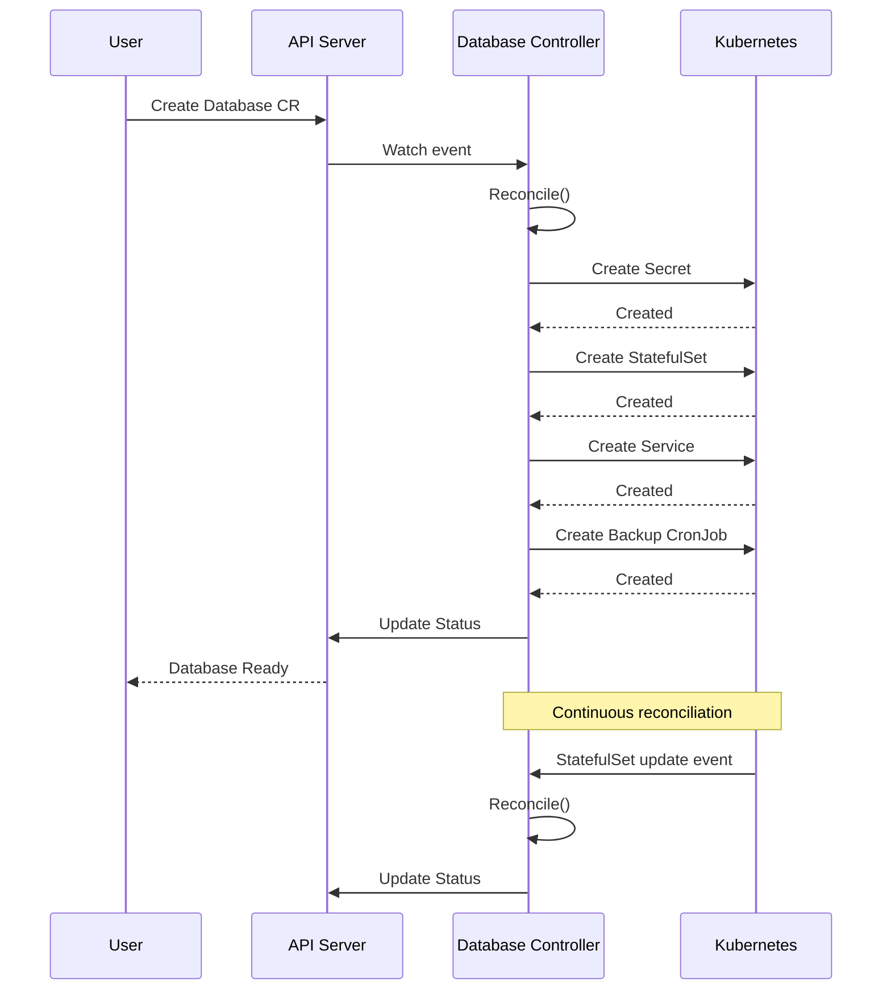
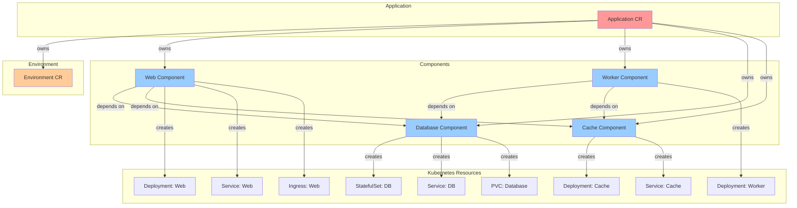
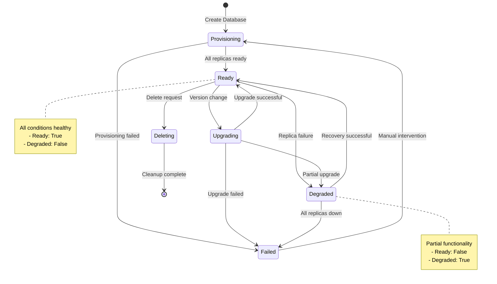
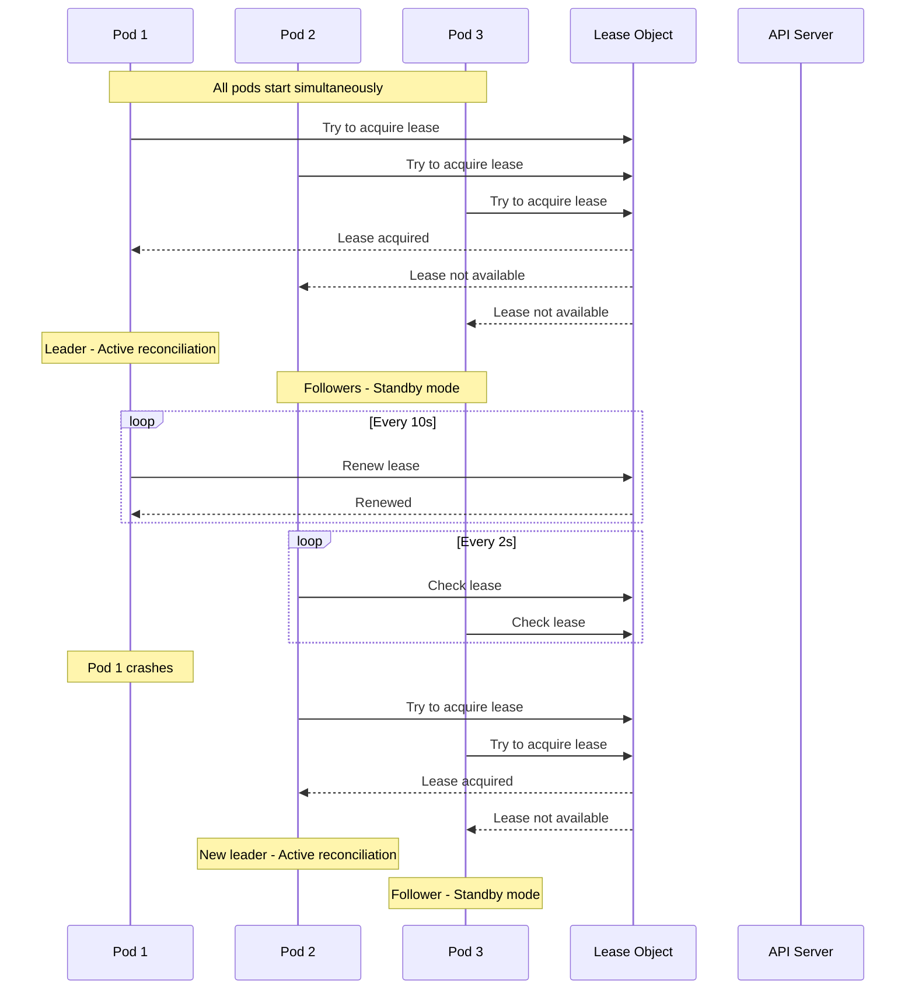
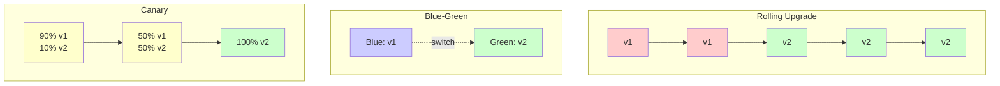

# **Operator Patterns in Kubernetes**

━━━━━━━━━━━━━━━━━━━━━━━━━━━━━━━━━━━━━━━━━━━━━━━━━━━━━━━━━━━━━━━━━━━━━━━━━━━━━━

## **📋 Overview**

This document provides a comprehensive guide to Kubernetes operator patterns, from basic controller patterns to advanced operator implementations. Operators extend Kubernetes by encoding domain-specific operational knowledge into custom controllers.

**Key Topics:**
- Operator maturity model (5 levels)
- Single and multi-resource operators
- Status conditions and observability
- Leader election patterns
- Upgrade and migration strategies
- Real-world operator examples

━━━━━━━━━━━━━━━━━━━━━━━━━━━━━━━━━━━━━━━━━━━━━━━━━━━━━━━━━━━━━━━━━━━━━━━━━━━━━━

## **🎯 What is an Operator?**

### **Definition**

An operator is a method of packaging, deploying, and managing a Kubernetes application. Operators use custom resources to manage applications and their components, encoding operational knowledge into software.

**Core Characteristics:**
- **Domain Knowledge**: Encodes how to deploy and manage an application
- **Automation**: Handles day-1 (installation) and day-2 (operations) tasks
- **Declarative**: Uses Custom Resources for desired state
- **Self-healing**: Monitors and repairs application state
- **Kubernetes-native**: Leverages Kubernetes APIs and patterns

### **Operator vs Controller**



━━━━━━━━━━━━━━━━━━━━━━━━━━━━━━━━━━━━━━━━━━━━━━━━━━━━━━━━━━━━━━━━━━━━━━━━━━━━━━

## **📊 Operator Maturity Model**

The Operator Capability Model defines 5 levels of operator maturity:

### **Level 1: Basic Install**

**Capabilities:**
- Automated application provisioning
- Configuration via CRD
- No upgrade capabilities

**Example:**
```yaml
apiVersion: example.com/v1
kind: MyApp
metadata:
  name: myapp-instance
spec:
  replicas: 3
  version: "1.0.0"
```

**Implementation Pattern:**
```go
// File: pkg/controller/myapp/myapp_controller.go
func (r *MyAppReconciler) Reconcile(ctx context.Context, req ctrl.Request) (ctrl.Result, error) {
    app := &examplev1.MyApp{}
    if err := r.Get(ctx, req.NamespacedName, app); err != nil {
        return ctrl.Result{}, client.IgnoreNotFound(err)
    }

    // Level 1: Just create deployment
    deployment := r.buildDeployment(app)
    if err := r.createOrUpdate(ctx, deployment); err != nil {
        return ctrl.Result{}, err
    }

    return ctrl.Result{}, nil
}

func (r *MyAppReconciler) buildDeployment(app *examplev1.MyApp) *appsv1.Deployment {
    return &appsv1.Deployment{
        ObjectMeta: metav1.ObjectMeta{
            Name:      app.Name,
            Namespace: app.Namespace,
            OwnerReferences: []metav1.OwnerReference{
                *metav1.NewControllerRef(app, examplev1.GroupVersion.WithKind("MyApp")),
            },
        },
        Spec: appsv1.DeploymentSpec{
            Replicas: &app.Spec.Replicas,
            Selector: &metav1.LabelSelector{
                MatchLabels: map[string]string{"app": app.Name},
            },
            Template: corev1.PodTemplateSpec{
                ObjectMeta: metav1.ObjectMeta{
                    Labels: map[string]string{"app": app.Name},
                },
                Spec: corev1.PodSpec{
                    Containers: []corev1.Container{
                        {
                            Name:  "myapp",
                            Image: "myapp:" + app.Spec.Version,
                        },
                    },
                },
            },
        },
    }
}
```

### **Level 2: Seamless Upgrades**

**Capabilities:**
- Automated upgrades between application versions
- Maintains availability during upgrades
- Basic rollback support

**Enhanced Spec:**
```yaml
apiVersion: example.com/v1
kind: MyApp
metadata:
  name: myapp-instance
spec:
  replicas: 3
  version: "2.0.0"
  updateStrategy:
    type: RollingUpdate
    rollingUpdate:
      maxUnavailable: 1
      maxSurge: 1
```

**Implementation:**
```go
// File: pkg/controller/myapp/upgrade.go
func (r *MyAppReconciler) handleUpgrade(ctx context.Context, app *examplev1.MyApp) error {
    deployment := &appsv1.Deployment{}
    if err := r.Get(ctx, client.ObjectKeyFromObject(app), deployment); err != nil {
        return err
    }

    currentVersion := deployment.Spec.Template.Spec.Containers[0].Image
    desiredVersion := "myapp:" + app.Spec.Version

    if currentVersion != desiredVersion {
        log.Info("Upgrading", "from", currentVersion, "to", desiredVersion)

        // Update status to show upgrade in progress
        app.Status.Phase = "Upgrading"
        app.Status.Conditions = append(app.Status.Conditions, metav1.Condition{
            Type:    "Upgrading",
            Status:  metav1.ConditionTrue,
            Reason:  "VersionChange",
            Message: fmt.Sprintf("Upgrading from %s to %s", currentVersion, desiredVersion),
        })
        if err := r.Status().Update(ctx, app); err != nil {
            return err
        }

        // Perform upgrade
        deployment.Spec.Template.Spec.Containers[0].Image = desiredVersion
        if err := r.Update(ctx, deployment); err != nil {
            return err
        }

        // Wait for rollout to complete
        if err := r.waitForRollout(ctx, deployment); err != nil {
            // Rollback on failure
            return r.rollback(ctx, app, currentVersion)
        }

        // Update status
        app.Status.Phase = "Running"
        app.Status.Version = app.Spec.Version
        return r.Status().Update(ctx, app)
    }

    return nil
}

func (r *MyAppReconciler) waitForRollout(ctx context.Context, deployment *appsv1.Deployment) error {
    timeout := time.After(5 * time.Minute)
    ticker := time.NewTicker(5 * time.Second)
    defer ticker.Stop()

    for {
        select {
        case <-timeout:
            return fmt.Errorf("timeout waiting for rollout")
        case <-ticker.C:
            current := &appsv1.Deployment{}
            if err := r.Get(ctx, client.ObjectKeyFromObject(deployment), current); err != nil {
                return err
            }

            if current.Status.UpdatedReplicas == *current.Spec.Replicas &&
               current.Status.Replicas == *current.Spec.Replicas &&
               current.Status.AvailableReplicas == *current.Spec.Replicas {
                return nil
            }
        }
    }
}
```

### **Level 3: Full Lifecycle**

**Capabilities:**
- Backup and restore
- Failure recovery
- Configuration changes without downtime
- Metrics and monitoring integration

**Enhanced CRD:**
```yaml
apiVersion: example.com/v1
kind: MyApp
metadata:
  name: myapp-instance
spec:
  replicas: 3
  version: "2.0.0"

  # Backup configuration
  backup:
    enabled: true
    schedule: "0 2 * * *"
    retention: 7
    storage:
      type: s3
      bucket: myapp-backups

  # Monitoring
  monitoring:
    enabled: true
    prometheus:
      serviceMonitor: true

  # High availability
  highAvailability:
    enabled: true
    antiAffinity: true
    podDisruptionBudget:
      minAvailable: 2
```

**Backup Implementation:**
```go
// File: pkg/controller/myapp/backup.go
type BackupController struct {
    client.Client
    Scheme *runtime.Scheme
}

func (r *BackupController) Reconcile(ctx context.Context, req ctrl.Request) (ctrl.Result, error) {
    app := &examplev1.MyApp{}
    if err := r.Get(ctx, req.NamespacedName, app); err != nil {
        return ctrl.Result{}, client.IgnoreNotFound(err)
    }

    if !app.Spec.Backup.Enabled {
        return ctrl.Result{}, nil
    }

    // Create backup CronJob
    cronJob := &batchv1.CronJob{
        ObjectMeta: metav1.ObjectMeta{
            Name:      app.Name + "-backup",
            Namespace: app.Namespace,
            OwnerReferences: []metav1.OwnerReference{
                *metav1.NewControllerRef(app, examplev1.GroupVersion.WithKind("MyApp")),
            },
        },
        Spec: batchv1.CronJobSpec{
            Schedule: app.Spec.Backup.Schedule,
            JobTemplate: batchv1.JobTemplateSpec{
                Spec: batchv1.JobSpec{
                    Template: corev1.PodTemplateSpec{
                        Spec: corev1.PodSpec{
                            RestartPolicy: corev1.RestartPolicyOnFailure,
                            Containers: []corev1.Container{
                                {
                                    Name:  "backup",
                                    Image: "myapp-backup-tool:latest",
                                    Env: []corev1.EnvVar{
                                        {Name: "APP_NAME", Value: app.Name},
                                        {Name: "S3_BUCKET", Value: app.Spec.Backup.Storage.Bucket},
                                        {Name: "RETENTION_DAYS", Value: strconv.Itoa(app.Spec.Backup.Retention)},
                                    },
                                },
                            },
                        },
                    },
                },
            },
        },
    }

    if err := r.createOrUpdate(ctx, cronJob); err != nil {
        return ctrl.Result{}, err
    }

    return ctrl.Result{}, nil
}

// Restore functionality
func (r *BackupController) RestoreFromBackup(ctx context.Context, app *examplev1.MyApp, backupID string) error {
    log.Info("Restoring from backup", "backupID", backupID)

    // Create restore job
    job := &batchv1.Job{
        ObjectMeta: metav1.ObjectMeta{
            Name:      fmt.Sprintf("%s-restore-%s", app.Name, backupID),
            Namespace: app.Namespace,
        },
        Spec: batchv1.JobSpec{
            Template: corev1.PodTemplateSpec{
                Spec: corev1.PodSpec{
                    RestartPolicy: corev1.RestartPolicyNever,
                    Containers: []corev1.Container{
                        {
                            Name:  "restore",
                            Image: "myapp-backup-tool:latest",
                            Env: []corev1.EnvVar{
                                {Name: "BACKUP_ID", Value: backupID},
                                {Name: "S3_BUCKET", Value: app.Spec.Backup.Storage.Bucket},
                                {Name: "RESTORE_MODE", Value: "true"},
                            },
                        },
                    },
                },
            },
        },
    }

    return r.Create(ctx, job)
}
```

### **Level 4: Deep Insights**

**Capabilities:**
- Metrics and alerting
- Log aggregation
- Performance tuning
- Health checks and diagnostics

**Monitoring Integration:**
```go
// File: pkg/controller/myapp/monitoring.go
func (r *MyAppReconciler) setupMonitoring(ctx context.Context, app *examplev1.MyApp) error {
    if !app.Spec.Monitoring.Enabled {
        return nil
    }

    // Create ServiceMonitor for Prometheus
    serviceMonitor := &monitoringv1.ServiceMonitor{
        ObjectMeta: metav1.ObjectMeta{
            Name:      app.Name,
            Namespace: app.Namespace,
            Labels: map[string]string{
                "app": app.Name,
            },
            OwnerReferences: []metav1.OwnerReference{
                *metav1.NewControllerRef(app, examplev1.GroupVersion.WithKind("MyApp")),
            },
        },
        Spec: monitoringv1.ServiceMonitorSpec{
            Selector: metav1.LabelSelector{
                MatchLabels: map[string]string{"app": app.Name},
            },
            Endpoints: []monitoringv1.Endpoint{
                {
                    Port:     "metrics",
                    Interval: "30s",
                    Path:     "/metrics",
                },
            },
        },
    }

    if err := r.createOrUpdate(ctx, serviceMonitor); err != nil {
        return err
    }

    // Create PrometheusRule for alerts
    prometheusRule := &monitoringv1.PrometheusRule{
        ObjectMeta: metav1.ObjectMeta{
            Name:      app.Name + "-alerts",
            Namespace: app.Namespace,
            OwnerReferences: []metav1.OwnerReference{
                *metav1.NewControllerRef(app, examplev1.GroupVersion.WithKind("MyApp")),
            },
        },
        Spec: monitoringv1.PrometheusRuleSpec{
            Groups: []monitoringv1.RuleGroup{
                {
                    Name: app.Name,
                    Rules: []monitoringv1.Rule{
                        {
                            Alert: "MyAppDown",
                            Expr:  intstr.FromString(fmt.Sprintf(`up{job="%s"} == 0`, app.Name)),
                            For:   "5m",
                            Labels: map[string]string{
                                "severity": "critical",
                            },
                            Annotations: map[string]string{
                                "summary":     "MyApp instance is down",
                                "description": "MyApp {{ $labels.instance }} has been down for more than 5 minutes.",
                            },
                        },
                        {
                            Alert: "MyAppHighErrorRate",
                            Expr:  intstr.FromString(fmt.Sprintf(`rate(myapp_errors_total{job="%s"}[5m]) > 0.05`, app.Name)),
                            For:   "10m",
                            Labels: map[string]string{
                                "severity": "warning",
                            },
                            Annotations: map[string]string{
                                "summary":     "High error rate detected",
                                "description": "Error rate is {{ $value }} errors/sec",
                            },
                        },
                    },
                },
            },
        },
    }

    return r.createOrUpdate(ctx, prometheusRule)
}

// Collect custom metrics
func (r *MyAppReconciler) collectMetrics(ctx context.Context, app *examplev1.MyApp) error {
    // Query application metrics endpoint
    metricsURL := fmt.Sprintf("http://%s.%s.svc:8080/metrics", app.Name, app.Namespace)

    resp, err := http.Get(metricsURL)
    if err != nil {
        return err
    }
    defer resp.Body.Close()

    // Parse metrics and update status
    metrics, err := r.parseMetrics(resp.Body)
    if err != nil {
        return err
    }

    app.Status.Metrics = examplev1.MetricsStatus{
        RequestRate:    metrics["request_rate"],
        ErrorRate:      metrics["error_rate"],
        AverageLatency: metrics["avg_latency"],
    }

    return r.Status().Update(ctx, app)
}
```

### **Level 5: Auto Pilot**

**Capabilities:**
- Automatic scaling based on custom metrics
- Automatic performance tuning
- Anomaly detection
- Predictive scaling
- Self-optimization

**Auto-scaling Implementation:**
```go
// File: pkg/controller/myapp/autoscaling.go
type AutoScaler struct {
    client.Client
    metricsClient metricsclient.Interface
}

func (a *AutoScaler) Reconcile(ctx context.Context, req ctrl.Request) (ctrl.Result, error) {
    app := &examplev1.MyApp{}
    if err := a.Get(ctx, req.NamespacedName, app); err != nil {
        return ctrl.Result{}, client.IgnoreNotFound(err)
    }

    if !app.Spec.AutoScaling.Enabled {
        return ctrl.Result{}, nil
    }

    // Get current metrics
    metrics, err := a.getCurrentMetrics(ctx, app)
    if err != nil {
        return ctrl.Result{}, err
    }

    // Calculate desired replicas based on custom algorithm
    desiredReplicas := a.calculateDesiredReplicas(app, metrics)

    // Apply constraints
    if desiredReplicas < app.Spec.AutoScaling.MinReplicas {
        desiredReplicas = app.Spec.AutoScaling.MinReplicas
    }
    if desiredReplicas > app.Spec.AutoScaling.MaxReplicas {
        desiredReplicas = app.Spec.AutoScaling.MaxReplicas
    }

    // Update if needed
    if app.Spec.Replicas != desiredReplicas {
        log.Info("Auto-scaling", "current", app.Spec.Replicas, "desired", desiredReplicas)
        app.Spec.Replicas = desiredReplicas
        if err := a.Update(ctx, app); err != nil {
            return ctrl.Result{}, err
        }
    }

    // Requeue after 30 seconds
    return ctrl.Result{RequeueAfter: 30 * time.Second}, nil
}

func (a *AutoScaler) calculateDesiredReplicas(app *examplev1.MyApp, metrics *MetricsSnapshot) int32 {
    // Custom scaling algorithm based on multiple metrics
    currentReplicas := app.Spec.Replicas

    // CPU-based scaling
    cpuUtilization := metrics.CPUUtilization
    cpuTarget := app.Spec.AutoScaling.TargetCPUUtilization
    cpuRatio := cpuUtilization / cpuTarget

    // Custom metric-based scaling (e.g., queue depth)
    queueDepth := metrics.CustomMetrics["queue_depth"]
    queueTarget := app.Spec.AutoScaling.TargetQueueDepth
    queueRatio := float64(queueDepth) / float64(queueTarget)

    // Take the maximum ratio to be conservative
    ratio := math.Max(cpuRatio, queueRatio)

    // Calculate desired replicas
    desiredReplicas := int32(math.Ceil(float64(currentReplicas) * ratio))

    // Apply rate limiting to avoid thrashing
    maxChange := int32(math.Ceil(float64(currentReplicas) * 0.5)) // Max 50% change at a time
    if desiredReplicas > currentReplicas+maxChange {
        desiredReplicas = currentReplicas + maxChange
    }
    if desiredReplicas < currentReplicas-maxChange {
        desiredReplicas = currentReplicas - maxChange
    }

    return desiredReplicas
}

// Predictive scaling using historical data
func (a *AutoScaler) predictiveScale(ctx context.Context, app *examplev1.MyApp) (int32, error) {
    // Get historical metrics from Prometheus
    historicalMetrics, err := a.getHistoricalMetrics(ctx, app, 7*24*time.Hour)
    if err != nil {
        return app.Spec.Replicas, err
    }

    // Analyze patterns (e.g., daily peaks)
    pattern := a.analyzePattern(historicalMetrics)

    // Predict load for next hour
    predictedLoad := pattern.PredictLoad(time.Now().Add(time.Hour))

    // Calculate replicas needed for predicted load
    return a.replicasForLoad(predictedLoad, app.Spec.AutoScaling.TargetCPUUtilization), nil
}
```

### **Maturity Model Diagram**



━━━━━━━━━━━━━━━━━━━━━━━━━━━━━━━━━━━━━━━━━━━━━━━━━━━━━━━━━━━━━━━━━━━━━━━━━━━━━━

## **🔧 Single-Resource Operators**

### **Pattern Overview**

Single-resource operators manage one primary custom resource type and create/manage standard Kubernetes resources.

### **Example: Database Operator**

**Custom Resource Definition:**
```yaml
apiVersion: apiextensions.k8s.io/v1
kind: CustomResourceDefinition
metadata:
  name: databases.db.example.com
spec:
  group: db.example.com
  names:
    kind: Database
    listKind: DatabaseList
    plural: databases
    singular: database
  scope: Namespaced
  versions:
  - name: v1
    served: true
    storage: true
    schema:
      openAPIV3Schema:
        type: object
        properties:
          spec:
            type: object
            required:
            - size
            - storageClass
            properties:
              size:
                type: string
                pattern: '^[0-9]+Gi$'
              storageClass:
                type: string
              backup:
                type: object
                properties:
                  enabled:
                    type: boolean
                  schedule:
                    type: string
              replicas:
                type: integer
                minimum: 1
                maximum: 5
                default: 1
          status:
            type: object
            properties:
              phase:
                type: string
                enum:
                - Pending
                - Provisioning
                - Running
                - Upgrading
                - Failed
              conditions:
                type: array
                items:
                  type: object
                  properties:
                    type:
                      type: string
                    status:
                      type: string
                    lastTransitionTime:
                      type: string
                      format: date-time
                    reason:
                      type: string
                    message:
                      type: string
              endpoint:
                type: string
              version:
                type: string
    subresources:
      status: {}
    additionalPrinterColumns:
    - name: Phase
      type: string
      jsonPath: .status.phase
    - name: Endpoint
      type: string
      jsonPath: .status.endpoint
    - name: Age
      type: date
      jsonPath: .metadata.creationTimestamp
```

**Controller Implementation:**
```go
// File: pkg/controller/database/database_controller.go
package database

import (
    "context"
    "fmt"
    "time"

    dbv1 "github.com/example/database-operator/api/v1"
    appsv1 "k8s.io/api/apps/v1"
    corev1 "k8s.io/api/core/v1"
    "k8s.io/apimachinery/pkg/api/errors"
    "k8s.io/apimachinery/pkg/api/resource"
    metav1 "k8s.io/apimachinery/pkg/apis/meta/v1"
    "k8s.io/apimachinery/pkg/runtime"
    ctrl "sigs.k8s.io/controller-runtime"
    "sigs.k8s.io/controller-runtime/pkg/client"
    "sigs.k8s.io/controller-runtime/pkg/controller/controllerutil"
    "sigs.k8s.io/controller-runtime/pkg/log"
)

type DatabaseReconciler struct {
    client.Client
    Scheme *runtime.Scheme
}

func (r *DatabaseReconciler) Reconcile(ctx context.Context, req ctrl.Request) (ctrl.Result, error) {
    log := log.FromContext(ctx)

    // Fetch the Database instance
    db := &dbv1.Database{}
    err := r.Get(ctx, req.NamespacedName, db)
    if err != nil {
        if errors.IsNotFound(err) {
            return ctrl.Result{}, nil
        }
        return ctrl.Result{}, err
    }

    // Handle deletion
    if !db.DeletionTimestamp.IsZero() {
        return r.handleDeletion(ctx, db)
    }

    // Add finalizer if not present
    if !controllerutil.ContainsFinalizer(db, "database.db.example.com/finalizer") {
        controllerutil.AddFinalizer(db, "database.db.example.com/finalizer")
        if err := r.Update(ctx, db); err != nil {
            return ctrl.Result{}, err
        }
    }

    // Initialize status
    if db.Status.Phase == "" {
        db.Status.Phase = "Pending"
        if err := r.Status().Update(ctx, db); err != nil {
            return ctrl.Result{}, err
        }
    }

    // Reconcile PVC
    if err := r.reconcilePVC(ctx, db); err != nil {
        return r.updateStatus(ctx, db, "Failed", err)
    }

    // Reconcile StatefulSet
    if err := r.reconcileStatefulSet(ctx, db); err != nil {
        return r.updateStatus(ctx, db, "Failed", err)
    }

    // Reconcile Service
    if err := r.reconcileService(ctx, db); err != nil {
        return r.updateStatus(ctx, db, "Failed", err)
    }

    // Reconcile backup if enabled
    if db.Spec.Backup.Enabled {
        if err := r.reconcileBackup(ctx, db); err != nil {
            log.Error(err, "Failed to reconcile backup")
        }
    }

    // Update status
    return r.updateStatus(ctx, db, "Running", nil)
}

func (r *DatabaseReconciler) reconcilePVC(ctx context.Context, db *dbv1.Database) error {
    // PVC is managed by StatefulSet, but we can add custom logic here
    return nil
}

func (r *DatabaseReconciler) reconcileStatefulSet(ctx context.Context, db *dbv1.Database) error {
    sts := &appsv1.StatefulSet{
        ObjectMeta: metav1.ObjectMeta{
            Name:      db.Name,
            Namespace: db.Namespace,
        },
    }

    _, err := controllerutil.CreateOrUpdate(ctx, r.Client, sts, func() error {
        // Set Database instance as the owner
        if err := controllerutil.SetControllerReference(db, sts, r.Scheme); err != nil {
            return err
        }

        // Define StatefulSet spec
        replicas := int32(db.Spec.Replicas)
        sts.Spec = appsv1.StatefulSetSpec{
            Replicas: &replicas,
            Selector: &metav1.LabelSelector{
                MatchLabels: map[string]string{
                    "app":      "database",
                    "instance": db.Name,
                },
            },
            ServiceName: db.Name,
            Template: corev1.PodTemplateSpec{
                ObjectMeta: metav1.ObjectMeta{
                    Labels: map[string]string{
                        "app":      "database",
                        "instance": db.Name,
                    },
                },
                Spec: corev1.PodSpec{
                    Containers: []corev1.Container{
                        {
                            Name:  "database",
                            Image: "postgres:14",
                            Ports: []corev1.ContainerPort{
                                {
                                    ContainerPort: 5432,
                                    Name:          "postgres",
                                },
                            },
                            Env: []corev1.EnvVar{
                                {
                                    Name:  "POSTGRES_DB",
                                    Value: db.Name,
                                },
                                {
                                    Name: "POSTGRES_PASSWORD",
                                    ValueFrom: &corev1.EnvVarSource{
                                        SecretKeyRef: &corev1.SecretKeySelector{
                                            LocalObjectReference: corev1.LocalObjectReference{
                                                Name: db.Name + "-secret",
                                            },
                                            Key: "password",
                                        },
                                    },
                                },
                            },
                            VolumeMounts: []corev1.VolumeMount{
                                {
                                    Name:      "data",
                                    MountPath: "/var/lib/postgresql/data",
                                },
                            },
                        },
                    },
                },
            },
            VolumeClaimTemplates: []corev1.PersistentVolumeClaim{
                {
                    ObjectMeta: metav1.ObjectMeta{
                        Name: "data",
                    },
                    Spec: corev1.PersistentVolumeClaimSpec{
                        AccessModes: []corev1.PersistentVolumeAccessMode{
                            corev1.ReadWriteOnce,
                        },
                        StorageClassName: &db.Spec.StorageClass,
                        Resources: corev1.ResourceRequirements{
                            Requests: corev1.ResourceList{
                                corev1.ResourceStorage: resource.MustParse(db.Spec.Size),
                            },
                        },
                    },
                },
            },
        }

        return nil
    })

    return err
}

func (r *DatabaseReconciler) reconcileService(ctx context.Context, db *dbv1.Database) error {
    svc := &corev1.Service{
        ObjectMeta: metav1.ObjectMeta{
            Name:      db.Name,
            Namespace: db.Namespace,
        },
    }

    _, err := controllerutil.CreateOrUpdate(ctx, r.Client, svc, func() error {
        if err := controllerutil.SetControllerReference(db, svc, r.Scheme); err != nil {
            return err
        }

        svc.Spec = corev1.ServiceSpec{
            Type: corev1.ServiceTypeClusterIP,
            Selector: map[string]string{
                "app":      "database",
                "instance": db.Name,
            },
            Ports: []corev1.ServicePort{
                {
                    Port:     5432,
                    Name:     "postgres",
                    Protocol: corev1.ProtocolTCP,
                },
            },
        }

        return nil
    })

    return err
}

func (r *DatabaseReconciler) reconcileBackup(ctx context.Context, db *dbv1.Database) error {
    cronJob := &batchv1.CronJob{
        ObjectMeta: metav1.ObjectMeta{
            Name:      db.Name + "-backup",
            Namespace: db.Namespace,
        },
    }

    _, err := controllerutil.CreateOrUpdate(ctx, r.Client, cronJob, func() error {
        if err := controllerutil.SetControllerReference(db, cronJob, r.Scheme); err != nil {
            return err
        }

        cronJob.Spec = batchv1.CronJobSpec{
            Schedule: db.Spec.Backup.Schedule,
            JobTemplate: batchv1.JobTemplateSpec{
                Spec: batchv1.JobSpec{
                    Template: corev1.PodTemplateSpec{
                        Spec: corev1.PodSpec{
                            RestartPolicy: corev1.RestartPolicyOnFailure,
                            Containers: []corev1.Container{
                                {
                                    Name:  "backup",
                                    Image: "postgres:14",
                                    Command: []string{
                                        "/bin/sh",
                                        "-c",
                                        fmt.Sprintf("pg_dump -h %s -U postgres %s | gzip > /backup/%s-$(date +%%Y%%m%%d-%%H%%M%%S).sql.gz",
                                            db.Name, db.Name, db.Name),
                                    },
                                    Env: []corev1.EnvVar{
                                        {
                                            Name: "PGPASSWORD",
                                            ValueFrom: &corev1.EnvVarSource{
                                                SecretKeyRef: &corev1.SecretKeySelector{
                                                    LocalObjectReference: corev1.LocalObjectReference{
                                                        Name: db.Name + "-secret",
                                                    },
                                                    Key: "password",
                                                },
                                            },
                                        },
                                    },
                                    VolumeMounts: []corev1.VolumeMount{
                                        {
                                            Name:      "backup",
                                            MountPath: "/backup",
                                        },
                                    },
                                },
                            },
                            Volumes: []corev1.Volume{
                                {
                                    Name: "backup",
                                    VolumeSource: corev1.VolumeSource{
                                        PersistentVolumeClaim: &corev1.PersistentVolumeClaimVolumeSource{
                                            ClaimName: db.Name + "-backup",
                                        },
                                    },
                                },
                            },
                        },
                    },
                },
            },
        }

        return nil
    })

    return err
}

func (r *DatabaseReconciler) updateStatus(ctx context.Context, db *dbv1.Database, phase string, err error) (ctrl.Result, error) {
    db.Status.Phase = phase

    if err != nil {
        db.Status.Conditions = append(db.Status.Conditions, metav1.Condition{
            Type:               "Ready",
            Status:             metav1.ConditionFalse,
            Reason:             "ReconciliationFailed",
            Message:            err.Error(),
            LastTransitionTime: metav1.Now(),
        })
    } else {
        db.Status.Endpoint = fmt.Sprintf("%s.%s.svc:5432", db.Name, db.Namespace)
        db.Status.Version = "14"
        db.Status.Conditions = append(db.Status.Conditions, metav1.Condition{
            Type:               "Ready",
            Status:             metav1.ConditionTrue,
            Reason:             "ReconciliationSucceeded",
            Message:            "Database is running",
            LastTransitionTime: metav1.Now(),
        })
    }

    if updateErr := r.Status().Update(ctx, db); updateErr != nil {
        return ctrl.Result{}, updateErr
    }

    return ctrl.Result{}, err
}

func (r *DatabaseReconciler) handleDeletion(ctx context.Context, db *dbv1.Database) (ctrl.Result, error) {
    if controllerutil.ContainsFinalizer(db, "database.db.example.com/finalizer") {
        // Perform cleanup
        if err := r.cleanupResources(ctx, db); err != nil {
            return ctrl.Result{}, err
        }

        // Remove finalizer
        controllerutil.RemoveFinalizer(db, "database.db.example.com/finalizer")
        if err := r.Update(ctx, db); err != nil {
            return ctrl.Result{}, err
        }
    }

    return ctrl.Result{}, nil
}

func (r *DatabaseReconciler) cleanupResources(ctx context.Context, db *dbv1.Database) error {
    // Cleanup logic (e.g., delete backups from S3)
    return nil
}

// SetupWithManager sets up the controller with the Manager
func (r *DatabaseReconciler) SetupWithManager(mgr ctrl.Manager) error {
    return ctrl.NewControllerManagedBy(mgr).
        For(&dbv1.Database{}).
        Owns(&appsv1.StatefulSet{}).
        Owns(&corev1.Service{}).
        Complete(r)
}
```

### **Single-Resource Operator Flow**



━━━━━━━━━━━━━━━━━━━━━━━━━━━━━━━━━━━━━━━━━━━━━━━━━━━━━━━━━━━━━━━━━━━━━━━━━━━━━━

## **🔗 Multi-Resource Operators**

### **Pattern Overview**

Multi-resource operators manage multiple related custom resource types with dependencies and relationships.

### **Example: Application Platform Operator**

**Multiple CRDs:**
```yaml
---
# Application CRD
apiVersion: apiextensions.k8s.io/v1
kind: CustomResourceDefinition
metadata:
  name: applications.platform.example.com
spec:
  group: platform.example.com
  names:
    kind: Application
    plural: applications
  scope: Namespaced
  versions:
  - name: v1
    served: true
    storage: true
    schema:
      openAPIV3Schema:
        type: object
        properties:
          spec:
            type: object
            properties:
              components:
                type: array
                items:
                  type: object
                  properties:
                    name:
                      type: string
                    type:
                      type: string
                      enum: [web, worker, database, cache]
                    config:
                      type: object
                      x-kubernetes-preserve-unknown-fields: true
---
# Component CRD
apiVersion: apiextensions.k8s.io/v1
kind: CustomResourceDefinition
metadata:
  name: components.platform.example.com
spec:
  group: platform.example.com
  names:
    kind: Component
    plural: components
  scope: Namespaced
  versions:
  - name: v1
    served: true
    storage: true
    schema:
      openAPIV3Schema:
        type: object
        properties:
          spec:
            type: object
            properties:
              type:
                type: string
              image:
                type: string
              replicas:
                type: integer
              dependencies:
                type: array
                items:
                  type: string
---
# Environment CRD
apiVersion: apiextensions.k8s.io/v1
kind: CustomResourceDefinition
metadata:
  name: environments.platform.example.com
spec:
  group: platform.example.com
  names:
    kind: Environment
    plural: environments
  scope: Namespaced
  versions:
  - name: v1
    served: true
    storage: true
    schema:
      openAPIV3Schema:
        type: object
        properties:
          spec:
            type: object
            properties:
              type:
                type: string
                enum: [development, staging, production]
              quota:
                type: object
                properties:
                  cpu:
                    type: string
                  memory:
                    type: string
```

**Multi-Resource Controller:**
```go
// File: pkg/controller/application/application_controller.go
package application

import (
    "context"

    platformv1 "github.com/example/platform-operator/api/v1"
    ctrl "sigs.k8s.io/controller-runtime"
    "sigs.k8s.io/controller-runtime/pkg/client"
    "sigs.k8s.io/controller-runtime/pkg/handler"
    "sigs.k8s.io/controller-runtime/pkg/source"
)

type ApplicationReconciler struct {
    client.Client
    Scheme *runtime.Scheme
}

func (r *ApplicationReconciler) Reconcile(ctx context.Context, req ctrl.Request) (ctrl.Result, error) {
    app := &platformv1.Application{}
    if err := r.Get(ctx, req.NamespacedName, app); err != nil {
        return ctrl.Result{}, client.IgnoreNotFound(err)
    }

    // Reconcile environment first
    env, err := r.reconcileEnvironment(ctx, app)
    if err != nil {
        return ctrl.Result{}, err
    }

    // Reconcile components in dependency order
    componentsByName := make(map[string]*platformv1.Component)

    for _, compSpec := range app.Spec.Components {
        comp, err := r.reconcileComponent(ctx, app, env, compSpec)
        if err != nil {
            return ctrl.Result{}, err
        }
        componentsByName[compSpec.Name] = comp
    }

    // Verify all dependencies are ready
    for _, comp := range componentsByName {
        if !r.areDependenciesReady(comp, componentsByName) {
            return ctrl.Result{RequeueAfter: 5 * time.Second}, nil
        }
    }

    // Update application status
    app.Status.Phase = "Running"
    app.Status.ComponentsReady = len(componentsByName)
    app.Status.ComponentsTotal = len(app.Spec.Components)

    return ctrl.Result{}, r.Status().Update(ctx, app)
}

func (r *ApplicationReconciler) reconcileEnvironment(ctx context.Context, app *platformv1.Application) (*platformv1.Environment, error) {
    env := &platformv1.Environment{
        ObjectMeta: metav1.ObjectMeta{
            Name:      app.Name + "-env",
            Namespace: app.Namespace,
        },
    }

    _, err := controllerutil.CreateOrUpdate(ctx, r.Client, env, func() error {
        if err := controllerutil.SetControllerReference(app, env, r.Scheme); err != nil {
            return err
        }

        env.Spec.Type = app.Spec.Environment
        env.Spec.Quota = app.Spec.Quota

        return nil
    })

    if err != nil {
        return nil, err
    }

    return env, nil
}

func (r *ApplicationReconciler) reconcileComponent(ctx context.Context, app *platformv1.Application,
    env *platformv1.Environment, compSpec platformv1.ComponentSpec) (*platformv1.Component, error) {

    comp := &platformv1.Component{
        ObjectMeta: metav1.ObjectMeta{
            Name:      app.Name + "-" + compSpec.Name,
            Namespace: app.Namespace,
        },
    }

    _, err := controllerutil.CreateOrUpdate(ctx, r.Client, comp, func() error {
        if err := controllerutil.SetControllerReference(app, comp, r.Scheme); err != nil {
            return err
        }

        comp.Spec = compSpec.ComponentSpec

        // Add environment reference
        comp.Spec.Environment = env.Name

        return nil
    })

    if err != nil {
        return nil, err
    }

    return comp, nil
}

func (r *ApplicationReconciler) areDependenciesReady(comp *platformv1.Component,
    components map[string]*platformv1.Component) bool {

    for _, depName := range comp.Spec.Dependencies {
        dep, exists := components[depName]
        if !exists || dep.Status.Phase != "Ready" {
            return false
        }
    }

    return true
}

// SetupWithManager sets up the controller with the Manager
func (r *ApplicationReconciler) SetupWithManager(mgr ctrl.Manager) error {
    return ctrl.NewControllerManagedBy(mgr).
        For(&platformv1.Application{}).
        Owns(&platformv1.Environment{}).
        Owns(&platformv1.Component{}).
        // Watch for changes in components
        Watches(
            &source.Kind{Type: &platformv1.Component{}},
            handler.EnqueueRequestsFromMapFunc(r.findApplicationForComponent),
        ).
        Complete(r)
}

func (r *ApplicationReconciler) findApplicationForComponent(obj client.Object) []ctrl.Request {
    comp := obj.(*platformv1.Component)

    // Find the owner Application
    for _, owner := range comp.OwnerReferences {
        if owner.Kind == "Application" {
            return []ctrl.Request{
                {
                    NamespacedName: client.ObjectKey{
                        Name:      owner.Name,
                        Namespace: comp.Namespace,
                    },
                },
            }
        }
    }

    return nil
}
```

**Component Controller:**
```go
// File: pkg/controller/component/component_controller.go
package component

type ComponentReconciler struct {
    client.Client
    Scheme *runtime.Scheme
}

func (r *ComponentReconciler) Reconcile(ctx context.Context, req ctrl.Request) (ctrl.Result, error) {
    comp := &platformv1.Component{}
    if err := r.Get(ctx, req.NamespacedName, comp); err != nil {
        return ctrl.Result{}, client.IgnoreNotFound(err)
    }

    // Route to type-specific handler
    switch comp.Spec.Type {
    case "web":
        return r.reconcileWeb(ctx, comp)
    case "worker":
        return r.reconcileWorker(ctx, comp)
    case "database":
        return r.reconcileDatabase(ctx, comp)
    case "cache":
        return r.reconcileCache(ctx, comp)
    default:
        return ctrl.Result{}, fmt.Errorf("unknown component type: %s", comp.Spec.Type)
    }
}

func (r *ComponentReconciler) reconcileWeb(ctx context.Context, comp *platformv1.Component) (ctrl.Result, error) {
    // Create Deployment
    deployment := &appsv1.Deployment{
        ObjectMeta: metav1.ObjectMeta{
            Name:      comp.Name,
            Namespace: comp.Namespace,
        },
    }

    _, err := controllerutil.CreateOrUpdate(ctx, r.Client, deployment, func() error {
        if err := controllerutil.SetControllerReference(comp, deployment, r.Scheme); err != nil {
            return err
        }

        deployment.Spec = appsv1.DeploymentSpec{
            Replicas: &comp.Spec.Replicas,
            Selector: &metav1.LabelSelector{
                MatchLabels: map[string]string{
                    "component": comp.Name,
                },
            },
            Template: corev1.PodTemplateSpec{
                ObjectMeta: metav1.ObjectMeta{
                    Labels: map[string]string{
                        "component": comp.Name,
                    },
                },
                Spec: corev1.PodSpec{
                    Containers: []corev1.Container{
                        {
                            Name:  "app",
                            Image: comp.Spec.Image,
                            Ports: []corev1.ContainerPort{
                                {
                                    ContainerPort: 8080,
                                },
                            },
                        },
                    },
                },
            },
        }

        return nil
    })

    if err != nil {
        return ctrl.Result{}, err
    }

    // Create Service
    service := &corev1.Service{
        ObjectMeta: metav1.ObjectMeta{
            Name:      comp.Name,
            Namespace: comp.Namespace,
        },
    }

    _, err = controllerutil.CreateOrUpdate(ctx, r.Client, service, func() error {
        if err := controllerutil.SetControllerReference(comp, service, r.Scheme); err != nil {
            return err
        }

        service.Spec = corev1.ServiceSpec{
            Type: corev1.ServiceTypeLoadBalancer,
            Selector: map[string]string{
                "component": comp.Name,
            },
            Ports: []corev1.ServicePort{
                {
                    Port:       80,
                    TargetPort: intstr.FromInt(8080),
                },
            },
        }

        return nil
    })

    if err != nil {
        return ctrl.Result{}, err
    }

    // Create Ingress
    ingress := &networkingv1.Ingress{
        ObjectMeta: metav1.ObjectMeta{
            Name:      comp.Name,
            Namespace: comp.Namespace,
        },
    }

    _, err = controllerutil.CreateOrUpdate(ctx, r.Client, ingress, func() error {
        if err := controllerutil.SetControllerReference(comp, ingress, r.Scheme); err != nil {
            return err
        }

        pathType := networkingv1.PathTypePrefix
        ingress.Spec = networkingv1.IngressSpec{
            Rules: []networkingv1.IngressRule{
                {
                    Host: comp.Name + ".example.com",
                    IngressRuleValue: networkingv1.IngressRuleValue{
                        HTTP: &networkingv1.HTTPIngressRuleValue{
                            Paths: []networkingv1.HTTPIngressPath{
                                {
                                    Path:     "/",
                                    PathType: &pathType,
                                    Backend: networkingv1.IngressBackend{
                                        Service: &networkingv1.IngressServiceBackend{
                                            Name: comp.Name,
                                            Port: networkingv1.ServiceBackendPort{
                                                Number: 80,
                                            },
                                        },
                                    },
                                },
                            },
                        },
                    },
                },
            },
        }

        return nil
    })

    return ctrl.Result{}, err
}

func (r *ComponentReconciler) reconcileWorker(ctx context.Context, comp *platformv1.Component) (ctrl.Result, error) {
    // Similar to web but without Service/Ingress
    deployment := &appsv1.Deployment{
        ObjectMeta: metav1.ObjectMeta{
            Name:      comp.Name,
            Namespace: comp.Namespace,
        },
    }

    _, err := controllerutil.CreateOrUpdate(ctx, r.Client, deployment, func() error {
        if err := controllerutil.SetControllerReference(comp, deployment, r.Scheme); err != nil {
            return err
        }

        deployment.Spec = appsv1.DeploymentSpec{
            Replicas: &comp.Spec.Replicas,
            Selector: &metav1.LabelSelector{
                MatchLabels: map[string]string{
                    "component": comp.Name,
                },
            },
            Template: corev1.PodTemplateSpec{
                ObjectMeta: metav1.ObjectMeta{
                    Labels: map[string]string{
                        "component": comp.Name,
                    },
                },
                Spec: corev1.PodSpec{
                    Containers: []corev1.Container{
                        {
                            Name:  "worker",
                            Image: comp.Spec.Image,
                        },
                    },
                },
            },
        }

        return nil
    })

    return ctrl.Result{}, err
}
```

### **Multi-Resource Dependency Graph**



━━━━━━━━━━━━━━━━━━━━━━━━━━━━━━━━━━━━━━━━━━━━━━━━━━━━━━━━━━━━━━━━━━━━━━━━━━━━━━

## **📊 Status Conditions**

### **Standard Condition Types**

Kubernetes uses conditions to represent the current state of resources. Operators should follow these conventions:

**Common Condition Types:**
- **Ready**: Resource is ready to serve
- **Available**: Resource is available (for services)
- **Progressing**: Resource is making progress toward desired state
- **Degraded**: Resource is degraded but still functional
- **Reconciling**: Resource is being reconciled

### **Condition Structure**

```go
// File: vendor/k8s.io/apimachinery/pkg/apis/meta/v1/types.go:1450-1480
type Condition struct {
    // Type of condition
    Type string `json:"type" protobuf:"bytes,1,opt,name=type"`

    // Status of the condition (True, False, Unknown)
    Status ConditionStatus `json:"status" protobuf:"bytes,2,opt,name=status"`

    // Last time the condition transitioned
    LastTransitionTime Time `json:"lastTransitionTime,omitempty" protobuf:"bytes,3,opt,name=lastTransitionTime"`

    // Reason for the condition's last transition
    Reason string `json:"reason,omitempty" protobuf:"bytes,4,opt,name=reason"`

    // Human-readable message
    Message string `json:"message,omitempty" protobuf:"bytes,5,opt,name=message"`

    // ObservedGeneration represents the .metadata.generation that the condition was set based upon
    ObservedGeneration int64 `json:"observedGeneration,omitempty" protobuf:"varint,6,opt,name=observedGeneration"`
}
```

### **Implementing Conditions**

```go
// File: pkg/controller/database/conditions.go
package database

import (
    metav1 "k8s.io/apimachinery/pkg/apis/meta/v1"
    "k8s.io/apimachinery/pkg/api/meta"
)

const (
    // Condition types
    ConditionTypeReady        = "Ready"
    ConditionTypeProvisioning = "Provisioning"
    ConditionTypeUpgrading    = "Upgrading"
    ConditionTypeDegraded     = "Degraded"

    // Condition reasons
    ReasonProvisioningStarted   = "ProvisioningStarted"
    ReasonProvisioningFailed    = "ProvisioningFailed"
    ReasonProvisioningCompleted = "ProvisioningCompleted"
    ReasonUpgradeStarted        = "UpgradeStarted"
    ReasonUpgradeFailed         = "UpgradeFailed"
    ReasonUpgradeCompleted      = "UpgradeCompleted"
    ReasonReplicaFailure        = "ReplicaFailure"
    ReasonBackupFailed          = "BackupFailed"
)

// SetCondition sets the condition in the status
func SetCondition(status *dbv1.DatabaseStatus, conditionType string, conditionStatus metav1.ConditionStatus,
    reason, message string) {

    now := metav1.Now()
    condition := metav1.Condition{
        Type:               conditionType,
        Status:             conditionStatus,
        LastTransitionTime: now,
        Reason:             reason,
        Message:            message,
    }

    meta.SetStatusCondition(&status.Conditions, condition)
}

// IsConditionTrue returns true if the condition is True
func IsConditionTrue(status *dbv1.DatabaseStatus, conditionType string) bool {
    condition := meta.FindStatusCondition(status.Conditions, conditionType)
    return condition != nil && condition.Status == metav1.ConditionTrue
}

// Usage in reconciler
func (r *DatabaseReconciler) updateConditions(ctx context.Context, db *dbv1.Database) error {
    // Check if StatefulSet is ready
    sts := &appsv1.StatefulSet{}
    if err := r.Get(ctx, client.ObjectKeyFromObject(db), sts); err != nil {
        SetCondition(&db.Status, ConditionTypeReady, metav1.ConditionFalse,
            "StatefulSetNotFound", "StatefulSet not found")
        return r.Status().Update(ctx, db)
    }

    // Check replicas
    if sts.Status.ReadyReplicas == *sts.Spec.Replicas {
        SetCondition(&db.Status, ConditionTypeReady, metav1.ConditionTrue,
            "AllReplicasReady", "All replicas are ready")
    } else {
        SetCondition(&db.Status, ConditionTypeReady, metav1.ConditionFalse,
            "NotAllReplicasReady",
            fmt.Sprintf("%d/%d replicas are ready", sts.Status.ReadyReplicas, *sts.Spec.Replicas))
    }

    // Check for degraded state
    if sts.Status.ReadyReplicas > 0 && sts.Status.ReadyReplicas < *sts.Spec.Replicas {
        SetCondition(&db.Status, ConditionTypeDegraded, metav1.ConditionTrue,
            ReasonReplicaFailure, "Some replicas are not ready")
    } else {
        SetCondition(&db.Status, ConditionTypeDegraded, metav1.ConditionFalse,
            "AllReplicasHealthy", "All replicas are healthy")
    }

    return r.Status().Update(ctx, db)
}
```

### **Condition State Machine**



━━━━━━━━━━━━━━━━━━━━━━━━━━━━━━━━━━━━━━━━━━━━━━━━━━━━━━━━━━━━━━━━━━━━━━━━━━━━━━

## **👑 Leader Election**

### **Why Leader Election?**

When running multiple replicas of an operator for high availability, only one instance should actively reconcile resources to avoid conflicts.

### **Leader Election Pattern**

```go
// File: cmd/manager/main.go
package main

import (
    "flag"
    "os"

    "k8s.io/apimachinery/pkg/runtime"
    clientgoscheme "k8s.io/client-go/kubernetes/scheme"
    ctrl "sigs.k8s.io/controller-runtime"
    "sigs.k8s.io/controller-runtime/pkg/healthz"
    "sigs.k8s.io/controller-runtime/pkg/log/zap"

    dbv1 "github.com/example/database-operator/api/v1"
    "github.com/example/database-operator/controllers"
)

var (
    scheme   = runtime.NewScheme()
    setupLog = ctrl.Log.WithName("setup")
)

func init() {
    _ = clientgoscheme.AddToScheme(scheme)
    _ = dbv1.AddToScheme(scheme)
}

func main() {
    var metricsAddr string
    var enableLeaderElection bool
    var probeAddr string
    var leaderElectionID string
    var leaderElectionNamespace string

    flag.StringVar(&metricsAddr, "metrics-bind-address", ":8080", "The address the metric endpoint binds to.")
    flag.StringVar(&probeAddr, "health-probe-bind-address", ":8081", "The address the probe endpoint binds to.")
    flag.BoolVar(&enableLeaderElection, "leader-elect", false,
        "Enable leader election for controller manager. "+
            "Enabling this will ensure there is only one active controller manager.")
    flag.StringVar(&leaderElectionID, "leader-election-id", "database-operator-lock",
        "The name of the configmap that is used for holding the leader lock.")
    flag.StringVar(&leaderElectionNamespace, "leader-election-namespace", "",
        "The namespace in which the leader election configmap will be created.")

    opts := zap.Options{
        Development: true,
    }
    opts.BindFlags(flag.CommandLine)
    flag.Parse()

    ctrl.SetLogger(zap.New(zap.UseFlagOptions(&opts)))

    // If namespace is not set, use the pod's namespace
    if leaderElectionNamespace == "" {
        leaderElectionNamespace = os.Getenv("POD_NAMESPACE")
        if leaderElectionNamespace == "" {
            leaderElectionNamespace = "default"
        }
    }

    mgr, err := ctrl.NewManager(ctrl.GetConfigOrDie(), ctrl.Options{
        Scheme:                     scheme,
        MetricsBindAddress:         metricsAddr,
        Port:                       9443,
        HealthProbeBindAddress:     probeAddr,
        LeaderElection:             enableLeaderElection,
        LeaderElectionID:           leaderElectionID,
        LeaderElectionNamespace:    leaderElectionNamespace,
        LeaderElectionResourceLock: "leases",
    })
    if err != nil {
        setupLog.Error(err, "unable to start manager")
        os.Exit(1)
    }

    if err = (&controllers.DatabaseReconciler{
        Client: mgr.GetClient(),
        Scheme: mgr.GetScheme(),
    }).SetupWithManager(mgr); err != nil {
        setupLog.Error(err, "unable to create controller", "controller", "Database")
        os.Exit(1)
    }

    if err := mgr.AddHealthzCheck("healthz", healthz.Ping); err != nil {
        setupLog.Error(err, "unable to set up health check")
        os.Exit(1)
    }
    if err := mgr.AddReadyzCheck("readyz", healthz.Ping); err != nil {
        setupLog.Error(err, "unable to set up ready check")
        os.Exit(1)
    }

    setupLog.Info("starting manager")
    if err := mgr.Start(ctrl.SetupSignalHandler()); err != nil {
        setupLog.Error(err, "problem running manager")
        os.Exit(1)
    }
}
```

### **Leader Election Deployment**

```yaml
apiVersion: apps/v1
kind: Deployment
metadata:
  name: database-operator
  namespace: database-operator-system
spec:
  replicas: 3  # Multiple replicas for HA
  selector:
    matchLabels:
      app: database-operator
  template:
    metadata:
      labels:
        app: database-operator
    spec:
      serviceAccountName: database-operator
      containers:
      - name: manager
        image: database-operator:latest
        command:
        - /manager
        args:
        - --leader-elect
        - --leader-election-id=database-operator-lock
        - --leader-election-namespace=$(POD_NAMESPACE)
        env:
        - name: POD_NAMESPACE
          valueFrom:
            fieldRef:
              fieldPath: metadata.namespace
        resources:
          limits:
            cpu: 200m
            memory: 200Mi
          requests:
            cpu: 100m
            memory: 100Mi
        livenessProbe:
          httpGet:
            path: /healthz
            port: 8081
          initialDelaySeconds: 15
          periodSeconds: 20
        readinessProbe:
          httpGet:
            path: /readyz
            port: 8081
          initialDelaySeconds: 5
          periodSeconds: 10
---
apiVersion: v1
kind: ServiceAccount
metadata:
  name: database-operator
  namespace: database-operator-system
---
apiVersion: rbac.authorization.k8s.io/v1
kind: Role
metadata:
  name: database-operator-leader-election
  namespace: database-operator-system
rules:
- apiGroups:
  - coordination.k8s.io
  resources:
  - leases
  verbs:
  - get
  - list
  - watch
  - create
  - update
  - patch
  - delete
- apiGroups:
  - ""
  resources:
  - events
  verbs:
  - create
  - patch
---
apiVersion: rbac.authorization.k8s.io/v1
kind: RoleBinding
metadata:
  name: database-operator-leader-election
  namespace: database-operator-system
roleRef:
  apiGroup: rbac.authorization.k8s.io
  kind: Role
  name: database-operator-leader-election
subjects:
- kind: ServiceAccount
  name: database-operator
  namespace: database-operator-system
```

### **Leader Election Flow**



━━━━━━━━━━━━━━━━━━━━━━━━━━━━━━━━━━━━━━━━━━━━━━━━━━━━━━━━━━━━━━━━━━━━━━━━━━━━━━

## **🔄 Upgrade Strategies**

### **1. Rolling Upgrade**

The most common strategy - replace instances one at a time.

**Implementation:**
```go
// File: pkg/controller/database/upgrade.go
func (r *DatabaseReconciler) rollingUpgrade(ctx context.Context, db *dbv1.Database,
    currentVersion, targetVersion string) error {

    log.Info("Starting rolling upgrade", "from", currentVersion, "to", targetVersion)

    // Update status
    db.Status.Phase = "Upgrading"
    SetCondition(&db.Status, ConditionTypeUpgrading, metav1.ConditionTrue,
        ReasonUpgradeStarted, fmt.Sprintf("Upgrading from %s to %s", currentVersion, targetVersion))
    if err := r.Status().Update(ctx, db); err != nil {
        return err
    }

    // Get StatefulSet
    sts := &appsv1.StatefulSet{}
    if err := r.Get(ctx, client.ObjectKeyFromObject(db), sts); err != nil {
        return err
    }

    // Update partition to enable rolling update
    partition := int32(0)
    if sts.Spec.UpdateStrategy.RollingUpdate == nil {
        sts.Spec.UpdateStrategy.RollingUpdate = &appsv1.RollingUpdateStatefulSetStrategy{}
    }
    sts.Spec.UpdateStrategy.RollingUpdate.Partition = &partition

    // Update image
    sts.Spec.Template.Spec.Containers[0].Image = "postgres:" + targetVersion

    if err := r.Update(ctx, sts); err != nil {
        return err
    }

    // Monitor upgrade progress
    return r.monitorUpgrade(ctx, db, sts)
}

func (r *DatabaseReconciler) monitorUpgrade(ctx context.Context, db *dbv1.Database,
    sts *appsv1.StatefulSet) error {

    timeout := time.After(15 * time.Minute)
    ticker := time.NewTicker(10 * time.Second)
    defer ticker.Stop()

    expectedReplicas := *sts.Spec.Replicas

    for {
        select {
        case <-timeout:
            SetCondition(&db.Status, ConditionTypeUpgrading, metav1.ConditionFalse,
                ReasonUpgradeFailed, "Upgrade timeout")
            r.Status().Update(ctx, db)
            return fmt.Errorf("upgrade timeout")

        case <-ticker.C:
            current := &appsv1.StatefulSet{}
            if err := r.Get(ctx, client.ObjectKeyFromObject(sts), current); err != nil {
                return err
            }

            // Check if all replicas are updated and ready
            if current.Status.UpdatedReplicas == expectedReplicas &&
               current.Status.ReadyReplicas == expectedReplicas {

                SetCondition(&db.Status, ConditionTypeUpgrading, metav1.ConditionFalse,
                    ReasonUpgradeCompleted, "Upgrade completed successfully")
                db.Status.Phase = "Running"
                db.Status.Version = db.Spec.Version
                return r.Status().Update(ctx, db)
            }

            // Update progress
            progress := float64(current.Status.UpdatedReplicas) / float64(expectedReplicas) * 100
            db.Status.UpgradeProgress = int(progress)
            r.Status().Update(ctx, db)
        }
    }
}
```

### **2. Blue-Green Upgrade**

Create a complete new environment, test it, then switch traffic.

**Implementation:**
```go
// File: pkg/controller/database/bluegreen.go
func (r *DatabaseReconciler) blueGreenUpgrade(ctx context.Context, db *dbv1.Database,
    currentVersion, targetVersion string) error {

    log.Info("Starting blue-green upgrade", "from", currentVersion, "to", targetVersion)

    // Create green environment
    greenSts := r.buildStatefulSet(db, "green", targetVersion)
    if err := r.Create(ctx, greenSts); err != nil && !errors.IsAlreadyExists(err) {
        return err
    }

    // Wait for green to be ready
    if err := r.waitForReady(ctx, greenSts); err != nil {
        r.Delete(ctx, greenSts)
        return err
    }

    // Run smoke tests on green
    if err := r.runSmokeTests(ctx, db, "green"); err != nil {
        r.Delete(ctx, greenSts)
        return fmt.Errorf("smoke tests failed: %w", err)
    }

    // Switch service to green
    service := &corev1.Service{}
    if err := r.Get(ctx, client.ObjectKeyFromObject(db), service); err != nil {
        return err
    }

    service.Spec.Selector["version"] = "green"
    if err := r.Update(ctx, service); err != nil {
        return err
    }

    // Wait for connections to drain from blue
    time.Sleep(30 * time.Second)

    // Delete blue environment
    blueSts := &appsv1.StatefulSet{}
    blueSts.Name = db.Name + "-blue"
    blueSts.Namespace = db.Namespace
    if err := r.Delete(ctx, blueSts); err != nil && !errors.IsNotFound(err) {
        log.Error(err, "Failed to delete blue environment")
    }

    // Rename green to primary
    return r.promoteGreen(ctx, db)
}

func (r *DatabaseReconciler) buildStatefulSet(db *dbv1.Database, environment, version string) *appsv1.StatefulSet {
    replicas := int32(db.Spec.Replicas)
    return &appsv1.StatefulSet{
        ObjectMeta: metav1.ObjectMeta{
            Name:      fmt.Sprintf("%s-%s", db.Name, environment),
            Namespace: db.Namespace,
        },
        Spec: appsv1.StatefulSetSpec{
            Replicas: &replicas,
            Selector: &metav1.LabelSelector{
                MatchLabels: map[string]string{
                    "app":     db.Name,
                    "version": environment,
                },
            },
            Template: corev1.PodTemplateSpec{
                ObjectMeta: metav1.ObjectMeta{
                    Labels: map[string]string{
                        "app":     db.Name,
                        "version": environment,
                    },
                },
                Spec: corev1.PodSpec{
                    Containers: []corev1.Container{
                        {
                            Name:  "database",
                            Image: "postgres:" + version,
                            // ... rest of container spec
                        },
                    },
                },
            },
        },
    }
}
```

### **3. Canary Upgrade**

Gradually shift traffic to new version.

```go
// File: pkg/controller/database/canary.go
func (r *DatabaseReconciler) canaryUpgrade(ctx context.Context, db *dbv1.Database,
    currentVersion, targetVersion string) error {

    // Create canary deployment (10% of replicas)
    canaryReplicas := int32(math.Max(1, float64(db.Spec.Replicas)*0.1))

    canarySts := r.buildStatefulSet(db, "canary", targetVersion)
    canarySts.Spec.Replicas = &canaryReplicas

    if err := r.Create(ctx, canarySts); err != nil && !errors.IsAlreadyExists(err) {
        return err
    }

    // Monitor canary metrics
    if err := r.monitorCanary(ctx, db); err != nil {
        // Rollback on failure
        r.Delete(ctx, canarySts)
        return err
    }

    // Gradually increase canary traffic
    for percentage := 20; percentage <= 100; percentage += 20 {
        newReplicas := int32(float64(db.Spec.Replicas) * float64(percentage) / 100.0)
        canarySts.Spec.Replicas = &newReplicas

        if err := r.Update(ctx, canarySts); err != nil {
            return err
        }

        if err := r.monitorCanary(ctx, db); err != nil {
            return r.rollbackCanary(ctx, db, canarySts)
        }

        time.Sleep(5 * time.Minute)
    }

    // Delete old version
    return r.cleanupOldVersion(ctx, db)
}

func (r *DatabaseReconciler) monitorCanary(ctx context.Context, db *dbv1.Database) error {
    // Check error rates, latency, etc.
    metrics, err := r.getMetrics(ctx, db, "canary")
    if err != nil {
        return err
    }

    if metrics.ErrorRate > 0.01 { // 1% error rate threshold
        return fmt.Errorf("canary error rate too high: %.2f%%", metrics.ErrorRate*100)
    }

    if metrics.Latency > 100*time.Millisecond {
        return fmt.Errorf("canary latency too high: %v", metrics.Latency)
    }

    return nil
}
```

### **Upgrade Strategy Comparison**



━━━━━━━━━━━━━━━━━━━━━━━━━━━━━━━━━━━━━━━━━━━━━━━━━━━━━━━━━━━━━━━━━━━━━━━━━━━━━━

## **🌍 Real-World Operator Examples**

### **1. etcd-operator Pattern**

The etcd-operator manages etcd clusters on Kubernetes.

**Key Features:**
- Automated cluster bootstrap
- Member replacement on failure
- Backup and restore
- Cluster upgrades

**CRD Example:**
```yaml
apiVersion: etcd.database.coreos.com/v1beta2
kind: EtcdCluster
metadata:
  name: example-etcd-cluster
spec:
  size: 3
  version: "3.5.0"

  pod:
    etcdEnv:
    - name: ETCD_AUTO_COMPACTION_MODE
      value: "revision"
    - name: ETCD_AUTO_COMPACTION_RETENTION
      value: "1000"
    resources:
      requests:
        cpu: 200m
        memory: 256Mi
      limits:
        cpu: 500m
        memory: 512Mi
    affinity:
      podAntiAffinity:
        requiredDuringSchedulingIgnoredDuringExecution:
        - labelSelector:
            matchLabels:
              etcd_cluster: example-etcd-cluster
          topologyKey: kubernetes.io/hostname

  backup:
    backupIntervalInSecond: 3600
    maxBackups: 5
    storageType: "PersistentVolume"
    pv:
      volumeSizeInMB: 5120
```

**Controller Pattern:**
```go
// Simplified etcd-operator reconciliation pattern
func (r *EtcdClusterReconciler) Reconcile(ctx context.Context, req ctrl.Request) (ctrl.Result, error) {
    cluster := &etcdv1beta2.EtcdCluster{}
    if err := r.Get(ctx, req.NamespacedName, cluster); err != nil {
        return ctrl.Result{}, client.IgnoreNotFound(err)
    }

    // Get current members
    members, err := r.getClusterMembers(ctx, cluster)
    if err != nil {
        return ctrl.Result{}, err
    }

    // Reconcile to desired size
    switch {
    case len(members) < cluster.Spec.Size:
        // Add member
        return r.addMember(ctx, cluster, members)
    case len(members) > cluster.Spec.Size:
        // Remove member
        return r.removeMember(ctx, cluster, members)
    default:
        // Check health
        return r.checkHealth(ctx, cluster, members)
    }
}

func (r *EtcdClusterReconciler) addMember(ctx context.Context, cluster *etcdv1beta2.EtcdCluster,
    members []Member) (ctrl.Result, error) {

    // Create pod for new member
    pod := r.buildEtcdPod(cluster, len(members))
    if err := r.Create(ctx, pod); err != nil {
        return ctrl.Result{}, err
    }

    // Wait for pod to be ready
    if err := r.waitForPodReady(ctx, pod); err != nil {
        return ctrl.Result{}, err
    }

    // Add to etcd cluster
    if err := r.addToCluster(ctx, cluster, pod); err != nil {
        return ctrl.Result{}, err
    }

    return ctrl.Result{}, nil
}
```

### **2. Prometheus Operator Pattern**

The Prometheus operator manages Prometheus instances and related resources.

**Multiple CRDs:**
```yaml
---
apiVersion: monitoring.coreos.com/v1
kind: Prometheus
metadata:
  name: main
spec:
  replicas: 2
  version: v2.40.0
  serviceAccountName: prometheus

  serviceMonitorSelector:
    matchLabels:
      team: frontend

  resources:
    requests:
      memory: 400Mi

  storage:
    volumeClaimTemplate:
      spec:
        accessModes:
        - ReadWriteOnce
        resources:
          requests:
            storage: 50Gi
---
apiVersion: monitoring.coreos.com/v1
kind: ServiceMonitor
metadata:
  name: myapp-monitor
  labels:
    team: frontend
spec:
  selector:
    matchLabels:
      app: myapp
  endpoints:
  - port: metrics
    interval: 30s
    path: /metrics
---
apiVersion: monitoring.coreos.com/v1
kind: PrometheusRule
metadata:
  name: myapp-alerts
spec:
  groups:
  - name: myapp
    rules:
    - alert: HighErrorRate
      expr: rate(http_requests_total{status="500"}[5m]) > 0.05
      for: 10m
      labels:
        severity: warning
      annotations:
        summary: High error rate detected
```

**Operator Pattern:**
```go
// Simplified prometheus-operator pattern
func (r *PrometheusReconciler) Reconcile(ctx context.Context, req ctrl.Request) (ctrl.Result, error) {
    prom := &monitoringv1.Prometheus{}
    if err := r.Get(ctx, req.NamespacedName, prom); err != nil {
        return ctrl.Result{}, client.IgnoreNotFound(err)
    }

    // List all ServiceMonitors matching selector
    serviceMonitors := &monitoringv1.ServiceMonitorList{}
    if err := r.List(ctx, serviceMonitors,
        client.InNamespace(prom.Namespace),
        client.MatchingLabels(prom.Spec.ServiceMonitorSelector.MatchLabels)); err != nil {
        return ctrl.Result{}, err
    }

    // Generate Prometheus configuration
    config := r.generateConfig(prom, serviceMonitors.Items)

    // Create ConfigMap with configuration
    configMap := &corev1.ConfigMap{
        ObjectMeta: metav1.ObjectMeta{
            Name:      prom.Name + "-config",
            Namespace: prom.Namespace,
        },
        Data: map[string]string{
            "prometheus.yml": config,
        },
    }

    if err := r.createOrUpdate(ctx, configMap); err != nil {
        return ctrl.Result{}, err
    }

    // Create StatefulSet
    sts := r.buildStatefulSet(prom, configMap.Name)
    if err := r.createOrUpdate(ctx, sts); err != nil {
        return ctrl.Result{}, err
    }

    return ctrl.Result{}, nil
}

func (r *PrometheusReconciler) generateConfig(prom *monitoringv1.Prometheus,
    monitors []monitoringv1.ServiceMonitor) string {

    config := `
global:
  scrape_interval: 30s
  evaluation_interval: 30s

scrape_configs:
`

    for _, monitor := range monitors {
        for _, endpoint := range monitor.Spec.Endpoints {
            config += fmt.Sprintf(`
- job_name: '%s/%s'
  kubernetes_sd_configs:
  - role: endpoints
    namespaces:
      names:
      - %s
  relabel_configs:
  - source_labels: [__meta_kubernetes_service_label_%s]
    regex: %s
    action: keep
  - source_labels: [__meta_kubernetes_endpoint_port_name]
    regex: %s
    action: keep
`,
                monitor.Namespace, monitor.Name,
                monitor.Namespace,
                "app", monitor.Spec.Selector.MatchLabels["app"],
                endpoint.Port)
        }
    }

    return config
}
```

### **3. Kafka Operator Pattern**

Strimzi Kafka operator manages Kafka clusters.

**CRD Example:**
```yaml
apiVersion: kafka.strimzi.io/v1beta2
kind: Kafka
metadata:
  name: my-cluster
spec:
  kafka:
    version: 3.3.1
    replicas: 3
    listeners:
      - name: plain
        port: 9092
        type: internal
        tls: false
      - name: tls
        port: 9093
        type: internal
        tls: true
    config:
      offsets.topic.replication.factor: 3
      transaction.state.log.replication.factor: 3
      transaction.state.log.min.isr: 2
      default.replication.factor: 3
      min.insync.replicas: 2
    storage:
      type: jbod
      volumes:
      - id: 0
        type: persistent-claim
        size: 100Gi
        deleteClaim: false

  zookeeper:
    replicas: 3
    storage:
      type: persistent-claim
      size: 10Gi
      deleteClaim: false

  entityOperator:
    topicOperator: {}
    userOperator: {}
```

**Multi-Controller Pattern:**
```go
// Kafka cluster controller
func (r *KafkaReconciler) Reconcile(ctx context.Context, req ctrl.Request) (ctrl.Result, error) {
    kafka := &kafkav1beta2.Kafka{}
    if err := r.Get(ctx, req.NamespacedName, kafka); err != nil {
        return ctrl.Result{}, client.IgnoreNotFound(err)
    }

    // Reconcile ZooKeeper first
    if err := r.reconcileZooKeeper(ctx, kafka); err != nil {
        return ctrl.Result{}, err
    }

    // Wait for ZooKeeper to be ready
    if !r.isZooKeeperReady(ctx, kafka) {
        return ctrl.Result{RequeueAfter: 10 * time.Second}, nil
    }

    // Reconcile Kafka brokers
    if err := r.reconcileKafka(ctx, kafka); err != nil {
        return ctrl.Result{}, err
    }

    // Reconcile Entity Operator
    if err := r.reconcileEntityOperator(ctx, kafka); err != nil {
        return ctrl.Result{}, err
    }

    return ctrl.Result{}, nil
}

// Topic controller (part of Entity Operator)
func (r *KafkaTopicReconciler) Reconcile(ctx context.Context, req ctrl.Request) (ctrl.Result, error) {
    topic := &kafkav1beta2.KafkaTopic{}
    if err := r.Get(ctx, req.NamespacedName, topic); err != nil {
        return ctrl.Result{}, client.IgnoreNotFound(err)
    }

    // Connect to Kafka
    admin := r.getKafkaAdmin(topic)

    // Check if topic exists
    exists, err := admin.TopicExists(topic.Spec.TopicName)
    if err != nil {
        return ctrl.Result{}, err
    }

    if !exists {
        // Create topic
        if err := admin.CreateTopic(topic.Spec); err != nil {
            return ctrl.Result{}, err
        }
    } else {
        // Update topic configuration
        if err := admin.UpdateTopicConfig(topic.Spec); err != nil {
            return ctrl.Result{}, err
        }
    }

    return ctrl.Result{}, nil
}
```

### **Real-World Operator Comparison**

| Operator | Maturity Level | Key Features | Complexity |
|----------|---------------|--------------|------------|
| **etcd-operator** | Level 3 | Cluster management, backup/restore, self-healing | Medium |
| **Prometheus-operator** | Level 4 | Service discovery, auto-configuration, alerting | High |
| **Strimzi Kafka** | Level 4 | Multi-component, rolling upgrades, monitoring | Very High |
| **MySQL Operator** | Level 3 | Replication, backup, HA | Medium |
| **Cert-Manager** | Level 3 | Certificate lifecycle, auto-renewal | Medium |
| **ArgoCD** | Level 4 | GitOps, progressive delivery | High |

━━━━━━━━━━━━━━━━━━━━━━━━━━━━━━━━━━━━━━━━━━━━━━━━━━━━━━━━━━━━━━━━━━━━━━━━━━━━━━

## **📚 Best Practices**

### **1. Idempotency**

Ensure reconciliation is idempotent - running it multiple times should have the same effect.

```go
// BAD - Not idempotent
func (r *Reconciler) Reconcile(ctx context.Context, req ctrl.Request) (ctrl.Result, error) {
    app := &v1.App{}
    r.Get(ctx, req.NamespacedName, app)

    // This will fail on second run
    deployment := buildDeployment(app)
    r.Create(ctx, deployment)

    return ctrl.Result{}, nil
}

// GOOD - Idempotent
func (r *Reconciler) Reconcile(ctx context.Context, req ctrl.Request) (ctrl.Result, error) {
    app := &v1.App{}
    r.Get(ctx, req.NamespacedName, app)

    deployment := &appsv1.Deployment{
        ObjectMeta: metav1.ObjectMeta{
            Name:      app.Name,
            Namespace: app.Namespace,
        },
    }

    // CreateOrUpdate is idempotent
    _, err := controllerutil.CreateOrUpdate(ctx, r.Client, deployment, func() error {
        deployment.Spec = buildDeploymentSpec(app)
        return controllerutil.SetControllerReference(app, deployment, r.Scheme)
    })

    return ctrl.Result{}, err
}
```

### **2. Owner References**

Use owner references for garbage collection.

```go
func (r *Reconciler) createDeployment(ctx context.Context, app *v1.App) error {
    deployment := &appsv1.Deployment{
        ObjectMeta: metav1.ObjectMeta{
            Name:      app.Name,
            Namespace: app.Namespace,
        },
        Spec: buildDeploymentSpec(app),
    }

    // Set owner reference for automatic cleanup
    if err := controllerutil.SetControllerReference(app, deployment, r.Scheme); err != nil {
        return err
    }

    return r.Create(ctx, deployment)
}
```

### **3. Status Subresource**

Use status subresource to separate spec and status updates.

```yaml
apiVersion: apiextensions.k8s.io/v1
kind: CustomResourceDefinition
metadata:
  name: apps.example.com
spec:
  # ...
  versions:
  - name: v1
    # Enable status subresource
    subresources:
      status: {}
```

```go
// Update spec
app.Spec.Replicas = 5
if err := r.Update(ctx, app); err != nil {
    return err
}

// Update status separately
app.Status.ReadyReplicas = 5
if err := r.Status().Update(ctx, app); err != nil {
    return err
}
```

### **4. Finalizers**

Use finalizers for cleanup before deletion.

```go
const finalizerName = "app.example.com/finalizer"

func (r *Reconciler) Reconcile(ctx context.Context, req ctrl.Request) (ctrl.Result, error) {
    app := &v1.App{}
    if err := r.Get(ctx, req.NamespacedName, app); err != nil {
        return ctrl.Result{}, client.IgnoreNotFound(err)
    }

    // Handle deletion
    if !app.DeletionTimestamp.IsZero() {
        if controllerutil.ContainsFinalizer(app, finalizerName) {
            // Perform cleanup
            if err := r.cleanup(ctx, app); err != nil {
                return ctrl.Result{}, err
            }

            // Remove finalizer
            controllerutil.RemoveFinalizer(app, finalizerName)
            if err := r.Update(ctx, app); err != nil {
                return ctrl.Result{}, err
            }
        }
        return ctrl.Result{}, nil
    }

    // Add finalizer if not present
    if !controllerutil.ContainsFinalizer(app, finalizerName) {
        controllerutil.AddFinalizer(app, finalizerName)
        if err := r.Update(ctx, app); err != nil {
            return ctrl.Result{}, err
        }
    }

    // Normal reconciliation
    return r.reconcile(ctx, app)
}
```

### **5. Error Handling**

Proper error handling with retries and exponential backoff.

```go
func (r *Reconciler) Reconcile(ctx context.Context, req ctrl.Request) (ctrl.Result, error) {
    app := &v1.App{}
    if err := r.Get(ctx, req.NamespacedName, app); err != nil {
        if errors.IsNotFound(err) {
            // Object deleted, no need to requeue
            return ctrl.Result{}, nil
        }
        // Transient error, requeue with exponential backoff
        return ctrl.Result{}, err
    }

    if err := r.reconcileDeployment(ctx, app); err != nil {
        // Update status with error
        app.Status.Phase = "Failed"
        app.Status.Message = err.Error()
        r.Status().Update(ctx, app)

        // Requeue after delay
        return ctrl.Result{RequeueAfter: 30 * time.Second}, err
    }

    return ctrl.Result{}, nil
}
```

### **6. Testing**

Use envtest for integration testing.

```go
// File: controllers/suite_test.go
package controllers

import (
    "path/filepath"
    "testing"

    . "github.com/onsi/ginkgo/v2"
    . "github.com/onsi/gomega"

    "k8s.io/client-go/kubernetes/scheme"
    "sigs.k8s.io/controller-runtime/pkg/client"
    "sigs.k8s.io/controller-runtime/pkg/envtest"

    appv1 "github.com/example/app-operator/api/v1"
)

var k8sClient client.Client
var testEnv *envtest.Environment

func TestAPIs(t *testing.T) {
    RegisterFailHandler(Fail)
    RunSpecs(t, "Controller Suite")
}

var _ = BeforeSuite(func() {
    testEnv = &envtest.Environment{
        CRDDirectoryPaths: []string{filepath.Join("..", "config", "crd", "bases")},
    }

    cfg, err := testEnv.Start()
    Expect(err).NotTo(HaveOccurred())

    err = appv1.AddToScheme(scheme.Scheme)
    Expect(err).NotTo(HaveOccurred())

    k8sClient, err = client.New(cfg, client.Options{Scheme: scheme.Scheme})
    Expect(err).NotTo(HaveOccurred())
})

var _ = AfterSuite(func() {
    err := testEnv.Stop()
    Expect(err).NotTo(HaveOccurred())
})
```

```go
// File: controllers/app_controller_test.go
var _ = Describe("App Controller", func() {
    Context("When creating an App", func() {
        It("Should create a Deployment", func() {
            app := &appv1.App{
                ObjectMeta: metav1.ObjectMeta{
                    Name:      "test-app",
                    Namespace: "default",
                },
                Spec: appv1.AppSpec{
                    Replicas: 3,
                    Image:    "nginx:latest",
                },
            }

            Expect(k8sClient.Create(ctx, app)).Should(Succeed())

            // Wait for reconciliation
            Eventually(func() bool {
                deployment := &appsv1.Deployment{}
                err := k8sClient.Get(ctx, client.ObjectKeyFromObject(app), deployment)
                return err == nil && *deployment.Spec.Replicas == 3
            }, timeout, interval).Should(BeTrue())
        })
    })
})
```

━━━━━━━━━━━━━━━━━━━━━━━━━━━━━━━━━━━━━━━━━━━━━━━━━━━━━━━━━━━━━━━━━━━━━━━━━━━━━━

## **🔍 Summary**

This document covered comprehensive operator patterns:

**Maturity Levels:**
- Level 1: Basic install
- Level 2: Seamless upgrades
- Level 3: Full lifecycle (backup/restore/HA)
- Level 4: Deep insights (metrics/alerting)
- Level 5: Auto pilot (auto-scaling/self-tuning)

**Operator Types:**
- Single-resource operators (manage one CR type)
- Multi-resource operators (manage multiple related CRs)

**Key Patterns:**
- Status conditions for observability
- Leader election for HA
- Multiple upgrade strategies (rolling, blue-green, canary)

**Real-World Examples:**
- etcd-operator: Cluster management
- Prometheus-operator: Service discovery
- Strimzi Kafka: Multi-component orchestration

**Best Practices:**
- Idempotency
- Owner references
- Status subresource
- Finalizers
- Proper error handling
- Comprehensive testing

━━━━━━━━━━━━━━━━━━━━━━━━━━━━━━━━━━━━━━━━━━━━━━━━━━━━━━━━━━━━━━━━━━━━━━━━━━━━━━
