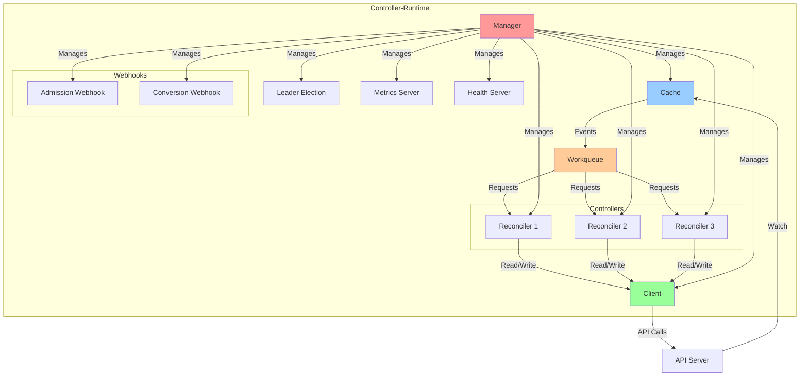
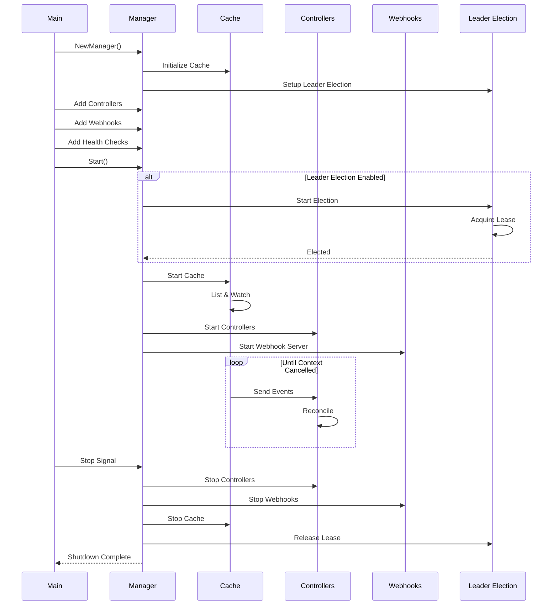
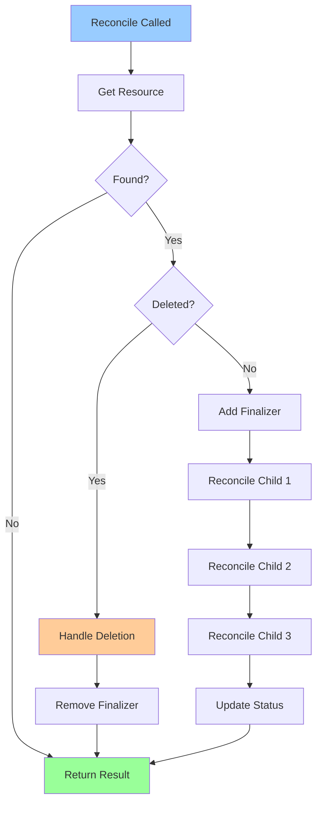
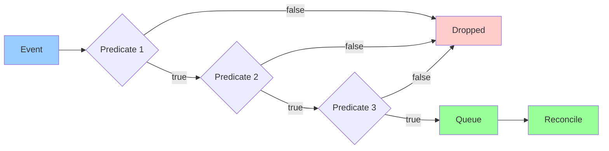
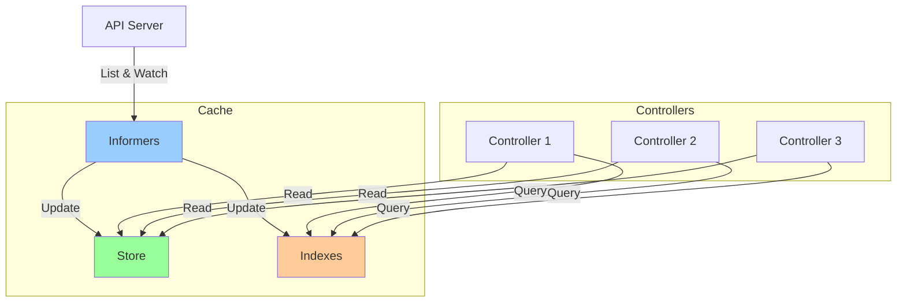
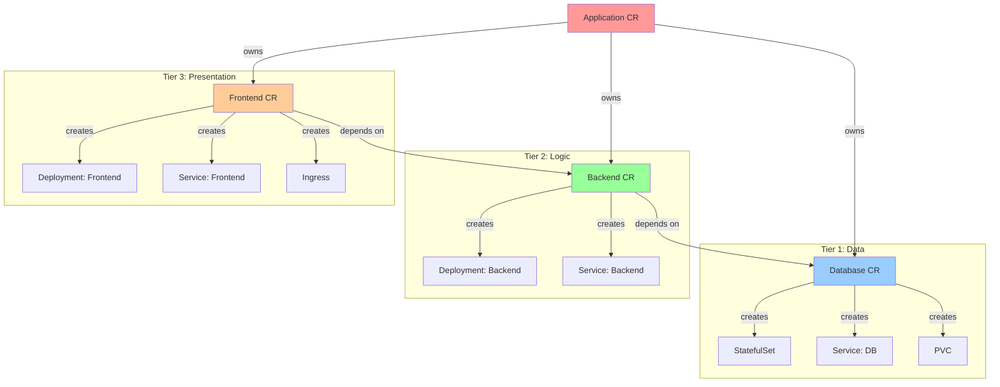

# **Controller-Runtime Architecture**

━━━━━━━━━━━━━━━━━━━━━━━━━━━━━━━━━━━━━━━━━━━━━━━━━━━━━━━━━━━━━━━━━━━━━━━━━━━━━━

## **📋 Overview**

Controller-runtime is the foundation library for building Kubernetes controllers and operators. It provides high-level abstractions over client-go and controller patterns, making it easier to build robust controllers.

**Key Components:**
- Manager: Orchestrates controllers and shared dependencies
- Reconciler: Core business logic interface
- Builder: Fluent API for controller configuration
- Cache: Shared informer cache
- Client: Unified API for reading/writing resources
- Webhook: Admission and conversion webhook support

**Repository:** `sigs.k8s.io/controller-runtime`

━━━━━━━━━━━━━━━━━━━━━━━━━━━━━━━━━━━━━━━━━━━━━━━━━━━━━━━━━━━━━━━━━━━━━━━━━━━━━━

## **🎯 Architecture Overview**

### **High-Level Architecture**



### **Component Responsibilities**

| Component | Responsibility | Location |
|-----------|---------------|----------|
| **Manager** | Lifecycle management, shared dependencies | `pkg/manager/manager.go` |
| **Cache** | Shared informer cache, watches | `pkg/cache/cache.go` |
| **Client** | Unified read/write interface | `pkg/client/client.go` |
| **Controller** | Watch setup, event handling | `pkg/controller/controller.go` |
| **Reconciler** | Business logic interface | `pkg/reconcile/reconcile.go` |
| **Builder** | Fluent controller configuration | `pkg/builder/controller.go` |
| **Webhook** | Admission/conversion webhooks | `pkg/webhook/admission/` |

━━━━━━━━━━━━━━━━━━━━━━━━━━━━━━━━━━━━━━━━━━━━━━━━━━━━━━━━━━━━━━━━━━━━━━━━━━━━━━

## **🔧 Manager**

### **Manager Interface**

The Manager is the central component that orchestrates all controllers and shared dependencies.

```go
// File: vendor/sigs.k8s.io/controller-runtime/pkg/manager/manager.go:60-120
package manager

import (
    "context"
    "net/http"

    "k8s.io/apimachinery/pkg/runtime"
    "k8s.io/client-go/rest"
    "sigs.k8s.io/controller-runtime/pkg/cache"
    "sigs.k8s.io/controller-runtime/pkg/client"
    "sigs.k8s.io/controller-runtime/pkg/healthz"
    "sigs.k8s.io/controller-runtime/pkg/webhook"
)

// Manager initializes shared dependencies and provides them to Runnables.
// A Manager is required to create Controllers.
type Manager interface {
    // Add adds a Runnable to the Manager (controllers, webhooks, etc.)
    Add(Runnable) error

    // Elected returns a channel that is closed when this manager is elected leader
    Elected() <-chan struct{}

    // AddMetricsExtraHandler adds an extra handler to the metrics server
    AddMetricsExtraHandler(path string, handler http.Handler) error

    // AddHealthzCheck adds a health check to the healthz endpoint
    AddHealthzCheck(name string, check healthz.Checker) error

    // AddReadyzCheck adds a readiness check to the readyz endpoint
    AddReadyzCheck(name string, check healthz.Checker) error

    // Start starts all registered Controllers and blocks until the context is cancelled
    Start(ctx context.Context) error

    // GetConfig returns the initialized Config
    GetConfig() *rest.Config

    // GetScheme returns the initialized Scheme
    GetScheme() *runtime.Scheme

    // GetClient returns a client configured with the Config
    GetClient() client.Client

    // GetFieldIndexer returns a client.FieldIndexer configured with the client
    GetFieldIndexer() client.FieldIndexer

    // GetCache returns a cache.Cache
    GetCache() cache.Cache

    // GetEventRecorderFor returns a new EventRecorder for the provided name
    GetEventRecorderFor(name string) record.EventRecorder

    // GetRESTMapper returns a RESTMapper
    GetRESTMapper() meta.RESTMapper

    // GetAPIReader returns a reader that uses the API server directly
    GetAPIReader() client.Reader

    // GetWebhookServer returns a webhook.Server
    GetWebhookServer() *webhook.Server

    // GetLogger returns the logger
    GetLogger() logr.Logger
}

// Options are the arguments for creating a new Manager
type Options struct {
    // Scheme is the scheme used to resolve runtime.Objects to GroupVersionKinds
    Scheme *runtime.Scheme

    // MetricsBindAddress is the TCP address that the controller should bind to
    // for serving prometheus metrics
    MetricsBindAddress string

    // HealthProbeBindAddress is the TCP address that the controller should bind to
    // for serving health probes
    HealthProbeBindAddress string

    // LeaderElection determines whether to use leader election
    LeaderElection bool

    // LeaderElectionID determines the name of the configmap that leader election
    // will use for holding the leader lock
    LeaderElectionID string

    // LeaderElectionNamespace determines the namespace in which the leader
    // election configmap will be created
    LeaderElectionNamespace string

    // LeaderElectionResourceLock determines which resource lock to use for leader election
    LeaderElectionResourceLock string

    // LeaseDuration is the duration that non-leader candidates will wait to force
    // acquire leadership
    LeaseDuration *time.Duration

    // RenewDeadline is the duration that the acting master will retry refreshing leadership
    RenewDeadline *time.Duration

    // RetryPeriod is the duration the LeaderElector clients should wait between tries
    RetryPeriod *time.Duration

    // Namespace if specified restricts the manager's cache to watch objects in the desired namespace
    Namespace string

    // NewCache is the function that will create the cache to be used by the manager
    NewCache cache.NewCacheFunc

    // NewClient is the func that creates the client to be used by the manager
    NewClient cluster.NewClientFunc

    // ClientDisableCacheFor tells the client which objects to not cache
    ClientDisableCacheFor []client.Object

    // DryRunClient specifies whether the client should be configured to enforce dryRun mode
    DryRunClient bool

    // EventBroadcaster broadcasts events to event sinks
    EventBroadcaster record.EventBroadcaster
}
```

### **Creating a Manager**

```go
// File: cmd/main.go
package main

import (
    "os"

    "k8s.io/apimachinery/pkg/runtime"
    clientgoscheme "k8s.io/client-go/kubernetes/scheme"
    ctrl "sigs.k8s.io/controller-runtime"
    "sigs.k8s.io/controller-runtime/pkg/healthz"
    "sigs.k8s.io/controller-runtime/pkg/log/zap"

    myappv1 "github.com/example/myapp-operator/api/v1"
    "github.com/example/myapp-operator/controllers"
)

var (
    scheme   = runtime.NewScheme()
    setupLog = ctrl.Log.WithName("setup")
)

func init() {
    _ = clientgoscheme.AddToScheme(scheme)
    _ = myappv1.AddToScheme(scheme)
}

func main() {
    // Setup logger
    ctrl.SetLogger(zap.New(zap.UseDevMode(true)))

    // Create manager
    mgr, err := ctrl.NewManager(ctrl.GetConfigOrDie(), ctrl.Options{
        Scheme:                 scheme,
        MetricsBindAddress:     ":8080",
        Port:                   9443,
        HealthProbeBindAddress: ":8081",
        LeaderElection:         true,
        LeaderElectionID:       "myapp-operator-lock",
        // Restrict to single namespace (optional)
        // Namespace: "myapp-system",
    })
    if err != nil {
        setupLog.Error(err, "unable to start manager")
        os.Exit(1)
    }

    // Register controllers
    if err = (&controllers.MyAppReconciler{
        Client: mgr.GetClient(),
        Scheme: mgr.GetScheme(),
    }).SetupWithManager(mgr); err != nil {
        setupLog.Error(err, "unable to create controller", "controller", "MyApp")
        os.Exit(1)
    }

    // Register webhooks
    if err = (&myappv1.MyApp{}).SetupWebhookWithManager(mgr); err != nil {
        setupLog.Error(err, "unable to create webhook", "webhook", "MyApp")
        os.Exit(1)
    }

    // Add health checks
    if err := mgr.AddHealthzCheck("healthz", healthz.Ping); err != nil {
        setupLog.Error(err, "unable to set up health check")
        os.Exit(1)
    }
    if err := mgr.AddReadyzCheck("readyz", healthz.Ping); err != nil {
        setupLog.Error(err, "unable to set up ready check")
        os.Exit(1)
    }

    // Start manager
    setupLog.Info("starting manager")
    if err := mgr.Start(ctrl.SetupSignalHandler()); err != nil {
        setupLog.Error(err, "problem running manager")
        os.Exit(1)
    }
}
```

### **Manager Lifecycle**



━━━━━━━━━━━━━━━━━━━━━━━━━━━━━━━━━━━━━━━━━━━━━━━━━━━━━━━━━━━━━━━━━━━━━━━━━━━━━━

## **♻️ Reconciler**

### **Reconciler Interface**

The Reconciler interface is where you implement your business logic.

```go
// File: vendor/sigs.k8s.io/controller-runtime/pkg/reconcile/reconcile.go:70-90
package reconcile

import (
    "context"
    "time"

    "k8s.io/apimachinery/pkg/types"
)

// Request contains the information necessary to reconcile a Kubernetes object
type Request struct {
    // NamespacedName is the name and namespace of the object to reconcile
    types.NamespacedName
}

// Result contains the result of a Reconciler invocation
type Result struct {
    // Requeue tells the Controller to requeue the reconcile key
    // Defaults to false
    Requeue bool

    // RequeueAfter if greater than 0, tells the Controller to requeue the reconcile
    // key after the Duration
    // Implies that Requeue is true, there is no need to set Requeue to true at the same time
    RequeueAfter time.Duration
}

// Reconciler implements a Kubernetes API for a specific Resource
type Reconciler interface {
    // Reconcile performs a full reconciliation for the object referred to by the Request
    // The Controller will requeue the Request to be processed again if an error is non-nil or
    // Result.Requeue is true, otherwise upon completion it will remove the work from the queue
    Reconcile(context.Context, Request) (Result, error)
}
```

### **Implementing a Reconciler**

```go
// File: controllers/myapp_controller.go
package controllers

import (
    "context"
    "time"

    appsv1 "k8s.io/api/apps/v1"
    corev1 "k8s.io/api/core/v1"
    "k8s.io/apimachinery/pkg/api/errors"
    metav1 "k8s.io/apimachinery/pkg/apis/meta/v1"
    "k8s.io/apimachinery/pkg/runtime"
    ctrl "sigs.k8s.io/controller-runtime"
    "sigs.k8s.io/controller-runtime/pkg/client"
    "sigs.k8s.io/controller-runtime/pkg/controller/controllerutil"
    "sigs.k8s.io/controller-runtime/pkg/log"

    myappv1 "github.com/example/myapp-operator/api/v1"
)

// MyAppReconciler reconciles a MyApp object
type MyAppReconciler struct {
    client.Client
    Scheme *runtime.Scheme
}

//+kubebuilder:rbac:groups=myapp.example.com,resources=myapps,verbs=get;list;watch;create;update;patch;delete
//+kubebuilder:rbac:groups=myapp.example.com,resources=myapps/status,verbs=get;update;patch
//+kubebuilder:rbac:groups=myapp.example.com,resources=myapps/finalizers,verbs=update
//+kubebuilder:rbac:groups=apps,resources=deployments,verbs=get;list;watch;create;update;patch;delete
//+kubebuilder:rbac:groups=core,resources=services,verbs=get;list;watch;create;update;patch;delete

func (r *MyAppReconciler) Reconcile(ctx context.Context, req ctrl.Request) (ctrl.Result, error) {
    log := log.FromContext(ctx)

    // Fetch the MyApp instance
    myapp := &myappv1.MyApp{}
    err := r.Get(ctx, req.NamespacedName, myapp)
    if err != nil {
        if errors.IsNotFound(err) {
            // Object not found, could have been deleted
            log.Info("MyApp resource not found. Ignoring since object must be deleted")
            return ctrl.Result{}, nil
        }
        // Error reading the object
        log.Error(err, "Failed to get MyApp")
        return ctrl.Result{}, err
    }

    // Handle deletion
    if !myapp.DeletionTimestamp.IsZero() {
        return r.handleDeletion(ctx, myapp)
    }

    // Add finalizer
    if !controllerutil.ContainsFinalizer(myapp, "myapp.example.com/finalizer") {
        controllerutil.AddFinalizer(myapp, "myapp.example.com/finalizer")
        if err := r.Update(ctx, myapp); err != nil {
            return ctrl.Result{}, err
        }
    }

    // Reconcile Deployment
    if err := r.reconcileDeployment(ctx, myapp); err != nil {
        log.Error(err, "Failed to reconcile Deployment")
        return ctrl.Result{}, err
    }

    // Reconcile Service
    if err := r.reconcileService(ctx, myapp); err != nil {
        log.Error(err, "Failed to reconcile Service")
        return ctrl.Result{}, err
    }

    // Update status
    if err := r.updateStatus(ctx, myapp); err != nil {
        log.Error(err, "Failed to update MyApp status")
        return ctrl.Result{}, err
    }

    // Requeue every 5 minutes for periodic reconciliation
    return ctrl.Result{RequeueAfter: 5 * time.Minute}, nil
}

func (r *MyAppReconciler) reconcileDeployment(ctx context.Context, myapp *myappv1.MyApp) error {
    deployment := &appsv1.Deployment{
        ObjectMeta: metav1.ObjectMeta{
            Name:      myapp.Name,
            Namespace: myapp.Namespace,
        },
    }

    _, err := controllerutil.CreateOrUpdate(ctx, r.Client, deployment, func() error {
        // Set MyApp instance as the owner and controller
        if err := controllerutil.SetControllerReference(myapp, deployment, r.Scheme); err != nil {
            return err
        }

        // Update deployment spec
        replicas := myapp.Spec.Replicas
        deployment.Spec = appsv1.DeploymentSpec{
            Replicas: &replicas,
            Selector: &metav1.LabelSelector{
                MatchLabels: map[string]string{
                    "app":      "myapp",
                    "instance": myapp.Name,
                },
            },
            Template: corev1.PodTemplateSpec{
                ObjectMeta: metav1.ObjectMeta{
                    Labels: map[string]string{
                        "app":      "myapp",
                        "instance": myapp.Name,
                    },
                },
                Spec: corev1.PodSpec{
                    Containers: []corev1.Container{
                        {
                            Name:  "myapp",
                            Image: myapp.Spec.Image,
                            Ports: []corev1.ContainerPort{
                                {
                                    ContainerPort: 8080,
                                    Name:          "http",
                                },
                            },
                        },
                    },
                },
            },
        }

        return nil
    })

    return err
}

func (r *MyAppReconciler) reconcileService(ctx context.Context, myapp *myappv1.MyApp) error {
    service := &corev1.Service{
        ObjectMeta: metav1.ObjectMeta{
            Name:      myapp.Name,
            Namespace: myapp.Namespace,
        },
    }

    _, err := controllerutil.CreateOrUpdate(ctx, r.Client, service, func() error {
        if err := controllerutil.SetControllerReference(myapp, service, r.Scheme); err != nil {
            return err
        }

        service.Spec = corev1.ServiceSpec{
            Selector: map[string]string{
                "app":      "myapp",
                "instance": myapp.Name,
            },
            Ports: []corev1.ServicePort{
                {
                    Port:     80,
                    Name:     "http",
                    Protocol: corev1.ProtocolTCP,
                },
            },
            Type: corev1.ServiceTypeClusterIP,
        }

        return nil
    })

    return err
}

func (r *MyAppReconciler) updateStatus(ctx context.Context, myapp *myappv1.MyApp) error {
    // Get deployment status
    deployment := &appsv1.Deployment{}
    err := r.Get(ctx, client.ObjectKey{Name: myapp.Name, Namespace: myapp.Namespace}, deployment)
    if err != nil {
        return err
    }

    // Update MyApp status based on deployment
    myapp.Status.ReadyReplicas = deployment.Status.ReadyReplicas
    myapp.Status.Replicas = deployment.Status.Replicas

    if deployment.Status.ReadyReplicas == *deployment.Spec.Replicas {
        myapp.Status.Phase = "Ready"
    } else {
        myapp.Status.Phase = "Progressing"
    }

    return r.Status().Update(ctx, myapp)
}

func (r *MyAppReconciler) handleDeletion(ctx context.Context, myapp *myappv1.MyApp) (ctrl.Result, error) {
    if controllerutil.ContainsFinalizer(myapp, "myapp.example.com/finalizer") {
        // Perform cleanup
        log := log.FromContext(ctx)
        log.Info("Performing cleanup for MyApp", "name", myapp.Name)

        // Add custom cleanup logic here

        // Remove finalizer
        controllerutil.RemoveFinalizer(myapp, "myapp.example.com/finalizer")
        if err := r.Update(ctx, myapp); err != nil {
            return ctrl.Result{}, err
        }
    }

    return ctrl.Result{}, nil
}

// SetupWithManager sets up the controller with the Manager
func (r *MyAppReconciler) SetupWithManager(mgr ctrl.Manager) error {
    return ctrl.NewControllerManagedBy(mgr).
        For(&myappv1.MyApp{}).
        Owns(&appsv1.Deployment{}).
        Owns(&corev1.Service{}).
        Complete(r)
}
```

### **Reconciliation Patterns**



━━━━━━━━━━━━━━━━━━━━━━━━━━━━━━━━━━━━━━━━━━━━━━━━━━━━━━━━━━━━━━━━━━━━━━━━━━━━━━

## **🏗️ Builder**

### **Controller Builder**

The Builder provides a fluent API for configuring controllers.

```go
// File: vendor/sigs.k8s.io/controller-runtime/pkg/builder/controller.go:50-100
package builder

import (
    "sigs.k8s.io/controller-runtime/pkg/client"
    "sigs.k8s.io/controller-runtime/pkg/controller"
    "sigs.k8s.io/controller-runtime/pkg/handler"
    "sigs.k8s.io/controller-runtime/pkg/predicate"
    "sigs.k8s.io/controller-runtime/pkg/reconcile"
    "sigs.k8s.io/controller-runtime/pkg/source"
)

// Builder builds a Controller
type Builder struct {
    forInput         ForInput
    ownsInput        []OwnsInput
    watchesInput     []WatchesInput
    mgr              manager.Manager
    globalPredicates []predicate.Predicate
    ctrl             controller.Controller
    ctrlOptions      controller.Options
    name             string
}

// ControllerManagedBy returns a new controller builder that will be started by the provided Manager
func ControllerManagedBy(m manager.Manager) *Builder {
    return &Builder{mgr: m}
}

// For defines the type of Object being reconciled
func (blder *Builder) For(object client.Object, opts ...ForOption) *Builder {
    blder.forInput = ForInput{object: object, opts: opts}
    return blder
}

// Owns defines types of Objects being generated by the ControllerManagedBy
func (blder *Builder) Owns(object client.Object, opts ...OwnsOption) *Builder {
    blder.ownsInput = append(blder.ownsInput, OwnsInput{object: object, opts: opts})
    return blder
}

// Watches exposes the lower-level ControllerManagedBy Watches functions through the builder
func (blder *Builder) Watches(src source.Source, eventhandler handler.EventHandler, opts ...WatchesOption) *Builder {
    blder.watchesInput = append(blder.watchesInput, WatchesInput{
        src:          src,
        eventhandler: eventhandler,
        opts:         opts,
    })
    return blder
}

// WithEventFilter sets the event filters for the controller
func (blder *Builder) WithEventFilter(p predicate.Predicate) *Builder {
    blder.globalPredicates = append(blder.globalPredicates, p)
    return blder
}

// WithOptions overrides the controller options
func (blder *Builder) WithOptions(options controller.Options) *Builder {
    blder.ctrlOptions = options
    return blder
}

// Named sets the name of the controller
func (blder *Builder) Named(name string) *Builder {
    blder.name = name
    return blder
}

// Complete builds the Application Controller
func (blder *Builder) Complete(r reconcile.Reconciler) error {
    _, err := blder.Build(r)
    return err
}
```

### **Builder Usage Examples**

**Basic Controller:**
```go
func (r *MyAppReconciler) SetupWithManager(mgr ctrl.Manager) error {
    return ctrl.NewControllerManagedBy(mgr).
        For(&myappv1.MyApp{}).
        Complete(r)
}
```

**Controller with Owned Resources:**
```go
func (r *MyAppReconciler) SetupWithManager(mgr ctrl.Manager) error {
    return ctrl.NewControllerManagedBy(mgr).
        For(&myappv1.MyApp{}).
        Owns(&appsv1.Deployment{}).
        Owns(&corev1.Service{}).
        Owns(&networkingv1.Ingress{}).
        Complete(r)
}
```

**Controller with Custom Watches:**
```go
func (r *MyAppReconciler) SetupWithManager(mgr ctrl.Manager) error {
    return ctrl.NewControllerManagedBy(mgr).
        For(&myappv1.MyApp{}).
        Owns(&appsv1.Deployment{}).
        Watches(
            &source.Kind{Type: &corev1.ConfigMap{}},
            handler.EnqueueRequestsFromMapFunc(r.findObjectsForConfigMap),
            builder.WithPredicates(predicate.ResourceVersionChangedPredicate{}),
        ).
        Complete(r)
}

func (r *MyAppReconciler) findObjectsForConfigMap(configMap client.Object) []reconcile.Request {
    attachedMyApps := &myappv1.MyAppList{}
    listOps := &client.ListOptions{
        FieldSelector: fields.OneTermEqualSelector("spec.configMapRef", configMap.GetName()),
    }
    err := r.List(context.TODO(), attachedMyApps, listOps)
    if err != nil {
        return []reconcile.Request{}
    }

    requests := make([]reconcile.Request, len(attachedMyApps.Items))
    for i, item := range attachedMyApps.Items {
        requests[i] = reconcile.Request{
            NamespacedName: types.NamespacedName{
                Name:      item.GetName(),
                Namespace: item.GetNamespace(),
            },
        }
    }
    return requests
}
```

**Controller with Predicates:**
```go
func (r *MyAppReconciler) SetupWithManager(mgr ctrl.Manager) error {
    return ctrl.NewControllerManagedBy(mgr).
        For(&myappv1.MyApp{}).
        WithEventFilter(predicate.Funcs{
            UpdateFunc: func(e event.UpdateEvent) bool {
                // Only reconcile when generation changes (spec updates)
                return e.ObjectOld.GetGeneration() != e.ObjectNew.GetGeneration()
            },
            DeleteFunc: func(e event.DeleteEvent) bool {
                // Don't reconcile on deletion
                return false
            },
        }).
        Complete(r)
}
```

**Controller with Options:**
```go
func (r *MyAppReconciler) SetupWithManager(mgr ctrl.Manager) error {
    return ctrl.NewControllerManagedBy(mgr).
        For(&myappv1.MyApp{}).
        WithOptions(controller.Options{
            MaxConcurrentReconciles: 3,
            RateLimiter:             workqueue.NewItemExponentialFailureRateLimiter(time.Second, 5*time.Minute),
        }).
        Named("myapp-controller").
        Complete(r)
}
```

━━━━━━━━━━━━━━━━━━━━━━━━━━━━━━━━━━━━━━━━━━━━━━━━━━━━━━━━━━━━━━━━━━━━━━━━━━━━━━

## **🎭 Predicates**

### **Predicate Interface**

Predicates filter events before they reach the reconciler.

```go
// File: vendor/sigs.k8s.io/controller-runtime/pkg/predicate/predicate.go:30-60
package predicate

import (
    "sigs.k8s.io/controller-runtime/pkg/event"
)

// Predicate filters events before enqueuing the keys
type Predicate interface {
    // Create returns true if the Create event should be processed
    Create(event.CreateEvent) bool

    // Delete returns true if the Delete event should be processed
    Delete(event.DeleteEvent) bool

    // Update returns true if the Update event should be processed
    Update(event.UpdateEvent) bool

    // Generic returns true if the Generic event should be processed
    Generic(event.GenericEvent) bool
}

// Funcs implements Predicate
type Funcs struct {
    CreateFunc  func(event.CreateEvent) bool
    DeleteFunc  func(event.DeleteEvent) bool
    UpdateFunc  func(event.UpdateEvent) bool
    GenericFunc func(event.GenericEvent) bool
}

func (p Funcs) Create(e event.CreateEvent) bool {
    if p.CreateFunc != nil {
        return p.CreateFunc(e)
    }
    return true
}

func (p Funcs) Delete(e event.DeleteEvent) bool {
    if p.DeleteFunc != nil {
        return p.DeleteFunc(e)
    }
    return true
}

func (p Funcs) Update(e event.UpdateEvent) bool {
    if p.UpdateFunc != nil {
        return p.UpdateFunc(e)
    }
    return true
}

func (p Funcs) Generic(e event.GenericEvent) bool {
    if p.GenericFunc != nil {
        return p.GenericFunc(e)
    }
    return true
}
```

### **Built-in Predicates**

**ResourceVersionChangedPredicate:**
```go
// Only trigger on actual changes (not periodic resyncs)
predicate.ResourceVersionChangedPredicate{}
```

**GenerationChangedPredicate:**
```go
// Only trigger when spec changes (generation increments)
predicate.GenerationChangedPredicate{}
```

**AnnotationChangedPredicate:**
```go
// Only trigger when annotations change
predicate.AnnotationChangedPredicate{}
```

**LabelChangedPredicate:**
```go
// Only trigger when labels change
predicate.LabelChangedPredicate{}
```

### **Custom Predicates**

```go
// File: controllers/predicates.go
package controllers

import (
    "sigs.k8s.io/controller-runtime/pkg/event"
    "sigs.k8s.io/controller-runtime/pkg/predicate"
)

// IgnoreDeletePredicate ignores delete events
func IgnoreDeletePredicate() predicate.Predicate {
    return predicate.Funcs{
        DeleteFunc: func(e event.DeleteEvent) bool {
            return false
        },
    }
}

// OnlyLabeledPredicate only processes resources with specific label
func OnlyLabeledPredicate(key, value string) predicate.Predicate {
    return predicate.Funcs{
        CreateFunc: func(e event.CreateEvent) bool {
            return e.Object.GetLabels()[key] == value
        },
        UpdateFunc: func(e event.UpdateEvent) bool {
            return e.ObjectNew.GetLabels()[key] == value
        },
        DeleteFunc: func(e event.DeleteEvent) bool {
            return e.Object.GetLabels()[key] == value
        },
        GenericFunc: func(e event.GenericEvent) bool {
            return e.Object.GetLabels()[key] == value
        },
    }
}

// SpecChangedPredicate only processes spec changes
func SpecChangedPredicate() predicate.Predicate {
    return predicate.Funcs{
        UpdateFunc: func(e event.UpdateEvent) bool {
            // Compare generations to detect spec changes
            return e.ObjectOld.GetGeneration() != e.ObjectNew.GetGeneration()
        },
    }
}

// StatusChangedPredicate only processes status changes
func StatusChangedPredicate() predicate.Predicate {
    return predicate.Funcs{
        UpdateFunc: func(e event.UpdateEvent) bool {
            // Status changes don't increment generation
            return e.ObjectOld.GetGeneration() == e.ObjectNew.GetGeneration() &&
                   e.ObjectOld.GetResourceVersion() != e.ObjectNew.GetResourceVersion()
        },
    }
}
```

### **Predicate Flow**



━━━━━━━━━━━━━━━━━━━━━━━━━━━━━━━━━━━━━━━━━━━━━━━━━━━━━━━━━━━━━━━━━━━━━━━━━━━━━━

## **💾 Cache**

### **Cache Interface**

The cache provides a shared informer cache for efficient resource watching.

```go
// File: vendor/sigs.k8s.io/controller-runtime/pkg/cache/cache.go:40-80
package cache

import (
    "context"
    "time"

    "k8s.io/apimachinery/pkg/fields"
    "k8s.io/apimachinery/pkg/labels"
    "k8s.io/apimachinery/pkg/runtime"
    "k8s.io/apimachinery/pkg/runtime/schema"
    "sigs.k8s.io/controller-runtime/pkg/client"
)

// Cache knows how to load Kubernetes objects, subscribe to update events for a specific object kind,
// and list objects with certain criteria
type Cache interface {
    // Reader acts as a client to objects stored in the cache
    client.Reader

    // Informers loads informers for the cache
    Informers(ctx context.Context) (Informers, error)

    // Start starts the cache's informers
    Start(ctx context.Context) error

    // WaitForCacheSync waits for the cache to be synced
    WaitForCacheSync(ctx context.Context) bool

    // IndexField adds an index with the given field
    IndexField(ctx context.Context, obj client.Object, field string, extractValue client.IndexerFunc) error
}

// Options are the optional arguments for creating a new Cache object
type Options struct {
    // Scheme is the scheme to use for mapping objects to GroupVersionKinds
    Scheme *runtime.Scheme

    // Mapper is the RESTMapper to use for mapping GroupVersionKinds to Resources
    Mapper meta.RESTMapper

    // Resync is the period at which all resources will be resynced
    Resync *time.Duration

    // Namespace restricts the cache to watching objects in the desired namespace
    Namespace string

    // SelectorsByObject restricts the cache to watching objects based on selectors
    SelectorsByObject SelectorsByObject

    // DefaultSelector is the default selector used when no selector is specified
    DefaultSelector Selector

    // DefaultTransform is the default transform to apply to objects
    DefaultTransform TransformFunc

    // TransformByObject contains object-specific transform functions
    TransformByObject TransformByObject
}

// SelectorsByObject associates a client.Object's GVK to a field/label selector
type SelectorsByObject map[client.Object]Selector

// Selector specifies a field selector and label selector
type Selector struct {
    Label labels.Selector
    Field fields.Selector
}
```

### **Cache Usage**

**Reading from Cache:**
```go
func (r *MyAppReconciler) Reconcile(ctx context.Context, req ctrl.Request) (ctrl.Result, error) {
    // This Get() uses the cache (fast)
    myapp := &myappv1.MyApp{}
    if err := r.Get(ctx, req.NamespacedName, myapp); err != nil {
        return ctrl.Result{}, client.IgnoreNotFound(err)
    }

    // List also uses the cache
    deployments := &appsv1.DeploymentList{}
    if err := r.List(ctx, deployments, client.InNamespace(myapp.Namespace)); err != nil {
        return ctrl.Result{}, err
    }

    return ctrl.Result{}, nil
}
```

**Reading Directly from API Server:**
```go
func (r *MyAppReconciler) Reconcile(ctx context.Context, req ctrl.Request) (ctrl.Result, error) {
    // Use APIReader for strongly consistent reads (bypasses cache)
    myapp := &myappv1.MyApp{}
    if err := r.APIReader.Get(ctx, req.NamespacedName, myapp); err != nil {
        return ctrl.Result{}, client.IgnoreNotFound(err)
    }

    return ctrl.Result{}, nil
}

type MyAppReconciler struct {
    client.Client
    APIReader client.Reader // Injected from manager
    Scheme    *runtime.Scheme
}
```

**Indexing:**
```go
// File: controllers/indexing.go
package controllers

import (
    "context"

    "sigs.k8s.io/controller-runtime/pkg/client"
    "sigs.k8s.io/controller-runtime/pkg/manager"

    myappv1 "github.com/example/myapp-operator/api/v1"
)

const (
    ownerKey = ".metadata.controller"
)

// SetupIndexes sets up field indexes
func SetupIndexes(ctx context.Context, mgr manager.Manager) error {
    // Index Deployments by owner
    if err := mgr.GetFieldIndexer().IndexField(ctx, &appsv1.Deployment{}, ownerKey, func(rawObj client.Object) []string {
        deployment := rawObj.(*appsv1.Deployment)
        owner := metav1.GetControllerOf(deployment)
        if owner == nil {
            return nil
        }
        if owner.APIVersion != myappv1.GroupVersion.String() || owner.Kind != "MyApp" {
            return nil
        }
        return []string{owner.Name}
    }); err != nil {
        return err
    }

    return nil
}

// Using the index
func (r *MyAppReconciler) findDeploymentsForMyApp(ctx context.Context, myapp *myappv1.MyApp) ([]*appsv1.Deployment, error) {
    var deployments appsv1.DeploymentList
    if err := r.List(ctx, &deployments,
        client.InNamespace(myapp.Namespace),
        client.MatchingFields{ownerKey: myapp.Name}); err != nil {
        return nil, err
    }

    result := make([]*appsv1.Deployment, len(deployments.Items))
    for i := range deployments.Items {
        result[i] = &deployments.Items[i]
    }
    return result, nil
}
```

### **Cache Architecture**



━━━━━━━━━━━━━━━━━━━━━━━━━━━━━━━━━━━━━━━━━━━━━━━━━━━━━━━━━━━━━━━━━━━━━━━━━━━━━━

## **📡 Client**

### **Client Interface**

Controller-runtime provides a unified client interface that works with both cached and uncached reads.

```go
// File: vendor/sigs.k8s.io/controller-runtime/pkg/client/client.go:60-120
package client

import (
    "context"

    "k8s.io/apimachinery/pkg/runtime"
    "k8s.io/apimachinery/pkg/runtime/schema"
)

// Client is the interface for interacting with Kubernetes objects
type Client interface {
    Reader
    Writer
    StatusClient

    // Scheme returns the scheme this client is using
    Scheme() *runtime.Scheme

    // RESTMapper returns the rest mapper this client is using
    RESTMapper() meta.RESTMapper
}

// Reader knows how to read and list Kubernetes objects
type Reader interface {
    // Get retrieves an obj for the given object key from the Kubernetes Cluster
    Get(ctx context.Context, key ObjectKey, obj Object) error

    // List retrieves list of objects for a given namespace and list options
    List(ctx context.Context, list ObjectList, opts ...ListOption) error
}

// Writer knows how to create, delete, and update Kubernetes objects
type Writer interface {
    // Create saves the object obj in the Kubernetes cluster
    Create(ctx context.Context, obj Object, opts ...CreateOption) error

    // Delete deletes the given obj from Kubernetes cluster
    Delete(ctx context.Context, obj Object, opts ...DeleteOption) error

    // Update updates the given obj in the Kubernetes cluster
    Update(ctx context.Context, obj Object, opts ...UpdateOption) error

    // Patch patches the given obj in the Kubernetes cluster
    Patch(ctx context.Context, obj Object, patch Patch, opts ...PatchOption) error

    // DeleteAllOf deletes all objects of the given type matching the given options
    DeleteAllOf(ctx context.Context, obj Object, opts ...DeleteAllOfOption) error
}

// StatusClient knows how to create a client which can update status subresource
type StatusClient interface {
    Status() StatusWriter
}

// StatusWriter knows how to update status subresource of a Kubernetes object
type StatusWriter interface {
    // Update updates the fields corresponding to the status subresource for the
    // given obj
    Update(ctx context.Context, obj Object, opts ...UpdateOption) error

    // Patch patches the given object's subresource
    Patch(ctx context.Context, obj Object, patch Patch, opts ...PatchOption) error
}
```

### **Client Usage Patterns**

**CRUD Operations:**
```go
func (r *MyAppReconciler) Reconcile(ctx context.Context, req ctrl.Request) (ctrl.Result, error) {
    // CREATE
    configMap := &corev1.ConfigMap{
        ObjectMeta: metav1.ObjectMeta{
            Name:      "my-config",
            Namespace: "default",
        },
        Data: map[string]string{
            "key": "value",
        },
    }
    if err := r.Create(ctx, configMap); err != nil {
        return ctrl.Result{}, err
    }

    // GET
    retrieved := &corev1.ConfigMap{}
    if err := r.Get(ctx, client.ObjectKey{Name: "my-config", Namespace: "default"}, retrieved); err != nil {
        return ctrl.Result{}, err
    }

    // UPDATE
    retrieved.Data["key"] = "new-value"
    if err := r.Update(ctx, retrieved); err != nil {
        return ctrl.Result{}, err
    }

    // PATCH
    patch := client.MergeFrom(retrieved.DeepCopy())
    retrieved.Data["another-key"] = "another-value"
    if err := r.Patch(ctx, retrieved, patch); err != nil {
        return ctrl.Result{}, err
    }

    // DELETE
    if err := r.Delete(ctx, retrieved); err != nil {
        return ctrl.Result{}, err
    }

    return ctrl.Result{}, nil
}
```

**List Options:**
```go
// List all pods in namespace
pods := &corev1.PodList{}
if err := r.List(ctx, pods, client.InNamespace("default")); err != nil {
    return ctrl.Result{}, err
}

// List with label selector
if err := r.List(ctx, pods,
    client.InNamespace("default"),
    client.MatchingLabels{"app": "myapp"}); err != nil {
    return ctrl.Result{}, err
}

// List with field selector
if err := r.List(ctx, pods,
    client.InNamespace("default"),
    client.MatchingFields{"spec.nodeName": "node-1"}); err != nil {
    return ctrl.Result{}, err
}

// List with limit
if err := r.List(ctx, pods,
    client.InNamespace("default"),
    client.Limit(100)); err != nil {
    return ctrl.Result{}, err
}
```

**Status Updates:**
```go
// Update status subresource
myapp := &myappv1.MyApp{}
if err := r.Get(ctx, req.NamespacedName, myapp); err != nil {
    return ctrl.Result{}, err
}

myapp.Status.Phase = "Ready"
myapp.Status.ReadyReplicas = 3

// This only updates status, not spec
if err := r.Status().Update(ctx, myapp); err != nil {
    return ctrl.Result{}, err
}
```

**Patch Types:**
```go
// Strategic Merge Patch
patch := client.MergeFrom(original.DeepCopy())
original.Spec.Replicas = 5
if err := r.Patch(ctx, original, patch); err != nil {
    return err
}

// JSON Patch
patch := client.RawPatch(types.JSONPatchType, []byte(`[{"op":"replace","path":"/spec/replicas","value":5}]`))
if err := r.Patch(ctx, deployment, patch); err != nil {
    return err
}

// Merge Patch
patch := client.RawPatch(types.MergePatchType, []byte(`{"spec":{"replicas":5}}`))
if err := r.Patch(ctx, deployment, patch); err != nil {
    return err
}
```

━━━━━━━━━━━━━━━━━━━━━━━━━━━━━━━━━━━━━━━━━━━━━━━━━━━━━━━━━━━━━━━━━━━━━━━━━━━━━━

## **🔨 Kubebuilder**

### **What is Kubebuilder?**

Kubebuilder is a framework for building Kubernetes APIs using CRDs. It scaffolds controller-runtime projects and generates boilerplate code.

**Installation:**
```bash
# Install kubebuilder
curl -L -o kubebuilder https://go.kubebuilder.io/dl/latest/$(go env GOOS)/$(go env GOARCH)
chmod +x kubebuilder && mv kubebuilder /usr/local/bin/
```

### **Creating a Project**

```bash
# Initialize project
mkdir myapp-operator
cd myapp-operator
kubebuilder init --domain example.com --repo github.com/example/myapp-operator

# Create API
kubebuilder create api --group apps --version v1 --kind MyApp

# Create webhook
kubebuilder create webhook --group apps --version v1 --kind MyApp --defaulting --programmatic-validation
```

### **Generated Project Structure**

```
myapp-operator/
├── api/
│   └── v1/
│       ├── myapp_types.go          # CRD definition
│       ├── myapp_webhook.go        # Webhook implementation
│       └── zz_generated.deepcopy.go # Generated code
├── config/
│   ├── crd/                        # CRD manifests
│   ├── rbac/                       # RBAC manifests
│   ├── manager/                    # Manager deployment
│   ├── webhook/                    # Webhook configuration
│   └── samples/                    # Sample CRs
├── controllers/
│   └── myapp_controller.go         # Controller implementation
├── Dockerfile
├── Makefile
├── PROJECT                         # Kubebuilder metadata
└── main.go                         # Entry point
```

### **Kubebuilder Markers**

Kubebuilder uses code markers (comments) to generate manifests.

**CRD Markers:**
```go
// File: api/v1/myapp_types.go
package v1

import (
    metav1 "k8s.io/apimachinery/pkg/apis/meta/v1"
)

// MyAppSpec defines the desired state of MyApp
type MyAppSpec struct {
    // +kubebuilder:validation:Required
    // +kubebuilder:validation:MinLength=1
    Image string `json:"image"`

    // +kubebuilder:validation:Minimum=1
    // +kubebuilder:validation:Maximum=10
    // +kubebuilder:default=1
    Replicas int32 `json:"replicas,omitempty"`

    // +kubebuilder:validation:Enum=development;staging;production
    Environment string `json:"environment,omitempty"`

    // +kubebuilder:validation:Pattern=`^[a-z0-9]([-a-z0-9]*[a-z0-9])?$`
    Name string `json:"name,omitempty"`
}

// MyAppStatus defines the observed state of MyApp
type MyAppStatus struct {
    // +kubebuilder:validation:Enum=Pending;Running;Failed
    Phase string `json:"phase,omitempty"`

    ReadyReplicas int32 `json:"readyReplicas,omitempty"`

    Conditions []metav1.Condition `json:"conditions,omitempty"`
}

//+kubebuilder:object:root=true
//+kubebuilder:subresource:status
//+kubebuilder:subresource:scale:specpath=.spec.replicas,statuspath=.status.readyReplicas
//+kubebuilder:printcolumn:name="Phase",type=string,JSONPath=`.status.phase`
//+kubebuilder:printcolumn:name="Replicas",type=integer,JSONPath=`.status.readyReplicas`
//+kubebuilder:printcolumn:name="Age",type=date,JSONPath=`.metadata.creationTimestamp`
//+kubebuilder:resource:shortName=ma

// MyApp is the Schema for the myapps API
type MyApp struct {
    metav1.TypeMeta   `json:",inline"`
    metav1.ObjectMeta `json:"metadata,omitempty"`

    Spec   MyAppSpec   `json:"spec,omitempty"`
    Status MyAppStatus `json:"status,omitempty"`
}

//+kubebuilder:object:root=true

// MyAppList contains a list of MyApp
type MyAppList struct {
    metav1.TypeMeta `json:",inline"`
    metav1.ListMeta `json:"metadata,omitempty"`
    Items           []MyApp `json:"items"`
}

func init() {
    SchemeBuilder.Register(&MyApp{}, &MyAppList{})
}
```

**RBAC Markers:**
```go
// File: controllers/myapp_controller.go

//+kubebuilder:rbac:groups=apps.example.com,resources=myapps,verbs=get;list;watch;create;update;patch;delete
//+kubebuilder:rbac:groups=apps.example.com,resources=myapps/status,verbs=get;update;patch
//+kubebuilder:rbac:groups=apps.example.com,resources=myapps/finalizers,verbs=update
//+kubebuilder:rbac:groups=apps,resources=deployments,verbs=get;list;watch;create;update;patch;delete
//+kubebuilder:rbac:groups=core,resources=services,verbs=get;list;watch;create;update;patch;delete
//+kubebuilder:rbac:groups=core,resources=events,verbs=create;patch

func (r *MyAppReconciler) Reconcile(ctx context.Context, req ctrl.Request) (ctrl.Result, error) {
    // ...
}
```

**Webhook Markers:**
```go
// File: api/v1/myapp_webhook.go

//+kubebuilder:webhook:path=/mutate-apps-example-com-v1-myapp,mutating=true,failurePolicy=fail,groups=apps.example.com,resources=myapps,verbs=create;update,versions=v1,name=mmyapp.kb.io,admissionReviewVersions=v1,sideEffects=None

func (r *MyApp) Default() {
    // Set default values
    if r.Spec.Replicas == 0 {
        r.Spec.Replicas = 1
    }
}

//+kubebuilder:webhook:path=/validate-apps-example-com-v1-myapp,mutating=false,failurePolicy=fail,groups=apps.example.com,resources=myapps,verbs=create;update,versions=v1,name=vmyapp.kb.io,admissionReviewVersions=v1,sideEffects=None

func (r *MyApp) ValidateCreate() error {
    // Validate on create
    return r.validateMyApp()
}

func (r *MyApp) ValidateUpdate(old runtime.Object) error {
    // Validate on update
    return r.validateMyApp()
}

func (r *MyApp) ValidateDelete() error {
    // Validate on delete
    return nil
}

func (r *MyApp) validateMyApp() error {
    if r.Spec.Replicas < 1 || r.Spec.Replicas > 10 {
        return fmt.Errorf("replicas must be between 1 and 10")
    }
    return nil
}
```

### **Makefile Targets**

```bash
# Generate CRD manifests
make manifests

# Generate code (DeepCopy, DeepCopyInto, DeepCopyObject)
make generate

# Run tests
make test

# Build manager binary
make build

# Build and push Docker image
make docker-build docker-push IMG=example.com/myapp-operator:v1.0.0

# Install CRDs
make install

# Uninstall CRDs
make uninstall

# Deploy controller to cluster
make deploy IMG=example.com/myapp-operator:v1.0.0

# Undeploy controller
make undeploy

# Run locally (outside cluster)
make run
```

━━━━━━━━━━━━━━━━━━━━━━━━━━━━━━━━━━━━━━━━━━━━━━━━━━━━━━━━━━━━━━━━━━━━━━━━━━━━━━

## **🧪 envtest - Integration Testing**

### **What is envtest?**

envtest sets up a local Kubernetes API server and etcd for integration testing controllers.

### **Setting Up Tests**

```go
// File: controllers/suite_test.go
package controllers

import (
    "context"
    "path/filepath"
    "testing"
    "time"

    . "github.com/onsi/ginkgo/v2"
    . "github.com/onsi/gomega"

    corev1 "k8s.io/api/core/v1"
    metav1 "k8s.io/apimachinery/pkg/apis/meta/v1"
    "k8s.io/client-go/kubernetes/scheme"
    "k8s.io/client-go/rest"
    ctrl "sigs.k8s.io/controller-runtime"
    "sigs.k8s.io/controller-runtime/pkg/client"
    "sigs.k8s.io/controller-runtime/pkg/envtest"
    logf "sigs.k8s.io/controller-runtime/pkg/log"
    "sigs.k8s.io/controller-runtime/pkg/log/zap"

    myappv1 "github.com/example/myapp-operator/api/v1"
)

var (
    cfg       *rest.Config
    k8sClient client.Client
    testEnv   *envtest.Environment
    ctx       context.Context
    cancel    context.CancelFunc
)

func TestAPIs(t *testing.T) {
    RegisterFailHandler(Fail)
    RunSpecs(t, "Controller Suite")
}

var _ = BeforeSuite(func() {
    logf.SetLogger(zap.New(zap.WriteTo(GinkgoWriter), zap.UseDevMode(true)))

    ctx, cancel = context.WithCancel(context.TODO())

    By("bootstrapping test environment")
    testEnv = &envtest.Environment{
        CRDDirectoryPaths:     []string{filepath.Join("..", "config", "crd", "bases")},
        ErrorIfCRDPathMissing: true,
    }

    var err error
    cfg, err = testEnv.Start()
    Expect(err).NotTo(HaveOccurred())
    Expect(cfg).NotTo(BeNil())

    err = myappv1.AddToScheme(scheme.Scheme)
    Expect(err).NotTo(HaveOccurred())

    k8sClient, err = client.New(cfg, client.Options{Scheme: scheme.Scheme})
    Expect(err).NotTo(HaveOccurred())
    Expect(k8sClient).NotTo(BeNil())

    // Start controller manager
    k8sManager, err := ctrl.NewManager(cfg, ctrl.Options{
        Scheme: scheme.Scheme,
    })
    Expect(err).ToNot(HaveOccurred())

    err = (&MyAppReconciler{
        Client: k8sManager.GetClient(),
        Scheme: k8sManager.GetScheme(),
    }).SetupWithManager(k8sManager)
    Expect(err).ToNot(HaveOccurred())

    go func() {
        defer GinkgoRecover()
        err = k8sManager.Start(ctx)
        Expect(err).ToNot(HaveOccurred(), "failed to run manager")
    }()
})

var _ = AfterSuite(func() {
    cancel()
    By("tearing down the test environment")
    err := testEnv.Stop()
    Expect(err).NotTo(HaveOccurred())
})
```

### **Writing Tests**

```go
// File: controllers/myapp_controller_test.go
package controllers

import (
    "context"
    "time"

    . "github.com/onsi/ginkgo/v2"
    . "github.com/onsi/gomega"

    appsv1 "k8s.io/api/apps/v1"
    corev1 "k8s.io/api/core/v1"
    metav1 "k8s.io/apimachinery/pkg/apis/meta/v1"
    "k8s.io/apimachinery/pkg/types"
    "sigs.k8s.io/controller-runtime/pkg/client"

    myappv1 "github.com/example/myapp-operator/api/v1"
)

var _ = Describe("MyApp Controller", func() {
    const (
        timeout  = time.Second * 10
        duration = time.Second * 10
        interval = time.Millisecond * 250
    )

    Context("When creating MyApp", func() {
        It("Should create Deployment and Service", func() {
            ctx := context.Background()

            myapp := &myappv1.MyApp{
                ObjectMeta: metav1.ObjectMeta{
                    Name:      "test-myapp",
                    Namespace: "default",
                },
                Spec: myappv1.MyAppSpec{
                    Image:    "nginx:latest",
                    Replicas: 3,
                },
            }

            Expect(k8sClient.Create(ctx, myapp)).Should(Succeed())

            myappLookupKey := types.NamespacedName{Name: "test-myapp", Namespace: "default"}
            createdMyApp := &myappv1.MyApp{}

            Eventually(func() bool {
                err := k8sClient.Get(ctx, myappLookupKey, createdMyApp)
                return err == nil
            }, timeout, interval).Should(BeTrue())

            // Check Deployment created
            deployment := &appsv1.Deployment{}
            Eventually(func() bool {
                err := k8sClient.Get(ctx, myappLookupKey, deployment)
                if err != nil {
                    return false
                }
                return *deployment.Spec.Replicas == 3
            }, timeout, interval).Should(BeTrue())

            // Check Service created
            service := &corev1.Service{}
            Eventually(func() bool {
                err := k8sClient.Get(ctx, myappLookupKey, service)
                return err == nil
            }, timeout, interval).Should(BeTrue())

            // Verify owner reference
            Expect(deployment.OwnerReferences).Should(HaveLen(1))
            Expect(deployment.OwnerReferences[0].Name).Should(Equal(myapp.Name))
        })
    })

    Context("When updating MyApp", func() {
        It("Should update Deployment", func() {
            ctx := context.Background()

            myapp := &myappv1.MyApp{
                ObjectMeta: metav1.ObjectMeta{
                    Name:      "test-myapp-update",
                    Namespace: "default",
                },
                Spec: myappv1.MyAppSpec{
                    Image:    "nginx:1.20",
                    Replicas: 2,
                },
            }

            Expect(k8sClient.Create(ctx, myapp)).Should(Succeed())

            myappLookupKey := types.NamespacedName{Name: "test-myapp-update", Namespace: "default"}

            // Wait for initial reconciliation
            deployment := &appsv1.Deployment{}
            Eventually(func() bool {
                err := k8sClient.Get(ctx, myappLookupKey, deployment)
                return err == nil && *deployment.Spec.Replicas == 2
            }, timeout, interval).Should(BeTrue())

            // Update MyApp
            updatedMyApp := &myappv1.MyApp{}
            Expect(k8sClient.Get(ctx, myappLookupKey, updatedMyApp)).Should(Succeed())
            updatedMyApp.Spec.Replicas = 5
            Expect(k8sClient.Update(ctx, updatedMyApp)).Should(Succeed())

            // Verify Deployment updated
            Eventually(func() int32 {
                k8sClient.Get(ctx, myappLookupKey, deployment)
                return *deployment.Spec.Replicas
            }, timeout, interval).Should(Equal(int32(5)))
        })
    })

    Context("When deleting MyApp", func() {
        It("Should delete Deployment and Service", func() {
            ctx := context.Background()

            myapp := &myappv1.MyApp{
                ObjectMeta: metav1.ObjectMeta{
                    Name:      "test-myapp-delete",
                    Namespace: "default",
                },
                Spec: myappv1.MyAppSpec{
                    Image:    "nginx:latest",
                    Replicas: 1,
                },
            }

            Expect(k8sClient.Create(ctx, myapp)).Should(Succeed())

            myappLookupKey := types.NamespacedName{Name: "test-myapp-delete", Namespace: "default"}

            // Wait for resources to be created
            deployment := &appsv1.Deployment{}
            Eventually(func() bool {
                err := k8sClient.Get(ctx, myappLookupKey, deployment)
                return err == nil
            }, timeout, interval).Should(BeTrue())

            // Delete MyApp
            Expect(k8sClient.Delete(ctx, myapp)).Should(Succeed())

            // Verify Deployment deleted (via owner reference)
            Eventually(func() bool {
                err := k8sClient.Get(ctx, myappLookupKey, deployment)
                return errors.IsNotFound(err)
            }, timeout, interval).Should(BeTrue())
        })
    })
})
```

### **Running Tests**

```bash
# Run tests
make test

# Run with coverage
go test ./controllers/... -coverprofile cover.out

# View coverage
go tool cover -html=cover.out
```

━━━━━━━━━━━━━━━━━━━━━━━━━━━━━━━━━━━━━━━━━━━━━━━━━━━━━━━━━━━━━━━━━━━━━━━━━━━━━━

## **📊 Complete Example: Multi-Tier Application Operator**

### **Project Structure**

```
multitier-operator/
├── api/v1/
│   ├── application_types.go
│   ├── frontend_types.go
│   ├── backend_types.go
│   └── database_types.go
├── controllers/
│   ├── application_controller.go
│   ├── frontend_controller.go
│   ├── backend_controller.go
│   └── database_controller.go
└── main.go
```

### **CRD Definitions**

```go
// File: api/v1/application_types.go
package v1

import (
    metav1 "k8s.io/apimachinery/pkg/apis/meta/v1"
)

type ApplicationSpec struct {
    Frontend FrontendSpec `json:"frontend"`
    Backend  BackendSpec  `json:"backend"`
    Database DatabaseSpec `json:"database"`
}

type ApplicationStatus struct {
    Phase      string             `json:"phase,omitempty"`
    Conditions []metav1.Condition `json:"conditions,omitempty"`
    Components ComponentStatus    `json:"components,omitempty"`
}

type ComponentStatus struct {
    Frontend string `json:"frontend,omitempty"`
    Backend  string `json:"backend,omitempty"`
    Database string `json:"database,omitempty"`
}

//+kubebuilder:object:root=true
//+kubebuilder:subresource:status

type Application struct {
    metav1.TypeMeta   `json:",inline"`
    metav1.ObjectMeta `json:"metadata,omitempty"`

    Spec   ApplicationSpec   `json:"spec,omitempty"`
    Status ApplicationStatus `json:"status,omitempty"`
}

//+kubebuilder:object:root=true

type ApplicationList struct {
    metav1.TypeMeta `json:",inline"`
    metav1.ListMeta `json:"metadata,omitempty"`
    Items           []Application `json:"items"`
}
```

### **Application Controller**

```go
// File: controllers/application_controller.go
package controllers

import (
    "context"

    ctrl "sigs.k8s.io/controller-runtime"
    "sigs.k8s.io/controller-runtime/pkg/client"
    "sigs.k8s.io/controller-runtime/pkg/controller/controllerutil"

    multitierv1 "github.com/example/multitier-operator/api/v1"
)

type ApplicationReconciler struct {
    client.Client
    Scheme *runtime.Scheme
}

func (r *ApplicationReconciler) Reconcile(ctx context.Context, req ctrl.Request) (ctrl.Result, error) {
    app := &multitierv1.Application{}
    if err := r.Get(ctx, req.NamespacedName, app); err != nil {
        return ctrl.Result{}, client.IgnoreNotFound(err)
    }

    // Reconcile Database first (dependency)
    database := &multitierv1.Database{
        ObjectMeta: metav1.ObjectMeta{
            Name:      app.Name + "-db",
            Namespace: app.Namespace,
        },
    }

    _, err := controllerutil.CreateOrUpdate(ctx, r.Client, database, func() error {
        database.Spec = app.Spec.Database
        return controllerutil.SetControllerReference(app, database, r.Scheme)
    })
    if err != nil {
        return ctrl.Result{}, err
    }

    // Wait for database to be ready
    if database.Status.Phase != "Ready" {
        return ctrl.Result{RequeueAfter: 10 * time.Second}, nil
    }

    // Reconcile Backend
    backend := &multitierv1.Backend{
        ObjectMeta: metav1.ObjectMeta{
            Name:      app.Name + "-backend",
            Namespace: app.Namespace,
        },
    }

    _, err = controllerutil.CreateOrUpdate(ctx, r.Client, backend, func() error {
        backend.Spec = app.Spec.Backend
        backend.Spec.DatabaseRef = database.Name
        return controllerutil.SetControllerReference(app, backend, r.Scheme)
    })
    if err != nil {
        return ctrl.Result{}, err
    }

    // Wait for backend to be ready
    if backend.Status.Phase != "Ready" {
        return ctrl.Result{RequeueAfter: 10 * time.Second}, nil
    }

    // Reconcile Frontend
    frontend := &multitierv1.Frontend{
        ObjectMeta: metav1.ObjectMeta{
            Name:      app.Name + "-frontend",
            Namespace: app.Namespace,
        },
    }

    _, err = controllerutil.CreateOrUpdate(ctx, r.Client, frontend, func() error {
        frontend.Spec = app.Spec.Frontend
        frontend.Spec.BackendRef = backend.Name
        return controllerutil.SetControllerReference(app, frontend, r.Scheme)
    })
    if err != nil {
        return ctrl.Result{}, err
    }

    // Update status
    app.Status.Components.Database = database.Status.Phase
    app.Status.Components.Backend = backend.Status.Phase
    app.Status.Components.Frontend = frontend.Status.Phase

    if frontend.Status.Phase == "Ready" {
        app.Status.Phase = "Ready"
    } else {
        app.Status.Phase = "Progressing"
    }

    return ctrl.Result{}, r.Status().Update(ctx, app)
}

func (r *ApplicationReconciler) SetupWithManager(mgr ctrl.Manager) error {
    return ctrl.NewControllerManagedBy(mgr).
        For(&multitierv1.Application{}).
        Owns(&multitierv1.Frontend{}).
        Owns(&multitierv1.Backend{}).
        Owns(&multitierv1.Database{}).
        Complete(r)
}
```

### **Dependency Graph**



━━━━━━━━━━━━━━━━━━━━━━━━━━━━━━━━━━━━━━━━━━━━━━━━━━━━━━━━━━━━━━━━━━━━━━━━━━━━━━

## **🔍 Summary**

Controller-runtime provides a comprehensive framework for building Kubernetes controllers:

**Core Components:**
- **Manager**: Orchestrates controllers, webhooks, and shared dependencies
- **Reconciler**: Interface for implementing business logic
- **Builder**: Fluent API for controller configuration
- **Cache**: Shared informer cache for efficient resource watching
- **Client**: Unified interface for CRUD operations
- **Predicates**: Event filtering before reconciliation

**Kubebuilder:**
- Scaffolding tool for controller-runtime projects
- Code generation via markers
- RBAC, CRD, and webhook manifest generation
- Makefile targets for common operations

**Testing:**
- envtest for integration testing
- Local API server and etcd
- Ginkgo/Gomega test framework

**Best Practices:**
- Use predicates to filter unnecessary events
- Implement idempotent reconciliation
- Use owner references for garbage collection
- Separate spec and status updates
- Add proper finalizers for cleanup
- Write comprehensive tests

━━━━━━━━━━━━━━━━━━━━━━━━━━━━━━━━━━━━━━━━━━━━━━━━━━━━━━━━━━━━━━━━━━━━━━━━━━━━━━
