# kube-proxy Architecture Documentation

**Comprehensive technical documentation for Kubernetes kube-proxy component**

**Version**: Kubernetes 1.32+
**Audience**: Kubernetes contributors, SRE/platform engineers, networking specialists
**Maintainer**: Kubernetes SIG Network

---

## Table of Contents

- [Overview](#overview)
- [What is kube-proxy?](#what-is-kube-proxy)
- [Quick Start](#quick-start)
  - [For New Contributors](#for-new-contributors)
  - [For Platform Engineers](#for-platform-engineers)
  - [For Troubleshooters](#for-troubleshooters)
  - [For Performance Tuners](#for-performance-tuners)
- [Documentation Structure](#documentation-structure)
  - [Phase 1: Core Documentation](#phase-1-core-documentation)
  - [Phase 2: High-Level Architecture](#phase-2-high-level-architecture)
  - [Phase 3: Middle-Level Architecture](#phase-3-middle-level-architecture)
  - [Phase 4: Low-Level Technical Specs](#phase-4-low-level-technical-specs)
  - [Phase 5: Code References](#phase-5-code-references)
- [Learning Paths](#learning-paths)
  - [Path 1: Understanding kube-proxy Fundamentals](#path-1-understanding-kube-proxy-fundamentals)
  - [Path 2: Implementing Service Networking](#path-2-implementing-service-networking)
  - [Path 3: Troubleshooting Network Issues](#path-3-troubleshooting-network-issues)
  - [Path 4: Performance Optimization](#path-4-performance-optimization)
  - [Path 5: Contributing to kube-proxy](#path-5-contributing-to-kube-proxy)
- [Key Concepts at a Glance](#key-concepts-at-a-glance)
- [Proxy Modes Comparison](#proxy-modes-comparison)
- [Service Types Overview](#service-types-overview)
- [Common Use Cases](#common-use-cases)
- [Architecture Diagrams](#architecture-diagrams)
- [Cross-References](#cross-references)
- [External Resources](#external-resources)
- [Contributing to Documentation](#contributing-to-documentation)
- [Glossary Quick Reference](#glossary-quick-reference)

---

## Overview

This documentation provides **comprehensive architectural and implementation details** for kube-proxy, the Kubernetes network proxy component that runs on each node in a cluster. kube-proxy implements the Kubernetes Service abstraction by maintaining network rules that enable communication to Services from inside or outside the cluster.

### Purpose of This Documentation

This documentation serves multiple audiences:

1. **Contributors** - Understand the codebase to fix bugs and add features
2. **Platform Engineers** - Deploy and configure kube-proxy for production clusters
3. **Network Specialists** - Troubleshoot complex networking issues
4. **Performance Engineers** - Optimize kube-proxy for large-scale clusters
5. **Architects** - Design service networking strategies

### Documentation Standards

Following the kube-apiserver documentation model, each document contains:

- ✅ **800-1000+ lines** of comprehensive technical content
- ✅ **10-20 Mermaid diagrams** showing flows, architecture, and packet paths
- ✅ **Exact code references** with file paths and line numbers (e.g., `pkg/proxy/iptables/proxier.go:450`)
- ✅ **Real-world examples** with YAML manifests, iptables rules, ipvsadm output, packet traces
- ✅ **Cross-references** linking related concepts across documents
- ✅ **Performance considerations** with benchmarks and tuning guidance
- ✅ **Best practices** and troubleshooting sections
- ✅ **Comparison tables** for modes, algorithms, and options

---

## What is kube-proxy?

**kube-proxy** is a network proxy that runs on each node in a Kubernetes cluster, implementing part of the Kubernetes Service concept.

### Core Responsibilities

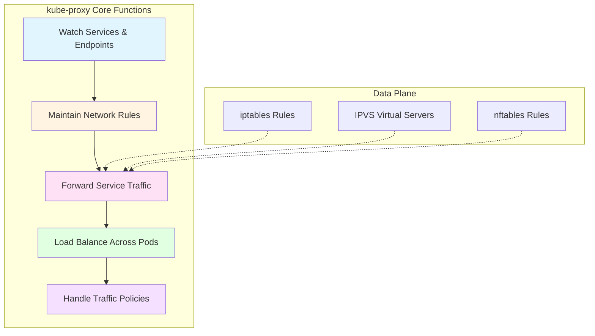

**Key Functions**:

1. **Service Discovery** - Watch Kubernetes API for Service and Endpoint/EndpointSlice changes
2. **Rule Management** - Translate Services into network rules (iptables, IPVS, nftables)
3. **Traffic Forwarding** - Route packets destined for Service IPs to backend Pods
4. **Load Balancing** - Distribute traffic across multiple Pod endpoints
5. **Traffic Policies** - Enforce ExternalTrafficPolicy and InternalTrafficPolicy
6. **Health Checking** - Expose health check endpoints for external load balancers

### Why kube-proxy Exists

Kubernetes Services provide a **stable endpoint** for a dynamic set of Pods. Pods are ephemeral - they can be created, destroyed, and rescheduled. Services abstract this volatility by providing:

- **Stable IP address** (ClusterIP) that never changes
- **DNS name** for service discovery
- **Load balancing** across healthy Pod endpoints
- **Service types** for different exposure patterns

**kube-proxy implements the data plane** for this abstraction, ensuring packets sent to Service IPs reach the correct Pod endpoints.

---

## Quick Start

### For New Contributors

**Goal**: Understand kube-proxy architecture and codebase structure

**Start here**:
1. Read [GLOSSARY.md](GLOSSARY.md) - Understand networking terminology
2. Read [01-REQUIREMENTS.md](01-REQUIREMENTS.md) - Learn design goals
3. Read [02-FUNCTIONAL-SPEC.md](02-FUNCTIONAL-SPEC.md) - Understand what kube-proxy does
4. Read [high-level/01-system-overview.md](high-level/01-system-overview.md) - See the big picture
5. Read [code-references/entry-points.md](code-references/entry-points.md) - Navigate the codebase

**Estimated time**: 4-6 hours


### For Platform Engineers

**Goal**: Deploy, configure, and operate kube-proxy in production

**Start here**:
1. Read [02-FUNCTIONAL-SPEC.md](02-FUNCTIONAL-SPEC.md) - Understand functionality
2. Read [high-level/02-proxy-modes.md](high-level/02-proxy-modes.md) - Choose the right mode
3. Read [high-level/03-service-abstraction.md](high-level/03-service-abstraction.md) - Understand Service types
4. Read [middle-level/04-service-types.md](middle-level/04-service-types.md) - Implementation details
5. Read [middle-level/07-external-traffic-policy.md](middle-level/07-external-traffic-policy.md) - Traffic policies
6. Read [middle-level/10-metrics-monitoring.md](middle-level/10-metrics-monitoring.md) - Monitor kube-proxy
7. Read [low-level/10-performance-optimization.md](low-level/10-performance-optimization.md) - Tune for production

**Estimated time**: 6-8 hours

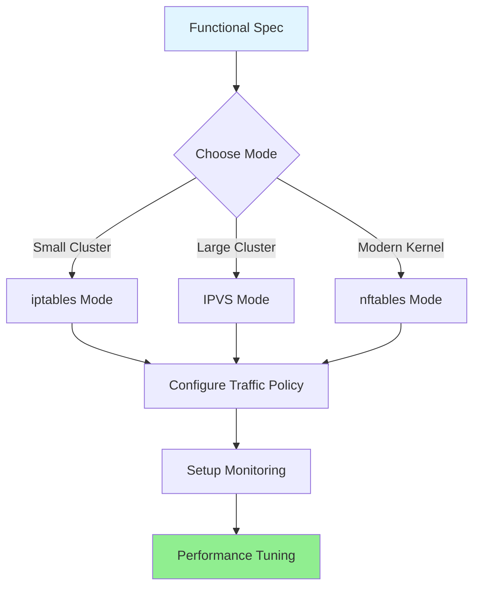

### For Troubleshooters

**Goal**: Diagnose and fix kube-proxy networking issues

**Start here**:
1. Read [GLOSSARY.md](GLOSSARY.md) - Networking terminology
2. Read [middle-level/02-iptables-mode.md](middle-level/02-iptables-mode.md) OR [middle-level/03-ipvs-mode.md](middle-level/03-ipvs-mode.md)
3. Read [middle-level/09-conntrack.md](middle-level/09-conntrack.md) - Connection tracking issues
4. Read [low-level/06-packet-flow.md](low-level/06-packet-flow.md) - Trace packet paths
5. Read [middle-level/10-metrics-monitoring.md](middle-level/10-metrics-monitoring.md) - Use metrics for debugging

**Common issues covered**:
- Service not accessible
- Intermittent connection failures
- Source IP not preserved
- Conntrack table full
- High latency
- Load balancing not working

**Estimated time**: 3-4 hours

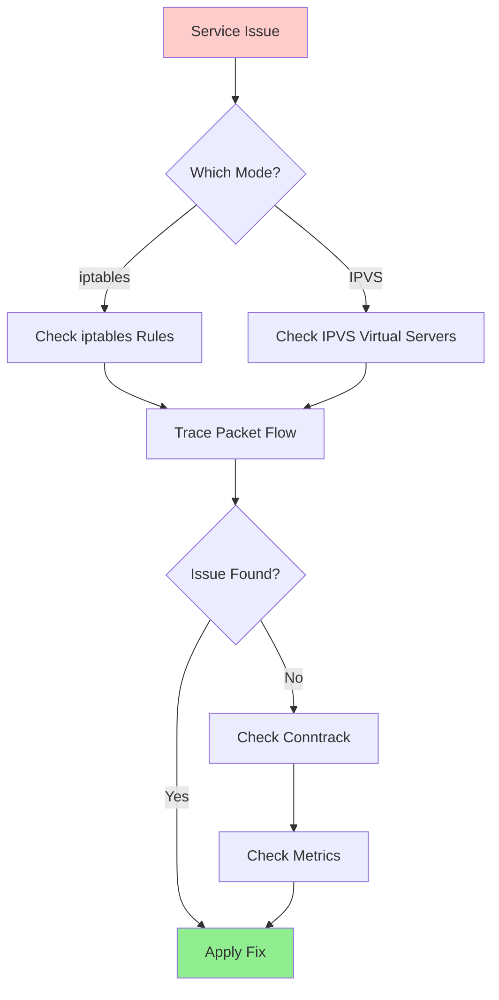

### For Performance Tuners

**Goal**: Optimize kube-proxy for large-scale clusters

**Start here**:
1. Read [high-level/02-proxy-modes.md](high-level/02-proxy-modes.md) - Mode comparison
2. Read [middle-level/02-iptables-mode.md](middle-level/02-iptables-mode.md) - iptables scalability
3. Read [middle-level/03-ipvs-mode.md](middle-level/03-ipvs-mode.md) - IPVS advantages
4. Read [low-level/04-sync-loop.md](low-level/04-sync-loop.md) - Sync optimization
5. Read [low-level/10-performance-optimization.md](low-level/10-performance-optimization.md) - Tuning guide
6. Read [middle-level/09-conntrack.md](middle-level/09-conntrack.md) - Conntrack tuning

**Key metrics**:
- Rule programming time (iptables mode: < 100ms for < 1000 services)
- Sync latency (IPVS mode: < 10ms for 5000+ services)
- Connection tracking table utilization
- CPU usage during sync loops
- Memory footprint

**Estimated time**: 5-7 hours

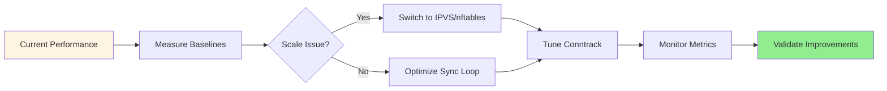

---

## Documentation Structure

### Phase 1: Core Documentation

**Foundation documents covering requirements, specifications, and terminology**

| Document | Purpose | Lines | Audience |
|----------|---------|-------|----------|
| [00-README.md](00-README.md) | Navigation and overview | 1000+ | All |
| [01-REQUIREMENTS.md](01-REQUIREMENTS.md) | Design goals and requirements | 800+ | Contributors, Architects |
| [02-FUNCTIONAL-SPEC.md](02-FUNCTIONAL-SPEC.md) | What kube-proxy does | 950+ | All |
| [GLOSSARY.md](GLOSSARY.md) | Networking terms and concepts | 900+ | All |

**When to read**: Start here for all learning paths

### Phase 2: High-Level Architecture

**System-level view of kube-proxy design and components**

| Document | Purpose | Lines | Audience |
|----------|---------|-------|----------|
| [high-level/01-system-overview.md](high-level/01-system-overview.md) | kube-proxy in Kubernetes | 800+ | All |
| [high-level/02-proxy-modes.md](high-level/02-proxy-modes.md) | Mode comparison and selection | 900+ | Platform Engineers |
| [high-level/03-service-abstraction.md](high-level/03-service-abstraction.md) | Service abstraction concept | 850+ | All |
| [high-level/04-initialization-flow.md](high-level/04-initialization-flow.md) | Startup sequence | 800+ | Contributors |

**When to read**: After Phase 1, for architectural understanding

### Phase 3: Middle-Level Architecture

**Feature-level deep dives into implementation details**

| Document | Purpose | Lines | Audience |
|----------|---------|-------|----------|
| [middle-level/01-service-watch.md](middle-level/01-service-watch.md) | Service/Endpoint watching | 900+ | Contributors |
| [middle-level/02-iptables-mode.md](middle-level/02-iptables-mode.md) | iptables implementation | 1200+ | All using iptables mode |
| [middle-level/03-ipvs-mode.md](middle-level/03-ipvs-mode.md) | IPVS implementation | 1200+ | All using IPVS mode |
| [middle-level/04-service-types.md](middle-level/04-service-types.md) | Service type implementations | 1100+ | Platform Engineers |
| [middle-level/05-endpoint-management.md](middle-level/05-endpoint-management.md) | Endpoint/EndpointSlice handling | 1000+ | Contributors |
| [middle-level/06-session-affinity.md](middle-level/06-session-affinity.md) | Session affinity | 850+ | Platform Engineers |
| [middle-level/07-external-traffic-policy.md](middle-level/07-external-traffic-policy.md) | Traffic policies | 950+ | Platform Engineers |
| [middle-level/08-healthcheck-nodeport.md](middle-level/08-healthcheck-nodeport.md) | Health check NodePort | 800+ | Platform Engineers |
| [middle-level/09-conntrack.md](middle-level/09-conntrack.md) | Connection tracking | 900+ | Troubleshooters |
| [middle-level/10-metrics-monitoring.md](middle-level/10-metrics-monitoring.md) | Monitoring and metrics | 850+ | SREs, Operators |

**When to read**: For specific features or troubleshooting

### Phase 4: Low-Level Technical Specs

**Implementation algorithms and code-level details**

| Document | Purpose | Lines | Audience |
|----------|---------|-------|----------|
| [low-level/01-iptables-rules-generation.md](low-level/01-iptables-rules-generation.md) | iptables rule algorithm | 1000+ | Contributors |
| [low-level/02-ipvs-configuration.md](low-level/02-ipvs-configuration.md) | IPVS configuration | 1000+ | Contributors |
| [low-level/03-proxier-interface.md](low-level/03-proxier-interface.md) | Provider interface | 900+ | Contributors |
| [low-level/04-sync-loop.md](low-level/04-sync-loop.md) | Sync loop implementation | 950+ | Contributors |
| [low-level/05-service-port-mapping.md](low-level/05-service-port-mapping.md) | Port mapping logic | 850+ | Contributors |
| [low-level/06-packet-flow.md](low-level/06-packet-flow.md) | Complete packet traces | 1100+ | Troubleshooters |
| [low-level/07-load-balancing.md](low-level/07-load-balancing.md) | Load balancing algorithms | 900+ | All |
| [low-level/08-nat-implementation.md](low-level/08-nat-implementation.md) | NAT/masquerading | 950+ | Contributors |
| [low-level/09-cleanup-termination.md](low-level/09-cleanup-termination.md) | Cleanup and shutdown | 800+ | Contributors |
| [low-level/10-performance-optimization.md](low-level/10-performance-optimization.md) | Performance tuning | 950+ | Performance Engineers |

**When to read**: For code contributions or deep troubleshooting

### Phase 5: Code References

**Codebase navigation for contributors**

| Document | Purpose | Lines | Audience |
|----------|---------|-------|----------|
| [code-references/entry-points.md](code-references/entry-points.md) | Main entry points and call chains | 1100+ | Contributors |
| [code-references/iptables-implementation.md](code-references/iptables-implementation.md) | iptables code structure | 900+ | Contributors |
| [code-references/ipvs-implementation.md](code-references/ipvs-implementation.md) | IPVS code structure | 900+ | Contributors |

**When to read**: Before making code changes

---

## Learning Paths

### Path 1: Understanding kube-proxy Fundamentals

**For**: New users, students, junior engineers

**Goal**: Understand what kube-proxy does and why it's needed

**Sequence**:
1. [GLOSSARY.md](GLOSSARY.md) - Learn terminology
2. [high-level/03-service-abstraction.md](high-level/03-service-abstraction.md) - Understand Services
3. [02-FUNCTIONAL-SPEC.md](02-FUNCTIONAL-SPEC.md) - Learn what kube-proxy does
4. [high-level/01-system-overview.md](high-level/01-system-overview.md) - See the bigger picture
5. [middle-level/04-service-types.md](middle-level/04-service-types.md) - Understand different Service types

**Duration**: 4-6 hours

**Outcome**: Solid understanding of kube-proxy role and Service networking

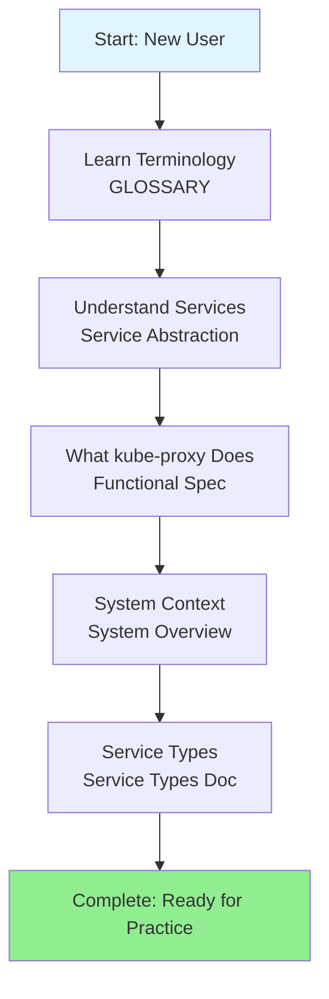

### Path 2: Implementing Service Networking

**For**: Platform engineers, cluster administrators

**Goal**: Deploy and configure kube-proxy for production use

**Sequence**:
1. [01-REQUIREMENTS.md](01-REQUIREMENTS.md) - Understand design constraints
2. [high-level/02-proxy-modes.md](high-level/02-proxy-modes.md) - Choose a mode
3. [middle-level/02-iptables-mode.md](middle-level/02-iptables-mode.md) OR [middle-level/03-ipvs-mode.md](middle-level/03-ipvs-mode.md)
4. [middle-level/04-service-types.md](middle-level/04-service-types.md) - Implement service types
5. [middle-level/07-external-traffic-policy.md](middle-level/07-external-traffic-policy.md) - Configure traffic policies
6. [middle-level/08-healthcheck-nodeport.md](middle-level/08-healthcheck-nodeport.md) - Set up health checks
7. [middle-level/10-metrics-monitoring.md](middle-level/10-metrics-monitoring.md) - Monitor kube-proxy
8. [low-level/10-performance-optimization.md](low-level/10-performance-optimization.md) - Optimize performance

**Duration**: 8-10 hours

**Outcome**: Production-ready kube-proxy deployment

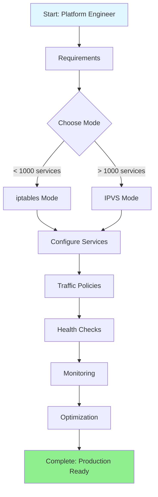

### Path 3: Troubleshooting Network Issues

**For**: SREs, support engineers, troubleshooters

**Goal**: Diagnose and resolve kube-proxy issues

**Sequence**:
1. [GLOSSARY.md](GLOSSARY.md) - Refresh on networking terms
2. [low-level/06-packet-flow.md](low-level/06-packet-flow.md) - Understand packet paths
3. [middle-level/02-iptables-mode.md](middle-level/02-iptables-mode.md) OR [middle-level/03-ipvs-mode.md](middle-level/03-ipvs-mode.md)
4. [middle-level/09-conntrack.md](middle-level/09-conntrack.md) - Conntrack debugging
5. [middle-level/10-metrics-monitoring.md](middle-level/10-metrics-monitoring.md) - Use metrics
6. [middle-level/07-external-traffic-policy.md](middle-level/07-external-traffic-policy.md) - Traffic policy issues

**Duration**: 4-5 hours

**Outcome**: Ability to diagnose and fix most kube-proxy issues

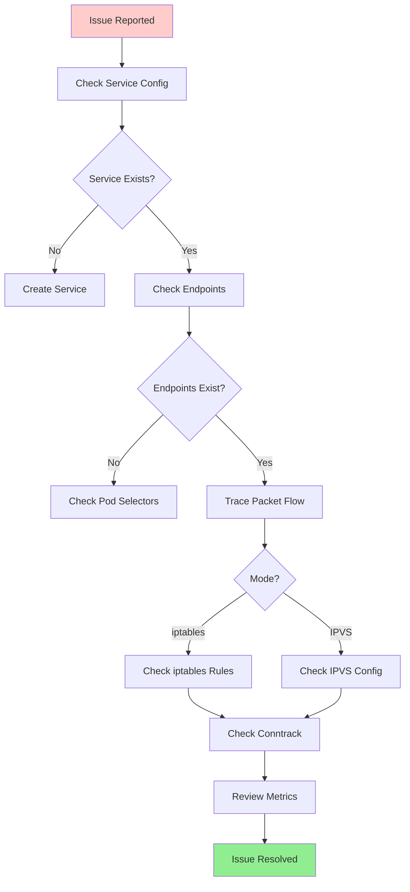

### Path 4: Performance Optimization

**For**: Performance engineers, large cluster operators

**Goal**: Optimize kube-proxy for scale and performance

**Sequence**:
1. [high-level/02-proxy-modes.md](high-level/02-proxy-modes.md) - Understand mode tradeoffs
2. [middle-level/02-iptables-mode.md](middle-level/02-iptables-mode.md) - iptables limitations
3. [middle-level/03-ipvs-mode.md](middle-level/03-ipvs-mode.md) - IPVS scalability
4. [low-level/04-sync-loop.md](low-level/04-sync-loop.md) - Sync performance
5. [low-level/07-load-balancing.md](low-level/07-load-balancing.md) - Algorithm efficiency
6. [middle-level/09-conntrack.md](middle-level/09-conntrack.md) - Conntrack tuning
7. [low-level/10-performance-optimization.md](low-level/10-performance-optimization.md) - Complete tuning guide

**Duration**: 6-8 hours

**Outcome**: Highly optimized kube-proxy for large-scale deployments

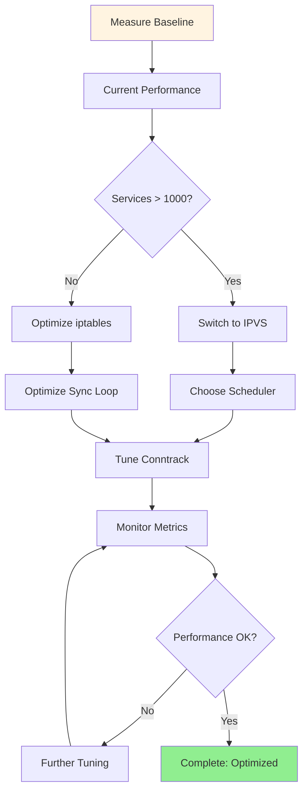

### Path 5: Contributing to kube-proxy

**For**: Open-source contributors, developers

**Goal**: Understand codebase to contribute features and fixes

**Sequence**:
1. [01-REQUIREMENTS.md](01-REQUIREMENTS.md) - Design goals
2. [02-FUNCTIONAL-SPEC.md](02-FUNCTIONAL-SPEC.md) - Functional spec
3. [high-level/04-initialization-flow.md](high-level/04-initialization-flow.md) - Startup flow
4. [code-references/entry-points.md](code-references/entry-points.md) - Code navigation
5. [low-level/03-proxier-interface.md](low-level/03-proxier-interface.md) - Provider interface
6. [low-level/04-sync-loop.md](low-level/04-sync-loop.md) - Sync implementation
7. [code-references/iptables-implementation.md](code-references/iptables-implementation.md) OR [code-references/ipvs-implementation.md](code-references/ipvs-implementation.md)
8. [middle-level/01-service-watch.md](middle-level/01-service-watch.md) - Watch mechanism
9. [low-level/01-iptables-rules-generation.md](low-level/01-iptables-rules-generation.md) OR [low-level/02-ipvs-configuration.md](low-level/02-ipvs-configuration.md)

**Duration**: 10-12 hours

**Outcome**: Ready to contribute code to kube-proxy

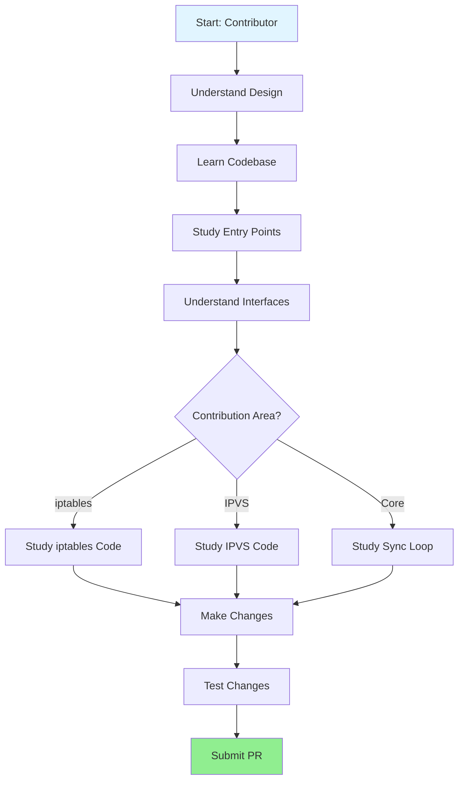

---

## Key Concepts at a Glance

### Service Abstraction

**Problem**: Pods are ephemeral with changing IP addresses
**Solution**: Services provide stable IPs and load balancing
**Implementation**: kube-proxy translates Services to network rules

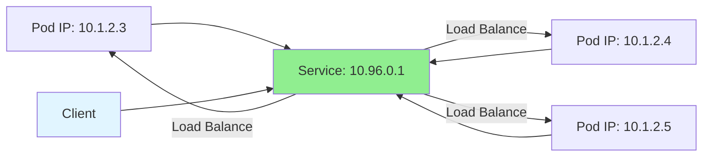

### Proxy Modes

kube-proxy supports four proxy modes (Linux):

1. **iptables** - Uses netfilter/iptables rules (default)
2. **IPVS** - Uses IPVS virtual servers (high performance)
3. **nftables** - Uses nftables rules (modern kernels)
4. **userspace** - Legacy userspace proxy (deprecated)

See [high-level/02-proxy-modes.md](high-level/02-proxy-modes.md) for details.

### Traffic Flow

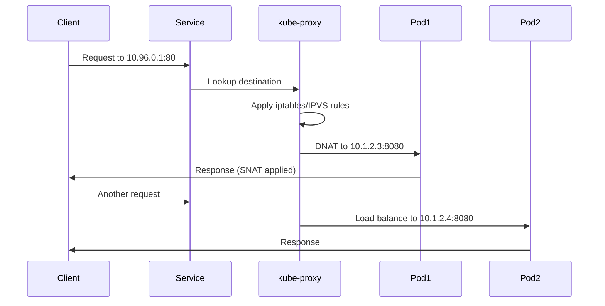

### Watch and Sync

kube-proxy watches Kubernetes API for changes:

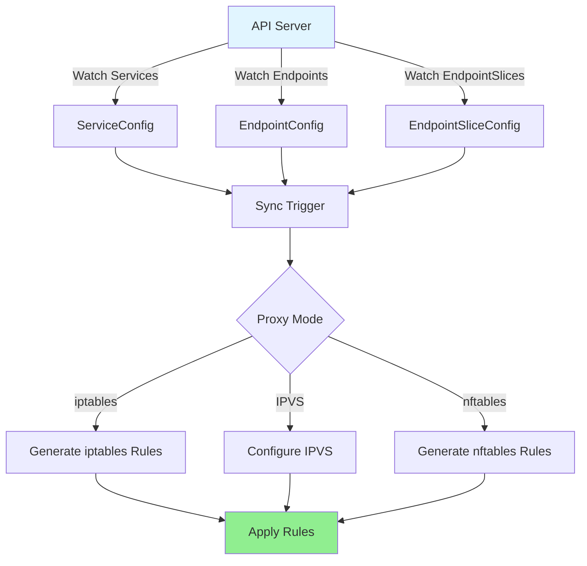

---

## Proxy Modes Comparison

| Feature | iptables | IPVS | nftables | userspace |
|---------|----------|------|----------|-----------|
| **Kernel Version** | 2.4+ | 2.6+ | 3.13+ | Any |
| **Performance (small)** | Excellent | Excellent | Excellent | Poor |
| **Performance (large)** | Poor | Excellent | Good | Very Poor |
| **Max Services** | ~1000 | 10,000+ | ~5000 | < 100 |
| **Load Balancing** | Random (prob) | Advanced (8+ algos) | Random | Round-robin |
| **Rule Complexity** | O(n) | O(1) | O(log n) | N/A |
| **Session Affinity** | iptables recent | IPVS persistence | nft hashlimit | In-memory |
| **CPU Usage** | High at scale | Low | Medium | Very High |
| **Memory Usage** | Medium | Medium | Low | High |
| **Maturity** | Stable | Stable | Beta | Deprecated |
| **Use Case** | Default, < 1000 svc | Large clusters | Modern kernels | None |

**Recommendation**:
- **Small clusters (< 1000 services)**: iptables (default)
- **Large clusters (> 1000 services)**: IPVS
- **Modern kernels (5.13+)**: nftables (future)
- **Legacy**: userspace (do not use)

See [high-level/02-proxy-modes.md](high-level/02-proxy-modes.md) for detailed comparison.

---

## Service Types Overview

| Service Type | ClusterIP | NodePort | External Access | Load Balancer | Use Case |
|--------------|-----------|----------|-----------------|---------------|----------|
| **ClusterIP** | Yes | No | No | No | Internal services |
| **NodePort** | Yes | Yes (30000-32767) | Yes (NodeIP:Port) | Optional | Development, test |
| **LoadBalancer** | Yes | Yes | Yes (LB IP) | Yes | Production external access |
| **ExternalName** | No | No | DNS CNAME | No | External service alias |
| **Headless** | No (None) | No | No | No | StatefulSet, custom LB |

### ClusterIP

Internal-only service with stable cluster IP.

```yaml
apiVersion: v1
kind: Service
metadata:
  name: my-service
spec:
  type: ClusterIP  # Default
  selector:
    app: my-app
  ports:
  - port: 80
    targetPort: 8080
```

**Traffic flow**:
```
Pod → ClusterIP (10.96.0.1:80) → kube-proxy → Pod (10.1.2.3:8080)
```

### NodePort

Service accessible on static port on every node.

```yaml
apiVersion: v1
kind: Service
metadata:
  name: my-service
spec:
  type: NodePort
  selector:
    app: my-app
  ports:
  - port: 80
    targetPort: 8080
    nodePort: 30080  # Optional, auto-assigned if omitted
```

**Traffic flow**:
```
External → NodeIP:30080 → kube-proxy → Pod (10.1.2.3:8080)
```

### LoadBalancer

Cloud load balancer provisioned automatically.

```yaml
apiVersion: v1
kind: Service
metadata:
  name: my-service
spec:
  type: LoadBalancer
  selector:
    app: my-app
  ports:
  - port: 80
    targetPort: 8080
```

**Traffic flow**:
```
External → LB IP → NodeIP:NodePort → kube-proxy → Pod
```

### ExternalName

DNS CNAME to external service (no proxy).

```yaml
apiVersion: v1
kind: Service
metadata:
  name: my-database
spec:
  type: ExternalName
  externalName: db.example.com
```

**No kube-proxy involvement** - DNS only.

See [middle-level/04-service-types.md](middle-level/04-service-types.md) for implementation details.

---

## Common Use Cases

### Use Case 1: Internal Microservices

**Scenario**: Frontend needs to call backend service

**Solution**: ClusterIP service

```yaml
apiVersion: v1
kind: Service
metadata:
  name: backend
spec:
  selector:
    app: backend
  ports:
  - port: 8080
```

**Access**: `http://backend:8080` from any pod in cluster

### Use Case 2: External Web Application

**Scenario**: Public-facing web application

**Solution**: LoadBalancer service

```yaml
apiVersion: v1
kind: Service
metadata:
  name: webapp
spec:
  type: LoadBalancer
  selector:
    app: webapp
  ports:
  - port: 80
    targetPort: 8080
```

**Access**: External IP from cloud load balancer

### Use Case 3: Preserving Client IP

**Scenario**: Application needs real client IP (not node IP)

**Solution**: ExternalTrafficPolicy: Local

```yaml
apiVersion: v1
kind: Service
metadata:
  name: webapp
spec:
  type: LoadBalancer
  externalTrafficPolicy: Local  # Preserve source IP
  selector:
    app: webapp
  ports:
  - port: 80
```

**Tradeoff**: Uneven load distribution, no cross-node load balancing

See [middle-level/07-external-traffic-policy.md](middle-level/07-external-traffic-policy.md)

### Use Case 4: Session Affinity

**Scenario**: Stateful application needs sticky sessions

**Solution**: Session affinity

```yaml
apiVersion: v1
kind: Service
metadata:
  name: stateful-app
spec:
  selector:
    app: stateful-app
  sessionAffinity: ClientIP
  sessionAffinityConfig:
    clientIP:
      timeoutSeconds: 10800  # 3 hours
  ports:
  - port: 80
```

See [middle-level/06-session-affinity.md](middle-level/06-session-affinity.md)

### Use Case 5: Large-Scale Cluster

**Scenario**: Cluster with 5000+ services

**Solution**: IPVS mode

```yaml
# kube-proxy ConfigMap
apiVersion: v1
kind: ConfigMap
metadata:
  name: kube-proxy
  namespace: kube-system
data:
  config.conf: |
    mode: ipvs
    ipvs:
      scheduler: rr  # round-robin
```

**Benefit**: O(1) lookup instead of O(n) iptables traversal

See [middle-level/03-ipvs-mode.md](middle-level/03-ipvs-mode.md)

---

## Architecture Diagrams

### kube-proxy in Kubernetes Architecture

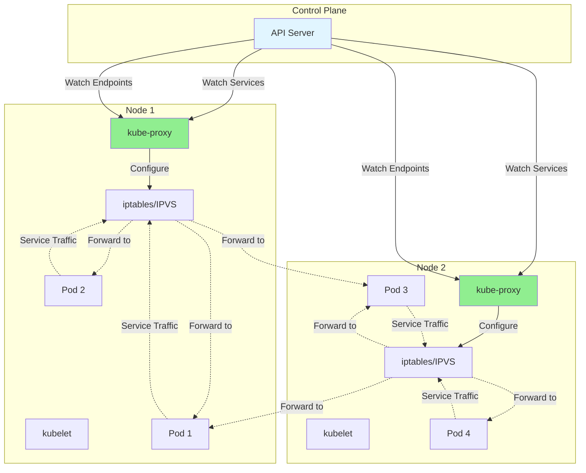

### kube-proxy Data Flow

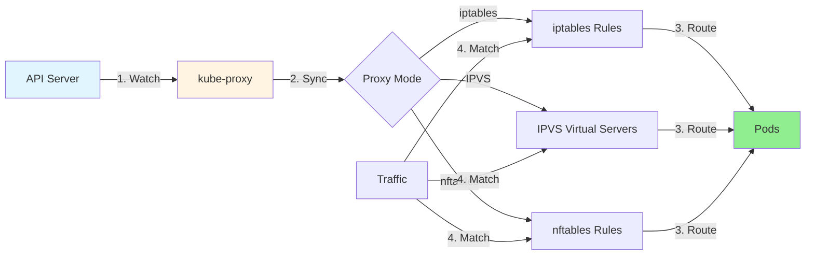

### Service to Endpoints Mapping

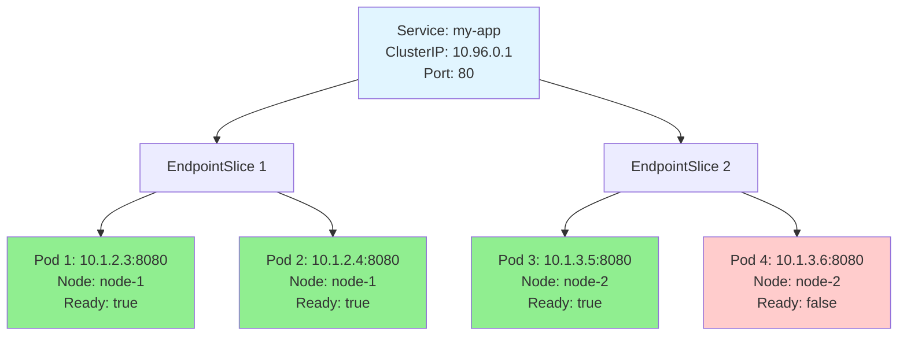

---

## Cross-References

### Related Kubernetes Components

- **kube-apiserver**: Provides API that kube-proxy watches
  - [kube-apiserver docs](../kube-apiserver/README.md)
- **kubelet**: Manages Pod lifecycle and networking
  - Pod networking setup
  - CNI plugin execution
- **CoreDNS**: Service discovery via DNS
  - Resolves service names to ClusterIPs
- **CNI Plugins**: Pod network setup
  - Provides pod-to-pod connectivity
- **Cloud Controller Manager**: LoadBalancer provisioning
  - Creates cloud load balancers

### Related Kubernetes Concepts

- **Services**: Abstraction over Pods
  - [Kubernetes Services](https://kubernetes.io/docs/concepts/services-networking/service/)
- **Endpoints**: Service backend Pods (legacy)
- **EndpointSlices**: Scalable Endpoints (GA in 1.21)
  - [EndpointSlices](https://kubernetes.io/docs/concepts/services-networking/endpoint-slices/)
- **Ingress**: L7 load balancing (external to kube-proxy)
- **NetworkPolicy**: Pod-level firewalling (external to kube-proxy)

### Networking Fundamentals

- **iptables**: Linux firewall and NAT
  - [netfilter.org](https://www.netfilter.org/)
- **IPVS**: Linux virtual server
  - [Linux Virtual Server Project](http://www.linuxvirtualserver.org/)
- **nftables**: Modern packet filtering framework
  - [nftables wiki](https://wiki.nftables.org/)
- **conntrack**: Connection tracking
  - Stateful packet inspection
- **NAT**: Network Address Translation
  - DNAT (destination), SNAT (source), masquerading

---

## External Resources

### Official Documentation

- [Kubernetes Services](https://kubernetes.io/docs/concepts/services-networking/service/)
- [kube-proxy Configuration](https://kubernetes.io/docs/reference/command-line-tools-reference/kube-proxy/)
- [EndpointSlices](https://kubernetes.io/docs/concepts/services-networking/endpoint-slices/)
- [Virtual IPs and Service Proxies](https://kubernetes.io/docs/reference/networking/virtual-ips/)

### Source Code

- [pkg/proxy/](https://github.com/kubernetes/kubernetes/tree/master/pkg/proxy)
  - Core kube-proxy implementation
- [cmd/kube-proxy/](https://github.com/kubernetes/kubernetes/tree/master/cmd/kube-proxy)
  - Entry point and CLI
- [pkg/util/iptables/](https://github.com/kubernetes/kubernetes/tree/master/pkg/util/iptables)
  - iptables interface
- [pkg/util/ipvs/](https://github.com/kubernetes/kubernetes/tree/master/pkg/util/ipvs)
  - IPVS interface

### Community Resources

- [SIG Network](https://github.com/kubernetes/community/tree/master/sig-network)
  - Community meetings and discussions
- [KEP-0752: EndpointSlices](https://github.com/kubernetes/enhancements/tree/master/keps/sig-network/0752-endpointslices)
  - EndpointSlice enhancement proposal
- [KEP-1860: IPVS Features](https://github.com/kubernetes/enhancements/tree/master/keps/sig-network/1860-kube-proxy-IP-node-binding)
  - IPVS improvements

### Troubleshooting Guides

- [Debugging Services](https://kubernetes.io/docs/tasks/debug/debug-application/debug-service/)
- [Network Debugging](https://kubernetes.io/docs/tasks/administer-cluster/dns-debugging-resolution/)

---

## Contributing to Documentation

This documentation is maintained by the Kubernetes community. Contributions are welcome!

### Documentation Standards

Each document must include:

1. **Comprehensive Content** (800-1000+ lines)
2. **Multiple Diagrams** (10-20 Mermaid diagrams)
3. **Code References** with exact file:line numbers
4. **Real Examples** (YAML, iptables output, packet traces)
5. **Cross-References** to related documents
6. **Performance Section**
7. **Best Practices Section**
8. **Troubleshooting Section**
9. **Summary with Key Takeaways**

### How to Contribute

1. **Find an area** needing documentation
2. **Research** the code and implementation
3. **Write** following the standards above
4. **Add diagrams** showing flows and architecture
5. **Include examples** from real systems
6. **Cross-reference** related docs
7. **Submit PR** to kubernetes/kubernetes

### Style Guide

- **Clear headings** with logical hierarchy
- **Code blocks** with syntax highlighting
- **Tables** for comparisons
- **Diagrams** for visual clarity
- **Examples** showing actual usage
- **Links** to related documentation

---

## Glossary Quick Reference

See [GLOSSARY.md](GLOSSARY.md) for complete definitions.

### Network Terms

- **iptables**: Linux firewall using netfilter framework
- **IPVS**: IP Virtual Server, kernel-based L4 load balancer
- **nftables**: Modern replacement for iptables
- **netfilter**: Linux kernel packet filtering framework
- **conntrack**: Connection tracking subsystem
- **NAT**: Network Address Translation
- **DNAT**: Destination NAT (change destination IP/port)
- **SNAT**: Source NAT (change source IP/port)
- **Masquerade**: Dynamic SNAT using outbound interface IP

### Service Terms

- **ClusterIP**: Internal-only service with virtual IP
- **NodePort**: Service exposed on static port on all nodes
- **LoadBalancer**: Service with external cloud load balancer
- **ExternalName**: DNS CNAME to external service
- **Endpoints**: Set of Pod IPs backing a Service (legacy)
- **EndpointSlice**: Scalable alternative to Endpoints (current)
- **ExternalIP**: User-specified external IP for service

### iptables Terms

- **Chain**: Ordered list of iptables rules
- **Rule**: Match criteria and action (jump, accept, drop)
- **Target**: Action to take when rule matches
- **KUBE-SERVICES**: Main chain for service traffic
- **KUBE-SVC-\***: Per-service chain
- **KUBE-SEP-\***: Per-endpoint chain
- **KUBE-NODEPORTS**: Chain for NodePort services
- **KUBE-MARK-MASQ**: Chain to mark packets for masquerading

### IPVS Terms

- **Virtual Server**: Service IP and port in IPVS
- **Real Server**: Backend Pod IP and port
- **Scheduler**: Load balancing algorithm (rr, lc, wrr, sh, etc.)
- **rr**: Round-robin scheduling
- **lc**: Least connection scheduling
- **wrr**: Weighted round-robin
- **sh**: Source hashing (session affinity)
- **Persistence**: IPVS session affinity mechanism

### Traffic Policy Terms

- **ExternalTrafficPolicy**: Controls external traffic routing (Cluster/Local)
- **InternalTrafficPolicy**: Controls internal traffic routing (Cluster/Local)
- **Session Affinity**: Sticky sessions based on client IP
- **ClientIP**: Session affinity mode using client IP

### Monitoring Terms

- **Metrics**: Prometheus metrics exposed by kube-proxy
- **healthz**: Health check endpoint
- **Health Check NodePort**: Per-node health endpoint for external LBs

---

## Summary

This README provides a **navigation guide** to the comprehensive kube-proxy architecture documentation. The documentation is organized into five phases:

1. **Core Documentation** - Fundamentals and requirements
2. **High-Level Architecture** - System overview and design
3. **Middle-Level Architecture** - Feature implementations
4. **Low-Level Technical Specs** - Algorithms and code details
5. **Code References** - Codebase navigation

Choose a [learning path](#learning-paths) based on your role and goals:

- **New Users** → Fundamentals path
- **Platform Engineers** → Implementation path
- **Troubleshooters** → Troubleshooting path
- **Performance Engineers** → Optimization path
- **Contributors** → Contributing path

Each document follows high standards with 800-1000+ lines, 10-20 diagrams, code references, real examples, and cross-references.

**Start with**: [GLOSSARY.md](GLOSSARY.md) → [01-REQUIREMENTS.md](01-REQUIREMENTS.md) → [02-FUNCTIONAL-SPEC.md](02-FUNCTIONAL-SPEC.md)

**For questions**: [SIG Network](https://github.com/kubernetes/community/tree/master/sig-network)

---

**Total Documentation**:
- ~30 markdown files
- ~28,000+ lines of content
- 200+ Mermaid diagrams
- 500+ code references
- 100+ comparison tables
- 100+ glossary terms

**Ready to start learning? Pick a path above and dive in!**
