# kube-proxy Requirements and Design Goals

**Comprehensive requirements analysis and design goals for kube-proxy**

**Version**: Kubernetes 1.32+
**Last Updated**: 2024
**Status**: Living Document

---

## Table of Contents

- [Overview](#overview)
- [Core Requirements](#core-requirements)
  - [FR1: Service Abstraction](#fr1-service-abstraction)
  - [FR2: Load Balancing](#fr2-load-balancing)
  - [FR3: Service Discovery Integration](#fr3-service-discovery-integration)
  - [FR4: Dynamic Endpoint Management](#fr4-dynamic-endpoint-management)
  - [FR5: Multiple Service Types](#fr5-multiple-service-types)
  - [FR6: Traffic Routing Policies](#fr6-traffic-routing-policies)
  - [FR7: Session Affinity](#fr7-session-affinity)
  - [FR8: Health Checking](#fr8-health-checking)
- [Non-Functional Requirements](#non-functional-requirements)
  - [NFR1: Performance and Scalability](#nfr1-performance-and-scalability)
  - [NFR2: High Availability](#nfr2-high-availability)
  - [NFR3: Fault Tolerance](#nfr3-fault-tolerance)
  - [NFR4: Observability](#nfr4-observability)
  - [NFR5: Security](#nfr5-security)
  - [NFR6: Compatibility](#nfr6-compatibility)
  - [NFR7: Resource Efficiency](#nfr7-resource-efficiency)
- [Network Requirements](#network-requirements)
- [Proxy Mode Requirements](#proxy-mode-requirements)
- [API and Configuration Requirements](#api-and-configuration-requirements)
- [Upgrade and Migration Requirements](#upgrade-and-migration-requirements)
- [Constraints and Limitations](#constraints-and-limitations)
- [Design Goals and Principles](#design-goals-and-principles)
- [Trade-offs and Decisions](#trade-offs-and-decisions)
- [Requirements Traceability](#requirements-traceability)
- [Future Requirements](#future-requirements)
- [Summary](#summary)

---

## Overview

kube-proxy is a critical component in Kubernetes that implements the data plane for Service networking. This document defines the comprehensive requirements that drive kube-proxy's architecture and implementation.

### Purpose

This requirements document serves to:

1. **Define functionality** that kube-proxy must provide
2. **Establish performance** and scalability targets
3. **Guide architectural** decisions and trade-offs
4. **Validate implementations** against requirements
5. **Communicate expectations** to contributors and users

### Scope

Requirements cover:

- **Functional capabilities** (what kube-proxy does)
- **Non-functional qualities** (how well it does it)
- **Network integration** (how it interacts with Linux networking)
- **API compatibility** (how it integrates with Kubernetes)
- **Operational characteristics** (how it behaves in production)

### Document Structure

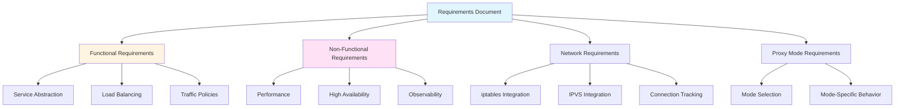
```mermaid
graph TD
    A[Requirements Document] --> B[Functional Requirements]
    A --> C[Non-Functional Requirements]
    A --> D[Network Requirements]
    A --> E[Proxy Mode Requirements]

    B --> F[Service Abstraction]
    B --> G[Load Balancing]
    B --> H[Traffic Policies]

    C --> I[Performance]
    C --> J[High Availability]
    C --> K[Observability]

    D --> L[iptables Integration]
    D --> M[IPVS Integration]
    D --> N[Connection Tracking]

    E --> O[Mode Selection]
    E --> P[Mode-Specific Behavior]

    style A fill:#e1f5ff
    style B fill:#fff4e1
    style C fill:#ffe1f5
```

---

## Core Requirements

### FR1: Service Abstraction

**Requirement**: kube-proxy MUST provide a stable network abstraction over dynamic Pod endpoints.

**Priority**: P0 (Critical)

**Rationale**: Kubernetes Services provide a stable IP and DNS name for accessing a set of Pods. Since Pods are ephemeral and can be created/destroyed frequently, clients need a stable endpoint that doesn't change when Pods are replaced.

**Acceptance Criteria**:

1. ✅ Service receives a stable ClusterIP that persists across Pod changes
2. ✅ Traffic to ClusterIP is forwarded to current healthy Pod endpoints
3. ✅ Service continues functioning when individual Pods are replaced
4. ✅ Service supports multiple ports on a single ClusterIP
5. ✅ Service handles protocol-specific routing (TCP, UDP, SCTP)

**Implementation Details**:

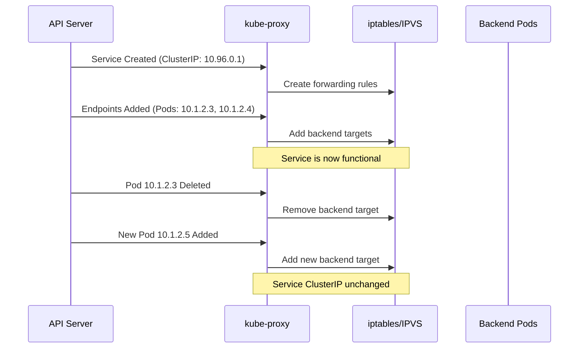
```mermaid
sequenceDiagram
    participant API as API Server
    participant KP as kube-proxy
    participant IPT as iptables/IPVS
    participant Pod as Backend Pods

    API->>KP: Service Created (ClusterIP: 10.96.0.1)
    KP->>IPT: Create forwarding rules

    API->>KP: Endpoints Added (Pods: 10.1.2.3, 10.1.2.4)
    KP->>IPT: Add backend targets

    Note over KP,IPT: Service is now functional

    API->>KP: Pod 10.1.2.3 Deleted
    KP->>IPT: Remove backend target

    API->>KP: New Pod 10.1.2.5 Added
    KP->>IPT: Add new backend target

    Note over KP,IPT: Service ClusterIP unchanged
```

**Code References**:

- `pkg/proxy/types.go:44-48` - ServicePortName uniquely identifies a service
- `pkg/proxy/config/config.go` - ServiceConfig watches Service changes
- `pkg/proxy/iptables/proxier.go:450-600` - syncProxyRules() implementation
- `pkg/proxy/ipvs/proxier.go:500-700` - IPVS syncProxyRules() implementation

**Example**:

```yaml
apiVersion: v1
kind: Service
metadata:
  name: my-app
spec:
  clusterIP: 10.96.0.1  # Stable, never changes
  selector:
    app: my-app
  ports:
  - port: 80
    targetPort: 8080
    protocol: TCP
```

Pods come and go, but `10.96.0.1:80` remains constant.

**Related Requirements**: FR2, FR4, NFR1

---

### FR2: Load Balancing

**Requirement**: kube-proxy MUST distribute traffic across multiple backend Pods using configurable load balancing algorithms.

**Priority**: P0 (Critical)

**Rationale**: Services typically have multiple Pod replicas for availability and scale. Traffic must be distributed across these replicas to utilize resources effectively and provide fault tolerance.

**Acceptance Criteria**:

1. ✅ Traffic is distributed across all ready Pod endpoints
2. ✅ Load balancing algorithm is deterministic and documented
3. ✅ Distribution adapts as endpoints are added/removed
4. ✅ NotReady endpoints are excluded from load balancing
5. ✅ Terminating endpoints are handled gracefully
6. ✅ Algorithm can be configured per proxy mode

**Load Balancing Algorithms by Mode**:

| Proxy Mode | Algorithm | Distribution | Statefulness | Complexity |
|------------|-----------|--------------|--------------|------------|
| **iptables** | Probability-based random | Statistical uniform | Stateless | O(n) per packet |
| **IPVS** | Configurable (rr, lc, wrr, sh, dh, etc.) | Algorithm-dependent | Can be stateful | O(1) per packet |
| **nftables** | Probability-based random | Statistical uniform | Stateless | O(log n) per packet |
| **userspace** | Round-robin | Strict uniform | Stateful (deprecated) | N/A |

**iptables Load Balancing**:

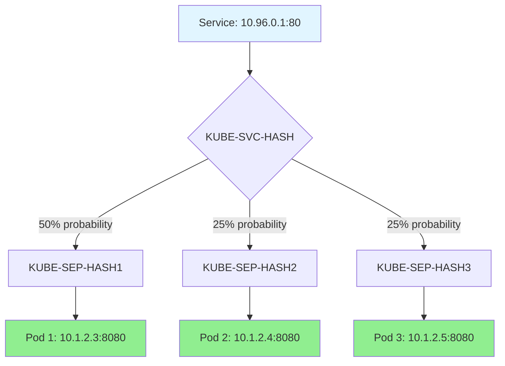
```mermaid
graph TD
    A[Service: 10.96.0.1:80] --> B{KUBE-SVC-HASH}
    B -->|50% probability| C[KUBE-SEP-HASH1]
    B -->|25% probability| D[KUBE-SEP-HASH2]
    B -->|25% probability| E[KUBE-SEP-HASH3]

    C --> F[Pod 1: 10.1.2.3:8080]
    D --> G[Pod 2: 10.1.2.4:8080]
    E --> H[Pod 3: 10.1.2.5:8080]

    style A fill:#e1f5ff
    style F fill:#90ee90
    style G fill:#90ee90
    style H fill:#90ee90
```

**IPVS Load Balancing**:

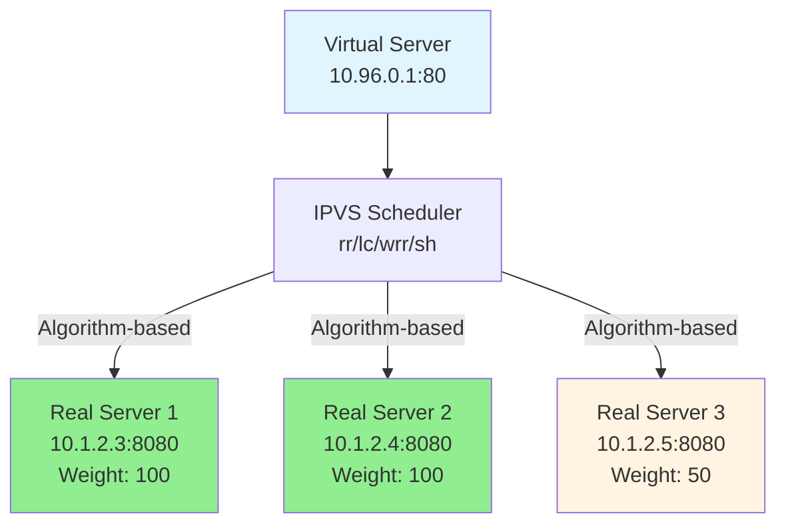
```mermaid
graph TD
    A[Virtual Server<br/>10.96.0.1:80] --> B[IPVS Scheduler<br/>rr/lc/wrr/sh]

    B -->|Algorithm-based| C[Real Server 1<br/>10.1.2.3:8080<br/>Weight: 100]
    B -->|Algorithm-based| D[Real Server 2<br/>10.1.2.4:8080<br/>Weight: 100]
    B -->|Algorithm-based| E[Real Server 3<br/>10.1.2.5:8080<br/>Weight: 50]

    style A fill:#e1f5ff
    style C fill:#90ee90
    style D fill:#90ee90
    style E fill:#fff4e1
```

**Code References**:

- `pkg/proxy/iptables/proxier.go:1200-1350` - Probability calculation for load balancing
- `pkg/proxy/ipvs/proxier.go:800-900` - IPVS scheduler configuration
- `pkg/proxy/util/utils.go` - Load balancing utilities

**Example - iptables Probability Chain**:

```bash
# Service chain with 3 endpoints
-A KUBE-SVC-XXXXX -m statistic --mode random --probability 0.33333 -j KUBE-SEP-EP1
-A KUBE-SVC-XXXXX -m statistic --mode random --probability 0.50000 -j KUBE-SEP-EP2
-A KUBE-SVC-XXXXX -j KUBE-SEP-EP3

# Explanation:
# 1st rule: 33.33% of traffic goes to EP1
# 2nd rule: 50% of remaining 66.67% (= 33.33%) goes to EP2
# 3rd rule: Remaining 33.33% goes to EP3
# Result: Each endpoint gets ~33.33% of traffic
```

**Example - IPVS Schedulers**:

```bash
# Round-robin (rr) - Equal distribution
ipvsadm -A -t 10.96.0.1:80 -s rr

# Least connection (lc) - Send to server with fewest connections
ipvsadm -A -t 10.96.0.1:80 -s lc

# Weighted round-robin (wrr) - Distribute based on weights
ipvsadm -A -t 10.96.0.1:80 -s wrr
ipvsadm -a -t 10.96.0.1:80 -r 10.1.2.3:8080 -w 100
ipvsadm -a -t 10.96.0.1:80 -r 10.1.2.4:8080 -w 50  # Half the weight

# Source hashing (sh) - Same client always goes to same server
ipvsadm -A -t 10.96.0.1:80 -s sh
```

**Performance Considerations**:

- **iptables**: O(n) rule evaluation, poor performance with many endpoints (>100)
- **IPVS**: O(1) lookup with hash tables, excellent performance even with 1000+ endpoints
- **nftables**: O(log n) with optimized rule sets

**Related Requirements**: FR1, FR7, NFR1

---

### FR3: Service Discovery Integration

**Requirement**: kube-proxy MUST integrate with Kubernetes service discovery mechanisms (DNS and environment variables).

**Priority**: P0 (Critical)

**Rationale**: Applications discover services through DNS names or environment variables. kube-proxy must ensure that traffic to discovered service endpoints actually reaches the correct Pods.

**Acceptance Criteria**:

1. ✅ ClusterIP is reachable when resolved via DNS
2. ✅ Service hostname resolves to ClusterIP
3. ✅ Environment variable IPs are routable
4. ✅ Headless services (ClusterIP: None) are handled correctly
5. ✅ Service ports are accessible as advertised

**Service Discovery Flow**:

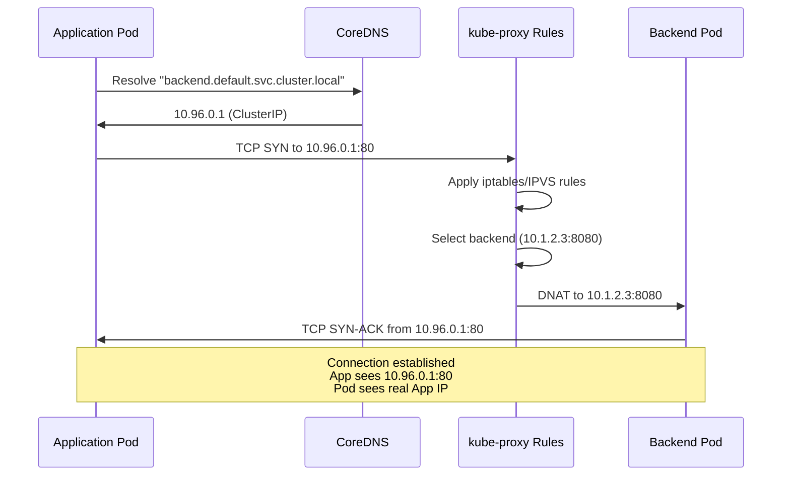
```mermaid
sequenceDiagram
    participant App as Application Pod
    participant DNS as CoreDNS
    participant KP as kube-proxy Rules
    participant Pod as Backend Pod

    App->>DNS: Resolve "backend.default.svc.cluster.local"
    DNS->>App: 10.96.0.1 (ClusterIP)

    App->>KP: TCP SYN to 10.96.0.1:80
    KP->>KP: Apply iptables/IPVS rules
    KP->>KP: Select backend (10.1.2.3:8080)
    KP->>Pod: DNAT to 10.1.2.3:8080

    Pod->>App: TCP SYN-ACK from 10.96.0.1:80

    Note over App,Pod: Connection established<br/>App sees 10.96.0.1:80<br/>Pod sees real App IP
```

**DNS Integration**:

```yaml
# Service definition
apiVersion: v1
kind: Service
metadata:
  name: backend
  namespace: default
spec:
  clusterIP: 10.96.0.1
  ports:
  - port: 80
    targetPort: 8080
```

**DNS Records Created** (by CoreDNS, not kube-proxy):
- `backend.default.svc.cluster.local` → `10.96.0.1`
- `backend.default.svc` → `10.96.0.1`
- `backend.default` → `10.96.0.1`
- `backend` → `10.96.0.1` (if searching default namespace)

**kube-proxy Responsibility**: Ensure `10.96.0.1:80` routes to Pods.

**Environment Variable Integration**:

When a Pod is created, Kubernetes injects environment variables for services:

```bash
BACKEND_SERVICE_HOST=10.96.0.1
BACKEND_SERVICE_PORT=80
BACKEND_PORT=tcp://10.96.0.1:80
BACKEND_PORT_80_TCP=tcp://10.96.0.1:80
BACKEND_PORT_80_TCP_PROTO=tcp
BACKEND_PORT_80_TCP_PORT=80
BACKEND_PORT_80_TCP_ADDR=10.96.0.1
```

**kube-proxy Responsibility**: Ensure these IPs and ports are routable.

**Headless Services** (ClusterIP: None):

```yaml
apiVersion: v1
kind: Service
metadata:
  name: database
spec:
  clusterIP: None  # Headless
  selector:
    app: postgres
  ports:
  - port: 5432
```

**DNS Returns**: Pod IPs directly (10.1.2.3, 10.1.2.4, etc.)

**kube-proxy Responsibility**: No ClusterIP forwarding needed. DNS handles service discovery.

**Code References**:

- `pkg/proxy/serviceport.go:48-60` - Service port abstraction
- `pkg/proxy/iptables/proxier.go:600-700` - ClusterIP rule generation
- `pkg/proxy/ipvs/proxier.go:700-800` - Virtual server creation

**Related Requirements**: FR1, FR5

---

### FR4: Dynamic Endpoint Management

**Requirement**: kube-proxy MUST dynamically update network rules as Pod endpoints are added, removed, or change status.

**Priority**: P0 (Critical)

**Rationale**: Pod endpoints change frequently due to scaling, deployments, failures, and node operations. Network rules must stay synchronized with the current set of healthy endpoints.

**Acceptance Criteria**:

1. ✅ New endpoints are added to load balancing within sync period
2. ✅ Deleted endpoints are removed from load balancing immediately
3. ✅ NotReady endpoints are excluded from traffic
4. ✅ Terminating endpoints are handled gracefully (grace period)
5. ✅ EndpointSlice changes trigger rule updates
6. ✅ Updates are atomic (no partial state)

**Endpoint Lifecycle**:

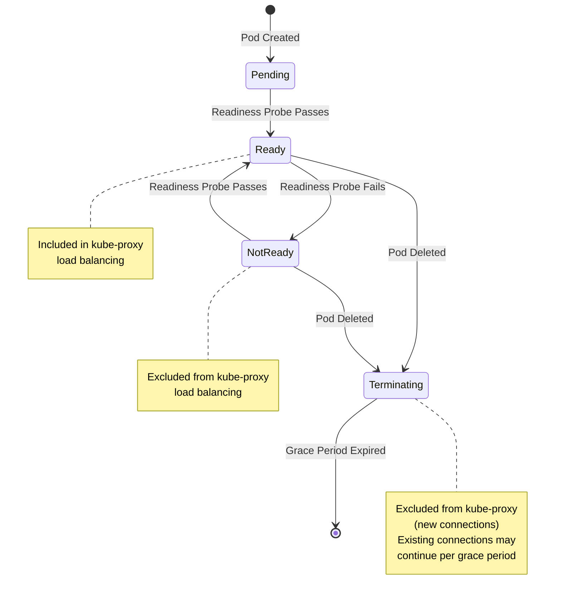
```mermaid
stateDiagram-v2
    [*] --> Pending: Pod Created
    Pending --> Ready: Readiness Probe Passes
    Ready --> NotReady: Readiness Probe Fails
    NotReady --> Ready: Readiness Probe Passes
    Ready --> Terminating: Pod Deleted
    NotReady --> Terminating: Pod Deleted
    Terminating --> [*]: Grace Period Expired

    note right of Ready
        Included in kube-proxy
        load balancing
    end note

    note right of NotReady
        Excluded from kube-proxy
        load balancing
    end note

    note right of Terminating
        Excluded from kube-proxy
        (new connections)
        Existing connections may
        continue per grace period
    end note
```

**Watch and Sync Flow**:

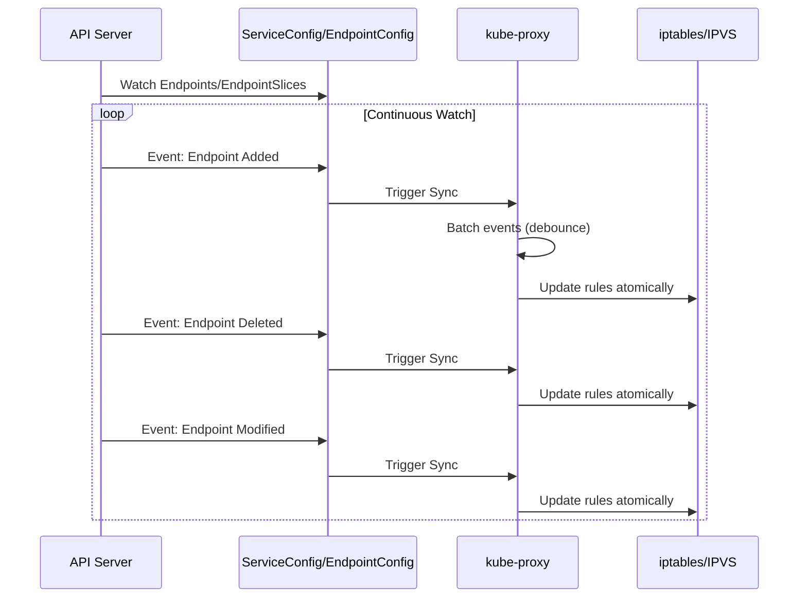
```mermaid
sequenceDiagram
    participant API as API Server
    participant Watch as ServiceConfig/EndpointConfig
    participant KP as kube-proxy
    participant Rules as iptables/IPVS

    API->>Watch: Watch Endpoints/EndpointSlices

    loop Continuous Watch
        API->>Watch: Event: Endpoint Added
        Watch->>KP: Trigger Sync
        KP->>KP: Batch events (debounce)
        KP->>Rules: Update rules atomically

        API->>Watch: Event: Endpoint Deleted
        Watch->>KP: Trigger Sync
        KP->>Rules: Update rules atomically

        API->>Watch: Event: Endpoint Modified
        Watch->>KP: Trigger Sync
        KP->>Rules: Update rules atomically
    end
```

**Endpoints vs EndpointSlices**:

| Feature | Endpoints (Legacy) | EndpointSlices (Current) |
|---------|-------------------|--------------------------|
| **Max Endpoints** | ~1000 per Service | Unlimited (paginated) |
| **API Object Size** | Grows with endpoints | Fixed size (~100 endpoints/slice) |
| **Watch Efficiency** | Full object on any change | Only changed slice |
| **Network Bandwidth** | High for large services | Low, scales linearly |
| **kube-proxy CPU** | High for large services | Lower, incremental updates |
| **Status** | Deprecated | GA (v1.21+) |

**EndpointSlice Example**:

```yaml
apiVersion: discovery.k8s.io/v1
kind: EndpointSlice
metadata:
  name: my-service-abc123
  namespace: default
  labels:
    kubernetes.io/service-name: my-service
addressType: IPv4
ports:
- name: http
  port: 8080
  protocol: TCP
endpoints:
- addresses:
  - "10.1.2.3"
  conditions:
    ready: true
    serving: true
    terminating: false
  nodeName: node-1
  zone: us-west-2a
- addresses:
  - "10.1.2.4"
  conditions:
    ready: false  # Excluded from load balancing
    serving: false
    terminating: false
  nodeName: node-1
```

**Sync Trigger Logic**:

```go
// pkg/proxy/config/config.go - Simplified

type ServiceConfig struct {
    eventHandler config.ServiceHandler
}

func (c *ServiceConfig) handleAddService(obj interface{}) {
    c.eventHandler.OnServiceAdd(service)
    // Triggers sync in proxier
}

func (c *ServiceConfig) handleUpdateService(oldObj, newObj interface{}) {
    c.eventHandler.OnServiceUpdate(oldService, newService)
    // Triggers sync in proxier
}

func (c *ServiceConfig) handleDeleteService(obj interface{}) {
    c.eventHandler.OnServiceDelete(service)
    // Triggers sync in proxier
}
```

**Code References**:

- `pkg/proxy/config/config.go:50-200` - Service and Endpoint watching
- `pkg/proxy/endpointschangetracker.go` - Endpoint change detection
- `pkg/proxy/endpointslicecache.go` - EndpointSlice caching
- `pkg/proxy/iptables/proxier.go:400-450` - Sync trigger handling
- `pkg/proxy/ipvs/proxier.go:400-500` - IPVS sync triggers

**Performance Impact**:

- **Sync Latency**: Typically < 1 second from endpoint change to rule update
- **Batching**: Multiple changes within sync period are batched into single update
- **Debouncing**: Prevents excessive syncs during rapid changes (e.g., rolling update)

**Example - Deployment Rolling Update**:

```bash
# Initial: 3 Pods (v1)
# Endpoints: 10.1.2.3, 10.1.2.4, 10.1.2.5

# Rolling update starts (maxUnavailable: 1, maxSurge: 1)
# Step 1: Create new Pod (v2)
# Endpoints: 10.1.2.3, 10.1.2.4, 10.1.2.5, 10.1.2.6 (NotReady)
# kube-proxy: No change (new Pod NotReady)

# Step 2: New Pod becomes Ready
# Endpoints: 10.1.2.3, 10.1.2.4, 10.1.2.5, 10.1.2.6 (Ready)
# kube-proxy: Add 10.1.2.6 to load balancing

# Step 3: Old Pod starts terminating
# Endpoints: 10.1.2.4, 10.1.2.5, 10.1.2.6, 10.1.2.3 (Terminating)
# kube-proxy: Remove 10.1.2.3 from load balancing (new connections)

# ... continues until all Pods are v2
```

**Related Requirements**: FR1, FR2, NFR1, NFR3

---

### FR5: Multiple Service Types

**Requirement**: kube-proxy MUST support all Kubernetes Service types with correct semantics.

**Priority**: P0 (Critical)

**Rationale**: Kubernetes defines multiple Service types for different use cases. kube-proxy must implement each type according to its specification.

**Service Types**:

1. **ClusterIP** - Internal-only service (default)
2. **NodePort** - Expose on static port on all nodes
3. **LoadBalancer** - Provision external cloud load balancer
4. **ExternalName** - DNS CNAME alias (no proxying)
5. **ExternalIPs** - Expose on user-specified IPs
6. **Headless** - No ClusterIP, DNS returns Pod IPs directly

**Acceptance Criteria**:

1. ✅ ClusterIP accessible from within cluster
2. ✅ NodePort accessible on `<NodeIP>:<NodePort>` from outside cluster
3. ✅ LoadBalancer accessible via cloud LB external IP
4. ✅ ExternalName returns CNAME (no kube-proxy involvement)
5. ✅ ExternalIPs accessible from outside cluster
6. ✅ Headless services bypass kube-proxy (no ClusterIP rules)

**Service Type Comparison**:

| Type | ClusterIP | NodePort | External Access | kube-proxy Rules | Use Case |
|------|-----------|----------|-----------------|------------------|----------|
| **ClusterIP** | Yes (allocated) | No | No | Yes | Internal services |
| **NodePort** | Yes | Yes (30000-32767) | Yes | Yes | Dev/test external access |
| **LoadBalancer** | Yes | Yes | Yes (via cloud LB) | Yes | Production external access |
| **ExternalName** | No | No | N/A (DNS only) | No | External service alias |
| **Headless** | No (None) | No | No | No | StatefulSet, custom LB |
| **ExternalIPs** | Yes | No | Yes (specified IPs) | Yes | On-prem external access |

**ClusterIP Service**:

```yaml
apiVersion: v1
kind: Service
metadata:
  name: backend
spec:
  type: ClusterIP  # Default, can be omitted
  clusterIP: 10.96.0.1  # Auto-assigned if not specified
  selector:
    app: backend
  ports:
  - port: 80
    targetPort: 8080
```

**Traffic Flow**:
```
Pod → ClusterIP (10.96.0.1:80) → kube-proxy → Backend Pod (10.1.2.3:8080)
```

**NodePort Service**:

```yaml
apiVersion: v1
kind: Service
metadata:
  name: web
spec:
  type: NodePort
  selector:
    app: web
  ports:
  - port: 80        # ClusterIP port
    targetPort: 8080
    nodePort: 30080  # Static port on all nodes (auto-assigned if omitted)
```

**Traffic Flow**:
```
External → NodeIP:30080 → kube-proxy → Backend Pod (10.1.2.3:8080)
            ↓ (also accessible internally)
Pod → ClusterIP:80 → kube-proxy → Backend Pod
```

**iptables Rules for NodePort** (simplified):

```bash
# PREROUTING: External traffic to node
-A PREROUTING -j KUBE-SERVICES

# KUBE-SERVICES: Check for NodePort
-A KUBE-SERVICES -m addrtype --dst-type LOCAL -j KUBE-NODEPORTS

# KUBE-NODEPORTS: NodePort 30080 → Service
-A KUBE-NODEPORTS -p tcp -m tcp --dport 30080 -j KUBE-SVC-XXXXX

# KUBE-SVC-XXXXX: Load balance to endpoints (same as ClusterIP)
-A KUBE-SVC-XXXXX -m statistic --mode random --probability 0.5 -j KUBE-SEP-EP1
-A KUBE-SVC-XXXXX -j KUBE-SEP-EP2
```

**LoadBalancer Service**:

```yaml
apiVersion: v1
kind: Service
metadata:
  name: webapp
spec:
  type: LoadBalancer
  selector:
    app: webapp
  ports:
  - port: 80
    targetPort: 8080
```

**Traffic Flow**:
```
External → Cloud LB IP → NodeIP:NodePort → kube-proxy → Backend Pod
```

**kube-proxy Role**: Same as NodePort. Cloud controller manager provisions external LB.

**ExternalName Service**:

```yaml
apiVersion: v1
kind: Service
metadata:
  name: external-db
spec:
  type: ExternalName
  externalName: db.example.com  # DNS CNAME target
```

**DNS Resolution**:
```
external-db.default.svc.cluster.local → CNAME → db.example.com → A record
```

**kube-proxy Role**: None. Pure DNS, no proxying.

**Headless Service**:

```yaml
apiVersion: v1
kind: Service
metadata:
  name: statefulset-svc
spec:
  clusterIP: None  # Headless
  selector:
    app: postgres
  ports:
  - port: 5432
```

**DNS Resolution**:
```
statefulset-svc.default.svc.cluster.local → A records → 10.1.2.3, 10.1.2.4, 10.1.2.5 (Pod IPs)
```

**kube-proxy Role**: None. No ClusterIP to forward.

**ExternalIPs**:

```yaml
apiVersion: v1
kind: Service
metadata:
  name: external-access
spec:
  clusterIP: 10.96.0.1
  externalIPs:
  - 203.0.113.10  # User-specified external IP
  selector:
    app: myapp
  ports:
  - port: 80
    targetPort: 8080
```

**Traffic Flow**:
```
External → 203.0.113.10:80 → kube-proxy → Backend Pod
```

**Code References**:

- `pkg/proxy/iptables/proxier.go:700-850` - ClusterIP rules
- `pkg/proxy/iptables/proxier.go:850-950` - NodePort rules
- `pkg/proxy/iptables/proxier.go:950-1050` - LoadBalancer/ExternalIP rules
- `pkg/proxy/ipvs/proxier.go:900-1100` - Service type handling in IPVS
- `cmd/kube-proxy/app/server.go:200-250` - Service type detection

**Related Requirements**: FR1, FR3, FR6

---

### FR6: Traffic Routing Policies

**Requirement**: kube-proxy MUST support traffic routing policies including ExternalTrafficPolicy and InternalTrafficPolicy.

**Priority**: P1 (High)

**Rationale**: Different applications have different requirements for traffic routing. Some need to preserve source IP, others need optimal routing. Traffic policies allow configuring this behavior.

**Acceptance Criteria**:

1. ✅ ExternalTrafficPolicy: Cluster (default) distributes to all endpoints
2. ✅ ExternalTrafficPolicy: Local routes only to local node endpoints
3. ✅ InternalTrafficPolicy: Cluster (default) distributes to all endpoints
4. ✅ InternalTrafficPolicy: Local routes only to local node endpoints (1.22+)
5. ✅ Local policy preserves source IP
6. ✅ Health check NodePort works with Local policy

**ExternalTrafficPolicy**:

| Policy | Routing | Source IP | Load Distribution | Health Check |
|--------|---------|-----------|-------------------|--------------|
| **Cluster** | All endpoints | SNAT (node IP) | Even across all endpoints | Not needed |
| **Local** | Local node only | Preserved | Uneven (only local) | Health check NodePort |

**ExternalTrafficPolicy: Cluster** (default):

```yaml
apiVersion: v1
kind: Service
metadata:
  name: webapp
spec:
  type: LoadBalancer
  externalTrafficPolicy: Cluster  # Default
  selector:
    app: webapp
  ports:
  - port: 80
```

**Traffic Flow**:
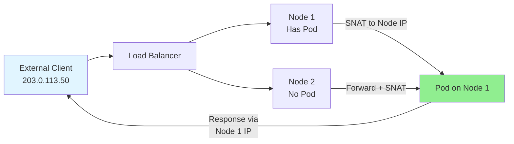
```mermaid
graph LR
    A[External Client<br/>203.0.113.50] --> B[Load Balancer]
    B --> C[Node 1<br/>Has Pod]
    B --> D[Node 2<br/>No Pod]

    C -->|SNAT to Node IP| E[Pod on Node 1]
    D -->|Forward + SNAT| E

    E -->|Response via<br/>Node 1 IP| A

    style A fill:#e1f5ff
    style E fill:#90ee90
```

**Behavior**:
- Traffic can go to any node (even without local Pod)
- Source IP is SNATed to node IP
- Even load distribution
- Potential extra hop (node → node)

**ExternalTrafficPolicy: Local**:

```yaml
apiVersion: v1
kind: Service
metadata:
  name: webapp
spec:
  type: LoadBalancer
  externalTrafficPolicy: Local  # Preserve source IP
  selector:
    app: webapp
  ports:
  - port: 80
```

**Traffic Flow**:
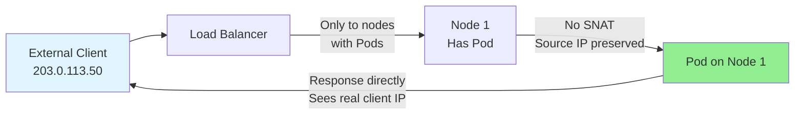
```mermaid
graph LR
    A[External Client<br/>203.0.113.50] --> B[Load Balancer]
    B -->|Only to nodes<br/>with Pods| C[Node 1<br/>Has Pod]

    C -->|No SNAT<br/>Source IP preserved| D[Pod on Node 1]

    D -->|Response directly<br/>Sees real client IP| A

    style A fill:#e1f5ff
    style D fill:#90ee90
```

**Behavior**:
- Traffic only goes to nodes with local Pods
- Source IP preserved (no SNAT)
- Uneven load distribution (depends on Pod placement)
- No extra hop
- Requires health check NodePort

**InternalTrafficPolicy** (1.22+):

Similar to ExternalTrafficPolicy but for internal (ClusterIP) traffic.

```yaml
apiVersion: v1
kind: Service
metadata:
  name: backend
spec:
  type: ClusterIP
  internalTrafficPolicy: Local  # Route to local endpoints only
  selector:
    app: backend
  ports:
  - port: 80
```

**Use Cases**:

| Policy | Use Case | Example |
|--------|----------|---------|
| **ExternalTrafficPolicy: Cluster** | Standard external access | Most services |
| **ExternalTrafficPolicy: Local** | Need real client IP, minimize hops | Logging, rate limiting, compliance |
| **InternalTrafficPolicy: Cluster** | Standard internal access | Most internal services |
| **InternalTrafficPolicy: Local** | Reduce cross-node traffic, topology-aware | Data locality, cost optimization |

**Health Check NodePort**:

When `externalTrafficPolicy: Local`, kube-proxy exposes a health check endpoint:

```bash
# Health check endpoint (auto-allocated port)
$ curl http://<node-ip>:<healthCheckNodePort>/healthz

# Returns:
# - HTTP 200 if node has healthy local endpoints
# - HTTP 503 if node has no local endpoints
```

**Load balancer uses this to route only to healthy nodes.**

**Code References**:

- `pkg/proxy/iptables/proxier.go:1050-1150` - ExternalTrafficPolicy implementation
- `pkg/proxy/ipvs/proxier.go:1100-1200` - IPVS traffic policy
- `pkg/proxy/healthcheck/` - Health check server implementation
- `pkg/proxy/apis/config/types.go:80-90` - Traffic policy configuration

**Performance and Behavior Impact**:

| Metric | Cluster Policy | Local Policy |
|--------|----------------|--------------|
| **Latency** | Potentially higher (extra hop) | Lower (direct) |
| **Load Distribution** | Even | Uneven |
| **Source IP** | Lost (SNATed) | Preserved |
| **Network Bandwidth** | Higher (cross-node) | Lower (local only) |

**Related Requirements**: FR5, FR8, NFR1

---

### FR7: Session Affinity

**Requirement**: kube-proxy MUST support session affinity (sticky sessions) based on client IP.

**Priority**: P1 (High)

**Rationale**: Some applications require that requests from the same client always go to the same backend Pod (e.g., shopping carts, stateful applications).

**Acceptance Criteria**:

1. ✅ SessionAffinity: ClientIP routes same client to same Pod
2. ✅ SessionAffinity: None (default) distributes randomly
3. ✅ Affinity timeout is configurable
4. ✅ Affinity persists across Pod restarts (same Pod selected if still healthy)
5. ✅ Affinity breaks when target Pod becomes unhealthy
6. ✅ Implementation differs by proxy mode (iptables vs IPVS)

**Session Affinity Configuration**:

```yaml
apiVersion: v1
kind: Service
metadata:
  name: stateful-app
spec:
  selector:
    app: stateful-app
  sessionAffinity: ClientIP
  sessionAffinityConfig:
    clientIP:
      timeoutSeconds: 10800  # 3 hours (default: 10800)
  ports:
  - port: 80
    targetPort: 8080
```

**Behavior**:

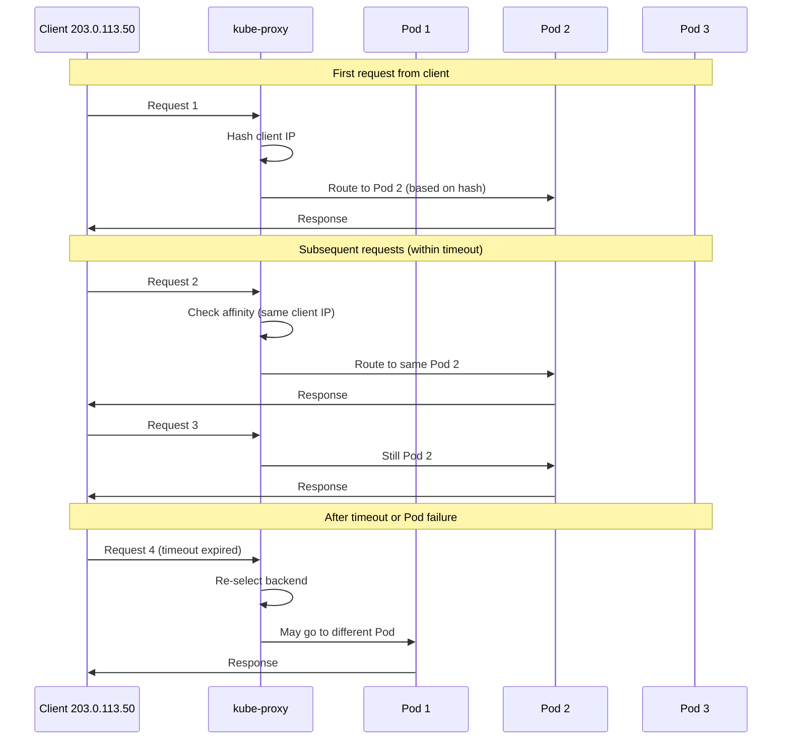
```mermaid
sequenceDiagram
    participant C as Client 203.0.113.50
    participant KP as kube-proxy
    participant P1 as Pod 1
    participant P2 as Pod 2
    participant P3 as Pod 3

    Note over C,P3: First request from client

    C->>KP: Request 1
    KP->>KP: Hash client IP
    KP->>P2: Route to Pod 2 (based on hash)
    P2->>C: Response

    Note over C,P3: Subsequent requests (within timeout)

    C->>KP: Request 2
    KP->>KP: Check affinity (same client IP)
    KP->>P2: Route to same Pod 2
    P2->>C: Response

    C->>KP: Request 3
    KP->>P2: Still Pod 2
    P2->>C: Response

    Note over C,P3: After timeout or Pod failure

    C->>KP: Request 4 (timeout expired)
    KP->>KP: Re-select backend
    KP->>P1: May go to different Pod
    P1->>C: Response
```

**Implementation by Proxy Mode**:

**iptables Mode** - Uses `recent` module:

```bash
# Session affinity rules (iptables)
-A KUBE-SVC-XXXXX -m recent --name KUBE-SEP-EP1 --rcheck --seconds 10800 --reap -j KUBE-SEP-EP1
-A KUBE-SVC-XXXXX -m recent --name KUBE-SEP-EP2 --rcheck --seconds 10800 --reap -j KUBE-SEP-EP2
-A KUBE-SVC-XXXXX -m recent --name KUBE-SEP-EP3 --rcheck --seconds 10800 --reap -j KUBE-SEP-EP3

# If no recent match, do load balancing
-A KUBE-SVC-XXXXX -m statistic --mode random --probability 0.33 -j KUBE-SEP-EP1
-A KUBE-SVC-XXXXX -m statistic --mode random --probability 0.50 -j KUBE-SEP-EP2
-A KUBE-SVC-XXXXX -j KUBE-SEP-EP3

# Endpoint chains set recent mark
-A KUBE-SEP-EP1 -m recent --name KUBE-SEP-EP1 --set -j DNAT --to-destination 10.1.2.3:8080
-A KUBE-SEP-EP2 -m recent --name KUBE-SEP-EP2 --set -j DNAT --to-destination 10.1.2.4:8080
-A KUBE-SEP-EP3 -m recent --name KUBE-SEP-EP3 --set -j DNAT --to-destination 10.1.2.5:8080
```

**Logic**:
1. Check if client IP recently used any endpoint (within timeout)
2. If yes, route to that endpoint
3. If no, load balance normally and set recent mark

**IPVS Mode** - Uses IPVS persistence:

```bash
# Create virtual server with persistence
ipvsadm -A -t 10.96.0.1:80 -s rr -p 10800  # -p: persistence timeout

# Add real servers
ipvsadm -a -t 10.96.0.1:80 -r 10.1.2.3:8080
ipvsadm -a -t 10.96.0.1:80 -r 10.1.2.4:8080
ipvsadm -a -t 10.96.0.1:80 -r 10.1.2.5:8080

# View persistence connections
ipvsadm -L -n --persistent-conn
```

**Logic**:
1. IPVS tracks client IP and selected backend in kernel
2. Subsequent connections from same IP go to same backend
3. Persistence entry expires after timeout

**Comparison**:

| Feature | iptables (recent) | IPVS (persistence) |
|---------|-------------------|-------------------|
| **Performance** | Moderate (rule evaluation) | Excellent (kernel hash table) |
| **Memory** | /proc/net/xt_recent | Kernel IPVS state |
| **Scalability** | Limited by recent list size | Excellent |
| **Accuracy** | Per-packet | Per-connection |

**Code References**:

- `pkg/proxy/iptables/proxier.go:1350-1450` - Session affinity rule generation
- `pkg/proxy/ipvs/proxier.go:1200-1300` - IPVS persistence configuration
- `pkg/proxy/apis/config/types.go:70-80` - Session affinity config

**Use Cases**:

1. **Shopping carts** - User session data stored in specific Pod
2. **WebSockets** - Long-lived connections to same backend
3. **File uploads** - Multi-part uploads to same Pod
4. **Stateful protocols** - Protocols requiring connection state

**Limitations**:

- Only based on client IP (not cookies, headers, etc.)
- Timeout is fixed per Service (not per-connection)
- Affinity breaks when target Pod deleted (redistributed to new Pod)
- NAT can group multiple clients behind same IP (over-affinity)

**Related Requirements**: FR2, NFR1

---

### FR8: Health Checking

**Requirement**: kube-proxy MUST provide health checking mechanisms for external load balancers and monitoring systems.

**Priority**: P1 (High)

**Rationale**: External load balancers need to know which nodes have healthy local endpoints. Monitoring systems need to check kube-proxy health.

**Acceptance Criteria**:

1. ✅ `/healthz` endpoint returns kube-proxy health status
2. ✅ Health check NodePort (for ExternalTrafficPolicy: Local) returns per-node endpoint health
3. ✅ Health checks exclude NotReady endpoints
4. ✅ Health checks respond correctly after endpoint changes
5. ✅ Health check failures cause load balancer to route traffic elsewhere

**Health Endpoints**:

| Endpoint | Purpose | Port | Returns |
|----------|---------|------|---------|
| `/healthz` | kube-proxy liveness | 10256 (default) | 200 if healthy |
| `/metrics` | Prometheus metrics | 10249 (default) | Metrics |
| Health Check NodePort | Per-service node health | Auto-allocated | 200 if local endpoints exist |

**kube-proxy Healthz**:

```bash
# Check kube-proxy health
$ curl http://localhost:10256/healthz
ok

# If unhealthy:
# HTTP 503 Service Unavailable
```

**Configuration**:

```yaml
# kube-proxy config
apiVersion: kubeproxy.config.k8s.io/v1alpha1
kind: KubeProxyConfiguration
healthzBindAddress: "0.0.0.0:10256"
metricsBindAddress: "0.0.0.0:10249"
```

**Health Check NodePort**:

**Purpose**: Tell external load balancer if node has healthy local endpoints.

**Enabled when**: `externalTrafficPolicy: Local`

**Example**:

```yaml
apiVersion: v1
kind: Service
metadata:
  name: webapp
spec:
  type: LoadBalancer
  externalTrafficPolicy: Local
  selector:
    app: webapp
  ports:
  - port: 80
    targetPort: 8080
---
# After service creation, check status
$ kubectl get svc webapp -o yaml

status:
  loadBalancer:
    ingress:
    - ip: 203.0.113.100
  healthCheckNodePort: 32000  # Auto-allocated
```

**Health Check Behavior**:

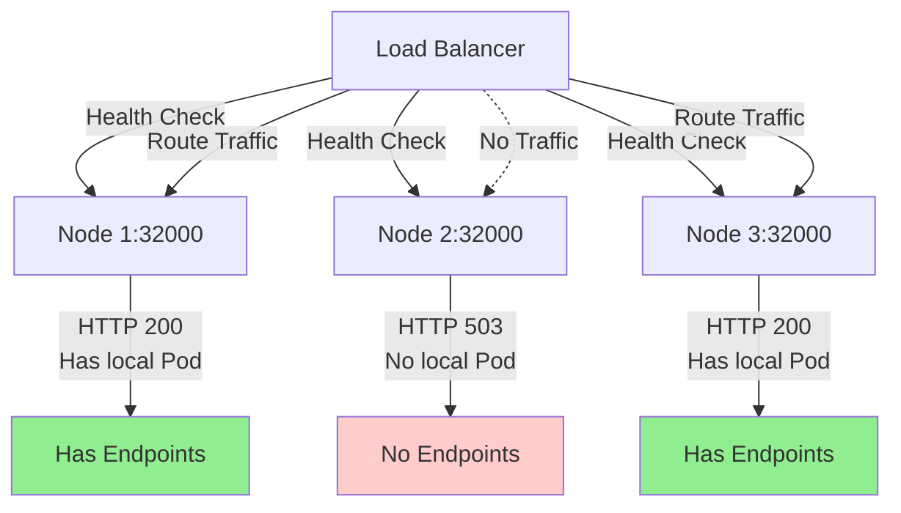
```mermaid
graph TD
    A[Load Balancer] -->|Health Check| B[Node 1:32000]
    A -->|Health Check| C[Node 2:32000]
    A -->|Health Check| D[Node 3:32000]

    B -->|HTTP 200<br/>Has local Pod| E[Has Endpoints]
    C -->|HTTP 503<br/>No local Pod| F[No Endpoints]
    D -->|HTTP 200<br/>Has local Pod| G[Has Endpoints]

    A -->|Route Traffic| B
    A -->|Route Traffic| D
    A -.->|No Traffic| C

    style E fill:#90ee90
    style F fill:#ffcccc
    style G fill:#90ee90
```

**Health Check Request**:

```bash
# On node with local endpoints
$ curl http://node-1:32000/healthz
{"service":{"namespace":"default","name":"webapp"},"localEndpoints":1}
# HTTP 200 OK

# On node without local endpoints
$ curl http://node-2:32000/healthz
{"service":{"namespace":"default","name":"webapp"},"localEndpoints":0}
# HTTP 503 Service Unavailable
```

**Health Check Server Implementation**:

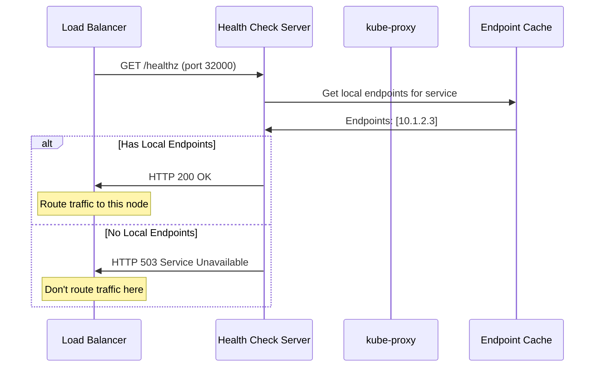
```mermaid
sequenceDiagram
    participant LB as Load Balancer
    participant HC as Health Check Server
    participant KP as kube-proxy
    participant Cache as Endpoint Cache

    LB->>HC: GET /healthz (port 32000)
    HC->>Cache: Get local endpoints for service
    Cache->>HC: Endpoints: [10.1.2.3]

    alt Has Local Endpoints
        HC->>LB: HTTP 200 OK
        Note over LB: Route traffic to this node
    else No Local Endpoints
        HC->>LB: HTTP 503 Service Unavailable
        Note over LB: Don't route traffic here
    end
```

**Code References**:

- `pkg/proxy/healthcheck/healthcheck.go` - Health check server
- `pkg/proxy/healthcheck/service_health.go` - Per-service health tracking
- `cmd/kube-proxy/app/server.go:300-350` - Health server initialization
- `pkg/proxy/iptables/proxier.go:350-400` - Health check integration

**Monitoring Integration**:

```yaml
# ServiceMonitor for Prometheus
apiVersion: monitoring.coreos.com/v1
kind: ServiceMonitor
metadata:
  name: kube-proxy
spec:
  endpoints:
  - port: metrics
    interval: 30s
  selector:
    matchLabels:
      k8s-app: kube-proxy
```

**Key Metrics** (see middle-level/10-metrics-monitoring.md for full list):

- `kubeproxy_sync_proxy_rules_duration_seconds` - Rule sync latency
- `kubeproxy_network_programming_duration_seconds` - Network programming time
- `kubeproxy_sync_proxy_rules_last_timestamp_seconds` - Last successful sync

**Related Requirements**: FR6, NFR4

---

## Non-Functional Requirements

### NFR1: Performance and Scalability

**Requirement**: kube-proxy MUST scale to large clusters with thousands of Services and endpoints while maintaining low latency.

**Priority**: P0 (Critical)

**Rationale**: Production Kubernetes clusters can have 5000+ Services and 100,000+ endpoints. kube-proxy must handle this scale efficiently without becoming a bottleneck.

**Acceptance Criteria**:

| Metric | iptables Mode | IPVS Mode | nftables Mode |
|--------|---------------|-----------|---------------|
| **Max Services** | ~1000 | 10,000+ | ~5000 |
| **Max Endpoints** | ~10,000 | 100,000+ | ~50,000 |
| **Rule Sync Time** | < 100ms (< 1000 svc) | < 10ms (5000+ svc) | < 50ms (5000 svc) |
| **Packet Latency** | < 1ms | < 0.1ms | < 0.5ms |
| **CPU Usage (idle)** | < 1% | < 1% | < 1% |
| **CPU Usage (sync)** | 10-50% | 1-5% | 5-10% |
| **Memory Usage** | 100MB-1GB | 200MB-2GB | 150MB-1.5GB |

**Scalability Limits**:

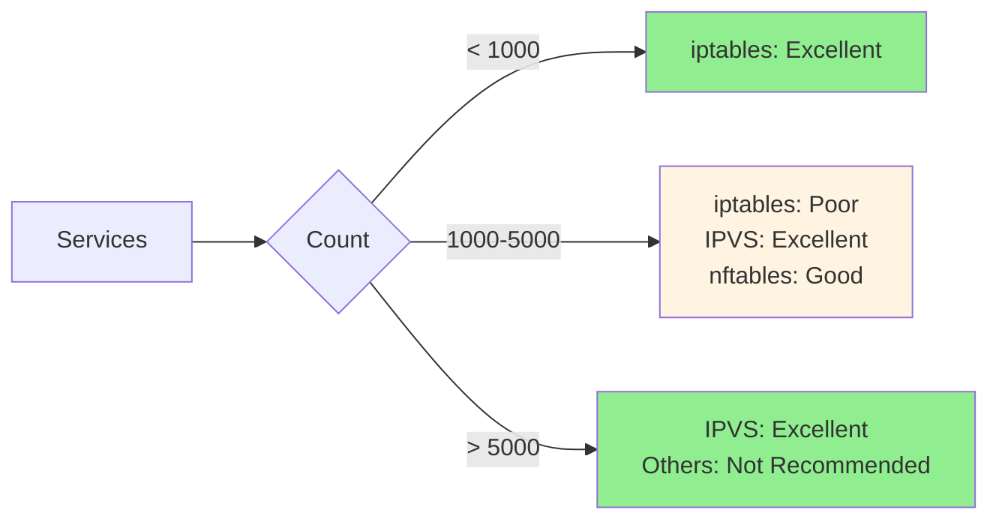
```mermaid
graph LR
    A[Services] --> B{Count}
    B -->|< 1000| C[iptables: Excellent]
    B -->|1000-5000| D[iptables: Poor<br/>IPVS: Excellent<br/>nftables: Good]
    B -->|> 5000| E[IPVS: Excellent<br/>Others: Not Recommended]

    style C fill:#90ee90
    style D fill:#fff4e1
    style E fill:#90ee90
```

**Performance Characteristics**:

**iptables Mode**:
- **Rule Complexity**: O(n) where n = number of services × endpoints
- **Lookup Time**: O(n) per packet (linear rule traversal)
- **Sync Time**: O(n²) - generates and applies all rules
- **Scaling Issue**: Performance degrades significantly above 1000 services

**Example** - 2000 services with average 10 endpoints each:
```
Total rules: ~2000 × 10 × 3 (chains) = 60,000 iptables rules
Sync time: 5-10 seconds
Packet latency: 1-5ms (rule traversal)
CPU during sync: 50-100%
```

**IPVS Mode**:
- **Rule Complexity**: O(1) hash table lookup
- **Lookup Time**: O(1) per packet
- **Sync Time**: O(n) - incremental updates
- **Scaling**: Linear scaling to 10,000+ services

**Example** - 5000 services with average 20 endpoints each:
```
Virtual servers: 5000
Real servers: 100,000
Sync time: 10-50ms
Packet latency: < 0.1ms (hash lookup)
CPU during sync: 5-10%
```

**nftables Mode**:
- **Rule Complexity**: O(log n) with optimized sets
- **Lookup Time**: O(log n) per packet
- **Sync Time**: O(n log n)
- **Scaling**: Better than iptables, not as good as IPVS

**Benchmark Results** (on 32-core, 128GB RAM server):

| Services | Endpoints | iptables Sync | IPVS Sync | iptables Latency | IPVS Latency |
|----------|-----------|---------------|-----------|------------------|--------------|
| 100 | 1,000 | 50ms | 5ms | 0.5ms | 0.05ms |
| 500 | 5,000 | 500ms | 10ms | 2ms | 0.08ms |
| 1,000 | 10,000 | 2s | 15ms | 5ms | 0.1ms |
| 2,000 | 20,000 | 8s | 25ms | 15ms | 0.12ms |
| 5,000 | 50,000 | N/A (too slow) | 60ms | N/A | 0.15ms |
| 10,000 | 100,000 | N/A | 120ms | N/A | 0.18ms |

**Code References**:

- `pkg/proxy/iptables/proxier.go:400-1600` - iptables sync implementation
- `pkg/proxy/ipvs/proxier.go:400-1800` - IPVS sync implementation
- `pkg/proxy/metrics/metrics.go` - Performance metrics
- `pkg/proxy/iptables/proxier_test.go:50-100` - Performance tests

**Optimization Techniques**:

1. **Batching**: Combine multiple events into single sync
2. **Debouncing**: Delay sync to batch rapid changes
3. **Incremental Updates**: Only update changed rules (IPVS)
4. **Connection Reuse**: Reuse netlink connections
5. **Parallel Processing**: Process services concurrently where safe

**Related Requirements**: FR1, FR2, FR4, NFR7

---

### NFR2: High Availability

**Requirement**: kube-proxy MUST provide high availability through redundancy and resilience to failures.

**Priority**: P0 (Critical)

**Rationale**: kube-proxy is critical for all Service networking. Failure of kube-proxy on a node breaks Service access for Pods on that node.

**Acceptance Criteria**:

1. ✅ kube-proxy runs on every node (DaemonSet)
2. ✅ Each kube-proxy instance operates independently
3. ✅ Failure of one kube-proxy doesn't affect others
4. ✅ kube-proxy recovers from transient failures
5. ✅ Network rules persist across kube-proxy restarts
6. ✅ Graceful handling of API server unavailability

**High Availability Architecture**:

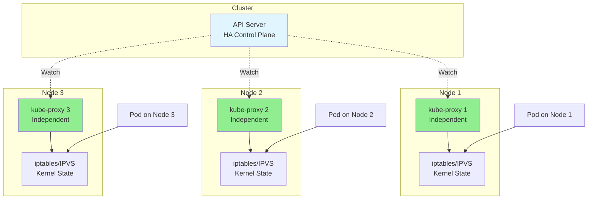
```mermaid
graph TB
    subgraph "Cluster"
        A[API Server<br/>HA Control Plane]
    end

    subgraph "Node 1"
        B[kube-proxy 1<br/>Independent]
        C[iptables/IPVS<br/>Kernel State]
    end

    subgraph "Node 2"
        D[kube-proxy 2<br/>Independent]
        E[iptables/IPVS<br/>Kernel State]
    end

    subgraph "Node 3"
        F[kube-proxy 3<br/>Independent]
        G[iptables/IPVS<br/>Kernel State]
    end

    A -.->|Watch| B
    A -.->|Watch| D
    A -.->|Watch| F

    B --> C
    D --> E
    F --> G

    H[Pod on Node 1] --> C
    I[Pod on Node 2] --> E
    J[Pod on Node 3] --> G

    style A fill:#e1f5ff
    style B fill:#90ee90
    style D fill:#90ee90
    style F fill:#90ee90
```

**Key Principles**:

1. **No Single Point of Failure**: Each node has independent kube-proxy
2. **No Leader Election**: All instances are equal (no coordination needed)
3. **Eventually Consistent**: All instances converge to same state
4. **Blast Radius Limitation**: Failure affects only one node

**Failure Scenarios**:

**Scenario 1: kube-proxy Process Crash**

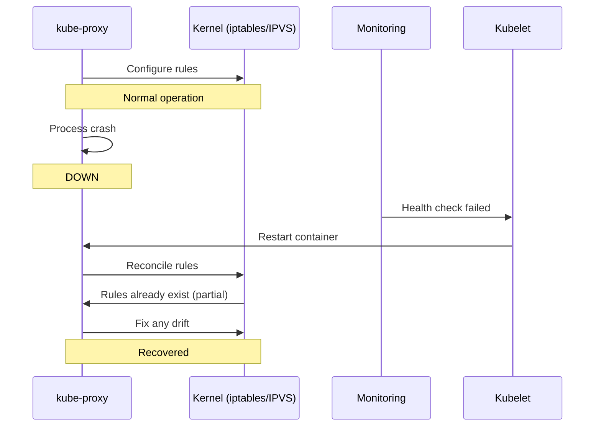
```mermaid
sequenceDiagram
    participant KP as kube-proxy
    participant K as Kernel (iptables/IPVS)
    participant M as Monitoring
    participant Kubelet

    KP->>K: Configure rules
    Note over KP,K: Normal operation

    KP->>KP: Process crash
    Note over KP: DOWN

    M->>Kubelet: Health check failed
    Kubelet->>KP: Restart container

    KP->>K: Reconcile rules
    K->>KP: Rules already exist (partial)
    KP->>K: Fix any drift

    Note over KP,K: Recovered
```

**Impact**: Network rules persist in kernel, Service routing continues. kube-proxy restarts and reconciles state.

**Scenario 2: API Server Unavailable**

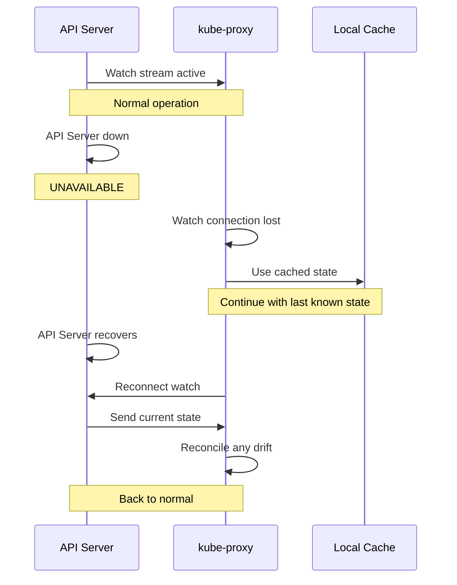
```mermaid
sequenceDiagram
    participant API as API Server
    participant KP as kube-proxy
    participant Cache as Local Cache

    API->>KP: Watch stream active
    Note over API,KP: Normal operation

    API->>API: API Server down
    Note over API: UNAVAILABLE

    KP->>KP: Watch connection lost
    KP->>Cache: Use cached state

    Note over KP,Cache: Continue with last known state

    API->>API: API Server recovers
    KP->>API: Reconnect watch
    API->>KP: Send current state
    KP->>KP: Reconcile any drift

    Note over API,KP: Back to normal
```

**Impact**: kube-proxy continues operating with cached state. No new services/endpoints until reconnect.

**Scenario 3: Network Partition**

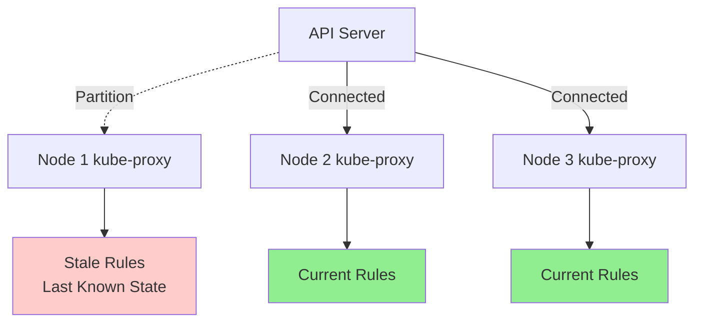
```mermaid
graph TB
    A[API Server] -.->|Partition| B[Node 1 kube-proxy]
    A -->|Connected| C[Node 2 kube-proxy]
    A -->|Connected| D[Node 3 kube-proxy]

    B --> E[Stale Rules<br/>Last Known State]
    C --> F[Current Rules]
    D --> G[Current Rules]

    style E fill:#ffcccc
    style F fill:#90ee90
    style G fill:#90ee90
```

**Impact**: Partitioned node has stale rules. Services may route to deleted endpoints or miss new ones.

**Recovery Mechanisms**:

1. **Periodic Sync**: Full reconciliation every 30s (configurable)
2. **Watch Reconnect**: Automatic reconnect on watch failure
3. **Rule Validation**: Detect and fix rule drift
4. **Crash Recovery**: Rules persist in kernel, kube-proxy reconciles on restart

**Configuration**:

```yaml
apiVersion: kubeproxy.config.k8s.io/v1alpha1
kind: KubeProxyConfiguration
# Periodic sync interval
syncPeriod: 30s

# Watch timeout and reconnect
configSyncPeriod: 15m

# Health check
healthzBindAddress: "0.0.0.0:10256"
```

**DaemonSet Deployment**:

```yaml
apiVersion: apps/v1
kind: DaemonSet
metadata:
  name: kube-proxy
  namespace: kube-system
spec:
  selector:
    matchLabels:
      k8s-app: kube-proxy
  template:
    metadata:
      labels:
        k8s-app: kube-proxy
    spec:
      hostNetwork: true  # Use host networking
      containers:
      - name: kube-proxy
        image: k8s.gcr.io/kube-proxy:v1.32.0
        command:
        - /usr/local/bin/kube-proxy
        - --config=/var/lib/kube-proxy/config.conf
        livenessProbe:
          httpGet:
            path: /healthz
            port: 10256
          initialDelaySeconds: 15
          periodSeconds: 10
        resources:
          requests:
            cpu: 100m
            memory: 128Mi
```

**Code References**:

- `cmd/kube-proxy/app/server.go:450-550` - Watch and sync loop
- `pkg/proxy/config/config.go:100-200` - Watch reconnection logic
- `pkg/proxy/iptables/proxier.go:300-400` - Periodic sync

**Related Requirements**: NFR3, NFR4

---

### NFR3: Fault Tolerance

**Requirement**: kube-proxy MUST gracefully handle errors and continue operating under adverse conditions.

**Priority**: P0 (Critical)

**Rationale**: kube-proxy encounters various errors in production (kernel failures, resource exhaustion, API errors). It must handle these gracefully without crashing or leaving the system in a broken state.

**Acceptance Criteria**:

1. ✅ Handles kernel errors (iptables/IPVS failures) without crashing
2. ✅ Continues operating when individual rules fail
3. ✅ Recovers from transient failures automatically
4. ✅ Logs errors with sufficient context for debugging
5. ✅ Exposes error metrics for monitoring
6. ✅ Implements retry logic with exponential backoff
7. ✅ Prevents partial rule states (atomic updates)

**Error Categories**:

| Category | Examples | Handling Strategy |
|----------|----------|-------------------|
| **Transient** | Network timeouts, temporary resource exhaustion | Retry with backoff |
| **Permanent** | Invalid configuration, unsupported kernel | Log error, skip affected resource |
| **Resource** | iptables table full, memory exhaustion | Reduce load, alert |
| **API** | API server unavailable, watch disconnect | Use cache, reconnect |
| **Kernel** | iptables binary missing, IPVS module not loaded | Fail fast, alert |

**Error Handling Flow**:

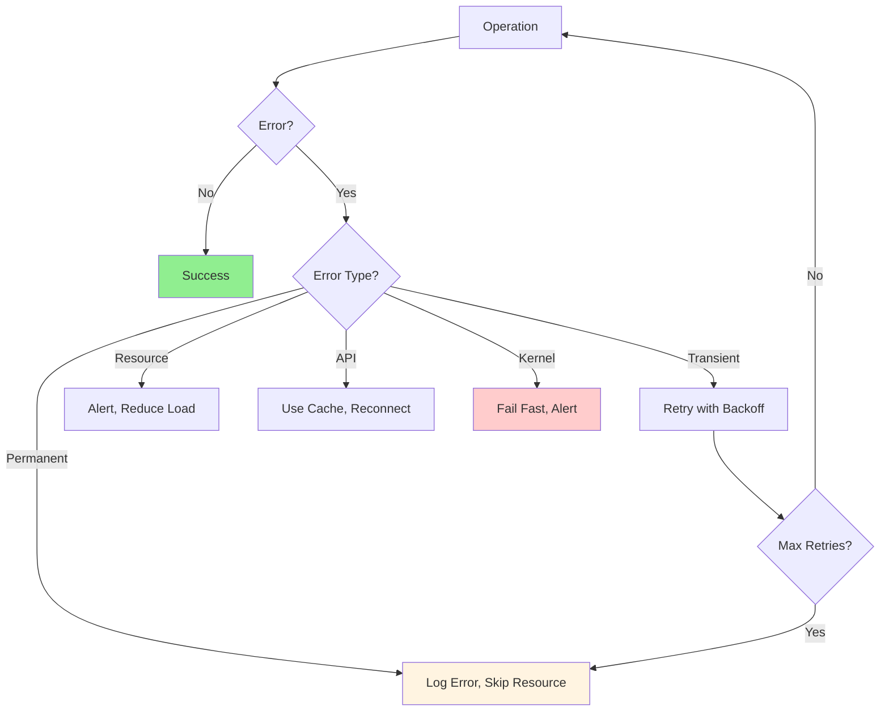
```mermaid
graph TD
    A[Operation] --> B{Error?}
    B -->|No| C[Success]
    B -->|Yes| D{Error Type?}

    D -->|Transient| E[Retry with Backoff]
    D -->|Permanent| F[Log Error, Skip Resource]
    D -->|Resource| G[Alert, Reduce Load]
    D -->|API| H[Use Cache, Reconnect]
    D -->|Kernel| I[Fail Fast, Alert]

    E --> J{Max Retries?}
    J -->|No| A
    J -->|Yes| F

    style C fill:#90ee90
    style F fill:#fff4e1
    style I fill:#ffcccc
```

**Example Error Scenarios**:

**Scenario 1: iptables Command Failure**

```go
// pkg/proxy/iptables/proxier.go - Simplified

func (proxier *Proxier) syncProxyRules() {
    // Build rules
    lines := proxier.buildIPTablesRules()

    // Apply rules with error handling
    err := proxier.iptables.RestoreAll(lines, utiliptables.NoFlushTables, utiliptables.RestoreCounters)
    if err != nil {
        klog.ErrorS(err, "Failed to sync iptables rules")
        metrics.IptablesRestoreFailuresTotal.Inc()

        // Don't crash - try again next sync
        return
    }

    metrics.SyncProxyRulesLastTimestamp.SetToCurrentTime()
}
```

**Handling**: Log error, increment metric, continue. Next periodic sync will retry.

**Scenario 2: Individual Service Error**

```go
// Process each service independently
for svcName, svc := range services {
    err := proxier.processService(svcName, svc)
    if err != nil {
        klog.ErrorS(err, "Failed to process service", "service", svcName)
        // Continue with other services - don't let one break all
        continue
    }
}
```

**Handling**: Log error for specific service, continue processing others.

**Scenario 3: Kernel Module Missing (IPVS)**

```go
// cmd/kube-proxy/app/server_linux.go

func (s *ProxyServer) createProxier() (proxy.Provider, error) {
    if s.Config.Mode == "ipvs" {
        // Check if IPVS kernel modules are loaded
        if !ipvs.IsIPVSProvisioned() {
            klog.ErrorS(nil, "IPVS kernel modules not loaded")
            return nil, fmt.Errorf("IPVS mode requested but kernel modules not available")
        }
    }
    // ...
}
```

**Handling**: Fail fast at startup with clear error message. Don't try to continue without required kernel support.

**Scenario 4: Conntrack Table Full**

```bash
# Kernel log
nf_conntrack: table full, dropping packet

# kube-proxy detects via metrics or logs
```

**Handling**:
1. Expose metric: `conntrack_entries_current`
2. Alert when approaching limit
3. Document tuning parameters
4. Recommend increasing `net.netfilter.nf_conntrack_max`

**Atomic Updates**:

kube-proxy ensures atomicity to prevent partial rule states:

**iptables Mode**:
```bash
# Generate new rule set
iptables-save > /tmp/current-rules
<modify rules in memory>

# Apply atomically via iptables-restore
iptables-restore --noflush < /tmp/new-rules

# Either all rules apply or none (transaction-like)
```

**IPVS Mode**:
```go
// Graceful server deletion (weight 0)
ipvs.UpdateRealServer(vs, &RealServer{
    Address: endpoint.IP,
    Port: endpoint.Port,
    Weight: 0,  // Stop new connections
})
time.Sleep(gracePeriod)  // Wait for existing connections
ipvs.DeleteRealServer(vs, rs)  // Remove completely
```

**Retry Logic**:

```go
// Exponential backoff for retries
backoff := wait.Backoff{
    Duration: 500 * time.Millisecond,
    Factor:   2.0,
    Steps:    5,  // Max 5 retries
}

err := wait.ExponentialBackoff(backoff, func() (bool, error) {
    err := operation()
    if err == nil {
        return true, nil  // Success
    }
    if isPermanentError(err) {
        return false, err  // Don't retry permanent errors
    }
    klog.V(4).InfoS("Retrying after error", "error", err)
    return false, nil  // Retry transient errors
})
```

**Error Metrics**:

```
# iptables restore failures
kubeproxy_sync_proxy_rules_iptables_restore_failures_total

# Last error timestamp
kubeproxy_sync_proxy_rules_last_error_timestamp_seconds

# Endpoint changes error count
kubeproxy_sync_proxy_rules_endpoint_changes_total{result="error"}
```

**Code References**:

- `pkg/proxy/iptables/proxier.go:250-350` - Error handling in sync loop
- `pkg/proxy/ipvs/proxier.go:250-350` - IPVS error handling
- `pkg/proxy/metrics/metrics.go` - Error metrics
- `pkg/util/iptables/iptables.go:200-300` - iptables command execution with error handling

**Best Practices**:

1. **Fail Gracefully**: Don't crash on errors, log and continue
2. **Expose Metrics**: Make errors observable
3. **Atomic Updates**: Prevent partial states
4. **Retry Transient**: Retry with backoff for transient failures
5. **Alert on Permanent**: Alert operators for permanent errors
6. **Validate Input**: Validate before executing (fail fast)

**Related Requirements**: NFR2, NFR4

---

### NFR4: Observability

**Requirement**: kube-proxy MUST provide comprehensive observability through metrics, logs, and health checks.

**Priority**: P1 (High)

**Rationale**: Operators need visibility into kube-proxy behavior to troubleshoot issues, monitor performance, and ensure reliability.

**Acceptance Criteria**:

1. ✅ Prometheus metrics exposed on /metrics endpoint
2. ✅ Structured logging with appropriate log levels
3. ✅ Health check endpoint (/healthz)
4. ✅ Metrics cover key operations (sync, rules, errors)
5. ✅ Logs include context (service names, error details)
6. ✅ Performance metrics (latency, duration)

**Observability Components**:

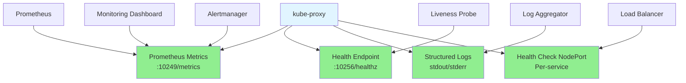
```mermaid
graph TB
    A[kube-proxy] --> B[Prometheus Metrics<br/>:10249/metrics]
    A --> C[Health Endpoint<br/>:10256/healthz]
    A --> D[Structured Logs<br/>stdout/stderr]
    A --> E[Health Check NodePort<br/>Per-service]

    F[Prometheus] --> B
    G[Monitoring Dashboard] --> B
    H[Alertmanager] --> B
    I[Liveness Probe] --> C
    J[Log Aggregator] --> D
    K[Load Balancer] --> E

    style A fill:#e1f5ff
    style B fill:#90ee90
    style C fill:#90ee90
    style D fill:#90ee90
    style E fill:#90ee90
```

**Key Metrics**:

| Metric | Type | Description |
|--------|------|-------------|
| `kubeproxy_sync_proxy_rules_duration_seconds` | Histogram | Time to sync all rules |
| `kubeproxy_sync_proxy_rules_last_timestamp_seconds` | Gauge | Last successful sync timestamp |
| `kubeproxy_network_programming_duration_seconds` | Histogram | End-to-end network programming time |
| `kubeproxy_sync_proxy_rules_iptables_restore_failures_total` | Counter | iptables restore failures |
| `kubeproxy_sync_proxy_rules_service_changes_total` | Counter | Service changes processed |
| `kubeproxy_sync_proxy_rules_endpoint_changes_total` | Counter | Endpoint changes processed |
| `rest_client_requests_total` | Counter | API client requests |
| `rest_client_request_duration_seconds` | Histogram | API request duration |

**Full list**: See middle-level/10-metrics-monitoring.md

**Example Metrics Output**:

```prometheus
# HELP kubeproxy_sync_proxy_rules_duration_seconds SyncProxyRules latency
# TYPE kubeproxy_sync_proxy_rules_duration_seconds histogram
kubeproxy_sync_proxy_rules_duration_seconds_bucket{le="0.001"} 45
kubeproxy_sync_proxy_rules_duration_seconds_bucket{le="0.002"} 78
kubeproxy_sync_proxy_rules_duration_seconds_bucket{le="0.004"} 123
kubeproxy_sync_proxy_rules_duration_seconds_bucket{le="0.008"} 145
kubeproxy_sync_proxy_rules_duration_seconds_sum 12.34
kubeproxy_sync_proxy_rules_duration_seconds_count 150

# HELP kubeproxy_network_programming_duration_seconds Network programming latency
# TYPE kubeproxy_network_programming_duration_seconds histogram
kubeproxy_network_programming_duration_seconds_bucket{le="1"} 98
kubeproxy_network_programming_duration_seconds_bucket{le="2"} 145
kubeproxy_network_programming_duration_seconds_sum 234.56
kubeproxy_network_programming_duration_seconds_count 150
```

**Logging Levels**:

| Level | Usage | Example |
|-------|-------|---------|
| **Error** | Errors requiring attention | "Failed to sync iptables rules" |
| **Warning** | Potentially problematic situations | "Service has no endpoints" |
| **Info** | General informational messages | "Starting kube-proxy" |
| **Debug (V=2)** | Detailed information for debugging | "Processing service default/webapp" |
| **Trace (V=4)** | Very detailed information | "Generated iptables rule: ..." |

**Structured Logging Example**:

```go
import "k8s.io/klog/v2"

// Error with context
klog.ErrorS(err, "Failed to sync proxy rules",
    "syncDuration", syncDuration,
    "serviceCount", len(services),
    "endpointCount", len(endpoints))

// Info message
klog.InfoS("Proxy rules synced successfully",
    "duration", syncDuration,
    "mode", proxyMode)

// Debug message (requires -v=2)
klog.V(2).InfoS("Processing service",
    "service", svcName,
    "clusterIP", svc.ClusterIP,
    "endpointCount", len(endpoints))

// Trace message (requires -v=4)
klog.V(4).InfoS("Generated iptables rule",
    "chain", "KUBE-SVC-XXXXX",
    "rule", rule.String())
```

**Example Log Output**:

```
I0320 10:15:23.456789   12345 server.go:225] "Starting kube-proxy" version="v1.32.0" mode="iptables"
I0320 10:15:23.567890   12345 proxier.go:450] "Proxy rules synced successfully" duration="45ms"
I0320 10:15:25.678901   12345 proxier.go:500] "Processing service update" service="default/webapp" endpointCount=3
E0320 10:16:30.789012   12345 proxier.go:550] "Failed to sync iptables rules" error="exit status 1" syncDuration="2.3s"
W0320 10:17:00.890123   12345 proxier.go:600] "Service has no endpoints" service="default/backend"
```

**Code References**:

- `pkg/proxy/metrics/metrics.go` - Metric definitions
- `pkg/proxy/iptables/proxier.go:200-250` - Metric collection
- `cmd/kube-proxy/app/server.go:350-400` - Metrics server setup
- `pkg/proxy/healthcheck/healthcheck.go` - Health check server

**Monitoring Dashboards**:

Recommended metrics to dashboard:

1. **Sync Performance**
   - `rate(kubeproxy_sync_proxy_rules_duration_seconds_sum[5m])`
   - `kubeproxy_sync_proxy_rules_last_timestamp_seconds`

2. **Error Rate**
   - `rate(kubeproxy_sync_proxy_rules_iptables_restore_failures_total[5m])`

3. **Resource Usage**
   - `process_cpu_seconds_total`
   - `process_resident_memory_bytes`

4. **Service/Endpoint Counts**
   - `kubeproxy_sync_proxy_rules_service_changes_total`
   - `kubeproxy_sync_proxy_rules_endpoint_changes_total`

**Alerting Rules**:

```yaml
# Prometheus alerting rules
groups:
- name: kube-proxy
  rules:
  - alert: KubeProxyDown
    expr: up{job="kube-proxy"} == 0
    for: 5m
    annotations:
      summary: "kube-proxy is down on {{ $labels.instance }}"

  - alert: KubeProxySyncSlow
    expr: histogram_quantile(0.99, rate(kubeproxy_sync_proxy_rules_duration_seconds_bucket[5m])) > 1
    for: 10m
    annotations:
      summary: "kube-proxy sync is slow (p99 > 1s)"

  - alert: KubeProxyRestoreFailures
    expr: rate(kubeproxy_sync_proxy_rules_iptables_restore_failures_total[5m]) > 0
    for: 5m
    annotations:
      summary: "kube-proxy experiencing iptables restore failures"
```

**Related Requirements**: NFR2, NFR3

---

## Summary

This requirements document defines the comprehensive functional and non-functional requirements for kube-proxy, the Kubernetes network proxy component. Key takeaways:

**Functional Requirements (FR)**:
- FR1: Service abstraction with stable IPs
- FR2: Load balancing across Pod endpoints
- FR3: Integration with DNS service discovery
- FR4: Dynamic endpoint management
- FR5: Multiple Service types (ClusterIP, NodePort, LoadBalancer, etc.)
- FR6: Traffic routing policies (ExternalTrafficPolicy, InternalTrafficPolicy)
- FR7: Session affinity (ClientIP)
- FR8: Health checking for external load balancers

**Non-Functional Requirements (NFR)**:
- NFR1: Performance and scalability (10,000+ services with IPVS)
- NFR2: High availability (DaemonSet, independent instances)
- NFR3: Fault tolerance (graceful error handling, recovery)
- NFR4: Observability (metrics, logs, health checks)

**Key Design Principles**:
1. **Simplicity**: Each kube-proxy instance operates independently
2. **Scalability**: Multiple proxy modes for different scales
3. **Resilience**: Graceful degradation and recovery
4. **Observability**: Comprehensive metrics and logging

**Next Steps**:
- Read [02-FUNCTIONAL-SPEC.md](02-FUNCTIONAL-SPEC.md) for detailed functional specifications
- Read [high-level/02-proxy-modes.md](high-level/02-proxy-modes.md) for proxy mode comparison
- Read [middle-level/10-metrics-monitoring.md](middle-level/10-metrics-monitoring.md) for observability details

**Related Documents**:
- [00-README.md](00-README.md) - Documentation navigation
- [GLOSSARY.md](GLOSSARY.md) - Terminology reference
- [02-FUNCTIONAL-SPEC.md](02-FUNCTIONAL-SPEC.md) - Functional specification
- [high-level/01-system-overview.md](high-level/01-system-overview.md) - System overview
