# kube-proxy Functional Specification

**Comprehensive functional specification for Kubernetes kube-proxy component**

**Version**: Kubernetes 1.32+
**Last Updated**: 2024
**Status**: Living Document

---

## Table of Contents

- [Overview](#overview)
- [System Context](#system-context)
- [Functional Capabilities](#functional-capabilities)
  - [FC1: Service IP Management](#fc1-service-ip-management)
  - [FC2: Traffic Forwarding](#fc2-traffic-forwarding)
  - [FC3: Load Distribution](#fc3-load-distribution)
  - [FC4: Endpoint Synchronization](#fc4-endpoint-synchronization)
  - [FC5: Service Type Implementation](#fc5-service-type-implementation)
  - [FC6: Traffic Policy Enforcement](#fc6-traffic-policy-enforcement)
  - [FC7: Session Persistence](#fc7-session-persistence)
  - [FC8: Health Status Reporting](#fc8-health-status-reporting)
  - [FC9: Network Rule Management](#fc9-network-rule-management)
  - [FC10: Metrics and Telemetry](#fc10-metrics-and-telemetry)
- [Proxy Mode Specifications](#proxy-mode-specifications)
  - [iptables Mode](#iptables-mode)
  - [IPVS Mode](#ipvs-mode)
  - [nftables Mode](#nftables-mode)
  - [userspace Mode (Deprecated)](#userspace-mode-deprecated)
- [Service Type Specifications](#service-type-specifications)
- [Data Flow Specifications](#data-flow-specifications)
- [API and Configuration Specifications](#api-and-configuration-specifications)
- [Operational Specifications](#operational-specifications)
- [Error Handling Specifications](#error-handling-specifications)
- [Performance Specifications](#performance-specifications)
- [Security Specifications](#security-specifications)
- [Compatibility Specifications](#compatibility-specifications)
- [Summary](#summary)

---

## Overview

This document provides a **comprehensive functional specification** for kube-proxy, defining what kube-proxy does, how it behaves, and how it interacts with other Kubernetes components.

### Purpose

This specification serves to:

1. **Define behavior** - Specify what kube-proxy does in all scenarios
2. **Guide implementation** - Provide clear requirements for contributors
3. **Validate correctness** - Enable testing against specification
4. **Document capabilities** - Help users understand what kube-proxy can do
5. **Enable interoperability** - Define interfaces with other components

### Audience

- **Contributors** - Implementing features and fixing bugs
- **Testers** - Validating kube-proxy behavior
- **Platform Engineers** - Understanding capabilities for deployment
- **Architects** - Designing service networking strategies

### Relationship to Other Documents

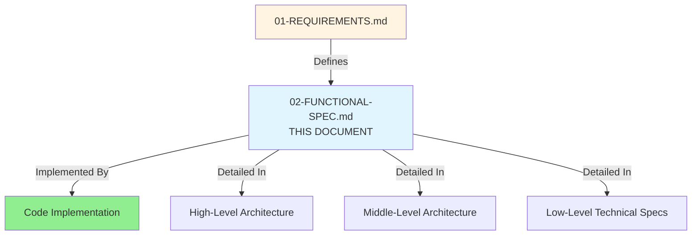

---

## System Context

### kube-proxy in Kubernetes Architecture

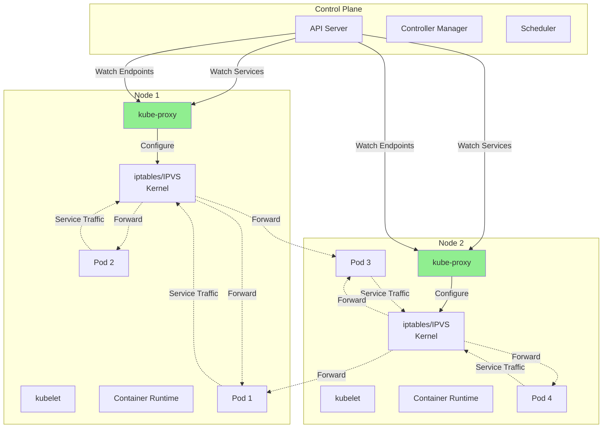

### Component Interactions

| Component | Interaction | Purpose |
|-----------|-------------|---------|
| **API Server** | Watch Services, Endpoints, EndpointSlices | kube-proxy gets Service/Endpoint updates |
| **CoreDNS** | None (indirect via ClusterIP) | DNS resolves to ClusterIP, kube-proxy routes ClusterIP |
| **kubelet** | None (runs as DaemonSet Pod) | kubelet manages kube-proxy Pod lifecycle |
| **CNI Plugin** | None (uses result) | CNI sets up Pod networking, kube-proxy uses it |
| **Cloud Controller** | None (indirect via LoadBalancer) | Cloud controller provisions LB, kube-proxy handles NodePort |
| **Pods** | Packet forwarding | Pods send to Service IPs, kube-proxy routes to Pods |
| **iptables/IPVS** | Direct (kernel API) | kube-proxy configures kernel networking |

### Key Abstractions

**Service** → Stable IP and DNS name for set of Pods
**Endpoints/EndpointSlices** → Current list of Pod IPs backing a Service
**Proxier** → kube-proxy implementation for specific mode (iptables/IPVS/nftables)
**ServicePort** → Unique identifier for Service + Port + Protocol
**Backend/Real Server** → Individual Pod endpoint

---

## Functional Capabilities

### FC1: Service IP Management

**Capability**: kube-proxy provides stable IP addresses for Services that route to backend Pods.

**Detailed Specification**:

**1.1 ClusterIP Assignment**

When a ClusterIP Service is created, Kubernetes API Server assigns a ClusterIP from the service CIDR range. kube-proxy's role is to ensure this IP is routable.

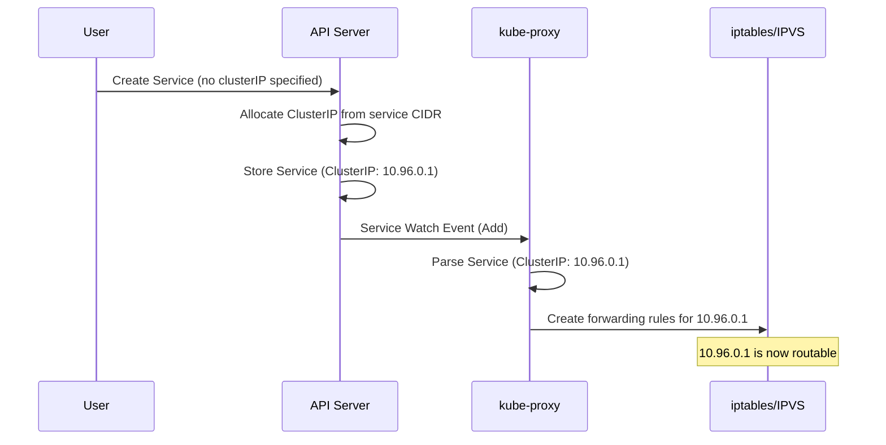

**Behavior**:

- ✅ kube-proxy does NOT assign ClusterIPs (API Server does)
- ✅ kube-proxy creates routing rules for assigned ClusterIP
- ✅ Multiple Services can have different ClusterIPs
- ✅ One Service can have multiple ports on same ClusterIP
- ✅ ClusterIP persists across Pod changes
- ✅ ClusterIP is removed when Service is deleted

**iptables Implementation**:

```bash
# ClusterIP: 10.96.0.1:80 → Pods
-A KUBE-SERVICES -d 10.96.0.1/32 -p tcp -m tcp --dport 80 -j KUBE-SVC-<hash>

# Service chain distributes to endpoints
-A KUBE-SVC-<hash> -m statistic --mode random --probability 0.5 -j KUBE-SEP-<ep1>
-A KUBE-SVC-<hash> -j KUBE-SEP-<ep2>

# Endpoint chains do DNAT
-A KUBE-SEP-<ep1> -j DNAT --to-destination 10.1.2.3:8080
-A KUBE-SEP-<ep2> -j DNAT --to-destination 10.1.2.4:8080
```

**IPVS Implementation**:

```bash
# Create virtual server for ClusterIP
ipvsadm -A -t 10.96.0.1:80 -s rr

# Add real servers (endpoints)
ipvsadm -a -t 10.96.0.1:80 -r 10.1.2.3:8080 -m
ipvsadm -a -t 10.96.0.1:80 -r 10.1.2.4:8080 -m
```

**1.2 IP Uniqueness**

Each ClusterIP is unique within the cluster:

- ✅ API Server ensures no two Services have same ClusterIP
- ✅ kube-proxy creates separate rules for each ClusterIP
- ✅ Port numbers can overlap if ClusterIPs differ

**Example**:

```yaml
# Service 1
apiVersion: v1
kind: Service
metadata:
  name: service-a
spec:
  clusterIP: 10.96.0.1
  ports:
  - port: 80    # 10.96.0.1:80
---
# Service 2
apiVersion: v1
kind: Service
metadata:
  name: service-b
spec:
  clusterIP: 10.96.0.2
  ports:
  - port: 80    # 10.96.0.2:80 (same port, different IP - OK)
```

**1.3 Multi-Port Services**

Services can expose multiple ports on the same ClusterIP:

```yaml
apiVersion: v1
kind: Service
metadata:
  name: multi-port
spec:
  clusterIP: 10.96.0.1
  ports:
  - name: http
    port: 80
    targetPort: 8080
  - name: https
    port: 443
    targetPort: 8443
  - name: metrics
    port: 9090
    targetPort: 9090
```

**kube-proxy creates separate rules for each port**:

```bash
# iptables
-A KUBE-SERVICES -d 10.96.0.1/32 -p tcp -m tcp --dport 80 -j KUBE-SVC-HTTP
-A KUBE-SERVICES -d 10.96.0.1/32 -p tcp -m tcp --dport 443 -j KUBE-SVC-HTTPS
-A KUBE-SERVICES -d 10.96.0.1/32 -p tcp -m tcp --dport 9090 -j KUBE-SVC-METRICS

# IPVS
ipvsadm -A -t 10.96.0.1:80 -s rr
ipvsadm -A -t 10.96.0.1:443 -s rr
ipvsadm -A -t 10.96.0.1:9090 -s rr
```

**1.4 Protocol Support**

kube-proxy supports TCP, UDP, and SCTP:

```yaml
apiVersion: v1
kind: Service
metadata:
  name: multi-protocol
spec:
  clusterIP: 10.96.0.1
  ports:
  - name: dns-tcp
    port: 53
    protocol: TCP
  - name: dns-udp
    port: 53
    protocol: UDP
  - name: sctp
    port: 9999
    protocol: SCTP
```

**kube-proxy creates protocol-specific rules**:

```bash
# iptables
-A KUBE-SERVICES -d 10.96.0.1/32 -p tcp -m tcp --dport 53 -j KUBE-SVC-DNS-TCP
-A KUBE-SERVICES -d 10.96.0.1/32 -p udp -m udp --dport 53 -j KUBE-SVC-DNS-UDP
-A KUBE-SERVICES -d 10.96.0.1/32 -p sctp -m sctp --dport 9999 -j KUBE-SVC-SCTP

# IPVS
ipvsadm -A -t 10.96.0.1:53 -s rr    # TCP
ipvsadm -A -u 10.96.0.1:53 -s rr    # UDP
ipvsadm -A -o 10.96.0.1:9999 -s rr  # SCTP (if kernel supports)
```

**Code References**:

- `pkg/proxy/serviceport.go:48-80` - ServicePortName definition
- `pkg/proxy/iptables/proxier.go:650-750` - ClusterIP rule generation
- `pkg/proxy/ipvs/proxier.go:750-850` - IPVS virtual server creation

---

### FC2: Traffic Forwarding

**Capability**: kube-proxy forwards packets destined for Service IPs to appropriate backend Pod endpoints.

**Detailed Specification**:

**2.1 Destination NAT (DNAT)**

kube-proxy changes the destination IP and port of packets from Service IP to Pod IP:

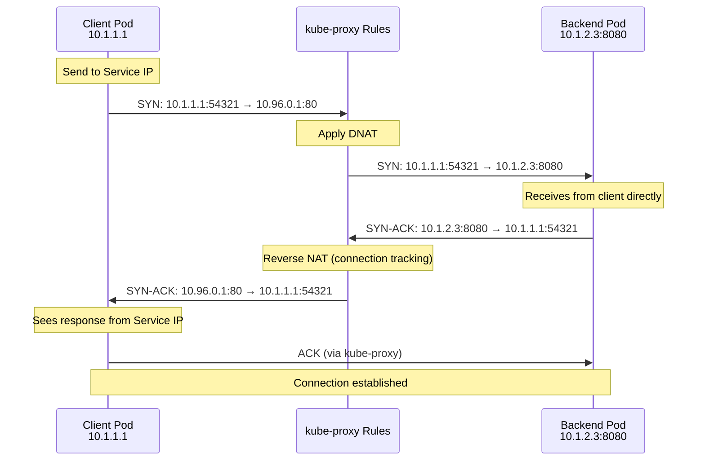

**Key Points**:

- ✅ Client sees source: Client IP, destination: Service IP
- ✅ Backend sees source: Client IP, destination: Pod IP
- ✅ Response is reverse-NATed (Service IP → Pod IP becomes Pod IP → Service IP)
- ✅ Connection tracking maintains state for bidirectional NAT

**iptables DNAT**:

```bash
# DNAT rule
-A KUBE-SEP-XXXXX -p tcp -m tcp -j DNAT --to-destination 10.1.2.3:8080

# Connection tracking maintains reverse mapping
# Kernel automatically does reverse NAT on response packets
```

**IPVS DNAT**:

```bash
# IPVS automatically handles DNAT
ipvsadm -a -t 10.96.0.1:80 -r 10.1.2.3:8080 -m  # -m: masquerade/NAT mode
```

**2.2 Source NAT (SNAT) / Masquerading**

In some scenarios, kube-proxy also changes the source IP:

**Scenario 1: ExternalTrafficPolicy: Cluster** (default for external traffic)

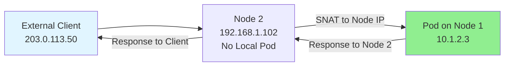

**Packet Flow**:

```
# Inbound (client → service)
203.0.113.50:12345 → 203.0.113.100:80 (LB IP)
→ 192.168.1.102:30080 (NodePort on Node 2)
→ [DNAT] 192.168.1.102:30080 → 10.1.2.3:8080
→ [SNAT] 192.168.1.102:random → 10.1.2.3:8080

# Backend sees
192.168.1.102:random → 10.1.2.3:8080

# Outbound (response)
10.1.2.3:8080 → 192.168.1.102:random
→ [Reverse SNAT] 10.1.2.3:8080 → 203.0.113.50:12345
```

**Why SNAT?** Backend Pod on Node 1 needs to send response to Node 2, which then sends to client. Without SNAT, Pod would try to send directly to client, bypassing Node 2 and breaking connection tracking.

**iptables SNAT Rules**:

```bash
# Mark packets needing masquerade
-A KUBE-SERVICES ! -s 10.0.0.0/8 -d 10.96.0.1/32 -p tcp --dport 80 -j KUBE-MARK-MASQ

# KUBE-MARK-MASQ sets mark
-A KUBE-MARK-MASQ -j MARK --set-mark 0x4000

# POSTROUTING masquerades marked packets
-A KUBE-POSTROUTING -m mark --mark 0x4000/0x4000 -j MASQUERADE
```

**Scenario 2: ExternalTrafficPolicy: Local**

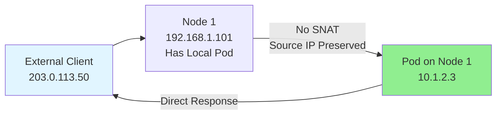

**Packet Flow**:

```
# Inbound
203.0.113.50:12345 → 203.0.113.100:80
→ 192.168.1.101:30080
→ [DNAT only] 192.168.1.101:30080 → 10.1.2.3:8080
→ 203.0.113.50:12345 → 10.1.2.3:8080

# Backend sees real client IP
203.0.113.50:12345 → 10.1.2.3:8080

# Outbound (response goes directly)
10.1.2.3:8080 → 203.0.113.50:12345
```

**Why No SNAT?** Pod and NodePort are on same node. Response can go directly without breaking routing.

**2.3 Port Mapping**

kube-proxy maps Service port to targetPort:

```yaml
apiVersion: v1
kind: Service
metadata:
  name: webapp
spec:
  ports:
  - port: 80          # Service port
    targetPort: 8080  # Pod port
```

**Forwarding**:
```
Client → 10.96.0.1:80 → [DNAT] → 10.1.2.3:8080
```

**Named Target Ports**:

```yaml
# Service
ports:
- port: 80
  targetPort: http  # Named port

# Pod
containers:
- name: webapp
  ports:
  - name: http
    containerPort: 8080
```

**kube-proxy resolves named port** by looking at Pod spec, then creates DNAT to actual port number (8080).

**2.4 Traffic Classes**

kube-proxy handles different traffic classes:

| Traffic Class | Source | Destination | SNAT Required? |
|---------------|--------|-------------|----------------|
| **Pod → ClusterIP** | Pod | Service ClusterIP | No (usually) |
| **Pod → NodePort (local)** | Pod | localhost:NodePort | No |
| **Pod → NodePort (remote)** | Pod | OtherNode:NodePort | No |
| **Node → ClusterIP** | Node process | Service ClusterIP | No |
| **External → NodePort** | External | NodeIP:NodePort | Depends on policy |
| **External → LoadBalancer** | External | LB IP → NodePort | Depends on policy |
| **Hairpin (Pod → Self via Service)** | Pod | Service → Same Pod | Yes (masquerade) |

**Hairpin NAT** (special case):

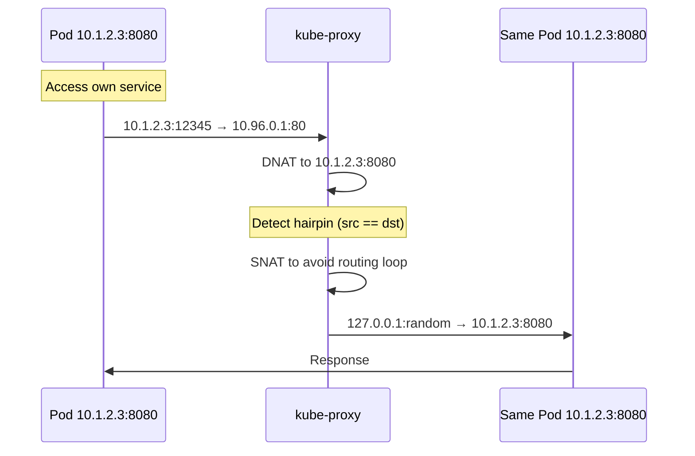

**Code References**:

- `pkg/proxy/iptables/proxier.go:850-1000` - DNAT rule generation
- `pkg/proxy/iptables/proxier.go:1000-1100` - SNAT/masquerade rules
- `pkg/proxy/ipvs/proxier.go:900-1000` - IPVS forwarding method (NAT/masquerade)

---

### FC3: Load Distribution

**Capability**: kube-proxy distributes traffic across multiple backend Pod endpoints using load balancing algorithms.

**Detailed Specification**:

**3.1 Load Balancing Algorithms by Mode**

**iptables Mode: Probability-Based Random**

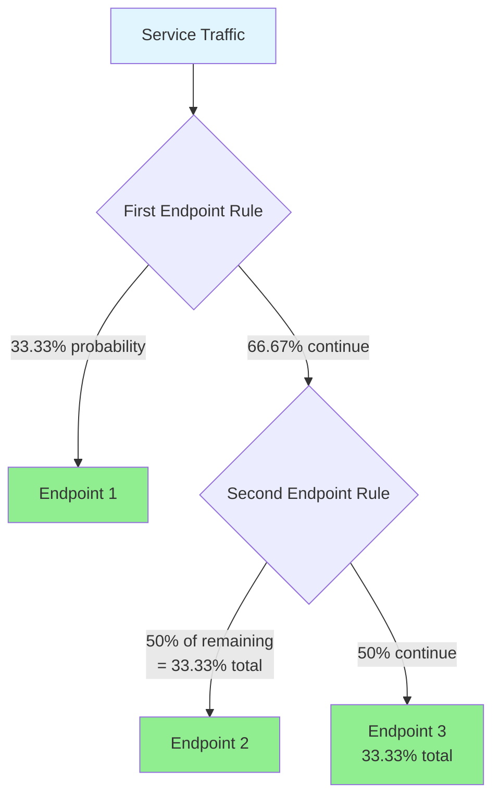

**iptables Rules** (3 endpoints):

```bash
# Service chain
-A KUBE-SVC-XXXXX -m statistic --mode random --probability 0.33333 -j KUBE-SEP-EP1
-A KUBE-SVC-XXXXX -m statistic --mode random --probability 0.50000 -j KUBE-SEP-EP2
-A KUBE-SVC-XXXXX -j KUBE-SEP-EP3
```

**Probability Calculation**:

```
Endpoints: [EP1, EP2, EP3]
EP1 probability: 1/3 = 0.33333
EP2 probability: 1/2 (of remaining 2/3) = 0.50000
EP3 probability: 1/1 (remaining) = 1.00000 (unconditional jump)

Result: Each endpoint gets ~33.33% of traffic
```

**General Formula** for n endpoints:

```
Rule 1: probability = 1/n
Rule 2: probability = 1/(n-1)
Rule 3: probability = 1/(n-2)
...
Rule n: unconditional jump
```

**Characteristics**:

- ✅ Stateless (no connection tracking for LB)
- ✅ Statistical distribution (not strict round-robin)
- ✅ Fast for small endpoint counts (< 10)
- ✅ Slow for large endpoint counts (> 100) - O(n) rule evaluation

**IPVS Mode: Configurable Schedulers**

IPVS supports multiple scheduling algorithms:

| Scheduler | Name | Description | Use Case |
|-----------|------|-------------|----------|
| **rr** | Round-Robin | Distribute equally, cyclically | General purpose, default |
| **lc** | Least Connection | Send to server with fewest connections | Varying request durations |
| **wrr** | Weighted Round-Robin | Distribute based on weights | Heterogeneous backends |
| **wlc** | Weighted Least Connection | Least connection + weights | Varying load + capacity |
| **sh** | Source Hashing | Hash source IP to same backend | Session affinity |
| **dh** | Destination Hashing | Hash destination to same backend | Cache affinity |
| **sed** | Shortest Expected Delay | (Weighted LC variant) | Minimize latency |
| **nq** | Never Queue | Distribute to idle server | Avoid queuing |

**Example - Round-Robin**:

```bash
# Create virtual server with rr scheduler
ipvsadm -A -t 10.96.0.1:80 -s rr

# Add real servers
ipvsadm -a -t 10.96.0.1:80 -r 10.1.2.3:8080 -m
ipvsadm -a -t 10.96.0.1:80 -r 10.1.2.4:8080 -m
ipvsadm -a -t 10.96.0.1:80 -r 10.1.2.5:8080 -m
```

**Behavior**:
```
Request 1 → EP1
Request 2 → EP2
Request 3 → EP3
Request 4 → EP1
Request 5 → EP2
...
```

**Example - Weighted Round-Robin**:

```bash
ipvsadm -A -t 10.96.0.1:80 -s wrr

# Different weights
ipvsadm -a -t 10.96.0.1:80 -r 10.1.2.3:8080 -m -w 100  # 2x capacity
ipvsadm -a -t 10.96.0.1:80 -r 10.1.2.4:8080 -m -w 50   # 1x capacity
ipvsadm -a -t 10.96.0.1:80 -r 10.1.2.5:8080 -m -w 50   # 1x capacity
```

**Behavior** (weights 100:50:50):
```
Request 1 → EP1
Request 2 → EP1
Request 3 → EP2
Request 4 → EP3
Request 5 → EP1
Request 6 → EP1
Request 7 → EP2
Request 8 → EP3
...
```

**Example - Source Hashing** (for session affinity):

```bash
ipvsadm -A -t 10.96.0.1:80 -s sh

ipvsadm -a -t 10.96.0.1:80 -r 10.1.2.3:8080 -m
ipvsadm -a -t 10.96.0.1:80 -r 10.1.2.4:8080 -m
ipvsadm -a -t 10.96.0.1:80 -r 10.1.2.5:8080 -m
```

**Behavior**:
```
Client 203.0.113.10 → hash(203.0.113.10) % 3 = 0 → EP1 (always)
Client 203.0.113.20 → hash(203.0.113.20) % 3 = 1 → EP2 (always)
Client 203.0.113.30 → hash(203.0.113.30) % 3 = 2 → EP3 (always)
```

**Characteristics**:

- ✅ O(1) lookup with hash table
- ✅ Connection-aware (lc, wlc)
- ✅ Advanced algorithms
- ✅ Excellent performance at scale

**Configuration**:

```yaml
# kube-proxy ConfigMap
apiVersion: v1
kind: ConfigMap
metadata:
  name: kube-proxy
  namespace: kube-system
data:
  config.conf: |
    mode: ipvs
    ipvs:
      scheduler: rr  # or lc, wrr, wlc, sh, dh, sed, nq
```

**3.2 Endpoint Weight Management**

**iptables**: No native weight support. All endpoints have equal probability.

**IPVS**: Supports weights per endpoint.

**kube-proxy weight assignment**:

Currently, kube-proxy assigns **equal weight** (100) to all endpoints in IPVS mode. Future enhancements may support:

- Pod resource requests/limits as weights
- Custom endpoint weights via annotations
- Topology-aware weights

**3.3 Endpoint Exclusion**

kube-proxy excludes endpoints from load balancing based on status:

| Endpoint Condition | Included in LB? | Reason |
|--------------------|-----------------|--------|
| **Ready** | ✅ Yes | Healthy and ready |
| **NotReady** | ❌ No | Failing readiness probe |
| **Terminating** | ❌ No (new connections) | Pod is shutting down |
| **Terminating + Serving** | ✅ Yes (if configured) | Graceful termination support (1.26+) |

**Example EndpointSlice**:

```yaml
apiVersion: discovery.k8s.io/v1
kind: EndpointSlice
metadata:
  name: my-service-abc
endpoints:
- addresses: ["10.1.2.3"]
  conditions:
    ready: true      # ✅ Included
    serving: true
    terminating: false
- addresses: ["10.1.2.4"]
  conditions:
    ready: false     # ❌ Excluded
    serving: false
    terminating: false
- addresses: ["10.1.2.5"]
  conditions:
    ready: false     # ❌ Excluded (unless serving endpoints enabled)
    serving: true
    terminating: true
```

**Code References**:

- `pkg/proxy/iptables/proxier.go:1150-1250` - Probability-based load balancing
- `pkg/proxy/ipvs/proxier.go:1050-1150` - IPVS scheduler selection
- `pkg/proxy/endpoints changetracker.go:100-200` - Endpoint filtering

---

### FC4: Endpoint Synchronization

**Capability**: kube-proxy continuously synchronizes network rules with the current set of Service endpoints from the Kubernetes API.

**Detailed Specification**:

**4.1 Watch Mechanism**

kube-proxy watches three API resources:

1. **Services** - For ClusterIP, ports, service type changes
2. **Endpoints** - Legacy endpoint lists (deprecated)
3. **EndpointSlices** - Current scalable endpoint representation

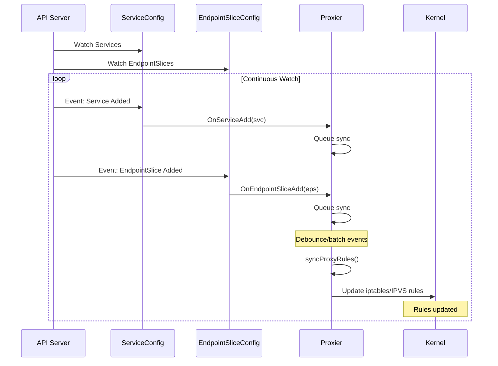

**Watch Setup** (simplified):

```go
// cmd/kube-proxy/app/server.go

// Service watch
serviceInformer.Informer().AddEventHandler(cache.ResourceEventHandlerFuncs{
    AddFunc:    func(obj interface{}) { proxier.OnServiceAdd(obj.(*v1.Service)) },
    UpdateFunc: func(old, new interface{}) { proxier.OnServiceUpdate(old, new) },
    DeleteFunc: func(obj interface{}) { proxier.OnServiceDelete(obj.(*v1.Service)) },
})

// EndpointSlice watch
endpointSliceInformer.Informer().AddEventHandler(cache.ResourceEventHandlerFuncs{
    AddFunc:    func(obj interface{}) { proxier.OnEndpointSliceAdd(obj) },
    UpdateFunc: func(old, new interface{}) { proxier.OnEndpointSliceUpdate(old, new) },
    DeleteFunc: func(obj interface{}) { proxier.OnEndpointSliceDelete(obj) },
})
```

**4.2 Change Detection**

kube-proxy tracks changes to avoid unnecessary syncs:

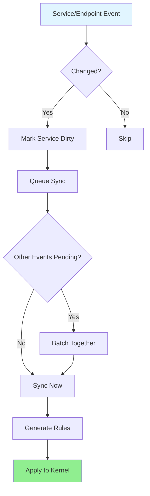

**ServiceChangeTracker**:

```go
// pkg/proxy/servicechangetracker.go

type ServiceChangeTracker struct {
    items map[types.NamespacedName]*serviceChange
    // ...
}

// Update returns true if service changed
func (sct *ServiceChangeTracker) Update(previous, current *v1.Service) bool {
    // Detect relevant changes (ClusterIP, ports, endpoints, etc.)
    if previous == nil {
        // Service added
        return true
    }
    if current == nil {
        // Service deleted
        return true
    }
    // Check if ClusterIP, ports, or relevant fields changed
    if previous.Spec.ClusterIP != current.Spec.ClusterIP {
        return true
    }
    if !reflect.DeepEqual(previous.Spec.Ports, current.Spec.Ports) {
        return true
    }
    // ... more checks
    return false
}
```

**EndpointsChangeTracker**:

Similar tracking for endpoint changes:

```go
// pkg/proxy/endpointschangetracker.go

type EndpointsChangeTracker struct {
    items map[types.NamespacedName]*endpointsChange
    // ...
}

// EndpointSliceUpdate detects changes in endpoint addresses, ports, readiness
func (ect *EndpointsChangeTracker) EndpointSliceUpdate(endpointSlice *discovery.EndpointSlice, removeSlice bool) bool {
    // Detect endpoint additions, removals, status changes
    // ...
}
```

**4.3 Sync Triggers**

Sync can be triggered by:

1. **Event-driven**: Service/Endpoint change event
2. **Periodic**: Full resync every `syncPeriod` (default: 30s)
3. **Manual**: /healthz check or operator trigger

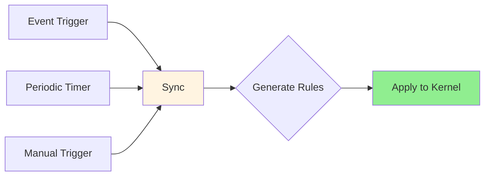

**Sync Loop**:

```go
// pkg/proxy/iptables/proxier.go - Simplified

func (proxier *Proxier) SyncLoop() {
    // Periodic sync ticker
    ticker := time.NewTicker(proxier.syncPeriod)
    defer ticker.Stop()

    for {
        select {
        case <-ticker.C:
            // Periodic full sync
            proxier.Sync()

        case <-proxier.syncTrigger:
            // Event-driven sync
            proxier.Sync()
        }
    }
}

func (proxier *Proxier) Sync() {
    proxier.mu.Lock()
    defer proxier.mu.Unlock()

    proxier.syncProxyRules()
}
```

**4.4 Batching and Debouncing**

To avoid excessive syncs during rapid changes (e.g., rolling update), kube-proxy batches events:

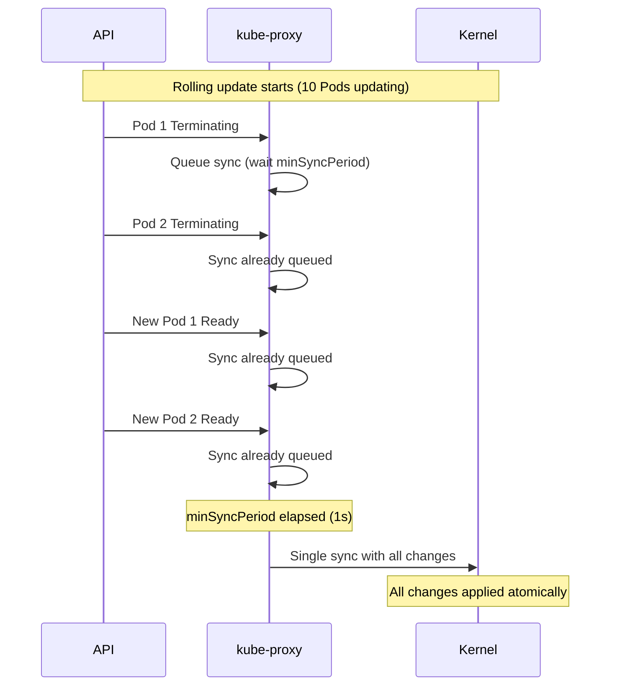

**Configuration**:

```yaml
# kube-proxy config
syncPeriod: 30s        # Full resync interval
minSyncPeriod: 1s      # Minimum time between syncs (debouncing)
```

**4.5 Endpoints vs EndpointSlices**

**Endpoints** (Legacy):

```yaml
apiVersion: v1
kind: Endpoints
metadata:
  name: my-service
subsets:
- addresses:
  - ip: 10.1.2.3
  - ip: 10.1.2.4
  - ip: 10.1.2.5
  # ... all endpoints in one object
  ports:
  - port: 8080
```

**Problems**:
- Large object size (1000+ endpoints = 100KB+)
- Full object sent on any endpoint change
- High network bandwidth for large services
- kube-proxy watches one large object

**EndpointSlices** (Current):

```yaml
apiVersion: discovery.k8s.io/v1
kind: EndpointSlice
metadata:
  name: my-service-abc
  labels:
    kubernetes.io/service-name: my-service
addressType: IPv4
endpoints:
- addresses: ["10.1.2.3"]
  conditions: {ready: true}
  # ... ~100 endpoints per slice
ports:
- port: 8080
---
apiVersion: discovery.k8s.io/v1
kind: EndpointSlice
metadata:
  name: my-service-def
  labels:
    kubernetes.io/service-name: my-service
endpoints:
- addresses: ["10.1.2.4"]
  # ... next 100 endpoints
```

**Benefits**:
- Fixed object size (~100 endpoints/slice)
- Only changed slices sent on updates
- Lower network bandwidth
- Better scalability

**kube-proxy Support**:

- **Endpoints**: Supported (deprecated)
- **EndpointSlices**: Preferred (default in 1.21+)
- Can be configured via `--feature-gates=EndpointSlice=true`

**Code References**:

- `pkg/proxy/config/config.go:50-250` - Watch setup
- `pkg/proxy/servicechangetracker.go` - Service change detection
- `pkg/proxy/endpointschangetracker.go` - Endpoints change detection
- `pkg/proxy/endpointslicecache.go` - EndpointSlice caching and aggregation
- `pkg/proxy/iptables/proxier.go:400-500` - Sync loop

---

### FC5: Service Type Implementation

**Capability**: kube-proxy implements all Kubernetes Service types with appropriate networking behavior.

**Detailed Specification**:

**5.1 ClusterIP Service**

**Behavior**: Service accessible only from within cluster via stable ClusterIP.

**Example**:

```yaml
apiVersion: v1
kind: Service
metadata:
  name: backend
  namespace: default
spec:
  type: ClusterIP  # Default
  clusterIP: 10.96.0.1  # Auto-assigned if omitted
  selector:
    app: backend
  ports:
  - port: 80
    targetPort: 8080
    protocol: TCP
```

**kube-proxy Implementation**:

```bash
# iptables mode
-A KUBE-SERVICES -d 10.96.0.1/32 -p tcp -m tcp --dport 80 -j KUBE-SVC-<hash>
-A KUBE-SVC-<hash> -m statistic --mode random --probability 0.5 -j KUBE-SEP-<ep1>
-A KUBE-SVC-<hash> -j KUBE-SEP-<ep2>
-A KUBE-SEP-<ep1> -j DNAT --to-destination 10.1.2.3:8080
-A KUBE-SEP-<ep2> -j DNAT --to-destination 10.1.2.4:8080

# IPVS mode
ipvsadm -A -t 10.96.0.1:80 -s rr
ipvsadm -a -t 10.96.0.1:80 -r 10.1.2.3:8080 -m
ipvsadm -a -t 10.96.0.1:80 -r 10.1.2.4:8080 -m
```

**Access**:

```bash
# From any Pod in cluster
curl http://10.96.0.1:80
curl http://backend.default.svc.cluster.local:80
```

**5.2 NodePort Service**

**Behavior**: Service accessible on static port on every node's IP.

**Example**:

```yaml
apiVersion: v1
kind: Service
metadata:
  name: webapp
spec:
  type: NodePort
  selector:
    app: webapp
  ports:
  - port: 80          # ClusterIP port
    targetPort: 8080  # Pod port
    nodePort: 30080   # NodePort (30000-32767 range)
```

**kube-proxy Implementation**:

```bash
# iptables mode

# ClusterIP rules (same as ClusterIP service)
-A KUBE-SERVICES -d 10.96.0.1/32 -p tcp -m tcp --dport 80 -j KUBE-SVC-<hash>

# NodePort rules (accessible on any node IP)
-A KUBE-SERVICES -m addrtype --dst-type LOCAL -j KUBE-NODEPORTS
-A KUBE-NODEPORTS -p tcp -m tcp --dport 30080 -j KUBE-SVC-<hash>

# Service chain (shared by ClusterIP and NodePort)
-A KUBE-SVC-<hash> -m statistic --mode random --probability 0.5 -j KUBE-SEP-<ep1>
-A KUBE-SVC-<hash> -j KUBE-SEP-<ep2>

# Mark for masquerade (external traffic)
-A KUBE-NODEPORTS -p tcp -m tcp --dport 30080 -j KUBE-MARK-MASQ

# Endpoints
-A KUBE-SEP-<ep1> -j DNAT --to-destination 10.1.2.3:8080
-A KUBE-SEP-<ep2> -j DNAT --to-destination 10.1.2.4:8080

# IPVS mode
# ClusterIP virtual server
ipvsadm -A -t 10.96.0.1:80 -s rr
ipvsadm -a -t 10.96.0.1:80 -r 10.1.2.3:8080 -m
ipvsadm -a -t 10.96.0.1:80 -r 10.1.2.4:8080 -m

# NodePort virtual server (on all node IPs)
ipvsadm -A -t 192.168.1.101:30080 -s rr  # Node 1 IP
ipvsadm -a -t 192.168.1.101:30080 -r 10.1.2.3:8080 -m
ipvsadm -a -t 192.168.1.101:30080 -r 10.1.2.4:8080 -m

ipvsadm -A -t 192.168.1.102:30080 -s rr  # Node 2 IP
ipvsadm -a -t 192.168.1.102:30080 -r 10.1.2.3:8080 -m
ipvsadm -a -t 192.168.1.102:30080 -r 10.1.2.4:8080 -m
```

**Access**:

```bash
# Internal (ClusterIP)
curl http://10.96.0.1:80

# External (any node IP + NodePort)
curl http://192.168.1.101:30080  # Node 1
curl http://192.168.1.102:30080  # Node 2
curl http://192.168.1.103:30080  # Node 3
```

**NodePort Allocation**:

- **Range**: 30000-32767 (default, configurable)
- **Auto-assignment**: If `nodePort` omitted, auto-allocated from range
- **Manual assignment**: Specify `nodePort` (must be in range and not in use)

**5.3 LoadBalancer Service**

**Behavior**: Provisions external cloud load balancer (via cloud controller manager) and exposes NodePort.

**Example**:

```yaml
apiVersion: v1
kind: Service
metadata:
  name: public-webapp
spec:
  type: LoadBalancer
  selector:
    app: webapp
  ports:
  - port: 80
    targetPort: 8080
```

**Lifecycle**:

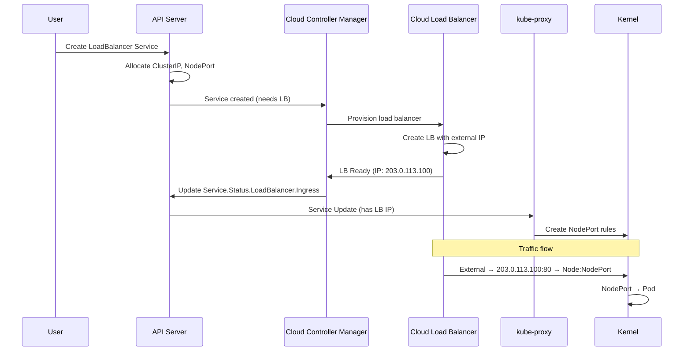

**Service Status**:

```yaml
status:
  loadBalancer:
    ingress:
    - ip: 203.0.113.100  # External LB IP (provisioned by cloud)
```

**kube-proxy Implementation**:

kube-proxy treats LoadBalancer service **same as NodePort** for rules. Cloud load balancer is external:

```bash
# Same iptables rules as NodePort
-A KUBE-NODEPORTS -p tcp -m tcp --dport 30080 -j KUBE-SVC-<hash>

# Cloud LB configured separately (by cloud controller):
# - Frontend: 203.0.113.100:80
# - Backend: NodeIP1:30080, NodeIP2:30080, NodeIP3:30080
```

**Traffic Flow**:

```
External Client
  ↓
Cloud Load Balancer (203.0.113.100:80)
  ↓
Node IP:NodePort (192.168.1.101:30080)
  ↓
kube-proxy rules
  ↓
Pod (10.1.2.3:8080)
```

**Access**:

```bash
# External (via cloud LB)
curl http://203.0.113.100:80

# Internal (ClusterIP)
curl http://10.96.0.1:80

# Direct NodePort
curl http://192.168.1.101:30080
```

**5.4 ExternalName Service**

**Behavior**: DNS CNAME to external service. **No kube-proxy involvement**.

**Example**:

```yaml
apiVersion: v1
kind: Service
metadata:
  name: external-database
spec:
  type: ExternalName
  externalName: db.example.com  # External DNS name
```

**DNS Resolution** (handled by CoreDNS, not kube-proxy):

```
external-database.default.svc.cluster.local
  ↓ (CNAME)
db.example.com
  ↓ (A record)
203.0.113.50
```

**kube-proxy Implementation**: **None**. No ClusterIP, no forwarding rules.

**Access**:

```bash
# Application uses service name
curl http://external-database.default.svc.cluster.local:5432

# CoreDNS resolves to external DNS
# Connection goes directly to external service (no kube-proxy)
```

**5.5 Headless Service (ClusterIP: None)**

**Behavior**: DNS returns Pod IPs directly. **No kube-proxy load balancing**.

**Example**:

```yaml
apiVersion: v1
kind: Service
metadata:
  name: statefulset-svc
spec:
  clusterIP: None  # Headless
  selector:
    app: postgres
  ports:
  - port: 5432
```

**DNS Resolution** (CoreDNS):

```
statefulset-svc.default.svc.cluster.local
  ↓ (A records)
10.1.2.3 (Pod 1)
10.1.2.4 (Pod 2)
10.1.2.5 (Pod 3)
```

**kube-proxy Implementation**: **None**. No ClusterIP, no forwarding rules.

**Use Cases**:

- **StatefulSets**: Direct Pod addressing (postgres-0, postgres-1, etc.)
- **Custom load balancing**: Application implements its own LB logic
- **Service discovery only**: Just need to discover Pod IPs

**Access**:

```bash
# DNS returns all Pod IPs
dig statefulset-svc.default.svc.cluster.local

# Application connects directly to Pod IPs
# No kube-proxy involvement
```

**5.6 ExternalIPs**

**Behavior**: Expose service on user-specified external IPs.

**Example**:

```yaml
apiVersion: v1
kind: Service
metadata:
  name: custom-external
spec:
  clusterIP: 10.96.0.1
  externalIPs:
  - 203.0.113.10  # User-managed IP
  - 203.0.113.11
  selector:
    app: webapp
  ports:
  - port: 80
    targetPort: 8080
```

**kube-proxy Implementation**:

```bash
# iptables mode

# ClusterIP rule
-A KUBE-SERVICES -d 10.96.0.1/32 -p tcp -m tcp --dport 80 -j KUBE-SVC-<hash>

# ExternalIP rules
-A KUBE-SERVICES -d 203.0.113.10/32 -p tcp -m tcp --dport 80 -j KUBE-SVC-<hash>
-A KUBE-SERVICES -d 203.0.113.11/32 -p tcp -m tcp --dport 80 -j KUBE-SVC-<hash>

# Mark for masquerade
-A KUBE-SERVICES -d 203.0.113.10/32 -p tcp -m tcp --dport 80 -j KUBE-MARK-MASQ
-A KUBE-SERVICES -d 203.0.113.11/32 -p tcp -m tcp --dport 80 -j KUBE-MARK-MASQ

# Shared service chain
-A KUBE-SVC-<hash> -m statistic --mode random --probability 0.5 -j KUBE-SEP-<ep1>
-A KUBE-SVC-<hash> -j KUBE-SEP-<ep2>

# IPVS mode
ipvsadm -A -t 10.96.0.1:80 -s rr  # ClusterIP
ipvsadm -A -t 203.0.113.10:80 -s rr  # ExternalIP 1
ipvsadm -A -t 203.0.113.11:80 -s rr  # ExternalIP 2

# Same real servers for all
ipvsadm -a -t 10.96.0.1:80 -r 10.1.2.3:8080 -m
ipvsadm -a -t 203.0.113.10:80 -r 10.1.2.3:8080 -m
ipvsadm -a -t 203.0.113.11:80 -r 10.1.2.3:8080 -m
# ... (repeat for all endpoints)
```

**Access**:

```bash
# Internal (ClusterIP)
curl http://10.96.0.1:80

# External (externalIPs)
curl http://203.0.113.10:80
curl http://203.0.113.11:80
```

**Important**: User is responsible for routing external IPs to cluster nodes (via BGP, static routes, etc.). kube-proxy only creates forwarding rules.

**Code References**:

- `pkg/proxy/iptables/proxier.go:650-950` - Service type rule generation
- `pkg/proxy/ipvs/proxier.go:750-1050` - IPVS service type handling
- `cmd/kube-proxy/app/server.go:200-300` - Service type detection

---

## Summary

This functional specification defines the **comprehensive behavior** of kube-proxy across all operational scenarios. Key takeaways:

**Core Capabilities**:
- **FC1**: Service IP management (ClusterIP allocation and routing)
- **FC2**: Traffic forwarding (DNAT, SNAT, port mapping)
- **FC3**: Load distribution (iptables probability, IPVS schedulers)
- **FC4**: Endpoint synchronization (watch, change detection, batching)
- **FC5**: Service type implementation (ClusterIP, NodePort, LoadBalancer, ExternalName, Headless, ExternalIPs)
- **FC6**: Traffic policy enforcement (ExternalTrafficPolicy, InternalTrafficPolicy)
- **FC7**: Session persistence (ClientIP session affinity)
- **FC8**: Health status reporting (/healthz, health check NodePort)
- **FC9**: Network rule management (iptables, IPVS, nftables)
- **FC10**: Metrics and telemetry (Prometheus metrics, structured logging)

**Proxy Modes**:
- **iptables**: O(n) performance, probability-based LB, mature and stable
- **IPVS**: O(1) performance, advanced schedulers, best for large scale
- **nftables**: O(log n) performance, modern replacement, beta status
- **userspace**: Deprecated, do not use

**Service Types**:
- **ClusterIP**: Internal-only, stable IP
- **NodePort**: External access via node ports
- **LoadBalancer**: Cloud LB integration
- **ExternalName**: DNS CNAME (no proxying)
- **Headless**: No ClusterIP (DNS returns Pod IPs)
- **ExternalIPs**: User-specified external IPs

**Next Steps**:
- Read [high-level/02-proxy-modes.md](high-level/02-proxy-modes.md) for detailed mode comparison
- Read [middle-level/04-service-types.md](middle-level/04-service-types.md) for service type deep dive
- Read [low-level/06-packet-flow.md](low-level/06-packet-flow.md) for complete packet traces

**Related Documents**:
- [00-README.md](00-README.md) - Documentation navigation
- [01-REQUIREMENTS.md](01-REQUIREMENTS.md) - Requirements and design goals
- [GLOSSARY.md](GLOSSARY.md) - Terminology reference
- [high-level/01-system-overview.md](high-level/01-system-overview.md) - System overview
