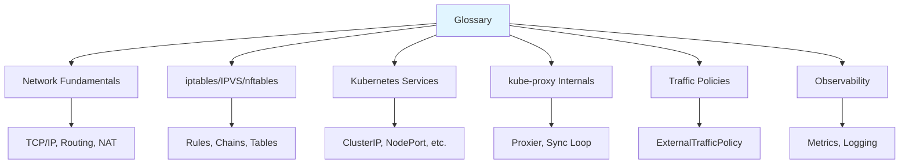
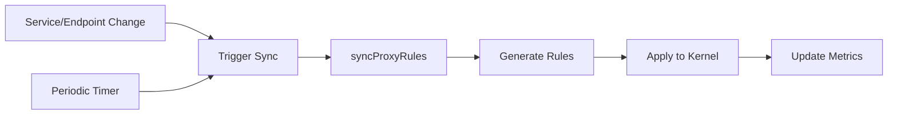

# kube-proxy Glossary

**Comprehensive terminology reference for kube-proxy and Kubernetes networking**

**Version**: Kubernetes 1.32+
**Last Updated**: 2024

---

## Table of Contents

- [Overview](#overview)
- [How to Use This Glossary](#how-to-use-this-glossary)
- [Quick Reference](#quick-reference)
- [Network Fundamentals](#network-fundamentals)
- [iptables Terms](#iptables-terms)
- [IPVS Terms](#ipvs-terms)
- [nftables Terms](#nftables-terms)
- [Connection Tracking (conntrack)](#connection-tracking-conntrack)
- [NAT Terms](#nat-terms)
- [Kubernetes Service Terms](#kubernetes-service-terms)
- [Kubernetes Endpoint Terms](#kubernetes-endpoint-terms)
- [kube-proxy Specific Terms](#kube-proxy-specific-terms)
- [Service Discovery Terms](#service-discovery-terms)
- [Traffic Policy Terms](#traffic-policy-terms)
- [Load Balancing Terms](#load-balancing-terms)
- [Health Checking Terms](#health-checking-terms)
- [Observability Terms](#observability-terms)
- [Performance Terms](#performance-terms)
- [Protocol Terms](#protocol-terms)
- [Linux Kernel Terms](#linux-kernel-terms)
- [Cloud Integration Terms](#cloud-integration-terms)
- [Acronyms and Abbreviations](#acronyms-and-abbreviations)

---

## Overview

This glossary provides **comprehensive definitions** for over 120 terms related to kube-proxy, Kubernetes networking, and Linux networking. Each term includes:

- **Clear definition**
- **Context** of usage
- **Related terms** (cross-references)
- **Code references** where applicable
- **Examples** for complex terms

### Terminology Categories



---

## How to Use This Glossary

### Finding Terms

1. **Alphabetical**: Terms within each category are alphabetically sorted
2. **Cross-references**: Look for "See:" and "See also:" links
3. **Search**: Use Ctrl+F / Cmd+F to search for specific terms

### Reading Definitions

**Format**:

**Term Name** (*Category*)

*Definition* - Clear explanation of the term.

**Context**: Where and how this term is used.

**Example**: Practical example (for complex terms).

**See also**: Related terms.

**Code**: Code references (for implementation-specific terms).

---

## Quick Reference

### Most Common Terms

| Term | Definition | Category |
|------|------------|----------|
| **ClusterIP** | Virtual IP address for Service, internal only | Service |
| **iptables** | Linux firewall and NAT system using netfilter | Network |
| **IPVS** | IP Virtual Server, kernel load balancer | Network |
| **kube-proxy** | Kubernetes network proxy on each node | kube-proxy |
| **Service** | Kubernetes abstraction for stable endpoint to Pods | Service |
| **Endpoint** | Pod IP and port backing a Service | Endpoint |
| **DNAT** | Destination NAT, changing destination IP/port | NAT |
| **SNAT** | Source NAT, changing source IP/port | NAT |
| **NodePort** | Static port on all nodes exposing a Service | Service |
| **Proxier** | kube-proxy implementation for a specific mode | kube-proxy |

### Common Abbreviations

| Abbreviation | Full Term |
|--------------|-----------|
| **CIDR** | Classless Inter-Domain Routing |
| **DNAT** | Destination Network Address Translation |
| **SNAT** | Source Network Address Translation |
| **LB** | Load Balancer |
| **EP** | Endpoint |
| **SVC** | Service |
| **NAT** | Network Address Translation |
| **IP** | Internet Protocol |
| **TCP** | Transmission Control Protocol |
| **UDP** | User Datagram Protocol |
| **SCTP** | Stream Control Transmission Protocol |
| **VIP** | Virtual IP |
| **VS** | Virtual Server (IPVS) |
| **RS** | Real Server (IPVS) |

---

## Network Fundamentals

### IP Address

**IP Address** (*Network*)

*Definition* - A unique numerical identifier assigned to each device on a network, enabling communication between devices.

**Context**: In Kubernetes, there are three main IP address spaces:
- **Pod IPs**: Assigned to Pods by CNI plugin
- **Service IPs (ClusterIPs)**: Assigned to Services from service CIDR
- **Node IPs**: Physical/virtual machine IPs

**Example**:
```
Pod IP: 10.1.2.3 (routable within cluster)
Service IP: 10.96.0.1 (virtual, handled by kube-proxy)
Node IP: 192.168.1.101 (physical network)
```

**See also**: ClusterIP, Pod, Node

---

### Port

**Port** (*Network*)

*Definition* - A 16-bit number (0-65535) identifying a specific process or service on a device.

**Context**: Services use ports to expose applications:
- **Service Port**: Port on the Service ClusterIP (e.g., 80)
- **Target Port**: Port on the Pod (e.g., 8080)
- **NodePort**: Port on the node for external access (30000-32767 range)

**Example**:
```yaml
Service:  10.96.0.1:80 (service port)
    ↓
Pod:      10.1.2.3:8080 (target port)
```

**See also**: ServicePort, TargetPort, NodePort

---

### Protocol

**Protocol** (*Network*)

*Definition* - A set of rules governing data transmission between devices.

**Context**: kube-proxy supports three main protocols:
- **TCP**: Connection-oriented, reliable (most common)
- **UDP**: Connectionless, fast (DNS, streaming)
- **SCTP**: Multi-streaming, reliable (specialized applications)

**Example**:
```yaml
ports:
- name: http
  port: 80
  protocol: TCP  # Default
- name: dns
  port: 53
  protocol: UDP
```

**See also**: TCP, UDP, SCTP

---

### TCP

**TCP** (*Protocol*)

*Definition* - Transmission Control Protocol, a connection-oriented protocol providing reliable, ordered delivery of data.

**Context**: Most Kubernetes Services use TCP (HTTP, HTTPS, database connections). kube-proxy creates stateful NAT rules for TCP connections.

**Characteristics**:
- Connection establishment (3-way handshake)
- Connection tracking (conntrack maintains state)
- Reliable delivery (acknowledgments, retransmission)

**See also**: Protocol, UDP, Connection Tracking

---

### UDP

**UDP** (*Protocol*)

*Definition* - User Datagram Protocol, a connectionless protocol for fast, unreliable data transmission.

**Context**: Used for DNS, video streaming, gaming. kube-proxy creates stateless or loosely-stateful NAT rules for UDP.

**Characteristics**:
- No connection establishment
- No delivery guarantee
- Lower overhead than TCP
- Connection tracking can track UDP "connections" based on recent packets

**Example**:
```yaml
# DNS Service
ports:
- name: dns
  port: 53
  protocol: UDP
```

**See also**: Protocol, TCP

---

### SCTP

**SCTP** (*Protocol*)

*Definition* - Stream Control Transmission Protocol, a multi-streaming reliable protocol.

**Context**: Rarely used in Kubernetes. Requires kernel support. Used in telecom applications.

**Characteristics**:
- Multi-streaming (multiple independent streams in one connection)
- Multi-homing (multiple IP addresses per endpoint)
- Message-oriented (preserves message boundaries)

**See also**: Protocol, TCP, UDP

---

### Routing

**Routing** (*Network*)

*Definition* - The process of selecting paths in a network to send packets from source to destination.

**Context**: Kubernetes relies on routing for:
- **Pod-to-Pod**: CNI plugin sets up routes
- **Pod-to-Service**: kube-proxy sets up NAT rules (not routing)
- **External-to-Service**: External router forwards to nodes, then kube-proxy NATs

**See also**: CNI, NAT

---

### Packet

**Packet** (*Network*)

*Definition* - A unit of data transmitted over a network, containing headers (source IP, destination IP, ports) and payload (data).

**Context**: kube-proxy modifies packet headers (DNAT, SNAT) to route Service traffic to Pods.

**Packet Flow Example**:
```
Original packet (client → service):
  Src: 10.1.1.1:54321
  Dst: 10.96.0.1:80

After DNAT (client → pod):
  Src: 10.1.1.1:54321
  Dst: 10.1.2.3:8080

Response (pod → client):
  Src: 10.1.2.3:8080
  Dst: 10.1.1.1:54321

After reverse NAT (service → client):
  Src: 10.96.0.1:80
  Dst: 10.1.1.1:54321
```

**See also**: DNAT, SNAT, NAT

---

### netfilter

**netfilter** (*Linux Kernel*)

*Definition* - A framework in the Linux kernel providing hooks for packet filtering, NAT, and packet mangling.

**Context**: Both iptables and nftables are userspace tools that configure netfilter in the kernel. kube-proxy uses netfilter (via iptables/nftables) for packet manipulation.

**Architecture**:
```
User Space:  iptables/nftables commands
                   ↓
Kernel Space: netfilter framework
                   ↓
              Packet hooks (PREROUTING, INPUT, FORWARD, OUTPUT, POSTROUTING)
```

**See also**: iptables, nftables, iptables chains

---

## iptables Terms

### iptables

**iptables** (*Network Tool*)

*Definition* - A userspace utility for configuring Linux kernel firewall and NAT using the netfilter framework.

**Context**: Default kube-proxy mode until Kubernetes 1.8. Still widely used. kube-proxy creates iptables rules to implement Service routing.

**Main Tables**:
- **nat**: NAT and port forwarding (kube-proxy uses this)
- **filter**: Packet filtering (firewalling)
- **mangle**: Packet modification
- **raw**: Connection tracking bypass

**Example**:
```bash
# List NAT table rules
iptables -t nat -L -n

# List kube-proxy chains
iptables -t nat -L | grep KUBE
```

**See also**: iptables chain, iptables rule, nat table

**Code**: `pkg/util/iptables/iptables.go`, `pkg/proxy/iptables/proxier.go`

---

### iptables Chain

**iptables Chain** (*iptables*)

*Definition* - An ordered list of iptables rules. Packets traverse chains, and each rule is evaluated in order.

**Context**: kube-proxy creates custom chains for Services and endpoints.

**Built-in Chains** (nat table):
- **PREROUTING**: Packets arriving (before routing decision)
- **OUTPUT**: Packets generated by local processes
- **POSTROUTING**: Packets leaving (after routing decision)

**kube-proxy Custom Chains**:
- **KUBE-SERVICES**: Entry point for Service traffic
- **KUBE-NODEPORTS**: Entry point for NodePort traffic
- **KUBE-SVC-\<hash\>**: Per-service chain (load balancing)
- **KUBE-SEP-\<hash\>**: Per-endpoint chain (DNAT to Pod)
- **KUBE-MARK-MASQ**: Mark packets for masquerading
- **KUBE-POSTROUTING**: Apply masquerading

**Example**:
```bash
# Chain structure
PREROUTING → KUBE-SERVICES → KUBE-SVC-XXXXX → KUBE-SEP-XXXXX → DNAT
```

**See also**: iptables rule, iptables table

---

### iptables Rule

**iptables Rule** (*iptables*)

*Definition* - A single entry in an iptables chain, consisting of match criteria and a target/action.

**Context**: kube-proxy generates rules for each Service and endpoint.

**Rule Components**:
- **Match Criteria**: Conditions (e.g., `-d 10.96.0.1/32 -p tcp --dport 80`)
- **Target**: Action if match succeeds (e.g., `-j KUBE-SVC-XXXXX`, `-j DNAT`)

**Example**:
```bash
# Rule: If destination is 10.96.0.1:80, jump to service chain
-A KUBE-SERVICES -d 10.96.0.1/32 -p tcp -m tcp --dport 80 -j KUBE-SVC-XXXXX

# Rule: 50% probability, jump to endpoint 1
-A KUBE-SVC-XXXXX -m statistic --mode random --probability 0.5 -j KUBE-SEP-EP1

# Rule: DNAT to pod
-A KUBE-SEP-EP1 -j DNAT --to-destination 10.1.2.3:8080
```

**See also**: iptables chain, Match criteria, Target

---

### iptables Target

**iptables Target** (*iptables*)

*Definition* - The action taken when a rule matches a packet.

**Context**: kube-proxy uses several targets:

**Common Targets**:
- **DNAT**: Change destination IP/port
- **SNAT**: Change source IP/port
- **MASQUERADE**: Dynamic SNAT using outbound interface IP
- **MARK**: Mark packet with a number
- **ACCEPT**: Accept packet (stop processing)
- **DROP**: Drop packet (discard)
- **RETURN**: Return to calling chain
- **\<chain-name\>**: Jump to another chain

**Example**:
```bash
-j DNAT --to-destination 10.1.2.3:8080  # DNAT target
-j KUBE-SVC-XXXXX                       # Jump to chain
-j MASQUERADE                           # Masquerade target
-j MARK --set-mark 0x4000               # Mark target
```

**See also**: DNAT, SNAT, MASQUERADE, iptables rule

---

### KUBE-SERVICES

**KUBE-SERVICES** (*kube-proxy Chain*)

*Definition* - The main entry point iptables chain created by kube-proxy for Service traffic.

**Context**: All Service-bound traffic (both PREROUTING and OUTPUT) is directed to this chain.

**Hook Points**:
```bash
# PREROUTING: External traffic entering node
-A PREROUTING -j KUBE-SERVICES

# OUTPUT: Traffic from node processes
-A OUTPUT -j KUBE-SERVICES
```

**Rules in KUBE-SERVICES**:
```bash
# ClusterIP services
-A KUBE-SERVICES -d 10.96.0.1/32 -p tcp --dport 80 -j KUBE-SVC-<hash>
-A KUBE-SERVICES -d 10.96.0.2/32 -p tcp --dport 80 -j KUBE-SVC-<hash2>

# NodePort services
-A KUBE-SERVICES -m addrtype --dst-type LOCAL -j KUBE-NODEPORTS

# LoadBalancer/ExternalIP services
-A KUBE-SERVICES -d 203.0.113.10/32 -p tcp --dport 80 -j KUBE-SVC-<hash3>
```

**See also**: KUBE-SVC-*, KUBE-NODEPORTS, KUBE-SEP-*

**Code**: `pkg/proxy/iptables/proxier.go:650-750`

---

### KUBE-SVC-*

**KUBE-SVC-\*** (*kube-proxy Chain*)

*Definition* - Per-Service iptables chain created by kube-proxy for load balancing across endpoints.

**Context**: Each Service gets a unique chain (hash based on namespace/name/port). This chain implements load balancing using probability-based rules.

**Naming**: `KUBE-SVC-<hash>` where hash is based on Service identity.

**Rules**:
```bash
# Service with 3 endpoints
-A KUBE-SVC-XXXXX -m statistic --mode random --probability 0.33333 -j KUBE-SEP-EP1
-A KUBE-SVC-XXXXX -m statistic --mode random --probability 0.50000 -j KUBE-SEP-EP2
-A KUBE-SVC-XXXXX -j KUBE-SEP-EP3
```

**Load Balancing Logic**:
```
33.33% → EP1
33.33% → EP2
33.33% → EP3
```

**See also**: KUBE-SERVICES, KUBE-SEP-*, Probability-based load balancing

**Code**: `pkg/proxy/iptables/proxier.go:1150-1250`

---

### KUBE-SEP-*

**KUBE-SEP-\*** (*kube-proxy Chain*)

*Definition* - Per-endpoint (Service Endpoint) iptables chain created by kube-proxy for DNAT to Pod.

**Context**: Each Pod endpoint gets a unique chain. This chain performs DNAT from Service IP to Pod IP.

**Naming**: `KUBE-SEP-<hash>` where hash is based on endpoint identity.

**Rules**:
```bash
# Endpoint chain
-A KUBE-SEP-XXXXX -p tcp -m tcp -j DNAT --to-destination 10.1.2.3:8080
```

**With Session Affinity**:
```bash
# Mark this endpoint as recently used
-A KUBE-SEP-XXXXX -m recent --name KUBE-SEP-XXXXX --set

# Perform DNAT
-A KUBE-SEP-XXXXX -j DNAT --to-destination 10.1.2.3:8080
```

**See also**: KUBE-SVC-*, DNAT, Session Affinity

**Code**: `pkg/proxy/iptables/proxier.go:1250-1350`

---

### KUBE-NODEPORTS

**KUBE-NODEPORTS** (*kube-proxy Chain*)

*Definition* - iptables chain created by kube-proxy for handling NodePort Services.

**Context**: Traffic arriving on any local IP address is checked for NodePort services.

**Entry**:
```bash
# From KUBE-SERVICES
-A KUBE-SERVICES -m addrtype --dst-type LOCAL -j KUBE-NODEPORTS
```

**Rules**:
```bash
# NodePort 30080 → Service chain
-A KUBE-NODEPORTS -p tcp -m tcp --dport 30080 -j KUBE-SVC-XXXXX

# Mark for masquerading (external traffic)
-A KUBE-NODEPORTS -p tcp -m tcp --dport 30080 -j KUBE-MARK-MASQ
```

**See also**: NodePort, KUBE-SVC-*, KUBE-MARK-MASQ

**Code**: `pkg/proxy/iptables/proxier.go:850-950`

---

### KUBE-MARK-MASQ

**KUBE-MARK-MASQ** (*kube-proxy Chain*)

*Definition* - iptables chain that marks packets for masquerading (SNAT).

**Context**: External traffic to NodePort/LoadBalancer services needs SNAT to ensure responses return via the same node.

**Rule**:
```bash
# Set mark 0x4000
-A KUBE-MARK-MASQ -j MARK --set-mark 0x4000/0x4000
```

**Usage**:
```bash
# Mark packets to NodePort
-A KUBE-NODEPORTS -p tcp --dport 30080 -j KUBE-MARK-MASQ

# Mark packets to LoadBalancer IP
-A KUBE-SERVICES -d 203.0.113.100/32 -p tcp --dport 80 -j KUBE-MARK-MASQ
```

**See also**: KUBE-POSTROUTING, MASQUERADE, Mark

**Code**: `pkg/proxy/iptables/proxier.go:550-600`

---

### KUBE-POSTROUTING

**KUBE-POSTROUTING** (*kube-proxy Chain*)

*Definition* - iptables chain in POSTROUTING that applies masquerading to marked packets.

**Context**: After routing, packets marked by KUBE-MARK-MASQ are masqueraded.

**Hook**:
```bash
# In POSTROUTING table
-A POSTROUTING -j KUBE-POSTROUTING
```

**Rules**:
```bash
# Masquerade packets with mark 0x4000
-A KUBE-POSTROUTING -m mark --mark 0x4000/0x4000 -j MASQUERADE

# Masquerade hairpin traffic (pod → service → same pod)
-A KUBE-POSTROUTING -m set --match-set KUBE-LOOP-BACK dst,dst,src -j MASQUERADE
```

**See also**: KUBE-MARK-MASQ, MASQUERADE, Hairpin

**Code**: `pkg/proxy/iptables/proxier.go:600-650`

---

### iptables-save

**iptables-save** (*Tool*)

*Definition* - Command to dump current iptables rules to stdout in a restorable format.

**Context**: kube-proxy uses `iptables-save` to get current rules before making changes.

**Example**:
```bash
# Save all rules
iptables-save > /tmp/rules.txt

# Save NAT table only
iptables-save -t nat > /tmp/nat-rules.txt
```

**See also**: iptables-restore

---

### iptables-restore

**iptables-restore** (*Tool*)

*Definition* - Command to restore iptables rules from a file or stdin atomically.

**Context**: kube-proxy uses `iptables-restore` to apply rule changes atomically (all or nothing).

**Example**:
```bash
# Restore rules from file
iptables-restore < /tmp/rules.txt

# Restore without flushing existing rules (kube-proxy uses this)
iptables-restore --noflush < /tmp/rules.txt
```

**Atomicity**: All rules applied in a single transaction, avoiding partial states.

**See also**: iptables-save

**Code**: `pkg/util/iptables/iptables.go:300-400`

---

## IPVS Terms

### IPVS

**IPVS** (*Network Tool*)

*Definition* - IP Virtual Server, a transport-layer load balancer built into the Linux kernel as part of netfilter.

**Context**: kube-proxy IPVS mode uses IPVS for Service load balancing, providing better performance and more algorithms than iptables.

**Architecture**:
```
Virtual Server (Service IP:Port)
    ↓
IPVS Scheduler (rr, lc, wrr, sh, etc.)
    ↓
Real Servers (Pod IPs:Ports)
```

**Advantages over iptables**:
- O(1) lookup performance (hash table)
- Advanced load balancing algorithms
- Better scalability (10,000+ services)
- Connection-based scheduling (lc, wlc)

**Example**:
```bash
# Create virtual server
ipvsadm -A -t 10.96.0.1:80 -s rr

# Add real servers
ipvsadm -a -t 10.96.0.1:80 -r 10.1.2.3:8080 -m
ipvsadm -a -t 10.96.0.1:80 -r 10.1.2.4:8080 -m

# List virtual servers
ipvsadm -L -n
```

**See also**: Virtual Server, Real Server, IPVS Scheduler, ipvsadm

**Code**: `pkg/proxy/ipvs/proxier.go`, `pkg/util/ipvs/ipvs.go`

---

### Virtual Server

**Virtual Server** (*IPVS*)

*Definition* - An IPVS entity representing a Service IP and port that distributes traffic to real servers (Pods).

**Context**: Each Service port gets a virtual server in IPVS mode.

**Components**:
- **VIP**: Virtual IP (Service ClusterIP)
- **Port**: Service port
- **Protocol**: TCP, UDP, or SCTP
- **Scheduler**: Load balancing algorithm
- **Persistence**: Session affinity timeout (optional)

**Example**:
```bash
# Virtual server: 10.96.0.1:80, round-robin scheduler
ipvsadm -A -t 10.96.0.1:80 -s rr

# With persistence (session affinity) for 10800 seconds
ipvsadm -A -t 10.96.0.1:80 -s rr -p 10800
```

**See also**: Real Server, IPVS Scheduler, Service

**Code**: `pkg/proxy/ipvs/proxier.go:750-850`

---

### Real Server

**Real Server** (*IPVS*)

*Definition* - An IPVS entity representing a backend Pod endpoint for a virtual server.

**Context**: Each Pod endpoint backing a Service becomes a real server in IPVS.

**Components**:
- **IP**: Pod IP
- **Port**: Pod port (targetPort)
- **Weight**: Load balancing weight (default: 100)
- **Forwarding Method**: NAT, Masquerade, DR (Direct Routing), or Tunneling

**Example**:
```bash
# Add real server with NAT forwarding (-m)
ipvsadm -a -t 10.96.0.1:80 -r 10.1.2.3:8080 -m

# Add real server with weight
ipvsadm -a -t 10.96.0.1:80 -r 10.1.2.4:8080 -m -w 50

# Graceful deletion (set weight to 0 first)
ipvsadm -e -t 10.96.0.1:80 -r 10.1.2.3:8080 -m -w 0
# ... wait for connections to drain ...
ipvsadm -d -t 10.96.0.1:80 -r 10.1.2.3:8080
```

**See also**: Virtual Server, Endpoint, Weight

**Code**: `pkg/proxy/ipvs/proxier.go:900-1000`

---

### IPVS Scheduler

**IPVS Scheduler** (*IPVS*)

*Definition* - Algorithm used by IPVS to select which real server receives a new connection.

**Context**: kube-proxy allows configuring the scheduler for all Services.

**Available Schedulers**:

| Scheduler | Name | Algorithm |
|-----------|------|-----------|
| **rr** | Round-Robin | Distribute connections cyclically (default) |
| **lc** | Least Connection | Send to server with fewest connections |
| **wrr** | Weighted Round-Robin | Round-robin based on weights |
| **wlc** | Weighted Least Connection | Least connection considering weights |
| **sh** | Source Hashing | Hash source IP to same server (session affinity) |
| **dh** | Destination Hashing | Hash destination to same server |
| **sed** | Shortest Expected Delay | WLC variant, minimize delay |
| **nq** | Never Queue | Distribute to idle servers first |
| **lblc** | Locality-Based Least Connection | Locality-aware LC |
| **lblcr** | Locality-Based Least Connection with Replication | LBLC with replication |

**Example**:
```bash
# Round-robin
ipvsadm -A -t 10.96.0.1:80 -s rr

# Least connection
ipvsadm -A -t 10.96.0.1:80 -s lc

# Source hashing (for session affinity)
ipvsadm -A -t 10.96.0.1:80 -s sh
```

**Configuration**:
```yaml
# kube-proxy config
mode: ipvs
ipvs:
  scheduler: rr  # Default, can be changed
```

**See also**: Virtual Server, Load Balancing

**Code**: `pkg/proxy/ipvs/proxier.go:1050-1150`

---

### Weight

**Weight** (*IPVS*)

*Definition* - A numerical value (0-65535) assigned to a real server indicating its capacity relative to other servers.

**Context**: Higher weight means more connections. kube-proxy currently assigns equal weight (100) to all endpoints.

**Usage**:

```bash
# Equal weights (default)
ipvsadm -a -t 10.96.0.1:80 -r 10.1.2.3:8080 -m -w 100
ipvsadm -a -t 10.96.0.1:80 -r 10.1.2.4:8080 -m -w 100

# Heterogeneous weights (2x capacity on first server)
ipvsadm -a -t 10.96.0.1:80 -r 10.1.2.3:8080 -m -w 200
ipvsadm -a -t 10.96.0.1:80 -r 10.1.2.4:8080 -m -w 100
```

**Distribution** (wrr scheduler, weights 200:100):
```
Request 1 → Server 1
Request 2 → Server 1
Request 3 → Server 2
Request 4 → Server 1
Request 5 → Server 1
Request 6 → Server 2
...
```

**See also**: Real Server, IPVS Scheduler, wrr

---

### IPVS Persistence

**IPVS Persistence** (*IPVS*)

*Definition* - IPVS feature that ensures connections from the same client IP go to the same real server for a specified time.

**Context**: Implements session affinity (sticky sessions) in IPVS mode.

**Example**:
```bash
# Virtual server with 10800 second persistence timeout
ipvsadm -A -t 10.96.0.1:80 -s rr -p 10800

# View persistent connections
ipvsadm -L -n --persistent-conn
```

**Behavior**:
```
Client 203.0.113.10:
  First connection → Server 1
  Subsequent connections (within 10800s) → Server 1

Client 203.0.113.20:
  First connection → Server 2
  Subsequent connections (within 10800s) → Server 2
```

**Kubernetes Mapping**:
```yaml
# Service with session affinity
sessionAffinity: ClientIP
sessionAffinityConfig:
  clientIP:
    timeoutSeconds: 10800  # → IPVS persistence timeout
```

**See also**: Session Affinity, Virtual Server

**Code**: `pkg/proxy/ipvs/proxier.go:1200-1300`

---

### ipvsadm

**ipvsadm** (*Tool*)

*Definition* - Userspace command-line tool for administering IPVS.

**Context**: kube-proxy uses ipvsadm (or netlink API) to configure IPVS virtual servers and real servers.

**Common Commands**:
```bash
# Add virtual server (-A)
ipvsadm -A -t 10.96.0.1:80 -s rr

# Add real server (-a)
ipvsadm -a -t 10.96.0.1:80 -r 10.1.2.3:8080 -m

# Edit real server (-e)
ipvsadm -e -t 10.96.0.1:80 -r 10.1.2.3:8080 -m -w 0

# Delete real server (-d)
ipvsadm -d -t 10.96.0.1:80 -r 10.1.2.3:8080

# List all (-L)
ipvsadm -L -n

# Show statistics (-L --stats)
ipvsadm -L -n --stats

# Show connection table (-L -c)
ipvsadm -L -n -c

# Clear all (-C)
ipvsadm -C
```

**See also**: IPVS, Virtual Server, Real Server

**Code**: `pkg/util/ipvs/ipvs.go` (uses netlink API, not ipvsadm binary)

---

### Dummy Interface

**Dummy Interface** (*IPVS*)

*Definition* - A virtual network interface used in IPVS mode to bind Service ClusterIPs.

**Context**: kube-proxy creates a dummy interface (`kube-ipvs0`) and assigns all Service ClusterIPs to it, making them routable.

**Purpose**:
- Service ClusterIPs must exist on the node for IPVS to work
- Dummy interface provides a place to assign these IPs without affecting routing

**Example**:
```bash
# kube-proxy creates dummy interface
ip link add kube-ipvs0 type dummy

# Assigns service IPs to it
ip addr add 10.96.0.1/32 dev kube-ipvs0
ip addr add 10.96.0.2/32 dev kube-ipvs0
ip addr add 10.96.0.3/32 dev kube-ipvs0

# View interface
ip addr show kube-ipvs0
```

**See also**: Virtual Server, ClusterIP

**Code**: `pkg/proxy/ipvs/proxier.go:600-700`

---

## nftables Terms

### nftables

**nftables** (*Network Tool*)

*Definition* - Modern replacement for iptables, providing a new packet filtering framework with improved syntax and performance.

**Context**: kube-proxy has experimental nftables mode (beta). Uses nft commands to configure rules.

**Advantages over iptables**:
- Better performance (O(log n) with optimized sets)
- Cleaner syntax
- Atomic rule updates
- Reduced kernel code complexity

**Example**:
```bash
# List all rules
nft list ruleset

# List specific table
nft list table ip kube-proxy
```

**See also**: iptables, IPVS

**Code**: `pkg/proxy/nftables/proxier.go`

---

## Connection Tracking (conntrack)

### Connection Tracking

**Connection Tracking** (*Network*)

*Definition* - Kernel mechanism (part of netfilter) that tracks the state of network connections (TCP, UDP, ICMP).

**Context**: Essential for NAT (kube-proxy's DNAT/SNAT). conntrack remembers the original and translated addresses/ports for reverse NAT on return packets.

**Connection States**:
- **NEW**: First packet of a new connection
- **ESTABLISHED**: Connection with packets in both directions
- **RELATED**: Related to an existing connection (e.g., FTP data connection)
- **INVALID**: Packet doesn't match any known connection

**Example**:
```bash
# View connection tracking table
conntrack -L

# View statistics
conntrack -S

# Count entries
conntrack -C

# Example entry (Service NAT):
tcp      6 299 ESTABLISHED src=10.1.1.1 dst=10.96.0.1 sport=54321 dport=80 \
                           src=10.1.2.3 dst=10.1.1.1 sport=8080 dport=54321 [ASSURED] mark=0
```

**Entry Explanation**:
```
Original direction: 10.1.1.1:54321 → 10.96.0.1:80
Reply direction:    10.1.2.3:8080 → 10.1.1.1:54321
(Note: Reply src is Pod IP, reply dst is client IP)
```

**See also**: NAT, DNAT, SNAT, conntrack table

---

### conntrack Table

**conntrack Table** (*Connection Tracking*)

*Definition* - Kernel data structure storing active connection tracking entries.

**Context**: Has a maximum size (`nf_conntrack_max`). When full, new connections are dropped ("nf_conntrack: table full").

**Configuration**:
```bash
# View current max
sysctl net.netfilter.nf_conntrack_max

# Increase limit (e.g., for large clusters)
sysctl -w net.netfilter.nf_conntrack_max=1048576

# Make permanent
echo "net.netfilter.nf_conntrack_max=1048576" >> /etc/sysctl.conf
```

**Sizing**:
- Default: Often 65536 or based on RAM
- Large clusters: May need 1,000,000+
- Each entry: ~300 bytes of kernel memory

**Monitoring**:
```bash
# Current count
conntrack -C

# Max
sysctl net.netfilter.nf_conntrack_max

# Utilization
echo "scale=2; $(conntrack -C) / $(sysctl -n net.netfilter.nf_conntrack_max) * 100" | bc
```

**See also**: Connection Tracking, conntrack timeout

---

### conntrack Timeout

**conntrack Timeout** (*Connection Tracking*)

*Definition* - Time after which an idle connection tracking entry is removed from the conntrack table.

**Context**: Different protocols have different timeouts. Long-lived idle connections (e.g., HTTP keep-alive) can fill the table if timeouts are too long.

**Default Timeouts**:
```bash
# TCP established: 432000s (5 days)
sysctl net.netfilter.nf_conntrack_tcp_timeout_established

# UDP: 30s
sysctl net.netfilter.nf_conntrack_udp_timeout

# TCP close-wait: 60s
sysctl net.netfilter.nf_conntrack_tcp_timeout_close_wait
```

**Tuning**:
```bash
# Reduce TCP established timeout (e.g., to 1 hour)
sysctl -w net.netfilter.nf_conntrack_tcp_timeout_established=3600
```

**See also**: conntrack table, Connection Tracking

---

## NAT Terms

### NAT

**NAT** (*Network*)

*Definition* - Network Address Translation, the process of modifying IP address information in packet headers while in transit.

**Context**: kube-proxy uses NAT extensively:
- **DNAT**: Service IP → Pod IP
- **SNAT**: Source IP changes for routing/masquerading

**Types**:
- **DNAT** (Destination NAT)
- **SNAT** (Source NAT)
- **Masquerade** (Dynamic SNAT)

**See also**: DNAT, SNAT, MASQUERADE

---

### DNAT

**DNAT** (*NAT*)

*Definition* - Destination Network Address Translation, changing the destination IP address and/or port of a packet.

**Context**: kube-proxy uses DNAT to translate Service IP:port to Pod IP:port.

**Example**:
```
Original packet:  Client (10.1.1.1:54321) → Service (10.96.0.1:80)
After DNAT:       Client (10.1.1.1:54321) → Pod (10.1.2.3:8080)

Response packet:  Pod (10.1.2.3:8080) → Client (10.1.1.1:54321)
After reverse NAT: Service (10.96.0.1:80) → Client (10.1.1.1:54321)
```

**iptables**:
```bash
-A KUBE-SEP-XXXXX -j DNAT --to-destination 10.1.2.3:8080
```

**IPVS**:
```bash
ipvsadm -a -t 10.96.0.1:80 -r 10.1.2.3:8080 -m  # -m: masquerade/NAT mode
```

**See also**: NAT, SNAT, Service, Pod

---

### SNAT

**SNAT** (*NAT*)

*Definition* - Source Network Address Translation, changing the source IP address and/or port of a packet.

**Context**: kube-proxy uses SNAT for:
- **External traffic** with ExternalTrafficPolicy: Cluster (to ensure return path)
- **Hairpin traffic** (Pod accessing itself via Service)

**Example**:
```
Original packet:  Client (203.0.113.50:12345) → Node (192.168.1.102:30080)
After DNAT:       Client (203.0.113.50:12345) → Pod (10.1.2.3:8080)
After SNAT:       Node (192.168.1.102:random) → Pod (10.1.2.3:8080)

Pod sees: 192.168.1.102:random → 10.1.2.3:8080
```

**iptables**:
```bash
-A KUBE-POSTROUTING -m mark --mark 0x4000/0x4000 -j MASQUERADE
```

**See also**: NAT, DNAT, MASQUERADE, ExternalTrafficPolicy

---

### MASQUERADE

**MASQUERADE** (*NAT*)

*Definition* - A special type of SNAT that dynamically uses the outbound interface's IP address as the source IP.

**Context**: Preferred over static SNAT because it adapts to interface IP changes. kube-proxy uses masquerade for external traffic.

**Difference from SNAT**:
- **SNAT**: Must specify source IP (`--to-source 192.168.1.102`)
- **MASQUERADE**: Automatically uses outbound interface IP (no need to specify)

**iptables**:
```bash
# Masquerade marked packets
-A KUBE-POSTROUTING -m mark --mark 0x4000/0x4000 -j MASQUERADE

# Equivalent SNAT (but must know IP)
-A KUBE-POSTROUTING -m mark --mark 0x4000/0x4000 -j SNAT --to-source 192.168.1.102
```

**See also**: SNAT, KUBE-POSTROUTING, KUBE-MARK-MASQ

---

### Hairpin

**Hairpin** (*Network Pattern*)

*Definition* - Network traffic pattern where a Pod accesses itself (or a Pod on the same node) via a Service IP.

**Context**: Requires special handling (masquerading) to avoid routing loops.

**Example Scenario**:
```
Pod 10.1.2.3 → Service 10.96.0.1 → [Load Balance] → Same Pod 10.1.2.3
```

**Problem without masquerade**:
```
Packet: src=10.1.2.3 dst=10.1.2.3 (after DNAT)
Pod receives packet from itself, response goes directly (no NAT reversal)
Client doesn't receive correct response
```

**Solution with masquerade**:
```
Packet: src=127.0.0.1 (masquerade) dst=10.1.2.3
Pod responds to 127.0.0.1
kube-proxy reverse-NATs response
Client receives correct response
```

**iptables**:
```bash
# Detect and masquerade hairpin traffic
-A KUBE-POSTROUTING -m set --match-set KUBE-LOOP-BACK dst,dst,src -j MASQUERADE
```

**See also**: MASQUERADE, Service

---

## Kubernetes Service Terms

### Service

**Service** (*Kubernetes*)

*Definition* - Kubernetes API object that provides a stable IP address and DNS name for accessing a set of Pods.

**Context**: Core abstraction that kube-proxy implements. Services decouple clients from Pod lifecycle.

**Service Spec**:
```yaml
apiVersion: v1
kind: Service
metadata:
  name: my-service
  namespace: default
spec:
  type: ClusterIP  # or NodePort, LoadBalancer, ExternalName
  clusterIP: 10.96.0.1  # Assigned by API Server
  selector:
    app: my-app  # Pod selector
  ports:
  - port: 80         # Service port
    targetPort: 8080 # Pod port
    protocol: TCP
```

**See also**: ClusterIP, NodePort, LoadBalancer, Endpoint

**Code**: `pkg/proxy/types.go`, `pkg/proxy/servicechangetracker.go`

---

### ClusterIP

**ClusterIP** (*Service Type*)

*Definition* - Virtual IP address assigned to a Service, accessible only from within the cluster.

**Context**: Default Service type. kube-proxy creates rules to forward ClusterIP traffic to Pods.

**Characteristics**:
- **Stable**: Never changes for the lifetime of the Service
- **Virtual**: Not assigned to any network interface (exists in kube-proxy rules)
- **Routable**: Only within cluster (not accessible from outside)
- **Range**: Allocated from service CIDR (e.g., 10.96.0.0/12)

**Example**:
```yaml
apiVersion: v1
kind: Service
metadata:
  name: backend
spec:
  clusterIP: 10.96.0.1  # Can be auto-assigned or specified
  ports:
  - port: 80
    targetPort: 8080
```

**Access**:
```bash
# From within cluster
curl http://10.96.0.1:80
curl http://backend.default.svc.cluster.local:80
```

**See also**: Service, ServiceCIDR

---

### NodePort

**NodePort** (*Service Type*)

*Definition* - A Service type that exposes the Service on a static port on every node's IP address.

**Context**: Enables external access to Services. kube-proxy creates rules on each node to forward NodePort traffic to Pods.

**Characteristics**:
- **Port Range**: 30000-32767 (default, configurable)
- **Accessibility**: `<AnyNodeIP>:<NodePort>`
- **Includes ClusterIP**: NodePort Services also get a ClusterIP

**Example**:
```yaml
apiVersion: v1
kind: Service
metadata:
  name: webapp
spec:
  type: NodePort
  ports:
  - port: 80          # ClusterIP port
    targetPort: 8080  # Pod port
    nodePort: 30080   # NodePort (auto-assigned if omitted)
```

**Access**:
```bash
# External access (any node IP)
curl http://192.168.1.101:30080  # Node 1
curl http://192.168.1.102:30080  # Node 2

# Internal access (ClusterIP)
curl http://10.96.0.1:80
```

**See also**: Service, LoadBalancer, KUBE-NODEPORTS

---

### LoadBalancer

**LoadBalancer** (*Service Type*)

*Definition* - A Service type that provisions an external cloud load balancer (via cloud controller manager).

**Context**: For production external access. Cloud controller creates LB, kube-proxy handles NodePort routing.

**Characteristics**:
- **Cloud Integration**: Requires cloud provider support
- **External IP**: Provisioned by cloud (e.g., AWS ELB, GCP LB)
- **Includes NodePort**: LoadBalancer Services also get NodePort and ClusterIP
- **Health Checks**: Cloud LB health checks NodePort or health check NodePort

**Example**:
```yaml
apiVersion: v1
kind: Service
metadata:
  name: public-app
spec:
  type: LoadBalancer
  ports:
  - port: 80
```

**Lifecycle**:
```
1. Service created
2. API Server assigns ClusterIP and NodePort
3. Cloud controller provisions external LB
4. LB IP assigned to Service.status.loadBalancer.ingress
5. External traffic → LB → NodePort → kube-proxy → Pods
```

**See also**: Service, NodePort, ExternalTrafficPolicy

---

### ExternalName

**ExternalName** (*Service Type*)

*Definition* - A Service type that maps a service name to an external DNS name (CNAME).

**Context**: No kube-proxy involvement. Pure DNS-level aliasing handled by CoreDNS.

**Example**:
```yaml
apiVersion: v1
kind: Service
metadata:
  name: external-db
spec:
  type: ExternalName
  externalName: db.example.com
```

**DNS Resolution**:
```
external-db.default.svc.cluster.local
  → CNAME → db.example.com
  → A → 203.0.113.50
```

**Access**:
```bash
# Application uses service name
curl http://external-db.default.svc.cluster.local:5432

# DNS resolves to external service
# No kube-proxy rules, direct connection to external service
```

**See also**: Service, DNS

---

### ServicePort

**ServicePort** (*kube-proxy*)

*Definition* - A port specification in a Service, defining the port number, target port, and protocol.

**Context**: Each ServicePort gets separate kube-proxy rules (separate chains in iptables, separate virtual servers in IPVS).

**Fields**:
- **port**: Port on the Service ClusterIP
- **targetPort**: Port on the Pod (can be number or name)
- **protocol**: TCP, UDP, or SCTP
- **name**: Optional name for the port

**Example**:
```yaml
ports:
- name: http
  port: 80         # Service port
  targetPort: 8080 # Pod port
  protocol: TCP
- name: https
  port: 443
  targetPort: 8443
  protocol: TCP
```

**See also**: Service, TargetPort, Port

**Code**: `pkg/proxy/serviceport.go`

---

### TargetPort

**TargetPort** (*Service*)

*Definition* - The port on the Pod container to which traffic is forwarded.

**Context**: Can be a port number or a named port. kube-proxy resolves named ports by looking at Pod specs.

**Numeric Target Port**:
```yaml
ports:
- port: 80
  targetPort: 8080  # Pod container listens on 8080
```

**Named Target Port**:
```yaml
# Service
ports:
- port: 80
  targetPort: http  # Named port reference

# Pod
containers:
- name: webapp
  ports:
  - name: http
    containerPort: 8080  # Actual port
```

**kube-proxy resolves `http` → `8080`** when creating rules.

**See also**: ServicePort, Port

---

## Kubernetes Endpoint Terms

### Endpoint

**Endpoint** (*Kubernetes*)

*Definition* - An IP address and port pair representing a single Pod backing a Service.

**Context**: Legacy Endpoints API (deprecated in favor of EndpointSlices). Each endpoint corresponds to a Pod container port.

**Endpoints Object Example**:
```yaml
apiVersion: v1
kind: Endpoints
metadata:
  name: my-service
subsets:
- addresses:
  - ip: 10.1.2.3
  - ip: 10.1.2.4
  notReadyAddresses:
  - ip: 10.1.2.5  # NotReady Pod
  ports:
  - port: 8080
    protocol: TCP
```

**See also**: EndpointSlice, Service, Pod

---

### EndpointSlice

**EndpointSlice** (*Kubernetes*)

*Definition* - Kubernetes API object providing a scalable way to track network endpoints for Services.

**Context**: Replaces Endpoints API (GA in 1.21). Splits large endpoint lists into smaller slices (~100 endpoints each).

**Advantages over Endpoints**:
- **Scalability**: Unlimited endpoints per Service
- **Efficiency**: Only changed slices sent on updates
- **Performance**: Lower API server and kube-proxy load

**Example**:
```yaml
apiVersion: discovery.k8s.io/v1
kind: EndpointSlice
metadata:
  name: my-service-abc
  labels:
    kubernetes.io/service-name: my-service
addressType: IPv4
endpoints:
- addresses: ["10.1.2.3"]
  conditions:
    ready: true
    serving: true
    terminating: false
  nodeName: node-1
  zone: us-west-2a
ports:
- port: 8080
  protocol: TCP
```

**See also**: Endpoint, Service

**Code**: `pkg/proxy/endpointslicecache.go`

---

### Ready

**Ready** (*Endpoint Condition*)

*Definition* - Boolean condition indicating whether an endpoint is ready to receive traffic.

**Context**: Based on Pod readiness probe. kube-proxy only includes ready endpoints in load balancing (unless serving endpoints feature enabled).

**EndpointSlice**:
```yaml
endpoints:
- addresses: ["10.1.2.3"]
  conditions:
    ready: true  # ✅ Included in load balancing
- addresses: ["10.1.2.4"]
  conditions:
    ready: false  # ❌ Excluded from load balancing
```

**See also**: Readiness Probe, EndpointSlice, Serving

---

### Serving

**Serving** (*Endpoint Condition*)

*Definition* - Boolean condition indicating whether an endpoint is capable of serving traffic, even if not ready or terminating.

**Context**: Introduced for graceful termination. Terminating endpoints with `serving: true` can continue receiving traffic.

**Example**:
```yaml
endpoints:
- addresses: ["10.1.2.3"]
  conditions:
    ready: false     # Not ready (e.g., failing readiness)
    serving: true    # But still capable of serving
    terminating: true  # Pod is shutting down
```

**Behavior** (with serving endpoints feature):
- kube-proxy includes endpoint if `serving: true`, even if `ready: false` or `terminating: true`

**See also**: Ready, Terminating, EndpointSlice

---

### Terminating

**Terminating** (*Endpoint Condition*)

*Definition* - Boolean condition indicating whether a Pod is in the process of shutting down.

**Context**: Set when Pod receives SIGTERM. kube-proxy excludes terminating endpoints from new connections (unless serving endpoints feature enabled).

**Example**:
```yaml
endpoints:
- addresses: ["10.1.2.3"]
  conditions:
    ready: true      # Was ready
    serving: true    # Still serving
    terminating: true  # Now shutting down
```

**Traditional Behavior**: kube-proxy excludes terminating endpoints.

**With Serving Endpoints**: kube-proxy includes if `serving: true`.

**See also**: Ready, Serving, Graceful Termination

---

## kube-proxy Specific Terms

### kube-proxy

**kube-proxy** (*Component*)

*Definition* - Kubernetes network proxy that runs on each node, implementing the Service abstraction.

**Context**: Core component for Kubernetes networking. Watches Services and Endpoints, configures network rules (iptables/IPVS/nftables).

**Main Functions**:
1. Watch Services and Endpoints from API Server
2. Translate Services into network rules
3. Forward Service traffic to Pods
4. Implement load balancing
5. Enforce traffic policies

**Deployment**: Typically runs as a DaemonSet Pod on every node.

**See also**: Proxier, Provider, Service

**Code**: `cmd/kube-proxy/proxy.go`, `pkg/proxy/`

---

### Proxier

**Proxier** (*kube-proxy*)

*Definition* - kube-proxy implementation for a specific proxy mode (iptables, IPVS, nftables, userspace).

**Context**: Each mode has its own Proxier implementation of the Provider interface.

**Proxier Implementations**:
- **iptables.Proxier**: `pkg/proxy/iptables/proxier.go`
- **ipvs.Proxier**: `pkg/proxy/ipvs/proxier.go`
- **nftables.Proxier**: `pkg/proxy/nftables/proxier.go`
- **userspace.Proxier**: `pkg/proxy/userspace/proxier.go` (deprecated)

**Provider Interface**:
```go
type Provider interface {
    OnServiceAdd(service *v1.Service)
    OnServiceUpdate(oldService, service *v1.Service)
    OnServiceDelete(service *v1.Service)
    OnEndpointSliceAdd(endpointSlice *discovery.EndpointSlice)
    OnEndpointSliceUpdate(oldEndpointSlice, endpointSlice *discovery.EndpointSlice)
    OnEndpointSliceDelete(endpointSlice *discovery.EndpointSlice)
    Sync()
    SyncLoop()
}
```

**See also**: Provider, Proxy Mode, Sync Loop

**Code**: `pkg/proxy/types.go:28-40`

---

### Provider

**Provider** (*kube-proxy Interface*)

*Definition* - Interface that all kube-proxy modes (Proxiers) implement.

**Context**: Defines the contract for handling Service/Endpoint changes and synchronizing network rules.

**See**: Proxier definition above for interface methods.

**See also**: Proxier, Sync Loop

---

### Proxy Mode

**Proxy Mode** (*kube-proxy*)

*Definition* - The implementation strategy kube-proxy uses for Service networking (iptables, IPVS, nftables, userspace).

**Context**: Configured via `--proxy-mode` flag or ConfigMap.

**Modes**:

| Mode | Status | Performance | Use Case |
|------|--------|-------------|----------|
| **iptables** | Stable (default) | Good (< 1000 svc) | General purpose |
| **IPVS** | Stable | Excellent (10,000+ svc) | Large clusters |
| **nftables** | Beta | Good | Modern kernels |
| **userspace** | Deprecated | Poor | Legacy only |

**Configuration**:
```yaml
# kube-proxy ConfigMap
apiVersion: v1
kind: ConfigMap
metadata:
  name: kube-proxy
data:
  config.conf: |
    mode: ipvs  # or iptables, nftables, userspace
```

**See also**: Proxier, iptables, IPVS, nftables

---

### Sync Loop

**Sync Loop** (*kube-proxy*)

*Definition* - The main control loop in kube-proxy that periodically reconciles network rules with desired state.

**Context**: Triggers on events (Service/Endpoint changes) and periodically (syncPeriod timer).

**Flow**:


**Code**:
```go
func (proxier *Proxier) SyncLoop() {
    ticker := time.NewTicker(proxier.syncPeriod)
    for {
        select {
        case <-ticker.C:
            proxier.Sync()  // Periodic sync
        case <-proxier.syncTrigger:
            proxier.Sync()  // Event-driven sync
        }
    }
}
```

**See also**: syncProxyRules, Proxier

**Code**: `pkg/proxy/iptables/proxier.go:400-500`

---

### syncProxyRules

**syncProxyRules** (*kube-proxy*)

*Definition* - The core function in each Proxier that generates and applies network rules based on current Services and Endpoints.

**Context**: Called by Sync Loop. Implements the actual translation from Services to iptables/IPVS/nftables rules.

**Steps**:
1. Get current Services and Endpoints from cache
2. Detect changes (ServiceChangeTracker, EndpointsChangeTracker)
3. Generate new rules based on current state
4. Apply rules atomically (iptables-restore, ipvsadm, nft)
5. Update metrics

**Signature**:
```go
func (proxier *Proxier) syncProxyRules() {
    // ... implementation ...
}
```

**See also**: Sync Loop, Proxier

**Code**: `pkg/proxy/iptables/proxier.go:450-1600`, `pkg/proxy/ipvs/proxier.go:450-1800`

---

### ServiceChangeTracker

**ServiceChangeTracker** (*kube-proxy*)

*Definition* - kube-proxy component that tracks and detects changes to Services.

**Context**: Avoids unnecessary syncs by only triggering when Services actually change (not every watch event).

**Tracked Changes**:
- ClusterIP changes
- Port changes
- Service type changes
- Traffic policy changes
- Session affinity changes

**Code**:
```go
type ServiceChangeTracker struct {
    items map[types.NamespacedName]*serviceChange
}

func (sct *ServiceChangeTracker) Update(previous, current *v1.Service) bool {
    // Returns true if service changed in a way that affects kube-proxy
}
```

**See also**: EndpointsChangeTracker, Sync Loop

**Code**: `pkg/proxy/servicechangetracker.go`

---

### EndpointsChangeTracker

**EndpointsChangeTracker** (*kube-proxy*)

*Definition* - kube-proxy component that tracks and detects changes to Endpoints/EndpointSlices.

**Context**: Similar to ServiceChangeTracker but for endpoints. Detects endpoint additions, removals, and status changes.

**Tracked Changes**:
- Endpoint address changes
- Endpoint port changes
- Readiness status changes
- Terminating status changes

**Code**:
```go
type EndpointsChangeTracker struct {
    items map[types.NamespacedName]*endpointsChange
}

func (ect *EndpointsChangeTracker) EndpointSliceUpdate(endpointSlice *discovery.EndpointSlice, removeSlice bool) bool {
    // Returns true if endpoints changed
}
```

**See also**: ServiceChangeTracker, EndpointSlice

**Code**: `pkg/proxy/endpointschangetracker.go`

---

## Service Discovery Terms

### DNS

**DNS** (*Service Discovery*)

*Definition* - Domain Name System, translating hostnames to IP addresses.

**Context**: Kubernetes uses CoreDNS to provide DNS-based service discovery. Services get DNS names like `<service>.<namespace>.svc.cluster.local`.

**Service DNS**:
```
my-service.default.svc.cluster.local → 10.96.0.1 (ClusterIP)
```

**Pod DNS** (Headless Service):
```
my-service.default.svc.cluster.local → 10.1.2.3, 10.1.2.4, 10.1.2.5 (Pod IPs)
```

**kube-proxy Role**: None for DNS. DNS resolves to ClusterIP, then kube-proxy routes ClusterIP to Pods.

**See also**: CoreDNS, Service, ClusterIP

---

### CoreDNS

**CoreDNS** (*Component*)

*Definition* - DNS server used in Kubernetes for service discovery.

**Context**: Runs as a Deployment in kube-system namespace. Provides DNS resolution for Services and Pods.

**Integration with kube-proxy**:
1. CoreDNS resolves service name to ClusterIP
2. Client sends traffic to ClusterIP
3. kube-proxy intercepts and forwards to Pod

**Example**:
```
$ nslookup backend.default.svc.cluster.local

Name:    backend.default.svc.cluster.local
Address: 10.96.0.1  # ClusterIP
```

**See also**: DNS, Service Discovery

---

## Traffic Policy Terms

### ExternalTrafficPolicy

**ExternalTrafficPolicy** (*Service*)

*Definition* - Service configuration controlling how external traffic (NodePort, LoadBalancer) is routed to Pods.

**Context**: Affects source IP preservation and traffic distribution.

**Values**:

| Value | Routing | Source IP | Load Distribution |
|-------|---------|-----------|-------------------|
| **Cluster** | All endpoints | SNAT (lost) | Even across all Pods |
| **Local** | Local node only | Preserved | Uneven (based on Pod placement) |

**Example**:
```yaml
apiVersion: v1
kind: Service
metadata:
  name: webapp
spec:
  type: LoadBalancer
  externalTrafficPolicy: Local  # or Cluster (default)
  ports:
  - port: 80
```

**See also**: InternalTrafficPolicy, Source IP Preservation

---

### InternalTrafficPolicy

**InternalTrafficPolicy** (*Service*)

*Definition* - Service configuration controlling how internal cluster traffic (ClusterIP) is routed to Pods.

**Context**: Introduced in Kubernetes 1.22 (beta). Similar to ExternalTrafficPolicy but for internal traffic.

**Values**:
- **Cluster** (default): Route to all endpoints
- **Local**: Route only to endpoints on same node

**Example**:
```yaml
apiVersion: v1
kind: Service
metadata:
  name: backend
spec:
  internalTrafficPolicy: Local  # or Cluster (default)
  ports:
  - port: 80
```

**Use Case**: Reduce cross-node traffic, improve latency, data locality.

**See also**: ExternalTrafficPolicy, Topology-Aware Routing

---

### Source IP Preservation

**Source IP Preservation** (*Traffic Policy*)

*Definition* - Maintaining the original client IP address through the network path.

**Context**: Important for logging, rate limiting, and compliance. Achieved with ExternalTrafficPolicy: Local.

**Without Preservation** (Cluster policy):
```
Client (203.0.113.50) → LB → Node 2 → [SNAT] → Pod on Node 1
Pod sees: 192.168.1.102 (Node 2 IP)
```

**With Preservation** (Local policy):
```
Client (203.0.113.50) → LB → Node 1 (has Pod) → Pod
Pod sees: 203.0.113.50 (Real client IP)
```

**See also**: ExternalTrafficPolicy, SNAT

---

## Load Balancing Terms

### Load Balancing

**Load Balancing** (*Network*)

*Definition* - Distributing network traffic across multiple servers to optimize resource use and availability.

**Context**: kube-proxy implements load balancing across Pod endpoints. Algorithm depends on proxy mode.

**Algorithms**:
- **iptables**: Probability-based random (stateless)
- **IPVS**: Multiple algorithms (rr, lc, wrr, sh, dh, etc.)

**See also**: IPVS Scheduler, Probability-based Load Balancing

---

### Probability-based Load Balancing

**Probability-based Load Balancing** (*iptables Mode*)

*Definition* - Load balancing algorithm using statistical probability to distribute traffic.

**Context**: iptables mode uses `-m statistic --mode random --probability` to achieve load distribution.

**Example** (3 endpoints):
```bash
# 33.33% probability → EP1
-A KUBE-SVC-X -m statistic --mode random --probability 0.33333 -j KUBE-SEP-EP1

# 50% of remaining 66.67% → EP2
-A KUBE-SVC-X -m statistic --mode random --probability 0.50000 -j KUBE-SEP-EP2

# Remaining 33.33% → EP3
-A KUBE-SVC-X -j KUBE-SEP-EP3
```

**Distribution**: Statistical (not strict round-robin). Over many connections, each endpoint gets ~33.33%.

**See also**: Load Balancing, IPVS Scheduler

---

### Round-Robin

**Round-Robin** (*Load Balancing*)

*Definition* - Load balancing algorithm that distributes requests sequentially to servers in a cycle.

**Context**: IPVS `rr` scheduler. Simplest and most common algorithm.

**Example**:
```
Request 1 → Server 1
Request 2 → Server 2
Request 3 → Server 3
Request 4 → Server 1
Request 5 → Server 2
...
```

**IPVS**:
```bash
ipvsadm -A -t 10.96.0.1:80 -s rr  # Round-robin scheduler
```

**See also**: IPVS Scheduler, Load Balancing

---

### Least Connection

**Least Connection** (*Load Balancing*)

*Definition* - Load balancing algorithm that sends new connections to the server with the fewest active connections.

**Context**: IPVS `lc` scheduler. Good for varying request durations.

**Example**:
```
Server 1: 5 connections
Server 2: 3 connections  ← New connection goes here
Server 3: 7 connections
```

**IPVS**:
```bash
ipvsadm -A -t 10.96.0.1:80 -s lc  # Least connection scheduler
```

**See also**: IPVS Scheduler, Load Balancing

---

## Health Checking Terms

### Readiness Probe

**Readiness Probe** (*Kubernetes*)

*Definition* - Container probe that determines whether a Pod is ready to receive traffic.

**Context**: Kubelet runs readiness probes. If failing, Pod's endpoint is marked `ready: false` and kube-proxy excludes it from load balancing.

**Example**:
```yaml
containers:
- name: webapp
  readinessProbe:
    httpGet:
      path: /healthz
      port: 8080
    periodSeconds: 5
```

**Effect on kube-proxy**:
- **Passing**: Endpoint `ready: true`, included in load balancing
- **Failing**: Endpoint `ready: false`, excluded from load balancing

**See also**: Ready, Liveness Probe, EndpointSlice

---

### Liveness Probe

**Liveness Probe** (*Kubernetes*)

*Definition* - Container probe that determines whether a container is alive and should continue running.

**Context**: Kubelet runs liveness probes. If failing, container is restarted. Doesn't directly affect kube-proxy (readiness does).

**Example**:
```yaml
containers:
- name: webapp
  livenessProbe:
    httpGet:
      path: /healthz
      port: 8080
    periodSeconds: 10
```

**See also**: Readiness Probe, Pod

---

### Health Check NodePort

**Health Check NodePort** (*kube-proxy*)

*Definition* - Automatically allocated port on each node that reports per-node endpoint health for a Service.

**Context**: Used with ExternalTrafficPolicy: Local. External load balancers use this to determine which nodes have healthy local Pods.

**Example**:
```yaml
apiVersion: v1
kind: Service
metadata:
  name: webapp
spec:
  type: LoadBalancer
  externalTrafficPolicy: Local
---
# After creation
status:
  healthCheckNodePort: 32000  # Auto-allocated
```

**Behavior**:
```bash
# On node with local healthy endpoints
$ curl http://node-1:32000/healthz
{"localEndpoints":2}  # HTTP 200

# On node without local endpoints
$ curl http://node-2:32000/healthz
{"localEndpoints":0}  # HTTP 503
```

**Load Balancer**: Only routes to nodes returning HTTP 200.

**See also**: ExternalTrafficPolicy, Health Check

**Code**: `pkg/proxy/healthcheck/`

---

## Observability Terms

### Metrics

**Metrics** (*Observability*)

*Definition* - Numerical measurements of system behavior, exposed for monitoring.

**Context**: kube-proxy exposes Prometheus metrics on `:10249/metrics`.

**Key Metrics**:
- `kubeproxy_sync_proxy_rules_duration_seconds` - Sync latency
- `kubeproxy_network_programming_duration_seconds` - Network programming time
- `kubeproxy_sync_proxy_rules_iptables_restore_failures_total` - iptables failures

**Example**:
```bash
curl http://localhost:10249/metrics | grep kubeproxy_sync
```

**See also**: Prometheus, Observability

**Code**: `pkg/proxy/metrics/metrics.go`

---

### Prometheus

**Prometheus** (*Monitoring*)

*Definition* - Open-source monitoring and alerting system.

**Context**: kube-proxy exposes metrics in Prometheus format. Prometheus scrapes these metrics for monitoring.

**ServiceMonitor**:
```yaml
apiVersion: monitoring.coreos.com/v1
kind: ServiceMonitor
metadata:
  name: kube-proxy
spec:
  selector:
    matchLabels:
      k8s-app: kube-proxy
  endpoints:
  - port: metrics
```

**See also**: Metrics, Observability

---

## Performance Terms

### Sync Latency

**Sync Latency** (*Performance*)

*Definition* - Time taken to synchronize network rules from desired state (Services/Endpoints) to actual state (iptables/IPVS).

**Context**: Key performance metric. High latency means slow response to endpoint changes.

**Measurement**:
```
Metric: kubeproxy_sync_proxy_rules_duration_seconds
Target: < 100ms (iptables, < 1000 services)
        < 10ms (IPVS, 5000+ services)
```

**Factors**:
- Number of Services
- Number of Endpoints per Service
- Proxy mode (iptables vs IPVS)
- CPU resources

**See also**: syncProxyRules, Metrics

---

### Network Programming Latency

**Network Programming Latency** (*Performance*)

*Definition* - End-to-end time from Service/Endpoint change to network rules being applied.

**Context**: Includes watch latency, queuing, and sync latency.

**Measurement**:
```
Metric: kubeproxy_network_programming_duration_seconds
Calculation: Time(Rules Applied) - Time(Resource Changed)
```

**See also**: Sync Latency, Metrics

---

## Protocol Terms

### TCP

See Network Fundamentals section.

### UDP

See Network Fundamentals section.

### SCTP

See Network Fundamentals section.

---

## Linux Kernel Terms

### netfilter

See Network Fundamentals section.

### Kernel Module

**Kernel Module** (*Linux*)

*Definition* - Loadable code that extends Linux kernel functionality without rebuilding the kernel.

**Context**: IPVS and connection tracking require kernel modules.

**IPVS Modules**:
```bash
# Load IPVS modules
modprobe ip_vs
modprobe ip_vs_rr    # Round-robin scheduler
modprobe ip_vs_wrr   # Weighted round-robin
modprobe ip_vs_sh    # Source hashing

# List loaded modules
lsmod | grep ip_vs
```

**Connection Tracking**:
```bash
modprobe nf_conntrack
```

**See also**: IPVS, netfilter

---

## Cloud Integration Terms

### Cloud Controller Manager

**Cloud Controller Manager** (*Kubernetes*)

*Definition* - Kubernetes control plane component that integrates with cloud provider APIs.

**Context**: Provisions external load balancers for LoadBalancer Services.

**Interaction with kube-proxy**:
1. User creates LoadBalancer Service
2. Cloud controller calls cloud API to create LB
3. Cloud controller updates Service.status with LB IP
4. kube-proxy creates NodePort rules
5. Cloud LB forwards to NodePort on nodes

**See also**: LoadBalancer, NodePort

---

### Load Balancer IP

**Load Balancer IP** (*Cloud*)

*Definition* - External IP address assigned to a cloud load balancer.

**Context**: Provisioned by cloud controller manager for LoadBalancer Services. Listed in Service.status.loadBalancer.ingress.

**Example**:
```yaml
status:
  loadBalancer:
    ingress:
    - ip: 203.0.113.100  # Cloud LB external IP
```

**Access**:
```bash
curl http://203.0.113.100:80
```

**See also**: LoadBalancer, Cloud Controller Manager

---

## Acronyms and Abbreviations

### Common Acronyms

| Acronym | Full Term | Definition |
|---------|-----------|------------|
| **API** | Application Programming Interface | Kubernetes API Server interface |
| **CIDR** | Classless Inter-Domain Routing | IP address range notation (e.g., 10.0.0.0/8) |
| **CLI** | Command-Line Interface | Terminal-based interface |
| **CNI** | Container Network Interface | Plugin for container networking |
| **CPU** | Central Processing Unit | Processor |
| **DNS** | Domain Name System | Hostname to IP resolution |
| **DNAT** | Destination Network Address Translation | Changing destination IP/port |
| **EP** | Endpoint | Pod IP:port backing a Service |
| **FQDN** | Fully Qualified Domain Name | Complete domain name (e.g., service.ns.svc.cluster.local) |
| **GCE** | Google Compute Engine | Google Cloud |
| **HTTP** | Hypertext Transfer Protocol | Web protocol |
| **HTTPS** | HTTP Secure | Encrypted HTTP |
| **ICMP** | Internet Control Message Protocol | Ping protocol |
| **IP** | Internet Protocol | Network layer protocol |
| **IPVS** | IP Virtual Server | Kernel load balancer |
| **LB** | Load Balancer | Load balancing service |
| **NAT** | Network Address Translation | Changing IP addresses in packets |
| **OS** | Operating System | System software (Linux, etc.) |
| **RAM** | Random Access Memory | System memory |
| **SCTP** | Stream Control Transmission Protocol | Multi-streaming protocol |
| **SNAT** | Source Network Address Translation | Changing source IP/port |
| **SVC** | Service | Kubernetes Service |
| **TCP** | Transmission Control Protocol | Reliable connection-oriented protocol |
| **TLS** | Transport Layer Security | Encryption protocol |
| **TTL** | Time To Live | Packet/cache lifetime |
| **UDP** | User Datagram Protocol | Unreliable connectionless protocol |
| **VIP** | Virtual IP | Virtual IP address (Service ClusterIP) |
| **VS** | Virtual Server | IPVS virtual server |
| **YAML** | YAML Ain't Markup Language | Configuration file format |

---

## Summary

This glossary defines **120+ terms** related to kube-proxy and Kubernetes networking, organized into categories:

- **Network Fundamentals**: IP, Port, Protocol, Routing, Packet, netfilter
- **iptables**: Chains, Rules, Targets, KUBE-* chains
- **IPVS**: Virtual/Real Servers, Schedulers, Persistence, ipvsadm
- **NAT**: DNAT, SNAT, MASQUERADE, Hairpin
- **Kubernetes Services**: ClusterIP, NodePort, LoadBalancer, ExternalName
- **Endpoints**: Endpoint, EndpointSlice, Ready, Serving, Terminating
- **kube-proxy**: Proxier, Provider, Sync Loop, syncProxyRules
- **Traffic Policies**: ExternalTrafficPolicy, InternalTrafficPolicy, Source IP Preservation
- **Load Balancing**: Algorithms, Probability-based, Round-robin, Least Connection
- **Health Checking**: Readiness Probe, Health Check NodePort
- **Observability**: Metrics, Prometheus, Sync Latency

**Next Steps**:
- Read [00-README.md](00-README.md) for documentation navigation
- Read [01-REQUIREMENTS.md](01-REQUIREMENTS.md) for design requirements
- Read [02-FUNCTIONAL-SPEC.md](02-FUNCTIONAL-SPEC.md) for detailed behavior
- Refer back to this glossary while reading other documents

**Cross-Reference**: All terms include "See also" links to related terms for easy navigation.
