# kube-proxy System Overview

**Comprehensive high-level architecture and system context for kube-proxy**

**Version**: Kubernetes 1.32+
**Last Updated**: 2024

---

## Table of Contents

- [Overview](#overview)
- [What is kube-proxy?](#what-is-kube-proxy)
- [kube-proxy in Kubernetes Architecture](#kube-proxy-in-kubernetes-architecture)
- [Core Responsibilities](#core-responsibilities)
- [Service Abstraction Concept](#service-abstraction-concept)
- [Networking Model](#networking-model)
- [Component Relationships](#component-relationships)
- [Data Flow Architecture](#data-flow-architecture)
- [Deployment Model](#deployment-model)
- [Operating Principles](#operating-principles)
- [System Boundaries](#system-boundaries)
- [Integration Points](#integration-points)
- [Design Philosophy](#design-philosophy)
- [Evolution and History](#evolution-and-history)
- [Comparison with Other Solutions](#comparison-with-other-solutions)
- [Summary](#summary)

---

## Overview

**kube-proxy** is a fundamental component of Kubernetes networking that implements the data plane for Service networking. It runs on every node in a Kubernetes cluster and translates Service abstractions into concrete network routing rules.

### Purpose

This document provides a **high-level system overview** of kube-proxy, including:
- Its role in the Kubernetes ecosystem
- Architectural context and component relationships
- The Service abstraction it implements
- How it fits into the Kubernetes networking model
- Design philosophy and principles

### Document Scope

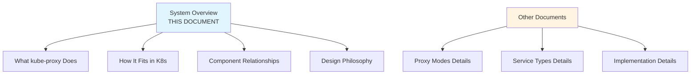
```mermaid
graph TD
    A[System Overview<br/>THIS DOCUMENT] --> B[What kube-proxy Does]
    A --> C[How It Fits in K8s]
    A --> D[Component Relationships]
    A --> E[Design Philosophy]

    F[Other Documents] --> G[Proxy Modes Details]
    F --> H[Service Types Details]
    F --> I[Implementation Details]

    style A fill:#e1f5ff
    style F fill:#fff4e1
```

---

## What is kube-proxy?

### Definition

**kube-proxy** is a network proxy that runs on each node in a Kubernetes cluster. Despite its name, it is **not a traditional proxy** in the sense of forwarding packets in userspace. Instead, it **programs the kernel** (via iptables, IPVS, or nftables) to handle Service traffic.

### Naming Clarification

The name "kube-proxy" is somewhat misleading:

| Name Suggests | Reality |
|---------------|---------|
| **Proxy** (userspace forwarding) | **Rule programmer** (kernel configuration) |
| Single proxy service | DaemonSet on every node |
| Centralized | Distributed |
| Application-layer | Network-layer (L4) |

**Historical Note**: Early Kubernetes (pre-1.0) had a true userspace proxy mode where kube-proxy forwarded packets in userspace. This was slow, so iptables mode was introduced in v1.1 and became default in v1.2. The name "kube-proxy" stuck even though the implementation changed.

### Key Characteristics

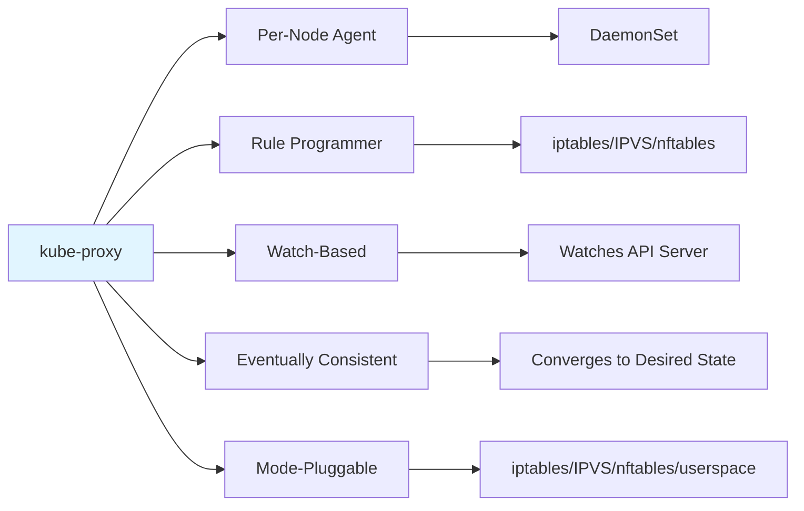
```mermaid
graph LR
    A[kube-proxy] --> B[Per-Node Agent]
    A --> C[Rule Programmer]
    A --> D[Watch-Based]
    A --> E[Eventually Consistent]
    A --> F[Mode-Pluggable]

    B --> B1[DaemonSet]
    C --> C1[iptables/IPVS/nftables]
    D --> D1[Watches API Server]
    E --> E1[Converges to Desired State]
    F --> F1[iptables/IPVS/nftables/userspace]

    style A fill:#e1f5ff
```

**Characteristics**:
1. **Per-Node Agent**: Runs on every node (DaemonSet)
2. **Rule Programmer**: Configures kernel networking (not userspace forwarding)
3. **Watch-Based**: Watches Kubernetes API for Service/Endpoint changes
4. **Eventually Consistent**: Converges network state to match API state
5. **Mode-Pluggable**: Supports multiple implementation modes

---

## kube-proxy in Kubernetes Architecture

### Control Plane vs Data Plane

Kubernetes networking has two planes:

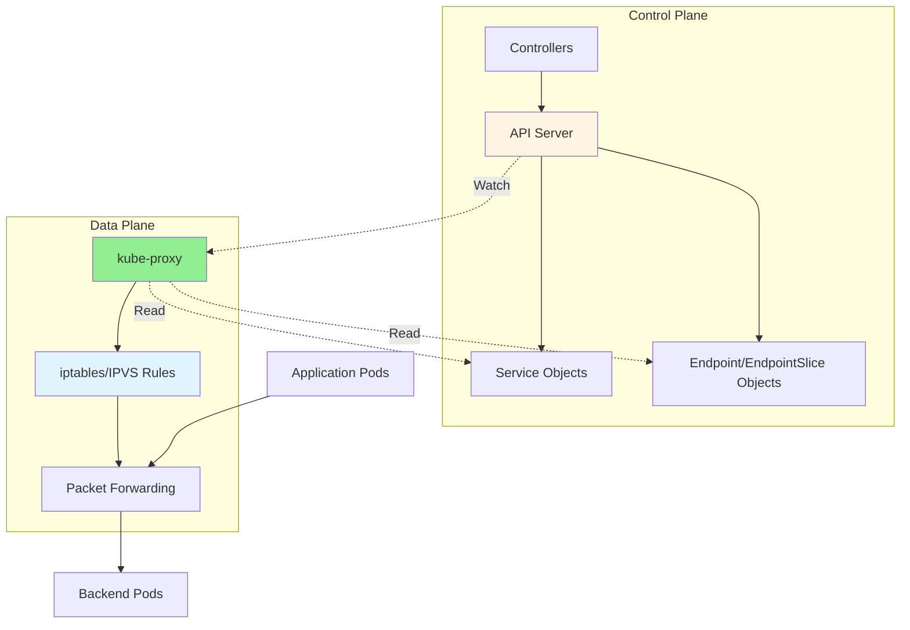
```mermaid
graph TB
    subgraph "Control Plane"
        A[API Server] --> B[Service Objects]
        A --> C[Endpoint/EndpointSlice Objects]
        D[Controllers] --> A
    end

    subgraph "Data Plane"
        E[kube-proxy] --> F[iptables/IPVS Rules]
        F --> G[Packet Forwarding]
    end

    A -.->|Watch| E
    E -.->|Read| B
    E -.->|Read| C

    H[Application Pods] --> G
    G --> I[Backend Pods]

    style A fill:#fff4e1
    style E fill:#90ee90
    style F fill:#e1f5ff
```

**Control Plane** (API Server, Controllers):
- Manages Service and Endpoint objects
- Stores desired state
- API-driven

**Data Plane** (kube-proxy):
- Implements actual packet forwarding
- Translates desired state to network rules
- Kernel-based

### Full Kubernetes Architecture

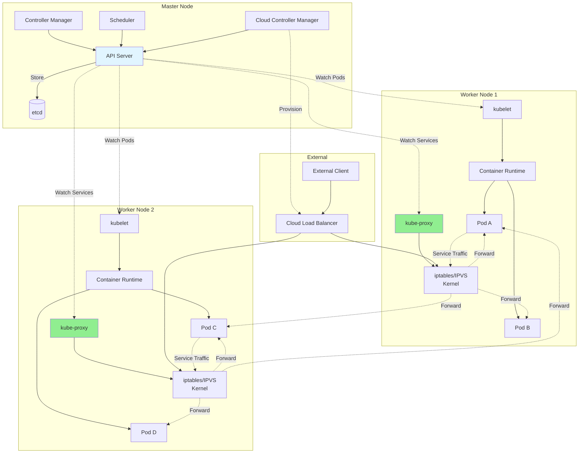
```mermaid
graph TB
    subgraph "Master Node"
        API[API Server]
        ETCD[(etcd)]
        CM[Controller Manager]
        SCHED[Scheduler]
        CCM[Cloud Controller Manager]
    end

    subgraph "Worker Node 1"
        KL1[kubelet]
        KP1[kube-proxy]
        RT1[Container Runtime]
        POD1A[Pod A]
        POD1B[Pod B]
        KERNEL1[iptables/IPVS<br/>Kernel]
    end

    subgraph "Worker Node 2"
        KL2[kubelet]
        KP2[kube-proxy]
        RT2[Container Runtime]
        POD2A[Pod C]
        POD2B[Pod D]
        KERNEL2[iptables/IPVS<br/>Kernel]
    end

    subgraph "External"
        LB[Cloud Load Balancer]
        CLIENT[External Client]
    end

    API -->|Store| ETCD
    CM --> API
    SCHED --> API
    CCM --> API
    CCM -.->|Provision| LB

    API -.->|Watch Pods| KL1
    API -.->|Watch Services| KP1
    API -.->|Watch Pods| KL2
    API -.->|Watch Services| KP2

    KL1 --> RT1
    RT1 --> POD1A
    RT1 --> POD1B
    KP1 --> KERNEL1

    KL2 --> RT2
    RT2 --> POD2A
    RT2 --> POD2B
    KP2 --> KERNEL2

    CLIENT --> LB
    LB --> KERNEL1
    LB --> KERNEL2

    POD1A -.->|Service Traffic| KERNEL1
    POD2A -.->|Service Traffic| KERNEL2

    KERNEL1 -.->|Forward| POD1A
    KERNEL1 -.->|Forward| POD1B
    KERNEL1 -.->|Forward| POD2A
    KERNEL2 -.->|Forward| POD2A
    KERNEL2 -.->|Forward| POD2B
    KERNEL2 -.->|Forward| POD1A

    style KP1 fill:#90ee90
    style KP2 fill:#90ee90
    style API fill:#e1f5ff
```

**kube-proxy's Position**:
- **Per-Node**: Runs on every worker node
- **Kernel Integration**: Programs kernel networking
- **API Watcher**: Watches API Server for changes
- **Independent**: Each instance operates independently

---

## Core Responsibilities

kube-proxy has **five core responsibilities**:

### 1. Service Discovery Integration

**Responsibility**: Ensure that Service IPs (ClusterIPs) allocated by API Server are routable.

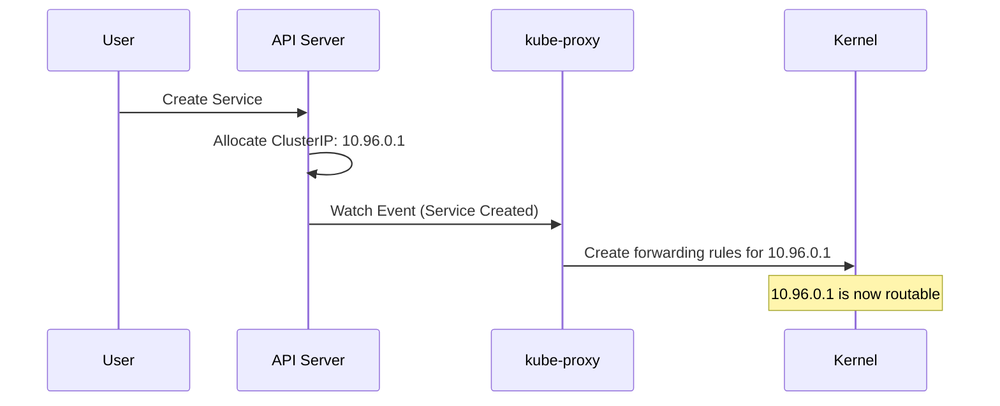
```mermaid
sequenceDiagram
    participant U as User
    participant API as API Server
    participant KP as kube-proxy
    participant K as Kernel

    U->>API: Create Service
    API->>API: Allocate ClusterIP: 10.96.0.1
    API->>KP: Watch Event (Service Created)
    KP->>K: Create forwarding rules for 10.96.0.1

    Note over K: 10.96.0.1 is now routable
```

**Implementation**:
- Watch Service objects from API Server
- Extract ClusterIP and ports
- Create routing rules (iptables/IPVS/nftables)

**Code**: `pkg/proxy/iptables/proxier.go:650-750`

### 2. Endpoint Synchronization

**Responsibility**: Keep network rules synchronized with current Pod endpoints.

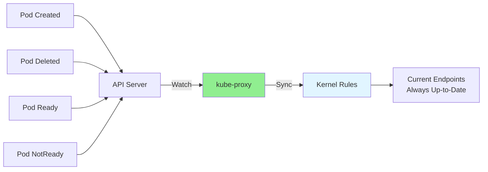
```mermaid
graph LR
    A[API Server] -->|Watch| B[kube-proxy]
    B -->|Sync| C[Kernel Rules]

    D[Pod Created] --> A
    E[Pod Deleted] --> A
    F[Pod Ready] --> A
    G[Pod NotReady] --> A

    C --> H[Current Endpoints<br/>Always Up-to-Date]

    style B fill:#90ee90
    style C fill:#e1f5ff
```

**Implementation**:
- Watch Endpoint/EndpointSlice objects
- Detect endpoint additions, removals, status changes
- Update backend targets in routing rules
- Exclude NotReady/Terminating endpoints

**Code**: `pkg/proxy/endpointslicecache.go`, `pkg/proxy/endpointschangetracker.go`

### 3. Load Balancing

**Responsibility**: Distribute traffic across multiple Pod endpoints.

**iptables Mode** (probability-based):
```
Traffic → Service IP → 33% Endpoint 1
                    → 33% Endpoint 2
                    → 33% Endpoint 3
```

**IPVS Mode** (configurable schedulers):
```
Traffic → Service IP → [Round-Robin/Least Connection/etc.] → Endpoints
```

**Implementation**:
- Generate load balancing rules
- iptables: Statistical probability
- IPVS: Kernel scheduling algorithms

**Code**: `pkg/proxy/iptables/proxier.go:1150-1250`, `pkg/proxy/ipvs/proxier.go:1050-1150`

### 4. Traffic Policy Enforcement

**Responsibility**: Implement traffic routing policies (ExternalTrafficPolicy, InternalTrafficPolicy).

**ExternalTrafficPolicy: Cluster**:
```
External → Any Node → Any Pod (with SNAT)
```

**ExternalTrafficPolicy: Local**:
```
External → Node with Pod → Local Pod only (no SNAT, source IP preserved)
```

**Implementation**:
- Check traffic policy settings
- Filter endpoints (all vs local only)
- Apply masquerading (SNAT) when needed
- Configure health check NodePort

**Code**: `pkg/proxy/iptables/proxier.go:1050-1150`

### 5. Service Type Implementation

**Responsibility**: Implement all Kubernetes Service types.

| Service Type | kube-proxy Role |
|-------------|-----------------|
| **ClusterIP** | Create ClusterIP forwarding rules |
| **NodePort** | Create NodePort forwarding rules on all nodes |
| **LoadBalancer** | Create NodePort rules (cloud controller creates LB) |
| **ExternalName** | No action (DNS-only) |
| **Headless** | No action (no ClusterIP) |
| **ExternalIPs** | Create ExternalIP forwarding rules |

**Implementation**: Mode-specific rule generation for each type.

**Code**: `pkg/proxy/iptables/proxier.go:650-950`, `pkg/proxy/ipvs/proxier.go:750-1050`

---

## Service Abstraction Concept

### The Problem: Ephemeral Pods

Pods are ephemeral and can be created/destroyed frequently:

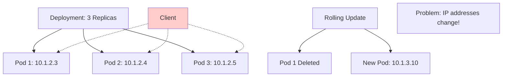
```mermaid
graph TD
    A[Deployment: 3 Replicas] --> B[Pod 1: 10.1.2.3]
    A --> C[Pod 2: 10.1.2.4]
    A --> D[Pod 3: 10.1.2.5]

    E[Rolling Update] --> F[Pod 1 Deleted]
    E --> G[New Pod: 10.1.3.10]

    H[Client] -.-> B
    H -.-> C
    H -.-> D

    style H fill:#ffcccc
    I[Problem: IP addresses change!]
```

**Problems**:
1. **Changing IPs**: Pod IPs change when Pods are recreated
2. **Discovery**: Clients need to discover current Pod IPs
3. **Load Balancing**: Clients need to distribute traffic across Pods
4. **Health**: Clients need to avoid unhealthy Pods

### The Solution: Services

Services provide a **stable abstraction** over dynamic Pods:

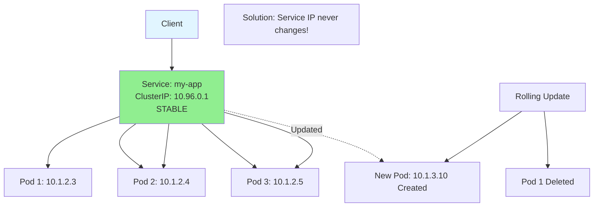
```mermaid
graph TB
    A[Service: my-app<br/>ClusterIP: 10.96.0.1<br/>STABLE] --> B[Pod 1: 10.1.2.3]
    A --> C[Pod 2: 10.1.2.4]
    A --> D[Pod 3: 10.1.2.5]

    E[Rolling Update] --> F[Pod 1 Deleted]
    E --> G[New Pod: 10.1.3.10 Created]

    A -.->|Updated| G
    A --> C
    A --> D

    H[Client] --> A

    style A fill:#90ee90
    style H fill:#e1f5ff
    I[Solution: Service IP never changes!]
```

**Service Benefits**:
1. **Stable IP**: ClusterIP never changes
2. **Stable DNS**: `my-app.default.svc.cluster.local` never changes
3. **Automatic Discovery**: DNS resolves to ClusterIP, kube-proxy routes to current Pods
4. **Load Balancing**: kube-proxy distributes across healthy Pods
5. **Health Awareness**: kube-proxy excludes NotReady Pods

### kube-proxy's Role in Service Abstraction

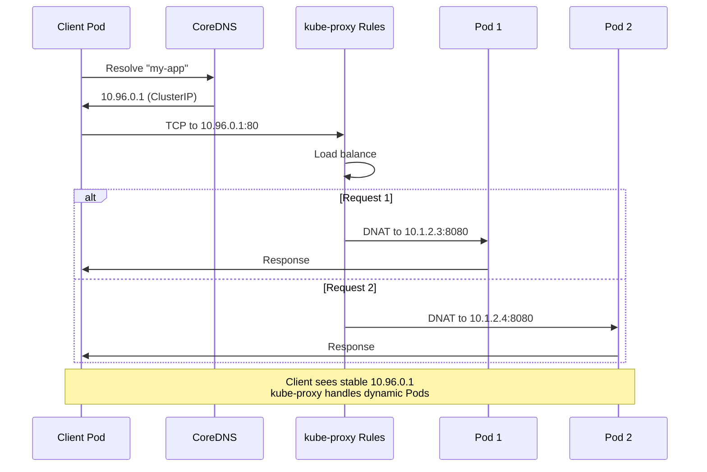
```mermaid
sequenceDiagram
    participant C as Client Pod
    participant DNS as CoreDNS
    participant KP as kube-proxy Rules
    participant P1 as Pod 1
    participant P2 as Pod 2

    C->>DNS: Resolve "my-app"
    DNS->>C: 10.96.0.1 (ClusterIP)

    C->>KP: TCP to 10.96.0.1:80
    KP->>KP: Load balance

    alt Request 1
        KP->>P1: DNAT to 10.1.2.3:8080
        P1->>C: Response
    else Request 2
        KP->>P2: DNAT to 10.1.2.4:8080
        P2->>C: Response
    end

    Note over C,P2: Client sees stable 10.96.0.1<br/>kube-proxy handles dynamic Pods
```

**kube-proxy implements the abstraction**:
1. **DNS** resolves Service name → ClusterIP
2. **Client** sends traffic to ClusterIP
3. **kube-proxy** (via kernel rules) forwards to current Pod IPs
4. **Pods** can change, ClusterIP stays constant

---

## Networking Model

Kubernetes defines a **flat networking model** with three communication patterns:

### 1. Pod-to-Pod Communication

**Requirement**: Every Pod can communicate with every other Pod without NAT.

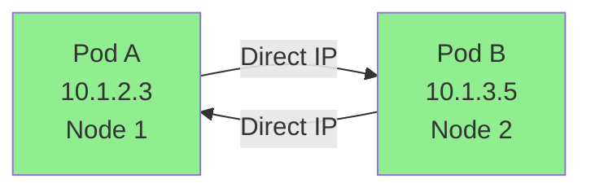
```mermaid
graph LR
    A[Pod A<br/>10.1.2.3<br/>Node 1] -->|Direct IP| B[Pod B<br/>10.1.3.5<br/>Node 2]
    B -->|Direct IP| A

    style A fill:#90ee90
    style B fill:#90ee90
```

**Implementation**: CNI plugin (not kube-proxy)
**kube-proxy Role**: None (CNI handles this)

**Examples**: Calico, Flannel, Cilium, Weave

### 2. Pod-to-Service Communication

**Requirement**: Pods can access Services via stable ClusterIP.

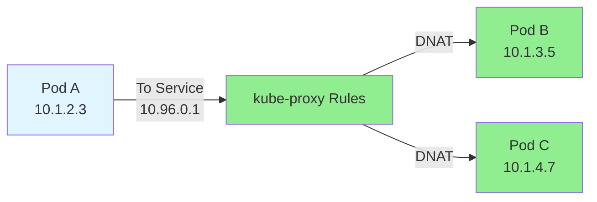
```mermaid
graph LR
    A[Pod A<br/>10.1.2.3] -->|To Service<br/>10.96.0.1| B[kube-proxy Rules]
    B -->|DNAT| C[Pod B<br/>10.1.3.5]
    B -->|DNAT| D[Pod C<br/>10.1.4.7]

    style A fill:#e1f5ff
    style B fill:#90ee90
    style C fill:#90ee90
    style D fill:#90ee90
```

**Implementation**: **kube-proxy** (iptables/IPVS/nftables rules)
**kube-proxy Role**: **PRIMARY** - implements Service abstraction

### 3. External-to-Service Communication

**Requirement**: External clients can access Services via NodePort or LoadBalancer.

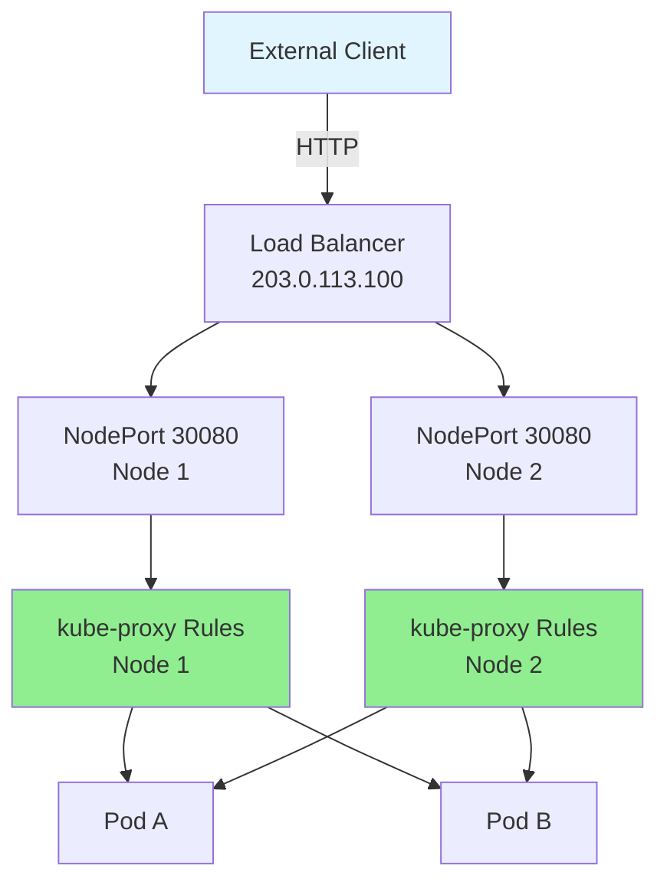
```mermaid
graph TB
    A[External Client] -->|HTTP| B[Load Balancer<br/>203.0.113.100]
    B --> C[NodePort 30080<br/>Node 1]
    B --> D[NodePort 30080<br/>Node 2]

    C --> E[kube-proxy Rules<br/>Node 1]
    D --> F[kube-proxy Rules<br/>Node 2]

    E --> G[Pod A]
    E --> H[Pod B]
    F --> G
    F --> H

    style A fill:#e1f5ff
    style E fill:#90ee90
    style F fill:#90ee90
```

**Implementation**:
- **Cloud Controller**: Provisions external load balancer
- **kube-proxy**: Implements NodePort forwarding

**kube-proxy Role**: Implements NodePort and LoadBalancer data plane

### Networking Model Summary

| Communication | Implementer | kube-proxy Role |
|---------------|-------------|-----------------|
| **Pod-to-Pod** | CNI Plugin | None |
| **Pod-to-Service** | kube-proxy | **Primary** |
| **External-to-Service** | kube-proxy + Cloud Controller | **Primary (NodePort)** |

---

## Component Relationships

### kube-proxy and Other Kubernetes Components

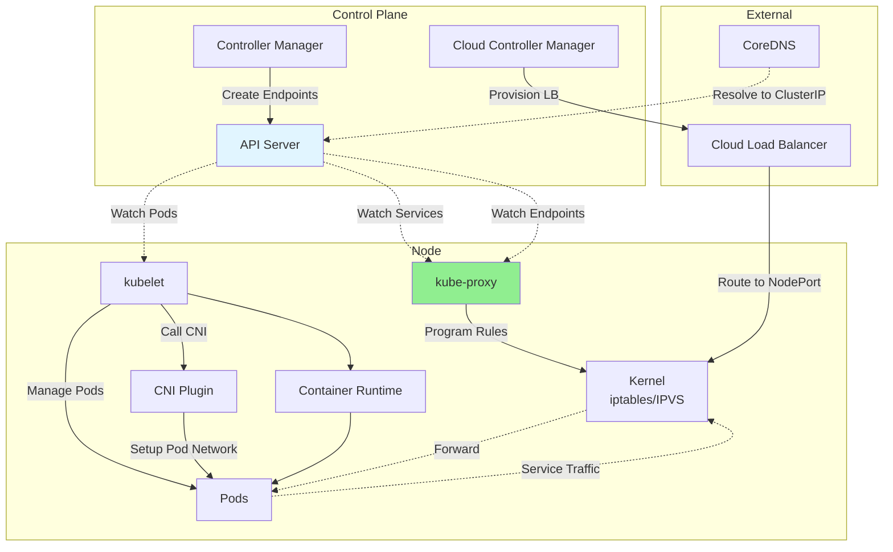
```mermaid
graph TB
    subgraph "Control Plane"
        A[API Server]
        B[Controller Manager]
        C[Cloud Controller Manager]
    end

    subgraph "Node"
        D[kube-proxy]
        E[kubelet]
        F[CNI Plugin]
        G[Container Runtime]
        H[Pods]
        I[Kernel<br/>iptables/IPVS]
    end

    subgraph "External"
        J[CoreDNS]
        K[Cloud Load Balancer]
    end

    A -.->|Watch Services| D
    A -.->|Watch Endpoints| D
    A -.->|Watch Pods| E

    B -->|Create Endpoints| A
    C -->|Provision LB| K

    D -->|Program Rules| I
    E -->|Manage Pods| H
    E -->|Call CNI| F
    F -->|Setup Pod Network| H
    E --> G
    G --> H

    J -.->|Resolve to ClusterIP| A
    K -->|Route to NodePort| I

    H -.->|Service Traffic| I
    I -.->|Forward| H

    style D fill:#90ee90
    style A fill:#e1f5ff
```

### Relationship Details

#### 1. kube-proxy ↔ API Server

**Relationship**: Watch-based consumer

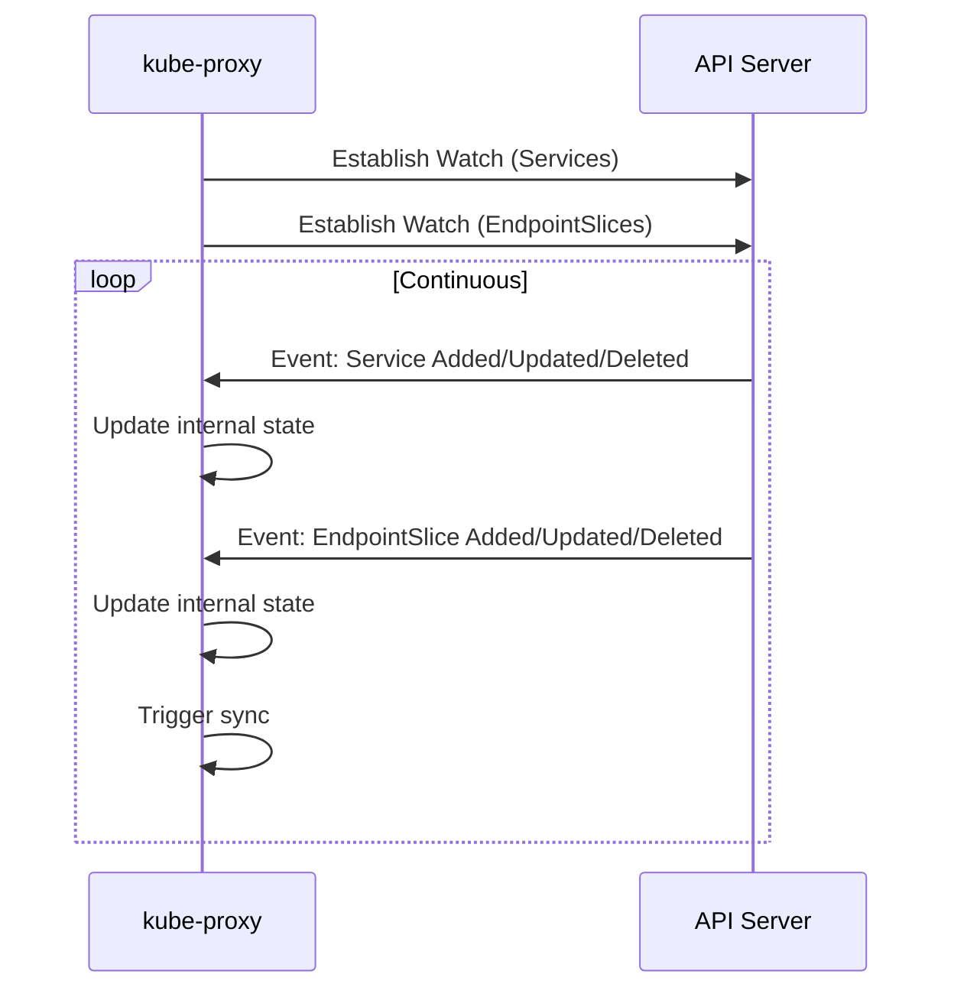
```mermaid
sequenceDiagram
    participant KP as kube-proxy
    participant API as API Server

    KP->>API: Establish Watch (Services)
    KP->>API: Establish Watch (EndpointSlices)

    loop Continuous
        API->>KP: Event: Service Added/Updated/Deleted
        KP->>KP: Update internal state

        API->>KP: Event: EndpointSlice Added/Updated/Deleted
        KP->>KP: Update internal state

        KP->>KP: Trigger sync
    end
```

**Communication**:
- **Direction**: API Server → kube-proxy (watch stream)
- **Protocol**: HTTP/2 (watch API)
- **Data**: Service and EndpointSlice objects
- **Frequency**: Event-driven + periodic resync

**Code**: `pkg/proxy/config/config.go`

#### 2. kube-proxy ↔ kubelet

**Relationship**: Independent (no direct communication)

**Key Points**:
- Run on same node
- No direct communication
- Complementary roles:
  - **kubelet**: Manages Pod lifecycle
  - **kube-proxy**: Routes Service traffic to Pods

#### 3. kube-proxy ↔ CNI Plugin

**Relationship**: Sequential (CNI first, then kube-proxy)

**Flow**:
```
1. kubelet calls CNI to setup Pod network
2. CNI assigns Pod IP and configures routing
3. Pod is Ready
4. Endpoint created (Pod IP)
5. kube-proxy adds Pod IP to Service backends
```

**Key Points**:
- CNI sets up Pod networking
- kube-proxy uses Pod IPs from CNI
- No direct communication

#### 4. kube-proxy ↔ CoreDNS

**Relationship**: Indirect (via ClusterIP)

**Flow**:
```
1. CoreDNS resolves service.namespace.svc.cluster.local → ClusterIP
2. Client sends traffic to ClusterIP
3. kube-proxy forwards to CoreDNS Pod (if accessing CoreDNS service)
```

**Key Points**:
- CoreDNS is a client of kube-proxy (CoreDNS service has ClusterIP)
- CoreDNS resolves names to ClusterIPs
- kube-proxy implements ClusterIP routing

#### 5. kube-proxy ↔ Cloud Controller Manager

**Relationship**: Indirect (via Service objects)

**Flow**:
```
1. User creates LoadBalancer Service
2. Cloud Controller sees Service
3. Cloud Controller provisions cloud LB
4. Cloud Controller updates Service.Status.LoadBalancer.Ingress
5. kube-proxy creates NodePort rules (LB forwards to NodePort)
```

**Key Points**:
- Cloud Controller provisions external LB
- kube-proxy implements NodePort data plane
- No direct communication

---

## Data Flow Architecture

### Control Flow vs Data Flow

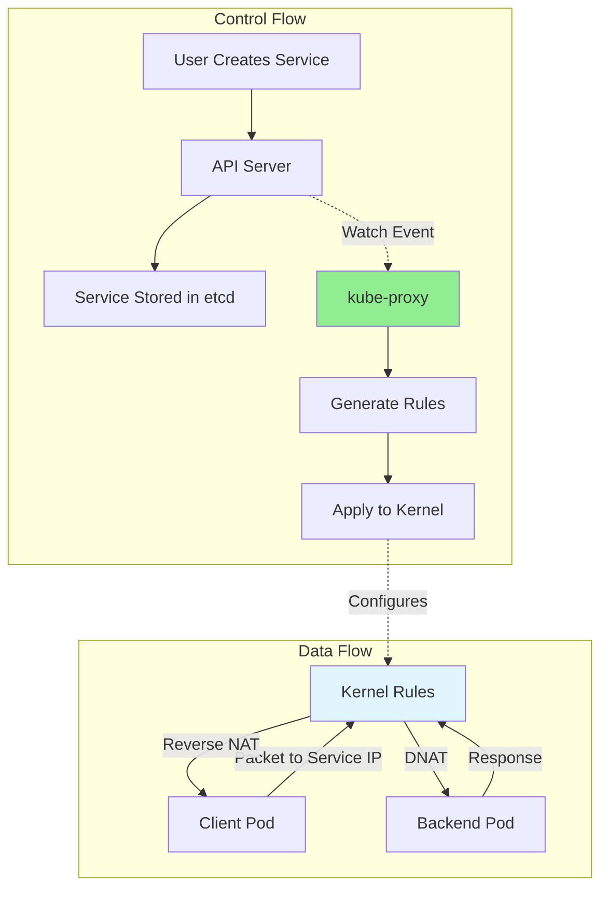
```mermaid
graph TB
    subgraph "Control Flow"
        A[User Creates Service] --> B[API Server]
        B --> C[Service Stored in etcd]
        B -.->|Watch Event| D[kube-proxy]
        D --> E[Generate Rules]
        E --> F[Apply to Kernel]
    end

    subgraph "Data Flow"
        G[Client Pod] -->|Packet to Service IP| H[Kernel Rules]
        H -->|DNAT| I[Backend Pod]
        I -->|Response| H
        H -->|Reverse NAT| G
    end

    F -.->|Configures| H

    style D fill:#90ee90
    style H fill:#e1f5ff
```

**Control Flow** (Service configuration):
1. User creates/updates Service
2. API Server stores in etcd
3. kube-proxy watches and receives event
4. kube-proxy generates rules
5. kube-proxy applies rules to kernel

**Data Flow** (Actual traffic):
1. Client sends packet to Service IP
2. Kernel applies rules (iptables/IPVS)
3. Packet forwarded to backend Pod
4. Response follows reverse path

**Key Insight**: Control flow configures kernel; data flow happens entirely in kernel (fast path).

### Packet Flow Detail

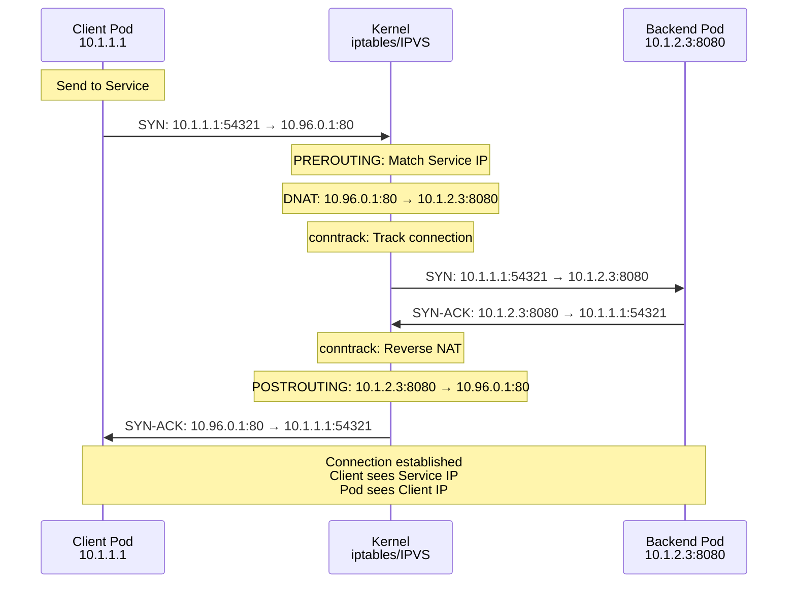
```mermaid
sequenceDiagram
    participant C as Client Pod<br/>10.1.1.1
    participant K as Kernel<br/>iptables/IPVS
    participant P as Backend Pod<br/>10.1.2.3:8080

    Note over C: Send to Service

    C->>K: SYN: 10.1.1.1:54321 → 10.96.0.1:80
    Note over K: PREROUTING: Match Service IP
    Note over K: DNAT: 10.96.0.1:80 → 10.1.2.3:8080
    Note over K: conntrack: Track connection

    K->>P: SYN: 10.1.1.1:54321 → 10.1.2.3:8080

    P->>K: SYN-ACK: 10.1.2.3:8080 → 10.1.1.1:54321
    Note over K: conntrack: Reverse NAT
    Note over K: POSTROUTING: 10.1.2.3:8080 → 10.96.0.1:80

    K->>C: SYN-ACK: 10.96.0.1:80 → 10.1.1.1:54321

    Note over C,P: Connection established<br/>Client sees Service IP<br/>Pod sees Client IP
```

**Steps**:
1. **Client** sends packet to Service IP
2. **PREROUTING** (iptables/IPVS): Match destination = Service IP
3. **DNAT**: Change destination to Pod IP:port
4. **conntrack**: Record connection for reverse NAT
5. **Routing**: Forward to Pod
6. **Pod** receives packet with client as source
7. **Pod** sends response to client IP
8. **conntrack**: Look up original connection
9. **Reverse NAT**: Change source back to Service IP
10. **Client** receives response from Service IP

---

## Deployment Model

### DaemonSet Deployment

kube-proxy runs as a **DaemonSet**, ensuring one instance on every node:

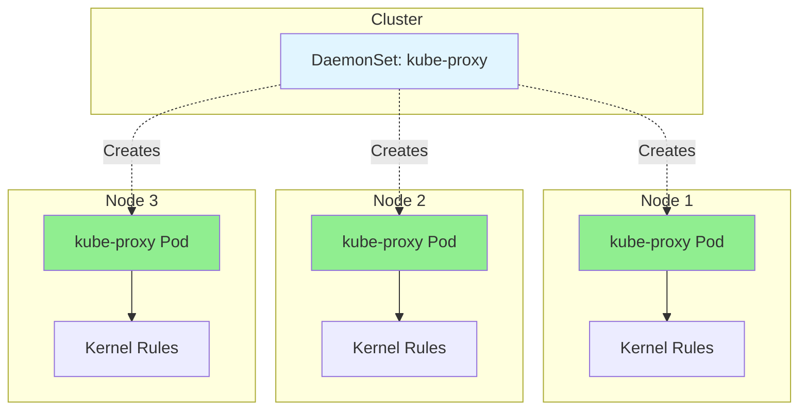
```mermaid
graph TB
    subgraph "Cluster"
        DS[DaemonSet: kube-proxy]
    end

    subgraph "Node 1"
        KP1[kube-proxy Pod]
        K1[Kernel Rules]
        KP1 --> K1
    end

    subgraph "Node 2"
        KP2[kube-proxy Pod]
        K2[Kernel Rules]
        KP2 --> K2
    end

    subgraph "Node 3"
        KP3[kube-proxy Pod]
        K3[Kernel Rules]
        KP3 --> K3
    end

    DS -.->|Creates| KP1
    DS -.->|Creates| KP2
    DS -.->|Creates| KP3

    style DS fill:#e1f5ff
    style KP1 fill:#90ee90
    style KP2 fill:#90ee90
    style KP3 fill:#90ee90
```

**DaemonSet Configuration** (simplified):

```yaml
apiVersion: apps/v1
kind: DaemonSet
metadata:
  name: kube-proxy
  namespace: kube-system
spec:
  selector:
    matchLabels:
      k8s-app: kube-proxy
  template:
    metadata:
      labels:
        k8s-app: kube-proxy
    spec:
      hostNetwork: true  # Use host networking
      containers:
      - name: kube-proxy
        image: registry.k8s.io/kube-proxy:v1.32.0
        command:
        - /usr/local/bin/kube-proxy
        - --config=/var/lib/kube-proxy/config.conf
        securityContext:
          privileged: true  # Required for iptables/IPVS
        volumeMounts:
        - name: kube-proxy-config
          mountPath: /var/lib/kube-proxy
```

### Why DaemonSet?

| Requirement | DaemonSet Advantage |
|-------------|-------------------|
| **Per-Node Rules** | Each node needs its own kernel rules |
| **No Single Point of Failure** | Node failure affects only that node |
| **Scalability** | Scales with cluster size automatically |
| **Local Performance** | Rules applied locally, no network hop |
| **High Availability** | Failure of one instance doesn't affect others |

### Host Network Mode

kube-proxy runs with `hostNetwork: true`:

**Reasons**:
1. **Access to host networking stack**: Needed to configure iptables/IPVS
2. **Access to all IPs**: Can intercept traffic to NodePort, etc.
3. **Privileged operations**: iptables/IPVS require elevated permissions

---

## Operating Principles

### 1. Watch-Driven

kube-proxy operates on a **watch-driven model**:

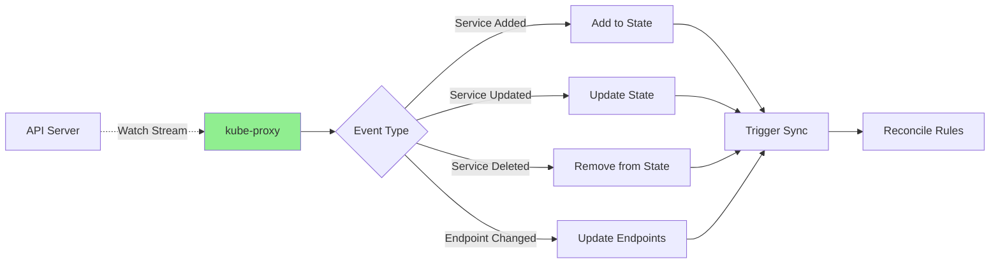
```mermaid
graph LR
    A[API Server] -.->|Watch Stream| B[kube-proxy]
    B --> C{Event Type}
    C -->|Service Added| D[Add to State]
    C -->|Service Updated| E[Update State]
    C -->|Service Deleted| F[Remove from State]
    C -->|Endpoint Changed| G[Update Endpoints]

    D --> H[Trigger Sync]
    E --> H
    F --> H
    G --> H

    H --> I[Reconcile Rules]

    style B fill:#90ee90
```

**Benefits**:
- **Reactive**: Responds quickly to changes
- **Efficient**: Only processes actual changes
- **Scalable**: Doesn't poll API Server

### 2. Eventually Consistent

kube-proxy provides **eventual consistency**:

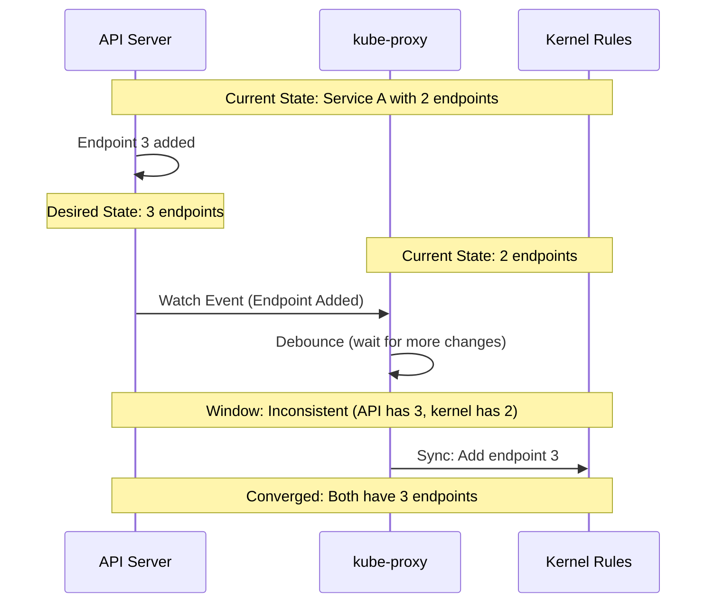
```mermaid
sequenceDiagram
    participant API as API Server
    participant KP as kube-proxy
    participant K as Kernel Rules

    Note over API,K: Current State: Service A with 2 endpoints

    API->>API: Endpoint 3 added
    Note over API: Desired State: 3 endpoints

    Note over KP,K: Current State: 2 endpoints

    API->>KP: Watch Event (Endpoint Added)
    KP->>KP: Debounce (wait for more changes)

    Note over API,K: Window: Inconsistent (API has 3, kernel has 2)

    KP->>K: Sync: Add endpoint 3

    Note over API,K: Converged: Both have 3 endpoints
```

**Characteristics**:
- **Not Strongly Consistent**: Brief windows where rules lag behind API state
- **Converges**: Always moves toward desired state
- **Acceptable for Networking**: Brief inconsistency acceptable vs immediate but costly updates

**Typical Convergence Time**: < 1 second (configurable via `minSyncPeriod`)

### 3. Level-Triggered (not Edge-Triggered)

kube-proxy is **level-triggered**:

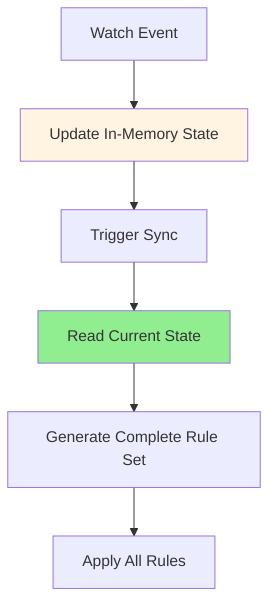
```mermaid
graph TD
    A[Watch Event] --> B[Update In-Memory State]
    B --> C[Trigger Sync]
    C --> D[Read Current State]
    D --> E[Generate Complete Rule Set]
    E --> F[Apply All Rules]

    style B fill:#fff4e1
    style D fill:#90ee90
```

**Level-Triggered**:
- Reads **current full state** from API
- Generates **complete rule set** based on current state
- Not dependent on specific event order

**Edge-Triggered** (NOT used):
- Would process only the delta (event-specific change)
- Vulnerable to missed events

**Benefit**: Robust to missed events or restarts. kube-proxy always converges to correct state.

### 4. Declarative

kube-proxy follows a **declarative model**:

```mermaid
graph LR
    A[Desired State<br/>API Server] --> B[kube-proxy]
    B --> C{Compare}
    C --> D[Current State<br/>Kernel Rules]
    C --> E[Generate Delta]
    E --> F[Apply Changes]
    F --> D

    style A fill:#e1f5ff
    style B fill:#90ee90
    style D fill:#fff4e1
```

**User/System**:
- Declares desired state (Service with 3 endpoints)
- Doesn't specify how to achieve it

**kube-proxy**:
- Determines how to achieve desired state
- Generates appropriate rules
- Applies changes

### 5. Idempotent

kube-proxy operations are **idempotent**:

```
Apply(State) = State
Apply(Apply(State)) = State
```

**Benefit**: Can sync repeatedly without side effects. Supports:
- Periodic full resync
- Recovery from errors
- Crash recovery

---

## System Boundaries

### What kube-proxy Does

✅ **Responsibilities**:
1. Watch Services and Endpoints
2. Generate network forwarding rules
3. Configure kernel (iptables/IPVS/nftables)
4. Load balance across endpoints
5. Implement Service types (ClusterIP, NodePort, LoadBalancer data plane)
6. Enforce traffic policies
7. Health check endpoints (for ExternalTrafficPolicy: Local)

### What kube-proxy Does NOT Do

❌ **Non-Responsibilities**:

| Task | Actual Component |
|------|------------------|
| **Pod networking** | CNI Plugin |
| **ClusterIP allocation** | API Server |
| **Endpoint creation** | Endpoint Controller (Controller Manager) |
| **DNS resolution** | CoreDNS |
| **External LB provisioning** | Cloud Controller Manager |
| **Network policies** | CNI Plugin (e.g., Calico) |
| **Service mesh** | Istio/Linkerd/etc. (separate) |
| **Ingress** | Ingress Controller |
| **Pod readiness** | kubelet |

### Clear Boundaries Example

**Scenario**: Create LoadBalancer Service

```mermaid
sequenceDiagram
    participant User
    participant API as API Server
    participant CCM as Cloud Controller
    participant KP as kube-proxy
    participant LB as Cloud Load Balancer

    User->>API: Create LoadBalancer Service
    API->>API: Allocate ClusterIP & NodePort
    API->>CCM: Service created (type: LoadBalancer)
    API->>KP: Service created

    CCM->>LB: Provision external LB
    LB->>CCM: LB IP: 203.0.113.100
    CCM->>API: Update Service.Status.LoadBalancer.Ingress

    KP->>KP: Create NodePort rules

    Note over User,LB: Cloud Controller: External LB<br/>kube-proxy: NodePort rules<br/>API Server: Coordination
```

**Boundary**:
- **Cloud Controller**: Provisions external load balancer (control plane)
- **kube-proxy**: Implements NodePort forwarding (data plane)
- **API Server**: Coordinates (state storage)

---

## Integration Points

kube-proxy integrates with multiple systems:

```mermaid
graph TB
    KP[kube-proxy]

    subgraph "Kubernetes"
        API[API Server]
        CM[Controller Manager]
        CCM[Cloud Controller]
    end

    subgraph "Linux Kernel"
        IPT[iptables]
        IPVS[IPVS]
        NFT[nftables]
        CT[conntrack]
        NET[Netfilter]
    end

    subgraph "Monitoring"
        PROM[Prometheus]
        LOG[Log Aggregation]
    end

    API -.->|Watch| KP
    KP --> IPT
    KP --> IPVS
    KP --> NFT
    IPT --> NET
    IPVS --> NET
    NFT --> NET
    NET --> CT

    KP -.->|Metrics| PROM
    KP -.->|Logs| LOG

    style KP fill:#90ee90
```

### Integration Details

| Integration | Interface | Purpose |
|-------------|-----------|---------|
| **API Server** | Watch API (HTTP/2) | Receive Service/Endpoint updates |
| **iptables** | iptables/iptables-restore commands | Configure NAT rules |
| **IPVS** | ipvsadm/netlink API | Configure virtual servers |
| **nftables** | nft command | Configure packet filter rules |
| **conntrack** | netlink API | Monitor connection tracking |
| **Prometheus** | HTTP /metrics endpoint | Expose metrics |
| **Logging** | stdout/stderr | Structured logs |

---

## Design Philosophy

### Core Principles

1. **Simplicity**: Each kube-proxy instance operates independently (no coordination)
2. **Decentralization**: No central control point (per-node agents)
3. **Performance**: Kernel-based forwarding (not userspace)
4. **Pluggability**: Multiple modes (iptables/IPVS/nftables)
5. **Reliability**: Eventually consistent, self-healing

### Trade-offs

| Decision | Benefit | Trade-off |
|----------|---------|-----------|
| **Per-Node DaemonSet** | HA, scalability | Memory overhead (rules on every node) |
| **Kernel-based** | High performance | Platform-dependent (Linux-specific) |
| **Eventually Consistent** | Scalability | Brief inconsistency windows |
| **Level-Triggered** | Robustness | Higher sync cost vs edge-triggered |
| **Watch-Based** | Reactive, efficient | Dependency on API Server availability |

---

## Evolution and History

### Timeline

```mermaid
graph LR
    A[v0.x<br/>2014] --> B[v1.0<br/>2015]
    B --> C[v1.1<br/>2015]
    C --> D[v1.2<br/>2016]
    D --> E[v1.8<br/>2017]
    E --> F[v1.9<br/>2018]
    F --> G[v1.11<br/>2018]
    G --> H[v1.21<br/>2021]
    H --> I[v1.22<br/>2021]
    I --> J[v1.29<br/>2023]

    A -.-> A1[userspace mode only]
    C -.-> C1[iptables mode added]
    D -.-> D1[iptables default]
    E -.-> E1[IPVS alpha]
    F -.-> F1[IPVS beta]
    G -.-> G1[IPVS GA]
    H -.-> H1[EndpointSlices GA]
    I -.-> I1[InternalTrafficPolicy]
    J -.-> J1[nftables alpha]
```

### Mode Evolution

**userspace Mode** (v0.x - v1.1):
- True userspace proxy
- kube-proxy forwards packets in userspace
- **Problems**: Slow, doesn't scale, high CPU

**iptables Mode** (v1.1+, default v1.2+):
- Kernel-based forwarding via iptables
- **Benefit**: Much faster than userspace
- **Problem**: O(n) rule evaluation, scales poorly above ~1000 services

**IPVS Mode** (v1.8 alpha, v1.9 beta, v1.11 GA):
- Kernel-based forwarding via IPVS
- **Benefit**: O(1) hash table lookup, scales to 10,000+ services
- **Benefit**: Advanced scheduling algorithms

**nftables Mode** (v1.29 alpha):
- Modern packet filter (replaces iptables)
- **Benefit**: Better performance than iptables, cleaner syntax
- **Status**: Alpha/experimental

---

## Comparison with Other Solutions

### kube-proxy vs Service Mesh

| Feature | kube-proxy | Service Mesh (Istio/Linkerd) |
|---------|-----------|------------------------------|
| **Layer** | L4 (Transport) | L7 (Application) |
| **Protocol Support** | TCP, UDP, SCTP | HTTP, gRPC, TCP |
| **Routing** | IP-based | HTTP path/header-based |
| **Load Balancing** | Round-robin, least connection | Advanced (weighted, canary, A/B) |
| **Features** | Basic LB, service abstraction | Retries, timeouts, circuit breaking, mTLS |
| **Performance** | Very fast (kernel) | Slower (sidecar overhead) |
| **Complexity** | Simple | Complex |
| **Use Case** | Standard Kubernetes services | Advanced traffic management |

**Relationship**: Service meshes **build on top** of kube-proxy (still use Services for basic connectivity).

### kube-proxy vs Cloud Load Balancers

| Feature | kube-proxy | Cloud LB (ALB/NLB/GCP LB) |
|---------|-----------|---------------------------|
| **Location** | In-cluster (every node) | External (cloud provider) |
| **Scope** | Cluster-internal + NodePort | External access only |
| **Configuration** | Automatic (watches API) | Provisioned per Service |
| **Cost** | Free (part of K8s) | Paid (cloud resource) |
| **HA** | Built-in (per-node) | Cloud provider HA |
| **Features** | Basic L4 LB | Advanced (SSL termination, WAF, etc.) |

**Relationship**: Cloud LBs **forward to** kube-proxy NodePorts.

---

## Summary

This document provided a comprehensive system-level overview of kube-proxy. Key takeaways:

**What kube-proxy Is**:
- Per-node network proxy (DaemonSet)
- Implements Kubernetes Service abstraction
- Programs kernel (iptables/IPVS/nftables) for packet forwarding
- Watch-driven, eventually consistent, declarative

**Core Responsibilities**:
1. Service discovery integration
2. Endpoint synchronization
3. Load balancing
4. Traffic policy enforcement
5. Service type implementation

**Service Abstraction**:
- Solves problem of ephemeral Pod IPs
- Provides stable ClusterIP and DNS name
- kube-proxy implements the data plane

**Networking Model**:
- Pod-to-Pod: CNI Plugin
- Pod-to-Service: **kube-proxy (primary role)**
- External-to-Service: **kube-proxy + Cloud Controller**

**Design Principles**:
- Simplicity (independent agents)
- Decentralization (no single point of failure)
- Performance (kernel-based)
- Pluggability (multiple modes)

**Next Steps**:
- Read [02-proxy-modes.md](02-proxy-modes.md) for detailed mode comparison
- Read [03-service-abstraction.md](03-service-abstraction.md) for Service deep dive
- Read [04-initialization-flow.md](04-initialization-flow.md) for startup sequence

**Related Documents**:
- [00-README.md](../00-README.md) - Documentation navigation
- [01-REQUIREMENTS.md](../01-REQUIREMENTS.md) - Design requirements
- [02-FUNCTIONAL-SPEC.md](../02-FUNCTIONAL-SPEC.md) - Functional specification
- [GLOSSARY.md](../GLOSSARY.md) - Terminology reference
