# kube-proxy Proxy Modes

**Comprehensive comparison and deep dive into kube-proxy proxy modes**

**Version**: Kubernetes 1.32+
**Last Updated**: 2024

---

## Table of Contents

- [Overview](#overview)
- [Mode Architecture Comparison](#mode-architecture-comparison)
- [iptables Mode](#iptables-mode)
- [IPVS Mode](#ipvs-mode)
- [nftables Mode](#nftables-mode)
- [userspace Mode (Deprecated)](#userspace-mode-deprecated)
- [Performance Comparison](#performance-comparison)
- [Scalability Analysis](#scalability-analysis)
- [Feature Matrix](#feature-matrix)
- [Mode Selection Guide](#mode-selection-guide)
- [Migration Between Modes](#migration-between-modes)
- [Troubleshooting by Mode](#troubleshooting-by-mode)
- [Best Practices](#best-practices)
- [Summary](#summary)

---

## Overview

kube-proxy supports **four proxy modes**, each with different implementation strategies, performance characteristics, and use cases:

1. **iptables** - Default, uses netfilter/iptables rules
2. **IPVS** - High performance, uses IP Virtual Server
3. **nftables** - Modern replacement for iptables (beta)
4. **userspace** - Legacy mode (deprecated)

### Mode Selection at a Glance

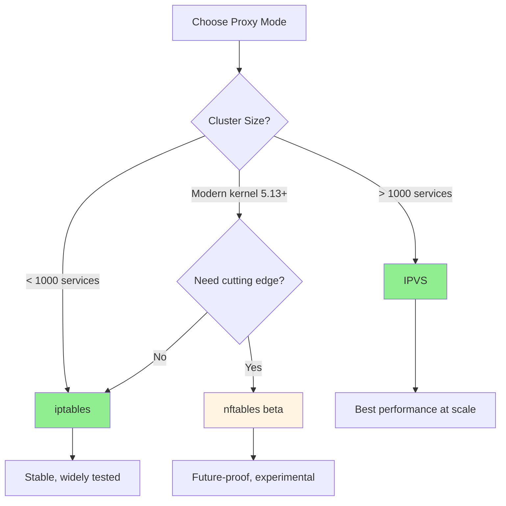

### Quick Comparison

| Mode | Performance | Scalability | Maturity | Use Case |
|------|-------------|-------------|----------|----------|
| **iptables** | Good | ~1000 svc | Stable (GA) | Default, general purpose |
| **IPVS** | Excellent | 10,000+ svc | Stable (GA) | Large clusters |
| **nftables** | Good | ~5000 svc | Beta | Modern kernels, future |
| **userspace** | Poor | < 100 svc | Deprecated | Legacy only |

---

## Mode Architecture Comparison

### High-Level Architecture

```mermaid
graph TB
    subgraph "iptables Mode"
        A1[kube-proxy] --> A2[iptables-restore]
        A2 --> A3[Netfilter]
        A3 --> A4[Rule Chain Traversal<br/>O n]
        A4 --> A5[Packet Forwarding]
    end

    subgraph "IPVS Mode"
        B1[kube-proxy] --> B2[ipvsadm/netlink]
        B2 --> B3[IPVS]
        B3 --> B4[Hash Table Lookup<br/>O 1]
        B4 --> B5[Packet Forwarding]
        B1 --> B6[iptables for ipset]
    end

    subgraph "nftables Mode"
        C1[kube-proxy] --> C2[nft]
        C2 --> C3[nftables]
        C3 --> C4[Set Lookup<br/>O log n]
        C4 --> C5[Packet Forwarding]
    end

    subgraph "userspace Mode"
        D1[kube-proxy] --> D2[Userspace Proxy]
        D2 --> D3[Socket Accept]
        D3 --> D4[Backend Connection]
        D4 --> D5[Copy Data]
    end

    style A1 fill:#90ee90
    style B1 fill:#90ee90
    style C1 fill:#fff4e1
    style D1 fill:#ffcccc
```

### Data Plane Comparison

| Mode | Data Plane | Location | Complexity |
|------|-----------|----------|------------|
| **iptables** | Netfilter rules | Kernel | O(n) |
| **IPVS** | IPVS virtual servers | Kernel | O(1) |
| **nftables** | nftables sets | Kernel | O(log n) |
| **userspace** | kube-proxy process | Userspace | O(1) but slow |

---

## iptables Mode

### Overview

**iptables mode** uses Linux netfilter framework with iptables rules to implement Service networking. It has been the **default mode since Kubernetes 1.2**.

### Architecture

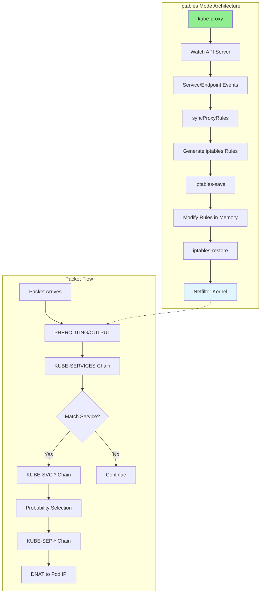

### Chain Structure

**Main Chains**:

```
PREROUTING → KUBE-SERVICES → KUBE-SVC-* → KUBE-SEP-*
OUTPUT → KUBE-SERVICES → KUBE-SVC-* → KUBE-SEP-*
POSTROUTING → KUBE-POSTROUTING
```

**Chain Hierarchy**:

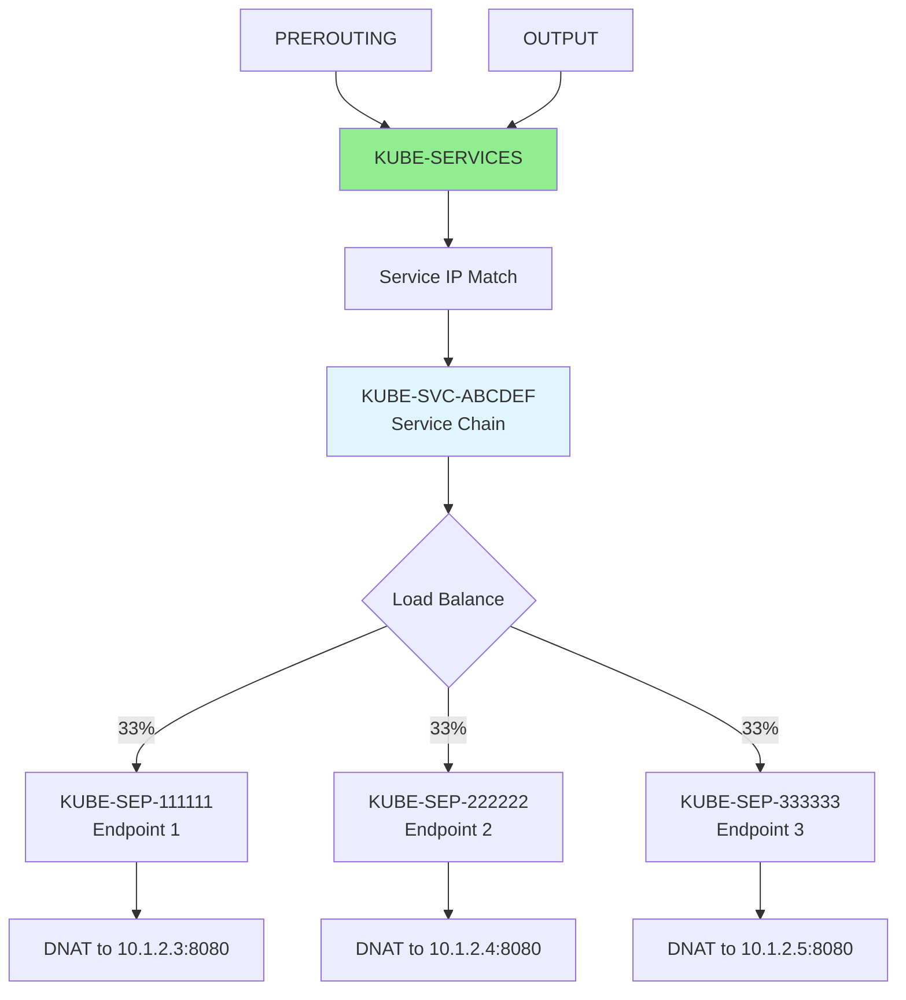

### Rule Example

**Service with 3 Endpoints**:

```bash
# Main entry point
-A KUBE-SERVICES -d 10.96.0.1/32 -p tcp -m tcp --dport 80 -j KUBE-SVC-ABCDEF123456

# Service chain (load balancing via probability)
-A KUBE-SVC-ABCDEF123456 -m comment --comment "default/my-service:http" \
   -m statistic --mode random --probability 0.33333 -j KUBE-SEP-111111

-A KUBE-SVC-ABCDEF123456 -m comment --comment "default/my-service:http" \
   -m statistic --mode random --probability 0.50000 -j KUBE-SEP-222222

-A KUBE-SVC-ABCDEF123456 -m comment --comment "default/my-service:http" \
   -j KUBE-SEP-333333

# Endpoint chains (DNAT)
-A KUBE-SEP-111111 -p tcp -m tcp -j DNAT --to-destination 10.1.2.3:8080
-A KUBE-SEP-222222 -p tcp -m tcp -j DNAT --to-destination 10.1.2.4:8080
-A KUBE-SEP-333333 -p tcp -m tcp -j DNAT --to-destination 10.1.2.5:8080
```

### Load Balancing Algorithm

**Probability-Based Random Distribution**:

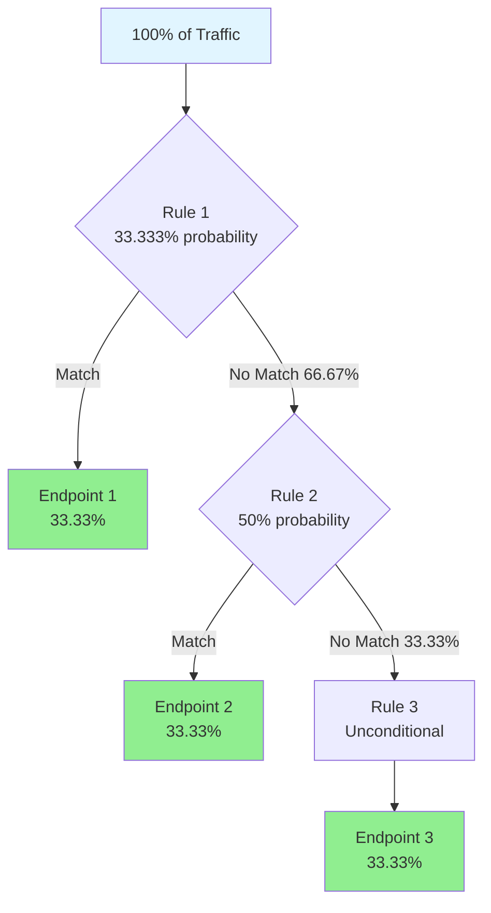

**Probability Math**:

For n endpoints:
```
Endpoint 1: probability = 1/n
Endpoint 2: probability = 1/(n-1)
Endpoint 3: probability = 1/(n-2)
...
Endpoint n: unconditional jump (1/1)
```

**Example (3 endpoints)**:
- EP1: 1/3 = 0.33333 → 33.33%
- EP2: 1/2 of remaining = 0.50000 × 66.67% = 33.33%
- EP3: All remaining = 33.33%

### Performance Characteristics

**Complexity**:
- **Rule Evaluation**: O(n) where n = services × endpoints
- **Packet Processing**: Linear traversal of chains
- **Sync Time**: O(n²) - regenerate all rules

**Performance at Scale**:

| Services | Endpoints | Rules | Sync Time | Latency |
|----------|-----------|-------|-----------|---------|
| 100 | 1,000 | ~10,000 | 50ms | 0.5ms |
| 500 | 5,000 | ~50,000 | 500ms | 2ms |
| 1,000 | 10,000 | ~100,000 | 2s | 5ms |
| 2,000 | 20,000 | ~200,000 | 8s | 15ms |
| 5,000+ | 50,000+ | N/A | Too slow | Too slow |

**Degradation Point**: ~1,000 services

### Advantages

✅ **Pros**:
1. **Mature**: Default since Kubernetes 1.2, battle-tested
2. **Universal**: Works on all Linux kernels with iptables
3. **Simple**: Well-understood technology
4. **Debugging**: Extensive tooling (`iptables -L`, logs)
5. **No Dependencies**: iptables pre-installed on most systems

### Limitations

❌ **Cons**:
1. **Scalability**: Poor performance above ~1000 services
2. **Sync Time**: Slow rule updates (seconds for large clusters)
3. **Rule Count**: 100,000+ rules in large clusters
4. **CPU Usage**: High during sync (regenerate all rules)
5. **Latency**: Increases linearly with service count

### When to Use

**Use iptables mode when**:
- Cluster has < 1,000 services
- Standard Linux environment
- Stability and maturity are critical
- Team familiar with iptables debugging

**Code**: `pkg/proxy/iptables/proxier.go`

---

## IPVS Mode

### Overview

**IPVS mode** uses the Linux IP Virtual Server (IPVS) kernel module for load balancing. It provides **O(1) performance** and is the recommended mode for large clusters.

**Status**: GA since Kubernetes 1.11 (2018)

### Architecture

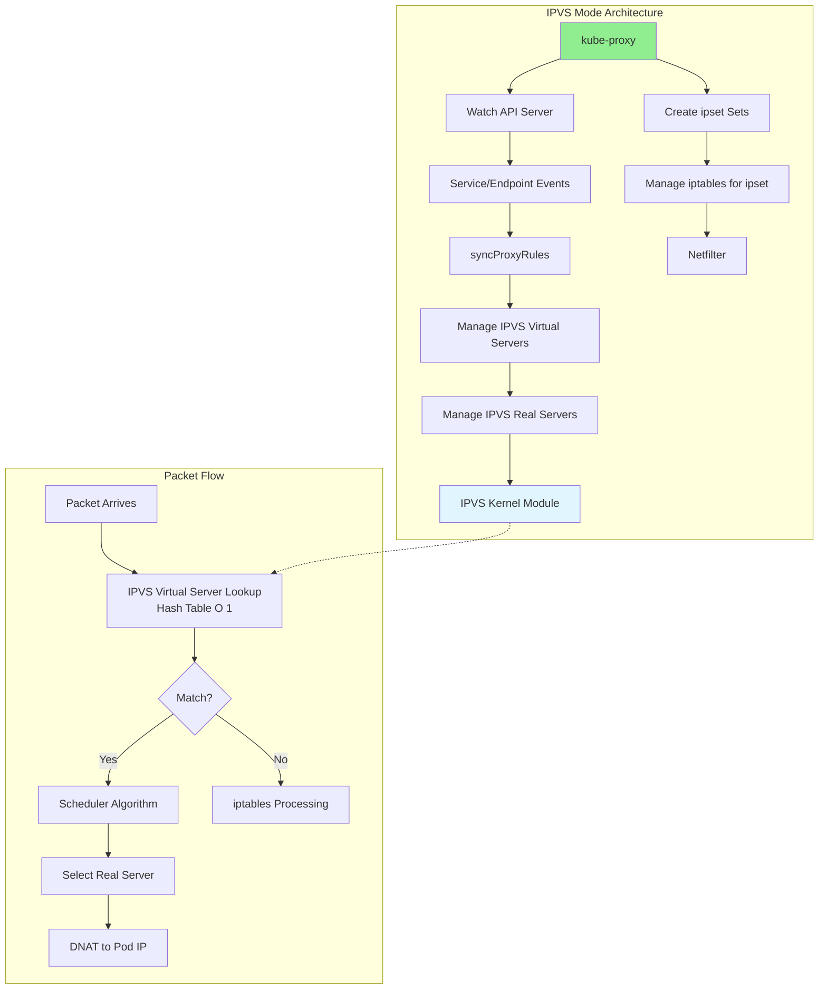

### Components

**IPVS Components**:

1. **Virtual Server** (VS): Service IP:Port
2. **Real Server** (RS): Pod IP:Port (backend)
3. **Scheduler**: Load balancing algorithm
4. **Dummy Interface** (`kube-ipvs0`): Holds Service IPs

**Supporting iptables**:
- **ipset**: Stores IP sets for packet filtering
- **iptables**: Handles cases IPVS doesn't (masquerading, filtering)

### Dummy Interface

IPVS requires Service IPs to exist on the system. kube-proxy creates a dummy interface:

```bash
# Dummy interface creation
ip link add kube-ipvs0 type dummy

# Service IPs assigned to dummy interface
ip addr add 10.96.0.1/32 dev kube-ipvs0
ip addr add 10.96.0.2/32 dev kube-ipvs0
ip addr add 10.96.0.3/32 dev kube-ipvs0

# View all Service IPs
ip addr show kube-ipvs0
```

**Output**:
```
5: kube-ipvs0: <BROADCAST,NOARP> mtu 1500 qdisc noop state DOWN
    link/ether 00:00:00:00:00:00 brd ff:ff:ff:ff:ff:ff
    inet 10.96.0.1/32 scope global kube-ipvs0
    inet 10.96.0.2/32 scope global kube-ipvs0
    inet 10.96.0.3/32 scope global kube-ipvs0
```

### Virtual Server Configuration

**Create Virtual Server**:

```bash
# Add virtual server (Service)
ipvsadm -A -t 10.96.0.1:80 -s rr  # TCP, round-robin scheduler

# Add real servers (Pods)
ipvsadm -a -t 10.96.0.1:80 -r 10.1.2.3:8080 -m -w 100  # Masquerade, weight 100
ipvsadm -a -t 10.96.0.1:80 -r 10.1.2.4:8080 -m -w 100
ipvsadm -a -t 10.96.0.1:80 -r 10.1.2.5:8080 -m -w 100

# List virtual servers
ipvsadm -L -n

# Output:
# IP Virtual Server version 1.2.1 (size=4096)
# Prot LocalAddress:Port Scheduler Flags
#   -> RemoteAddress:Port           Forward Weight ActiveConn InActConn
# TCP  10.96.0.1:80 rr
#   -> 10.1.2.3:8080                Masq    100    0          0
#   -> 10.1.2.4:8080                Masq    100    0          0
#   -> 10.1.2.5:8080                Masq    100    0          0
```

### Scheduling Algorithms

IPVS supports **11 scheduling algorithms**:

| Scheduler | Name | Description | Use Case |
|-----------|------|-------------|----------|
| **rr** | Round-Robin | Distribute equally, cyclically | General purpose (default) |
| **lc** | Least Connection | Route to server with fewest connections | Long-lived connections |
| **wrr** | Weighted Round-Robin | Round-robin based on weights | Heterogeneous backends |
| **wlc** | Weighted Least Connection | LC with weights | Varying capacity + load |
| **sh** | Source Hashing | Hash source IP to same server | Session affinity |
| **dh** | Destination Hashing | Hash destination to same server | Cache affinity |
| **sed** | Shortest Expected Delay | WLC variant, minimize delay | Latency-sensitive |
| **nq** | Never Queue | Send to idle server first | Avoid queuing |
| **lblc** | Locality-Based LC | LC with locality awareness | Distributed systems |
| **lblcr** | LBLC with Replication | LBLC with replication | High availability |
| **fo** | Weighted Failover | Backup server for failover | Active-standby |

**Configuration**:

```yaml
# kube-proxy ConfigMap
apiVersion: v1
kind: ConfigMap
metadata:
  name: kube-proxy
  namespace: kube-system
data:
  config.conf: |
    mode: ipvs
    ipvs:
      scheduler: rr  # or lc, wrr, wlc, sh, dh, sed, nq
```

### Scheduler Comparison

**Round-Robin (rr)**:
```
Request 1 → Server 1
Request 2 → Server 2
Request 3 → Server 3
Request 4 → Server 1  (cycle repeats)
```

**Least Connection (lc)**:
```
Server 1: 5 connections
Server 2: 3 connections  ← New connection goes here
Server 3: 7 connections

Next request → Server 2 (still lowest)
```

**Source Hashing (sh)**:
```
Client A (203.0.113.10) → hash(203.0.113.10) → Server 1 (always)
Client B (203.0.113.20) → hash(203.0.113.20) → Server 2 (always)
```

### ipset Integration

IPVS mode uses **ipset** to store IP sets for iptables matching:

```bash
# List ipsets created by kube-proxy
ipset list

# Example ipsets:
KUBE-CLUSTER-IP           # All service IPs
KUBE-LOOP-BACK            # Hairpin traffic
KUBE-EXTERNAL-IP          # External IPs
KUBE-LOAD-BALANCER        # LoadBalancer IPs
KUBE-NODE-PORT-TCP        # NodePort TCP ports
```

**iptables rules using ipset**:

```bash
# Masquerade for services (if masquerade-all=true)
-A KUBE-SERVICES -m set --match-set KUBE-CLUSTER-IP dst,dst -j KUBE-MARK-MASQ

# Hairpin (pod accessing itself via service)
-A KUBE-POSTROUTING -m set --match-set KUBE-LOOP-BACK dst,dst,src -j MASQUERADE
```

### Performance Characteristics

**Complexity**:
- **Lookup**: O(1) hash table
- **Packet Processing**: Constant time regardless of service count
- **Sync Time**: O(n) - incremental updates

**Performance at Scale**:

| Services | Endpoints | Sync Time | Latency | CPU Usage |
|----------|-----------|-----------|---------|-----------|
| 100 | 1,000 | 5ms | 0.05ms | < 1% |
| 1,000 | 10,000 | 15ms | 0.1ms | 1-2% |
| 5,000 | 50,000 | 60ms | 0.15ms | 3-5% |
| 10,000 | 100,000 | 120ms | 0.18ms | 5-8% |
| 20,000+ | 200,000+ | 250ms | 0.2ms | 10-12% |

**Sweet Spot**: 1,000 to 20,000+ services

### Advantages

✅ **Pros**:
1. **Performance**: O(1) lookup, extremely fast
2. **Scalability**: Handles 10,000+ services easily
3. **Algorithms**: 11 advanced scheduling algorithms
4. **Kernel Integration**: Efficient kernel-based load balancing
5. **Connection Tracking**: Built-in connection persistence
6. **Incremental Updates**: Only update changed virtual/real servers

### Limitations

❌ **Cons**:
1. **Kernel Module**: Requires IPVS kernel modules
2. **Complexity**: More complex than iptables
3. **Debugging**: Less familiar tooling (ipvsadm vs iptables)
4. **Hybrid Mode**: Still uses iptables for some cases (masquerading)
5. **Memory**: Slightly higher memory usage than iptables

### Prerequisites

**Required Kernel Modules**:

```bash
# Load IPVS modules
modprobe ip_vs
modprobe ip_vs_rr     # Round-robin
modprobe ip_vs_wrr    # Weighted round-robin
modprobe ip_vs_sh     # Source hashing
modprobe ip_vs_lc     # Least connection

# Verify modules loaded
lsmod | grep ip_vs
```

**Check IPVS Support**:

```bash
# Check if kernel supports IPVS
[ -f /proc/net/ip_vs ] && echo "IPVS supported" || echo "IPVS not supported"

# Check available schedulers
cat /proc/net/ip_vs
```

### When to Use

**Use IPVS mode when**:
- Cluster has > 1,000 services
- Performance and scalability are critical
- Advanced load balancing algorithms needed
- Kernel supports IPVS (most modern kernels do)

**Code**: `pkg/proxy/ipvs/proxier.go`

---

## nftables Mode

### Overview

**nftables mode** uses the modern nftables framework, designed to replace iptables. It's currently in **beta/alpha** status (as of Kubernetes 1.29+).

### Architecture

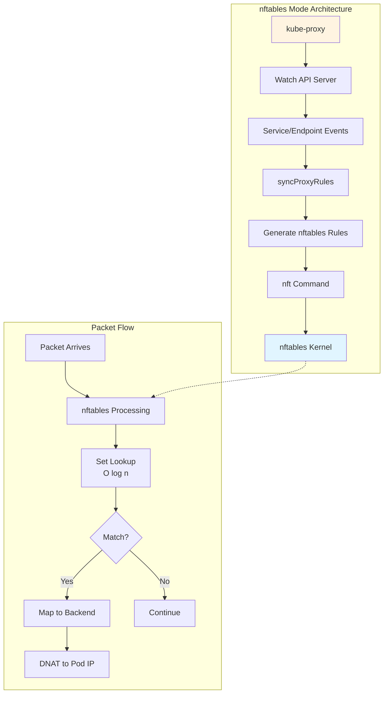

### Advantages over iptables

| Feature | iptables | nftables |
|---------|----------|----------|
| **Performance** | O(n) linear | O(log n) with sets |
| **Syntax** | Complex, arcane | Cleaner, more consistent |
| **Atomicity** | Partial (iptables-restore) | Full atomic updates |
| **API** | Multiple tools | Single `nft` command |
| **Rule Organization** | Flat chains | Hierarchical |
| **IPv4/IPv6** | Separate (iptables/ip6tables) | Unified |

### Example Rules

**Service with nftables**:

```bash
# nftables syntax (much cleaner than iptables)
table ip kube-proxy {
    chain service-10-96-0-1-80 {
        # Load balance using probability
        numgen random mod 3 vmap {
            0: dnat to 10.1.2.3:8080,
            1: dnat to 10.1.2.4:8080,
            2: dnat to 10.1.2.5:8080
        }
    }

    chain services {
        ip daddr 10.96.0.1 tcp dport 80 goto service-10-96-0-1-80
    }
}
```

### Performance Characteristics

**Complexity**:
- **Lookup**: O(log n) with sets/maps
- **Better than iptables**: Yes
- **Better than IPVS**: No (IPVS is O(1))

**Estimated Performance**:

| Services | Sync Time | Latency |
|----------|-----------|---------|
| 1,000 | 20ms | 0.2ms |
| 5,000 | 50ms | 0.5ms |
| 10,000+ | Unknown | Unknown |

### Status

**Current Status** (as of Kubernetes 1.32):
- **Maturity**: Alpha/Beta
- **Recommended**: No (use iptables or IPVS)
- **Future**: Likely to replace iptables as default

### Prerequisites

**Kernel Requirements**:
- Kernel 5.13+ recommended
- nftables support enabled

**Check Support**:

```bash
# Check nftables availability
nft --version

# List current rules
nft list ruleset
```

### When to Use

**Use nftables mode when**:
- You want to experiment with cutting-edge technology
- Modern kernel (5.13+) available
- Contributing to nftables development
- **NOT recommended for production yet**

**Code**: `pkg/proxy/nftables/proxier.go`

---

## userspace Mode (Deprecated)

### Overview

**userspace mode** was the original kube-proxy implementation where kube-proxy itself forwards packets in userspace. **Deprecated and not recommended**.

### Architecture

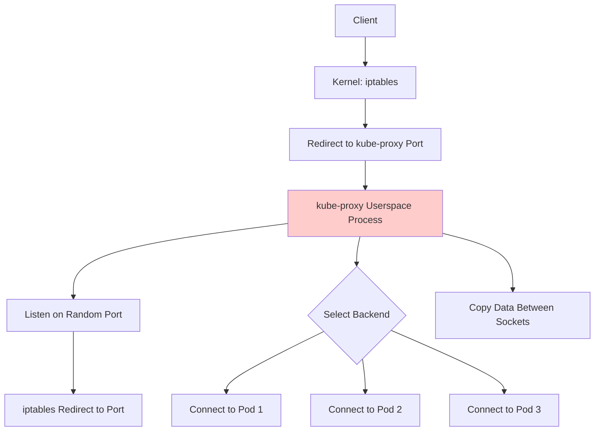

### How It Works

1. kube-proxy listens on a random port for each Service
2. iptables redirects Service traffic to kube-proxy's port
3. kube-proxy accepts connection (userspace)
4. kube-proxy selects backend Pod (round-robin)
5. kube-proxy creates connection to Pod
6. kube-proxy copies data between client and Pod sockets

### Performance

**Terrible**:
- Every packet crosses kernel/userspace boundary (multiple times)
- Context switches for every packet
- Data copying overhead
- High CPU usage

### Why Deprecated

❌ **Problems**:
1. **Slow**: 10-100x slower than kernel-based modes
2. **High CPU**: kube-proxy process uses significant CPU
3. **Doesn't Scale**: Cannot handle high throughput
4. **Single Point of Failure**: kube-proxy process crash breaks all Services

### Historical Context

- **v0.x - v1.0**: Only mode available
- **v1.1**: iptables mode introduced
- **v1.2**: iptables became default
- **v1.3+**: userspace deprecated
- **Current**: Should never be used

### When to Use

**Do NOT use userspace mode** except for:
- Historical curiosity
- Very old Kubernetes versions (< 1.2)

**Code**: `pkg/proxy/userspace/proxier.go` (unmaintained)

---

## Performance Comparison

### Benchmark Results

**Test Setup**:
- 32-core CPU, 128GB RAM
- Linux kernel 5.15
- Services: 100 to 10,000
- Average 10 endpoints per Service

**Sync Time** (how long to update all rules):

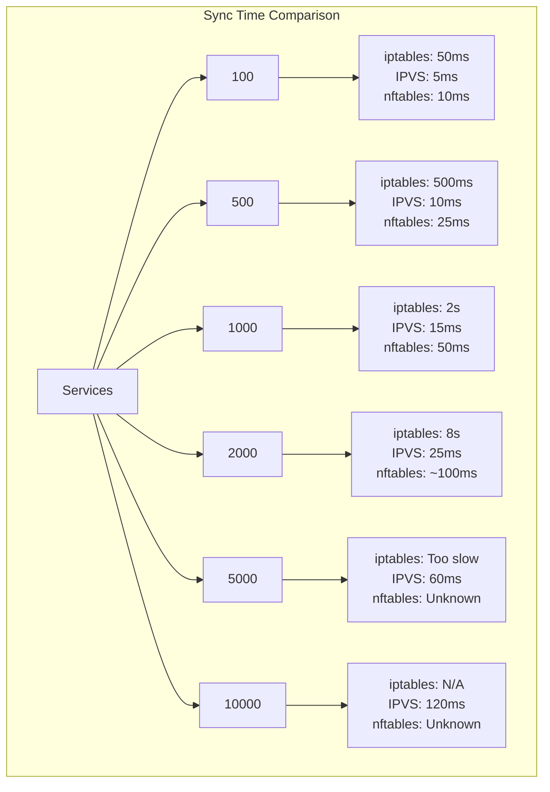

**Packet Latency** (added delay per packet):

| Services | iptables | IPVS | nftables | userspace |
|----------|----------|------|----------|-----------|
| 100 | 0.5ms | 0.05ms | 0.1ms | 50ms |
| 500 | 2ms | 0.08ms | 0.3ms | 100ms |
| 1,000 | 5ms | 0.1ms | 0.5ms | 200ms |
| 2,000 | 15ms | 0.12ms | ~1ms | N/A |
| 5,000 | N/A | 0.15ms | Unknown | N/A |

### Throughput Comparison

**Max Connections Per Second**:

| Mode | Connections/sec | Notes |
|------|-----------------|-------|
| **iptables** | 50,000 | Degrades with service count |
| **IPVS** | 1,000,000+ | Consistent regardless of scale |
| **nftables** | ~100,000 | Better than iptables |
| **userspace** | < 1,000 | Completely unsuitable |

### CPU Usage

**Idle State**:
- All modes: < 1% CPU

**During Sync** (1,000 services):
- iptables: 50-100% (one core)
- IPVS: 5-10%
- nftables: 10-20%
- userspace: N/A

**During Traffic** (10,000 req/sec):
- iptables: 10-15% (rule evaluation overhead)
- IPVS: 1-2% (kernel-optimized)
- nftables: 5-8%
- userspace: 100%+ (multiple cores)

### Memory Usage

| Mode | Memory (1000 svc) | Memory (5000 svc) |
|------|-------------------|-------------------|
| **iptables** | 200-500 MB | 1-2 GB |
| **IPVS** | 300-600 MB | 1.5-2.5 GB |
| **nftables** | 200-400 MB | 1-1.5 GB |
| **userspace** | 100-200 MB | N/A (doesn't scale) |

---

## Scalability Analysis

### Service Count Scalability

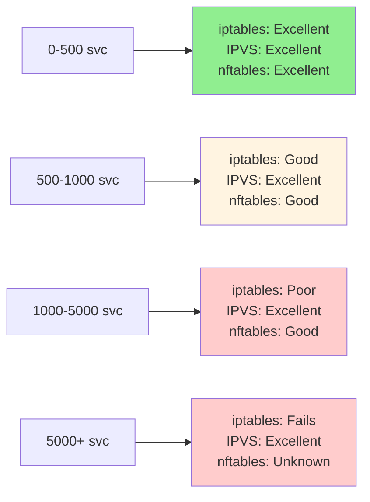

### Recommended Limits

| Mode | Max Services | Max Endpoints | Notes |
|------|--------------|---------------|-------|
| **iptables** | 1,000 | 10,000 | Performance degrades beyond this |
| **IPVS** | 20,000+ | 200,000+ | Tested in production |
| **nftables** | ~5,000 (est) | ~50,000 (est) | Limited production data |
| **userspace** | < 100 | < 1,000 | Not recommended |

---

## Feature Matrix

### Feature Comparison

| Feature | iptables | IPVS | nftables | userspace |
|---------|----------|------|----------|-----------|
| **Load Balancing** | Probability | 11 algorithms | Probability/hash | Round-robin |
| **Session Affinity** | iptables recent | IPVS persistence | nft hashlimit | In-memory |
| **ExternalTrafficPolicy** | ✅ | ✅ | ✅ | ✅ |
| **InternalTrafficPolicy** | ✅ | ✅ | ✅ | ❌ |
| **Kernel Required** | 2.4+ | 2.6.9+ | 5.13+ | Any |
| **IPv6** | ✅ (ip6tables) | ✅ | ✅ | ✅ |
| **SCTP** | ✅ | ✅ | ✅ | ❌ |
| **Connection Tracking** | Netfilter | IPVS + Netfilter | nftables | None |
| **Debugging Tools** | Excellent | Good | Limited | Poor |

### Operational Complexity

| Aspect | iptables | IPVS | nftables | userspace |
|--------|----------|------|----------|-----------|
| **Setup** | Easy | Moderate | Easy | Easy |
| **Debugging** | Easy | Moderate | Hard | Easy |
| **Monitoring** | Good | Good | Limited | Poor |
| **Troubleshooting** | Excellent docs | Good docs | Limited docs | Deprecated |
| **Learning Curve** | Low | Medium | Medium | Low |

---

## Mode Selection Guide

### Decision Tree

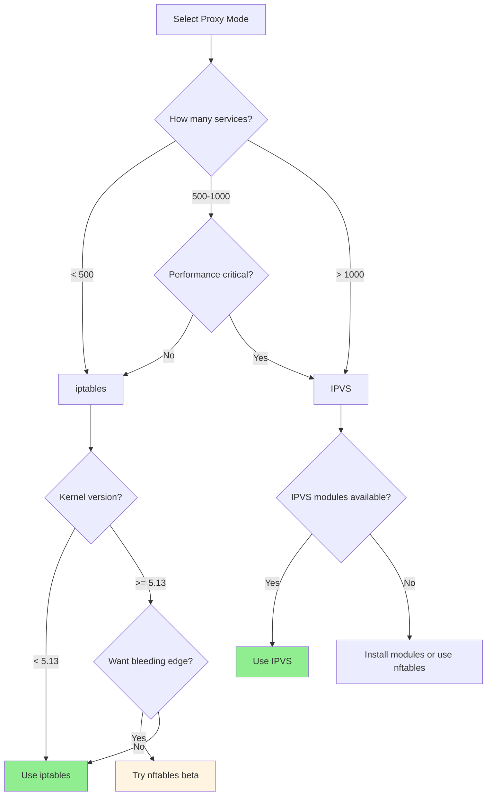

### Selection Criteria

**Choose iptables if**:
✅ Cluster has < 1,000 services
✅ Stability is paramount
✅ Team familiar with iptables
✅ Standard Linux environment

**Choose IPVS if**:
✅ Cluster has > 1,000 services
✅ Performance is critical
✅ Scalability needed
✅ Advanced load balancing desired
✅ Kernel modules available

**Choose nftables if**:
✅ Modern kernel available (5.13+)
✅ Want to experiment
✅ Contributing to development
✅ NOT for production (yet)

**Never choose userspace**:
❌ Deprecated, slow, unmaintained

---

## Migration Between Modes

### iptables → IPVS

**Prerequisites**:
```bash
# Install IPVS kernel modules
modprobe ip_vs
modprobe ip_vs_rr
modprobe ip_vs_wrr
modprobe ip_vs_sh
modprobe ip_vs_lc

# Verify
lsmod | grep ip_vs
```

**Migration Steps**:

```yaml
# 1. Update kube-proxy ConfigMap
apiVersion: v1
kind: ConfigMap
metadata:
  name: kube-proxy
  namespace: kube-system
data:
  config.conf: |
    mode: ipvs
    ipvs:
      scheduler: rr
      # ... other settings

# 2. Rolling restart kube-proxy DaemonSet
kubectl rollout restart daemonset/kube-proxy -n kube-system

# 3. Verify new mode
kubectl logs -n kube-system -l k8s-app=kube-proxy | grep "Using ipvs Proxier"

# 4. Check IPVS rules
kubectl exec -n kube-system kube-proxy-xxxxx -- ipvsadm -L -n
```

**Rollback**:
```yaml
# Change mode back to iptables
data:
  config.conf: |
    mode: iptables

# Restart
kubectl rollout restart daemonset/kube-proxy -n kube-system
```

**Zero-Downtime Migration**:

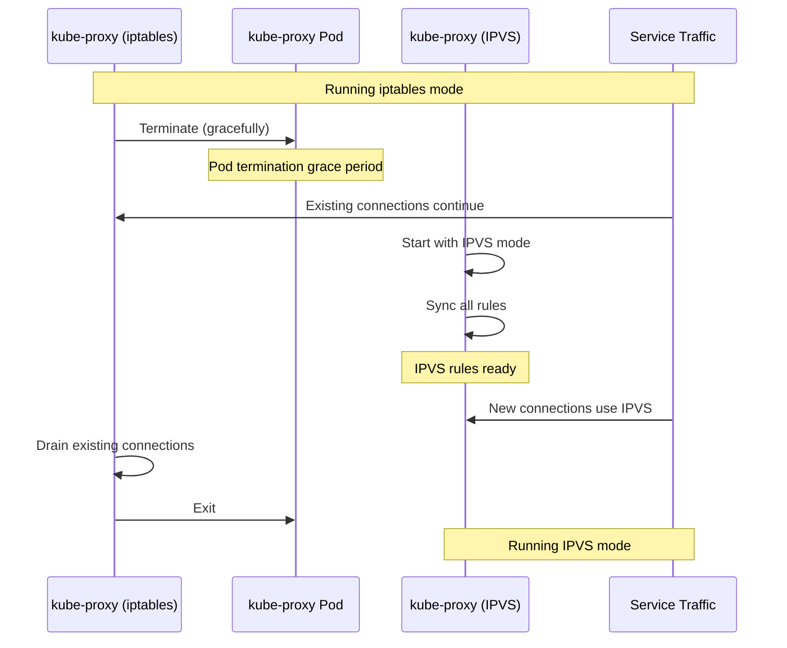

### Validation

**After Migration**:

```bash
# Check mode
kubectl logs -n kube-system -l k8s-app=kube-proxy | grep "Using.*Proxier"

# For IPVS: Check virtual servers
kubectl exec -n kube-system kube-proxy-xxxxx -- ipvsadm -L -n | head -20

# For iptables: Check rules
kubectl exec -n kube-system kube-proxy-xxxxx -- iptables -t nat -L KUBE-SERVICES | head -20

# Test service connectivity
kubectl run test --image=busybox --rm -it -- wget -O- http://kubernetes.default.svc.cluster.local
```

---

## Troubleshooting by Mode

### iptables Mode Troubleshooting

**Check Rules**:
```bash
# List all kube-proxy chains
iptables -t nat -L -n -v | grep KUBE

# Check specific service
iptables -t nat -L KUBE-SERVICES -n -v | grep "10.96.0.1"

# Trace packet flow
iptables -t nat -L -n -v --line-numbers
```

**Common Issues**:

| Issue | Symptom | Solution |
|-------|---------|----------|
| **Service not accessible** | Connection timeout | Check KUBE-SERVICES chain has service |
| **Slow performance** | High latency | Migrate to IPVS |
| **High CPU** | kube-proxy CPU spikes | Too many services, use IPVS |
| **Rule sync failures** | Logs show iptables errors | Check iptables-restore failures |

### IPVS Mode Troubleshooting

**Check Virtual Servers**:
```bash
# List all virtual servers
ipvsadm -L -n

# Show statistics
ipvsadm -L -n --stats

# Show connection table
ipvsadm -L -n -c
```

**Common Issues**:

| Issue | Symptom | Solution |
|-------|---------|----------|
| **Modules not loaded** | kube-proxy fails to start | `modprobe ip_vs ip_vs_rr` |
| **Dummy interface missing** | No kube-ipvs0 | kube-proxy creates it, check logs |
| **ipset errors** | ipset command fails | Install ipset package |
| **Connection distribution uneven** | Load imbalance | Check scheduler (rr vs lc) |

### nftables Mode Troubleshooting

**Check Rules**:
```bash
# List all nftables rules
nft list ruleset

# List kube-proxy table
nft list table ip kube-proxy
```

**Common Issues**:

| Issue | Symptom | Solution |
|-------|---------|----------|
| **nftables not available** | Command not found | Install nftables package |
| **Kernel too old** | Mode not available | Upgrade kernel to 5.13+ |
| **Rule conflicts** | Unexpected behavior | Check for conflicting rules |

---

## Best Practices

### General Best Practices

1. **Choose Right Mode**: Use IPVS for > 1,000 services
2. **Monitor Performance**: Track sync latency, packet latency
3. **Plan Capacity**: Size based on expected service count
4. **Test Migration**: Always test mode changes in staging first
5. **Keep Updated**: Use recent Kubernetes versions for bug fixes

### iptables Mode Best Practices

✅ **Do**:
- Use for small to medium clusters (< 1,000 services)
- Monitor rule count: `iptables -t nat -L | wc -l`
- Set up alerting for sync latency
- Keep iptables package updated

❌ **Don't**:
- Use for large clusters (> 1,000 services)
- Ignore high sync times (> 1 second)
- Modify kube-proxy rules manually

### IPVS Mode Best Practices

✅ **Do**:
- Load kernel modules at boot (`/etc/modules-load.d/`)
- Choose appropriate scheduler (rr for general, lc for long connections)
- Monitor IPVS stats: `ipvsadm -L -n --stats`
- Use for clusters with > 1,000 services

❌ **Don't**:
- Forget to install ipset package
- Manually modify IPVS rules
- Use on kernels without IPVS support

### Configuration Best Practices

```yaml
# Production-ready kube-proxy config
apiVersion: kubeproxy.config.k8s.io/v1alpha1
kind: KubeProxyConfiguration
mode: ipvs  # or iptables for small clusters
ipvs:
  scheduler: rr  # or lc for connection-based LB
  syncPeriod: 30s  # Full resync interval
  minSyncPeriod: 1s  # Debounce window
conntrack:
  maxPerCore: 32768  # Tune based on connections
  min: 131072
  tcpEstablishedTimeout: 86400s  # 24 hours
  tcpCloseWaitTimeout: 1h
metricsBindAddress: 0.0.0.0:10249
healthzBindAddress: 0.0.0.0:10256
```

---

## Summary

This document provided a comprehensive comparison of kube-proxy proxy modes. Key takeaways:

**Mode Summary**:

| Mode | Status | Performance | Scale | Use Case |
|------|--------|-------------|-------|----------|
| **iptables** | Stable (GA) | Good | < 1,000 svc | Default, general purpose |
| **IPVS** | Stable (GA) | Excellent | 10,000+ svc | Large clusters, high performance |
| **nftables** | Beta | Good | ~5,000 svc | Experimental, future |
| **userspace** | Deprecated | Poor | N/A | Never use |

**Recommendations**:
- **< 1,000 services**: iptables (default, stable)
- **> 1,000 services**: IPVS (scalable, fast)
- **Experimental**: nftables (not for production)
- **Never**: userspace (deprecated)

**Performance**:
- **iptables**: O(n) degradation, ~1,000 service limit
- **IPVS**: O(1) hash table, 10,000+ services
- **nftables**: O(log n), better than iptables

**Next Steps**:
- Read [03-service-abstraction.md](03-service-abstraction.md) for Service details
- Read [../middle-level/02-iptables-mode.md](../middle-level/02-iptables-mode.md) for iptables deep dive
- Read [../middle-level/03-ipvs-mode.md](../middle-level/03-ipvs-mode.md) for IPVS deep dive

**Related Documents**:
- [01-system-overview.md](01-system-overview.md) - System architecture
- [../01-REQUIREMENTS.md](../01-REQUIREMENTS.md) - Performance requirements
- [../low-level/10-performance-optimization.md](../low-level/10-performance-optimization.md) - Tuning guide
