# Service Abstraction

**Comprehensive guide to Kubernetes Service abstraction and how kube-proxy implements it**

**Version**: Kubernetes 1.32+
**Last Updated**: 2024

---

## Table of Contents

- [Overview](#overview)
- [The Problem Services Solve](#the-problem-services-solve)
- [Service Abstraction Concept](#service-abstraction-concept)
- [How Services Work](#how-services-work)
- [Service Types Deep Dive](#service-types-deep-dive)
- [Service Discovery](#service-discovery)
- [Endpoint Selection and Management](#endpoint-selection-and-management)
- [Load Balancing Semantics](#load-balancing-semantics)
- [Traffic Routing Patterns](#traffic-routing-patterns)
- [Service Lifecycle](#service-lifecycle)
- [Integration with kube-proxy](#integration-with-kube-proxy)
- [Advanced Service Patterns](#advanced-service-patterns)
- [Best Practices](#best-practices)
- [Troubleshooting Services](#troubleshooting-services)
- [Summary](#summary)

---

## Overview

**Kubernetes Services** provide a stable network abstraction over dynamic sets of Pods. This document explains the Service concept, how it solves fundamental networking challenges, and how kube-proxy implements the Service data plane.

### What is a Service?

A **Service** is a Kubernetes API object that defines a logical set of Pods and a policy for accessing them. Services provide:

1. **Stable IP address** (ClusterIP) that doesn't change
2. **Stable DNS name** for service discovery
3. **Load balancing** across backend Pods
4. **Service types** for different exposure patterns
5. **Decoupling** between service consumers and providers

### Why Services Matter

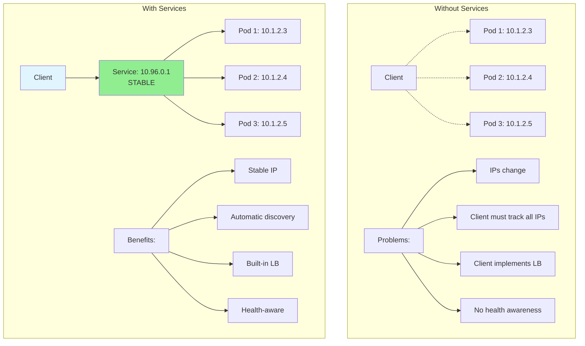

---

## The Problem Services Solve

### Challenge 1: Pod Ephemerality

**Pods are ephemeral** - they can be created, destroyed, and rescheduled frequently:

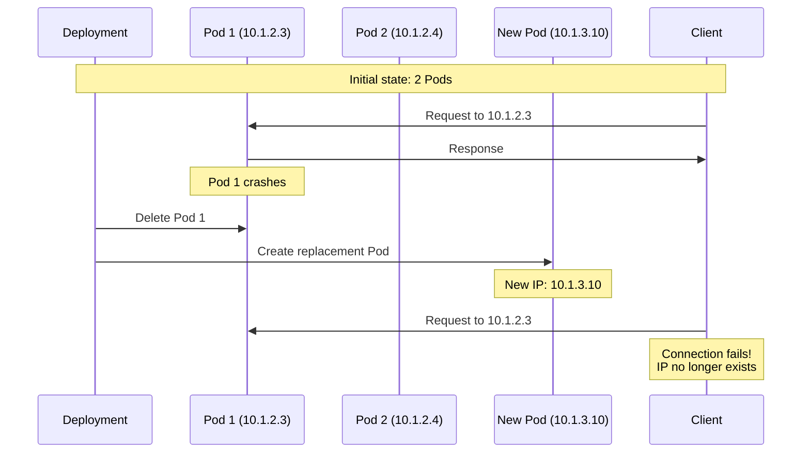

**Pod IP Changes Happen Due To**:
- Node failures
- Pod crashes
- Scaling (up/down)
- Rolling updates
- Node maintenance
- Evictions

### Challenge 2: Service Discovery

**How do clients discover backend Pods?**

Without Services:
```
❌ Client must query API Server for Pod IPs
❌ Client must handle Pod IP changes
❌ Client must maintain watch on Pod events
❌ Complex client-side logic
```

With Services:
```
✅ Client uses stable Service DNS name
✅ DNS resolves to stable ClusterIP
✅ kube-proxy handles routing
✅ Simple client-side logic
```

### Challenge 3: Load Balancing

**How to distribute traffic across multiple Pod replicas?**

Without Services:
```
❌ Client implements load balancing
❌ Client tracks endpoint health
❌ Client handles failures/retries
❌ Inconsistent LB across clients
```

With Services:
```
✅ kube-proxy provides load balancing
✅ Automatic health awareness
✅ Transparent to clients
✅ Consistent cluster-wide
```

### Challenge 4: External Access

**How to expose internal services externally?**

Without Services:
```
❌ Manual port forwarding per Pod
❌ Exposing Pod IPs directly (ephemeral)
❌ Complex firewall rules
❌ No centralized management
```

With Services:
```
✅ NodePort type (static port on all nodes)
✅ LoadBalancer type (cloud LB integration)
✅ ExternalIPs (user-specified IPs)
✅ Centralized Service object
```

---

## Service Abstraction Concept

### Core Abstraction

Services provide **indirection** between clients and Pods:

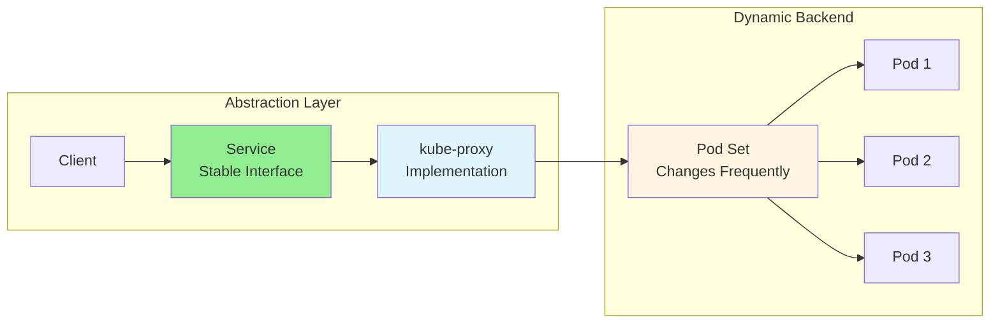

**Abstraction Properties**:
1. **Stable Identity**: ClusterIP and DNS name never change
2. **Dynamic Binding**: Backend Pods can change freely
3. **Transparent Routing**: kube-proxy handles forwarding
4. **Health Awareness**: Only routes to Ready Pods

### Service Components

A Service consists of:

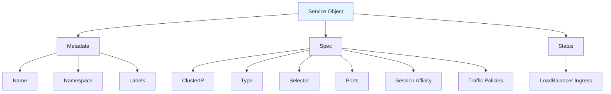

**Example Service**:

```yaml
apiVersion: v1
kind: Service
metadata:
  name: my-app          # Service name
  namespace: default    # Namespace
  labels:
    app: my-app
spec:
  type: ClusterIP       # Service type
  clusterIP: 10.96.0.1  # Stable virtual IP
  selector:             # Pod selector
    app: my-app
    tier: backend
  ports:
  - name: http
    port: 80            # Service port
    targetPort: 8080    # Pod port
    protocol: TCP
  sessionAffinity: None
  externalTrafficPolicy: Cluster
```

---

## How Services Work

### End-to-End Flow

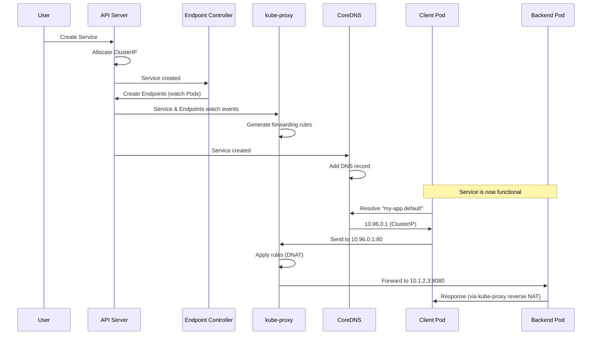

### Component Roles

| Component | Role | Responsibility |
|-----------|------|----------------|
| **API Server** | Coordination | Store Service objects, allocate ClusterIPs |
| **Endpoint Controller** | Control Plane | Create/update Endpoints based on Pod selector |
| **kube-proxy** | Data Plane | Implement packet forwarding to Pods |
| **CoreDNS** | Service Discovery | Resolve service names to ClusterIPs |
| **Client** | Consumer | Use stable Service name/IP |
| **Pods** | Provider | Serve requests |

### ClusterIP Allocation

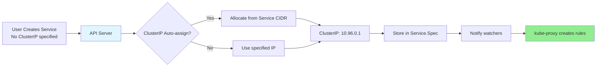

**Service CIDR** (configured on API Server):
```bash
# Typical configuration
--service-cluster-ip-range=10.96.0.0/12

# This provides ~1 million ClusterIPs:
# 10.96.0.0 to 10.111.255.255
```

**ClusterIP Properties**:
- **Unique**: No two Services share same ClusterIP
- **Virtual**: Not assigned to any network interface
- **Routable**: Only within cluster (via kube-proxy rules)
- **Stable**: Never changes for lifetime of Service

---

## Service Types Deep Dive

### Type Comparison

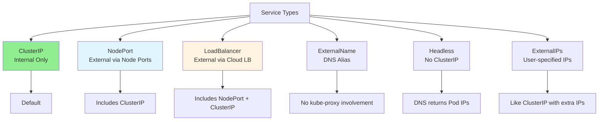

### ClusterIP Service

**Purpose**: Internal cluster communication only.

**Characteristics**:
- Default service type
- ClusterIP allocated from service CIDR
- Accessible only from within cluster
- DNS name: `<service>.<namespace>.svc.cluster.local`

**YAML**:
```yaml
apiVersion: v1
kind: Service
metadata:
  name: backend
spec:
  type: ClusterIP  # Default, can omit
  selector:
    app: backend
  ports:
  - port: 80
    targetPort: 8080
```

**Access Pattern**:
```
Pod → Service DNS/IP → kube-proxy → Backend Pods
```

**Traffic Flow**:
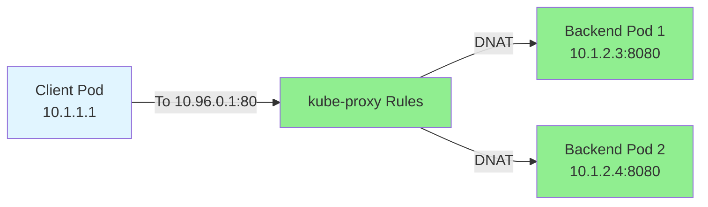

### NodePort Service

**Purpose**: External access via static port on all nodes.

**Characteristics**:
- Includes ClusterIP (accessible internally)
- Opens static port (30000-32767) on **all** nodes
- External clients can access via `<NodeIP>:<NodePort>`
- kube-proxy creates rules on every node

**YAML**:
```yaml
apiVersion: v1
kind: Service
metadata:
  name: web
spec:
  type: NodePort
  selector:
    app: web
  ports:
  - port: 80          # ClusterIP port
    targetPort: 8080  # Pod port
    nodePort: 30080   # NodePort (auto if omitted)
```

**Access Patterns**:
```
Internal:  Pod → ClusterIP:80 → kube-proxy → Backend Pods
External:  Client → NodeIP:30080 → kube-proxy → Backend Pods
```

**Traffic Flow**:
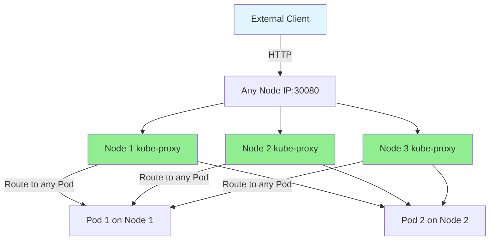

**NodePort Allocation**:
```bash
# Default range: 30000-32767 (configurable on API Server)
--service-node-port-range=30000-32767

# Auto-assign: Omit nodePort in spec
# Manual assign: Specify nodePort (must be in range)
```

### LoadBalancer Service

**Purpose**: External access via cloud provider load balancer.

**Characteristics**:
- Includes NodePort and ClusterIP
- Cloud controller provisions external LB
- LB forwards to NodePort on nodes
- External IP assigned by cloud provider

**YAML**:
```yaml
apiVersion: v1
kind: Service
metadata:
  name: public-app
spec:
  type: LoadBalancer
  selector:
    app: web
  ports:
  - port: 80
    targetPort: 8080
```

**Provisioning Flow**:
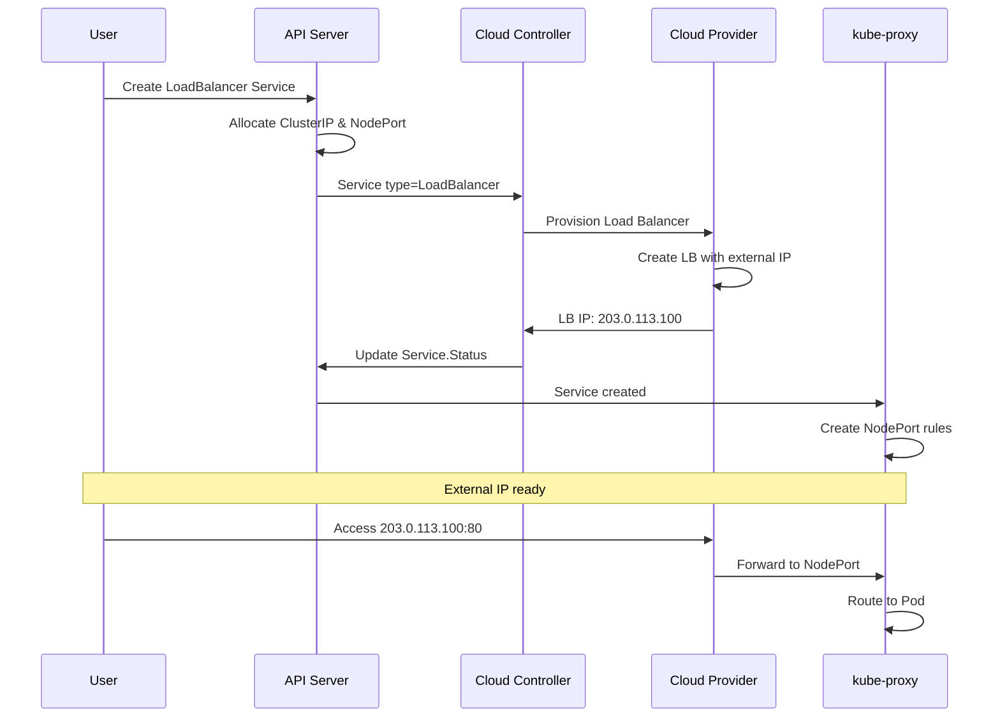

**Traffic Flow**:
```
External → Cloud LB (203.0.113.100:80)
         → NodeIP:NodePort (192.168.1.101:30080)
         → kube-proxy
         → Backend Pod (10.1.2.3:8080)
```

**Service Status**:
```yaml
status:
  loadBalancer:
    ingress:
    - ip: 203.0.113.100  # External IP from cloud
```

### ExternalName Service

**Purpose**: Create DNS CNAME to external service.

**Characteristics**:
- No ClusterIP allocated
- No kube-proxy involvement
- Pure DNS record (created by CoreDNS)
- Used to alias external services

**YAML**:
```yaml
apiVersion: v1
kind: Service
metadata:
  name: external-db
spec:
  type: ExternalName
  externalName: db.example.com
```

**DNS Resolution**:
```
my-app → DNS lookup: external-db.default.svc.cluster.local
       → CNAME: db.example.com
       → A record: 203.0.113.50
       → Direct connection to 203.0.113.50
```

**No kube-proxy**:
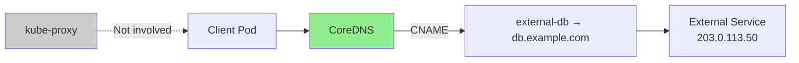

### Headless Service

**Purpose**: Service discovery without load balancing.

**Characteristics**:
- ClusterIP set to `None`
- DNS returns Pod IPs directly (not ClusterIP)
- No kube-proxy load balancing
- Used for StatefulSets, custom client-side LB

**YAML**:
```yaml
apiVersion: v1
kind: Service
metadata:
  name: statefulset-svc
spec:
  clusterIP: None  # Headless
  selector:
    app: postgres
  ports:
  - port: 5432
```

**DNS Behavior**:
```
Normal Service:
  my-service.default.svc.cluster.local → A record → 10.96.0.1 (ClusterIP)

Headless Service:
  statefulset-svc.default.svc.cluster.local → A records → 10.1.2.3, 10.1.2.4, 10.1.2.5 (Pod IPs)
```

**Use Cases**:
- **StatefulSets**: Direct Pod addressing (postgres-0, postgres-1)
- **Client-side LB**: Application implements own load balancing
- **Discovery only**: Just need to find Pod IPs

---

## Service Discovery

### DNS-Based Discovery

**CoreDNS** provides DNS records for Services:

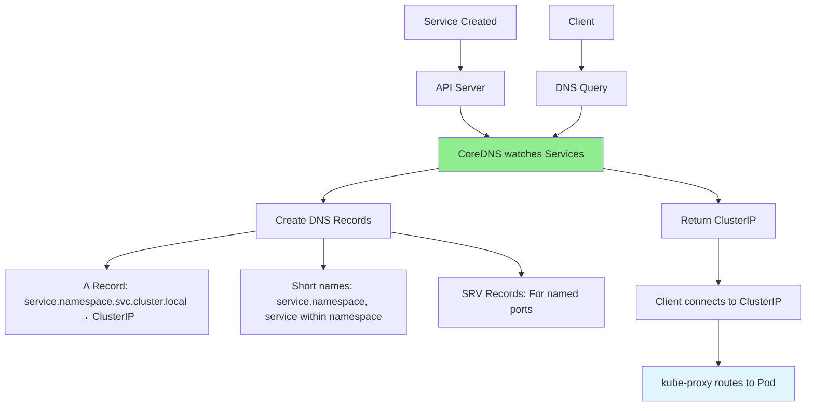

**DNS Naming**:

| FQDN | Resolves To | Accessible From |
|------|-------------|-----------------|
| `service.namespace.svc.cluster.local` | ClusterIP | Anywhere in cluster |
| `service.namespace.svc` | ClusterIP | Anywhere in cluster |
| `service.namespace` | ClusterIP | Anywhere in cluster |
| `service` | ClusterIP | Same namespace only |

**Example**:
```yaml
apiVersion: v1
kind: Service
metadata:
  name: backend
  namespace: production
spec:
  clusterIP: 10.96.0.1
  ports:
  - port: 80
```

**DNS Records**:
```
backend.production.svc.cluster.local → 10.96.0.1
backend.production.svc → 10.96.0.1
backend.production → 10.96.0.1
backend (from production namespace only) → 10.96.0.1
```

### Environment Variable Discovery

**kubelet** injects environment variables for Services that exist when a Pod is created:

```yaml
# Service
apiVersion: v1
kind: Service
metadata:
  name: backend
spec:
  clusterIP: 10.96.0.1
  ports:
  - port: 80
```

**Environment Variables** (in Pods created after Service):
```bash
BACKEND_SERVICE_HOST=10.96.0.1
BACKEND_SERVICE_PORT=80
BACKEND_PORT=tcp://10.96.0.1:80
BACKEND_PORT_80_TCP=tcp://10.96.0.1:80
BACKEND_PORT_80_TCP_PROTO=tcp
BACKEND_PORT_80_TCP_PORT=80
BACKEND_PORT_80_TCP_ADDR=10.96.0.1
```

**Limitations**:
- Only Services created **before** Pod creation
- Pod restart doesn't refresh variables
- Not recommended (use DNS instead)

---

## Endpoint Selection and Management

### Pod Selection via Labels

Services select Pods using **label selectors**:

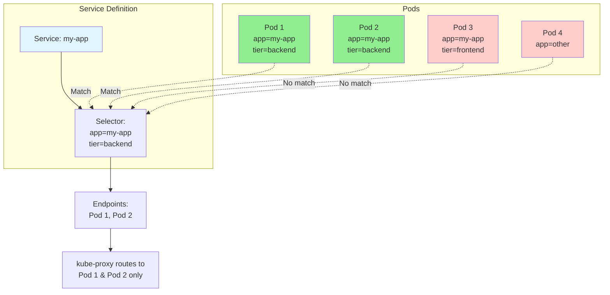

**Example**:
```yaml
# Service
apiVersion: v1
kind: Service
metadata:
  name: my-app
spec:
  selector:
    app: my-app      # Matches Pods with this label
    tier: backend    # AND this label
  ports:
  - port: 80
---
# Deployment (creates Pods)
apiVersion: apps/v1
kind: Deployment
metadata:
  name: my-app
spec:
  replicas: 3
  selector:
    matchLabels:
      app: my-app
      tier: backend
  template:
    metadata:
      labels:
        app: my-app    # Service will select these Pods
        tier: backend
    spec:
      containers:
      - name: app
        image: my-app:v1
```

### Endpoint Controller

**Endpoint Controller** (in Controller Manager) maintains Endpoints:

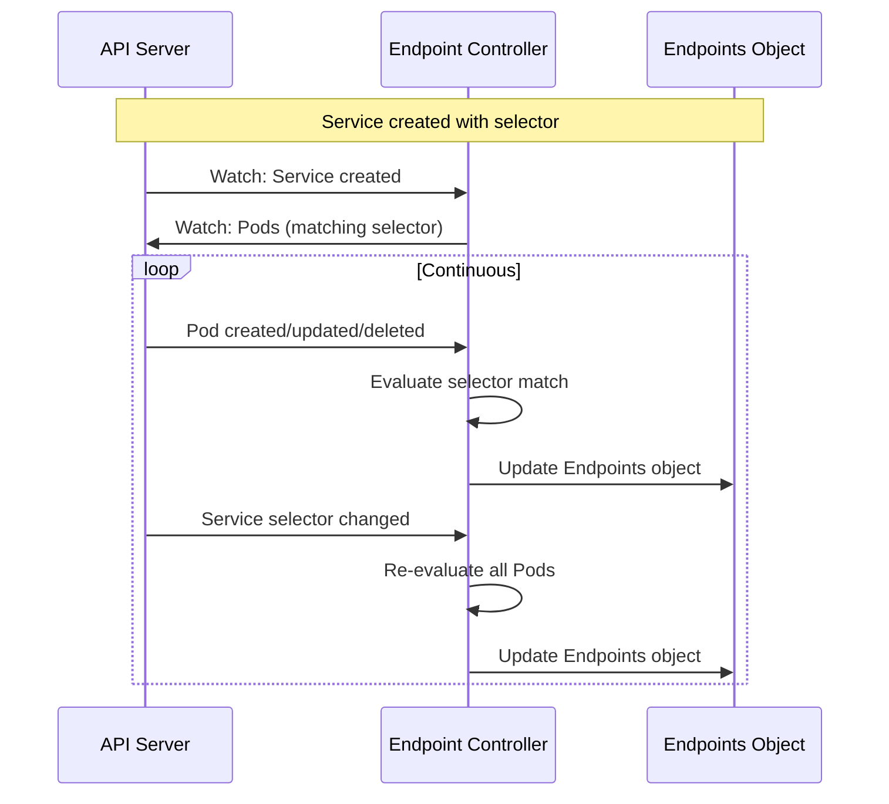

### EndpointSlices

**EndpointSlices** (GA in 1.21) replace Endpoints for scalability:

**Problem with Endpoints**:
```
Service with 5000 Pods:
- Single Endpoints object with 5000 entries (~500KB)
- Any Pod change → entire object re-sent to all watchers
- High API server load
- High kube-proxy memory/CPU
```

**Solution with EndpointSlices**:
```
Service with 5000 Pods:
- 50 EndpointSlice objects (~100 endpoints each)
- Pod change → only affected slice updated (~10KB)
- Lower API server load
- Lower kube-proxy resource usage
```

**Comparison**:

| Aspect | Endpoints | EndpointSlices |
|--------|-----------|----------------|
| **Object Size** | Unbounded (grows with Pods) | Fixed (~100 endpoints) |
| **Update Efficiency** | Full object | Only changed slices |
| **Max Scale** | ~1000 endpoints practical | 100,000+ endpoints |
| **API Load** | High for large services | Low, scales linearly |
| **Status** | Deprecated (still supported) | GA, recommended |

---

## Load Balancing Semantics

### Service-Level Load Balancing

kube-proxy provides **connection-level load balancing**:

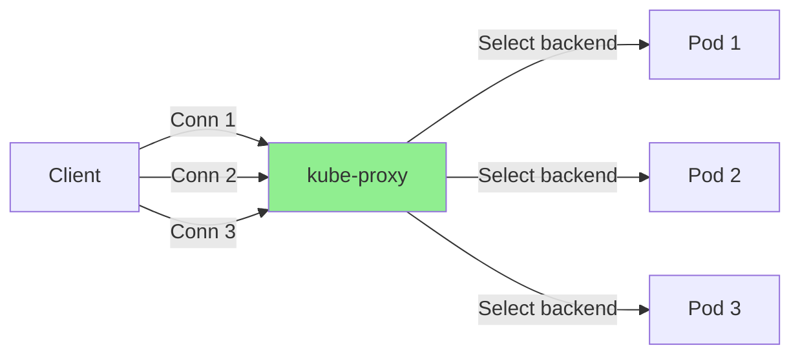

**Characteristics**:
- **Connection-based**: Each new connection load balanced independently
- **Stateless** (iptables): No memory of previous connections (except session affinity)
- **Stateful** (IPVS): Can track connections (least connection scheduler)

### Session Affinity

**ClientIP session affinity** ensures same client → same backend:

```yaml
apiVersion: v1
kind: Service
metadata:
  name: stateful-app
spec:
  sessionAffinity: ClientIP
  sessionAffinityConfig:
    clientIP:
      timeoutSeconds: 10800  # 3 hours
  selector:
    app: stateful-app
  ports:
  - port: 80
```

**Behavior**:
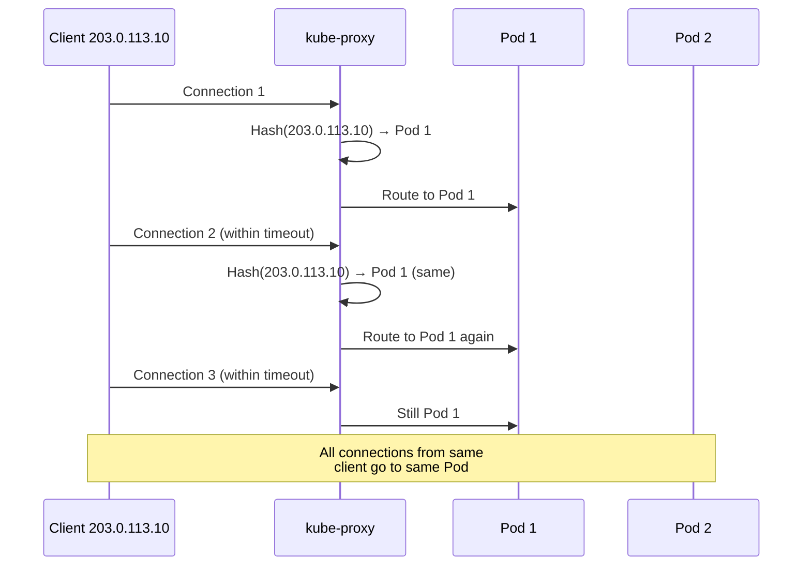

**Implementation**:
- **iptables**: Uses `recent` module
- **IPVS**: Uses persistence mechanism

---

## Traffic Routing Patterns

### Internal Traffic (Pod-to-Service)

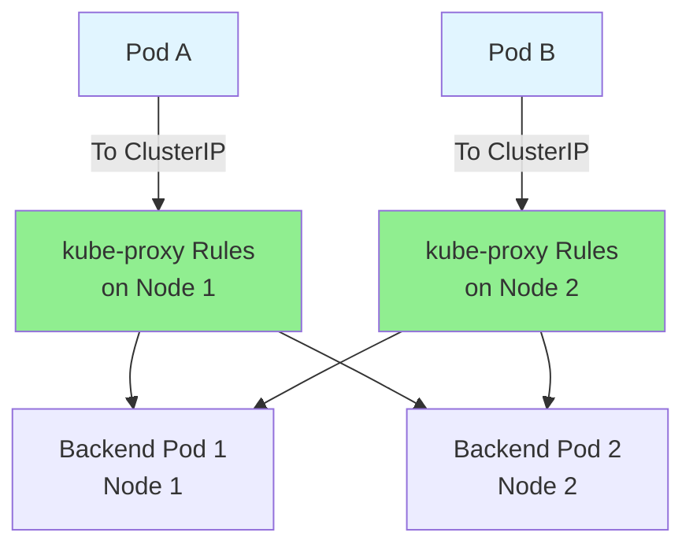

**Characteristics**:
- No SNAT (source IP preserved)
- Can route to any Pod (cluster-wide)
- Low latency (kernel-based)

### External Traffic (ExternalTrafficPolicy: Cluster)

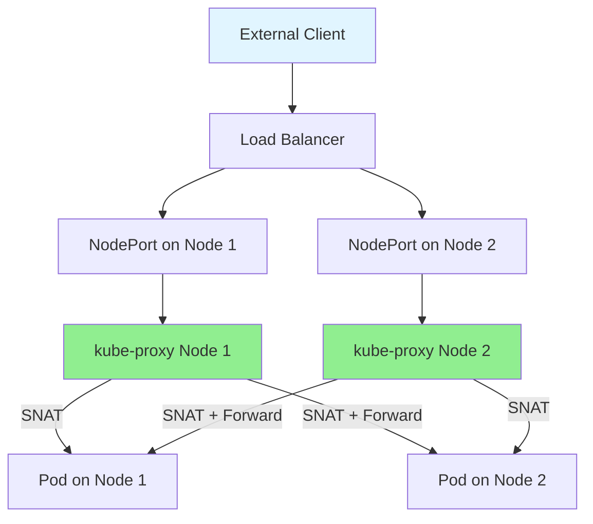

**Characteristics**:
- SNAT applied (source IP lost)
- Even load distribution
- Potential extra hop (node → node)

### External Traffic (ExternalTrafficPolicy: Local)

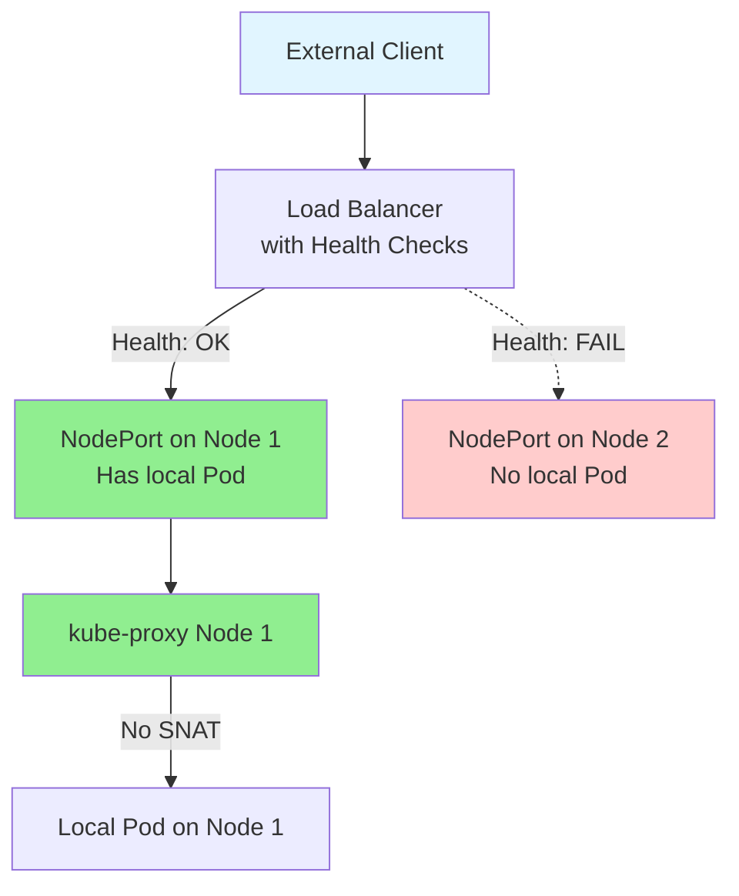

**Characteristics**:
- No SNAT (source IP preserved)
- Uneven load distribution
- No extra hops
- Requires health check NodePort

---

## Service Lifecycle

### Creation Flow

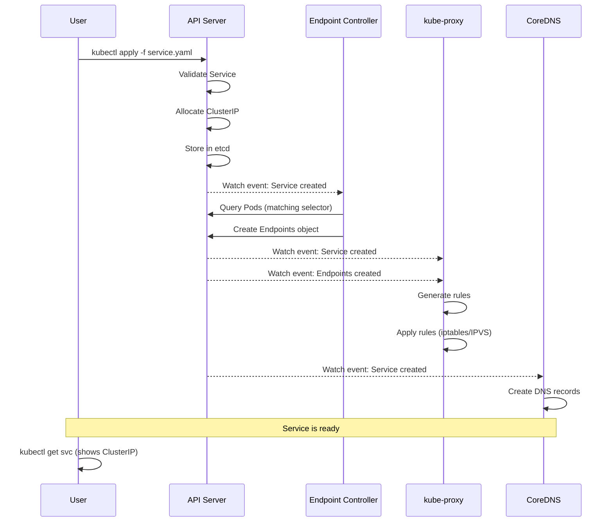

### Update Flow

```mermaid
sequenceDiagram
    participant U as User
    participant API as API Server
    participant KP as kube-proxy

    U->>API: Update Service (e.g., add port)
    API->>API: Validate update
    API->>API: Update in etcd

    API-->>KP: Watch event: Service updated
    KP->>KP: Detect changes (ServiceChangeTracker)
    KP->>KP: Regenerate rules
    KP->>KP: Apply updated rules

    Note over KP: Existing connections may continue<br/>New connections use new rules
```

### Deletion Flow

```mermaid
sequenceDiagram
    participant U as User
    participant API as API Server
    participant EC as Endpoint Controller
    participant KP as kube-proxy
    participant DNS as CoreDNS

    U->>API: kubectl delete svc my-service
    API->>API: Mark for deletion

    API-->>EC: Watch event: Service deleted
    EC->>API: Delete Endpoints object

    API-->>KP: Watch event: Service deleted
    API-->>KP: Watch event: Endpoints deleted
    KP->>KP: Remove rules
    KP->>KP: Apply changes (iptables/IPVS)

    API-->>DNS: Watch event: Service deleted
    DNS->>DNS: Remove DNS records

    API->>API: Delete from etcd

    Note over U,DNS: Service removed
```

---

## Integration with kube-proxy

### Watch-Based Integration

```mermaid
graph TB
    subgraph "Control Plane"
        A[API Server] --> B[Services]
        A --> C[Endpoints/EndpointSlices]
    end

    subgraph "kube-proxy on Each Node"
        D[Watch Loop] --> E{Event Type?}
        E -->|Service Add| F[OnServiceAdd]
        E -->|Service Update| G[OnServiceUpdate]
        E -->|Service Delete| H[OnServiceDelete]
        E -->|Endpoint Add| I[OnEndpointSliceAdd]
        E -->|Endpoint Update| J[OnEndpointSliceUpdate]
        E -->|Endpoint Delete| K[OnEndpointSliceDelete]

        F --> L[Trigger Sync]
        G --> L
        H --> L
        I --> L
        J --> L
        K --> L

        L --> M[syncProxyRules]
        M --> N[Generate Rules]
        N --> O[Apply to Kernel]
    end

    A -.->|Watch Stream| D

    style D fill:#e1f5ff
    style M fill:#90ee90
```

### Rule Generation

**For each Service**:

```
For Service "my-app" (ClusterIP: 10.96.0.1:80):
  1. Get Endpoints (Pods matching selector)
  2. Filter to Ready endpoints only
  3. Apply traffic policy (Local vs Cluster)
  4. Generate service chain (KUBE-SVC-*)
  5. Generate endpoint chains (KUBE-SEP-*)
  6. Apply load balancing (probability/scheduler)
  7. Apply session affinity if configured
  8. Handle service type (ClusterIP/NodePort/LoadBalancer)
```

**Code**: `pkg/proxy/iptables/proxier.go:syncProxyRules()`

---

## Advanced Service Patterns

### Multi-Port Services

```yaml
apiVersion: v1
kind: Service
metadata:
  name: multi-port-app
spec:
  selector:
    app: multi-port
  ports:
  - name: http
    port: 80
    targetPort: 8080
  - name: https
    port: 443
    targetPort: 8443
  - name: metrics
    port: 9090
    targetPort: 9090
```

**Behavior**:
- Single ClusterIP
- Multiple ports on same IP
- kube-proxy creates separate rules per port

### Services without Selectors

```yaml
# Service
apiVersion: v1
kind: Service
metadata:
  name: external-service
spec:
  ports:
  - port: 80
---
# Manual Endpoints
apiVersion: v1
kind: Endpoints
metadata:
  name: external-service  # Must match Service name
subsets:
- addresses:
  - ip: 203.0.113.10  # External IP
  ports:
  - port: 80
```

**Use Case**: Integrate external services (databases, APIs) with internal services.

### Topology-Aware Routing

```yaml
apiVersion: v1
kind: Service
metadata:
  name: topology-aware
spec:
  internalTrafficPolicy: Local  # Prefer local endpoints
  selector:
    app: myapp
  ports:
  - port: 80
```

**Behavior**:
- Route to endpoints on same node first
- Fall back to other endpoints if no local endpoints
- Reduces cross-node traffic

---

## Best Practices

### Service Design

✅ **Do**:
- Use meaningful service names
- Use ClusterIP for internal services
- Use LoadBalancer for external production services
- Set resource requests/limits on backend Pods
- Monitor service endpoint count

❌ **Don't**:
- Use NodePort in production (use LoadBalancer)
- Manually create Endpoints (use selectors)
- Use ExternalName for internal services
- Create services without selectors unless necessary

### Performance

✅ **Do**:
- Keep service count reasonable (< 1000 for iptables, > 1000 use IPVS)
- Use session affinity only when needed
- Monitor kube-proxy sync latency
- Use InternalTrafficPolicy: Local for data locality

❌ **Don't**:
- Create too many services (impacts kube-proxy performance)
- Use session affinity for stateless apps
- Ignore endpoint count scaling

### High Availability

✅ **Do**:
- Run multiple Pod replicas
- Set appropriate readiness probes
- Use PodDisruptionBudgets
- Configure graceful termination

---

## Troubleshooting Services

### Service Not Accessible

**Checklist**:

```bash
# 1. Check Service exists
kubectl get svc my-service

# 2. Check Service has ClusterIP
kubectl get svc my-service -o yaml | grep clusterIP

# 3. Check Endpoints exist
kubectl get endpoints my-service
# Should show Pod IPs. If empty, selector doesn't match any Pods

# 4. Check Pod labels match selector
kubectl get pods --show-labels
kubectl get svc my-service -o yaml | grep -A 5 selector

# 5. Check kube-proxy rules
# On node:
iptables -t nat -L -n | grep <clusterIP>
# or
ipvsadm -L -n | grep <clusterIP>

# 6. Test connectivity from Pod
kubectl run test --image=busybox --rm -it -- wget -O- http://my-service:80
```

### DNS Resolution Fails

```bash
# Check CoreDNS is running
kubectl get pods -n kube-system -l k8s-app=kube-dns

# Test DNS from Pod
kubectl run test --image=busybox --rm -it -- nslookup my-service

# Expected output:
# Name:   my-service.default.svc.cluster.local
# Address: 10.96.0.1
```

### Connection Refused

**Possible Causes**:
1. Pod not listening on targetPort
2. Firewall blocking port
3. Pod not Ready
4. Incorrect targetPort in Service

```bash
# Check Pod is listening
kubectl exec <pod> -- netstat -tlnp | grep <targetPort>

# Check Pod readiness
kubectl get pods -o wide
# Look for READY column

# Check Service ports
kubectl get svc my-service -o yaml | grep -A 5 ports
```

---

## Summary

This document provided a comprehensive guide to Kubernetes Service abstraction. Key takeaways:

**Services Solve**:
- Pod ephemerality (changing IPs)
- Service discovery (stable DNS/IP)
- Load balancing (distribute traffic)
- External access (NodePort, LoadBalancer)

**Service Types**:
- **ClusterIP**: Internal only (default)
- **NodePort**: External via node ports
- **LoadBalancer**: External via cloud LB
- **ExternalName**: DNS alias
- **Headless**: No ClusterIP, DNS returns Pod IPs

**Service Discovery**:
- **DNS**: `service.namespace.svc.cluster.local` → ClusterIP
- **Environment Variables**: Injected by kubelet (legacy)

**kube-proxy Role**:
- Watches Services and Endpoints
- Generates forwarding rules (iptables/IPVS)
- Implements load balancing
- Enforces traffic policies

**Next Steps**:
- Read [04-initialization-flow.md](04-initialization-flow.md) for kube-proxy startup
- Read [../middle-level/04-service-types.md](../middle-level/04-service-types.md) for detailed implementation
- Read [../middle-level/05-endpoint-management.md](../middle-level/05-endpoint-management.md) for Endpoints/EndpointSlices

**Related Documents**:
- [01-system-overview.md](01-system-overview.md) - kube-proxy architecture
- [02-proxy-modes.md](02-proxy-modes.md) - Proxy mode comparison
- [../GLOSSARY.md](../GLOSSARY.md) - Service terminology
