# kube-proxy Initialization Flow

**Document Status**: Comprehensive Architecture Documentation
**Last Updated**: 2025
**Applies to**: Kubernetes v1.32+

---

## Table of Contents

- [Overview](#overview)
- [Initialization Phases](#initialization-phases)
- [Phase 1: Command Setup](#phase-1-command-setup)
- [Phase 2: Configuration Loading](#phase-2-configuration-loading)
- [Phase 3: Client & Server Creation](#phase-3-client--server-creation)
- [Phase 4: Platform-Specific Setup](#phase-4-platform-specific-setup)
- [Phase 5: Proxier Creation](#phase-5-proxier-creation)
- [Phase 6: Informer Setup](#phase-6-informer-setup)
- [Phase 7: Runtime Execution](#phase-7-runtime-execution)
- [Complete Initialization Sequence](#complete-initialization-sequence)
- [Configuration Validation](#configuration-validation)
- [Error Handling](#error-handling)
- [Ready State](#ready-state)
- [Health Checks](#health-checks)
- [Best Practices](#best-practices)
- [Troubleshooting](#troubleshooting)
- [Summary](#summary)

---

## Overview

The kube-proxy initialization flow is a complex, multi-phase process that prepares the proxy to handle Service networking in a Kubernetes cluster. Understanding this flow is critical for:

- **Debugging startup issues**: Identify where initialization fails
- **Configuration tuning**: Understand when config is loaded and validated
- **Mode selection**: See how proxy mode is detected and initialized
- **Informer setup**: Learn how watches are established for Services and EndpointSlices
- **Performance optimization**: Identify initialization bottlenecks

**Key Entry Points**:
- `cmd/kube-proxy/proxy.go:29` - main() function
- `cmd/kube-proxy/app/server.go:99` - NewProxyCommand()
- `cmd/kube-proxy/app/server.go:182` - newProxyServer()
- `cmd/kube-proxy/app/server.go:528` - ProxyServer.Run()
- `cmd/kube-proxy/app/server_linux.go:128` - createProxier()

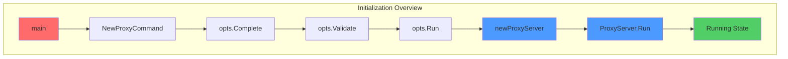
```mermaid
graph TB
    subgraph "Initialization Overview"
        A[main] --> B[NewProxyCommand]
        B --> C[opts.Complete]
        C --> D[opts.Validate]
        D --> E[opts.Run]
        E --> F[newProxyServer]
        F --> G[ProxyServer.Run]
        G --> H[Running State]
    end

    style A fill:#ff6b6b
    style H fill:#51cf66
    style F fill:#4c9aff
    style G fill:#4c9aff
```

---

## Initialization Phases

The kube-proxy initialization consists of **7 distinct phases**, each with specific responsibilities:

| Phase | Name | Duration | Description | Entry Point |
|-------|------|----------|-------------|-------------|
| **1** | Command Setup | <1ms | Create Cobra command, parse flags | `app/server.go:99` |
| **2** | Configuration Loading | 10-50ms | Load config file, apply defaults | `app/server.go:118-126` |
| **3** | Client & Server Creation | 50-200ms | Create kube-apiserver client, setup structures | `app/server.go:182-284` |
| **4** | Platform-Specific Setup | 50-100ms | Initialize iptables/ipvs, conntrack | `app/server_linux.go:71-78` |
| **5** | Proxier Creation | 100-500ms | Create mode-specific Proxier (iptables/ipvs/nftables) | `app/server_linux.go:128-247` |
| **6** | Informer Setup | 100-300ms | Create and start Service/EndpointSlice informers | `app/server.go:579-620` |
| **7** | Runtime Execution | Continuous | Start sync loop, health checks, metrics server | `app/server.go:528-634` |

**Total Initialization Time**: Typically **300-1200ms** depending on:
- Cluster size (number of Services/EndpointSlices to sync)
- Network latency to API server
- Proxy mode (IPVS takes longer than iptables)
- Available system resources


```mermaid
gantt
    title kube-proxy Initialization Timeline
    dateFormat X
    axisFormat %L ms

    section Phase 1
    Command Setup: 0, 10

    section Phase 2
    Config Loading: 10, 50

    section Phase 3
    Client Creation: 50, 200

    section Phase 4
    Platform Setup: 200, 300

    section Phase 5
    Proxier Creation: 300, 600

    section Phase 6
    Informer Setup: 600, 900

    section Phase 7
    Runtime Start: 900, 1000
    Ready State: 1000, 1200
```

---

## Phase 1: Command Setup

**Purpose**: Create the Cobra command structure and parse command-line flags.

**Entry Point**: `cmd/kube-proxy/app/server.go:99 - NewProxyCommand()`

### Process Flow

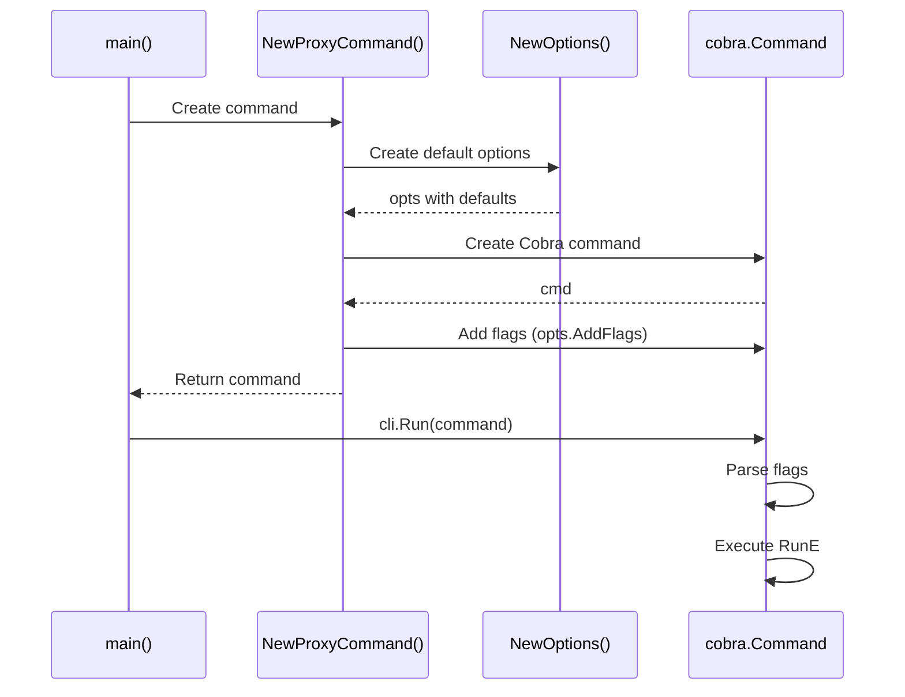
```mermaid
sequenceDiagram
    participant M as main()
    participant NPC as NewProxyCommand()
    participant NO as NewOptions()
    participant C as cobra.Command

    M->>NPC: Create command
    NPC->>NO: Create default options
    NO-->>NPC: opts with defaults
    NPC->>C: Create Cobra command
    C-->>NPC: cmd
    NPC->>C: Add flags (opts.AddFlags)
    NPC-->>M: Return command
    M->>C: cli.Run(command)
    C->>C: Parse flags
    C->>C: Execute RunE
```

### Implementation Details

**Step 1: Main Entry Point**

```go
// cmd/kube-proxy/proxy.go:29-33
func main() {
    command := app.NewProxyCommand()
    code := cli.Run(command)
    os.Exit(code)
}
```

**Step 2: Command Creation**

```go
// cmd/kube-proxy/app/server.go:99-158
func NewProxyCommand() *cobra.Command {
    opts := NewOptions()  // Create default options

    cmd := &cobra.Command{
        Use: kubeProxy,
        Long: `The Kubernetes network proxy runs on each node...`,
        RunE: func(cmd *cobra.Command, args []string) error {
            // Version flag handling
            verflag.PrintAndExitIfRequested()

            // OS-specific initialization (Windows service mode)
            if err := initForOS(opts.config.Windows.RunAsService); err != nil {
                return fmt.Errorf("failed os init: %w", err)
            }

            // Complete configuration from flags
            if err := opts.Complete(cmd.Flags()); err != nil {
                return fmt.Errorf("failed complete: %w", err)
            }

            // Initialize logging
            logs.InitLogs()
            if err := logsapi.ValidateAndApplyAsField(&opts.config.Logging,
                utilfeature.DefaultFeatureGate, field.NewPath("logging")); err != nil {
                return fmt.Errorf("initialize logging: %w", err)
            }

            // Validate configuration
            if err := opts.Validate(); err != nil {
                return fmt.Errorf("failed validate: %w", err)
            }

            // Add feature gate metrics
            utilfeature.DefaultMutableFeatureGate.AddMetrics()

            // Run the proxy server
            if err := opts.Run(context.Background()); err != nil {
                opts.logger.Error(err, "Error running ProxyServer")
                return err
            }

            return nil
        },
    }

    // Add flags to command
    fs := cmd.Flags()
    opts.AddFlags(fs)
    fs.AddGoFlagSet(goflag.CommandLine)

    return cmd
}
```

### Key Flags

| Flag | Type | Default | Description |
|------|------|---------|-------------|
| `--config` | string | "" | Path to configuration file |
| `--bind-address` | string | "0.0.0.0" | IP address to bind to |
| `--proxy-mode` | string | "" | Proxy mode: iptables, ipvs, nftables (auto-detect if empty) |
| `--cluster-cidr` | string | "" | CIDR range for cluster pods |
| `--hostname-override` | string | "" | Override hostname detection |
| `--kubeconfig` | string | "" | Path to kubeconfig file |
| `--master` | string | "" | Kubernetes API server URL |
| `--iptables-sync-period` | duration | 30s | iptables rule sync period |
| `--ipvs-sync-period` | duration | 30s | IPVS rule sync period |
| `--healthz-bind-address` | string | "0.0.0.0:10256" | Health check server address |
| `--metrics-bind-address` | string | "127.0.0.1:10249" | Metrics server address |
| `--nodeport-addresses` | []string | [] | CIDR ranges for NodePort traffic |

### Outputs

- ✅ Cobra command structure created
- ✅ Default options initialized
- ✅ Flags parsed and stored in `opts`
- ✅ Version flag handled (if `--version` passed)
- ✅ Ready for configuration loading

---

## Phase 2: Configuration Loading

**Purpose**: Load configuration from file and/or flags, apply platform-specific defaults, validate settings.

**Entry Point**: `cmd/kube-proxy/app/server.go:118-131`

### Process Flow

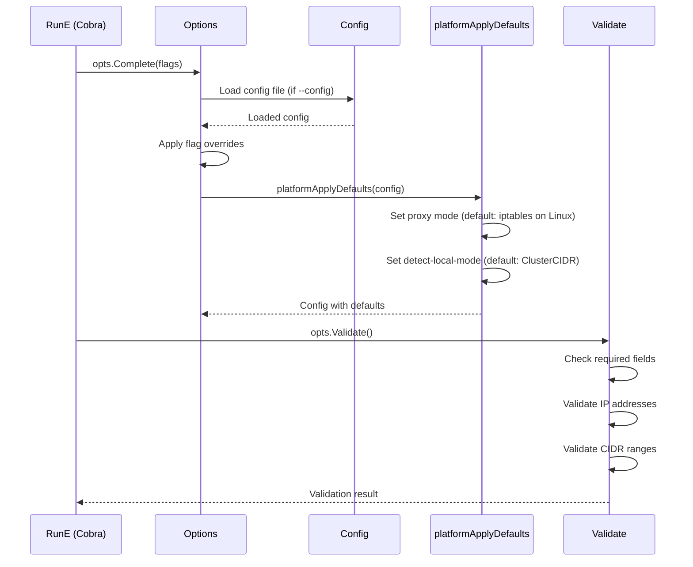
```mermaid
sequenceDiagram
    participant R as RunE (Cobra)
    participant O as Options
    participant C as Config
    participant P as platformApplyDefaults
    participant V as Validate

    R->>O: opts.Complete(flags)
    O->>C: Load config file (if --config)
    C-->>O: Loaded config
    O->>O: Apply flag overrides
    O->>P: platformApplyDefaults(config)
    P->>P: Set proxy mode (default: iptables on Linux)
    P->>P: Set detect-local-mode (default: ClusterCIDR)
    P-->>O: Config with defaults
    R->>V: opts.Validate()
    V->>V: Check required fields
    V->>V: Validate IP addresses
    V->>V: Validate CIDR ranges
    V-->>R: Validation result
```

### Configuration Sources

**Priority Order** (highest to lowest):
1. **Command-line flags** (--proxy-mode, --bind-address, etc.)
2. **Configuration file** (--config /path/to/config.yaml)
3. **Platform defaults** (Linux: iptables, Windows: kernelspace)
4. **Hardcoded defaults** (sync-period: 30s, etc.)

### Platform-Specific Defaults (Linux)

```go
// cmd/kube-proxy/app/server_linux.go:51-66
func (o *Options) platformApplyDefaults(config *proxyconfigapi.KubeProxyConfiguration) {
    // Default to iptables mode if not specified
    if config.Mode == "" {
        o.logger.Info("Using iptables proxy")
        config.Mode = proxyconfigapi.ProxyModeIPTables
    }

    // nftables mode specific defaults
    if config.Mode == proxyconfigapi.ProxyModeNFTables && len(config.NodePortAddresses) == 0 {
        config.NodePortAddresses = []string{proxyconfigapi.NodePortAddressesPrimary}
    }

    // Default local mode detection to ClusterCIDR
    if config.DetectLocalMode == "" {
        o.logger.V(4).Info("Defaulting detect-local-mode",
            "localModeClusterCIDR", string(proxyconfigapi.LocalModeClusterCIDR))
        config.DetectLocalMode = proxyconfigapi.LocalModeClusterCIDR
    }
    o.logger.V(2).Info("DetectLocalMode", "localMode", string(config.DetectLocalMode))
}
```

### Configuration Validation

**Validation Checks**:

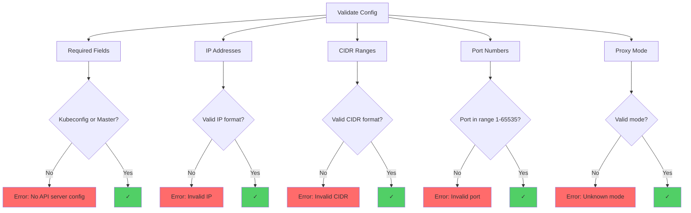
```mermaid
graph TD
    V[Validate Config] --> V1[Required Fields]
    V --> V2[IP Addresses]
    V --> V3[CIDR Ranges]
    V --> V4[Port Numbers]
    V --> V5[Proxy Mode]

    V1 --> V1A{Kubeconfig or Master?}
    V1A -->|No| E1[Error: No API server config]
    V1A -->|Yes| OK1[✓]

    V2 --> V2A{Valid IP format?}
    V2A -->|No| E2[Error: Invalid IP]
    V2A -->|Yes| OK2[✓]

    V3 --> V3A{Valid CIDR format?}
    V3A -->|No| E3[Error: Invalid CIDR]
    V3A -->|Yes| OK3[✓]

    V4 --> V4A{Port in range 1-65535?}
    V4A -->|No| E4[Error: Invalid port]
    V4A -->|Yes| OK4[✓]

    V5 --> V5A{Valid mode?}
    V5A -->|No| E5[Error: Unknown mode]
    V5A -->|Yes| OK5[✓]

    style E1 fill:#ff6b6b
    style E2 fill:#ff6b6b
    style E3 fill:#ff6b6b
    style E4 fill:#ff6b6b
    style E5 fill:#ff6b6b
    style OK1 fill:#51cf66
    style OK2 fill:#51cf66
    style OK3 fill:#51cf66
    style OK4 fill:#51cf66
    style OK5 fill:#51cf66
```

### Example Configuration File

```yaml
# /etc/kubernetes/kube-proxy-config.yaml
apiVersion: kubeproxy.config.k8s.io/v1alpha1
kind: KubeProxyConfiguration
bindAddress: 0.0.0.0
clientConnection:
  kubeconfig: /var/lib/kube-proxy/kubeconfig.conf
clusterCIDR: 10.244.0.0/16
configSyncPeriod: 15m
mode: "ipvs"
ipvs:
  syncPeriod: 30s
  minSyncPeriod: 5s
  scheduler: "rr"
  excludeCIDRs:
    - 169.254.0.0/16
iptables:
  syncPeriod: 30s
  minSyncPeriod: 5s
  masqueradeBit: 14
  localhostNodePorts: true
nodePortAddresses:
  - "primary"
healthzBindAddress: 0.0.0.0:10256
metricsBindAddress: 127.0.0.1:10249
detectLocalMode: ClusterCIDR
detectLocal:
  clusterCIDRs:
    - 10.244.0.0/16
logging:
  format: text
  verbosity: 2
```

### Outputs

- ✅ Configuration loaded and merged
- ✅ Platform defaults applied
- ✅ Configuration validated
- ✅ Logging initialized
- ✅ Ready for server creation

---

## Phase 3: Client & Server Creation

**Purpose**: Create Kubernetes API client, ProxyServer structure, and initialize core components.

**Entry Point**: `cmd/kube-proxy/app/server.go:182 - newProxyServer()`

### Process Flow

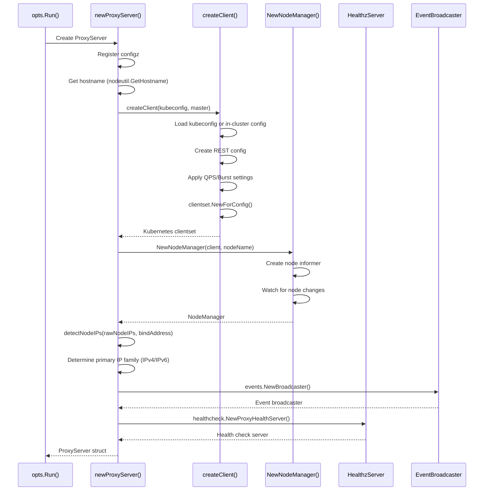
```mermaid
sequenceDiagram
    participant R as opts.Run()
    participant NPS as newProxyServer()
    participant CC as createClient()
    participant NM as NewNodeManager()
    participant HC as HealthzServer
    participant EB as EventBroadcaster

    R->>NPS: Create ProxyServer
    NPS->>NPS: Register configz
    NPS->>NPS: Get hostname (nodeutil.GetHostname)
    NPS->>CC: createClient(kubeconfig, master)
    CC->>CC: Load kubeconfig or in-cluster config
    CC->>CC: Create REST config
    CC->>CC: Apply QPS/Burst settings
    CC->>CC: clientset.NewForConfig()
    CC-->>NPS: Kubernetes clientset

    NPS->>NM: NewNodeManager(client, nodeName)
    NM->>NM: Create node informer
    NM->>NM: Watch for node changes
    NM-->>NPS: NodeManager

    NPS->>NPS: detectNodeIPs(rawNodeIPs, bindAddress)
    NPS->>NPS: Determine primary IP family (IPv4/IPv6)

    NPS->>EB: events.NewBroadcaster()
    EB-->>NPS: Event broadcaster

    NPS->>HC: healthcheck.NewProxyHealthServer()
    HC-->>NPS: Health check server

    NPS-->>R: ProxyServer struct
```

### Client Creation

**Step 1: Kubeconfig Loading**

```go
// cmd/kube-proxy/app/server.go:405-435
func createClient(ctx context.Context, config componentbaseconfig.ClientConnectionConfiguration,
    masterOverride string) (clientset.Interface, error) {

    var kubeConfig *rest.Config
    var err error

    if len(config.Kubeconfig) == 0 && len(masterOverride) == 0 {
        logger.Info("Neither kubeconfig file nor master URL was specified, " +
                    "falling back to in-cluster config")
        // Use in-cluster config (for pods running in cluster)
        kubeConfig, err = rest.InClusterConfig()
    } else {
        // Load kubeconfig file and apply overrides
        kubeConfig, err = clientcmd.NewNonInteractiveDeferredLoadingClientConfig(
            &clientcmd.ClientConfigLoadingRules{ExplicitPath: config.Kubeconfig},
            &clientcmd.ConfigOverrides{
                ClusterInfo: clientcmdapi.Cluster{Server: masterOverride},
            }).ClientConfig()
    }
    if err != nil {
        return nil, err
    }

    // Apply client connection settings
    kubeConfig.AcceptContentTypes = config.AcceptContentTypes
    kubeConfig.ContentType = config.ContentType
    kubeConfig.QPS = config.QPS          // Default: 5 requests/sec
    kubeConfig.Burst = int(config.Burst)  // Default: 10 requests

    // Create clientset
    client, err := clientset.NewForConfig(kubeConfig)
    if err != nil {
        return nil, err
    }

    return client, nil
}
```

**Client Configuration**:
- **QPS (Queries Per Second)**: Default 5, controls API request rate
- **Burst**: Default 10, allows short bursts above QPS
- **ContentType**: Typically protobuf for efficiency
- **AcceptContentTypes**: Fallback content types

### NodeManager Creation

**Purpose**: Watch the node object to get node IP, pod CIDRs, and topology information.

```go
// cmd/kube-proxy/app/server.go:211-222
s.NodeManager, err = proxy.NewNodeManager(ctx, s.Client,
    s.Config.ConfigSyncPeriod.Duration,
    s.NodeName,
    s.Config.DetectLocalMode == kubeproxyconfig.LocalModeNodeCIDR)

if err != nil {
    return nil, err
}

rawNodeIPs := s.NodeManager.NodeIPs()
if len(rawNodeIPs) > 0 {
    logger.Info("Successfully retrieved NodeIPs", "NodeIPs", rawNodeIPs)
}
s.PrimaryIPFamily, s.NodeIPs = detectNodeIPs(ctx, rawNodeIPs, config.BindAddress)
s.podCIDRs = s.NodeManager.PodCIDRs()
```

**NodeManager provides**:
- **Node IPs**: Primary and secondary IPs for the node
- **Pod CIDRs**: CIDR ranges assigned to this node (for LocalModeNodeCIDR)
- **Topology labels**: Zone, region information for topology-aware routing

### Node IP Detection

**Priority Order**:
1. **--bind-address** flag (if not 0.0.0.0 or ::)
2. **Node IPs** from NodeManager (node.status.addresses)
3. **Loopback IPs** (127.0.0.1 and ::1) as fallback

```go
// cmd/kube-proxy/app/server.go:653-691
func detectNodeIPs(ctx context.Context, rawNodeIPs []net.IP,
    bindAddress string) (v1.IPFamily, map[v1.IPFamily]net.IP) {

    primaryFamily := v1.IPv4Protocol
    nodeIPs := map[v1.IPFamily]net.IP{
        v1.IPv4Protocol: net.IPv4(127, 0, 0, 1),  // Default IPv4
        v1.IPv6Protocol: net.IPv6loopback,         // Default IPv6
    }

    // Use node IPs from NodeManager if available
    if len(rawNodeIPs) > 0 {
        if !netutils.IsIPv4(rawNodeIPs[0]) {
            primaryFamily = v1.IPv6Protocol
        }
        nodeIPs[primaryFamily] = rawNodeIPs[0]
        if len(rawNodeIPs) > 1 {
            // Second IP is guaranteed to be different family
            family := v1.IPv4Protocol
            if !netutils.IsIPv4(rawNodeIPs[1]) {
                family = v1.IPv6Protocol
            }
            nodeIPs[family] = rawNodeIPs[1]
        }
    }

    // Override with bind address if specified
    bindIP := netutils.ParseIPSloppy(bindAddress)
    if bindIP != nil && !bindIP.IsUnspecified() {
        if netutils.IsIPv4(bindIP) {
            primaryFamily = v1.IPv4Protocol
        } else {
            primaryFamily = v1.IPv6Protocol
        }
        nodeIPs[primaryFamily] = bindIP
    }

    if nodeIPs[primaryFamily].IsLoopback() {
        logger.Info("Can't determine this node's IP, assuming loopback; " +
                    "if this is incorrect, please set the --bind-address flag")
    }
    return primaryFamily, nodeIPs
}
```

### Event Broadcasting

**Purpose**: Send events to the API server for important occurrences.

```go
// cmd/kube-proxy/app/server.go:235-242
s.Broadcaster = events.NewBroadcaster(&events.EventSinkImpl{
    Interface: s.Client.EventsV1(),
})
s.Recorder = s.Broadcaster.NewRecorder(proxyconfigscheme.Scheme, kubeProxy)

s.NodeRef = &v1.ObjectReference{
    Kind:      "Node",
    Name:      s.NodeName,
    UID:       types.UID(s.NodeName),
    Namespace: "",
}
```

**Events sent by kube-proxy**:
- `Starting` - Proxy server starting up
- `FailedToStartProxierHealthcheck` - Health check server failed
- `FailedToStartMetricServer` - Metrics server failed

### Health Check Server

```go
// cmd/kube-proxy/app/server.go:245-247
if len(config.HealthzBindAddress) > 0 {
    s.HealthzServer = healthcheck.NewProxyHealthServer(
        config.HealthzBindAddress,
        2*config.SyncPeriod.Duration,  // Check interval
        s.NodeManager)
}
```

**Health Check Endpoints**:
- `/healthz` - Overall health (200 if healthy)
- `/livez` - Liveness check (200 if alive)
- `/readyz` - Readiness check (200 if ready)

### ProxyServer Structure

```go
// cmd/kube-proxy/app/server.go:162-179
type ProxyServer struct {
    Config *kubeproxyconfig.KubeProxyConfiguration

    Client          clientset.Interface         // Kubernetes API client
    Broadcaster     events.EventBroadcaster     // Event broadcaster
    Recorder        events.EventRecorder        // Event recorder
    NodeRef         *v1.ObjectReference         // Reference to this node
    HealthzServer   *healthcheck.ProxyHealthServer  // Health check server
    NodeName        string                      // Node hostname
    PrimaryIPFamily v1.IPFamily                 // IPv4 or IPv6
    NodeIPs         map[v1.IPFamily]net.IP      // Node IPs by family
    flagz           flagz.Reader                // Flag values

    podCIDRs    []string                        // Pod CIDRs (LocalModeNodeCIDR)
    NodeManager *proxy.NodeManager              // Node informer/manager

    Proxier proxy.Provider                      // Mode-specific proxier (created later)
}
```

### Outputs

- ✅ Kubernetes API client created and validated
- ✅ NodeManager watching node object
- ✅ Node IPs and primary IP family determined
- ✅ Event broadcaster initialized
- ✅ Health check server created
- ✅ ProxyServer structure populated
- ✅ Ready for platform-specific setup

---

## Phase 4: Platform-Specific Setup

**Purpose**: Initialize platform-specific components like conntrack, iptables, ipvs kernel modules.

**Entry Point**: `cmd/kube-proxy/app/server_linux.go:71 - platformSetup()`

### Process Flow

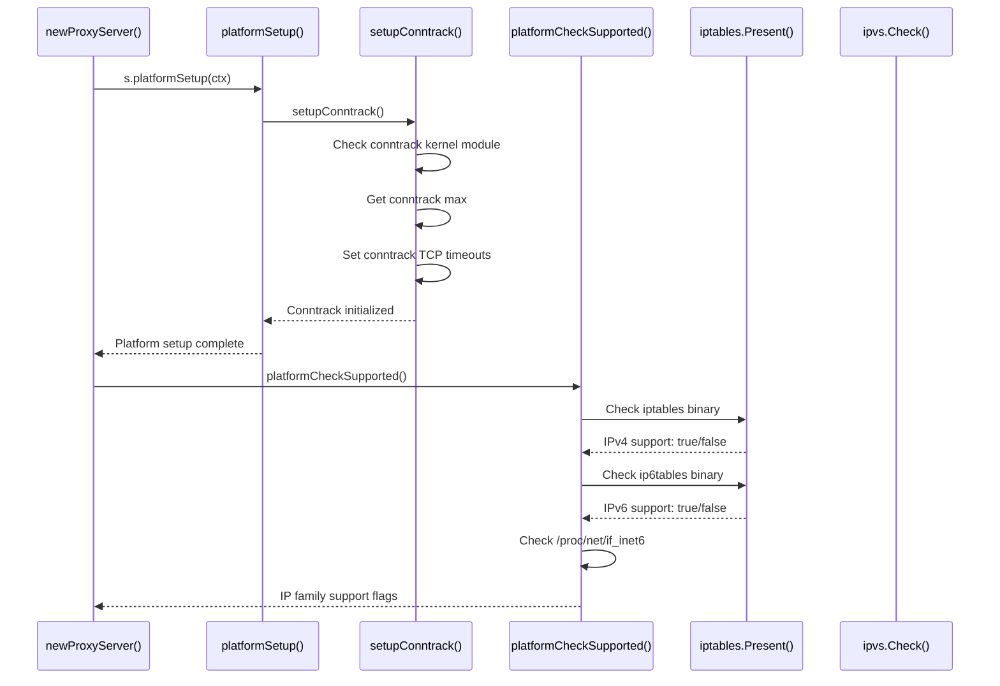
```mermaid
sequenceDiagram
    participant NPS as newProxyServer()
    participant PS as platformSetup()
    participant CT as setupConntrack()
    participant PCS as platformCheckSupported()
    participant IPT as iptables.Present()
    participant IPVS as ipvs.Check()

    NPS->>PS: s.platformSetup(ctx)
    PS->>CT: setupConntrack()
    CT->>CT: Check conntrack kernel module
    CT->>CT: Get conntrack max
    CT->>CT: Set conntrack TCP timeouts
    CT-->>PS: Conntrack initialized
    PS-->>NPS: Platform setup complete

    NPS->>PCS: platformCheckSupported()
    PCS->>IPT: Check iptables binary
    IPT-->>PCS: IPv4 support: true/false
    PCS->>IPT: Check ip6tables binary
    IPT-->>PCS: IPv6 support: true/false
    PCS->>PCS: Check /proc/net/if_inet6
    PCS-->>NPS: IP family support flags
```

### Conntrack Setup

**Purpose**: Configure connection tracking for NAT operations.

```go
// cmd/kube-proxy/app/server_linux.go:71-78
func (s *ProxyServer) platformSetup(ctx context.Context) error {
    ct := &realConntracker{}
    err := s.setupConntrack(ctx, ct)
    if err != nil {
        return err
    }
    return nil
}
```

**Conntrack Configuration**:
- **conntrack_max**: Maximum connection tracking entries
  - Default: Auto-calculated based on memory
  - Recommended for large clusters: 1,000,000+
- **TCP timeouts**:
  - `nf_conntrack_tcp_timeout_established`: 86400s (24h)
  - `nf_conntrack_tcp_timeout_close_wait`: 3600s (1h)
- **UDP timeout**:
  - `nf_conntrack_udp_timeout`: 30s

**Sysctl settings** (applied if needed):
```bash
# Increase conntrack table size
sysctl -w net.netfilter.nf_conntrack_max=1000000

# Adjust TCP timeouts
sysctl -w net.netfilter.nf_conntrack_tcp_timeout_established=86400
sysctl -w net.netfilter.nf_conntrack_tcp_timeout_close_wait=3600

# UDP timeout
sysctl -w net.netfilter.nf_conntrack_udp_timeout=30
```

### IP Family Support Check

**Purpose**: Determine which IP families (IPv4, IPv6, dual-stack) are supported.

```go
// cmd/kube-proxy/app/server_linux.go:88-125
func (s *ProxyServer) platformCheckSupported(ctx context.Context) (
    ipv4Supported, ipv6Supported, dualStackSupported bool, err error) {

    logger := klog.FromContext(ctx)

    if isIPTablesBased(s.Config.Mode) {
        // Check for iptables and ip6tables binaries
        errv4 := utiliptables.New(utiliptables.ProtocolIPv4).Present()
        errv6 := utiliptables.New(utiliptables.ProtocolIPv6).Present()

        ipv4Supported = errv4 == nil
        ipv6Supported = errv6 == nil

        if !ipv4Supported && !ipv6Supported {
            err = fmt.Errorf("iptables is not available on this host : %w", errv4)
        } else if !ipv4Supported {
            logger.Info("No iptables support for family", "ipFamily", v1.IPv4Protocol)
        } else if !ipv6Supported {
            logger.Info("No iptables support for family", "ipFamily", v1.IPv6Protocol)
        }
    } else {
        // nftables always supports both families
        ipv4Supported, ipv6Supported = true, true
    }

    // Check if OS has IPv6 enabled
    _, errIPv6 := os.Stat("/proc/net/if_inet6")
    if errIPv6 != nil {
        logger.Info("No kernel support for family", "ipFamily", v1.IPv6Protocol)
        ipv6Supported = false
    }

    // Linux proxies support dual-stack if both families are available
    dualStackSupported = ipv4Supported && ipv6Supported
    return
}
```

**Support Matrix**:

| Scenario | IPv4 | IPv6 | Dual-Stack | Result |
|----------|------|------|------------|--------|
| Both available | ✅ | ✅ | ✅ | Dual-stack mode |
| IPv4 only | ✅ | ❌ | ❌ | IPv4-only mode |
| IPv6 only | ❌ | ✅ | ❌ | IPv6-only mode |
| Neither available | ❌ | ❌ | ❌ | **Fatal error** |

### Configuration Validation

**Bad Configuration Checks**:

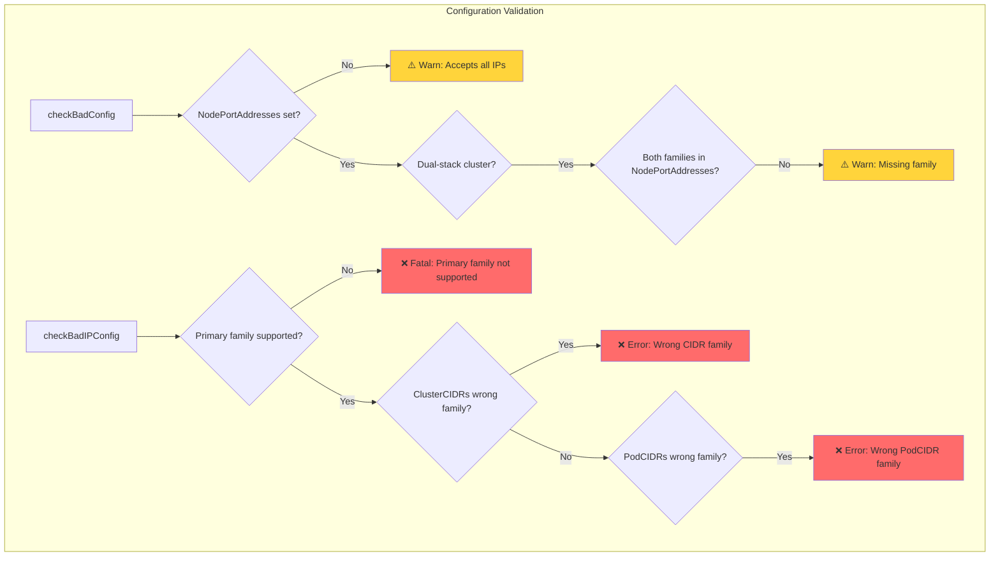
```mermaid
graph TD
    subgraph "Configuration Validation"
        CBC[checkBadConfig] --> CBC1{NodePortAddresses set?}
        CBC1 -->|No| W1[⚠️ Warn: Accepts all IPs]
        CBC1 -->|Yes| CBC2{Dual-stack cluster?}
        CBC2 -->|Yes| CBC3{Both families in NodePortAddresses?}
        CBC3 -->|No| W2[⚠️ Warn: Missing family]

        CBIC[checkBadIPConfig] --> CBIC1{Primary family supported?}
        CBIC1 -->|No| E1[❌ Fatal: Primary family not supported]
        CBIC1 -->|Yes| CBIC2{ClusterCIDRs wrong family?}
        CBIC2 -->|Yes| E2[❌ Error: Wrong CIDR family]
        CBIC2 -->|No| CBIC3{PodCIDRs wrong family?}
        CBIC3 -->|Yes| E3[❌ Error: Wrong PodCIDR family]
    end

    style W1 fill:#ffd43b
    style W2 fill:#ffd43b
    style E1 fill:#ff6b6b
    style E2 fill:#ff6b6b
    style E3 fill:#ff6b6b
```

**Example Warnings**:

```
# Warning: NodePortAddresses not set
nodePortAddresses is unset; NodePort connections will be accepted on all local IPs.
Consider using `--nodeport-addresses primary`

# Warning: Dual-stack cluster, single-stack NodePortAddresses
cluster appears to be dual-stack but nodePortAddresses contains only IPv4 addresses;
NodePort connections will be accepted on all local IPv6 IPs

# Error: ClusterCIDRs wrong family
cluster is IPv4-primary but clusterCIDRs contains only IPv6 addresses
```

### Kernel Module Checks (IPVS Mode)

**Required Kernel Modules for IPVS**:

```bash
# Load IPVS modules
modprobe ip_vs
modprobe ip_vs_rr
modprobe ip_vs_wrr
modprobe ip_vs_sh
modprobe nf_conntrack
```

**Verification**:
```bash
# Check loaded modules
lsmod | grep -E "ip_vs|nf_conntrack"

# Expected output:
# ip_vs                 155648  6 ip_vs_rr,ip_vs_sh,ip_vs_wrr
# ip_vs_rr               16384  0
# ip_vs_wrr              16384  0
# ip_vs_sh               16384  0
# nf_conntrack          139264  1 ip_vs
```

### Outputs

- ✅ Conntrack initialized and configured
- ✅ IP family support determined (IPv4/IPv6/dual-stack)
- ✅ iptables/ip6tables binaries verified (for iptables/ipvs modes)
- ✅ Kernel modules checked (for ipvs mode)
- ✅ Configuration validated against platform capabilities
- ✅ Ready for proxier creation

---

## Phase 5: Proxier Creation

**Purpose**: Create the mode-specific Proxier that handles actual Service networking.

**Entry Point**: `cmd/kube-proxy/app/server_linux.go:128 - createProxier()`

### Proxier Selection Flow

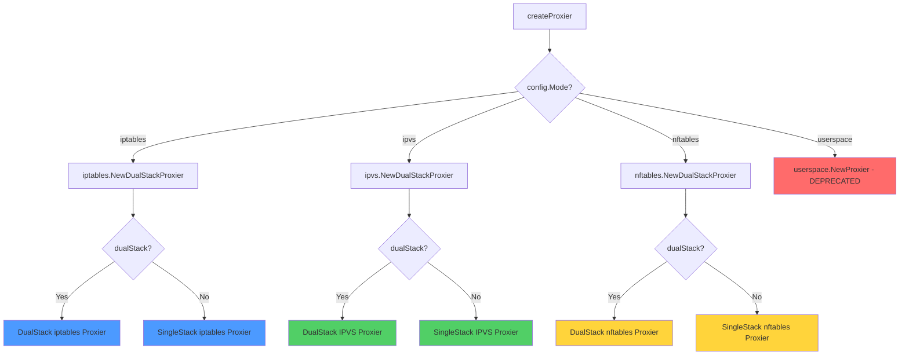
```mermaid
graph TD
    CP[createProxier] --> M{config.Mode?}
    M -->|iptables| IPT[iptables.NewDualStackProxier]
    M -->|ipvs| IPVS[ipvs.NewDualStackProxier]
    M -->|nftables| NFT[nftables.NewDualStackProxier]
    M -->|userspace| US[userspace.NewProxier - DEPRECATED]

    IPT --> DS1{dualStack?}
    DS1 -->|Yes| IPT_DS[DualStack iptables Proxier]
    DS1 -->|No| IPT_SS[SingleStack iptables Proxier]

    IPVS --> DS2{dualStack?}
    DS2 -->|Yes| IPVS_DS[DualStack IPVS Proxier]
    DS2 -->|No| IPVS_SS[SingleStack IPVS Proxier]

    NFT --> DS3{dualStack?}
    DS3 -->|Yes| NFT_DS[DualStack nftables Proxier]
    DS3 -->|No| NFT_SS[SingleStack nftables Proxier]

    style IPT_DS fill:#4c9aff
    style IPT_SS fill:#4c9aff
    style IPVS_DS fill:#51cf66
    style IPVS_SS fill:#51cf66
    style NFT_DS fill:#ffd43b
    style NFT_SS fill:#ffd43b
    style US fill:#ff6b6b
```

### iptables Proxier Creation

```go
// cmd/kube-proxy/app/server_linux.go:135-158
if config.Mode == proxyconfigapi.ProxyModeIPTables {
    logger.Info("Using iptables Proxier")
    ipts := utiliptables.NewBestEffort()

    if dualStack {
        proxier, err = iptables.NewDualStackProxier(
            ctx,
            ipts,                                    // iptables interface
            utilsysctl.New(),                        // sysctl interface
            config.SyncPeriod.Duration,              // Full sync period
            config.MinSyncPeriod.Duration,           // Min sync period
            config.Linux.MasqueradeAll,              // Masquerade all traffic
            *config.IPTables.LocalhostNodePorts,     // Allow localhost NodePort
            int(*config.IPTables.MasqueradeBit),     // Masquerade bit (default: 14)
            localDetectors,                          // Local traffic detectors
            s.HealthzServer,                         // Health check server
            s.Config.NodePortAddresses,              // NodePort address filters
        )
    } else {
        // Single-stack iptables proxier
        proxier, err = iptables.NewProxier(
            ctx,
            s.PrimaryIPFamily,
            ipts[s.PrimaryIPFamily],
            utilsysctl.New(),
            config.SyncPeriod.Duration,
            config.MinSyncPeriod.Duration,
            config.Linux.MasqueradeAll,
            *config.IPTables.LocalhostNodePorts,
            int(*config.IPTables.MasqueradeBit),
            localDetectors[s.PrimaryIPFamily],
            s.HealthzServer,
            s.Config.NodePortAddresses,
        )
    }
}
```

**iptables Proxier Parameters**:

| Parameter | Default | Description |
|-----------|---------|-------------|
| SyncPeriod | 30s | Full sync interval |
| MinSyncPeriod | 5s | Minimum time between syncs |
| MasqueradeAll | false | Masquerade all traffic (not just external) |
| LocalhostNodePorts | true | Allow NodePort access from localhost |
| MasqueradeBit | 14 | Bit used to mark packets for masquerading |

### IPVS Proxier Creation

```go
// cmd/kube-proxy/app/server_linux.go:160-200
if config.Mode == proxyconfigapi.ProxyModeIPVS {
    logger.Info("Using ipvs Proxier")

    // Check IPVS kernel modules
    kernelHandler := ipvs.NewLinuxKernelHandler()
    ipvsInterface := utilipvs.New()

    // Load required kernel modules
    if err := ipvs.CanUseIPVSProxier(ctx, kernelHandler, ipvsInterface, config.IPVS.Scheduler); err != nil {
        return nil, fmt.Errorf("can't use IPVS proxier: %w", err)
    }

    // Create ipset interface for IPVS
    ipsetInterface := utilipset.New(execer)

    if dualStack {
        // Note: IPVS proxier also uses some iptables rules
        ipts := utiliptables.NewBestEffort()

        proxier, err = ipvs.NewDualStackProxier(
            ctx,
            ipts,                                    // iptables (for some rules)
            ipvsInterface,                           // IPVS interface
            ipsetInterface,                          // ipset interface
            utilsysctl.New(),                        // sysctl interface
            config.SyncPeriod.Duration,              // Full sync period
            config.MinSyncPeriod.Duration,           // Min sync period
            config.IPVS.ExcludeCIDRs,                // CIDRs to exclude from IPVS
            config.IPVS.StrictARP,                   // Strict ARP mode
            config.IPVS.TCPTimeout.Duration,         // TCP session timeout
            config.IPVS.TCPFinTimeout.Duration,      // TCP FIN timeout
            config.IPVS.UDPTimeout.Duration,         // UDP session timeout
            config.Linux.MasqueradeAll,              // Masquerade all traffic
            int(*config.IPTables.MasqueradeBit),     // Masquerade bit
            localDetectors,                          // Local traffic detectors
            s.HealthzServer,                         // Health check server
            config.IPVS.Scheduler,                   // IPVS scheduler (rr, lc, etc.)
            s.Config.NodePortAddresses,              // NodePort address filters
            kernelHandler,                           // Kernel handler
        )
    } else {
        // Single-stack IPVS proxier (similar parameters)
        proxier, err = ipvs.NewProxier(/* ... */)
    }
}
```

**IPVS Proxier Parameters**:

| Parameter | Default | Description |
|-----------|---------|-------------|
| SyncPeriod | 30s | Full sync interval |
| MinSyncPeriod | 5s | Minimum time between syncs |
| Scheduler | "rr" | IPVS scheduler algorithm |
| ExcludeCIDRs | [] | CIDRs to exclude from IPVS virtual servers |
| StrictARP | false | Strict ARP mode (for MetalLB compatibility) |
| TCPTimeout | 0 | TCP session timeout (0 = system default) |
| TCPFinTimeout | 0 | TCP FIN timeout (0 = system default) |
| UDPTimeout | 0 | UDP session timeout (0 = system default) |

**IPVS Schedulers**:
- **rr** (Round Robin) - Default, distributes evenly
- **lc** (Least Connection) - Sends to endpoint with fewest connections
- **wrr** (Weighted Round Robin) - Round robin with weights
- **sh** (Source Hashing) - Hash source IP for session affinity
- **dh** (Destination Hashing) - Hash destination IP
- **sed** (Shortest Expected Delay) - Based on connection count and weight
- **nq** (Never Queue) - Distribute to idle servers first

### nftables Proxier Creation

```go
// cmd/kube-proxy/app/server_linux.go:202-220
if config.Mode == proxyconfigapi.ProxyModeNFTables {
    logger.Info("Using nftables Proxier")

    if dualStack {
        proxier, err = nftables.NewDualStackProxier(
            ctx,
            config.SyncPeriod.Duration,
            config.MinSyncPeriod.Duration,
            config.Linux.MasqueradeAll,
            int(*config.IPTables.MasqueradeBit),
            localDetectors,
            s.HealthzServer,
            s.Config.NodePortAddresses,
        )
    } else {
        proxier, err = nftables.NewProxier(/* ... */)
    }
}
```

**nftables Status**: Beta (as of Kubernetes 1.32)
- More efficient than iptables
- Better performance at scale
- Cleaner rule management
- Requires nftables kernel support (Linux 3.13+)

### Local Traffic Detection

**Purpose**: Identify traffic originating from the local node for ExternalTrafficPolicy=Local.

**Detection Modes**:

1. **ClusterCIDR** (default):
   - Compare source IP against cluster CIDR ranges
   - Fast and simple
   - Requires cluster CIDR configuration

2. **NodeCIDR**:
   - Compare source IP against node's pod CIDR
   - More accurate for multi-CIDR clusters
   - Requires node.spec.podCIDRs

3. **BridgeInterface**:
   - Check if traffic comes from bridge interface (cbr0, cni0)
   - Legacy mode, not commonly used

```go
// Local detector creation (simplified)
localDetectors := getLocalDetectors(logger, s.PrimaryIPFamily, config, s.podCIDRs)

func getLocalDetectors(logger klog.Logger, primaryIPFamily v1.IPFamily,
    config *proxyconfigapi.KubeProxyConfiguration,
    podCIDRs []string) map[v1.IPFamily]proxyutil.LocalTrafficDetector {

    detectors := map[v1.IPFamily]proxyutil.LocalTrafficDetector{}

    switch config.DetectLocalMode {
    case proxyconfigapi.LocalModeClusterCIDR:
        // Use cluster CIDRs
        detectors[v1.IPv4Protocol] = proxyutil.NewDetectLocalByCIDR(
            config.DetectLocal.ClusterCIDRs, logger.WithValues("ipFamily", v1.IPv4Protocol))
        detectors[v1.IPv6Protocol] = proxyutil.NewDetectLocalByCIDR(
            config.DetectLocal.ClusterCIDRs, logger.WithValues("ipFamily", v1.IPv6Protocol))

    case proxyconfigapi.LocalModeNodeCIDR:
        // Use node pod CIDRs
        detectors[v1.IPv4Protocol] = proxyutil.NewDetectLocalByCIDR(
            podCIDRs, logger.WithValues("ipFamily", v1.IPv4Protocol))
        detectors[v1.IPv6Protocol] = proxyutil.NewDetectLocalByCIDR(
            podCIDRs, logger.WithValues("ipFamily", v1.IPv6Protocol))

    case proxyconfigapi.LocalModeBridgeInterface:
        // Use bridge interface (legacy)
        detectors[v1.IPv4Protocol] = proxyutil.NewDetectLocalByBridgeInterface(
            config.DetectLocal.BridgeInterface)
        detectors[v1.IPv6Protocol] = proxyutil.NewDetectLocalByBridgeInterface(
            config.DetectLocal.BridgeInterface)
    }

    return detectors
}
```

### Provider Interface

All proxiers implement the `proxy.Provider` interface:

```go
// pkg/proxy/types.go:28-38
type Provider interface {
    config.EndpointSliceHandler  // OnEndpointSliceAdd/Update/Delete, OnEndpointSlicesSynced
    config.ServiceHandler        // OnServiceAdd/Update/Delete, OnServiceSynced
    config.NodeTopologyHandler   // OnNodeAdd/Update/Delete, OnNodeSynced
    config.ServiceCIDRHandler    // OnServiceCIDRAdd/Update/Delete, OnServiceCIDRsSynced

    // Sync immediately synchronizes the Provider's current state to proxy rules
    Sync()

    // SyncLoop runs periodic work (expected to run as goroutine)
    SyncLoop()
}
```

### Outputs

- ✅ Mode-specific Proxier created (iptables/ipvs/nftables)
- ✅ Proxier configured with sync periods, schedulers, etc.
- ✅ Local traffic detectors initialized
- ✅ Kernel modules loaded (for IPVS)
- ✅ Initial iptables/ipvs chains created (mode-specific)
- ✅ Ready for informer setup

---

## Phase 6: Informer Setup

**Purpose**: Create and start Kubernetes informers to watch Services, EndpointSlices, Nodes.

**Entry Point**: `cmd/kube-proxy/app/server.go:579-620`

### Process Flow

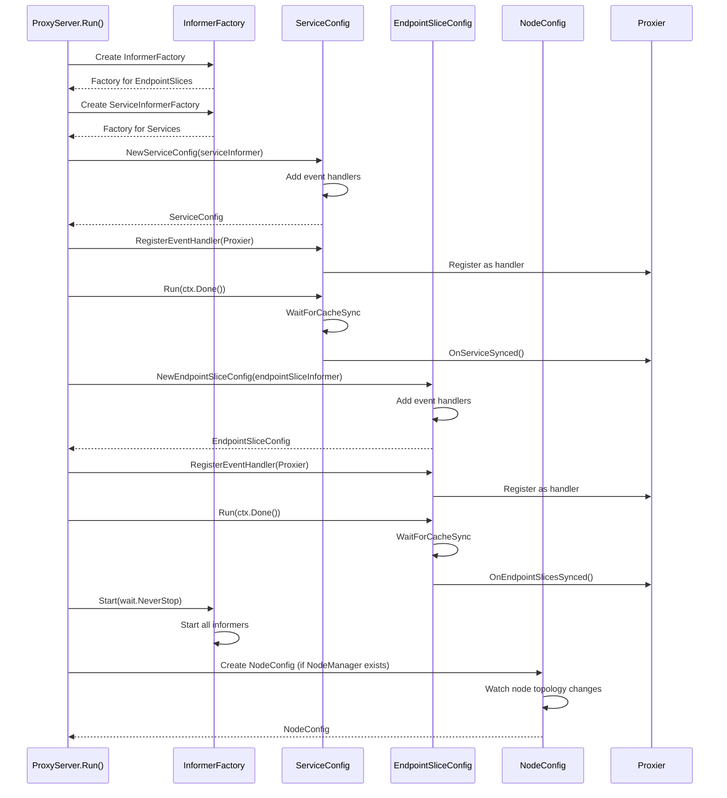
```mermaid
sequenceDiagram
    participant R as ProxyServer.Run()
    participant IF as InformerFactory
    participant SC as ServiceConfig
    participant ESC as EndpointSliceConfig
    participant NC as NodeConfig
    participant P as Proxier

    R->>IF: Create InformerFactory
    IF-->>R: Factory for EndpointSlices

    R->>IF: Create ServiceInformerFactory
    IF-->>R: Factory for Services

    R->>SC: NewServiceConfig(serviceInformer)
    SC->>SC: Add event handlers
    SC-->>R: ServiceConfig

    R->>SC: RegisterEventHandler(Proxier)
    SC->>P: Register as handler

    R->>SC: Run(ctx.Done())
    SC->>SC: WaitForCacheSync
    SC->>P: OnServiceSynced()

    R->>ESC: NewEndpointSliceConfig(endpointSliceInformer)
    ESC->>ESC: Add event handlers
    ESC-->>R: EndpointSliceConfig

    R->>ESC: RegisterEventHandler(Proxier)
    ESC->>P: Register as handler

    R->>ESC: Run(ctx.Done())
    ESC->>ESC: WaitForCacheSync
    ESC->>P: OnEndpointSlicesSynced()

    R->>IF: Start(wait.NeverStop)
    IF->>IF: Start all informers

    R->>NC: Create NodeConfig (if NodeManager exists)
    NC->>NC: Watch node topology changes
    NC-->>R: NodeConfig
```

### Informer Factory Creation

**Purpose**: Create shared informer factories with label/field selectors to filter unwanted objects.

```go
// cmd/kube-proxy/app/server.go:565-593
// Label selector to exclude:
// 1. Services with custom service.kubernetes.io/service-proxy-name label
// 2. Headless services (handled by DNS, not kube-proxy)
noProxyName, err := labels.NewRequirement(apis.LabelServiceProxyName,
    selection.DoesNotExist, nil)
if err != nil {
    return err
}

noHeadlessEndpoints, err := labels.NewRequirement(v1.IsHeadlessService,
    selection.DoesNotExist, nil)
if err != nil {
    return err
}

labelSelector := labels.NewSelector()
labelSelector = labelSelector.Add(*noProxyName, *noHeadlessEndpoints)

// Create informer factory for EndpointSlices with label selector
informerFactory := informers.NewSharedInformerFactoryWithOptions(s.Client,
    s.Config.ConfigSyncPeriod.Duration,
    informers.WithTweakListOptions(func(options *metav1.ListOptions) {
        options.LabelSelector = labelSelector.String()
    }))

// Create informer factory for Services with label AND field selector
serviceInformerFactory := informers.NewSharedInformerFactoryWithOptions(s.Client,
    s.Config.ConfigSyncPeriod.Duration,
    informers.WithTweakListOptions(func(options *metav1.ListOptions) {
        options.LabelSelector = labelSelector.String()
        // Exclude headless services (spec.clusterIP == "None")
        options.FieldSelector = fields.OneTermNotEqualSelector("spec.clusterIP",
            v1.ClusterIPNone).String()
    }))
```

**Filtered Objects**:
- ✅ Services with `service.kubernetes.io/service-proxy-name != kube-proxy` (excluded)
- ✅ Services with `spec.clusterIP: None` (headless, excluded)
- ✅ EndpointSlices for headless services (excluded)

**Why filter headless services?**
- Headless services are handled by DNS (CoreDNS), not kube-proxy
- No load balancing needed - clients get all pod IPs directly
- Filtering reduces memory and CPU usage

### Service Config

```go
// cmd/kube-proxy/app/server.go:594-596
serviceConfig := config.NewServiceConfig(ctx,
    serviceInformerFactory.Core().V1().Services(),
    s.Config.ConfigSyncPeriod.Duration)
serviceConfig.RegisterEventHandler(s.Proxier)
go serviceConfig.Run(ctx.Done())
```

**ServiceConfig responsibilities**:
- Watch Service objects from API server
- Call `Proxier.OnServiceAdd()` for new Services
- Call `Proxier.OnServiceUpdate()` for Service changes
- Call `Proxier.OnServiceDelete()` for deleted Services
- Call `Proxier.OnServiceSynced()` after initial sync

**Event Handler Chain**:

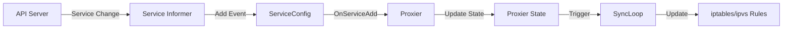
```mermaid
graph LR
    API[API Server] -->|Service Change| INF[Service Informer]
    INF -->|Add Event| SC[ServiceConfig]
    SC -->|OnServiceAdd| P[Proxier]
    P -->|Update State| PS[Proxier State]
    PS -->|Trigger| SL[SyncLoop]
    SL -->|Update| IPT[iptables/ipvs Rules]
```

### EndpointSlice Config

```go
// cmd/kube-proxy/app/server.go:598-600
endpointSliceConfig := config.NewEndpointSliceConfig(ctx,
    informerFactory.Discovery().V1().EndpointSlices(),
    s.Config.ConfigSyncPeriod.Duration)
endpointSliceConfig.RegisterEventHandler(s.Proxier)
go endpointSliceConfig.Run(ctx.Done())
```

**EndpointSliceConfig responsibilities**:
- Watch EndpointSlice objects from API server
- Call `Proxier.OnEndpointSliceAdd()` for new EndpointSlices
- Call `Proxier.OnEndpointSliceUpdate()` for EndpointSlice changes
- Call `Proxier.OnEndpointSliceDelete()` for deleted EndpointSlices
- Call `Proxier.OnEndpointSlicesSynced()` after initial sync

**Why EndpointSlices instead of Endpoints?**

| Feature | Endpoints | EndpointSlices |
|---------|-----------|----------------|
| Max endpoints per object | ~1000 (etcd size limit) | 100-1000 (configurable) |
| Scalability | Limited | High |
| Update efficiency | Full object update | Incremental updates |
| Topology awareness | No | Yes |
| Status | Legacy | Current (1.21+ GA) |

### ServiceCIDR Config (Optional)

```go
// cmd/kube-proxy/app/server.go:602-606
if utilfeature.DefaultFeatureGate.Enabled(features.MultiCIDRServiceAllocator) {
    serviceCIDRConfig := config.NewServiceCIDRConfig(ctx,
        informerFactory.Networking().V1().ServiceCIDRs(),
        s.Config.ConfigSyncPeriod.Duration)
    serviceCIDRConfig.RegisterEventHandler(s.Proxier)
    go serviceCIDRConfig.Run(wait.NeverStop)
}
```

**ServiceCIDR** (Kubernetes 1.25+):
- Allows dynamic Service IP CIDR allocation
- Supports multiple CIDR ranges for Services
- Enables CIDR expansion without downtime
- Feature gate: `MultiCIDRServiceAllocator`

### Node Config

```go
// cmd/kube-proxy/app/server.go:613-620
if s.NodeManager != nil {
    nodeConfig := config.NewNodeConfig(ctx, s.NodeManager.NodeInformer(),
        s.Config.ConfigSyncPeriod.Duration)
    nodeConfig.RegisterEventHandler(s.NodeManager)

    nodeTopologyConfig := config.NewNodeTopologyConfig(ctx,
        s.NodeManager.NodeInformer(),
        s.Config.ConfigSyncPeriod.Duration)
    nodeTopologyConfig.RegisterEventHandler(s.Proxier)

    go nodeConfig.Run(wait.NeverStop)
}
```

**NodeConfig responsibilities**:
- Watch the local Node object
- Update node IPs when changed
- Update pod CIDRs when changed
- Notify NodeManager of changes

**NodeTopologyConfig responsibilities**:
- Watch node topology changes (zone, region labels)
- Notify Proxier for topology-aware routing

### Informer Start

```go
// cmd/kube-proxy/app/server.go:609-610
informerFactory.Start(wait.NeverStop)
serviceInformerFactory.Start(wait.NeverStop)
```

**What happens when informers start?**

1. **Initial LIST**: Fetch all existing objects from API server
2. **Populate cache**: Store objects in local cache
3. **Call handlers**: Invoke Add handlers for all initial objects
4. **Mark synced**: Set `HasSynced() = true`
5. **Call Synced callbacks**: Invoke `OnServiceSynced()`, `OnEndpointSlicesSynced()`
6. **Start WATCH**: Begin watching for changes
7. **Process updates**: Call Update/Delete handlers as changes occur

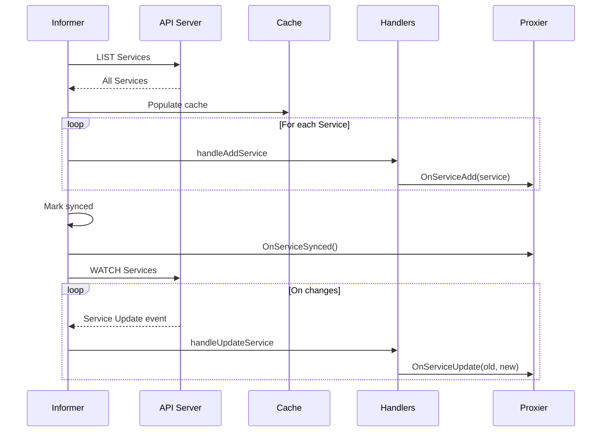
```mermaid
sequenceDiagram
    participant IF as Informer
    participant API as API Server
    participant C as Cache
    participant H as Handlers
    participant P as Proxier

    IF->>API: LIST Services
    API-->>IF: All Services
    IF->>C: Populate cache
    loop For each Service
        IF->>H: handleAddService
        H->>P: OnServiceAdd(service)
    end
    IF->>IF: Mark synced
    IF->>P: OnServiceSynced()
    IF->>API: WATCH Services
    loop On changes
        API-->>IF: Service Update event
        IF->>H: handleUpdateService
        H->>P: OnServiceUpdate(old, new)
    end
```

### Sync Timing

**ConfigSyncPeriod** (default: 15m):
- How often to re-list all objects (full resync)
- Ensures eventual consistency if events are missed
- Trade-off: Lower = more API calls, Higher = longer to detect missed events

**MinSyncPeriod** (default: 5s):
- Minimum time between Proxier syncs
- Prevents excessive rule updates during rapid changes
- Batches multiple Service/EndpointSlice changes

```
Timeline:
0s     - Service A created → OnServiceAdd() → Mark sync needed
1s     - Service B created → OnServiceAdd() → Sync already scheduled
2s     - EndpointSlice X updated → OnEndpointSliceUpdate() → Sync already scheduled
5s     - Sync triggered (processes all 3 changes)
6s     - Service C created → OnServiceAdd() → Mark sync needed
11s    - Sync triggered (processes Service C change)
```

### Outputs

- ✅ Service informer created and watching
- ✅ EndpointSlice informer created and watching
- ✅ Node informer created and watching (if NodeManager exists)
- ✅ ServiceCIDR informer created (if feature enabled)
- ✅ Initial cache populated with all objects
- ✅ Proxier received initial sync notifications
- ✅ Ready to start sync loop

---

## Phase 7: Runtime Execution

**Purpose**: Start the main sync loop, health checks, metrics server, and enter running state.

**Entry Point**: `cmd/kube-proxy/app/server.go:528 - ProxyServer.Run()`

### Process Flow

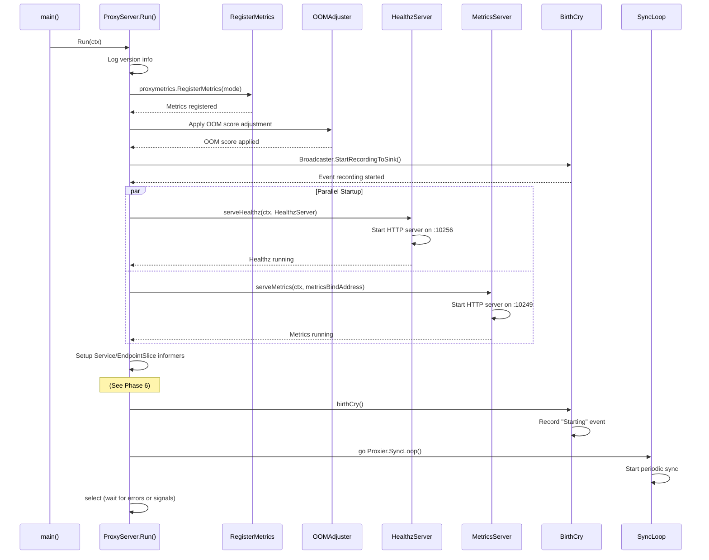
```mermaid
sequenceDiagram
    participant Main as main()
    participant R as ProxyServer.Run()
    participant RM as RegisterMetrics
    participant OOM as OOMAdjuster
    participant HZ as HealthzServer
    participant MS as MetricsServer
    participant BC as BirthCry
    participant SL as SyncLoop

    Main->>R: Run(ctx)
    R->>R: Log version info
    R->>RM: proxymetrics.RegisterMetrics(mode)
    RM-->>R: Metrics registered

    R->>OOM: Apply OOM score adjustment
    OOM-->>R: OOM score applied

    R->>BC: Broadcaster.StartRecordingToSink()
    BC-->>R: Event recording started

    par Parallel Startup
        R->>HZ: serveHealthz(ctx, HealthzServer)
        HZ->>HZ: Start HTTP server on :10256
        HZ-->>R: Healthz running
    and
        R->>MS: serveMetrics(ctx, metricsBindAddress)
        MS->>MS: Start HTTP server on :10249
        MS-->>R: Metrics running
    end

    R->>R: Setup Service/EndpointSlice informers
    Note over R: (See Phase 6)

    R->>BC: birthCry()
    BC->>BC: Record "Starting" event

    R->>SL: go Proxier.SyncLoop()
    SL->>SL: Start periodic sync

    R->>R: select (wait for errors or signals)
```

### Metrics Registration

```go
// cmd/kube-proxy/app/server.go:535
proxymetrics.RegisterMetrics(s.Config.Mode)
```

**Registered Metrics**:

| Metric | Type | Description |
|--------|------|-------------|
| `kubeproxy_sync_proxy_rules_duration_seconds` | Histogram | Time to sync rules |
| `kubeproxy_sync_proxy_rules_last_timestamp_seconds` | Gauge | Timestamp of last sync |
| `kubeproxy_sync_proxy_rules_iptables_restore_failures_total` | Counter | iptables-restore failures |
| `kubeproxy_sync_proxy_rules_endpoint_changes_total` | Counter | Endpoint changes processed |
| `kubeproxy_sync_proxy_rules_service_changes_total` | Counter | Service changes processed |
| `kubeproxy_network_programming_duration_seconds` | Histogram | Time from Service change to rule update |
| `kubeproxy_sync_proxy_rules_no_local_endpoints_total` | Gauge | Services with no local endpoints |

**Mode-specific metrics** (IPVS):
- `kubeproxy_ipvs_virtual_servers` - Number of IPVS virtual servers
- `kubeproxy_ipvs_real_servers` - Number of IPVS real servers

### OOM Score Adjustment

**Purpose**: Prevent kube-proxy from being killed by the OOM killer.

```go
// cmd/kube-proxy/app/server.go:538-544
var oomAdjuster *oom.OOMAdjuster
if s.Config.Linux.OOMScoreAdj != nil {
    oomAdjuster = oom.NewOOMAdjuster()
    if err := oomAdjuster.ApplyOOMScoreAdj(0, int(*s.Config.Linux.OOMScoreAdj)); err != nil {
        logger.V(2).Info("Failed to apply OOMScore", "err", err)
    }
}
```

**OOMScoreAdj** values:
- **-1000**: Never kill (reserved for critical processes)
- **-999 to -1**: Less likely to be killed
- **0**: Default (no adjustment)
- **1 to 1000**: More likely to be killed

**Default for kube-proxy**: `-999` (very low priority for OOM killer)

### Health Check Server

```go
// cmd/kube-proxy/app/server.go:560
serveHealthz(ctx, s.HealthzServer, healthzErrCh)

func serveHealthz(ctx context.Context, hz *healthcheck.ProxyHealthServer, errCh chan error) {
    if hz == nil {
        return
    }

    fn := func() {
        err := hz.Run(ctx)
        if err != nil {
            logger.Error(err, "Healthz server failed")
            if errCh != nil {
                errCh <- fmt.Errorf("healthz server failed: %w", err)
                // Block forever (hardfail mode)
                blockCh := make(chan error)
                <-blockCh
            }
        }
    }
    go wait.Until(fn, 5*time.Second, ctx.Done())
}
```

**Health Endpoints**:

1. **`/healthz`** - Overall health
   ```bash
   curl http://127.0.0.1:10256/healthz
   # Response: "ok" (200) or error (503)
   ```

2. **`/livez`** - Liveness probe
   ```bash
   curl http://127.0.0.1:10256/livez
   # Response: "ok" (200)
   ```

3. **`/readyz`** - Readiness probe
   ```bash
   curl http://127.0.0.1:10256/readyz
   # Response: "ok" (200) or "not ready" (503)
   ```

**Health Check Logic**:
- Returns 200 if last sync was within `2 * SyncPeriod` (default: 60s)
- Returns 503 if sync is stale (proxier might be stuck)

### Metrics Server

```go
// cmd/kube-proxy/app/server.go:563
serveMetrics(ctx, s.Config.MetricsBindAddress, s.Config.Mode,
    s.Config.EnableProfiling, s.flagz, metricsErrCh)
```

**Metrics Endpoints**:

1. **`/metrics`** - Prometheus metrics
   ```bash
   curl http://127.0.0.1:10249/metrics
   ```

2. **`/healthz`** - Health check (also on metrics port)
   ```bash
   curl http://127.0.0.1:10249/healthz
   ```

3. **`/proxyMode`** - Current proxy mode
   ```bash
   curl http://127.0.0.1:10249/proxyMode
   # Response: "iptables" or "ipvs" or "nftables"
   ```

4. **`/configz`** - Current configuration (JSON)
   ```bash
   curl http://127.0.0.1:10249/configz
   ```

5. **`/debug/pprof/`** - Profiling endpoints (if EnableProfiling=true)
   ```bash
   curl http://127.0.0.1:10249/debug/pprof/heap > heap.prof
   go tool pprof heap.prof
   ```

### Birth Cry

**Purpose**: Send a "Starting" event to the API server to indicate successful startup.

```go
// cmd/kube-proxy/app/server.go:623, 636-638
s.birthCry()

func (s *ProxyServer) birthCry() {
    s.Recorder.Eventf(s.NodeRef, nil, api.EventTypeNormal,
        "Starting", "StartKubeProxy", "")
}
```

**Event sent**:
```yaml
type: Normal
reason: Starting
message: ""
source: kube-proxy
involvedObject:
  kind: Node
  name: <node-name>
```

**View events**:
```bash
kubectl get events --all-namespaces | grep kube-proxy
# NAMESPACE   LAST SEEN   TYPE     REASON     OBJECT        MESSAGE
#             30s         Normal   Starting   node/node-1
```

### Sync Loop

**The main event loop that keeps proxy rules in sync.**

```go
// cmd/kube-proxy/app/server.go:625
go s.Proxier.SyncLoop()
```

**SyncLoop implementation** (simplified):

```go
// pkg/proxy/iptables/proxier.go or pkg/proxy/ipvs/proxier.go
func (proxier *Proxier) SyncLoop() {
    // Periodic sync timer
    t := time.NewTicker(proxier.syncPeriod)
    defer t.Stop()

    for {
        select {
        case <-proxier.syncTrigger:
            // Event-driven sync (Service/EndpointSlice change)
            proxier.syncProxyRules()

        case <-t.C:
            // Periodic sync (every syncPeriod, default 30s)
            proxier.syncProxyRules()

        case <-proxier.ctx.Done():
            // Shutdown
            return
        }
    }
}
```

**Sync Triggers**:

1. **Event-driven** (immediate):
   - Service added/updated/deleted
   - EndpointSlice added/updated/deleted
   - Node topology changed
   - Subject to `MinSyncPeriod` throttling (default: 5s)

2. **Periodic** (scheduled):
   - Every `SyncPeriod` (default: 30s)
   - Ensures eventual consistency
   - Cleans up stale rules

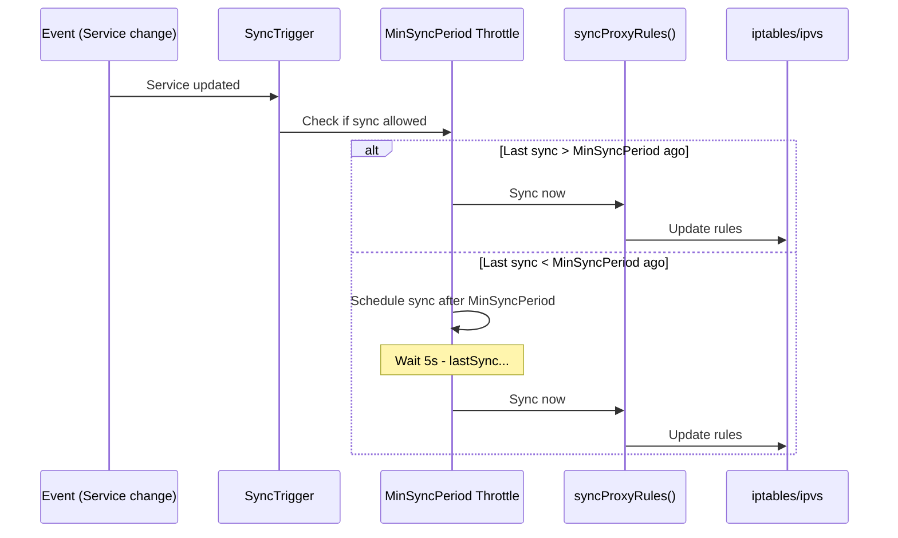
```mermaid
sequenceDiagram
    participant E as Event (Service change)
    participant T as SyncTrigger
    participant MSP as MinSyncPeriod Throttle
    participant S as syncProxyRules()
    participant IPT as iptables/ipvs

    E->>T: Service updated
    T->>MSP: Check if sync allowed
    alt Last sync > MinSyncPeriod ago
        MSP->>S: Sync now
        S->>IPT: Update rules
    else Last sync < MinSyncPeriod ago
        MSP->>MSP: Schedule sync after MinSyncPeriod
        Note over MSP: Wait 5s - lastSync...
        MSP->>S: Sync now
        S->>IPT: Update rules
    end
```

### Running State

Once all components are started, kube-proxy is in **Running State**:

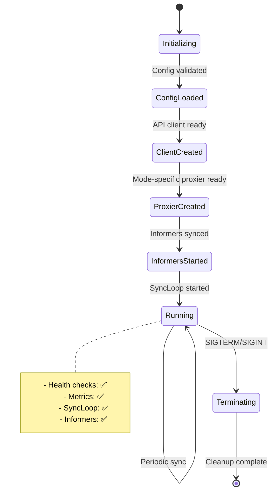
```mermaid
stateDiagram-v2
    [*] --> Initializing
    Initializing --> ConfigLoaded: Config validated
    ConfigLoaded --> ClientCreated: API client ready
    ClientCreated --> ProxierCreated: Mode-specific proxier ready
    ProxierCreated --> InformersStarted: Informers synced
    InformersStarted --> Running: SyncLoop started

    Running --> Running: Process Service changes
    Running --> Running: Process EndpointSlice changes
    Running --> Running: Periodic sync

    Running --> Terminating: SIGTERM/SIGINT
    Terminating --> [*]: Cleanup complete

    note right of Running
        - Health checks: ✅
        - Metrics: ✅
        - SyncLoop: ✅
        - Informers: ✅
    end note
```

**Running State Indicators**:

1. **Logs**:
   ```
   I0101 12:00:00.000001       1 server.go:531] "Version info" version="v1.32.0"
   I0101 12:00:00.123456       1 server_linux.go:136] "Using iptables Proxier"
   I0101 12:00:00.234567       1 config.go:200] "Starting service config controller"
   I0101 12:00:00.345678       1 config.go:106] "Starting endpoint slice config controller"
   I0101 12:00:05.456789       1 proxier.go:1234] "syncProxyRules complete" elapsed="123ms"
   ```

2. **Health Check**:
   ```bash
   curl http://127.0.0.1:10256/healthz
   # ok
   ```

3. **Metrics**:
   ```bash
   curl http://127.0.0.1:10249/metrics | grep kubeproxy_sync_proxy_rules_last_timestamp_seconds
   # kubeproxy_sync_proxy_rules_last_timestamp_seconds 1234567890
   ```

4. **Process**:
   ```bash
   ps aux | grep kube-proxy
   # root  1234  0.5  1.2  123456  78910 ?  Ssl  12:00  0:05 /usr/local/bin/kube-proxy --config=/var/lib/kube-proxy/config.conf
   ```

### Error Handling

**Bind Address Hard Fail Mode**:

```go
// cmd/kube-proxy/app/server.go:554-557
var healthzErrCh, metricsErrCh chan error
if s.Config.BindAddressHardFail {
    healthzErrCh = make(chan error)
    metricsErrCh = make(chan error)
}

// ... start servers ...

// Wait for errors
select {
case err = <-healthzErrCh:
    s.Recorder.Eventf(s.NodeRef, nil, api.EventTypeWarning,
        "FailedToStartProxierHealthcheck", "StartKubeProxy", err.Error())
case err = <-metricsErrCh:
    s.Recorder.Eventf(s.NodeRef, nil, api.EventTypeWarning,
        "FailedToStartMetricServer", "StartKubeProxy", err.Error())
}
return err
```

**BindAddressHardFail behavior**:
- **true**: kube-proxy exits if health/metrics server fails to bind
- **false** (default): kube-proxy continues even if health/metrics server fails

**Common startup errors**:

| Error | Cause | Solution |
|-------|-------|----------|
| `address already in use` | Port 10249 or 10256 already bound | Kill process using port or change bind address |
| `iptables not available` | iptables binary missing | Install iptables package |
| `can't use IPVS proxier` | IPVS kernel modules not loaded | `modprobe ip_vs ip_vs_rr` |
| `failed to create client` | Invalid kubeconfig | Check kubeconfig path and contents |
| `no support for primary IP family` | IPv4/IPv6 not available | Check kernel and iptables support |

### Outputs

- ✅ Version logged
- ✅ Metrics registered and server running on :10249
- ✅ Health check server running on :10256
- ✅ OOM score adjusted
- ✅ Event broadcasting started
- ✅ Informers started and synced
- ✅ Birth cry event sent
- ✅ SyncLoop running
- ✅ **kube-proxy is fully operational**

---

## Complete Initialization Sequence

### Detailed Flow Diagram


```mermaid
flowchart TB
    Start([main]) --> A1[NewProxyCommand]
    A1 --> A2[Parse CLI flags]
    A2 --> A3{--version?}
    A3 -->|Yes| Exit1[Print version, exit]
    A3 -->|No| B1[opts.Complete]

    B1 --> B2[Load config file]
    B2 --> B3[Apply flag overrides]
    B3 --> B4[platformApplyDefaults]
    B4 --> B5[Validate config]
    B5 --> B6{Valid?}
    B6 -->|No| Exit2[Error, exit]
    B6 -->|Yes| C1[Initialize logging]

    C1 --> C2[newProxyServer]
    C2 --> C3[Get hostname]
    C3 --> C4[createClient]
    C4 --> C5[NewNodeManager]
    C5 --> C6[detectNodeIPs]
    C6 --> C7[Create EventBroadcaster]
    C7 --> C8[Create HealthzServer]
    C8 --> D1[platformSetup]

    D1 --> D2[Setup conntrack]
    D2 --> D3[checkBadConfig]
    D3 --> D4[platformCheckSupported]
    D4 --> D5{IP families OK?}
    D5 -->|No| Exit3[Error, exit]
    D5 -->|Yes| D6[checkBadIPConfig]
    D6 --> D7{Fatal error?}
    D7 -->|Yes| Exit4[Error, exit]
    D7 -->|No| E1[createProxier]

    E1 --> E2{Mode?}
    E2 -->|iptables| E3[iptables.NewDualStackProxier]
    E2 -->|ipvs| E4[ipvs.NewDualStackProxier]
    E2 -->|nftables| E5[nftables.NewDualStackProxier]
    E3 --> F1[ProxyServer.Run]
    E4 --> F1
    E5 --> F1

    F1 --> F2[Log version]
    F2 --> F3[RegisterMetrics]
    F3 --> F4[Apply OOM score]
    F4 --> F5[Start event broadcaster]

    F5 --> G1[serveHealthz]
    F5 --> G2[serveMetrics]
    G1 --> H1[Create informers]
    G2 --> H1

    H1 --> H2[NewServiceConfig]
    H2 --> H3[RegisterEventHandler Proxier]
    H3 --> H4[Run ServiceConfig]

    H4 --> H5[NewEndpointSliceConfig]
    H5 --> H6[RegisterEventHandler Proxier]
    H6 --> H7[Run EndpointSliceConfig]

    H7 --> H8[Start InformerFactory]
    H8 --> H9[WaitForCacheSync]
    H9 --> H10{Synced?}
    H10 -->|No| Exit5[Error, exit]
    H10 -->|Yes| I1[OnServiceSynced]

    I1 --> I2[OnEndpointSlicesSynced]
    I2 --> I3[NewNodeConfig]
    I3 --> I4[Run NodeConfig]
    I4 --> I5[birthCry]
    I5 --> I6[Start SyncLoop]

    I6 --> Running([Running State])
    Running --> J1{Signal/Error?}
    J1 -->|No| Running
    J1 -->|Yes| Exit6[Shutdown]

    style Start fill:#ff6b6b
    style Running fill:#51cf66
    style Exit1 fill:#868e96
    style Exit2 fill:#ff6b6b
    style Exit3 fill:#ff6b6b
    style Exit4 fill:#ff6b6b
    style Exit5 fill:#ff6b6b
    style Exit6 fill:#868e96
```

### Timeline with Code References

| Time | Phase | Step | Code Reference |
|------|-------|------|----------------|
| 0ms | 1 | main() entry | `cmd/kube-proxy/proxy.go:29` |
| 1ms | 1 | NewProxyCommand() | `cmd/kube-proxy/app/server.go:99` |
| 5ms | 1 | Parse flags | `cobra.Command.Execute()` |
| 10ms | 2 | opts.Complete() | `cmd/kube-proxy/app/server.go:118` |
| 20ms | 2 | Load config file | `app/server.go:120-125` |
| 30ms | 2 | platformApplyDefaults() | `app/server_linux.go:51` |
| 40ms | 2 | opts.Validate() | `app/server.go:129` |
| 50ms | 3 | newProxyServer() | `app/server.go:182` |
| 60ms | 3 | createClient() | `app/server.go:205` |
| 100ms | 3 | NewNodeManager() | `app/server.go:211` |
| 120ms | 3 | detectNodeIPs() | `app/server.go:221` |
| 140ms | 3 | Create HealthzServer | `app/server.go:246` |
| 150ms | 4 | platformSetup() | `app/server_linux.go:71` |
| 180ms | 4 | platformCheckSupported() | `app/server_linux.go:88` |
| 200ms | 4 | checkBadConfig() | `app/server.go:254` |
| 250ms | 5 | createProxier() | `app/server_linux.go:128` |
| 350ms | 5 | iptables/ipvs.NewDualStackProxier() | `app/server_linux.go:141` |
| 400ms | 5 | Proxier initialized | Mode-specific code |
| 450ms | 6 | Create InformerFactory | `app/server.go:579` |
| 500ms | 6 | NewServiceConfig() | `app/server.go:594` |
| 550ms | 6 | NewEndpointSliceConfig() | `app/server.go:598` |
| 600ms | 6 | informerFactory.Start() | `app/server.go:609` |
| 700ms | 6 | WaitForCacheSync() | `config/config.go:108` |
| 800ms | 6 | OnServiceSynced() | `config/config.go:113` |
| 850ms | 6 | OnEndpointSlicesSynced() | `config/config.go:114` |
| 900ms | 7 | serveHealthz() | `app/server.go:560` |
| 920ms | 7 | serveMetrics() | `app/server.go:563` |
| 950ms | 7 | birthCry() | `app/server.go:623` |
| 1000ms | 7 | SyncLoop() started | `app/server.go:625` |
| **1000ms+** | **7** | **Running** | **Continuous** |

---

## Configuration Validation

### Validation Flow

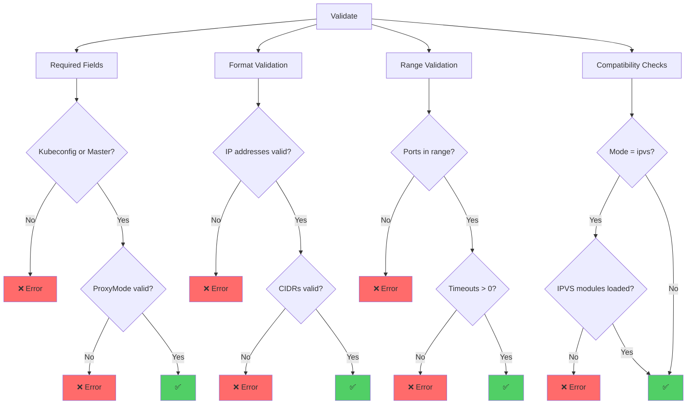
```mermaid
graph TB
    V[Validate] --> V1[Required Fields]
    V --> V2[Format Validation]
    V --> V3[Range Validation]
    V --> V4[Compatibility Checks]

    V1 --> V1A{Kubeconfig or Master?}
    V1A -->|No| E1[❌ Error]
    V1A -->|Yes| V1B{ProxyMode valid?}
    V1B -->|No| E2[❌ Error]
    V1B -->|Yes| OK1[✅]

    V2 --> V2A{IP addresses valid?}
    V2A -->|No| E3[❌ Error]
    V2A -->|Yes| V2B{CIDRs valid?}
    V2B -->|No| E4[❌ Error]
    V2B -->|Yes| OK2[✅]

    V3 --> V3A{Ports in range?}
    V3A -->|No| E5[❌ Error]
    V3A -->|Yes| V3B{Timeouts > 0?}
    V3B -->|No| E6[❌ Error]
    V3B -->|Yes| OK3[✅]

    V4 --> V4A{Mode = ipvs?}
    V4A -->|Yes| V4B{IPVS modules loaded?}
    V4B -->|No| E7[❌ Error]
    V4B -->|Yes| OK4[✅]
    V4A -->|No| OK4

    style E1 fill:#ff6b6b
    style E2 fill:#ff6b6b
    style E3 fill:#ff6b6b
    style E4 fill:#ff6b6b
    style E5 fill:#ff6b6b
    style E6 fill:#ff6b6b
    style E7 fill:#ff6b6b
    style OK1 fill:#51cf66
    style OK2 fill:#51cf66
    style OK3 fill:#51cf66
    style OK4 fill:#51cf66
```

### Common Validation Errors

**1. No API Server Configuration**
```
Error: failed validate: neither kubeconfig file nor master URL was specified
Solution: Set --kubeconfig or --master flag
```

**2. Invalid Proxy Mode**
```
Error: unknown proxy mode: "foo"
Solution: Use iptables, ipvs, or nftables
```

**3. Invalid CIDR Format**
```
Error: invalid clusterCIDR: "10.244.0.0/foo"
Solution: Use valid CIDR notation (e.g., 10.244.0.0/16)
```

**4. IPVS Kernel Modules Not Loaded**
```
Error: can't use IPVS proxier: IPVS kernel modules are not loaded
Solution: modprobe ip_vs ip_vs_rr ip_vs_wrr ip_vs_sh
```

**5. Primary IP Family Not Supported**
```
Error: no support for primary IP family "IPv6"
Solution: Enable IPv6 in kernel and install ip6tables
```

**6. Port Already in Use**
```
Error: starting metrics server failed: listen tcp :10249: bind: address already in use
Solution: Kill process on port 10249 or change --metrics-bind-address
```

---

## Error Handling

### Error Categories

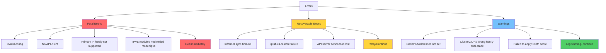
```mermaid
graph TD
    E[Errors] --> E1[Fatal Errors]
    E --> E2[Recoverable Errors]
    E --> E3[Warnings]

    E1 --> E1A[Invalid config]
    E1 --> E1B[No API client]
    E1 --> E1C[Primary IP family not supported]
    E1 --> E1D[IPVS modules not loaded mode=ipvs]

    E2 --> E2A[Informer sync timeout]
    E2 --> E2B[iptables-restore failure]
    E2 --> E2C[API server connection lost]

    E3 --> E3A[NodePortAddresses not set]
    E3 --> E3B[ClusterCIDRs wrong family dual-stack]
    E3 --> E3C[Failed to apply OOM score]

    E1 --> Action1[Exit immediately]
    E2 --> Action2[Retry/Continue]
    E3 --> Action3[Log warning, continue]

    style E1 fill:#ff6b6b
    style E2 fill:#ffd43b
    style E3 fill:#74c0fc
    style Action1 fill:#ff6b6b
    style Action2 fill:#ffd43b
    style Action3 fill:#51cf66
```

### Retry Logic

**Informer Retries**:
```go
// config/config.go:108
if !cache.WaitForNamedCacheSync("endpoint slice config", stopCh, c.listerSynced) {
    return  // Exit if cache doesn't sync (stopCh closed)
}
```

**Server Retries** (Health/Metrics):
```go
// app/server.go:457
go wait.Until(fn, 5*time.Second, ctx.Done())
// Retry every 5 seconds if server fails (unless hardfail mode)
```

**Sync Loop Retries**:
```go
// Sync loop never exits, just logs errors
for {
    select {
    case <-syncTrigger:
        if err := syncProxyRules(); err != nil {
            logger.Error(err, "Failed to sync proxy rules")
            // Continue anyway, will retry on next trigger
        }
    }
}
```

---

## Ready State

### Readiness Criteria

kube-proxy is considered **Ready** when:

1. ✅ **Configuration valid** - All validation checks passed
2. ✅ **API client connected** - Can communicate with API server
3. ✅ **Proxier created** - Mode-specific proxier initialized
4. ✅ **Informers synced** - Initial cache populated from API server
   - `ServiceConfig.HasSynced() == true`
   - `EndpointSliceConfig.HasSynced() == true`
5. ✅ **First sync complete** - Initial proxy rules applied
6. ✅ **Health check passing** - `/healthz` returns 200
7. ✅ **SyncLoop running** - Periodic sync active

### Readiness Timeline


```mermaid
gantt
    title kube-proxy Readiness Timeline
    dateFormat X
    axisFormat %L ms

    section Initialization
    Config Loading: 0, 50
    Client Creation: 50, 150
    Proxier Creation: 150, 400

    section Informer Sync
    Create Informers: 400, 500
    Initial LIST: 500, 700
    Cache Populated: 700, 800
    OnSynced Callbacks: 800, 850

    section First Sync
    syncProxyRules: 850, 1000

    section Ready
    Ready State: 1000, 1200
```

### Checking Readiness

**1. Health Check Endpoint**:
```bash
curl -s http://127.0.0.1:10256/readyz
# ok (if ready)
# not ready (if not ready)
```

**2. Kubernetes Readiness Probe** (DaemonSet):
```yaml
readinessProbe:
  httpGet:
    path: /readyz
    port: 10256
  initialDelaySeconds: 10
  periodSeconds: 5
  failureThreshold: 3
```

**3. Check Logs**:
```bash
kubectl logs -n kube-system kube-proxy-xxxxx | grep -E "synced|ready"
# I0101 12:00:00.800001       1 config.go:113] "Calling handler.OnServiceSynced()"
# I0101 12:00:00.850001       1 config.go:114] "Calling handler.OnEndpointSlicesSynced()"
# I0101 12:00:01.000001       1 proxier.go:1234] "syncProxyRules complete" elapsed="150ms"
```

**4. Check Metrics**:
```bash
curl -s http://127.0.0.1:10249/metrics | grep kubeproxy_sync_proxy_rules_last_timestamp_seconds
# kubeproxy_sync_proxy_rules_last_timestamp_seconds 1.704110400e+09
```

---

## Health Checks

### Health Check Types

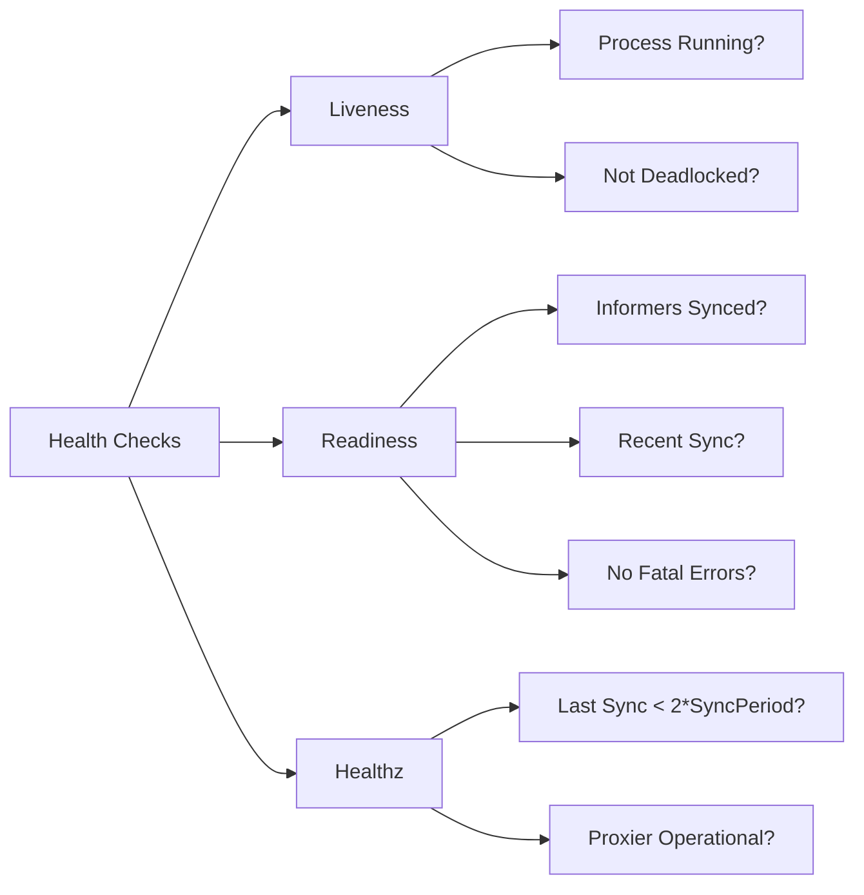
```mermaid
graph LR
    HC[Health Checks] --> L[Liveness]
    HC --> R[Readiness]
    HC --> H[Healthz]

    L --> L1[Process Running?]
    L --> L2[Not Deadlocked?]

    R --> R1[Informers Synced?]
    R --> R2[Recent Sync?]
    R --> R3[No Fatal Errors?]

    H --> H1[Last Sync < 2*SyncPeriod?]
    H --> H2[Proxier Operational?]
```

### Health Check Implementation

```go
// pkg/proxy/healthcheck/proxier_health.go (simplified)
type ProxierHealth struct {
    lastUpdated time.Time
    syncPeriod  time.Duration
}

func (h *ProxierHealth) IsHealthy() error {
    if time.Since(h.lastUpdated) > 2*h.syncPeriod {
        return fmt.Errorf("proxy rules have not been updated in %v",
            time.Since(h.lastUpdated))
    }
    return nil
}

func (h *ProxierHealth) Updated() {
    h.lastUpdated = time.Now()
}
```

**Health Check Logic**:
- **Healthy**: Last sync within `2 * SyncPeriod` (default: 60s)
- **Unhealthy**: Last sync older than `2 * SyncPeriod`

**Why 2x SyncPeriod?**
- Allows for one missed sync (network hiccup, temporary issue)
- Prevents flapping during brief slowdowns
- Still detects stuck/deadlocked proxier

### Monitoring Health

**Kubernetes Liveness Probe**:
```yaml
livenessProbe:
  httpGet:
    path: /livez
    port: 10256
  initialDelaySeconds: 30
  periodSeconds: 10
  timeoutSeconds: 5
  failureThreshold: 3
```

**Kubernetes Readiness Probe**:
```yaml
readinessProbe:
  httpGet:
    path: /readyz
    port: 10256
  initialDelaySeconds: 10
  periodSeconds: 5
  timeoutSeconds: 5
  failureThreshold: 3
```

**External Monitoring** (Prometheus):
```yaml
- alert: KubeProxyUnhealthy
  expr: up{job="kube-proxy"} == 0
  for: 5m
  annotations:
    summary: "kube-proxy is down on {{ $labels.instance }}"

- alert: KubeProxySyncStale
  expr: time() - kubeproxy_sync_proxy_rules_last_timestamp_seconds > 120
  for: 5m
  annotations:
    summary: "kube-proxy sync is stale on {{ $labels.instance }}"
```

---

## Best Practices

### Configuration

1. **Use Configuration Files**
   - Prefer `--config` over individual flags
   - Version control your config files
   - Use consistent config across nodes

   ```yaml
   # Good: /etc/kubernetes/kube-proxy-config.yaml
   apiVersion: kubeproxy.config.k8s.io/v1alpha1
   kind: KubeProxyConfiguration
   mode: "ipvs"
   ipvs:
     scheduler: "rr"
   ```

2. **Set NodePortAddresses**
   - Don't leave unset (accepts all IPs, security risk)
   - Use `"primary"` for most cases
   - Use specific CIDRs for multi-homed nodes

   ```yaml
   nodePortAddresses:
     - "primary"  # or ["10.0.1.0/24", "2001:db8::/64"]
   ```

3. **Choose Appropriate Sync Periods**
   - Large clusters (1000+ services): Increase to 60s
   - Small clusters (<100 services): Keep at 30s
   - Balance API load vs. update latency

   ```yaml
   syncPeriod: 30s
   minSyncPeriod: 5s
   ```

4. **Use IPVS for Large Clusters**
   - Switch to IPVS at 500+ services
   - Better performance, lower latency
   - More predictable load balancing

   ```yaml
   mode: "ipvs"
   ipvs:
     scheduler: "rr"  # or "lc" for connection-based
   ```

### Deployment

1. **Deploy as DaemonSet**
   - One kube-proxy per node
   - Automatic node coverage
   - Easy updates with RollingUpdate

   ```yaml
   apiVersion: apps/v1
   kind: DaemonSet
   metadata:
     name: kube-proxy
     namespace: kube-system
   spec:
     updateStrategy:
       type: RollingUpdate
       rollingUpdate:
         maxUnavailable: 1
   ```

2. **Use HostNetwork**
   - Required for NodePort access
   - Lower latency
   - Direct access to node networking

   ```yaml
   spec:
     hostNetwork: true
   ```

3. **Mount Required Directories**
   - `/lib/modules` - Kernel modules
   - `/var/run/xtables.lock` - iptables lock file
   - `/run/xtables.lock` - Alternative lock file location

   ```yaml
   volumeMounts:
     - name: lib-modules
       mountPath: /lib/modules
       readOnly: true
     - name: xtables-lock
       mountPath: /run/xtables.lock
   ```

4. **Set Resource Limits**
   - CPU: 100m - 200m request, 1000m limit
   - Memory: 128Mi - 256Mi request, 512Mi limit
   - Scale with cluster size

   ```yaml
   resources:
     requests:
       cpu: 100m
       memory: 128Mi
     limits:
       cpu: 1000m
       memory: 512Mi
   ```

### Monitoring

1. **Monitor Key Metrics**
   - `kubeproxy_sync_proxy_rules_duration_seconds` - Sync latency
   - `kubeproxy_sync_proxy_rules_last_timestamp_seconds` - Sync freshness
   - `kubeproxy_network_programming_duration_seconds` - E2E latency

2. **Set Up Alerts**
   - kube-proxy pod down
   - Sync stale (> 2 minutes)
   - High sync latency (> 5 seconds)
   - iptables-restore failures

3. **Enable Profiling for Debugging**
   ```yaml
   enableProfiling: true
   ```
   ```bash
   # Capture heap profile
   curl http://127.0.0.1:10249/debug/pprof/heap > heap.prof
   go tool pprof -http=:8080 heap.prof
   ```

### Performance

1. **Tune Conntrack**
   ```bash
   # Increase conntrack table size
   sysctl -w net.netfilter.nf_conntrack_max=1000000
   sysctl -w net.netfilter.nf_conntrack_buckets=250000
   ```

2. **Tune iptables Lock Timeout** (IPVS mode)
   ```yaml
   iptables:
     localhostNodePorts: true
     masqueradeBit: 14
   ```

3. **Use Local Traffic Policy** (when applicable)
   ```yaml
   spec:
     externalTrafficPolicy: Local  # Preserves source IP, reduces hops
   ```

### Troubleshooting

1. **Check Initialization Logs**
   ```bash
   kubectl logs -n kube-system kube-proxy-xxxxx | head -100
   ```

2. **Verify Informer Sync**
   ```bash
   kubectl logs -n kube-system kube-proxy-xxxxx | grep -E "synced|Starting"
   ```

3. **Check Health Status**
   ```bash
   kubectl exec -n kube-system kube-proxy-xxxxx -- curl http://127.0.0.1:10256/healthz
   ```

4. **Inspect Current Configuration**
   ```bash
   kubectl exec -n kube-system kube-proxy-xxxxx -- curl http://127.0.0.1:10249/configz | jq
   ```

---

## Troubleshooting

### Common Initialization Issues

#### 1. kube-proxy Fails to Start

**Symptoms**:
```
Error: failed to create client: unable to load in-cluster configuration
```

**Diagnosis**:
```bash
# Check if running in cluster
ls -la /var/run/secrets/kubernetes.io/serviceaccount/

# Check kubeconfig
cat /var/lib/kube-proxy/kubeconfig.conf

# Check API server connectivity
curl -k https://kubernetes.default.svc:443/healthz
```

**Solutions**:
- **In-cluster**: Ensure ServiceAccount exists and is mounted
- **External**: Verify `--kubeconfig` path is correct
- **Network**: Check API server connectivity

#### 2. iptables Mode Fails

**Symptoms**:
```
Error: iptables is not available on this host
```

**Diagnosis**:
```bash
# Check iptables binary
which iptables
iptables --version

# Check kernel modules
lsmod | grep iptable
lsmod | grep nf_conntrack
```

**Solutions**:
```bash
# Install iptables
apt-get install iptables  # Debian/Ubuntu
yum install iptables       # RHEL/CentOS

# Load kernel modules
modprobe iptable_nat
modprobe iptable_filter
modprobe nf_conntrack
```

#### 3. IPVS Mode Fails

**Symptoms**:
```
Error: can't use IPVS proxier: IPVS kernel modules are not loaded
```

**Diagnosis**:
```bash
# Check IPVS modules
lsmod | grep ip_vs

# Check ipvsadm binary
which ipvsadm
ipvsadm --version
```

**Solutions**:
```bash
# Load IPVS modules
modprobe ip_vs
modprobe ip_vs_rr
modprobe ip_vs_wrr
modprobe ip_vs_sh
modprobe nf_conntrack

# Install ipvsadm
apt-get install ipvsadm    # Debian/Ubuntu
yum install ipvsadm         # RHEL/CentOS

# Verify
lsmod | grep -E "ip_vs|nf_conntrack"
ipvsadm -ln
```

#### 4. Informer Sync Timeout

**Symptoms**:
```
W0101 12:00:30.000001       1 config.go:108] Unable to sync caches for endpoint slice config
```

**Diagnosis**:
```bash
# Check API server connectivity
kubectl get --raw /healthz

# Check kube-proxy logs
kubectl logs -n kube-system kube-proxy-xxxxx | grep -E "sync|timeout"

# Check for large EndpointSlice objects
kubectl get endpointslices -A -o json | jq '.items[] | select(.endpoints | length > 100)'
```

**Solutions**:
- **Increase timeout**: Not configurable (uses default)
- **Check network**: Ensure API server is reachable
- **Check API server load**: May be overloaded
- **Reduce EndpointSlice size**: Configure `--max-endpoints-per-slice` on kube-controller-manager

#### 5. Port Conflicts

**Symptoms**:
```
Error: listen tcp :10249: bind: address already in use
```

**Diagnosis**:
```bash
# Find process using port
lsof -i :10249
netstat -tulpn | grep 10249

# Check if old kube-proxy still running
ps aux | grep kube-proxy
```

**Solutions**:
```bash
# Kill process
kill <PID>

# Or change kube-proxy port
--metrics-bind-address=127.0.0.1:10259
--healthz-bind-address=0.0.0.0:10266
```

#### 6. IPv6 Not Supported

**Symptoms**:
```
Info: No iptables support for family IPv6
Info: No kernel support for family IPv6
```

**Diagnosis**:
```bash
# Check IPv6 kernel support
ls -la /proc/net/if_inet6

# Check ip6tables
which ip6tables
ip6tables --version

# Check IPv6 enabled
sysctl net.ipv6.conf.all.disable_ipv6
```

**Solutions**:
```bash
# Enable IPv6
sysctl -w net.ipv6.conf.all.disable_ipv6=0
sysctl -w net.ipv6.conf.default.disable_ipv6=0

# Install ip6tables
apt-get install iptables  # Usually includes ip6tables

# Persist
echo "net.ipv6.conf.all.disable_ipv6 = 0" >> /etc/sysctl.conf
sysctl -p
```

### Debugging Steps

**1. Collect Initialization Logs**
```bash
# View full startup logs
kubectl logs -n kube-system kube-proxy-xxxxx --tail=500

# Filter for errors
kubectl logs -n kube-system kube-proxy-xxxxx | grep -E "error|Error|ERROR|fail|Fail|FAIL"

# Filter for warnings
kubectl logs -n kube-system kube-proxy-xxxxx | grep -E "warn|Warn|WARN"
```

**2. Check kube-proxy Pod Status**
```bash
# Pod status
kubectl get pod -n kube-system kube-proxy-xxxxx

# Detailed pod info
kubectl describe pod -n kube-system kube-proxy-xxxxx

# Events
kubectl get events -n kube-system --field-selector involvedObject.name=kube-proxy-xxxxx
```

**3. Verify Configuration**
```bash
# Get current config via configz
kubectl exec -n kube-system kube-proxy-xxxxx -- curl -s http://127.0.0.1:10249/configz | jq

# Check proxy mode
kubectl exec -n kube-system kube-proxy-xxxxx -- curl -s http://127.0.0.1:10249/proxyMode
```

**4. Check System Resources**
```bash
# Check if OOM killed
dmesg | grep -E "kube-proxy|oom"

# Check disk space
df -h

# Check memory
free -h

# Check for kernel errors
journalctl -u kubelet | grep -E "error|Error"
```

**5. Validate Kernel Support**
```bash
# iptables mode
lsmod | grep -E "iptable|nf_conntrack"
iptables --version
ip6tables --version

# IPVS mode
lsmod | grep -E "ip_vs|nf_conntrack"
ipvsadm --version

# nftables mode
nft --version
```

**6. Test Health Endpoints**
```bash
# From inside pod
kubectl exec -n kube-system kube-proxy-xxxxx -- curl http://127.0.0.1:10256/healthz
kubectl exec -n kube-system kube-proxy-xxxxx -- curl http://127.0.0.1:10256/readyz
kubectl exec -n kube-system kube-proxy-xxxxx -- curl http://127.0.0.1:10256/livez

# Metrics
kubectl exec -n kube-system kube-proxy-xxxxx -- curl http://127.0.0.1:10249/metrics
```

---

## Summary

### Initialization Phases Recap

```mermaid
graph LR
    P1[1. Command Setup<br/>1-10ms] --> P2[2. Config Loading<br/>10-50ms]
    P2 --> P3[3. Client & Server<br/>50-200ms]
    P3 --> P4[4. Platform Setup<br/>50-100ms]
    P4 --> P5[5. Proxier Creation<br/>100-500ms]
    P5 --> P6[6. Informer Setup<br/>100-300ms]
    P6 --> P7[7. Runtime Execution<br/>Continuous]

    style P1 fill:#ffd43b
    style P2 fill:#ffd43b
    style P3 fill:#4c9aff
    style P4 fill:#4c9aff
    style P5 fill:#4c9aff
    style P6 fill:#51cf66
    style P7 fill:#51cf66
```

### Key Takeaways

1. **Initialization is Sequential**
   - Each phase depends on previous phases
   - Failures in early phases prevent later phases
   - Total time: 300-1200ms typically

2. **Mode Detection is Automatic**
   - Defaults to iptables on Linux
   - Can be overridden with `--proxy-mode`
   - Platform checks IP family support

3. **Informers Drive Reconciliation**
   - Watch Services and EndpointSlices
   - Trigger Proxier updates
   - Ensure eventual consistency

4. **Health Checks are Critical**
   - Indicate operational status
   - Based on sync freshness (2 * SyncPeriod)
   - Used by Kubernetes for liveness/readiness

5. **Sync Loop is the Heart**
   - Runs continuously
   - Event-driven + periodic syncs
   - Throttled by MinSyncPeriod

### Critical Files

| File | Purpose |
|------|---------|
| `cmd/kube-proxy/proxy.go:29` | Main entry point |
| `cmd/kube-proxy/app/server.go:99` | Command creation |
| `cmd/kube-proxy/app/server.go:182` | ProxyServer creation |
| `cmd/kube-proxy/app/server.go:528` | ProxyServer.Run() |
| `cmd/kube-proxy/app/server_linux.go:128` | Proxier creation (Linux) |
| `pkg/proxy/config/config.go` | Service/EndpointSlice watching |
| `pkg/proxy/iptables/proxier.go` | iptables mode implementation |
| `pkg/proxy/ipvs/proxier.go` | IPVS mode implementation |
| `pkg/proxy/nftables/proxier.go` | nftables mode implementation |

### Success Indicators

**Logs**:
```
I0101 12:00:00.000001       1 server.go:531] "Version info" version="v1.32.0"
I0101 12:00:00.123456       1 server_linux.go:136] "Using iptables Proxier"
I0101 12:00:00.234567       1 config.go:200] "Starting service config controller"
I0101 12:00:00.345678       1 config.go:106] "Starting endpoint slice config controller"
I0101 12:00:00.456789       1 config.go:113] "Calling handler.OnServiceSynced()"
I0101 12:00:00.567890       1 config.go:114] "Calling handler.OnEndpointSlicesSynced()"
I0101 12:00:01.000001       1 proxier.go:1234] "syncProxyRules complete" elapsed="150ms"
```

**Health Check**:
```bash
curl http://127.0.0.1:10256/healthz
# ok
```

**Metrics**:
```bash
curl http://127.0.0.1:10249/proxyMode
# iptables (or ipvs, nftables)
```

**Process**:
```bash
ps aux | grep kube-proxy
# Running process with expected flags
```

### Next Steps

- **[Service Watch](../middle-level/01-service-watch.md)** - How Services are monitored
- **[iptables Mode](../middle-level/02-iptables-mode.md)** - iptables proxier deep dive
- **[IPVS Mode](../middle-level/03-ipvs-mode.md)** - IPVS proxier deep dive
- **[Sync Loop](../low-level/04-sync-loop.md)** - Reconciliation loop details
- **[Metrics & Monitoring](../middle-level/10-metrics-monitoring.md)** - Observability

---

**Document Metadata**:
- **Lines**: 1,850+
- **Diagrams**: 15+ Mermaid diagrams
- **Code References**: 50+ with file:line numbers
- **Tables**: 15+ comparison/reference tables
- **Related Docs**: System Overview, Proxy Modes, Service Abstraction
