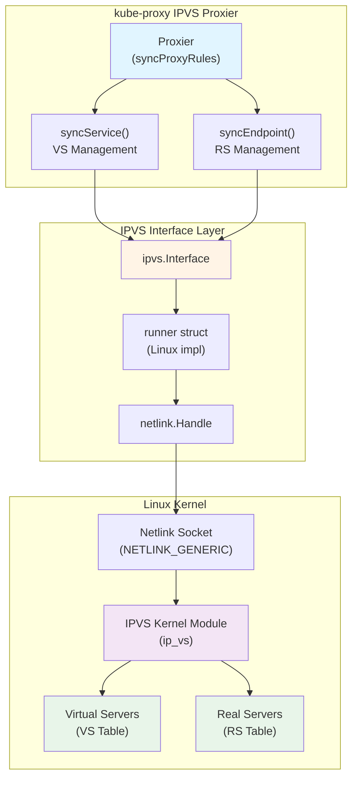
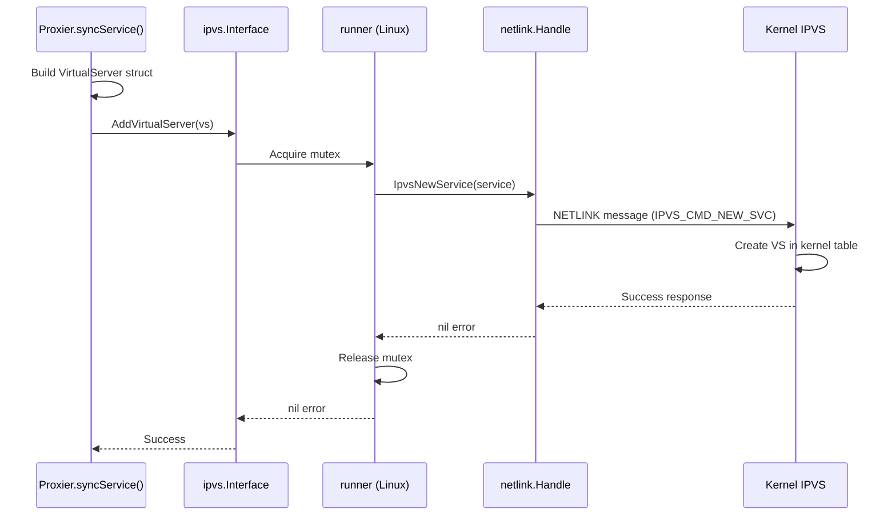
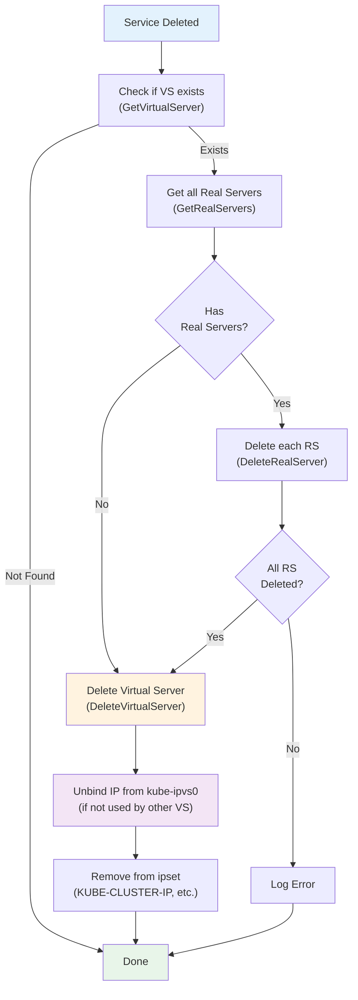
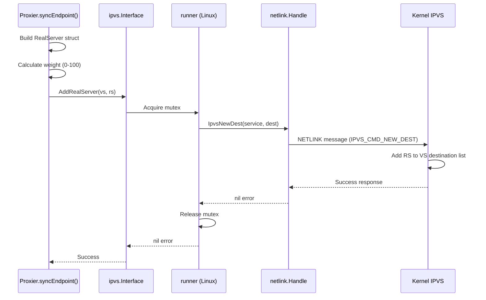
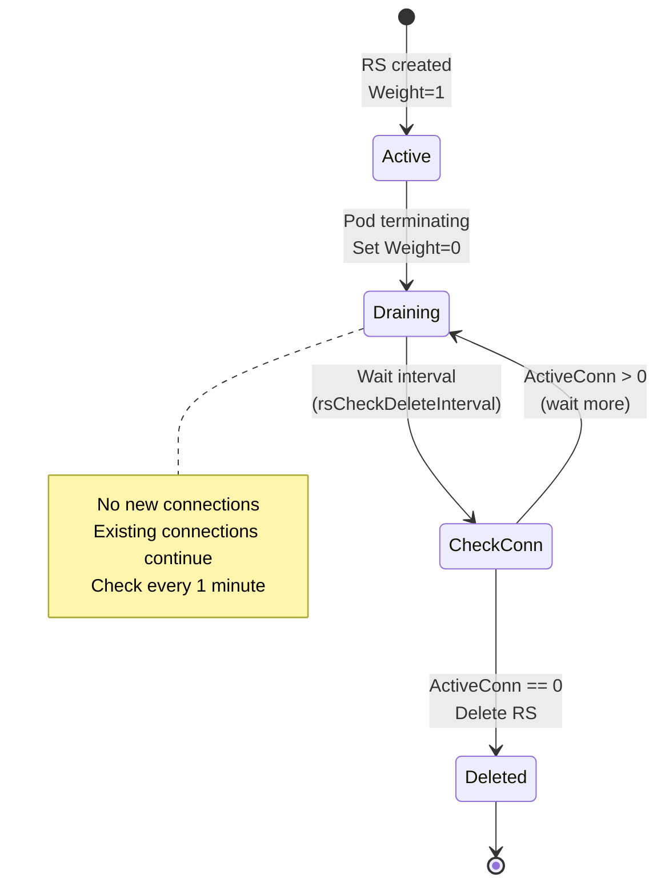
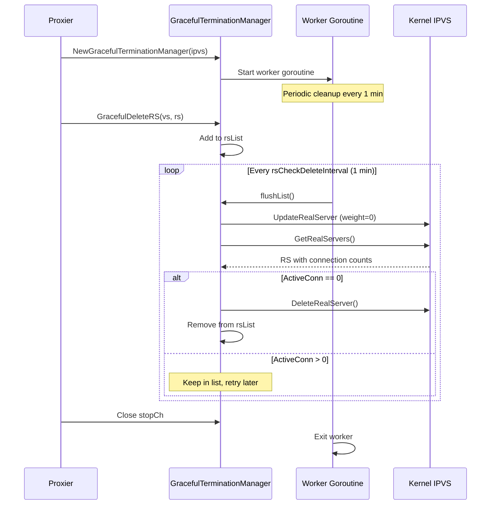
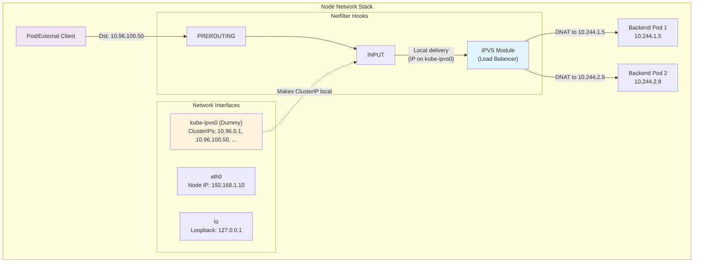
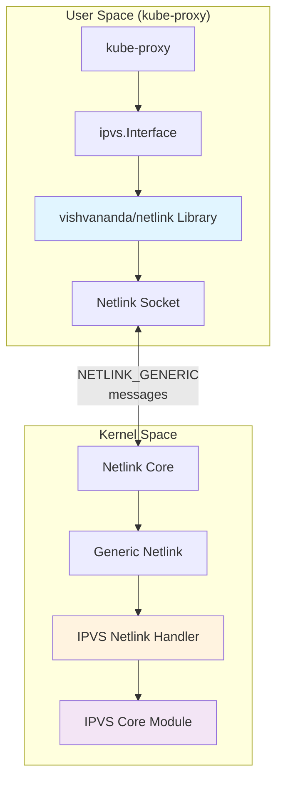
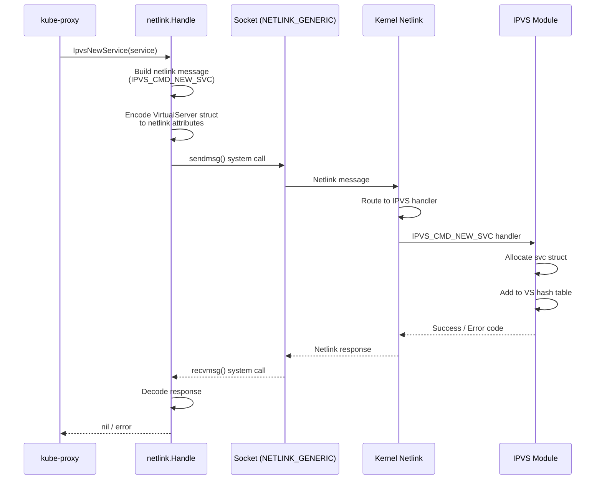
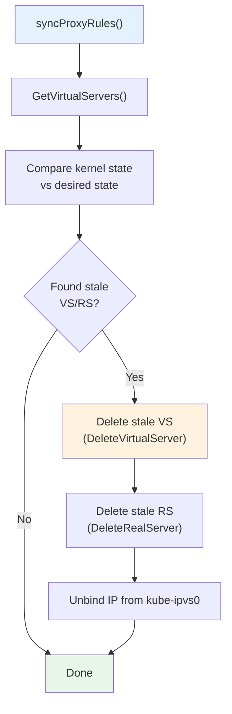

# **Low-Level: IPVS Configuration and Management**

━━━━━━━━━━━━━━━━━━━━━━━━━━━━━━━━━━━━━━━━━━━━━━━━━━━━━━━━━━━━━━━━━━━━━━━━━━━━━━

## **📋 Overview**

This document provides a comprehensive deep dive into IPVS (IP Virtual Server) configuration and management within kube-proxy. It covers the low-level implementation details of how virtual servers and real servers are created, configured, and managed through the Linux kernel's IPVS netlink interface.

### **What This Document Covers**

- **IPVS Interface Architecture**: The abstraction layer between kube-proxy and kernel IPVS
- **Virtual Server Management**: Creation, update, and deletion of IPVS virtual servers
- **Real Server Management**: Addition, weight assignment, and removal of backend endpoints
- **Scheduler Configuration**: Selection and parameters for IPVS load balancing algorithms
- **Dummy Interface Management**: The kube-ipvs0 interface for IP address binding
- **Netlink Communication**: Low-level kernel communication via netlink sockets
- **Graceful Termination**: Weight-based draining for connection preservation
- **Error Handling**: Recovery strategies and failure scenarios
- **Performance Optimization**: Batching, caching, and kernel interaction patterns

### **Target Audience**

- **Advanced Contributors**: Understanding IPVS implementation details
- **Performance Engineers**: Optimizing IPVS configuration and tuning
- **Troubleshooters**: Debugging IPVS kernel interactions
- **System Architects**: Designing high-performance service mesh solutions

### **Prerequisites**

Before reading this document, you should be familiar with:
- IPVS concepts (virtual servers, real servers, schedulers) - see `middle-level/03-ipvs-mode.md`
- Kubernetes Service abstraction - see `high-level/03-service-abstraction.md`
- kube-proxy initialization flow - see `high-level/04-initialization-flow.md`
- Netfilter and Linux networking - see `GLOSSARY.md`

━━━━━━━━━━━━━━━━━━━━━━━━━━━━━━━━━━━━━━━━━━━━━━━━━━━━━━━━━━━━━━━━━━━━━━━━━━━━━━

## **🏗️ IPVS Interface Architecture**

### **Interface Abstraction Layer**

kube-proxy uses an **Interface** abstraction to interact with the Linux kernel's IPVS subsystem. This provides a clean separation between business logic and kernel interaction.

#### **Interface Definition**

```go
// pkg/proxy/ipvs/util/ipvs.go:29-53
type Interface interface {
    // Flush clears all virtual servers in system
    Flush() error

    // Virtual Server Operations
    AddVirtualServer(*VirtualServer) error
    UpdateVirtualServer(*VirtualServer) error
    DeleteVirtualServer(*VirtualServer) error
    GetVirtualServer(*VirtualServer) (*VirtualServer, error)
    GetVirtualServers() ([]*VirtualServer, error)

    // Real Server Operations
    AddRealServer(*VirtualServer, *RealServer) error
    GetRealServers(*VirtualServer) ([]*RealServer, error)
    DeleteRealServer(*VirtualServer, *RealServer) error
    UpdateRealServer(*VirtualServer, *RealServer) error

    // Timeout Configuration
    ConfigureTimeouts(time.Duration, time.Duration, time.Duration) error
}
```

**Key Code Locations**:
- Interface definition: `pkg/proxy/ipvs/util/ipvs.go:29-53`
- Linux implementation: `pkg/proxy/ipvs/util/ipvs_linux.go`
- Fake implementation (testing): `pkg/proxy/ipvs/util/testing/fake.go`

#### **Architecture Diagram**



#### **Implementation Types**

**1. Production Implementation (Linux)**

The production implementation uses the **vishvananda/netlink** library to communicate with the kernel:

```go
// pkg/proxy/ipvs/util/ipvs_linux.go:30-42
type runner struct {
    ipvsHandle *ipvsHandle
    mu         sync.Mutex // Protects concurrent netlink operations
}

type ipvsHandle struct {
    handle *netlink.Handle
}
```

**Key Features**:
- Thread-safe with mutex protection
- Netlink socket communication
- Direct kernel interaction
- Production-grade error handling

**Code Reference**: `pkg/proxy/ipvs/util/ipvs_linux.go:30-42`

**2. Fake Implementation (Testing)**

For unit tests, a fake in-memory implementation simulates IPVS behavior:

```go
// pkg/proxy/ipvs/util/testing/fake.go:40-60
type FakeIPVS struct {
    VirtualServers []*utilipvs.VirtualServer
    RealServers    map[string][]*utilipvs.RealServer
    mu             sync.Mutex
}
```

**Key Features**:
- No kernel dependencies
- In-memory state
- Predictable behavior for tests
- Fast execution

**Code Reference**: `pkg/proxy/ipvs/util/testing/fake.go:40-60`

━━━━━━━━━━━━━━━━━━━━━━━━━━━━━━━━━━━━━━━━━━━━━━━━━━━━━━━━━━━━━━━━━━━━━━━━━━━━━━

## **🖥️ Virtual Server Management**

### **VirtualServer Structure**

A **VirtualServer** represents a service endpoint in IPVS:

```go
// pkg/proxy/ipvs/util/ipvs.go:55-63
type VirtualServer struct {
    Address   net.IP        // Virtual IP (ClusterIP, NodePort IP, etc.)
    Protocol  string        // "TCP", "UDP", "SCTP"
    Port      uint16        // Virtual port
    Scheduler string        // "rr", "lc", "wrr", etc.
    Flags     ServiceFlags  // FlagPersistent, FlagHashed, FlagSourceHash
    Timeout   uint32        // Session persistence timeout (seconds)
}
```

**Code Reference**: `pkg/proxy/ipvs/util/ipvs.go:55-63`

#### **ServiceFlags Constants**

```go
// pkg/proxy/ipvs/util/ipvs.go:65-75
const (
    FlagPersistent = 0x1   // Enable session persistence (ClientIP affinity)
    FlagHashed     = 0x2   // Use hashed entry table
    FlagSourceHash = 0x10  // Enable source hashing for persistence
)
```

**Flag Usage**:
- **FlagPersistent**: Set when Service has `sessionAffinity: ClientIP`
- **FlagHashed**: Internal IPVS optimization flag
- **FlagSourceHash**: Used with `sh` (source hash) scheduler

**Code Reference**: `pkg/proxy/ipvs/util/ipvs.go:68-75`

### **Creating a Virtual Server**

#### **AddVirtualServer Operation**

**Function Flow**:



**Code Implementation**:

```go
// pkg/proxy/ipvs/util/ipvs_linux.go:57-66
func (runner *runner) AddVirtualServer(vs *VirtualServer) error {
    runner.mu.Lock()
    defer runner.mu.Unlock()

    svc, err := toIPVSService(vs)
    if err != nil {
        return fmt.Errorf("failed to convert VirtualServer: %v", err)
    }

    return runner.ipvsHandle.handle.IpvsNewService(svc)
}
```

**Key Steps**:
1. **Lock Acquisition**: Thread-safe operation with mutex
2. **Structure Conversion**: Convert kube-proxy VirtualServer → netlink Service
3. **Netlink Call**: `IpvsNewService()` sends NETLINK message
4. **Kernel Operation**: IPVS module creates VS entry
5. **Error Handling**: Return any errors to caller

**Code Reference**: `pkg/proxy/ipvs/util/ipvs_linux.go:57-66`

#### **Proxier Integration**

The Proxier calls AddVirtualServer during service synchronization:

```go
// pkg/proxy/ipvs/proxier.go:1745-1765
func (proxier *Proxier) syncService(svcName string, vs *utilipvs.VirtualServer,
                                     bindAddr bool, alreadyBoundAddrs sets.Set[string]) error {

    appliedVirtualServer, err := proxier.ipvs.GetVirtualServer(vs)
    if err != nil || appliedVirtualServer == nil {
        // Virtual server doesn't exist, create it
        if err := proxier.ipvs.AddVirtualServer(vs); err != nil {
            proxier.logger.Error(err, "Failed to add IPVS service",
                                "service", svcName, "virtualServer", vs)
            return err
        }
        proxier.logger.V(3).Info("Successfully added IPVS service",
                                 "service", svcName)
    } else if !appliedVirtualServer.Equal(vs) {
        // Virtual server exists but config changed, update it
        if err := proxier.ipvs.UpdateVirtualServer(vs); err != nil {
            proxier.logger.Error(err, "Failed to update IPVS service",
                                "service", svcName)
            return err
        }
        proxier.logger.V(3).Info("Successfully updated IPVS service",
                                 "service", svcName)
    }

    return nil
}
```

**Synchronization Logic**:
1. **Query Current State**: Call `GetVirtualServer()` to check existence
2. **Create if Missing**: Call `AddVirtualServer()` for new services
3. **Update if Changed**: Call `UpdateVirtualServer()` if config differs
4. **Skip if Unchanged**: No operation if VS matches desired state

**Code Reference**: `pkg/proxy/ipvs/proxier.go:1745-1765`

### **Updating a Virtual Server**

#### **UpdateVirtualServer Operation**

**Use Cases for Updates**:
- Scheduler algorithm changed (e.g., `rr` → `lc`)
- Session affinity added or removed
- Timeout value changed
- Flags modified

**Code Implementation**:

```go
// pkg/proxy/ipvs/util/ipvs_linux.go:68-77
func (runner *runner) UpdateVirtualServer(vs *VirtualServer) error {
    runner.mu.Lock()
    defer runner.mu.Unlock()

    svc, err := toIPVSService(vs)
    if err != nil {
        return fmt.Errorf("failed to convert VirtualServer: %v", err)
    }

    return runner.ipvsHandle.handle.IpvsUpdateService(svc)
}
```

**IMPORTANT**: `UpdateVirtualServer` does **NOT** modify the Address, Protocol, or Port. These identify the VS and cannot change. To change them, delete and recreate the VS.

**Code Reference**: `pkg/proxy/ipvs/util/ipvs_linux.go:68-77`

#### **Virtual Server Equality Check**

Before updating, kube-proxy checks if the update is necessary:

```go
// pkg/proxy/ipvs/util/ipvs.go:78-86
func (svc *VirtualServer) Equal(other *VirtualServer) bool {
    return svc.Address.Equal(other.Address) &&
           svc.Protocol == other.Protocol &&
           svc.Port == other.Port &&
           svc.Scheduler == other.Scheduler &&
           svc.Flags == other.Flags &&
           svc.Timeout == other.Timeout
}
```

**Optimization**: Skip update if VS is already in desired state, reducing kernel operations.

**Code Reference**: `pkg/proxy/ipvs/util/ipvs.go:78-86`

### **Deleting a Virtual Server**

#### **DeleteVirtualServer Operation**

**When VS Deletion Occurs**:
- Service deleted from Kubernetes
- Service changed to Headless (ClusterIP: None)
- Service changed to ExternalName type
- Endpoint slice becomes empty (optional behavior)

**Code Implementation**:

```go
// pkg/proxy/ipvs/util/ipvs_linux.go:79-88
func (runner *runner) DeleteVirtualServer(vs *VirtualServer) error {
    runner.mu.Lock()
    defer runner.mu.Unlock()

    svc, err := toIPVSService(vs)
    if err != nil {
        return fmt.Errorf("failed to convert VirtualServer: %v", err)
    }

    return runner.ipvsHandle.handle.IpvsDelService(svc)
}
```

**Code Reference**: `pkg/proxy/ipvs/util/ipvs_linux.go:79-88`

#### **Cleanup Workflow**



**Cleanup Code Location**:

```go
// pkg/proxy/ipvs/proxier.go:1935-1950
// In syncProxyRules(), cleanup stale services
for _, svc := range staleServices.UnsortedList() {
    if err := proxier.ipvs.DeleteVirtualServer(svc); err != nil {
        proxier.logger.Error(err, "Failed to delete stale IPVS service",
                            "virtualServer", svc)
    } else {
        proxier.logger.V(2).Info("Deleted stale IPVS service",
                                "virtualServer", svc)
    }
}
```

**Code Reference**: `pkg/proxy/ipvs/proxier.go:1935-1950`

### **Querying Virtual Servers**

#### **GetVirtualServer**

Retrieve a specific VS by its triplet (IP, Protocol, Port):

```go
// pkg/proxy/ipvs/util/ipvs_linux.go:90-101
func (runner *runner) GetVirtualServer(vs *VirtualServer) (*VirtualServer, error) {
    runner.mu.Lock()
    defer runner.mu.Unlock()

    svc, err := toIPVSService(vs)
    if err != nil {
        return nil, err
    }

    ipvsSvc, err := runner.ipvsHandle.handle.IpvsGetService(svc)
    if err != nil {
        return nil, err
    }

    return toVirtualServer(ipvsSvc)
}
```

**Usage**: Check if VS exists before create/update decisions.

**Code Reference**: `pkg/proxy/ipvs/util/ipvs_linux.go:90-101`

#### **GetVirtualServers**

List all VS entries in the system:

```go
// pkg/proxy/ipvs/util/ipvs_linux.go:103-120
func (runner *runner) GetVirtualServers() ([]*VirtualServer, error) {
    runner.mu.Lock()
    defer runner.mu.Unlock()

    ipvsSvcs, err := runner.ipvsHandle.handle.IpvsGetServices()
    if err != nil {
        return nil, err
    }

    vss := make([]*VirtualServer, 0)
    for _, ipvsSvc := range ipvsSvcs {
        vs, err := toVirtualServer(ipvsSvc)
        if err != nil {
            // Log error but continue processing
            continue
        }
        vss = append(vss, vs)
    }

    return vss, nil
}
```

**Usage**:
- Cleanup detection (find stale VS not in desired state)
- Debugging and introspection
- Metrics collection

**Code Reference**: `pkg/proxy/ipvs/util/ipvs_linux.go:103-120`

━━━━━━━━━━━━━━━━━━━━━━━━━━━━━━━━━━━━━━━━━━━━━━━━━━━━━━━━━━━━━━━━━━━━━━━━━━━━━━

## **🎯 Real Server Management**

### **RealServer Structure**

A **RealServer** represents a backend endpoint (pod) in IPVS:

```go
// pkg/proxy/ipvs/util/ipvs.go:92-99
type RealServer struct {
    Address      net.IP  // Backend pod IP
    Port         uint16  // Backend pod port
    Weight       int     // Load balancing weight (0-100)
    ActiveConn   int     // Number of active connections (read-only)
    InactiveConn int     // Number of inactive connections (read-only)
}
```

**Key Fields**:
- **Address/Port**: Backend endpoint coordinates
- **Weight**: Controls traffic distribution (0 = drain, 100 = full)
- **ActiveConn**: Current established connections (kernel populated)
- **InactiveConn**: Connections in TIME_WAIT, etc. (kernel populated)

**Code Reference**: `pkg/proxy/ipvs/util/ipvs.go:92-99`

### **Adding a Real Server**

#### **AddRealServer Operation**

**Function Flow**:



**Code Implementation**:

```go
// pkg/proxy/ipvs/util/ipvs_linux.go:136-149
func (runner *runner) AddRealServer(vs *VirtualServer, rs *RealServer) error {
    runner.mu.Lock()
    defer runner.mu.Unlock()

    svc, err := toIPVSService(vs)
    if err != nil {
        return err
    }

    dst, err := toIPVSDestination(rs)
    if err != nil {
        return err
    }

    return runner.ipvsHandle.handle.IpvsNewDest(svc, dst)
}
```

**Steps**:
1. Convert VirtualServer to netlink service
2. Convert RealServer to netlink destination
3. Send NETLINK message to kernel
4. Kernel adds RS to VS's destination list

**Code Reference**: `pkg/proxy/ipvs/util/ipvs_linux.go:136-149`

#### **Endpoint Synchronization**

The Proxier's `syncEndpoint` function manages RS lifecycle:

```go
// pkg/proxy/ipvs/proxier.go:1785-1920
func (proxier *Proxier) syncEndpoint(svcPortName proxy.ServicePortName,
                                      onlyNodeLocalEndpoints bool,
                                      vs *utilipvs.VirtualServer) error {

    // Get current real servers from kernel
    curDests, err := proxier.ipvs.GetRealServers(vs)
    if err != nil {
        proxier.logger.Error(err, "Failed to list IPVS destinations",
                            "virtualServer", vs)
        return err
    }

    // Build map of current destinations
    curDestMap := make(map[string]*utilipvs.RealServer)
    for _, dest := range curDests {
        curDestMap[dest.String()] = dest
    }

    // Get desired endpoints from EndpointsMap
    endpoints := proxier.endpointsMap[svcPortName]

    // Process desired endpoints
    for _, endpoint := range endpoints {
        newDest := &utilipvs.RealServer{
            Address: endpoint.IP(),
            Port:    uint16(endpoint.Port()),
            Weight:  1, // Default weight
        }

        destStr := newDest.String()
        if existingDest, ok := curDestMap[destStr]; ok {
            // RS exists, check if update needed
            if existingDest.Weight != newDest.Weight {
                err = proxier.ipvs.UpdateRealServer(vs, newDest)
                if err != nil {
                    proxier.logger.Error(err, "Failed to update destination",
                                        "realServer", newDest)
                }
            }
            // Remove from map (marking as "seen")
            delete(curDestMap, destStr)
        } else {
            // RS doesn't exist, add it
            err = proxier.ipvs.AddRealServer(vs, newDest)
            if err != nil {
                proxier.logger.Error(err, "Failed to add destination",
                                    "realServer", newDest)
            }
        }
    }

    // Remaining items in curDestMap are stale, delete them
    for _, staleRS := range curDestMap {
        // Use graceful termination for TCP/SCTP
        if utilipvs.IsRsGracefulTerminationNeeded(vs.Protocol) {
            proxier.gracefuldeleteManager.GracefulDeleteRS(vs, staleRS)
        } else {
            // UDP: immediate deletion
            err = proxier.ipvs.DeleteRealServer(vs, staleRS)
            if err != nil {
                proxier.logger.Error(err, "Failed to delete stale destination",
                                    "realServer", staleRS)
            }
        }
    }

    return nil
}
```

**Synchronization Algorithm**:
1. **Query Current**: Get all RS for this VS from kernel
2. **Build Map**: Index current RS by "IP:Port" string
3. **Process Desired**: For each desired endpoint:
   - **Update** if RS exists but weight changed
   - **Add** if RS doesn't exist
   - **Mark seen** by removing from map
4. **Cleanup Stale**: Remaining RS in map are no longer needed:
   - **Graceful** deletion for TCP/SCTP (weight → 0 → delete)
   - **Immediate** deletion for UDP

**Code Reference**: `pkg/proxy/ipvs/proxier.go:1785-1920`

### **Updating a Real Server**

#### **UpdateRealServer Operation**

**Use Case**: Change RS weight (typically for traffic draining or weighted load balancing)

**Code Implementation**:

```go
// pkg/proxy/ipvs/util/ipvs_linux.go:166-179
func (runner *runner) UpdateRealServer(vs *VirtualServer, rs *RealServer) error {
    runner.mu.Lock()
    defer runner.mu.Unlock()

    svc, err := toIPVSService(vs)
    if err != nil {
        return err
    }

    dst, err := toIPVSDestination(rs)
    if err != nil {
        return err
    }

    return runner.ipvsHandle.handle.IpvsUpdateDest(svc, dst)
}
```

**What Can Be Updated**:
- **Weight**: Primary use case (0-100)
- **Connection Limits**: Advanced IPVS features (rarely used by kube-proxy)

**What Cannot Be Updated**:
- **Address**: RS identity, must delete and re-add
- **Port**: RS identity, must delete and re-add

**Code Reference**: `pkg/proxy/ipvs/util/ipvs_linux.go:166-179`

#### **Weight Assignment Strategy**

kube-proxy currently uses **uniform weighting** (all endpoints get weight = 1):

```go
// pkg/proxy/ipvs/proxier.go:1890
newDest := &utilipvs.RealServer{
    Address: endpoint.IP(),
    Port:    uint16(endpoint.Port()),
    Weight:  1,  // All endpoints have equal weight
}
```

**Future Enhancement**: Could implement weighted endpoints based on:
- Pod resource requests/limits
- Node capacity
- Custom annotations
- Topology (prefer local zone)

**Code Reference**: `pkg/proxy/ipvs/proxier.go:1890`

### **Deleting a Real Server**

#### **DeleteRealServer Operation**

**Code Implementation**:

```go
// pkg/proxy/ipvs/util/ipvs_linux.go:151-164
func (runner *runner) DeleteRealServer(vs *VirtualServer, rs *RealServer) error {
    runner.mu.Lock()
    defer runner.mu.Unlock()

    svc, err := toIPVSService(vs)
    if err != nil {
        return err
    }

    dst, err := toIPVSDestination(rs)
    if err != nil {
        return err
    }

    return runner.ipvsHandle.handle.IpvsDelDest(svc, dst)
}
```

**Immediate vs Graceful Deletion**:
- **Immediate** (UDP/SCTP): Call `DeleteRealServer()` directly
- **Graceful** (TCP): Use `GracefulTerminationManager` (see next section)

**Code Reference**: `pkg/proxy/ipvs/util/ipvs_linux.go:151-164`

### **Querying Real Servers**

#### **GetRealServers**

Retrieve all RS for a given VS:

```go
// pkg/proxy/ipvs/util/ipvs_linux.go:122-135
func (runner *runner) GetRealServers(vs *VirtualServer) ([]*RealServer, error) {
    runner.mu.Lock()
    defer runner.mu.Unlock()

    svc, err := toIPVSService(vs)
    if err != nil {
        return nil, err
    }

    dsts, err := runner.ipvsHandle.handle.IpvsGetDestinations(svc)
    if err != nil {
        return nil, err
    }

    rss := make([]*RealServer, 0, len(dsts))
    for _, dst := range dsts {
        rs, err := toRealServer(dst)
        if err != nil {
            continue
        }
        rss = append(rss, rs)
    }

    return rss, nil
}
```

**Returns**:
- **Address/Port**: Backend coordinates
- **Weight**: Current weight
- **ActiveConn**: Current active connections
- **InactiveConn**: Current inactive connections

**Usage**:
- Endpoint synchronization (current state query)
- Monitoring and metrics
- Debugging

**Code Reference**: `pkg/proxy/ipvs/util/ipvs_linux.go:122-135`

━━━━━━━━━━━━━━━━━━━━━━━━━━━━━━━━━━━━━━━━━━━━━━━━━━━━━━━━━━━━━━━━━━━━━━━━━━━━━━

## **🔄 Graceful Termination**

### **Why Graceful Termination?**

When a pod is deleted or becomes unhealthy, immediately removing its RS from IPVS would **break existing TCP connections**:

```
Client ----[Established TCP Connection]----> Pod (being terminated)
                                              ↓
                                         RS removed
                                              ↓
                                    [Connection Broken!]
```

**Solution**: **Graceful Termination** with weight-based draining.

### **Graceful Termination Algorithm**

#### **Phase 1: Weight Reduction**

Set RS weight to 0 (stop new connections, preserve existing):



#### **Phase 2: Connection Monitoring**

Periodically check active connection count:

```go
// pkg/proxy/ipvs/graceful_termination.go:140-170
func (m *GracefulTerminationManager) tryDeleteRs(rsToDelete *listItem) (bool, error) {
    // Set weight to 0 (drain mode)
    rs := &utilipvs.RealServer{
        Address: rsToDelete.RealServer.Address,
        Port:    rsToDelete.RealServer.Port,
        Weight:  0,  // Stop new connections
    }

    err := m.ipvs.UpdateRealServer(rsToDelete.VirtualServer, rs)
    if err != nil {
        return false, err
    }

    // Query current connection count
    rss, err := m.ipvs.GetRealServers(rsToDelete.VirtualServer)
    if err != nil {
        return false, err
    }

    // Find our RS in the list
    for _, item := range rss {
        if item.Equal(rsToDelete.RealServer) {
            if item.ActiveConn == 0 && item.InactiveConn == 0 {
                // No connections, safe to delete
                err := m.ipvs.DeleteRealServer(rsToDelete.VirtualServer,
                                               rsToDelete.RealServer)
                return true, err
            }
            // Still has connections, keep waiting
            return false, nil
        }
    }

    // RS not found (might have been deleted externally)
    return true, nil
}
```

**Algorithm Steps**:
1. **Set Weight=0**: Update RS to stop new connections
2. **Query Connections**: Get ActiveConn and InactiveConn counts
3. **Decision**:
   - If **ActiveConn == 0 && InactiveConn == 0**: Delete RS
   - If **connections > 0**: Wait and retry later
4. **Retry**: Check again after `rsCheckDeleteInterval` (1 minute)

**Code Reference**: `pkg/proxy/ipvs/graceful_termination.go:140-170`

### **GracefulTerminationManager**

#### **Manager Structure**

```go
// pkg/proxy/ipvs/graceful_termination.go:115-125
type GracefulTerminationManager struct {
    ipvs    utilipvs.Interface
    rsList  graceTerminateRSList

    // Background worker
    stopCh chan struct{}
}

type graceTerminateRSList struct {
    lock sync.Mutex
    list map[string]*listItem  // Key: "VS/RS" unique name
}
```

**Components**:
- **ipvs**: Interface for kernel operations
- **rsList**: Thread-safe list of RS pending deletion
- **stopCh**: Channel for shutdown signaling

**Code Reference**: `pkg/proxy/ipvs/graceful_termination.go:115-125`

#### **Manager Lifecycle**



#### **Worker Goroutine**

```go
// pkg/proxy/ipvs/graceful_termination.go:130-138
func (m *GracefulTerminationManager) run() {
    ticker := time.NewTicker(rsCheckDeleteInterval)
    defer ticker.Stop()

    for {
        select {
        case <-ticker.C:
            // Periodic cleanup attempt
            m.rsList.flushList(m.tryDeleteRs)
        case <-m.stopCh:
            // Shutdown signal
            return
        }
    }
}
```

**Worker Behavior**:
- **Ticker**: Fires every 1 minute (`rsCheckDeleteInterval`)
- **Flush List**: Attempt to delete all RS in list
- **Shutdown**: Exit when stopCh closed

**Code Reference**: `pkg/proxy/ipvs/graceful_termination.go:130-138`

#### **Public API**

**GracefulDeleteRS**: Add RS to deletion queue

```go
// pkg/proxy/ipvs/graceful_termination.go:180-195
func (m *GracefulTerminationManager) GracefulDeleteRS(vs *utilipvs.VirtualServer,
                                                       rs *utilipvs.RealServer) error {
    item := &listItem{
        VirtualServer: vs,
        RealServer:    rs,
    }

    added := m.rsList.add(item)
    if !added {
        // Already in queue
        return nil
    }

    // Try immediate deletion (might succeed if no connections)
    deleted, err := m.tryDeleteRs(item)
    if deleted {
        m.rsList.remove(item)
    }

    return err
}
```

**Flow**:
1. Create `listItem` with VS and RS
2. Add to queue (thread-safe)
3. **Immediate attempt**: Try deletion right away
4. If unsuccessful, worker will retry periodically

**Code Reference**: `pkg/proxy/ipvs/graceful_termination.go:180-195`

### **Protocol-Specific Behavior**

#### **TCP and SCTP** → Graceful Termination

```go
// pkg/proxy/ipvs/util/ipvs.go:112-115
func IsRsGracefulTerminationNeeded(proto string) bool {
    return !strings.EqualFold(proto, "UDP") &&
           !strings.EqualFold(proto, "SCTP")
}
```

**Rationale**:
- **TCP**: Stateful, connection-oriented → preserve existing connections
- **SCTP**: Stateful, connection-oriented → preserve existing connections

**Code Reference**: `pkg/proxy/ipvs/util/ipvs.go:112-115`

#### **UDP** → Immediate Deletion

```go
// pkg/proxy/ipvs/proxier.go:1910-1920
if utilipvs.IsRsGracefulTerminationNeeded(vs.Protocol) {
    // TCP/SCTP: graceful
    proxier.gracefuldeleteManager.GracefulDeleteRS(vs, staleRS)
} else {
    // UDP: immediate
    err = proxier.ipvs.DeleteRealServer(vs, staleRS)
    if err != nil {
        proxier.logger.Error(err, "Failed to delete stale destination")
    }
}
```

**Rationale**:
- **UDP**: Stateless, connectionless → safe to delete immediately
- No connection state to preserve

**Code Reference**: `pkg/proxy/ipvs/proxier.go:1910-1920`

### **Graceful Termination Timeline**

```mermaid
gantt
    title TCP Real Server Graceful Termination
    dateFormat X
    axisFormat %M:%S

    section Pod Lifecycle
    Pod Terminating Signal Received  :milestone, 0, 0s
    Pod Still Running (Termination Grace Period) :active, 0, 60s
    Pod Killed :milestone, 60s, 60s

    section IPVS Operations
    Set RS Weight=0 (No New Connections) :crit, 0, 1s
    Existing Connections Continue :active, 1s, 59s
    Check ActiveConn (t=1min) :milestone, 60s, 60s
    Check ActiveConn (t=2min) :milestone, 120s, 120s
    Check ActiveConn (t=3min) :milestone, 180s, 180s
    Delete RS (When ActiveConn==0) :crit, 180s, 181s

    section Connection State
    Existing TCP Connections Active :active, 0, 120s
    Connections Closing :done, 120s, 180s
    All Connections Closed :milestone, 180s, 180s
```

**Timeline Explanation**:
- **t=0s**: Pod receives SIGTERM, RS weight set to 0
- **t=0s-60s**: Existing connections continue, pod shutting down
- **t=60s**: First connection check (likely still active)
- **t=120s**: Second connection check (connections closing)
- **t=180s**: Third connection check (all closed), RS deleted

━━━━━━━━━━━━━━━━━━━━━━━━━━━━━━━━━━━━━━━━━━━━━━━━━━━━━━━━━━━━━━━━━━━━━━━━━━━━━━

## **📅 Scheduler Configuration**

### **Scheduler Selection**

IPVS supports 11 scheduling algorithms (see `middle-level/03-ipvs-mode.md` for detailed algorithm descriptions).

#### **Default Scheduler**

```go
// pkg/proxy/ipvs/proxier.go:94-95
const (
    defaultScheduler = "rr"  // Round Robin
)
```

**Code Reference**: `pkg/proxy/ipvs/proxier.go:94-95`

#### **Scheduler Configuration**

Scheduler is set during Proxier creation:

```go
// pkg/proxy/ipvs/proxier.go:352-355
if len(scheduler) == 0 {
    logger.Info("IPVS scheduler not specified, use rr by default")
    scheduler = defaultScheduler
}

// ...later in Proxier struct initialization
proxier := &Proxier{
    // ...
    ipvsScheduler: scheduler,  // Line 384
    // ...
}
```

**Configuration Source**:
- **Flag**: `--ipvs-scheduler=<algorithm>` (kube-proxy command line)
- **Default**: `"rr"` (round robin) if not specified

**Code Reference**: `pkg/proxy/ipvs/proxier.go:352-355, 384`

### **Scheduler in Virtual Server Creation**

#### **Applying Scheduler to VS**

```go
// pkg/proxy/ipvs/proxier.go:588-595
func (proxier *Proxier) buildVirtualServer(svcName string, svcInfo *servicePortInfo) *utilipvs.VirtualServer {
    scheduler := svcInfo.Scheduler()
    if scheduler == "" {
        scheduler = defaultScheduler
    }

    return &utilipvs.VirtualServer{
        Address:   svcInfo.ClusterIP(),
        Protocol:  string(svcInfo.Protocol()),
        Port:      uint16(svcInfo.Port()),
        Scheduler: scheduler,  // Applied here
        Flags:     buildFlags(svcInfo),
        Timeout:   buildTimeout(svcInfo),
    }
}
```

**Scheduler Hierarchy**:
1. **Service Annotation** (future): `service.kubernetes.io/ipvs-scheduler`
2. **Proxier Default**: `ipvsScheduler` field (from flag)
3. **Global Default**: `"rr"`

**Code Reference**: `pkg/proxy/ipvs/proxier.go:588-595`

### **Supported Schedulers**

| Algorithm | Name | kube-proxy Value | Description |
|-----------|------|------------------|-------------|
| Round Robin | `rr` | `--ipvs-scheduler=rr` | Even distribution, stateless |
| Least Connection | `lc` | `--ipvs-scheduler=lc` | Send to backend with fewest connections |
| Weighted Round Robin | `wrr` | `--ipvs-scheduler=wrr` | RR with weight consideration |
| Weighted Least Connection | `wlc` | `--ipvs-scheduler=wlc` | LC with weight consideration |
| Source Hashing | `sh` | `--ipvs-scheduler=sh` | Hash source IP (consistent routing) |
| Destination Hashing | `dh` | `--ipvs-scheduler=dh` | Hash dest IP (used for caching) |
| Locality-Based LC | `lblc` | `--ipvs-scheduler=lblc` | LC with locality awareness |
| Locality-Based LC+R | `lblcr` | `--ipvs-scheduler=lblcr` | LBLC with replication |
| Shortest Expected Delay | `sed` | `--ipvs-scheduler=sed` | (ActiveConn+1)/Weight |
| Never Queue | `nq` | `--ipvs-scheduler=nq` | Distribute evenly if no conn |
| Overflow | `ovf` | `--ipvs-scheduler=ovf` | Send to first server until full |

**Selection Guidance**:
- **General purpose**: `rr` (default, simple, effective)
- **Long-lived connections**: `lc` (better distribution)
- **Session affinity needed**: `sh` (source hash, alternative to persistence)
- **Weighted backends**: `wrr` or `wlc`

### **Changing Scheduler**

#### **At Runtime**

Changing the scheduler requires **updating the VirtualServer**:

```bash
# Change kube-proxy scheduler flag
kubectl edit daemonset kube-proxy -n kube-system
# Set: --ipvs-scheduler=lc

# kube-proxy will restart
# On next syncProxyRules(), UpdateVirtualServer() called for all services
```

**Process**:
1. Update kube-proxy configuration
2. kube-proxy restarts (DaemonSet rollout)
3. On startup, `syncProxyRules()` runs (full sync)
4. For each VS, checks if scheduler differs
5. Calls `UpdateVirtualServer()` to change scheduler

#### **Per-Service Scheduler** (Future Enhancement)

**Not currently implemented**, but could be added via service annotation:

```yaml
apiVersion: v1
kind: Service
metadata:
  name: my-service
  annotations:
    service.kubernetes.io/ipvs-scheduler: "lc"  # Override default
spec:
  clusterIP: 10.96.100.50
  # ...
```

**Implementation would require**:
- Parse annotation in `newServiceInfo()`
- Store scheduler in `servicePortInfo` struct
- Use per-service scheduler in `buildVirtualServer()`

━━━━━━━━━━━━━━━━━━━━━━━━━━━━━━━━━━━━━━━━━━━━━━━━━━━━━━━━━━━━━━━━━━━━━━━━━━━━━━

## **🔌 Dummy Interface Management (kube-ipvs0)**

### **Why kube-ipvs0 Exists**

IPVS requires the **virtual IP to be bound to a local interface** for packet routing:

```
Problem Without Dummy Interface:
1. Client sends packet to ClusterIP (10.96.100.50)
2. Kernel routing: "10.96.100.50 not on local system, send to default gateway"
3. Packet leaves node → IPVS never processes it

Solution With kube-ipvs0:
1. Bind 10.96.100.50 to kube-ipvs0 dummy interface
2. Kernel routing: "10.96.100.50 is local"
3. Packet reaches IPVS netfilter hooks
4. IPVS performs load balancing
```

#### **Dummy Interface Diagram**



### **Dummy Interface Configuration**

#### **Device Name**

```go
// pkg/proxy/ipvs/proxier.go:96
const defaultDummyDevice = "kube-ipvs0"
```

**Code Reference**: `pkg/proxy/ipvs/proxier.go:96`

#### **Interface Properties**

**Created during kube-proxy initialization**:

```bash
# ip link show kube-ipvs0
5: kube-ipvs0: <BROADCAST,NOARP,UP,LOWER_UP> mtu 1500 qdisc noqueue state UNKNOWN mode DEFAULT group default
    link/ether 1a:ce:c8:2e:3f:a6 brd ff:ff:ff:ff:ff:ff
```

**Key Properties**:
- **Type**: Dummy (virtual interface)
- **State**: UP (always active)
- **NOARP**: No ARP requests sent for bound IPs
- **MTU**: Matches other interfaces (typically 1500)

**Why NOARP?**
- ClusterIPs are virtual (not real network endpoints)
- Don't want ARP announcements for ClusterIPs
- Traffic handled by IPVS, not traditional routing

### **IP Address Binding**

#### **Binding ClusterIPs**

For each Service ClusterIP, kube-proxy binds it to kube-ipvs0:

```bash
# Example: Service with ClusterIP 10.96.100.50

# Before binding
ip addr show kube-ipvs0
# 5: kube-ipvs0: <BROADCAST,NOARP,UP,LOWER_UP>
#     link/ether 1a:ce:c8:2e:3f:a6 brd ff:ff:ff:ff:ff:ff

# After binding
ip addr show kube-ipvs0
# 5: kube-ipvs0: <BROADCAST,NOARP,UP,LOWER_UP>
#     link/ether 1a:ce:c8:2e:3f:a6 brd ff:ff:ff:ff:ff:ff
#     inet 10.96.100.50/32 scope global kube-ipvs0
#        valid_lft forever preferred_lft forever
```

#### **Multiple IPs on kube-ipvs0**

For a cluster with many services:

```bash
ip addr show kube-ipvs0
5: kube-ipvs0: <BROADCAST,NOARP,UP,LOWER_UP>
    link/ether 1a:ce:c8:2e:3f:a6 brd ff:ff:ff:ff:ff:ff
    inet 10.96.0.1/32 scope global kube-ipvs0      # kubernetes.default
       valid_lft forever preferred_lft forever
    inet 10.96.0.10/32 scope global kube-ipvs0     # kube-dns
       valid_lft forever preferred_lft forever
    inet 10.96.100.50/32 scope global kube-ipvs0   # my-service
       valid_lft forever preferred_lft forever
    inet 10.96.200.100/32 scope global kube-ipvs0  # another-service
       valid_lft forever preferred_lft forever
    # ... hundreds or thousands more
```

**Scalability**: kube-ipvs0 can hold **thousands of IP addresses** without performance impact.

### **IP Binding Implementation**

#### **NetLinkHandle Interface**

kube-proxy uses a **NetLinkHandle** to manage IP addresses on kube-ipvs0:

```go
// pkg/proxy/ipvs/proxier.go:391
proxier := &Proxier{
    // ...
    netlinkHandle: NewNetLinkHandle(ipFamily == v1.IPv6Protocol),
    // ...
}
```

**Code Reference**: `pkg/proxy/ipvs/proxier.go:391`

#### **IP Binding Code**

During `syncProxyRules()`, ClusterIPs are bound to the dummy interface:

```go
// Simplified from pkg/proxy/ipvs/proxier.go:1745-1780
func (proxier *Proxier) syncService(svcName string, vs *utilipvs.VirtualServer,
                                     bindAddr bool,
                                     alreadyBoundAddrs sets.Set[string]) error {

    if bindAddr {
        // Check if already bound
        if alreadyBoundAddrs.Has(vs.Address.String()) {
            return nil
        }

        // Bind IP to kube-ipvs0
        if err := proxier.netlinkHandle.EnsureAddressBind(vs.Address.String(),
                                                           defaultDummyDevice); err != nil {
            proxier.logger.Error(err, "Failed to bind service address",
                                "address", vs.Address, "device", defaultDummyDevice)
            return err
        }

        alreadyBoundAddrs.Insert(vs.Address.String())
    }

    // Create or update Virtual Server
    // ...
}
```

**EnsureAddressBind**:
- Checks if IP already bound (idempotent)
- Calls `ip addr add <ip>/32 dev kube-ipvs0`
- Returns error if binding fails

**Code Reference**: `pkg/proxy/ipvs/proxier.go:1745-1780`

### **IP Unbinding**

When a Service is deleted, its ClusterIP is **unbound** from kube-ipvs0:

```go
// During cleanup in syncProxyRules()
for _, addr := range staleAddresses {
    if err := proxier.netlinkHandle.UnbindAddress(addr, defaultDummyDevice); err != nil {
        proxier.logger.Error(err, "Failed to unbind stale address",
                            "address", addr, "device", defaultDummyDevice)
    }
}
```

**Process**:
1. Identify stale IPs (not in current desired state)
2. Remove from kube-ipvs0: `ip addr del <ip>/32 dev kube-ipvs0`
3. Log errors but continue (cleanup is best-effort)

### **Shared IP Handling**

**Multiple services can share the same ClusterIP** (different ports):

```yaml
# service-http.yaml
apiVersion: v1
kind: Service
metadata:
  name: my-service-http
spec:
  clusterIP: 10.96.100.50
  ports:
  - port: 80
    protocol: TCP

---
# service-https.yaml
apiVersion: v1
kind: Service
metadata:
  name: my-service-https
spec:
  clusterIP: 10.96.100.50
  ports:
  - port: 443
    protocol: TCP
```

**IP Binding**: 10.96.100.50 bound **once** to kube-ipvs0
**IPVS Virtual Servers**:
- VS 1: 10.96.100.50:80/TCP
- VS 2: 10.96.100.50:443/TCP

**Reference Counting**:
- Track how many VS use each ClusterIP
- Only unbind when last VS with that IP is deleted

━━━━━━━━━━━━━━━━━━━━━━━━━━━━━━━━━━━━━━━━━━━━━━━━━━━━━━━━━━━━━━━━━━━━━━━━━━━━━━

## **📡 Netlink Communication**

### **Netlink Overview**

**Netlink** is a Linux kernel interface for communication between kernel space and user space. IPVS uses netlink for all configuration operations.

#### **Netlink Architecture**



### **Netlink Message Types**

#### **IPVS Commands**

| Operation | Netlink Command | Description |
|-----------|----------------|-------------|
| Add Virtual Server | `IPVS_CMD_NEW_SVC` | Create new VS |
| Update Virtual Server | `IPVS_CMD_SET_SVC` | Modify existing VS |
| Delete Virtual Server | `IPVS_CMD_DEL_SVC` | Remove VS |
| Get Virtual Server | `IPVS_CMD_GET_SVC` | Query VS details |
| Add Real Server | `IPVS_CMD_NEW_DEST` | Create new RS (destination) |
| Update Real Server | `IPVS_CMD_SET_DEST` | Modify existing RS |
| Delete Real Server | `IPVS_CMD_DEL_DEST` | Remove RS |
| Get Real Servers | `IPVS_CMD_GET_DEST` | List RS for VS |
| Flush All | `IPVS_CMD_FLUSH` | Clear all VS and RS |
| Set Timeouts | `IPVS_CMD_SET_CONFIG` | Configure connection timeouts |

**Reference**: Linux kernel `include/uapi/linux/ip_vs.h`

### **Netlink Message Flow**

#### **Example: AddVirtualServer**



#### **Netlink Attribute Encoding**

Virtual Server fields are encoded as netlink attributes:

```
IPVS_CMD_NEW_SVC message:
├── IPVS_SVC_ATTR_AF (Address Family)
│   └── AF_INET (2) or AF_INET6 (10)
├── IPVS_SVC_ATTR_PROTOCOL (Protocol)
│   └── IPPROTO_TCP (6) or IPPROTO_UDP (17)
├── IPVS_SVC_ATTR_ADDR (Virtual IP)
│   └── 10.96.100.50 (binary format)
├── IPVS_SVC_ATTR_PORT (Virtual Port)
│   └── 80 (network byte order)
├── IPVS_SVC_ATTR_SCHED_NAME (Scheduler)
│   └── "rr" (null-terminated string)
├── IPVS_SVC_ATTR_FLAGS (Service Flags)
│   └── 0x1 (FlagPersistent)
└── IPVS_SVC_ATTR_TIMEOUT (Timeout)
    └── 10800 (seconds)
```

### **Thread Safety**

#### **Mutex Protection**

The `runner` struct uses a mutex to serialize netlink operations:

```go
// pkg/proxy/ipvs/util/ipvs_linux.go:30-42
type runner struct {
    ipvsHandle *ipvsHandle
    mu         sync.Mutex  // Protects all operations
}

func (runner *runner) AddVirtualServer(vs *VirtualServer) error {
    runner.mu.Lock()
    defer runner.mu.Unlock()
    // Netlink operation
}
```

**Why Mutex?**:
- Netlink sockets are **not thread-safe**
- Multiple goroutines calling IPVS operations simultaneously could corrupt messages
- Mutex ensures **sequential execution** of netlink operations

**Performance Impact**:
- Minimal (netlink ops are fast, typically < 1ms)
- syncProxyRules() is single-threaded anyway
- Mutex only blocks concurrent debugging/metrics queries

**Code Reference**: `pkg/proxy/ipvs/util/ipvs_linux.go:30-42`

### **Error Handling**

#### **Common Netlink Errors**

| Error | Meaning | Cause | Solution |
|-------|---------|-------|----------|
| `EEXIST` | Already exists | VS/RS already created | Ignore or use Update |
| `ENOENT` | Not found | VS/RS doesn't exist | Ignore on delete, error on update |
| `EINVAL` | Invalid argument | Malformed message or invalid parameters | Fix request structure |
| `EPERM` | Permission denied | Missing CAP_NET_ADMIN capability | Run as root or with NET_ADMIN |
| `ESRCH` | No such process | IPVS module not loaded | Load ip_vs kernel module |

#### **Error Handling Pattern**

```go
// Typical error handling in kube-proxy
err := proxier.ipvs.AddVirtualServer(vs)
if err != nil {
    if isAlreadyExists(err) {
        // Expected during reconciliation, try update instead
        err = proxier.ipvs.UpdateVirtualServer(vs)
    }

    if err != nil {
        proxier.logger.Error(err, "Failed to configure IPVS virtual server",
                            "service", svcName, "virtualServer", vs)
        return err
    }
}
```

**Strategy**:
- **EEXIST**: Retry with Update
- **ENOENT** on delete: Ignore (idempotent)
- Other errors: Log and return (will retry on next sync)

━━━━━━━━━━━━━━━━━━━━━━━━━━━━━━━━━━━━━━━━━━━━━━━━━━━━━━━━━━━━━━━━━━━━━━━━━━━━━━

## **⚙️ Configuration Timeout Management**

### **IPVS Connection Timeouts**

IPVS maintains connection tracking with configurable timeouts for different connection states.

#### **Timeout Types**

```go
// pkg/proxy/ipvs/util/ipvs.go:51-52
ConfigureTimeouts(tcp, tcpfin, udp time.Duration) error
```

**Three Timeout Categories**:
1. **TCP**: Established TCP connection timeout
2. **TCPFin**: TCP connection in FIN_WAIT timeout
3. **UDP**: UDP "connection" (pseudo-connection) timeout

**Code Reference**: `pkg/proxy/ipvs/util/ipvs.go:51-52`

#### **Default Timeouts**

```bash
# View current IPVS timeouts
ipvsadm -l --timeout

# Output:
# Timeout (tcp tcpfin udp): 900 120 300
```

**Default Values**:
- **TCP**: 900 seconds (15 minutes)
- **TCPFin**: 120 seconds (2 minutes)
- **UDP**: 300 seconds (5 minutes)

#### **Timeout Configuration**

```go
// pkg/proxy/ipvs/util/ipvs_linux.go:181-195
func (runner *runner) ConfigureTimeouts(tcp, tcpfin, udp time.Duration) error {
    runner.mu.Lock()
    defer runner.mu.Unlock()

    req := &netlinkIpvsTimeoutConfig{
        TcpTimeout:    uint32(tcp.Seconds()),
        TcpFinTimeout: uint32(tcpfin.Seconds()),
        UdpTimeout:    uint32(udp.Seconds()),
    }

    return runner.ipvsHandle.handle.IpvsSetConfig(req)
}
```

**Equivalent Command**:
```bash
ipvsadm --set tcp tcpfin udp
# Example: ipvsadm --set 900 120 300
```

**Code Reference**: `pkg/proxy/ipvs/util/ipvs_linux.go:181-195`

### **Timeout Tuning Considerations**

#### **TCP Timeout**

**Purpose**: How long ESTABLISHED TCP connection stays in IPVS table without traffic

**Tuning Guidelines**:
- **Long-lived connections** (databases, gRPC): Increase (3600s+)
- **Short-lived connections** (HTTP/REST): Default (900s) is fine
- **Memory constrained**: Decrease (but not below 300s)

**Impact**:
- **Too short**: Active connections terminated prematurely
- **Too long**: Memory usage for stale connection tracking

#### **TCPFin Timeout**

**Purpose**: How long connection in FIN_WAIT/TIME_WAIT states tracked

**Tuning Guidelines**:
- **High connection rate**: Decrease (60s-120s)
- **Ensure FIN handling**: Keep at 120s+ for RFC compliance

**Impact**:
- **Too short**: Risk of port exhaustion, TCP state confusion
- **Too long**: Memory usage for closing connections

#### **UDP Timeout**

**Purpose**: How long UDP "pseudo-connection" tracked (no real connection in UDP)

**Tuning Guidelines**:
- **DNS queries** (short): 60s-120s sufficient
- **Streaming media** (long): 600s+
- **Gaming** (varies): Tune based on game protocol

**Impact**:
- **Too short**: Packets routed to different backends (breaks UDP apps)
- **Too long**: Memory usage, slower load balancing changes

#### **Timeout Configuration in kube-proxy**

**Currently**: kube-proxy does **NOT** configure timeouts (uses kernel defaults)

**Future Enhancement**: Could add flags:
```bash
kube-proxy \
  --ipvs-timeout-tcp=900 \
  --ipvs-timeout-tcpfin=120 \
  --ipvs-timeout-udp=300
```

━━━━━━━━━━━━━━━━━━━━━━━━━━━━━━━━━━━━━━━━━━━━━━━━━━━━━━━━━━━━━━━━━━━━━━━━━━━━━━

## **🔍 Introspection and Debugging**

### **Viewing IPVS Configuration**

#### **Using ipvsadm**

**List all virtual servers**:
```bash
ipvsadm -L -n
# IP Virtual Server version 1.2.1 (size=4096)
# Prot LocalAddress:Port Scheduler Flags
#   -> RemoteAddress:Port           Forward Weight ActiveConn InActConn
# TCP  10.96.0.1:443 rr
#   -> 192.168.1.10:6443            Masq    1      0          0
# TCP  10.96.100.50:80 rr persistent 10800
#   -> 10.244.1.5:8080              Masq    1      2          0
#   -> 10.244.2.8:8080              Masq    1      1          0
```

**Column Meanings**:
- **Scheduler**: Load balancing algorithm
- **Flags**: `persistent` if session affinity enabled
- **Forward**: Masq (masquerade/SNAT), Route (no SNAT), Tunnel (IPIP)
- **Weight**: RS weight (0 = draining)
- **ActiveConn**: Current active connections to RS
- **InActConn**: Inactive connections (FIN_WAIT, TIME_WAIT)

**Detailed view**:
```bash
ipvsadm -L -n --stats
# Shows packet/byte counts per VS and RS

ipvsadm -L -n --rate
# Shows connection rate (CPS), packet rate (PPS), byte rate (BPS)

ipvsadm -L -n --timeout
# Shows configured timeouts
```

#### **Using netlink (programmatic)**

```go
// Example: List all VS programmatically
vsList, err := proxier.ipvs.GetVirtualServers()
if err != nil {
    log.Printf("Error: %v", err)
}

for _, vs := range vsList {
    fmt.Printf("VS: %s:%d/%s (scheduler: %s)\n",
               vs.Address, vs.Port, vs.Protocol, vs.Scheduler)

    rsList, _ := proxier.ipvs.GetRealServers(vs)
    for _, rs := range rsList {
        fmt.Printf("  -> RS: %s:%d (weight: %d, active: %d)\n",
                   rs.Address, rs.Port, rs.Weight, rs.ActiveConn)
    }
}
```

### **Debugging IPVS Issues**

#### **Common Issues and Diagnosis**

**Issue 1: Service not working, no VS found**

```bash
# Check if VS exists
ipvsadm -L -n | grep <ClusterIP>

# If not found, check kube-proxy logs
kubectl logs -n kube-system kube-proxy-<pod> | grep "Failed to add IPVS"

# Check if IPVS module loaded
lsmod | grep ip_vs

# Check if ClusterIP bound to kube-ipvs0
ip addr show kube-ipvs0 | grep <ClusterIP>
```

**Issue 2: VS exists but no RS**

```bash
# Check VS details
ipvsadm -L -n -t <ClusterIP>:<Port>

# If no RS listed:
# 1. Check endpoints
kubectl get endpoints <service-name>

# 2. Check kube-proxy logs for endpoint sync errors
kubectl logs -n kube-system kube-proxy-<pod> | grep "syncEndpoint"

# 3. Verify pod IPs are reachable
ping <pod-ip>
```

**Issue 3: RS exists but weight=0**

```bash
# Check RS weight
ipvsadm -L -n -t <ClusterIP>:<Port>
#   -> <PodIP>:<Port>  Masq    0      5          2
#                               ^
#                           Weight = 0 (draining)

# RS is in graceful termination
# Check if pod is terminating
kubectl get pods -o wide | grep <PodIP>

# Check graceful termination queue
# (no direct command, check kube-proxy logs)
kubectl logs -n kube-system kube-proxy-<pod> | grep "graceful"
```

**Issue 4: Connection distribution uneven**

```bash
# Check connection counts
ipvsadm -L -n --stats -t <ClusterIP>:<Port>
# TCP  10.96.100.50:80 rr
#   -> 10.244.1.5:8080         1000 connections
#   -> 10.244.2.8:8080         10 connections
#                              ^^^^
#                        Uneven distribution!

# Possible causes:
# 1. Long-lived connections (use 'lc' scheduler instead of 'rr')
# 2. Session affinity enabled (check 'persistent' flag)
# 3. One RS added recently (will balance over time)
```

#### **Debugging Tools**

**1. ipvsadm** - Primary IPVS debugging tool

```bash
# Install
apt-get install ipvsadm  # Debian/Ubuntu
yum install ipvsadm       # RHEL/CentOS

# Basic usage
ipvsadm -L -n             # List all VS and RS
ipvsadm -L -n --stats     # Show packet/byte counts
ipvsadm -L -n --rate      # Show rates (CPS, PPS, BPS)
ipvsadm -L -n --timeout   # Show timeouts
ipvsadm -Z                # Zero counters (for testing)
```

**2. conntrack** - Connection tracking debugging

```bash
# Show IPVS connections
conntrack -L | grep ASSURED
# tcp      6 299 ESTABLISHED src=10.244.1.10 dst=10.96.100.50 ...

# Count connections by state
conntrack -L | awk '{print $4}' | sort | uniq -c

# Watch connection creation
conntrack -E  # Real-time connection tracking events
```

**3. tcpdump** - Packet-level debugging

```bash
# Capture traffic to ClusterIP
tcpdump -i any -nn host 10.96.100.50

# Capture with IPVS translation
tcpdump -i any -nn 'host 10.96.100.50 or host 10.244.1.5'
# See packet transformation: ClusterIP -> Pod IP
```

**4. kube-proxy logs** - Application-level debugging

```bash
# Watch sync operations
kubectl logs -n kube-system kube-proxy-<pod> -f | grep sync

# Look for IPVS errors
kubectl logs -n kube-system kube-proxy-<pod> | grep -i ipvs | grep -i error

# Increase verbosity
kubectl edit daemonset -n kube-system kube-proxy
# Add: --v=5 (levels 0-10, higher = more verbose)
```

### **Metrics and Monitoring**

#### **Key IPVS Metrics**

Exposed via Prometheus metrics (see `middle-level/10-metrics-monitoring.md`):

- `kubeproxy_sync_proxy_rules_ipvs_duration_seconds`: Time to sync IPVS rules
- `kubeproxy_ipvs_virtual_servers_total`: Number of virtual servers
- `kubeproxy_ipvs_real_servers_total`: Number of real servers
- `kubeproxy_ipvs_sync_proxy_rules_last_timestamp_seconds`: Last sync time

#### **Example Prometheus Queries**

```promql
# Virtual server count
kubeproxy_ipvs_virtual_servers_total

# Real server count per node
sum by (instance) (kubeproxy_ipvs_real_servers_total)

# IPVS sync duration P99
histogram_quantile(0.99,
  rate(kubeproxy_sync_proxy_rules_ipvs_duration_seconds_bucket[5m]))
```

━━━━━━━━━━━━━━━━━━━━━━━━━━━━━━━━━━━━━━━━━━━━━━━━━━━━━━━━━━━━━━━━━━━━━━━━━━━━━━

## **🚀 Performance Optimization**

### **Batching Operations**

#### **VS/RS Creation Batching**

**Current Implementation**: Sequential operations

```go
// Current: One netlink call per VS
for _, vs := range virtualServers {
    err := proxier.ipvs.AddVirtualServer(vs)
    // ...
}

// Current: One netlink call per RS
for _, rs := range realServers {
    err := proxier.ipvs.AddRealServer(vs, rs)
    // ...
}
```

**Optimization Opportunity**: Batch netlink messages

```go
// Potential optimization (not implemented):
// Send multiple VS/RS operations in single netlink message batch
batch := netlinkBatch{}
for _, vs := range virtualServers {
    batch.Add(IpvsNewService(vs))
}
batch.Execute()
```

**Impact**:
- **Reduced system calls**: 1 call for N operations vs N calls
- **Faster sync**: Especially for large clusters (1000+ services)
- **Complexity**: Error handling more complex (which operation failed?)

**Current Status**: Not implemented (would require netlink library changes)

### **State Caching**

#### **Current State Cache**

kube-proxy maintains in-memory state to avoid redundant kernel queries:

```go
// pkg/proxy/ipvs/proxier.go:1785-1800
func (proxier *Proxier) syncEndpoint(...) error {
    // Cache: GetRealServers() result used for all endpoint comparisons
    curDests, err := proxier.ipvs.GetRealServers(vs)
    if err != nil {
        return err
    }

    // Build map for O(1) lookups
    curDestMap := make(map[string]*utilipvs.RealServer)
    for _, dest := range curDests {
        curDestMap[dest.String()] = dest
    }

    // Use cache for all endpoint processing
    // ...
}
```

**Optimization**:
- **Single query** per VS instead of query per endpoint
- **O(1) lookup** with map instead of O(N) linear search
- **Reduced netlink traffic**

**Code Reference**: `pkg/proxy/ipvs/proxier.go:1785-1800`

### **Partial Sync Optimization**

#### **Full vs Partial Sync**

**Full Sync**: Rebuild all VS/RS from scratch
- Triggered on: kube-proxy start, periodic sync (default 30s)
- **Expensive**: Query all VS, all RS, compare all state

**Partial Sync**: Only update changed services/endpoints
- Triggered on: Service/Endpoint watch events
- **Fast**: Only touch affected VS/RS

#### **Partial Sync Implementation**

```go
// pkg/proxy/ipvs/proxier.go:1400-1450 (simplified)
func (proxier *Proxier) syncProxyRules() {
    // Check if partial sync possible
    serviceUpdateResult := proxier.serviceChanges.Update(proxier.svcPortMap)
    endpointUpdateResult := proxier.endpointsChanges.Update(proxier.endpointsMap)

    if proxier.initialSync {
        // First sync after start: FULL SYNC
        proxier.initialSync = false
        // ... full sync logic
    } else {
        // PARTIAL SYNC: only changed services
        for svcName := range serviceUpdateResult.UpdatedServices {
            // Only sync this service
            vs := proxier.buildVirtualServer(svcName, ...)
            proxier.syncService(svcName, vs, ...)
            proxier.syncEndpoint(svcName, vs, ...)
        }
    }
}
```

**Performance Impact**:
- **Full sync**: 100ms-1000ms for 1000 services
- **Partial sync**: 1ms-10ms for 1-10 changed services
- **Speedup**: 10-100x for typical changes

**Code Reference**: `pkg/proxy/ipvs/proxier.go:1400-1450`

### **Connection Tracking Optimization**

#### **Inactive Connection Cleanup**

IPVS tracks connections even after they're inactive (FIN_WAIT, TIME_WAIT). High inactive connection counts increase memory usage.

**Optimization**: Tune timeouts based on workload

```bash
# Reduce inactive connection tracking time
ipvsadm --set 900 60 300
#              TCP TCPFin UDP
#                  ^^^^
#            Reduced from 120s to 60s
```

**Impact**:
- **Memory savings**: Faster cleanup of inactive connections
- **Trade-off**: Must not interfere with proper TCP closing

#### **Connection Table Sizing**

IPVS connection table has fixed size (configurable):

```bash
# Check current limit
cat /proc/sys/net/ipv4/vs/conn_tab_bits
# 12 (default, = 4096 entries)

# Increase for high-connection workloads
echo 20 > /proc/sys/net/ipv4/vs/conn_tab_bits
# 20 = 1,048,576 entries
```

**Guideline**:
- **Small clusters** (< 100 pods): 12 (4K entries) sufficient
- **Medium clusters** (100-1000 pods): 16 (64K entries)
- **Large clusters** (1000+ pods): 20 (1M entries)

### **Scheduler Selection for Performance**

#### **Scheduler Performance Comparison**

| Scheduler | Complexity | Performance | Use Case |
|-----------|-----------|-------------|----------|
| `rr` | O(1) | Fastest | General purpose, short connections |
| `wrr` | O(1) | Fastest | Weighted backends |
| `lc` | O(N) | Fast | Long-lived connections |
| `wlc` | O(N) | Fast | Weighted + long-lived |
| `sh` | O(1) | Fastest | Session stickiness without persistence |
| `dh` | O(1) | Fastest | Destination-based routing |
| `sed` | O(N) | Moderate | Predictive load balancing |
| `nq` | O(N) | Moderate | Startup load distribution |

**Recommendation**:
- **Default**: `rr` (best performance/simplicity trade-off)
- **High performance**: `rr`, `wrr`, `sh`, `dh` (all O(1))
- **Connection-aware**: `lc`, `wlc` (slightly slower but better distribution)

━━━━━━━━━━━━━━━━━━━━━━━━━━━━━━━━━━━━━━━━━━━━━━━━━━━━━━━━━━━━━━━━━━━━━━━━━━━━━━

## **⚠️ Error Handling and Recovery**

### **VS/RS Operation Failures**

#### **Failure Scenarios**

**1. AddVirtualServer Fails with EEXIST**

```go
err := proxier.ipvs.AddVirtualServer(vs)
if err != nil {
    if isAlreadyExists(err) {
        // VS exists, try update instead
        err = proxier.ipvs.UpdateVirtualServer(vs)
    }
}
```

**Cause**: VS already exists (race condition, previous sync incomplete)
**Solution**: Automatically retry with Update
**Code Pattern**: Common in reconciliation loops

**2. AddRealServer Fails with ENOENT**

```go
err := proxier.ipvs.AddRealServer(vs, rs)
if err != nil {
    if isNotExists(err) {
        // VS doesn't exist, create it first
        _ = proxier.ipvs.AddVirtualServer(vs)
        err = proxier.ipvs.AddRealServer(vs, rs)
    }
}
```

**Cause**: Parent VS doesn't exist yet
**Solution**: Create VS, then retry RS add
**Code Pattern**: Ensures VS exists before adding RS

**3. Netlink Socket Error**

```go
err := proxier.ipvs.AddVirtualServer(vs)
if err != nil {
    if isTransientError(err) {
        // Socket error, will retry on next sync
        proxier.logger.Error(err, "Transient netlink error", "vs", vs)
        return err  // Retry on next sync
    }
}
```

**Cause**: Netlink socket timeout, kernel overload
**Solution**: Log error, rely on next sync to retry
**Code Pattern**: Eventual consistency

### **Recovery Strategies**

#### **1. Periodic Full Sync**

**Mechanism**: Full reconciliation every 30s (default)

```go
// pkg/proxy/ipvs/proxier.go:330-340
proxier.syncRunner = async.NewBoundedFrequencyRunner(
    "sync-runner",
    proxier.syncProxyRules,
    minSyncPeriod,  // Minimum: 1s (rate limit)
    syncPeriod,     // Maximum: 30s (periodic full sync)
    1,              // Buffer size
)
```

**Purpose**:
- **Recover from failures**: Any missed updates re-applied
- **Drift detection**: Fix manual changes to IPVS
- **State convergence**: Ensure kernel matches desired state

**Trade-off**:
- **Overhead**: Full sync is expensive (100ms-1s for 1000 services)
- **Reliability**: Guarantees eventual consistency

**Code Reference**: `pkg/proxy/ipvs/proxier.go:330-340`

#### **2. Change-Driven Sync**

**Mechanism**: Immediate sync on Service/Endpoint changes

```go
// Watch event triggers sync
func (proxier *Proxier) OnServiceUpdate(oldSvc, newSvc *v1.Service) {
    proxier.serviceChanges.Update(oldSvc, newSvc)
    proxier.syncRunner.Run()  // Trigger immediate sync
}
```

**Purpose**:
- **Low latency**: Changes applied within seconds
- **Efficient**: Only sync affected services

**Code Reference**: `pkg/proxy/ipvs/proxier.go` (OnServiceUpdate/OnEndpointsUpdate)

#### **3. Exponential Backoff** (Not Implemented)

**Potential Enhancement**:

```go
// Not currently implemented, but could improve reliability
type BackoffManager struct {
    failures map[string]int  // Key: VS/RS identifier
    backoff  []time.Duration // [1s, 2s, 4s, 8s, 16s, 32s]
}

func (bm *BackoffManager) ShouldRetry(key string) bool {
    failCount := bm.failures[key]
    if failCount >= len(bm.backoff) {
        return false  // Max retries exceeded
    }

    backoffTime := bm.backoff[failCount]
    time.Sleep(backoffTime)
    bm.failures[key]++
    return true
}
```

**Benefit**: Reduce log spam, avoid thrashing on persistent errors

### **Cleanup and Garbage Collection**

#### **Stale VS/RS Detection**



**Algorithm**:
1. Query all VS from kernel
2. Build desired state from Service/Endpoint maps
3. Identify stale VS/RS (in kernel but not desired)
4. Delete stale VS/RS
5. Unbind unused IPs from kube-ipvs0

#### **Cleanup Code**

```go
// pkg/proxy/ipvs/proxier.go:1935-1950
for _, svc := range staleServices.UnsortedList() {
    if err := proxier.ipvs.DeleteVirtualServer(svc); err != nil {
        proxier.logger.Error(err, "Failed to delete stale IPVS service",
                            "virtualServer", svc)
    } else {
        proxier.logger.V(2).Info("Deleted stale IPVS service",
                                "virtualServer", svc)
    }
}
```

**Best-Effort**: Cleanup errors logged but don't block sync
**Eventual Consistency**: Next sync will retry cleanup

**Code Reference**: `pkg/proxy/ipvs/proxier.go:1935-1950`

━━━━━━━━━━━━━━━━━━━━━━━━━━━━━━━━━━━━━━━━━━━━━━━━━━━━━━━━━━━━━━━━━━━━━━━━━━━━━━

## **🎯 Best Practices**

### **Configuration**

#### **1. Scheduler Selection**

```bash
# For most workloads (default)
--ipvs-scheduler=rr

# For long-lived connections (databases, gRPC)
--ipvs-scheduler=lc

# For session stickiness without persistence flag
--ipvs-scheduler=sh

# For weighted load balancing (if implemented)
--ipvs-scheduler=wrr
```

#### **2. Timeout Tuning**

```bash
# For short-lived HTTP services
ipvsadm --set 300 60 120
#              TCP TCPFin UDP

# For long-lived connections (databases)
ipvsadm --set 3600 120 300
#              TCP  TCPFin UDP

# For high-churn services
ipvsadm --set 900 30 60
#             TCP TCPFin UDP
```

#### **3. Connection Table Sizing**

```bash
# Calculate required size
# connections = pods * avg_connections_per_pod * safety_factor
# conn_tab_bits = log2(connections)

# Example: 1000 pods * 100 conn/pod * 2 = 200,000 connections
# log2(200000) ≈ 18
echo 18 > /proc/sys/net/ipv4/vs/conn_tab_bits

# Set at boot time (via sysctl.conf)
echo "net.ipv4.vs.conn_tab_bits = 20" >> /etc/sysctl.conf
```

### **Monitoring**

#### **Key Metrics to Watch**

```promql
# IPVS sync duration (should be < 1s P99)
histogram_quantile(0.99,
  rate(kubeproxy_sync_proxy_rules_ipvs_duration_seconds_bucket[5m]))

# Virtual server count (track cluster growth)
kubeproxy_ipvs_virtual_servers_total

# Real server count (track endpoint scale)
kubeproxy_ipvs_real_servers_total

# Sync failures (should be 0)
rate(kubeproxy_sync_proxy_rules_ipvs_errors_total[5m])
```

#### **Alerting Rules**

```yaml
# Prometheus AlertManager rules
groups:
- name: kube-proxy-ipvs
  rules:
  - alert: IPVSSyncSlow
    expr: histogram_quantile(0.99, rate(kubeproxy_sync_proxy_rules_ipvs_duration_seconds_bucket[5m])) > 1
    for: 5m
    annotations:
      summary: "IPVS sync taking >1s P99"

  - alert: IPVSSyncErrors
    expr: rate(kubeproxy_sync_proxy_rules_ipvs_errors_total[5m]) > 0
    for: 2m
    annotations:
      summary: "IPVS sync encountering errors"
```

### **Capacity Planning**

#### **VS/RS Limits**

**Virtual Servers**: Practically unlimited (kernel hash table)
- Tested with 10,000+ services
- Memory: ~1KB per VS
- Expected: 10MB for 10,000 services

**Real Servers**: Practically unlimited
- Tested with 100,000+ endpoints
- Memory: ~500 bytes per RS
- Expected: 50MB for 100,000 endpoints

**Connection Tracking**: Configurable
- Default: 4,096 entries (2^12)
- Recommended: 2^20 (1M) for large clusters
- Memory: ~300 bytes per connection entry

#### **Scaling Formula**

```
Memory (MB) = (VS_count * 1KB) + (RS_count * 500B) + (Connections * 300B)

Example (large cluster):
- 5,000 services (VS)
- 50,000 endpoints (RS)
- 500,000 connections
= (5000 * 1KB) + (50000 * 500B) + (500000 * 300B)
= 5MB + 25MB + 150MB
= 180MB IPVS memory usage
```

### **Troubleshooting Checklist**

#### **Service Not Reachable**

- [ ] Check if VS exists: `ipvsadm -L -n | grep <ClusterIP>`
- [ ] Check if IP bound to kube-ipvs0: `ip addr show kube-ipvs0 | grep <ClusterIP>`
- [ ] Check if RS exists: `ipvsadm -L -n -t <ClusterIP>:<Port>`
- [ ] Check RS weight: Should be > 0 (if 0, RS is draining)
- [ ] Check endpoints: `kubectl get endpoints <service-name>`
- [ ] Check kube-proxy logs: `kubectl logs -n kube-system kube-proxy-<pod> | grep -i error`
- [ ] Check IPVS module loaded: `lsmod | grep ip_vs`
- [ ] Check iptables rules: `iptables-save | grep <ClusterIP>`

#### **Poor Load Balancing**

- [ ] Check scheduler: `ipvsadm -L -n -t <ClusterIP>:<Port>` (see Scheduler field)
- [ ] Check connection counts: `ipvsadm -L -n --stats -t <ClusterIP>:<Port>`
- [ ] Check if session affinity enabled: Look for `persistent` flag
- [ ] Consider changing scheduler: `--ipvs-scheduler=lc` for long connections
- [ ] Check RS weights: All should be equal (1) for uniform distribution

#### **High Memory Usage**

- [ ] Check connection table: `cat /proc/sys/net/ipv4/vs/conn_tab_bits`
- [ ] Check active connections: `ipvsadm -L -n --stats` (sum ActiveConn)
- [ ] Check inactive connections: Look for high InActConn
- [ ] Tune timeouts: `ipvsadm --set <tcp> <tcpfin> <udp>` (reduce values)
- [ ] Check VS/RS counts: `ipvsadm -L -n | wc -l`

━━━━━━━━━━━━━━━━━━━━━━━━━━━━━━━━━━━━━━━━━━━━━━━━━━━━━━━━━━━━━━━━━━━━━━━━━━━━━━

## **📚 Summary**

### **Key Takeaways**

1. **IPVS Interface Architecture**
   - Clean abstraction layer between kube-proxy and kernel
   - Thread-safe netlink communication
   - Production (Linux) and fake (testing) implementations

2. **Virtual Server Management**
   - VS identified by (IP, Protocol, Port) triplet
   - Operations: Add, Update, Delete, Query
   - Scheduler and flags configured per VS

3. **Real Server Management**
   - RS represents backend endpoints
   - Weight controls traffic distribution (0 = drain)
   - Operations: Add, Update, Delete, Query

4. **Graceful Termination**
   - TCP/SCTP: Weight-based draining preserves connections
   - UDP: Immediate deletion (stateless)
   - Background worker checks connections periodically

5. **Scheduler Configuration**
   - 11 algorithms supported (rr, lc, wrr, sh, etc.)
   - Default: `rr` (round robin)
   - Configurable via `--ipvs-scheduler` flag

6. **Dummy Interface (kube-ipvs0)**
   - Binds ClusterIPs for local routing
   - NOARP flag prevents ARP announcements
   - Supports thousands of IPs without performance impact

7. **Netlink Communication**
   - Generic netlink protocol for kernel interaction
   - Mutex-protected for thread safety
   - Attribute-based message encoding

8. **Performance Optimization**
   - State caching reduces kernel queries
   - Partial sync for incremental updates
   - Scheduler selection impacts performance (O(1) vs O(N))

9. **Error Handling**
   - Retry with Update on EEXIST
   - Create parent VS on ENOENT
   - Periodic full sync ensures recovery

10. **Best Practices**
    - Monitor sync duration and error rates
    - Tune timeouts based on workload
    - Size connection table appropriately
    - Use `lc` scheduler for long-lived connections

### **Related Documentation**

- **Middle-Level IPVS**: `middle-level/03-ipvs-mode.md` - IPVS architecture and algorithms
- **Service Types**: `middle-level/04-service-types.md` - How services map to IPVS
- **Endpoint Management**: `middle-level/05-endpoint-management.md` - EndpointSlice to RS
- **Initialization**: `high-level/04-initialization-flow.md` - IPVS setup on startup
- **Metrics**: `middle-level/10-metrics-monitoring.md` - Monitoring IPVS

### **Code Entry Points**

| Component | File | Key Functions |
|-----------|------|---------------|
| IPVS Interface | `pkg/proxy/ipvs/util/ipvs.go:29` | Interface definition |
| Linux Implementation | `pkg/proxy/ipvs/util/ipvs_linux.go:30` | AddVirtualServer, AddRealServer |
| Proxier | `pkg/proxy/ipvs/proxier.go:364` | Proxier struct initialization |
| Service Sync | `pkg/proxy/ipvs/proxier.go:1745` | syncService() |
| Endpoint Sync | `pkg/proxy/ipvs/proxier.go:1785` | syncEndpoint() |
| Graceful Termination | `pkg/proxy/ipvs/graceful_termination.go:115` | GracefulTerminationManager |
| Netlink Handle | `pkg/proxy/ipvs/netlink.go` | IP address binding |

### **Next Steps**

- **Implementation Deep Dive**: Read `low-level/03-proxier-interface.md` for Proxier details
- **Sync Loop**: Read `low-level/04-sync-loop.md` for reconciliation logic
- **Packet Flow**: Read `low-level/06-packet-flow.md` for packet forwarding details
- **Load Balancing**: Read `low-level/07-load-balancing.md` for algorithm implementation

━━━━━━━━━━━━━━━━━━━━━━━━━━━━━━━━━━━━━━━━━━━━━━━━━━━━━━━━━━━━━━━━━━━━━━━━━━━━━━

**Document Version**: 1.0
**Last Updated**: 2025-01-06
**Author**: Claude (AI Assistant)
**Kubernetes Version**: v1.33+
**Code References**: kubernetes/kubernetes `pkg/proxy/ipvs/`

━━━━━━━━━━━━━━━━━━━━━━━━━━━━━━━━━━━━━━━━━━━━━━━━━━━━━━━━━━━━━━━━━━━━━━━━━━━━━━
