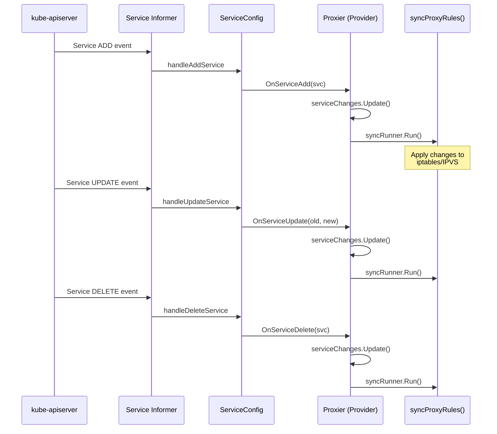
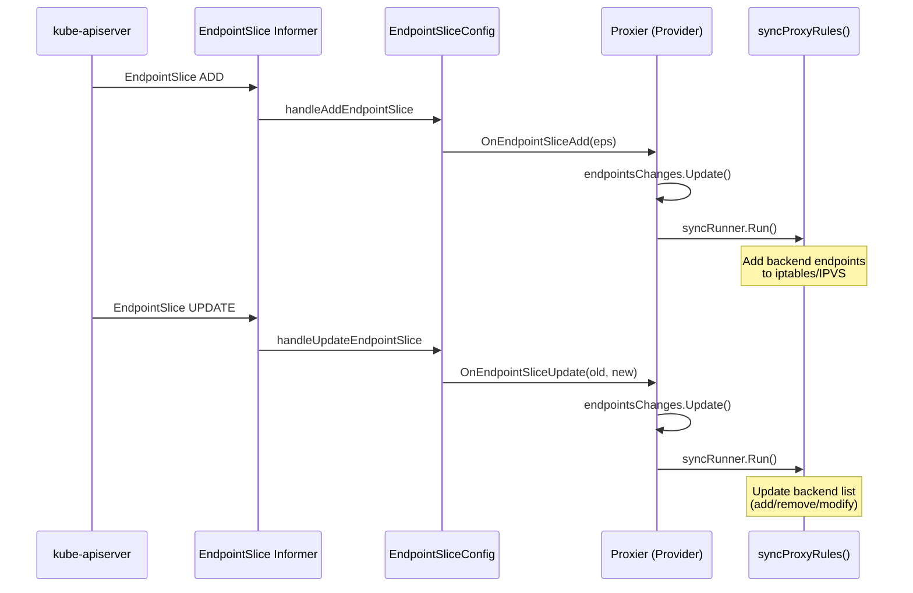
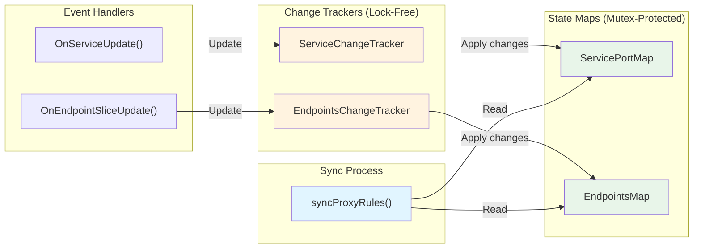
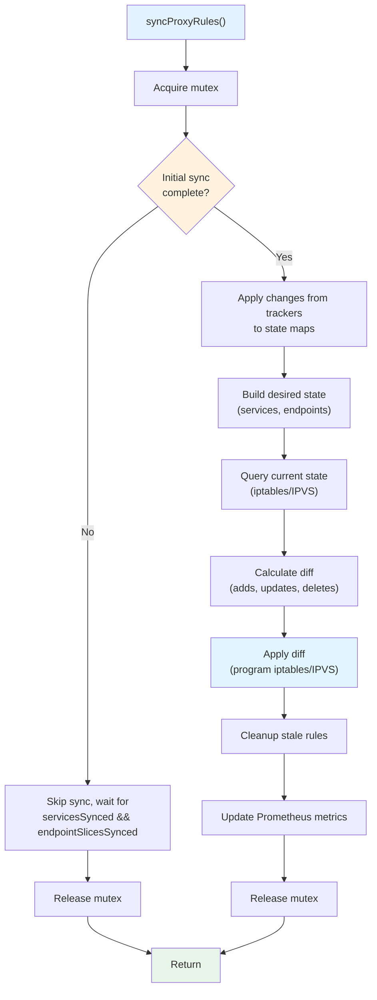
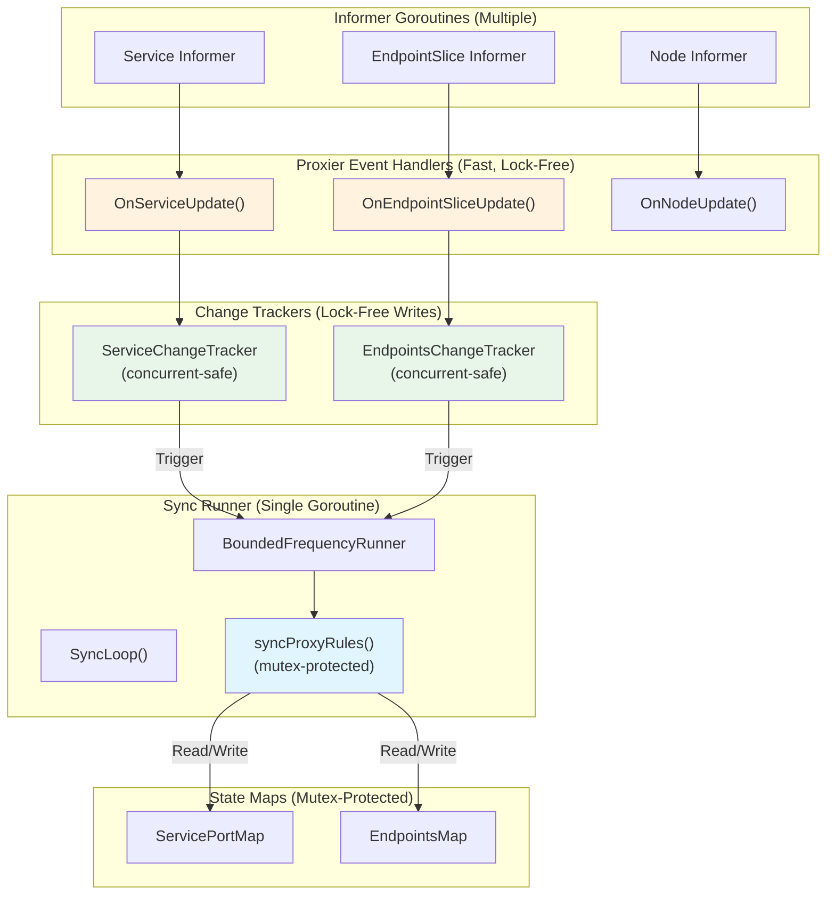
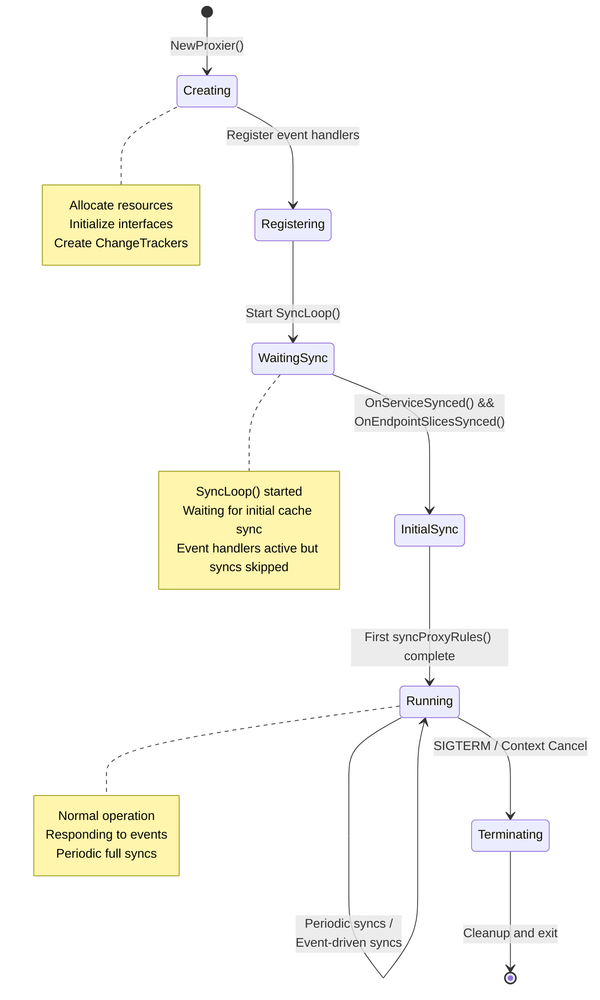

# **Low-Level: Proxier Interface and Implementations**

━━━━━━━━━━━━━━━━━━━━━━━━━━━━━━━━━━━━━━━━━━━━━━━━━━━━━━━━━━━━━━━━━━━━━━━━━━━━━━

## **📋 Overview**

This document provides a comprehensive deep dive into the **Provider interface** (commonly referred to as "Proxier") and its concrete implementations in kube-proxy. The Provider interface is the central abstraction that defines how kube-proxy synchronizes Kubernetes Services and Endpoints to the underlying network infrastructure.

### **What This Document Covers**

- **Provider Interface**: The core abstraction for proxy implementations
- **Handler Interfaces**: ServiceHandler, EndpointSliceHandler, and others
- **iptables Proxier**: Implementation using iptables/netfilter
- **IPVS Proxier**: Implementation using IPVS load balancing
- **nftables Proxier**: Modern implementation using nftables (beta)
- **userspace Proxier**: Legacy implementation (deprecated)
- **Common Patterns**: Shared code and design patterns across implementations
- **Sync Mechanisms**: Sync() and SyncLoop() implementation details
- **Thread Safety**: Concurrency patterns and mutex usage
- **Lifecycle Management**: Initialization, running, and shutdown

### **Target Audience**

- **Core Contributors**: Understanding the proxy abstraction layer
- **Proxy Mode Developers**: Implementing new proxy modes
- **Advanced Debuggers**: Understanding internal state management
- **Architecture Reviewers**: Understanding design patterns and trade-offs

### **Prerequisites**

Before reading this document, you should be familiar with:
- Kubernetes Service abstraction - see `high-level/03-service-abstraction.md`
- Proxy mode architectures - see `high-level/02-proxy-modes.md`
- iptables mode details - see `middle-level/02-iptables-mode.md`
- IPVS mode details - see `middle-level/03-ipvs-mode.md`
- Service/Endpoint watching - see `middle-level/01-service-watch.md`

━━━━━━━━━━━━━━━━━━━━━━━━━━━━━━━━━━━━━━━━━━━━━━━━━━━━━━━━━━━━━━━━━━━━━━━━━━━━━━

## **🎯 Provider Interface**

### **Interface Definition**

The **Provider** interface is the primary abstraction for all proxy implementations:

```go
// pkg/proxy/types.go:27-40
type Provider interface {
    config.EndpointSliceHandler
    config.ServiceHandler
    config.NodeTopologyHandler
    config.ServiceCIDRHandler

    // Sync immediately synchronizes the Provider's current state to proxy rules.
    Sync()

    // SyncLoop runs periodic work.
    // This is expected to run as a goroutine or as the main loop of the app.
    // It does not return.
    SyncLoop()
}
```

**Key Characteristics**:
- **Composite Interface**: Embeds multiple handler interfaces
- **Event-Driven**: Responds to Service/Endpoint changes via handlers
- **Synchronization**: Provides Sync() for immediate updates and SyncLoop() for periodic work
- **Long-Running**: SyncLoop() is designed to run for the lifetime of the process

**Code Reference**: `pkg/proxy/types.go:27-40`

### **Interface Composition**

#### **Embedded Interfaces**

The Provider interface composes four handler interfaces:

```mermaid
graph TB
    Provider[Provider Interface]

    Provider --> EndpointSliceHandler
    Provider --> ServiceHandler
    Provider --> NodeTopologyHandler
    Provider --> ServiceCIDRHandler

    EndpointSliceHandler --> OnEndpointSliceAdd
    EndpointSliceHandler --> OnEndpointSliceUpdate
    EndpointSliceHandler --> OnEndpointSliceDelete
    EndpointSliceHandler --> OnEndpointSlicesSynced

    ServiceHandler --> OnServiceAdd
    ServiceHandler --> OnServiceUpdate
    ServiceHandler --> OnServiceDelete
    ServiceHandler --> OnServiceSynced

    NodeTopologyHandler --> OnNodeTopologyAdd
    NodeTopologyHandler --> OnNodeTopologyUpdate
    NodeTopologyHandler --> OnNodeTopologyDelete
    NodeTopologyHandler --> OnNodeTopologySynced

    ServiceCIDRHandler --> OnServiceCIDRAdd
    ServiceCIDRHandler --> OnServiceCIDRUpdate
    ServiceCIDRHandler --> OnServiceCIDRDelete
    ServiceCIDRHandler --> OnServiceCIDRsSynced

    style Provider fill:#e1f5ff
    style EndpointSliceHandler fill:#fff3e0
    style ServiceHandler fill:#f3e5f5
    style NodeTopologyHandler fill:#e8f5e9
    style ServiceCIDRHandler fill:#fce4ec
```



━━━━━━━━━━━━━━━━━━━━━━━━━━━━━━━━━━━━━━━━━━━━━━━━━━━━━━━━━━━━━━━━━━━━━━━━━━━━━━

## **📨 Handler Interfaces**

### **ServiceHandler Interface**

Receives notifications about Service object changes:

```go
// pkg/proxy/config/config.go:38-53
type ServiceHandler interface {
    // OnServiceAdd is called whenever creation of new service object
    // is observed.
    OnServiceAdd(service *v1.Service)

    // OnServiceUpdate is called whenever modification of an existing
    // service object is observed.
    OnServiceUpdate(oldService, service *v1.Service)

    // OnServiceDelete is called whenever deletion of an existing service
    // object is observed.
    OnServiceDelete(service *v1.Service)

    // OnServiceSynced is called once all the initial event handlers were
    // called and the state is fully propagated to local cache.
    OnServiceSynced()
}
```

**Key Methods**:
- **OnServiceAdd**: New Service created
- **OnServiceUpdate**: Existing Service modified (spec changes, labels, etc.)
- **OnServiceDelete**: Service removed
- **OnServiceSynced**: Initial cache synchronization complete (startup)

**Code Reference**: `pkg/proxy/config/config.go:38-53`

#### **Service Event Flow**



### **EndpointSliceHandler Interface**

Receives notifications about EndpointSlice object changes:

```go
// pkg/proxy/config/config.go:55-70
type EndpointSliceHandler interface {
    // OnEndpointSliceAdd is called whenever creation of new endpoint slice
    // object is observed.
    OnEndpointSliceAdd(endpointSlice *discoveryv1.EndpointSlice)

    // OnEndpointSliceUpdate is called whenever modification of an existing
    // endpoint slice object is observed.
    OnEndpointSliceUpdate(oldEndpointSlice, newEndpointSlice *discoveryv1.EndpointSlice)

    // OnEndpointSliceDelete is called whenever deletion of an existing
    // endpoint slice object is observed.
    OnEndpointSliceDelete(endpointSlice *discoveryv1.EndpointSlice)

    // OnEndpointSlicesSynced is called once all the initial event handlers were
    // called and the state is fully propagated to local cache.
    OnEndpointSlicesSynced()
}
```

**Key Methods**:
- **OnEndpointSliceAdd**: New EndpointSlice created (new endpoints or new slice)
- **OnEndpointSliceUpdate**: Existing EndpointSlice modified (endpoints added/removed/changed)
- **OnEndpointSliceDelete**: EndpointSlice removed
- **OnEndpointSlicesSynced**: Initial cache synchronization complete

**Code Reference**: `pkg/proxy/config/config.go:55-70`

#### **EndpointSlice Event Flow**



### **NodeTopologyHandler Interface**

Receives notifications about node topology changes (for topology-aware routing):

```go
// Simplified interface structure
type NodeTopologyHandler interface {
    OnNodeTopologyAdd(node *v1.Node)
    OnNodeTopologyUpdate(oldNode, newNode *v1.Node)
    OnNodeTopologyDelete(node *v1.Node)
    OnNodeTopologySynced()
}
```

**Purpose**: Support topology-aware endpoint routing based on zone/region labels

**Usage**:
- Track node topology labels (zone, region)
- Enable topology hints in EndpointSlices
- Prefer local endpoints when possible

### **ServiceCIDRHandler Interface**

Receives notifications about ServiceCIDR changes:

```go
// Simplified interface structure
type ServiceCIDRHandler interface {
    OnServiceCIDRAdd(serviceCIDR *networkingv1.ServiceCIDR)
    OnServiceCIDRUpdate(oldServiceCIDR, newServiceCIDR *networkingv1.ServiceCIDR)
    OnServiceCIDRDelete(serviceCIDR *networkingv1.ServiceCIDR)
    OnServiceCIDRsSynced()
}
```

**Purpose**: Track cluster Service CIDR ranges for routing and masquerading decisions

━━━━━━━━━━━━━━━━━━━━━━━━━━━━━━━━━━━━━━━━━━━━━━━━━━━━━━━━━━━━━━━━━━━━━━━━━━━━━━

## **🔧 iptables Proxier Implementation**

### **Proxier Structure**

The iptables Proxier is a large, complex structure managing all state for iptables-based proxying:

```go
// pkg/proxy/iptables/proxier.go:133-209
type Proxier struct {
    // IP family (IPv4 or IPv6)
    ipFamily v1.IPFamily

    // Change tracking
    endpointsChanges *proxy.EndpointsChangeTracker
    serviceChanges   *proxy.ServiceChangeTracker

    // Protected by mutex
    mu             sync.Mutex
    svcPortMap     proxy.ServicePortMap     // Current service state
    endpointsMap   proxy.EndpointsMap       // Current endpoint state
    topologyLabels map[string]string        // Node topology labels

    // Sync state
    endpointSlicesSynced bool
    servicesSynced       bool
    lastFullSync         time.Time
    needFullSync         bool
    initialized          int32
    syncRunner           *runner.BoundedFrequencyRunner
    syncPeriod           time.Duration
    lastIPTablesCleanup  time.Time

    // External dependencies (effectively const)
    iptables       utiliptables.Interface
    masqueradeAll  bool
    masqueradeMark string
    conntrack      conntrack.Interface
    nfacct         nfacct.Interface
    localDetector  proxyutil.LocalTrafficDetector
    nodeName       string
    nodeIP         net.IP

    serviceHealthServer healthcheck.ServiceHealthServer
    healthzServer       *healthcheck.ProxyHealthServer

    // Performance optimization
    precomputedProbabilities []string  // Cached probability strings

    // Buffer reuse (avoid allocations)
    iptablesData             *bytes.Buffer
    existingFilterChainsData *bytes.Buffer
    filterChains             proxyutil.LineBuffer
    filterRules              proxyutil.LineBuffer
    natChains                proxyutil.LineBuffer
    natRules                 proxyutil.LineBuffer

    // Configuration flags
    largeClusterMode       bool
    localhostNodePorts     bool
    conntrackTCPLiberal    bool
    nodePortAddresses      *proxyutil.NodePortAddresses
    networkInterfacer      proxyutil.NetworkInterfacer

    logger         klog.Logger
    nfAcctCounters map[string]bool
}
```

**Key Field Categories**:

1. **State Management**:
   - `svcPortMap`: Current services (protected by mutex)
   - `endpointsMap`: Current endpoints (protected by mutex)
   - `serviceChanges` / `endpointsChanges`: Pending changes (lock-free)

2. **Sync Control**:
   - `syncRunner`: BoundedFrequencyRunner for sync debouncing
   - `endpointSlicesSynced` / `servicesSynced`: Initial sync flags
   - `needFullSync`: Forces full resync

3. **Performance Optimization**:
   - `precomputedProbabilities`: Avoid float→string conversion
   - Buffer reuse fields: Reduce GC pressure
   - `largeClusterMode`: Optimize for scale

4. **External Dependencies**:
   - `iptables`: Interface for iptables operations
   - `conntrack`: Connection tracking management
   - `serviceHealthServer`: Health check endpoint server

**Code Reference**: `pkg/proxy/iptables/proxier.go:133-209`

### **Handler Implementation (iptables)**

#### **OnServiceAdd**

```go
// pkg/proxy/iptables/proxier.go:710-715
func (proxier *Proxier) OnServiceAdd(service *v1.Service) {
    proxier.OnServiceUpdate(nil, service)
}
```

**Pattern**: Delegates to OnServiceUpdate with nil old service (common pattern)

**Code Reference**: `pkg/proxy/iptables/proxier.go:710-715`

#### **OnServiceUpdate**

```go
// pkg/proxy/iptables/proxier.go:717-735 (simplified)
func (proxier *Proxier) OnServiceUpdate(oldService, service *v1.Service) {
    // Update service changes tracker
    proxier.serviceChanges.Update(oldService, service)

    // Trigger sync
    proxier.syncRunner.Run()
}
```

**Flow**:
1. Record change in `serviceChanges` tracker (lock-free)
2. Trigger `syncRunner.Run()` to schedule sync

**Actual Implementation**: More complex with metrics, logging, etc.

**Code Reference**: `pkg/proxy/iptables/proxier.go:717-735`

#### **OnServiceDelete**

```go
// pkg/proxy/iptables/proxier.go:737-745
func (proxier *Proxier) OnServiceDelete(service *v1.Service) {
    proxier.OnServiceUpdate(service, nil)
}
```

**Pattern**: Delegates to OnServiceUpdate with nil new service

**Code Reference**: `pkg/proxy/iptables/proxier.go:737-745`

#### **OnServiceSynced**

```go
// pkg/proxy/iptables/proxier.go:747-760 (simplified)
func (proxier *Proxier) OnServiceSynced() {
    proxier.mu.Lock()
    proxier.servicesSynced = true
    proxier.mu.Unlock()

    // Trigger initial sync if both services and endpoints are synced
    proxier.syncRunner.Run()
}
```

**Purpose**: Mark initial Service cache synchronization complete. Only after both `servicesSynced` and `endpointSlicesSynced` are true will the first real sync occur.

**Code Reference**: `pkg/proxy/iptables/proxier.go:747-760`

### **Sync() Method (iptables)**

```go
// pkg/proxy/iptables/proxier.go:920-930
func (proxier *Proxier) Sync() {
    proxier.syncRunner.Run()
}
```

**Purpose**: Trigger an immediate sync (called by external code, not typical)

**Implementation**: Simply calls `syncRunner.Run()`, which will:
- Respect `minSyncPeriod` (rate limiting)
- Coalesce multiple rapid calls
- Eventually invoke `syncProxyRules()`

**Code Reference**: `pkg/proxy/iptables/proxier.go:920-930`

### **SyncLoop() Method (iptables)**

```go
// pkg/proxy/iptables/proxier.go:932-950 (simplified)
func (proxier *Proxier) SyncLoop() {
    // Start syncRunner (background goroutine)
    go proxier.syncRunner.Loop(wait.NeverStop)

    // Periodic cleanup tasks
    go wait.Until(proxier.periodicCleanup, time.Minute, wait.NeverStop)

    // Block forever (main loop)
    select {}
}
```

**Components**:
1. **syncRunner.Loop()**: Runs BoundedFrequencyRunner loop
   - Handles `syncProxyRules()` invocations
   - Rate limits with `minSyncPeriod`
   - Periodic sync with `syncPeriod`

2. **periodicCleanup()**: Cleanup tasks every minute
   - Orphaned chain cleanup
   - Stale rule detection

3. **Blocking**: Never returns (runs for proxy lifetime)

**Code Reference**: `pkg/proxy/iptables/proxier.go:932-950`

━━━━━━━━━━━━━━━━━━━━━━━━━━━━━━━━━━━━━━━━━━━━━━━━━━━━━━━━━━━━━━━━━━━━━━━━━━━━━━

## **⚡ IPVS Proxier Implementation**

### **Proxier Structure**

The IPVS Proxier shares many patterns with iptables but has IPVS-specific fields:

```go
// pkg/proxy/ipvs/proxier.go:163-240
type Proxier struct {
    // IP family
    ipFamily v1.IPFamily

    // Change tracking (same pattern as iptables)
    endpointsChanges *proxy.EndpointsChangeTracker
    serviceChanges   *proxy.ServiceChangeTracker

    // Protected by mutex
    mu             sync.Mutex
    svcPortMap     proxy.ServicePortMap
    endpointsMap   proxy.EndpointsMap
    topologyLabels map[string]string

    // Initial sync flag (IPVS-specific)
    initialSync bool  // True only on first sync after startup

    // Sync state
    endpointSlicesSynced bool
    servicesSynced       bool
    initialized          int32
    syncRunner           *runner.BoundedFrequencyRunner

    // Periods
    syncPeriod    time.Duration
    minSyncPeriod time.Duration

    // CIDR exclusions for cleanup
    excludeCIDRs []*net.IPNet

    // External dependencies
    iptables       utiliptables.Interface  // Still needed for masquerading
    ipvs           utilipvs.Interface      // IPVS kernel interface
    ipset          utilipset.Interface     // ipset for filtering
    conntrack      conntrack.Interface
    masqueradeAll  bool
    masqueradeMark string
    localDetector  proxyutil.LocalTrafficDetector
    nodeName       string
    nodeIP         net.IP

    serviceHealthServer healthcheck.ServiceHealthServer
    healthzServer       *healthcheck.ProxyHealthServer

    // IPVS-specific
    ipvsScheduler string  // Default scheduler (rr, lc, etc.)

    // Buffer reuse
    iptablesData     *bytes.Buffer
    filterChainsData *bytes.Buffer
    natChains        proxyutil.LineBuffer
    filterChains     proxyutil.LineBuffer
    natRules         proxyutil.LineBuffer
    filterRules      proxyutil.LineBuffer

    // Network management
    netlinkHandle     NetLinkHandle              // IP address binding (kube-ipvs0)
    ipsetList         map[string]*IPSet          // IPVS ipset management
    nodePortAddresses *proxyutil.NodePortAddresses
    networkInterfacer proxyutil.NetworkInterfacer

    // Graceful termination
    gracefuldeleteManager *GracefulTerminationManager

    // Metrics (no local endpoints for traffic policies)
    serviceNoLocalEndpointsInternal sets.Set[string]
    serviceNoLocalEndpointsExternal sets.Set[string]

    logger klog.Logger
}
```

**Differences from iptables Proxier**:

1. **IPVS-Specific**:
   - `ipvs`: IPVS kernel interface (vs `iptables` only)
   - `ipset`: ipset interface for filtering
   - `ipvsScheduler`: Load balancing algorithm
   - `netlinkHandle`: Manage kube-ipvs0 dummy interface
   - `ipsetList`: Track ipsets used by IPVS
   - `gracefuldeleteManager`: TCP graceful termination

2. **Sync Strategy**:
   - `initialSync`: Special handling on first sync (update RS weights)
   - Different sync algorithm (VS/RS vs iptables chains/rules)

3. **Still Uses iptables**:
   - `iptables` field present: IPVS uses iptables for masquerading, filtering
   - Much fewer iptables rules than pure iptables mode

**Code Reference**: `pkg/proxy/ipvs/proxier.go:163-240`

### **Handler Implementation (IPVS)**

#### **OnServiceUpdate**

```go
// pkg/proxy/ipvs/proxier.go:680-705 (simplified)
func (proxier *Proxier) OnServiceUpdate(oldService, service *v1.Service) {
    // Update service changes tracker
    proxier.serviceChanges.Update(oldService, service)

    // Trigger sync
    proxier.syncRunner.Run()
}
```

**Pattern**: Identical to iptables Proxier
- Track change
- Trigger sync

**Code Reference**: `pkg/proxy/ipvs/proxier.go:680-705`

#### **OnEndpointSliceUpdate**

```go
// pkg/proxy/ipvs/proxier.go:740-765 (simplified)
func (proxier *Proxier) OnEndpointSliceUpdate(oldEndpointSlice, newEndpointSlice *discoveryv1.EndpointSlice) {
    // Update endpoint changes tracker
    proxier.endpointsChanges.EndpointSliceUpdate(oldEndpointSlice, newEndpointSlice, false)

    // Trigger sync
    proxier.syncRunner.Run()
}
```

**Pattern**: Same as Service updates
- Track change in EndpointsChangeTracker
- Trigger sync via syncRunner

**Code Reference**: `pkg/proxy/ipvs/proxier.go:740-765`

### **Sync() and SyncLoop() (IPVS)**

#### **Sync()**

```go
// pkg/proxy/ipvs/proxier.go:850-855
func (proxier *Proxier) Sync() {
    proxier.syncRunner.Run()
}
```

**Identical to iptables**: Trigger syncRunner

**Code Reference**: `pkg/proxy/ipvs/proxier.go:850-855`

#### **SyncLoop()**

```go
// pkg/proxy/ipvs/proxier.go:857-875 (simplified)
func (proxier *Proxier) SyncLoop() {
    // Start syncRunner loop
    go proxier.syncRunner.Loop(wait.NeverStop)

    // Start graceful termination manager
    go proxier.gracefuldeleteManager.Run()

    // Block forever
    select {}
}
```

**Differences from iptables**:
- Starts `gracefuldeleteManager.Run()` (IPVS-specific)
- No periodic cleanup goroutine (IPVS cleanup is part of syncProxyRules)

**Code Reference**: `pkg/proxy/ipvs/proxier.go:857-875`

━━━━━━━━━━━━━━━━━━━━━━━━━━━━━━━━━━━━━━━━━━━━━━━━━━━━━━━━━━━━━━━━━━━━━━━━━━━━━━

## **🔄 Common Proxier Patterns**

### **Change Tracking Pattern**

All Proxier implementations use **ChangeTracker** pattern:



#### **Why This Pattern?**

**Problem**: Event handlers are called from Informer goroutines, but syncProxyRules needs consistent state.

**Solution**: Two-phase approach:

**Phase 1**: Event Handlers (Fast, Lock-Free)
```go
func (proxier *Proxier) OnServiceUpdate(oldService, service *v1.Service) {
    // Lock-free: just record the change
    proxier.serviceChanges.Update(oldService, service)

    // Trigger sync (debounced)
    proxier.syncRunner.Run()
}
```

**Phase 2**: syncProxyRules (Slow, Synchronized)
```go
func (proxier *Proxier) syncProxyRules() {
    proxier.mu.Lock()
    defer proxier.mu.Unlock()

    // Apply accumulated changes to state maps
    serviceUpdateResult := proxier.serviceChanges.Update(proxier.svcPortMap)
    endpointUpdateResult := proxier.endpointsChanges.Update(proxier.endpointsMap)

    // Use consistent state to generate rules
    // ...
}
```

**Benefits**:
- **Fast event handlers**: No blocking on mutex or heavy work
- **Batching**: Multiple rapid events collapsed into single sync
- **Consistency**: syncProxyRules sees atomic snapshot of changes
- **Debouncing**: syncRunner rate-limits syncs

### **BoundedFrequencyRunner Pattern**

All Proxier implementations use **BoundedFrequencyRunner** to manage sync timing:

```go
// Proxier initialization (both iptables and IPVS)
proxier.syncRunner = runner.NewBoundedFrequencyRunner(
    "sync-runner",
    proxier.syncProxyRules,  // Function to run
    minSyncPeriod,           // Minimum time between runs (e.g., 1s)
    syncPeriod,              // Maximum time between runs (e.g., 30s)
    1,                       // Buffer size
)
```

**Behavior**:

```mermaid
gantt
    title BoundedFrequencyRunner Behavior
    dateFormat X
    axisFormat %S

    section Events
    Service Change 1 :milestone, 0, 0s
    Service Change 2 :milestone, 500ms, 500ms
    Service Change 3 :milestone, 800ms, 800ms
    No Events :1s, 30s

    section Sync Invocations
    Sync 1 (minSyncPeriod) :crit, 1s, 1.1s
    Sync 2 (syncPeriod) :crit, 30s, 30.1s
```

**Rules**:
1. **Rate Limiting**: Never sync faster than `minSyncPeriod` (default: 1s)
   - Multiple rapid `Run()` calls coalesced
   - Ensures we don't thrash on rapid changes

2. **Periodic Sync**: Sync at least every `syncPeriod` (default: 30s)
   - Even if no events, periodic full sync ensures eventual consistency
   - Catches any missed events or external changes

3. **Immediate Trigger**: Can sync immediately if:
   - Last sync was > `minSyncPeriod` ago
   - New event arrives

**Configuration**:
- **minSyncPeriod**: `--iptables-min-sync-period` or `--ipvs-min-sync-period` (default: 1s)
- **syncPeriod**: `--iptables-sync-period` or `--ipvs-sync-period` (default: 30s)

### **State Synchronization Pattern**

Both implementations follow this pattern in `syncProxyRules()`:



**Key Steps**:

1. **Lock Acquisition**: `proxier.mu.Lock()` - Mutex ensures single syncProxyRules execution
2. **Initial Sync Check**: Skip if not ready (wait for `servicesSynced` && `endpointSlicesSynced`)
3. **Apply Changes**: Move changes from trackers to state maps
4. **Build Desired State**: Compute what rules/VS/RS should exist
5. **Query Current State**: Read from kernel (iptables-save or GetVirtualServers)
6. **Calculate Diff**: Determine adds, updates, deletes
7. **Apply Diff**: Program kernel with changes
8. **Cleanup**: Remove stale rules/VS/RS
9. **Update Metrics**: Record sync duration, rule counts, etc.

**Thread Safety**: Mutex ensures:
- Only one sync at a time
- Consistent read of state maps
- Atomic state updates

### **Service Port Naming Pattern**

Both implementations use **ServicePortName** as the key for services:

```go
// pkg/proxy/types.go:42-52
type ServicePortName struct {
    types.NamespacedName  // Namespace + Name
    Port     string       // Port name (not number!)
    Protocol v1.Protocol  // TCP, UDP, SCTP
}

func (spn ServicePortName) String() string {
    return fmt.Sprintf("%s%s", spn.NamespacedName.String(), fmtPortName(spn.Port))
}

// Example: "default/my-service:http"
```

**Why Port Name?**:
- Services can have multiple ports with same number but different names
- Port name is the stable identifier (number can change)

**Usage**:
- Key for `ServicePortMap`: `map[ServicePortName]*servicePortInfo`
- Key for `EndpointsMap`: `map[ServicePortName][]Endpoint`

**Code Reference**: `pkg/proxy/types.go:42-52`

━━━━━━━━━━━━━━━━━━━━━━━━━━━━━━━━━━━━━━━━━━━━━━━━━━━━━━━━━━━━━━━━━━━━━━━━━━━━━━

## **🔒 Thread Safety and Concurrency**

### **Concurrency Model**



### **Lock-Free Path (Event Handlers)**

Event handlers are designed to be **fast and non-blocking**:

```go
func (proxier *Proxier) OnServiceUpdate(oldService, service *v1.Service) {
    // No mutex lock!
    // ChangeTrackers use internal synchronization (channels or lock-free structures)
    proxier.serviceChanges.Update(oldService, service)

    // Trigger sync (non-blocking, just signals runner)
    proxier.syncRunner.Run()

    // Return immediately (fast!)
}
```

**Why Fast?**:
- **Informer threads**: Don't want to block informer processing
- **High throughput**: Can handle 100s of events/sec
- **Batching**: Multiple events coalesced into single sync

### **Mutex-Protected Path (syncProxyRules)**

`syncProxyRules()` is the **only** function that modifies state maps:

```go
func (proxier *Proxier) syncProxyRules() {
    // CRITICAL SECTION START
    proxier.mu.Lock()
    defer proxier.mu.Unlock()

    // Safe to read/write state maps
    serviceUpdateResult := proxier.serviceChanges.Update(proxier.svcPortMap)
    endpointUpdateResult := proxier.endpointsChanges.Update(proxier.endpointsMap)

    // Use state maps to generate rules
    for svcName, svcInfo := range proxier.svcPortMap {
        // ...
    }

    // CRITICAL SECTION END (defer unlock)
}
```

**Mutex Guarantees**:
- **Exclusive access**: Only one syncProxyRules execution at a time
- **Consistency**: State maps not modified during rule generation
- **Atomicity**: All changes applied together

**Performance Impact**:
- `syncProxyRules()` is slow (10ms-1s depending on cluster size)
- Mutex held for entire duration
- **BUT**: Only one sync runs at a time anyway (by design)
- Event handlers remain fast (lock-free)

### **Thread Safety Summary**

| Component | Thread Safety | Mechanism |
|-----------|--------------|-----------|
| Event Handlers | Concurrent | Lock-free (internal synchronization in ChangeTrackers) |
| ChangeTrackers | Concurrent writes | Channels or atomic operations |
| State Maps (svcPortMap, endpointsMap) | Single writer | Mutex in syncProxyRules |
| syncProxyRules() | Serial execution | Mutex + BoundedFrequencyRunner |
| iptables/IPVS Interface | Thread-safe | Mutex in runner (iptables/IPVS interface) |

━━━━━━━━━━━━━━━━━━━━━━━━━━━━━━━━━━━━━━━━━━━━━━━━━━━━━━━━━━━━━━━━━━━━━━━━━━━━━━

## **🚀 Lifecycle Management**

### **Proxier Lifecycle Stages**



### **Initialization Sequence**

#### **1. Proxier Creation**

```go
// Example: iptables proxier creation
// pkg/proxy/iptables/proxier.go:230-350 (simplified)
func NewProxier(
    ipFamily v1.IPFamily,
    ipt utiliptables.Interface,
    sysctl utilsysctl.Interface,
    // ... many more parameters
) (*Proxier, error) {

    // Validate parameters
    if ipt == nil {
        return nil, fmt.Errorf("iptables interface required")
    }

    // Create proxier
    proxier := &Proxier{
        ipFamily:         ipFamily,
        iptables:         ipt,
        masqueradeAll:    masqueradeAll,
        masqueradeMark:   masqueradeMark,
        conntrack:        conntrack.New(),
        // ...

        // Initialize state maps
        svcPortMap:       make(proxy.ServicePortMap),
        endpointsMap:     make(proxy.EndpointsMap),

        // Initialize change trackers
        serviceChanges:   proxy.NewServiceChangeTracker(ipFamily, newServiceInfo, nil),
        endpointsChanges: proxy.NewEndpointsChangeTracker(ipFamily, nodeName, nil, nil),

        // Initialize buffers
        iptablesData:     bytes.NewBuffer(nil),
        filterChains:     proxyutil.NewLineBuffer(),
        filterRules:      proxyutil.NewLineBuffer(),
        natChains:        proxyutil.NewLineBuffer(),
        natRules:         proxyutil.NewLineBuffer(),

        // Precompute probability strings
        precomputedProbabilities: make([]string, 0, 1001),
    }

    // Precompute probabilities
    for i := 0; i <= 1000; i++ {
        proxier.precomputedProbabilities = append(
            proxier.precomputedProbabilities,
            makeProbabilityString(float64(i)/1000.0),
        )
    }

    // Create sync runner
    proxier.syncRunner = runner.NewBoundedFrequencyRunner(
        "sync-runner",
        proxier.syncProxyRules,
        minSyncPeriod,
        syncPeriod,
        1,
    )

    return proxier, nil
}
```

**Key Initialization Steps**:
1. Validate parameters (interfaces, config)
2. Allocate Proxier struct with initial values
3. Create state maps (svcPortMap, endpointsMap)
4. Create change trackers (ServiceChangeTracker, EndpointsChangeTracker)
5. Allocate buffers for performance (iptablesData, etc.)
6. Precompute probability strings (iptables optimization)
7. Create BoundedFrequencyRunner for sync management

**Code Reference**: `pkg/proxy/iptables/proxier.go:230-350`

#### **2. Event Handler Registration**

```go
// pkg/proxy/config/config.go (ServiceConfig)
func (c *ServiceConfig) RegisterEventHandler(handler ServiceHandler) {
    c.eventHandlers = append(c.eventHandlers, handler)
}

// In kube-proxy main
serviceConfig.RegisterEventHandler(proxier)
endpointSliceConfig.RegisterEventHandler(proxier)
```

**Process**:
- ServiceConfig and EndpointSliceConfig manage informers
- Proxier registered as handler
- Informer events dispatched to Proxier's On* methods

#### **3. SyncLoop() Start**

```go
// cmd/kube-proxy/app/server.go (simplified)
func (s *ProxyServer) Run() error {
    // Start informers
    s.Informers.Start(ctx.Done())

    // Wait for cache sync
    if !cache.WaitForCacheSync(ctx.Done(), /* ... */) {
        return fmt.Errorf("timed out waiting for caches to sync")
    }

    // Start proxier sync loop (blocking)
    s.Proxier.SyncLoop()

    return nil
}
```

**Stages**:
1. **Start Informers**: Begin watching API server
2. **Wait for Cache Sync**: Block until initial LIST complete
3. **OnServiceSynced / OnEndpointSlicesSynced**: Informers call these
4. **Start SyncLoop**: Begins periodic sync and event processing
5. **First Sync**: syncProxyRules() runs for the first time

#### **4. Initial Sync Check**

```go
// In syncProxyRules()
func (proxier *Proxier) syncProxyRules() {
    proxier.mu.Lock()
    defer proxier.mu.Unlock()

    // Skip sync until initial cache populated
    if !proxier.servicesSynced || !proxier.endpointSlicesSynced {
        proxier.logger.V(2).Info("Skipping sync, not fully synced yet")
        return
    }

    // First real sync
    if !proxier.isInitialized() {
        proxier.logger.Info("Syncing proxy rules (initial sync)")
        atomic.StoreInt32(&proxier.initialized, 1)
    }

    // Normal sync logic
    // ...
}
```

**Why Wait?**:
- Don't want to program partial state (missing services or endpoints)
- Wait for complete initial snapshot from API server
- Then proceed with normal operation

### **Normal Operation**

During normal operation, proxier responds to two types of triggers:

**1. Event-Driven Sync**:
```
Service/EndpointSlice change → OnServiceUpdate/OnEndpointSliceUpdate
→ serviceChanges.Update() / endpointsChanges.Update()
→ syncRunner.Run()
→ (debounced) syncProxyRules()
```

**2. Periodic Sync**:
```
Every syncPeriod (default 30s) → syncRunner periodic trigger
→ syncProxyRules() (full sync)
→ Detect and cleanup any drift
```

### **Shutdown Sequence**

```go
// Graceful shutdown
func (s *ProxyServer) Shutdown() {
    // 1. Stop accepting new events
    s.Informers.Shutdown()

    // 2. Stop sync loop (via context cancel)
    s.cancelFunc()

    // 3. Wait for in-flight syncs to complete
    // (syncProxyRules holds mutex until done)

    // 4. Cleanup (optional)
    // - Don't flush iptables/IPVS (let them remain for next kube-proxy)
    // - OR flush if explicitly requested

    // 5. Exit
}
```

**Graceful Shutdown**:
- **Stop Informers**: No new events
- **Cancel Context**: Signals SyncLoop to exit
- **In-Flight Sync**: Allow current syncProxyRules to finish
- **Cleanup**: Optional (usually leave rules in place)

**Crash / Ungraceful Shutdown**:
- Rules remain in kernel (iptables/IPVS)
- Next kube-proxy instance will reconcile on startup
- Eventual consistency via periodic full sync

━━━━━━━━━━━━━━━━━━━━━━━━━━━━━━━━━━━━━━━━━━━━━━━━━━━━━━━━━━━━━━━━━━━━━━━━━━━━━━

## **🔍 Comparison: iptables vs IPVS Proxiers**

### **Structural Comparison**

| Aspect | iptables Proxier | IPVS Proxier |
|--------|------------------|--------------|
| **State Structure** | Identical (ServicePortMap, EndpointsMap) | Identical |
| **Change Tracking** | ServiceChangeTracker, EndpointsChangeTracker | Same |
| **Sync Pattern** | BoundedFrequencyRunner, mutex-protected sync | Same |
| **Event Handlers** | OnServiceUpdate, OnEndpointSliceUpdate, etc. | Same |
| **Kernel Interface** | iptables (utiliptables.Interface) | IPVS (utilipvs.Interface) + iptables |
| **Additional Interfaces** | conntrack, nfacct | conntrack, ipset, netlinkHandle |
| **Special Management** | - | GracefulTerminationManager, kube-ipvs0 |
| **Rule Generation** | Generate iptables rules (NAT, Filter chains) | Generate VS/RS + minimal iptables |
| **Load Balancing** | Probability-based (statistic module) | IPVS scheduler (11 algorithms) |
| **Performance** | O(N) rule traversal | O(1) hash lookup |
| **Scalability** | 1,000-5,000 services max | 10,000+ services |

### **Sync Algorithm Comparison**

#### **iptables syncProxyRules**

```
1. Acquire mutex
2. Check if ready (servicesSynced && endpointSlicesSynced)
3. Apply changes from ChangeTrackers to state maps
4. Build desired iptables rules:
   - KUBE-SERVICES chain (all ClusterIPs)
   - KUBE-SVC-* chains (per-service)
   - KUBE-SEP-* chains (per-endpoint)
   - KUBE-NODEPORTS chain
5. Execute iptables-restore (atomic replacement)
6. Cleanup stale chains
7. Update conntrack (delete stale entries)
8. Update metrics
9. Release mutex
```

**Time Complexity**: O(S * E) where S = services, E = avg endpoints per service
**Bottleneck**: iptables-restore execution (100ms-1s for large rulesets)

#### **IPVS syncProxyRules**

```
1. Acquire mutex
2. Check if ready
3. Apply changes from ChangeTrackers to state maps
4. For each service:
   a. syncService(): Add/Update/Delete Virtual Server
   b. Bind ClusterIP to kube-ipvs0
   c. syncEndpoint(): Add/Update/Delete Real Servers
   d. Update ipsets (for filtering)
5. Cleanup stale VS/RS
6. Update minimal iptables rules (masquerading, filtering)
7. Update conntrack
8. Update metrics
9. Release mutex
```

**Time Complexity**: O(S + E) where S = services, E = total endpoints
**Bottleneck**: Netlink operations (1-10ms per VS/RS operation)

**IPVS Advantages**:
- **Linear complexity**: O(S + E) vs O(S * E)
- **Incremental updates**: Only touch changed VS/RS
- **Faster sync**: 10-100x faster for large clusters

### **Code Organization Comparison**

#### **iptables Proxier Files**

```
pkg/proxy/iptables/
├── proxier.go           (1,800+ lines) - Main Proxier implementation
├── proxier_test.go      (2,500+ lines) - Tests
└── ...
```

**Single monolithic file**: All logic in proxier.go

#### **IPVS Proxier Files**

```
pkg/proxy/ipvs/
├── proxier.go              (2,000+ lines) - Main Proxier
├── graceful_termination.go (250+ lines)  - Graceful RS deletion
├── ipset.go                (150+ lines)  - ipset management
├── netlink.go              (100+ lines)  - Netlink handle
├── testing/                - Fake implementations
└── util/                   - IPVS utilities
```

**Modular structure**: Separate concerns into multiple files

━━━━━━━━━━━━━━━━━━━━━━━━━━━━━━━━━━━━━━━━━━━━━━━━━━━━━━━━━━━━━━━━━━━━━━━━━━━━━━

## **💡 Best Practices**

### **For Proxy Mode Developers**

#### **1. Implement Provider Interface**

```go
// Your new proxy mode must implement Provider
type MyProxier struct {
    // Include standard fields
    mu               sync.Mutex
    svcPortMap       proxy.ServicePortMap
    endpointsMap     proxy.EndpointsMap
    serviceChanges   *proxy.ServiceChangeTracker
    endpointsChanges *proxy.EndpointsChangeTracker
    syncRunner       *runner.BoundedFrequencyRunner

    // Your mode-specific fields
    myInterface MyInterface
}

// Implement all Provider interface methods
func (p *MyProxier) OnServiceAdd(svc *v1.Service) {
    p.OnServiceUpdate(nil, svc)
}

func (p *MyProxier) OnServiceUpdate(old, new *v1.Service) {
    p.serviceChanges.Update(old, new)
    p.syncRunner.Run()
}

// ... etc
```

**Follow the patterns**:
- Use ChangeTrackers for event handling
- Use BoundedFrequencyRunner for sync management
- Protect state maps with mutex
- Implement syncProxyRules() for actual rule programming

#### **2. Use Standard Change Trackers**

```go
// Don't reinvent change tracking
proxier.serviceChanges = proxy.NewServiceChangeTracker(
    ipFamily,
    newServiceInfo,  // Your serviceInfo constructor
    nil,             // Recorder (optional)
)

proxier.endpointsChanges = proxy.NewEndpointsChangeTracker(
    ipFamily,
    nodeName,
    nil,  // Endpoint change tracker (optional)
    nil,  // Recorder (optional)
)
```

**Benefits**:
- **Proven code**: Battle-tested change tracking
- **Consistent behavior**: Same semantics as iptables/IPVS
- **Less code**: Don't implement your own

#### **3. Respect BoundedFrequencyRunner**

```go
// Configure sync timing appropriately
proxier.syncRunner = runner.NewBoundedFrequencyRunner(
    "my-proxy-sync",
    proxier.syncProxyRules,
    1*time.Second,   // minSyncPeriod: Don't sync faster than this
    30*time.Second,  // syncPeriod: Sync at least this often
    1,               // Buffer: Keep simple (1)
)
```

**Tuning**:
- **Faster sync**: Reduce minSyncPeriod (but increases CPU)
- **Slower periodic**: Increase syncPeriod (but slower drift correction)
- **Balance**: Default values (1s, 30s) work well for most cases

#### **4. Implement Proper Thread Safety**

```go
func (p *MyProxier) syncProxyRules() {
    // Always protect state map access
    p.mu.Lock()
    defer p.mu.Unlock()

    // Check if ready
    if !p.servicesSynced || !p.endpointSlicesSynced {
        return
    }

    // Apply changes
    serviceUpdateResult := p.serviceChanges.Update(p.svcPortMap)
    endpointUpdateResult := p.endpointsChanges.Update(p.endpointsMap)

    // Use consistent state
    for svcName, svcInfo := range p.svcPortMap {
        // Program rules using my interface
        p.myInterface.ProgramService(svcInfo)
    }
}
```

**Rules**:
- **Mutex in syncProxyRules**: Always
- **No mutex in event handlers**: Keep them fast
- **Change trackers handle their own sync**: Don't add locks

### **For Proxy Users (Operators)**

#### **1. Choose Appropriate Proxy Mode**

```yaml
# DaemonSet kube-proxy config
apiVersion: v1
kind: ConfigMap
metadata:
  name: kube-proxy
data:
  config.conf: |
    apiVersion: kubeproxy.config.k8s.io/v1alpha1
    kind: KubeProxyConfiguration
    mode: "ipvs"  # or "iptables", "nftables"

    # Tune sync periods
    iptables:
      minSyncPeriod: 1s
      syncPeriod: 30s

    ipvs:
      minSyncPeriod: 1s
      syncPeriod: 30s
      scheduler: "rr"  # Round robin
```

**Selection Criteria**:
- **Small clusters (< 1,000 services)**: iptables (simple, well-tested)
- **Large clusters (> 1,000 services)**: IPVS (better performance)
- **Modern kernel (5.13+)**: nftables (future-proof, beta)

#### **2. Monitor Sync Performance**

```promql
# Sync duration (should be < 1s P99)
histogram_quantile(0.99,
  rate(kubeproxy_sync_proxy_rules_duration_seconds_bucket[5m]))

# Sync errors (should be 0)
rate(kubeproxy_sync_proxy_rules_errors_total[5m])

# Last sync timestamp (detect stale proxy)
time() - kubeproxy_sync_proxy_rules_last_timestamp_seconds
```

**Alerts**:
- **Slow sync**: P99 > 1s (investigate cluster size, performance)
- **Sync errors**: Any errors (check logs for root cause)
- **Stale sync**: Last sync > 2 * syncPeriod (proxy not running?)

#### **3. Tune for Your Workload**

**High-Churn Workloads** (frequent service/endpoint changes):
```yaml
iptables:
  minSyncPeriod: 500ms  # Faster response
  syncPeriod: 10s       # More frequent full syncs
```

**Stable Workloads** (rare changes):
```yaml
iptables:
  minSyncPeriod: 5s     # Less CPU on spurious events
  syncPeriod: 60s       # Longer between full syncs
```

**Large Clusters** (1,000+ services):
```yaml
mode: "ipvs"  # Use IPVS for better scalability
ipvs:
  scheduler: "rr"  # Or "lc" for long-lived connections
  minSyncPeriod: 1s
  syncPeriod: 30s
```

━━━━━━━━━━━━━━━━━━━━━━━━━━━━━━━━━━━━━━━━━━━━━━━━━━━━━━━━━━━━━━━━━━━━━━━━━━━━━━

## **📚 Summary**

### **Key Takeaways**

1. **Provider Interface**: Central abstraction for all proxy implementations
   - Embeds ServiceHandler, EndpointSliceHandler, and others
   - Provides Sync() and SyncLoop() methods
   - Implemented by iptables, IPVS, nftables, and userspace Proxiers

2. **Common Patterns**: All implementations share design patterns
   - **ChangeTracker pattern**: Lock-free event handlers, batched state updates
   - **BoundedFrequencyRunner**: Debouncing and rate-limiting sync operations
   - **State synchronization**: Mutex-protected state maps, consistent snapshots
   - **ServicePortName**: Stable identifier for services (namespace/name/portname)

3. **iptables Proxier**: Traditional implementation using netfilter
   - Generates iptables rules (chains, DNAT targets, probability-based LB)
   - Atomic updates via iptables-restore
   - Good for small to medium clusters (< 5,000 services)

4. **IPVS Proxier**: High-performance implementation using IPVS
   - Manages Virtual Servers and Real Servers via netlink
   - O(1) packet forwarding (hash-based lookup)
   - Supports 11 scheduling algorithms
   - Requires kube-ipvs0 dummy interface for IP binding
   - Graceful termination for TCP connections

5. **Thread Safety**: Careful concurrency design
   - **Fast path**: Lock-free event handlers
   - **Slow path**: Mutex-protected syncProxyRules
   - **BoundedFrequencyRunner**: Single-threaded sync execution

6. **Lifecycle**: Well-defined stages
   - Creation → Registration → WaitingSync → InitialSync → Running → Terminating
   - Initial sync check prevents partial state programming
   - Graceful shutdown allows in-flight syncs to complete

### **Related Documentation**

- **Initialization**: `high-level/04-initialization-flow.md` - Proxier creation and startup
- **Service Watching**: `middle-level/01-service-watch.md` - Informer and event dispatch
- **iptables Mode**: `middle-level/02-iptables-mode.md` - iptables Proxier deep dive
- **IPVS Mode**: `middle-level/03-ipvs-mode.md` - IPVS Proxier deep dive
- **IPVS Configuration**: `low-level/02-ipvs-configuration.md` - IPVS interface details
- **Sync Loop**: `low-level/04-sync-loop.md` - Sync timing and reconciliation

### **Code Entry Points**

| Component | File | Key Types/Functions |
|-----------|------|---------------------|
| Provider Interface | `pkg/proxy/types.go:27` | Provider interface |
| ServiceHandler | `pkg/proxy/config/config.go:38` | ServiceHandler interface |
| EndpointSliceHandler | `pkg/proxy/config/config.go:55` | EndpointSliceHandler interface |
| iptables Proxier | `pkg/proxy/iptables/proxier.go:133` | Proxier struct |
| iptables NewProxier | `pkg/proxy/iptables/proxier.go:230` | NewProxier() |
| iptables syncProxyRules | `pkg/proxy/iptables/proxier.go:950` | syncProxyRules() |
| IPVS Proxier | `pkg/proxy/ipvs/proxier.go:163` | Proxier struct |
| IPVS NewProxier | `pkg/proxy/ipvs/proxier.go:280` | NewProxier() |
| IPVS syncProxyRules | `pkg/proxy/ipvs/proxier.go:1100` | syncProxyRules() |
| BoundedFrequencyRunner | `pkg/util/async/bounded_frequency_runner.go` | NewBoundedFrequencyRunner() |

### **Next Steps**

- **Sync Loop Details**: Read `low-level/04-sync-loop.md` for sync timing and reconciliation
- **Service Port Mapping**: Read `low-level/05-service-port-mapping.md` for port resolution
- **Packet Flow**: Read `low-level/06-packet-flow.md` for end-to-end packet traces
- **Load Balancing**: Read `low-level/07-load-balancing.md` for algorithm implementations

━━━━━━━━━━━━━━━━━━━━━━━━━━━━━━━━━━━━━━━━━━━━━━━━━━━━━━━━━━━━━━━━━━━━━━━━━━━━━━

**Document Version**: 1.0
**Last Updated**: 2025-01-06
**Author**: Claude (AI Assistant)
**Kubernetes Version**: v1.33+
**Code References**: kubernetes/kubernetes `pkg/proxy/`

━━━━━━━━━━━━━━━━━━━━━━━━━━━━━━━━━━━━━━━━━━━━━━━━━━━━━━━━━━━━━━━━━━━━━━━━━━━━━━
