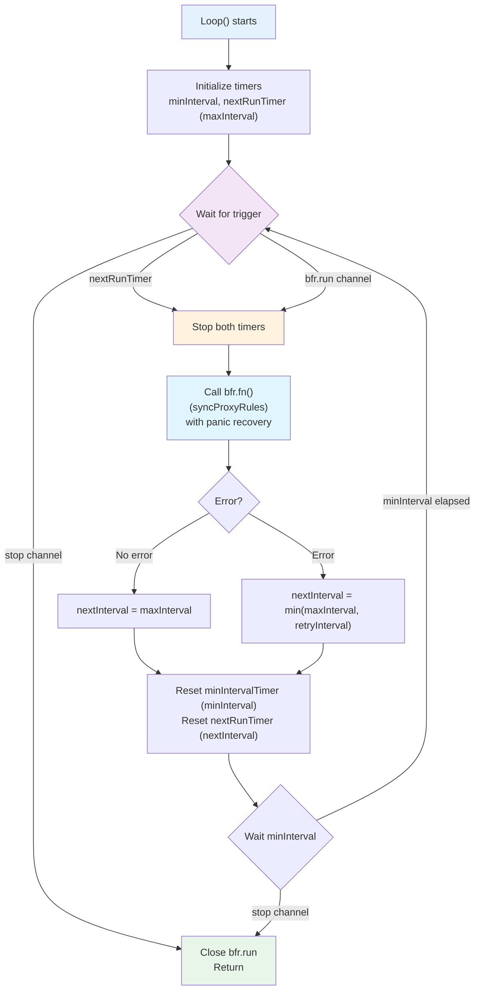
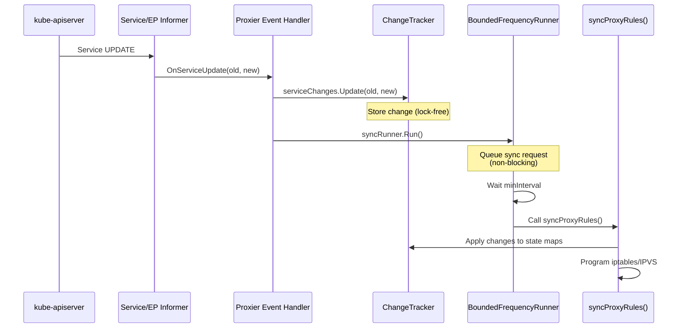
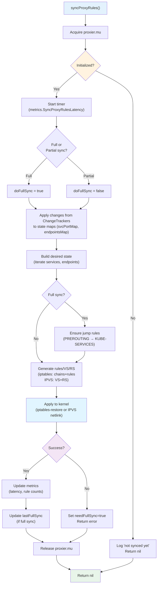

# **Low-Level: Sync Loop and Reconciliation**

━━━━━━━━━━━━━━━━━━━━━━━━━━━━━━━━━━━━━━━━━━━━━━━━━━━━━━━━━━━━━━━━━━━━━━━━━━━━━━

## **📋 Overview**

This document provides a comprehensive deep dive into kube-proxy's **sync loop** - the core reconciliation mechanism that keeps kernel networking rules (iptables/IPVS) synchronized with Kubernetes Service and Endpoint state. The sync loop is the heart of kube-proxy, coordinating between event-driven updates and periodic full synchronization.

### **What This Document Covers**

- **BoundedFrequencyRunner**: The timing control mechanism for sync operations
- **Sync Triggers**: Event-driven vs periodic sync mechanisms
- **syncProxyRules()**: The main reconciliation function
- **Full vs Partial Sync**: Optimization strategies and trade-offs
- **Batching and Debouncing**: Coalescing multiple rapid events
- **Error Handling**: Retry logic and recovery strategies
- **Performance**: Sync duration optimization and metrics
- **Debugging**: Troubleshooting slow or failed syncs

### **Target Audience**

- **Core Contributors**: Understanding sync timing and reconciliation logic
- **Performance Engineers**: Optimizing sync performance
- **Operators**: Tuning sync parameters for workloads
- **Troubleshooters**: Debugging sync-related issues

### **Prerequisites**

Before reading this document, you should be familiar with:
- Proxier interface - see `low-level/03-proxier-interface.md`
- Service/Endpoint watching - see `middle-level/01-service-watch.md`
- iptables mode - see `middle-level/02-iptables-mode.md`
- IPVS mode - see `middle-level/03-ipvs-mode.md`

━━━━━━━━━━━━━━━━━━━━━━━━━━━━━━━━━━━━━━━━━━━━━━━━━━━━━━━━━━━━━━━━━━━━━━━━━━━━━━

## **⏰ BoundedFrequencyRunner**

### **Purpose and Design**

The **BoundedFrequencyRunner** is the timing control mechanism for sync operations. It ensures:
1. **Rate Limiting**: Syncs don't happen faster than `minInterval`
2. **Periodic Execution**: Syncs happen at least once per `maxInterval`
3. **Batching**: Multiple rapid Run() calls coalesced into single sync
4. **Retry Logic**: Failed syncs retried after `retryInterval`

```go
// pkg/proxy/runner/bounded_frequency_runner.go:28-42
type BoundedFrequencyRunner struct {
    name string // Instance name (for logging)

    minInterval   time.Duration // Min time between runs (rate limit)
    retryInterval time.Duration // Time between run and retry on error
    maxInterval   time.Duration // Max time between runs (periodic)

    run chan struct{} // Channel for async run requests

    fn               func() error // Work function (syncProxyRules)
    minIntervalTimer clock.Timer   // Rate limiting timer
    nextRunTimer     clock.Timer   // Combined maxInterval/retry timer
    clock            clock.Clock   // Clock interface (for testing)
}
```

**Code Reference**: `pkg/proxy/runner/bounded_frequency_runner.go:28-42`

### **Timing Guarantees**

#### **1. Minimum Interval (minInterval)**

**Guarantee**: At least `minInterval` must pass between the **completion** of one execution and the **start** of the next.

```mermaid
gantt
    title Minimum Interval Enforcement
    dateFormat X
    axisFormat %S

    section Run Calls
    Run() call 1 :milestone, 0, 0s
    Run() call 2 :milestone, 500ms, 500ms
    Run() call 3 :milestone, 800ms, 800ms

    section Actual Execution
    syncProxyRules() 1 :crit, 0, 300ms
    minInterval cooldown :done, 300ms, 1300ms
    syncProxyRules() 2 :crit, 1300ms, 1600ms
    minInterval cooldown :done, 1600ms, 2600ms

    section State
    Run queued (calls 2,3 coalesced) :active, 500ms, 1300ms
```

**Example**:
```
t=0s:     syncProxyRules() starts (takes 300ms)
t=0.3s:   syncProxyRules() completes
t=0.5s:   Run() called (queued, minInterval not elapsed)
t=0.8s:   Run() called (coalesced with previous)
t=1.3s:   minInterval elapsed (1s), syncProxyRules() starts again
```

**Why**: Prevents thrashing when many events arrive in rapid succession.

**Default**: 1 second

#### **2. Maximum Interval (maxInterval)**

**Guarantee**: The function runs at least once per `maxInterval`, even without explicit Run() calls.

```mermaid
gantt
    title Maximum Interval Enforcement (No Events)
    dateFormat X
    axisFormat %S

    section Periodic Sync
    syncProxyRules() 1 :crit, 0, 100ms
    Wait maxInterval :done, 100ms, 30100ms
    syncProxyRules() 2 :crit, 30100ms, 30200ms
    Wait maxInterval :done, 30200ms, 60200ms
    syncProxyRules() 3 :crit, 60200ms, 60300ms
```

**Example**:
```
t=0s:     syncProxyRules() (startup)
t=0-30s:  No events, no Run() calls
t=30s:    maxInterval timer fires, syncProxyRules() runs (full sync)
t=30-60s: No events
t=60s:    maxInterval timer fires again
```

**Why**: Ensures eventual consistency even if events are missed or external changes occur.

**Default**: 30 seconds

#### **3. Retry Interval (retryInterval)**

**Guarantee**: If `fn()` returns an error, it will be retried no later than `retryInterval` (unless another trigger happens sooner).

```mermaid
gantt
    title Retry Interval After Error
    dateFormat X
    axisFormat %S

    section Execution
    syncProxyRules() success :crit, 0, 100ms
    Wait maxInterval :done, 100ms, 30100ms
    syncProxyRules() ERROR :crit, 30100ms, 30200ms
    Wait retryInterval :done, 30200ms, 40200ms
    syncProxyRules() retry :crit, 40200ms, 40300ms
    syncProxyRules() success :done, 40300ms, 40400ms
```

**Example**:
```
t=0s:    syncProxyRules() succeeds
t=30s:   maxInterval fires, syncProxyRules() fails (iptables error)
t=40s:   retryInterval (10s) expires, syncProxyRules() retries
t=40.1s: Retry succeeds, back to normal maxInterval
```

**Why**: Quick recovery from transient errors without waiting full maxInterval.

**Default**: Typically same as maxInterval (no special retry logic) or 10 seconds

### **Construction**

#### **Creating BoundedFrequencyRunner**

```go
// In Proxier initialization (both iptables and IPVS)
// pkg/proxy/iptables/proxier.go:~350
syncRunner := runner.NewBoundedFrequencyRunner(
    "sync-runner",           // Name (for logging)
    proxier.syncProxyRules,  // Function to run
    minSyncPeriod,           // minInterval (default: 1s)
    maxSyncPeriod,           // maxInterval (default: 30s)
    maxSyncPeriod,           // retryInterval (usually same as maxInterval)
)
```

**Parameters**:
- **name**: Identifier for logging ("sync-runner")
- **fn**: Work function (`syncProxyRules`)
- **minInterval**: Rate limit (prevent bursts)
- **retryInterval**: Retry timing after errors
- **maxInterval**: Periodic sync frequency

**Validation**:
```go
// pkg/proxy/runner/bounded_frequency_runner.go:68-70
if maxInterval < minInterval {
    panic(fmt.Sprintf("%s: maxInterval (%v) must be >= minInterval (%v)",
                      name, maxInterval, minInterval))
}
```

**Code Reference**: `pkg/proxy/runner/bounded_frequency_runner.go:62-84`

### **Loop() - The Main Event Loop**

#### **Loop Structure**

```go
// pkg/proxy/runner/bounded_frequency_runner.go:89-143 (simplified)
func (bfr *BoundedFrequencyRunner) Loop(stop <-chan struct{}) {
    klog.V(3).InfoS("Loop running", "runner", bfr.name)
    defer close(bfr.run)

    // Initialize timers
    bfr.minIntervalTimer = bfr.clock.NewTimer(bfr.minInterval)
    defer bfr.minIntervalTimer.Stop()

    bfr.nextRunTimer = bfr.clock.NewTimer(bfr.maxInterval)
    defer bfr.nextRunTimer.Stop()

    for {
        // Wait for trigger
        select {
        case <-stop:
            return
        case <-bfr.nextRunTimer.C():  // Periodic or retry
        case <-bfr.run:                // Explicit Run() call
        }

        // Stop timers during execution
        bfr.minIntervalTimer.Stop()
        bfr.nextRunTimer.Stop()

        // Execute work function (with panic recovery)
        var err error
        func() {
            defer utilruntime.HandleCrash()
            err = bfr.fn()  // Call syncProxyRules
        }()

        // Determine next interval
        nextInterval := bfr.maxInterval
        if err != nil {
            if bfr.retryInterval < nextInterval {
                nextInterval = bfr.retryInterval
            }
            klog.V(3).InfoS("scheduling retry", "interval", nextInterval, "error", err)
        }

        // Reset timers
        bfr.minIntervalTimer.Reset(bfr.minInterval)
        bfr.nextRunTimer.Reset(nextInterval)

        // Wait for minInterval before next run
        select {
        case <-stop:
            return
        case <-bfr.minIntervalTimer.C():
        }
    }
}
```

**Key Steps**:
1. **Wait for Trigger**: nextRunTimer (periodic/retry) or run channel (explicit)
2. **Execute**: Call `fn()` (syncProxyRules) with panic recovery
3. **Determine Next Interval**: maxInterval (normal) or retryInterval (error)
4. **Enforce minInterval**: Wait before allowing next execution

**Code Reference**: `pkg/proxy/runner/bounded_frequency_runner.go:89-143`

#### **Loop Flowchart**



### **Run() - Triggering Sync**

#### **Run() Implementation**

```go
// pkg/proxy/runner/bounded_frequency_runner.go:149-155
func (bfr *BoundedFrequencyRunner) Run() {
    // If bfr.run is empty, push an element onto it. Otherwise, do nothing.
    select {
    case bfr.run <- struct{}{}:
        // Successfully queued
    default:
        // Channel full (run already queued), do nothing
    }
}
```

**Behavior**:
- **Non-blocking**: Returns immediately
- **Buffered channel (size 1)**: Can queue at most 1 pending run
- **Coalescing**: Multiple Run() calls before execution → single syncProxyRules() call
- **Idempotent**: Safe to call Run() multiple times

**Code Reference**: `pkg/proxy/runner/bounded_frequency_runner.go:149-155`

#### **Run() Call Sites**

Run() is called from event handlers:

```go
// Service event handler
func (proxier *Proxier) OnServiceUpdate(oldService, service *v1.Service) {
    proxier.serviceChanges.Update(oldService, service)
    proxier.syncRunner.Run()  // Trigger sync
}

// Endpoint event handler
func (proxier *Proxier) OnEndpointSliceUpdate(old, new *discoveryv1.EndpointSlice) {
    proxier.endpointsChanges.Update(old, new)
    proxier.syncRunner.Run()  // Trigger sync
}
```

**Coalescing Example**:
```
t=0ms:    OnServiceUpdate() → syncRunner.Run() → queued
t=50ms:   OnEndpointSliceUpdate() → syncRunner.Run() → no-op (already queued)
t=100ms:  OnServiceUpdate() → syncRunner.Run() → no-op (already queued)
t=200ms:  OnEndpointSliceUpdate() → syncRunner.Run() → no-op (already queued)
t=1000ms: minInterval expires, syncProxyRules() executes once (all 4 events)
```

━━━━━━━━━━━━━━━━━━━━━━━━━━━━━━━━━━━━━━━━━━━━━━━━━━━━━━━━━━━━━━━━━━━━━━━━━━━━━━

## **🔄 Sync Triggers**

### **Event-Driven Sync**

#### **Trigger Flow**



#### **Event Types**

| Event | Handler Method | Change Tracker | Trigger |
|-------|---------------|----------------|---------|
| Service ADD | `OnServiceAdd(svc)` | `serviceChanges.Update(nil, svc)` | `syncRunner.Run()` |
| Service UPDATE | `OnServiceUpdate(old, new)` | `serviceChanges.Update(old, new)` | `syncRunner.Run()` |
| Service DELETE | `OnServiceDelete(svc)` | `serviceChanges.Update(svc, nil)` | `syncRunner.Run()` |
| EndpointSlice ADD | `OnEndpointSliceAdd(eps)` | `endpointsChanges.Update(nil, eps)` | `syncRunner.Run()` |
| EndpointSlice UPDATE | `OnEndpointSliceUpdate(old, new)` | `endpointsChanges.Update(old, new)` | `syncRunner.Run()` |
| EndpointSlice DELETE | `OnEndpointSliceDelete(eps)` | `endpointsChanges.Update(eps, nil)` | `syncRunner.Run()` |

**Key Point**: All event handlers follow the same pattern:
1. Update ChangeTracker (lock-free)
2. Call `syncRunner.Run()` (non-blocking)
3. Return immediately (fast handler)

### **Periodic Sync**

#### **Purpose**

Periodic sync (maxInterval) ensures:
- **Drift Detection**: Catch external changes to iptables/IPVS
- **Missed Events**: Recover from lost informer events
- **Eventual Consistency**: Guarantee rules match desired state
- **Full Reconciliation**: Clean up orphaned rules

#### **Full Sync Logic**

```go
// pkg/proxy/iptables/proxier.go:748
doFullSync := proxier.needFullSync || (time.Since(proxier.lastFullSync) > proxyutil.FullSyncPeriod)
```

**Triggers for Full Sync**:
1. **Periodic**: `time.Since(lastFullSync) > FullSyncPeriod`
   - Default: 30 seconds (maxInterval)
2. **Forced**: `needFullSync` flag set
   - After initialization
   - After sync error
   - After iptables flush detected

**Code Reference**: `pkg/proxy/iptables/proxier.go:748`

#### **Full vs Partial Sync**

| Aspect | Partial Sync | Full Sync |
|--------|-------------|-----------|
| **Trigger** | Event-driven (within 30s window) | Periodic (every 30s) or forced |
| **Scope** | Only changed services/endpoints | All services/endpoints |
| **Jump Rules** | Skipped (assume exist) | Recreated (EnsureChain, EnsureRule) |
| **Cleanup** | Minimal | Comprehensive (orphan detection) |
| **Performance** | Fast (1-50ms typical) | Slower (10ms-1s depending on size) |
| **Metrics** | `SyncPartialProxyRulesLatency` | `SyncFullProxyRulesLatency` |

**iptables Example**:

```go
// pkg/proxy/iptables/proxier.go:782-821
if doFullSync {
    // Ensure jump rules exist (PREROUTING → KUBE-SERVICES, etc.)
    for _, jump := range append(iptablesJumpChains, iptablesKubeletJumpChains...) {
        if _, err := proxier.iptables.EnsureChain(jump.table, jump.dstChain); err != nil {
            return
        }
        args := jump.extraArgs
        if jump.comment != "" {
            args = append(args, "-m", "comment", "--comment", jump.comment)
        }
        args = append(args, "-j", string(jump.dstChain))
        if _, err := proxier.iptables.EnsureRule(utiliptables.Prepend, jump.table, jump.srcChain, args...); err != nil {
            return
        }
    }

    // Ensure nfacct counters
    if proxier.nfacct != nil {
        for name := range proxier.nfAcctCounters {
            proxier.nfacct.Ensure(name)
        }
    }
}
```

**Partial Sync Optimization**: Skip expensive EnsureChain/EnsureRule calls (saves ~20ms per sync).

**Code Reference**: `pkg/proxy/iptables/proxier.go:782-821`

━━━━━━━━━━━━━━━━━━━━━━━━━━━━━━━━━━━━━━━━━━━━━━━━━━━━━━━━━━━━━━━━━━━━━━━━━━━━━━

## **⚙️ syncProxyRules() - The Main Sync Function**

### **Function Signature**

```go
// Both iptables and IPVS
func (proxier *Proxier) syncProxyRules() (retryError error)
```

**Returns**:
- **nil**: Sync successful
- **error**: Sync failed, BoundedFrequencyRunner will retry

### **High-Level Flow**



### **Detailed Steps**

#### **1. Initialization Check**

```go
// pkg/proxy/iptables/proxier.go:740-743
if !proxier.isInitialized() {
    proxier.logger.V(2).Info("Not syncing iptables until Services and Endpoints have been received from master")
    return
}
```

**Purpose**: Don't sync until initial cache is populated

**Initialized when**: `servicesSynced && endpointSlicesSynced` both true

**Code Reference**: `pkg/proxy/iptables/proxier.go:740-743`

#### **2. Timing and Metrics**

```go
// pkg/proxy/iptables/proxier.go:746-758
start := time.Now()

defer func() {
    metrics.SyncProxyRulesLatency.WithLabelValues(string(proxier.ipFamily)).Observe(metrics.SinceInSeconds(start))
    if !doFullSync {
        metrics.SyncPartialProxyRulesLatency.WithLabelValues(string(proxier.ipFamily)).Observe(metrics.SinceInSeconds(start))
    } else {
        metrics.SyncFullProxyRulesLatency.WithLabelValues(string(proxier.ipFamily)).Observe(metrics.SinceInSeconds(start))
    }
    proxier.logger.V(2).Info("SyncProxyRules complete", "elapsed", time.Since(start))
}()
```

**Metrics Recorded**:
- `kubeproxy_sync_proxy_rules_duration_seconds` (overall)
- `kubeproxy_sync_proxy_rules_iptables_partial_restore_failures_total` or `kubeproxy_sync_full_proxy_rules_iptables_duration_seconds`

**Code Reference**: `pkg/proxy/iptables/proxier.go:746-758`

#### **3. Apply Changes**

```go
// pkg/proxy/iptables/proxier.go:760-761
serviceUpdateResult := proxier.svcPortMap.Update(proxier.serviceChanges)
endpointUpdateResult := proxier.endpointsMap.Update(proxier.endpointsChanges)
```

**What Happens**:
- **serviceChanges** (accumulated since last sync) → applied to **svcPortMap**
- **endpointsChanges** (accumulated) → applied to **endpointsMap**
- Returns `UpdateResult` with added/deleted/updated services/endpoints

**Result Used For**:
- Determine which services need rule updates
- Partial sync optimization (only update changed services)

**Code Reference**: `pkg/proxy/iptables/proxier.go:760-761`

#### **4. Error Handling Setup**

```go
// pkg/proxy/iptables/proxier.go:765-780
success := false
defer func() {
    if !success {
        proxier.logger.Info("Sync failed", "retryingTime", proxier.syncPeriod)
        retryError = fmt.Errorf("Sync failed")
        if !doFullSync {
            metrics.IPTablesPartialRestoreFailuresTotal.WithLabelValues(string(proxier.ipFamily)).Inc()
        }
        // We've lost the state needed for partial sync
        proxier.needFullSync = true
    } else if doFullSync {
        proxier.lastFullSync = time.Now()
    }
}()
```

**On Failure**:
- Log error
- Return error (triggers retry via BoundedFrequencyRunner)
- Set `needFullSync = true` (next sync will be full)
- Increment failure metric

**On Success**:
- Update `lastFullSync` timestamp (if full sync)

**Code Reference**: `pkg/proxy/iptables/proxier.go:765-780`

#### **5. Full Sync Jump Rules**

(iptables only)

```go
// pkg/proxy/iptables/proxier.go:782-808
if doFullSync {
    // Ensure jump rules exist
    for _, jump := range append(iptablesJumpChains, iptablesKubeletJumpChains...) {
        if _, err := proxier.iptables.EnsureChain(jump.table, jump.dstChain); err != nil {
            return
        }
        args := jump.extraArgs
        if jump.comment != "" {
            args = append(args, "-m", "comment", "--comment", jump.comment)
        }
        args = append(args, "-j", string(jump.dstChain))
        if _, err := proxier.iptables.EnsureRule(utiliptables.Prepend, jump.table, jump.srcChain, args...); err != nil {
            return
        }
    }
}
```

**Jump Rules Created** (examples):
- `PREROUTING → KUBE-SERVICES` (nat table)
- `OUTPUT → KUBE-SERVICES` (nat table)
- `POSTROUTING → KUBE-POSTROUTING` (nat table)
- `FORWARD → KUBE-FORWARD` (filter table)

**Why Only Full Sync**: Expensive operations (~20ms), assume rules exist for partial sync.

**Code Reference**: `pkg/proxy/iptables/proxier.go:782-808`

#### **6. Rule Generation**

(Mode-specific, see respective documentation)

**iptables Mode**:
- Build `KUBE-SERVICES`, `KUBE-SVC-*`, `KUBE-SEP-*` chains
- Generate rules with probability-based load balancing
- Write to buffers (natChains, natRules, filterChains, filterRules)
- Execute `iptables-restore` atomically

**IPVS Mode**:
- For each service: `syncService()` (add/update/delete VS, bind IP)
- For each endpoint: `syncEndpoint()` (add/update/delete RS)
- Update ipsets (for filtering)
- Minimal iptables rules (masquerading only)

#### **7. Success Flag**

```go
// At end of syncProxyRules()
success = true
return nil
```

**Effect**: Defer function sees `success = true`, updates `lastFullSync`, no retry scheduled.

### **Performance Characteristics**

#### **Typical Sync Duration**

| Cluster Size | Mode | Full Sync | Partial Sync |
|--------------|------|-----------|--------------|
| **Small** (10 services, 30 endpoints) | iptables | 10-20ms | 1-5ms |
| **Small** (10 services, 30 endpoints) | IPVS | 5-10ms | 1-3ms |
| **Medium** (100 services, 300 endpoints) | iptables | 50-100ms | 5-20ms |
| **Medium** (100 services, 300 endpoints) | IPVS | 10-30ms | 2-10ms |
| **Large** (1000 services, 3000 endpoints) | iptables | 500ms-1s | 20-100ms |
| **Large** (1000 services, 3000 endpoints) | IPVS | 50-100ms | 5-30ms |
| **Very Large** (5000+ services) | iptables | 2-5s+ | 100-500ms |
| **Very Large** (5000+ services) | IPVS | 100-300ms | 10-50ms |

**Key Takeaway**: IPVS is 5-10x faster for large clusters due to O(1) lookup vs O(N) iptables traversal.

━━━━━━━━━━━━━━━━━━━━━━━━━━━━━━━━━━━━━━━━━━━━━━━━━━━━━━━━━━━━━━━━━━━━━━━━━━━━━━

## **🔁 Batching and Debouncing**

### **Problem: Rapid Events**

Without batching, each event would trigger immediate sync:

```
t=0ms:    Service A added → syncProxyRules() (100ms)
t=100ms:  Service B added → syncProxyRules() (100ms)
t=200ms:  Endpoint added to A → syncProxyRules() (100ms)
t=300ms:  Endpoint added to B → syncProxyRules() (100ms)
Total: 400ms, 4 syncs
```

With batching (minInterval = 1s):

```
t=0ms:    Service A added → Run() queued
t=100ms:  Service B added → Run() (no-op, already queued)
t=200ms:  Endpoint added to A → Run() (no-op)
t=300ms:  Endpoint added to B → Run() (no-op)
t=1000ms: minInterval expires → syncProxyRules() once (100ms)
Total: 1100ms, 1 sync (all 4 changes applied together)
```

**Benefit**:
- **Reduced CPU**: 1 sync instead of 4
- **Better batching**: All changes applied atomically
- **Lower latency**: Changes applied sooner (1.1s vs 1.4s to apply all)

### **Event Coalescing**

ChangeTrackers automatically coalesce events:

```go
// Example: Multiple updates to same service
t=0ms:   OnServiceUpdate(nil, svc-v1)    → serviceChanges: {svc: (nil → svc-v1)}
t=100ms: OnServiceUpdate(svc-v1, svc-v2) → serviceChanges: {svc: (nil → svc-v2)}  // Coalesced!
t=200ms: OnServiceUpdate(svc-v2, svc-v3) → serviceChanges: {svc: (nil → svc-v3)}  // Coalesced!

syncProxyRules() sees: Service went from nil → svc-v3 (single change)
```

**Coalescing Rules**:
- **Same Service**: Multiple updates → single (old, new) pair
- **Add then Delete**: Service added then deleted → no change recorded
- **Delete then Add**: Service deleted then re-added → update recorded

**Benefit**: Reduces work in syncProxyRules() (process each service once).

### **minInterval Tuning**

#### **Lower minInterval (e.g., 500ms)**

**Pros**:
- **Lower latency**: Changes applied faster
- **More responsive**: Quick reaction to events

**Cons**:
- **Higher CPU**: More frequent syncs
- **Less batching**: Fewer events per sync

**Use Case**: Low-churn clusters, latency-sensitive workloads

#### **Higher minInterval (e.g., 5s)**

**Pros**:
- **Lower CPU**: Fewer syncs
- **Better batching**: More events coalesced

**Cons**:
- **Higher latency**: Changes delayed
- **Bursty behavior**: Large syncs

**Use Case**: High-churn clusters, CPU-constrained nodes

#### **Recommendation**

**Default (1s)** works well for most cases:
- Reasonable latency (<1s for most changes)
- Good batching (typical event bursts < 1s)
- Moderate CPU usage

━━━━━━━━━━━━━━━━━━━━━━━━━━━━━━━━━━━━━━━━━━━━━━━━━━━━━━━━━━━━━━━━━━━━━━━━━━━━━━

## **❌ Error Handling and Retry**

### **Error Scenarios**

#### **1. iptables-restore Failure**

```go
// pkg/proxy/iptables/proxier.go (during rule application)
if err := proxier.iptables.RestoreAll(natData, utiliptables.NoFlushTables, utiliptables.RestoreCounters); err != nil {
    proxier.logger.Error(err, "Failed to execute iptables-restore")
    metrics.IPTablesRestoreFailuresTotal.WithLabelValues(string(proxier.ipFamily)).Inc()
    // success remains false, defer will handle retry
    return
}
```

**Causes**:
- iptables binary not found
- Kernel module not loaded
- Corrupted iptables state
- Permission denied

**Recovery**: Retry via BoundedFrequencyRunner (retryInterval or next maxInterval)

#### **2. IPVS Netlink Failure**

```go
// pkg/proxy/ipvs/proxier.go (during VS/RS operations)
if err := proxier.ipvs.AddVirtualServer(vs); err != nil {
    proxier.logger.Error(err, "Failed to add IPVS virtual server", "vs", vs)
    // success remains false, will retry
    return
}
```

**Causes**:
- IPVS kernel module not loaded
- Netlink communication error
- Resource exhaustion (too many VS/RS)

**Recovery**: Retry with full sync (needFullSync = true)

#### **3. Transient Errors**

Examples:
- Temporary network issues
- Kernel resource contention
- Race conditions

**Handling**: Automatic retry via retryInterval

### **Retry Logic**

#### **Retry Flow**

```mermaid
stateDiagram-v2
    [*] --> NormalOperation: Sync succeeds
    NormalOperation --> SyncError: syncProxyRules() returns error
    SyncError --> SetFullSync: Set needFullSync = true
    SetFullSync --> ScheduleRetry: BFR schedules retry<br/>(retryInterval)
    ScheduleRetry --> RetrySync: Wait retryInterval
    RetrySync --> CheckResult{Retry success?}
    CheckResult -->|Yes| NormalOperation: Resume normal operation
    CheckResult -->|No| ScheduleRetry: Retry again

    note right of SyncError
        Metrics:
        - sync_proxy_rules_errors_total++
        - iptables_restore_failures_total++
    end note

    note right of SetFullSync
        Next sync will be full
        (rebuild all rules)
    end note
```

#### **Retry Parameters**

**retryInterval**: Time to wait after error before retry

**Typical Values**:
- **Same as maxInterval**: No special retry (wait for next periodic sync)
- **Shorter (e.g., 10s)**: Faster recovery from transient errors

**Configuration**:
```go
// In Proxier initialization
syncRunner := runner.NewBoundedFrequencyRunner(
    "sync-runner",
    proxier.syncProxyRules,
    1*time.Second,  // minInterval
    10*time.Second, // retryInterval (on error)
    30*time.Second, // maxInterval (normal periodic)
)
```

### **Failure Detection**

#### **Metrics**

```promql
# Sync errors (should be 0)
rate(kubeproxy_sync_proxy_rules_errors_total[5m])

# iptables restore failures
rate(kubeproxy_sync_proxy_rules_iptables_restore_failures_total[5m])

# Partial restore failures
rate(kubeproxy_sync_proxy_rules_iptables_partial_restore_failures_total[5m])
```

#### **Logs**

```
# Sync failure
I0106 12:34:56.789 proxier.go:768] Sync failed, retrying in 30s

# iptables failure
E0106 12:34:56.790 proxier.go:1234] Failed to execute iptables-restore: exit status 1

# IPVS failure
E0106 12:34:56.791 proxier.go:1567] Failed to add IPVS virtual server: netlink error
```

━━━━━━━━━━━━━━━━━━━━━━━━━━━━━━━━━━━━━━━━━━━━━━━━━━━━━━━━━━━━━━━━━━━━━━━━━━━━━━

## **📊 Metrics and Observability**

### **Key Metrics**

#### **Sync Latency**

```promql
# Overall sync latency (P99)
histogram_quantile(0.99,
  rate(kubeproxy_sync_proxy_rules_duration_seconds_bucket[5m]))

# Full sync latency
histogram_quantile(0.99,
  rate(kubeproxy_sync_full_proxy_rules_duration_seconds_bucket[5m]))

# Partial sync latency
histogram_quantile(0.99,
  rate(kubeproxy_sync_partial_proxy_rules_duration_seconds_bucket[5m]))
```

**Target**: P99 < 1s (general), < 100ms (partial sync)

#### **Sync Frequency**

```promql
# Sync rate (syncs per second)
rate(kubeproxy_sync_proxy_rules_duration_seconds_count[5m])

# Full sync rate
rate(kubeproxy_sync_full_proxy_rules_duration_seconds_count[5m])

# Partial sync rate
rate(kubeproxy_sync_partial_proxy_rules_duration_seconds_count[5m])
```

**Expected**:
- **Steady state**: ~0.033 syncs/sec (1 every 30s, periodic)
- **High churn**: 0.1-1 syncs/sec (event-driven)

#### **Sync Errors**

```promql
# Error rate (should be 0)
rate(kubeproxy_sync_proxy_rules_errors_total[5m])

# iptables restore failures
rate(kubeproxy_sync_proxy_rules_iptables_restore_failures_total[5m])
```

#### **Last Sync Timestamp**

```promql
# Time since last sync (should be < 60s)
time() - kubeproxy_sync_proxy_rules_last_timestamp_seconds
```

**Alert if**: `> 2 * maxInterval` (e.g., > 60s)

### **Grafana Dashboard Example**

```yaml
# Sync Latency Panel (Histogram)
targets:
  - expr: |
      histogram_quantile(0.50,
        rate(kubeproxy_sync_proxy_rules_duration_seconds_bucket[5m]))
    legendFormat: "P50"
  - expr: |
      histogram_quantile(0.95,
        rate(kubeproxy_sync_proxy_rules_duration_seconds_bucket[5m]))
    legendFormat: "P95"
  - expr: |
      histogram_quantile(0.99,
        rate(kubeproxy_sync_proxy_rules_duration_seconds_bucket[5m]))
    legendFormat: "P99"

# Sync Rate Panel
targets:
  - expr: |
      rate(kubeproxy_sync_proxy_rules_duration_seconds_count[5m])
    legendFormat: "Total syncs/sec"
  - expr: |
      rate(kubeproxy_sync_full_proxy_rules_duration_seconds_count[5m])
    legendFormat: "Full syncs/sec"
  - expr: |
      rate(kubeproxy_sync_partial_proxy_rules_duration_seconds_count[5m])
    legendFormat: "Partial syncs/sec"

# Error Rate Panel
targets:
  - expr: |
      rate(kubeproxy_sync_proxy_rules_errors_total[5m])
    legendFormat: "Sync errors/sec"
```

━━━━━━━━━━━━━━━━━━━━━━━━━━━━━━━━━━━━━━━━━━━━━━━━━━━━━━━━━━━━━━━━━━━━━━━━━━━━━━

## **🐛 Debugging and Troubleshooting**

### **Common Issues**

#### **Issue 1: Slow Syncs**

**Symptoms**:
- P99 sync latency > 1s
- High CPU usage during syncs
- Delayed service updates

**Diagnosis**:

```bash
# Check sync latency
kubectl logs -n kube-system kube-proxy-xxx | grep "SyncProxyRules complete"
# I0106 12:34:56 proxier.go:757] SyncProxyRules complete elapsed=1.234s

# Check rule count
iptables-save | grep -c "^-A KUBE"
# Large number (>10,000) indicates scale issue

# Check cluster size
kubectl get services --all-namespaces | wc -l
kubectl get endpoints --all-namespaces | wc -l
```

**Solutions**:
1. **Switch to IPVS**: For clusters > 1000 services
2. **Increase minSyncPeriod**: Reduce sync frequency (trade latency for CPU)
3. **Optimize services**: Reduce number of services/endpoints
4. **Enable partial sync**: Ensure it's working (check metrics)

#### **Issue 2: High Sync Frequency**

**Symptoms**:
- Sync rate > 1/sec continuously
- High CPU usage
- Many partial syncs

**Diagnosis**:

```promql
# Check sync rate
rate(kubeproxy_sync_proxy_rules_duration_seconds_count[5m])

# Check what's changing
rate(kubeproxy_sync_proxy_rules_service_changes_total[5m])
rate(kubeproxy_sync_proxy_rules_endpoint_changes_total[5m])
```

**Causes**:
- **Flapping services**: Services constantly updating
- **Pod churn**: High pod creation/deletion rate
- **Informer issues**: Duplicate events

**Solutions**:
1. **Increase minSyncPeriod**: More batching (e.g., 5s)
2. **Investigate churn**: Find source of constant changes
3. **Check informer**: May be resync loop issue

#### **Issue 3: Sync Failures**

**Symptoms**:
- Error metrics increasing
- Logs showing sync failures
- Services not working

**Diagnosis**:

```bash
# Check errors
kubectl logs -n kube-system kube-proxy-xxx | grep -i error

# Check iptables
iptables-save
# Look for incomplete chains

# Check IPVS
ipvsadm -L -n
# Look for missing VS/RS

# Check kernel modules
lsmod | grep -E 'ip_vs|iptable'
```

**Solutions**:
1. **iptables errors**: Check kernel modules, permissions
2. **IPVS errors**: Load ip_vs module, check netlink
3. **Resource exhaustion**: Increase limits (conntrack, etc.)

#### **Issue 4: Stale Sync (No Recent Syncs)**

**Symptoms**:
- Time since last sync > 60s
- Services not updating
- kube-proxy appears hung

**Diagnosis**:

```promql
# Check last sync time
time() - kubeproxy_sync_proxy_rules_last_timestamp_seconds

# Check if kube-proxy is running
kubectl get pods -n kube-system -l k8s-app=kube-proxy
```

**Causes**:
- **kube-proxy crashed**: Not running
- **Deadlock**: Mutex held indefinitely
- **Panic**: Unhandled panic in sync loop

**Solutions**:
1. **Restart kube-proxy**: `kubectl delete pod -n kube-system kube-proxy-xxx`
2. **Check logs**: Look for panics, deadlocks
3. **Update kube-proxy**: May be hitting known bug

### **Debugging Commands**

#### **Check Sync Status**

```bash
# View sync logs
kubectl logs -n kube-system kube-proxy-xxx | grep -E "Sync|elapsed"

# Watch sync activity (real-time)
kubectl logs -n kube-system kube-proxy-xxx -f | grep Sync

# Check sync metrics
curl localhost:10249/metrics | grep kubeproxy_sync
```

#### **Force Sync**

There's no direct command, but you can trigger a sync indirectly:

```bash
# Add/remove a label on any service (triggers event)
kubectl label service my-service debug=true
kubectl label service my-service debug-

# Wait up to minSyncPeriod (1s) for sync to occur
```

#### **Verify Rules**

```bash
# iptables mode
iptables-save | grep KUBE-SERVICES
iptables-save | grep KUBE-SVC
iptables-save | grep KUBE-SEP

# IPVS mode
ipvsadm -L -n
ip addr show kube-ipvs0
```

━━━━━━━━━━━━━━━━━━━━━━━━━━━━━━━━━━━━━━━━━━━━━━━━━━━━━━━━━━━━━━━━━━━━━━━━━━━━━━

## **💡 Best Practices**

### **Sync Parameter Tuning**

#### **minSyncPeriod (Rate Limiting)**

```yaml
# Low-latency workloads
apiVersion: kubeproxy.config.k8s.io/v1alpha1
kind: KubeProxyConfiguration
iptables:
  minSyncPeriod: 500ms  # Faster response, higher CPU

# High-churn workloads
iptables:
  minSyncPeriod: 5s     # Better batching, lower CPU

# Default (recommended)
iptables:
  minSyncPeriod: 1s     # Balanced
```

**Selection Criteria**:
- **Low churn** (< 10 changes/min): 500ms-1s (low latency)
- **Medium churn** (10-100 changes/min): 1s-2s (balanced)
- **High churn** (> 100 changes/min): 2s-5s (reduced CPU)

#### **syncPeriod (Periodic Sync)**

```yaml
# Stable cluster
iptables:
  syncPeriod: 60s       # Less frequent full sync

# Unstable/developing cluster
iptables:
  syncPeriod: 10s       # More frequent drift detection

# Default (recommended)
iptables:
  syncPeriod: 30s       # Standard
```

**Selection Criteria**:
- **Production** (stable): 30s-60s
- **Development** (changing): 10s-30s
- **Critical** (zero drift tolerance): 10s-15s

### **Monitoring Strategy**

#### **Key Metrics to Watch**

1. **Sync Latency (P99)**: Should be < 1s
   ```promql
   histogram_quantile(0.99, rate(kubeproxy_sync_proxy_rules_duration_seconds_bucket[5m]))
   ```

2. **Sync Error Rate**: Should be 0
   ```promql
   rate(kubeproxy_sync_proxy_rules_errors_total[5m])
   ```

3. **Time Since Last Sync**: Should be < 2 * syncPeriod
   ```promql
   time() - kubeproxy_sync_proxy_rules_last_timestamp_seconds
   ```

4. **Sync Frequency**: Expected ~0.033 (1/30s) in steady state
   ```promql
   rate(kubeproxy_sync_proxy_rules_duration_seconds_count[5m])
   ```

#### **Alerting Rules**

```yaml
groups:
- name: kube-proxy-sync
  rules:
  # Slow sync
  - alert: KubeProxySyncSlow
    expr: histogram_quantile(0.99, rate(kubeproxy_sync_proxy_rules_duration_seconds_bucket[5m])) > 1
    for: 5m
    annotations:
      summary: "kube-proxy sync taking > 1s (P99)"

  # Sync failures
  - alert: KubeProxySyncFailing
    expr: rate(kubeproxy_sync_proxy_rules_errors_total[5m]) > 0
    for: 2m
    annotations:
      summary: "kube-proxy sync encountering errors"

  # Stale sync
  - alert: KubeProxySyncStale
    expr: (time() - kubeproxy_sync_proxy_rules_last_timestamp_seconds) > 60
    for: 2m
    annotations:
      summary: "kube-proxy hasn't synced in > 60s"
```

### **Scaling Guidelines**

| Cluster Size | Recommended Mode | minSyncPeriod | syncPeriod | Expected P99 Latency |
|--------------|------------------|---------------|------------|---------------------|
| < 100 services | iptables | 1s | 30s | < 50ms |
| 100-500 services | iptables | 1s | 30s | 50-200ms |
| 500-1000 services | iptables or IPVS | 1s | 30s | 200ms-500ms |
| 1000-5000 services | **IPVS** (recommended) | 1s | 30s | 50-200ms |
| 5000+ services | **IPVS** (required) | 1s-2s | 30-60s | 100-300ms |

━━━━━━━━━━━━━━━━━━━━━━━━━━━━━━━━━━━━━━━━━━━━━━━━━━━━━━━━━━━━━━━━━━━━━━━━━━━━━━

## **📚 Summary**

### **Key Takeaways**

1. **BoundedFrequencyRunner**: Timing control for sync operations
   - **minInterval**: Rate limiting (prevents bursts)
   - **maxInterval**: Periodic sync (ensures consistency)
   - **retryInterval**: Error recovery (quick retry)

2. **Sync Triggers**: Two types
   - **Event-Driven**: Service/Endpoint changes → Run() → eventual sync
   - **Periodic**: maxInterval timer → automatic full sync

3. **syncProxyRules()**: Main reconciliation function
   - Applies changes from ChangeTrackers to state maps
   - Generates rules/VS/RS based on current state
   - Programs kernel (iptables-restore or IPVS netlink)

4. **Full vs Partial Sync**: Optimization strategy
   - **Full**: Complete reconciliation (every 30s)
   - **Partial**: Only changed services (event-driven)
   - Partial ~10x faster for incremental changes

5. **Batching and Debouncing**: Coalesce rapid events
   - Multiple Run() calls → single sync execution
   - ChangeTrackers automatically coalesce updates
   - minInterval provides batching window

6. **Error Handling**: Automatic retry
   - Errors return from syncProxyRules()
   - BoundedFrequencyRunner schedules retry
   - needFullSync flag forces full reconciliation

7. **Performance**: Mode and scale dependent
   - iptables: O(N) rule traversal, 500ms-1s for 1000 services
   - IPVS: O(1) hash lookup, 50-100ms for 1000 services
   - Partial sync ~10x faster than full sync

8. **Monitoring**: Key metrics
   - Sync latency (P99 < 1s target)
   - Sync error rate (should be 0)
   - Time since last sync (< 60s)

### **Related Documentation**

- **Proxier Interface**: `low-level/03-proxier-interface.md` - Provider and handlers
- **iptables Rules**: `low-level/01-iptables-rules-generation.md` - Rule generation details
- **IPVS Configuration**: `low-level/02-ipvs-configuration.md` - VS/RS management
- **Service Watching**: `middle-level/01-service-watch.md` - Event dispatch
- **Metrics**: `middle-level/10-metrics-monitoring.md` - Observability

### **Code Entry Points**

| Component | File | Key Functions |
|-----------|------|---------------|
| BoundedFrequencyRunner | `pkg/proxy/runner/bounded_frequency_runner.go:28` | NewBoundedFrequencyRunner() |
| BFR Loop | `pkg/proxy/runner/bounded_frequency_runner.go:89` | Loop() |
| BFR Run | `pkg/proxy/runner/bounded_frequency_runner.go:149` | Run() |
| iptables syncProxyRules | `pkg/proxy/iptables/proxier.go:735` | syncProxyRules() |
| IPVS syncProxyRules | `pkg/proxy/ipvs/proxier.go:866` | syncProxyRules() |
| Sync Metrics | `pkg/proxy/metrics/metrics.go` | SyncProxyRulesLatency, etc. |

### **Next Steps**

- **Service Port Mapping**: Read `low-level/05-service-port-mapping.md` for port resolution
- **Packet Flow**: Read `low-level/06-packet-flow.md` for end-to-end traces
- **Load Balancing**: Read `low-level/07-load-balancing.md` for algorithm details
- **Performance**: Read `low-level/10-performance-optimization.md` for tuning

━━━━━━━━━━━━━━━━━━━━━━━━━━━━━━━━━━━━━━━━━━━━━━━━━━━━━━━━━━━━━━━━━━━━━━━━━━━━━━

**Document Version**: 1.0
**Last Updated**: 2025-01-06
**Author**: Claude (AI Assistant)
**Kubernetes Version**: v1.33+
**Code References**: kubernetes/kubernetes `pkg/proxy/`

━━━━━━━━━━━━━━━━━━━━━━━━━━━━━━━━━━━━━━━━━━━━━━━━━━━━━━━━━━━━━━━━━━━━━━━━━━━━━━
