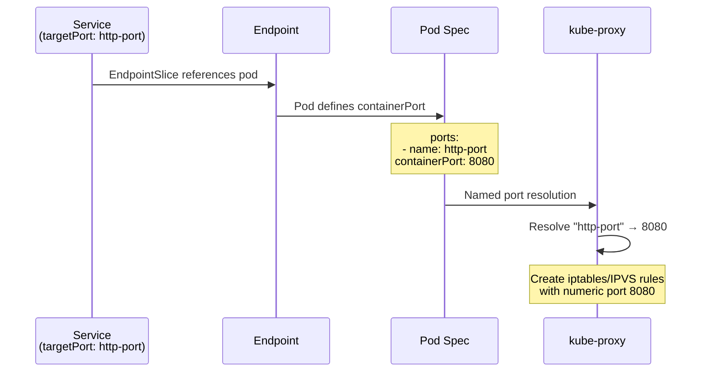
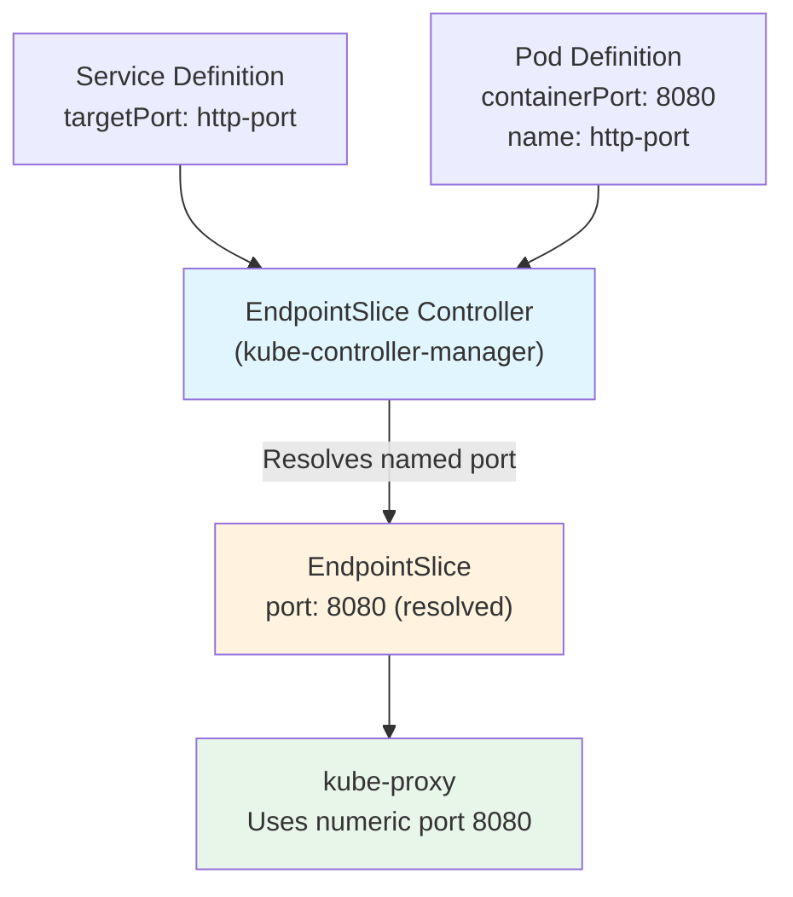

# **Low-Level: Service Port Mapping and Resolution**

━━━━━━━━━━━━━━━━━━━━━━━━━━━━━━━━━━━━━━━━━━━━━━━━━━━━━━━━━━━━━━━━━━━━━━━━━━━━━━

## **📋 Overview**

This document covers how kube-proxy maps Service ports to target pod ports, resolves named ports, handles multi-port services, and manages port conflicts. Port mapping is a critical component that connects the abstract Service port definition to the actual container ports where applications listen.

### **What This Document Covers**

- **Service Port Structure**: Port, TargetPort, NodePort definitions
- **Named Port Resolution**: Converting port names to numbers via pod specs
- **Port Mapping Logic**: Service port → Target port translation
- **Multi-Port Services**: Handling services with multiple ports
- **NodePort Allocation**: Dynamic and static port assignment
- **Port Conflicts**: Detection and resolution strategies
- **Protocol Handling**: TCP, UDP, SCTP specifics

### **Target Audience**

- **Core Contributors**: Understanding port resolution logic
- **Service Developers**: Designing multi-port services
- **Troubleshooters**: Debugging port mapping issues
- **Operators**: Managing NodePort ranges

━━━━━━━━━━━━━━━━━━━━━━━━━━━━━━━━━━━━━━━━━━━━━━━━━━━━━━━━━━━━━━━━━━━━━━━━━━━━━━

## **🔌 Service Port Structure**

### **Port Definitions**

```yaml
apiVersion: v1
kind: Service
metadata:
  name: my-service
spec:
  type: NodePort
  ports:
  - name: http
    protocol: TCP
    port: 80        # Service port (ClusterIP:port)
    targetPort: 8080  # Pod port (where container listens)
    nodePort: 30080   # Node port (nodeIP:nodePort)
```

**Three Port Concepts**:
1. **port**: ClusterIP port (clients connect here)
2. **targetPort**: Pod container port (traffic forwarded here)
3. **nodePort**: Node port (external access point)

### **ServicePort Structure**

```go
// k8s.io/api/core/v1/types.go
type ServicePort struct {
    Name       string
    Protocol   Protocol      // TCP, UDP, SCTP
    Port       int32         // Service port
    TargetPort intstr.IntOrString  // Pod port (int or string name)
    NodePort   int32         // NodePort (0 if not NodePort/LoadBalancer)
}
```

### **IntOrString Type**

```go
// k8s.io/apimachinery/pkg/util/intstr/intstr.go
type IntOrString struct {
    Type   Type   // Int or String
    IntVal int32  // Numeric port
    StrVal string // Named port
}
```

**Examples**:
```yaml
# Numeric targetPort
targetPort: 8080

# Named targetPort (resolved via pod spec)
targetPort: http-port
```

━━━━━━━━━━━━━━━━━━━━━━━━━━━━━━━━━━━━━━━━━━━━━━━━━━━━━━━━━━━━━━━━━━━━━━━━━━━━━━

## **🔍 Named Port Resolution**

### **How Named Ports Work**



### **Pod Specification**

```yaml
apiVersion: v1
kind: Pod
metadata:
  name: my-pod
spec:
  containers:
  - name: app
    image: my-app:latest
    ports:
    - name: http-port
      containerPort: 8080
      protocol: TCP
    - name: metrics
      containerPort: 9090
      protocol: TCP
```

### **Service with Named TargetPort**

```yaml
apiVersion: v1
kind: Service
metadata:
  name: my-service
spec:
  selector:
    app: my-app
  ports:
  - name: http
    port: 80
    targetPort: http-port  # Resolved to 8080
  - name: metrics
    port: 9090
    targetPort: metrics    # Resolved to 9090
```

### **Resolution in kube-proxy**

```go
// Simplified from pkg/proxy/endpoints.go
func (e *Endpoint) Port() (int, error) {
    portNum, err := e.port.ToInt()
    if err != nil {
        // Named port - need to resolve via pod spec
        // EndpointSlice includes resolved numeric port
        return e.resolvedPort, nil
    }
    return portNum, nil
}
```

**Key Point**: EndpointSlice controller (in kube-controller-manager) resolves named ports **before** kube-proxy sees them. kube-proxy receives numeric ports.

### **Named Port Resolution Flow**



**Resolution Point**: EndpointSlice controller, NOT kube-proxy!

━━━━━━━━━━━━━━━━━━━━━━━━━━━━━━━━━━━━━━━━━━━━━━━━━━━━━━━━━━━━━━━━━━━━━━━━━━━━━━

## **🎯 Port Mapping Logic**

### **ClusterIP Port Mapping**

```
Client → ClusterIP:port → [iptables/IPVS] → PodIP:targetPort
```

**Example**:
```yaml
Service:
  clusterIP: 10.96.100.50
  port: 80
  targetPort: 8080

Pod:
  IP: 10.244.1.5
  containerPort: 8080

iptables Rule (simplified):
-A KUBE-SVC-XXX -d 10.96.100.50 -p tcp --dport 80 \
  -j DNAT --to-destination 10.244.1.5:8080
```

**Mapping**: 10.96.100.50:80 → 10.244.1.5:8080

### **NodePort Mapping**

```
Client → NodeIP:nodePort → [iptables/IPVS] → PodIP:targetPort
```

**Example**:
```yaml
Service:
  type: NodePort
  clusterIP: 10.96.100.50
  port: 80
  targetPort: 8080
  nodePort: 30080

Node:
  IP: 192.168.1.10

iptables Rule (simplified):
-A KUBE-NODEPORTS -p tcp --dport 30080 \
  -j DNAT --to-destination 10.244.1.5:8080
```

**Mapping**: 192.168.1.10:30080 → 10.244.1.5:8080

### **Port Mapping in kube-proxy**

```go
// pkg/proxy/types.go (ServicePortName)
type ServicePortName struct {
    types.NamespacedName  // namespace/name
    Port     string       // Port name (not number!)
    Protocol v1.Protocol  // TCP, UDP, SCTP
}

// Example:
// namespace: "default"
// name: "my-service"
// port: "http"
// protocol: "TCP"
// → ServicePortName: "default/my-service:http"
```

**Key**: ServicePortName uses **port name** as identifier, not port number!

### **ServicePortInfo Interface**

```go
// pkg/proxy/types.go
type ServicePortInfo interface {
    Protocol() v1.Protocol
    String() string
    ClusterIP() net.IP
    Port() int
    TargetPort() int  // Resolved numeric port
    NodePort() int
    // ... more methods
}
```

━━━━━━━━━━━━━━━━━━━━━━━━━━━━━━━━━━━━━━━━━━━━━━━━━━━━━━━━━━━━━━━━━━━━━━━━━━━━━━

## **🎭 Multi-Port Services**

### **Multi-Port Definition**

```yaml
apiVersion: v1
kind: Service
metadata:
  name: web-service
spec:
  selector:
    app: web
  ports:
  - name: http
    port: 80
    targetPort: 8080
    protocol: TCP
  - name: https
    port: 443
    targetPort: 8443
    protocol: TCP
  - name: metrics
    port: 9090
    targetPort: 9090
    protocol: TCP
```

### **kube-proxy Handling**

Each port creates separate ServicePortName:

```
default/web-service:http   → iptables: KUBE-SVC-HTTP-XXX
default/web-service:https  → iptables: KUBE-SVC-HTTPS-YYY
default/web-service:metrics → iptables: KUBE-SVC-METRICS-ZZZ
```

### **iptables Rules for Multi-Port**

```bash
# ClusterIP rules (one per port)
-A KUBE-SERVICES -d 10.96.100.50 -p tcp --dport 80 \
   -j KUBE-SVC-HTTP-XXX

-A KUBE-SERVICES -d 10.96.100.50 -p tcp --dport 443 \
   -j KUBE-SVC-HTTPS-YYY

-A KUBE-SERVICES -d 10.96.100.50 -p tcp --dport 9090 \
   -j KUBE-SVC-METRICS-ZZZ

# Each chain has its own endpoint selection
-A KUBE-SVC-HTTP-XXX -m statistic --mode random --probability 0.5 \
   -j KUBE-SEP-HTTP-1
-A KUBE-SVC-HTTP-XXX -j KUBE-SEP-HTTP-2

-A KUBE-SEP-HTTP-1 -p tcp -j DNAT --to-destination 10.244.1.5:8080
-A KUBE-SEP-HTTP-2 -p tcp -j DNAT --to-destination 10.244.2.8:8080
```

### **IPVS Handling for Multi-Port**

```bash
# Separate Virtual Server per port
TCP  10.96.100.50:80 rr
  -> 10.244.1.5:8080         Masq    1      0          0
  -> 10.244.2.8:8080         Masq    1      0          0

TCP  10.96.100.50:443 rr
  -> 10.244.1.5:8443         Masq    1      0          0
  -> 10.244.2.8:8443         Masq    1      0          0

TCP  10.96.100.50:9090 rr
  -> 10.244.1.5:9090         Masq    1      0          0
  -> 10.244.2.8:9090         Masq    1      0          0
```

**IPVS Identifier**: (IP, Port, Protocol) tuple uniquely identifies VS

━━━━━━━━━━━━━━━━━━━━━━━━━━━━━━━━━━━━━━━━━━━━━━━━━━━━━━━━━━━━━━━━━━━━━━━━━━━━━━

## **📡 NodePort Allocation**

### **NodePort Range**

**Default Range**: 30000-32767 (2768 ports)

**Configuration**:
```yaml
# kube-apiserver flags
--service-node-port-range=30000-32767
```

### **Automatic Allocation**

```yaml
apiVersion: v1
kind: Service
metadata:
  name: my-service
spec:
  type: NodePort
  ports:
  - port: 80
    targetPort: 8080
    # nodePort omitted - will be auto-assigned
```

**Allocation Process**:
1. kube-apiserver selects unused port from range
2. Port assigned to Service (stored in etcd)
3. kube-proxy programs rules for assigned nodePort

### **Manual Allocation**

```yaml
apiVersion: v1
kind: Service
metadata:
  name: my-service
spec:
  type: NodePort
  ports:
  - port: 80
    targetPort: 8080
    nodePort: 30080  # Explicitly requested
```

**Requirements**:
- Port must be within configured range
- Port must not be in use by another Service

### **NodePort Conflicts**

#### **Conflict Scenario**

```yaml
# Service 1
apiVersion: v1
kind: Service
metadata:
  name: service-a
spec:
  type: NodePort
  ports:
  - port: 80
    nodePort: 30080

---
# Service 2 (will fail!)
apiVersion: v1
kind: Service
metadata:
  name: service-b
spec:
  type: NodePort
  ports:
  - port: 8080
    nodePort: 30080  # CONFLICT!
```

**Error**:
```
Error: Service "service-b" is invalid: spec.ports[0].nodePort: Invalid value: 30080: provided port is already allocated
```

#### **Resolution**:
1. **Auto-allocation**: Omit nodePort, let kube-apiserver assign
2. **Different port**: Use different nodePort value
3. **Delete conflicting service**: If appropriate

### **Port Exhaustion**

**Symptom**: No more NodePorts available

```
Error: Service "my-service" is invalid: spec.ports[0].nodePort: Internal error: unable to allocate a node port: range is full
```

**Solutions**:
1. **Expand range**: Increase `--service-node-port-range`
2. **Delete unused services**: Free up ports
3. **Use LoadBalancer**: Cloud LB instead of NodePort
4. **Ingress**: Use Ingress controller (single NodePort for many services)

━━━━━━━━━━━━━━━━━━━━━━━━━━━━━━━━━━━━━━━━━━━━━━━━━━━━━━━━━━━━━━━━━━━━━━━━━━━━━━

## **🔒 Protocol Handling**

### **Supported Protocols**

```yaml
apiVersion: v1
kind: Service
metadata:
  name: multi-protocol
spec:
  ports:
  - name: tcp-port
    protocol: TCP     # Most common
    port: 80
  - name: udp-port
    protocol: UDP     # Stateless
    port: 53
  - name: sctp-port
    protocol: SCTP    # Rare (telecom)
    port: 3868
```

### **TCP Protocol**

**Characteristics**:
- Connection-oriented
- Stateful (conntrack tracking)
- Session affinity supported
- Most common protocol

**iptables Rules**:
```bash
-A KUBE-SVC-XXX -p tcp -m tcp --dport 80 -j KUBE-SEP-YYY
```

**IPVS**:
```bash
TCP  10.96.100.50:80 rr
```

### **UDP Protocol**

**Characteristics**:
- Connectionless
- Stateless (pseudo-conntrack)
- Session affinity less effective
- Used for DNS, streaming

**iptables Rules**:
```bash
-A KUBE-SVC-XXX -p udp -m udp --dport 53 -j KUBE-SEP-YYY
```

**IPVS**:
```bash
UDP  10.96.100.50:53 rr
```

**Special Handling**:
- Graceful termination: Immediate deletion (no connection state)
- Timeout tuning: Shorter UDP timeouts typical

### **SCTP Protocol**

**Characteristics**:
- Connection-oriented
- Multi-streaming
- Primarily telecom/signaling

**Requirements**:
- Kernel module: `sctp`
- iptables module: `xt_sctp`

**iptables Rules**:
```bash
-A KUBE-SVC-XXX -p sctp -m sctp --dport 3868 -j KUBE-SEP-YYY
```

**Limited Support**: Not all CNI plugins support SCTP

### **Protocol + Port Uniqueness**

**Different protocols can use same port**:

```yaml
apiVersion: v1
kind: Service
metadata:
  name: dns-service
spec:
  ports:
  - name: dns-tcp
    protocol: TCP
    port: 53
  - name: dns-udp
    protocol: UDP
    port: 53
```

**Separate ServicePortNames**:
- `default/dns-service:dns-tcp` (TCP port 53)
- `default/dns-service:dns-udp` (UDP port 53)

**Separate Rules/VS**:
```bash
# iptables
-A KUBE-SERVICES -p tcp --dport 53 ... # TCP rule
-A KUBE-SERVICES -p udp --dport 53 ... # UDP rule (different chain)

# IPVS
TCP  10.96.100.50:53 rr  # Separate TCP VS
UDP  10.96.100.50:53 rr  # Separate UDP VS
```

━━━━━━━━━━━━━━━━━━━━━━━━━━━━━━━━━━━━━━━━━━━━━━━━━━━━━━━━━━━━━━━━━━━━━━━━━━━━━━

## **🐛 Troubleshooting**

### **Issue 1: Named Port Not Resolving**

**Symptom**: Service not working, kube-proxy rules missing

**Diagnosis**:
```bash
# Check EndpointSlice
kubectl get endpointslices -l kubernetes.io/service-name=my-service -o yaml

# Look for numeric port (should be resolved)
endpoints:
- addresses:
  - 10.244.1.5
  ports:
  - port: 8080  # Should be numeric, not name
    protocol: TCP
```

**Causes**:
- Port name mismatch (Service targetPort ≠ Pod port name)
- Pod doesn't define named port
- EndpointSlice controller issue

**Solution**:
```yaml
# Ensure pod port name matches service targetPort
Pod:
  ports:
  - name: http-port  # Must match
    containerPort: 8080

Service:
  ports:
  - targetPort: http-port  # Must match
```

### **Issue 2: NodePort Conflict**

**Symptom**: Service creation fails

**Error**: `provided port is already allocated`

**Diagnosis**:
```bash
# Find services using NodePort
kubectl get services --all-namespaces -o json | \
  jq '.items[] | select(.spec.type=="NodePort") | {name: .metadata.name, nodePort: .spec.ports[].nodePort}'
```

**Solution**: Use different nodePort or omit for auto-assignment

### **Issue 3: Port Not Working**

**Symptom**: Connection refused to Service

**Diagnosis**:
```bash
# Check Service
kubectl get service my-service -o yaml

# Check Endpoints
kubectl get endpoints my-service

# Test pod directly
kubectl get pods -l app=my-app -o wide
curl <pod-ip>:<target-port>

# Check kube-proxy rules
# iptables
iptables-save | grep my-service
# IPVS
ipvsadm -L -n | grep <cluster-ip>
```

**Common Causes**:
- Wrong targetPort (doesn't match container port)
- Pod not ready
- Network policy blocking traffic

### **Issue 4: Wrong Protocol**

**Symptom**: Connection timeouts

**Example**: Service uses TCP but app listens on UDP

**Solution**:
```yaml
# Match protocol to application
Service:
  ports:
  - protocol: UDP  # Must match app protocol
    port: 53
```

━━━━━━━━━━━━━━━━━━━━━━━━━━━━━━━━━━━━━━━━━━━━━━━━━━━━━━━━━━━━━━━━━━━━━━━━━━━━━━

## **💡 Best Practices**

### **Port Naming**

```yaml
# Good: Descriptive names
ports:
- name: http
  port: 80
- name: https
  port: 443
- name: metrics
  port: 9090

# Bad: Generic names
ports:
- name: port1
  port: 80
- name: port2
  port: 443
```

**Why**: Clear names help debugging and understanding

### **TargetPort Specification**

```yaml
# Explicit targetPort (recommended)
ports:
- port: 80
  targetPort: 8080

# Implicit targetPort (defaults to port value)
ports:
- port: 80
  # targetPort: 80 (implicit)
```

**Recommendation**: Always specify targetPort explicitly for clarity

### **Named Port Usage**

```yaml
# Use named ports for flexibility
Pod:
  ports:
  - name: http
    containerPort: 8080

Service:
  ports:
  - port: 80
    targetPort: http
```

**Benefits**:
- Change containerPort without updating Service
- Self-documenting

### **Multi-Port Services**

```yaml
# Each port must have unique name
ports:
- name: http      # Required for multi-port
  port: 80
- name: https     # Must be unique
  port: 443
```

**Rule**: Port names must be unique within a Service

### **NodePort Management**

```yaml
# Production: Let kube-apiserver allocate
spec:
  type: NodePort
  ports:
  - port: 80
    # nodePort auto-assigned

# Development: Can specify for consistency
spec:
  type: NodePort
  ports:
  - port: 80
    nodePort: 30080  # Consistent across dev envs
```

━━━━━━━━━━━━━━━━━━━━━━━━━━━━━━━━━━━━━━━━━━━━━━━━━━━━━━━━━━━━━━━━━━━━━━━━━━━━━━

## **📚 Summary**

### **Key Points**

1. **Three Port Types**:
   - **port**: ClusterIP service port
   - **targetPort**: Pod container port
   - **nodePort**: Node external port

2. **Named Port Resolution**:
   - EndpointSlice controller resolves names → numbers
   - kube-proxy receives numeric ports only

3. **Multi-Port Services**:
   - Each port creates separate ServicePortName
   - Separate iptables chains / IPVS virtual servers

4. **NodePort Allocation**:
   - Range: 30000-32767 (default)
   - Auto or manual assignment
   - Must be unique cluster-wide

5. **Protocol Support**:
   - TCP (most common, stateful)
   - UDP (stateless, different timeout)
   - SCTP (rare, telecom)
   - Protocol + Port = unique identifier

6. **Port Mapping**:
   - ClusterIP:port → PodIP:targetPort
   - NodeIP:nodePort → PodIP:targetPort

### **Related Documentation**

- **Service Types**: `middle-level/04-service-types.md`
- **Endpoint Management**: `middle-level/05-endpoint-management.md`
- **iptables Rules**: `low-level/01-iptables-rules-generation.md`
- **IPVS Configuration**: `low-level/02-ipvs-configuration.md`

━━━━━━━━━━━━━━━━━━━━━━━━━━━━━━━━━━━━━━━━━━━━━━━━━━━━━━━━━━━━━━━━━━━━━━━━━━━━━━

**Document Version**: 1.0
**Last Updated**: 2025-01-06
**Kubernetes Version**: v1.33+

━━━━━━━━━━━━━━━━━━━━━━━━━━━━━━━━━━━━━━━━━━━━━━━━━━━━━━━━━━━━━━━━━━━━━━━━━━━━━━
