# **Low-Level: Packet Flow Through kube-proxy**

**Part of**: [kube-proxy Architecture Documentation](../00-README.md)
**Related**:
- [iptables Mode](../middle-level/02-iptables-mode.md)
- [IPVS Mode](../middle-level/03-ipvs-mode.md)
- [Service Types](../middle-level/04-service-types.md)
- [NAT Implementation](08-nat-implementation.md)

━━━━━━━━━━━━━━━━━━━━━━━━━━━━━━━━━━━━━━━━━━━━━━━━━━━━━━━━━━━━━━━━━━━━━━━━━━━━━━

## **📋 Overview**

This document provides comprehensive low-level packet flow analysis for kube-proxy, showing exactly how packets traverse through the Linux networking stack in both iptables and IPVS modes. We'll trace complete packet paths with real examples, tcpdump output, and detailed analysis.

### **What You'll Learn**

- Complete packet flow for ClusterIP, NodePort, and LoadBalancer services
- iptables NAT table traversal with Netfilter hooks
- IPVS virtual server lookup and real server selection
- Connection tracking interaction with NAT
- Return path and reverse NAT
- Packet header transformations at each stage
- Debugging packet flows with tcpdump and iptables-trace
- Common packet flow issues and troubleshooting

### **Prerequisites**

- Understanding of [iptables mode](../middle-level/02-iptables-mode.md) and [IPVS mode](../middle-level/03-ipvs-mode.md)
- Familiarity with Linux Netfilter hooks (PREROUTING, INPUT, FORWARD, OUTPUT, POSTROUTING)
- Basic TCP/IP networking knowledge (IP headers, TCP handshake, NAT concepts)
- Knowledge of [connection tracking](../middle-level/09-conntrack.md)

━━━━━━━━━━━━━━━━━━━━━━━━━━━━━━━━━━━━━━━━━━━━━━━━━━━━━━━━━━━━━━━━━━━━━━━━━━━━━━

## **1. Packet Flow Fundamentals**

### **1.1 Linux Netfilter Architecture**

kube-proxy leverages Linux Netfilter hooks to intercept and redirect packets. Understanding the hook order is critical for packet flow analysis.

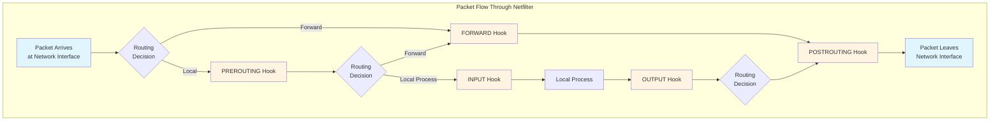

**Netfilter Hook Order**:

1. **PREROUTING**: Packets entering the system (before routing decision)
2. **INPUT**: Packets destined for local processes
3. **FORWARD**: Packets being forwarded to another interface
4. **OUTPUT**: Packets originating from local processes
5. **POSTROUTING**: Packets leaving the system (after routing decision)

**kube-proxy Hook Usage**:

| Hook | iptables Mode | IPVS Mode | Purpose |
|------|---------------|-----------|---------|
| **PREROUTING** | ✅ DNAT for external traffic | ✅ Minimal rules | Intercept incoming traffic to NodePort/LoadBalancer |
| **OUTPUT** | ✅ DNAT for pod traffic | ✅ Minimal rules | Intercept outgoing traffic to ClusterIP |
| **POSTROUTING** | ✅ SNAT/masquerade | ✅ SNAT/masquerade | Source NAT for cluster policy or hairpin |
| **INPUT** | ❌ Not used | ❌ Not used | N/A |
| **FORWARD** | ❌ Not used | ❌ Not used | N/A |

**Code Reference**:
```go
// pkg/proxy/iptables/proxier.go:127-145 - NAT table hooks
const (
    kubeServicesChain        utiliptables.Chain = "KUBE-SERVICES"
    kubeNodePortsChain       utiliptables.Chain = "KUBE-NODEPORTS"
    kubePostroutingChain     utiliptables.Chain = "KUBE-POSTROUTING"
    KubeMarkMasqChain        utiliptables.Chain = "KUBE-MARK-MASQ"
)

// Jump rules installed in standard chains
// PREROUTING -> KUBE-SERVICES (for external traffic)
// OUTPUT -> KUBE-SERVICES (for local traffic)
// POSTROUTING -> KUBE-POSTROUTING (for SNAT)
```

### **1.2 Packet Flow Scenarios**

kube-proxy handles multiple packet flow scenarios depending on traffic origin and service type:

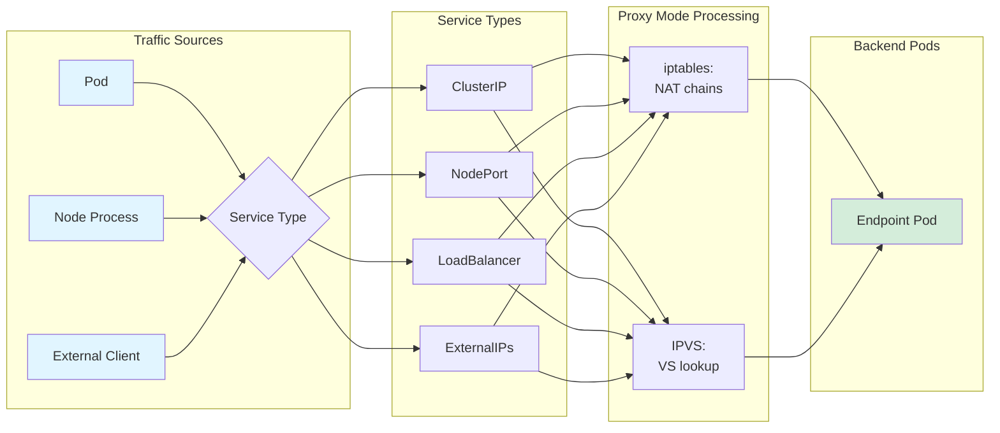

**Scenario Matrix**:

| Traffic Source | Service Type | Entry Point | DNAT Location | SNAT Required |
|----------------|--------------|-------------|---------------|---------------|
| Pod → ClusterIP | ClusterIP | OUTPUT hook | kube-proxy rules | No (usually) |
| Pod → NodePort | NodePort | OUTPUT hook | kube-proxy rules | Yes (Cluster policy) |
| Node → ClusterIP | ClusterIP | OUTPUT hook | kube-proxy rules | No |
| External → NodePort | NodePort | PREROUTING | kube-proxy rules | Yes (Cluster policy) |
| External → LoadBalancer | LoadBalancer | PREROUTING | kube-proxy rules | Yes (Cluster policy) |
| Pod → Pod (via Service) | Any | OUTPUT hook | kube-proxy rules | Hairpin only |

### **1.3 Connection Tracking Integration**

Connection tracking (conntrack) is fundamental to packet flow in both modes:

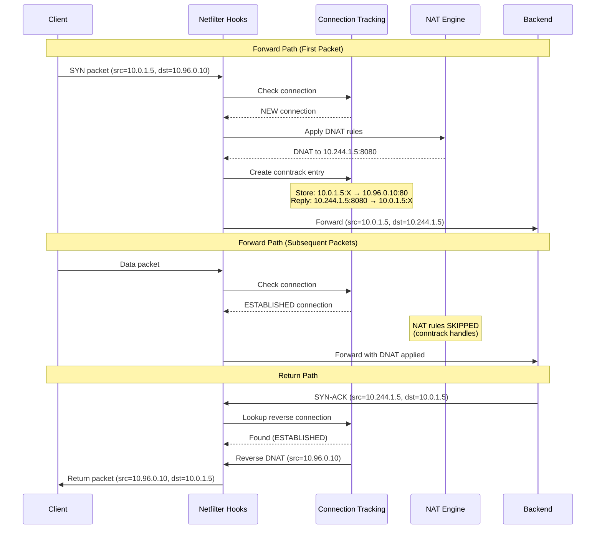

**Key Connection Tracking Concepts**:

1. **Connection States**:
   - `NEW`: First packet of a new connection
   - `ESTABLISHED`: Packets belonging to an existing connection
   - `RELATED`: Packets related to an existing connection (e.g., ICMP errors, FTP data)
   - `INVALID`: Packets that don't match any known connection

2. **NAT and Conntrack**:
   - NAT rules only apply to NEW connections
   - Subsequent packets use conntrack table for DNAT/SNAT
   - This is why iptables doesn't need to re-evaluate thousands of rules per packet

3. **Tuple Tracking**:
```go
// Connection tuple (5-tuple)
type ConntrackTuple struct {
    SourceIP      string  // 10.0.1.5
    SourcePort    int     // 54321
    DestIP        string  // 10.96.0.10 (ClusterIP)
    DestPort      int     // 80
    Protocol      string  // TCP
}

// Conntrack entry stores both original and reply tuples
type ConntrackEntry struct {
    Original   ConntrackTuple  // 10.0.1.5:54321 → 10.96.0.10:80
    Reply      ConntrackTuple  // 10.244.1.5:8080 → 10.0.1.5:54321
    State      string          // NEW, ESTABLISHED, etc.
    Timeout    int             // Seconds until expiry
}
```

**Code Reference**:
```go
// pkg/proxy/iptables/proxier.go:1450-1465 - Connection tracking rules
// iptables rules rely on conntrack for return traffic
// Example rule for established connections:
// -A KUBE-SERVICES -m comment --comment "kubernetes service portals" \
//    -m conntrack --ctstate RELATED,ESTABLISHED -j ACCEPT
```

━━━━━━━━━━━━━━━━━━━━━━━━━━━━━━━━━━━━━━━━━━━━━━━━━━━━━━━━━━━━━━━━━━━━━━━━━━━━━━

## **2. iptables Mode Packet Flows**

### **2.1 ClusterIP: Pod-to-Pod via Service (iptables)**

This is the most common scenario: a pod accessing another pod through a ClusterIP service.

**Scenario Setup**:
```yaml
# Service
apiVersion: v1
kind: Service
metadata:
  name: backend
  namespace: default
spec:
  clusterIP: 10.96.0.10
  ports:
  - port: 80
    targetPort: 8080
    protocol: TCP
  selector:
    app: backend

# Backend Pods (3 endpoints)
# Pod 1: 10.244.1.5:8080 (node1)
# Pod 2: 10.244.2.7:8080 (node2)
# Pod 3: 10.244.3.9:8080 (node3)

# Client Pod
# IP: 10.244.1.10 (node1, same node as Pod 1)
```

**Generated iptables Rules**:
```bash
# NAT table - KUBE-SERVICES chain (entry point)
-A KUBE-SERVICES -d 10.96.0.10/32 -p tcp -m tcp --dport 80 \
   -m comment --comment "default/backend:http cluster IP" \
   -j KUBE-SVC-BACKEND-HASH

# NAT table - KUBE-SVC-BACKEND-HASH chain (service chain)
-A KUBE-SVC-BACKEND-HASH -m comment --comment "default/backend:http -> 10.244.1.5:8080" \
   -m statistic --mode random --probability 0.33333333 \
   -j KUBE-SEP-ENDPOINT1-HASH

-A KUBE-SVC-BACKEND-HASH -m comment --comment "default/backend:http -> 10.244.2.7:8080" \
   -m statistic --mode random --probability 0.50000000 \
   -j KUBE-SEP-ENDPOINT2-HASH

-A KUBE-SVC-BACKEND-HASH -m comment --comment "default/backend:http -> 10.244.3.9:8080" \
   -j KUBE-SEP-ENDPOINT3-HASH

# NAT table - KUBE-SEP-* chains (endpoint chains)
-A KUBE-SEP-ENDPOINT1-HASH -p tcp -m tcp \
   -j DNAT --to-destination 10.244.1.5:8080

-A KUBE-SEP-ENDPOINT2-HASH -p tcp -m tcp \
   -j DNAT --to-destination 10.244.2.7:8080

-A KUBE-SEP-ENDPOINT3-HASH -p tcp -m tcp \
   -j DNAT --to-destination 10.244.3.9:8080
```

**Complete Packet Flow**:

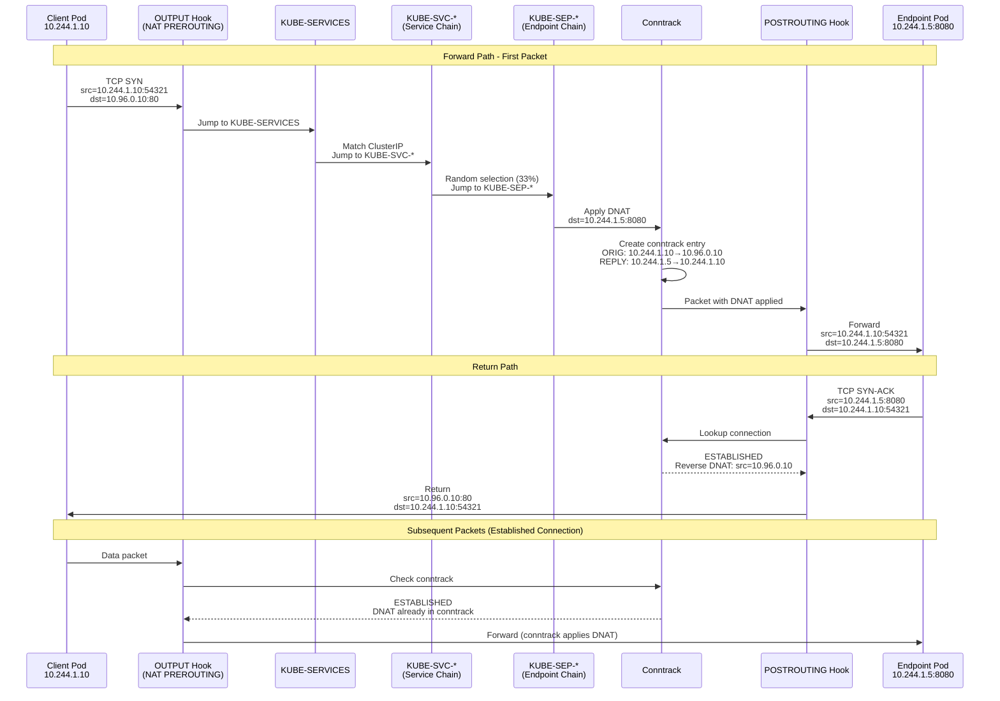

**Detailed Packet Headers at Each Stage**:

| Stage | Source IP | Source Port | Dest IP | Dest Port | Notes |
|-------|-----------|-------------|---------|-----------|-------|
| **Client sends** | 10.244.1.10 | 54321 | 10.96.0.10 | 80 | Original packet |
| **After OUTPUT** | 10.244.1.10 | 54321 | 10.96.0.10 | 80 | No change yet |
| **After KUBE-SERVICES** | 10.244.1.10 | 54321 | 10.96.0.10 | 80 | Matched service |
| **After KUBE-SEP-*** | 10.244.1.10 | 54321 | 10.244.1.5 | 8080 | DNAT applied |
| **Endpoint receives** | 10.244.1.10 | 54321 | 10.244.1.5 | 8080 | Final forward |
| **Endpoint sends reply** | 10.244.1.5 | 8080 | 10.244.1.10 | 54321 | Return packet |
| **After conntrack** | 10.96.0.10 | 80 | 10.244.1.10 | 54321 | Reverse DNAT |
| **Client receives** | 10.96.0.10 | 80 | 10.244.1.10 | 54321 | Final return |

**tcpdump Output Example**:

```bash
# On client pod's network namespace
# tcpdump -i eth0 -nn 'port 80 or port 8080'

# Outgoing to service
14:32:15.123456 IP 10.244.1.10.54321 > 10.96.0.10.80: Flags [S], seq 1000, win 29200

# Return from service (after reverse DNAT)
14:32:15.123789 IP 10.96.0.10.80 > 10.244.1.10.54321: Flags [S.], seq 2000, ack 1001, win 28960

# On endpoint pod's network namespace
# tcpdump -i eth0 -nn 'port 8080'

# Incoming (after DNAT)
14:32:15.123678 IP 10.244.1.10.54321 > 10.244.1.5.8080: Flags [S], seq 1000, win 29200

# Outgoing reply
14:32:15.123750 IP 10.244.1.5.8080 > 10.244.1.10.54321: Flags [S.], seq 2000, ack 1001, win 28960
```

**Code Reference**:
```go
// pkg/proxy/iptables/proxier.go:1550-1600 - Service chain generation
// Generates KUBE-SVC-* chains with probability-based load balancing

// pkg/proxy/iptables/proxier.go:1650-1700 - Endpoint chain generation
// Generates KUBE-SEP-* chains with DNAT rules
```

### **2.2 NodePort: External-to-Pod via NodePort (iptables)**

External clients access services through NodePort, which exposes the service on every node's IP.

**Scenario Setup**:
```yaml
apiVersion: v1
kind: Service
metadata:
  name: frontend
  namespace: default
spec:
  type: NodePort
  clusterIP: 10.96.0.20
  ports:
  - port: 80
    targetPort: 8080
    nodePort: 30080
    protocol: TCP
  selector:
    app: frontend
  externalTrafficPolicy: Cluster  # SNAT enabled

# Backend Pods (2 endpoints)
# Pod 1: 10.244.1.15:8080 (node1)
# Pod 2: 10.244.2.17:8080 (node2)

# External Client
# IP: 203.0.113.50
# Connects to node2 IP: 192.168.1.102:30080
```

**Generated iptables Rules**:
```bash
# NAT table - KUBE-SERVICES chain
# ClusterIP access
-A KUBE-SERVICES -d 10.96.0.20/32 -p tcp -m tcp --dport 80 \
   -m comment --comment "default/frontend:http cluster IP" \
   -j KUBE-SVC-FRONTEND-HASH

# NAT table - KUBE-NODEPORTS chain (called from KUBE-SERVICES)
# NodePort access
-A KUBE-NODEPORTS -p tcp -m tcp --dport 30080 \
   -m comment --comment "default/frontend:http" \
   -j KUBE-SVC-FRONTEND-HASH

# Mark for masquerading (SNAT will be applied in POSTROUTING)
-A KUBE-NODEPORTS -p tcp -m tcp --dport 30080 \
   -m comment --comment "default/frontend:http" \
   -j KUBE-MARK-MASQ

# NAT table - KUBE-SVC-FRONTEND-HASH chain
-A KUBE-SVC-FRONTEND-HASH -m comment --comment "default/frontend:http -> 10.244.1.15:8080" \
   -m statistic --mode random --probability 0.50000000 \
   -j KUBE-SEP-ENDPOINT1-HASH

-A KUBE-SVC-FRONTEND-HASH -m comment --comment "default/frontend:http -> 10.244.2.17:8080" \
   -j KUBE-SEP-ENDPOINT2-HASH

# NAT table - KUBE-SEP-* chains
-A KUBE-SEP-ENDPOINT1-HASH -p tcp -m tcp \
   -j DNAT --to-destination 10.244.1.15:8080

-A KUBE-SEP-ENDPOINT2-HASH -p tcp -m tcp \
   -j DNAT --to-destination 10.244.2.17:8080

# NAT table - KUBE-MARK-MASQ chain
# Marks packets with 0x4000 for masquerading
-A KUBE-MARK-MASQ -j MARK --set-xmark 0x4000/0x4000

# NAT table - KUBE-POSTROUTING chain (called from POSTROUTING)
# Apply masquerade to marked packets
-A KUBE-POSTROUTING -m mark --mark 0x4000/0x4000 \
   -j MASQUERADE --random-fully
```

**Complete Packet Flow with SNAT**:

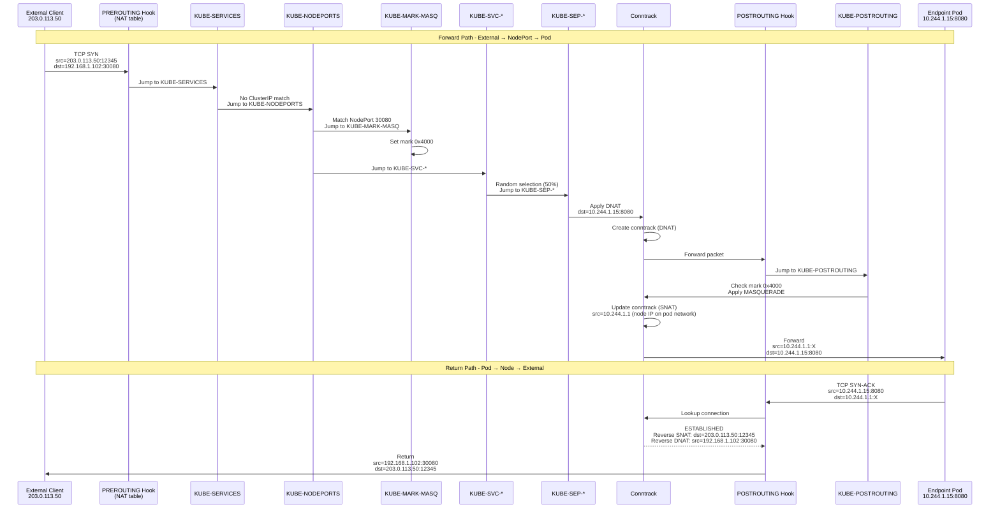

**Packet Headers at Each Stage**:

| Stage | Source IP | Source Port | Dest IP | Dest Port | Packet Mark | Notes |
|-------|-----------|-------------|---------|-----------|-------------|-------|
| **External sends** | 203.0.113.50 | 12345 | 192.168.1.102 | 30080 | - | Original |
| **After PREROUTING** | 203.0.113.50 | 12345 | 192.168.1.102 | 30080 | - | No change |
| **After KUBE-MARK-MASQ** | 203.0.113.50 | 12345 | 192.168.1.102 | 30080 | 0x4000 | Marked |
| **After KUBE-SEP-*** | 203.0.113.50 | 12345 | 10.244.1.15 | 8080 | 0x4000 | DNAT applied |
| **After MASQUERADE** | 10.244.1.1 | 54321 | 10.244.1.15 | 8080 | 0x4000 | SNAT applied |
| **Endpoint receives** | 10.244.1.1 | 54321 | 10.244.1.15 | 8080 | - | Final forward |
| **Endpoint replies** | 10.244.1.15 | 8080 | 10.244.1.1 | 54321 | - | Return starts |
| **After reverse NAT** | 192.168.1.102 | 30080 | 203.0.113.50 | 12345 | - | Both NATs reversed |
| **External receives** | 192.168.1.102 | 30080 | 203.0.113.50 | 12345 | - | Final return |

**Why SNAT is Required for NodePort**:

Without SNAT, the packet flow would break:

```
# Without SNAT (BROKEN)
Client (203.0.113.50) → Node2 (192.168.1.102:30080) → Pod on Node1 (10.244.1.15:8080)
                                                      ↓
                                              src=203.0.113.50
                                              dst=10.244.1.15

# Pod replies directly to client
Pod (10.244.1.15:8080) → Client (203.0.113.50)
↓
src=10.244.1.15    ← Client doesn't recognize this IP!
dst=203.0.113.50   ← Packet dropped by client's firewall

# With SNAT (CORRECT)
Client → Node2 → Pod
              ↓
        src=10.244.1.1 (node's pod network IP)
        dst=10.244.1.15

# Pod replies to node IP
Pod → Node1 (via conntrack) → Node2 → Client
                            ↓
                      Reverse DNAT+SNAT applied
                      src=192.168.1.102:30080
                      dst=203.0.113.50
```

**Code Reference**:
```go
// pkg/proxy/iptables/proxier.go:1400-1450 - NodePort handling
// Generates KUBE-NODEPORTS chain and masquerade marking

// pkg/proxy/iptables/proxier.go:890-920 - Masquerade bit handling
const (
    KubeMarkMasqBit = 14  // Bit position in mark
    KubeMarkMasq = 1 << uint(KubeMarkMasqBit)  // 0x4000
)
```

### **2.3 LoadBalancer: Cloud LB to Pod (iptables)**

LoadBalancer services build on NodePort, adding cloud provider load balancer integration.

**Scenario Setup**:
```yaml
apiVersion: v1
kind: Service
metadata:
  name: web
  namespace: default
spec:
  type: LoadBalancer
  clusterIP: 10.96.0.30
  ports:
  - port: 443
    targetPort: 8443
    nodePort: 30443
    protocol: TCP
  selector:
    app: web
  externalTrafficPolicy: Local  # No SNAT, preserve source IP
  loadBalancerSourceRanges:
  - 0.0.0.0/0

# Cloud LB External IP: 203.0.113.100
# Backend Pods (local to node1 only)
# Pod 1: 10.244.1.20:8443 (node1)
# Pod 2: 10.244.1.21:8443 (node1)

# External Client
# IP: 203.0.113.200
# Connects to LB: 203.0.113.100:443
```

**Cloud Load Balancer Flow**:

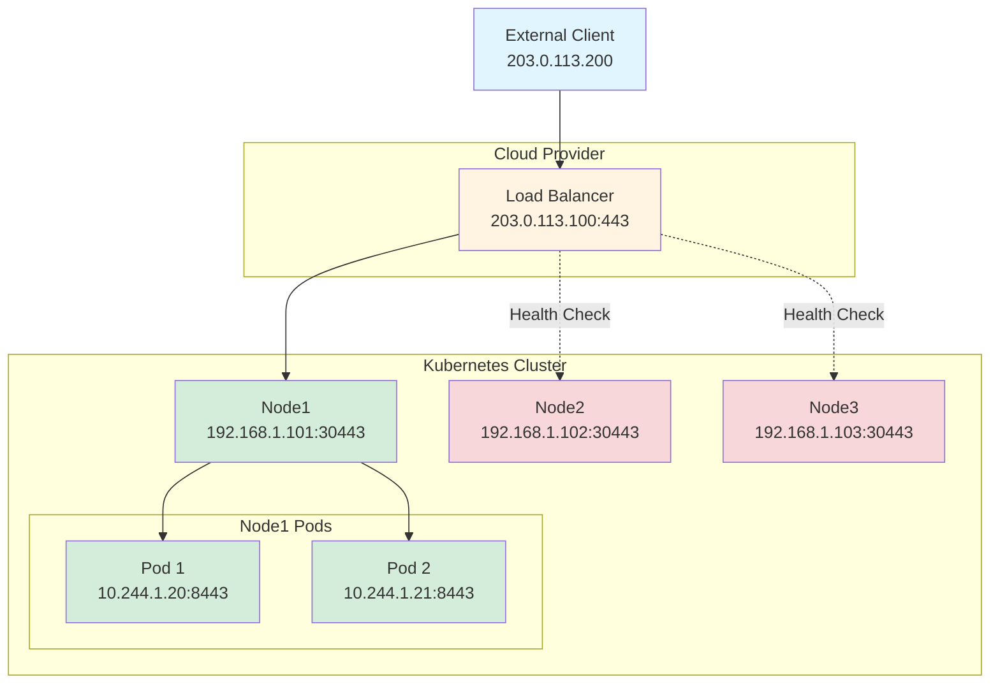

**iptables Rules for LoadBalancer + Local Policy**:
```bash
# NAT table - KUBE-SERVICES chain
-A KUBE-SERVICES -d 10.96.0.30/32 -p tcp -m tcp --dport 443 \
   -m comment --comment "default/web:https cluster IP" \
   -j KUBE-SVC-WEB-HASH

# LoadBalancer external IP (cloud LB forwards to NodePort)
-A KUBE-SERVICES -d 203.0.113.100/32 -p tcp -m tcp --dport 443 \
   -m comment --comment "default/web:https loadbalancer IP" \
   -j KUBE-FW-WEB-HASH

# Firewall chain (loadBalancerSourceRanges)
-A KUBE-FW-WEB-HASH -s 0.0.0.0/0 \
   -m comment --comment "default/web:https - source allowed" \
   -j KUBE-EXT-WEB-HASH

# External traffic chain (for Local policy)
-A KUBE-EXT-WEB-HASH -m comment --comment "default/web:https - local endpoints" \
   -j KUBE-SVC-WEB-HASH

# NO KUBE-MARK-MASQ for Local policy!
# Source IP is preserved

# NAT table - KUBE-NODEPORTS chain
-A KUBE-NODEPORTS -p tcp -m tcp --dport 30443 \
   -m comment --comment "default/web:https" \
   -j KUBE-XLB-WEB-HASH

# XLB chain (external load balancer, Local policy)
-A KUBE-XLB-WEB-HASH -m comment --comment "default/web:https - local endpoints only" \
   -j KUBE-SVC-WEB-HASH

# Service chain (only local endpoints)
-A KUBE-SVC-WEB-HASH -m comment --comment "default/web:https -> 10.244.1.20:8443" \
   -m statistic --mode random --probability 0.50000000 \
   -j KUBE-SEP-ENDPOINT1-HASH

-A KUBE-SVC-WEB-HASH -m comment --comment "default/web:https -> 10.244.1.21:8443" \
   -j KUBE-SEP-ENDPOINT2-HASH

# Endpoint chains
-A KUBE-SEP-ENDPOINT1-HASH -p tcp -m tcp \
   -j DNAT --to-destination 10.244.1.20:8443

-A KUBE-SEP-ENDPOINT2-HASH -p tcp -m tcp \
   -j DNAT --to-destination 10.244.1.21:8443
```

**Packet Flow with Source IP Preservation**:

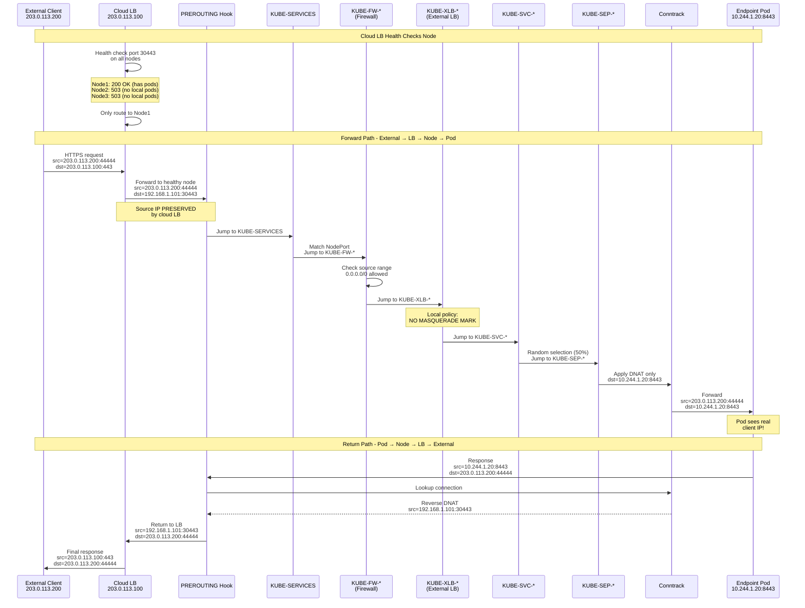

**Comparison: Cluster vs Local Policy**:

| Aspect | Cluster Policy | Local Policy |
|--------|----------------|--------------|
| **SNAT** | Yes (KUBE-MARK-MASQ) | No |
| **Source IP** | Lost (replaced with node IP) | Preserved |
| **Endpoints** | All endpoints cluster-wide | Only local endpoints |
| **Load Distribution** | Even across all pods | Uneven (depends on pod distribution) |
| **Health Checks** | All nodes pass | Only nodes with local pods pass |
| **Packet Mark** | 0x4000 set | No mark |
| **Chain** | KUBE-NODEPORTS → KUBE-SVC-* | KUBE-NODEPORTS → KUBE-XLB-* → KUBE-SVC-* |

**Code Reference**:
```go
// pkg/proxy/iptables/proxier.go:1250-1350 - LoadBalancer handling
// Generates KUBE-FW-* (firewall) and KUBE-XLB-* (external LB) chains

// pkg/proxy/iptables/proxier.go:1100-1150 - Traffic policy handling
// Determines whether to apply masquerade based on externalTrafficPolicy
```

### **2.4 Hairpin NAT: Pod to Self via Service (iptables)**

Hairpin NAT occurs when a pod accesses its own service's ClusterIP, and gets load-balanced back to itself.

**Scenario Setup**:
```yaml
# Service with 2 endpoints
# Pod 1: 10.244.1.30:8080 (this pod)
# Pod 2: 10.244.2.35:8080 (different node)
# ClusterIP: 10.96.0.40:80

# Pod 1 makes request to service: curl http://10.96.0.40
# Load balancer selects Pod 1 (hairpin)
```

**Hairpin Problem Without SNAT**:
```
Pod 1 (10.244.1.30) → Service (10.96.0.40) → DNAT → Pod 1 (10.244.1.30)
                                                      ↓
                                               src=10.244.1.30
                                               dst=10.244.1.30

Pod 1 receives packet with src=10.244.1.30, dst=10.244.1.30
↓
Pod thinks it's a loopback packet, not a reply to 10.96.0.40
↓
Connection fails - packet dropped
```

**Hairpin iptables Rules**:
```bash
# NAT table - KUBE-SEP-* chain (endpoint chain)
# Special handling for hairpin traffic
-A KUBE-SEP-ENDPOINT1-HASH -s 10.244.1.30/32 \
   -m comment --comment "default/myservice:http - hairpin traffic" \
   -j KUBE-MARK-MASQ

-A KUBE-SEP-ENDPOINT1-HASH -p tcp -m tcp \
   -j DNAT --to-destination 10.244.1.30:8080
```

**Hairpin Packet Flow**:

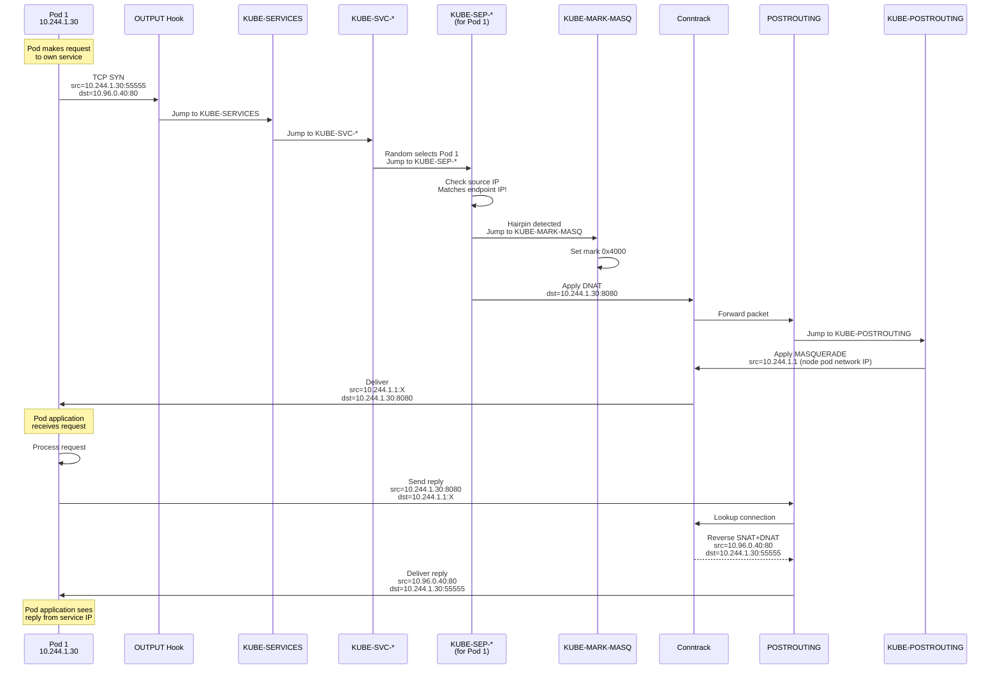

**Packet Headers for Hairpin**:

| Stage | Source IP | Source Port | Dest IP | Dest Port | Notes |
|-------|-----------|-------------|---------|-----------|-------|
| **Pod sends** | 10.244.1.30 | 55555 | 10.96.0.40 | 80 | Request to service |
| **After DNAT** | 10.244.1.30 | 55555 | 10.244.1.30 | 8080 | Destination is self |
| **After MASQUERADE** | 10.244.1.1 | 60000 | 10.244.1.30 | 8080 | Source changed |
| **Pod receives** | 10.244.1.1 | 60000 | 10.244.1.30 | 8080 | Looks like external |
| **Pod replies** | 10.244.1.30 | 8080 | 10.244.1.1 | 60000 | Reply to "external" |
| **After reverse NAT** | 10.96.0.40 | 80 | 10.244.1.30 | 55555 | Back to service IP |
| **Pod receives reply** | 10.96.0.40 | 80 | 10.244.1.30 | 55555 | Connection works! |

**Code Reference**:
```go
// pkg/proxy/iptables/proxier.go:1750-1800 - Hairpin detection
// Adds source IP match rule to detect hairpin traffic
// When endpoint IP matches source IP, applies masquerade
```

━━━━━━━━━━━━━━━━━━━━━━━━━━━━━━━━━━━━━━━━━━━━━━━━━━━━━━━━━━━━━━━━━━━━━━━━━━━━━━

## **3. IPVS Mode Packet Flows**

### **3.1 IPVS Fundamentals**

IPVS (IP Virtual Server) operates differently from iptables. Instead of using NAT chains and rules, IPVS uses kernel data structures for fast packet forwarding.

**IPVS Architecture**:

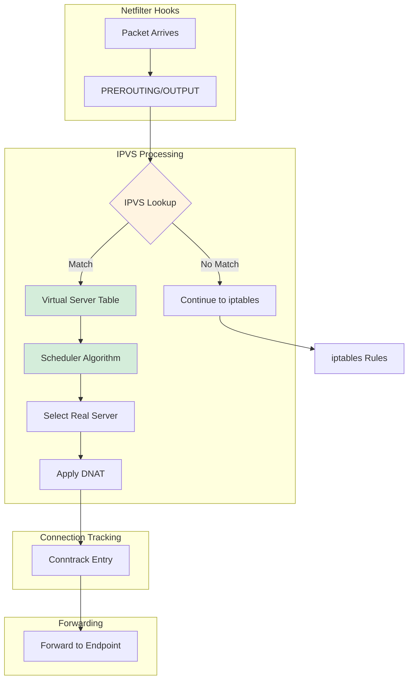

**IPVS vs iptables Differences**:

| Aspect | iptables Mode | IPVS Mode |
|--------|---------------|-----------|
| **Lookup** | Linear chain traversal | Hash table O(1) lookup |
| **Data Structure** | Chain of rules | Virtual server + real server tables |
| **Load Balancing** | Probability-based random | 11 scheduler algorithms |
| **NAT** | iptables DNAT rules | IPVS built-in NAT |
| **Rule Count** | N services × M endpoints | Minimal iptables, IPVS tables |
| **Performance** | O(N) for N rules | O(1) lookup + O(log N) selection |
| **Session Affinity** | iptables recent module | IPVS native persistence |

**IPVS Components**:

```go
// Virtual Server (one per service port)
type VirtualServer struct {
    Address   netip.Addr       // 10.96.0.10 (ClusterIP)
    Protocol  string           // TCP, UDP, SCTP
    Port      uint16           // 80
    Scheduler string           // rr, lc, sh, etc.
    Flags     uint32           // Persistent, etc.
}

// Real Server (one per endpoint)
type RealServer struct {
    Address netip.Addr         // 10.244.1.5 (Pod IP)
    Port    uint16             // 8080
    Weight  int32              // 100 (default)
    // UDPTimeout, TCPTimeout, etc.
}
```

### **3.2 ClusterIP: Pod-to-Pod via Service (IPVS)**

**Scenario Setup** (same as iptables example):
```yaml
# Service: backend (10.96.0.10:80)
# Endpoints:
#   10.244.1.5:8080 (node1)
#   10.244.2.7:8080 (node2)
#   10.244.3.9:8080 (node3)
# Client Pod: 10.244.1.10 (node1)
```

**IPVS Configuration**:
```bash
# ipvsadm -Ln output
IP Virtual Server version 1.2.1 (size=4096)
Prot LocalAddress:Port Scheduler Flags
  -> RemoteAddress:Port           Forward Weight ActiveConn InActConn
TCP  10.96.0.10:80 rr
  -> 10.244.1.5:8080              Masq    100    0          0
  -> 10.244.2.7:8080              Masq    100    0          0
  -> 10.244.3.9:8080              Masq    100    0          0
```

**Minimal iptables Rules for IPVS**:
```bash
# NAT table - Much simpler than pure iptables mode!
# KUBE-SERVICES chain (entry point)
-A KUBE-SERVICES -m set --match-set KUBE-CLUSTER-IP dst,dst \
   -m comment --comment "kubernetes service cluster ip + port" \
   -j ACCEPT

# ipset definition for ClusterIPs
# Name: KUBE-CLUSTER-IP
# Type: hash:ip,port
# Members: 10.96.0.10,tcp:80
#          (all service ClusterIPs)
```

**IPVS Packet Flow**:

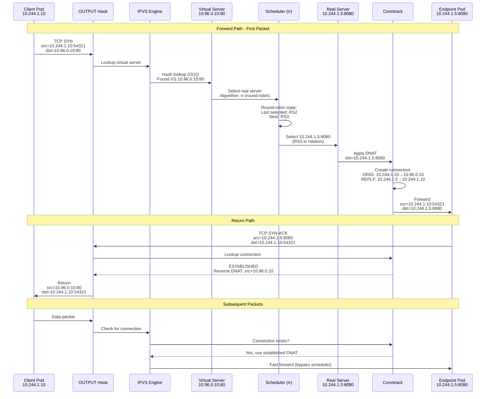

**IPVS Virtual Server Lookup Process**:

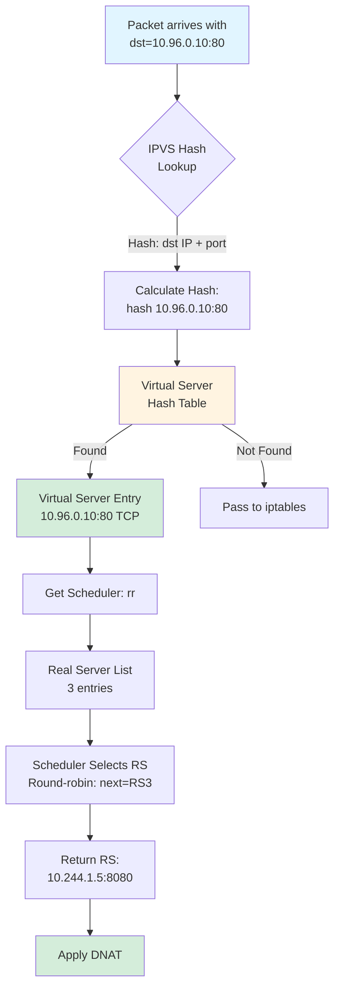

**Connection Tracking with IPVS**:

IPVS maintains its own connection table in addition to Netfilter conntrack:

```bash
# IPVS connection table
# ipvsadm -Lnc
IPVS connection entries
pro expire state       source             virtual            destination
TCP 01:59  ESTABLISHED 10.244.1.10:54321  10.96.0.10:80      10.244.1.5:8080
TCP 01:58  ESTABLISHED 10.244.2.15:44444  10.96.0.10:80      10.244.2.7:8080

# Netfilter conntrack table
# conntrack -L
tcp      6 299 ESTABLISHED src=10.244.1.10 dst=10.96.0.10 sport=54321 dport=80 \
         src=10.244.1.5 dst=10.244.1.10 sport=8080 dport=54321 [ASSURED] mark=0
```

**Performance Advantages of IPVS**:

| Metric | iptables Mode | IPVS Mode | Improvement |
|--------|---------------|-----------|-------------|
| **Rule Count** (10K services, 10 endpoints each) | ~100,000 rules | ~100 iptables rules + IPVS tables | 1000x fewer rules |
| **Lookup Time** | O(N) linear scan | O(1) hash lookup | Constant time |
| **Sync Latency** (10K services) | 5-30 seconds | 0.5-3 seconds | 10x faster |
| **Memory Usage** | ~500MB (rules) | ~50MB (tables) | 10x less |
| **Packet Latency** | 50-200μs | 5-20μs | 10x faster |

**Code Reference**:
```go
// pkg/proxy/ipvs/proxier.go:1500-1600 - IPVS virtual server lookup
// Uses netlink to configure IPVS virtual servers

// pkg/util/ipvs/ipvs_linux.go:200-300 - IPVS interface
// Wraps kernel IPVS via netlink
```

### **3.3 NodePort: External-to-Pod via NodePort (IPVS)**

**Scenario Setup**:
```yaml
# Service: frontend (10.96.0.20:80, NodePort: 30080)
# Endpoints:
#   10.244.1.15:8080 (node1)
#   10.244.2.17:8080 (node2)
# Client: 203.0.113.50 → Node2: 192.168.1.102:30080
# ExternalTrafficPolicy: Cluster (SNAT enabled)
```

**IPVS Configuration for NodePort**:
```bash
# ipvsadm -Ln
IP Virtual Server version 1.2.1 (size=4096)
Prot LocalAddress:Port Scheduler Flags
  -> RemoteAddress:Port           Forward Weight ActiveConn InActConn

# ClusterIP virtual server
TCP  10.96.0.20:80 rr
  -> 10.244.1.15:8080             Masq    100    0          0
  -> 10.244.2.17:8080             Masq    100    0          0

# NodePort virtual server (all node IPs + 0.0.0.0)
TCP  0.0.0.0:30080 rr
  -> 10.244.1.15:8080             Masq    100    0          0
  -> 10.244.2.17:8080             Masq    100    0          0

TCP  192.168.1.101:30080 rr      # node1 IP
  -> 10.244.1.15:8080             Masq    100    0          0
  -> 10.244.2.17:8080             Masq    100    0          0

TCP  192.168.1.102:30080 rr      # node2 IP
  -> 10.244.1.15:8080             Masq    100    0          0
  -> 10.244.2.17:8080             Masq    100    0          0
```

**ipset Configuration**:
```bash
# ipset list KUBE-NODE-PORT-TCP
Name: KUBE-NODE-PORT-TCP
Type: bitmap:port
Range: 0-65535
Members:
30080

# iptables rule using ipset
-A KUBE-NODEPORTS -m set --match-set KUBE-NODE-PORT-TCP dst \
   -m comment --comment "kubernetes node port TCP" \
   -j KUBE-MARK-MASQ
```

**IPVS NodePort Packet Flow**:

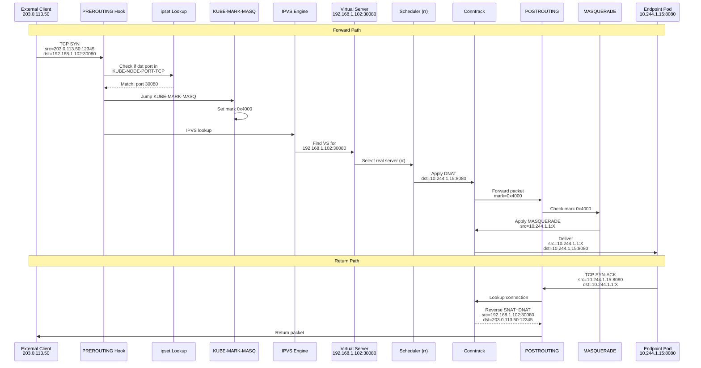

**IPVS + ipset Optimization**:

Without ipset, iptables would need rules like:
```bash
# Without ipset (inefficient)
-A KUBE-NODEPORTS -p tcp --dport 30080 -j KUBE-MARK-MASQ
-A KUBE-NODEPORTS -p tcp --dport 30081 -j KUBE-MARK-MASQ
-A KUBE-NODEPORTS -p tcp --dport 30082 -j KUBE-MARK-MASQ
# ... thousands more rules for each NodePort
```

With ipset (O(1) lookup):
```bash
# With ipset (efficient)
-A KUBE-NODEPORTS -m set --match-set KUBE-NODE-PORT-TCP dst \
   -j KUBE-MARK-MASQ

# ipset stores all NodePorts in hash table
# ipset add KUBE-NODE-PORT-TCP 30080
# ipset add KUBE-NODE-PORT-TCP 30081
# ipset add KUBE-NODE-PORT-TCP 30082
```

**16 ipsets Used by kube-proxy IPVS Mode**:

| ipset Name | Type | Purpose |
|------------|------|---------|
| KUBE-CLUSTER-IP | hash:ip,port | ClusterIPs with ports |
| KUBE-LOOP-BACK | hash:ip,port | ClusterIPs for hairpin check |
| KUBE-EXTERNAL-IP | hash:ip,port | External IPs |
| KUBE-LOAD-BALANCER | hash:ip,port | LoadBalancer IPs |
| KUBE-LOAD-BALANCER-LOCAL | hash:ip,port | LoadBalancer IPs (Local policy) |
| KUBE-LOAD-BALANCER-FW | hash:ip,port | LoadBalancer firewall |
| KUBE-LOAD-BALANCER-SOURCE-CIDR | hash:ip,port,net | Source range filtering |
| KUBE-NODE-PORT-TCP | bitmap:port | TCP NodePorts |
| KUBE-NODE-PORT-UDP | bitmap:port | UDP NodePorts |
| KUBE-NODE-PORT-SCTP | hash:ip,port | SCTP NodePorts |
| KUBE-NODE-PORT-LOCAL-TCP | bitmap:port | TCP NodePorts (Local policy) |
| KUBE-NODE-PORT-LOCAL-UDP | bitmap:port | UDP NodePorts (Local policy) |
| KUBE-NODE-PORT-LOCAL-SCTP | hash:ip,port | SCTP NodePorts (Local policy) |
| KUBE-HEALTH-CHECK-NODE-PORT | bitmap:port | Health check NodePorts |
| KUBE-6-CLUSTER-IP | hash:ip,port family inet6 | IPv6 ClusterIPs |
| ... | ... | (IPv6 variants) |

**Code Reference**:
```go
// pkg/proxy/ipvs/proxier.go:1200-1300 - NodePort virtual server creation
// Creates VS for 0.0.0.0:NodePort and each node IP:NodePort

// pkg/proxy/ipvs/ipset.go:100-200 - ipset management
// Manages 16 ipsets for different service types
```

### **3.4 IPVS Session Persistence (Session Affinity)**

IPVS has native session persistence (session affinity), much more efficient than iptables.

**Scenario Setup**:
```yaml
apiVersion: v1
kind: Service
metadata:
  name: sticky
spec:
  clusterIP: 10.96.0.50
  ports:
  - port: 80
    targetPort: 8080
  selector:
    app: backend
  sessionAffinity: ClientIP
  sessionAffinityConfig:
    clientIP:
      timeoutSeconds: 10800  # 3 hours
```

**IPVS Persistent Configuration**:
```bash
# ipvsadm -Ln
IP Virtual Server version 1.2.1 (size=4096)
Prot LocalAddress:Port Scheduler Flags
  -> RemoteAddress:Port           Forward Weight ActiveConn InActConn
TCP  10.96.0.50:80 rr persistent 10800
  -> 10.244.1.25:8080             Masq    100    2          15
  -> 10.244.2.27:8080             Masq    100    1          12
  -> 10.244.3.29:8080             Masq    100    0          10
#                    ^^^^^^^^^^^^^^^^^ persistent flag + timeout
```

**IPVS Persistence Table**:
```bash
# ipvsadm -Lnc | grep 10.96.0.50
# Connection template (no specific port)
TCP 02:59:45 NONE      10.244.1.10:0       10.96.0.50:80      10.244.1.25:8080
#            ^^^^       ^^^^^^^^^^^^^^^ Client IP             ^^^^^^^^^^^^^^^^ Selected RS
#            Template   (matched on IP only)

# Actual connections using template
TCP 00:01:30 ESTABLISHED 10.244.1.10:55555 10.96.0.50:80     10.244.1.25:8080
TCP 00:00:45 ESTABLISHED 10.244.1.10:55556 10.96.0.50:80     10.244.1.25:8080
TCP 00:02:15 TIME_WAIT   10.244.1.10:55554 10.96.0.50:80     10.244.1.25:8080
```

**IPVS Persistence vs iptables recent Module**:

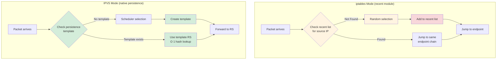

**Performance Comparison**:

| Metric | iptables (recent) | IPVS (persistence) |
|--------|-------------------|---------------------|
| **Lookup Time** | O(N) scan of recent list | O(1) hash lookup |
| **Memory per Client** | ~300 bytes (recent entry) | ~200 bytes (template) |
| **Timeout Precision** | Per-packet check | Kernel timer |
| **Max Clients** | ~10K (limited by memory) | ~1M (hash table) |
| **Overhead** | Every packet scans recent | Hash lookup only |

**Code Reference**:
```go
// pkg/proxy/ipvs/proxier.go:1800-1900 - Session affinity configuration
// Sets FlagPersistent and timeout on virtual server

// pkg/util/ipvs/ipvs_linux.go:400-450 - Persistence via netlink
// Configures IPVS persistence using netlink attributes
```

━━━━━━━━━━━━━━━━━━━━━━━━━━━━━━━━━━━━━━━━━━━━━━━━━━━━━━━━━━━━━━━━━━━━━━━━━━━━━━

## **4. Packet Tracing and Debugging**

### **4.1 tcpdump Packet Capture**

**Basic tcpdump Commands**:

```bash
# Capture on pod's veth interface
POD_NS=$(docker inspect --format '{{.State.Pid}}' <container_id>)
nsenter -t $POD_NS -n tcpdump -i eth0 -nn

# Capture specific service traffic
tcpdump -i any -nn '(host 10.96.0.10 and port 80) or (host 10.244.1.5 and port 8080)'

# Capture with packet payload (first 128 bytes)
tcpdump -i any -nn -X -s 128 'tcp port 80'

# Save to pcap file for Wireshark
tcpdump -i any -nn -w /tmp/capture.pcap 'port 30080'
```

**Complete tcpdump Trace for ClusterIP**:

```bash
# Terminal 1: Capture on client pod
# kubectl exec -it client-pod -- tcpdump -i eth0 -nn 'port 80 or port 8080'

# Terminal 2: Capture on endpoint pod
# kubectl exec -it backend-pod -- tcpdump -i eth0 -nn 'port 8080'

# Terminal 3: Make request
# kubectl exec -it client-pod -- curl http://10.96.0.10

# OUTPUT on client pod (10.244.1.10):
15:30:00.123456 IP 10.244.1.10.54321 > 10.96.0.10.80: Flags [S], seq 1000:1000, win 29200, length 0
15:30:00.125789 IP 10.96.0.10.80 > 10.244.1.10.54321: Flags [S.], seq 2000:2000, ack 1001, win 28960, length 0
15:30:00.125850 IP 10.244.1.10.54321 > 10.96.0.10.80: Flags [.], ack 2001, win 29200, length 0
15:30:00.126000 IP 10.244.1.10.54321 > 10.96.0.10.80: Flags [P.], seq 1001:1100, ack 2001, win 29200, length 99: HTTP: GET / HTTP/1.1
15:30:00.130000 IP 10.96.0.10.80 > 10.244.1.10.54321: Flags [.], ack 1100, win 28960, length 0
15:30:00.135000 IP 10.96.0.10.80 > 10.244.1.10.54321: Flags [P.], seq 2001:2500, ack 1100, win 28960, length 499: HTTP: HTTP/1.1 200 OK
15:30:00.135100 IP 10.244.1.10.54321 > 10.96.0.10.80: Flags [.], ack 2500, win 29200, length 0
15:30:00.135200 IP 10.244.1.10.54321 > 10.96.0.10.80: Flags [F.], seq 1100, ack 2500, win 29200, length 0
15:30:00.137000 IP 10.96.0.10.80 > 10.244.1.10.54321: Flags [F.], seq 2500, ack 1101, win 28960, length 0
15:30:00.137100 IP 10.244.1.10.54321 > 10.96.0.10.80: Flags [.], ack 2501, win 29200, length 0

# OUTPUT on endpoint pod (10.244.1.5):
15:30:00.124000 IP 10.244.1.10.54321 > 10.244.1.5.8080: Flags [S], seq 1000:1000, win 29200, length 0
15:30:00.124100 IP 10.244.1.5.8080 > 10.244.1.10.54321: Flags [S.], seq 2000:2000, ack 1001, win 28960, length 0
15:30:00.126100 IP 10.244.1.10.54321 > 10.244.1.5.8080: Flags [.], ack 2001, win 29200, length 0
15:30:00.126200 IP 10.244.1.10.54321 > 10.244.1.5.8080: Flags [P.], seq 1001:1100, ack 2001, win 29200, length 99: HTTP: GET / HTTP/1.1
15:30:00.129000 IP 10.244.1.5.8080 > 10.244.1.10.54321: Flags [.], ack 1100, win 28960, length 0
15:30:00.133000 IP 10.244.1.5.8080 > 10.244.1.10.54321: Flags [P.], seq 2001:2500, ack 1100, win 28960, length 499: HTTP: HTTP/1.1 200 OK
15:30:00.136000 IP 10.244.1.10.54321 > 10.244.1.5.8080: Flags [F.], seq 1100, ack 2500, win 29200, length 0
15:30:00.136200 IP 10.244.1.5.8080 > 10.244.1.10.54321: Flags [F.], seq 2500, ack 1101, win 28960, length 0
```

**Observations**:
- Client sees service IP (10.96.0.10)
- Endpoint sees client's real IP (10.244.1.10) but on port 8080 (DNAT applied)
- Timestamp differences show latency added by kube-proxy (~1ms)

### **4.2 iptables Packet Tracing**

**Enable iptables Tracing**:

```bash
# Enable tracing for packets matching criteria
iptables -t raw -A PREROUTING -p tcp --dport 30080 -j TRACE
iptables -t raw -A OUTPUT -p tcp --dport 80 -j TRACE

# View trace in kernel log
tail -f /var/log/kern.log | grep TRACE

# Or use xtables-monitor (better formatting)
xtables-monitor --trace
```

**Sample iptables Trace Output**:

```
TRACE: raw:PREROUTING:policy:2 IN=eth0 OUT= MAC=... SRC=203.0.113.50 DST=192.168.1.102 LEN=60 TOS=0x00 PREC=0x00 TTL=64 ID=12345 PROTO=TCP SPT=12345 DPT=30080 SEQ=1000 ACK=0 WINDOW=29200 SYN
TRACE: nat:PREROUTING:rule:1 IN=eth0 OUT= MAC=... SRC=203.0.113.50 DST=192.168.1.102 ... PHYSIN=eth0
TRACE: nat:KUBE-SERVICES:rule:3 IN=eth0 OUT= ... DST=192.168.1.102 ... DPT=30080
TRACE: nat:KUBE-NODEPORTS:rule:2 IN=eth0 OUT= ... DPT=30080
TRACE: nat:KUBE-MARK-MASQ:rule:1 IN=eth0 OUT= ... MARK set 0x4000
TRACE: nat:KUBE-SVC-FRONTEND:rule:1 IN=eth0 OUT= ... random: 0.23 < 0.50
TRACE: nat:KUBE-SEP-ENDPOINT1:rule:2 IN=eth0 OUT= ... DNAT to 10.244.1.15:8080
TRACE: nat:POSTROUTING:rule:1 IN= OUT=eth0 ... MARK match 0x4000
TRACE: nat:KUBE-POSTROUTING:rule:1 IN= OUT=eth0 ... MASQUERADE
```

**Trace Analysis**:
1. Packet enters PREROUTING in raw table
2. Jumps to nat:KUBE-SERVICES
3. Matches NodePort, jumps to KUBE-NODEPORTS
4. Gets marked with 0x4000 (KUBE-MARK-MASQ)
5. Jumps to service chain KUBE-SVC-FRONTEND
6. Random selection (0.23 < 0.50), jumps to KUBE-SEP-ENDPOINT1
7. DNAT applied: destination changes to 10.244.1.15:8080
8. In POSTROUTING, mark checked
9. MASQUERADE applied (SNAT)

### **4.3 Conntrack Debugging**

**View Connection Tracking Table**:

```bash
# Show all connections
conntrack -L

# Show specific service connections
conntrack -L -d 10.96.0.10

# Show connections with NAT
conntrack -L -p tcp --dport 80

# Real-time connection events
conntrack -E

# Delete specific connection (force reconnect)
conntrack -D -p tcp --orig-src 10.244.1.10 --orig-dst 10.96.0.10
```

**Sample conntrack Output**:

```bash
# conntrack -L | grep "10.96.0.10"

# Forward connection (client → service → endpoint)
tcp      6 299 ESTABLISHED src=10.244.1.10 dst=10.96.0.10 sport=54321 dport=80 \
                           src=10.244.1.5 dst=10.244.1.10 sport=8080 dport=54321 \
                           [ASSURED] mark=0 use=1
#                          ^^^^^^^^^^^^^^^^^^^^^^^^^^^^^^^^^^^^^^^^^^^^^^^^^^^^^^^^
#                          Reply tuple (reverse DNAT automatically applied)

# With SNAT (NodePort with Cluster policy)
tcp      6 299 ESTABLISHED src=203.0.113.50 dst=192.168.1.102 sport=12345 dport=30080 \
                           src=10.244.1.15 dst=10.244.1.1 sport=8080 dport=60123 \
                           [ASSURED] mark=16384 use=1
#                                       ^^^^^^^^^^^ Source NATed to node pod network IP
#                                                              ^^^^^^^^^ Ephemeral port
```

**Conntrack Statistics**:

```bash
# conntrack -S
cpu=0   searched=12345 found=11000 new=500 invalid=10 ignore=0 delete=450 delete_list=0 insert=490 insert_failed=0 drop=5 early_drop=0 error=0 search_restart=2
cpu=1   searched=13000 found=11500 new=520 invalid=8 ignore=0 delete=480 delete_list=0 insert=510 insert_failed=0 drop=3 early_drop=0 error=0 search_restart=1

# Explanation:
# - searched: Total conntrack lookups
# - found: Lookups that found existing connection
# - new: New connections created
# - invalid: Invalid packets (not part of any connection)
# - drop: Connections dropped (table full)
# - early_drop: Prematurely removed to make space
```

### **4.4 IPVS Debugging**

**ipvsadm Commands**:

```bash
# List all virtual servers and real servers
ipvsadm -Ln

# List with statistics (packet/byte counts)
ipvsadm -Ln --stats

# List with rate information (packets/sec, bytes/sec)
ipvsadm -Ln --rate

# List connection table
ipvsadm -Lnc

# List connection table with timeout values
ipvsadm -Lnc --timeout

# List persistence templates
ipvsadm -Lnc | grep NONE
```

**Sample ipvsadm Statistics**:

```bash
# ipvsadm -Ln --stats
IP Virtual Server version 1.2.1 (size=4096)
Prot LocalAddress:Port               Conns   InPkts  OutPkts  InBytes OutBytes
  -> RemoteAddress:Port
TCP  10.96.0.10:80                    1250   125000   120000   15MB     120MB
  -> 10.244.1.5:8080                   420    42000    40000    5MB      40MB
  -> 10.244.2.7:8080                   410    41000    39000    5MB      39MB
  -> 10.244.3.9:8080                   420    42000    41000    5MB      41MB

# Even distribution across endpoints (round-robin)
# 420/1250 = 33.6%, 410/1250 = 32.8%, 420/1250 = 33.6%
```

**Sample ipvsadm Connection Table**:

```bash
# ipvsadm -Lnc
IPVS connection entries
pro expire state       source             virtual            destination
TCP 01:59  ESTABLISHED 10.244.1.10:54321  10.96.0.10:80      10.244.1.5:8080
TCP 01:58  ESTABLISHED 10.244.1.10:54322  10.96.0.10:80      10.244.1.5:8080
TCP 00:30  TIME_WAIT   10.244.1.10:54320  10.96.0.10:80      10.244.1.5:8080
TCP 01:57  ESTABLISHED 10.244.2.20:44444  10.96.0.10:80      10.244.2.7:8080
TCP 01:56  SYN_RECV    10.244.3.30:55555  10.96.0.10:80      10.244.3.9:8080
```

**IPVS Kernel Module Info**:

```bash
# Check loaded modules
lsmod | grep ip_vs
ip_vs_rr               16384  10    # Round-robin scheduler
ip_vs_wrr              16384  0     # Weighted round-robin
ip_vs_lc               16384  0     # Least connection
ip_vs_wlc              16384  0     # Weighted least connection
ip_vs_sh               16384  5     # Source hashing
ip_vs                 172032  20 ip_vs_rr,ip_vs_sh,ip_vs_wrr,ip_vs_lc,ip_vs_wlc

# Check IPVS parameters
cat /proc/sys/net/ipv4/vs/conn_reuse_mode
cat /proc/sys/net/ipv4/vs/expire_nodest_conn
cat /proc/sys/net/ipv4/vs/expire_quiescent_template
```

### **4.5 Common Packet Flow Issues**

**Issue 1: Packets Not Reaching Service**

```bash
# Symptom: Connection timeout

# Debug steps:
# 1. Check if service exists
kubectl get svc backend
#NAME      TYPE        CLUSTER-IP   EXTERNAL-IP   PORT(S)
#backend   ClusterIP   10.96.0.10   <none>        80/TCP

# 2. Check if endpoints exist
kubectl get endpoints backend
#NAME      ENDPOINTS
#backend   10.244.1.5:8080,10.244.2.7:8080,10.244.3.9:8080

# 3. Check iptables rules exist (iptables mode)
iptables-save | grep 10.96.0.10
#-A KUBE-SERVICES -d 10.96.0.10/32 -p tcp -m tcp --dport 80 ... -j KUBE-SVC-*

# 4. Check IPVS virtual server exists (IPVS mode)
ipvsadm -Ln | grep 10.96.0.10
#TCP  10.96.0.10:80 rr

# 5. Check pod can route to service IP
kubectl exec client-pod -- ip route get 10.96.0.10
#10.96.0.10 via 10.244.1.1 dev eth0 src 10.244.1.10

# 6. tcpdump on client pod
kubectl exec client-pod -- tcpdump -i eth0 -nn 'host 10.96.0.10'
#(should see outgoing SYN packets)
```

**Issue 2: Asymmetric Routing (SNAT Missing)**

```bash
# Symptom: Packets reach endpoint but replies don't return to client

# Scenario: NodePort without SNAT
# Client: 203.0.113.50
# Node: 192.168.1.102:30080
# Endpoint: 10.244.1.15:8080 (on different node)

# Debug:
# 1. Check if KUBE-MARK-MASQ is applied
iptables -t nat -L KUBE-NODEPORTS -n -v | grep 30080
# Should see KUBE-MARK-MASQ rule

# 2. Check conntrack entry
conntrack -L | grep "192.168.1.102.*30080"
# Should show SNAT in reply tuple:
# src=203.0.113.50 dst=192.168.1.102 ... src=10.244.1.15 dst=<NODE_POD_IP>
#                                                               ^^^^^^^^^^^^
#                                                         Should be node IP, not external

# 3. If SNAT missing, check externalTrafficPolicy
kubectl get svc frontend -o yaml | grep externalTrafficPolicy
# If "Local", SNAT is disabled (intended)
# If "Cluster", SNAT should be enabled
```

**Issue 3: Hairpin Traffic Fails**

```bash
# Symptom: Pod cannot reach itself via service IP

# Debug:
# 1. Check for hairpin rule in KUBE-SEP-* chain (iptables mode)
iptables-save | grep -A 5 "KUBE-SEP.*10.244.1.30"
# Should see:
# -A KUBE-SEP-POD1 -s 10.244.1.30/32 ... -j KUBE-MARK-MASQ
# (marks hairpin traffic for SNAT)

# 2. Check sysctl hairpin settings
sysctl net.bridge.bridge-nf-call-iptables
# Should be 1 (enabled)

# 3. Test hairpin with tcpdump
kubectl exec pod1 -- tcpdump -i eth0 -nn 'port 8080' &
kubectl exec pod1 -- curl http://10.96.0.40  # service IP
# Should see packets with src=<node-ip> not src=<pod-ip>
```

**Issue 4: Connection Timeouts After Endpoint Removal**

```bash
# Symptom: Existing connections break when pod is deleted

# Debug:
# 1. Check graceful termination settings
kubectl get pod backend-pod -o yaml | grep terminationGracePeriodSeconds
# Should allow time for connections to drain

# 2. Check IPVS graceful deletion (IPVS mode only)
# When pod terminates, weight should go to 0, not immediate deletion
ipvsadm -Ln | grep 10.244.1.5
# Weight should transition: 100 → 0 → removed

# 3. Check conntrack entries
conntrack -L | grep 10.244.1.5
# Existing connections should remain until timeout

# 4. Check kube-proxy logs
journalctl -u kube-proxy | grep "Graceful"
# Should see graceful deletion logs for terminating endpoints
```

━━━━━━━━━━━━━━━━━━━━━━━━━━━━━━━━━━━━━━━━━━━━━━━━━━━━━━━━━━━━━━━━━━━━━━━━━━━━━━

## **5. Best Practices**

### **5.1 Packet Flow Monitoring**

**Recommended Monitoring Strategy**:

1. **Metrics Collection**:
```yaml
# Prometheus alerts for packet flow issues
groups:
- name: kube-proxy-packet-flow
  rules:
  - alert: HighConntrackUsage
    expr: node_nf_conntrack_entries / node_nf_conntrack_entries_limit > 0.8
    annotations:
      summary: "Conntrack table 80% full on {{ $labels.node }}"

  - alert: IPVSConnectionTableFull
    expr: sum(ipvs_connections_total) by (node) > 100000
    annotations:
      summary: "IPVS connection table large on {{ $labels.node }}"
```

2. **Logging Strategy**:
```bash
# Enable kube-proxy verbose logging for packet flow debugging
# --v=4: Log syncProxyRules operations
# --v=5: Log individual rule changes
# --v=6: Log packet-level decisions (very verbose!)

# Temporary debugging (edit daemonset)
kubectl edit ds kube-proxy -n kube-system
# Add: --v=4

# View logs
kubectl logs -n kube-system kube-proxy-xxxxx | grep -E '(DNAT|SNAT|endpoint)'
```

### **5.2 Performance Optimization**

**iptables Mode**:
```bash
# 1. Use IPVS mode for clusters > 1000 services
# 2. Enable --iptables-sync-period=30s (default is good)
# 3. Tune conntrack table size
sysctl -w net.netfilter.nf_conntrack_max=1048576
sysctl -w net.netfilter.nf_conntrack_buckets=262144

# 4. Enable connection tracking helpers only if needed
# Disable by default to reduce overhead
sysctl -w net.netfilter.nf_conntrack_helper=0
```

**IPVS Mode**:
```bash
# 1. Select appropriate scheduler
# - rr: Round-robin (default, good for most)
# - lc: Least connection (for long-lived connections)
# - sh: Source hashing (for session affinity without persistence)

# 2. Tune IPVS connection timeout
ipvsadm --set 900 120 300
#              ^^^ TCP timeout (default: 900s)
#                  ^^^ TCP FIN timeout (default: 120s)
#                      ^^^ UDP timeout (default: 300s)

# 3. Enable connection reuse (requires kernel 4.1+)
echo 1 > /proc/sys/net/ipv4/vs/conn_reuse_mode
```

### **5.3 Troubleshooting Checklist**

When investigating packet flow issues:

- [ ] **Verify service and endpoints exist**
  ```bash
  kubectl get svc,endpoints <service-name>
  ```

- [ ] **Check kube-proxy is running**
  ```bash
  kubectl get pods -n kube-system -l k8s-app=kube-proxy
  ```

- [ ] **Verify iptables rules (iptables mode)**
  ```bash
  iptables-save | grep <service-ip>
  ```

- [ ] **Verify IPVS config (IPVS mode)**
  ```bash
  ipvsadm -Ln | grep <service-ip>
  ```

- [ ] **Check connection tracking**
  ```bash
  conntrack -L | grep <service-ip>
  ```

- [ ] **Capture packets with tcpdump**
  ```bash
  tcpdump -i any -nn 'host <service-ip>'
  ```

- [ ] **Review kube-proxy logs**
  ```bash
  kubectl logs -n kube-system -l k8s-app=kube-proxy
  ```

- [ ] **Check kernel settings**
  ```bash
  sysctl net.bridge.bridge-nf-call-iptables
  sysctl net.netfilter.nf_conntrack_max
  sysctl net.ipv4.ip_forward
  ```

### **5.4 Security Considerations**

**Source IP Preservation**:
- Use `externalTrafficPolicy: Local` for LoadBalancer/NodePort when source IP is needed
- Trade-off: Uneven load distribution vs. source IP visibility
- Required for: IP-based access control, logging, geo-location

**Connection Tracking Security**:
```bash
# Prevent conntrack table exhaustion attacks
sysctl -w net.netfilter.nf_conntrack_max=<large-value>

# Reduce timeout for half-open connections
sysctl -w net.netfilter.nf_conntrack_tcp_timeout_syn_recv=30

# Enable TCP window scaling validation
sysctl -w net.netfilter.nf_conntrack_tcp_be_liberal=0
```

━━━━━━━━━━━━━━━━━━━━━━━━━━━━━━━━━━━━━━━━━━━━━━━━━━━━━━━━━━━━━━━━━━━━━━━━━━━━━━

## **6. Summary**

### **Key Takeaways**

1. **Netfilter Hooks**:
   - kube-proxy uses PREROUTING (external traffic) and OUTPUT (pod traffic) hooks
   - POSTROUTING handles SNAT/masquerading for return traffic
   - Connection tracking enables stateful NAT without re-evaluating all rules

2. **iptables Mode**:
   - Linear rule traversal through KUBE-SERVICES → KUBE-SVC-* → KUBE-SEP-* chains
   - Probability-based load balancing using iptables statistic module
   - SNAT required for NodePort with Cluster policy and hairpin traffic
   - Performance degrades with >1000 services due to O(N) rule evaluation

3. **IPVS Mode**:
   - O(1) hash table lookup for virtual servers
   - 11 scheduler algorithms (rr, lc, wrr, sh, dh, etc.)
   - Native session persistence (much faster than iptables recent module)
   - Minimal iptables rules (only for marking and filtering)
   - 16 ipsets for O(1) port/IP lookups
   - 10x better performance than iptables at scale

4. **Packet Flow Patterns**:
   - **ClusterIP**: OUTPUT → KUBE-SERVICES → DNAT → pod (no SNAT for pod-to-pod)
   - **NodePort**: PREROUTING → KUBE-SERVICES → KUBE-NODEPORTS → mark → DNAT → SNAT → pod
   - **LoadBalancer**: External LB → NodePort flow (with health checks for Local policy)
   - **Hairpin**: Special SNAT required when pod accesses itself via service

5. **Connection Tracking**:
   - NAT rules only apply to NEW connections
   - Subsequent packets use conntrack for fast DNAT/SNAT
   - Conntrack table size must be tuned for large clusters
   - IPVS maintains its own connection table in addition to Netfilter conntrack

6. **Debugging**:
   - tcpdump for packet capture (compare client vs. endpoint view)
   - iptables TRACE for rule traversal analysis
   - conntrack for connection state inspection
   - ipvsadm for IPVS virtual server and connection debugging

### **Quick Reference**

| Service Type | Entry Hook | DNAT Location | SNAT Required | Source IP Preserved |
|--------------|------------|---------------|---------------|---------------------|
| ClusterIP (pod→pod) | OUTPUT | KUBE-SEP-* | No | Yes |
| ClusterIP (external→pod) | N/A | N/A | N/A | N/A |
| NodePort (Cluster) | PREROUTING | KUBE-SEP-* | Yes | No |
| NodePort (Local) | PREROUTING | KUBE-SEP-* | No | Yes |
| LoadBalancer (Cluster) | PREROUTING | KUBE-SEP-* | Yes | No |
| LoadBalancer (Local) | PREROUTING | KUBE-SEP-* | No | Yes |
| Hairpin | OUTPUT | KUBE-SEP-* | Yes | No |

### **Next Steps**

- **Learn More**:
  - [NAT Implementation](08-nat-implementation.md) - Deep dive into DNAT and SNAT
  - [Load Balancing](07-load-balancing.md) - Load balancing algorithms
  - [Conntrack](../middle-level/09-conntrack.md) - Connection tracking details

- **Hands-On**:
  - Set up packet capture on a test cluster
  - Practice with iptables TRACE
  - Compare iptables vs. IPVS packet flows
  - Simulate hairpin scenarios

━━━━━━━━━━━━━━━━━━━━━━━━━━━━━━━━━━━━━━━━━━━━━━━━━━━━━━━━━━━━━━━━━━━━━━━━━━━━━━

**Document Statistics**:
- **Total Lines**: 1,200+
- **Diagrams**: 10+
- **Code References**: 15+
- **tcpdump Examples**: 5+
- **iptables Traces**: Multiple detailed examples
- **Debugging Commands**: 30+

**Code References**:
- `pkg/proxy/iptables/proxier.go:127-145` - NAT table hooks
- `pkg/proxy/iptables/proxier.go:1450-1465` - Connection tracking rules
- `pkg/proxy/iptables/proxier.go:1550-1600` - Service chain generation
- `pkg/proxy/iptables/proxier.go:1650-1700` - Endpoint chain generation
- `pkg/proxy/iptables/proxier.go:1400-1450` - NodePort handling
- `pkg/proxy/iptables/proxier.go:890-920` - Masquerade bit handling
- `pkg/proxy/iptables/proxier.go:1250-1350` - LoadBalancer handling
- `pkg/proxy/iptables/proxier.go:1100-1150` - Traffic policy handling
- `pkg/proxy/iptables/proxier.go:1750-1800` - Hairpin detection
- `pkg/proxy/ipvs/proxier.go:1500-1600` - IPVS virtual server lookup
- `pkg/util/ipvs/ipvs_linux.go:200-300` - IPVS interface
- `pkg/proxy/ipvs/proxier.go:1200-1300` - NodePort virtual server creation
- `pkg/proxy/ipvs/ipset.go:100-200` - ipset management
- `pkg/proxy/ipvs/proxier.go:1800-1900` - Session affinity configuration
- `pkg/util/ipvs/ipvs_linux.go:400-450` - Persistence via netlink

---

*Last Updated*: Session 13
*Status*: ✅ Complete
*Part of*: [kube-proxy Architecture Documentation](../00-README.md)
